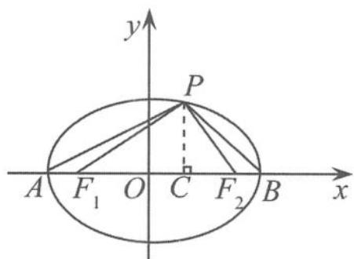

## 5.2.4 一类与定值 $\frac{2}{e}$ 有关的问题溯源

(1) 问题的精彩回放

例 4 已知中心在坐标原点,以坐标轴为对称轴的双曲线 C 过点 $Q\left(2,\frac{\sqrt{3}}{3}\right)$ ,且点 Q 在 x 轴上的射影恰好为该双曲线 C 的一个焦点 $F_{1}$ .

(I)求双曲线 C 的方程.

(Ⅱ)命题“过椭圆 $E: \frac{x^2}{25} + \frac{y^2}{16} = 1$ 的一个焦点 $F$ 作与 $x$ 轴不垂直的任意直线 $l$ , 交椭圆于 $A, B$ 两点, 线段 $AB$ 的垂直平分线交 $x$ 轴于点 $M$ , 则 $\frac{|AB|}{|FM|}$ 为定值, 且定值是 $\frac{10}{3}$ ”。命题中涉及了这么几个元素:给定的圆锥曲线 E, 过该圆锥曲线焦点 F 的弦 AB, AB 的垂直平分线与焦点所在的对称轴的交点 M, AB 的长度与焦点 F, M 两点间的距离的比值. 试类比上述命题, 写出一个关于双曲线 C 的类似的正确命题, 并加以证明.

(Ⅲ)试推广(Ⅱ)中的命题,写出关于圆锥曲线(椭圆、双曲线、抛物线)的统一的一般性命题.

解答 (I)由条件易得双曲线 $C$ 的方程为

$$
\frac {x ^ {2}}{3} - y ^ {2} = 1.
$$

(Ⅱ)关于双曲线 C 的类似的命题: 过双曲线 $\frac{x^{2}}{3}-y^{2}=1$ 的一个焦点 $F(2,0)$ 作与 x 轴不垂直的任意直线 l, 交双曲线于 A, B 两点, 线段 AB 的垂直平分线交 x 轴于点 M, 则 $\frac{|AB|}{|FM|}$ 为定值, 且定值是 $\sqrt{3}$ .

证明 由于直线 l 与 x 轴不垂直, 可设直线 l 的方程为

$$
y = k (x - 2).
$$

①当 $k = 0$ 时，直线 $l$ 与 $x$ 轴重合， $|AB| = 2\sqrt{3}$ ， $|FM| = 2$ ， $\frac{|AB|}{|FM|} = \sqrt{3}$ ，命题正确。

②当 $k \neq 0$ 时，由 $\left\{ \begin{array}{l} \frac{x^2}{3} - y^2 = 1, \\ y = k(x - 2) \end{array} \right.$ 得

$$
(1 - 3 k ^ {2}) x ^ {2} + 1 2 k ^ {2} x - 1 2 k ^ {2} - 3 = 0.
$$

依题意, 直线 l 与双曲线 C 有两个交点 A, B, 所以 $1 - 3k^{2} \neq 0, \Delta > 0$ . 设 $A(x_{1}, y_{1}), B(x_{2}, y_{2})$ , 则

$$
x _ {1} + x _ {2} = - \frac {1 2 k ^ {2}}{1 - 3 k ^ {2}}, x _ {1} x _ {2} = - \frac {1 2 k ^ {2} + 3}{1 - 3 k ^ {2}},
$$

从而

$$
y _ {1} + y _ {2} = k (x _ {1} + x _ {2} - 4) = - \frac {4 k}{1 - 3 k ^ {2}}.
$$

所以 $AB$ 的中点 $P$ 的坐标为 $\left(-\frac{6k^2}{1 - 3k^2}, - \frac{2k}{1 - 3k^2}\right), AB$ 的垂直平分线 $MP$ 的方程为

$$
y + \frac {2 k}{1 - 3 k ^ {2}} = \frac {- 1}{k} \left(x + \frac {6 k ^ {2}}{1 - 3 k ^ {2}}\right).
$$

令 $y = 0$ ，解得 $x = -\frac{8k^2}{1 - 3k^2}$ 即 $M\left(-\frac{8k^2}{1 - 3k^2},0\right)$ ，所以

$$
\mid F _ {1} M \mid = \left| 2 + \frac {8 k ^ {2}}{1 - 3 k ^ {2}} \right| = \frac {2 (1 + k ^ {2})}{\mid 1 - 3 k ^ {2} \mid}.
$$

又

$$
\vert A B \vert = \sqrt {1 + k ^ {2}} \left| x _ {1} - x _ {2} \right| = \sqrt {1 + k ^ {2}} \cdot \sqrt {\left(- \frac {1 2 k ^ {2}}{1 - 3 k ^ {2}}\right) ^ {2} - 4 \left(- \frac {1 2 k ^ {2} + 3}{1 - 3 k ^ {2}}\right)} = \frac {2 \sqrt {3} (1 + k ^ {2})}{\left| 1 - 3 k ^ {2} \right|},
$$

所以

$$
\frac {| A B |}{| F _ {1} M |} = \sqrt {3}.
$$

(Ⅲ)过圆锥曲线 E 的焦点 F 作与焦点所在的对称轴不垂直的任意直线 l，交曲线 E 于 A，B 两点，线段 AB 的垂直平分线交焦点所在的对称轴于点 M，则 $\frac{|AB|}{|FM|}$ 为定值，且定值是 $\frac{2}{e}$ .（其中 e 为圆锥曲线的离心率）

证明 不妨设 $AB$ 过圆锥曲线 $E$ 的左焦点弦, 以左焦点为极点、 $x$ 轴为极轴建立极坐标系,得极坐标方程

$$
\rho = \frac {e p}{1 - e \cos \theta},
$$

所以

$$
\vert A B \vert = \rho_ {1} + \rho_ {2} = \frac {2 e p}{1 - e ^ {2} \cos^ {2} \theta},
$$

$$
| F M | = \frac {1}{| \cos \theta |} \left| \frac {\rho_ {1} - \rho_ {2}}{2} \right| = \frac {e ^ {2} p}{1 - e ^ {2} \cos^ {2} \theta}.
$$

所以 $\frac{|AB|}{|FM|}$ 为定值 $\frac{2}{e}$ .

点评 这是一道彰显新课程理念的高考模拟试题,问题层层递进、环环相扣、由此及彼、由特殊到一般的设置,使得问题探究与合情推理融为一体,但不着痕迹.既让考生享受了学习的喜悦,又在不知不觉中撩开了数学试题的神秘面纱,同时也为考生揭示了数学问题研究的基本方法,为后续学习奠定基础.

## (2) 相关问题的探究

“以问题为载体,以知识为基础,以思维为主线,以能力为目标,全面考查学生的学习潜能”仍然是当前高考命题的一个重要方向.在学习中我们要充分挖掘试题所蕴含的丰富教学资源,以试题研究为阵地,利用问题的相似性和知识的系统性,我们可以把与此相关的问题进行归纳推理,以期对其一网打尽.其实,圆锥曲线还蕴含着许多与定值 $\frac{2}{e}$ 有关的问题,我们可以趁机对与定值 $\frac{2}{e}$ 有关的圆锥曲线问题做进一步探究,先对椭圆进行讨论,由此可以得到下面的一些性质.(本节所涉及的字母 $e$ 均为圆锥曲线的离心率)

## (i)与弦长相关的问题

性质1 若 $AB$ 是过椭圆 $\frac{x^2}{a^2} +\frac{y^2}{b^2} = 1(a > b > 0)$ 的焦点 $F$ 的焦点弦， $AB$ 的垂直平分线交 $x$ 轴于点 $M$ ，则 $\frac{|AB|}{|FM|}$ 为定值 $\frac{2}{e}$

性质2 若椭圆 $\frac{x^2}{a^2} +\frac{y^2}{b^2} = 1(a > b > 0)$ 的左焦点为 $F$ ，在 $x$ 轴上点 $F$ 右侧有一点 $A$ ，以 $FA$ 为直径作圆（半径为 $R$ )，与椭圆在 $x$ 轴上方部分交于 $M,N$ 两点，则 $\frac{|FM| + |FN|}{R}$ 为定值 $\frac{2}{e}$

证明 设椭圆的半焦距为 c，则圆的方程为

$$
[ x - (R - c) ] ^ {2} + y ^ {2} = R ^ {2},
$$

与椭圆方程联立得

$$
c ^ {2} x ^ {2} - 2 a ^ {2} (R - c) x + a ^ {2} \left(b ^ {2} + c ^ {2} - 2 R c\right) = 0.
$$

设 $M(x_{1},y_{1}),N(x_{2},y_{2})$ ，则

$$
x _ {1} + x _ {2} = \frac {2 a ^ {2} (R - c)}{c ^ {2}},
$$

所以由焦半径公式得

$$
| F M | + | F N | = (a + e x _ {1}) + (a + e x _ {2}) = 2 a + e (x _ {1} + x _ {2}) = \frac {2 a R}{c} = \frac {2 R}{e},
$$

从而

$$
\frac {| F M | + | F N |}{R} = \frac {2}{e}.
$$

性质3 若 $AB$ 为过椭圆 $\frac{x^2}{a^2} +\frac{y^2}{b^2} = 1(a > b > 0)$ 焦点 $F$ 的弦， $FM$ 为与焦点 $F$ 对应的焦准距，则 $\frac{|AB||FM|}{|FA||FB|}$ 为定值 $\frac{2}{e}$ .

证明 不妨设 $AB$ 为椭圆 $\frac{x^2}{a^2} +\frac{y^2}{b^2} = 1(a > b > 0)$ 的左焦点弦，以左焦点为极点、 $x$ 轴为极轴建立极坐标系，得极坐标方程为

$$
\rho = \frac {e p}{1 - e \cos \theta},
$$

其中 $|FM| = p$ ，则 $|FA| = \frac{ep}{1 - e\cos\theta}, |FB| = \frac{ep}{1 + e\cos\theta}$ 所以

$$
| A B | = | F A | + | F B | = \frac {2 e p}{1 - e ^ {2} \cos^ {2} \theta},
$$

$$
\mid F A \mid \mid F B \mid = \frac {e ^ {2} p ^ {2}}{1 - e ^ {2} \cos^ {2} \theta}.
$$

故 $\frac{|AB||FM|}{|FA||FB|}$ 为定值 $\frac{2}{e}$ .

## (ii)与角度相关的问题

性质 4 已知椭圆 $M: \frac{x^{2}}{a^{2}} + \frac{y^{2}}{b^{2}} = 1 (a > b > 0)$ 的左、右焦点分别为 $F_{1}, F_{2}$ ，椭圆 M 与 x 轴的两个交点分别为 A, B，点 P 是椭圆上的点（不与点 A, B 重合），且 $\angle APB = 2\alpha, \angle F_{1}PF_{2} = 2\beta.$ 证明： $\left|\tan\beta\tan2\alpha\right|$ 为定值 $\frac{2}{e}$ .

证明 如图 5.2-12, 不妨设点 $P(x, y)$ 在第一象限, 则在 $\triangle PF_{1}F_{2}$ 中,

$|F_{1}F_{2}|^{2}=|PF_{1}|^{2}+|PF_{2}|^{2}-2|PF_{1}||PF_{2}|\cos 2\beta,$ 所以 $|F_{1}F_{2}|^{2}=(|PF_{1}|+|PF_{2}|)^{2}-2|PF_{1}||PF_{2}|(1+\cos 2\beta)$ ，即 $4c^{2}=4a^{2}-2|PF_{1}||PF_{2}|(1+\cos 2\beta)$ ,

  
图5.2-12

所以

$$
\mid P F _ {1} \mid \mid P F _ {2} \mid = \frac {2 b ^ {2}}{1 + \cos 2 \beta} = \frac {2 b ^ {2}}{2 \cos^ {2} \beta} = \frac {b ^ {2}}{\dot {\cos} ^ {2} \beta},
$$

所以

$$
S _ {\triangle F _ {1} F _ {2} P} = \frac {1}{2} | P F _ {1} | | P F _ {2} | \sin 2 \beta = \frac {b ^ {2} \sin 2 \beta}{2 \cos^ {2} \beta} = \frac {b ^ {2} \sin \beta}{\cos \beta} = b ^ {2} \tan \beta .
$$

因为 $S_{\triangle F_1F_2P} = \frac{1}{2}\times 2c\times y = cy$ ，所以 $b^{2}\tan \beta = cy$ ，即

$$
\tan \beta = \frac {c y}{b ^ {2}}.
$$

作 $PC \perp x$ 轴，垂足为 $C$ 。因为 $\tan \angle APC = \frac{|AC|}{|PC|} = \frac{a + x}{y}$ ， $\tan \angle CPB = \frac{|CB|}{|PC|} = \frac{a - x}{y}$ ，所以

$$
\tan 2 \alpha = \tan (\angle A P C + \angle C P B) = \frac {\frac {a + x}{y} + \frac {a - x}{y}}{1 - \frac {a ^ {2} - x ^ {2}}{y ^ {2}}} = \frac {2 a y}{x ^ {2} + y ^ {2} - a ^ {2}}.
$$

因为 $\frac{x^2}{a^2} +\frac{y^2}{b^2} = 1$ ，所以

$$
x ^ {2} = a ^ {2} - \frac {a ^ {2} y ^ {2}}{b ^ {2}}.
$$

所以

$$
\tan 2 \alpha = \frac {2 a y}{x ^ {2} + y ^ {2} - a ^ {2}} = \frac {2 a}{\left(1 - \frac {a ^ {2}}{b ^ {2}}\right) y} = \frac {2 a b ^ {2}}{- c ^ {2} y},
$$

所以 $\tan \beta \tan 2\alpha = \frac{2}{-\frac{c}{a}} = \frac{2}{-e}$ . 因此 $|\tan \beta \tan 2\alpha|$ 为定值 $\frac{2}{e}$ .

上面只对椭圆的有关性质进行归纳推理,我们还要问在双曲线或抛物线中是否也有相应的性质?这样又可以进行类比推理.
