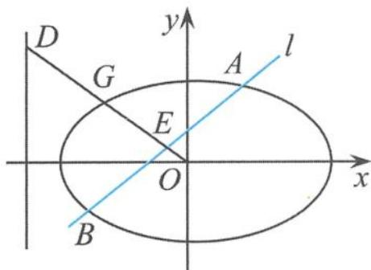

## 5.3.1 高考试题中圆锥曲线“伴侣点”的透视与剖析

高考试题是命题专家潜心研究、匠心独运的结果,所以高考试题有着其独特的魅力,如何发挥其潜在的价值,最大限度地提升学习效率,无疑是我们必须要思考的问题.如果能够立足问题的本质,对试题进行主动探究,将会提高我们的学习效率,提升我们的思维能力.

(1) 精彩回放、思维碰撞

例 1 如图 5.3-1, 在平面直角坐标系 $xOy$ 中, 已知椭圆 $C: \frac{x^2}{3} + y^2 = 1$ . 斜率为 $k (k > 0)$ 且不过原点的直线 $l$ 交椭圆 $C$ 于 $A, B$ 两点, 线段 $AB$ 的中点为 $E$ , 射线 $OE$ 交椭圆 $C$ 于点 $G$ , 交直线 $x = -3$ 于点 $D(-3, m)$ . 若 $|OG|^2 = |OD||OE|$ , 证明: 直线 $l$ 过定点.

  
图5.3-1

证明 由题意可设直线

$$
l: y = k x + n (n \neq 0).
$$

由 $\left\{\begin{aligned}y&=kx+n,\\ \frac{x^{2}}{3}&+y^{2}=1\end{aligned}\right.$ 消去 y 得

$$
(1 + 3 k ^ {2}) x ^ {2} + 6 k n x + 3 n ^ {2} - 3 = 0.
$$

设 $A(x_{1},y_{1}),B(x_{2},y_{2}),AB$ 的中点为 $E(x_0,y_0)$ ，则由韦达定理得

$$
x _ {1} + x _ {2} = \frac {- 6 k n}{1 + 3 k ^ {2}}.
$$

故 $x_0 = \frac{-3kn}{1 + 3k^2}, y_0 = kx_0 + n = \frac{-3kn}{1 + 3k^2} \cdot k + n = \frac{n}{1 + 3k^2}$ , 所以中点 $E$ 的坐标为

$$
E \left(\frac {- 3 k n}{1 + 3 k ^ {2}}, \frac {n}{1 + 3 k ^ {2}}\right).
$$

因为 O, E, D 三点在同一条直线上, 所以 $k_{OE} = k_{OD}$ , 即 $-\frac{1}{3k} = -\frac{m}{3}$ , 解得

$$
m = \frac {1}{k}.
$$

由题意知 n>0，因为直线 OD 的方程为

$$
y = - \frac {m}{3} x,
$$

所以由 $\left\{\begin{aligned}y&=-\frac{m}{3}x,\\ &\text{得交点}G\text{的纵坐标}\\ \frac{x^{2}}{3}&+y^{2}=1\end{aligned}\right.$

$$
y _ {G} = \sqrt {\frac {m ^ {2}}{m ^ {2} + 3}}.
$$

又因为 $y_{E} = \frac{n}{1 + 3k^{2}}, y_{D} = m$ ，且 $|OG|^2 = |OD||OE|$ ，所以 $\frac{m^2}{m^2 + 3} = m \cdot \frac{n}{1 + 3k^2}$ . 由于 $m = \frac{1}{k}$ ，解得 $k = n$ ，所以直线 $l$ 的方程为 $y = kx + k$ ，即有

$$
l: y = k (x + 1).
$$

令 x = -1，得 y = 0，与实数 k 无关，所以直线 l 过定点 $(-1, 0)$ .

点评 这是一道经典之作,试题淡中见隽,突出了对解析法本质的考查,突出思维是数学的学科特色,重点考查圆锥曲线的基本量与几何性质,内涵丰富、新颖脱俗.关注了考生的思维能力、运算能力、图形分析和处理能力.通过对试题的解答,多角度思考,进行思维碰撞.

## (2) 追本溯源、变式探究

对于高考试题的研究,我们可以对题目进行变式探究,如对条件与结论的探究(增加、减少或变更条件),对结论的探究(结论是否唯一),引申探究(命题是否可以推广),类比探究等.

一般化 已知椭圆 $C: \frac{x^2}{a^2} + \frac{y^2}{b^2} = 1 (a > b > 0)$ , 斜率为 $k (k > 0)$ 且不过原点的直线 $l$ 交椭圆 $C$ 于 $A, B$ 两点, 线段 $AB$ 的中点为 $E$ , 射线 $OE$ 交椭圆 $C$ 于点 $G$ , 交直线 $x = t$ 于点 $D$ . 若 $|OG|^2 = |OD||OE|$ , 则直线 $l$ 过定点 $\left(\frac{a^2}{t}, 0\right)$ .

证明 由题意可设直线

$$
l: y = k x + n (n \neq 0),
$$

代入椭圆的方程 $\frac{x^2}{a^2} +\frac{y^2}{b^2} = 1$ ，整理得

$$
(a ^ {2} k ^ {2} + b ^ {2}) x ^ {2} + 2 a ^ {2} k n x + a ^ {2} n ^ {2} - a ^ {2} b ^ {2} = 0.
$$

设 $A(x_{1},y_{1}),B(x_{2},y_{2})$ ，则

$$
x _ {1} + x _ {2} = \frac {- 2 a ^ {2} k n}{a ^ {2} k ^ {2} + b ^ {2}}.
$$

所以 $x_{E} = \frac{-a^{2}kn}{a^{2}k^{2} + b^{2}},y_{E} = \frac{b^{2}n}{a^{2}k^{2} + b^{2}}$ ，从而 $k_{OE} = -\frac{b^2}{a^2k}$ 故直线 $OE$ 的方程为

$$
y = - \frac {b ^ {2}}{a ^ {2} k} x.
$$

把直线 $OE$ 的方程 $y = -\frac{b^2}{a^2k} x$ 代入椭圆的方程 $\frac{x^2}{a^2} +\frac{y^2}{b^2} = 1$ ，得 $x_{G}^{2} = \frac{a^{4}k^{2}}{a^{2}k^{2} + b^{2}}$ ，所以

$$
\mid O G \mid^ {2} = x _ {G} ^ {2} + y _ {G} ^ {2} = x _ {G} ^ {2} + \left(- \frac {b ^ {2}}{a ^ {2} k} x _ {G}\right) ^ {2} = \frac {a ^ {4} k ^ {2} + b ^ {4}}{a ^ {2} k ^ {2} + b ^ {2}}
$$

因为

$$
| O D | = \frac {| t | \sqrt {a ^ {4} k ^ {2} + b ^ {4}}}{a ^ {2} k}
$$

$$
| O E | = \frac {| n | \sqrt {a ^ {4} k ^ {2} + b ^ {4}}}{a ^ {2} k ^ {2} + b ^ {2}}\tag{③,}
$$

又因为 $|OG|^{2}=|OD||OE|$ 且 $y_{D}$ 与 $y_{E}$ 同号，所以

$$
n = - \frac {a ^ {2} k}{t}.
$$

因此直线 l 的方程为

$$
y = k \left(x - \frac {a ^ {2}}{t}\right),
$$

故直线 l 过定点 $\left(\frac{a^{2}}{t},0\right)$ .

至此,通过探究,试题的本原问题已经水落石出,题中的直线 x=t 过点 $(t,0)$ , 直线 l 过点 $\left(\frac{a^{2}}{t},0\right)$ . 而 $A(t,0)$ 和 $B\left(\frac{a^{2}}{t},0\right)$ 就是圆锥曲线的“伴侣点”, 圆锥曲线的“伴侣点”蕴含着圆锥曲线许多有趣的性质.

## (3)抓住本质、合情推广

比较联系,从中发现规律.抓住试题的本质,对问题进行合情推理,可以演变出一组妙趣横生的结论.

引申1 已知椭圆 $C: \frac{x^2}{a^2} + \frac{y^2}{b^2} = 1 (a > b > 0)$ , 斜率为 $k (k > 0)$ 且过点 $\left(\frac{a^2}{t}, 0\right)$ 的直线 $l$ 交椭圆 $C$ 于 $A, B$ 两点, 线段 $AB$ 的中点为 $E$ , 射线 $OE$ 交椭圆 $C$ 于点 $G$ , 交直线 $x = t$ 于点 $D$ , 则 $|OG|^2 = |OD||OE|$ .

证明 由题意可设直线 $l: y = k\left(x - \frac{a^2}{t}\right)$ , 将其代入椭圆的方程 $\frac{x^2}{a^2} + \frac{y^2}{b^2} = 1$ , 整理得

$$
t ^ {2} \left(a ^ {2} k ^ {2} + b ^ {2}\right) x ^ {2} - 2 a ^ {4} k ^ {2} t x + a ^ {6} k ^ {2} - a ^ {2} b ^ {2} t ^ {2} = 0.
$$

设 $A(x_{1},y_{1}),B(x_{2},y_{2})$ ，则

$$
x _ {1} + x _ {2} = \frac {2 a ^ {4} k ^ {2}}{(a ^ {2} k ^ {2} + b ^ {2}) t},
$$

所以 $E\left(\frac{a^4k^2}{(a^2k^2 + b^2)t}, \frac{-a^2b^2k}{(a^2k^2 + b^2)t}\right)$ ，从而 $k_{OE} = -\frac{b^2}{a^2k}$ ，故直线 $OE$ 的方程为

$$
y = - \frac {b ^ {2}}{a ^ {2} k} x.
$$

把直线 $OE$ 的方程 $y = -\frac{b^2}{a^2k} x$ 代入椭圆的方程 $\frac{x^2}{a^2} +\frac{y^2}{b^2} = 1$ ，得 $x_{G}^{2} = \frac{a^{4}k^{2}}{a^{2}k^{2} + b^{2}}$ ，所以

$$
\mid O G \mid^ {2} = x _ {G} ^ {2} + y _ {G} ^ {2} = x _ {G} ^ {2} + \frac {b ^ {4}}{a ^ {4} k ^ {2}} x _ {G} ^ {2} = \frac {a ^ {4} k ^ {2} + b ^ {4}}{a ^ {2} k ^ {2} + b ^ {2}} \quad ①.
$$

因为

$$
| O D | = \frac {| t | \sqrt {a ^ {4} k ^ {2} + b ^ {4}}}{a ^ {2} k}
$$

$$
| O E | = \frac {a ^ {2} k \sqrt {a ^ {4} k ^ {2} + b ^ {4}}}{(a ^ {2} k ^ {2} + b ^ {2}) | t |} \quad ③,
$$

所以由①②③得 $|OG|^{2}=|OD||OE|$ .

引申 2 已知椭圆 $C: \frac{x^2}{a^2} + \frac{y^2}{b^2} = 1 (a > b > 0)$ , 斜率为 $k (k > 0)$ 且过点 $\left(\frac{a^2}{t}, 0\right)$ 的直线 $l$ 交椭圆 $C$ 于 $A, B$ 两点, 线段 $AB$ 的中点为 $E$ , 射线 $OE$ 交椭圆 $C$ 于点 $G$ . 若点 $D$ 在射线 $OE$ 上, 且 $|OG|^2 = |OD||OE|$ , 则点 $D$ 在直线 $x = t$ 上.

证明 由题意可设直线

$$
l: y = k \left(x - \frac {a ^ {2}}{t}\right),
$$

将其代入椭圆 $\frac{x^2}{a^2} +\frac{y^2}{b^2} = 1$ 的方程，整理得

$$
t ^ {2} \left(a ^ {2} k ^ {2} + b ^ {2}\right) x ^ {2} - 2 a ^ {4} k ^ {2} t x + a ^ {6} k ^ {2} - a ^ {2} b ^ {2} t ^ {2} = 0.
$$

设 $A(x_{1},y_{1}),B(x_{2},y_{2})$ ，则

$$
x _ {1} + x _ {2} = \frac {2 a ^ {4} k ^ {2}}{(a ^ {2} k ^ {2} + b ^ {2}) t},
$$

所以 $E\left(\frac{a^4k^2}{(a^2k^2 + b^2)t}, \frac{-a^2b^2k}{(a^2k^2 + b^2)t}\right)$ ，从而 $k_{OE} = -\frac{b^2}{a^2k}$ ，故直线 $OE$ 的方程为 $y = -\frac{b^2}{a^2k} x$ ，所以

$$
| O E | = \frac {a ^ {2} k \sqrt {a ^ {4} k ^ {2} + b ^ {4}}}{(a ^ {2} k ^ {2} + b ^ {2}) | t |} \quad ①.
$$

把直线 $OE$ 的方程 $y = -\frac{b^2}{a^2k} x$ 代入椭圆的方程 $\frac{x^2}{a^2} +\frac{y^2}{b^2} = 1$ ，得 $x_{G}^{2} = \frac{a^{4}k^{2}}{a^{2}k^{2} + b^{2}}$ ，所以

$$
\mid O G \mid^ {2} = x _ {G} ^ {2} + y _ {G} ^ {2} = x _ {G} ^ {2} + \frac {b ^ {4}}{a ^ {4} k ^ {2}} x _ {G} ^ {2} = \frac {a ^ {4} k ^ {2} + b ^ {4}}{a ^ {2} k ^ {2} + b ^ {2}}
$$

由①②及 $|OG|^{2}=|OD||OE|$ 得 $|OD|=\frac{|t|\sqrt{a^{4}k^{2}+b^{4}}}{a^{2}k}$ ，即

$$
\mid O D \mid^ {2} = \frac {t ^ {2} (a ^ {4} k ^ {2} + b ^ {4})}{a ^ {4} k ^ {2}}.
$$

又 $|OD|^{2}=x_{D}^{2}+y_{D}^{2}=x_{D}^{2}+\frac{b^{4}}{a^{4}k^{2}}x_{D}^{2}=\frac{a^{4}k^{2}+b^{4}}{a^{4}k^{2}}x_{D}^{2}$ 且 $x_{D}$ 与 $\frac{a^{2}}{t}$ 同号，得

$$
x _ {D} = t.
$$

故点 D 在直线 x=t 上.

引申 3 已知椭圆 $C: \frac{x^2}{a^2} + \frac{y^2}{b^2} = 1 (a > b > 0)$ , 斜率为 $k (k > 0)$ 且过点 $\left(\frac{a^2}{t}, 0\right)$ 的直线 $l$ 交椭圆 $C$ 于 $A, B$ 两点, 线段 $AB$ 的中点为 $E$ , 射线 $OE$ 交直线 $x = t$ 于点 $D$ . 若点 $G$ 在射线 $OE$ 上, 且 $|OG|^2 = |OD||OE|$ , 则点 $G$ 在椭圆 $C$ 上.

证明 由题意可设直线

$$
l: y = k \left(x - \frac {a ^ {2}}{t}\right),
$$

将其代入椭圆的方程 $\frac{x^{2}}{a^{2}}+\frac{y^{2}}{b^{2}}=1$ ，整理得

$$
t ^ {2} \left(a ^ {2} k ^ {2} + b ^ {2}\right) x ^ {2} - 2 a ^ {4} k ^ {2} t x + a ^ {6} k ^ {2} - a ^ {2} b ^ {2} t ^ {2} = 0.
$$

设 $A(x_{1},y_{1}),B(x_{2},y_{2})$ ，则

$$
x _ {1} + x _ {2} = \frac {2 a ^ {4} k ^ {2}}{(a ^ {2} k ^ {2} + b ^ {2}) t},
$$

所以 $E\left(\frac{a^4k^2}{(a^2k^2 + b^2)t}, \frac{-a^2b^2k}{(a^2k^2 + b^2)t}\right)$ ，从而 $k_{OE} = -\frac{b^2}{a^2k}$ ，故直线 $OE$ 的方程为 $y = -\frac{b^2}{a^2k} x$ ，所以

$$
| O E | = \frac {a ^ {2} k \sqrt {a ^ {4} k ^ {2} + b ^ {4}}}{(a ^ {2} k ^ {2} + b ^ {2}) | t |} \quad ①.
$$

因为

$$
| O D | = \frac {| t | \sqrt {a ^ {4} k ^ {2} + b ^ {4}}}{a ^ {2} k} \quad ②,
$$

所以由①②及 $|OG|^{2}=|OD||OE|$ 得

$$
\mid O G \mid^ {2} = \frac {a ^ {4} k ^ {2} + b ^ {4}}{a ^ {2} k ^ {2} + b ^ {2}}.
$$

又因为点 $G$ 在射线 $OE$ 上， $|OG|^2 = x_G^2 + y_G^2 = x_G^2 + \frac{b^4}{a^4k^2} x_G^2 = \frac{a^4k^2 + b^4}{a^4k^2} x_G^2$ ，所以

$$
x _ {G} ^ {2} = \frac {a ^ {4} k ^ {2}}{a ^ {2} k ^ {2} + b ^ {2}}, y _ {G} ^ {2} = \frac {b ^ {4}}{a ^ {2} k ^ {2} + b ^ {2}},
$$

因此

$$
\frac {x _ {G} ^ {2}}{a ^ {2}} + \frac {y _ {G} ^ {2}}{b ^ {2}} = \frac {a ^ {2} k ^ {2}}{a ^ {2} k ^ {2} + b ^ {2}} + \frac {b ^ {2}}{a ^ {2} k ^ {2} + b ^ {2}} = 1.
$$

故点 G 在椭圆 C 上.

类似地,对于双曲线 $\frac{x^{2}}{a^{2}}-\frac{y^{2}}{b^{2}}=1(a>0,b>0)$ ,上面的结论同样成立,不再赘述.

点评 通过探究,把圆锥曲线中的定值、定点、定直线等圆锥曲线的重要问题都囊括其中,这些性质浑然一体、相得益彰.这些性质不仅是高考命题者所推崇的,也是我们高考复习研究的重要素材.
