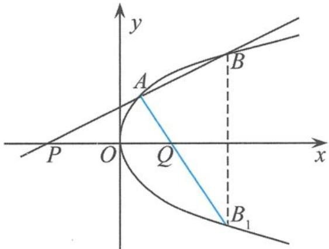

## 5.3.2 抛物线对称轴上的定点的性质探究

抛物线的对称轴上分布着许多特殊的点, 如焦点、顶点、抛物线准线与对称轴的交点等, 这些“点”蕴含着抛物线很多引人入胜的几何特征. 同样地, 与抛物线对称轴上的定点有关的性质也很精彩, 在高考数学及竞赛试题中频频亮相, 使人耳目一新. 本节试图对其进行总结与归纳, 为了讨论方便, 只讨论抛物线 $y^{2} = 2px (p > 0)$ 的情形.

## (1) 有关定值问题

性质 1 过抛物线 $y^{2}=2px(p>0)$ 的对称轴上的任意一点 $P(m,0)(m>0)$ 作直线，与抛物线交于 A, B 两点，这两个交点的纵坐标分别为 $y_{1}, y_{2}$ ，则有 $y_{1}y_{2}=-2pm$ 。

证明 设直线 $AB$ 的方程为

$$
x = k y + m,
$$

代入抛物线方程 $y^{2}=2px(p>0)$ ，整理得

$$
y ^ {2} - 2 p k y - 2 p m = 0.
$$

由韦达定理得

$$
y _ {1} y _ {2} = - 2 p m (\text {定值}).
$$

性质2 设 $P(-m,0)(m > 0)$ 为抛物线 $y^{2} = 2px(p > 0)$ 的对称轴上的任意一点，点 $Q$ 是点 $P$ 关于原点的对称点，点 $M$ 在抛物线上. 设 $\angle MPQ = \alpha, \angle MQP = \beta$ ，则有 $\frac{1}{\tan^2\alpha} - \frac{1}{\tan^2\beta} = \frac{2m}{p}$ (定值).

证明 设点 M 的坐标为 $(x, y)$ ，由题意知点 Q 的坐标为 $(m, 0)$ ，所以

$$
\frac {1}{\tan^ {2} \alpha} = \frac {(x + m) ^ {2}}{y ^ {2}}, \frac {1}{\tan^ {2} \beta} = \frac {(x - m) ^ {2}}{y ^ {2}}.
$$

故

$$
\frac {1}{\tan^ {2} \alpha} - \frac {1}{\tan^ {2} \beta} = \frac {(x + m) ^ {2} - (x - m) ^ {2}}{y ^ {2}} = \frac {4 m x}{y ^ {2}} = \frac {4 m x}{2 p x} = \frac {2 m}{p} (\text {定值}).
$$

(2)有关角平分线问题

性质 3 过抛物线 $y^{2}=2px(p>0)$ 的对称轴上的任意一点 $P(m,0)(m>0)$ 作直线，与抛物线交于 A, B 两点，直线 l: x=-m 交对称轴于点 Q，则 PQ 为 $\angle AQB$ 的内角平分线.

分析 只要证明 $k_{QA} + k_{QB} = 0$ 即可.

证明 (1)当直线 $AB$ 的斜率不存在时, 易证明 $PQ$ 平分 $\angle AQB$ 的内角.

(2)当直线 $AB$ 的斜率存在时, 设点 $A(x_{1}, y_{1}), B(x_{2}, y_{2})$ , 直线 $AB$ 的方程为

$$
y = k (x - m),
$$

将直线方程代入抛物线方程,整理得

$$
k ^ {2} x ^ {2} - (2 m k ^ {2} + 2 p) x + k ^ {2} m ^ {2} = 0,
$$

所以

$$
x _ {1} + x _ {2} = \frac {2 k ^ {2} m + 2 p}{k ^ {2}}, x _ {1} x _ {2} = m ^ {2}.
$$

从而

$$
k _ {Q A} + k _ {Q B} = \frac {y _ {1}}{x _ {1} + m} + \frac {y _ {2}}{x _ {2} + m} = \frac {x _ {1} y _ {2} + x _ {2} y _ {1} + m (y _ {1} + y _ {2})}{x _ {1} x _ {2} + m (x _ {1} + x _ {2}) + m ^ {2}} \quad ①.
$$

因为

$$
x _ {1} y _ {2} + x _ {2} y _ {1} = x _ {1} k (x _ {2} - m) + x _ {2} k (x _ {1} - m) = k [ 2 x _ {1} x _ {2} - m (x _ {1} + x _ {2}) ] = \frac {- 2 p m}{k}\tag{②,}
$$

又

$$
m (y _ {1} + y _ {2}) = m [ k (x _ {1} - m) + k (x _ {2} - m) ] = m k [ (x _ {1} + x _ {2}) - 2 m ] = \frac {2 p m}{k}
$$

把②③代入①得

$$
k _ {Q A} + k _ {Q B} = 0.
$$

证毕.

引申 过抛物线 $y^{2}=2px(p>0)$ 的对称轴上任意一点 $P(m,0)(m>0)$ 作直线，与抛物线交于 A, B 两点，点 Q 是点 P 关于原点的对称点。设点 P 分有向线段 $\overrightarrow{AB}$ 所成的比为 $\lambda$ ，证明： $\overrightarrow{QP}\perp(\overrightarrow{QA}-\lambda\overrightarrow{QB})$ 。

证明 过 A, B 两点分别作 $AM \perp x$ 轴、 $BN \perp x$ 轴.

$$
\begin{array}{r l} & {\overrightarrow {Q P} \perp (\overrightarrow {Q A} - \lambda \overrightarrow {Q B})} \\ & {\Leftrightarrow \overrightarrow {Q P} \cdot (\overrightarrow {Q A} - \lambda \overrightarrow {Q B}) = 0} \\ & {\Leftrightarrow | \overrightarrow {Q P} | | \overrightarrow {Q A} | \cos \angle A Q P - \lambda | \overrightarrow {Q P} | | \overrightarrow {Q B} | \cos \angle B Q P = 0} \\ & {\Leftrightarrow | \overrightarrow {Q A} | \cos \angle A Q P - \lambda | \overrightarrow {Q B} | \cos \angle B Q P = 0} \\ & {\Leftrightarrow | \overrightarrow {Q M} | = \lambda | \overrightarrow {Q N} |} \\ & {\Leftrightarrow \frac {| \overrightarrow {Q M} |}{| \overrightarrow {Q N} |} = \lambda} \\ & {\Leftrightarrow \frac {| \overrightarrow {Q M} |}{| \overrightarrow {Q N} |} = \lambda = \frac {| \overrightarrow {A P} |}{| \overrightarrow {P B} |} = \frac {| \overrightarrow {A M} |}{| \overrightarrow {B N} |}} \\ & {\Leftrightarrow \frac {| \overrightarrow {Q M} |}{| \overrightarrow {Q N} |} = \frac {| \overrightarrow {A M} |}{| \overrightarrow {B N} |}} \\ & {\Leftrightarrow \frac {| \overrightarrow {Q M} |}{| \overrightarrow {A M} |} = \frac {| \overrightarrow {Q N} |}{| \overrightarrow {B N} |}} \\ & {\Leftrightarrow \tan \angle A Q P = \tan \angle B Q P} \\ & {\Leftrightarrow \angle A Q P = \angle B Q P.} \end{array}
$$

此证明方法使我们从向量与几何的视角去考虑问题,也从本质上看清楚“性质 3”及其“引申”是等价的.另外,也可以直接利用“性质 3”来证明“引申”:

由“性质3”知 $QP$ 为 $\angle AQB$ 的内角平分线, 由内角平分线定理知

$$
\frac {| \overrightarrow {Q A} |}{| \overrightarrow {Q B} |} = \frac {| \overrightarrow {A P} |}{| \overrightarrow {P B} |}.
$$

因为 $\frac{|\overrightarrow{AP}|}{|\overrightarrow{PB}|} = \lambda$ ，所以 $\frac{|\overrightarrow{QA}|}{|\overrightarrow{QB}|} = \lambda \Rightarrow |\overrightarrow{QA}| = \lambda |\overrightarrow{QB}|$ ，所以

$$
| \overrightarrow {Q A} | | \overrightarrow {Q P} | = \lambda | \overrightarrow {Q B} | | \overrightarrow {Q P} |.
$$

又因为 $\angle AQP = \angle BQP$ ，所以

$$
| \overrightarrow {Q P} | | \overrightarrow {Q A} | \cos \angle A Q P - \lambda | \overrightarrow {Q P} | | \overrightarrow {Q B} | \cos \angle B Q P = 0 \Leftrightarrow \overrightarrow {Q P} \cdot (\overrightarrow {Q A} - \lambda \overrightarrow {Q B}) = 0.
$$

②，

性质 4 过抛物线 $y^{2}=2px(p>0)$ 的对称轴上任意一点 $P(-m,0)(m>0)$ 作直线，与抛物线交于 A, B 两点，点 Q 是点 P 关于原点的对称点，则 PQ 为 $\angle AQB$ 的外角平分线.

分析 只要证明 $k_{AQ} + k_{BQ} = 0$ 即可.

证明 设 $A(x_{1}, y_{1}), B(x_{2}, y_{2})$ ，直线 AB 的方程为

$$
y = k (x + m),
$$

将直线方程代入过抛物线方程得

$$
k ^ {2} x ^ {2} + (2 m k ^ {2} - 2 p) x + k ^ {2} m ^ {2} = 0,
$$

所以

$$
x _ {1} + x _ {2} = - \frac {2 k ^ {2} m - 2 p}{k ^ {2}}, x _ {1} x _ {2} = m ^ {2}.
$$

从而

$$
k _ {A Q} + k _ {B Q} = \frac {y _ {1}}{x _ {1} - m} + \frac {y _ {2}}{x _ {2} - m} = \frac {x _ {1} y _ {2} + x _ {2} y _ {1} - m (y _ {1} + y _ {2})}{x _ {1} x _ {2} - m (x _ {1} + x _ {2}) + m ^ {2}} \quad ①.
$$

因为

$$
x _ {1} y _ {2} + x _ {2} y _ {1} = x _ {1} k (x _ {2} + m) + x _ {2} k (x _ {1} + m) = k [ 2 x _ {1} x _ {2} + m (x _ {1} + x _ {2}) ] = \frac {2 p m}{k}
$$

又

$$
m \left(y _ {1} + y _ {2}\right) = m \left[ k \left(x _ {1} + m\right) + k \left(x _ {2} + m\right) \right] = m k \left[ \left(x _ {1} + x _ {2}\right) + 2 m \right] = \frac {2 p m}{k}
$$

把②③代入①得

$$
k _ {A Q} + k _ {B Q} = 0.
$$

证毕.

引申 过抛物线 $y^{2}=2px(p>0)$ 的对称轴上任一点 $P(-m,0)(m>0)$ 作直线，与抛物线交于 A, B 两点，点 Q 是点 P 关于原点的对称点，过点 Q 且平行于 y 轴的直线交直线 AB 于点 C，则 CQ 为 $\angle AQB$ 的内角平分线。

分析 只要证明 $\angle PQA = \angle BQx \Leftrightarrow k_{AQ} + k_{BQ} = 0$ , 由“性质 4”即可得到证明.

(3) 有关过定点问题

性质 5 过抛物线 $y^{2}=2px(p>0)$ 的对称轴上的任意一点 $P(m,0)(m>0)$ 作直线，与抛物线交于 A, B 两点，直线 l: x=-m 交对称轴于点 Q, BC//PQ，点 C 在直线 l 上，则直线 AC 过 PQ 的中点 O.

分析 此性质是“2001年全国高考数学试题”的一个推广。

证明 设 $A\left(\frac{y_1^2}{2p}, y_1\right), B\left(\frac{y_2^2}{2p}, y_2\right)$ ，得 $C(-m, y_2)$ 。由“性质 1”知

$$
y _ {1} y _ {2} = - 2 p m.
$$

因为

$$
k _ {O A} = \frac {y _ {1}}{\frac {y _ {1} ^ {2}}{2 p}} = \frac {2 p}{y _ {1}}, k _ {O C} = \frac {y _ {2}}{- m} = \frac {2 p y _ {2}}{y _ {1} y _ {2}} = \frac {2 p}{y _ {1}},
$$

所以

$$
k _ {O A} = k _ {O C}.
$$

从而 A, C, O 三点共线, 即直线 AC 过 PQ 的中点 O.

性质 6 过抛物线 $y^{2}=2px(p>0)$ 的对称轴上的任意一点 $P(-m,0)(m>0)$ 作抛物线的切线，切点分别为 A, B，则直线 AB 过定点 $(m,0)$ .

证明 设切点为 $A(x_0, y_0)$ , 则点 $A$ 处切线的方程为

$$
y y _ {0} = p (x + x _ {0}).
$$

由于切线过点 $P(-m,0)$ , 所以 $0 = p(-m + x_0)$ , 得 $x_0 = m$ . 因此, 直线 $AB$ 的方程为

$$
x = m.
$$

故直线 AB 过定点 $(m,0)$ .

性质 7 过定点 $P(m,0)(m<0)$ 作直线 l，交抛物线 $C: y^{2}=2px (p>0)$ 于 A, B 两点，点 B 关于 x 轴的对称点为 $B_{1}$ ，连接 $AB_{1}$ ，交 x 轴于点 Q，则直线 $AB_{1}$ 恒过一定点。

证明 如图 5.3-2, 设 $A(x_{1}, y_{1}), B(x_{2}, y_{2})$ , 已知点 $B_{1}$ 与点 $B$ 关于 $x$ 轴对称, 则有 $B_{1}(x_{2}, -y_{2})$ , 直线 $AB$ 的方程为

$$
y - y _ {1} = k _ {A B} (x - x _ {1}),
$$

其中 $k_{AB}=\frac{y_{2}-y_{1}}{x_{2}-x_{1}}=\frac{2p}{y_{1}+y_{2}}$ ，则

$$
A B: y = \frac {2 p x}{y _ {1} + y _ {2}} + \frac {y _ {1} y _ {2}}{y _ {1} + y _ {2}}.
$$

同理 $AB_{1}: y = \frac{2px}{y_{1} - y_{2}} - \frac{y_{1}y_{2}}{y_{1} - y_{2}}.$

图5.3-2

又直线 AB 过点 $(m,0)$ ，则 $0=\frac{2pm}{y_{1}+y_{2}}+\frac{y_{1}y_{2}}{y_{1}+y_{2}}$ ，于是

$$
y _ {1} y _ {2} = - 2 p m.
$$

因此, 直线 $AB_{1}$ 的方程可改写为 $y=\frac{2px}{y_{1}-y_{2}}+\frac{2pm}{y_{1}-y_{2}}$ , 即

$$
y = \frac {2 p}{y _ {1} - y _ {2}} (x + m).
$$

可知直线 $AB_{1}$ 恒过点 $(-m,0)$ .

点评 以上主要围绕着有关定值、角平分线、过定点等问题展开讨论,这些性质涵盖了抛物线中许多重要的几何特征. 另外,以上抛物线的性质同样可以类比地迁移到双曲线和抛物线中去.
