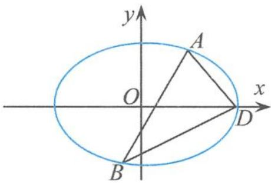

## 5.3.3 圆锥曲线中以张角为直角的弦为背景的定点问题概述

圆锥曲线的弦对一些特征点(顶点、中心、焦点等)的张角为直角的问题,是圆锥曲线中非常典型的问题,蕴含着解析几何丰富的思维方法和思想精髓,高考对这方面内容的考查也方兴未艾、精彩不断.

## (1)与顶点的张角为直角的弦

例 2 已知椭圆 C 的中心在坐标原点、焦点在 x 轴上，椭圆 C 上的点到焦点距离的最大值为 3、最小值为 1.

(Ⅰ)求椭圆 C 的标准方程.

(Ⅱ)若直线 $l: y = kx + m$ 与椭圆 C 相交于 A, B 两点 (A, B 不是左右顶点)，且以 AB 为直径的圆过椭圆 C 的右顶点。证明：直线 l 过定点，并求出该定点的坐标。

解答 (I) 如图 5.3-3, 由题意设椭圆的方程为 $\frac{x^2}{a^2} + \frac{y^2}{b^2} = 1 (a > b > 0)$ , 由已知得 $a + c = 3$ ,

a-c=1, 所以 a=2, c=1, 所以椭圆的标准方程为

$$
\frac {x ^ {2}}{4} + \frac {y ^ {2}}{3} = 1.
$$

(Ⅱ)设 $A(x_{1},y_{1})$ , $B(x_{2},y_{2})$ ，把 $y=kx+m$ 代入椭圆方程得

$$
(3 + 4 k ^ {2}) x ^ {2} + 8 m k x + 4 (m ^ {2} - 3) = 0,
$$

图5.3-3

$$
\text {则} \left\{ \begin{array}{l l} \Delta = 6 4 m ^ {2} k ^ {2} - 1 6 (3 + 4 k ^ {2}) (m ^ {2} - 3) > 0 \Rightarrow 3 + 4 k ^ {2} - m ^ {2} > 0, \\ x _ {1} + x _ {2} = - \frac {8 m k}{3 + 4 k ^ {2}}, \\ x _ {1} x _ {2} = \frac {4 (m ^ {2} - 3)}{3 + 4 k ^ {2}}. \end{array} \right.
$$

所以

$$
y _ {1} y _ {2} = (k x _ {1} + m) (k x _ {2} + m) = k ^ {2} x _ {1} x _ {2} + m k (x _ {1} + x _ {2}) + m ^ {2} = \frac {3 (m ^ {2} - 4 k ^ {2})}{3 + 4 k ^ {2}}.
$$

因为以 AB 为直径的圆过椭圆的右顶点 $D(2,0)$ ，所以 $\overrightarrow{AD} \cdot \overrightarrow{BD} = 0$ ，即

$$
y _ {1} y _ {2} + x _ {1} x _ {2} - 2 (x _ {1} + x _ {2}) + 4 = 0.
$$

从而 $\frac{3(m^2 - 4k^2)}{3 + 4k^2} + \frac{4(m^2 - 3)}{3 + 4k^2} + \frac{16mk}{3 + 4k^2} + 4 = 0$ ，整理得

$$
7 m ^ {2} + 1 6 m k + 4 k ^ {2} = 0,
$$

解得 $m_{1}=-2k, m_{2}=-\frac{2k}{7}$ 且均满足 $3+4k^{2}-m^{2}>0$ .

当 $m_{1} = -2k$ 时，直线 $l$ 的方程为 $y = k(x - 2)$ ，过点 $(2,0)$ ，与已知矛盾；当 $m_{2} = -\frac{2k}{7}$ 时，直线 $l$ 的方程为 $y = k\left(x - \frac{2}{7}\right)$ ，过定点 $\left(\frac{2}{7},0\right)$ .

所以直线 l 过定点 $\left(\frac{2}{7},0\right)$ .

点评 这道高考试题揭示了与椭圆顶点的张角为直角的弦问题的一个性质,由这道试题我们可以类似地得到下面的 3 个引申.

引申1 若直线 $l$ 与椭圆 $C: \frac{x^2}{a^2} + \frac{y^2}{b^2} = 1 (a > b > 0)$ 交于 $M, N$ 两点， $A$ 为椭圆的右顶点，且 $AM \perp AN$ . 证明：直线 $l$ 过定点 $\left(\frac{e^2}{2 - e^2} a, 0\right)$ . (e 为离心率)

引申 2 若直线 l 与双曲线 $\frac{x^{2}}{a^{2}} - \frac{y^{2}}{b^{2}} = 1 (a > 0, b > 0)$ 交于 M, N 两点，A 为双曲线的右顶点，且 $AM \perp AN$ . 证明：直线 l 过定点 $\left(\frac{e^{2}}{2 - e^{2}} a, 0\right)$ . (e 为离心率)

引申 3 若直线 l 与抛物线 $y^{2}=2px(p>0)$ 交于 M, N 两点, A 为抛物线的顶点, 且 $AM \perp AN$ . 证明: 直线 l 过定点 $(2p,0)$ .

同样可以证明以上 3 个引申的逆命题也成立. 这一组性质在处理与顶点的张角为直角的弦有关问题中至关重要. 下面列举几道相关的高考试题.

例 3 在平面直角坐标系 xOy 中, 抛物线 $y = x^{2}$ 上异于坐标原点 O 的两个不同的动点 A, B 满足 $AO \perp BO$ . $\triangle AOB$ 的面积是否存在最小值? 若存在, 请求出最小值; 若不存在, 请说明理由.

解答 已知 $AO \perp BO$ , 由“引申 3”可知直线 $AB$ 过定点 $(0,2p)$ , 即过定点 $(0,1)$ . 设直线 $AB$ 的方程为

$$
y = k x + 1,
$$

将其代入抛物线的方程 $y=x^{2}$ ，整理得

$$
x ^ {2} - k x - 1 = 0.
$$

设 $A(x_{1},y_{1}),B(x_{2},y_{2})$ ，则

$$
x _ {1} + x _ {2} = k, x _ {1} x _ {2} = - 1.
$$

从而

$$
S _ {\triangle A O B} = \frac {1}{2} \times 1 \times | x _ {1} - x _ {2} | = \frac {1}{2} \sqrt {k ^ {2} + 4} \geqslant 1,
$$

当 k=0 时取到最小值 1.

例 4 已知 O 为坐标原点, 直线 l 在 x 轴和 y 轴上的截距分别是 a 和 $b (a > 0, b \neq 0)$ , 且交抛物线 $y^{2} = 2px (p > 0)$ 于 $M(x_{1}, y_{1}), N(x_{2}, y_{2})$ 两点.

(Ⅰ)写出直线 l 的截距式方程.

(Ⅱ)证明： $\frac{1}{y_{1}}+\frac{1}{y_{2}}=\frac{1}{b}.$

(Ⅲ) 当 a=2p 时, 求 $\angle MON$ 的大小.

解答 (Ⅰ)(Ⅱ)略.

(Ⅲ) 当 a=2p 时, 直线 l 经过定点 $(2p,0)$ , 由“引申 3”的逆命题可得 $\angle MON=90^{\circ}$ .

例 5 设 $p(p>0)$ 是一个常数, 过点 $Q(2p,0)$ 的直线与抛物线 $y^{2}=2px$ 交于相异的两点 A, B, 以线段 AB 为直径作圆 H (H 为圆心). 试证抛物线顶点在圆 H 的圆周上, 并求圆 H 的面积最小时直线 AB 的方程.

解答 由“引申3”的逆命题可得 $AO \perp BO$ , 抛物线顶点 $O$ 在圆 $H$ 的圆周上. 设直线 $AB$ 的方程为

$$
x = m y + 2 p,
$$

将其代入抛物线方程 $y^{2}=2px$ ，整理得

$$
y ^ {2} - 2 p m y - 4 p ^ {2} = 0,
$$

得到圆心 $H(2p+pm^{2},pm)$ . 因此, 圆的半径为

$$
\mid O H \mid = \sqrt {(m ^ {4} + 5 m ^ {2} + 4) p ^ {2}}.
$$

当 m=0 时, 圆的面积最小, 此时直线 AB 的方程为

$$
x = 2 p.
$$

(2)与中心的张角为直角的弦

例 6 已知椭圆的中心是原点 O，它的短轴长为 $2\sqrt{2}$ ，相应于焦点 $F(c,0)(c>0)$ 的准线 l 与 x 轴相交于点 A， $|OF|=2|FA|$ ，过点 A 的直线与椭圆相交于 P，Q 两点。

(Ⅰ)求椭圆的方程及其离心率.

(Ⅱ)若 $\overrightarrow{OP}\cdot\overrightarrow{OQ}=0$ ,求直线PQ的方程.

解答 （Ⅰ）椭圆的方程为 $\frac{x^{2}}{6}+\frac{y^{2}}{2}=1$ ，离心率 $e=\frac{\sqrt{6}}{3}$ .

(Ⅱ)由(Ⅰ)可得 $A(3,0)$ . 设直线 PQ 的方程为

$$
y = k (x - 3),
$$

将其代入椭圆的方程,整理得

$$
(3 k ^ {2} + 1) x ^ {2} - 1 8 k ^ {2} x + 2 7 k ^ {2} - 6 = 0.
$$

依题意 $\Delta=12(2-3k^{2})>0$ , 得

$$
- \frac {\sqrt {6}}{3} <   k <   \frac {\sqrt {6}}{3}.
$$

设 $P(x_{1},y_{1}),Q(x_{2},y_{2})$ ，则

$$
x _ {1} + x _ {2} = \frac {1 8 k ^ {2}}{3 k ^ {2} + 1} \quad ①,
$$

$$
x _ {1} x _ {2} = \frac {2 7 k ^ {2} - 6}{3 k ^ {2} + 1} \quad ②.
$$

因为

$$
y _ {1} y _ {2} = [ k (x _ {1} - 3) ] [ k (x _ {2} - 3) ] = k ^ {2} [ x _ {1} x _ {2} - 3 (x _ {1} + x _ {2}) + 9 ] \quad ③,
$$

又因为 $\overrightarrow{OP} \cdot \overrightarrow{OQ} = 0$ ，所以

$$
x _ {1} x _ {2} + y _ {1} y _ {2} = 0 \quad ④.
$$

由①②③④得 $5k^{2}=1$ ，从而 $k=\pm\frac{\sqrt{5}}{5}\in\left(-\frac{\sqrt{6}}{3},\frac{\sqrt{6}}{3}\right)$ ，所以直线 PQ 的方程为

$$
x - \sqrt {5}   y - 3 = 0   \text {或}   x + \sqrt {5}   y - 3 = 0.
$$

(3)与焦点的张角为直角的弦

例 7 已知直线 $l: y = kx + 1$ 与双曲线 C: $2x^{2} - y^{2} = 1$ 的右支交于不同的两点 A, B.

(I)求实数 k 的取值范围.

(Ⅱ)是否存在实数 k，使得以线段 AB 为直径的圆经过双曲线 C 的右焦点 F？若存在，求出 k 的值；若不存在，说明理由。

解答 （Ⅰ）易求得实数 k 的取值范围是

$$
- 2 <   k <   - \sqrt {2}.
$$

(Ⅱ)将直线 l 的方程 $y=kx+1$ 代入双曲线 C 的方程 $2x^{2}-y^{2}=1$ 后, 整理得

$$
(k ^ {2} - 2) x ^ {2} + 2 k x + 2 = 0 \quad ①.
$$

设 A, B 两点的坐标分别为 $(x_{1}, y_{1})$ , $(x_{2}, y_{2})$ ，则

$$
x _ {1} + x _ {2} = \frac {2 k}{2 - k ^ {2}}, x _ {1} x _ {2} = \frac {2}{k ^ {2} - 2} \quad ②.
$$

假设存在实数 $k$ ，使得以线段 $AB$ 为直径的圆经过双曲线 $C$ 的右焦点 $F(c,0)$ ，则由 $FA \perp FB$ 得 $(x_{1} - c)(x_{2} - c) + y_{1}y_{2} = 0$ ，即

$$
(x _ {1} - c) (x _ {2} - c) + (k x _ {1} + 1) (k x _ {2} + 1) = 0,
$$

整理得

$$
(k ^ {2} + 1) x _ {1} x _ {2} + (k - c) (x _ {1} + x _ {2}) + c ^ {2} + 1 = 0 \quad ③.
$$

把②和 $c=\frac{\sqrt{6}}{2}$ 代入③，化简得

$$
5 k ^ {2} + 2 \sqrt {6} k - 6 = 0.
$$

解得 $k = -\frac{6 + \sqrt{6}}{5}\in (-2, - \sqrt{2})$ ，或 $k = \frac{6 - \sqrt{6}}{5}\notin (-2, - \sqrt{2})($ 舍去）.

故存在 $k=-\frac{6+\sqrt{6}}{5}$ 使得以线段 AB 为直径的圆经过双曲线 C 的右焦点.

点评 解决这类问题的核心就是突破直角的几种等价形式,如 $OP \perp OQ \Leftrightarrow \overrightarrow{OP} \cdot \overrightarrow{OQ} = 0 \Leftrightarrow |\overrightarrow{OP} + \overrightarrow{OQ}| = |\overrightarrow{OP} - \overrightarrow{OQ}| \Leftrightarrow$ 以 PQ 为直径的圆过原点 O 等. 另外,如果能够利用圆锥曲线相关的性质,更是棋高一着.
