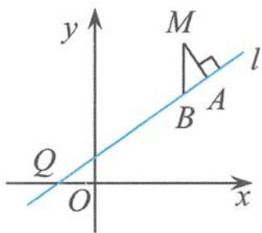
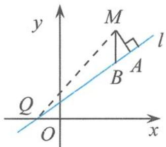
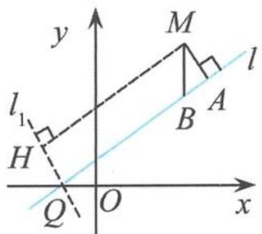

## 5.4.1 一类圆锥曲线的法线问题探究

## (1)试题解法的探究与点评

每年数学高考试题都会题留下许多经典之笔,可圈可点,精彩迭出,下面这道解析几何题更是在众多的高考试题中脱颖而出,成为其中一颗耀眼的明珠,再次引起人们的极大关注,下面主要对这道高考试题及其背景作一些点评与剖析.

例 1 已知曲线 C 是到点 $P\left(-\frac{1}{2}, \frac{3}{8}\right)$ 和到直线 $y = -\frac{5}{8}$ 的距离相等的点的轨迹. l 是过点 Q (-1, 0) 的直线, M 是曲线 C 上 (不在 l 上) 的动点. 点 A, B 在 l 上, $MA \perp l$ , $MB \perp x$ 轴 (如图 5.4-1).

(I)求曲线 C 的方程.

(Ⅱ)求出直线 l 的方程,使得 $\frac{|QB|^{2}}{|QA|}$ 为常数.

解答 (I) 设 $N(x, y)$ 为曲线 $C$ 上的点, 易得曲线 $C$ 的方程为

  
图5.4-1

$$
y = \frac {1}{2} (x ^ {2} + x).
$$

(Ⅱ)解法1:如图5.4-2,连接QM,设 $M(x,\frac{x^{2}+x}{2})$ ,直线 $l:y=kx+k$ ,则 $B(x,kx+k)$ ,从而

$$
\mid Q B \mid = \sqrt {1 + k ^ {2}} \mid x + 1 \mid .
$$

在 Rt△QMA 中, 因为

图5.4-2

$$
\left| Q M \right| ^ {2} = (x + 1) ^ {2} \left(1 + \frac {x ^ {2}}{4}\right), \left| M A \right| ^ {2} = \frac {(x + 1) ^ {2} \left(k - \frac {x}{2}\right) ^ {2}}{1 + k ^ {2}},
$$

所以 $|QA|^2 = |QM|^2 - |MA|^2 = \frac{(x + 1)^2}{4(1 + k^2)} (kx + 2)^2$ ，即

$$
| Q A | = \frac {| x + 1 | | k x + 2 |}{2 \sqrt {1 + k ^ {2}}},
$$

从而

$$
\frac {| Q B | ^ {2}}{| Q A |} = \frac {2 (1 + k ^ {2}) \sqrt {1 + k ^ {2}}}{| k |} \left| \frac {x + 1}{x + \frac {2}{k}} \right|.
$$

当 $k = 2$ 时， $\frac{|QB|^2}{|QA|} = 5\sqrt{5}$ .所求直线 $l$ 的方程为

$$
2 x - y + 2 = 0.
$$

解法 2: 如图 5.4-3, 设 $M(x, \frac{x^{2} + x}{2})$ , 直线 $l: y = kx + k$ , 则 $B(x, kx + k)$ ,
从而

$$
\mid Q B \mid = \sqrt {1 + k ^ {2}} \mid x + 1 \mid .
$$

过点 $Q(-1,0)$ 且垂直于 $l$ 的直线方程为

图5.4-3

$$
l _ {1}: y = - \frac {1}{k} (x + 1).
$$

因为 $|QA|=|MH|$ ，所以

$$
| Q A | = \frac {| x + 1 | | k x + 2 |}{2 \sqrt {1 + k ^ {2}}}.
$$

从而

$$
\frac {| Q B | ^ {2}}{| Q A |} = \frac {2 (1 + k ^ {2}) \sqrt {1 + k ^ {2}}}{| k |} \left| \frac {x + 1}{x + \frac {2}{k}} \right|.
$$

当 $k = 2$ 时， $\frac{|QB|^2}{|QA|} = 5\sqrt{5}$ ，所求直线 $l$ 的方程为

$$
2 x - y + 2 = 0.
$$

点评 这是一道返璞归真的探索定值问题的高考试题,其设计新颖、立意深邃,把解析几何的基本思想体现得酣畅淋漓.整个试题设计匠心独运,背景熟悉而深刻,有一种似曾相识的感觉,给考生一种平和亲切的答题氛围.探究使得问题不落俗套,方法回归基础使得问题变得朴素无华,平面几何知识的应用使得问题变得简单明了.整个问题的设计集动点与定值于一体,完美结合,可以说是动静结合总相宜.

(2)试题的思考与背景

思考 1 “注重通性通法,淡化特殊技巧”是近几年高考数学命题者所追求的一贯风格.

在我们高三的复习课中,特别是第一轮的高考复习,更应该加强基础知识的落实与强化回归,这是高考取得好成绩的根本所在.其实,对于这道高考试题,只要认真地把有关点的坐标表示出来,那么距离就迎刃而解,结论也就水到渠成了.重视基础,“最基础的最有生命力,最基础的最有迁移力”.

思考 2 解题后的回顾反思和刨根问底是非常有必要的.

当把一道题解答完成时,我们需要常回头看看,寻找命题的背景材料,追踪命题者的命题思路与痕迹,这样既可以培养我们善于思考、善于探究的能力,而且还可以提高我们复习课的效率.在这里,我们不禁要问:当直线 l 的斜率 k=2 时,直线 l 与抛物线处于一种什么样的几何状态呢? 我们易求得在点 $Q$ 处抛物线切线的斜率 $k_{\text{切}} = \left(x + \frac{1}{2}\right) |_{x=-1} = -\frac{1}{2}$ , 所以 $k \cdot k_{\text{切}} = -1$ . 这说明直线 $l$ 是与过点 $Q$ 的抛物线切线垂直的直线, 即直线 $l$ 是过点 $Q$ 的抛物线的法线. 至此, 直线 $l$ 的“真面目”已经浮出水面. 事实上, 该命题所揭示的问题背景正是抛物线法线的一个有趣的几何性质.

背景剖析 设 $Q$ 为抛物线 $x^{2} = 2py(p > 0)$ 上的任意一点， $QT$ 为抛物线在点 $Q$ 处的法线， $M$ 是抛物线上（不在 $QT$ 上）的动点。如果点 $A, B$ 在直线 $QT$ 上， $MA \perp QT, MB \perp x$ 轴，则 $|QB|^2 = |QA||QT|$ 。

证明 设 $Q\left(x_0, \frac{x_0^2}{2p}\right)$ , 则法线 $QT$ 的方程为 $y - \frac{x_0^2}{2p} = -\frac{p}{x_0}(x - x_0)$ , 即

$$
y = - \frac {p}{x _ {0}} x + p + \frac {x _ {0} ^ {2}}{2 p},
$$

将其代入抛物线的方程,整理得

$$
x ^ {2} + \frac {2 p ^ {2}}{x _ {0}} x - 2 p ^ {2} - x _ {0} ^ {2} = 0.
$$

设 $T(x_{2},y_{2})$ ，则

$$
x _ {0} + x _ {2} = - \frac {2 p ^ {2}}{x _ {0}}, x _ {0} x _ {2} = - 2 p ^ {2} - x _ {0} ^ {2},
$$

因此

$$
| Q T | = \sqrt {1 + \frac {p ^ {2}}{x _ {0} ^ {2}}} | x _ {0} - x _ {2} | = \frac {2 (x _ {0} ^ {2} + p ^ {2}) ^ {\frac {3}{2}}}{x _ {0} ^ {2}} \quad ①.
$$

设 $M\left(x_{1}, \frac{x_{1}^{2}}{2p}\right)$ , 则 $B\left(x_{1}, -\frac{p}{x_{0}} x_{1} + p + \frac{x_{0}^{2}}{2p}\right)$ , 所以

$$
\mid Q B \mid^ {2} = (x _ {1} - x _ {0}) ^ {2} + \left(p - \frac {p}{x _ {0}} x _ {1}\right) ^ {2} = \frac {x _ {0} ^ {2} + p ^ {2}}{x _ {0} ^ {2}} (x _ {1} - x _ {0}) ^ {2}\tag{②.}
$$

在点 $Q$ 处的切线方程为 $xx_0 = p\left(y + \frac{x_0^2}{2p}\right)$ ，即

$$
x x _ {0} - p y - \frac {x _ {0} ^ {2}}{2} = 0,
$$

直线 $MA$ 的方程为

$$
x x _ {0} - p y + \frac {x _ {1} ^ {2}}{2} - x _ {1} x _ {0} = 0.
$$

由两条平行直线的距离公式得

$$
| Q A | = \frac {\left| \frac {x _ {1} ^ {2}}{2} - x _ {1} x _ {0} + \frac {x _ {0} ^ {2}}{2} \right|}{\sqrt {x _ {0} ^ {2} + p ^ {2}}} = \frac {\frac {1}{2} (x _ {1} - x _ {0}) ^ {2}}{\sqrt {x _ {0} ^ {2} + p ^ {2}}}\tag{③.}
$$

由①②③可得

$$
\mid Q B \mid^ {2} = \mid Q A \mid \mid Q T \mid .
$$

## (3) 相关试题链接

以抛物线的法线为背景的题目在竞赛与高考试题中不断出现,例如:

例2 已知直线 $AB$ 与抛物线 $y^{2} = 4x$ 交于 $A, B$ 两点， $M$ 为 $AB$ 的中点， $C$ 为抛物线上的一个动点。若 $C_{0}$ 满足 $\overrightarrow{C_{0}A} \cdot \overrightarrow{C_{0}B} = \min \{\overrightarrow{CA} \cdot \overrightarrow{CB}\}$ ，则下列一定成立的是（ ）。
A. $C_{0} M \perp AB$ B. $C_{0} M \perp l$ ，其中 $l$ 是抛物线过 $C_{0}$ 的切线
C. $C_{0} A \perp C_{0} B$ D. $C_{0} M = \frac{1}{2} AB$

例 3 已知抛物线 $x^{2}=y$ ，点 $A\left(-\frac{1}{2},\frac{1}{4}\right)$ ， $B\left(\frac{3}{2},\frac{9}{4}\right)$ ，抛物线上的点 $P(x,y)\left(-\frac{1}{2}<x<\frac{3}{2}\right)$ ，过点 B 作直线 AP 的垂线，垂足为 Q.

(I)求直线 $AP$ 斜率的取值范围.

(Ⅱ)求 $|PA||PQ|$ 的最大值.

(4) 结束语

经过解题后的深入反思,我们可以这样说,同样的问题,不一样的精彩.也只有不断进行解题反思,才能触及数学问题的本质,优化我们的思维能力.
