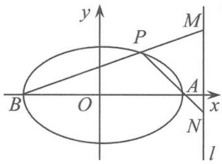
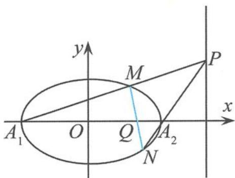
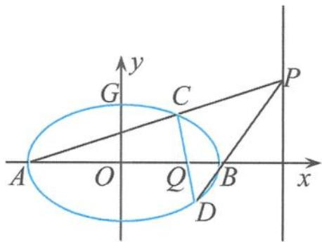

## 5.4.2 一类圆锥曲线的类准线问题初探

准线是椭圆的一条重要的特征线,椭圆的许多精彩绝伦的性质就是通过准线这个载体来演绎的.在椭圆 $\frac{x^{2}}{a^{2}}+\frac{y^{2}}{b^{2}}=1(a>b>0)$ 中,方程 $x=\frac{a^{2}}{c}$ 是其一条准线方程.同样地,与直线 $x=\frac{a^{2}}{m}$ (m>0)息息相关的椭圆也有许多可以与准线相媲美的性质,我们把直线 $x=\frac{a^{2}}{m}(m>0)$ 称作椭圆的类准线.本节试图在椭圆的类准线上做些思考.

(1)定值问题

性质1 已知 $P$ 为椭圆 $\frac{x^2}{a^2} +\frac{y^2}{b^2} = 1(a > b > 0)$ 上的任意一点， $A$ 为椭圆的右顶点， $B$ 为椭圆的左顶点， $l:x = \frac{a^2}{m} (m > 0)$ 为椭圆的类准线.若 $BP\cap l = M,AP\cap l = N$ ，证明：点 $M,N$ 的纵坐标之积为定值 $b^{2}\left(1 - \frac{a^{2}}{m^{2}}\right)$

证明 如图 5.4-4, 设 $P(x_{0}, y_{0})$ , 则 $\frac{y_{0}^{2}}{a^{2}-x_{0}^{2}}=\frac{b^{2}}{a^{2}}$ . 易求得直线 AP 的方程为

$$
y = \frac {y _ {0}}{x _ {0} + a} (x + a),
$$

  
图5.4-4

直线 $BP$ 的方程为

$$
y = \frac {y _ {0}}{x _ {0} - a} (x - a),
$$

所以

$$
y _ {M} \cdot y _ {N} = \frac {y _ {0} ^ {2}}{x _ {0} ^ {2} - a ^ {2}} \left(\frac {a ^ {2}}{m} + a\right) \left(\frac {a ^ {2}}{m} - a\right) = - \frac {b ^ {2}}{a ^ {2}} \cdot \frac {a ^ {2} (a ^ {2} - m ^ {2})}{m ^ {2}} = b ^ {2} \left(1 - \frac {a ^ {2}}{m ^ {2}}\right).
$$

(2)定比问题

性质2 已知 $P$ 为椭圆 $\frac{x^2}{a^2} +\frac{y^2}{b^2} = 1(a > b > 0)$ 的类准线 $x = \frac{a^2}{m} (m > 0)$ 上的任意一点， $Q(m,0)$ 为椭圆长轴上的点，直线 $PQ$ 交椭圆于 $A,B$ 两点.若 $\overrightarrow{AQ} = \lambda_1\overrightarrow{QB},\overrightarrow{AP} = \lambda_2\overrightarrow{PB}$ ，证明： $\lambda_1 + \lambda_2 = 0$

证明 设 $A(x_{1},y_{1}), B(x_{2},y_{2})$ ，由题意知，直线 $AB$ 的斜率存在，设直线 $AB$ 的方程为

$$
y = k (x - m),
$$

将其代入椭圆的方程得

$$
(a ^ {2} k ^ {2} + b ^ {2}) x ^ {2} - 2 a ^ {2} k ^ {2} m x + a ^ {2} m ^ {2} k ^ {2} - a ^ {2} b ^ {2} = 0.
$$

从而

$$
x _ {1} + x _ {2} = \frac {2 a ^ {2} k ^ {2} m}{a ^ {2} k ^ {2} + b ^ {2}}, x _ {1} x _ {2} = \frac {a ^ {2} k ^ {2} m ^ {2} - a ^ {2} b ^ {2}}{a ^ {2} k ^ {2} + b ^ {2}}.
$$

由 $\overrightarrow{AQ} = \lambda_1\overrightarrow{QB},\overrightarrow{AP} = \lambda_2\overrightarrow{PB}$ 得

$$
\lambda_ {1} = \frac {m - x _ {1}}{x _ {2} - m}, \lambda_ {2} = \frac {a ^ {2} - m x _ {1}}{m x _ {2} - a ^ {2}} \quad ①,
$$

所以

$$
\lambda_ {1} + \lambda_ {2} = \frac {(m ^ {2} + a ^ {2}) (x _ {1} + x _ {2}) - 2 m x _ {1} x _ {2} - 2 m a ^ {2}}{(x _ {2} - m) (m x _ {2} - a ^ {2})}\tag{②.}
$$

把①代入②，化简可得

$$
\lambda_ {1} + \lambda_ {2} = 0.
$$

(3) 定点问题

性质3 过椭圆 $\frac{x^2}{a^2} +\frac{y^2}{b^2} = 1(a > b > 0)$ 的类准线 $x = \frac{a^2}{m} (m > 0)$ 上的任意一点 $P$ ，作椭圆的两条切线PM，PN，切点分别为 $M,N$ ，则直线MN过定点 $(m,0)$

证明 设 $P(x_0, y_0)$ , 其中 $x_0 = \frac{a^2}{m}$ , 易得切点弦 $MN$ 所在直线的方程为 $\frac{xx_0}{a^2} + \frac{yy_0}{b^2} = 1$ , 即

$$
\frac {x}{m} + \frac {y y _ {0}}{b ^ {2}} = 1.
$$

令 y=0，得 x=m。所以直线 MN 过定点 $(m,0)$ 。

性质 4 设 $A_{1}, A_{2}$ 分别为 $\frac{x^{2}}{a^{2}} + \frac{y^{2}}{b^{2}} = 1 (a > b > 0)$ 的左、右顶点，P 为椭圆的类准线 $x = \frac{a^{2}}{m} (m > 0)$ 上的任意一点。若 $PA_{1}, PA_{2}$ 与椭圆分别交于 M, N，则直线 MN 过定点 $(m, 0)$ 。

证明 如图 5.4-5, 设 $M(x_{1}, y_{1})$ , $N(x_{2}, y_{2})$ , 则直线 $A_{1}M$ 的方程为

$$
y = k _ {1} (x + a),
$$

将其代入椭圆方程得

$$
\left(a ^ {2} k _ {1} ^ {2} + b ^ {2}\right) x ^ {2} + 2 a ^ {3} k _ {1} ^ {2} x + \left(a ^ {4} k _ {1} ^ {2} - a ^ {2} b ^ {2}\right) = 0,
$$

所以

$$
M \left(\frac {a b ^ {2} - a ^ {3} k _ {1} ^ {2}}{a ^ {2} k _ {1} ^ {2} + b ^ {2}}, \frac {2 a b ^ {2} k _ {1}}{a ^ {2} k _ {1} ^ {2} + b ^ {2}}\right)\tag{①。}
$$

图5.4-5

设直线 $A_{2}M$ 的方程为 $y=k_{2}(x-a)$ ，同理得到

$$
N \left(\frac {a ^ {3} k _ {2} ^ {2} - a b ^ {2}}{a ^ {2} k _ {2} ^ {2} + b ^ {2}}, \frac {- 2 a b ^ {2} k _ {2}}{a ^ {2} k _ {2} ^ {2} + b ^ {2}}\right)\tag{②.}
$$

因为 $P\left(\frac{a^2}{m}, y_P\right)$ 是直线 $A_1M$ 与 $A_2M$ 的公共点，所以满足 $y_P = k_1\left(\frac{a^2}{m} + a\right)$ ，且 $y_P = k_2\left(\frac{a^2}{m} - a\right)$ ，从而

$$
\frac {k _ {1} - k _ {2}}{k _ {1} + k _ {2}} = - \frac {m}{a} \quad ③.
$$

可得直线 $MN$ 的方程为 $\frac{y - y_1}{y_2 - y_1} = \frac{x - x_1}{x_2 - x_1}$ . 令 $y = 0$ , 则

$$
x = \frac {x _ {2} y _ {1} - x _ {1} y _ {2}}{y _ {1} - y _ {2}},
$$

把①②③代入上式得

$$
x = m.
$$

证毕.

例 4 设 A, B 分别为椭圆 $E: \frac{x^{2}}{a^{2}} + y^{2} = 1 (a > 1)$ 的左、右顶点，G 为椭圆 E 的上顶点， $\overrightarrow{AG} \cdot \overrightarrow{GB} = 8, P$ 为直线 x = 6 上的任意一个动点，PA 与椭圆 E 的另一个交点为 C, PB 与椭圆 E 的另一个交点为 D.

(Ⅰ)求椭圆 E 的方程.

(Ⅱ)证明:直线 CD 过定点.

解答 (I)如图5.4-6,设椭圆的中心为 $O$ ,由向量的极化恒等式得

$$
\overrightarrow {A G} \cdot \overrightarrow {G B} = a ^ {2} - | \overrightarrow {G O} | ^ {2} = a ^ {2} - 1 = 8,
$$

所以椭圆 $E$ 的方程为

$$
\frac {x ^ {2}}{9} + y ^ {2} = 1.
$$

(Ⅱ)第(Ⅱ)问是“性质4”的一个特例,只需令 $x=\frac{a^{2}}{m}=\frac{9}{m}=6$ ,得到 $m=\frac{3}{2}$ ,所以直线CD过定点 $\left(\frac{3}{2},0\right)$ .

图5.4-6

同样地，“性质2”的逆命题也成立.

性质5 设 $A_{1}, A_{2}$ 分别为 $\frac{x^{2}}{a^{2}} + \frac{y^{2}}{b^{2}} = 1 (a > b > 0)$ 的左、右顶点， $P$ 为椭圆的类准线 $x = \frac{a^{2}}{m} (m > 0)$ 上的任意一点， $Q(m, 0)$ 为定点。若 $PA_{1}$ 与椭圆交于点 $M, MQ$ 与椭圆交于点 $N$ ，则直线 $PN$ 过右顶点 $A_{2}$ 。

证明 设 $M(x_{1}, y_{1}), N(x_{2}, y_{2})$ ，因为 $A_{1}(-a, 0), A_{2}(a, 0)$ ，所以直线 $PA_{1}$ 的方程为

$$
y = \frac {y _ {1}}{x _ {1} + a} (x + a)
$$

直线 $PA_{2}$ 的方程为

$$
y = \frac {y _ {2}}{x _ {2} - a} (x - a)
$$

由①②推出

$$
x = \frac {a [ x _ {1} y _ {2} + x _ {2} y _ {1} - a (y _ {1} - y _ {2}) ]}{x _ {1} y _ {2} - x _ {2} y _ {1} + a (y _ {1} + y _ {2})} \tag {③.}
$$

因为点 $M, N$ 都在椭圆上，所以 $y_{1}^{2} = \left(1 - \frac{x_{1}^{2}}{a^{2}}\right)b^{2}, y_{2}^{2} = \left(1 - \frac{x_{2}^{2}}{a^{2}}\right)b^{2}$ ，消去 $b^{2}$ 得

$$
x _ {2} ^ {2} y _ {1} ^ {2} - x _ {1} ^ {2} y _ {2} ^ {2} = a ^ {2} (y _ {1} ^ {2} - y _ {2} ^ {2}) \quad ④.
$$

由 M, Q, N 三点共线得 $(x_{1}-m)y_{2}-(x_{2}-m)y_{1}=0$ ，即

$$
x _ {2} y _ {1} - x _ {1} y _ {2} = m (y _ {1} - y _ {2}) \quad ⑤.
$$

由④÷⑤得

$$
x _ {2} y _ {1} + x _ {1} y _ {2} = \frac {a ^ {2}}{m} (y _ {1} + y _ {2})
$$

把⑤⑥代入③得

$$
x = \frac {a ^ {2}}{m},
$$

即直线 $PN$ 过右顶点 $A_{2}$ .

点评 构成“性质2”与“性质3”的全部元素就是三个三点共线。由其中的任意两个三点共线都可以推出第三个三点共线。在这里的性质中都涉及了一个定点 $(m,0)$ 与一条定直线 $x=\frac{a^{2}}{m}$ 。其实，当 $m=c$ （c为半焦距）时，定点与定直线就分别成了焦点与准线。
