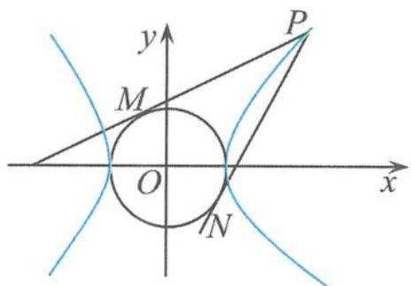

## 5.5.1 双曲线的伴随圆的性质初探

圆锥曲线是最优美的曲线,它们对称、统一、简明,给人以无穷的想象空间.在双曲线 $\frac{x^{2}}{a^{2}}-\frac{y^{2}}{b^{2}}=1(a>0,b>0)$ 中,我们通常把以原点为圆心、半实轴长a为半径的圆 $x^{2}+y^{2}=a^{2}$ 叫作双曲线的伴随圆.双曲线遇上圆,是左右逢源,还是左右为难?在高考试题和全国各地的高考模拟试题中,不断涌现出以双曲线与伴随圆为背景设计的解析几何试题,这类问题蕴含着许多有趣而又别具一格的性质.由于双曲线和圆交错在一起,所以这类问题的解决既要充分利用双曲线的性质又要巧妙地结合圆的几何特征,具有较强的综合性.

## (1) 有关切线问题

性质1 若圆 $O: x^{2} + y^{2} = a^{2}$ 为双曲线 $\frac{x^2}{a^2} - \frac{y^2}{b^2} = 1 (a > 0, b > 0)$ 的伴随圆， $P$ 为圆 $O$ 上的任意一点， $F$ 为双曲线的左焦点， $Q$ 为双曲线的左准线上的任意一点， $O$ 为原点，且 $PF \perp OQ$ ，则直线 $PQ$ 为圆 $O$ 的切线.

证明 设 $P(x_0, y_0)$ , 则 $y_0^2 = a^2 - x_0^2$ , 所以 $k_{OQ} = -\frac{x_0 + c}{y_0}$ , 直线 $OQ$ 的方程为

$$
y = - \frac {x _ {0} + c}{y _ {0}} x,
$$

$$
Q \left(- \frac {a ^ {2}}{c}, \frac {x _ {0} + c}{c y _ {0}} a ^ {2}\right)
$$

所以 $k_{PQ} = \frac{\frac{x_0 + c}{cy_0}a^2 - y_0}{-\frac{a^2}{c} - x_0} = -\frac{(x_0 + c)a^2 - c(a^2 - x_0^2)}{(a^2 + cx_0)y_0} = -\frac{(a^2 + cx_0)x_0}{(a^2 + cx_0)y_0} = -\frac{x_0}{y_0} = -\frac{1}{k_{OP}}$ ，即

$$
k _ {P Q} \cdot k _ {O P} = - 1.
$$

所以直线 PQ 为圆 O 的切线.

性质2 已知 $P$ 是双曲线 $\frac{x^2}{a^2} - \frac{y^2}{b^2} = 1 (a > 0, b > 0)$ 上异于顶点的任意一点，双曲线在点 $P$ 处的切线与伴随圆 $O: x^2 + y^2 = a^2$ 相交于 $M, N$ 两点，圆 $O$ 在点 $M, N$ 处的切线相交于点 $Q$ ，则直线 $PQ \perp x$ 轴.

证明 若 $MN \parallel x$ 轴, 由对称性知, 点 $P, Q$ 都在 $y$ 轴上. 若 $MN$ 与 $x$ 轴不平行, 不妨设 $P(x_0, y_0), M(x_1, y_1), N(x_2, y_2) (y_1 \neq y_2)$ , 要证明 $PQ \perp x$ 轴, 只要证明点 $Q$ 的横坐标为 $x_0$ . 易知双曲线在点 $P$ 处的切线 $l$ 的方程为

$$
\frac {x x _ {0}}{a ^ {2}} - \frac {y y _ {0}}{b ^ {2}} = 1.
$$

因为点 M, N 都在 l 上, 所以

$$
\frac {x _ {1} x _ {0}}{a ^ {2}} - \frac {y _ {1} y _ {0}}{b ^ {2}} = 1 \quad ①,
$$

$$
\frac {x _ {2} x _ {0}}{a ^ {2}} - \frac {y _ {2} y _ {0}}{b ^ {2}} = 1 \quad ②.
$$

由①-②得 $\frac{(x_1 - x_2)x_0}{a^2} -\frac{(y_1 - y_2)y_0}{b^2} = 0$ ，整理得

$$
\frac {1}{b ^ {2}} = \frac {(x _ {1} - x _ {2}) x _ {0}}{a ^ {2} (y _ {1} - y _ {2}) y _ {0}},
$$

代入①得

$$
- \frac {(x _ {1} - x _ {2}) x _ {0}}{y _ {1} - y _ {2}} = \frac {1}{y _ {1}} (a ^ {2} - x _ {0} x _ {1}).
$$

同理

$$
- \frac {(x _ {1} - x _ {2}) x _ {0}}{y _ {1} - y _ {2}} = \frac {1}{y _ {2}} (a ^ {2} - x _ {0} x _ {2}).
$$

所以 $\left\{\begin{aligned}x&=x_{0},\\ y&=-\frac{(x_{1}-x_{2})x_{0}}{y_{1}-y_{2}}\end{aligned}\right.$ 是方程组 $\left\{\begin{aligned}y&=\frac{1}{y_{1}}(a^{2}-x_{1}x),\\ y&=\frac{1}{y_{2}}(a^{2}-x_{2}x)\end{aligned}\right.$ 的解，且是唯一的，即 $\left\{\begin{aligned}x=x_{0},\\ y&=-\frac{(x_{1}-x_{2})x_{0}}{y_{1}-y_{2}}\end{aligned}\right.$ 是方程组 $\left\{\begin{aligned}x_{1}x+y_{1}y=a^{2},\\ x_{2}x+y_{2}y=a^{2}\end{aligned}\right.$ 的唯一解，也就是说点 $\left(x_{0},-\frac{(x_{1}-x_{2})x_{0}}{y_{1}-y_{2}}\right)$ 是圆 O 在点 M, N 处的两条切线交点的坐标，从而 $PQ \perp x$ 轴.

(2) 有关切点弦问题

性质3 若圆 $O: x^{2} + y^{2} = a^{2}$ 为双曲线 $\frac{x^{2}}{a^{2}} - \frac{y^{2}}{b^{2}} = 1 (a > 0, b > 0)$ 的伴随圆，过双曲线上的任意一点 $P$ （不包括顶点）作伴随圆的切线，切点分别为 $M, N$ . 若直线 $MN$ 在 $x$ 轴、 $y$ 轴上的截距分别为 $m, n$ ，则 $\frac{a^{2}}{n^{2}} - \frac{b^{2}}{m^{2}} = 1 - e^{2}$ （其中 $e$ 为双曲线的离心率）.

证明 如图 5.5-1, 设 $P(x_{0}, y_{0})$ , 则伴随圆的切点弦 MN 所在直线的方程为

$$
x x _ {0} + y y _ {0} = a ^ {2}.
$$

令 $y = 0$ ，得到

$$
m = \frac {a ^ {2}}{x _ {0}};
$$

令 $x = 0$ ，得到

$$
n = \frac {a ^ {2}}{y _ {0}}.
$$

图5.5-1

所以

$$
\frac {a ^ {2}}{n ^ {2}} - \frac {b ^ {2}}{m ^ {2}} = \frac {a ^ {2} y _ {0} ^ {2} - b ^ {2} x _ {0} ^ {2}}{a ^ {4}} = - \frac {b ^ {2}}{a ^ {2}} = 1 - e ^ {2}.
$$

(3) 有关轨迹问题

性质 4 若圆 $O: x^{2} + y^{2} = a^{2}$ 为双曲线 $\frac{x^2}{a^2} - \frac{y^2}{b^2} = 1 (a > 0, b > 0)$ 的伴随圆，过原点 $O$ 引射线，分别交双曲线的伴随圆和双曲线于点 $A$ 和点 $B, P$ 为线段 $AB$ 上的任意一点，且 $|\overrightarrow{OP}|^{2} = \overrightarrow{OA} \cdot \overrightarrow{OB}$ ，则点 $P$ 的轨迹方程为 $\left(\frac{x^2}{a^2} - \frac{y^2}{b^2}\right)(x^2 + y^2) = a^2$ .

证明 设 $P(x,y)$ ，直线 AB 的参数方程为

$$
\left\{ \begin{array}{l} x = t \cos \theta , \\ y = t \sin \theta \end{array} \right.
$$

其中 t 为参数, $\theta$ 为直线 AB 的倾斜角, 则 $A(t_{1}\cos\theta, t_{1}\sin\theta)$ , $B(t_{2}\cos\theta, t_{2}\sin\theta)$ , $P(t_{3}\cos\theta, t_{3}\sin\theta)$ .
由于点 A 在伴随圆上, 所以 $(t_{1}\cos\theta)^{2}+(t_{1}\sin\theta)^{2}=a^{2}$ , 即

$$
\frac {\cos^ {2} \theta}{a ^ {2}} + \frac {\sin^ {2} \theta}{a ^ {2}} = \frac {1}{t _ {1} ^ {2}}.
$$

把 $\sin \theta = \frac{y}{t_3},\cos \theta = \frac{x}{t_3}$ 代入上式得

$$
\frac {x ^ {2}}{a ^ {2}} + \frac {y ^ {2}}{a ^ {2}} = \frac {t _ {3} ^ {2}}{t _ {1} ^ {2}}.
$$

同理

$$
\frac {x ^ {2}}{a ^ {2}} - \frac {y ^ {2}}{b ^ {2}} = \frac {t _ {3} ^ {2}}{t _ {2} ^ {2}}.
$$

因为 $|\overrightarrow{OP}|^2 = \overrightarrow{OA} \cdot \overrightarrow{OB}$ , 所以 $t_3^2 = t_1 t_2$ , 即点 $P$ 的轨迹方程为

$$
\left(\frac {x ^ {2}}{a ^ {2}} - \frac {y ^ {2}}{b ^ {2}}\right) (x ^ {2} + y ^ {2}) = a ^ {2}.
$$

如果我们能够围绕着某一类典型问题进行剖析、拓展,使知识始终处于一种动态伸展的探究形态,充分利用经典试题的营养价值,让我们的思维纵横驰骋,将有利于构筑完整的认知结构和思想体系,提高数学理性思维的灵活性与广阔性,拓宽数学视野,提高综合分析能力.
