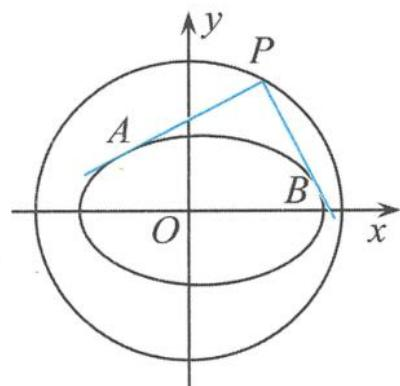
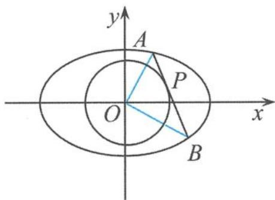
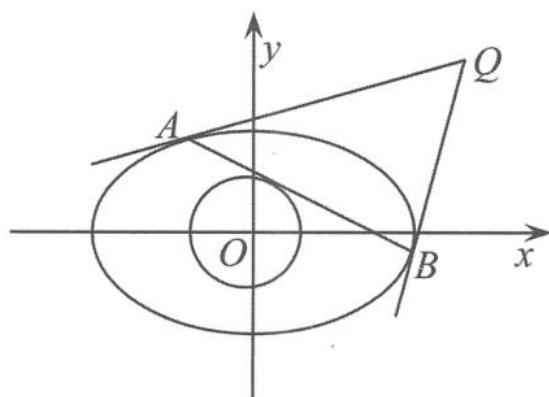

## 5.5.2 以蒙日圆的姊妹圆为背景的溯源探究

蒙日圆是解析几何中的一个著名的圆,可以跟阿波罗尼斯圆相媲美,蒙日圆蕴含着很多有趣的性质,这里主要探讨蒙日圆的姊妹圆的性质.

蒙日圆 在圆 $x^{2} + y^{2} = a^{2} + b^{2}$ 上任取一点作椭圆 $\frac{x^2}{a^2} +\frac{y^2}{b^2} = 1(a > b > 0)$ 两条切线，则这两条切线互相垂直.（如图5.5-2）

  
图5.5-2

蒙日圆的姊妹圆 从圆 $x^{2} + y^{2} = r^{2}\left(\frac{1}{r^{2}} = \frac{1}{a^{2}} +\frac{1}{b^{2}}\right)$ 上的任意一点 $P$ 作圆的切线，与椭圆 $\frac{x^2}{a^2} +\frac{y^2}{b^2} = 1(a > b > 0)$ 交于 $A,B$ 两点，则 $OA\bot OB.$ （如图5.5-3）

  
图5.5-3

以蒙日圆的姊妹圆为背景的问题不断出现.

(1)试题的精彩回放

例 1 设椭圆 $E: \frac{x^{2}}{a^{2}} + \frac{y^{2}}{b^{2}} = 1 (a > b > 0)$ 过 $M(2, \sqrt{2})$ , $N(\sqrt{6}, 1)$ 两点, O 为坐标原点.

(I)求椭圆 E 的方程.

(Ⅱ)是否存在圆心在原点的圆,使得该圆的任意一条切线与椭圆 E 恒有两个交点 A, B, 且 $\overrightarrow{OA} \perp \overrightarrow{OB}$ ? 若存在,请写出该圆的方程;若不存在,请说明理由.

解答 (1) 易求椭圆 $E$ 的方程为

$$
\frac {x ^ {2}}{8} + \frac {y ^ {2}}{4} = 1.
$$

(2)假设存在圆心在原点的圆,使得该圆的任意一条切线与椭圆 E 恒有两个交点 A, B, 且 $\overrightarrow{OA} \perp \overrightarrow{OB}$ . 设该圆的切线方程为

$$
y = k x + m.
$$

把方程 $y=kx+m$ 代入椭圆方程得

$$
(1 + 2 k ^ {2}) x ^ {2} + 4 k m x + 2 m ^ {2} - 8 = 0,
$$

则 $\Delta > 0$ ，即 $8k^{2} - m^{2} + 4 > 0$ . 设 $A(x_{1}, y_{1}), B(x_{2}, y_{2})$ ，由韦达定理得

$$
x _ {1} + x _ {2} = - \frac {4 k m}{1 + 2 k ^ {2}}, x _ {1} x _ {2} = \frac {2 m ^ {2} - 8}{1 + 2 k ^ {2}},
$$

从而

$$
y _ {1} y _ {2} = (k x _ {1} + m) (k x _ {2} + m) = k ^ {2} x _ {1} x _ {2} + k m \left(x _ {1} + x _ {2}\right) + m ^ {2} = \frac {k ^ {2} (2 m ^ {2} - 8)}{1 + 2 k ^ {2}} - \frac {4 k ^ {2} m ^ {2}}{1 + 2 k ^ {2}} + m ^ {2} = \frac {m ^ {2} - 8 k ^ {2}}{1 + 2 k ^ {2}}.
$$

要使 $\overrightarrow{OA} \perp \overrightarrow{OB}$ , 需使 $x_{1} x_{2} + y_{1} y_{2} = 0$ , 即 $\frac{2m^{2}-8}{1+2k^{2}} + \frac{m^{2}-8k^{2}}{1+2k^{2}} = 0$ , 所以 $3m^{2}-8k^{2}-8=0$ , 所以

$$
k ^ {2} = \frac {3 m ^ {2} - 8}{8} \geqslant 0.
$$

因为 $8k^{2} - m^{2} + 4 > 0$ ，所以 $\left\{ \begin{array}{l}m^2 > 2,\\ 3m^2\geqslant 8, \end{array} \right.$ 所以 $m^2\geqslant \frac{8}{3}$ ，即

$$
m \geqslant \frac {2 \sqrt {6}}{3} \text {或} m \leqslant - \frac {2 \sqrt {6}}{3}.
$$

又因为直线 $y = kx + m$ 为圆心在原点的圆的一条切线，所以圆的半径 $r = \frac{|m|}{\sqrt{1 + k^2}}$ ， $r^2 = \frac{m^2}{1 + k^2} = \frac{m^2}{1 + \frac{3m^2 - 8}{8}} = \frac{8}{3}$ ， $r = \frac{2\sqrt{6}}{3}$ ，所求的圆为

$$
x ^ {2} + y ^ {2} = \frac {8}{3}.
$$

此时，圆的切线 $y = kx + m$ 满足 $m \geqslant \frac{2\sqrt{6}}{3}$ 或 $m \leqslant -\frac{2\sqrt{6}}{3}$ . 而当切线的斜率不存在时，切线为 $x = \pm \frac{2\sqrt{6}}{3}$ ，与椭圆 $\frac{x^2}{8} + \frac{y^2}{4} = 1$ 的两个交点为 $\left(\frac{2\sqrt{6}}{3}, \pm \frac{2\sqrt{6}}{3}\right), \left(-\frac{2\sqrt{6}}{3}, \pm \frac{2\sqrt{6}}{3}\right)$ ，满足 $\overrightarrow{OA} \perp \overrightarrow{OB}$ .

综上,存在圆心在原点的圆 $x^{2}+y^{2}=\frac{8}{3}$ ,使得该圆的任意一条切线与椭圆 $E$ 恒有两个交点 $A$ , $B$ ,且 $\overrightarrow{OA} \perp \overrightarrow{OB}$ .

点评 解析几何问题是高考的重点与热点. 本题以椭圆的特殊弦(切点弦、垂直的弦)的性质为背景, 考查解析几何的基本思想与方法, 题中蕴含着圆锥曲线许多有趣的性质.

(2)试题的拓展引申

上述问题如果对于椭圆 $\frac{x^2}{a^2} +\frac{y^2}{b^2} = 1(a > b > 0)$ 与圆 $x^{2} + y^{2} = r^{2}$ 来说，圆的半径与椭圆的长轴与短轴又有什么关系呢？我们把问题进行多角度探究溯源.

## (i) 问题的一般化探究

引申1 已知椭圆 $\frac{x^2}{a^2} +\frac{y^2}{b^2} = 1(a > b > 0)$ ，直线 $l$ 是圆 $x^{2} + y^{2} = r^{2}$ 的任意一条切线，与椭圆交于 $A,B$ 两点，则 $\overrightarrow{OA}\bot \overrightarrow{OB}$ 的充要条件是 $\frac{1}{r^2} = \frac{1}{a^2} +\frac{1}{b^2}$

证明 设点 $P(x_0, y_0)(x_0y_0 \neq 0)$ 为直线 $l$ 与圆的切点, 则直线 $l$ 的方程为

$$
x x _ {0} + y y _ {0} = r ^ {2}.
$$

把 $xx_0 + yy_0 = r^2$ 代入椭圆的方程得

$$
(a ^ {2} x _ {0} ^ {2} + b ^ {2} y _ {0} ^ {2}) x ^ {2} - 2 a ^ {2} r ^ {2} x _ {0} x + a ^ {2} r ^ {4} - a ^ {2} b ^ {2} y _ {0} ^ {2} = 0.
$$

设 $A(x_{1},y_{1}),B(x_{2},y_{2})$ ，则

$$
x _ {1} + x _ {2} = \frac {2 a ^ {2} r ^ {2} x _ {0}}{a ^ {2} x _ {0} ^ {2} + b ^ {2} y _ {0} ^ {2}}, x _ {1} x _ {2} = \frac {a ^ {2} r ^ {4} - a ^ {2} b ^ {2} y _ {0} ^ {2}}{a ^ {2} x _ {0} ^ {2} + b ^ {2} y _ {0} ^ {2}}.
$$

因为 $x_0^2 + y_0^2 = r^2$ ，所以

$$
\begin{array}{l} \overrightarrow {O A} \cdot \overrightarrow {O B} = x _ {1} x _ {2} + y _ {1} y _ {2} = x _ {1} x _ {2} + \frac {r ^ {2} - x _ {1} x _ {0}}{y _ {0}} \cdot \frac {r ^ {2} - x _ {2} x _ {0}}{y _ {0}} \\ = \frac {1}{y _ {0} ^ {2}} [ r ^ {4} - r ^ {2} x _ {0} (x _ {1} + x _ {2}) + x _ {1} x _ {2} (x _ {0} ^ {2} + y _ {0} ^ {2}) ] \\ = \frac {1}{y _ {0} ^ {2}} [ r ^ {4} - r ^ {2} x _ {0} (x _ {1} + x _ {2}) + x _ {1} x _ {2} r ^ {2} ] \\ = \frac {r ^ {2}}{y _ {0} ^ {2}} [ r ^ {2} - x _ {0} (x _ {1} + x _ {2}) + x _ {1} x _ {2} ] \\ = \frac {r ^ {2}}{y _ {0} ^ {2}} \left[ r ^ {2} - \frac {2 a ^ {2} r ^ {2} x _ {0} ^ {2}}{a ^ {2} x _ {0} ^ {2} + b ^ {2} y _ {0} ^ {2}} + \frac {a ^ {2} r ^ {4} - a ^ {2} b ^ {2} y _ {0} ^ {2}}{a ^ {2} x _ {0} ^ {2} + b ^ {2} y _ {0} ^ {2}} \right] \\ = \frac {r ^ {2}}{y _ {0} ^ {2}} \left[ \frac {a ^ {2} r ^ {2} (r ^ {2} - x _ {0} ^ {2}) + b ^ {2} r ^ {2} y _ {0} ^ {2} - a ^ {2} b ^ {2} y _ {0} ^ {2}}{a ^ {2} x _ {0} ^ {2} + b ^ {2} y _ {0} ^ {2}} \right] \\ = \frac {r ^ {2}}{y _ {0} ^ {2}} \left[ \frac {a ^ {2} r ^ {2} y _ {0} ^ {2} + b ^ {2} r ^ {2} y _ {0} ^ {2} - a ^ {2} b ^ {2} y _ {0} ^ {2}}{a ^ {2} x _ {0} ^ {2} + b ^ {2} y _ {0} ^ {2}} \right] \\ = r ^ {2} \left[ \frac {(a ^ {2} + b ^ {2}) r ^ {2} - a ^ {2} b ^ {2}}{a ^ {2} x _ {0} ^ {2} + b ^ {2} y _ {0} ^ {2}} \right], \end{array}
$$

因此 $\overrightarrow{OA} \cdot \overrightarrow{OB} = 0 \Leftrightarrow (a^2 + b^2)r^2 - a^2b^2 = 0$ ，整理得

$$
\frac {1}{r ^ {2}} = \frac {1}{a ^ {2}} + \frac {1}{b ^ {2}}.
$$

当 $x_{0}y_{0}=0$ 时, 结论也成立.

链接1 设椭圆 $\frac{x^2}{a^2} +\frac{y^2}{b^2} = 1(a > b > 0)$ 的左、右焦点分别为 $F_{1},F_{2},A$ 是椭圆上的点， $AF_{2}\perp$ $F_{1}F_{2}$ ，原点 $O$ 到直线 $AF_{1}$ 的距离为 $\frac{1}{3}|OF_1|$

(I) 证明: $a = \sqrt{2} b$ .

(Ⅱ)求使得下述命题成立的 $t(t \in (0, b))$ 的值. 设圆 $x^{2} + y^{2} = t^{2}$ 上的任意点 $M(x_{0}, y_{0})$ 处

的切线交该椭圆于 $Q_{1}, Q_{2}$ 两点，则 $OQ_{1} \perp OQ_{2}$ .

解答 （Ⅰ）证明略.（Ⅱ）由（Ⅰ）知 $a=\sqrt{2}b$ ，所以

$$
e ^ {2} = \frac {1}{2}.
$$

由“引申1”知

$$
\frac {1}{t ^ {2}} = \frac {1}{a ^ {2}} + \frac {1}{b ^ {2}} = \frac {3}{2 b ^ {2}}.
$$

综上所述， $t=\frac{\sqrt{6}}{3}b\in(0,b)$ 使得所述命题成立.

## (ii) 问题的迁移引申

引申 2 已知双曲线 $\frac{x^2}{a^2} - \frac{y^2}{b^2} = 1 (b > a > 0)$ , 直线 $l$ 是圆 $x^2 + y^2 = r^2$ 的任意一条切线, 与双曲线交于 $A, B$ 两点, 则 $\overrightarrow{OA} \perp \overrightarrow{OB}$ 的充要条件是 $\frac{1}{r^2} = \frac{1}{a^2} - \frac{1}{b^2}$ . (证明略)

链接2 已知双曲线 $C: \frac{x^2}{a^2} - \frac{y^2}{b^2} = 1 (a > 0, b > 0)$ 的离心率为 $\sqrt{3}$ 、右准线方程为 $x = \frac{\sqrt{3}}{3}$ .

(I) 求双曲线 C 的方程.

(Ⅱ)设直线 l 是圆 $O: x^{2} + y^{2} = 2$ 上动点 $P(x_{0}, y_{0}) (x_{0} y_{0} \neq 0)$ 处的切线，l 与双曲线 C 交于不同的两点 A, B，证明：∠AOB 的大小为定值.

解答 (I)由题意得所求双曲线 $C$ 的方程为

$$
x ^ {2} - \frac {y ^ {2}}{2} = 1.
$$

(Ⅱ)结合双曲线方程知 $a=1, c=\sqrt{3}, e=\sqrt{3}, r^{2}=2$ ，满足 $\frac{1}{r^{2}}=\frac{1}{a^{2}}-\frac{1}{b^{2}}$ ，即 $\angle AOB=90^{\circ}$ .

点评 本节上述这三道藕断丝连的高考试题考查的是同一个内容,揭示的是圆锥曲线同样的几何性质,更巧的是山东省与北京市都是在2009年同一年考查的,真可谓是英雄所见略同.

## (iii)问题的延伸探究

以原问题中所涉及的问题背景为素材进行变式训练,我们可以进行延伸探究.

引申 3 已知椭圆 $\frac{x^{2}}{a^{2}} + \frac{y^{2}}{b^{2}} = 1 (a > b > 0)$ ，直线 l 是圆 $x^{2} + y^{2} = r^{2}$ 的任意一条切线，与椭圆交于 A, B 两点，椭圆在 A, B 两点处的切线相交于点 Q，则点 Q 的轨迹方程为 $\frac{x^{2}}{a^{4}} + \frac{y^{2}}{b^{4}} = \frac{1}{r^{2}}$ .

证明 如图 5.5-4, 设 $Q(x_{Q}, y_{Q})$ , 易得切点弦 AB 的方程为

即

$$
\frac {x x _ {Q}}{a ^ {2}} + \frac {y y _ {Q}}{b ^ {2}} = 1,
$$

$$
b ^ {2} x x _ {Q} + a ^ {2} y y _ {Q} = a ^ {2} b ^ {2}.
$$

又因为直线 $AB$ 与圆 $x^{2} + y^{2} = r^{2}$ 相切，所以

图5.5-4

$$
\frac {a ^ {2} b ^ {2}}{\sqrt {b ^ {4} x _ {Q} ^ {2} + a ^ {4} y _ {Q} ^ {2}}} = r,
$$

整理得

$$
\frac {x _ {Q} ^ {2}}{a ^ {4}} + \frac {y _ {Q} ^ {2}}{b ^ {4}} = \frac {1}{r ^ {2}},
$$

所以点 $Q$ 的轨迹方程为

$$
\frac {x ^ {2}}{a ^ {4}} + \frac {y ^ {2}}{b ^ {4}} = \frac {1}{r ^ {2}}.
$$

链接3 设点 $P$ 是椭圆 $\frac{x^2}{4} + \frac{y^2}{3} = 1$ 上的一个动点，过点 $P$ 作椭圆的切线，与圆 $x^2 + y^2 = 12$ 交于 $M, N$ 两点，圆在 $M, N$ 两点处的切线相交于点 $Q$ ，求点 $Q$ 的轨迹方程。

(答案为 $\frac{x^{2}}{36}+\frac{y^{2}}{48}=1$ )

亲身体验问题的探究过程,亲自深入到问题解决的核心地带,弄清楚问题的来龙去脉,并切中问题的实质.通过例题的引申、剖析,问题从一道高考试题到另一道高考试题的演变,从高考试题到竞赛试题的跨越,引向理性反思的舞台——比较联系,从中发现规律,并由此可以演变出一组妙趣横生的结论.
