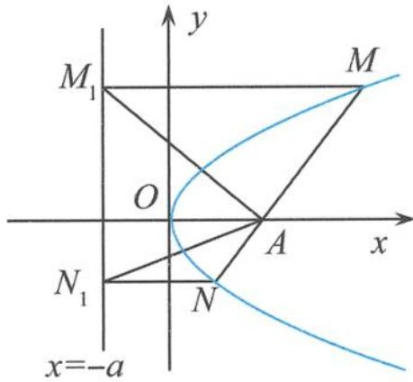

## 5.6.1 抛物线中的类特征直角梯形的性质探秘

(1) 问题的提出

例 1 过抛物线 $y^{2}=2px(p>0)$ 的对称轴上一点 $A(a,0)(a>0)$ 的直线与抛物线相交于 M, N 两点，自点 M, N 向直线 l: x=-a 作垂线，垂足分别为 $M_{1}, N_{1}$ . 记 $\triangle AMM_{1}, \triangle AM_{1}N_{1}, \triangle ANN_{1}$ 的面积分别为 $S_{1}, S_{2}, S_{3}$ . 是否存在 $\lambda$ , 使得对任意 a>0, 都有 $S_{2}^{2}=\lambda S_{1}S_{3}$ 成立？若存在，求出 $\lambda$ 的值；若不存在，请说明理由.

解答 如图 5.6-1, 设 $M(x_{1}, y_{1})$ , $N(x_{2}, y_{2})$ , 其中 $y_{1} > 0$ , $y_{2} < 0$ . 设直线 MN 的方程为

$$
x = m y + a,
$$

将其代入抛物线方程 $y^{2} = 2px$ 得

所以

$$
y ^ {2} - 2 p m y - 2 a p = 0.
$$

$$
y _ {1} + y _ {2} = 2 p m,
$$

$$
y _ {1} y _ {2} = - 2 a p.
$$

则

图5.6-1

$$
\begin{array}{r l} S _ {2} ^ {2} & = \left[ \frac {1}{2} (y _ {1} - y _ {2}) \cdot 2 a \right] ^ {2} = a ^ {2} \left[ (y _ {1} + y _ {2}) ^ {2} - 4 y _ {1} y _ {2} \right] \\ & = a ^ {2} \left[ (2 p m) ^ {2} - 4 (- 2 a p) \right] = 4 a ^ {2} p (2 a + m ^ {2} p). \end{array}
$$

而

$$
\begin{array}{r l} S _ {1} S _ {3} & = \left[ \frac {1}{2} (x _ {1} + a) y _ {1} \right] \left[ \frac {1}{2} (x _ {2} + a) (- y _ {2}) \right] = \frac {- y _ {1} y _ {2}}{4} \left(\frac {y _ {1} ^ {2}}{2 p} + a\right) \left(\frac {y _ {2} ^ {2}}{2 p} + a\right) \\ & = \frac {- y _ {1} y _ {2}}{1 6 p ^ {2}} \left[ (y _ {1} y _ {2}) ^ {2} + 2 a p (y _ {1} ^ {2} + y _ {2} ^ {2}) + 4 a ^ {2} p ^ {2} \right] = a ^ {2} p (2 a + m ^ {2} p), \end{array}
$$

所以

$$
S _ {2} ^ {2} = 4 S _ {1} S _ {3}.
$$

故存在 $\lambda=4$ ，使得对任意 a>0，都有 $S_{2}^{2}=\lambda S_{1}S_{3}$ 成立。

点评 这是一道形式推陈出新、内容丰富充实、设问新颖的试题,对于考生来说,既似曾相识又耳目一新.本题属于探究存在性的问题,整个试题以学生熟悉的抛物线为背景,考查圆锥曲线的性质,将对基础知识、方法、能力和数学素养的考查融为一体.

这个试题中涉及一个重要的直角梯形 $MNN_{1}M_{1}$ ，这个直角梯形蕴含着抛物线很多丰富多彩的性质，值得我们认真去探讨。为了便于讨论，我们把抛物线 $y^{2}=2px(p>0)$ 中的直角梯形 $MNN_{1}M_{1}$ 叫作抛物线的类特征直角梯形。特殊地，当 $a=\frac{p}{2}$ 时，定点 $A(a,0)$ 为抛物线的焦点，直线 l:x=-a 为抛物线的准线，此时的直角梯形 $MNN_{1}M_{1}$ 叫作抛物线的特征直角梯形。

## (2)类特征直角梯形的性质剖析

研究表明,孤立的知识点不能形成有效的知识,形成知识网络才是最有效的知识.所以,我们在平时的学习中,应该充分利用例题的载体功能进行探究.

(i) 有关面积问题

性质1 过抛物线 $y^{2} = 2px (p > 0)$ 的对称轴上一点 $A(a,0)(a > 0)$ 的直线与抛物线相交于 $M,N$ 两点，过点 $M,N$ 分别作抛物线 $y^{2} = 2px$ 的切线，交于点 $P$ . 若点 $P$ 的轨迹为直线 $l$ ，自点 $M,N$ 向直线作 $l$ 垂线，垂足分别为 $M_{1},N_{1}$ . 记 $\triangle AMM_{1},\triangle AM_{1}N_{1},\triangle ANN_{1}$ 的面积分别为 $S_{1},S_{2},S_{3}$ ，则 $\frac{S_2^2}{S_1S_3} = 4$ .

证明 只要证明直角梯形 $MNN_{1}M_{1}$ 为类特征直角梯形, 即证明点 $P$ 的轨迹为直线 $x = -a$ . 设 $M(x_{1}, y_{1}), N(x_{2}, y_{2})$ , 直线 $MN$ 的方程为

$$
x = m y + a,
$$

将其代入抛物线方程 $y^{2}=2px$ ，整理得

$$
y ^ {2} - 2 p m y - 2 a p = 0,
$$

所以

$$
y _ {1} y _ {2} = - 2 a p.
$$

易知抛物线在点 M, N 处的切线方程分别为

$$
y y _ {1} = p (x + x _ {1}), y y _ {2} = p (x + x _ {2}),
$$

消去 $y$ 得

$$
x = \frac {y _ {1} y _ {2} (y _ {1} - y _ {2})}{2 p (y _ {1} - y _ {2})} = - a.
$$

证毕.

性质2 在抛物线 $y^{2} = 2px (p > 0)$ 的类特征直角梯形 $MNN_{1}M_{1}$ 中，设直线 $l: x = -a$ 与对称轴交于点 $A_{1}, \triangle A_{1}MM_{1}, \triangle A_{1}MN, \triangle A_{1}NN_{1}$ 的面积分别为 $S_{1}, S_{2}, S_{3}$ ，则 $\frac{S_{2}^{2}}{S_{1}S_{3}} = 4$ .

## (ii)有关切线问题

性质3 在抛物线 $y^{2} = 2px (p > 0)$ 的类特征直角梯形 $MNN_{1}M_{1}$ 中，若 $P$ 为 $M_{1}N_{1}$ 的中点，则 $MP, NP$ 为抛物线的切线.

证明 设 $M(x_{1},y_{1}),N(x_{2},y_{2})$ ，设直线 $MN$ 的方程为

$$
x = m y + a,
$$

将其代入抛物线方程 $y^{2} = 2px$ 得

$$
y ^ {2} - 2 p m y - 2 a p = 0,
$$

所以

$$
y _ {1} + y _ {2} = 2 p m, y _ {1} y _ {2} = - 2 a p.
$$

因为 $P\left(-a, \frac{y_1 + y_2}{2}\right)$ , 所以

$$
k _ {M P} = \frac {y _ {1} - \frac {y _ {1} + y _ {2}}{2}}{\frac {y _ {1} ^ {2}}{2 p} + a} = \frac {\frac {y _ {1} - y _ {2}}{2}}{\frac {y _ {1} ^ {2} + 2 a p}{2 p}} = \frac {\frac {y _ {1} - y _ {2}}{2}}{\frac {y _ {1} ^ {2} - y _ {1} y _ {2}}{2 p}} = \frac {p}{y _ {1}},
$$

直线 $MP$ 的方程为 $y - y_{1} = \frac{p}{y_{1}} (x - x_{1})$ ，即

$$
y y _ {1} = p (x + x _ {1})
$$

为抛物线在点 M 处的切线. 同理可证直线 NP 为抛物线在点 N 处的切线.

(iii)有关三点共线问题

性质 4 在抛物线 $y^{2}=2px(p>0)$ 的类特征直角梯形 $MNN_{1}M_{1}$ 中, 若 O 为坐标原点, 则 M, O, $N_{1}$ 三点共线, 且 $M_{1}, O, N$ 三点也共线.

证明 设 $M(x_{1},y_{1}),N(x_{2},y_{2})$ ，直线 $MN$ 的方程为

$$
x = m y + a,
$$

将其代入抛物线方程 $y^{2}=2px$ ，整理得

$$
y ^ {2} - 2 p m y - 2 a p = 0,
$$

所以

$$
y _ {1} y _ {2} = - 2 a p.
$$

从而

$$
k _ {O M} = \frac {y _ {1}}{\frac {y _ {1} ^ {2}}{2 p}} = \frac {2 p}{y _ {1}} = \frac {2 p y _ {2}}{y _ {1} y _ {2}} = \frac {2 p y _ {2}}{- 2 a p} = \frac {y _ {2}}{- a} = k _ {O N _ {1}},
$$

所以 $M, O, N_{1}$ 三点共线. 同理可证明 $M_{1}, O, N$ 三点也共线.

(iv) 有关斜率问题

性质 5 在抛物线 $y^{2}=2px(p>0)$ 的类特征直角梯形 $MNN_{1}M_{1}$ 中，T 为直线 $M_{1}N_{1}:x=-a$ 上的任意一点，则直线 TM, TA, TN 的斜率成等差数列.

证明 设 $M\left(\frac{y_1^2}{2p}, y_1\right), N\left(\frac{y_2^2}{2p}, y_2\right), T(-a, t)$ , 直线 $AB$ 的方程为

$$
x = m y + a,
$$

将其代入抛物线方程 $y^{2}=2px(p>0)$ 得

$$
y ^ {2} - 2 p m y - 2 a p = 0,
$$

所以

$$
y _ {1} y _ {2} = - 2 a p.
$$

从而

$$
\begin{array}{r l} k _ {T M} + k _ {T N} & = \frac {y _ {1} - t}{\frac {y _ {1} ^ {2}}{2 p} + a} + \frac {y _ {2} - t}{\frac {y _ {2} ^ {2}}{2 p} + a} = \frac {2 p (y _ {1} - t)}{y _ {1} ^ {2} + 2 a p} + \frac {2 p (y _ {2} - t)}{y _ {2} ^ {2} + 2 a p} = \frac {2 p (y _ {1} - t)}{y _ {1} ^ {2} - y _ {1} y _ {2}} + \frac {2 p (y _ {2} - t)}{y _ {2} ^ {2} - y _ {1} y _ {2}} \\ & = \frac {2 p (y _ {1} - t)}{y _ {1} (y _ {1} - y _ {2})} + \frac {2 p (y _ {2} - t)}{y _ {2} (y _ {2} - y _ {1})} = \frac {2 p t (y _ {1} - y _ {2})}{y _ {1} y _ {2} (y _ {1} - y _ {2})} = \frac {2 p t}{y _ {1} y _ {2}} = \frac {2 p t}{- 2 a p} = \frac {t}{- a}. \end{array}
$$

因为 $k_{TA}=\frac{t}{-a-a}=\frac{t}{-2a}$ ，所以

$$
k _ {T M} + k _ {T N} = 2 k _ {T A},
$$

即直线 TM, TA, TN 的斜率成等差数列.

(v)有关数量积问题

性质 6 在抛物线 $y^{2}=2px(p>0)$ 的类特征直角梯形 $MNN_{1}M_{1}$ 中，设直线 l:x=-a 与对称轴交于点 $A_{1}$ ，且 $\overrightarrow{MA}=\lambda\overrightarrow{AN}(\lambda>0)$ ，则 $\overrightarrow{A_{1}A}\cdot(\overrightarrow{A_{1}M}-\lambda\overrightarrow{A_{1}N})=0$ 。

证明 设 $M(x_{1},y_{1}),N(x_{2},y_{2})$ ，再设直线 $MN$ 的方程为 $x = my + a$ ，将其代入抛物线方程 $y^{2} = 2px$ 得

$$
y ^ {2} - 2 p m y - 2 a p = 0,
$$

所以

$$
y _ {1} + y _ {2} = 2 p m, y _ {1} y _ {2} = - 2 a p.
$$

因为 $\overrightarrow{MA} = \lambda \overrightarrow{AN} (\lambda >0)$ ，所以

$$
\lambda = - \frac {y _ {1}}{y _ {2}},
$$

从而

$$
\overrightarrow {A _ {1} M} - \lambda \overrightarrow {A _ {1} N} = (x _ {1} + a, y _ {1}) - \lambda (x _ {2} + a, y _ {2}) = (x _ {1} - \lambda x _ {2} + a (1 - \lambda), y _ {1} - \lambda y _ {2}).
$$

又因为 $\overrightarrow{A_1A} = (2a,0)$ ，所以

$$
\begin{array}{r l} \overrightarrow {A _ {1} A} \cdot (\overrightarrow {A _ {1} M} - \lambda \overrightarrow {A _ {1} N}) & = 2 a [ x _ {1} - \lambda x _ {2} + a (1 - \lambda) ] = 2 a \left[ \left(\frac {y _ {1} ^ {2}}{2 p} + \frac {y _ {1}}{y _ {2}} \cdot \frac {y _ {2} ^ {2}}{2 p} + a \left(1 + \frac {y _ {1}}{y _ {2}}\right) \right. \right] \\ & = \frac {a (y _ {1} + y _ {2})}{p y _ {2}} (y _ {1} y _ {2} + 2 a p) = 0. \end{array}
$$

点评 抛物线的类特征直角梯形还有很多有趣的性质,本节只做简单罗列,权当抛砖引玉. 另外,对于椭圆、双曲线的类特征直角梯形也有类似的性质,限于篇幅,这里不做赘述.
