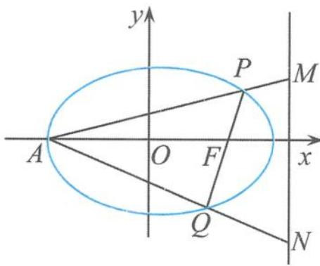

## 5.6.2 椭圆的顶焦点三角形的性质探究

在椭圆中,我们通常把一个焦点与过另一个焦点的弦所围成的三角形叫作焦点三角形.类似地,我们也把一个顶点(焦点所在对称轴上的顶点)与过另一个顶点所对应的焦点弦围成的三角形叫作顶焦点三角形.在椭圆的顶焦点三角形中,有许多与椭圆的焦点三角形相类似的几何特征,蕴含着椭圆很多耳目一新的几何性质,这些性质浑然一体、相得益彰,值得我们去探究与总结.在高考试题和全国各地的高考模拟试题中,以顶焦点三角形为载体的问题更是层出不穷,精彩纷呈.

## (1)一道考题的背景探究

例 2 设 A, B 分别为椭圆 $\frac{x^{2}}{a^{2}} + \frac{y^{2}}{b^{2}} = 1 (a > b > 0)$ 的左、右顶点，椭圆长半轴的长等于焦距，且直线 x = 4 为它的右准线.

(Ⅰ)求椭圆的方程.

(Ⅱ)设 $P$ 为右准线上不同于点 $(4,0)$ 的任意一点, 若直线 $AP, BP$ 分别与椭圆相交于异于 $A, B$ 的点 $M, N$ , 证明: 点 $B$ 在以 $MN$ 为直径的圆内.

点评 这是一道背景深刻、意境幽深、内容丰富的试题,独具匠心的试题内涵对我们高考复习具有较强的导向功能与启迪作用.由试题中的条件我们容易得到,直线 $MN$ 过椭圆的右焦点,所以该试题中涉及的 $\triangle AMN$ 就是一个典型的顶焦点三角形,该试题就是以顶焦点三角形作为载体来揭示了椭圆的一个重要性质.

## (2)与斜率有关的问题探究

直线的斜率是解析几何问题中非常活跃的元素之一,圆锥曲线的很多性质往往是通过直线的斜率这个平台来展开讨论的,利用斜率来表达其性质.

探究 1 在椭圆 $\frac{x^{2}}{a^{2}} + \frac{y^{2}}{b^{2}} = 1 (a > b > 0)$ 的顶焦点三角形 APQ 中, A 为椭圆的左顶点, P, Q 为右焦点弦的两个端点, 则直线 AP, AQ 的斜率之积为定值 $-(e-1)^{2}$ . (e 为离心率)

证明 设 $P(x_{1}, y_{1})$ , $Q(x_{2}, y_{2})$ , 直线 PQ 的方程为

$$
x = m y + c,
$$

将其代入椭圆方程得

$$
(b ^ {2} m ^ {2} + a ^ {2}) y ^ {2} + 2 b ^ {2} c m y + b ^ {2} c ^ {2} - a ^ {2} b ^ {2} = 0,
$$

从而

$$
y _ {1} + y _ {2} = \frac {- 2 b ^ {2} c m}{b ^ {2} m ^ {2} + a ^ {2}}, y _ {1} y _ {2} = \frac {b ^ {2} c ^ {2} - a ^ {2} b ^ {2}}{b ^ {2} m ^ {2} + a ^ {2}}.
$$

因此

$k_{AP} \cdot k_{AQ} = \frac{y_1}{x_1 + a} \cdot \frac{y_2}{x_2 + a} = \frac{y_1 y_2}{(my_1 + a + c)(my_2 + a + c)} = \frac{y_1 y_2}{m^2 y_1 y_2 + m(a + c)(y_1 + y_2) + (a + c)^2} \quad (*)$ .

又（\*）的分母 $= \frac{m^2(b^2c^2 - a^2b^2)}{a^2 + m^2b^2} + (a + c)\frac{-2b^2m^2c}{a^2 + m^2b^2} + (a^2 + 2ac + c^2) = \frac{a^2(a + c)^2}{a^2 + m^2b^2}$ , 而（\*）的分子 $= \frac{b^2c^2 - a^2b^2}{b^2m^2 + a^2}$ , 所以

$$
k _ {A P} \cdot k _ {A Q} = \frac {b ^ {2} c ^ {2} - a ^ {2} b ^ {2}}{a ^ {2} (a + c) ^ {2}} = - (e - 1) ^ {2}.
$$

证毕.

## (3)与准线有关的问题探究

顶焦点三角形中含有焦点,而焦点与准线是息息相关的,所以研究顶焦点三角形必须要考虑与准线之间的内在关系.

探究 2 如图 5.6-2, 在椭圆 $\frac{x^{2}}{a^{2}} + \frac{y^{2}}{b^{2}} = 1 (a > b > 0)$ 的顶焦点三角形 APQ 中, A 为椭圆的左顶点, P, Q 为右焦点弦的两个端点, l 为右准线. 若 $AP \cap l = M, AQ \cap l = N$ , 证明: 点 M, N 的纵坐标之积为定值 $-\frac{b^{4}}{c^{2}}$ .

证明 由“探究1”可知

  
图5.6-2

$$
k _ {A P} \cdot k _ {A Q} = - (e - 1) ^ {2}.
$$

因为 $k_{AP} \cdot k_{AQ} = k_{AM} \cdot k_{AN}$ ，所以

$$
k _ {A M} \cdot k _ {A N} = \frac {y _ {M}}{\frac {a ^ {2}}{c} + a} \cdot \frac {y _ {N}}{\frac {a ^ {2}}{c} + a} = - (e - 1) ^ {2},
$$

从而

$$
y _ {M} \cdot y _ {N} = - \frac {b ^ {4}}{c ^ {2}}.
$$

引申 在椭圆 $\frac{x^2}{a^2} +\frac{y^2}{b^2} = 1(a > b > 0)$ 的顶焦点三角形APQ中， $A$ 为椭圆的左顶点， $P,Q$ 为右焦点弦的两个端点， $l$ 为右准线， $F$ 为右焦点.若 $AP\cap l = M,AQ\cap l = N$ ，证明： $\angle MFN$ $= 90^{\circ}$

证明 由“探究2”可知

$$
y _ {M} \cdot y _ {N} = - \frac {b ^ {4}}{c ^ {2}},
$$

所以

$$
k _ {F M} \cdot k _ {F N} = \frac {y _ {M}}{\frac {a ^ {2}}{c} - c} \cdot \frac {y _ {N}}{\frac {a ^ {2}}{c} - c} = \frac {y _ {M} y _ {N}}{\frac {b ^ {4}}{c ^ {2}}} = - 1.
$$

因此 $\angle MFN=90^{\circ}$ .

探究 3 在椭圆 $\frac{x^{2}}{a^{2}} + \frac{y^{2}}{b^{2}} = 1 (a > b > 0)$ 的顶焦点三角形 APQ 中, A 为椭圆的左顶点, P, Q 为右焦点弦的两个端点, l 为右准线. 若 $AP \cap l = M, AQ \cap l = N$ , 证明: 直线 PN 与直线 QM 相交于椭圆的右顶点 B.

证明 设 $P(x_{1}, y_{1})$ , $Q(x_{2}, y_{2})$ , 直线 PQ 的方程为

$$
x = m y + c,
$$

联立方程 $\left\{\begin{aligned}x&=my+c,\\ \frac{x^{2}}{a^{2}}+\frac{y^{2}}{b^{2}}&=1,\end{aligned}\right.$ 消去x，化简得

$$
(a ^ {2} + b ^ {2} m ^ {2}) y ^ {2} + 2 b ^ {2} c m y - b ^ {4} = 0,
$$

从而

$$
y _ {1} + y _ {2} = \frac {- 2 b ^ {2} c m}{a ^ {2} + b ^ {2} m ^ {2}}, y _ {1} y _ {2} = \frac {- b ^ {4}}{a ^ {2} + b ^ {2} m ^ {2}} \quad ①.
$$

直线 $AP$ 的方程为 $y = \frac{y_1}{x_1 + a} (x + a)$ , 与 $l$ 的方程 $x = \frac{a^2}{c}$ 联立, 可得点 $M$ 的纵坐标

$$
y _ {M} = \frac {y _ {1}}{x _ {1} + a} \left(\frac {a ^ {2}}{c} + a\right).
$$

同理可得

$$
y _ {N} = \frac {y _ {2}}{x _ {2} + a} \left(\frac {a ^ {2}}{c} + a\right).
$$

所以

$$
k _ {P B} = \frac {y _ {1}}{x _ {1} - a} = \frac {y _ {1}}{m y _ {1} + c - a},
$$

$$
k _ {N B} = \frac {y _ {N}}{\frac {a ^ {2}}{c} - a} = \frac {a + c}{a - c} \cdot \frac {y _ {2}}{x _ {2} + a} = \frac {a + c}{a - c} \cdot \frac {y _ {2}}{m y _ {2} + c + a},
$$

从而

$$
k _ {P B} - k _ {N B} = \frac {y _ {1}}{m y _ {1} + c - a} - \frac {a + c}{a - c} \cdot \frac {y _ {2}}{m y _ {2} + c + a} = \frac {b ^ {2} (y _ {1} + y _ {2}) - 2 m c y _ {1} y _ {2}}{(m y _ {1} + c - a) (m y _ {2} + c + a) (a - c)}\tag{②.}
$$

把①代入②可得

$$
k _ {P B} - k _ {N B} = 0.
$$

所以直线 $PN$ 与 $x$ 轴相交于椭圆的右顶点 $B$ . 同理, 直线 $QM$ 与 $x$ 轴相交于椭圆的右顶点 $B$ , 所以直线 $PN$ 与直线 $QM$ 相交于椭圆的右顶点 $B$ .

探究 4 在椭圆 $\frac{x^{2}}{a^{2}} + \frac{y^{2}}{b^{2}} = 1 (a > b > 0)$ 的顶焦点三角形 APQ 中, A 为椭圆的左顶点, B 为椭圆的右顶点, P, Q 为右焦点弦的两个端点. 若 $AP \cap BQ = M$ , 证明: 点 M 在右准线 l 上.

证明 设 $P(x_{1},y_{1}),Q(x_{2},y_{2})$ ，直线 $PQ$ 的方程为

$$
x = m y + c,
$$

将其代入椭圆方程得

$$
(b ^ {2} m ^ {2} + a ^ {2}) y ^ {2} + 2 b ^ {2} c m y + b ^ {2} c ^ {2} - a ^ {2} b ^ {2} = 0,
$$

所以

$$
y _ {1} + y _ {2} = \frac {- 2 b ^ {2} c m}{b ^ {2} m ^ {2} + a ^ {2}}, y _ {1} y _ {2} = \frac {b ^ {2} c ^ {2} - a ^ {2} b ^ {2}}{b ^ {2} m ^ {2} + a ^ {2}}.
$$

从而

$$
x _ {1} y _ {2} + x _ {2} y _ {1} = (m y _ {1} + c) y _ {2} + (m y _ {2} + c) y _ {1} = 2 m y _ {1} y _ {2} + c (y _ {1} + y _ {2}) = \frac {a ^ {2}}{c} (y _ {1} + y _ {2})\tag{①,}
$$

且

$$
x _ {2} y _ {1} - x _ {1} y _ {2} = (m y _ {2} + c) y _ {1} - (m y _ {1} + c) y _ {2} = c \left(y _ {1} - y _ {2}\right) \quad ②.
$$

直线 $BP$ 的方程为 $y = \frac{y_1}{x_1 - a} (x - a)$ , 直线 $AQ$ 的方程为 $y = \frac{y_2}{x_2 + a} (x + a)$ , 联立并消去 $y$ , 可得点 $M$ 的横坐标

$$
x = \frac {a (x _ {1} y _ {2} + x _ {2} y _ {1}) + a ^ {2} (y _ {1} - y _ {2})}{(x _ {2} y _ {1} - x _ {1} y _ {2}) + a (y _ {1} + y _ {2})} \tag {③.}
$$

把①②代入③得

$$
x = \frac {a ^ {2}}{c},
$$

即点 M 在右准线 l 上.

引申 在椭圆 $\frac{x^2}{a^2} +\frac{y^2}{b^2} = 1(a > b > 0)$ 的顶焦点三角形APQ中， $A$ 为椭圆的左顶点， $B$ 为椭圆的右顶点， $P,Q$ 为右焦点弦的两个端点.若 $AP\cap BQ = M,AQ\cap BP = N$ ，过 $P,Q$ 两点的切线交于点 $S$ ，则点 $M,N,S$ 都在右准线 $l$ 上.

证明 由“探究4”可知,点M在右准线l上.同理可证点N也在右准线l上,下面只要证明S在右准线l上即可.过点 $P(x_{1},y_{1}),Q(x_{2},y_{2})$ 的切线方程分别为

$$
\frac {x x _ {1}}{a ^ {2}} + \frac {y y _ {1}}{b ^ {2}} = 1 \quad ①,
$$

$$
\frac {x x _ {2}}{a ^ {2}} + \frac {y y _ {2}}{b ^ {2}} = 1 \quad ②.
$$

由①× $y_{2}$ -②× $y_{1}$ 得

$$
\frac {x (x _ {1} y _ {2} - x _ {2} y _ {1})}{a ^ {2}} = y _ {2} - y _ {1} \quad ③.
$$

另外，由“探究4”的证明可知

$$
x _ {2} y _ {1} - x _ {1} y _ {2} = (m y _ {2} + c) y _ {1} - (m y _ {1} + c) y _ {2} = c (y _ {1} - y _ {2}),
$$

把此式代入③得

$$
x = \frac {a ^ {2}}{c},
$$

即点 S 在右准线 l 上, 从而命题得证.

点评 椭圆的顶焦点三角形的性质还有很多,限于篇幅,本节不作罗列.另外,椭圆相应的性质推广到双曲线、抛物线后,同样成立,同样精彩.
