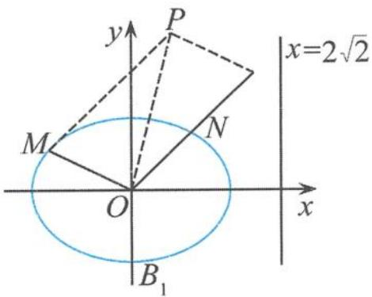

## 5.6.3 圆锥曲线的相似曲线的性质探究

(1) 问题的呈现

例 3 如图 5.6-3, 椭圆的中心为原点 O, 离心率 $e=\frac{\sqrt{2}}{2}$ , 一条准线的方程是 $x=2\sqrt{2}$ .

(Ⅰ)求该椭圆的标准方程.

(Ⅱ)设动点 P 满足 $\overrightarrow{OP} = \overrightarrow{OM} + 2\overrightarrow{ON}$ ，其中 M, N 是椭圆上的点，直线 OM 与直线 ON 的斜率之积为 $-\frac{1}{2}$ . 问：是否存在两个定点 $F_{1}, F_{2}$ ，使得 $\left|PF_{1}\right| + \left|PF_{2}\right|$ 为定值？若存在，求 $F_{1}, F_{2}$ 的坐标；若不存在，请说明理由.

  
图5.6-3

解答 (Ⅰ)易得该椭圆的标准方程为

$$
\frac {x ^ {2}}{4} + \frac {y ^ {2}}{2} = 1.
$$

(Ⅱ)设点 $P(x,y)$ , $M(x_{1},y_{1})$ , $N(x_{2},y_{2})$ ，则直线 OM 与直线 ON 的斜率之积为 $\frac{y_{1}}{x_{1}} \cdot \frac{y_{2}}{x_{2}} = -\frac{1}{2}$ ，即

$$
x _ {1} x _ {2} + 2 y _ {1} y _ {2} = 0.
$$

由 $\overrightarrow{OP} = \overrightarrow{OM} + 2\overrightarrow{ON}$ 得到

$$
x = x _ {1} + 2 x _ {2}, y = y _ {1} + 2 y _ {2}.
$$

因为点 M, N 在椭圆 $x^{2} + 2y^{2} = 4$ 上, 所以

$$
x _ {1} ^ {2} + 2 y _ {1} ^ {2} = 4, x _ {2} ^ {2} + 2 y _ {2} ^ {2} = 4,
$$

故

$$
\begin{array}{r l} x ^ {2} + 2 y ^ {2} & = (x _ {1} + 2 x _ {2}) ^ {2} + 2 (y _ {1} + 2 y _ {2}) ^ {2} = (x _ {1} ^ {2} + 2 y _ {1} ^ {2}) + 4 (x _ {2} ^ {2} + 2 y _ {2} ^ {2}) + 4 (x _ {1} x _ {2} + 2 y _ {1} y _ {2}) \\ & = 2 0 + 4 (x _ {1} x _ {2} + 2 y _ {1} y _ {2}) = 2 0. \end{array}
$$

所以动点 $P$ 是椭圆 $\frac{x^2}{20} +\frac{y^2}{10} = 1$ 上的点，设该椭圆的左、右焦点分别为 $F_{1},F_{2}$ ，由椭圆的定义知 $\vert PF_1\vert +\vert PF_2\vert$ 为定值 $4\sqrt{5}$ ，因此

$$
F _ {1} (- \sqrt {1 0}, 0), F _ {2} (\sqrt {1 0}, 0).
$$

问题剖析 透过问题的现象看本质是我们数学学习义不容辞的任务,如何看本质呢?首先,把问题丰富多彩的背景去掉,凸现出问题的实质;其次,把问题进行一般化探究,此时往往需要观察问题的结构特征,从中寻找解决问题的突破口,很快发现问题中“直线 OM 与直线 ON 的斜率之积为 $-\frac{1}{2}$ ”,其实 $-\frac{1}{2}$ 恰好是 $e^{2}-1$ (e 为椭圆的离心率),这是一个不可多得的重要线索;最后,顺藤摸瓜去探索即可.容易得到下面的一般化探究.

一般化探究 设 M, N 是椭圆 $\frac{x^{2}}{a^{2}} + \frac{y^{2}}{b^{2}} = 1 (a > b > 0)$ 上的点，直线 OM 与直线 ON 的斜率之积为 $e^{2} - 1$ (e 为椭圆的离心率)，动点 P 满足 $\overrightarrow{OP} = \lambda \overrightarrow{OM} + \mu \overrightarrow{ON} (\lambda, \mu \in \mathbb{R})$ ，则动点 P 在椭圆 $\frac{x^{2}}{a^{2}} + \frac{y^{2}}{b^{2}} = \lambda^{2} + \mu^{2}$ 上.

证明 设点 $P(x, y), M(x_1, y_1), N(x_2, y_2)$ ，则直线 $OM, ON$ 的斜率之积为 $\frac{y_1}{x_1} \cdot \frac{y_2}{x_2} = e^2 - 1 = -\frac{b^2}{a^2}$ ，即

$$
b ^ {2} x _ {1} x _ {2} + a ^ {2} y _ {1} y _ {2} = 0.
$$

由 $\overrightarrow{OP} = \lambda \overrightarrow{OM} +\mu \overrightarrow{ON}$ 得

$$
x = \lambda x _ {1} + \mu x _ {2}, y = \lambda y _ {1} + \mu y _ {2}.
$$

因为点 M, N 在椭圆 $b^{2}x^{2} + a^{2}y^{2} = a^{2}b^{2}$ 上, 所以

$$
b ^ {2} x _ {1} ^ {2} + a ^ {2} y _ {1} ^ {2} = a ^ {2} b ^ {2}, b ^ {2} x _ {2} ^ {2} + a ^ {2} y _ {2} ^ {2} = a ^ {2} b ^ {2}.
$$

$$
b ^ {2} x ^ {2} + a ^ {2} y ^ {2} = b ^ {2} \left(\lambda x _ {1} + \mu x _ {2}\right) ^ {2} + a ^ {2} \left(\lambda y _ {1} + \mu y _ {2}\right) ^ {2}
$$

$$
= \lambda^ {2} (b ^ {2} x _ {1} ^ {2} + a ^ {2} y _ {1} ^ {2}) + \mu^ {2} (b ^ {2} x _ {2} ^ {2} + a ^ {2} y _ {2} ^ {2}) + 2 \lambda \mu (b ^ {2} x _ {1} x _ {2} + a ^ {2} y _ {1} y _ {2})
$$

$$
= \lambda^ {2} a ^ {2} b ^ {2} + \mu^ {2} a ^ {2} b ^ {2} = (\lambda^ {2} + \mu^ {2}) a ^ {2} b ^ {2}.
$$

所以动点 P 在椭圆 $\frac{x^{2}}{a^{2}} + \frac{y^{2}}{b^{2}} = \lambda^{2} + \mu^{2}$ 上.

点评 试题格调新颖,寓意深厚,令人耳目一新.题目立意之新,内涵之广,别具一格.从试题的题型来看,这是一道探索性的问题,对培养我们的探究能力大有好处;从结构特征来看,这是一道有关圆锥曲线的定值问题;从问题的本质来看,这是一道有关圆锥曲线的轨迹问题.

## (2)问题的探究

“横看成岭侧成峰,远近高低各不同.”对于一个问题只有从不同的角度进行全方位地剖析才能触及问题的本质.所以,我们有必要对此问题进行全方位地引申、探究.探究它的发生、发展过程,我们的学习就会收到意想不到的效果.

## (i)变式探究

例 4 设 M, N 是椭圆 $\frac{x^{2}}{a^{2}} + \frac{y^{2}}{b^{2}} = 1 (a > b > 0)$ 上的点，直线 OM, ON 的斜率之积为 $e^{2} - 1$ (e 为椭圆的离心率)，动点 P 满足 $\overrightarrow{OP} = \lambda \overrightarrow{OM} + \mu \overrightarrow{ON} (\lambda, \mu \in \mathbb{R})$ ，则动点 P 的轨迹在椭圆 $\frac{x^{2}}{a^{2}} + \frac{y^{2}}{b^{2}} = 1$ 上的充要条件是 $\lambda^{2} + \mu^{2} = 1$ .

链接 已知椭圆的中心为坐标原点 O，焦点在 x 轴上，斜率为 1 且过椭圆右焦点 F 的直线交椭圆于 A, B 两点， $\overrightarrow{OA} + \overrightarrow{OB}$ 与 $a = (3, -1)$ 共线。

## (I)求椭圆的离心率.

(Ⅱ)设 M 为椭圆上的任意一点，且 $\overrightarrow{OM} = \lambda \overrightarrow{OA} + \lambda \overrightarrow{OB} (\lambda, \mu \in \mathbb{R})$ ，证明： $\lambda^{2} + \mu^{2}$ 为定值.

## (ii) 引申探究

例 5 设 M, N 是双曲线 $\frac{x^{2}}{a^{2}} - \frac{y^{2}}{b^{2}} = 1 (a > 0, b > 0)$ 上的点，直线 OM, ON 的斜率之积为 $e^{2} - 1 (e$ 为椭圆的离心率），动点 P 满足 $\overrightarrow{OP} = \lambda \overrightarrow{OM} + \mu \overrightarrow{ON} (\lambda, \mu \in \mathbb{R})$ ，则动点 P 在双曲线 $\frac{x^{2}}{a^{2}} - \frac{y^{2}}{b^{2}} = \lambda^{2} + \mu^{2}$ 上.

证明 设点 $P(x, y), M(x_1, y_1), N(x_2, y_2)$ ，则直线 $OM, ON$ 的斜率之积为 $\frac{y_1}{x_1} \cdot \frac{y_2}{x_2} = e^2 - 1 = \frac{b^2}{a^2}$ ，即

$$
b ^ {2} x _ {1} x _ {2} - a ^ {2} y _ {1} y _ {2} = 0.
$$

由 $\overrightarrow{OP} = \lambda \overrightarrow{OM} +\mu \overrightarrow{ON}$ 得

$$
x = \lambda x _ {1} + \mu x _ {2}, y = \lambda y _ {1} + \mu y _ {2}.
$$

因为点 M, N 在椭圆 $b^{2}x^{2}-a^{2}y^{2}=a^{2}b^{2}$ 上, 所以

$$
b ^ {2} x _ {1} ^ {2} - a ^ {2} y _ {1} ^ {2} = a ^ {2} b ^ {2}, b ^ {2} x _ {2} ^ {2} - a ^ {2} y _ {2} ^ {2} = a ^ {2} b ^ {2}.
$$

故 $b^{2}x^{2} - a^{2}y^{2} = b^{2}(\lambda x_{1} + \mu x_{2})^{2} - a^{2}(\lambda y_{1} + \mu y_{2})^{2}$

$$
= \lambda^ {2} \left(b ^ {2} x _ {1} ^ {2} - a ^ {2} y _ {1} ^ {2}\right) + \mu^ {2} \left(b ^ {2} x _ {2} ^ {2} - a ^ {2} y _ {2} ^ {2}\right) + 2 \lambda \mu \left(b ^ {2} x _ {1} x _ {2} - a ^ {2} y _ {1} y _ {2}\right)
$$

$$
= \lambda^ {2} a ^ {2} b ^ {2} + \mu^ {2} a ^ {2} b ^ {2} = (\lambda^ {2} + \mu^ {2}) a ^ {2} b ^ {2}.
$$

所以动点 P 在双曲线 $\frac{x^{2}}{a^{2}} - \frac{y^{2}}{b^{2}} = \lambda^{2} + \mu^{2}$ 上.

## (iii)逆向探究

逆向探究 1 设 M, N 是椭圆 $\frac{x^{2}}{a^{2}} + \frac{y^{2}}{b^{2}} = 1 (a > b > 0)$ 上的点，动点 P 在椭圆 $\frac{x^{2}}{a^{2}} + \frac{y^{2}}{b^{2}} = \lambda^{2} + \mu^{2} (\lambda, \mu \in \mathbb{R})$ 上，动点 P 满足 $\overrightarrow{OP} = \lambda \overrightarrow{OM} + \mu \overrightarrow{ON}$ ，则直线 OM 与直线 ON 的斜率之积为 $e^{2} - 1 (e^{\text{为椭圆的离心率}})$ .

证明 设点 $P(x,y),M(x_1,y_1),N(x_2,y_2)$ ，由 $\overrightarrow{OP} = \lambda \overrightarrow{OM} +\mu \overrightarrow{ON}$ 得

$$
x = \lambda x _ {1} + \mu x _ {2}, y = \lambda y _ {1} + \mu y _ {2}.
$$

因为点 M, N 在椭圆 $b^{2}x^{2} + a^{2}y^{2} = a^{2}b^{2}$ 上, 所以

$$
b ^ {2} x _ {1} ^ {2} + a ^ {2} y _ {1} ^ {2} = a ^ {2} b ^ {2}, b ^ {2} x _ {2} ^ {2} + a ^ {2} y _ {2} ^ {2} = a ^ {2} b ^ {2}.
$$

$$
\begin{array}{r l} & {\text {故} b ^ {2} x ^ {2} + a ^ {2} y ^ {2} = b ^ {2} (\lambda x _ {1} + \mu x _ {2}) ^ {2} + a ^ {2} (\lambda y _ {1} + \mu y _ {2}) ^ {2}} \\ & {= \lambda^ {2} (b ^ {2} x _ {1} ^ {2} + a ^ {2} y _ {1} ^ {2}) + \mu^ {2} (b ^ {2} x _ {2} ^ {2} + a ^ {2} y _ {2} ^ {2}) + 2 \lambda \mu (b ^ {2} x _ {1} x _ {2} + a ^ {2} y _ {1} y _ {2})} \\ & {= (\lambda^ {2} + \mu^ {2}) a ^ {2} b ^ {2} + 2 \lambda \mu (b ^ {2} x _ {1} x _ {2} + a ^ {2} y _ {1} y _ {2}).} \end{array}
$$

又因为点 $P$ 在椭圆 $\frac{x^2}{a^2} +\frac{y^2}{b^2} = \lambda^2 +\mu^2$ 上，所以

$$
b ^ {2} x ^ {2} + a ^ {2} y ^ {2} = (\lambda^ {2} + \mu^ {2}) a ^ {2} b ^ {2},
$$

得到 $b^{2}x_{1}x_{2} + a^{2}y_{1}y_{2} = 0$ ，即

$$
\frac {y _ {1}}{x _ {1}} \cdot \frac {y _ {2}}{x _ {2}} = - \frac {b ^ {2}}{a ^ {2}}.
$$

因此直线 $OM$ 与直线 $ON$ 的斜率之积为

$$
\frac {y _ {1}}{x _ {1}} \cdot \frac {y _ {2}}{x _ {2}} = - \frac {b ^ {2}}{a ^ {2}} = e ^ {2} - 1.
$$

逆向探究 2 设 M, N 是双曲线 $\frac{x^{2}}{a^{2}} - \frac{y^{2}}{b^{2}} = 1 (a > 0, b > 0)$ 上的点，动点 P 在双曲线 $\frac{x^{2}}{a^{2}} - \frac{y^{2}}{b^{2}} = \lambda^{2} + \mu^{2} (\lambda, \mu \in \mathbb{R})$ 上，动点 P 满足 $\overrightarrow{OP} = \lambda \overrightarrow{OM} + \mu \overrightarrow{ON}$ ，则直线 OM 与直线 ON 的斜率之积为 $e^{2} - 1 (e$ 为双曲线的离心率。

点评 问题的探究可以通过变换视角、变换条件、开放条件等手段进行,在探究中感悟到高考题是以不变之本,应万变之体.克服学习数学的思维定式,拓宽解题思路,培养思维的灵活性、严密性和深刻性,进一步加强对基础知识、基本技能的理解.

## (3) 问题的拓展探究

由问题的“一般化探究”可知, 设 $M, N$ 是椭圆 $\frac{x^{2}}{a^{2}} + \frac{y^{2}}{b^{2}} = 1 (a > b > 0)$ 上的点, 直线 $OM$ 与直线 $ON$ 的斜率之积为 $e^{2} - 1 (e$ 为椭圆的离心率), 动点 $P$ 满足 $\overrightarrow{OP} = \lambda \overrightarrow{OM} + \mu \overrightarrow{ON} (\lambda, \mu \in \mathbb{R})$ , 则动点 $P$ 在椭圆 $\frac{x^{2}}{a^{2}} + \frac{y^{2}}{b^{2}} = \lambda^{2} + \mu^{2}$ 上, 即动点 $P$ 的轨迹与已知椭圆的离心率相同. 在数学上通常把这样的两个椭圆称作相似椭圆, 即把椭圆 $\frac{x^{2}}{a^{2}} + \frac{y^{2}}{b^{2}} = t (a > b > 0, t > 1)$ 叫作椭圆 $\frac{x^{2}}{a^{2}} + \frac{y^{2}}{b^{2}} = 1 (a > b > 0)$ 的相似椭圆. 至此, 问题的本质已经彻底浮出水面. 其实, 相似椭圆中蕴含着许多有趣的性质, 值得我们不断去探讨.

性质1 过椭圆 $\frac{x^2}{a^2} +\frac{y^2}{b^2} = t (a > b > 0,t > 1)$ 外一点 $P$ 作椭圆 $\frac{x^2}{a^2} +\frac{y^2}{b^2} = t$ 的切线 $PA, PB,$ 切点分别为 $A,B$ ；作椭圆 $\frac{x^2}{a^2} +\frac{y^2}{b^2} = 1$ 的切线 $PC, PD$ ，切点分别为 $C,D$ ，则 $AB / / CD.$ 证明 设 $P(x_0,y_0)$ ，则切点弦 $AB$ 所在直线的方程为

$$
\frac {x _ {0} x}{a ^ {2}} + \frac {y _ {0} y}{b ^ {2}} = t.
$$

同理,切点弦 CD 所在直线的方程为

$$
\frac {x _ {0} x}{a ^ {2}} + \frac {y _ {0} y}{b ^ {2}} = 1.
$$

故

$$
A B \parallel C D.
$$

性质2 从椭圆 $\frac{x^2}{a^2} +\frac{y^2}{b^2} = t(a > b > 0,t > 1)$ 的右顶点 $A$ 和上顶点 $B$ 分别作椭圆 $\frac{x^2}{a^2} +\frac{y^2}{b^2}$ $= 1$ 的切线 $AC$ 和 $BD$ .若直线 $AC,BD$ 的斜率分别为 $k_{1},k_{2}$ ，且 $k_{1}\cdot k_{2} <   0$ ，则 $k_{1}\cdot k_{2} = e^{2}$ $-1(e$ 为椭圆的离心率).

证明 设直线 $AC$ 的方程为 $y = k_{1}(x - \sqrt{ta})$ ，代入椭圆方程 $\frac{x^2}{a^2} + \frac{y^2}{b^2} = 1$ ，由 $\Delta = 0$ 得

$$
k _ {1} ^ {2} = \frac {b ^ {2}}{a ^ {2} (t - 1)}.
$$

设直线 $BD$ 的方程为 $y - \sqrt{t} b = k_2x$ ，代入椭圆方程 $\frac{x^2}{a^2} +\frac{y^2}{b^2} = 1$ ，由 $\Delta = 0$ 得

$$
k _ {2} ^ {2} = \frac {b ^ {2} (t - 1)}{a ^ {2}}.
$$

所以

$$
k _ {1} \cdot k _ {2} = - \frac {b ^ {2}}{a ^ {2}} = e ^ {2} - 1.
$$

点评 相似圆锥曲线还有很多丰富多彩的性质,由于篇幅限制,在此不做赘述.
