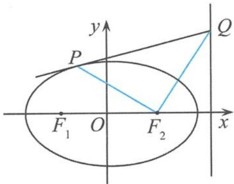
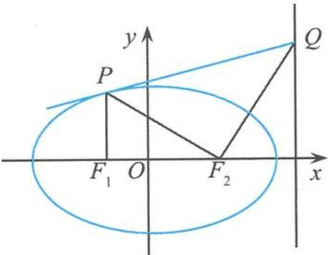

## 5.6.5 以椭圆的切线为背景的高考试题剖析

## (1) 高考试题的剖析

例 7 已知椭圆 $E: \frac{x^{2}}{a^{2}} + \frac{y^{2}}{b^{2}} = 1 (a > b > 0)$ 的左焦点为 $F_{1}$ 、右焦点为 $F_{2}$ 、离心率 $e = \frac{1}{2}$ . 过点 $F_{1}$ 的直线交椭圆于 A, B 两点，且 $\triangle ABF_{2}$ 的周长为 8.

(Ⅰ)求椭圆 E 的方程.

(II) 设动直线 $l: y = kx + m$ 与椭圆 $E$ 有且只有一个公共点 $P$ , 且与直线 $x = 4$ 相交于点 $Q$ . 试探究: 在坐标平面内是否存在定点 $M$ , 使得以 $PQ$ 为直径的圆恒过点 $M$ ? 若存在, 求出点 $M$ 的坐标; 若不存在, 请说明理由.

解答 (Ⅰ) 因为 $|AB| + |AF_{2}| + |BF_{2}| = 8$ , 所以

$$
\left| A F _ {1} \right| + \left| F _ {1} B \right| + \left| A F _ {2} \right| + \left| B F _ {2} \right| = 8.
$$

而 $|AF_{1}|+|AF_{2}|=|F_{1}B|+|BF_{2}|=2a$ ，所以4a=8，即

$$
a = 2.
$$

又 $e = \frac{c}{a} = \frac{1}{2}\Rightarrow c = \frac{1}{2} a = 1\Rightarrow b^2 = a^2 -c^2 = 3$ ，所以所求的椭圆方程为

$$
\frac {x ^ {2}}{4} + \frac {y ^ {2}}{3} = 1.
$$

(Ⅱ) 由 $\left\{\begin{aligned}y&=kx+m,\\ \frac{x^{2}}{4}&+\frac{y^{2}}{3}=1\end{aligned}\right.$ 得

$$
(4 k ^ {2} + 3) x ^ {2} + 8 k m x + 4 m ^ {2} - 1 2 = 0.
$$

令 $\Delta = 64k^2 m^2 - 4(4k^2 + 3)(4m^2 - 12) = 0$ ，得

$$
4 k ^ {2} - m ^ {2} + 3 = 0.
$$

此时 $x_0 = -\frac{4km}{4k^2 + 3} = -\frac{4k}{m}, y_0 = kx_0 + m = \frac{3}{m}$ , 得 $P\left(-\frac{4k}{m}, \frac{3}{m}\right)$ . 由 $\left\{ \begin{array}{l} y = kx + m, \\ x = 4 \end{array} \right.$ 得 $Q(4, 4k + m)$ . 由对称性, 设存在 $M(x_1, 0)$ , 则由 $\overrightarrow{MP} \cdot \overrightarrow{MQ} = 0$ 可得

$$
- \frac {1 6 k}{m} + \frac {4 k x _ {1}}{m} - 4 x _ {1} + x _ {1} ^ {2} + \frac {1 2 k}{m} + 3 = 0,
$$

所以

$$
(4 x _ {1} - 4) \frac {k}{m} + x _ {1} ^ {2} - 4 x _ {1} + 3 = 0.
$$

由于对任意 m, k 恒成立, 所以可得

$$
x _ {1} = 1.
$$

故存在定点 $M(1,0)$ ，符合题意。

点评 本题是福建省的高考数学试题,由题意易知动直线 l 是椭圆的一条切线,直线 x=4 为椭圆的右准线,定点 $M(1,0)$ 恰好为椭圆的右焦点,这样我们就可以把上述高考试题一般化.

一般化 如图 5.6-4, 已知点 $F_{1}(-c,0)$ , $F_{2}(c,0)$ 分别是椭圆 $C: \frac{x^{2}}{a^{2}} + \frac{y^{2}}{b^{2}} = 1 (a > b > 0)$ 的左、右焦点, 过椭圆 C 在 x 轴的上半部分的点 P 作椭圆 C 的切线 PQ, 交椭圆的准线 $x = \frac{a^{2}}{c}$ 于点 Q, 则直线 $PF_{2}$ 与直线 $QF_{2}$ 相互垂直.

  
图5.6-4

证明 设 $P(x_0, y_0)$ , 则椭圆在点 $P$ 处的切线方程为

$$
\frac {x _ {0} x}{a ^ {2}} + \frac {y _ {0} y}{b ^ {2}} = 1,
$$

故点 $Q$ 的坐标为 $Q\left(\frac{a^2}{c}, t\right)$ , 其中 $t = \left(1 - \frac{x_0}{c}\right) \frac{b^2}{y_0}$ , 所以

$$
k _ {P F _ {2}} \cdot k _ {Q F _ {2}} = \frac {y _ {0} - 0}{x _ {0} - c} \cdot \frac {t - 0}{\frac {a ^ {2}}{c} - c} = - 1,
$$

即直线 $PF_{2}$ 与直线 $QF_{2}$ 相互垂直,问题得证.

如果我们再把上面的试题改为其逆命题,则又容易得到如下的安徽省的高考数学试题第

例8 如图5.6-5, 已知点 $F_{1}(-c,0)$ , $F_{2}(c,0)$ 分别是椭圆 $C$ : $\frac{x^{2}}{a^{2}} + \frac{y^{2}}{b^{2}} = 1 (a > b > 0)$ 的左、右焦点, 经过点 $F_{1}$ 作 $x$ 轴的垂线, 交椭圆 $C$ 的上半部分于点 $P$ , 过点 $F_{2}$ 作直线 $PF_{2}$ 的垂线, 交直线 $x = \frac{a^{2}}{c}$ 于点 $Q$ .

  
图5.6-5

证明: 直线 PQ 与椭圆 C 只有一个交点(即直线 PQ 是椭圆 C 的切线).

证明 设点 $Q\left(\frac{a^2}{c}, y_2\right)$ , 则 $PF_2 \perp QF_2 \Leftrightarrow \frac{\frac{b^2}{a} - 0}{-c - c} \cdot \frac{y_2 - 0}{\frac{a^2}{c} - c} = -1 \Leftrightarrow y_2 = 2a$ , 得

$$
k _ {P Q} = \frac {2 a - \frac {b ^ {2}}{a}}{\frac {a ^ {2}}{c} + c} = \frac {c}{a}.
$$

由 $\frac{x^2}{a^2} +\frac{y^2}{b^2} = 1$ 得 $y = \sqrt{b^2 - \frac{b^2}{a^2}x^2}$ ，求导得

$$
y ^ {\prime} = \frac {- \frac {b ^ {2}}{a ^ {2}} x}{\sqrt {b ^ {2} - \frac {b ^ {2}}{a ^ {2}} x ^ {2}}}.
$$

而过点 $P$ 与椭圆 $C$ 相切的直线的斜率

$$
k = y ^ {\prime} \mid_ {x = - c} = \frac {c}{a} = k _ {P Q},
$$

故直线 PQ 与椭圆 C 只有一个交点, 即直线 PQ 是椭圆 C 的切线.

点评 同根同源的两道圆锥曲线高考试题,两道不同省份的高考试题,却有相同的知识背景,都汇聚了椭圆中重要的几何元素:焦点、准线、切线.两个试题互为逆命题,全面考查了解析几何的基本思想方法.透过纷繁芜杂的数学表面,看到自然而富有直观的数学内涵,得到精简朴实的数学本质.

## (2)试题的探究

“水石相激而生浪花点点,云天共拥始现苍穹渺渺。”对于一道高考试题,我们有必要对其进行全方位地引申、探究,剖析其本质内容.问题也只有在不断变式中探究,才能凸现出本质,要善于运用辩证的观点去思考分析,在运动中寻求定点、定值、定直线的“不变”性.改变题目的条件,会推出什么结论?保留题目的条件,结论能否进一步加强?条件做类似的变换,结论能否扩大到一般情形?像这样富有创造性的全方位思考,常常是我们发现新知识、认识新知识的重要突破口.

探究 1 已知点 $F_{1}(-c,0)$ , $F_{2}(c,0)$ 分别是椭圆 $C: \frac{x^{2}}{a^{2}} + \frac{y^{2}}{b^{2}} = 1 (a > b > 0)$ 的左、右焦点，经过点 $F_{1}$ 作 x 轴的垂线，交椭圆 C 在 x 轴的上半部分于点 P，椭圆 C 的切线 PQ 交准线 $x = \frac{a^{2}}{c}$ 于点 Q，则直线 $PF_{2}$ 与直线 $QF_{2}$ 相互垂直.

证明 因为 $P\left(-c, \frac{b^2}{a}\right)$ , 所以在椭圆上的点 $P$ 处的切线方程为 $\frac{(-c)x}{a^2} + \frac{\frac{b^2y}{a}}{b^2} = 1$ , 即

$$
c x - a y + a ^ {2} = 0.
$$

故点 $Q$ 的坐标为 $Q\left(\frac{a^2}{c}, 2a\right)$ , 所以

$$
k _ {P F _ {2}} \cdot k _ {Q F _ {2}} = \frac {\frac {b ^ {2}}{a} - 0}{- c - c} \times \frac {2 a - 0}{\frac {a ^ {2}}{c} - c} = - 1,
$$

即直线 $PF_{2}$ 与直线 $QF_{2}$ 垂直,问题得证.

探究 2 已知点 $F_{1}(-c,0)$ , $F_{2}(c,0)$ 分别是椭圆 $C: \frac{x^{2}}{a^{2}} + \frac{y^{2}}{b^{2}} = 1 (a > b > 0)$ 的左、右焦点，经过点 $F_{1}$ 作 x 轴的垂线，交椭圆 C 在 x 轴的上半部分于点 P，过点 $F_{2}$ 作直线 $PF_{2}$ 的垂线，交椭圆 C 的切线 PQ 于点 Q，则点 Q 在直线 $x = \frac{a^{2}}{c}$ 上.

证明 因为 $P\left(-c, \frac{b^2}{a}\right)$ , 所以椭圆在点 $P$ 处的切线方程为 $\frac{(-c)x}{a^2} + \frac{\frac{b^2}{a}y}{b^2} = 1$ , 即

$$
c x - a y + a ^ {2} = 0 \quad ①.
$$

又因为直线 $QF_{2}$ 的方程为

$$
y - 0 = \frac {2 a c}{b ^ {2}} (x - c) \quad ②,
$$

所以由①②解得

$$
x = \frac {a ^ {2}}{c}.
$$

故点 Q 在直线 $x=\frac{a^{2}}{c}$ 上, 问题得证.

点评 一道成功的高考试题往往意境深远,具有较强的再生能力与发展的空间,我们可以把它作为知识与能力的生长点,探究其中有趣的性质,多角度地考虑问题,使思维呈现辐射状展开,开阔视野,拓展思维.

如果我们把试题中的焦点与准线的条件再弱化,变成类焦点与类准线进行探究,又可以得到探究3.

探究 3 已知点 $E_{1}(-m,0)$ , $E_{2}(m,0)(m>0)$ 分别是椭圆 $C:\frac{x^{2}}{a^{2}}+\frac{y^{2}}{b^{2}}=1(a>b>0)$ 对称轴上的两个定点，经过点 $E_{1}$ 作 x 轴的垂线，交椭圆 C 在 x 轴的上半部分于点 P，过点 $E_{2}$ 作直线 $QE_{2}$ ，交直线 $x=\frac{a^{2}}{m}$ 于点 Q。若直线 $PE_{2}$ , $QE_{2}$ 的斜率分别为 $k_{1}, k_{2}$ ，且 $k_{1} \cdot k_{2} = \frac{b^{2}}{m^{2} - a^{2}}$ ，则直线 PQ 是椭圆 C 的切线。

证明 设 $P(-m, y_0)$ , 由题意知 $\frac{m^2}{a^2} + \frac{y_0^2}{b^2} = 1$ , 即

$$
y _ {0} ^ {2} = \frac {b ^ {2}}{a ^ {2}} (a ^ {2} - m ^ {2}) \quad ①.
$$

设点 $Q\left(\frac{a^2}{m}, t\right)$ , 则 $k_1 \cdot k_2 = \frac{y_0 - 0}{-m - m} \cdot \frac{t}{\frac{a^2}{m} - m} = \frac{b^2}{m^2 - a^2}$ , 从而

$$
y _ {0} t = 2 b ^ {2} \quad ②.
$$

所以直线 $PQ$ 的斜率

$$
k _ {P Q} = \frac {t - y _ {0}}{\frac {a ^ {2}}{m} + m} = \frac {m}{y _ {0}} \cdot \frac {t y _ {0} - y _ {0} ^ {2}}{a ^ {2} + m ^ {2}}\tag{③.}
$$

把①②代入③得

$$
k _ {P Q} = \frac {b ^ {2}}{a ^ {2}} \cdot \frac {m}{y _ {0}}.
$$

易知,在椭圆上点 P 处的切线的斜率

$$
k _ {\mathrm{切}} = \frac {b ^ {2}}{a ^ {2}} \cdot \frac {m}{y _ {0}},
$$

所以直线 PQ 是椭圆 C 的切线.

探究 4 已知点 $E_{1}(-m,0)$ , $E_{2}(m,0)(m>0)$ 分别是椭圆 $C:\frac{x^{2}}{a^{2}}+\frac{y^{2}}{b^{2}}=1(a>b>0)$ 对称轴上的两个定点，经过点 $E_{1}$ 作 x 轴的垂线，交椭圆 C 在 x 轴的上半部分于点 P，过点 $E_{2}$ 作直线 $QE_{2}$ ，交直线 $x=\frac{a^{2}}{m}$ 于点 Q。若直线 PQ 是椭圆 C 的切线，且直线 $PE_{2}, QE_{2}$ 的斜率分别为 $k_{1}$ ， $k_{2}$ ，则 $k_{1} \cdot k_{2} = \frac{b^{2}}{m^{2} - a^{2}}$ 。

证明 设 $P(-m, y_0)$ , 由题意知 $\frac{m^2}{a^2} + \frac{y_0^2}{b^2} = 1$ , 即

$$
y _ {0} ^ {2} = \frac {b ^ {2}}{a ^ {2}} (a ^ {2} - m ^ {2}) \quad ①.
$$

设点 $Q\left(\frac{a^2}{m}, t\right)$ , 则直线 $PQ$ 的斜率

$$
k _ {P Q} = \frac {t - y _ {0}}{\frac {a ^ {2}}{m} + m} = \frac {m}{y _ {0}} \cdot \frac {t y _ {0} - y _ {0} ^ {2}}{a ^ {2} + m ^ {2}}.
$$

易知,椭圆在点 P 处的切线的斜率

$$
k _ {\mathrm{切}} = \frac {b ^ {2}}{a ^ {2}} \cdot \frac {m}{y _ {0}},
$$

所以 $\frac{m}{y_0} \cdot \frac{b^2}{a^2} = \frac{m}{y_0} \cdot \frac{t y_0 - y_0^2}{a^2 + m^2}$ , 即

$$
t y _ {0} = \frac {b ^ {2}}{a ^ {2}} (a ^ {2} + m ^ {2}) + y _ {0} ^ {2} = \frac {b ^ {2}}{a ^ {2}} (a ^ {2} + m ^ {2}) + \frac {b ^ {2}}{a ^ {2}} (a ^ {2} - m ^ {2}) = 2 b ^ {2}\tag{②.}
$$

从而

$$
k _ {1} \cdot k _ {2} = \frac {y _ {0} - 0}{- m - m} \cdot \frac {t}{\frac {a ^ {2}}{m} - m} = \frac {y _ {0} t}{2 (m ^ {2} - a ^ {2})} \quad ③.
$$

把①②代入③得

$$
k _ {1} \cdot k _ {2} = \frac {b ^ {2}}{m ^ {2} - a ^ {2}}.
$$

探究 5 已知点 $E_{1}(-m,0)$ , $E_{2}(m,0)(m>0)$ 分别是椭圆 $C:\frac{x^{2}}{a^{2}}+\frac{y^{2}}{b^{2}}=1(a>b>0)$ 对称轴上的两个定点，经过点 $E_{1}$ 作 x 轴的垂线，交椭圆 C 的上半部分于点 P，过点 P 作椭圆 C 的切线，过点 $E_{2}$ 作直线 $QE_{2}$ ，与切线交于点 Q。若直线 $PE_{2}$ , $QE_{2}$ 的斜率分别为 $k_{1}, k_{2}$ ，且 $k_{1} \cdot k_{2} = \frac{b^{2}}{m^{2} - a^{2}}$ ，则点 Q 在直线 $x = \frac{a^{2}}{m}$ 上。

证明 设 $P(-m, y_0)$ , 则椭圆在点 $P$ 处的切线方程为

$$
\frac {(- m) x}{a ^ {2}} + \frac {y y _ {0}}{b ^ {2}} = 1 \quad ①.
$$

因为直线 $QE_{2}$ 的方程为

$$
y - 0 = \frac {- 2 m b ^ {2}}{(m ^ {2} - a ^ {2}) y _ {0}} (x - m)\tag{②,}
$$

所以由①②解得

$$
x = \frac {a ^ {2}}{m},
$$

则点 Q 在直线 $x=\frac{a^{2}}{m}$ 上, 问题得证.

## (3)试题的反思

每年高考解析几何试题总是五彩缤纷、精彩不断,不乏有许多点睛之作,或给人以启迪,或给人以思考.研究高考试题是我们学习研究的一个“规定”动作,剖析试题内涵,寻找试题之间的联系.我们可以从试题之间联系的角度去审视高考试题,置知识于系统中,着眼于知识之间的联系和规律,从而深入数学的本质.通过剖析试题,探讨知识联系、知识整合、探究规律等一系列思维活动.

探究是本章的主打曲。探究无止境，探究是数学学习中不可或缺的“旋律”。在本章中，没有高深的理论，也没有独特而神奇的方法，只有散落在各个章节中的一道道典型的试题。本章试图透过一个视角来寻找题根，让题目回归本源；试图通过对问题的剖析、反思与拓展，析出问题内在的光芒，让它链接更多的精彩；试图通过一条线索把一类问题串起来，构建起一个较为系统的知识网络；试图通过对问题的探究，把关注“解题”向关注“解决问题”转化，探究更多的圆锥曲线的秘密。

至此,我们要暂别圆锥曲线,挥挥手,请带走所有的精彩!
