1. 如图, 已知抛物线 $y^{2} = 4x$ 的焦点为 $F$ 、准线为 $l$ , 过点 $F$ 的直线交抛物线于 $A, B$ 两点, 点 $B$ 在准线 $l$ 上的投影为 $E, C$ 是抛物线上的一点, 且满足 $AC \perp EF$ .

(Ⅰ)若点 A 的坐标是 $(4,4)$ ，求线段 AC 的中点 M 的坐标.

(Ⅱ)求 $\triangle ABC$ 面积的最小值及此时直线AC的方程.

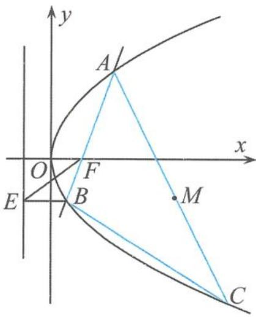  
(第1题)

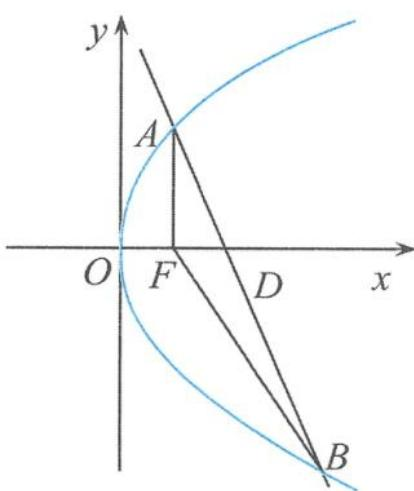  
(第2题)

2. 如图, 已知抛物线 $C: y^{2} = 2px (p > 0)$ , 其焦点为 $F$ , 直线 $l$ 交抛物线 $C$ 于 $A(x_{1}, y_{1}), B(x_{2}, y_{2})$ 两点, $D(x_{0}, y_{0})$ 为 $AB$ 的中点, 且 $|AF| + |BF| = 1 + 2x_{0}$ .

(Ⅰ)求抛物线 C 的方程.

(Ⅱ) 若 $x_{1}x_{2} + y_{1}y_{2} = -1$ ，求 $\frac{x_{0}}{|AB|}$ 的最小值.

3. 已知椭圆 $C: \frac{x^{2}}{a^{2}} + \frac{y^{2}}{b^{2}} = 1 (a > b > 0)$ 的离心率为 $\frac{\sqrt{2}}{2}$ , 其右焦点到椭圆 $C$ 外一点 $P(2,1)$ 的距离为 $\sqrt{2}$ , 不过原点 $O$ 的直线 $l$ 与椭圆 $C$ 相交于 $A, B$ 两点, 且线段 $AB$ 的长度为 2.

(Ⅰ)求椭圆 C 的方程.

(Ⅱ)求 $\triangle AOB$ 面积S的最大值.

4. 如图, 已知 $P(-2,0)$ 是椭圆 $C_{1}: \frac{x^{2}}{a^{2}} + \frac{y^{2}}{b^{2}} = 1 (a > b > 0)$ 的一个顶点, 椭圆 $C_{1}$ 的短轴是圆 $C_{2}: x^{2} + y^{2} = 2$ 的直径, 直线 $l_{1}, l_{2}$ 过点 $P$ 且互相垂直, $l_{1}$ 交椭圆 $C_{1}$ 于另一点 $D, l_{2}$ 交圆 $C_{2}$ 于 $A, B$ 两点.

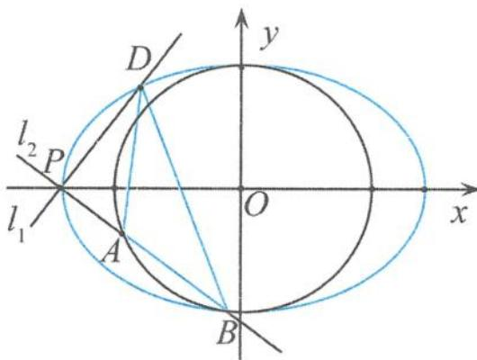

(I)求椭圆 $C_1$ 的标准方程.

(第 4 题)

(Ⅱ)求 $\triangle ABD$ 面积的最大值.

5. 已知抛物线 $y^{2}=2px(p>0)$ 的焦点 F 到准线 l 的距离为 2，直线 $x-y+m=0(m\in\mathbb{R})$ 与抛物线相交于不同的两点 A, B.

(Ⅰ)求抛物线的方程.

(Ⅱ)问:是否存在与 m 的取值无关的定点 T,使得直线 AT,BT 的斜率之和恒为一个定值?若存在,求出所有点 T 的坐标;若不存在,请说明理由.

6. 已知椭圆 $\frac{x^2}{a^2} + \frac{y^2}{b^2} = 1 (a > b > 0)$ 的离心率为 $\frac{\sqrt{3}}{2}$ , 且经过点 $(1, \frac{\sqrt{3}}{2})$ .

(Ⅰ)求椭圆的标准方程.

(II)设椭圆的上、下顶点分别为 $A, B, P$ 是椭圆上异于 $A, B$ 的任意一点, $PQ \perp y$ 轴, $Q$ 为垂足, $M$ 为线段 $PQ$ 的中点, 直线 $AM$ 交直线 $l: y = -1$ 于点 $C, N$ 为线段 $BC$ 的中点. 若四边形 $MOBN$ 的面积为 2 , 求直线 $AM$ 的方程.

7. 已知离心率为 $\frac{\sqrt{2}}{2}$ 的椭圆 $E: \frac{y^2}{a^2} + \frac{x^2}{b^2} = 1 (a > b > 0)$ 的短轴的两个端点分别为 $B_1, B_2, P$ 为椭圆 $E$ 上异于 $B_1, B_2$ 的动点，且 $\triangle PB_1B_2$ 的面积最大值为 $2\sqrt{2}$ .

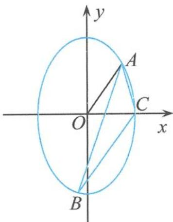

(I)求椭圆 E 的方程.

(Ⅱ)如图,射线 $y=\sqrt{2}x(x\geqslant0)$ 与椭圆 E 交于点 A, 过点 A 作倾斜角互补的两条直线, 它们与椭圆的另一个交点分别为点 B 和点 C, 求 $\triangle ABC$ 面积的最大值.

(第 7 题)

8. 如图, 直线 $l$ 与抛物线 $y^{2} = 2x$ 相交于 $A, B$ 两点, 与 $x$ 轴交于点 $Q$ , 且 $OA \perp OB, OD \perp l$ 于点 $D(m, n)$ .

(I) 当 n=1 时, 求 m 的值.

(Ⅱ) 当 $m \in \left[\frac{1}{2}, \frac{3}{2}\right]$ 时，求 $\triangle ODQ$ 与 $\triangle OAB$ 的面积之积 $S_{\triangle ODQ} \cdot S_{\triangle OAB}$ 的取值范围.

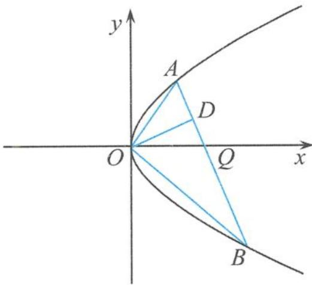  
(第8题)

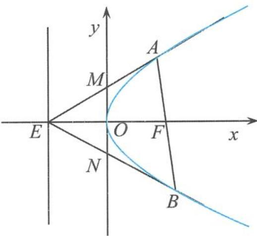  
(第9题)

9. 如图, 抛物线 $y^{2} = 2px (p > 0)$ 的焦点为 $F$ , 抛物线的准线与 $x$ 轴的交点为 $E$ , 直线 $AB$ 经过抛物线的焦点 $F$ , 与抛物线交于 $A, B$ 两点, 直线 $AE, BE$ 分别与 $y$ 轴交于 $M, N$ 两点, 记 $\triangle ABE$ , $\triangle MNE$ 的面积分别为 $S_{1}, S_{2}$ .

(I)证明: $\frac{S_{1}^{2}}{|AB|}=\frac{p^{3}}{2}.$

(Ⅱ) 若 $S_{1} \geqslant \lambda S_{2}$ 恒成立, 求 $\lambda$ 的最大值.

10. 如图, 椭圆 $C: \frac{x^{2}}{a^{2}} + \frac{y^{2}}{b^{2}} = 1 (a > b > 0)$ 的左焦点为 $F_{1}(-1,0)$ , 离心率是 $e$ , 点 $(1, e)$ 在椭圆上.

(I)求椭圆 C 的方程.

(Ⅱ)设点 $M(2,0)$ ，过点 $F_{1}$ 的直线交椭圆 C 于 A, B 两点，直线 MA, MB 与直线 x = -2 分别交于点 P, Q，求 $\triangle MPQ$ 面积的最大值.

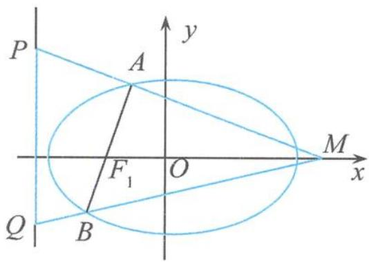  
(第 10 题)

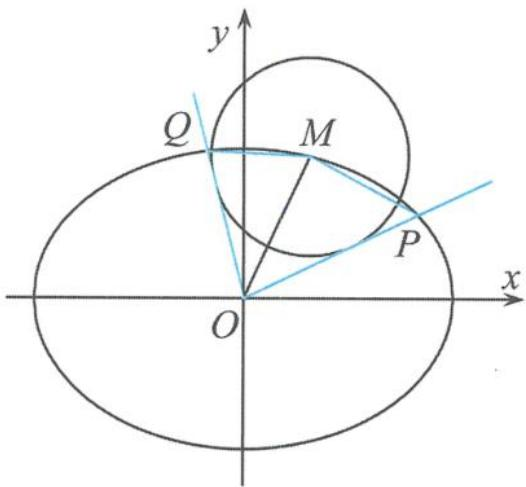  
(第 11 题)

11. 如图, 在平面直角坐标系 $xOy$ 中, 设 $M(x_0, y_0)$ 是椭圆 $C: \frac{x^2}{2} + y^2 = 1$ 上的点, 从原点 $O$ 向圆 $M: (x - x_0)^2 + (y - y_0)^2 = \frac{2}{3}$ 作两条切线, 分别与椭圆 $C$ 交于点 $P, Q$ , 直线 $OP, OQ$ 的斜率分别记为 $k_1, k_2$ .

(Ⅰ)证明: $k_{1}k_{2}$ 为定值.

(Ⅱ)求四边形 OPMQ 面积的最大值.

12. 已知椭圆 $C: \frac{x^{2}}{a^{2}} + \frac{y^{2}}{b^{2}} = 1 (a > b > 0)$ 与直线 $x = -\sqrt{2} b$ 有且只有一个交点, $P$ 为椭圆 $C$ 上的任意一点, $P_{1}(-1,0), P_{2}(1,0)$ , 且 $\overrightarrow{PP_{1}} \cdot \overrightarrow{PP_{2}}$ 的最小值为 $\frac{a}{2}$ .

(I)求椭圆 C 的方程.

(II)设直线 $l: y = kx + m$ 与椭圆 C 交于不同的两点 A, B, 点 O 为坐标原点, 且 $\overrightarrow{OM} = \frac{1}{2} (\overrightarrow{OA} + \overrightarrow{OB})$ , 当 $\triangle AOB$ 的面积 S 最大时, 求 $T = \frac{1}{|MP_{1}|^{2}} - 2 |MP_{2}|$ 的取值范围.

## 第一章 兵马未动,粮草先行

1. 解答 由抛物线定义得 $\angle FMH$ 的角平分线所在的直线与 $HF$ 垂直, 而 $k_{HF} = -2$ , 故选 B.

2. 解答 因为 $k_{OA}=\frac{2p}{y_{1}}, k_{OB}=\frac{2p}{y_{2}}, k_{AB}=\frac{2p}{y_{1}+y_{2}}$ 所以 $\frac{1}{k_{AB}}=\frac{1}{k_{OA}}+\frac{1}{k_{OB}}$ ，从而得 $k_{OB}=-3$ ，故选D.

3. 解答 设点 $P(x_0, y_0)$ , 可得 $M\left(\frac{1}{2}x_0 + y_0, \frac{1}{4}x_0 + \frac{1}{2}y_0\right), N\left(\frac{1}{2}x_0 - y_0, -\frac{1}{4}x_0 + \frac{1}{2}y_0\right)$ . 由于 $|MN| = \sqrt{\frac{1}{4}x_0^2 + 4y_0^2}$ 为定值, 所以 $\frac{a^2}{b^2} = \frac{4}{\frac{1}{4}} = 16, \sqrt{\frac{a}{b}} = 2$ , 因此选 C.

4. 解答 设双曲线的右顶点为 E，由双曲线的焦点三角形的性质得 $\triangle AF_{1}F_{2}$ 的内切圆 $O_{1}$ 、 $\triangle BF_{1}F_{2}$ 的内切圆 $O_{2}$ 与 x 轴都切于右顶点，所以圆 $O_{1}$ 和圆 $O_{2}$ 外切，故选项 AB 正确.

同时，可得 $O_{1}O_{2} \perp x$ 轴，又 $\angle AF_{2}O_{1} = \angle O_{1}F_{2}E, \angle EF_{2}O_{2} = \angle O_{2}F_{2}B,$ 所以 $\angle O_{1}F_{2}O_{2} = 90^{\circ}$ . 由射影定理得 $r_{1}r_{2} = |EF_{2}|^{2} = 1$ ，故 $S_{1}S_{2} = \pi^{2}$ ，故选项C正确.

易得直线的倾斜角的范围为 $\left(\frac{\pi}{3},\frac{2\pi}{3}\right)$ ，故 $\angle O_1F_2E\in \left(\frac{\pi}{6},\frac{\pi}{3}\right)$ ，又 $\tan \angle O_1F_2E = r_1$ ，得 $r_1\in$ $\left(\frac{\sqrt{3}}{3},\sqrt{3}\right)$ ，所以 $r_1^2 +r_2^2 = r_1^2 +\frac{1}{r_1^2}\in \left[2,\frac{10}{3}\right)$ ，所以 $S_{1}+$ $S_{2}\in \left[2\pi ,\frac{10}{3}\pi\right)$ ，即选项D错误.

故选 ABC.

5. 解答 设直线 $l_{1}$ 的倾斜角为 $\theta$ , 则 $l_{2}$ 的倾斜角为 $\theta + \frac{\pi}{2}$ 或 $\theta - \frac{\pi}{2}$ , 所以 $|AF| = \frac{p}{1 - \cos \theta}, |BF| = \frac{p}{1 + \cos \theta}$ , 得 $|AB| = |AF| + |BF| = \frac{p}{1 - \cos \theta} +$ $\frac{p}{1 + \cos\theta} = \frac{2p}{\sin^2\theta}$ 所以选项A正确.从而 $\frac{1}{|AB|} +\frac{1}{|DE|} = \frac{\sin^2\theta}{2p} +\frac{\cos^2\theta}{2p} = \frac{1}{2p}$ ，所以选项B正确.又 $|AB||DE| = \frac{2P}{\sin^2\theta}\cdot \frac{2P}{\cos^2\theta} = \frac{16p^2}{\sin^22\theta}\leqslant 16p^2,$ 同时 $|AB| + |DE| = \frac{2p}{\sin^2\theta} +\frac{2p}{\cos^2\theta} = \frac{8p}{\sin^22\theta}\geqslant$ $8p$ ，所以选项CD正确.故选ABCD.

6. 解答 由题意易知点 M, N 分别是双曲线 $\Gamma:\frac{x^{2}}{4}-\frac{y^{2}}{32}=1$ 的左、右焦点，所以 $|PA|^{2}-|PB|^{2}=(|PM|^{2}-1)-(|PN|^{2}-4)$ $=(|PM|+|PN|)(|PM|-|PN|)+3$ $=-4(|PN|+|PM|)+3\leqslant-4|MN|+3=-45.$

7. 解答 (1) 如答图, 由抛物线的特征直角梯形的性质可知 $MF \perp AB, NT \perp AB$ , 所以 $MF \parallel NT$ .

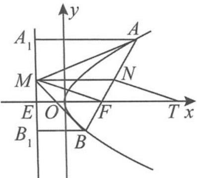  
(第 7 题答图)

又 $MN \parallel x$ 轴，所以四边形MNTF为平行四边形， $|FT| = |MN| = \frac{|AA_1| + |BB_1|}{2} = \frac{|AF| + |BF|}{2}$ $= \frac{1}{2} |AB|$ ，所以 $\frac{|AB|}{|FT|} = 2.$ (2)因为 $|AF| = \frac{p}{1 - \cos \alpha}, |BF| = \frac{p}{1 + \cos \alpha}$ ，所以 $|FN| = \frac{1}{2} (|AF| - |BF|)$ $= \frac{1}{2}\left(\frac{p}{1 - \cos \alpha} - \frac{p}{1 + \cos \alpha}\right) = \frac{p\cos \alpha}{\sin^2\alpha}$ ，得 $|FT| = \frac{|FN|}{\cos \alpha} = \frac{p}{\sin^2\alpha}$ ，

从而 $\frac{|FT| - |FT|\cos 2\alpha}{2p} = \frac{|FT|\sin^2\alpha}{p} = 1.$

8. 解答 设 $A(x_{1}, y_{1}), B(x_{2}, y_{2})$ ，作点 $B$ 关于 $x$ 轴的对称点 $B_{1}$ ，则 $B_{1}(x_{2}, -y_{2})$ .

因为直线 $AF, BF$ 的倾斜角互补，所以 $A, F, B_{1}$ 三点共线，得到 $y_{1}(-y_{2}) = -p^{2}$ ，即 $y_{1}y_{2} = p^{2}$ ，所以 $\frac{1}{k_2^2} - \frac{1}{k_1^2} = \left(\frac{y_1 + y_2}{2p}\right)^2 - \left(\frac{y_1 - y_2}{2p}\right)^2 = \frac{y_1y_2}{p^2} = 1.$ 故答案为1.

9. 解答 （Ⅰ）由题意得，点 F 的坐标为 $(1,0)$ ，直线 l 的方程是 x = -1.

（Ⅱ）设 $A(x_{1}, y_{1}), B(x_{2}, y_{2}), y_{1} \neq \pm 6$ 且 $y_{2} \neq \pm 6$ ,

直线 AB 的方程为 $x = my + 1$ ,

把 $x = my + 1$ 代入 $y^{2} = 4x$ ,

消去 x 可得 $y^{2} - 4my - 4 = 0$ ,

所以 $y_{1} + y_{2} = 4m, y_{1}y_{2} = -4$ .

由 P(9,6) 得 $k_{PA} = \frac{y_{1} - 6}{x_{1} - 9} = \frac{y_{1} - 6}{\frac{y_{1}^{2}}{4} - 9} = \frac{4}{y_{1} + 6}$ .

所以直线 PA 的方程为 $y - 6 = \frac{4}{y_{1} + 6}(x - 9)$ .

令 x = -1, 得 $M\left(-1, \frac{6y_{1} - 4}{y_{1} + 6}\right)$ .

同理得 $N\left(-1, \frac{6y_{2} - 4}{y_{2} + 6}\right)$ .

所以 $k_{MF} \cdot k_{NF} = \frac{y_{F} - y_{M}}{x_{F} - x_{M}} \cdot \frac{y_{F} - y_{N}}{x_{F} - x_{N}}$ $= \frac{9y_{1}y_{2} - 6(y_{1} + y_{2}) + 4}{(y_{1} + 6)(y_{2} + 6)} = -1$ .

故 MF ⊥ NF

故 $MF \perp NF.$

10. 解答 （Ⅰ）设双曲线的半焦距为 c，则 $F(c,0)$ , $B\left(c,\pm\frac{b^{2}}{a}\right)$ .
因为 $\left|AF\right| = \left|BF\right|$ ，所以 $\frac{b^{2}}{a} = a + c$ ,
得 $\frac{c^{2}-a^{2}}{a}=a+c$ ，即c-a=a，故e=2.
（Ⅱ）由（Ⅰ）知双曲线的离心率为2，所以双曲线的右准线 $l: x = \frac{a}{2}$ 恰好过 $AF$ 的中点 $A_{1}$ , 所以 $\angle BAF = \angle DFA_{1}$ , 故问题转化为证明 $\angle AFD = \angle DFB$ , 即 $FD$ 为 $\angle AFB$ 的平分线. 过点 $B$ 作 $BB_{1} \perp l$ 于点 $B_{1}$ , 如答图, 由圆锥曲线的统一定义得 $|BF| = 2|BB_{1}|$ . 又 $BB_{1} // AA_{1}$ , 得 $\frac{|BB_{1}|}{|AA_{1}|} = \frac{|BD|}{|AD|}$ , 所以 $\frac{|BF|}{|AF|} = \frac{2|BB_{1}|}{2|AA_{1}|} = \frac{|BD|}{|AD|}$ , 即 $FD$ 平分 $\angle AFB$ . 得证.

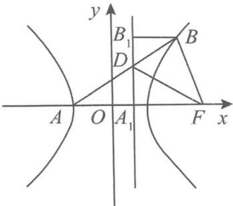  
(第 10 题答图)

## 第二章 博观而约取,厚积而薄发

1. 解答 如答图, 设切线 $l$ 与圆 $B$ 的公共点为 $M$ , 过点 $A$ 作直线 $AB$ 的垂线 $l'$ , 过点 $M$ 作 $MN \perp l'$ , 垂足为 $N$ . 连接 $MB$ , 则 $MB = r, MN = PA = r$ , 得到 $MB = MN$ . 由抛物线的定义知, 动点 $M$ 的轨迹为以 $B$ 为焦点、 $l'$ 为准线的抛物线. 故选 D.

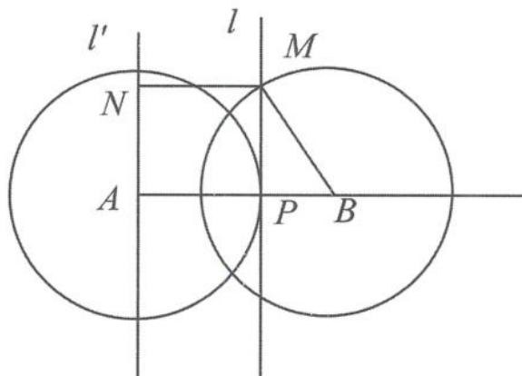  
(第1题答图)

2. 解答 设椭圆左、右焦点分别为 $F_{1}(-1,0)$ ， $F_{2}(1,0)$ ，而且 $F_{2}$ 是圆 $C_{1}:(x-1)^{2}+y^{2}=1$ 的圆心，

1,0)，而且 $F_{2}$ 是圆 $C_1:(x - 1)^2 +y^2 = 1$ 的圆心，所以 $|PB| - |PA|\leqslant (|PF_2| + 1) - |PA|$ 由椭圆的定义知 $|PB| - |PA|\leqslant (2a - |PF_1| + 1) - |PA|$ $= 5 - (|PF_1| + |PA|)\leqslant 5 - |AF_1| = 5 - \sqrt{10}.$ 故选D.  
3.解答 答案选D.

4. 解答 如答图, 过点 A 作直线 l 的垂线, 垂足为 $A_{1}$ ; 过点 B 作直线 l 的垂线, 垂足为 $B_{1}$ .

由抛物线定义知 $|AF|+|BF|=|AA_{1}|+|BB_{1}|=2|OP|$ $=4>2=|AB|$ ,
所以点F的轨迹为椭圆.
故选 B.

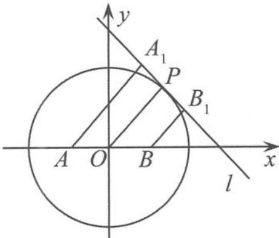  
(第 4 题答图)

5. 解答 因为 PQ 与 PA 所成的角为定值 $\theta$ ，所以 PQ 在以 PA 为轴的圆锥曲面上，即半顶角为 $\theta$ 。

另外, 轴 PA 与平面 ABC 所成的角为 $45^{\circ}$ , 所以轴面角 $45^{\circ} > \theta$ , 得动点 Q 的轨迹是椭圆. 故选 B.

6. 解答 圆锥的半顶角为 $\angle CAB$ ，圆锥的轴与截面所成的角等于直线 $AB$ 与平面 $\alpha$ 所成的角。而 $\angle CAB$ 等于直线 $AB$ 与平面 $\alpha$ 所成的角，所以动点 $C$ 的轨迹为抛物线。故选 D。

7. 解答 如答图, 动直线 $n$ 的轨迹是以点 $P$ 为顶点、平行于 $m$ 的直线 $m'$ 为轴的两个圆锥面. 而点 $Q$ 的轨迹就是这两个圆锥面与平面 $\alpha$ 的交线, 此时轴面角为 $0^\circ$ , 半顶角为 $30^\circ$ , 所以选 C.

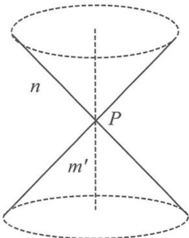  
(第 7 题答图)

8. 解答 $2c = 2\sqrt{5}$ , 点 $(c, 2c)$ 在直线 $y = \frac{b}{a} x$ 上 $\Rightarrow a = 1, b = 2$ , 显然, 当点 $P$ 在右支上时, $|PM| + |PF_2|$ 要小, 故 $|PM| + |PF_2| = |PM| + (|PF_1| - 2a) \geqslant |MF_1| - 2a = 3$ . 故选 D.

9. 解答 不妨设 $a=(2,0)$ , $b=(x,y)$ ,

则由 $a \cdot b = 2 |a - b|$ 可得 $b$ 的终点 $B$ 的轨迹方程为 $C: y^2 = 4(x - 1)$ .

由图象可知(如答图), 当直线 OB 和轨迹 C 相切时, $\langle a, b \rangle$ 最大.

设 OB: y = kx，与 C: $y^{2} = 4(x - 1)$ 联立，

消去 y 得 $k^{2}x^{2}-4x+4=0$ .

令 $\Delta=16-16k^{2}=0$ , 即得 $k=\pm1, b=(2,2)$ 或 $b=(2,-2)$ .

故 $a \cdot b = 4$ .

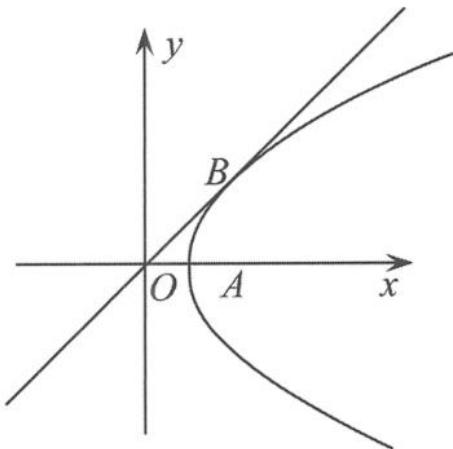  
(第9题答图)

10. 解答 设 P 为平面内的任意一点, $F_{1}, F_{2}$ 是关于原点对称的两个点.

$$
\overrightarrow {O F _ {1}} = - \boldsymbol {a}, \overrightarrow {O F _ {2}} = \boldsymbol {a}, \overrightarrow {O P} = x \boldsymbol {b},
$$

则 $|a + xb| + |a - xb| = |\overrightarrow{PF_1}| + |\overrightarrow{PF_2}| = 4$ ,

再由椭圆的定义得, 点 P 的轨迹是以 $F_{1}, F_{2}$ 为焦点的椭圆(如答图),

其方程为 $\frac{x^2}{4} +\frac{y^2}{3} = 1$ ，且 $|\overrightarrow{OP}| = x$ $\in \left[\frac{\sqrt{14}}{2},\frac{\sqrt{15}}{2}\right].$

当 $|\overrightarrow{OP}| = \frac{\sqrt{14}}{2}$ 时， $\theta = \angle POF_2$ 最大，

$$
P \left(\frac {\sqrt {1 4}}{2} \cos \theta , \frac {\sqrt {1 4}}{2} \sin \theta\right)
$$

$$
\left| \cos \theta \right| _ {\min} = \frac {2 \sqrt {7}}{7}
$$

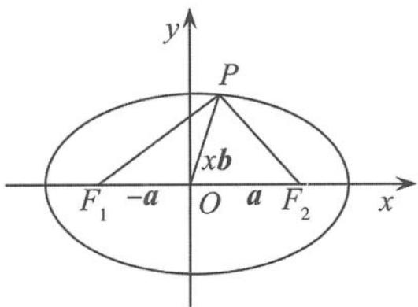  
(第 10 题答图)

11. 解答 如答图, 设 M 是界线上的任意一点, 则 $\left|MA_{1}\right| + \left|AA_{1}\right| = \left|MA_{2}\right| + \left|AA_{2}\right|$ ,

$$
\left| M A _ {1} \right| - \left| M A _ {2} \right| = \left| A A _ {2} \right| - \left| A A _ {1} \right|
$$

$$
\mid \mid M A _ {1} \mid - \mid M A _ {2} \mid \mid = \mid \mid A A _ {2} \mid - \mid A A _ {1} \mid \mid
$$

在 $\triangle AA_{1}A_{2}$ 中， $|AA_{2}| - |AA_{1}| < |A_{1}A_{2}|$ .

由双曲线的定义知, 点 M 的轨迹为双曲线, 即该界线所在曲线为双曲线.

故选C.

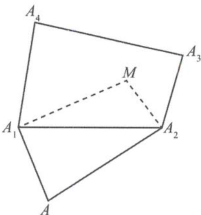  
(第 11 题答图)

12. 解答 对于选项 A, 如答图 1, 已知点 P 到直线 $CC_{1}$ 的距离与点 P 到平面 $BB_{1}C_{1}C$ 的距离相等, 又点 P 在平面 ABCD 内, 所以在平面内, 点 P 到点 C 的距离与点 P 到直线 BC 的距离相等. 又 $C \in BC$ , 所以点 P 在直线 CD 上, 故点 P 的轨迹为直线. 选项 A 错误.

对于选项 B, 在平面内, $\left|PA\right| + \left|PC\right| = 4$ , $\left|AC\right| = \sqrt{2} < 4$ , 所以点 P 的轨迹为椭圆, 故选项 B 正确.

对于选项 C, 易得 $BD_{1}$ 与平面 ABCD 所成角的平面角为 $\angle D_{1}BD = \alpha$ , 所以当 $\angle BD_{1}P = 45^{\circ}$ 时, 相当于以 $BD_{1}$ 为轴, 轴截面的顶角为 $2\theta = 90^{\circ}$ 的圆锥被平面 ABCD 所截形成的曲线, 如答图 2. 而 $BD_{1} = \sqrt{6}$ , $DD_{1} = 2$ , 则 $\sin \alpha = \frac{\sqrt{6}}{3} > \frac{\sqrt{2}}{2} = \sin 45^{\circ}$ , 即 $45^{\circ} < \alpha < 90^{\circ}$ . 故点 P 的轨迹为椭圆, 故选项 C 错误.

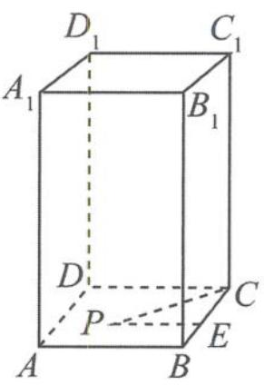  
答图1

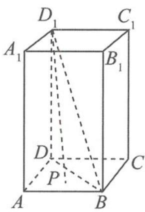  
(第 12 题答图)  
答图2

对于选项 D, 因为 $\angle BD_{1}P = 60^{\circ}$ , 所以点 P 的轨迹是以 $BD_{1}$ 为轴, 轴截面的顶角为 $2\theta = 120^{\circ}$ 的圆锥被平面 ABCD 所截形成的曲线, 而 $\sin \alpha = \frac{\sqrt{6}}{3} < \frac{\sqrt{3}}{2} = \sin 60^{\circ}$ , 即 $0 < \alpha < 60^{\circ}$ , 所以点 P 的轨迹为双曲线, 故选项 D 正确.

因此选BD.

13. 解答 根据点 A 的位置分类讨论其轨迹.

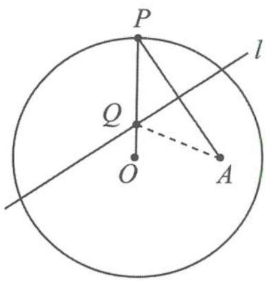

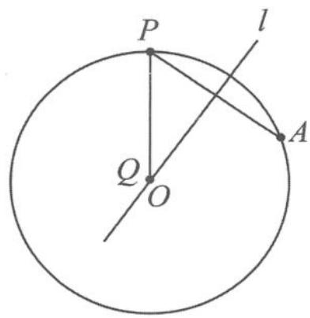  
答图2

答图1  
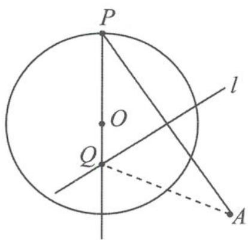  
答图3  
(第 13 题答图)

①如答图1,当点A在圆内且不为圆心时,连接QA,由已知得 $|QA|=|QP|$ .所以 $|QO|+|QA|=|QO|+|QP|=|OP|=r$ .又因为点A在圆内,所以 $|OA|<|OP|$ .根据椭圆的定义,点Q的轨迹是以O,A为焦点,r为长轴长的椭圆,故选项A正确.

②如答图 2, 当点 A 在圆上时, 点 Q 与圆心重合, 轨迹为定点, 故选项 D 正确.

③如答图3,当点A在圆外时,连接QA,由已知得 $|QA|=|QP|$ .所以 $|QA|-|QO|=|QP|-|QO|=|OP|=r$ .又因为点A在圆外,所以 $|OA|>|OP|$ .根据双曲线的定义,点Q的轨迹是以O,A为焦点,A为实轴长的双曲线的一支(靠近O),故选项B正确.

④当点 A 与圆心重合时, 点的轨迹为圆. 故选项 C 错误.

故选 ABD.

## 第三章 举目仰望星空,回首又见炊烟

1. 解答 设 $P(x_0, y_0)$ , 过点 $P$ 的切线方程为 $y = kx + m \Rightarrow m = y_0 - kx_0$ .

将其代入椭圆方程 $E_2$ 得到 $(a^2k^2 + b^2)x^2 + 2kma^2x + a^2(m^2 - \lambda b^2) = 0$ .

由 $\Delta = 0$ 得 $\lambda(a^2k^2 + b^2) = m^2$ ,

所以 $\lambda(a^2k^2 + b^2) = (y_0 - kx_0)^2$ .

构造齐次式, 整理得 $(\lambda a^2 - x_0^2)k^2 + 2x_0y_0k + \lambda b^2 - y_0^2 = 0$ ,

所以 $k_1 \cdot k_2 = \frac{\lambda b^2 - y_0^2}{\lambda a^2 - x_0^2} = \frac{(\lambda - 1)b^2 + \frac{b^2}{a^2}x_0^2}{\lambda a^2 - x_0^2}$ .

因为 $k_1 \cdot k_2$ 为定值,

则 $\frac{\lambda - 1}{\lambda} \cdot \frac{b^2}{a^2} = -\frac{b^2}{a^2} \Rightarrow \lambda = \frac{1}{2}$ .

故选 C.

2. 解答 如答图, 设直线 AB 的方程为 x=my + t, $A(x_{1}, y_{1}), B(x_{2}, y_{2})$ .

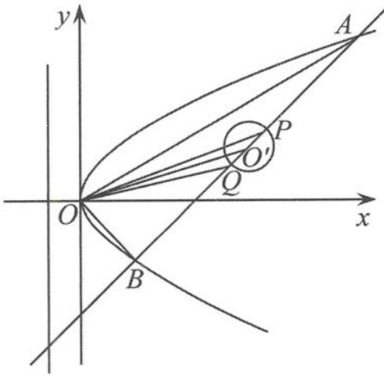  
(第2题答图)

联立 $\left\{\begin{aligned}y^{2}&=4x,\\ x&=my+t,\end{aligned}\right.$ 整理得 $y^{2}-4my-4t=0$ .
由于 $\Delta=(4m)^{2}-4(-4t)=16(t+m^{2})>0$ 则 $y_{1}+y_{2}=4m, y_{1}y_{2}=-4t.$ 因此 $x_{1}+x_{2}=m(y_{1}+y_{2})+2t=4m^{2}+2t, x_{1}x_{2}=t^{2}.$ 由题意可知 $\overrightarrow{OA} \cdot \overrightarrow{OB} = 0$ ，则 $x_{1}x_{2} + y_{1}y_{2} = 0$ ，
即 $t^{2}-4t=0$ ，则 t=4，
所以直线 AB 的方程为 $x=my+4$ ，恒过点(4,0)，所以 $x_{1}+x_{2}=4m^{2}+8$ ，
则圆的圆心为 $O'(2m^{2}+4,2m)$ .
由平行四边形的性质可知 $2(|OP|^{2}+|OQ|^{2})=4|OO'|^{2}+|PQ|^{2},$ $=4|OO'|^{2}+(2\sqrt{2})^{2}$

$$
= 4 \left[ 4 (m ^ {2} + 2) ^ {2} + 4 m ^ {2} \right] + 8
$$

$$
= 1 6 \left(m ^ {4} + 5 m ^ {2} + 4\right) + 8.
$$

当 m=0 时， $\left|OP\right|^{2}+\left|OQ\right|^{2}$ 取最小值，最小值为 36.

3. 解答 （Ⅰ）设椭圆 C 的方程为 $\frac{x^{2}}{a^{2}} + \frac{y^{2}}{b^{2}} = 1 (a > b > 0)$ ，则由题意知 b = 1.
所以 $\sqrt{\frac{a^{2}-b^{2}}{a^{2}}}=\frac{2\sqrt{5}}{5}$ ，即 $\sqrt{1-\frac{1}{a^{2}}}=\frac{2\sqrt{5}}{5}$ .
解得 $a^{2}=5$ ，所以椭圆 C 的方程为 $\frac{x^{2}}{5}+y^{2}=1$ .

$$
A (x _ {1}
$$

$$
\left. y _ {1}\right), B \left(x _ {2}, y _ {2}\right), M \left(0, y _ {0}\right)
$$

易知点 $F$ 的坐标为 $(2,0)$ $\overrightarrow{MA} = \lambda_1\overrightarrow{AF}$ ，即 $(x_{1},y_{1} - y_{0}) = \lambda_{1}(2 - x_{1}, - y_{1})$ 得 $x_{1} = \frac{2\lambda_{1}}{1 + \lambda_{1}},y_{1} = \frac{y_{0}}{1 + \lambda_{1}}$ 将点 $A$ 的坐标代入椭圆方程中，  
得 $\frac{1}{5}\left(\frac{2\lambda_1}{1 + \lambda_1}\right)^2 +\left(\frac{y_0}{1 + \lambda_1}\right)^2 = 1,$ 去分母并整理得 $\lambda_1^2 +10\lambda_1 + 5 - 5y_0^2 = 0.$ 同理，由 $\overrightarrow{MB} = \lambda_2\overrightarrow{BF}$ 可得 $\lambda_2^2 +10\lambda_2 + 5 - 5y_0^2 = 0.$

所以 $\lambda_1, \lambda_2$ 是方程 $x^2 + 10x + 5 - 5y_0^2 = 0$ 的两个根，故 $\lambda_1 + \lambda_2 = -10$ .

解法2:设点A,B,M的坐标分别为 $A(x_{1},y_{1})$ , $B(x_{2},y_{2}), M(0,y_{0})$ .
易知点 F 的坐标为 $(2,0)$ .
显然直线 l 存在斜率，设直线 l 的斜率为 k，则直线 l 的方程是 $y=k(x-2)$ .
将直线 l 的方程代入椭圆 C 的方程中，消去 y 并整理得 $(1+5k^{2})x^{2}-20k^{2}x+20k^{2}-5=0.$ 所以 $x_{1}+x_{2}=\frac{20k^{2}}{1+5k^{2}}, x_{1}x_{2}=\frac{20k^{2}-5}{1+5k^{2}}.$ 又因为 $\overrightarrow{MA} = \lambda_{1} \overrightarrow{AF}, \overrightarrow{MB} = \lambda_{2} \overrightarrow{BF}$ ,
将各点坐标代入得 $\lambda_{1}=\frac{x_{1}}{2-x_{1}},\lambda_{2}=\frac{x_{2}}{2-x_{2}}$ 所以 $\lambda_{1}+\lambda_{2}=\frac{x_{1}}{2-x_{1}}+\frac{x_{2}}{2-x_{2}}$

$$
= \frac {2 (x _ {1} + x _ {2}) - 2 x _ {1} x _ {2}}{4 - 2 (x _ {1} + x _ {2}) + x _ {1} x _ {2}} = \dots = - 1 0.
$$

4. 解答 (I)由题意得 $\left\{ \begin{array}{l} \sqrt{1 - \frac{b^2}{a^2}} = \frac{\sqrt{2}}{2}, \\ \frac{2}{a^2} + \frac{3}{b^2} = 1, \end{array} \right.$ 解得 $a^2 = 2b^2 = 8$ ,

则 $\triangle ABC$ 的面积 $S = 2S_{\triangle AOB} = 2 \times \frac{1}{2} \times a \times \sqrt{3} = 2\sqrt{6}$ .

(II)① $k_1 \cdot k_2$ 为定值.

证明: 设 $B(x_0, y_0)$ , 则 $C(-x_0, -y_0)$ , 且 $\frac{x_0^2}{a^2} + \frac{y_0^2}{b^2} = 1$ .

而 $k_1 \cdot k_2 = \frac{y_0}{x_0 - a} \cdot \frac{y_0}{x_0 + a} = \frac{y_0^2}{x_0^2 - a^2}$ $= \frac{b^2\left(1 - \frac{x_0^2}{a^2}\right)}{x_0^2 - a^2} = -\frac{b^2}{a^2}$ ,

由 (I) 得 $a^2 = 2b^2$ , 所以 $k_1 \cdot k_2 = -\frac{1}{2}$ .

② 易得直线 $AB$ 的方程为 $y = k_1(x - a)$ , 直线 $AC$ 的方程为 $y = k_2(x - a)$ .

令 $x = a + 1$ , 得 $y_E = k_1, y_F = k_2$ .

则 $\triangle AEF$ 的面积 $S_{\triangle AEF} = \frac{1}{2} \times |EF| \times 1 = \frac{1}{2} |k_2 - k_1|$ .

因为点 $B$ 在 $x$ 轴的上方, 所以 $k_1 < 0, k_2 > 0$ .

由 $k_1 \cdot k_2 = -\frac{1}{2}$ 得 $S_{\triangle AEF} = \frac{1}{2}(k_2 - k_1) \geqslant \frac{1}{2} \times 2\sqrt{-k_1k_2} = \frac{\sqrt{2}}{2}$ ,

当且仅当 $k_2 = -k_1$ 时等号成立.

所以 $\triangle AEF$ 的面积的最小值为 $\frac{\sqrt{2}}{2}$ .

5. 解答 (I) 由题意知 $1 + \frac{p}{2} = 3$ , 解得 $p = 4$ ,

所以 $C_1: y^2 = 8x, a = \pm 2\sqrt{2}$ .

(II) 设过点 $P(-1, y_0)$ 的直线方程为 $l: y - y_0 = k(x + 1)$ .

由 $\left\{ \begin{array}{l} y^2 = 8x, \\ y - y_0 = k(x + 1) \end{array} \right.$ 得 $ky^2 - 8y + 8y_0 + 8k = 0$ .

若直线 AB, CD 的斜率分别为 $k_{1}, k_{2}$ ,
设点 A, B, C, D 的纵坐标分别为 $y_{1}, y_{2}, y_{3}, y_{4}$ ，
所以 $y_{1}y_{2}=\frac{8(y_{0}+k_{1})}{k_{1}}, y_{3}y_{4}=\frac{8(y_{0}+k_{2})}{k_{2}}.$ 因为圆 $C_{2}$ 到 l 的距离 $d=\frac{|3k+y_{0}|}{\sqrt{1+k^{2}}}=\sqrt{3}$ ，
即 $6k^{2} + 6y_{0}k + y_{0}^{2} - 3 = 0$ ,
所以 $k_{1} + k_{2} = -y_{0}, k_{1}k_{2} = \frac{y_{0}^{2}-3}{6}.$ 所以 $y_{1}y_{2}y_{3}y_{4}=64\frac{k_{1}k_{2}+(k_{1}+k_{2})y_{0}+y_{0}^{2}}{k_{1}k_{2}}=64\left(1+\frac{-y_{0}^{2}+y_{0}^{2}}{k_{1}k_{2}}\right)=64.$ 故 A, B, C, D 四点的纵坐标之积为定值 64

6. 解答 (I)已知抛物线 $C: y = ax^2$ ，即 $x^2 = \frac{1}{a}y$ ，其准线方程为 $y = -\frac{1}{4a}$ 。因为点 $P(b, 1)$ 到抛物线焦点的距离为 $\frac{5}{4}$ ，所以 $1 + \frac{1}{4a} = \frac{5}{4}$ ，解得 $a = 1$ 。所以抛物线 $C$ 的方程为 $y = x^2$ 。（Ⅱ）设 $M(x_1, x_1^2), N(x_2, x_2^2)$ ，因为 $y = x^2$ ，所以 $y' = 2x$ ，即 $k_{AM} = 2x_1$ 。所以切线 $AM$ 的方程为 $y - x_1^2 = 2x_1(x - x_1)$ ，即 $y = 2x_1x - x_1^2$ 。同理可得切线 $BN$ 的方程为 $y = 2x_2x - x_2^2$ 。由于动线段 $AB$ （点 $B$ 在点 $A$ 右边）在直线由于动线段 AB(点 B 在点 A 右边)在直线 l:
y = x - 2 上, 且 $\left|AB\right| = \sqrt{2}$ ,
故可设 $A(t,t-2)$ , $B(t+1,t-1)$ .
将 A(t,t-2)代入切线 AM 的方程得 $t-2=2x_{1}t-x_{1}^{2}$ ，即 $x_{1}^{2}-2tx_{1}+t-2=0$ .
同理可得 $x_{2}^{2}-2(t+1)x_{2}+t-1=0$ .
两式相减得 $x_{1}^{2}-x_{2}^{2}-2t(x_{1}-x_{2})+2x_{2}-1=0.$ 因为 $x_{1} + x_{2} = 1$ ,
所以 $-2t(x_{1}-x_{2})=0$ ，则 t=0。

7. 解答 （I）如答图， $PB: y - y_0 = \frac{y_0 - y_1}{x_0 - x_1} (x - x_0) \Rightarrow x_M = \frac{x_1 y_0 - x_0 y_1}{y_0 - y_1}$ ，

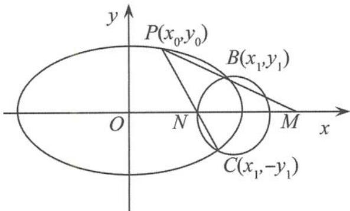  
(第 7 题答图)

(第7题答图) $PC: y - y_0 = \frac{y_0 + y_1}{x_0 - x_1} (x - x_0) \Rightarrow x_N$ $= \frac{x_1 y_0 + x_0 y_1}{y_0 + y_1},$ 所以 $x_M \cdot x_N = \frac{x_1^2 y_0^2 - x_0^2 y_1^2}{y_0^2 - y_1^2} = \frac{(4 - 4y_1^2)y_0^2 - (4 - 4y_0^2)y_1^2}{y_0^2 - y_1^2}$ =4,
所以 $S_1S_2 = \frac{1}{4}|OM| |ON| y_0^2 = y_0^2 \leqslant 1, -1 \leqslant y_0 \leqslant 1.$ 故 $S_{\triangle POM} \cdot S_{\triangle PON}$ 的最大值为 1.

8. 解答 （Ⅰ）因为 $2 + \frac{p}{2} = 3$ ，所以 p = 2，准线方程为 y = -1。

（Ⅱ）设点 $A(x_{1},y_{1}),B(x_{2},y_{2}),C(x_{3},y_{3}),x_{1}>$ $0,x_2 <   0,x_3 > 0,$ $\frac{S_{\triangle AMG}}{S_{\triangle ABG}} = \frac{|AM|}{|AB|},\frac{S_{\triangle CNG}}{S_{\triangle CBG}} = \frac{|CN|}{|BC|}.$ 因为点 $G$ 为△ABC的重心，所以 $S_{\triangle ABG} = S_{\triangle CBG} = \frac{1}{3} S_{\triangle ABC}$ ，且 $x_{1} + x_{2} + x_{3} = 0$ ，所以 $\frac{S_2 + S_3}{S_1} = \frac{1}{3}\left(\frac{|AM|}{|AB|} +\frac{|CN|}{|BC|}\right)$ $= \frac{1}{3}\left(\frac{x_1}{x_1 - x_2} +\frac{x_3}{x_3 - x_2}\right)$ $= \frac{1}{3}\left(\frac{x_1}{x_1 - x_2} -\frac{x_1 + x_2}{-x_1 - 2x_2}\right)$ $= \frac{1}{3}\left(\frac{x_1}{x_1 - x_2} +\frac{x_1 + x_2}{x_1 + 2x_2}\right).$ 令 $u = \frac{x_1}{x_2},\frac{S_2 + S_3}{S_1} = \frac{1}{3}\left(\frac{u}{u - 1} +\frac{u + 1}{u + 2}\right)$ $= \frac{1}{3}\left(2 + \frac{1}{u - 1} -\frac{1}{u + 2}\right) = \frac{1}{3}\left[2 + \frac{3}{(u - 1)(u + 2)}\right].$

因为 $3|AM|<2|BM|$ ，所以 $3x_{1}<-2x_{2}$ ，
故 $-\frac{2}{3}<u<0,$ $(u-1)(u+2)\in\left[-\frac{9}{4},-2\right),$ 故 $\frac{S_{2}+S_{3}}{S_{1}}\in\left(\frac{1}{6},\frac{2}{9}\right].$

9. 解答 设点 $A(x_{1},y_{1}),B(x_{2},y_{2}),C(x_{3},y_{3}),$ $D(x_4,y_4)$

(I) 以点 $A$ 为切点的切线方程为 $y - y_{1} = \frac{2}{y_{1}} (x - x_{1})$ , 即 $yy_{1} = 2(x + x_{1})$ . 同理, 以点 $B$ 为切点的切线方程为 $yy_{2} = 2(x + x_{2})$ . 因为两条切线均过点 $P(-1, t)$ , 所以 $\left\{ \begin{array}{l} ty_{1} = 2(-1 + x_{1}), \\ ty_{2} = 2(-1 + x_{2}), \end{array} \right.$ 即弦 $AB$ 所在直线的方程为 $ty = 2(x - 1)$ , 即直线 $AB$ 过定点(1,0), 即抛物线的焦点.

$$
A B: x = t y + 1
$$

$$
x = t y + 1
$$

物线方程 $y^{2} = 4x$ ，整理得 $y^{2} - 4ty - 4 = 0$ 。所以 $y_{1} + y_{2} = 4t, y_{1}y_{2} = -4$ ，从而 $|AB| = \sqrt{1 + t^{2}} |y_{1} - y_{2}| = 4(t^{2} + 1)$ 。把 $AB: x = ty + 1$ 代入椭圆方程，整理得 $(3t^{2} + 4)y^{2} + 6ty - 9 = 0$ 。所以 $y_{3} + y_{4} = \frac{-6t}{3t^{2} + 4}, y_{3}y_{4} = \frac{-9}{3t^{2} + 4}$ 。从而 $|CD| = \sqrt{1 + t^{2}} |y_{3} - y_{4}| = \frac{12(t^{2} + 1)}{3t^{2} + 4}$ 。设点 $P$ 到直线 $AB$ 的距离为 $d$ ，则 $\frac{S_1}{S_2} = \frac{\frac{1}{2}d|AB|}{\frac{1}{2}d|CD|} = \frac{|AB|}{|CD|} = \frac{3t^2 + 4}{3}$ $= t^2 + \frac{4}{3} \geqslant \frac{4}{3}$ 。故 $\frac{S_1}{S_2}$ 的最小值为 $\frac{4}{3}$ 。

10. 解答 （Ⅰ）抛物线 $C: y^{2} = 4x$ 的焦点为 $F(1,0)$ .
设 $A(x_{1},y_{1}), B(x_{2},y_{2}), C(x_{3},y_{3}), D(x_{4},y_{4})$ ,

直线 $AB$ 的方程为 $x = ty + 1$ ，代入抛物线方程并整理得 $y^{2} - 4ty - 4 = 0$ 。从而 $y_{1} + y_{2} = 4t, y_{1}y_{2} = -4, y_{M} = \frac{y_{1} + y_{2}}{2} = 2t.$ 因为 $CD // AB$ ，所以 $k_{CD} = \frac{y_3 - y_4}{x_3 - x_4} = \frac{4}{y_3 + y_4} = k_{AB} = \frac{1}{t}$ ，即 $y_{3} + y_{4} = 4t$ ，故 $y_{N} = \frac{y_{3} + y_{4}}{2} = 2t.$ 因此 $y_{M} = y_{N} = 2t$ ，所以 $MN // x$ 轴。（Ⅱ）由（I）知 $y_{1} + y_{2} = 4t, y_{1}y_{2} = -4$ ，则 $x_{M} = \frac{x_{1} + x_{2}}{2} = \frac{y_{1}^{2} + y_{2}^{2}}{8} = 2t^{2} + 1.$ 设 $P(x_{0}, y_{0})$ ，由 $CD // AB$ 得 $\overrightarrow{PC} = \frac{3}{2}\overrightarrow{CA}$ ，所以 $\overrightarrow{PD} = \frac{3}{2}\overrightarrow{DB}$ ，从而 $x_{3} = \frac{2x_{0} + 3x_{1}}{5}, y_{3} = \frac{2y_{0} + 3y_{1}}{5}$ 。代入抛物线 $y^{2} = 4x$ ，得到 $3y_{1}^{2} - 6y_{0}y_{1} + 20x_{0} - 2y_{0}^{2} = 0.$ 同理可得 $3y_{2}^{2} - 6y_{0}y_{2} + 20x_{0} - 2y_{0}^{2} = 0.$ 所以 $y_{1}, y_{2}$ 为方程 $3y^{2} - 6y_{0}y + 20x_{0} - 2y_{0}^{2} = 0$ 的两个根，

则 $y_{1} + y_{2} = 2y_{0} = 4t.$ 所以 $y_0 = 2t$ ，即 $M,N,P$ 三点共线.  
又 $y_{1}y_{2} = \frac{20x_{0} - 2y_{0}^{2}}{3} = -4,$ 所以 $x_0 = \frac{y_0^2 - 6}{10} = \frac{2t^2 - 3}{5}$ 又 $\mid y_1 - y_2\mid = 4\sqrt{t^2 + 1}$ ，所以 $S_{\triangle PAB} = \frac{1}{2}\mid y_1 - y_2\mid \mid x_M - x_0\mid = \frac{16}{5} (\sqrt{t^2 + 1})^3,$ 当 $t = 0$ 时， $\triangle PAB$ 面积的最小值为 $\frac{16}{5}$

## 第四章 落霞与孤鹜齐飞,秋水共长天一色

1. 解答 因为 $k_{PA} \cdot k_{PB} = e^2 - 1 = \frac{2}{3}$ , 所以 $e = \frac{\sqrt{15}}{3}$ . 故选D.

2. 解答 双曲线为等轴双曲线, 离心率为 $\sqrt{2}$ .

由“性质1”得 $k_{PA}k_{PB} = e^2 - 1 = 1$ ，
即 $\tan \alpha \tan (\pi - \beta) = 1$ ，得 $\tan \alpha \tan \beta = -1$ 。
在 $\triangle PAB$ 中， $\tan \alpha + \tan \beta + \tan \gamma = \tan \alpha \tan \beta \tan \gamma$ ，
所以 $\tan \alpha + \tan \beta + \tan \gamma = -\tan \gamma$ 。
故选C.

$$
k _ {P A} + k _ {P B} = \frac {1}{2 k _ {O P}}
$$

$$
k _ {Q A} + k _ {Q B} = - \frac {1}{2 k _ {O P}},
$$

$$
k _ {P A} + k _ {P B} + k _ {Q A} + k _ {Q B} = 0.
$$

$$
k _ {Q A} + k _ {Q B} = \frac {1 5}{8}.
$$

$$
k _ {Q A} \cdot k _ {Q B} = e _ {\mathrm{椭}} ^ {2} - 1 = - \frac {1}{4}
$$

所以 $k_{QA}, k_{QB}$ 是方程 $x^{2} - \frac{15}{8} x - \frac{1}{4} = 0$ 的两个根.

$$
k _ {Q A} > 0
$$

故选C.

$$
k _ {Q A} = 2
$$

4. 解答 因为 $|PF_{1}|+|PF_{2}|=2a_{1}$ , $|PF_{1}|-|PF_{2}|=2a_{2}$ 所以 $a_{1}=5+c, a_{2}=5-c>0$ .
已知三角形两边之和大于第三边，则 $2c+2c>10$ .
因为 $c > \frac{5}{2}$ ，所以 $\frac{5}{2} < c < 5$ .
从而 $e_{1}e_{2}=\frac{c^{2}}{a_{1}a_{2}}=\frac{c^{2}}{(5+c)(5-c)}=\frac{c^{2}}{25-c^{2}}>\frac{1}{3}$ .
所以 $e_{1}e_{2}+1>\frac{4}{3}$ ，故选 B.
5. 解答 $\frac{\sqrt{3}}{2}$ .

6. 解答 由“性质1”得 $k_{PA_1} \cdot k_{PA_2} = e^2 - 1 = -\frac{1}{2},$ 所以 $k_{QA_1} \cdot k_{QA_2} = \left(-\frac{1}{k_{PA_1}}\right)\left(-\frac{1}{k_{PA_2}}\right) = -2.$ 易得 $A_1\left(\frac{\sqrt{6}}{3}, \frac{\sqrt{6}}{3}\right), A_2\left(-\frac{\sqrt{6}}{3}, -\frac{\sqrt{6}}{3}\right).$ 设 $Q(x, y)$ ，代入 $k_{QA_1} \cdot k_{QA_2} = -2$ ，化简得 $x^2 + \frac{y^2}{2} = 1$ .

所以点 $Q$ 在椭圆 $x^{2} + \frac{y^{2}}{2} = 1$ 上， $M, N$ 为该椭圆的焦点，故 $|QM| + |QN| = 2\sqrt{2}$ .

7. 解答 设 $P(x_0, y_0)$ , 则 $A(-x_0, -y_0)$ . 所以 $k_{PA} = \frac{y_0}{x_0}, k_{AB} = k_{AC} = \frac{y_0}{2x_0}$ , 所以 $k_{PA} = 2k_{AB}$ . 因为 $PA \perp PB$ , 所以 $k_{PA} \cdot k_{PB} = -1$ , 故 $k_{AB} \cdot k_{PB} = -\frac{1}{2}$ . 而 $k_{AB} \cdot k_{PB} = e^2 - 1$ , 因此离心率 $e = \frac{\sqrt{2}}{2}$ .

8. 解答 (I) 已知 $e = \frac{c}{a} = \frac{\sqrt{3}}{2}, b = 1$ , 解得 $a = 2$ , 所以椭圆 $C$ 的标准方程为 $\frac{x^2}{4} + y^2 = 1$ .  
(II) 因为 $k_1 \cdot k_2 = e^2 - 1 = -\frac{1}{4}$ , 所以 $k_{BM} \cdot k_{AN} = -\frac{1}{4}$ , 即 $\frac{-2 - (-1)}{x_M - 0} \cdot \frac{-2 - 1}{x_N - 0} = \frac{3}{x_M \cdot x_N} = -\frac{1}{4}$ , 所以 $x_M \cdot x_N = -12$ . 不妨设 $x_M < 0$ , 则 $x_N > 0$ . 从而 $|MN| = |x_M - x_N| = x_N - x_M = x_N + \frac{12}{x_N} \geqslant 2\sqrt{x_N \cdot \frac{12}{x_N}} = 4\sqrt{3}$ , 当且仅当 $x_N = -x_M = 2\sqrt{3}$ 时, $|MN|$ 取得最小值 $4\sqrt{3}$ .

9. 解答 设 $N(x_{1}, y_{1}), Q(x_{2}, y_{2})$ ，直线 $NQ$ 的方程为 $y = kx + 1$ ，
把 $y = kx + 1$ 代入椭圆方程得 $(3k^{2} + 2)x^{2} + 6kx - 9 = 0,$ 所以 $x_{1} + x_{2} = \frac{-6k}{3k^{2} + 2}, x_{1}x_{2} = \frac{-9}{3k^{2} + 2}$ .
于是 $k_{AN} \cdot k_{AQ} = \frac{y_1 + 2}{x_1} \cdot \frac{y_2 + 2}{x_2}$ $= \frac{kx_1 + 3}{x_1} \cdot \frac{kx_2 + 3}{x_2}$ $= \frac{k^2x_1x_2 + 3k(x_1 + x_2) + 9}{x_1x_2} = -2$ ①.

因为 $k_{AB} \cdot k_{AQ} = e^2 - 1 = -\frac{2}{3}$ ②，由①÷②可得 $\frac{k_{AN}}{k_{AB}} = 3$ ，即存在 $\lambda = 3$ 满足题意.

10. 解答 (I) 易求椭圆的方程为 $C: \frac{x^2}{4} + \frac{y^2}{3} = 1.$ (II) 设 $E(-1, t)$ ，在椭圆内得 $\frac{(-1)^2}{4} + \frac{t^2}{3} < 1$ ，解得 $t^2 < \frac{9}{4}$ ①. $k_{AB} \cdot k_{OE} = k(-t) = e^2 - 1 = -\frac{3}{4}$ ，即 $kt = \frac{3}{4}$ ②， $AB \perp PE \Rightarrow k_{AB} \cdot k_{PE} = k \frac{m - t}{0 - (-1)} = -1$ $\Rightarrow mk = -\frac{1}{4}$ ，所以 $t = -3m$ ③。
把③代入①得 $(-3m)^2 < \frac{9}{4}$ ，故 $-\frac{1}{2} < m < \frac{1}{2}$ .

11. 解答 （Ⅰ）依题意，双曲线 C 的焦点在 x 轴上.
设所求双曲线的方程为 $\frac{x^{2}}{a^{2}} - \frac{y^{2}}{b^{2}} = 1 (a > 0, b > 0)$ .
由题意知 $b=\sqrt{6},\frac{c}{a}=\sqrt{3}$ ,
所以 $c^{2}=3a^{2}=a^{2}+b^{2}$ ，解得 $a^{2}=3$ .
所以双曲线的方程是 $\frac{x^{2}}{3}-\frac{y^{2}}{6}=1$ .
（Ⅱ）设 T(0,m)，直线 AB: $y=k_{1}x+m$ , PQ: $y=k_{2}x+m$ , $A(x_{1},y_{1})$ , $B(x_{2},y_{2})$ , $P(x_{3},y_{3})$ , $Q(x_{4},y_{4})$ .
把直线 AB 的方程 $y=k_{1}x+m$ 代入双曲线方程 $\frac{x^{2}}{3}-\frac{y^{2}}{6}=1$ 得 $(2-k_{1}^{2})x^{2}-2mk_{1}x-m^{2}-6=0$ ,
所以 $2-k_{1}^{2}\neq0,\Delta=4m^{2}k_{1}^{2}+4(2-k_{1}^{2})(m^{2}+6)>0$ 且 $x_{1}+x_{2}=\frac{2mk_{1}}{2-k_{1}^{2}}<0,x_{1}x_{2}=\frac{m^{2}+6}{k_{1}^{2}-2}>0.$ 从而 $\frac{(x_{1}+x_{2})^{2}}{x_{1}x_{2}}=\frac{x_{1}}{x_{2}}+\frac{x_{2}}{x_{1}}+2=\frac{4m^{2}k_{1}^{2}}{(k_{1}^{2}-2)(m^{2}+6)}$ .
同理可得 $\frac{x_{3}}{x_{4}}+\frac{x_{4}}{x_{3}}+2=\frac{4m^{2}k_{2}^{2}}{(k_{2}^{2}-2)(m^{2}+6)}$

因为 $\frac{|TA|}{|TB|}=\frac{|TP|}{|TQ|}$ ，所以 $\frac{x_{1}}{x_{2}}=\frac{x_{3}}{x_{4}}$ 所以 $\frac{4m^{2}k_{1}^{2}}{(k_{1}^{2}-2)(m^{2}+6)}=\frac{4m^{2}k_{2}^{2}}{(k_{2}^{2}-2)(m^{2}+6)}$ 化简得 $k_{1}^{2}=k_{2}^{2}$ .
因为 $k_{1} \neq k_{2}$ ，所以 $k_{1} + k_{2} = 0$ .
因为 $k_{ON} \cdot k_{1} = e^{2} - 1, k_{OM} \cdot k_{2} = e^{2} - 1,$ 所以 $k_{OM} + k_{ON} = 0.$

## 第五章 撑一支长篙,向更青处漫溯

1. 解答 设 $A(x_{1},y_{1}),B(x_{2},y_{2}),C(x_{3},y_{3})$ 则 $E(-1,y_2),F(1,0)$ 由 $A,F,B$ 三点共线得 $y_{1}y_{2} = -4$ 因为 $AC\bot EF$ 所以 $k_{AC}\cdot k_{EF} = \frac{4}{y_1 + y_3}\cdot \frac{y_2}{-2} = -1,$ $y_{2} = \frac{y_{1} + y_{3}}{2}$ （I）因为 $x_{1} = 4,y_{1} = 4$ ，而 $y_{1}y_{2} = -4$ 所以 $y_{2} = -1$ 又因为 $y_{2} = \frac{y_{1} + y_{3}}{2}$ 故 $y_{3} = -6$ ，从而 $x_{3} = 9.$ 因此 $x_{M} = \frac{x_{1} + x_{3}}{2} = \frac{13}{2},y_{M} = \frac{y_{1} + y_{3}}{2} = -1$ ，即 $M\left(\frac{13}{2}, - 1\right)$ （Ⅱ）因为 $y_{2} = \frac{y_{1} + y_{3}}{2}$ 而 $y_{M} = \frac{y_{1} + y_{3}}{2}$ 所以BM//x轴，故 $S_{\triangle ABC} = \frac{1}{2}|BM||y_1 - y_3|$ $= \frac{1}{2}\left|\frac{y_1^2 + y_3^2}{8} -\frac{y_2^2}{4}\right||y_1 - y_3| = \frac{1}{4}|y_1 - y_2|^3.$ 而 $|y_1 - y_2| = \left|y_1 + \frac{4}{y_1}\right| = |y_1| + \frac{4}{|y_1|}$ $\geqslant 2\sqrt{|y_1|\cdot\frac{4}{|y_1|}} = 4,$ 当且仅当 $|y_1| = \frac{4}{|y_1|}$ 即 $y_{1} = \pm 2$ 时，可得 $A(1, - 2),C(9,6)$ 或 $A(1,2),C(9, - 6)$

故 $\triangle ABC$ 面积的最小值为16,此时直线AC的方程为x-y-3=0或 $x+y-3=0$ .

$$
\vert A F \vert + \vert B F \vert = x _ {1} + x _ {2} + p, x _ {1} + x _ {2} = 2 x _ {0}.
$$

$$
\vert A F \vert + \vert B F \vert = 1 + 2 x _ {0}
$$

$$
p = 1
$$

所以 $y^{2}=2x.$ （Ⅱ）设直线 l 的方程为 $x=my+b$ ，
代入抛物线方程得 $y^{2}-2my-2b=0.$ 因为 $x_{1}x_{2}+y_{1}y_{2}=-1$ ，即 $\frac{y_{1}^{2}y_{2}^{2}}{4}+y_{1}y_{2}=-1$ ，
所以 $y_{1}y_{2}=-2$ ，即 $y_{1}y_{2}=-2b=-2$ ，
所以 b=1，所以 $y_{1}+y_{2}=2m, y_{1}y_{2}=-2,$ $|AB|=\sqrt{1+m^{2}}|y_{1}-y_{2}|$ $=\sqrt{1+m^{2}}\cdot\sqrt{(y_{1}+y_{2})^{2}-4y_{1}y_{2}}$ $=2\sqrt{1+m^{2}}\cdot\sqrt{m^{2}+2},$ $x_{0}=\frac{x_{1}+x_{2}}{2}=\frac{y_{1}^{2}+y_{1}^{2}}{4}=\frac{1}{4}\left[(y_{1}+y_{2})^{2}-2y_{1}y_{2}\right]=i^{2}+1,$ 所以 $\frac{x_{0}}{|AB|}=\frac{m^{2}+1}{2\sqrt{m^{2}+1}\cdot\sqrt{m^{2}+2}}.$ 令 $t=m^{2}+1, t\in[1,+\infty)$ ,
则 $\frac{x_{0}}{|AB|}=\frac{t}{2\sqrt{t}\cdot\sqrt{t+1}}=\frac{1}{2\sqrt{1+\frac{1}{t}}}\geqslant\frac{\sqrt{2}}{4}.$

3. 解答 （Ⅰ）设椭圆右焦点为 $(c,0)$ ，
则由题意得 $\left\{\begin{aligned}\sqrt{(c-2)^{2}+1^{2}}&=\sqrt{2},\\ \frac{c}{a}&=\frac{\sqrt{2}}{2},\end{aligned}\right.$ 得 $\left\{\begin{aligned}c=1,\\ a=\sqrt{2},\end{aligned}\right.$ 或 $\left\{\begin{aligned}c=3,\\ a=3\sqrt{2}\end{aligned}\right.$ （舍去）.
所以椭圆的方程为 $\frac{x^{2}}{2}+y^{2}=1$ .

（Ⅱ）因为线段 AB 的长等于椭圆短轴的长，要使三点 A, O, B 能构成三角形，直线 l 不过原点 O，则弦 AB 不能与 x 轴垂直，故可设直线 AB 的方程为 $y = kx + m$ .
由 $\left\{\begin{aligned}y=kx+m,\\ \frac{x^{2}}{2}+y^{2}=1\end{aligned}\right.$ 消去 y 并整理得 $(1+2k^{2})x^{2}+4kmx+2m^{2}-2=0.$ 设 $A(x_{1},y_{1}), B(x_{2},y_{2})$ ,

因为 $\Delta=16k^{2}m^{2}-4(1+2k^{2})(2m^{2}-2)>0,$ 所以 $x_{1}+x_{2}=-\frac{4km}{1+2k^{2}}, x_{1}x_{2}=\frac{2(m^{2}-1)}{1+2k^{2}}.$ 因为 $|AB|=2$ ，所以 $\sqrt{(1+k^{2})(x_{1}-x_{2})^{2}}=2$ ，
即 $(1+k^{2})[(x_{2}+x_{1})^{2}-4x_{1}x_{2}]=4,$ 所以 $(1+k^{2})\left[\left(-\frac{4km}{1+2k^{2}}\right)^{2}-\frac{8(m^{2}-1)}{1+2k^{2}}\right]=4,$ 即 $\frac{1}{1+k^{2}}=2(1-m^{2})$ .
因为 $1+k^{2}\geqslant1$ ，所以 $\frac{1}{2}\leqslant m^{2}<1.$ 又点 O 到直线 AB 的距离 $h=\frac{|m|}{\sqrt{1+k^{2}}}$ ,
因为 $S=\frac{1}{2}|AB|h=h,$ 所以 $S^{2}=h^{2}=2m^{2}(1-m^{2})=-2\left(m^{2}-\frac{1}{2}\right)^{2}+\frac{1}{2},$ 所以 $0<S^{2}\leqslant\frac{1}{2}$ ，即 S 的最大值为 $\frac{\sqrt{2}}{2}$ .

4. 解答 （Ⅰ）由题意可得 $a=2, b=\sqrt{2}$ ，
则椭圆 $C_{1}$ 的标准方程为 $\frac{x^{2}}{4}+\frac{y^{2}}{2}=1$ .
（Ⅱ）因为直线 $l_{1}, l_{2}$ 过点 P 且互相垂直，
可设 $l_{1}: x=my-2, l_{2}: y=-m(x+2)$ ,
所以圆心 O 到直线 $l_{2}$ 的距离 $d=\frac{2|m|}{\sqrt{1+m^{2}}}$ 所以 $|AB|=2\sqrt{2-d^{2}}=2\sqrt{2-\left(\frac{2|m|}{\sqrt{1+m^{2}}}\right)^{2}}=2\sqrt{\frac{2(1-m^{2})}{1+m^{2}}}$ .
因为直线 $l_{2}$ 与圆 O 有两个交点，
所以 $d=\frac{2|m|}{\sqrt{m^{2}+1}}<\sqrt{2}$ ，解得 $0<m^{2}<1$ .
又由 $\left\{\begin{aligned}&x=my-2,\\ &\frac{x^{2}}{4}+\frac{y^{2}}{2}=1\end{aligned}\right.$ 得 $(m^{2}+2)y^{2}-4my=0$ ,
可得 $y_{D}=\frac{4m}{m^{2}+2}$ .
所以 $|PD|=\sqrt{1+m^{2}}|y_{D}|=\frac{4\sqrt{m^{2}(1+m^{2})}}{m^{2}+2}$ .
所以 $S_{\triangle ABD}=\frac{1}{2}|AB||PD|$

$= \frac{1}{2}\cdot 2\sqrt{\frac{2(1 - m^2)}{1 + m^2}}\cdot \frac{4\sqrt{m^2(1 + m^2)}}{m^2 + 2}$ $= 4\sqrt{2}\cdot \frac{\sqrt{m^2(1 - m^2)}}{m^2 + 2}.$ 令 $m^2 +2 = t$ ，因为 $0 <   m^2 <  1$ ，所以 $2 <   t <   3$ $S_{\triangle ABD} = 4\sqrt{2}\sqrt{\frac{(t - 2)(3 - t)}{t^2}}$ $= 4\sqrt{2}\sqrt{-\frac{6}{t^2} + \frac{5}{t} - 1},$ 当 $t = \frac{12}{5}$ ，即 $m = \pm \sqrt{\frac{2}{5}}$ 时， $S_{\triangle ABD}$ 有最大值 $\frac{2\sqrt{3}}{3}$

5. 解答 （Ⅰ）由题意得 $F\left(\frac{p}{2},0\right)$ ，准线方程为 $x=-\frac{p}{2}$ ，所以 p=2，所以 $y^{2}=4x$ .
（Ⅱ）假设存在定点 T 满足题意，
设 $T(a,b), A(x_{1},y_{1}), B(x_{2},y_{2})$ ,
联立方程 $\left\{\begin{aligned}y^{2}&=4x,\\ x-y+m&=0,\end{aligned}\right.$ 消去 x 得 $y^{2}-4y+4m=0.$ 由韦达定理得 $\left\{\begin{aligned}\Delta&=16-16m>0,\\ y_{1}+y_{2}&=4,\\ y_{1}y_{2}&=4m.\end{aligned}\right.$ 因为直线 AT, BT 的斜率分别为 $k_{AT}=\frac{y_{1}-b}{x_{1}-a},k_{BT}=\frac{y_{2}-b}{x_{2}-a},$ 所以 $k_{AT} + k_{BT} = \frac{y_{1} - b}{x_{1} - a} + \frac{y_{2} - b}{x_{2} - a}$ $=\frac{(y_{1}-b)(x_{2}-a)+(y_{2}-b)(x_{1}-a)}{(x_{1}-a)(x_{2}-a)}$ $=\frac{(y_{1}-b)\left(\frac{y_{2}^{2}}{4}-a\right)+(y_{2}-b)\left(\frac{y_{1}^{2}}{4}-a\right)}{\left(\frac{y_{1}^{2}}{4}-a\right)\left(\frac{y_{2}^{2}}{4}-a\right)}$ $=\frac{4(y_{1}-b)(y_{2}^{2}-4a)+4(y_{2}-b)(y_{1}^{2}-4a)}{(y_{1}^{2}-4a)(y_{2}^{2}-4a)}$ $=\frac{4y_{1}y_{2}(y_{1}+y_{2})-16a(y_{1}+y_{2})-4b(y_{1}^{2}+y_{2}^{2})+32ab}{(y_{1}y_{2})^{2}-4a(y_{1}^{2}+y_{2}^{2})+16a^{2}}$

$\frac{4y_1y_2(y_1 + y_2) - 16a(y_1 + y_2) - 4b[(y_1 + y_2)^2 - 2y_1y_2] + 32ab}{(y_1y_2)^2 - 4a[(y_1 + y_2)^2 - 2y_1y_2] + 16a^2}$ $= \frac{2[(b + 2)m + ab - 2a - 2b]}{m^2 + 2am + a^2 - 4a}.$

要使 $k_{AT} + k_{BT}$ 为与 $m$ 无关的常数，只能 $\left\{ \begin{array}{l}b + 2 = 0,\\ ab - 2a - 2b = 0, \end{array} \right.$ 解得 $a = 1,b = -2,$

此时 $k_{AT} + k_{BT} = 0$ 为常数.

综上所述,存在定点 $T(1,-2)$ , 使得直线 AT, BT 的斜率之和恒为定值 0.

6. 解答 （Ⅰ）椭圆的标准方程为 $\frac{x^{2}}{4}+y^{2}=1$ .

（Ⅱ）如答图，设 $P(x_0,y_0)(x_0\neq 0)$ ，则 $Q(0,y_0)$ 且 $\frac{x_0^2}{4} +y_0^2 = 1.$

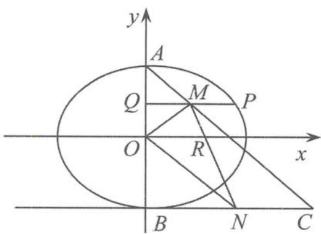  
(第6题答图)

因为 M 为线段 PQ 的中点, 所以 $M\left(\frac{x_{0}}{2}, y_{0}\right)$ .
又因为A(0,1),
所以直线AM的方程为 $y=\frac{2(y_{0}-1)}{x_{0}}x+1$ 因为 $x_{0}\neq0$ ，所以 $y_{0}\neq1$ 令y=-1，得 $x=\frac{x_{0}}{1-y_{0}}$ ，即 $C\left(\frac{x_{0}}{1-y_{0}},-1\right)$ .
又B(0,-1)，N为线段BC的中点，有 $N\left(\frac{x_{0}}{2(1-y_{0})},-1\right)$ .
设直线MN与x轴交于点 $R(x_{R},0)$ ,
由 $k_{MN}=k_{MR}$ 得 $\frac{y_{0}+1}{\frac{x_{0}}{2}-\frac{x_{0}}{2(1-y_{0})}}=\frac{y_{0}}{\frac{x_{0}}{2}-x_{R}}$ 所以 $x_{R}=\frac{x_{0}}{2(1-y_{0}^{2})}$ 所以 $S_{\triangle MON}=\frac{1}{2}|OR||y_{M}-y_{N}|$ $=\frac{1}{4}\cdot\frac{|x_{0}|}{1-y_{0}^{2}}\cdot(1+y_{0})=\frac{1}{2}\sqrt{\frac{1+y_{0}}{1-y_{0}}}$

因为 $S_{\triangle BON}=\frac{1}{2}|x_{N}|$ $=\frac{1}{4}\cdot\frac{|x_{0}|}{(1-y_{0})}=\frac{1}{2}\sqrt{\frac{1+y_{0}}{1-y_{0}}}$ 所以 $S_{四边形MOBN}=\sqrt{\frac{1+y_{0}}{1-y_{0}}}=2$ ，解得 $y_{0}=\frac{3}{5}$ ，

代入椭圆方程得 $x_{0}=\pm\frac{8}{5}$ .

因为 A(0,1)，所以 $k_{AM}=\pm\frac{1}{2}$ .

所以直线 AM 的方程为 $y=\pm\frac{1}{2}x+1$ .

7. 解答 （Ⅰ）因为 $\triangle PB_{1}B_{2}$ 的面积最大值为 $2\sqrt{2}$ ,
所以 $\frac{1}{2}\cdot2b\cdot a=2\sqrt{2}$ ，即 $ab=2\sqrt{2}$ .
因为椭圆 E 的离心率为 $\frac{\sqrt{2}}{2}$ ，所以 $\frac{c}{a}=\frac{\sqrt{2}}{2}$ .
又 $c^{2}=a^{2}-b^{2}$ ，求得 $a^{2}=4, b^{2}=2$ 所以椭圆 E 的方程为 $\frac{y^{2}}{4}+\frac{x^{2}}{2}=1$ .
（Ⅱ）由 $\left\{\begin{aligned}&2x^{2}+y^{2}=4,\\ &y=\sqrt{2}x(x\geqslant0)\end{aligned}\right.$ 求得 A(1, $\sqrt{2}$ ).
设 AB: $y=k(x-1)+\sqrt{2}$ ，与 $2x^{2}+y^{2}=4$ 联立，
消去 y，整理得 $(k^{2}+2)x^{2}-2k(k-\sqrt{2})x+k^{2}-2\sqrt{2}k-2=0.$ 因为 1 和 $x_{B}$ 是上述方程的两个根，
所以 $x_{B}=\frac{k^{2}-2\sqrt{2}k-2}{k^{2}+2}$ 所以 $y_{B}=kx_{B}-k+\sqrt{2}=\frac{-\sqrt{2}k^{2}-4k+2\sqrt{2}}{k^{2}+2}$ .
同理可求得 $x_{C}=\frac{k^{2}+2\sqrt{2}k-2}{k^{2}+2},y_{C}=\frac{-\sqrt{2}k^{2}+4k+2\sqrt{2}}{k^{2}+2}.$ 所以直线 BC 的斜率 $k_{BC}=\frac{y_{B}-y_{C}}{x_{B}-x_{C}}=\frac{8k}{4\sqrt{2}k}=\sqrt{2}.$ 设 BC: $y=\sqrt{2}x+m$ , 与 $2x^{2}+y^{2}=4$ 联立，
消去 y 得 $4x^{2}+2\sqrt{2}mx+m^{2}-4=0.$ 由于 $\Delta=8m^{2}-16(m^{2}-4)=-8(m^{2}-8)>0$ 解得 $-2\sqrt{2}<m<2\sqrt{2}$

$|BC|=\frac{\sqrt{3}\cdot\sqrt{16-2m^{2}}}{2}$ ，点A到直线BC的距离 $a=\frac{|m|}{\sqrt{3}}$ 所以△ABC的面积 $S_{\triangle ABC}=\frac{1}{2}\cdot\frac{\sqrt{3}\cdot\sqrt{16-2m^{2}}}{2}\cdot\frac{|m|}{\sqrt{3}}$ $=\frac{\sqrt{2m^{2}(16-2m^{2})}}{4\sqrt{2}}\leqslant\frac{\frac{2m^{2}+16-2m^{2}}{2}}{4\sqrt{2}}=\sqrt{2}$ 当且仅当 $m=\pm2$ 时取等号，此时△ABC的面积的最大值为 $\sqrt{2}$ .
8. 解答 （Ⅰ）设直线 AB 的方程为 $x=ty+b$ ，其中 $b\neq0$ .
由 $\left\{\begin{aligned}&x=ty+b,\\ &y^{2}=2x\end{aligned}\right.$ 得 $y^{2}-2ty-2b=0$ .
设 $A(x_{1},y_{1}), B(x_{2},y_{2})$ ,
则 $y_{1}y_{2}=-2b, x_{1}x_{2}=\frac{1}{4}(y_{1}y_{2})^{2}=b^{2}$ .
因为OA⊥OB，所以 $x_{1}x_{2}+y_{1}y_{2}=0$ ，即 $b^{2}-2b=0$ .
所以 b=2，直线 l 的方程为 $x=ty+2$ ，点 Q(2,0).
因为 $OD \perp DQ$ ，所以 $\frac{n}{m-2} \cdot \frac{n}{m} = -1$ ，
即 $n^{2}=m(2-m)$ .
而 n=1，解得 m=1.
（Ⅱ）由（Ⅰ）得 $y_{1} + y_{2} = 2t, y_{1} y_{2} = -4.$ $|y_{1}-y_{2}|=\sqrt{(y_{1}+y_{2})^{2}-4y_{1}y_{2}}=\sqrt{4(t^{2}+4)}.$ 因为 $OD \perp l, n^{2} = m(2 - m)$ ，所以 $t = -\frac{n}{m}$ ，
所以 $t^{2}=\frac{n^{2}}{m^{2}}=\frac{2}{m}-1.$ 因为 $S_{\triangle ODQ}=\frac{1}{2}|OQ||n|=|n|=\sqrt{m(2-m)}$ $S_{\triangle OAB}=\frac{1}{2}|OQ||y_{1}-y_{2}|=\sqrt{4(t^{2}+4)}=2\sqrt{\frac{2}{m}+3}$ 所以 $S_{\triangle ODQ} \cdot S_{\triangle OAB} = 2\sqrt{(2-m)(2+3m)}$ $= 2\sqrt{-3(m-\frac{2}{3})^{2}+\frac{16}{3}}.$ 因为 $m \in \left[\frac{1}{2}, \frac{3}{2}\right]$ ,

所以 $S_{\triangle ODQ} \cdot S_{\triangle OAB}$ 的取值范围为 $\left[\sqrt{13}, \frac{8}{3}\sqrt{3}\right]$ .
9. 解答 （Ⅰ）由已知可得 $E\left(-\frac{p}{2},0\right)$ ， $F\left(\frac{p}{2},0\right)$ ,
显然直线 AB 的斜率不可能为 0.
可设 $AB: x = my + \frac{p}{2}$ ,
联立 $\left\{\begin{aligned}y^{2}&=2px,\\ x&=my+\frac{p}{2},\end{aligned}\right.$ 消去 x 得 $y^{2}-2pmy-p^{2}=0$ .
设 $A(x_{1},y_{1}), B(x_{2},y_{2})$ ,
则 $y_{1}+y_{2}=2pm, y_{1}y_{2}=-p^{2}$ ,
所以 $S_{1}=\frac{1}{2}|EF||y_{1}-y_{2}|$ $=\frac{1}{2}p\sqrt{(y_{1}+y_{2})^{2}-4y_{1}y_{2}}$ $=\frac{1}{2}p\sqrt{4p^{2}m^{2}+4p^{2}}=p^{2}\sqrt{m^{2}+1}$ 而 $|AB|=\sqrt{m^{2}+1}|y_{1}-y_{2}|=2(m^{2}+1)p$ ,
故 $\frac{S_{1}^{2}}{|AB|}=\frac{(m^{2}+1)p^{4}}{2(m^{2}+1)p}=\frac{p^{3}}{2}$ .
（Ⅱ）直线 AE: $y=\frac{y_{1}}{x_{1}+\frac{p}{2}}\left(x+\frac{p}{2}\right)$ ，可得 $N\left(0,\frac{\frac{p}{2}y_{1}}{x_{1}+\frac{p}{2}}\right)$ .
同理 $M\left[0,\frac{\frac{p}{2}y_{2}}{x_{2}+\frac{p}{2}}\right]$ .
所以 $S_{2}=\frac{1}{2}\cdot\frac{p}{2}\cdot\left|\frac{\frac{p}{2}y_{2}}{x_{2}+\frac{p}{2}}-\frac{\frac{p}{2}y_{1}}{x_{1}+\frac{p}{2}}\right|$ $=\frac{p^{2}}{8}\cdot\left|\frac{y_{2}}{my_{2}+p}-\frac{y_{1}}{my_{1}+p}\right|$ $=\frac{p^{3}}{8}\cdot\frac{|y_{2}-y_{1}|}{m^{2}y_{1}y_{2}+mp(y_{1}+y_{2})+p^{2}}$ $=\frac{p^{3}}{8}\cdot\frac{|y_{2}-y_{1}|}{-m^{2}p^{2}+2p^{2}m^{2}+p^{2}}$ $=\frac{p^{3}}{8}\cdot\frac{|y_{2}-y_{1}|}{p^{2}(m^{2}+1)}$

所以 $\frac{S_1}{S_2} = \frac{\frac{1}{2}|EF||y_2 - y_1|}{\frac{p^3}{8}\cdot\frac{|y_2 - y_1|}{p^2(m^2 + 1)}} = 4(m^2 +1)\geqslant 4.$ 故 $\lambda$ 的最大值为4.

10. 解答 （Ⅰ）椭圆 C 的方程为 $\frac{x^{2}}{2} + y^{2} = 1$ .
（Ⅱ）设过点 $F_{1}$ 的直线 AB 的方程为
x=my-1,
将其代入椭圆方程 $\frac{x^{2}}{2}+y^{2}=1$ ,
整理得 $(m^{2}+2)y^{2}-2my-1=0$ 设 $A(x_{1},y_{1}), B(x_{2},y_{2})$ ，则 $\left\{\begin{aligned}y_{1}+y_{2}&=\frac{2m}{m^{2}+2},\\ y_{1}y_{2}&=\frac{-1}{m^{2}+2}\end{aligned}\right.$ 由 M, A, P 三点共线得 $y_{P}=\frac{-4y_{1}}{x_{1}-2}$ .
同理 $y_{Q}=\frac{-4y_{2}}{x_{2}-2}$ .
所以△MPQ 的面积 $S=\frac{1}{2}\cdot4\cdot|y_{P}-y_{Q}|$ $=24\left|\frac{y_{1}-y_{2}}{m^{2}y_{1}y_{2}-3m(y_{1}+y_{2})+9}\right|$ $=24\sqrt{2}\frac{\sqrt{m^{2}+1}}{m^{2}+9}=\frac{24\sqrt{2}}{\sqrt{m^{2}+1}+\frac{8}{\sqrt{m^{2}+1}}}\leqslant6.$ 故当 $m^{2}=7$ 时，△MPQ 面积的最大值为 6.

11. 解答 （Ⅰ）设 $P(x_{1}, y_{1}), Q(x_{2}, y_{2})$ ，切线 OP, OQ 的方程分别为 $y = k_{1}x, y = k_{2}x$ .
它们与圆 $M:(x-x_{0})^{2}+(y-y_{0})^{2}=\frac{2}{3}$ 相切，
所以 $\frac{|kx_{0}-y_{0}|}{\sqrt{1+k^{2}}}=\frac{\sqrt{6}}{3}$ 所以 $(3x_{0}^{2}-2)k^{2}-6x_{0}y_{0}k+3y_{0}^{2}-2=0$ 所以 $k_{1}k_{2}=\frac{3y_{0}^{2}-2}{3x_{0}^{2}-2}=\frac{3\left(1-\frac{x_{0}^{2}}{2}\right)-2}{3x_{0}^{2}-2}=-\frac{1}{2}.$ （Ⅱ）因为 $OP^{2} + OQ^{2} = (1 + k_{1}^{2}) x_{1}^{2} + (1 + k_{2}^{2}) x_{2}^{2} = \frac{2(1+k_{1}^{2})}{1+2k_{1}^{2}}+\frac{2(1+k_{2}^{2})}{1+2k_{2}^{2}}=3.$ 所以 $S=\frac{1}{2}\times\frac{\sqrt{6}}{3}(|OP|+|OQ|)$

$$
\leqslant \frac {\sqrt {6}}{6} \sqrt {2 (| O P | ^ {2} + | O Q | ^ {2})} = 1.
$$

本质: 设 $R(x_{0}, y_{0})$ 是椭圆 $\frac{x^{2}}{a^{2}} + \frac{y^{2}}{b^{2}} = 1$ 上的任意一点, 从原点 O 引圆 $R: (x - x_{0})^{2} + (y - y_{0})^{2} = r^{2}$ 的两条切线, 分别切椭圆于点 P, Q, 则 $k_{OP} \cdot k_{OQ} = e^{2} - 1 \Leftrightarrow \frac{1}{a^{2}} + \frac{1}{b^{2}} = \frac{1}{r^{2}}$ .

12. 解答 （Ⅰ）设点 $P(x,y)$ ,
由题意知 $a=\sqrt{2}b, C: x^{2}+2y^{2}=a^{2}$ 则 $\overrightarrow{PP_{1}}\cdot\overrightarrow{PP_{2}}=x^{2}+y^{2}-1=-y^{2}+a^{2}-1.$ 当 $y=\pm b$ 时， $\overrightarrow{PP_{1}}\cdot\overrightarrow{PP_{2}}$ 取得最小值，
即 $a^{2}-b^{2}-1=\frac{a}{2}\Rightarrow\frac{a^{2}}{2}-1=\frac{a}{2}\Rightarrow a=2, b=\sqrt{2}.$ 故椭圆 C 的方程为 $\frac{x^{2}}{4}+\frac{y^{2}}{2}=1$ .
（Ⅱ）设 $A(x_{1},y_{1}), B(x_{2},y_{2}), M(x_{0},y_{0})$ ,
由 $\left\{\begin{aligned}&x^{2}+2y^{2}=4,\\&y=kx+m\end{aligned}\right.$ 得
(2k²+1)x²+4mkx+2m²-4=0.
从而 $x_{1}+x_{2}=-\frac{4mk}{2k^{2}+1}, x_{1}x_{2}=\frac{2m^{2}-4}{2k^{2}+1}.$ 点 O 到直线 l 的距离 $d=\frac{|m|}{\sqrt{k^{2}+1}}$ $S=\frac{1}{2}\cdot d\cdot|AB|$ $=\frac{1}{2}\cdot\frac{|m|}{\sqrt{k^{2}+1}}\cdot\sqrt{k^{2}+1}\cdot$ $\sqrt{\left(-\frac{4mk}{2k^{2}+1}\right)^{2}-4\cdot\frac{2m^{2}-4}{2k^{2}+1}}$ $=\sqrt{2}\cdot\sqrt{\frac{m^{2}(4k^{2}+2-m^{2})}{(2k^{2}+1)^{2}}}$ $\leqslant\sqrt{2}\cdot\frac{\frac{m^{2}+(4k^{2}+2-m^{2})}{2}}{2k^{2}+1}=\sqrt{2}.$ S 取得最大值 $\sqrt{2}$ ，此时 $m^{2}=4k^{2}+2-m^{2}$ ，
即 $m^{2}=2k^{2}+1$ ①.
此时 $x_{0}=\frac{x_{1}+x_{2}}{2}=-\frac{2mk}{2k^{2}+1}=-\frac{2k}{m}$ $y_{0}=kx_{0}+m=-\frac{2k^{2}}{m}+m=\frac{1}{m}$

即 $m = \frac{1}{y_0}, k = -\frac{m}{2} x_0 = -\frac{x_0}{2y_0}$ .

代入①式整理得 $\frac{x_{0}^{2}}{2}+y_{0}^{2}=1(y_{0}\neq0)$ ,

即点 M 的轨迹为椭圆 $C_{1}:\frac{x^{2}}{2}+y^{2}=1(y\neq0)$ ，且点 $P_{1},P_{2}$ 为椭圆 $C_{1}$ 的左、右焦点，

即 $|MP_{1}|+|MP_{2}|=2\sqrt{2}$ .

记 $t = |MP_{1}|$ ，则 $t\in (\sqrt{2} -1,\sqrt{2} +1)$

从而 $T = \frac{1}{|MP_1|^2} - 2|MP_2|$

$$
= \frac {1}{t ^ {2}} - 2 (2 \sqrt {2} - t) = \frac {1}{t ^ {2}} + 2 t - 4 \sqrt {2},
$$

则 $T' = 2 - \frac{2}{t^{3}}$ .

令 $T^{\prime} \geqslant 0$ ，可得 $t \geqslant 1$ ，

故函数 T 在区间 $(\sqrt{2}-1,1)$ 上单调递减，在区间 $(1,\sqrt{2}+1)$ 上单调递增，

且 $T(1)=3-4\sqrt{2}$ ,

$$
T (\sqrt {2} - 1) = 1 > T (\sqrt {2} + 1) = 5 - 4 \sqrt {2}.
$$

故 T 的取值范围是 $[3-4\sqrt{2},1)$ .

# 后记

——采菊东篱下，悠然见南山

“是故学然后知不足,教然后知困.知不足,然后能自反也;知困,然后能自强也.”——《礼记·学记》

曾经有过豪迈的愿景和规划——“在星辉斑斓里放歌”，

曾经有过美好的追求和期待——“向青草更青处漫溯”，

但这一切的一切,都在时间与繁杂的教学事务中磨灭而逐步淡化,以至于灰飞烟灭.偶尔也会突然想起,大有茅塞顿开、醍醐灌顶之感,似乎明白一个道理,既然做不了雍容华贵的圆锥曲线,也做不了无与伦比的圆,那总可以做一个一往无前的直线吧!一切终将释怀,所以当一切的一切回归平静时,平静中不甘于平淡,我会抽空敲打敲打键盘,记录教学中的点点滴滴,以充实生活的每一天.数学学习与数学研究往往是相长的,只有慢慢地积累,慢慢地琢磨,慢慢地就会上道了.我们数学的学习者需要从一个孤独的解题者走向诗性的研究者,实现凤凰涅槃,在浴火中重生,这是我们专业成长的必要条件,同时也是我们必须要思考的一个永恒的话题.在百舸争流的新课改环境下,谁竞风流?适者也.

数学课堂充满激情、睿智、美感和灵性,那是少年们追梦剧场;数学是充满无穷乐趣、诗情画意的,那是学生心驰神往的圣地,而不是恐怖的代名词,所以对数学教育我曾不断地苦苦追问!也许我们的数学教学只让学生们看到数学理性的一面,而忽视了数学也有很文学的一面,也许我们的数学教学有点功利了,也许还有也许……所以我们的数学教学变得如此不尽如人意;对数学教育我也曾不断地拷问:圆锥曲线的美与运算的繁如何能和平共处,如何利用圆锥曲线的美去冲淡运算的繁,揭示圆锥曲线更多的秘密,这是我们教学中始终无法回避的问题,也是数学教学的大智慧,这也是本书研究的初衷.

浪迹教坛近 30 载,摸爬滚打,磕磕绊绊,砥砺前行,不忘初心.仰望数学星空,惊叹其中的奥妙;曾有心忧教育的数学行者的幻想,也曾有“三十年磨一剑”的雄心壮志,但由于心有余而力不足未能终成正果,圆锥曲线的秘密还有很多很多,本书只是揭开了冰山一角,藉以此想抛砖引玉,结伴更多的爱好者一起交流、探讨.

书中难免存在不足和疏漏，恳请读者朋友批评指正。

感谢为本书写作提供大力支持的同事们、同学们，特别感谢陕西的王杰、重庆的刘紫阳、湖南的何雅芬，三位老师为本书校对工作付出了辛勤劳动。

# 高中数学新体系“秘密”系列图书

“秘密”系列图书不只是学习一些数学知识,而且是对数学知识进行重构,打通知识的“任督二脉”,使知识成为鲜活的知识;从系统的高度帮助学生深度学习,激活数学思维,强调独立思考与数学探究,学生遇到有难度、有思维深度的题目就不再慌张.

<table><tr><td>导数的秘密</td><td>王海刚、陈宇轩</td><td>全书分为九章,共243道精讲例题及81道精练思考题,主要讲解导数的基础知识及函数不等式、恒成立问题、取点问题、偏移问题、三角函数与导数问题、估值问题等高考热点.</td></tr><tr><td>圆锥曲线的秘密</td><td>苏立标</td><td>本书以圆锥曲线可以怎样得来、怎样运算、怎样考查、怎样研究为思路进行编写,从一线教师的独到视角入手,从数学学科的特点出发,从学生学习圆锥曲线的困惑层面切入,从高考命题者的命题情节要求与研究等不同角度全方位呈现圆锥曲线内在的美与特征.</td></tr><tr><td>数列的秘密</td><td>苏卫军</td><td>本书注重回归基础知识、基本概念和基本方法,每节内容的论述均采用由浅入深、层层推进的方式行文.题型和方法既兼顾现有教材和当前高考,又体现新教材和新高考的变化,突出问题探究的背景.</td></tr><tr><td>立体几何的秘密</td><td>苏立标</td><td>本书从立体几何学科的特点出发,重点讨论立体几何的基本量问题;从学生的学习立体几何的困惑点切入,重点突破立体几何学习中的“转化”与“借用”两大技巧,以弥补学生空间想象能力的不足;从“破”与“立”入手,对知识进行脱胎换骨式的重构,打通知识内在的“任督二脉”,对方法进行深度架构.本书不求面面俱到,但求点点独到,触及问题的本源,化解立体几何学习的痛点.</td></tr><tr><td>向量的秘密</td><td>顾予恒</td><td>书中问题的解决除了呈现“标准答案”外,尽可能用一种解释的语言来撰写,让读者们读起来就像在听作者娓娓道来,引人入胜.特别地,书中很多章节还包含编题环节,从命题人的角度呈现一类问题的编制过程,让读者在会解题的同时深刻理解题目背后的奥秘和题目的由来,真正做到“知其然知其所以然”.每讲可以作为讲义供教师直接进行课堂授课,也适合学生进行自我学习.</td></tr><tr><td>概率统计的秘密</td><td>彭海燕、张珅瑞</td><td>作者结合十多年的比较接近全国卷的命题理念,围绕命题趋势,揭示高考中概率统计的命题手法、材料选择规律、模型建构特征等编写本书,力图厘清概率统计中的概念盲区,把握概率统计问题解决的一般规律和思维方式.</td></tr></table>

“秘密”系列图书的番外篇,俗称“秘密”的秘密

<table><tr><td>如何学好高中数学</td><td>苏立标</td><td>本书试图从大处着眼,从小处着手,从学习的“痛点”处着力,以案例的形式还原数学本来的面目,努力把高中数学学习的点点滴滴的方法与策略进行完整地呈现,从宏观到微观,纵横交错,全景式地进行梳理.作者站在系统的高度进行深度思考,对知识点进行整合与重构,将知识与方法条理化、有序化、结构化,这样的知识既不失“高大上”又能接地气,实现知识从厚到薄的华丽转身,所以在本书中你将会看到不一样的数学学习方式.</td></tr></table>
