<!-- source-part:1 pages:1-200 -->

# 圆锥曲线的秘密

YUANZHUI QUXIAN DE MIMI

苏立标（特级教师） 编著

兵马未动，粮草先行

博观而约取，厚积而薄发

举目仰望星空，回首又见炊烟

落霞与孤鹜齐飞，秋水共长天一色

撑一支长篙，向更青处漫溯

——圆锥曲线可以这样梳理

——圆锥曲线可以这样得来

——圆锥曲线可以这样运算

——圆锥曲线可以这样考查

——圆锥曲线可以这样研究

教辅资料站

电子教辅 试卷练习

知识总结 备课资源

—— 扫码关注获取更多学习资料 ——

# 高中数学新体系 圆锥曲线的秘密

苏立标 编著

本书不只是学习一些数学知识,而且是对数学知识进行重构,打通知识的“任督二脉”,使知识成为鲜活的知识.

从系统的高度帮助学生深度学习,激活数学思维,强调独立思考与数学探究,学生遇到有难度、有思维深度的题目就不再慌张.

图书在版编目(CIP)数据

高中数学新体系. 圆锥曲线的秘密/苏立标编著. — 杭州: 浙江大学出版社, 2022.3(2022.4 重印)

ISBN 978-7-308-22405-5

I. ①高… Ⅱ. ①苏… Ⅲ. ①中学数学课—高中—教学参考资料 Ⅳ. ①G634.603

中国版本图书馆 CIP 数据核字(2022)第 040530 号

## 高中数学新体系(圆锥曲线的秘密)

苏立标 编著

策划 陈海权(QQ:1010892859)

责任编辑 闫亮

责任校对 陈海权

封面设计 林智广告

出版发行 浙江大学出版社
(杭州市天目山路148号 邮政编码310007)
(网址:http://www.zjupress.com)

排版 杭州朝曦图文设计有限公司

印刷 杭州高腾印务有限公司

开 本 $889\mathrm{mm}\times 1194\mathrm{mm}$ 1/16

印 张 16

字 数 390 千

版印次 2022年3月第1版 2022年4月第2次印刷

书号 ISBN 978-7-308-22405-5

定价 49.80 元

版权所有 翻印必究 印装差错 负责调换

浙江大学出版社市场运营中心联系方式:0571-88925591;http://zjdxcbs.tmall.com

## 无问西东，只为追寻圆锥曲线的秘密

圆锥曲线是解析几何的重要组成部分,是解析几何核心内容的体现. 圆锥曲线又称圆锥截痕、圆锥截面、二次曲线,是通过平切圆锥(严格地讲为一个正圆锥面和一个平面完整相切)得到的曲线,这揭示了圆锥曲线与圆锥之间的渊源关系. 圆锥曲线约在公元前 200 年时就已被命名和研究了,其发现者为古希腊的数学家阿波罗尼斯(前 262—前 190 年),那时阿波罗尼斯对圆锥曲线的性质已做了一些系统性研究,现在再回首,圆锥曲线的魅力依然如故,真可谓是曲线风光,分外妖娆,千年传承,万年续表.

圆锥曲线之美,美不胜收. 圆锥曲线的美无与伦比,它不仅在图形上有令人入迷的对称美、和谐美和奇异美,而且在性质上有统一美(统一的定义、统一的极坐标方程、统一的性质等),让人叹为观止. 圆锥曲线的统一美表现在一个量变引起质变的过程,即圆锥曲线的离心率的量变引起了曲线类型的质变. 当曲线的离心率 e 由 0 逐渐接近 1 时,曲线所表示的椭圆逐渐变得扁平,这是一个量变的积累过程;当 e=1 时,就发生了质变,它不再是椭圆了,而“脱胎”为一条抛物线;当 e>1 时,曲线再次发生了质变,“羽化”为双曲线了,接着又是一个量变的过程,随着 e 趋向于无穷大,曲线则“蜕化”为两条相交直线(双曲线的两条渐近线). 这说明圆锥曲线的离心率在数值上的量变引起了曲线由椭圆到抛物线、双曲线、两条相交直线的质变. 还有其结构上别具一格的美,让人耳目一新. 圆锥曲线的内容丰富多彩,既有大江大河的奔腾之雄壮,又有涓涓溪流的流淌之幽雅. 圆锥曲线的美还在于其出神入化的广泛应用. 我们在生活中到处都有圆锥曲线的“起舞弄清影”,例如我们随便拿一个盛着半杯水的杯子(圆柱体),若把水杯平放,则水面是一个圆面,若把水杯倾斜一个角度,则水面变为一个椭圆面.放眼于璀璨的星空,行星的运行轨道大多是椭圆、双曲线或抛物线等,我们不得不发出这样的感慨:圆锥曲线的应用可以是“近在嘴边,远在天边”.另外,圆锥曲线的美还在于简洁明快的公式、绚丽多姿的符号、奇特深奥的问题等.

圆锥曲线如此多娇,引无数铁粉竞折腰.在圆锥曲线性质这个大花园中可以说是繁花似锦,景色宜人,还有很多非常有趣的美妙性质、很多秘密等待着大家去发现、去揭示、去欣赏,但是从一个高中数学教师的视角又会看到什么样的圆锥曲线?发现圆锥曲线什么样的秘密呢?本书试图从一个中学师生所关心的圆锥曲线问题展开探讨,全方位透视、欣赏圆锥曲线的美丽传说,触摸圆锥曲线的灵魂.

第一章讲述了圆锥曲线的知识清单:知识点的回眸与知识网络的构建——胸有成竹,温故而知新;

第二章讲述了圆锥曲线的定义:全方位多角度剖析——横看成岭侧成峰,远近高低各不同;

第三章讲述了圆锥曲线的解题方法:简化运算的策略梳理——八仙过海,各显神通;

第四章讲述了圆锥曲线的命题情结:深深眷恋的情结罗列——昨夜西风凋碧树,独上高楼,望尽天涯路;

第五章讲述了圆锥曲线的性质:探究以及研究的感受——众里寻他千百度,蓦然回首,那人却在灯火阑珊处.

在本书中,第一章与第五章是前呼后应的关系,第一章是预备篇,是作为知识清单而出现的,重在进行知识呈现,是知识的概述过程,是“基本盘”;而第五章是提升篇,对问题进行深化与拓展,讲究的是如何来研究圆锥曲线,探究圆锥曲线的性质,是深度学习,是“压舱石”.所以第一章从“面”上布局,第五章则从“点”上深入,第一章知识的生长点是第五章问题探究的出发点,因此这两章是相辅相成、相得益彰.如果说在第一章看到的是“万家灯火,百花齐放”,那么第五章即将看到的是“星星之火,可以燎原”.

当你阅读本书时,你将会与作者一起,行走在曲线与方程之间,徜徉在数与形的完美结合中,去领略圆锥曲线独特的内在美和探索圆锥曲线更多的秘密,所以本书成册的初衷是要做一个圆锥曲线的触类旁通的智慧向导,等着你来! 欢迎加入“高中数学体系”图书交流 QQ 群(群号码:821526438),就书中内容进行研讨!

苏立标(特级教师)

## 微信公众号 教辅资料站

## 微信公众号 教辅资料站

一章 兵马未动,粮草先行
——圆锥曲线可以这样梳理 …… 1
1.1 圆锥曲线问题中的特殊直线 …… 2
1.1.1 切线问题 …… 2
1.1.2 切点弦问题 …… 6
1.1.3 倾斜角互补的弦问题 …… 8
1.1.4 相互垂直的弦问题 …… 9
1.1.5 双曲线的渐近线问题 …… 10
1.2 圆锥曲线问题中的特殊三角形 …… 13
1.2.1 焦点三角形 …… 14
1.2.2 共焦点三角形 …… 21
1.2.3 阿基米德三角形 …… 21
1.3 圆锥曲线问题中的特征直角梯形 …… 23
1.3.1 垂直问题 …… 23
1.3.2 定值问题 …… 24
1.3.3 共线、共点问题 …… 26
1.3.4 圆的问题 …… 26
1.3.5 面积问题 …… 27
1.3.6 平分线问题 …… 28
1.3.7 其他问题 …… 29
思考题 …… 31

第二章 博观而约取,厚积而薄发
——圆锥曲线可以这样得来 …… 33
2.1 圆锥曲线可以“转”出来 …… 34
2.1.1 当圆锥曲线的定义遇到高考时 …… 42
2.1.2 当圆锥曲线的定义遇到向量时 …… 48
2.2 圆锥曲线可以“折”出来 …… 51
2.3 圆锥曲线可以“切”出来 …… 53
思考题 …… 58
第三章 举目仰望星空,回首又见炊烟
——圆锥曲线可以这样运算 …… 60
3.1 设而不求,妙在其中 …… 62
3.1.1 基本转化法 …… 63
3.1.2 整体消元法 …… 66
3.1.3 同构转化法 …… 71
3.1.4 齐次处理法 …… 76
3.2 降维转化,别有洞天 …… 80
3.3 定义搭台,几何唱戏 …… 84
3.4 向量当道,出奇制胜 …… 88
3.5 以静制动,突出重围 …… 93
思考题 …… 100

第四章 落霞与孤鹜齐飞,秋水共长天一色
——圆锥曲线可以这样考查 …… 103
4.1 有关共焦点问题 …… 104
4.2 有关定比问题 …… 108
4.3 有关“两率”问题 …… 115
4.3.1 与圆锥曲线的对称中心有关的 $e^{2}-1$ 性质 …… 115
4.3.2 与圆锥曲线的中点弦有关的 $e^{2}-1$ 性质 …… 120
4.3.3 与圆锥曲线的切线有关的 $e^{2}-1$ 性质 …… 132
4.3.4 $e^{2}-1$ 性质的本质与适用范围 …… 135
思考题 …… 139
第五章 撑一支长篙,向更青处漫溯
——圆锥曲线可以这样研究 …… 142
5.1 圆锥曲线研究案例综述 …… 144
5.1.1 问题的背景提出——乱花渐欲迷人眼 …… 144
5.1.2 问题的本原探究——吹尽狂沙始到金 …… 145
5.1.3 问题的变式探究——淡妆浓抹总相宜 …… 145
5.1.4 问题探究的反思——映日荷花别样红 …… 150
5.2 圆锥曲线中的定值问题探究 …… 151
5.2.1 一类圆锥曲线中平行弦的定值问题探究 …… 151
5.2.2 一类与准线相关的定值问题溯源 …… 156
5.2.3 一类以 $e^{2}-1$ 为背景的定值问题溯源 …… 160
5.2.4 一类与定值 $\frac{2}{e}$ 有关的问题溯源 …… 164

5.3 圆锥曲线中的定点问题探究 …… 169
5.3.1 高考试题中圆锥曲线“伴侣点”的透视与剖析 …… 169
5.3.2 抛物线对称轴上的定点的性质探究 …… 173
5.3.3 圆锥曲线中以张角为直角的弦为背景的定点问题概述 …… 178
5.4 圆锥曲线中的定直线问题探究 …… 182
5.4.1 一类圆锥曲线的法线问题探究 …… 182
5.4.2 一类圆锥曲线的类准线问题初探 …… 185
5.4.3 一类以极线为背景的定直线问题初探 …… 189
5.5 以圆为背景的圆锥曲线性质探究 …… 192
5.5.1 双曲线的伴随圆的性质初探 …… 192
5.5.2 以蒙日圆的姊妹圆为背景的溯源探究 …… 195
5.5.3 椭圆的同心内切圆的性质管窥 …… 199
5.6 圆锥曲线中的其他问题探究 …… 203
5.6.1 抛物线中的类特征直角梯形的性质探秘 …… 203
5.6.2 椭圆的顶焦点三角形的性质探究 …… 207
5.6.3 圆锥曲线的相似曲线的性质探究 …… 211
5.6.4 圆锥曲线的伴随曲线的性质探讨 …… 215
5.6.5 以椭圆的切线为背景的高考试题剖析 …… 220
思考题 …… 226
考题解答 …… 229
记——采菊东篱下，悠然见南山 …… 244

# 第一章

# 兵马未动,粮草先行

——圆锥曲线可以这样梳理

在数学学习中,我们需要一定的方法与策略,同时也需要适量的、有用的知识储备.丰厚的知识储备是数学学习必不可少的装备.但知识储备不能是零散的、无序的,所以我们需要对一些重要的显性知识进行梳理,同时也需要对一些必要的隐性知识进行整理,并使之显性化,把它转化为解题的强有力的工具.如果我们把定理、公式这些显性知识比作月亮的话,那么那些隐性知识就像是点缀在月亮旁边的星星,只有“众星捧月”才会是最完美的数学星空.

俄罗斯教育家乌申斯基曾说：“智慧不是别的，只是组织得很好的知识体系。装着一些片段的、没有联系的知识的头脑，像一个乱七八糟的仓库，主人从那里什么也找不出来。”所以我们需要对知识进行分门别类，这也是知识的“浓缩”过程，其目的就是为了知识的有效与高效的提取作准备。整理知识清单，不只是把散落在各个角落的知识进行简简单单地搜索、罗列，而是对知识进行深层次的思考。整理知识清单，应该把缄默的知识变成有序的系统，成为鲜活的知识。当知识的储备成为鲜活的知识时，我们对数学的理解往往会有一个实质性的突破。显性知识与隐性知识并驾齐驱，是数学学习过程中一个不可或缺的环节。

本章主要以圆锥曲线问题中的特殊直线、特殊三角形、特殊四边形(直角梯形)为主线索进行梳理,构建知识网络,疏通有关性质之间的内在关联,把依附在这些特殊图形上的圆锥曲线的性质一一呈现.当我们从一个特殊的图形视角来欣赏圆锥曲线的性质时,不仅能够提纲挈领,而且还有“轻舟泛涟漪,一‘形’起波澜”的效果.

## 1.1 圆锥曲线问题中的特殊直线

圆锥曲线问题中的特殊直线与圆锥曲线的性质有着千丝万缕的联系,也正是这些直线使圆锥曲线的性质变得绚丽多彩.常见的这类特殊直线(或直线上的线段)有:切线、切点弦、顺角直补的弦、相互垂直的弦、中点弦、渐近线等.

## 1.1.1 切线问题

以椭圆的切线问题为例,对圆锥曲线问题中的切线问题进行梳理,常见的结论如下.

公式1 直线 $y = kx + m$ 是椭圆 $\frac{x^2}{a^2} + \frac{y^2}{b^2} = 1 (a > b > 0)$ 的切线的充要条件是 $m^2 = a^2k^2 + b^2$ .

证明 把直线方程 $y = kx + m$ 代入椭圆方程 $\frac{x^2}{a^2} + \frac{y^2}{b^2} = 1 (a > b > 0)$ ，整理得

$$
(a ^ {2} k ^ {2} + b ^ {2}) x ^ {2} + 2 a ^ {2} k m x + a ^ {2} m ^ {2} - a ^ {2} b ^ {2} = 0.
$$

由题意知

$$
\Delta = 4 a ^ {2} b ^ {2} (a ^ {2} k ^ {2} + b ^ {2} - m ^ {2}) = 0,
$$

解得 $m^{2}=a^{2}k^{2}+b^{2}$ . 反之也成立.

公式2 若点 $P(x_0, y_0)$ 在椭圆 $\frac{x^2}{a^2} + \frac{y^2}{b^2} = 1 (a > b > 0)$ 上，则椭圆在点 $P$ 处的切线方程是 $\frac{x_0 x}{a^2} + \frac{y_0 y}{b^2} = 1$ .

证明 结合椭圆的对称性,我们只要考虑椭圆在第一象限内的情形即可.由椭圆方程 $\frac{x^{2}}{a^{2}}+\frac{y^{2}}{b^{2}}=1$ 可得 $y=\frac{b}{a}\sqrt{a^{2}-x^{2}}$ , 则

$$
y _ {0} = \frac {b}{a} \sqrt {a ^ {2} - x _ {0} ^ {2}}.
$$

所以椭圆在点 P 处切线的斜率

$$
k = y ^ {\prime} \mid_ {x _ {0}} = - \frac {b x _ {0}}{a \sqrt {a ^ {2} - x _ {0} ^ {2}}} = - \frac {b ^ {2} x _ {0}}{a ^ {2} y _ {0}}.
$$

因此椭圆在点 $P$ 处的切线方程是

$$
y = - \frac {b ^ {2} x _ {0}}{a ^ {2} y _ {0}} (x - x _ {0}) + y _ {0},
$$

整理得

$$
\frac {x _ {0} x}{a ^ {2}} + \frac {y _ {0} y}{b ^ {2}} = 1.
$$

性质1 若点 $P(x_0, y_0)$ 在椭圆 $\frac{x^2}{a^2} + \frac{y^2}{b^2} = 1 (a > b > 0)$ 上，则椭圆在点 $P$ 处的切线 $l$ 的斜率 $k_l$ 满足 $k_{OP} \cdot k_l = e^2 - 1$ （其中 $e$ 为椭圆的离心率）.

性质2 设 $P(x_0, y_0)$ 是椭圆 $\frac{x^2}{a^2} + \frac{y^2}{b^2} = 1 (a > b > 0)$ 上的任意一点， $l$ 为椭圆在点 $P$ 处的切线，设 $d$ 是原点到直线 $l$ 的距离， $r_1, r_2$ 分别是点 $P$ 到椭圆两个焦点 $F_1, F_2$ 的距离，则 $\sqrt{r_1 r_2} \cdot d = ab$ .

证明 易求得椭圆 $\frac{x^2}{a^2} +\frac{y^2}{b^2} = 1$ 在点 $P$ 处的切线 $l$ 的方程为

$$
b ^ {2} x _ {0} x + a ^ {2} y _ {0} y - a ^ {2} b ^ {2} = 0.
$$

从而

$$
d = \frac {a ^ {2} b ^ {2}}{\sqrt {b ^ {4} x _ {0} ^ {2} + a ^ {4} y _ {0} ^ {2}}} = \frac {a ^ {2} b ^ {2}}{\sqrt {b ^ {4} x _ {0} ^ {2} + a ^ {2} b ^ {2} (a ^ {2} - x _ {0} ^ {2})}} = \frac {a ^ {2} b}{\sqrt {a ^ {4} - c ^ {2} x _ {0} ^ {2}}} = \frac {a b}{\sqrt {a ^ {2} - e ^ {2} x _ {0} ^ {2}}}.
$$

因为

$$
r _ {1} r _ {2} = \left| P F _ {1} \right| \left| P F _ {2} \right| = (a + e x _ {0}) (a - e x _ {0}) = a ^ {2} - e ^ {2} x _ {0} ^ {2},
$$

所以

$$
\sqrt {r _ {1} r _ {2}} \bullet d = \sqrt {a ^ {2} - e ^ {2} x _ {0} ^ {2}} \bullet \frac {a b}{\sqrt {a ^ {2} - e ^ {2} x _ {0} ^ {2}}} = a b (\text {定值}).
$$

性质3 如图1.1-1, 经过椭圆 $\frac{x^2}{a^2} + \frac{y^2}{b^2} = 1 (a > b > 0)$ 长轴的两个端点 $A_1$ 和 $A_2$ 的切线, 与过椭圆上任意一点 $P$ 的切线分别相交于点 $P_1$ 和 $P_2$ , 则有:

(1) $\left|P_{1}A_{1}\right|\left|P_{2}A_{2}\right|=b^{2};$

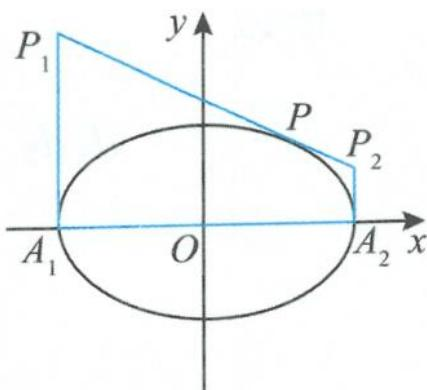  
图1.1-1

(2) 四边形 $A_{1}P_{1}P_{2}A_{2}$ 面积的最小值是 2ab.

证明 (1)设切点为 $P(a\cos \theta ,b\sin \theta)$ ，则椭圆在点 $P$ 处的切线方程为

$$
\frac {\cos \theta}{a} x + \frac {\sin \theta}{b} y = 1.
$$

由此可得

$$
y _ {P _ {1}} = \frac {b}{\sin \theta} (1 + \cos \theta), y _ {P _ {2}} = \frac {b}{\sin \theta} (1 - \cos \theta).
$$

所以

$$
\mid P _ {1} A _ {1} \mid \mid P _ {2} A _ {2} \mid = \frac {b ^ {2} (1 - \cos^ {2} \theta)}{\sin^ {2} \theta} = b ^ {2}.
$$

(2)由(1)知 $\left|P_{1}A_{1}\right|\left|P_{2}A_{2}\right|=b^{2}$ ，由基本不等式得

$$
\left| P _ {1} A _ {1} \right| + \left| P _ {2} A _ {2} \right| \geqslant 2 \sqrt {\left| P _ {1} A _ {1} \right| \left| P _ {2} A _ {2} \right|} = 2 b.
$$

因此梯形 $A_{1}P_{1}P_{2}A_{2}$ 的面积

$$
S = \frac {\mid P _ {1} A _ {1} \mid + \mid P _ {2} A _ {2} \mid}{2} \cdot 2 a \geqslant 2 a b.
$$

故 $A_{1}P_{1}P_{2}A_{2}$ 面积的最小值是 $2ab$ .

性质4 如图1.1-2，设 $P(x_0,y_0)$ 是椭圆 $\frac{x^2}{a^2} +\frac{y^2}{b^2} = 1(a > b > 0)$ 上的任意一点， $l$ 为椭圆在点 $P$ 处的切线，设椭圆的两个焦点 $F_{1},F_{2}$ 到切线 $l$ 的距离分别为 $d_{1},d_{2}$ ，则有：

(1) $d_{1}d_{2}=b^{2}$ ;

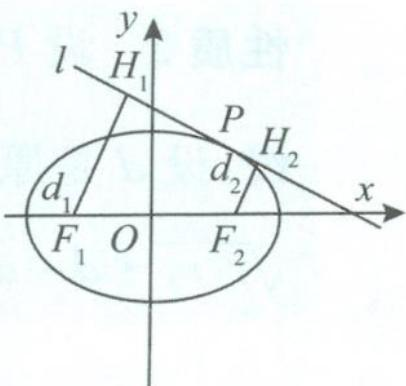  
图1.1-2

(2) 四边形 $F_{1}H_{1}H_{2}F_{2}$ 面积的最大值是 $a^{2}$ ;

(3) 若直线 m 是 $\angle F_{1}PF_{2}$ 的平分线，则 $m \perp l$ ;

(4)设椭圆两个焦点 $F_{1}, F_{2}$ 在切线 $l$ 上的射影分别为 $H_{1}, H_{2}$ , 则点 $H_{1}, H_{2}$ 在同一个圆上;

(5)设 $\angle F_{1}PF_{2}$ 的内角平分线与 $x$ 轴的交点为 $M,\angle F_{1}PF_{2}$ 的外角平分线与 $x$ 轴的交点为 $N$ ,则 $x_{M}x_{N}=c^{2}$ .

证明 (1) 易得椭圆 $\frac{x^2}{a^2} + \frac{y^2}{b^2} = 1$ 在点 $P$ 处的切线 $l$ 的方程为

$$
b ^ {2} x _ {0} x + a ^ {2} y _ {0} y - a ^ {2} b ^ {2} = 0.
$$

所以

$$
\begin{array}{r l} d _ {1} d _ {2} & = \frac {\left| b ^ {2} x _ {0} c + a ^ {2} b ^ {2} \right|}{\sqrt {b ^ {4} x _ {0} ^ {2} + a ^ {4} y _ {0} ^ {2}}} \cdot \frac {\left| b ^ {2} x _ {0} c - a ^ {2} b ^ {2} \right|}{\sqrt {b ^ {4} x _ {0} ^ {2} + a ^ {4} y _ {0} ^ {2}}} = \frac {b ^ {4} (a ^ {4} - c ^ {2} x _ {0} ^ {2})}{b ^ {4} x _ {0} ^ {2} + a ^ {4} y _ {0} ^ {2}} = \frac {b ^ {4} (a ^ {4} - c ^ {2} x _ {0} ^ {2})}{b ^ {4} x _ {0} ^ {2} + a ^ {2} b ^ {2} (a ^ {2} - x _ {0} ^ {2})} \\ & = \frac {b ^ {2} (a ^ {4} - c ^ {2} x _ {0} ^ {2})}{b ^ {2} x _ {0} ^ {2} + a ^ {2} (a ^ {2} - x _ {0} ^ {2})} = \frac {b ^ {2} (a ^ {4} - c ^ {2} x _ {0} ^ {2})}{a ^ {4} - (a ^ {2} - b ^ {2}) x _ {0} ^ {2}} = \frac {b ^ {2} (a ^ {4} - c ^ {2} x _ {0} ^ {2})}{a ^ {4} - c ^ {2} x _ {0} ^ {2}} = b ^ {2}. \end{array}
$$

(2)因为四边形 $F_{1}H_{1}H_{2}F_{2}$ 的高

$$
h = \left| H _ {1} H _ {2} \right| = \sqrt {\left| F _ {1} F _ {2} \right| ^ {2} - \left(d _ {1} - d _ {2}\right) ^ {2}} = \sqrt {4 c ^ {2} - \left(d _ {1} - d _ {2}\right) ^ {2}},
$$

又由(1)知 $d_{1}d_{2} = b^{2}$ ，所以

$$
\begin{array}{r l} S _ {\text {四边形} F _ {1} H _ {1} H _ {2} F _ {2}} & = \frac {1}{2} (d _ {1} + d _ {2}) \sqrt {4 c ^ {2} - (d _ {1} - d _ {2}) ^ {2}} \\ & = \frac {1}{2} \sqrt {(d _ {1} + d _ {2}) ^ {2} [ 4 c ^ {2} - (d _ {1} - d _ {2}) ^ {2} ]} \\ & \leqslant \frac {1}{2} \cdot \frac {(d _ {1} + d _ {2}) ^ {2} + [ 4 c ^ {2} - (d _ {1} - d _ {2}) ^ {2} ]}{2} \\ & = c ^ {2} + d _ {1} d _ {2} = c ^ {2} + b ^ {2} = a ^ {2}. \end{array}
$$

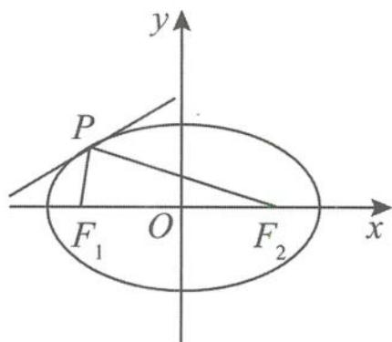  
图1.1-3

(3)如图 1.1-3, 椭圆在点 P 处的切线 l 的方程为

$$
\frac {x _ {0} x}{a ^ {2}} + \frac {y _ {0} y}{b ^ {2}} = 1,
$$

设切线 $l$ 的一个方向向量

$$
l = (y _ {0}, (e ^ {2} - 1) x _ {0}),
$$

又 $\angle F_{1}PF_{2}$ 的平分线 $m$ 的一个方向向量

$$
\boldsymbol {m} = \frac {\overrightarrow {P F _ {1}}}{| \overrightarrow {P F _ {1}} |} + \frac {\overrightarrow {P F _ {2}}}{| \overrightarrow {P F _ {2}} |} = \frac {(- c - x _ {0} , - y _ {0})}{a + e x _ {0}} + \frac {(c - x _ {0} , - y _ {0})}{a - e x _ {0}} = \left(\frac {2 x _ {0} (e c - a)}{a ^ {2} - e ^ {2} x _ {0} ^ {2}}, \frac {- 2 a y _ {0}}{a ^ {2} - e ^ {2} x _ {0} ^ {2}}\right),
$$

所以

$$
\boldsymbol {l} \cdot \boldsymbol {m} = \frac {2 x _ {0} y _ {0} (e c - a)}{a ^ {2} - e ^ {2} x _ {0} ^ {2}} + \frac {- 2 a x _ {0} y _ {0} (e ^ {2} - 1)}{a ^ {2} - e ^ {2} x _ {0} ^ {2}} = 0.
$$

得证.(注:性质(3)揭示的是椭圆的切线与法线问题,反映的是椭圆的光学性质)

(4)由(3)知切线 $l$ 为 $\angle F_{1}PF_{2}$ 的外角平分线, 延长 $F_{1}H_{1}$ 和 $F_{2}P$ , 交于点 $Q$ , 则 $H_{1}$ 为 $F_{1}Q$ 的中点, 且 $|PF_{1}| = |PQ|$ . 所以

$$
\mid O H _ {1} \mid = \frac {1}{2} \mid Q F _ {2} \mid = \frac {1}{2} (\mid P F _ {1} \mid + \mid P F _ {2} \mid) = a,
$$

即点 $H_{1}$ 在以 $O$ 为圆心、 $a$ 为半径的圆上. 同理可证明点 $H_{2}$ 也在同一个圆上.

(5)设 $P(a\cos \theta ,b\sin \theta)$ ，则 $\angle F_{1}PF_{2}$ 的外角平分线（即过点 $P$ 的切线） $l$ 的方程为

$$
\frac {\cos \theta}{a} x + \frac {\sin \theta}{b} y = 1,
$$

得点 $N\left(\frac{a}{\cos \theta}, 0\right)$ . 同理 $\angle F_{1}PF_{2}$ 的内角平分线 (即切线的法线) $l'$ 的方程为

$$
\frac {\sin \theta}{b} x - \frac {\cos \theta}{a} y - \frac {c ^ {2}}{a b} \sin \theta \cos \theta = 0,
$$

由此得点 $M\left(\frac{c^2\cos\theta}{a},0\right)$ .所以

$$
x _ {M} x _ {N} = \frac {c ^ {2} \cos \theta}{a} \cdot \frac {a}{\cos \theta} = c ^ {2}.
$$

性质5 如图1.1-4, 设椭圆 $\frac{x^2}{a^2} + \frac{y^2}{b^2} = 1 (a > b > 0)$ 长轴的两个顶点为 $A$ 和 $B$ , 过椭圆上点 $P(x_0, y_0)$ 的切线 $l$ 的方程为 $\frac{x_0x}{a^2} + \frac{y_0y}{b^2} = 1$ , 过 $A, B$ 两点作 $x$ 轴的垂线, 交切线 $l$ 于 $C, D$ 两点. 若 $AD$ 与 $BC$ 相交于点 $Q$ , 则点 $Q$ 的轨迹方程为 $\frac{x^2}{a^2} + \frac{4y^2}{b^2} = 1 (y \neq 0)$ .

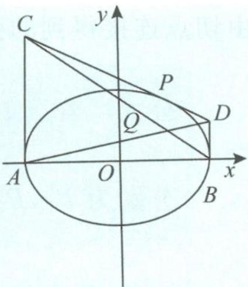  
图1.1-4

证明 因为点 $P(x_0, y_0)$ 在椭圆 $\frac{x^2}{a^2} + \frac{y^2}{b^2} = 1 (a > b > 0)$ 上，所以

$$
b ^ {2} x _ {0} ^ {2} + a ^ {2} y _ {0} ^ {2} = a ^ {2} b ^ {2}.
$$

在切线方程 $\frac{x_{0}x}{a^{2}}+\frac{y_{0}y}{b^{2}}=1$ 中，令 $x=\pm a$ ，得

$$
y _ {C} = \frac {b ^ {2}}{y _ {0}} \left(1 + \frac {x _ {0}}{a}\right), y _ {D} = \frac {b ^ {2}}{y _ {0}} \left(1 - \frac {x _ {0}}{a}\right),
$$

所以

$$
y _ {C} y _ {D} = \frac {b ^ {4}}{y _ {0} ^ {2}} \left(1 - \frac {x _ {0} ^ {2}}{a ^ {2}}\right) = b ^ {4} \cdot \frac {a ^ {2} - x _ {0} ^ {2}}{a ^ {2} y _ {0} ^ {2}} = b ^ {2}.
$$

从而

$$
k _ {A D} k _ {B C} = \frac {y _ {C} y _ {D}}{- 4 a ^ {2}} = \frac {b ^ {2}}{- 4 a ^ {2}}.
$$

又因为 $k_{AD}k_{BC} = \frac{y}{x + a}\cdot \frac{y}{x - a} = \frac{y^2}{x^2 - a^2}$ 所以 $\frac{y^2}{x^2 - a^2} = \frac{b^2}{-4a^2}$ 即

$$
\frac {x ^ {2}}{a ^ {2}} + \frac {4 y ^ {2}}{b ^ {2}} = 1 (y \neq 0).
$$

同样地,双曲线、抛物线也有类似的公式:

(1) 若点 $P(x_0, y_0)$ 在双曲线 $\frac{x^2}{a^2} - \frac{y^2}{b^2} = 1 (a > 0, b > 0)$ 上, 则双曲线在点 $P$ 处的切线方程是 $\frac{xx_0}{a^2} - \frac{yy_0}{b^2} = 1$ .

(2)若点 $P(x_0, y_0)$ 在抛物线 $y^2 = 2px (p > 0)$ 上，则抛物线在点 $P$ 处的切线方程是 $yy_0 = p(x + x_0)$ .

温馨提示 求二次曲线在点 $(x_0, y_0)$ 处的切线方程, 只需把 $x^2, y^2, x, y$ 分别改为 $x_0x$ , $y_0y, \frac{x_0 + x}{2}, \frac{y_0 + y}{2}$ .

## 1.1.2 切点弦问题

定义 从曲线外一点引曲线的两条切线,由两个切点得到的弦叫作切点弦,即切点弦是指由切点连接得到的弦.

公式 若点 $P(x_0, y_0)$ 在椭圆 $\frac{x^2}{a^2} + \frac{y^2}{b^2} = 1 (a > b > 0)$ 外，过点 $P$ 作椭圆的两条切线，切点分别为 $P_1, P_2$ ，则切点弦 $P_1P_2$ 所在直线的方程是 $\frac{x_0x}{a^2} + \frac{y_0y}{b^2} = 1$ .

证明 易求得椭圆 $\frac{x^2}{a^2} + \frac{y^2}{b^2} = 1$ 的切线方程为

$$
\frac {x _ {0} x}{a ^ {2}} + \frac {y _ {0} y}{b ^ {2}} = 1.
$$

设 $P_{1}(x_{1},y_{1}), P_{2}(x_{2},y_{2})$ ，则

$$
\frac {x _ {0} x _ {1}}{a ^ {2}} + \frac {y _ {0} y _ {1}}{b ^ {2}} = 1, \frac {x _ {0} x _ {2}}{a ^ {2}} + \frac {y _ {0} y _ {2}}{b ^ {2}} = 1.
$$

因为点 $P_{1}, P_{2}$ 在直线 $P_{1}P_{2}$ 上, 且满足方程 $\frac{x_{0}x}{a^{2}} + \frac{y_{0}y}{b^{2}} = 1$ , 所以切点弦 $P_{1}P_{2}$ 所在直线的方程是

$$
\frac {x _ {0} x}{a ^ {2}} + \frac {y _ {0} y}{b ^ {2}} = 1.
$$

(双曲线)若点 $P(x_{0},y_{0})$ 在双曲线 $\frac{x^{2}}{a^{2}}-\frac{y^{2}}{b^{2}}=1(a>0,b>0)$ 外, 过点 P 作双曲线的两条切线, 切点分别为 $P_{1},P_{2}$ , 则切点弦 $P_{1}P_{2}$ 所在直线的方程是 $\frac{xx_{0}}{a^{2}}-\frac{yy_{0}}{b^{2}}=1$ .

(抛物线)若点 $P(x_{0}, y_{0})$ 在抛物线 $y^{2}=2px (p>0)$ 外, 过点 P 作抛物线的两条切线, 切点分别为 $P_{1}, P_{2}$ , 则切点弦 $P_{1}P_{2}$ 所在直线的方程是 $yy_{0}=p(x+x_{0})$ .

应用 已知抛物线 $C: x^{2} = 2py (p > 0)$ 的焦点为 $F$ , 且点 $F$ 与圆 $M: x^{2} + (y + 4)^{2} = 1$ 上点的距离的最小值为 4.

(I)求 $p$ .

(Ⅱ)如图1.1-5,若点P在圆M上,PA,PB是抛物线C的两条切线,A,B是切点,求 $\triangle PAB$ 面积的最大值.

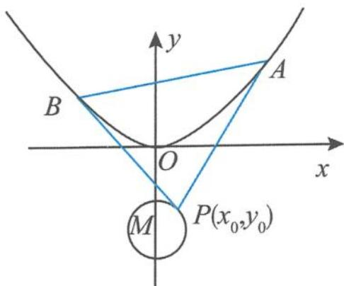  
图1.1-5

解答 (I)点 $F(0, \frac{p}{2})$ 到圆 $M$ 上点的距离的最小值为

$$
\mid F M \mid - 1 = \frac {p}{2} + 4 - 1 = 4,
$$

解得 p=2.

(Ⅱ)抛物线 C 的方程为 $x^{2}=4y$ ，即

$$
y = \frac {x ^ {2}}{4}.
$$

对该函数求导得 $y'=\frac{x}{2}$ ，设点 $A(x_{1},y_{1})$ , $B(x_{2},y_{2})$ , $P(x_{0},y_{0})$ ，直线 PA 的方程为 $y-y_{1}=\frac{x_{1}}{2}(x-x_{1})$ ，即 $y=\frac{x_{1}x}{2}-y_{1}$ ，即

$$
x _ {1} x - 2 y _ {1} - 2 y = 0.
$$

同理可知,直线 PB 的方程为

$$
x _ {2} x - 2 y _ {2} - 2 y = 0.
$$

由于点 P 为这两条直线的公共点, 则满足

$$
\left\{ \begin{array}{l} x _ {1} x _ {0} - 2 y _ {1} - 2 y _ {0} = 0, \\ x _ {2} x _ {0} - 2 y _ {2} - 2 y _ {0} = 0. \end{array} \right.
$$

从而点 A, B 的坐标都满足方程 $x_{0}x - 2y - 2y_{0} = 0$ ，故直线 AB 的方程为

$$
x _ {0} x - 2 y - 2 y _ {0} = 0.
$$

把直线 $AB$ 的方程代入抛物线方程得

$$
x ^ {2} - 2 x _ {0} x + 4 y _ {0} = 0.
$$

由韦达定理可得 $x_{1}+x_{2}=2x_{0}, x_{1}x_{2}=4y_{0}$ ，因此

$$
\vert A B \vert = \sqrt {1 + \left(\frac {x _ {0}}{2}\right) ^ {2}} \vert x _ {1} - x _ {2} \vert = \sqrt {1 + \left(\frac {x _ {0}}{2}\right) ^ {2}} \cdot \sqrt {4 x _ {0} ^ {2} - 1 6 y _ {0}} = \sqrt {\left(x _ {0} ^ {2} + 4\right) \left(x _ {0} ^ {2} - 4 y _ {0}\right)}.
$$

又点 $P$ 到直线 $AB$ 的距离 $d = \frac{|x_0^2 - 4y_0|}{\sqrt{x_0^2 + 4}}$ ，所以

$$
S _ {\triangle P A B} = \frac {1}{2} | A B | d = \frac {1}{2} \sqrt {(x _ {0} ^ {2} + 4) (x _ {0} ^ {2} - 4 y _ {0})} \cdot \frac {| x _ {0} ^ {2} - 4 y _ {0} |}{\sqrt {x _ {0} ^ {2} + 4}} = \frac {1}{2} | x _ {0} ^ {2} - 4 y _ {0} | ^ {\frac {3}{2}}.
$$

因为

$$
x _ {0} ^ {2} - 4 y _ {0} = 1 - (y _ {0} + 4) ^ {2} - 4 y _ {0} = - y _ {0} ^ {2} - 1 2 y _ {0} - 1 5 = - (y _ {0} + 6) ^ {2} + 2 1,
$$

由已知可得

$$
- 5 \leqslant y _ {0} \leqslant - 3.
$$

所以，当 $y_{0} = -5$ 时， $\triangle PAB$ 的面积取最大值 $\frac{1}{2} \times 20^{\frac{3}{2}} = 20\sqrt{5}$ .

## 1.1.3 倾斜角互补的弦问题

1. 若 $A(x_{0}, y_{0})$ 为椭圆 $\frac{x^{2}}{a^{2}} + \frac{y^{2}}{b^{2}} = 1 (a > b > 0)$ 上的点, $E, F$ 是椭圆上的两个动点, 直线 $AE$ 的倾斜角与直线 $AF$ 的倾斜角互补, 则直线 $EF$ 的斜率为定值 $(1 - e^{2}) \frac{x_{0}}{y_{0}}$ , 且和椭圆在点 $A$ 处的切线的斜率互为相反数. (其中 $e$ 为椭圆的离心率)

证明 如图 1.1-6, 由于直线 AE 的倾斜角与直线 AF 的倾斜角互补, 所以斜率互为相反数. 设直线 AE 的斜率为 k, 则直线 AF 的斜率为 -k. 设 $E(x_{1}, y_{1}), F(x_{2}, y_{2})$ , 则由题意可设直线 AE 的方程为

$$
y = k (x - x _ {0}) + y _ {0}.
$$

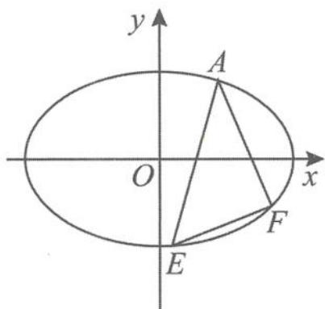

把直线 $AE$ 的方程代入椭圆方程得

$$
(a ^ {2} k ^ {2} + b ^ {2}) x ^ {2} + 2 a ^ {2} k (y _ {0} - k x _ {0}) x + a ^ {2} (y _ {0} - k x _ {0}) ^ {2} - a ^ {2} b ^ {2} = 0,
$$

图1.1-6

所以 $x_{1} + x_{0} = \frac{2ka^{2}(kx_{0} - y_{0})}{a^{2}k^{2} + b^{2}}$ ，从而

$$
x _ {1} = \frac {k ^ {2} a ^ {2} x _ {0} - 2 k a ^ {2} y _ {0} - b ^ {2} x _ {0}}{a ^ {2} k ^ {2} + b ^ {2}}\tag{①.}
$$

用-k代替上式中的k,即可得到

$$
x _ {2} = \frac {k ^ {2} a ^ {2} x _ {0} + 2 k a ^ {2} y _ {0} - b ^ {2} x _ {0}}{a ^ {2} k ^ {2} + b ^ {2}}\tag{②.}
$$

由题意知

$$
k _ {E F} = \frac {y _ {1} - y _ {2}}{x _ {1} - x _ {2}} = \frac {k (x _ {1} + x _ {2}) - 2 k x _ {0}}{x _ {1} - x _ {2}}\tag{③.}
$$

把①②两式代入③式得到

$$
k _ {E F} = \frac {b ^ {2} x _ {0}}{a ^ {2} y _ {0}} = (1 - e ^ {2}) \frac {x _ {0}}{y _ {0}} (\text {定值}).
$$

而椭圆在点 A 处的切线的斜率 $k_{切} = -\frac{b^{2}x_{0}}{a^{2}y_{0}}$ ，故直线 EF 和椭圆在点 A 处的切线的斜率互为相反数。

2. 若 $A(x_{0}, y_{0})$ 为双曲线 $\frac{x^{2}}{a^{2}} - \frac{y^{2}}{b^{2}} = 1 (a > 0, b > 0)$ 上的点，E, F 是双曲线上的两个动点，直线 AE 的倾斜角与直线 AF 的倾斜角互补，则直线 EF 的斜率为定值 $(1 - e^{2})\frac{x_{0}}{y_{0}}$ ，且和双曲线在点 A 处的切线的斜率互为相反数。（证明过程可类比上述证明椭圆相关性质的过程）.

3. 若 $A(x_{0}, y_{0})$ 为抛物线 $y^{2} = 2px (p > 0)$ 上的点, E, F 是抛物线上的两个动点, 直线 AE 的倾斜角与直线 AF 的倾斜角互补, 则直线 EF 的斜率为定值 $-\frac{p}{y_{0}}$ , 且和抛物线在点 A 处的切线的斜率互为相反数.

证明 如图 1.1-7, 设点 $E(x_{1}, y_{1})$ , $F(x_{2}, y_{2})$ , 则

$$
k _ {A E} + k _ {A F} = \frac {y _ {1} - y _ {0}}{x _ {1} - x _ {0}} + \frac {y _ {2} - y _ {0}}{x _ {2} - x _ {0}} = \frac {2 p}{y _ {1} + y _ {0}} + \frac {2 p}{y _ {2} + y _ {0}} = 0,
$$

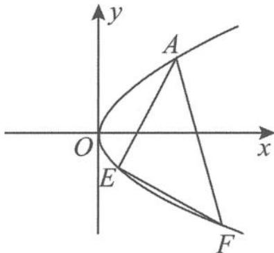

所以 $y_{1} + y_{2} = -2y_{0}$ ，故

$$
k _ {E F} = \frac {y _ {1} - y _ {2}}{x _ {1} - x _ {2}} = \frac {2 p}{y _ {1} + y _ {2}} = - \frac {p}{y _ {0}}.
$$

图1.1-7

而抛物线在点 A 处的切线方程为 $yy_{0}=p(x+x_{0})$ ，所以直线 EF 的斜率和抛物线在点 A 处的切线的斜率互为相反数。

## 1.1.4 相互垂直的弦问题

性质 已知椭圆 $\frac{x^2}{a^2} +\frac{y^2}{b^2} = 1(a > b > 0)$ ， $O$ 为坐标原点，若 $P,Q$ 为椭圆上的两个动点，且 $OP\bot OQ$ ，则有：

(1) $\frac{1}{|OP|^{2}}+\frac{1}{|OQ|^{2}}=\frac{1}{a^{2}}+\frac{1}{b^{2}};$

(2) $|OP|^{2}+|OQ|^{2}$ 的最小值为 $\frac{4a^{2}b^{2}}{a^{2}+b^{2}}$ ;

(3) $S_{\triangle OPQ}$ 的最小值为 $\frac{a^{2}b^{2}}{a^{2}+b^{2}}$ .

证明 (1) 设 $|OP| = t (t > 0)$ , $OP$ 与 $x$ 轴非负半轴所成的角为 $\theta$ , 则点 $P(t \cos \theta, t \sin \theta)$ 在椭圆上, 得 $\frac{(t \cos \theta)^2}{a^2} + \frac{(t \sin \theta)^2}{b^2} = 1$ , 即

$$
\frac {\cos^ {2} \theta}{a ^ {2}} + \frac {\sin^ {2} \theta}{b ^ {2}} = \frac {1}{t ^ {2}}.
$$

所以

$$
\frac {1}{| O P | ^ {2}} = \frac {\cos^ {2} \theta}{a ^ {2}} + \frac {\sin^ {2} \theta}{b ^ {2}}.
$$

由于 $OP \perp OQ$ ，同理可得

$$
\frac {1}{| O Q | ^ {2}} = \frac {\sin^ {2} \theta}{a ^ {2}} + \frac {\cos^ {2} \theta}{b ^ {2}}.
$$

因此

$$
\frac {1}{| O P | ^ {2}} + \frac {1}{| O Q | ^ {2}} = \frac {\sin^ {2} \theta + \cos^ {2} \theta}{a ^ {2}} + \frac {\sin^ {2} \theta + \cos^ {2} \theta}{b ^ {2}} = \frac {1}{a ^ {2}} + \frac {1}{b ^ {2}}.
$$

(2) 因为

$$
\left(\frac {1}{| O P | ^ {2}} + \frac {1}{| O Q | ^ {2}}\right) (| O P | ^ {2} + | O Q | ^ {2}) \geqslant 4,
$$

又由(1)知 $\frac{1}{|OP|^2} +\frac{1}{|OQ|^2} = \frac{1}{a^2} +\frac{1}{b^2}$ ，所以

$$
\mid O P \mid^ {2} + \mid O Q \mid^ {2} \geqslant \frac {4 a ^ {2} b ^ {2}}{a ^ {2} + b ^ {2}},
$$

当 $|OP|=|OQ|$ 时取等号，故 $|OP|^{2}+|OQ|^{2}$ 的最小值为 $\frac{4a^{2}b^{2}}{a^{2}+b^{2}}$ .

(3)由(1)有

$$
\frac {1}{| O P | ^ {2}} + \frac {1}{| O Q | ^ {2}} = \frac {| O P | ^ {2} + | O Q | ^ {2}}{| O P | ^ {2} | O Q | ^ {2}} = \frac {| O P | ^ {2} + | O Q | ^ {2}}{4 S _ {\triangle O P Q} ^ {2}} = \frac {a ^ {2} + b ^ {2}}{a ^ {2} b ^ {2}},
$$

所以 $\frac{(a^2 + b^2)4S_{\triangle OPQ}^2}{a^2b^2} = |OP|^2 + |OQ|^2 \geqslant \frac{4a^2b^2}{a^2 + b^2}$ , 整理得

$$
S _ {\triangle O P Q} \geqslant \frac {a ^ {2} b ^ {2}}{a ^ {2} + b ^ {2}}.
$$

证毕。

## 1.1.5 双曲线的渐近线问题

渐近线是双曲线所特有的“伴随直线”，正是有了渐近线的存在，双曲线的性质才变得异样精彩而且独树一帜。对于双曲线 $\frac{x^2}{a^2} - \frac{y^2}{b^2} = 1 (a > 0, b > 0)$ 的渐近线，常见的重要性质如下。

性质1 双曲线 $\frac{x^2}{a^2} -\frac{y^2}{b^2} = 1(a > 0,b > 0)$ 的焦点到其渐近线的距离为 $b$ 性质2 与双曲线 $\frac{x^2}{a^2} - \frac{y^2}{b^2} = 1 (a > 0, b > 0)$ 有相同渐近线的双曲线的方程为 $\frac{x^2}{a^2} - \frac{y^2}{b^2} = \lambda (\lambda \neq 0)$ . 其中，当 $\lambda = -1$ 时， $\frac{x^2}{a^2} - \frac{y^2}{b^2} = -1 (a > 0, b > 0)$ 为双曲线 $\frac{x^2}{a^2} - \frac{y^2}{b^2} = 1 (a > 0, b > 0)$ 的共轭双曲线.

性质 3 等轴双曲线 $\Leftrightarrow$ 双曲线的离心率为 $\sqrt{2}\Leftrightarrow$ 双曲线的渐近线互相垂直.

性质 4 已知 A 和 F 分别是离心率为 e 的双曲线 $\frac{x^{2}}{a^{2}} - \frac{y^{2}}{b^{2}} = 1 (a > 0, b > 0)$ 的右顶点和右焦点，记点 A, F 到双曲线渐近线的距离分别为 $d_{1}, d_{2}$ ，则 $\frac{d_{2}}{d_{1}} = e$ .

证明 $\frac{d_2}{d_1} = \frac{|OF|}{|OA|} = \frac{c}{a} = e.$

性质 5 设双曲线 $\frac{x^{2}}{a^{2}} - \frac{y^{2}}{b^{2}} = 1 (a > 0, b > 0)$ 的右焦点为 F, O 为坐标原点. 若以 F 为圆心、OF 为半径的圆与双曲线的一条渐近线交于点 A (不同于点 O), 则 $\triangle OAF$ 的面积为 ab.

证明 如图 1.1-8, 由于 $FO = FA$ , 设 $OA$ 的中点为 $M$ , 则 $FM \perp OA$ , 即

$$
\mid F M \mid = b.
$$

所以

$$
\vert O A \vert = 2 \sqrt {\vert O F \vert^ {2} - \vert F M \vert^ {2}} = 2 a,
$$

故

$$
S _ {\triangle O A F} = \frac {1}{2} \times 2 a \times b = a b.
$$

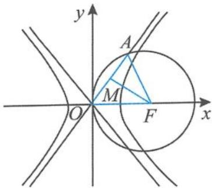  
图1.1-8

性质6 已知离心率为 $e$ 的双曲线 $\frac{x^2}{a^2} - \frac{y^2}{b^2} = 1 (a > 0, b > 0)$ 的右焦点为 $F$ , 过点 $F$ 作与 $x$ 轴垂直的直线 $l$ , 直线 $l$ 交两条渐近线于 $A, B$ 两点, $P$ 是直线 $l$ 与双曲线的一个交点. 设 $O$ 为坐标原点, 若点 $P$ 满足 $\overrightarrow{OP} = \frac{1}{2} (m\overrightarrow{OA} + n\overrightarrow{OB})$ , 则有:

(1) $mn=\frac{1}{e^{2}}$ ;(2) $m^{2}+n^{2}$ 的最小值为 $\frac{2}{e^{2}}$ .

证明 (1) 因为 $\frac{x^2}{a^2} - \frac{y^2}{b^2} = 1$ 的渐近线方程为

$$
b x \pm a y = 0,
$$

所以 $A(c, \frac{bc}{a})$ , $B(c, \frac{-bc}{a})$ ，故 $P\left(\frac{m+n}{2}c, \frac{m-n}{2} \cdot \frac{bc}{a}\right)$ 。把点 P 坐标代入双曲线方程 $\frac{x^{2}}{a^{2}} - \frac{y^{2}}{b^{2}} =$

1, 得

$$
\frac {(m + n) ^ {2} c ^ {2}}{4 a ^ {2}} - \frac {(m - n) ^ {2} c ^ {2}}{4 a ^ {2}} = 1,
$$

化简得

$$
m n = \frac {1}{e ^ {2}}.
$$

(2)由(1)有 $mn=\frac{1}{e^{2}}$ ，由基本不等式得

$$
m ^ {2} + n ^ {2} \geqslant 2 m n = \frac {2}{e ^ {2}}.
$$

性质7 已知双曲线 $\frac{x^2}{a^2} -\frac{y^2}{b^2} = 1(a > 0,b > 0)$ 上有一点 $P$ ，点 $P$ 到其渐近线的距离分别为 $d_{1},d_{2}$ ，则有：

(1) $d_{1}d_{2}=\frac{a^{2}b^{2}}{a^{2}+b^{2}}$ ;(2) $d_{1}+d_{2}$ 的最小值为 $\frac{2ab}{\sqrt{a^{2}+b^{2}}}$ .

证明 (1)设点 $P(x_0, y_0)$ , 由于点 $P$ 在双曲线上, 则有

$$
b ^ {2} x _ {0} ^ {2} - a ^ {2} y _ {0} ^ {2} = a ^ {2} b ^ {2}.
$$

因为双曲线 $\frac{x^2}{a^2} -\frac{y^2}{b^2} = 1$ 的渐近线方程为 $bx\pm ay = 0$ ，所以

$$
d _ {1} d _ {2} = \frac {\left| b x _ {0} + a y _ {0} \right|}{\sqrt {a ^ {2} + b ^ {2}}} \cdot \frac {\left| b x _ {0} - a y _ {0} \right|}{\sqrt {a ^ {2} + b ^ {2}}} = \frac {\left| b ^ {2} x _ {0} ^ {2} - a ^ {2} y _ {0} ^ {2} \right|}{a ^ {2} + b ^ {2}} = \frac {a ^ {2} b ^ {2}}{a ^ {2} + b ^ {2}}.
$$

(2)由(1)知 $d_{1}d_{2} = \frac{a^{2}b^{2}}{c^{2}}$ ，由基本不等式得

$$
d _ {1} + d _ {2} \geqslant 2 \sqrt {d _ {1} d _ {2}} = \frac {2 a b}{\sqrt {a ^ {2} + b ^ {2}}}.
$$

性质8 已知椭圆 $\frac{x^2}{a^2} +\frac{y^2}{b^2} = 1(a > b > 0)$ 上有一点 $P$ ，点 $P$ 到双曲线 $\frac{x^2}{a^2} -\frac{y^2}{b^2} = 1(a > 0,b>$ 0)的渐近线的距离分别为 $d_{1},d_{2}$ ，则有：

(1) $d_{1}^{2}+d_{2}^{2}=\frac{2a^{2}b^{2}}{a^{2}+b^{2}}$ ;(2) $d_{1}+d_{2}$ 的最大值为 $\frac{2ab}{\sqrt{a^{2}+b^{2}}}$ .

证明 设点 $P(x_0, y_0)$ , 由于点 $P$ 在椭圆上, 则有

$$
b ^ {2} x _ {0} ^ {2} + a ^ {2} y _ {0} ^ {2} = a ^ {2} b ^ {2}.
$$

因为双曲线 $\frac{x^2}{a^2} -\frac{y^2}{b^2} = 1$ 的渐近线方程为 $bx\pm ay = 0$ ，所以

$$
d _ {1} ^ {2} + d _ {2} ^ {2} = \left(\frac {| b x _ {0} + a y _ {0} |}{\sqrt {a ^ {2} + b ^ {2}}}\right) ^ {2} + \left(\frac {| b x _ {0} - a y _ {0} |}{\sqrt {a ^ {2} + b ^ {2}}}\right) ^ {2} = \frac {2 (b ^ {2} x _ {0} ^ {2} + a ^ {2} y _ {0} ^ {2})}{a ^ {2} + b ^ {2}} = \frac {2 a ^ {2} b ^ {2}}{a ^ {2} + b ^ {2}}.
$$

又因为 $\sqrt{\frac{d_1^2 + d_2^2}{2}}\geqslant \frac{d_1 + d_2}{2}$ ，所以

$$
d _ {1} + d _ {2} \leqslant \frac {2 a b}{\sqrt {a ^ {2} + b ^ {2}}}.
$$

性质 9 已知点 P 在椭圆 $\frac{x^{2}}{a^{2}} + \frac{y^{2}}{b^{2}} = 1 (a > b > 0)$ 上，过点 P 分别作双曲线 $\frac{x^{2}}{a^{2}} - \frac{y^{2}}{b^{2}} = 1 (a > 0, b > 0)$ 的渐近线的平行线，与 x 轴交于点 M, N，与 y 轴交于点 R, Q, O 为原点，则有：
(1) $|OM|^{2}+|ON|^{2}=2a^{2}$ ;(2) $|OQ|^{2}+|OR|^{2}=2b^{2}$ .

证明 双曲线 $\frac{x^2}{a^2} -\frac{y^2}{b^2} = 1(a > 0,b > 0)$ 的渐近线方程为

$$
y = \pm \frac {b}{a} x.
$$

设 $P(a\cos\theta,b\sin\theta)$ ，则过点 P 且与渐近线 $y=\frac{b}{a}x$ 平行的直线方程为 $l_{1}:y-b\sin\theta=$ $\frac{b}{a}(x-a\cos\theta)$ ，整理得

$$
y = \frac {b}{a} x + b (\sin \theta - \cos \theta).
$$

同理可得, 过点 P 且与渐近线 $y = -\frac{b}{a}x$ 平行的直线方程为

$$
l _ {2}: y = - \frac {b}{a} x + b (\sin \theta + \cos \theta).
$$

所以

$$
\left| O M \right| ^ {2} = a ^ {2} (\cos \theta - \sin \theta) ^ {2} = a ^ {2} (1 - \sin 2 \theta);
$$

同理

$$
\left| O N \right| ^ {2} = a ^ {2} (\cos \theta + \sin \theta) ^ {2} = a ^ {2} (1 + \sin 2 \theta).
$$

所以

$$
\left| O M \right| ^ {2} + \left| O N \right| ^ {2} = a ^ {2} (1 + \sin 2 \theta) + a ^ {2} (1 - \sin 2 \theta) = 2 a ^ {2};
$$

同理

$$
\left| O Q \right| ^ {2} + \left| O R \right| ^ {2} = b ^ {2} (1 + \sin 2 \theta) + b ^ {2} (1 - \sin 2 \theta) = 2 b ^ {2}.
$$

(有关双曲线的渐近线的更多性质见本书第五章)

## 1.2 圆锥曲线问题中的特殊三角形

在圆锥曲线问题中,“闪耀”着几个特殊的三角形,例如:焦点三角形、共焦点三角形、阿基米德三角形等,这些特殊三角形在圆锥曲线中具有无可比拟的作用,圆锥曲线的很多性质就绽放在其中,熠熠生辉.

## 1.2.1 焦点三角形

我们称以圆锥曲线上的任意一点 P 与圆锥曲线的两个焦点 $F_{1}, F_{2}$ 为顶点组成的三角形为圆锥曲线的焦点三角形, 焦点三角形是圆锥曲线的特征三角形.

(一)设椭圆 $\frac{x^2}{a^2} +\frac{y^2}{b^2} = 1 (a > b > 0)$ 的左、右焦点分别为 $F_{1}, F_{2}$ , 点 $P(x_{0}, y_{0})$ 为椭圆上的任意一点. 若 $\angle F_{1}PF_{2} = \theta$ , 则椭圆的焦点三角形有如下的常见公式.

公式1 如图1.2-1,椭圆的焦半径计算公式 $|PF_{1}| = a + ex_{0}, |PF_{2}| = a - ex_{0}$ .

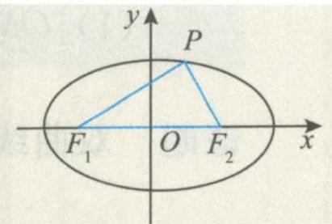  
图1.2-1

引申 (Ⅰ) $\left(\left|PF_{1}\right|\right)_{\max}=a+c,\left(\left|PF_{1}\right|\right)_{\min}=a-c.$

(Ⅱ) $\left|PF_{1}\right|\left|PF_{2}\right|$ 的取值范围为 $\left[b^{2},a^{2}\right]$ ;

(Ⅲ) $\left|PF_{1}\right|\left|PF_{2}\right|+\left|OP\right|^{2}=a^{2}+b^{2}$ . (O为坐标原点)

证明 (Ⅰ) 因为 $-a \leqslant x_0 \leqslant a$ , 所以

$$
\left| P F _ {1} \right| _ {\max} = a + e a = a + c, \left| P F _ {1} \right| _ {\min} = a - e a = a - c.
$$

(Ⅱ)由椭圆的焦半径公式得

$$
\left| P F _ {1} \right| \left| P F _ {2} \right| = (a + e x _ {0}) (a - e x _ {0}) = a ^ {2} - e ^ {2} x _ {0} ^ {2}.
$$

因为 $-a \leqslant x_0 \leqslant a$ ，所以 $0 \leqslant x_0^2 \leqslant a^2$ ，从而得

$b^{2}\leqslant\left|PF_{1}\right|\left|PF_{2}\right|\leqslant a^{2}.$ (Ⅲ) $\left|PF_{1}\right|\left|PF_{2}\right|+\left|OP\right|^{2}=(a+ex_{0})(a-ex_{0})+x_{0}^{2}+y_{0}^{2}=a^{2}-e^{2}x_{0}^{2}+x_{0}^{2}+y_{0}^{2}$ $=a^{2}+\frac{b^{2}}{a^{2}}x_{0}^{2}+y_{0}^{2}=a^{2}+b^{2}\left(\frac{x_{0}^{2}}{a^{2}}+\frac{y_{0}^{2}}{b^{2}}\right)=a^{2}+b^{2}.$

公式 2 椭圆 $\frac{x^{2}}{a^{2}}+\frac{y^{2}}{b^{2}}=1(a>b>0)$ 的通径公式: 在过椭圆的焦点的弦中, 垂直于长轴的弦最短, 并且长度为 $\frac{2b^{2}}{a}$ .

公式3 椭圆 $\frac{x^2}{a^2} +\frac{y^2}{b^2} = 1 (a > b > 0)$ 的焦点三角形 $PF_{1}F_{2}$ 的面积 $S_{\triangle PF_1F_2} = b^2\tan \frac{\theta}{2}$ ，且 $|PF_1||PF_2| = \frac{2b^2}{1 + \cos\theta},(S_{\triangle PF_1F_2})_{\max} = bc.$

证明 在 $\triangle PF_{1}F_{2}$ 中, 由余弦定理得

$$
\begin{array}{r l} (| F _ {1} F _ {2} |) ^ {2} & = | P F _ {1} | ^ {2} + | P F _ {2} | ^ {2} - 2 | P F _ {1} | | P F _ {2} | \cos \theta \\ & = (| P F _ {1} | + | P F _ {2} |) ^ {2} - 2 | P F _ {1} | | P F _ {2} | (1 + \cos \theta) \\ & = 4 a ^ {2} - 2 | P F _ {1} | | P F _ {2} | (1 + \cos \theta). \end{array}
$$

所以 $\left|PF_{1}\right|\left|PF_{2}\right|=\frac{2b^{2}}{1+\cos\theta}$ ，故

$$
S _ {\triangle P F _ {1} F _ {2}} = \frac {1}{2} | P F _ {1} | | P F _ {2} | \sin \theta = \frac {b ^ {2} \sin \theta}{1 + \cos \theta} = \frac {2 b ^ {2} \sin \frac {\theta}{2} \cos \frac {\theta}{2}}{2 \cos^ {2} \frac {\theta}{2}} = b ^ {2} \tan \frac {\theta}{2}.
$$

当点 P 位于椭圆上(下)顶点时, $\theta$ 最大, $\tan\frac{\theta}{2}=\frac{c}{b}$ ,此时 $(S_{\triangle PF_{1}F_{2}})_{\max}=bc.$

公式4 在椭圆 $\frac{x^2}{a^2} +\frac{y^2}{b^2} = 1 (a > b > 0)$ 的焦点三角形 $PF_{1}F_{2}$ 中，若 $\angle PF_1F_2 = \alpha$ ， $\angle PF_2F_1 = \beta$ ，则离心率 $e = \frac{\sin(\alpha + \beta)}{\sin\alpha + \sin\beta} = \frac{\cos\frac{\alpha + \beta}{2}}{\cos\frac{\alpha - \beta}{2}}$ 或 $\frac{1 - e}{1 + e} = \tan \frac{\alpha}{2}\tan \frac{\beta}{2}$ .

证明 在 $\triangle F_{1}PF_{2}$ 中, 由正弦定理得

$$
\frac {\mid P F _ {2} \mid}{\sin \alpha} = \frac {\mid P F _ {1} \mid}{\sin \beta} = \frac {\mid F _ {1} F _ {2} \mid}{\sin (\alpha + \beta)},
$$

所以 $\frac{|PF_2| + |PF_1|}{\sin\alpha + \sin\beta} = \frac{|F_1F_2|}{\sin(\alpha + \beta)}$ ，即

$$
\frac {\sin (\alpha + \beta)}{\sin \alpha + \sin \beta} = \frac {| F _ {1} F _ {2} |}{| P F _ {1} | + | P F _ {2} |} = \frac {2 c}{2 a} = \frac {c}{a} = e.
$$

公式 5 椭圆上的点 P 与两个焦点 $F_{1}, F_{2}$ 张角的最大角问题: 当点 P 为短轴端点时, $\angle F_{1}PF_{2}$ 最大且 $(\cos\angle F_{1}PF_{2})_{\min}=1-2e^{2}$ .

证明 设 $\angle F_{1}PF_{2} = \theta$ ，由余弦定理得

$$
\begin{array}{r l} (| F _ {1} F _ {2} |) ^ {2} & = | P F _ {1} | ^ {2} + | P F _ {2} | ^ {2} - 2 | P F _ {1} | | P F _ {2} | \cos \theta \\ & = (| P F _ {1} | + | P F _ {2} |) ^ {2} - 2 | P F _ {1} | | P F _ {2} | (1 + \cos \theta) \\ & = 4 a ^ {2} - 2 | P F _ {1} | | P F _ {2} | (1 + \cos \theta), \end{array}
$$

所以

$$
\cos \theta = \frac {2 b ^ {2}}{\left| P F _ {1} \right| \left| P F _ {2} \right|} - 1 \geqslant \frac {2 b ^ {2}}{\left(\frac {\left| P F _ {1} \right| + \left| P F _ {2} \right|}{2}\right) ^ {2}} - 1 = \frac {2 b ^ {2}}{a ^ {2}} - 1 = 1 - 2 e ^ {2},
$$

当且仅当 $|PF_1| = |PF_2| = a$ ，即点 $P$ 为短轴端点时取等号，此时 $\angle F_{1}PF_{2}$ 最大.

性质1 在椭圆 $\frac{x^2}{a^2} +\frac{y^2}{b^2} = 1 (a > b > 0)$ 的焦点三角形 $PF_{1}F_{2}$ 中，以焦半径为直径的圆必与以椭圆长轴为直径的圆相内切.

证明 由椭圆的定义知

$$
\mid P F _ {1} \mid + \mid P F _ {2} \mid = 2 a.
$$

如图 1.2-2, 设以焦半径 $PF_{1}$ 为直径的圆的圆心为 M, 则两个圆的圆心距

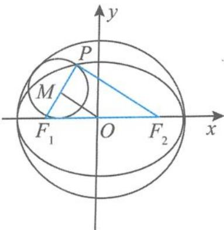

$$
d = | O M | = \frac {1}{2} | P F _ {2} | = \frac {1}{2} (2 a - | P F _ {1} |) = a - \frac {1}{2} | P F _ {1} | = a - R.
$$

图1.2-2

其中 R 是以 $PF_{1}$ 为直径的圆的半径, 故内切.

性质2 在椭圆 $\frac{x^2}{a^2} +\frac{y^2}{b^2} = 1$ 的焦点三角形 $PF_{1}F_{2}$ 中，若 $M$ 是 $\angle F_1PF_2$ 的外角平分线上的点，且 $\overrightarrow{F_2M}\cdot \overrightarrow{MP} = 0$ ，则点 $M$ 的轨迹是圆（去掉与 $x$ 轴的两个交点）.

证明 如图 1.2-3, 设 O 为坐标原点, $F_{2}M$ 的延长线交 $F_{1}P$ 的延长线于点 N. 由条件可知 $\triangle PNF_{2}$ 为等腰三角形, 且 M 为 $NF_{2}$ 的中点. 由三角形中位线的性质得

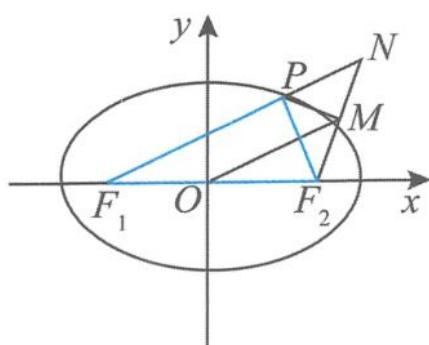

$$
| O M | = \frac {1}{2} | N F _ {1} | = \frac {1}{2} (| P F _ {1} | + | P N |) = \frac {1}{2} (| P F _ {1} | + | P F _ {2} |) = a.
$$

图1.2-3

所以点 M 的轨迹是以 O 为圆心、a 为半径的圆.

性质 3 椭圆焦点三角形的重心、内心、旁心的相关性质如下.

(重心)在椭圆 $\frac{x^{2}}{a^{2}}+\frac{y^{2}}{b^{2}}=1(a>b>0)$ 的焦点三角形 $PF_{1}F_{2}$ 中,点G是 $\triangle PF_{1}F_{2}$ 的重心,则重心的轨迹在一个椭圆上.

证明 设 $G(x, y), P(x_0, y_0)$ , 由重心公式得 $x_0 = 3x, y_0 = 3y$ . 因为点 $P(x_0, y_0)$ 在椭圆上, 所以 $\frac{x_0^2}{a^2} + \frac{y_0^2}{b^2} = 1$ , 即

$$
\frac {(3 x) ^ {2}}{a ^ {2}} + \frac {(3 y) ^ {2}}{b ^ {2}} = 1 (y \neq 0).
$$

(内心1)如图1.2-4,在椭圆 $\frac{x^2}{a^2} +\frac{y^2}{b^2} = 1(a > b > 0)$ 的焦点三角形 $PF_{1}F_{2}$ 中，点 $I$ 是 $\triangle PF_1F_2$ 的内心， $PI$ 的延长线交线段 $F_{1}F_{2}$ 于点 $N$ ，则 $\frac{|PI|}{|IN|} = \frac{1}{e}$ .（其中 $e$ 为椭圆的离心率）

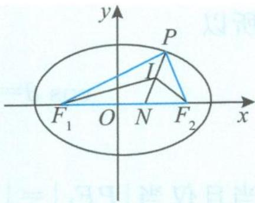  
图1.2-4

证明 在 $\triangle PF_{1}F_{2}$ 中,由内角平分线性质得

$$
\frac {| P I |}{| I N |} = \frac {| P F _ {1} |}{| F _ {1} N |} = \frac {| P F _ {2} |}{| N F _ {2} |},
$$

所以

$$
\frac {| P I |}{| I N |} = \frac {| P F _ {1} | + | P F _ {2} |}{| F _ {1} N | + | N F _ {2} |} = \frac {2 a}{2 c} = \frac {1}{e}.
$$

(内心2)已知 P 是椭圆 $\frac{x^{2}}{a^{2}} + \frac{y^{2}}{b^{2}} = 1 (a > b > 0)$ 上的任意一点， $F_{1}, F_{2}$ 是该椭圆的两个焦点，若 $\triangle PF_{1}F_{2}$ 内切圆的半径为 r，则 $\overrightarrow{PF_{1}} \cdot \overrightarrow{PF_{2}}$ 为定值 $b^{2} - \frac{1 + e}{1 - e} r^{2}$ .（其中 e 为椭圆的离心率）

证明 设 $P(x_0, y_0)$ , 则

$$
S _ {\triangle P F _ {1} F _ {2}} = \frac {1}{2} (| P F _ {1} | + | P F _ {2} | + | F _ {1} F _ {2} |) r = \frac {1}{2} (2 a + 2 c) r = \frac {1}{2} | F _ {1} F _ {2} | | y _ {0} | = c | y _ {0} |,
$$

所以 $|y_0| = \frac{(a + c)r}{c}$ . 因此

$$
\begin{array}{r l} \overrightarrow {P F _ {1}} \cdot \overrightarrow {P F _ {2}} & = x _ {0} ^ {2} - c ^ {2} + y _ {0} ^ {2} = \left(1 - \frac {y _ {0} ^ {2}}{b ^ {2}}\right) a ^ {2} - c ^ {2} + y _ {0} ^ {2} = \left(1 - \frac {a ^ {2}}{b ^ {2}}\right) y _ {0} ^ {2} + a ^ {2} - c ^ {2} \\ & = \left(1 - \frac {a ^ {2}}{b ^ {2}}\right) \cdot \frac {(a + c) ^ {2}}{c ^ {2}} r ^ {2} + a ^ {2} - c ^ {2} = b ^ {2} - \frac {(a + c) ^ {2}}{a ^ {2} - c ^ {2}} r ^ {2} \\ & = b ^ {2} - \frac {a + c}{a - c} r ^ {2} = b ^ {2} - \frac {1 + e}{1 - e} r ^ {2}. \end{array}
$$

(旁心)在椭圆 $\frac{x^{2}}{a^{2}}+\frac{y^{2}}{b^{2}}=1\quad(a>b>0)$ 的焦点三角形 $PF_{1}F_{2}$ 中， $\triangle PF_{1}F_{2}$ 的旁切圆与x轴的切点为椭圆长轴的顶点.

证明 结合椭圆的对称性,不妨设点 P 在第一象限,如图 1.2-5,设 $\triangle PF_{1}F_{2}$ 的旁切圆与 x 轴的切点为 $M(t,0)$ ,与 $PF_{1}$ 的切点为 N. 设 $|PN|=m$ ,由切线的性质有 $|F_{1}N|=|F_{1}M|$ ,得

$$
\mid P F _ {1} \mid + m = c + t.
$$

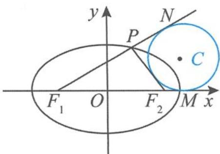  
图1.2-5

又

$$
\mid P F _ {2} \mid = m + (t - c),
$$

所以

$$
\mid P F _ {1} \mid + \mid P F _ {2} \mid = 2 a = 2 t,
$$

得 t=a，所以 $\triangle PF_{1}F_{2}$ 的旁切圆与 x 轴的切点 $M(a,0)$ 为长轴的顶点.

(重心、内心)在椭圆 $\frac{x^{2}}{a^{2}}+\frac{y^{2}}{b^{2}}=1(a>b>0)$ 的焦点三角形 $PF_{1}F_{2}$ 中,若I是 $\triangle PF_{1}F_{2}$ 的内心,G是 $\triangle PF_{1}F_{2}$ 的重心,椭圆的离心率为e,记 $\triangle IF_{1}F_{2},\triangle GF_{1}P,\triangle PF_{1}F_{2}$ 的面积分别为 $S_{1},S_{2},S_{3}$ ,则有:

$$
(1) \frac {S _ {1}}{S _ {2}} = \frac {3 e}{1 + e}; (2) \frac {S _ {3}}{S _ {1}} = 1 + \frac {1}{e}.
$$

证明 (1)由于椭圆的对称性,不妨设点 $P$ 在第一象限,设 $\triangle PF_{1}F_{2}$ 的内切圆半径为 $r$ ,则

$$
S _ {\triangle P F _ {1} F _ {2}} = \frac {1}{2} (| P F _ {1} | + | P F _ {2} | + | F _ {1} F _ {2} |) r = \frac {1}{2} (2 a + 2 c) r = (a + c) r,
$$

即 $r = \frac{S_{\triangle PF_1F_2}}{a + c}$ ，所以

$$
S _ {1} = \frac {1}{2} | F _ {1} F _ {2} | r = c r = c \frac {S _ {\triangle P F _ {1} F _ {2}}}{a + c} = \frac {e}{1 + e} S _ {\triangle P F _ {1} F _ {2}}.
$$

而 $S_{2} = \frac{1}{3} S_{\triangle PF_{1}F_{2}}$ ，故

$$
\frac {S _ {1}}{S _ {2}} = \frac {3 e}{1 + e}.
$$

(2)由(1)知 $S_{3} = 3S_{2},\frac{S_{1}}{S_{2}} = \frac{3e}{1 + e}$ 所以 $eS_{3} = (1 + e)S_{1}$ ，即

$$
\frac {S _ {3}}{S _ {1}} = 1 + \frac {1}{e}.
$$

（二）如图1.2-6，设双曲线 $\frac{x^2}{a^2} -\frac{y^2}{b^2} = 1(a > 0,b > 0)$ 的左、右焦点分别为 $F_{1},F_{2}$ ，点 $P(x_0,y_0)$ 为双曲线上的任意一点， $\angle F_{1}PF_{2} = \theta$ ，则双曲线的焦点三角形 $PF_{1}F_{2}$ 有如下公式.

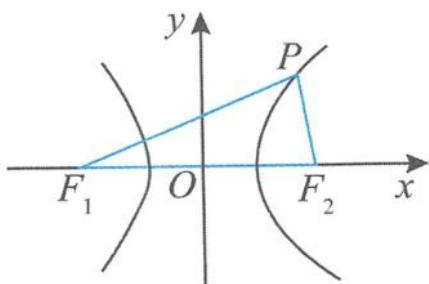  
图1.2-6

公式1 双曲线 $\frac{x^2}{a^2} - \frac{y^2}{b^2} = 1 (a > 0, b > 0)$ 的焦半径公式： $|PF_1| = |a + ex_0|$ ， $|PF_2| = |a - ex_0|$ .

公式2 双曲线 $\frac{x^2}{a^2} - \frac{y^2}{b^2} = 1 (a > 0, b > 0)$ 的通径公式: 在过双曲线同一支的焦点弦中, 垂直于长轴的弦最短, 且其长度为 $\frac{2b^2}{a}$ .

公式3 双曲线 $\frac{x^2}{a^2} -\frac{y^2}{b^2} = 1(a > 0,b > 0)$ 的焦点三角形 $PF_{1}F_{2}$ 的面积 $S_{\triangle F_1PF_2} = \frac{b^2}{\tan\frac{\theta}{2}}$ ，且 $|PF_1||PF_2| = \frac{2b^2}{1 - \cos\theta}.$

公式4 在双曲线 $\frac{x^2}{a^2} -\frac{y^2}{b^2} = 1(a > 0,b > 0)$ 的焦点三角形 $PF_{1}F_{2}$ 中，若 $\angle PF_1F_2 = \alpha$ $\angle PF_2F_1 = \beta$ ，则双曲线的离心率 $e = \left|\frac{\sin\frac{\alpha + \beta}{2}}{\sin\frac{\alpha - \beta}{2}}\right|$

证明 在 $\triangle PF_{1}F_{2}$ 中, 由正弦定理得

$$
\frac {| P F _ {2} |}{\sin \alpha} = \frac {| P F _ {1} |}{\sin \beta} = \frac {| F _ {1} F _ {2} |}{\sin (\alpha + \beta)},
$$

所以 $\frac{|PF_2| - |PF_1|}{\sin\alpha - \sin\beta} = \frac{|F_1F_2|}{\sin(\alpha + \beta)}$ ，即

$$
\frac {\sin (\alpha + \beta)}{\sin \alpha - \sin \beta} = \frac {| F _ {1} F _ {2} |}{| P F _ {2} | - | P F _ {1} |}.
$$

因此

$$
e = \frac {c}{a} = \frac {2 c}{2 a} = \frac {\left| F _ {1} F _ {2} \right|}{\left| \left| P F _ {1} \right| - \left| P F _ {2} \right| \right|} = \left| \frac {\sin (\alpha + \beta)}{\sin \alpha - \sin \beta} \right| = \left| \frac {\sin \frac {\alpha + \beta}{2}}{\sin \frac {\alpha - \beta}{2}} \right|.
$$

性质 1 在双曲线 $\frac{x^{2}}{a^{2}} - \frac{y^{2}}{b^{2}} = 1 (a > 0, b > 0)$ 的焦点三角形 $PF_{1}F_{2}$ 中，以焦半径为直径的圆与以双曲线实轴长为直径的圆相内切（或外切）.

证明 当点 P 在双曲线的右支时, 由双曲线的定义知

$$
\mid P F _ {1} \mid - \mid P F _ {2} \mid = 2 a.
$$

设以焦半径 $PF_{1}$ 为直径的圆的圆心为 M，则两个圆的圆心距

$$
d = | O M | = \frac {1}{2} | P F _ {2} | = \frac {1}{2} (| P F _ {1} | - 2 a) = \frac {1}{2} | P F _ {1} | - a = R - a.
$$

其中 R 是以 $PF_{1}$ 为直径的圆的半径, 所以它们相内切. 同理, 当点 P 在双曲线的左支时, 以焦半径为直径的圆与以实轴长为直径的圆相外切.

性质2 在双曲线 $\frac{x^2}{a^2} -\frac{y^2}{b^2} = 1(a > 0,b > 0)$ 的焦点三角形 $PF_{1}F_{2}$ 中，若 $M$ 是 $\angle F_{1}PF_{2}$ 的平分线上的点，且 $\overrightarrow{F_2M}\cdot \overrightarrow{MP} = 0$ ，则点 $M$ 的轨迹是圆（去掉与 $x$ 轴的两个交点）.

证明 如图 1.2-7, 设 O 为坐标原点, $F_{2}M$ 的延长线交于 $F_{1}P$ 于点 N, 由条件可知 $\triangle PNF_{2}$ 为等腰三角形, 且 M 为 $NF_{2}$ 的中点. 由三角形中位线性质得

$$
| O M | = \frac {1}{2} | N F _ {1} | = \frac {1}{2} | | P F _ {1} | - | P F _ {2} | | = a.
$$

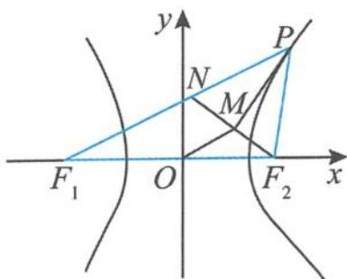  
图1.2-7

所以点 M 的轨迹是以 O 为圆心、a 为半径的圆(去掉与 x 轴的两个交点).

性质 3 双曲线焦点三角形的重心、内心、旁心的性质如下.

(重心)在双曲线 $\frac{x^{2}}{a^{2}}-\frac{y^{2}}{b^{2}}=1(a>0,b>0)$ 的焦点三角形 $PF_{1}F_{2}$ 中，G是 $\triangle PF_{1}F_{2}$ 的重心，则重心G的轨迹在双曲线上.

证明 设 $\triangle PF_{1}F_{2}$ 的重心为 $G(x,y)$ , 记 $P(x_0,y_0)$ , 由重心公式得 $x_0 = 3x, y_0 = 3y$ .

由于点 $P(x_0, y_0)$ 在双曲线上，所以 $\frac{x_0^2}{a^2} - \frac{y_0^2}{b^2} = 1$ ，即

$$
\frac {(3 x) ^ {2}}{a ^ {2}} - \frac {(3 y) ^ {2}}{b ^ {2}} = 1 (y \neq 0).
$$

(内心1)如图1.2-8,在双曲线 $\frac{x^2}{a^2} -\frac{y^2}{b^2} = 1(a > 0,b > 0)$ 的焦点三角形 $PF_{1}F_{2}$ 中， $I$ 是 $\triangle PF_1F_2$ 的内心.若点 $P$ 在双曲线的右支上，则 $I$ 在定直线 $x = a$ 上；若点 $P$ 在双曲线的左支上，则 $I$ 在定直线 $x = -a$ 上.

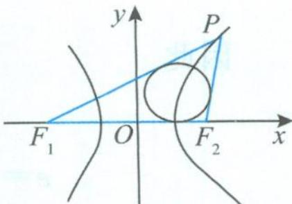  
图1.2-8

(内心2)在双曲线 $\frac{x^{2}}{a^{2}}-\frac{y^{2}}{b^{2}}=1(a>0,b>0)$ 的焦点三角形 $PF_{1}F_{2}$ 中，I是 $\triangle PF_{1}F_{2}$ 的内心.点P在双曲线的右支上，若 $S_{\triangle IPF_{1}}=S_{\triangle IPF_{2}}+\lambda S_{\triangle IF_{1}F_{2}}$ ，则 $\lambda e=1$ .（其中e为离心率）
证明 设 $\triangle PF_{1}F_{2}$ 的内切圆的半径为 r，由题意知

$$
\frac {1}{2} \mid P F _ {1} \mid r = \frac {1}{2} \mid P F _ {2} \mid r + \lambda \left(\frac {1}{2} \mid F _ {1} F _ {2} \mid r\right),
$$

整理得 $|PF_{1}|=|PF_{2}|+\lambda(|F_{1}F_{2}|)$ ，所以

$$
\lambda = \frac {| P F _ {1} | - | P F _ {2} |}{| F _ {1} F _ {2} |} = \frac {2 a}{2 c} = \frac {1}{e}.
$$

故 $\lambda e = 1$

(旁心)如图1.2-9,在双曲线 $\frac{x^2}{a^2} -\frac{y^2}{b^2} = 1(a > 0,b > 0)$ 的焦点三角形 $PF_{1}F_{2}$ 中，若 $C$ 是 $\triangle PF_1F_2$ 的旁切圆的圆心，点 $P$ 在双曲线的右支上， $PC$ 的延长线交 $x$ 轴于点 $T$ ，则 $\frac{|TC|}{|CP|} = e.$ （其中 $e$ 为离心率）

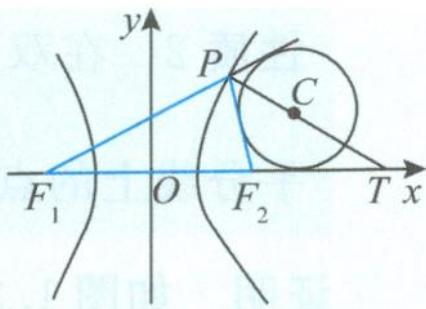  
图1.2-9

证明 由内角平分线的性质得

$$
\frac {| T C |}{| C P |} = \frac {| T F _ {1} |}{| P F _ {1} |} = \frac {| T F _ {2} |}{| P F _ {2} |} = \frac {| T F _ {1} | - | T F _ {2} |}{| P F _ {1} | - | P F _ {2} |} = \frac {2 c}{2 a} = e.
$$

引申 如图 1.2-10, 在双曲线 $\frac{x^2}{a^2} - \frac{y^2}{b^2} = 1 (a > 0, b > 0)$ 的焦点三角形 $PF_{1}F_{2}$ 中, $C$ 是 $\triangle PF_{1}F_{2}$ 的旁切圆的圆心, 记切点分别为 $A, B, D$ , 则 $|PB| = c - a$ .

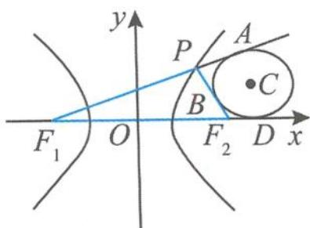  
图1.2-10

证明 设 $|PB|=t,|F_{2}D|=m$ ,则

$$
\mid P F _ {2} \mid = \mid P B \mid + \mid B F _ {2} \mid = \mid P B \mid + \mid F _ {2} D \mid = t + m.
$$

因为 $|F_{1}A| = |F_{1}D|$ ，所以 $|F_{1}P| + |PA| = |F_{1}F_{2}| + |F_{2}D|$ ，得 $|F_{1}P| + t = 2c + m$ ，即

$$
\mid P F _ {1} \mid = 2 c + m - t.
$$

由双曲线的定义得

$$
\mid P F _ {1} \mid - \mid P F _ {2} \mid = (2 c + m - t) - (t + m) = 2 a,
$$

所以 $t = c - a$ ，即

$$
| P B | = c - a.
$$

## 1.2.2 共焦点三角形

已知 $F_{1}, F_{2}$ 为椭圆与双曲线的公共焦点, P 是它们的一个公共点, $\angle F_{1}PF_{2} = \theta$ , 则椭圆的离心率 $e_{1}$ 与双曲线的离心率 $e_{2}$ 的关系为 $\frac{\sin^{2}\frac{\theta}{2}}{e_{1}^{2}} + \frac{\cos^{2}\frac{\theta}{2}}{e_{2}^{2}} = 1$ . (详细介绍请参见本书第四章的相关内容)

例题 若椭圆 $\frac{x^2}{a^2} +\frac{y^2}{b^2} = 1(a > b > 0)$ 与双曲线 $\frac{x^2}{a_1^2} -\frac{y^2}{b_1^2} = 1(a_1 > 0,b_1 > 0)$ 有相同的焦点 $F_{1}$ ， $F_{2}$ ，若 $P$ 是两条曲线的一个交点，且 $\angle F_{1}PF_{2} = \frac{\pi}{2}$ 设椭圆的离心率为 $e_1$ ，双曲线的离心率为 $e_2$ ，且 $e_1e_2 = 2$ ，则 $\log_2(e_1^2 +e_2^2) = \_$ .

解答 因为

$$
\frac {1}{e _ {1} ^ {2}} + \frac {1}{e _ {2} ^ {2}} = \frac {e _ {1} ^ {2} + e _ {2} ^ {2}}{e _ {1} ^ {2} e _ {2} ^ {2}} = 2,
$$

又 $e_1e_2 = 2$ ，所以

$$
e _ {1} ^ {2} + e _ {2} ^ {2} = 2 e _ {1} ^ {2} e _ {2} ^ {2} = 8.
$$

故 $\log_{2}(e_{1}^{2}+e_{2}^{2})=3.$

## 1.2.3 阿基米德三角形

定义 圆锥曲线的弦与过弦的端点的两条切线所围成的三角形叫作阿基米德三角形. 下面以抛物线 $x^{2} = 2py (p > 0)$ 的阿基米德三角形为例, 进行知识点的梳理.

性质 如图 1.2-11, 过抛物线 $x^{2}=2py(p>0)$ 外的点 $P(x_{0},y_{0})$ 作抛物线的两条切线 PA, PB, 设切点分别为 A, B, 直线 AB 与 y 轴交于点 Q, 则有:

(1) $k_{AB} \cdot k_{PQ} = \frac{2y_0}{p};$

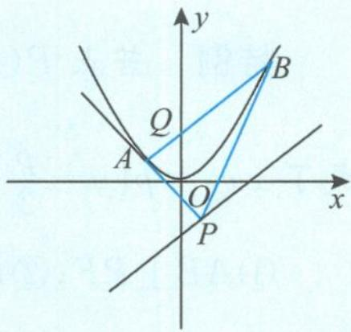  
图1.2-11

(2) $k_{PA} \cdot k_{PB} = \frac{2y_0}{p};$

(3) 若 M 为弦 AB 的中点, 则 PM 与抛物线的轴平行(或重合);

(4) PM 的中点 R 在抛物线上, 且点 R 处的切线与 AB 平行.

证明 (1) 易得直线 $AB$ 的方程为

$$
x x _ {0} = p (y + y _ {0}),
$$

得点 $Q(0, -y_0)$ ，所以

$$
k _ {A B} \cdot k _ {P Q} = \frac {x _ {0}}{p} \cdot \frac {2 y _ {0}}{x _ {0}} = \frac {2 y _ {0}}{p}.
$$

(2)设 $A(x_{1},y_{1}),B(x_{2},y_{2})$ ，把直线 $AB$ 的方程 $xx_0 = p(y + y_0)$ 代入抛物线方程得

$$
x ^ {2} - 2 x _ {0} x + 2 p y _ {0} = 0,
$$

所以

$$
x _ {1} + x _ {2} = 2 x _ {0}, x _ {1} x _ {2} = 2 p y _ {0}.
$$

$$
\begin{array}{r l} & {\text {因此} k _ {P A} \bullet k _ {P B} = \frac {y _ {1} - y _ {0}}{x _ {1} - x _ {0}} \bullet \frac {y _ {2} - y _ {0}}{x _ {2} - x _ {0}} = \frac {(x _ {1} ^ {2} - 2 p y _ {0}) (x _ {2} ^ {2} - 2 p y _ {0})}{4 p ^ {2} (x _ {1} - x _ {0}) (x _ {2} - x _ {0})}} \\ & {\qquad = \frac {(x _ {1} x _ {2}) ^ {2} - 2 p y _ {0} (x _ {1} ^ {2} + x _ {2} ^ {2}) + 4 p ^ {2} y _ {0} ^ {2}}{4 p ^ {2} [ x _ {1} x _ {2} - x _ {0} (x _ {1} + x _ {2}) + x _ {0} ^ {2} ]}} \\ & {\qquad = \frac {(2 p y _ {0}) ^ {2} - 2 p y _ {0} (4 x _ {0} ^ {2} - 4 p y _ {0}) + 4 p ^ {2} y _ {0} ^ {2}}{4 p ^ {2} [ 2 p y _ {0} - x _ {0} (2 x _ {0}) + x _ {0} ^ {2} ]}} \\ & {\qquad = \frac {2 y _ {0} (2 p y _ {0} - x _ {0} ^ {2})}{p (2 p y _ {0} - x _ {0} ^ {2})} = \frac {2 y _ {0}}{p}.} \end{array}
$$

(3)设点 $A(x_{1},y_{1}),B(x_{2},y_{2})$ ，则抛物线在点 $A$ 处的切线方程为

$$
x _ {1} x = p (y + y _ {1}),
$$

抛物线在点 B 处的切线方程为

$$
x _ {2} x = p (y + y _ {2}).
$$

联立方程组解得两条切线的交点 $P\left(\frac{x_1 + x_2}{2}, \frac{x_1x_2}{2p}\right)$ , 得 $x_M = x_P$ , 所以 $PM \parallel y$ 轴.

(4)由(3)知 $P\left(\frac{x_1 + x_2}{2}, \frac{x_1x_2}{2p}\right)$ , 又 $M\left(\frac{x_1 + x_2}{2}, \frac{y_1 + y_2}{2}\right)$ , 即 $M\left(\frac{x_1 + x_2}{2}, \frac{x_1^2 + x_2^2}{4p}\right)$ , 可得点 $R$ 的坐标为 $\left(\frac{x_1 + x_2}{2}, \frac{(x_1 + x_2)^2}{8p}\right)$ , 此点显然在抛物线上. 过点 $R$ 的切线斜率为 $\frac{x_1 + x_2}{2p} = k_{AB}$ , 结论得证.

特例 若点 $P(x_0, y_0)$ 在抛物线 $x^2 = 2py (p > 0)$ 的准线 $y = -\frac{p}{2}$ 上，则直线 $AB$ 的方程变成了 $xx_0 = p(y - \frac{p}{2})$ ，点 $Q$ 变成了抛物线的焦点 $F(0, \frac{p}{2})$ ，所以有：

① $AB \perp PF$ ; ② $PA \perp PB$ ; ③ $\triangle PAB$ 面积的最小值为 $p^{2}$ .

证明 ①由 $y_0 = -\frac{p}{2}$ 得 $k_{AB} \cdot k_{PQ} = -1, k_{PA} \cdot k_{PB} = -1$ ，所以①与②成立.

③设 $A(x_{1},y_{1}),B(x_{2},y_{2})$ ，则 $x_{1}x_{2} = -p^{2}$ ，由性质 ②知 $PA \perp PB$ ，故 $\triangle PAB$ 为直角三角形，且 $P$ 为直角顶点.因为 $|PM| = \frac{y_1 + y_2}{2} +\frac{p}{2} = \frac{x_1^2 + x_2^2}{4p} +\frac{p}{2}\geqslant \frac{2|x_1x_2|}{4p} +\frac{p}{2} = p$ ，所以

$$
S _ {\triangle P A B} = \frac {1}{2} | P M | | x _ {1} - x _ {2} | \geqslant | P M | \sqrt {| x _ {1} x _ {2} |} \geqslant p ^ {2}.
$$

对于椭圆、双曲线中的阿基米德三角形性质可类比处理.

## 1.3 圆锥曲线问题中的特征直角梯形

若 AB 是过抛物线 $y^{2}=2px(p>0)$ 的焦点 F 的一条弦, 过点 A 作 $AA_{1}$ 垂直准线 $x=-\frac{p}{2}$ 于点 $A_{1}$ , 过点 B 作 $BB_{1}$ 垂直准线 $x=-\frac{p}{2}$ 于点 $B_{1}$ , 我们把直角梯形 $ABB_{1}A_{1}$ 叫作抛物线的特征直角梯形. 当我们把目光聚焦到这个“神奇”的梯形时, 会发现特征直角梯形蕴含着抛物线很多有趣的性质, 所以我们需要认真探究、总结、提炼, 撷取其中的精华, 以开阔我们的解题思路. 在圆锥曲线的特征直角梯形中, 抛物线的特征直角梯形的性质是最丰富的, 所以本节以抛物线 $y^{2}=2px(p>0)$ 的特征直角梯形为蓝本进行梳理.

## 1.3.1 垂直问题

如图 1.3-1, 在抛物线 $y^{2}=2px(p>0)$ 的特征直角梯形 $ABB_{1}A_{1}$ 中, 若 M 为 $A_{1}B_{1}$ 的中点, 则有:

(1) $A_{1}F \perp B_{1}F;$

(2) $AM \perp BM;$

(3) $AB \perp FM;$

(4) $A_{1}F \perp AM;$

(5) $B_{1}F \perp BM.$

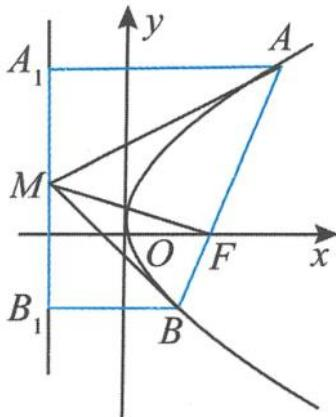

证明 (1)设点 $A(x_{1},y_{1}),B(x_{2},y_{2})$ ，由于 $AB$ 过焦点 $F$ ，则有

图1.3-1

$$
y _ {1} y _ {2} = - p ^ {2},
$$

所以

$$
\overrightarrow {F A _ {1}} \cdot \overrightarrow {F B _ {1}} = (- p, y _ {1}) \cdot (- p, y _ {2}) = p ^ {2} + y _ {1} y _ {2} = p ^ {2} - p ^ {2} = 0.
$$

故 $A_{1}F \perp B_{1}F$ .

(2) 设 $A(x_{1}, y_{1}), B(x_{2}, y_{2})$ ，则 $y_{1}y_{2} = -p^{2}$ ，且 $M\left(-\frac{p}{2}, \frac{y_{1} + y_{2}}{2}\right)$ ，所以

$$
\begin{array}{l} \overrightarrow {M A} \cdot \overrightarrow {M B} = (x _ {1} + \frac {p}{2}) (x _ {2} + \frac {p}{2}) + \frac {y _ {1} - y _ {2}}{2} \cdot \frac {y _ {2} - y _ {1}}{2} \\ = (\frac {y _ {1} ^ {2}}{2 p} + \frac {p}{2}) (\frac {y _ {2} ^ {2}}{2 p} + \frac {p}{2}) - (\frac {y _ {1} - y _ {2}}{2}) ^ {2} = \frac {y _ {1} ^ {2} + p ^ {2}}{2 p} \cdot \frac {y _ {2} ^ {2} + p ^ {2}}{2 p} - (\frac {y _ {1} - y _ {2}}{2}) ^ {2} \\ = \frac {y _ {1} ^ {2} - y _ {1} y _ {2}}{2 p} \cdot \frac {y _ {2} ^ {2} - y _ {1} y _ {2}}{2 p} - (\frac {y _ {1} - y _ {2}}{2}) ^ {2} = \frac {- y _ {1} y _ {2} (y _ {1} - y _ {2}) ^ {2}}{4 p ^ {2}} - (\frac {y _ {1} - y _ {2}}{2}) ^ {2} \end{array}
$$

$$
= \frac {p ^ {2} (y _ {1} - y _ {2}) ^ {2}}{4 p ^ {2}} - \left(\frac {y _ {1} - y _ {2}}{2}\right) ^ {2} = \left(\frac {y _ {1} - y _ {2}}{2}\right) ^ {2} - \left(\frac {y _ {1} - y _ {2}}{2}\right) ^ {2} = 0.
$$

(3)设点 $A(x_{1},y_{1}),B(x_{2},y_{2})$ ，则点 $M\left(-\frac{p}{2},\frac{y_1 + y_2}{2}\right)$ ，所以

$$
\overrightarrow {A B} \cdot \overrightarrow {F M} = (- p) (x _ {2} - x _ {1}) + \frac {y _ {1} + y _ {2}}{2} (y _ {2} - y _ {1}) = (p x _ {1} - p x _ {2}) + \frac {y _ {2} ^ {2} - y _ {1} ^ {2}}{2} = \frac {y _ {1} ^ {2} - y _ {2} ^ {2}}{2} + \frac {y _ {2} ^ {2} - y _ {1} ^ {2}}{2} = 0.
$$

故 $AB \perp FM$ , 得证.

(4) 设 $A(x_{1}, y_{1}), B(x_{2}, y_{2})$ ，则 $y_{1}y_{2} = -p^{2}$ ，故

$$
\begin{array}{r l} \overrightarrow {A _ {1} F} \cdot \overrightarrow {M A} & = (p, - y _ {1}) \cdot \left(x _ {1} + \frac {p}{2}, \frac {y _ {1} - y _ {2}}{2}\right) = \left(x _ {1} + \frac {p}{2}\right) p - \frac {(y _ {1} - y _ {2}) y _ {1}}{2} \\ & = \left(p x _ {1} + \frac {p ^ {2}}{2}\right) + \frac {y _ {1} y _ {2} - y _ {1} ^ {2}}{2} = \frac {y _ {1} ^ {2}}{2} + \frac {p ^ {2}}{2} + \frac {- p ^ {2} - y _ {1} ^ {2}}{2} = 0. \end{array}
$$

同理可证(5)，略.

引申 在抛物线 $y^{2} = 2px (p > 0)$ 的特征直角梯形 $ABB_{1}A_{1}$ 中，若 $M$ 为 $A_{1}B_{1}$ 的中点，则有 $|AF|, |MF|, |BF|$ 成等比数列.

证明 由上面的垂直关系(2)与(3)知, $\triangle AMB$ 为直角三角形且 $AB\perp FM$ .由直角三角形的射影定理知

$$
\left| A F \right| \left| B F \right| = \left| M F \right| ^ {2}.
$$

故 $|AF|$ , $|MF|$ , $|BF|$ 成等比数列.

在这里,我们充分地利用向量方法对抛物线的特征直角梯形的性质加以证明,凸显向量的工具性.另外,“定义+几何”法留给读者,不妨试一试,非常有趣.

## 1.3.2 定值问题

如图 1.3-2, 在抛物线 $y^{2}=2px(p>0)$ 的特征直角梯形 $ABB_{1}A_{1}$ 中, 设 $A(x_{1},y_{1})$ , $B(x_{2},y_{2})$ , M 为 $A_{1}B_{1}$ 的中点, 记抛物线的准线与 x 轴的交点为 E, 则有:

(1) $x_{1}x_{2}=\frac{p^{2}}{4}$ ，且 $y_{1}y_{2}=-p^{2}$ ;

(2) $k_{OA}\cdot k_{OB}=-4$ ,且 $\overrightarrow{OA}\cdot\overrightarrow{OB}=-\frac{3p^{2}}{4};$

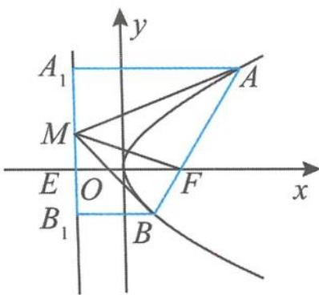

(3) $S_{\triangle OFA}S_{\triangle OFB} = \frac{p^4}{16};$

图1.3-2

$$
\frac {1}{| F A |} + \frac {1}{| F B |} = \frac {2}{p}; \tag {4}
$$

(5) $\frac{|FA||FB|}{|AB|}=\frac{p}{2};$

(6) $\frac{|FA||FB|}{|A_{1}B_{1}|^{2}}=\frac{1}{4};$

(7) $k_{AB} \cdot y_{M} = p$ (其中 $y_{M}$ 为点 M 的纵坐标);

(8)设直线 $AB$ 的斜率为 $k$ , 直线 $AE$ 的斜率为 $k_{1}$ , 则 $\frac{1}{k_1^2} - \frac{1}{k^2} = 1$ ;

(9) 若 AM, BM 与 y 轴分别交于点 S, T, 则 $|OS||OT| = \frac{p^{2}}{4}$ .

证明 (1)设直线 $AB$ 的方程为

$$
x = k y + \frac {p}{2},
$$

把直线 AB 的方程代入抛物线方程 $y^{2}=2px(p>0)$ ，整理得

$$
y ^ {2} - 2 p k y - p ^ {2} = 0.
$$

由韦达定理得

$$
y _ {1} y _ {2} = - p ^ {2},
$$

所以

$$
x _ {1} x _ {2} = \frac {y _ {2} ^ {2}}{2 p} \cdot \frac {y _ {1} ^ {2}}{2 p} = \frac {(y _ {1} y _ {2}) ^ {2}}{4 p ^ {2}} = \frac {p ^ {2}}{4}.
$$

(3) $S_{\triangle OFA}S_{\triangle OFB} = \left(\frac{1}{2} |OF||y_1|\right)\left(\frac{1}{2} |OF||y_2|\right) = \frac{p^2}{16}|y_1y_2| = \frac{p^4}{16}.$

(5)设直线 $AB$ 的倾斜角为 $\theta$ , 由抛物线定义得

$$
| A F | = \frac {p}{1 - \cos \theta}, | B F | = \frac {p}{1 + \cos \theta},
$$

所以

$$
\vert F A \vert \vert F B \vert = \frac {p}{1 + \cos \theta} \cdot \frac {p}{1 - \cos \theta} = \frac {p ^ {2}}{\sin^ {2} \theta}, \vert A B \vert = \frac {p}{1 - \cos \theta} + \frac {p}{1 + \cos \theta} = \frac {2 p}{\sin^ {2} \theta}.
$$

故 $\frac{|FA||FB|}{|AB|}=\frac{p}{2}.$

(7) 因为 $k_{AB} = \frac{y_1 - y_2}{x_1 - x_2} = \frac{y_1 - y_2}{\frac{y_1^2}{2p} - \frac{y_2^2}{2p}} = \frac{2p}{y_1 + y_2} = \frac{p}{y_M}$ , 所以 $k_{AB} \cdot y_M = p$ , 证毕.

(8)由(7)知 $\frac{1}{k}=\frac{y_{1}+y_{2}}{2p}$ ，又

$$
k _ {1} = k _ {A E} = \frac {y _ {1} - 0}{\frac {y _ {1} ^ {2}}{2 p} + \frac {p}{2}} = \frac {2 p y _ {1}}{y _ {1} ^ {2} + p ^ {2}} = \frac {2 p y _ {1}}{y _ {1} ^ {2} - y _ {1} y _ {2}} = \frac {2 p}{y _ {1} - y _ {2}},
$$

得 $\frac{1}{k_1} = \frac{y_1 - y_2}{2p}$ ，所以 $\frac{1}{k_1^2} - \frac{1}{k^2} = \left(\frac{y_1 - y_2}{2p}\right)^2 - \left(\frac{y_1 + y_2}{2p}\right)^2 = \frac{-y_1y_2}{p^2} = 1$ ，证毕.

(9)设 $A(x_{1},y_{1}),B(x_{2},y_{2})$ ，则 $y_{1}y_{2} = -p^{2}$ .易求直线 $AM,BM$ 的方程分别为

$$
y y _ {1} = p (x + x _ {1}), y y _ {2} = p (x + x _ {2}).
$$

所以 $|OS||OT|=\left|\frac{px_{1}}{y_{1}}\cdot\frac{px_{2}}{y_{2}}\right|=\frac{p^{2}}{4}.$

注 (2)(4)(6)的证明留给读者.

## 1.3.3 共线、共点问题

如图 1.3-3 在抛物线 $y^{2}=2px(p>0)$ 的特征直角梯形 $ABB_{1}A_{1}$ 中，M 为 $A_{1}B_{1}$ 的中点，有：

(1) $A, O, B_{1}$ 三点共线；

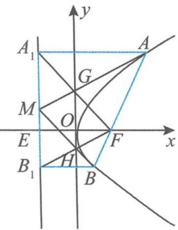

(2) $B, O, A_{1}$ 三点共线；

(3) $AM, A_{1}F, y$ 轴三线共点；

图1.3-3

(4) $BM, B_{1}F, y$ 轴三线共点.

证明 (1) 设 $A\left(\frac{y_1^2}{2p}, y_1\right), B\left(\frac{y_2^2}{2p}, y_2\right)$ ，则 $y_1y_2 = -p^2, B_1\left(-\frac{p}{2}, y_2\right)$ ，所以

$$
k _ {O A} = \frac {2 p}{y _ {1}}, k _ {O B _ {1}} = \frac {2 y _ {2}}{- p} = \frac {2 p y _ {2}}{- p ^ {2}} = \frac {2 p y _ {2}}{y _ {1} y _ {2}} = \frac {2 p}{y _ {1}},
$$

得 $k_{OA}=k_{OB_{1}}$ ，故 A,O, $B_{1}$ 三点共线.

(2) 同(1) 可证 $B, O, A_{1}$ 三点共线.

(3)设 $A(x_{1},y_{1}),B(x_{2},y_{2})$ ，则点 $M\left(-\frac{p}{2},\frac{y_1 + y_2}{2}\right),y_1y_2 = -p^2$ ，而

$$
k _ {A M} = \frac {y _ {1} - y _ {2}}{\frac {y _ {1} ^ {2}}{p} + p} = \frac {p (y _ {1} - y _ {2})}{y _ {1} ^ {2} + p ^ {2}} = \frac {p (y _ {1} - y _ {2})}{y _ {1} ^ {2} - y _ {1} y _ {2}} = \frac {p}{y _ {1}},
$$

所以 $AM$ 的方程为

$$
y y _ {1} = p (x + x _ {1}).
$$

令 $x = 0$ ，得直线 $AM$ 与 $y$ 轴交于点 $G\left(0, \frac{y_1}{2}\right)$ . 又直线 $A_1F$ 的方程为 $y = -\frac{y_1}{p} \left(x - \frac{p}{2}\right)$ ，令 $x = 0$ ，得直线 $A_1F$ 与 $y$ 轴交于点 $G\left(0, \frac{y_1}{2}\right)$ .

所以 AM、 $A_{1}F$ 、y 轴三线共点 G.

(4) 同 (3) 可得 $BM, B_{1}F, y$ 轴三线共点 $H$ .

由以上证明还可以轻松地得到四边形 MHFG 是矩形.

## 1.3.4 圆的问题

如图 1.3-4, 在抛物线 $y^{2}=2px(p>0)$ 的特征直角梯形 $ABB_{1}A_{1}$ 中, M 为 $A_{1}B_{1}$ 的中点, 则:

(1)以 $AB$ 为直径的圆与抛物线的准线相切；

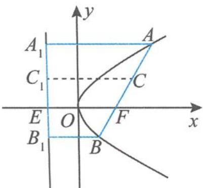  
图1.3-4

(2)以 $A_{1}B_{1}$ 为直径的圆与抛物线的弦 $AB$ 相切；

(3)以 AF 为直径的圆与 y 轴相切；

(4)以 BF 为直径的圆与 y 轴相切；

(5)以点 F 为圆心且与直线 AE 相切的圆, 必与直线 BE 相切;

(6)以 MF 为直径的圆与直线 AB 相切.

证明 (1)如图 1.3-5, 设 AB 的中点为 N, 则

$$
| M N | = \frac {| A A _ {1} | + | B B _ {1} |}{2} = \frac {| A F | + | B F |}{2} = \frac {1}{2} | A B |,
$$

即圆心 $N$ 到抛物线的准线 $l$ 的距离

$$
| N M | = \frac {1}{2} | A B |.
$$

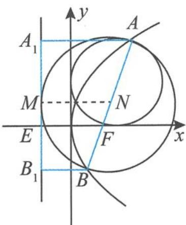

故以 AB 为直径的圆与准线相切, 切点为点 M.

(2)由垂直关系知 $A_{1}F \perp B_{1}F$ , 所以 $|FM| = \frac{1}{2} |A_{1}B_{1}|$ , 即

图1.3-5

$$
\mid M A _ {1} \mid = \mid M B _ {1} \mid = \mid M F \mid .
$$

又 $MF \perp AB$ ，以 $A_{1}B_{1}$ 为直径的圆与抛物线的弦 AB 相切，切点为焦点 F。另外，还可以得到该圆过 x 轴上的两个定点 $\left(\frac{p}{2},0\right),\left(-\frac{3p}{2},0\right)$ 。

(3)设直线 $AF$ 的中点为 $C$ , 点 $C$ 在准线上的投影为 $C_{1}$ , 则圆心 $C$ 到 $y$ 轴的距离

$$
d = \left| C C _ {1} \right| - \frac {p}{2} = \frac {\left| A A _ {1} \right| + \left| E F \right|}{2} - \frac {p}{2} = \frac {\left| A F \right| + p}{2} - \frac {p}{2} = \frac {\left| A F \right|}{2} = R,
$$

其中 R 是以 AF 为直径的圆的半径. 命题得证.

(4) 同(3) 可证, 此处略.

(5)“以点 $F$ 为圆心且与直线 $AE$ 相切的圆, 必与直线 $BE$ 相切”说明点 $F$ 到直线 $AE$ 和直线 $BE$ 的距离相等; 也可转化为证明两条直线 $AE, BE$ 的斜率互为相反数, 证明略.

(6)由特征直角梯形中的垂直关系知, $MF \perp AB$ ,故以MF为直径的圆与直线AB相切.

## 1.3.5 面积问题

如图 1.3-6, 在抛物线 $y^{2}=2px(p>0)$ 的特征直角梯形 $ABB_{1}A_{1}$ 中, 设弦 AB 的倾斜角为 $\theta$ , 记抛物线的准线与 x 轴的交点为 E, 则有:

(1) $S_{\triangle OAB} = \frac{p^2}{2\sin\theta};$

(2) $\frac{S_{\triangle OAB}^{2}}{|AB|}=\frac{p^{3}}{8};$

(3) $\frac{S_{\triangle ABE}^2}{|AB|} = \frac{p^3}{2};$

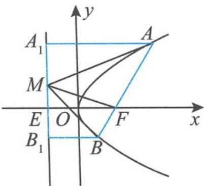  
图1.3-6

(4) $S_{\text{梯形}AA_1B_1B} = \frac{2p^2}{\sin^3\theta};$

(5) $\frac{S_{\triangle A_{1}FB_{1}}^{2}}{S_{\triangle FBB_{1}}S_{\triangle FAA_{1}}} = 4.$

证明 (1)设直线 $AB$ 的倾斜角为 $\theta$ , 则 $|AB| = \frac{2p}{\sin^2\theta}$ , 所以

$$
S _ {\triangle O A B} = \frac {1}{2} | O F | | A B | \sin \theta = \frac {p \sin \theta}{4} \cdot | A B | = \frac {p ^ {2}}{2 \sin \theta}.
$$

(2)由(1)可得

$$
\frac {S _ {\triangle O A B} ^ {2}}{| A B |} = \frac {p ^ {3}}{8}.
$$

(3)设直线 $AB$ 的倾斜角为 $\theta$ , 则 $S_{\triangle ABE} = \frac{1}{2} p (|AB| \sin \theta)$ , 所以

$$
\frac {S _ {\triangle A B E} ^ {2}}{| A B |} = \frac {p ^ {2}}{4} | A B | \sin^ {2} \theta = \frac {p ^ {2}}{4} \cdot \frac {2 p}{\sin^ {2} \theta} \sin^ {2} \theta = \frac {p ^ {3}}{2},
$$

故 $\frac{S_{\triangle ABE}^{2}}{|AB|}=\frac{p^{3}}{2}.$

$$
S _ {\text {梯形} A A _ {1} B _ {1} B} = \frac {1}{2} | A _ {1} B _ {1} | (| A A _ {1} | + | B _ {1} B |) = \frac {1}{2} | A _ {1} B _ {1} | | A B | = \frac {1}{2} \cdot \frac {2 p}{\sin \theta} \cdot \frac {2 p}{\sin^ {2} \theta} = \frac {2 p ^ {2}}{\sin^ {3} \theta}. \tag {4}
$$

(5)设 $|AF|=r_{1},|BF|=r_{2}$ ，则

$$
S _ {\triangle F A A _ {1}} = \frac {1}{2} r _ {1} ^ {2} \sin \theta , S _ {\triangle F B B _ {1}} = \frac {1}{2} r _ {2} ^ {2} \sin \theta .
$$

因为

$$
S _ {\triangle A _ {1} F B _ {1}} ^ {2} = \frac {1}{4} [ 2 r _ {1} ^ {2} (1 - \cos \theta) ] [ 2 r _ {2} ^ {2} (1 + \cos \theta) ] = r _ {1} ^ {2} r _ {2} ^ {2} \sin^ {2} \theta ,
$$

所以 $S_{\triangle A_{1}FB_{1}}^{2}=4S_{\triangle FBB_{1}}S_{\triangle FAA_{1}}$ ，从而得证.

## 1.3.6 平分线问题

如图 1.3-7, 在抛物线 $y^{2}=2px(p>0)$ 的特征直角梯形 $ABB_{1}A_{1}$ 中, M 为 $A_{1}B_{1}$ 的中点, 记抛物线的准线与 x 轴的交点为 E, 则:

(1) 线段 $A_{1}F$ 平分 $\angle EFA$ ;

(2) 线段 $B_{1}F$ 平分 $\angle EFB$ ;

(3) 线段 AM 平分 $\angle A_{1}AF$ ;

(4) 线段 BM 平分 $\angle B_{1}BF$ ;

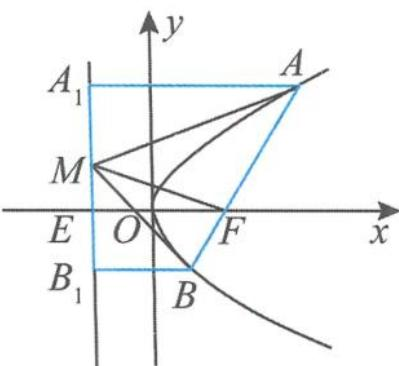  
图1.3-7

(5)线段 EF 平分 $\angle AEB$ .

证明 (1)由抛物线定义知 $|AA_{1}| = |AF|$ ，所以 $\angle AA_{1}F = \angle AFA_{1}$ ，而 $AA_{1} // EF$ ，所以 $\angle AA_{1}F = \angle A_{1}FE$ ，故 $\angle AFA_{1} = \angle A_{1}FE$ ，即线段 $A_{1}F$ 平分 $\angle EFA$ .

(2)同(1)可证线段 $B_{1}F$ 平分 $\angle EFB$ .

(3) 因为 $A_{1} F \perp B_{1} F$ , 所以 $|FM| = \frac{1}{2} |A_{1} B_{1}| = |A_{1} M|$ . 由抛物线定义知 $|AA_{1}| = |AF|$ , 故 Rt△AA₁M≌Rt△AFM, 得 ∠A₁AM = ∠FAM, 即线段 AM 平分 ∠A₁AF.

(4) 同(3) 可证线段 BM 平分 $\angle B_{1}BF$ .

温馨提示 这里的直线 $AM, BM$ 还有一个重要的“身份”, 即 $AM$ 是抛物线在点 $A$ 处的切线, $BM$ 是抛物线在点 $B$ 处的切线.

(5)线段 EF 平分 $\angle AEB \Leftrightarrow k_{AE} + k_{BE} = 0$ ，设 $A(x_{1}, y_{1}), B(x_{2}, y_{2})$ ，则 $y_{1}y_{2} = -p^{2}$ ，

$$
k _ {A E} = \frac {y _ {1} - 0}{\frac {y _ {1} ^ {2}}{2 p} + \frac {p}{2}} = \frac {2 p y _ {1}}{y _ {1} ^ {2} + p ^ {2}} = \frac {2 p y _ {1}}{y _ {1} ^ {2} - y _ {1} y _ {2}} = \frac {2 p}{y _ {1} - y _ {2}}.
$$

同理可得 $k_{BE} = \frac{2p}{y_2 - y_1}$ 所以 $k_{AE} + k_{BE} = 0$ ，命题得证.

## 1.3.7 其他问题

在抛物线 $y^{2} = 2px (p > 0)$ 的特征直角梯形 $ABB_{1}A_{1}$ 中， $M$ 为 $A_{1}B_{1}$ 的中点，则有：

(1)相等问题:设 $\angle AEF=\alpha,\angle AFx=\beta$ ,则 $\tan\alpha=\sin\beta;$

(2) 平行问题: $AM \parallel FB_{1}, A_{1}F \parallel BM;$

(3)平分问题:设 AB 的中点为 N, 若 MN 与抛物线交于点 P, 则点 P 平分 MN, 且 $\frac{|AB|}{|PF|}=4$ ;

(4)最值问题: $(S_{\triangle MAB})_{\min}=p^{2}$ ;

(5)数列问题:若 T 为直线 $A_{1}B_{1}$ 上的任意一点,则直线 TA, TF, TB 的斜率成等差数列.

证明 (1)如图 1.3-8, 过点 A 作 $AQ \perp x$ 轴于点 Q, 则

$$
\tan \alpha = \frac {| A Q |}{| E Q |} = \frac {| A Q |}{| A A _ {1} |} = \frac {| A Q |}{| A F |} = \sin \beta .
$$

(2)由垂直关系有 $A_{1}F \perp B_{1}F$ , 且 $A_{1}F \perp AM$ , 从而得 $AM \parallel FB_{1}$ . 同理得 $A_{1}F \parallel BM$ .

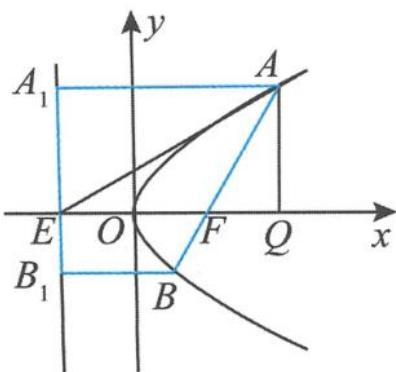  
图1.3-8

(3) 设 $A\left(\frac{y_1^2}{2p}, y_1\right), B\left(\frac{y_2^2}{2p}, y_2\right)$ , 则 $A_1B_1$ 的中点为 $M\left(-\frac{p}{2}, \frac{y_1 + y_2}{2}\right), AB$ 的中点为 $N\left(\frac{y_1^2 + y_2^2}{4p}, \frac{y_1 + y_2}{2}\right)$ . 因为 $y_1y_2 = -p^2$ , 即 $N\left(\frac{(y_1 + y_2)^2}{4p} + \frac{p}{2}, \frac{y_1 + y_2}{2}\right)$ , 所以 $MN$ 的中点 $\left(\frac{(y_1 + y_2)^2}{8p}, \frac{y_1 + y_2}{2}\right)$ 在抛物线 $y^2 = 2px (p > 0)$ 上.

由垂直关系得 $AB \perp FM$ , 所以

$$
\mid P F \mid = \frac {1}{2} \mid M N \mid = \frac {1}{2} \cdot \frac {\mid A A _ {1} \mid + \mid B B _ {1} \mid}{2} = \frac {1}{4} (\mid A F \mid + \mid B F \mid) = \frac {1}{4} \mid A B \mid .
$$

证毕.

(4)由垂直关系得 $AM \perp BM, AB \perp FM,$ 所以

$$
\vert M F \vert^ {2} = \vert F A \vert \vert F B \vert = \frac {p}{1 + \cos \theta} \cdot \frac {p}{1 - \cos \theta} = \frac {p ^ {2}}{\sin^ {2} \theta}.
$$

又 $|AB|=\frac{2p}{\sin^{2}\theta}$ ，所以

$$
S _ {\triangle M A B} = \frac {p ^ {2}}{\sin^ {3} \theta},
$$

故 $(S_{\triangle MAB})_{\min}=p^{2}$ .

(5)设 $A\left(\frac{y_1^2}{2p}, y_1\right), B\left(\frac{y_2^2}{2p}, y_2\right), T\left(-\frac{p}{2}, t\right)$ ，则

$$
y _ {1} y _ {2} = - p ^ {2},
$$

$$
\begin{array}{l} k _ {T A} + k _ {T B} = \frac {y _ {1} - t}{\frac {y _ {1} ^ {2}}{2 p} + \frac {p}{2}} + \frac {y _ {2} - t}{\frac {y _ {2} ^ {2}}{2 p} + \frac {p}{2}} = \frac {2 p (y _ {1} - t)}{y _ {1} ^ {2} + p ^ {2}} + \frac {2 p (y _ {2} - t)}{y _ {2} ^ {2} + p ^ {2}} \\ = \frac {2 p (y _ {1} - t)}{y _ {1} ^ {2} - y _ {1} y _ {2}} + \frac {2 p (y _ {2} - t)}{y _ {2} ^ {2} - y _ {1} y _ {2}} = \frac {2 p (y _ {1} - t)}{y _ {1} (y _ {1} - y _ {2})} + \frac {2 p (y _ {2} - t)}{y _ {2} (y _ {2} - y _ {1})} \\ = \frac {2 p t (y _ {1} - y _ {2})}{y _ {1} y _ {2} (y _ {1} - y _ {2})} = \frac {2 p t}{y _ {1} y _ {2}} = \frac {- 2 t}{p} = 2 k _ {\mathrm{TF}}, \end{array}
$$

所以 $k_{TA} + k_{TB} = 2k_{TF}$ ，即直线 TA, TF, TB 的斜率成等差数列.

通过整理归纳,我们很快发现,抛物线的性质环环相扣,层层递进.大家还可以接着整理出更多的性质.事实上,当我们抓住抛物线 $y^{2}=2px(p>0)$ 的特征直角梯形 $ABB_{1}A_{1}$ 时,抛物线的焦点弦等性质便一览无余.我们从系统的高度对知识进行深层梳理,当零散的知识回到知识网络时,问题变得豁然开朗.

如果我们再把抛物线的焦点、准线分别改为定点 $(a,0)$ 、定直线 $x=-a(a\neq0)$ 就可以得到抛物线的类特征直角梯形。有关抛物线的类特征直角梯形的性质，在第五章我们将继续欣赏。其实，该类问题的本质就是极点与极线问题。同样地，椭圆、双曲线也有特征直角梯形的性质，大家可以同样地进行归纳整理。

“不识庐山真面目, 只缘身在此山中”, 当我们跳出教材对知识进行整理时, 一切似曾相识的知识都逐步明朗化, 大有“拨开云雾见天日, 守得云开见月明”之感. 知识整理的过程, 其实就是一个数学学习力提升的过程, 是一次数学智慧之旅. 完备的知识网络, 为我们的学习轻装上阵提供了重要保证, 对于学好圆锥曲线, 你是否会更有信心了? 现在我们可以出发了, 下章我们先了解圆锥曲线的前世今生.

## 思考题

1. 设抛物线 $y^{2}=4x$ 的焦点为 F，其准线为直线 l。过点 $M(4,4)$ 作直线 l 的垂线，垂足为 H，则 $\angle FMH$ 的角平分线所在直线的斜率是（）。
A. 1
B. $\frac{1}{2}$ C. $\frac{1}{3}$ D. $\frac{1}{4}$

2. 已知不过原点 O 的直线交抛物线 $y^{2}=2px$ 于 A, B 两点, 若直线 OA, AB 的斜率分别为 $k_{OA}=2, k_{AB}=6$ , 则直线 OB 的斜率为 ( ).

A. 3
B. 2
C. -2
D. -3

3. 已知椭圆 $\frac{x^{2}}{a^{2}} + \frac{y^{2}}{b^{2}} = 1 (a > b > 0)$ 与直线 $l_{1}: y = \frac{1}{2}x, l_{2}: y = -\frac{1}{2}x$ ，过椭圆上的点 P 作 $l_{1}, l_{2}$ 的平行线，分别交 $l_{1}, l_{2}$ 于 M, N 两点。若 $|MN|$ 为定值，则 $\sqrt{\frac{a}{b}} = (\quad)$ 。
A. $\sqrt{2}$ B. $\sqrt{3}$ C. 2

D. $\sqrt{5}$

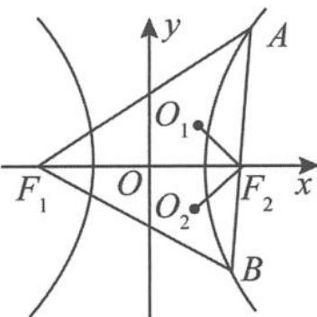

4. (多选题)如图, 已知 $F_{1}, F_{2}$ 分别为双曲线 $x^{2} - \frac{y^{2}}{3} = 1$ 的左、右焦点, 过点 $F_{2}$ 的直线与双曲线的右支交于 $A, B$ 两点. 记 $\triangle AF_{1}F_{2}$ 的内切圆 $O_{1}$ 的面积为 $S_{1}, \triangle BF_{1}F_{2}$ 的内切圆 $O_{2}$ 的面积为 $S_{2}$ , 则正确的结论有 ( ). A. 圆 $O_{1}$ 和圆 $O_{2}$ 外切 B. 圆心一定不在直线 $AO$ 上 C. $S_{1}S_{2} = \pi^{2}$ D. $S_{1} + S_{2}$ 的取值范围是 $[2\pi, 3\pi]$

(第 4 题)

5. (多选题)已知 $F$ 为抛物线 $C: y^{2} = 2px (p > 0)$ 的焦点, 过点 $F$ 作两条互相垂直的直线 $l_{1}, l_{2}$ . 设直线 $l_{1}$ 与抛物线 $C$ 交于 $A, B$ 两点, 直线 $l_{2}$ 与抛物线 $C$ 交于 $D, E$ 两点, 则下列正确的是( ). A. $|AB|_{\min} = 2p$ B. $\frac{1}{|AB|} + \frac{1}{|DE|} = \frac{1}{2p}$ C. $|AB||DE|$ 的最小值为 $16p^{2}$ D. $|AB| + |DE|$ 的最小值为 $8p$

6. 已知圆 $M: (x+6)^{2} + y^{2} = 1, N: (x-6)^{2} + y^{2} = 4$ , 过双曲线 $\Gamma: \frac{x^{2}}{4} - \frac{y^{2}}{32} = 1$ 左支上一点 $P$ 作圆 $M$ 、圆 $N$ 的切线, 设切点分别为 $A, B$ , 则 $|PA|^{2} - |PB|^{2}$ 的最大值为 \_\_\_\_.

7. 过抛物线 $y^{2}=2px(p>0)$ 的焦点 F 的直线 l 与抛物线交于 A, B 两点, 线段 AB 的垂直平分线 NT 交 x 轴于点 T, 则 $\frac{|AB|}{|FT|}=$ \_\_\_\_ ; 若 AB 的倾斜角为锐角 $\alpha$ , 则 $\frac{|FT|-|FT|\cos2\alpha}{2p}$ 的值为 \_\_\_\_.

8. 已知 $A, B$ 是抛物线 $y^{2} = 2px (p > 0)$ 上的两点, $F$ 是焦点, 直线 $AF, BF$ 的倾斜角互补. 记直线 $AF, AB$ 的斜率分别为 $k_{1}, k_{2}$ , 则 $\frac{1}{k_{2}^{2}} - \frac{1}{k_{1}^{2}} =$ \_\_\_\_.

9. 已知抛物线 $C: y^{2} = 4x$ 的焦点是 $F$ , 准线是 $l$ .

(I)写出焦点 F 的坐标和准线 l 的方程.

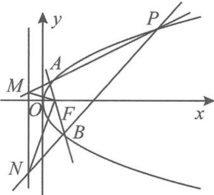

(Ⅱ)如图,已知点 $P(9,6)$ , 若过点 F 的直线交抛物线 C 于不同的两点 A, B (均与点 P 不重合), 直线 PA, PB 分别交直线 l 于点 M, N. 证明: $MF \perp NF$ .

(第9题)

10. 设双曲线 C: $\frac{x^{2}}{a^{2}} - \frac{y^{2}}{b^{2}} = 1 (a > 0, b > 0)$ 的左顶点为 A，右焦点为 F，动点 B 在双曲线 C 上。当 $BF \perp AF$ 时， $|AF| = |BF|$ 。

(I)求双曲线 C 的离心率.

(Ⅱ)若点 B 在第一象限,证明: $\angle BFA = 2\angle BAF$ .

## 第二章

# 博观而约取,厚积而薄发 ——圆锥曲线可以这样得来

合理地组织知识,使知识处于随时可用的状态,要比储备知识更为重要.——波利亚

在学习圆锥曲线时,我们首先要做的事情就是要弄明白圆锥曲线的来龙去脉,揭示圆锥曲线的前世今生.要学会从不同的角度来欣赏、理解其本质,梳理知识的网络,使知识处于一种鲜活的、系统的状态,随时可以摄取.

正如美国著名教育家、心理学家布鲁纳所指出：“知识如果没有完满的结构把它连接在一起，那是一种多半会被遗忘的知识。”的确，我们在每节课里获得的知识是“散装”的，常有“见叶不见枝，见木不见林”的片面感。所以，为了能够整体地系统地感知知识，形成完整的认知结构，我们需要站在系统的高度对知识进行梳理，构建知识链，完善认知网络，并逐步学会整体建构的方法，形成整体建构的思想。

## 2.1 圆锥曲线可以“转”出来

圆锥曲线可以看作是动点绕着定点或定直线转动所形成的图形,从而得到圆锥曲线的定义,这是一种直观且形象的操作,也是我们认识圆锥曲线的直观开始.圆锥曲线的定义是研究圆锥曲线性质的重要支撑,也是我们学习圆锥曲线的重要方法.

圆锥曲线的第一定义

椭圆 平面内与两个定点 $F_{1}, F_{2}$ 的距离的和等于常数（大于 $\left|F_{1}F_{2}\right|$ ）的点的轨迹.

双曲线 平面内与两个定点 $F_{1}, F_{2}$ 的距离的差的绝对值等于常数（大于0且小于 $\left|F_{1}F_{2}\right|$ ）的点的轨迹.

抛物线 平面内与一个定点 $F$ 和一条定直线 $l(F \notin l)$ 的距离相等的点的轨迹.

圆锥曲线的统一定义

圆锥曲线 平面内到一个定点 $F$ 的距离和到一条定直线 $l$ 的距离之比是一个常数 $e$ 的点 $P$ 的轨迹.

当 0 < e < 1 时，点 P 的轨迹为椭圆；

当 e>1 时，点 P 的轨迹为双曲线；

当 e=1 时, 点 P 的轨迹为抛物线.

例 1 设椭圆 $C: \frac{x^{2}}{4} + \frac{y^{2}}{3} = 1$ 的右焦点为 F，动点 P 在椭圆 C 上，点 A 是直线 l: 3x - 4y - 12

=0 上的动点,则 $\left|PA\right|-\left|PF\right|$ 的最小值是 \_\_\_\_.

解答 如图 2.1-1, 设椭圆的左焦点为 $F'$ , 由题意知

$$
F ^ {\prime} (- 1, 0), F (1, 0).
$$

由椭圆的定义知

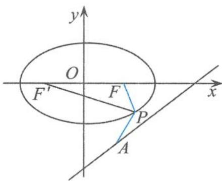

$$
\mid P F ^ {\prime} \mid + \mid P F \mid = 4,
$$

图2.1-1

从而

$$
\mid P A \mid - \mid P F \mid = \mid P A \mid - (4 - \mid P F ^ {\prime} \mid) = \mid P A \mid + \mid P F ^ {\prime} \mid - 4.
$$

要求 $|PA|-|PF|$ 的最小值, 即求 $|PA|+|PF'|$ 的最小值, 即所求的最小值为点 $F'$ 到直线 l 的距离, 即

$$
d _ {F ^ {\prime} \rightarrow l} = \frac {| - 3 - 0 - 1 2 |}{\sqrt {3 ^ {2} + (- 4) ^ {2}}} = 3,
$$

所以

$$
(| P A | - | P F |) _ {\min} = - 1.
$$

点评 在这个题目中,椭圆定义的功能就在于把点 $P$ 到右焦点的距离置换成点 $P$ 到左焦点的距离,从而使问题的解答得以顺利完成.

例 2 已知 P 是抛物线 $y^{2}=4x$ 上的一点, 过点 P 作直线 x=-2 的垂线, 垂足为 H, 直线 l 经过原点, 由 l 上的一点 Q 向圆 $C:(x+5)^{2}+(y-3)^{2}=2$ 引两条切线, 分别切圆 C 于 M, N 两点, 且 $\triangle MQN$ 为直角三角形, 则 $|PQ|+|PH|$ 的最小值是 \_\_\_\_.

解答 如图 2.1-2, 设抛物线 $y^{2}=4x$ 的焦点为 $F(1,0)$ 、准线方程为 x=-1。由抛物线的定义知

$$
\mid P H \mid = \mid P F \mid + 1,
$$

故

$$
\vert P Q \vert + \vert P H \vert = \vert P Q \vert + \vert P F \vert + 1 \geqslant \vert Q F \vert + 1.
$$

易知四边形 CMQN 为正方形, 设圆 C 的半径为 r, 则

$$
\mid C Q \mid = \sqrt {2} r = 2.
$$

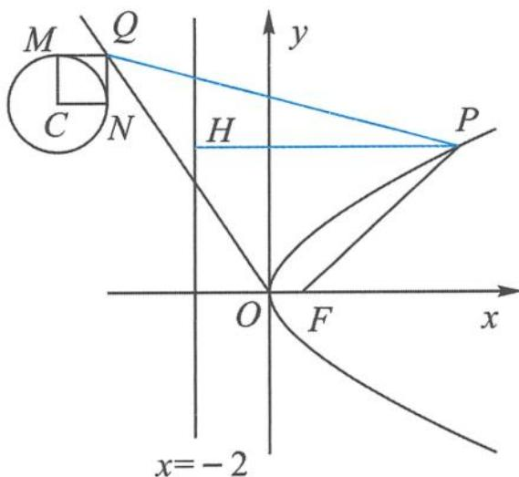  
图2.1-2

因此，点 Q 在以 $C(-5,3)$ 为圆心、 $r' = 2$ 为半径的圆上，故

$$
| Q F | \geqslant | C F | - r ^ {\prime} = 3 \sqrt {5} - 2,
$$

所以

$$
\vert P Q \vert + \vert P H \vert \geqslant \vert Q F \vert + 1 \geqslant 3 \sqrt {5} - 2 + 1 = 3 \sqrt {5} - 1.
$$

点评 在这个题目中,寻找问题的解答突破口利用了抛物线的定义,把点 P 到焦点的距离置换成点 P 到准线的距离.

例 3 已知三棱柱 $ABC-A_{1}B_{1}C_{1}, AA_{1} \perp$ 平面 ABC, P 是 $\triangle A_{1}B_{1}C_{1}$ 内一点, 点 E, F 在直线 BC 上运动, 若直线 PA 和 AE 所成角的最小值与直线 PF 和平面 ABC 所成角的最大值相等, 则满足条件的点 P 的轨迹是( ). A. 直线的一部分 B. 圆的一部分 C. 抛物线的一部分 D. 椭圆的一部分

解答 如图 2.1-3, 设点 P 在平面 ABC 上的射影为 O, 由最小角定理知, 直线 PA 和 AE

所成角的最小值等于直线 $PA$ 和平面 $ABC$ 所成的角 $\alpha$ , 则

$$
\tan \alpha = \frac {P O}{O A}.
$$

另外, 直线 $PF$ 和平面 $ABC$ 所成角的最大值等于二面角 $P-BC-A$ 的大小, 过点 $O$ 作 $OH \perp BC$ , 垂足为 $H$ , 则 $\angle OHP$ 为二面角 $P-BC-A$ 的平面角, 且

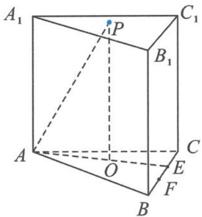  
图2.1-3

$$
\tan \angle O H P = \frac {P O}{O H}.
$$

由题意知 $\alpha=\angle OHP$ ，即

$$
\tan \alpha = \tan \angle O H P,
$$

所以

$$
O H = O A.
$$

点 P 到点 $A_{1}$ 的距离等于点 P 到 $B_{1}C_{1}$ 的距离, 所以点 P 的轨迹是以 $A_{1}$ 为焦点、 $B_{1}C_{1}$ 为准线的抛物线的一部分.

故选 C.

引申1 在四面体 $P-ABC$ 中, $PA=\sqrt{3}$ , 其余棱长为 2. 动点 $Q$ 在 $\triangle ABC$ 的内部 (含边界), 设 $\angle PAQ=\alpha$ , 二面角 $P-BC-A$ 的平面角的大小为 $\beta$ , $\triangle APQ$ 和 $\triangle BCQ$ 的面积分别为 $S_1$ 和 $S_2$ , 且满足 $\frac{S_1}{S_2}=\frac{3\sin\alpha}{4\sin\beta}$ , 则 $S_2$ 的最大值为 \_\_\_\_.

解答 取 $BC$ 的中点 $M$ , 连接 $PM, AM$ . 因为 $\triangle ABC$ 和 $\triangle PBC$ 均为等边三角形, 所以

$$
P M \perp B C, A M \perp B C.
$$

所以 $\angle PMA$ 即为二面角 $P - BC - A$ 的平面角, 所以

$$
\angle P M A = \beta .
$$

因为 $AM=\sqrt{3}$ , $PM=\sqrt{3}$ , $AP=\sqrt{3}$ , 所以

$$
\beta = \frac {\pi}{3}.
$$

设点 Q 到 BC 的距离为 h，则

$$
\frac {S _ {1}}{S _ {2}} = \frac {\frac {1}{2} A P \cdot A Q \sin \alpha}{\frac {1}{2} B C \cdot h} = \frac {3 \sin \alpha}{4 \sin \beta},
$$

解得

$$
A Q = h.
$$

故点 $Q$ 的轨迹为以点 $A$ 为焦点、 $BC$ 为准线的抛物线在 $\triangle ABC$ 内的一段弧。当点 $Q$ 位于抛物线和 $AC$ 的交点时， $h$ 最大。如图2.1-4，设 $AC$ 与抛物线交于点 $E$ ，过点 $E$ 作 $EF \perp BC$ ，交 $BC$ 于点 $F$ ，则

所以 $\sin \frac{\pi}{3} = \frac{h}{2 - h}$ , 解得

$$
A E = E F = h, E C = 2 - h, \angle C = \frac {\pi}{3},
$$

$$
h _ {\max} = 4 \sqrt {3} - 6,
$$

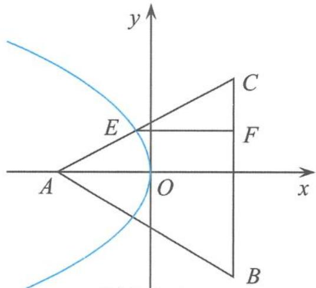  
图2.1-4

所以

$$
S _ {2} \leqslant \frac {1}{2} \cdot B C \cdot h _ {\max} = 4 \sqrt {3} - 6.
$$

引申 2 在四面体 ABCD 中, AD 与 BC 互相垂直, AD = 2BC = 4, 且 AB + BD = AC + CD = 2√14 , 则四面体 ABCD 的体积的最大值是(   ). A. 4 B. $2\sqrt{10}$ C. 5 D. $\sqrt{30}$

解答 已知 $AB + BD = AC + CD = 2\sqrt{14}$ ，由椭圆定义知点 B, C 都在以 A, D 为焦点的椭

圆上,且长轴 $2a=2\sqrt{14}$ .

如图 2.1-5, 过点 B 作 BE 垂直 AD 于点 E, 连接 CE, 则 $AD \perp$ 平面 BCE, 所以

$$
C E \perp A D, | B E | = | C E |, | B E | _ {\max} = b,
$$

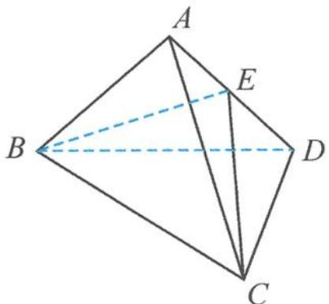

b 为椭圆的短半轴. 设 BC 的中点为 F, 则

图2.1-5

$$
\mid E F \mid = \sqrt {B E ^ {2} - B F ^ {2}} = \sqrt {B E ^ {2} - 1}, \mid E F \mid_ {\max} = 3, V _ {\max} = \frac {1}{3} A D \cdot S _ {\triangle B C E} = 4.
$$

故选 A.

点评 从平面到空间对圆锥曲线的定义进行深度学习,理解其丰富的内涵,这是学习所必须要经历的重要过程.圆锥曲线的定义体现了圆锥曲线的本质属性,定义是圆锥曲线中最活跃的元素,运用圆锥曲线的定义解题是一种最直接、最本质的方法,在解题方面往往能助我们一臂之力,常常能收到立竿见影之效.正如波利亚所说:“当你不能解决一个问题时,不妨回到定义.”

从四则运算的角度来说,椭圆与双曲线的第一定义只涉及和与差的运算,如果是积与商为定值的点的轨迹又会怎么样呢?

知识储备

1. 到两定点的距离之商为定值(不等于 1)的点的轨迹是阿波罗尼斯圆；

2. 到两定点的距离之和为定值(大于两定点的距离)的点的轨迹是椭圆；

3. 到两定点的距离之差的绝对值为定值(大于 0 且小于两定点的距离)的点的轨迹是双曲线；

4. 到两定点的距离之积为定值(该定值为正数)的点的轨迹是卡西尼卵形线.

例 4 阿波罗尼斯是古希腊著名数学家,与欧几里得、阿基米德一起被称为亚历山大时期数学三巨匠,他对圆锥曲线有深刻而系统的研究,主要研究成果集中在他的代表作《圆锥曲线》一书中.阿波罗尼斯圆是他的研究成果之一,指的是已知动点 M 与两定点 A,B 的距离之比为 $\lambda(\lambda>0,\lambda\neq1)$ ,那么点 M 的轨迹就是阿波罗尼斯圆.下面我们来研究与它相关的一个问题,已知圆 $x^{2} + y^{2} = 1$ 和点 $A\left(-\frac{1}{2},0\right)$ ，点 $B(1,1),M$ 为圆 $O$ 上的动点，则 $2|MA| + |MB|$ 的最小值为（ ）. A. $\sqrt{6}$ B. $\sqrt{7}$ C. $\sqrt{10}$ D. $\sqrt{11}$

解答 设 $2|MA| = |MC|$ , 点 $C$ 的坐标为 $(m, n)$ , 点 $M$ 的坐标为 $(x, y)$ , 则

$$
\frac {| M A |}{| M C |} = \frac {1}{2},
$$

即

$$
\frac {\sqrt {\left(x + \frac {1}{2}\right) ^ {2} + y ^ {2}}}{\sqrt {(x - m) ^ {2} + (y - n) ^ {2}}} = \frac {1}{2},
$$

整理得

$$
x ^ {2} + y ^ {2} + \frac {2 m + 4}{3} x + \frac {2 n}{3} y = \frac {m ^ {2} + n ^ {2} - 1}{3}.
$$

由题意得该圆的方程为

$$
x ^ {2} + y ^ {2} = 1,
$$

所以

$$
\left\{ \begin{array}{l} 2 m + 4 = 0, \\ 2 n = 0, \\ \frac {m ^ {2} + n ^ {2} - 1}{3} = 1, \end{array} \right.
$$

解得

$$
\left\{ \begin{array}{l} m = - 2, \\ n = 0. \end{array} \right.
$$

所以点 C 的坐标为 $(-2,0)$ ，故

$$
2 \mid M A \mid + \mid M B \mid = \mid M C \mid + \mid M B \mid \geqslant \mid B C \mid = \sqrt {1 0}.
$$

故选C.

例 5 已知 $\overrightarrow{OA}, \overrightarrow{OB}$ 是非零且不共线的向量，设 $\overrightarrow{OC} = \frac{1}{r+1} \overrightarrow{OA} + \frac{r}{r+1} \overrightarrow{OB}$ ，如果定义点集 M = $\left\{ K \left| \frac{\overrightarrow{KA} \cdot \overrightarrow{KC}}{|\overrightarrow{KA}|} = \frac{\overrightarrow{KB} \cdot \overrightarrow{KC}}{|\overrightarrow{KB}|} \right. \right\}$ 。当 $K_{1}, K_{2} \in M$ 时，若对于任意的 $r \geqslant 2$ ，不等式 $|\overrightarrow{K_{1}K_{2}}| \leqslant c |\overrightarrow{AB}|$ 恒成立，则实数 c 的最小值为 \_\_\_\_.

解答 因为 $\overrightarrow{OC} = \frac{1}{r + 1}\overrightarrow{OA} +\frac{r}{r + 1}\overrightarrow{OB}$ ，且 $\frac{1}{r + 1} +\frac{r}{r + 1} = 1$ ，所以 $A,B,C$ 三点共线，且 $\overrightarrow{CA} =$ $r\overrightarrow{BC}$ .由题意易知 $CK$ 是 $\angle AKB$ 的内角平分线，所以 $\frac{|KA|}{|KB|} = \frac{|CA|}{|CB|} = r$ ，从而

$$
\mid K A \mid = r \mid K B \mid ,
$$

所以点 K 在一个阿波罗尼斯圆上. 以 AB 所在直线为 x 轴、C 为原点建立平面直角坐标系, 设 A(-r,0), B(1,0), K(x,y), 得阿波罗尼斯圆方程

$$
\left(x - \frac {r}{r - 1}\right) ^ {2} + y ^ {2} = \left(\frac {r}{r - 1}\right) ^ {2}.
$$

从而

$$
\mid \overrightarrow {K _ {1} K _ {2}} \mid_ {\max} = \frac {2 r}{r - 1}, \mid \overrightarrow {A B} \mid = r + 1,
$$

所以 $c \geqslant \frac{2r}{r^2 - 1}$ , 而 $\frac{2r}{r^2 - 1} = \frac{2}{r - \frac{1}{r}} \leqslant \frac{2}{2 - \frac{1}{2}} = \frac{4}{3} (r \geqslant 2)$ , 故

$$
c \geqslant \frac {4}{3}.
$$

小结 在平面内, 点 $P$ 到两定点 $A, B$ 的距离之商为定值 $\lambda (\lambda > 0$ , 且 $\lambda \neq 1)$ 的点的轨迹是阿波罗尼斯圆, 设 $|AB| = a$ , 则阿波罗尼斯圆的半径 $r = \frac{a\lambda}{|\lambda^2 - 1|}$ .

引申 1 如图 2.1-6, 已知平面 $\alpha \perp$ 平面 $\beta, A, B$ 是平面 $\alpha$ 与平面 $\beta$ 的交线上的两个定点, $DA \subset \beta, CB \subset \beta$ , 且 $DA \perp \alpha, CB \perp \alpha, AD = 4$ , $BC = 8, AB = 6$ . 在平面 $\alpha$ 上有一个动点 $P$ , 使得 $\angle APD = \angle BPC$ , 求 $\triangle PAB$ 的面积的最大值.

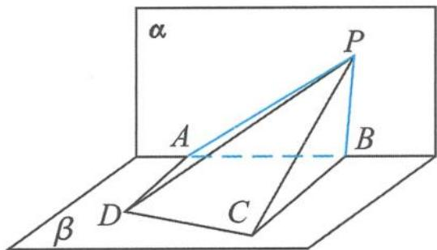  
图2.1-6

解答 将空间几何体中的线、面、角的关系转化为平面内点 $P$ 所满足的几何条件. 因为 $DA \perp \alpha$ , 所以

$$
D A \perp P A.
$$

在 Rt△PAD 中，

$$
\tan \angle A P D = \frac {A D}{A P} = \frac {4}{A P}.
$$

同理

$$
\tan \angle B P C = \frac {B C}{B P} = \frac {8}{B P}.
$$

因为 $\angle APD = \angle BPC$ ，所以

$$
B P = 2 A P.
$$

在平面 $\alpha$ 内, 以线段 $AB$ 的中点为原点、 $AB$ 所在的直线为 $x$ 轴, 建立平面直角坐标系, 则 $A(-3,0), B(3,0)$ .

设 $P(x,y)$ ，则有

$$
\sqrt {(x - 3) ^ {2} + y ^ {2}} = 2 \sqrt {(x + 3) ^ {2} + y ^ {2}} (y \neq 0),
$$

化简得

$$
(x + 5) ^ {2} + y ^ {2} = 1 6.
$$

从而 $y^{2} = 16 - (x + 5)^{2}\leqslant 16$ ，即

$$
| y | \leqslant 4 \text {且} y \neq 0.
$$

此时 $\triangle PAB$ 的面积为

$$
S _ {\triangle P A B} = \frac {1}{2} | y | | A B | = 3 | y | \leqslant 1 2,
$$

当且仅当 x = -5, $y = \pm 4$ 时取得等号.

引申2 在四面体 $ABCD$ 中, 已知 $AD \perp BC$ , $AD = 6$ , $BC = 2$ , 且满足 $\frac{AB}{BD} = \frac{AC}{CD} = 2$ , 则 $V_{\text{四面体}ABCD}$ 的最大值为 ( )。
A. 6 B. $2\sqrt{11}$ C. $2\sqrt{15}$ D. 8

解答 过点 B 作 BE 垂直 AD 于点 E. 因为 $AD \perp BC$ , 所以 $AD \perp$ 平面 BCE. 因此

$$
V = \frac {1}{3} A D \cdot S _ {\triangle B C E} = 2 S _ {\triangle B C E}.
$$

又因为 $\frac{AB}{BD} = \frac{AC}{CD} = 2$ ，所以点 $B,C$ 在阿波罗尼斯圆上，所以

$$
| B E | = | C E |,
$$

得 $|BE|_{\max}=$ 圆的半径r=4,从而

$$
V _ {\max} = 2 \sqrt {1 5}.
$$

故选 C.

不仅这个超级名圆——阿波罗尼斯圆的应用非常广泛,而且飘在圆锥曲线间的那一抹卡西尼卵形线在试题中也是频频出现,同样非常精彩,值得我们关注.

例 6 曲线 C 是平面内与两个定点 $F_{1}(-1,0)$ 和 $F_{2}(1,0)$ 的距离的积等于常数 $a^{2}(a>1)$ 的点的轨迹. 给出下列三个结论:

①曲线 C 过坐标原点; ②曲线 C 关于坐标原点对称; ③若点 P 在曲线 C 上, 则 $\triangle F_{1}PF_{2}$ 的面积不大于 $\frac{1}{2}a^{2}$ .

其中,所有正确结论的序号是

解答 设曲线 C 方程为 $\sqrt{(x+1)^{2}+y^{2}}\cdot\sqrt{(x-1)^{2}+y^{2}}=a^{2}$ .

①令 x=y=0 ，得 a=1 ，与已知矛盾，所以该结论不正确。

②把方程 $\sqrt{(x + 1)^2 + y^2} \cdot \sqrt{(x - 1)^2 + y^2} = a^2$ 中的 $x$ 用 $-x$ 代换, 同时把 $y$ 用 $-y$ 代换, 原方程不变, 故此曲线关于原点对称, 因此该结论正确.

③因为 $S_{\triangle F_{1}PF_{2}}=\frac{1}{2}|PF_{1}||PF_{2}|\sin\angle F_{1}PF_{2}\leqslant\frac{1}{2}|PF_{1}||PF_{2}|=\frac{1}{2}a^{2}$ ，所以该结论正确。
故正确结论的序号是②③.

例 7 已知实数 x, y 满足 $\sqrt{(x+1)^{2}+y^{2}}\cdot\sqrt{(x-1)^{2}+y^{2}}=4$ ，则 $x^{2}+y^{2}$ 的取值范围是 \_\_\_\_.

解答 解法 1: 由基本不等式得

$$
4 = \sqrt {(x + 1) ^ {2} + y ^ {2}} \cdot \sqrt {(x - 1) ^ {2} + y ^ {2}} \leqslant \frac {(x + 1) ^ {2} + y ^ {2} + (x - 1) ^ {2} + y ^ {2}}{2} = x ^ {2} + y ^ {2} + 1,
$$

所以

$$
x ^ {2} + y ^ {2} \geqslant 3.
$$

由柯西不等式得

$$
\sqrt {(x + 1) ^ {2} + y ^ {2}} \cdot \sqrt {(x - 1) ^ {2} + y ^ {2}} \geqslant (x + 1) (x - 1) + y \cdot y = x ^ {2} + y ^ {2} - 1,
$$

即

$$
x ^ {2} + y ^ {2} \leqslant 5.
$$

所以

$$
x ^ {2} + y ^ {2} \in [ 3, 5 ]
$$

解法 2: 设点 $P(x, y)$ , $F_{1}(-1, 0)$ , $F_{2}(1, 0)$ , 则有

$$
\mid P F _ {1} \mid \mid P F _ {2} \mid = 4.
$$

设 $r^2 = x^2 + y^2$ ，则由平行四边形的性质得

$$
2 \left(\left| P F _ {1} \right| ^ {2} + \left| P F _ {2} \right| ^ {2}\right) = (2 | O P |) ^ {2} + \left| F _ {1} F _ {2} \right| ^ {2},
$$

即

$$
\mid P F _ {1} \mid^ {2} + \mid P F _ {2} \mid^ {2} = 2 r ^ {2} + 2.
$$

由基本不等式得 $2r^{2} + 2 \geqslant 2|PF_{1}| |PF_{2}| = 8$ ，所以

$$
r ^ {2} \geqslant 3.
$$

另外，因为

$$
\mid \mid P F _ {1} \mid - \mid P F _ {2} \mid \mid \leqslant \mid F _ {1} F _ {2} \mid = 2,
$$

平方得

$$
\mid P F _ {1} \mid^ {2} + \mid P F _ {2} \mid^ {2} - 2 \mid P F _ {1} \mid \mid P F _ {2} \mid \leqslant 4,
$$

即 $2r^{2} + 2 - 8 \leqslant 4$ ，所以 $r^{2} \leqslant 5$ ，即

$$
3 \leqslant r ^ {2} \leqslant 5.
$$

所以

$$
x ^ {2} + y ^ {2} \in [ 3, 5 ].
$$

点评 例 6 和例 7 虽然都是以卡西尼卵形线为背景进行命题的,考查卡西尼卵形线的重要性质、特征,但用到的解题方法、技巧却是我们最熟悉和朴素的知识、方法,这也是我们高考命题者一贯所追求的:利用最朴素的材料,采取最一般的方法,得出最简单的结论.

## 2.1.1 当圆锥曲线的定义遇到高考时

以圆锥曲线的定义为背景的高考试题,重在考查学生对数学基本概念的深度理解,问题的设计往往短小精悍,内涵丰富,富有启发性,让人耳目一新.所以,有人说高考对圆锥曲线定义的考查可能会迟到,但不会缺席,圆锥曲线定义与高考有着不解之缘.

例 8 设 $F_{1}, F_{2}$ 是双曲线 $C: x^{2} - \frac{y^{2}}{3} = 1$ 的两个焦点, O 为坐标原点, 点 P 在双曲线 C 上且 $|OP| = 2$ , 则 $\triangle PF_{1}F_{2}$ 的面积为(). A. $\frac{7}{2}$ B. 3 C. $\frac{5}{2}$ D. 2

解答 如图 2.1-7, 易得 $\left|F_{1}F_{2}\right|=4$ , 所以

$$
| O P | = \frac {1}{2} | F _ {1} F _ {2} |,
$$

得到

$$
\angle F _ {1} P F _ {2} = 9 0 ^ {\circ},
$$

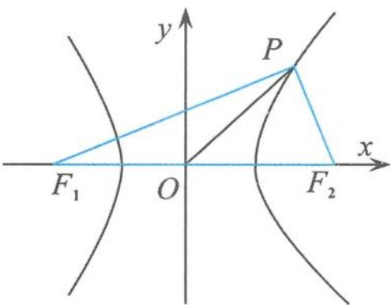  
图2.1-7

因此 $\left|PF_{1}\right|^{2}+\left|PF_{2}\right|^{2}=\left|F_{1}F_{2}\right|^{2}$ ，即

$$
\left(\left| P F _ {1} \right| - \left| P F _ {2} \right|\right) ^ {2} + 2 \left| P F _ {1} \right| \left| P F _ {2} \right| = \left| F _ {1} F _ {2} \right| ^ {2}.
$$

由双曲线的定义得到 $|PF_{1}| - |PF_{2}| = 2$ ，则 $|PF_{1}| |PF_{2}| = 6$ ，所以

$$
S _ {\triangle P F _ {1} F _ {2}} = \frac {1}{2} | P F _ {1} | | P F _ {2} | = 3.
$$

故选 B.

点评 先将数量关系转化为几何特征, 即 $\angle F_{1}PF_{2}=90^{\circ}$ , 再利用双曲线的定义, 从整体上求出 $|PF_{1}| |PF_{2}| = 6$ , 从而求出焦点三角形的面积, 这样就回避了求点的坐标.

例9 已知椭圆 $C$ 的焦点为 $F_{1}(-1,0), F_{2}(1,0)$ , 过点 $F_{2}$ 的直线与椭圆 $C$ 交于 $A, B$ 两点. 若 $|AF_{2}| = 2|F_{2}B|$ , $|AB| = |BF_{1}|$ , 则椭圆 $C$ 的方程为 ( ).

A. $\frac{x^{2}}{2} + y^{2} = 1$ B. $\frac{x^{2}}{3} + \frac{y^{2}}{2} = 1$ C. $\frac{x^{2}}{4} + \frac{y^{2}}{3} = 1$ D. $\frac{x^{2}}{5} + \frac{y^{2}}{4} = 1$

解答 如图 2.1-8, 设 $\left|F_{2}B\right|=t$ , 则 $\left|AF_{2}\right|=2t$ , 所以 $\left|BF_{1}\right|=3t$ .
由椭圆的定义知 $\left|BF_{1}\right|+\left|BF_{2}\right|=3t+t=2a,$

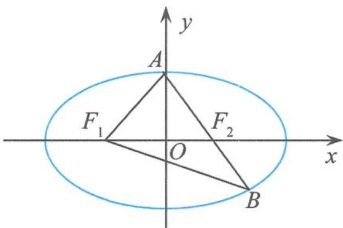

即

图2.1-8

$$
t = \frac {1}{2} a.
$$

由椭圆的定义知

$$
\mid A F _ {1} \mid = 2 a - \mid A F _ {2} \mid = a,
$$

所以点 A 在椭圆短轴的端点处. 在等腰三角形 $ABF_{1}$ 中,

$$
\cos \angle F _ {1} A B = \frac {\frac {1}{2} | F _ {1} A |}{| A B |} = \frac {1}{3}.
$$

在等腰三角形 $AF_{1}F_{2}$ 中，

$$
\mid F _ {1} F _ {2} \mid^ {2} = 4 = a ^ {2} + a ^ {2} - 2 a \cdot a \cdot \frac {1}{3} = \frac {4}{3} a ^ {2},
$$

得

$$
a ^ {2} = 3, b ^ {2} = a ^ {2} - c ^ {2} = 2.
$$

故选 B.

例 10 已知点 $M(-1,1)$ 和抛物线 $C: y^{2} = 4x$ ，过抛物线 C 的焦点且斜率为 k 的直线与抛

物线 C 交于 A, B 两点. 若 $\angle AMB = 90^{\circ}$ ，则 k =

解答 如图 2.1-9, 易知点 $M(-1,1)$ 在抛物线的准线 $x = -1$ 上. 设 $AB$ 的中点为 $N$ , 分别过点 $A, B$ 作准线的垂线, 垂足分别为 $A_{1}, B_{1}$ . 由抛物线的定义知

$$
\mid A F \mid = \mid A A _ {1} \mid , \mid B F \mid = \mid B B _ {1} \mid .
$$

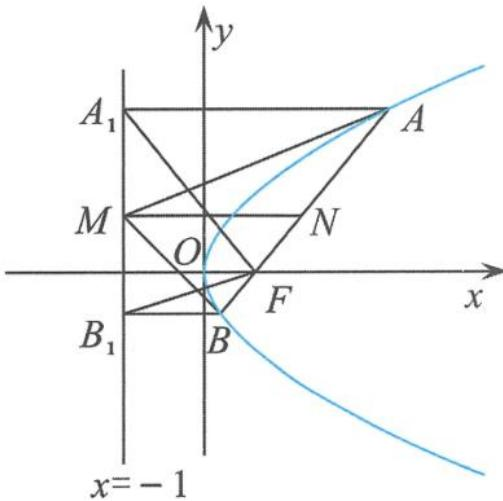  
图2.1-9

因为 $\angle AMB = 90^{\circ}$ ，所以

$$
| M N | = \frac {1}{2} | A B | = \frac {1}{2} (| A F | + | B F |) = \frac {1}{2} (| A A _ {1} | + | B B _ {1} |),
$$

故 $MN$ 为梯形 $AA_{1}B_{1}B$ 的中位线, 即 $M$ 为 $A_{1}B_{1}$ 的中点. 由抛物线的定义易证

$$
\angle A _ {1} F B _ {1} = 9 0 ^ {\circ},
$$

故

$$
| M F | = \frac {1}{2} | A _ {1} B _ {1} | = | A _ {1} M |.
$$

因此 $\triangle MAA_{1} \cong \triangle AMF$ ，得 $\angle AFM = \angle MA_{1}A = 90^{\circ}$ ，即

$$
F M \perp A B.
$$

从而

$$
k = 2.
$$

点评 这是一道构思巧妙的高考试题,通俗中透出奇意,平淡中析出光芒.在这个解答过程中,我们只用到抛物线的定义,再加上平面几何的一些常识就可以把问题搞定.

引申 过抛物线 $y^{2}=2x$ 的焦点 F 的直线与该抛物线交于 A, B 两点，过点 F 作线段 AB 的垂线，交抛物线的准线于点 G. 若 $\left|FG\right|=\frac{3}{2}$ ，O 为坐标原点，则 $S_{\triangle AOB}=$ \_\_\_\_.

解答 设点 A, B 在准线上的射影分别为 $A_{1}, B_{1}$ ，则

$$
\angle A _ {1} F B _ {1} = 9 0 ^ {\circ}.
$$

由 $FG \perp AB$ 得 $G$ 为 $A_{1}B_{1}$ 的中点，所以 $|FG| = \frac{1}{2}|A_{1}B_{1}| = \frac{1}{2}|y_{A} - y_{B}| = \frac{3}{2}$ ，所以

$$
\mid y _ {A} - y _ {B} \mid = 3.
$$

故

$$
S _ {\triangle A O B} = \frac {1}{2} | O F | | y _ {A} - y _ {B} | = \frac {3}{4}.
$$

例 11 设圆 $x^{2}+y^{2}+2x-15=0$ 的圆心为 A，直线 l 过点 B(1,0)，且与 x 轴不重合，l 交圆 A 于 C, D 两点，过点 B 作 AC 的平行线，交 AD 于点 E。证明： $|EA|+|EB|$ 为定值，并写出点 E 的轨迹方程。

证明 如图 2.1-10, 由已知得

$$
\vert A D \vert = \vert A C \vert , E B \parallel A C.
$$

所以 $\angle EBD = \angle ACD = \angle ADC$ ，所以

$$
| E B | = | E D |,
$$

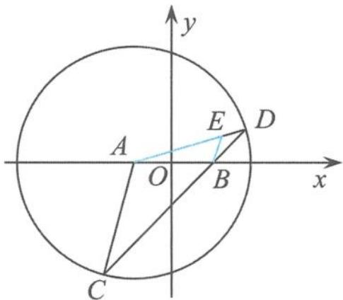

故

$$
\vert E A \vert + \vert E B \vert = \vert E A \vert + \vert E D \vert = \vert A D \vert .
$$

图2.1-10

因为圆 A 的标准方程为

$$
(x + 1) ^ {2} + y ^ {2} = 1 6,
$$

从而 $|AD|=4$ ，所以

$$
\vert E A \vert + \vert E B \vert = 4 > 2 = \vert A B \vert .
$$

由椭圆定义可得点 E 的轨迹方程为

$$
\frac {x ^ {2}}{4} + \frac {y ^ {2}}{3} = 1 (y \neq 0).
$$

例 12 已知 $F_{1}, F_{2}$ 为椭圆 $\frac{x^{2}}{25} + \frac{y^{2}}{9} = 1$ 的两个焦点, 过点 $F_{1}$ 的直线交椭圆于 A, B 两点, 若 $|F_{2}A| + |F_{2}B| = 12$ , 则 $|AB| =$ \_\_\_\_.

解答 依题意知直线 AB 过椭圆的左焦点 $F_{1}$ . 在 $\triangle F_{2}AB$ 中,

$$
\mid F _ {2} A \mid + \mid F _ {2} B \mid + \mid A B \mid = 4 a = 2 0.
$$

因为 $|F_{2}A|+|F_{2}B|=12$ ，所以

$$
| A B | = 8.
$$

例 13 如图 2.1-11, 设抛物线 $y^{2}=4x$ 的焦点为 F, 不经过焦点的直线上有三个不同的点 A, B, C, 其中 A, B 在抛物线上, 点 C 在 y 轴上, 则 $\triangle BCF$ 与 $\triangle ACF$ 的面积之比是().

$$
\begin{array}{c c} \mid B F \mid - 1 \\ \hline \mid A F \mid - 1 \end{array}
$$

$$
\frac {\left| B F \right| ^ {2} - 1}{\left| A F \right| ^ {2} - 1}
$$

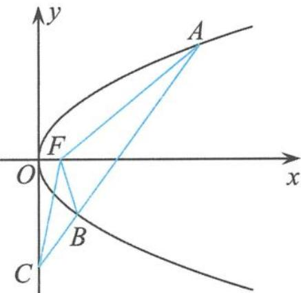  
图2.1-11

$$
\frac {| B F | + 1}{| A F | + 1}
$$

$$
\frac {\left| B F \right| ^ {2} + 1}{\left| A F \right| ^ {2} + 1}
$$

解答 如图 2.1-12, 过点 A 作准线的垂线, 垂足为 H, 交 y 轴于点 G; 过点 B 作准线的垂线, 垂足为 Q, 交 y 轴于点 P. 故

$$
\frac {S _ {\triangle B C F}}{S _ {\triangle A C F}} = \frac {| B C |}{| A C |} = \frac {| B P |}{| A G |} = \frac {| B Q | - 1}{| A H | - 1} = \frac {| B F | - 1}{| A F | - 1}.
$$

故选 A.

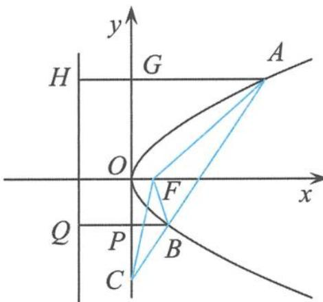

例 14 若椭圆 $\frac{x^{2}}{a^{2}} + \frac{y^{2}}{b^{2}} = 1 (a > b > 0)$ 的右焦点 $F(c, 0)$ 关于直线 $y = \frac{b}{c}x$ 的对称点 Q 在椭圆上，则椭圆的离心率是 \_\_\_\_.

图2.1-12

解答 如图 2.1-13, 设椭圆的左焦点为 $F'$ , 因为右焦点 F 到直线 $y = \frac{b}{c}x$ 的距离为

$$
\frac {| b c |}{\sqrt {b ^ {2} + c ^ {2}}} = \frac {b c}{a},
$$

所以

$$
\mid Q F \mid = \frac {2 b c}{a},
$$

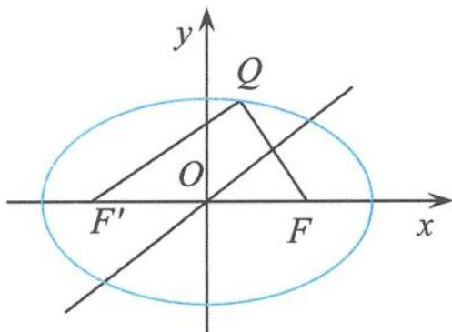  
图2.1-13

所以

$$
\mid Q F ^ {\prime} \mid = 2 \sqrt {c ^ {2} - \left(\frac {b c}{a}\right) ^ {2}} = \frac {2 c ^ {2}}{a}.
$$

由椭圆的定义得到

$$
\mid Q F \mid + \mid Q F ^ {\prime} \mid = \frac {2 b c}{a} + \frac {2 c ^ {2}}{a} = 2 a \Rightarrow b = c.
$$

所以

$$
e = \frac {\sqrt {2}}{2}.
$$

例 15 设双曲线 $x^{2}-\frac{y^{2}}{3}=1$ 的左、右焦点分别为 $F_{1}, F_{2}$ ，若点 P 在双曲线上，且 $\triangle F_{1}PF_{2}$ 为锐角三角形，则 $\left|PF_{1}\right|+\left|PF_{2}\right|$ 的取值范围是 \_\_\_\_.

解答 由于双曲线的对称性,不妨设点 P 在其右支上.因为

$$
\left\{ \begin{array}{l} | P F _ {1} | + | P F _ {2} | = t, \\ | P F _ {1} | - | P F _ {2} | = 2, \end{array} \right.
$$

所以

$$
\left\{ \begin{array}{l} | P F _ {1} | = \frac {t + 2}{2}, \\ | P F _ {2} | = \frac {t - 2}{2}, \end{array} \right.
$$

所以

$$
\left\{ \begin{array}{l} \left(\frac {t + 2}{2}\right) ^ {2} + \left(\frac {t - 2}{2}\right) ^ {2} > 4 ^ {2}, \\ \left(\frac {t - 2}{2}\right) ^ {2} + 4 ^ {2} > \left(\frac {t + 2}{2}\right) ^ {2}, \end{array} \right.
$$

所以

$$
2 \sqrt {7} <   t <   8.
$$

故 $\left|PF_{1}\right|+\left|PF_{2}\right|$ 的取值范围是 $(2\sqrt{7},8)$ .

例 16 已知椭圆 $\frac{x^{2}}{9} + \frac{y^{2}}{5} = 1$ 的左焦点为 F，点 P 在椭圆上且在 x 轴的上方，若线段 PF 的中点在以原点 O 为圆心、 $|OF|$ 为半径的圆上，则直线 PF 的斜率是 \_\_\_\_.

分析 设点 $P(x_{0}, y_{0})$ ，非常容易得到方程组 $\left\{\begin{aligned}5x_{0}^{2}+9y_{0}^{2}&=45,\\ (x_{0}-2)^{2}+(y_{0})^{2}&=16.\end{aligned}\right.$ 但到了计算的时候，发觉真的不太简单，很多同学解不出，甚至有人开始“怀疑人生”了。的确如此，如果这样算，将会陷入“此恨绵绵无绝期”的僵局，但是如果回归椭圆的定义来解答此问题，则将会是“柳暗花明又一村”的景象。

解答 如图 2.1-14, 设椭圆的右焦点为 $F'$ , 线段 PF 的中点为 M, 则

$$
a = 3, c = 2, | O M | = 2,
$$

所以

$$
\mid P F ^ {\prime} \mid = 4 = \mid F F ^ {\prime} \mid .
$$

由椭圆的定义得到

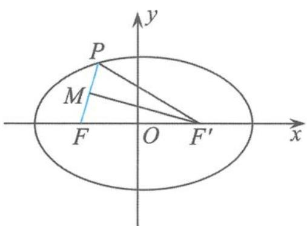

$$
| P F | = 2 a - 4 = 2.
$$

图2.1-14

连接 $F^{\prime}M$ ，则

$$
F ^ {\prime} M \perp P F.
$$

易得

$$
k _ {P F} = \sqrt {1 5}.
$$

例 17 已知椭圆 $C: \frac{x^{2}}{9} + \frac{y^{2}}{4} = 1$ ，点 M 与椭圆 C 的焦点不重合。若点 M 关于椭圆 C 的左、右焦点的对称点分别为 A, B，线段 MN 的中点 D 在椭圆 C 上，则 $|AN| + |BN| =$ \_\_\_\_.

解答 如图 2.1-15, 由三角形的中位线及椭圆的定义得

$$
\vert A N \vert + \vert B N \vert = 2 \vert D F _ {1} \vert + 2 \vert D F _ {2} \vert = 4 a = 1 2.
$$

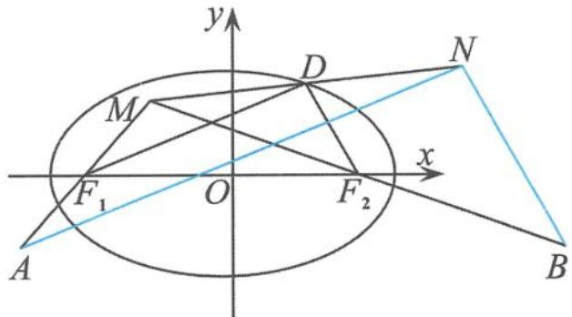  
图2.1-15

链接 已知椭圆 $\frac{x^2}{3} + y^2 = 1$ 的左、右顶点分别为 $A_1, A_2$ , 且 $B, C$ 为椭圆上不同的两点 (点 $B, C$ 位于 $y$ 轴右侧), 点 $B, C$ 关于 $x$ 的对称点分别为 $B_1, C_1$ , 直线 $BA_1, B_1A_2$ 相交于点 $P$ , 直线 $CA_1, C_1A_2$ 相交于点 $Q$ . 已知点 $M(-2,0)$ , 则 $|\overrightarrow{PM}| + |\overrightarrow{QM}| - |\overrightarrow{PQ}|$ 的最小值为 \_\_\_\_.

解答 如图 2.1-16, 设点 $P(x,y)$ , 由

$$
k _ {B A _ {1}} \cdot k _ {B A _ {2}} = e ^ {2} - 1 = - \frac {1}{3}
$$

得 $k_{PA_1} \cdot k_{PB_1} = \frac{1}{3}$ , 从而可得

$$
\frac {x ^ {2}}{3} - y ^ {2} = 1 (x > 0).
$$

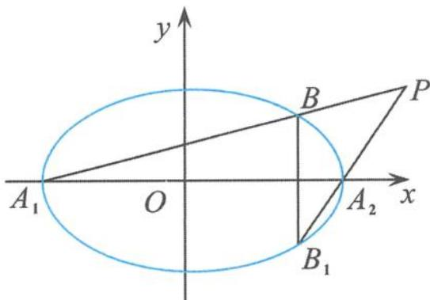  
图2.1-16

故点 $P$ 在双曲线 $\frac{x^2}{3} - y^2 = 1$ 的右支上. 同理可得, 点 $Q$ 也在双曲线的右支上, 点 $M$ 为其左焦点, 如图 2.1-17. 设 $M'$ 为双曲线 $\frac{x^2}{3} - y^2 = 1$ 的右焦点, 则由双曲线的定义得

$$
\begin{array}{r l} | \overrightarrow {P M} | + | \overrightarrow {Q M} | - | \overrightarrow {P Q} | & = (2 a + | \overrightarrow {P M ^ {\prime}} |) + (2 a + | \overrightarrow {Q M ^ {\prime}} |) - | \overrightarrow {P Q} | \\ & = 4 a + (| \overrightarrow {P M ^ {\prime}} | + | \overrightarrow {Q M ^ {\prime}} | - | \overrightarrow {P Q} |) \\ & \geqslant 4 a = 4 \sqrt {3}. \end{array}
$$

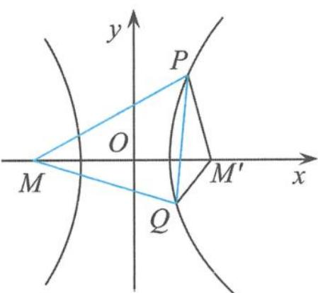  
图2.1-17

点评 这虽然是道小题,但却有大将之范,又是求轨迹又是求最值,

每一样都是难到大家心坎的问题,但有 $e^{2}-1$ 性质的帮忙(详见第四章与第五章),又有双曲线定义的鼎力相助,很快就“逢凶化吉”了,看来双曲线的定义功不可没.

波利亚在《怎样解题》中认为:“回到定义上来是一项重要的思维活动,并将这一重要思维活动列在解题表的显著位置加以阐述。”圆锥曲线的定义描述的是其最本质的几何特征,因此,利用定义解题能使代数运算得以简化.定义法是解答圆锥曲线问题的根本方法,是“以退求进、以简驭繁”策略下的一种解题模式,回归定义,回归本源,让概念走下“神坛”,这是我们学习数学的重要节点.

在非洲草原上有一种尖毛草, 在最初的半年内, 它几乎是草原上最矮的草, 但雨季一来, 它就像被施了魔法一样, 几天内就疯长到接近两米高. 有人决心探明其中的奥秘, 结果发现尖毛草在最初的半年内不是不长, 而是一直在长根部. 雨季前, 它在地面上只露出一寸, 但在地下扎的根却超过了 28 米! 根深才能苗壮, 枝繁叶茂、硕果飘香. 同样地, 数学概念的学习也如此, 只有深刻地理解了数学概念, 才能为我们学习夯实基础, 打开一个广阔的学习天地.

## 2.1.2 当圆锥曲线的定义遇到向量时

圆锥曲线的定义与平面向量完美结合后,华丽转身为一道道美轮美奂的数学问题,这样的问题往往具有较强的“杀伤力”,因为这类问题对数学核心素养的要求比较高,既要有强大的向量运算能力、数学推理作支撑,又要有几何的思想来通盘全局.

例 18 已知向量 a, b 满足 $\left|a\right|=1,\left|2a+b\right|+\left|b\right|=4$ ，则 $\left|a+b\right|$ 的取值范围是（）.
A. $[2-\sqrt{3},2]$ B. $[1,\sqrt{3}]$ C. $[2-\sqrt{3},2+\sqrt{3}]$ D. $[\sqrt{3},2]$

解答 设 P 为平面内的任意一点, $F_{1},F_{2}$ 是关于原点对称的两个点,设 $\overrightarrow{F_{1}O}=a,\overrightarrow{F_{2}P}=b$ ,则

$$
\overrightarrow {F _ {1} P} = \overrightarrow {F _ {1} F _ {2}} + \overrightarrow {F _ {2} P} = 2 a + b.
$$

根据题意

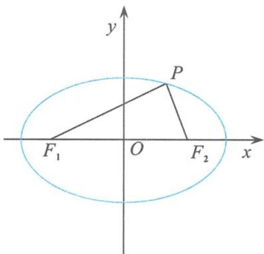

$$
\vert 2 \boldsymbol {a} + \boldsymbol {b} \vert + \vert \boldsymbol {b} \vert = \vert P F _ {1} \vert + \vert P F _ {2} \vert = 4.
$$

再由椭圆的定义得, 点 P 的轨迹是以 $F_{1}, F_{2}$ 为焦点的椭圆, 如图 2.1-18, 其方程为

图2.1-18

$$
\frac {x ^ {2}}{4} + \frac {y ^ {2}}{3} = 1,
$$

则 $|a+b|=|\overrightarrow{PO}|\in[b,a]$ ，从而

$$
\vert \boldsymbol {a} + \boldsymbol {b} \vert \in [ \sqrt {3}, 2 ].
$$

故选D.

点评 解答这类问题的关键是利用平面向量的代数运算、几何意义,脱去向量外衣就转化为我们熟悉的圆锥曲线问题了,然后利用圆锥曲线的定义、性质等知识就能轻松地解答问题.

温馨提示 利用圆锥曲线的定义来判断曲线的类型,不仅要分析其结构特征是否满足题意,而且还要关注其限制条件是否满足题意,否则解题就会出错.

例 19 已知平面向量 a, b, c 满足 $\left|a\right| = \left|b\right| = 2a \cdot b = 1$ ，且 $\left|c - 2a\right| + \left|c - b\right| = \sqrt{3}$ ，则 $\left|c - a\right| + \left|c + a\right|$ 的最小值为（）.
A. $\sqrt{3}$ B.2 C. $\sqrt{7}$ D.4

分析 乍一看椭圆定义的结构特征已经满足,很多同学会毫不犹豫地认为点 C 的轨迹是椭圆.这种错误很典型、很普遍.其实点 C 的轨迹是一条线段.

解答 如图 2.1-19, 设 $a=\overrightarrow{OA}, b=\overrightarrow{OB}, c=\overrightarrow{OC}$ , 则

$$
\langle \overrightarrow {O A}, \overrightarrow {O B} \rangle = \frac {\pi}{3}.
$$

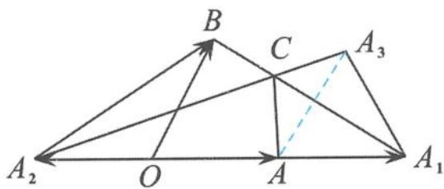

设 $\overrightarrow{OA_1} = 2a, \overrightarrow{OA_2} = -a$ ，则

图2.1-19

$$
\vert c - 2 a \vert + \vert c - b \vert = \vert \overrightarrow {A _ {1} C} \vert + \vert \overrightarrow {B C} \vert = \vert \overrightarrow {B A _ {1}} \vert = \sqrt {3}.
$$

所以点 C 的轨迹是线段 $BA_{1}$ . 作点 A 关于线段 $BA_{1}$ 的对称点 $A_{3}$ , 则

$$
| \boldsymbol {c} - \boldsymbol {a} | + | \boldsymbol {c} + \boldsymbol {a} | = | \overrightarrow {A C} | + | \overrightarrow {A _ {2} C} | = | \overrightarrow {A _ {3} C} | + | \overrightarrow {A _ {2} C} | \geqslant | \overrightarrow {A _ {2} A _ {3}} |.
$$

在 $\triangle A_{1}A_{2}A_{3}$ 中，由余弦定理得

$$
\vert \overrightarrow {A _ {2} A _ {3}} \vert = \sqrt {3 ^ {2} + 1 ^ {2} - 2 \times 3 \times 1 \times \cos 6 0 ^ {\circ}} = \sqrt {7}.
$$

故选 C.

引申 已知平面向量 a, b, c 满足 $a + b + c = 0$ ，若 b, c 的夹角为 $\alpha$ ，满足 $|a| = 1, |b| = k, |c| = 2 - k$ ，则 $\cos \alpha$ 的取值范围是 \_\_\_\_.

解答 如图 2.1-20, 设 $a=\overrightarrow{F_{1}F_{2}}$ , $b=\overrightarrow{F_{2}P}$ , $c=\overrightarrow{PF_{1}}$ , 则

$$
| \boldsymbol {b} | + | \boldsymbol {c} | = | \overrightarrow {F _ {2} P} | + | \overrightarrow {P F _ {1}} | = 2 > 1 = | \boldsymbol {a} |.
$$

由椭圆的定义得, 点 P 的轨迹是以 $F_{1}, F_{2}$ 为焦点的椭圆, 其方程为

$$
x ^ {2} + \frac {4 y ^ {2}}{3} = 1.
$$

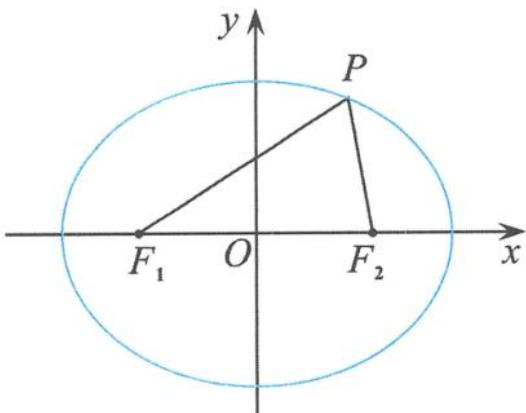  
图2.1-20

从而 $\angle F_{1}PF_{2}\in \left[0,\frac{\pi}{3}\right]$ ，所以

$$
\langle \pmb {b}, \pmb {c} \rangle = \pi - \angle F _ {1} P F _ {2} \in \left[ \frac {2 \pi}{3}, \pi \right],
$$

所以

$$
\cos \langle \pmb {b}, \pmb {c} \rangle \in \left[ - 1, - \frac {1}{2} \right].
$$

例 20 已知单位向量 e，向量 $b_{i}(i=1,2)$ ，满足 $|e-b_{i}|=e\cdot b_{i}$ ，且 $xb_{1}+yb_{2}=e$ ，其中 $x+y=1$ ，当 $|b_{1}-b_{2}|$ 取到最小时， $b_{1}\cdot b_{2}=(\quad)$ .
A. 0
B. 1
C. $\sqrt{2}$ D. -1

解答 设 $e=\overrightarrow{MF}, b_{1}=\overrightarrow{MA}, b_{2}=\overrightarrow{MB}$ ，则

$$
\overrightarrow {M F} = x \overrightarrow {M A} + y \overrightarrow {M B}.
$$

因为 $x + y = 1$ ，所以 A, F, B 三点共线。过点 M 作直线 $l \perp MF$ ，过点 A 作直线 l 的垂线，垂

足为 $A_{1}$ , 过点 $B$ 作直线 $l$ 的垂线, 垂足为 $B_{1}$ , 如图 2.1-21. 设

$$
\langle \overrightarrow {M F}, \overrightarrow {M A} \rangle = \theta .
$$

因为 $|e-b_{1}|=e\cdot b_{1}$ ，即 $|\overrightarrow{AF}|=|\overrightarrow{MF}||\overrightarrow{MA}|\cos\theta=|\overrightarrow{MA}|\cos\theta=|\overrightarrow{AA_{1}}|$ ，所以

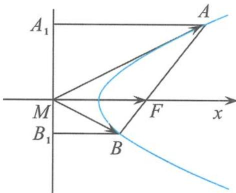

$$
| \overrightarrow {A F} | = | \overrightarrow {A A _ {1}} |.
$$

图2.1-21

同理，

$$
| \overrightarrow {B F} | = | \overrightarrow {B B _ {1}} |.
$$

所以点 A, B 在以直线 l 为准线、F 为焦点的抛物线上. 又因为 $\left|b_{1}-b_{2}\right|=\left|\overrightarrow{AB}\right|$ ，所以 $\left|\overrightarrow{AB}\right|_{\min}$ 为通径，此时 $b_{1}\perp b_{2}$ ，所以

$$
\boldsymbol {b} _ {1} \cdot \boldsymbol {b} _ {2} = 0.
$$

故选A.

例 21 已知平面向量 a, b, c 满足 $\left|a\right| = \left|b\right| = a \cdot b = 2$ ，且 $\left|c - tb\right|$ 的最小值为 $\left|c - a\right|$ ，则 $\left|a+\frac{b}{4}-c\right|+|c-a|$ 的最小值为（）.
A. $\sqrt{3}+1$ B.2 C. $\sqrt{3}$ D. $\sqrt{3}-1$

解答 如图 2.1-22, 设 $a=\overrightarrow{OA}, b=\overrightarrow{OB}, c=\overrightarrow{OC}$ , 易得 $\langle\overrightarrow{OA},\overrightarrow{OB}\rangle=60^{\circ}$ .

取

$$
\overrightarrow {A D} = \overrightarrow {O E} = \frac {1}{4} \boldsymbol {b},
$$

设 $a + \frac{1}{4} b = \overrightarrow{OD}$ ，过点 $C$ 作 $CH$ 垂直于 $OB$ 所在的直线于点 $H$ ，则 $|c - tb|$ 的最小值为 $|\overrightarrow{CH} |$ ，所以

图2.1-22

$$
| \overrightarrow {C H} | = | \overrightarrow {C A} |.
$$

根据抛物线的定义知点 C 的轨迹为以点 A 为焦点、OH 为准线的抛物线，过点 A 作 AG 垂直直线 OB 于点 G，所以

$$
\left| a + \frac {b}{4} - c \right| + | c - a | = | \overrightarrow {C D} | + | \overrightarrow {C A} | = | \overrightarrow {C D} | + | \overrightarrow {C H} | \geqslant | \overrightarrow {D H} | = | \overrightarrow {A G} | = | \overrightarrow {O A} | \sin 6 0 ^ {\circ} = \sqrt {3}.
$$

故选C.

例 22 已知平面向量 a, b, c 满足 $\left|a\right| = \left|b\right| = 1, a \cdot b = \frac{1}{2}, a \cdot c = 2$ ，若对于任意的向量 d 均有 $\left|d - c\right|$ 的最小值为 $\sqrt{2}\left|d - a\right|$ ，则 $\left|d - a\right| + \left|d - b\right|$ 的取值范围是 \_\_\_\_.

解答 令 $a = \overrightarrow{OA}, b = \overrightarrow{OB}, c = \overrightarrow{OC}, d = \overrightarrow{OD}$ , 设 $A(1,0), B\left(\frac{1}{2}, \frac{\sqrt{3}}{2}\right), D(x,y)$ , 由 $a \cdot c = 2$ 得点 $C$ 在直线 $x = 2$ 上 (如图 2.1-23).

因为对于任意向量 d 都有 $\left|d-c\right|$ 的最小值为 $\sqrt{2}\left|d-a\right|$ ，所以点 D 到直线 x=2 的距离为 $\sqrt{2}\left|DA\right|$ .

再由椭圆的第二定义得, 点 D 的轨迹是以 A 为右焦点、x=2 为右准线的椭圆, 其方程为

$$
\frac {x ^ {2}}{2} + y ^ {2} = 1.
$$

图2.1-23

设 $A'(-1,0)$ 为其左焦点，则

$$
| \boldsymbol {d} - \boldsymbol {a} | + | \boldsymbol {d} - \boldsymbol {b} | = | \overrightarrow {A D} | + | \overrightarrow {B D} | = (2 \sqrt {2} - | D A ^ {\prime} |) + | D B | = 2 \sqrt {2} - (| D A ^ {\prime} | - | D B |).
$$

又因为

$$
\mid | D A ^ {\prime} | - | D B | \mid \leqslant | B A ^ {\prime} | = \sqrt {3},
$$

所以

$$
| \boldsymbol {d} - \boldsymbol {a} | + | \boldsymbol {d} - \boldsymbol {b} | = | \overrightarrow {A D} | + | \overrightarrow {B D} | \in [ 2 \sqrt {2} - \sqrt {3}, 2 \sqrt {2} + \sqrt {3} ].
$$

点评 只缘题在向量中,不识曲线真面目.对于平面向量与圆锥曲线定义的综合问题,千万不能被平面向量的外表形式所左右,迷惑了双眼,我们首要做的事情就是要通过平面向量的运算把向量的“外壳”剥去,暴露问题的本源.

向量版的圆锥曲线定义

已知平面向量 a, b, p，若 $\left|a\right|=m,\left|b\right|=n,\left\langle a,b\right\rangle=\theta$ ，且满足 $\left|p-tb\right|$ 的最小值为 $\frac{1}{e}\left|p-a\right|$ ，则当 0<e<1 时，点 P 的轨迹为椭圆；
当 e>1 时，点 P 的轨迹为双曲线；
当 e=1 时，点 P 的轨迹为抛物线.

## 2.2 圆锥曲线可以“折”出来

我们将一张纸片折叠一次,纸片上会留下一条折痕,所得折痕是一条直线.如果在纸上折出很多折痕直线以后,纸上能显现出一条曲线的轮廓,使得该曲线和每一条折痕直线都相切,我们就说是“折”出了这条曲线.我们把一条曲线的所有切线组成的集合,叫作该曲线的切线族.因此,我们所说的“折”出一条曲线实际上就是指折出该曲线的切线族.其实,折痕线本质上是圆锥曲线的包络线.

例 1 （1）如图 2.2-1，一张圆形纸片的圆心为点 O，点 Q 是圆内异于点 O 的定点，A 是圆周上一点。把纸片折叠使点 A 与点 Q 重合，然后展平纸片，折痕与直线 OA 交于点 P。当点 A 运动时，点 P 的轨迹是（）。
A. 圆
B. 椭圆
C. 双曲线
D. 抛物线

  
图2.2-1

(2)如图 2.2-2,一张圆形纸片的圆心为点 O, Q 是圆外异于点 O 的定点, A 是圆周上一点. 把纸片折叠使点 A 与 Q 重合, 然后展平纸片, 折痕与直线 OA 交于点 P. 当点 A 运动时, 点 P 的轨迹是( ). 
A. 圆 
B. 椭圆 
C. 双曲线 
D. 抛物线

  
图2.2-2

(3)如图2.2-3,把长方形纸片ABCD以EF为折痕折叠(点E在边AB上,点F在边BC或CD上),使每次折叠后点B都落在AD上.此时,将B记为 $B'$ ,然后展平纸片,过点 $B'$ 垂直于AD的折痕与折痕EF交于点P,则点P的轨迹是( ).A.圆 B.椭圆C.双曲线 D.抛物线

  
图2.2-3

解答 (1)设圆的半径为 $R$ , 由题意知, 折痕是 $AQ$ 的中垂线, 所以 $|PA| = |PQ|$ . 从而 $|PO| + |PQ| = |PO| + |PA| = R > |OQ|$ . 由椭圆的定义知, 点 $P$ 的轨迹是以 $O, Q$ 为焦点的椭圆. 故选 B.

(2)设圆的半径为 $R$ , 由题意知, 折痕是 $AQ$ 的中垂线, 所以 $|PA| = |PQ|$ . 从而 $||PQ| - |PO|| = ||PO| - |PA|| = R < |OQ|$ . 由双曲线的定义知点 $P$ 的轨迹是以 $O, Q$ 为焦点的双曲线. 故选 C.

(3)由题意知 $|PB| = |PB'\mid$ , 所以点 $P$ 在以 $B$ 为焦点、 $AD$ 为准线的抛物线上. 故选 D.

引申 1 有一矩形纸片 ABCD, 按如图 2.2-4 所示的方法进行任意折叠, 使每次折叠后点 B 都落在边 AD 上, 将点 B 的落点记为点 $B'$ , 其中 EF 为折痕, 点 F 也可落在边 CD 上, 过点 $B'$ 进行折叠, 使折痕 $B'H \parallel CD$ , 交 EF 于点 H, 则点 H 的轨迹为 ( ).

A. 圆的一部分
B. 椭圆的一部分
C. 双曲线的一部分
D. 抛物线的一部分

  
图2.2-4

解答 由题意知 $|HB| = |HB'|$ , 即点 $H$ 到定点 $B$ 与到直线 $AD$ 的距离相等. 由抛物线的定义知, 点 $H$ 的轨迹为抛物线的一部分. 故选 D.

引申 2 在平面内, 已知点 $A$ 为圆 $O$ 上的一个动点, $Q$ 为定圆 $O$ 外的一个定点. 过点 $A$ 把纸片折叠, 使点 $Q$ 与点 $Q'$ 重合, 然后展平纸片. 设折痕为 $l$ , 过点 $Q'$ 把纸片折叠, 使折痕 $l' \parallel OA$ , 然后展平纸片. 若折痕 $l$ 与折痕 $l'$ 交于点 $P$ , 当点 $A$ 运动时, 点 $P$ 的轨迹是 ( ). A. 抛物线 B. 双曲线 C. 椭圆 D. 圆

解答 如图 2.2-5, 设定圆 O 的半径为 R, 设 $PQ'$ 的延长线与 QO 的延长线交于点 C. 因为

$CP \parallel OA$ , 且 $A$ 为 $QQ'$ 中点, 所以 $OA$ 为 $\triangle QQ'C$ 的中位线. 因此

$$
\mid Q ^ {\prime} C \mid = 2 \mid O A \mid .
$$

又因为 $|PQ|=|PQ'|$ ，从而

$$
\vert P C \vert - \vert P Q \vert = \vert P C \vert - \vert P Q ^ {\prime} \vert = \vert Q ^ {\prime} C \vert = 2 \vert O A \vert <   \vert C Q \vert
$$

所以点 P 的轨迹是双曲线. 故选 B.

点评 圆锥曲线在生活中无处不在,无时不有,但是同学们总是喜欢把圆锥曲线的学习看成是纯粹的数学研究,似乎很高、

图2.2-5

大、上,所以圆锥曲线的学习就显得枯燥难懂,甚至乏味,但“折”出来的圆锥曲线,不仅接地气,具有浓浓的生活气息,而且能较好地还原圆锥曲线本来所特有的那份精彩.

## 2.3 圆锥曲线可以“切”出来

教材的章头语,对于圆锥曲线的引入是这样描述的:

我们知道,用一个垂直于圆锥的轴的平面截圆锥,截口曲线(截面与圆锥侧面的交线)是一个圆,如果改变圆锥的轴与截平面所成的角,那么会得到怎样的曲线呢?

用一个不垂直于圆锥的轴的平面截圆锥, 当圆锥的轴与截面所成的角不同时, 可以得到不同的截口曲线, 它们分别是椭圆、抛物线和双曲线. 我们通常把椭圆、抛物线、双曲线统称为圆锥曲线.

教材就此打住,没有具体量化,难以精准判断曲线的类型,所以我们有必要进行简单的拓展.其实,可以有结论(证明略):

如图 2.3-1, 设圆锥的轴截面顶角为 $2\theta$ , 圆锥的轴与截面所成的角为 $\alpha$ , 其中 $\alpha, \theta \in (0, \frac{\pi}{2})$ .

当 $\alpha > \theta$ 时，截口曲线为椭圆；

当 $\alpha=\theta$ 时，截口曲线为抛物线；

当 $\alpha<\theta$ 时，截口曲线为双曲线.

  
图2.3-1

例 1 已知正方体 $ABCD-A_{1}B_{1}C_{1}D_{1}$ ，Q 是平面 ABCD 内的动点，若 $D_{1}Q$ 与 $D_{1}C$ 所成的角为 $\frac{\pi}{4}$ ，则动点 Q 的轨迹是（）.
A. 椭圆
B. 双曲线
C. 抛物线
D. 圆

解答 如图 2.3-2, 因为 $D_{1}Q$ 与 $D_{1}C$ 所成的角为 $\frac{\pi}{4}$ , 所以点 Q 在以 $D_{1}C$ 为轴的圆锥曲面上, 且半顶角

$$
\theta = \frac {\pi}{4}.
$$

设圆锥的轴 $D_{1}C$ 与截面 ABCD 所成的角为 $\alpha$ ，则

$$
\alpha = \frac {\pi}{4}.
$$

因此

图2.3-2

$$
\alpha = \theta ,
$$

动点 Q 的轨迹是抛物线.

故选C.

例 2 如图 2.3-3, 斜线段 AB 与平面 $\alpha$ 所成的角为 $60^{\circ}$ , B 为斜足, 平面 $\alpha$ 上的动点 P 满足 $\angle PAB = 30^{\circ}$ , 则点 P 的轨迹是( ). A. 直线 B. 抛物线 C. 椭圆 D. 双曲线的一支

  
图2.3-3

解答 由题意可知, 当点 P 在空间运动时, 满足条件的 AP 绕 AB 旋转形成一个圆锥, 圆锥的半顶角

$$
\theta = 3 0 ^ {\circ},
$$

平面 $\alpha$ 与圆锥的轴所成角

$$
\alpha = 6 0 ^ {\circ}.
$$

故轴面角大于半顶角,即

$$
\alpha > \theta ,
$$

所以所得图形为椭圆.

故选 C.

点评 解答这类问题的基本步骤:(1)构造一个圆锥;(2)求出圆锥的半顶角与轴面角;(3)比较半顶角与轴面角的大小;(4)下结论.

所以关键就在于求线面角.

引申 在正方体 $ABCD-A_{1}B_{1}C_{1}D_{1}$ 中, M 是线段 $BC_{1}$ 的中点, 点 P 是平面 $A_{1}BCD_{1}$ 内的动点. 记直线 MP 与 $CC_{1}$ 所成的角为 $\frac{\pi}{6}$ , 则点 P 的轨迹是 ( ).

A. 圆
B. 椭圆
C. 双曲线
D. 抛物线

解答 如图2.3-4, 设线段 $BC$ 的中点为 $N$ , 则 $MN \parallel CC_{1}$ , 所以 $MP$ 与 $MN$ 所成的角为 $\frac{\pi}{6}$ , 故点 $P$ 在以 $MN$ 为轴的圆锥曲面上, 圆锥的半顶角为 $\frac{\pi}{6}$ , 易求 $CC_{1}$ 与平面 $A_{1} BCD_{1}$ 所成的角为 $\frac{\pi}{4}$ , 所以轴面角 $\frac{\pi}{4}$ 大于半顶角 $\frac{\pi}{6}$ , 从而点 $P$ 的轨迹是椭圆, 故选B.

  
图2.3-4

例 3 在正方体 $ABCD-A_{1}B_{1}C_{1}D_{1}$ 中, 点 Q 为对角面 $A_{1}BCD_{1}$ 内的动点, 点 M, N 分别在直线 AD, AC 上自由滑动, 直线 DQ 与 MN 所成角的最小值为 $\theta$ , 若点 Q 的轨迹为双曲线的一部分, 则 $\theta$ 可能的值为(). A. $30^{\circ}$ B. $45^{\circ}$ C. $60^{\circ}$ D. $75^{\circ}$

解答 如图 2.3-5, 直线 DQ 与 MN 所成角的最小值是直线 DQ 与平面 ABCD 所成角, 即

所以直线 DQ 与平面 ABCD 的法向量 $D_{1}D$ 所成的角为 $\frac{\pi}{2}-\theta$ ，即点 Q 在以 $D_{1}D$ 为轴的圆锥曲面上，半顶角为 $\frac{\pi}{2}-\theta$ ，

而直线 $DD_{1}$ 与平面 $A_{1}BCD_{1}$ 所成的角为 $\frac{\pi}{4}$ ，即圆锥的轴与截面所成的角 $\alpha = \frac{\pi}{4}$ .

图2.3-5

因为点 Q 的轨迹为双曲线的一部分, 所以 $\frac{\pi}{4} < \frac{\pi}{2} - \theta$ , 即 $0 < \theta < \frac{\pi}{4}$ .

引申 在正方体 $ABCD-A_{1}B_{1}C_{1}D_{1}$ 中, 点 M, N 分别是直线 CD, AB 上的动点, 点 P 是 $\triangle A_{1}C_{1}D$ 内的动点 (不包括边界), 记直线 $D_{1}P$ 与 MN 所成的角为 $\theta$ , 若 $\theta$ 的最小值为 $\frac{\pi}{3}$ , 则点 P 的轨迹是 ( ).

A. 圆的一部分
B. 椭圆的一部分
C. 抛物线的一部分
D. 双曲线的一部分

解答 如图 2.3-6, 直线 $D_{1}P$ 与 MN 所成角的最小值是直线 $D_{1}P$ 与平面 ABCD 所成的角, 即直线 $D_{1}P$ 与平面 ABCD 所成的角为 $\frac{\pi}{3}$ ,

所以直线 $D_{1}P$ 与平面 ABCD 的法向量 $D_{1}D$ 所成的角为 $\frac{\pi}{6}$ ，即点 P 在以 $D_{1}D$ 为轴的圆锥

曲面上, 半顶角 $\theta=\frac{\pi}{6}$ .

而直线 $D_{1}D$ 与平面 $DA_{1}C_{1}$ 所成角的正弦值为 $\frac{\sqrt{3}}{3}$ , 即圆锥的轴与截面所成的角为 $\alpha$ , 且 $\sin \alpha = \frac{\sqrt{3}}{3}$ .

因此 $\alpha > \theta$ ，点 P 的轨迹为椭圆的一部分。

图2.3-6

故选 B.

点评 解决这类问题的核心就是构造一个圆锥,抓牢两个角(半顶角、轴面角),然后比较角的大小就可以了.

对于圆锥曲线的定义,当然还可以从其他角度进行解读.比椭圆为例,用一个平面斜截圆柱得到的截口曲线是椭圆.

例 4 如图 2.3-7, AB 是平面 $\alpha$ 的斜线段, A 为斜足, 若点 P 在平面 $\alpha$ 内运动, 使得 $\triangle ABP$ 的面积为定值, 则动点 P 的轨迹是( ). 
A. 圆
B. 椭圆
C. 一条直线
D. 两条平行直线

  
图2.3-7

分析 初看这道试题,好像无从下手.其实,由于 $\triangle ABP$ 的面积为定值,易得动点 $P$ 到直线 $AB$ 的距离保持不变,所以动点 $P$ 在以 $AB$ 为轴的圆柱体的表面上.又得动点 $P$ 在平面 $\alpha$ 内,所以问题就转化为圆柱被不平行于轴与底面的平面所截的截面问题,用平面去斜截圆柱,截得的交线当然是椭圆,因此选B.

点评 如果我们建立坐标系进行直接计算的话,就陷入了一种非常被动、烦琐的尴尬地步.其实,对于一道选择题来说,“小题不必大做”是一个重要的原则.

本章是从不同的视角、不同的层次帮助我们理解圆锥曲线的定义,剖析圆锥曲线内在的本质.定义不是“食之无味,弃之可惜”的鸡肋,而是解题的重要依据与支撑,回归定义不是简单地记住定义,也不是捏着课本“这张旧船票”,引吭高歌到“能否登上高考的客船”,更不是简单地重复着“昨天的故事”,而是“请君莫奏前朝曲,听唱新翻杨柳枝”.通过回归定义,我们不断地明晰概念的内涵和把握数学知识的结构,不断地形成和完善对数学方法的认识与理解,不断地提升解题的理性思维能力.只有从不同的角度、多层次地去理解定义,才能真正触及数学概念的本质.

当我们站在系统的高度去理解知识的时候,发现知识之间既盘根错节又浑然一体,而到后来,知识好像在手心里,不再是一堆杂乱无章的瓦砾、一片望而生畏的戈壁滩(孙维刚语).从而我们的学习达到“联珠成线”“织线成网”“拎起来成条线,撒下来铺满地”的境界.

由此看来,圆锥曲线果真与众不同,就连平平淡淡的定义形式都能这么的精彩纷呈,是不是特想欣赏圆锥曲线的美了?是不是特想揭示圆锥曲线的秘密了?但定义只是欣赏圆锥曲线性质的入场券,我们还需要哪些武装设备呢?请看下章分解.

## 思考题

1. 在同一平面内, $A, B$ 为两个不同的定点, 圆 $A$ 和圆 $B$ 的半径都为 $r$ , 射线 $A B$ 交圆 $A$ 于点 $P$ , 过点 $P$ 作圆 $A$ 的切线 $l$ , 当 $r \left( r \geqslant \frac{1}{2} | A B | \right)$ 变化时, $l$ 与圆 $B$ 的公共点的轨迹是 ( )。
A. 圆
B. 椭圆
C. 双曲线的一支
D. 抛物线

2. 已知点 $A(2, -1), P$ 为椭圆 $C: \frac{x^2}{4} + \frac{y^2}{3} = 1$ 上的动点, $B$ 是圆 $C_1: (x - 1)^2 + y^2 = 1$ 上的动点, 则 $|PB| - |PA|$ 的最大值为 ( )。
A. $\sqrt{5}$ B. $\sqrt{2} + 1$ C. 3
D. $5 - \sqrt{10}$

3. 如图, 在正方体 $ABCD-A_{1}B_{1}C_{1}D_{1}$ 中, 点 $P$ 是侧面 $BB_{1}C_{1}C$ 内的动点, 若点 $P$ 到直线 $BC$ 与到直线 $C_{1}D_{1}$ 的距离相等, 则动点 $P$ 的轨迹所在的曲线是(   ). A. 直线 B. 圆 C. 双曲线 D. 抛物线

4. 已知点 $P$ 是圆 $x^{2} + y^{2} = 4$ 上的动点, 直线 $l$ 是圆在点 $P$ 处的切线, 动抛物线以直线 $l$ 为准线且恒经过定点 $A(-1,0)$ 和 $B(1,0)$ , 则抛物线焦点 $F$ 的轨迹是 ( ). A. 圆 B. 椭圆 C. 双曲线 D. 抛物线

(第 3 题)

5. 在三棱锥 $P-ABC$ 中, 已知 $PA = PB = PC = \sqrt{2}$ , $AB = AC = BC = \sqrt{3}$ , 点 $Q$ 为 $\triangle ABC$ 所在平面内的动点, 若 $PQ$ 与 $PA$ 所成的角为定值 $\theta, \theta \in \left(0, \frac{\pi}{4}\right)$ , 则动点 $Q$ 的轨迹是 ( ).

A. 圆
B. 椭圆
C. 双曲线
D. 抛物线

6. 如图, $AB$ 是平面 $\alpha$ 外固定的斜线段, $B$ 为斜足。若点 $C$ 在平面 $\alpha$ 内运动, 且 $\angle CAB$ 等于直线 $AB$ 与平面 $\alpha$ 所成的角, 则动点 $C$ 的轨迹是 ( )。
A. 圆
B. 椭圆
C. 双曲线
D. 抛物线

  
(第6题)

7. 设 $m$ 是平面 $\alpha$ 内的一条定直线, $P$ 是平面 $\alpha$ 外的一个定点, 动直线 $n$ 经过点 $P$ 且与定直线 $m$ 成 $30^{\circ}$ 角, 则直线 $n$ 与平面 $\alpha$ 的交点 $Q$ 的轨迹是 ( ). A. 圆 B. 椭圆 C. 双曲线 D. 抛物线

8. 已知双曲线 $\frac{x^{2}}{a^{2}} - \frac{y^{2}}{b^{2}} = 1 (a > 0, b > 0)$ 的左、右焦点分别为 $F_{1}, F_{2}$ ，过右焦点 $F_{2}$ 且与 x 轴垂直的直线与双曲线两条渐近线分别交于 A, B 两点。若 $\triangle ABF_{1}$ 为等腰直角三角形，且 $|AB| = 4\sqrt{5}$ ，点 $P(x, y) (x > 0)$ 在双曲线上， $M(\sqrt{5}, \sqrt{5})$ ，则 $|PM| + |PF_{2}|$ 的最小值为（）。
A. $\sqrt{5}-1$ B. 2
C. $2\sqrt{5}-2$ D. 3

9. 已知向量 a, b 满足 $\left|a\right|=2, a \cdot b=2\left|a-b\right|$ ，则当 a, b 的夹角最大时， $a \cdot b=(\quad)$ .
A. 0
B. 2
C. $2\sqrt{2}$ D. 4

10. 已知不共线的向量 $a, b$ 满足 $|a| = |b| = 1$ , 且 $|a + xb| + |a - xb| = 4$ , 向量 $a, b$ 的夹角为 $\theta$ , 若 $\frac{\sqrt{14}}{2} \leqslant x \leqslant \frac{\sqrt{15}}{2}$ , 则 $|\cos \theta|$ 的最小值是 \_\_\_\_.

11. 如图, 某绿色蔬菜种植基地在 $A$ 处, 现要把此处生产的蔬菜沿道路 $AA_{1}$ 或 $AA_{2}$ 运送到形状为四边形区域 $A_{1} A_{2} A_{3} A_{4}$ 的农贸市场中去, 要求在农贸市场中确定一条界线, 使位于界

线一侧的点沿道路 $AA_{1}$ 运送蔬菜较近, 而另一侧的点沿道路 $AA_{2}$ 运送蔬菜较近, 则该界线所在的曲线为( ). A. 圆 B. 椭圆 C. 双曲线 D. 抛物线

12. (多选题) 两千多年前, 古希腊大数学家阿波罗尼斯发现, 用一个不垂直于圆锥的轴的平面截圆锥, 其截口曲线是圆锥曲线 (如图). 已知圆锥轴截面的顶角为 $2 \theta$ , 一个不过圆锥顶点的平面与圆锥的轴的夹角为 $\alpha$ . 当 $\theta < \alpha$

(第 11 题)

$<\frac{\pi}{2}$ 时,截口曲线为椭圆;当 $\alpha=\theta$ 时,截口曲线为抛物线;当 $0<\alpha<\theta$ 时,截口曲线为双曲线.在长方体 $ABCD-A_{1}B_{1}C_{1}D_{1}$ 中,AB=AD=1, $AA_{1}=2$ ,点P在平面ABCD内,下列说法正确的是().

A. 若点 $P$ 到直线 $CC_{1}$ 的距离与点 $P$ 到平面 $BB_{1}C_{1}C$ 的距离相等, 则点 $P$ 的轨迹为抛物线  
B. 若点 $P$ 到直线 $CC_{1}$ 的距离与点 $P$ 到直线 $AA_{1}$ 的距离之和等于 4 , 则点 $P$ 的轨迹为椭圆  
C. 若 $\angle BD_{1}P = 45^{\circ}$ , 则点 $P$ 的轨迹为抛物线  
D. 若 $\angle BD_{1}P = 60^{\circ}$ , 则点 $P$ 的轨迹为双曲线

  
(第 12 题)

13.(多选题)如图,已知圆 O 的半径为定长 r,A 是圆 O 所在平面内的一个定点,P 是圆上的任意一点,线段 AP 的垂直平分线 l 与直线 OP 相交于点 Q.当点 P 在圆上运动时,下列判断正确的是( ). A. 点 Q 的轨迹可能是椭圆 B. 点 Q 的轨迹可能是双曲线的一支 C. 点 Q 的轨迹可能是抛物线 D. 点 Q 的轨迹可能是一个定点

## 举目仰望星空,回首又见炊烟

——圆锥曲线可以这样运算

完善的思想方法犹如北极星,使人们找到正确的道路.——波利亚

从一则故事说起:有三只猎狗追一只土拨鼠,土拨鼠钻进了一个树洞.这个树洞只有一个出口,可不一会儿,从树洞里钻出一只兔子.兔子飞快地向前跑,并爬上一棵大树.兔子在树上,仓皇中没站稳,掉了下来,砸晕了正仰头看的三只猎狗,最后,兔子终于逃脱了.这个故事你发现有什么问题吗?有人可能会说兔子不会爬树,有人可能会说一只兔子不可能同时砸晕三只猎狗,等等.其实,对于这个问题,我们往往被“兔子”干扰了,我们更应该关注的是土拨鼠去哪儿了?解题也一样,我们不能盲目地解题,而应该关注如何解题,如何优化我们解题的思维过程等.在解题中,思维量与运算量是一对跷跷板,只有不断优化我们的思维,才能不断简化我们的运算.“数学运算是数学的童子功”(章建跃语),数学运算是数学核心素养的重要组成部分,运算几乎渗透到数学的每一个角落.圆锥曲线问题更是离不开算,但我们不能死算,更不能往死里算,学会少算多思,拒绝暴力运算.

“得圆锥曲线者得高分”, 此话道出了圆锥曲线在高考中具有无可替代的地位, 可谓风光尽显, 既让无数同学领略了其独特的魅力, 也让同学们接受其颇具特色的挑战性. 在考试中很多同学经常感到“一筹莫展, 无从下手”, 很难找到解题的突破口; 或者有了一个解题方案, 但在具体操作过程中又遇到这样、那样的困难, 结果不是半途而废, 就是很难走到“理想的彼岸”. 有人调侃说“代数繁, 立几难, 解几题目算不完”, 这也从某一个角度说明了解析几何的特点: 有很大的运算量. 解析几何是用代数方法研究几何问题的学科, 是一门精打细算的学科, 计算是其痛苦而又无奈的选择,所以解析几何对同学们的学习来讲是一道难以绕开的坎,是软肋更是硬伤,对我们教师的教学来说同样是“心中永远的痛”.我们学习圆锥曲线不仅要“use your head”,而且要“use your hand”,这里 head 说明学习圆锥曲线是需要一种动脑的思维能力(脑力活动),hand 则说明学习圆锥曲线需要一种动手的运算能力(体力活动),可以说学习圆锥曲线需要脑力活动与体力活动两者兼用.解决圆锥曲线问题是需要算,但千万不能盲目地算,重心要放在寻找简化代数运算的方法上.所以,我们有必要对圆锥曲线问题的解题方法进行系统总结整理,从繁杂的运算中解脱出来,这样才能有闲情雅致去欣赏圆锥曲线的美,否则,圆锥曲线的美就会被运算的海洋所淹没,欣赏圆锥曲线的美也许就变成了一种痛苦的回忆.我们这章主要梳理简化圆锥曲线问题中运算量的基本方法.

## 3.1 设而不求,妙在其中

圆锥曲线图形的美丽和运算的苦涩成就了其数学研究中不老的神话,如何在运算中突出重围,演绎精彩,这是我们不得不处理的数学问题.解决圆锥曲线问题要用解析法思想,它的最大好处就在于通过代数方法将几何问题的解决变成统一的模式,解题方法变得有章可循,解题过程变得井然有序,十分优雅而从容,而且能按一定的步骤或程序来推导、求解.但其中的计算过程往往是艰难与复杂的,特别是很多问题的解答都需要依赖于交点坐标,而直接求交点坐标往往很烦琐,也是我们处理圆锥曲线问题所忌讳的.很多圆锥曲线问题如果直接求出交点坐标,必定带来大量的运算.如何避免求交点,从而简化计算,也就成了处理圆锥曲线问题的难点与关键所在.对一些未知量只需设出,而不必求出其值,我们称这种思想方法为设而不求.

例 1 已知 P 是椭圆 $\frac{x^{2}}{25} + \frac{y^{2}}{16} = 1$ 上位于第一象限内的任一点, 过点 P 作圆 $x^{2} + y^{2} = 16$ 的两条切线 PA, PB (点 A, B 为切点), 直线 AB 分别交 x 轴、y 轴于点 M, N, 则 $\triangle MON$ 的面积的最小值是 \_\_\_\_. (O 是坐标原点)

解答 依据题意,可设点

$$
P (5 \cos \theta , 4 \sin \theta) \left(0 <   \theta <   \frac {\pi}{2}\right),
$$

$A(x_{1},y_{1}),B(x_{2},y_{2})$ ，于是，可得

$$
\begin{array}{l} {\text {   切线   } P A: x _ {1} x + y _ {1} y = 1 6,} \\ {\text {   切线   } P B: x _ {2} x + y _ {2} y = 1 6.} \end{array}
$$

因为点 P 是两条切线的公共点, 所以

$$
\left\{ \begin{array}{l} x _ {1} \cdot 5 \cos \theta + y _ {1} \cdot 4 \sin \theta = 1 6, \\ x _ {2} \cdot 5 \cos \theta + y _ {2} \cdot 4 \sin \theta = 1 6. \end{array} \right.
$$

从而直线 $x \cdot 5\cos\theta + y \cdot 4\sin\theta = 16$ 过点 A, B，而过点 A, B 的直线有且只有一条，故得到直线 AB: $x \cdot 5\cos\theta + y \cdot 4\sin\theta = 16$ .

所以

$$
S _ {\triangle M O N} = \frac {1}{2} \cdot \frac {4}{\sin \theta} \cdot \frac {1 6}{5 \cos \theta} = \frac {6 4}{5 \sin 2 \theta} \geqslant \frac {6 4}{5},
$$

当 $\theta = \frac{\pi}{4}$ 时，等号成立. 因此， $\triangle MON$ 的面积的最小值是 $\frac{64}{5}$ .

点评 常言道一物降一物,对于圆锥曲线问题的解决,同样需要一法解一类,需要有一种正确的数学思想方法来引领我们解题,能帮助我们精准地寻找到解题的方向.设而不求的方法就是这样一种处理圆锥曲线问题的最基本的方法,也是我们解题的一种重要策略.“明修栈道,暗度陈仓”所表达的也是这么一种思想.利用设而不求的方法解决圆锥曲线问题能巧妙地回避求交点坐标,化繁为简,往往具有事半功倍之功效.那么,在解答圆锥问题中如何处理才能真正达到设而不求的最大效果呢?需要借助于哪些常见途径呢?在使用过程中又应该注意哪些问题呢?

## 3.1.1 基本转化法

解析几何的基本思想是用代数的手段来研究几何问题.这里很自然涉及两个问题:一是几何关系的代数化表示;二是代数形式的几何意义.

所以,我们有解析几何解题的“三部曲”:

①首先,将几何问题代数化;

②其次,将代数问题坐标化(坐标化的终极目标是得到纯 $x_{1} + x_{2}, x_{1}x_{2}$ 或纯 $y_{1} + y_{2}, y_{1}y_{2}$ 的代数式);

③最后,利用韦达定理代入,化简得出答案.

例2 设椭圆 $C: \frac{x^2}{2} + y^2 = 1$ 的右焦点为 $F$ , 过点 $F$ 的直线 $l$ 与椭圆 $C$ 交于 $A, B$ 两点, 点 $M$ 的坐标为 $(2,0)$ . 设 $O$ 为坐标原点, 证明: $\angle OMA = \angle OMB$ .

证明 当直线 l 与 x 轴重合时, 或当直线 l 与 x 轴垂直时, 易证

$$
\angle O M A = \angle O M B.
$$

当直线 l 与 x 轴不重合也不垂直时,需要把几何量“ $\angle OMA = \angle OMB$ ”代数化.

第一步,代数化是把角的问题转化为斜率问题,只要证明

$$
k _ {M A} + k _ {M B} = 0.
$$

第二步, 设 $A(x_{1}, y_{1}), B(x_{2}, y_{2})$ . 把 $k_{MA} + k_{MB} = 0$ 坐标化, 即证明

$$
k _ {M A} + k _ {M B} = \frac {y _ {1}}{x _ {1} - 2} + \frac {y _ {2}}{x _ {2} - 2} = 0.
$$

第三步,进一步坐标化,设直线 l 的方程为

$$
y = k (x - 1) (k \neq 0),
$$

将 $y = k(x - 1)$ 代入 $\frac{x^2}{2} + y^2 = 1$ ，消去 $y$ 并整理得

$$
(2 k ^ {2} + 1) x ^ {2} - 4 k ^ {2} x + 2 k ^ {2} - 2 = 0.
$$

由韦达定理得

$$
x _ {1} + x _ {2} = \frac {4 k ^ {2}}{2 k ^ {2} + 1}, x _ {1} x _ {2} = \frac {2 k ^ {2} - 2}{2 k ^ {2} + 1}.
$$

进一步证明

$$
k _ {M A} + k _ {M B} = k \frac {2 x _ {1} x _ {2} - 3 (x _ {1} + x _ {2}) + 4}{x _ {1} x _ {2} - 2 (x _ {1} + x _ {2}) + 4} = 0
$$

即可,也就是证明

$$
2 k x _ {1} x _ {2} - 3 k (x _ {1} + x _ {2}) + 4 k = \frac {4 k ^ {3} - 4 k - 1 2 k ^ {3} + 8 k ^ {3} + 4 k}{2 k ^ {2} + 1} = 0.
$$

证毕。

例 3 设 $F_{1}, F_{2}$ 分别为椭圆 $\frac{x^{2}}{3} + y^{2} = 1$ 的左、右焦点，点 A, B 在椭圆上。若 $\overrightarrow{F_{1}A} = 5\overrightarrow{F_{2}B}$ ，则点 A 的坐标是 \_\_\_\_.

解答 如图 3.1-1, 设直线 $F_{1}A$ 与椭圆的另一个交点为 C, 则由椭圆的对称性知

$$
\overrightarrow {F _ {1} A} = 5 \overrightarrow {C F _ {1}}.
$$

设直线 $F_{1}A$ 的方程为

$$
x = m y - \sqrt {2},
$$

$A(x_{1},y_{1}),C(x_{2},y_{2})$ . 将 $x=my-\sqrt{2}$ 代入椭圆方程 $\frac{x^{2}}{3}+y^{2}=1$ ，消去 x
并整理得

图3.1-1

$$
(m ^ {2} + 3) y ^ {2} - 2 \sqrt {2} m y - 1 = 0.
$$

由韦达定理得

$$
y _ {1} + y _ {2} = \frac {2 \sqrt {2} m}{m ^ {2} + 3}, y _ {1} y _ {2} = - \frac {1}{m ^ {2} + 3} \quad ①.
$$

又由 $\overrightarrow{F_1A} = 5\overrightarrow{CF_1}$ 得

$$
y _ {1} = - 5 y _ {2},
$$

所以

$$
\left\{ \begin{array}{l} y _ {1} + y _ {2} = (- 5 y _ {2}) + y _ {2} = - 4 y _ {2}, \\ y _ {1} y _ {2} = (- 5 y _ {2}) y _ {2} = - 5 y _ {2} ^ {2}, \end{array} \right.
$$

即

$$
1 6 y _ {1} y _ {2} + 5 (y _ {1} + y _ {2}) ^ {2} = 0 \quad ②.
$$

把①代入②,得

$$
m ^ {2} = 2.
$$

故点 A 的坐标是 $(0,1)$ 或 $(0,-1)$ .

点评 本题解答的难点就在于把条件 $\overrightarrow{F_1A} = 5\overrightarrow{F_2B}$ 变成 $16y_{1}y_{2} + 5(y_{1} + y_{2})^{2} = 0$ . 实现问题的坐标化, 使得问题能顺利地解决, 这是我们处理圆锥曲线问题的最基本的思路.

引申 如图 3.1-2, 已知抛物线 $y = ax^2$ 上一点 $M(x_0, 5)$ 到焦点的距离为 $\frac{21}{4}$ , 过点 $P(-1, 0)$ 作两条互相垂直的直线 $l_1$ 和 $l_2$ , 其中斜率为 $k (k > 0)$ 的直线 $l_1$ 与抛物线交于 $A, B$ 两点, 直线 $l_2$ 与 $y$ 轴交于点 $C$ , 点 $Q$ 满足 $\overrightarrow{AP} = \lambda \overrightarrow{PB}, \overrightarrow{QA} = \lambda \overrightarrow{QB}$ .

  
图3.1-2

(Ⅰ)求抛物线的方程.

(Ⅱ)求 $\triangle PQC$ 面积的最小值.

解答 (I) 抛物线 $y = ax^2$ 的标准方程为 $x^2 = \frac{1}{a} y$ , 其准线方程为

$$
y = - \frac {1}{4 a}.
$$

则有

$$
5 - \left(- \frac {1}{4 a}\right) = \frac {2 1}{4},
$$

解得

$$
a = 1.
$$

故抛物线的方程为

$$
y = x ^ {2}.
$$

(Ⅱ)根据题意,设

$$
l _ {1}: x = t y - 1 (t > 0),
$$

则

$$
l _ {2}: x = - \frac {1}{t} y - 1.
$$

可得 $C(0, -t)$ , 所以

$$
| P C | = \sqrt {1 + t ^ {2}}.
$$

设 $A(x_{1},y_{1}),B(x_{2},y_{2}),Q(x_{0},y_{0})$ ，把 $l_{1}:x = ty - 1$ 代入抛物线方程 $y = x^{2}$ ，消去 $x$ 并整理得

$$
t ^ {2} y ^ {2} - (2 t + 1) y + 1 = 0,
$$

则有

$$
y _ {1} + y _ {2} = \frac {2 t + 1}{t ^ {2}}, y _ {1} y _ {2} = \frac {1}{t ^ {2}}.
$$

由 $\overrightarrow{AP} = \lambda \overrightarrow{PB}$ 得 $(-1 - x_1, -y_1) = \lambda (x_2 + 1, y_2)$ ，从而

$$
\lambda = - \frac {y _ {1}}{y _ {2}};
$$

由 $\overrightarrow{QA} = \lambda \overrightarrow{QB}$ 得 $(x_{1} - x_{0},y_{1} - y_{0}) = \lambda (x_{2} - x_{0},y_{2} - y_{0})$ ，从而

$$
\lambda = \frac {y _ {1} - y _ {0}}{y _ {2} - y _ {0}}.
$$

故有 $-\frac{y_{1}}{y_{2}}=\frac{y_{1}-y_{0}}{y_{2}-y_{0}}$ ，得

$$
y _ {0} = \frac {2 y _ {1} y _ {2}}{y _ {1} + y _ {2}} = \frac {2}{2 t + 1},
$$

所以

$$
\mid P Q \mid = \sqrt {1 + t ^ {2}} \mid y _ {0} \mid = \frac {2 \sqrt {1 + t ^ {2}}}{2 t + 1}.
$$

$$
S _ {\triangle P Q C} = \frac {1}{2} | P Q | | P C | = \frac {1 + t ^ {2}}{2 t + 1} = \frac {1}{4} \left[ (2 t + 1) + \frac {5}{2 t + 1} - 2 \right] \geqslant \frac {1}{4} \left[ 2 \sqrt {(2 t + 1) \cdot \frac {5}{2 t + 1}} - 2 \right] =
$$

$\frac{\sqrt{5} - 1}{2}$ , 当且仅当 $2t + 1 = \frac{5}{2t + 1}$ , 即 $t = \frac{\sqrt{5} - 1}{2}$ 时取等号, 故 $\triangle PQC$ 面积的最小值为 $\frac{\sqrt{5} - 1}{2}$ .

点评 从策略上看,基本转化法是“金蝉脱壳”的一种变通形式.我们通过观察问题中的关键点,实现几何语言到代数语言的有效转化,从而达到破题的目的.这种解法的优点是具有比较强的模式化,易于操作,也是我们解决圆锥曲线问题的首要选择.

## 3.1.2 整体消元法

从被教材抛弃的“鸡肋”说起. 在推导点 $P(x_0, y_0)$ 到直线 $l: Ax + By + C = 0$ 的距离公式时, 教材大致是这样引入的:

从点 $P(x_{0}, y_{0})$ 作直线 l 的垂线，垂足为 Q，可以求出直线 PQ 的方程，再求出直线 l 与直线 PQ 的交点 Q，于是 PQ 就是点 $P(x_{0}, y_{0})$ 到直线 $l: Ax + By + C = 0 (A^{2} + B^{2} \neq 0)$ 的距离。这种方法的思路虽然十分自然，但具体运算需要一定的技巧，我们采用另一种方法……

戛然而止, 另起灶火, 立即转向数形结合, 这是一件非常遗憾的事情. 数形结合方法固然重要, 但设而不求、整体代换更是解决解析几何问题的重要手段. 我们可以接着被教材中断的方法继续我们的解答: 推导点到直线的距离公式, 即求点 $P(x_0, y_0)$ 到 $Ax + By + C = 0 (A^2 + B^2 \neq 0)$ 的距离.

解答 因为点 $Q(x_{1}, y_{1})$ 在直线 $Ax + By + C = 0$ 上, 所以

$$
A x _ {1} + B y _ {1} + C = 0.
$$

所以

$$
A (x _ {0} - x _ {1}) + B (y _ {0} - y _ {1}) = A x _ {0} + B y _ {0} + C \quad ①.
$$

因为点 $P(x_{0}, y_{0})$ 在直线 $PQ: B(x - x_{1}) - A(y - y_{1}) = 0$ 上，所以

$$
B (x _ {0} - x _ {1}) - A (y _ {0} - y _ {1}) = 0 \quad ②.
$$

由① $^{2}$ +② $^{2}$ 得

$$
(A ^ {2} + B ^ {2}) \left[ (x _ {0} - x _ {1}) ^ {2} + (y _ {0} - y _ {1}) ^ {2} \right] = (A x _ {0} + B y _ {0} + C) ^ {2}.
$$

所以

$$
| P Q | = \sqrt {(x _ {0} - x _ {1}) ^ {2} + (y _ {0} - y _ {1}) ^ {2}} = \frac {| A x _ {0} + B y _ {0} + C |}{\sqrt {A ^ {2} + B ^ {2}}}.
$$

或者利用柯西不等式. 因为

$$
A (x _ {0} - x _ {1}) + B (y _ {0} - y _ {1}) = A x _ {0} + B y _ {0} + C,
$$

所以

$$
(A x _ {0} + B y _ {0} + C) ^ {2} \leqslant (A ^ {2} + B ^ {2}) [ (x _ {0} - x _ {1}) ^ {2} + (y _ {0} - y _ {1}) ^ {2} ].
$$

当我们利用整体代换进行解题时,繁杂而纠结的计算过程悄然不见了,取而代之的是一气呵成的解题过程,痛快而淋漓尽致,何乐而不为呢?

(1) 整体代换法

例 4 在平面直角坐标系 xOy 中, 设 A, B, M 是椭圆 C: $\frac{x^{2}}{4} + y^{2} = 1$ 上的三点. 若 $\overrightarrow{OM} = \frac{3}{5}\overrightarrow{OA} + \frac{4}{5}\overrightarrow{OB}$ , 证明: 线段 AB 的中点在椭圆 $\frac{x^{2}}{2} + 2y^{2} = 1$ 上.

证明 设 $A(x_{1},y_{1}),B(x_{2},y_{2})$ ，则

$$
\frac {x _ {1} ^ {2}}{4} + y _ {1} ^ {2} = 1, \frac {x _ {2} ^ {2}}{4} + y _ {2} ^ {2} = 1.
$$

由 $\overrightarrow{OM} = \frac{3}{5}\overrightarrow{OA} +\frac{4}{5}\overrightarrow{OB}$ 得

$$
M \left(\frac {3}{5} x _ {1} + \frac {4}{5} x _ {2}, \frac {3}{5} y _ {1} + \frac {4}{5} y _ {2}\right).
$$

因为 M 是椭圆 C 上的点, 所以

$$
\frac {\left(\frac {3}{5} x _ {1} + \frac {4}{5} x _ {2}\right) ^ {2}}{4} + \left(\frac {3}{5} y _ {1} + \frac {4}{5} y _ {2}\right) ^ {2} = 1,
$$

即 $\left(\frac{x_1^2}{4} + y_1^2\right)\left(\frac{3}{5}\right)^2 +\left(\frac{x_2^2}{4} +y_2^2\right)\left(\frac{4}{5}\right)^2 +2\times \frac{3}{5}\times \frac{4}{5}\times \left(\frac{x_1x_2}{4} +y_1y_2\right) = 1$ ，得

$$
\left(\frac {3}{5}\right) ^ {2} + \left(\frac {4}{5}\right) ^ {2} + 2 \times \frac {3}{5} \times \frac {4}{5} \times \left(\frac {x _ {1} x _ {2}}{4} + y _ {1} y _ {2}\right) = 1,
$$

故

$$
\frac {x _ {1} x _ {2}}{4} + y _ {1} y _ {2} = 0.
$$

又因为线段 $AB$ 的中点的坐标为

$$
\left(\frac {x _ {1} + x _ {2}}{2}, \frac {y _ {1} + y _ {2}}{2}\right),
$$

所以

$$
\frac {\left(\frac {x _ {1} + x _ {2}}{2}\right) ^ {2}}{2} + 2 \left(\frac {y _ {1} + y _ {2}}{2}\right) ^ {2} = \frac {1}{2} \left(\frac {x _ {1} ^ {2}}{4} + y _ {1} ^ {2}\right) + \frac {1}{2} \left(\frac {x _ {2} ^ {2}}{4} + y _ {2} ^ {2}\right) + \frac {x _ {1} x _ {2}}{4} + y _ {1} y _ {2} = 1.
$$

从而线段 $AB$ 的中点 $\left(\frac{x_1 + x_2}{2}, \frac{y_1 + y_2}{2}\right)$ 在椭圆 $\frac{x^2}{2} + 2y^2 = 1$ 上.

引申 设 $\lambda > 0$ , 点 $A$ 的坐标为 (1,1), 点 $B$ 在抛物线 $y = x^2$ 上运动, 点 $Q$ 满足 $\overrightarrow{BQ} = \lambda \overrightarrow{QA}$ , 经过点 $Q$ 且与 $x$ 轴垂直的直线交抛物线于点 $M$ , 点 $P$ 满足 $\overrightarrow{QM} = \lambda \overrightarrow{MP}$ , 求点 $P$ 的轨迹方程.

解答 如图 3.1-3, 由 $\overrightarrow{QM} = \lambda \overrightarrow{MP}$ 知 Q, M, P 三点在同一条垂直于 x 轴的直线上, 故可设 $P(x, y)$ , $Q(x, y_{0})$ , $M(x, x^{2})$ , 则 $x^{2} - y_{0} = \lambda (y - x^{2})$ , 即

$$
y _ {0} = (1 + \lambda) x ^ {2} - \lambda y \quad ①.
$$

再设 $B(x_{1},y_{1})$ ，已知 $\overrightarrow{BQ} = \lambda \overrightarrow{QA}$ ，即

解得

$$
(x - x _ {1}, y _ {0} - y _ {1}) = \lambda (1 - x, 1 - y _ {0}),
$$

$$
\left\{ \begin{array}{l} x _ {1} = (1 + \lambda) x - \lambda , \\ y _ {1} = (1 + \lambda) y _ {0} - \lambda . \end{array} \right.\tag{②.}
$$

图3.1-3

将①代入②,消去 $y_{0}$ 得

$$
\left\{ \begin{array}{l} x _ {1} = (1 + \lambda) x - \lambda , \\ y _ {1} = (1 + \lambda) ^ {2} x ^ {2} - \lambda (1 + \lambda) y - \lambda \end{array} \right.\tag{③。}
$$

因为点 B 在抛物线 $y=x^{2}$ 上, 所以

$$
y _ {1} = x _ {1} ^ {2}.
$$

再将③代入 $y_{1} = x_{1}^{2}$ ，得 $(1 + \lambda)^{2}x^{2} - \lambda (1 + \lambda)y - \lambda = [(1 + \lambda)x - \lambda]^{2}$ ，即

$$
2 \lambda (1 + \lambda) x - \lambda (1 + \lambda) y - \lambda (1 + \lambda) = 0.
$$

因为 $\lambda > 0$ ，所以上式等号两边同除以 $\lambda (1 + \lambda)$ ，得

$$
2 x - y - 1 = 0.
$$

故所求点 $P$ 的轨迹方程为

$$
y = 2 x - 1.
$$

点评 利用整体代换法往往能较好地实现设而不求. 整体代换法着眼于分析问题的整体结构特征, 我们要善于用“集成”的眼光, 把某些式子看作一个整体, 进行“打包”处理, 实现有目的、有意识地整体代换, 从而避开不必要的运算纠缠.

## (2)定比点差法

解决圆锥曲线的中点弦问题,我们常常采用点差法,这是非常管用的方法.但如果解决一类有关定比而非中点的弦问题,点差法就无能为力了.这时我们需要对点差法稍加改造,可以采用升级版的点差法——定比点差法.利用定比点差法的基本方法、步骤与点差法基本相似,将圆锥曲线上的两点坐标分别代入原方程,只是在作差前要先对其中的一个式子乘上定比的平方,再作差.

例 5 设椭圆 $C: \frac{x^{2}}{a^{2}} + \frac{y^{2}}{b^{2}} = 1 (a > b > 0)$ 过点 $M(\sqrt{2}, 1)$ ，且其左焦点为 $F_{1}(-\sqrt{2}, 0)$ .

(Ⅰ)求椭圆 C 的方程.

(Ⅱ)当过点 $P(4,1)$ 的动直线 $l$ 与椭圆 $C$ 相交于两个不同点 $A,B$ 时, 在线段 $AB$ 上取点 $Q$ , 满足 $|\overrightarrow{AP}||\overrightarrow{QB}| = |\overrightarrow{AQ}||\overrightarrow{PB}|$ , 证明: 点 $Q$ 总在某条定直线上.

解答 (Ⅰ)由题意得椭圆的右焦点为

$$
F _ {2} (\sqrt {2}, 0).
$$

由椭圆定义知 $2a = |MF_{1}| + |MF_{2}| = \sqrt{(2\sqrt{2})^{2} + 1} + 1 = 4$ ，即

$$
a = 2.
$$

又 $c = \sqrt{2}$ ，所以

$$
b = \sqrt {2}.
$$

从而所求椭圆的方程为

$$
\frac {x ^ {2}}{4} + \frac {y ^ {2}}{2} = 1.
$$

(Ⅱ)已知 $|\overrightarrow{AP}||\overrightarrow{QB}| = |\overrightarrow{AQ}||\overrightarrow{PB}|$ , 可得

$$
\frac {| \overrightarrow {A P} |}{| \overrightarrow {P B} |} = \frac {| \overrightarrow {A Q} |}{| \overrightarrow {Q B} |} = \lambda > 0,
$$

且 $\lambda \neq 1$ ，所以

$$
\overrightarrow {P A} = \lambda \overrightarrow {P B}, \overrightarrow {A Q} = \lambda \overrightarrow {Q B}.
$$

设点 $A(x_{1},y_{1}),B(x_{2},y_{2}),Q(x_{0},y_{0})$ ，由于 $\overrightarrow{PA} = \lambda \overrightarrow{PB}$ ，即

$$
(x _ {1} - 4, y _ {1} - 1) = \lambda (x _ {2} - 4, y _ {2} - 1),
$$

可得

$$
x _ {1} - \lambda x _ {2} = 4 (1 - \lambda), y _ {1} - \lambda y _ {2} = 1 - \lambda .
$$

因为

$$
\left\{ \begin{array}{l} \frac {x _ {1} ^ {2}}{4} + \frac {y _ {1} ^ {2}}{2} = 1, \\ \frac {x _ {2} ^ {2}}{4} + \frac {y _ {2} ^ {2}}{2} = 1, \end{array} \right.
$$

所以

$$
\left\{ \begin{array}{l} \frac {x _ {1} ^ {2}}{4} + \frac {y _ {1} ^ {2}}{2} = 1, \\ \frac {\lambda^ {2} x _ {2} ^ {2}}{4} + \frac {\lambda^ {2} y _ {2} ^ {2}}{2} = \lambda^ {2}. \end{array} \right.
$$

两式作差并整理得

$$
\frac {(x _ {1} + \lambda x _ {2}) (x _ {1} - \lambda x _ {2})}{4} + \frac {(y _ {1} + \lambda y _ {2}) (y _ {1} - \lambda y _ {2})}{2} = 1 - \lambda^ {2}.
$$

因为 $x_{1} - \lambda x_{2} = 4(1 - \lambda), y_{1} - \lambda y_{2} = 1 - \lambda$ ，代入上式，所以

$$
x _ {1} + \lambda x _ {2} + \frac {y _ {1} + \lambda y _ {2}}{2} = 1 + \lambda .
$$

由 $\overrightarrow{AQ} = \lambda \overrightarrow{QB}$ 得

$$
x _ {1} + \lambda x _ {2} = (1 + \lambda) x _ {0}, \frac {y _ {1} + \lambda y _ {2}}{2} = \frac {1 + \lambda}{2} y _ {0},
$$

两式相加得

$$
x _ {1} + \lambda x _ {2} + \frac {y _ {1} + \lambda y _ {2}}{2} = (1 + \lambda) x _ {0} + \frac {1 + \lambda}{2} y _ {0} = 1 + \lambda .
$$

消去 $1 + \lambda$ 得

$$
x _ {0} + \frac {y _ {0}}{2} = 1.
$$

故点 $Q(x,y)$ 在直线 $2x+y-2=0$ 上.

点评 设点而不求点,通过分析式子的整体特征,对坐标进行整体代换,回避求交点的坐标,问题得以巧妙地解决,这就是定比点差法的魅力.

例 6 已知椭圆 $\frac{x^{2}}{4} + y^{2} = 1$ 与顶点 A(-2,0)，经过点 B(1,0) 且斜率存在的直线 l 交椭圆于 P, Q 两点，点 C 与点 P 关于坐标原点对称，连接 AC, AQ，设直线 AC, AQ 的斜率分别为 $k_{1}$ ， $k_{2}$ ，求 $\frac{k_{1}}{k_{2}}$ 的值.

解答 如图 3.1-4, 设 $P(x_{1}, y_{1})$ , $Q(x_{2}, y_{2})$ , $\overrightarrow{PB} = \lambda \overrightarrow{BQ}$ , 则有

$$
x _ {1} + \lambda x _ {2} = 1 + \lambda , y _ {1} + \lambda y _ {2} = 0.
$$

因为

$$
\left\{ \begin{array}{l} \frac {x _ {1} ^ {2}}{4} + y _ {1} ^ {2} = 1, \\ \frac {x _ {2} ^ {2}}{4} + y _ {2} ^ {2} = 1, \end{array} \right.
$$

图3.1-4

所以

$$
\left\{ \begin{array}{l} \frac {x _ {1} ^ {2}}{4} + y _ {1} ^ {2} = 1, \\ \frac {\lambda^ {2} x _ {2} ^ {2}}{4} + \lambda^ {2} y _ {2} ^ {2} = \lambda^ {2}. \end{array} \right.
$$

两式作差得

$$
\frac {(x _ {1} + \lambda x _ {2}) (x _ {1} - \lambda x _ {2})}{4} + (y _ {1} + \lambda y _ {2}) (y _ {1} - \lambda y _ {2}) = 1 - \lambda^ {2}.
$$

因为 $y_{1}+\lambda y_{2}=0$ ，所以

$$
x _ {1} - \lambda x _ {2} = 4 (1 - \lambda).
$$

而 $x_{1} + \lambda x_{2} = 1 + \lambda$ ，得

$$
x _ {1} = \frac {5 - 3 \lambda}{2}, x _ {2} = \frac {5 \lambda - 3}{2 \lambda},
$$

所以

$$
\frac {k _ {1}}{k _ {2}} = \frac {y _ {1} (x _ {2} + 2)}{y _ {2} (x _ {1} - 2)} = \frac {- \lambda (x _ {2} + 2)}{x _ {1} - 2} = \frac {- \lambda \left(\frac {5 \lambda - 3}{2 \lambda} + 2\right)}{\frac {5 - 3 \lambda}{2} - 2} = \frac {3 - 9 \lambda}{1 - 3 \lambda} = 3.
$$

点评 定比点差法是设点求解圆锥曲线问题的一种重要形式,它主要通过对坐标进行整体化处理,将高次方程化成低次方程,使求点的坐标变得可以实现,从而达到减少运算量的目的.对于圆锥曲线问题的解答通常有设点、设线两种常见类型.这两种类型的方法各有千秋,需要学会权衡利弊.一般情况下,对于椭圆问题可能会比较多地倾向于设线,而对于抛物线问题一般两种都可以.但碰到具体的题目时需要分析哪一种方法更简便,这就需要我们在解题训练中不断感悟、领会,需要总结但无须纠结.所以,我们既要学会抬头看方向,又要学会低头做运算,一切才能在掌控之中.

## 3.1.3 同构转化法

例 7 已知曲线 C: $y=\frac{x^{2}}{2}$ ，点 D 为直线 $y=-\frac{1}{2}$ 上的动点，过点 D 作曲线 C 的两条切线，切点分别为 A, B. 证明：直线 AB 过定点.

证明 设 $D\left(t, -\frac{1}{2}\right), A(x_1, y_1)$ , 则

$$
x _ {1} ^ {2} = 2 y _ {1}.
$$

由于 $y' = x$ ，所以切线 DA 的斜率为 $x_{1}$ ，故

$$
\frac {y _ {1} + \frac {1}{2}}{x _ {1} - t} = x _ {1},
$$

整理得

$$
2 t x _ {1} - 2 y _ {1} + 1 = 0 \quad ①.
$$

设 $B(x_{2},y_{2})$ ，同理可得

$$
2 t x _ {2} - 2 y _ {2} + 1 = 0 \quad ②.
$$

故直线 $AB$ 的方程为

$$
2 t x - 2 y + 1 = 0,
$$

所以直线 $AB$ 过定点

$$
\left(0, \frac {1}{2}\right).
$$

点评 发现方程①②的结构特征相同,于是两式碰撞,智慧闪光,我们把这样的两式称为同构式,同构式显示了数学的对称美与和谐美.如果解题时能利用其同构的特点,寻求与问题的某种内在联系,可以起到化繁为简的作用,收到意想不到的效果.

围绕同构式的高考试题并不鲜见,无独有偶,例如:

例 8 已知抛物线 $C_{1}: x^{2} = y$ ，圆 $C_{2}: x^{2} + (y - 4)^{2} = 1$ 的圆心为点 M.

(I)求点 M 到抛物线 $C_{1}$ 的准线的距离.

(Ⅱ)已知 P 是抛物线 $C_{1}$ 上的点(异于原点), 过点 P 作圆 $C_{2}$ 的两条切线, 分别交抛物线 $C_{1}$ 于点 A, B, 若过 M, P 两点的直线 l 垂直于 AB, 求直线 l 的方程.

解答 (I) 点 $M$ 到抛物线 $C_{1}$ 的准线的距离为 $\frac{17}{4}$ .

(Ⅱ)如图3.1-5,设 $P(x_0,x_0^2),A(x_1,x_1^2),B(x_2,x_2^2)$ ，则直线 $AB$ 的斜率

$$
k _ {A B} = x _ {1} + x _ {2},
$$

所以直线 $PA$ 的方程为 $y - x_0^2 = (x_1 + x_0)(x - x_0)$ ，即

$$
(x _ {1} + x _ {0}) x - y - x _ {1} x _ {0} = 0.
$$

从而

图3.1-5

$$
1 = \frac {\left| 4 + x _ {1} x _ {0} \right|}{\sqrt {(x _ {1} + x _ {0}) ^ {2} + 1}},
$$

整理得

$$
(1 - x _ {0} ^ {2}) x _ {1} ^ {2} - 6 x _ {1} x _ {0} + x _ {0} ^ {2} - 1 5 = 0
$$

同理得

$$
(1 - x _ {0} ^ {2}) x _ {2} ^ {2} - 6 x _ {2} x _ {0} + x _ {0} ^ {2} - 1 5 = 0 \quad ②.
$$

由方程①②可知 $x_{1}, x_{2}$ 是方程 $(1 - x_{0}^{2})x^{2} - 6xx_{0} + x_{0}^{2} - 15 = 0$ 的两个根，则

$$
x _ {1} + x _ {2} = \frac {6 x _ {0}}{1 - x _ {0} ^ {2}} = k _ {A B}.
$$

因为 $k_{MP} = \frac{x_0^2 - 4}{x_0}$ ，又因为 $MP \perp AB$ ，所以

$$
\frac {6 x _ {0}}{1 - x _ {0} ^ {2}} \cdot \frac {x _ {0} ^ {2} - 4}{x _ {0}} = - 1,
$$

解得

$$
x _ {0} ^ {2} = \frac {2 3}{5}.
$$

故直线 $l$ 的方程为

$$
y = \pm \frac {3 \sqrt {1 1 5}}{1 1 5} x + 4.
$$

例 9 如图 3.1-6, 已知 P 是 y 轴左侧 (不含 y 轴) 一点, 抛物线 C: $y^{2} = 4x$ 上存在不同的两点 A, B 满足 PA, PB 的中点均在抛物线 C 上.

  
图3.1-6

(Ⅰ)设 AB 的中点为 M, 证明: PM 垂直于 y 轴.

(Ⅱ)若点 P 是半椭圆 $x^{2}+\frac{y^{2}}{4}=1(x<0)$ 上的动点, 求 $\triangle PAB$ 面积的取值范围.
解答 (I) 设

$$
P (x _ {0}, y _ {0}), A \left(\frac {1}{4} y _ {1} ^ {2}, y _ {1}\right), B \left(\frac {1}{4} y _ {2} ^ {2}, y _ {2}\right).
$$

因为 $PA, PB$ 的中点在抛物线上，所以 $y_{1}, y_{2}$ 为方程 $\left(\frac{y + y_0}{2}\right)^2 = 4 \cdot \frac{\frac{1}{4}y^2 + x_0}{2}$ ，即

$$
y ^ {2} - 2 y _ {0} y + 8 x _ {0} - y _ {0} ^ {2} = 0
$$

的两个不同的实数根,所以

$$
y _ {1} + y _ {2} = 2 y _ {0}.
$$

因此,PM垂直于y轴.

(Ⅱ)由(Ⅰ)可知

$$
\left\{ \begin{array}{l} y _ {1} + y _ {2} = 2 y _ {0}, \\ y _ {1} y _ {2} = 8 x _ {0} - y _ {0} ^ {2}, \end{array} \right.
$$

所以

$$
| P M | = \frac {1}{8} (y _ {1} ^ {2} + y _ {2} ^ {2}) - x _ {0} = \frac {3}{4} y _ {0} ^ {2} - 3 x _ {0},
$$

$$
\mid y _ {1} - y _ {2} \mid = 2 \sqrt {2 (y _ {0} ^ {2} - 4 x _ {0})}.
$$

因此， $\triangle PAB$ 的面积

$$
S _ {\triangle P A B} = \frac {1}{2} | P M | | y _ {1} - y _ {2} | = \frac {3 \sqrt {2}}{4} (y _ {0} ^ {2} - 4 x _ {0}) ^ {\frac {3}{2}}.
$$

因为

$$
x _ {0} ^ {2} + \frac {y _ {0} ^ {2}}{4} = 1 (x _ {0} <   0),
$$

所以 $y_{0}^{2} - 4x_{0} = -4x_{0}^{2} - 4x_{0} + 4\in [4,5]$ .所以 $\triangle PAB$ 面积的取值范围是

$$
\left[ 6 \sqrt {2}, \frac {1 5 \sqrt {1 0}}{4} \right].
$$

引申 1 已知抛物线 $y^{2}=x$ 和圆 $C:(x+1)^{2}+y^{2}=1$ ，过抛物线上的点 $P(x_{0},y_{0})(y_{0}\geqslant1)$ 作圆 C 的两条切线，与 y 轴分别相交于 A, B 两点。求 $\triangle ABP$ 面积的最小值。

解答 如图 3.1-7, 设切线方程为

由点 $P$ 在直线上得

$$
y = k x + m.
$$

$$
k = \frac {y _ {0} - m}{x _ {0}} \quad ①.
$$

  
图3.1-7

圆心 $C$ 到切线的距离 $\frac{|-k + m|}{\sqrt{k^2 + 1}} = 1$ ，整理得

$$
m ^ {2} - 2 k m - 1 = 0 \quad ②.
$$

将①代入②并整理得

$$
(x _ {0} + 2) m ^ {2} - 2 y _ {0} m - x _ {0} = 0 \quad ③.
$$

设该方程的两个根分别为 $m_{1}, m_{2}$ , 由韦达定理得

$$
m _ {1} + m _ {2} = \frac {2 y _ {0}}{x _ {0} + 2}, m _ {1} m _ {2} = - \frac {x _ {0}}{x _ {0} + 2}.
$$

从而

$$
\vert A B \vert = \vert m _ {1} - m _ {2} \vert = \sqrt {(m _ {1} + m _ {2}) ^ {2} - 4 m _ {1} m _ {2}} = 2 \sqrt {\frac {x _ {0} ^ {2} + 3 x _ {0}}{(x _ {0} + 2) ^ {2}}},
$$

$$
S _ {\triangle A B P} = \frac {1}{2} | A B | x _ {0} = x _ {0} \sqrt {\frac {x _ {0} ^ {2} + 3 x _ {0}}{(x _ {0} + 2) ^ {2}}} = \sqrt {\frac {x _ {0} ^ {2} (x _ {0} ^ {2} + 3 x _ {0})}{(x _ {0} + 2) ^ {2}}} (x _ {0} \geqslant 1).
$$

记函数

$$
g (x) = \frac {x ^ {2} (x ^ {2} + 3 x)}{(x + 2) ^ {2}} (x \geqslant 1),
$$

可得

$$
g ^ {\prime} (x) = \frac {x ^ {2} (2 x ^ {2} + 1 1 x + 1 8)}{(x + 2) ^ {3}} > 0,
$$

从而

$$
g (x) _ {\min} = g (1) = \frac {4}{9}.
$$

故当 $x_{0}=1$ 时， $\triangle ABP$ 的面积取到最小值 $\frac{2}{3}$ .

引申 2 已知过抛物线 $y=ax^{2}+c$ (其中 a, c 为常数且 $a\neq0$ ) 上一点 $(m,2)$ 的切线方程是 4x-y-6=0.

(Ⅰ)求该抛物线的方程.

(Ⅱ)设点 P, Q, R 是该抛物线上的任意三点, 若直线 PQ, PR 均与单位圆 $x^{2} + y^{2} = 1$ 相切, 证明: 直线 QR 也与此单位圆相切.

解答 (I)设抛物线方程是

$$
y = a x ^ {2} + c,
$$

求导得 $y' = 2ax$ . 由切线方程易求得所给的点的坐标为 $(2, 2)$ ，故

$$
a = 1, c = - 2.
$$

所以抛物线的方程是

$$
y = x ^ {2} - 2.
$$

(Ⅱ)不妨设 $P(a, a^{2}-2)$ , $Q(b, b^{2}-2)$ , $R(c, c^{2}-2)$ ，则直线 PQ 的方程为

$$
(a + b) x - y - (a b + 2) = 0,
$$

直线 $PR$ 的方程为

$$
(a + c) x - y - (a c + 2) = 0,
$$

直线 QR 的方程为

$$
(b + c) x - y - (b c + 2) = 0.
$$

由直线 $PQ$ 与单位圆相切可知

$$
\frac {| a b + 2 |}{\sqrt {(a + b) ^ {2} + 1 ^ {2}}} = 1,
$$

整理得

$$
(1 - a ^ {2}) b ^ {2} - 2 a b + a ^ {2} - 3 = 0.
$$

同理,由直线 PR 与单位圆相切得到

$$
(1 - a ^ {2}) c ^ {2} - 2 a c + a ^ {2} - 3 = 0.
$$

这说明 b, c 是方程 $(1 - a^{2})t^{2} - 2at + a^{2} - 3 = 0$ 的两个根，因而

$$
b + c = \frac {2 a}{1 - a ^ {2}}, b c = \frac {a ^ {2} - 3}{1 - a ^ {2}}.
$$

将 $b + c, bc$ 代入代数式 $\frac{|bc + 2|}{\sqrt{(b + c)^2 + 1^2}}$ ，得

$$
\frac {| b c + 2 |}{\sqrt {(b + c) ^ {2} + 1 ^ {2}}} = \frac {1 + a ^ {2}}{1 + a ^ {2}} = 1.
$$

于是可知直线 QR 也与此单位圆相切.

引申 3 已知椭圆 C 的中心在坐标原点、焦点在 x 轴上、离心率为 $\frac{\sqrt{6}}{3}$ ，并与直线 $y = x + 2$ 相切。

(I) 求椭圆 C 的方程.

(Ⅱ)如图3.1-8,过圆 $D: x^{2} + y^{2} = 4$ 上任意一点 $P$ 作椭圆 $C$ 的两条切线 $m, n$ , 证明: $m \perp n$ .

  
图3.1-8

解答 (Ⅰ)易求椭圆 C 的方程为

$$
\frac {x ^ {2}}{3} + y ^ {2} = 1.
$$

(Ⅱ)设 $P(x_{0},y_{0})$ . 当 $x_{0}=\pm\sqrt{3}$ 时,有一条切线的斜率不存在,此时 $y_{0}=\pm1$ . 可见,另一条切线平行于 x 轴,从而 $m\perp n$ 成立.

设 $x_0 \neq \pm \sqrt{3}$ , 则两条切线斜率存在. 设直线 $m$ 的斜率为 $k$ , 则其方程为 $y - y_0 = k(x - x_0)$ , 即

$$
y = k x + y _ {0} - k x _ {0}.
$$

将其代入 $\frac{x^2}{3} + y^2 = 1$ 并整理得

$$
(1 + 3 k ^ {2}) x ^ {2} + 6 k (y _ {0} - k x _ {0}) x + 3 (y _ {0} - k x _ {0}) ^ {2} - 3 = 0.
$$

由 $\Delta = 0$ 可得

$$
(3 - x _ {0} ^ {2}) k ^ {2} + 2 x _ {0} y _ {0} k + 1 - y _ {0} ^ {2} = 0.
$$

注意到直线 $n$ 的斜率也适合这个关系, 所以 $m, n$ 的斜率 $k_{1}, k_{2}$ 就是上述方程的两根. 由韦达定理得

$$
k _ {1} k _ {2} = \frac {1 - y _ {0} ^ {2}}{3 - x _ {0} ^ {2}}.
$$

由于点 P 在圆 $D: x^{2} + y^{2} = 4$ 上，

$$
3 - x _ {0} ^ {2} = - (1 - y _ {0} ^ {2}),
$$

所以

$$
k _ {1} k _ {2} = - 1.
$$

这就证明了 $m \perp n$ .

综上所述, 过圆 D 上任意一点 P 作椭圆 C 的两条切线 m, n, 总有 $m \perp n$ .

点评 例题 7,8,9 及引申 1,2,3,从表面上看,它们似乎风马牛不相及,但从解决数学问题方法的角度去看,这几道试题异曲同工,如出一辙,惊人地相似,本质是一样的,都是通过构造同构式(可以是斜率、坐标、截距等),简化运算.所以,只要找对了视角,我们将会看到完全不一样的精彩.

## 3.1.4 齐次处理法

例 10 已知椭圆 $C: \frac{x^{2}}{3} + \frac{y^{2}}{2} = 1$ ，直线 $l: y = kx + m (m \neq 0)$ ，设直线 l 与椭圆 C 相交于 A, B 两点，若直线 OA, AB, OB 的斜率依次成等比数列（其中 O 为坐标原点），求 $\triangle OAB$ 面积的取值范围.

解答 联立直线与椭圆方程得到 $\frac{x^2}{3} +\frac{y^2}{2} = \left(\frac{y - kx}{m}\right)^2$ ，即

$$
(6 - 3 m ^ {2}) y ^ {2} - 1 2 k x y + (6 k ^ {2} - 2 m ^ {2}) x ^ {2} = 0.
$$

等号两边同除以 $x^{2}$ ，得到

$$
(6 - 3 m ^ {2}) \left(\frac {y}{x}\right) ^ {2} - 1 2 k \cdot \frac {y}{x} + (6 k ^ {2} - 2 m ^ {2}) = 0.
$$

所以

$$
k _ {O A} \cdot k _ {O B} = \frac {6 k ^ {2} - 2 m ^ {2}}{6 - 3 m ^ {2}} = k ^ {2},
$$

所以

$$
k ^ {2} = \frac {2}{3}.
$$

把直线 l 的方程 $y = kx + m (m \neq 0)$ 代入椭圆方程得

$$
(3 k ^ {2} + 2) x ^ {2} + 6 k m x + 3 m ^ {2} - 6 = 0.
$$

由韦达定理可得

$$
x _ {1} + x _ {2} = \frac {- 6 k m}{3 k ^ {2} + 2} = - \frac {3}{2} k m, x _ {1} x _ {2} = \frac {3 m ^ {2} - 6}{3 k ^ {2} + 2} = \frac {3 m ^ {2} - 6}{4}.
$$

所以

$$
\vert A B \vert = \sqrt {1 + k ^ {2}} \vert x _ {1} - x _ {2} \vert = \sqrt {1 + k ^ {2}} \sqrt {6 - \frac {3}{2} m ^ {2}}.
$$

点 $O$ 到直线 $l$ 的距离 $d = \frac{|m|}{\sqrt{1 + k^2}}$ ，所以

$$
S _ {\triangle A O B} = \frac {1}{2} | A B | d = \frac {\sqrt {6}}{6} \sqrt {\left(6 - \frac {3}{2} m ^ {2}\right) \cdot \frac {3}{2} m ^ {2}} \leqslant \frac {\sqrt {6}}{2},
$$

当 $m = \pm \sqrt{2}$ 时，直线 $OA$ 或直线 $OB$ 的斜率不存在，所以取不到等号，因此

$$
S _ {\triangle A O B} \in \left(0, \frac {\sqrt {6}}{2}\right).
$$

例 11 已知双曲线 $C: \frac{x^{2}}{a^{2}} - \frac{y^{2}}{b^{2}} = 1 (a > 0, b > 0)$ 的离心率为 $\sqrt{3}$ 、右准线方程为 $x = \frac{\sqrt{3}}{3}$ .

(I)求双曲线 C 的方程.

(Ⅱ)设直线 l 是圆 $O: x^{2} + y^{2} = 2$ 上的动点 $P(x_{0}, y_{0})(x_{0}y_{0} \neq 0)$ 处的切线，l 与双曲线 C 交于不同的两点 A, B，证明：∠AOB 为定值.

解答 (I)求得双曲线 $C$ 的方程为

$$
x ^ {2} - \frac {y ^ {2}}{2} = 1.
$$

(Ⅱ)易知直线 l 的方程为

$$
x x _ {0} + y y _ {0} = 2,
$$

代入双曲线 C 的方程 $2x^{2}-y^{2}=2$ ，变形为

$$
2 (2 x ^ {2} - y ^ {2}) = (x x _ {0} + y y _ {0}) ^ {2},
$$

整理得

$$
(y _ {0} ^ {2} + 2) y ^ {2} + 2 x _ {0} y _ {0} x y + (x _ {0} ^ {2} - 4) x ^ {2} = 0.
$$

等号两边同除以 $x^{2}(x^{2} \neq 0)$ ，得到

$$
(y _ {0} ^ {2} + 2) \left(\frac {y}{x}\right) ^ {2} + 2 x _ {0} y _ {0} \cdot \frac {y}{x} + (x _ {0} ^ {2} - 4) = 0.
$$

由韦达定理得

$$
k _ {O A} k _ {O B} = \frac {y _ {1}}{x _ {1}} \cdot \frac {y _ {2}}{x _ {2}} = \frac {x _ {0} ^ {2} - 4}{y _ {0} ^ {2} + 2} = \frac {(2 - y _ {0} ^ {2}) - 4}{y _ {0} ^ {2} + 2} = - 1.
$$

故 $OA \perp OB$ ，即 $\angle AOB = 90^{\circ}$ （定值）.

例12 已知椭圆 $C: \frac{x^2}{a^2} + \frac{y^2}{b^2} = 1 (a > b > 0)$ , 四点 $P_1(1,1), P_2(0,1), P_3(-1, \frac{\sqrt{3}}{2})$ , $P_4(1, \frac{\sqrt{3}}{2})$ 中恰有三点在椭圆 $C$ 上.

(Ⅰ)求椭圆 C 的方程.

(Ⅱ)设直线 l 不经过点 $P_{2}$ 且与椭圆 C 相交于 A, B 两点, 若直线 $P_{2}A$ 与直线 $P_{2}B$ 的斜率之和为 -1, 证明: 直线 l 过定点.

解答 (I) 易求椭圆的方程为

$$
\frac {x ^ {2}}{4} + y ^ {2} = 1.
$$

(Ⅱ)当直线 l 的斜率不存在时, 直线 l 过右顶点, 不合题意.

当直线 l 的斜率存在时, 设直线 l 的方程为

$$
y = k x + m (m \neq 1),
$$

得 $y - 1 = kx + m - 1$ ，所以

$$
1 = \frac {y - 1 - k x}{m - 1}.
$$

代入椭圆方程 $x^{2}+4[(y-1)+1]^{2}=4$ ，得到

$$
x ^ {2} + 4 \left[ (y - 1) + \frac {y - 1 - k x}{m - 1} \right] ^ {2} = 4 \left(\frac {y - 1 - k x}{m - 1}\right) ^ {2},
$$

即

$$
(m - 1) ^ {2} x ^ {2} + 4 [ m (y - 1) - k x ] ^ {2} = 4 [ (y - 1) - k x ] ^ {2},
$$

整理得

$$
4 (m + 1) \left(\frac {y - 1}{x}\right) ^ {2} - 8 k \cdot \frac {y - 1}{x} + (m - 1) = 0.
$$

所以

$$
k _ {P _ {2} A} + k _ {P _ {2} B} = \frac {8 k}{4 (m + 1)} = - 1,
$$

即

$$
m = - 2 k - 1.
$$

此时,直线 l 的方程为

$$
y = k (x - 2) - 1.
$$

故直线 l 过定点 $(2, -1)$ .

链接 已知椭圆 C 的中心在坐标原点、焦点在 x 轴上，椭圆 C 上的点到焦点距离的最大值为 3、最小值为 1.

(I)求椭圆 C 的标准方程.

(II)若直线 l 与椭圆 C 相交于 A, B 两点 (A, B 不是左、右顶点), 且以 AB 为直径的圆过椭圆 C 的右顶点, 证明: 直线 l 过定点, 并求出该定点的坐标.

解答 (Ⅰ)椭圆的标准方程为

$$
\frac {x ^ {2}}{4} + \frac {y ^ {2}}{3} = 1.
$$

(Ⅱ)由于右顶点的坐标为(2,0),平移坐标轴使点(2,0)为新直角坐标系的原点,得到椭圆的方程为

$$
\frac {(x + 2) ^ {2}}{4} + \frac {y ^ {2}}{3} = 1.
$$

此时,设直线的方程为

$$
x = m y + t.
$$

设直线 $x = my + t$ 与椭圆 $\frac{(x + 2)^2}{4} +\frac{y^2}{3} = 1$ 的交点为 $M(x_{1},y_{1}),N(x_{2},y_{2})$ ，则

$$
\frac {x - m y}{t} = 1.
$$

代入 $\frac{(x+2)^{2}}{4}+\frac{y^{2}}{3}=1$ ，构造齐次式方程

$$
3 \left(x + 2 \times \frac {x - m y}{t}\right) ^ {2} + 4 y ^ {2} = 1 2 \left(\frac {x - m y}{t}\right) ^ {2},
$$

即

$$
4 \left(\frac {y}{x}\right) ^ {2} - \frac {1 2 m}{t} \cdot \frac {y}{x} + 3 + \frac {1 2}{t} = 0.
$$

由韦达定理得

$$
k _ {1} k _ {2} = \frac {y _ {1}}{x _ {1}} \cdot \frac {y _ {2}}{x _ {2}} = \frac {3 + \frac {1 2}{t}}{4} = - 1,
$$

从而

$$
t = - \frac {1 2}{7}.
$$

所以,直线 MN 的方程为

$$
x = m y - \frac {1 2}{7},
$$

直线 MN 过定点 $\left(-\frac{12}{7},0\right)$ ，所以直线 l 过定点

$$
\left(\frac {2}{7}, 0\right).
$$

点评 齐次式体现了数学中的对称美与和谐美,而圆锥曲线本身就是这两种美的化身,所以构造齐次式方程来解决圆锥曲线问题是再自然不过的事情了.这种独辟蹊径的解法不仅新颖别致,而且能够大大简化我们的运算过程,起到减元增效的效果.

基本转化法、整体消元法、同构转化法、齐次处理法是实现设而不求, 走天下的“四大金刚”, 在解题中相辅相成. 在平时的圆锥曲线问题学习中, 需要我们去体验其中的内涵, 这样有利于培养我们精准的解题能力. 设而不求是解析几何中的一种重要思想方法, 是解析几何与函数、方程、不等式等相关内容联系的纽带和桥梁, 是解决圆锥曲线问题的金钥匙. 历年高考、竞赛试题中的许多解析几何题都能用设而不求解决.

## 3.2 降维转化,别有洞天

在高中平面解析几何中,降维转化思想非常重要.像我们所熟知的将三维立体几何问题转化为二维平面几何问题一样,平面解析几何往往将二维问题转化到一维数轴上解决,这就是降维转化思想.教材中推导点到直线的距离公式、推导平面上两点之间的距离公式等都用到降维转化思想.应用降维转化的思想,可简化解题思路,使计算方便快捷,应用降维思想对条件进行等价转换,将二维的数量关系转化到一维数轴上的数量关系来解决问题,这就是降维转化思想的应用,投影就是比较常见的手段之一.

例 1 如图 3.2-1, 已知点 P 是直线 x=4 上的动点, 以点 P 为圆心的圆经过定点 $B(1,0)$ , 直线 l 是圆 P 在点 B 处的切线, 过点 $A(-1,0)$ 作圆 P 的两条切线, 分别与直线 l 交于点 E, F.

(I) 证明: $|EA| + |EB|$ 为定值.

(Ⅱ)设直线 l 交直线 x=4 于点 Q, 证明: $|EB||FQ|=|BF||EQ|$ .

证明 （Ⅰ）设直线 AE 切圆 P 于点 T，直线 x=4 与 x 轴的交点为 N，则

图3.2-1

$$
| E T | = | E B |,
$$

所以

$$
\begin{array}{r l} & {| E A | + | E B | = | E A | + | E T | = | A T | = \sqrt {| A P | ^ {2} - | P T | ^ {2}} = \sqrt {| A P | ^ {2} - | P B | ^ {2}}} \\ & {\qquad = \sqrt {| A P | ^ {2} - (| P N | ^ {2} + | B N | ^ {2})} = \sqrt {A N ^ {2} - B N ^ {2}} = 4 (\text {定值}).} \end{array}
$$

(Ⅱ)同(Ⅰ)可得

$$
\vert F A \vert + \vert F B \vert = 4.
$$

由椭圆的定义得点 E, F 都在椭圆

$$
\frac {x ^ {2}}{4} + \frac {y ^ {2}}{3} = 1
$$

上. 设 $E(x_{1}, y_{1}), F(x_{2}, y_{2})$ , 直线 $EF$ 的方程为

$$
x = m y + 1 (m \neq 0),
$$

则

$$
Q \left(4, \frac {3}{m}\right).
$$

把直线 EF 的方程代入椭圆方程得

$$
(3 m ^ {2} + 4) y ^ {2} + 6 m y - 9 = 0,
$$

由韦达定理得

$$
y _ {1} + y _ {2} = \frac {- 6 m}{3 m ^ {2} + 4}, y _ {1} y _ {2} = \frac {- 9}{3 m ^ {2} + 4}.
$$

因为点 E, B, F, Q 在同一条直线上, 所以

$$
\mid E B \mid \mid F Q \mid = \mid B F \mid \mid E Q \mid \Leftrightarrow (y _ {1} - 0) \left(y _ {2} - \frac {3}{m}\right) = (0 - y _ {2}) \left(y _ {1} - \frac {3}{m}\right),
$$

即

$$
2 y _ {1} y _ {2} = \frac {3}{m} (y _ {1} + y _ {2}) \quad (*).
$$

因为 $y_{1} + y_{2} = \frac{-6m}{3m^{2} + 4}, y_{1}y_{2} = \frac{-9}{3m^{2} + 4}$ ，所以（\*）式显然成立，从而得证。

点评 解本题的难点就在于如何利用降维思想,把长度的大小转化为坐标来表示,即 $|EB||FQ|=|BF||EQ|\Leftrightarrow2y_{1}y_{2}=\frac{3}{m}(y_{1}+y_{2})$ .

例 2 已知圆 $C_{1}: x^{2} + (y - 1)^{2} = 1$ ，抛物线 $C_{2}: x^{2} = y$ ，过点 $P(0, t)$ 的直线 l 与抛物线 $C_{2}$ 交于 M, N 两点，两条直线 OM, ON 与圆 $C_{1}$ 分别交于点 E, D.

(Ⅰ) 若 t=1，证明： $OM \perp ON$ .

(Ⅱ) 若 t > 0，记 $\triangle OMN, \triangle OED$ 的面积分别为 $S_{1}, S_{2}$ ，求 $\frac{S_{1}}{S_{2}}$ 的最小值（用 t 表示）.

证明 （Ⅰ）如图 3.2-2，设直线 $l: y = kx + 1$ ，点 $M(x_{1}, x_{1}^{2})$ ， $N(x_{2}, x_{2}^{2})$ ，由 $\left\{\begin{aligned}y &= kx + 1,\\ y &= x^{2}\end{aligned}\right.$ 得

$$
x ^ {2} - k x - 1 = 0,
$$

所以

因为

$$
x _ {1} x _ {2} = - 1.
$$

$$
k _ {O M} \cdot k _ {O N} = \frac {x _ {1} ^ {2}}{x _ {1}} \cdot \frac {x _ {2} ^ {2}}{x _ {2}} = x _ {1} x _ {2} = - 1,
$$

  
图3.2-2

所以

$$
O M \perp O N.
$$

(Ⅱ)设直线 $l: y = kx + t$ ，把

$$
y = k x + t
$$

代入抛物线方程得

$$
x ^ {2} - k x - t = 0.
$$

从而

$$
x _ {1} x _ {2} = - t,
$$

所以

$$
k _ {O M} \cdot k _ {O N} = \frac {x _ {1} ^ {2}}{x _ {1}} \cdot \frac {x _ {2} ^ {2}}{x _ {2}} = x _ {1} x _ {2} = - t.
$$

联立方程组 $\left\{\begin{aligned}y&=k_{OM}x,\\ x^{2}+(y-1)^{2}&=1,\end{aligned}\right.$ 消去 y 并整理得

$$
(k _ {O M} ^ {2} + 1) x ^ {2} - 2 k _ {O M} x = 0,
$$

解得

$$
x _ {E} = \frac {2 k _ {O M}}{1 + k _ {O M} ^ {2}} = \frac {2 x _ {1}}{1 + x _ {1} ^ {2}}.
$$

同理可得

$$
x _ {D} = \frac {2 k _ {O N}}{1 + k _ {O N} ^ {2}} = \frac {2 x _ {2}}{1 + x _ {2} ^ {2}}.
$$

所以

$$
\frac {S _ {1}}{S _ {2}} = \frac {| O M | | O N |}{| O E | | O D |} = \frac {| x _ {M} | | x _ {N} |}{| x _ {E} | | x _ {D} |} = \frac {| x _ {1} x _ {2} |}{\left| \frac {2 x _ {1}}{1 + x _ {1} ^ {2}} \right| \left| \frac {2 x _ {2}}{1 + x _ {2} ^ {2}} \right|} = \frac {(1 + x _ {1} ^ {2}) (1 + x _ {2} ^ {2})}{4}.
$$

又因为 $x_{1}x_{2} = -t$ ，所以

$$
\frac {S _ {1}}{S _ {2}} = \frac {(1 + x _ {1} ^ {2}) (1 + x _ {2} ^ {2})}{4} = \frac {1}{4} [ 1 + t ^ {2} + (x _ {1} ^ {2} + x _ {2} ^ {2}) ] \geqslant \frac {1}{4} (1 + t ^ {2} + 2 t) = \left(\frac {1 + t}{2}\right) ^ {2},
$$

当且仅当 $|x_{1}|=|x_{2}|=\sqrt{t}$ 时取等号.

点评 先将两个三角形面积的比降维为对应长度的比,再将长度的比降维为对应横坐标的比,这是降维转化法解题的节奏,也是这个题目解法突破的关键思路,还是解答问题的核心步骤.

例 3 已知椭圆 $\frac{x^{2}}{a^{2}} + \frac{y^{2}}{b^{2}} = 1 (a > b > 0)$ 的四个顶点是 $A_{1}, A_{2}, B_{1}, B_{2}, \triangle A_{2}B_{1}B_{2}$ 是边长为 2 的正三角形.

(Ⅰ)求椭圆的方程.

(Ⅱ)若点 G 是椭圆上在第一象限内的动点, 直线 $B_{1}G$ 交线段 $A_{2}B_{2}$ 于点 E, 求 $\frac{|GB_{1}|}{|EB_{1}|}$ 的取值范围.

解答 （Ⅰ）如图 3.2-3，由题意可知

$$
b = 1, a = \sqrt {3},
$$

所以椭圆的方程为

图3.2-3

$$
\frac {x ^ {2}}{3} + y ^ {2} = 1.
$$

(Ⅱ)设直线 $B_{1}G$ 的方程为

$$
y = k x - 1 \left(k > \frac {\sqrt {3}}{3}\right),
$$

将椭圆的方程与直线 $B_{1}G$ 的方程联立, 可得

$$
\left(1 + 3 k ^ {2}\right) x ^ {2} - 6 k x = 0,
$$

所以

$$
x _ {G} = \frac {6 k}{1 + 3 k ^ {2}}.
$$

将直线 $A_{2}B_{2}$ 的方程与直线 $B_{1}G$ 的方程联立，可得 $\left\{\begin{aligned}\frac{x}{\sqrt{3}}+y=1,\\ y=kx-1,\end{aligned}\right.$ 解得

$$
x _ {E} = \frac {2 \sqrt {3}}{1 + \sqrt {3} k}.
$$

因为 $\frac{|GB_1|}{|EB_1|} = \frac{|x_G|}{|x_E|} = \frac{x_G}{x_E}$ , 所以

$$
\frac {\left| G B _ {1} \right|}{\left| E B _ {1} \right|} = \frac {\frac {6 k}{1 + 3 k ^ {2}}}{\frac {2 \sqrt {3}}{1 + \sqrt {3} k}} = \frac {\sqrt {3} k + 3 k ^ {2}}{1 + 3 k ^ {2}} = 1 + \frac {\sqrt {3} k - 1}{1 + 3 k ^ {2}}.
$$

令 $t = \sqrt{3} k - 1\left(k > \frac{\sqrt{3}}{3}\right)$ ，则 $t > 0$ ，所以

$$
\frac {\left| G B _ {1} \right|}{\left| E B _ {1} \right|} = 1 + \frac {t}{1 + (t + 1) ^ {2}} = 1 + \frac {1}{t + 2 + \frac {2}{t}}.
$$

因为 $t + \frac{2}{t} + 2 \geqslant 2\sqrt{t \cdot \frac{2}{t}} + 2 = 2\sqrt{2} + 2$ （当且仅当 $t = \frac{2}{t}$ 时等号成立），所以 $0 < \frac{1}{t + 2 + \frac{2}{t}} \leqslant \frac{1}{2 + 2\sqrt{2}} = \frac{\sqrt{2} - 1}{2}$ ，所以

$$
1 <   1 + \frac {1}{t + 2 + \frac {2}{t}} \leqslant \frac {\sqrt {2} + 1}{2},
$$

即

$$
\frac {\left| G B _ {1} \right|}{\left| E B _ {1} \right|} \in \left(1, \frac {\sqrt {2} + 1}{2} \right].
$$

点评 圆锥曲线的很多问题在解答时不仅需要大量的运算,而且常常使我们陷入运算困境,导致半途而废,不得其解.通过投影,把几何量(长度、面积等)转化为横坐标或纵坐标,这样做既实现了降维,又实现了几何问题代数化,为简化运算奠定了坚实的基础和方向,让我们在解题迷茫时得以峰回路转.

## 3.3 定义搭台、几何唱戏

用代数方法来研究圆锥曲线问题是学习解析几何的核心内容. 在学习过程中, 学生对这种观点是认同的, 但在具体的解题过程中却经常陷入“找到了路”而“走不出路”的尴尬境地, 从而导致很多同学对圆锥曲线问题望而生畏、望题兴叹, 甚至有人调侃道: 不被圆锥曲线的运算所虐, 不足以谈人生. 但我们要清楚, 解析几何是几何, 如果我们在解题中能够从定义视角出发,依托平面几何等知识对题目中的几何特征进行剖析, 即把问题适当地几何化, 让定义与几何珠联璧合, 往往能使解题思路豁然开朗, 会收到意想不到的效果.

例 1 已知椭圆 E 经过点 A(2,3)，对称轴为坐标轴，焦点 $F_{1}, F_{2}$ 在 x 轴上，离心率 $e=\frac{1}{2}$ .

(Ⅰ)求椭圆 E 的方程.

(Ⅱ)求 $\angle F_{1}AF_{2}$ 的角平分线所在直线的方程.

解答 （Ⅰ）椭圆 E 的方程为

$$
\frac {x ^ {2}}{1 6} + \frac {y ^ {2}}{1 2} = 1.
$$

(Ⅱ) 易求 $\left|AF_{2}\right|=3$ ，由椭圆的定义得

$$
\mid A F _ {1} \mid = 2 a - \mid A F _ {2} \mid = 5.
$$

设 $\angle F_{1}AF_{2}$ 的角平分线交 $x$ 轴于点 $B(x_0,0)$ , 则由角平分线性质定理有

$$
\frac {| A F _ {1} |}{| A F _ {2} |} = \frac {| F _ {1} B |}{| B F _ {2} |},
$$

即 $\frac{5}{3} = \frac{x_0 + 2}{2 - x_0}$ , 解得

$$
x _ {0} = \frac {1}{2}.
$$

求得直线的方程为

$$
y = 2 x - 1.
$$

引申 已知椭圆 $\frac{x^2}{a^2} +\frac{y^2}{b^2} = 1(a > b > 0)$ 的左、右焦点分别为 $F_{1},F_{2}$ ，上顶点为 $A$ ，点 $P$ 为第一象限内椭圆上的点， $\vert PF_1\vert +\vert PF_2\vert = 4\vert F_1F_2\vert ,S_{\triangle PF_1A} = 2S_{\triangle PF_1F_2}$ ，则直线 $PF_{1}$ 的斜率为（ ）.A. $\frac{\sqrt{15}}{5}$ B. $\frac{\sqrt{5}}{5}$ C. $\frac{\sqrt{5}}{3}$ D. $\frac{\sqrt{5}}{15}$

解答 已知 $|PF_{1}| + |PF_{2}| = 4|F_{1}F_{2}|$ ，由椭圆定义得 $2a = 8c$ ，即

$$
a = 4 c.
$$

如图 3.3-1, 连接 $AF_{2}$ , 设 $PF_{1}$ 与 $AF_{2}$ 、y 轴分别交于点 Q, R. 因为 $S_{\triangle PF_{1}A}=2S_{\triangle PF_{1}F_{2}}$ , 所以

$$
\frac {| A Q |}{| Q F _ {2} |} = 2.
$$

又因为 $\frac{|AF_1|}{|F_1F_2|} = \frac{a}{2c} = \frac{4c}{2c} = 2$ ，所以

$$
\frac {| A F _ {1} |}{| F _ {1} F _ {2} |} = \frac {| A Q |}{| Q F _ {2} |} = 2.
$$

因此 $PF_{1}$ 平分 $\angle AF_{1}F_{2}$ , 所以 $\frac{|AR|}{|RO|} = \frac{|AF_{1}|}{|F_{1}O|} = \frac{a}{c} = 4$ , 即

图3.3-1

$$
| R O | = \frac {1}{5} | A O | = \frac {1}{5} b.
$$

所以直线 $PF_{1}$ 的斜率为

$$
\tan \angle R F _ {1} O = \frac {b}{5 c} = \frac {\sqrt {1 5}}{5}.
$$

故选 A.

点评 莫让代数运算挡住了几何视野,我们要坚守圆锥曲线问题的几何观,圆锥曲线问题的定义方法往往是与平面几何知识结合在一起的.如果定义与几何共舞,更能发挥其特殊的功能,几何法也是直观想象核心素养训练的重要载体.

例 2 如图 3.3-2, 过抛物线 $y^{2}=2px(p>0)$ 的焦点 F 的直线与抛物线相交于 M, N 两点, 从点 M, N 向准线 l 作垂线, 垂足分别为 $M_{1}, N_{1}$ .

(Ⅰ)证明: $FM_{1}\perp FN_{1}$ .

(Ⅱ)若记 $\triangle FMM_{1}, \triangle FM_{1}N_{1}, \triangle FNN_{1}$ 的面积分别为 $S_{1}, S_{2}, S_{3}$ ,试判断 $S_{2}^{2}=4S_{1}S_{3}$ 是否成立,并证明你的结论.

证明 (Ⅰ)由抛物线的定义得

$$
\mid M F \mid = \mid M M _ {1} \mid , \mid N F \mid = \mid N N _ {1} \mid ,
$$

图3.3-2

所以

$$
\angle M F M _ {1} = \angle M M _ {1} F, \angle N F N _ {1} = \angle N N _ {1} F.
$$

设准线 $l$ 与 $x$ 轴的交点为 $F_{1}$ , 因为 $MM_{1} \parallel NN_{1} \parallel FF_{1}$ , 所以

$$
\angle F _ {1} F M _ {1} = \angle M M _ {1} F, \angle F _ {1} F N _ {1} = \angle N N _ {1} F.
$$

又因为 $\angle F_{1}FM_{1} + \angle MFM_{1} + \angle F_{1}FN_{1} + \angle N_{1}FN = 180^{\circ}$ ，即

$$
2 \angle F _ {1} F M _ {1} + 2 \angle F _ {1} F N _ {1} = 1 8 0 ^ {\circ},
$$

所以

$$
\angle F _ {1} F M _ {1} + \angle F _ {1} F N _ {1} = 9 0 ^ {\circ}.
$$

故 $FM_{1} \perp FN_{1}$ .

(Ⅱ) $S_{2}^{2}=4S_{1}S_{3}$ 成立.

设直线 $MN$ 的倾斜角为 $\alpha, |MF| = r_1, |NF| = r_2$ , 则由抛物线的定义得

$$
\mid M M _ {1} \mid = \mid M F \mid = r _ {1}, \mid N N _ {1} \mid = \mid N F \mid = r _ {2}.
$$

因为 $MM_{1} / / NN_{1} / / FF_{1}$ ，所以

$$
\angle F M M _ {1} = \alpha , \angle F N N _ {1} = \pi - \alpha .
$$

于是

$$
S _ {1} = \frac {1}{2} r _ {1} ^ {2} \sin \alpha , S _ {3} = \frac {1}{2} r _ {2} ^ {2} \sin (\pi - \alpha) = \frac {1}{2} r _ {2} ^ {2} \sin \alpha .
$$

在 $\triangle FMM_{1}$ 和 $\triangle FNN_{1}$ 中，由余弦定理可得

$$
\left| F M _ {1} \right| ^ {2} = 2 r _ {1} ^ {2} - 2 r _ {1} ^ {2} \cos \alpha = 2 r _ {1} ^ {2} (1 - \cos \alpha),
$$

$$
\left| F N _ {1} \right| ^ {2} = 2 r _ {2} ^ {2} + 2 r _ {2} ^ {2} \cos \alpha = 2 r _ {2} ^ {2} (1 + \cos \alpha).
$$

由(Ⅰ)的结论得

$$
S _ {2} = \frac {1}{2} | F M _ {1} | | F N _ {1} |,
$$

所以

$$
S _ {2} ^ {2} = \frac {1}{4} | F M _ {1} | ^ {2} | F N _ {1} | ^ {2} = \frac {1}{4} \cdot 4 r _ {1} ^ {2} r _ {2} ^ {2} (1 - \cos \alpha) (1 + \cos \alpha) = r _ {1} ^ {2} r _ {2} ^ {2} \sin^ {2} \alpha = 4 S _ {1} S _ {3},
$$

即 $S_{2}^{2} = 4S_{1}S_{3}$

引申 如图3.3-3, 过椭圆 $\frac{x^2}{a^2} + \frac{y^2}{b^2} = 1 (a > b > 0)$ 的右焦点 $F$ 的直线与椭圆相交于 $M, N$ 两点, 且该椭圆的右准线 $l$ 交 $x$ 轴于点 $F_1$ , 从点 $M, N$ 分别向 $l$ 作垂线, 垂足分别为 $M_1, N_1$ . 连接 $MN_1$ 和 $NM_1$ , 相交于点 $P$ .

(I) 证明: 点 P 在 x 轴上且平分 $FF_{1}$ .

图3.3-3

(Ⅱ)若记 $\triangle FMM_{1},\triangle FM_{1}N_{1},\triangle FNN_{1}$ 的面积分别为 $S_{1},S_{2},S_{3}$ ,

$$
S _ {2} ^ {2} = \lambda S _ {1} S _ {3}
$$

证明 (I) 设 $MN_{1}$ 交 $x$ 轴于点 $P_{1}$ , 由椭圆的定义知

$$
\frac {| M F |}{| M M _ {1} |} = \frac {| N F |}{| N N _ {1} |} = e.
$$

因为 $MM_{1} / / FF_{1} / / NN_{1}$ ，所以

$$
\frac {| P _ {1} F _ {1} |}{| M M _ {1} |} = \frac {| N _ {1} P _ {1} |}{| N _ {1} M |} = \frac {| N F |}{| N M |}, \text {且} \frac {| F P _ {1} |}{| N N _ {1} |} = \frac {| M F |}{| N M |}.
$$

因此

$$
\left| P _ {1} F _ {1} \right| = \frac {\left| M M _ {1} \right| \left| N F \right|}{\left| N M \right|} = \frac {\left| N F \right|}{\left| N N _ {1} \right|} \cdot \frac {\left| M M _ {1} \right| \left| N N _ {1} \right|}{\left| N M \right|} = e \cdot \frac {\left| M M _ {1} \right| \left| N N _ {1} \right|}{\left| N M \right|}
$$

$$
= \frac {| M F | | N N _ {1} |}{| N M |} = | F P _ {1} |,
$$

所以 $P_{1}$ 为 $FF_{1}$ 的中点.

设 $NM_{1}$ 交 $x$ 轴于点 $P_{2}$ , 同理可证 $P_{2}$ 为 $FF_{1}$ 的中点, 所以点 $P_{1}$ 与点 $P_{2}$ 重合于点 $P$ , 即点 $P$ 在 $x$ 轴上且平分 $FF_{1}$ .

(Ⅱ)在直角梯形 $MNN_{1}M_{1}$ 中, 因为 $MM_{1} \parallel FF_{1} \parallel NN_{1}$ , 所以 $\frac{|F_{1}P|}{|MM_{1}|} = \frac{|N_{1}F_{1}|}{|N_{1}M_{1}|}$ , 即

$$
\frac {\mid N _ {1} M _ {1} \mid}{\mid N _ {1} F _ {1} \mid \mid M M _ {1} \mid} = \frac {1}{\mid F _ {1} P \mid}.
$$

同理得

$$
\frac {| N _ {1} M _ {1} |}{| M _ {1} F _ {1} | | N N _ {1} |} = \frac {1}{| F P |}.
$$

由于

$$
S _ {1} = \frac {1}{2} | M M _ {1} | | M _ {1} F _ {1} |,
$$

$$
S _ {2} = \frac {1}{2} | F F _ {1} | | M _ {1} N _ {1} |,
$$

$$
S _ {3} = \frac {1}{2} | N N _ {1} | | N _ {1} F _ {1} |,
$$

所以

$$
\begin{array}{r l} \frac {S _ {2} ^ {2}}{S _ {1} S _ {3}} & = \frac {\left| F F _ {1} \right| ^ {2} \left| M _ {1} N _ {1} \right| ^ {2}}{\left| M M _ {1} \right| \left| M _ {1} F _ {1} \right| \left| N N _ {1} \right| \left| N _ {1} F _ {1} \right|} \\ & = \left| F F _ {1} \right| ^ {2} \cdot \frac {\left| M _ {1} N _ {1} \right|}{\left| M M _ {1} \right| \left| N _ {1} F _ {1} \right|} \cdot \frac {\left| M _ {1} N _ {1} \right|}{\left| M _ {1} F _ {1} \right| \left| N N _ {1} \right|} \\ & = \left| F F _ {1} \right| ^ {2} \cdot \frac {1}{\left| F P \right|} \cdot \frac {1}{\left| F _ {1} P \right|}. \end{array}
$$

由（I）知点 $P$ 在 $x$ 轴上且平分 $FF_{1}$ ，故 $|FP| = |F_{1}P| = \frac{1}{2}|FF_{1}|$ ，所以

$$
\frac {S _ {2} ^ {2}}{S _ {1} S _ {3}} = 4 | F P | ^ {2} \cdot \frac {1}{| F P | ^ {2}} = 4.
$$

故存在 $\lambda=4$ 满足条件.

点评 很多时候巧妙地运用数形结合思想,借助圆锥曲线的定义与平面几何知识的非凡力量,能起到四两拨千斤的作用,使得求解过程、方向变得更加明朗,思路更加清晰,几乎回避了代数运算的冗杂过程,剩下的是“阳光灿烂”的推理步骤,所以整个证明过程一气呵成,尽收眼底的是平面几何推理过程的无限风光,使解题过程显得非常优雅与从容,这不失为一种值得借鉴的解题方法.由此看来,跳出代数运算看圆锥曲线,看到的将是另一种不一样的精彩.如果说设而不求让圆锥曲线问题的解决插上“梦想的翅膀”,那么几何法就是解决圆锥曲线问题的“隐形翅膀”.

在圆锥曲线问题的解决中,难就难在运算上,所以我们解决圆锥曲线问题不能盲目地“被运算”,而应该主动出击,既要埋头运算,又要抬头观察.其实,在运算过程中的每一个关键点,都需要认真地审视结构式子的几何特征,从而调整运算方向,使得问题能迎刃而解.圆锥曲线与几何有着密切的联系,大多数圆锥曲线问题都有深厚的几何背景.平面几何直观、简洁、明快,利用平面几何知识解决圆锥曲线问题,借石攻玉,往往可以化难为易,化繁为简.

回归定义与数形结合相得益彰,成为解题中最美的风景.

## 3.4 向量当道,出奇制胜

在解决圆锥曲线问题中我们习惯于依赖韦达定理,如果没有韦达定理,那么圆锥曲线问题该如何解答呢?解几无“韦”、向量当道,峰回路转、威力无穷.向量在高中数学中的地位非常重要,向量既有自身独特的魅力,又具有较强的工具性,对于很多问题的解答往往能独当一面,特别是圆锥曲线问题,如果借助向量的威力,来解答圆锥曲线问题,往往能完美地“错过”繁杂的运算过程,达到简化运算的目的.所以,利用向量知识来解答圆锥曲线问题,硬核!!!

例 1 已知椭圆 $\frac{x^{2}}{24} + \frac{y^{2}}{16} = 1$ ，直线 $l: \frac{x}{12} + \frac{y}{8} = 1, P$ 是直线 l 上一点，射线 OP 交椭圆于点 R。又点 Q 在 OP 上且满足 $|OQ||OP| = |OR|^{2}$ ，当点 P 在直线 l 上移动时，求点 Q 的轨迹方程。

解答 设

$$
\overrightarrow {O Q} = (x, y),
$$

其中 $x, y$ 不同时为零，由于 $O, P, Q, R$ 四点共线，可设

$$
\overrightarrow {O P} = \lambda (x, y), \overrightarrow {O R} = \mu (x, y).
$$

由 $|OQ||OP|=|OR|^{2}$ 可得

$$
\lambda = \mu^ {2}.
$$

因为 P, R 分别在直线和椭圆上, 所以

$$
\lambda \left(\frac {x}{1 2} + \frac {y}{8}\right) = 1,
$$

$$
\mu^ {2} \left(\frac {x ^ {2}}{2 4} + \frac {y ^ {2}}{1 6}\right) = 1.
$$

消去 $\lambda, \mu$ , 整理得

$$
\frac {x ^ {2}}{2 4} + \frac {y ^ {2}}{1 6} = \frac {x}{1 2} + \frac {y}{8}.
$$

所以点 $Q$ 的轨迹方程为

$$
\frac {(x - 1) ^ {2}}{\frac {5}{2}} + \frac {(y - 1) ^ {2}}{\frac {5}{3}} = 1 (x, y \text {不同时为零}).
$$

例 2 已知抛物线 C: $y^{2}=2px(p>0)$ 上的点 M(m,-2) 与其焦点 F 的距离为 2.

(I)求实数 $p$ 与 $m$ 的值.

(II)如图3.4-1,动点Q在抛物线C上,直线l过点M,点A,B均在l上,且满足 $QA\perp l,QB\parallel x$ 轴.若 $\frac{|MB|^{2}}{|MA|}$ 为常数,求直线l的方程.

解答 (I)由题意得

  
图3.4-1

$$
\vert M F \vert = m + \frac {p}{2} = 2.
$$

已知点 $M(m,-2)$ 在抛物线上, 故 2pm=4, 解得

$$
p = 2, m = 1.
$$

(Ⅱ)设直线 l 的方程为

$$
t (y + 2) = x - 1,
$$

$Q\left(\frac{y_{0}^{2}}{4},y_{0}\right)$ ，则 $y_{B}=y_{0}$ ，所以

$$
\mid M B \mid = \sqrt {1 + t ^ {2}} \mid y _ {0} + 2 \mid .
$$

取直线 l 的一个方向向量 $e=(t,1)$ ，则

$$
\overrightarrow {M Q} = \left(\frac {y _ {0} ^ {2}}{4} - 1, y _ {0} + 2\right),
$$

所以

$$
| M A | = \frac {| \overrightarrow {M Q} \cdot e |}{\sqrt {t ^ {2} + 1}} = \frac {\left| \left(\frac {y _ {0} ^ {2}}{4} - 1\right) t + y _ {0} + 2 \right|}{\sqrt {t ^ {2} + 1}},
$$

故

$$
\frac {\left| M B \right| ^ {2}}{\left| M A \right|} = \frac {(t ^ {2} + 1) \sqrt {1 + t ^ {2}} \left| y _ {0} + 2 \right|}{\left| \frac {y _ {0} t}{4} + \left(- \frac {t}{2} + 1\right) \right|},
$$

则 t=1，常数为 $8\sqrt{2}$ ，此时直线 l 的方程为

$$
y = x - 3.
$$

例 3 已知 m>1，直线 $l: x - my - \frac{m^{2}}{2} = 0$ ，椭圆 $C: \frac{x^{2}}{m^{2}} + y^{2} = 1$ ，点 $F_{1}, F_{2}$ 分别为椭圆 C 的左、右焦点。

(I)当直线 l 过右焦点 $F_{2}$ 时, 求直线 l 的方程.

(Ⅱ)设直线 l 与椭圆 C 交于 A, B 两点, $\triangle AF_{1}F_{2}$ , $\triangle BF_{1}F_{2}$ 的重心分别为 G, H. 若原点 O 在以线段 GH 为直径的圆内, 求实数 m 的取值范围.

解答 (I) 因为直线 $l: x - my - \frac{m^2}{2} = 0$ 经过点

$$
F _ {2} (\sqrt {m ^ {2} - 1}, 0),
$$

所以 $\sqrt{m^2 - 1} = \frac{m^2}{2}$ , 解得

$$
m ^ {2} = 2.
$$

又因为 $m > 1$ ，所以

$$
m = \sqrt {2}.
$$

故直线 $l$ 的方程为

$$
x - \sqrt {2} y - 1 = 0.
$$

（Ⅱ）如图3.4-2，设 $A(x_{1},y_{1}),B(x_{2},y_{2})$ ，把直线 $l:x - my - \frac{m^2}{2} = 0$ 代入椭圆 $C$ 的方程并消去 $x$ ，得

$$
2 y ^ {2} + m y + \frac {m ^ {2}}{4} - 1 = 0.
$$

  
图3.4-2

由 $\Delta = m^2 - 8\left(\frac{m^2}{4} - 1\right) = -m^2 + 8 > 0$ 知

$$
m ^ {2} <   8,
$$

且有

$$
y _ {1} + y _ {2} = - \frac {m}{2}, y _ {1} y _ {2} = \frac {m ^ {2}}{8} - \frac {1}{2}.
$$

由已知得 $F_{1}(-c,0), F_{2}(c,0)$ ，故 $O$ 为 $F_{1}F_{2}$ 的中点。由 $\overrightarrow{AG} = 2\overrightarrow{GO}, \overrightarrow{BH} = 2\overrightarrow{HO}$ ，可知

$$
G \left(\frac {x _ {1}}{3}, \frac {y _ {1}}{3}\right), H \left(\frac {x _ {2}}{3}, \frac {y _ {2}}{3}\right).
$$

因为原点 O 在以线段 GH 为直径的圆内, 所以 $\overrightarrow{OG} \cdot \overrightarrow{OH} < 0$ , 即

$$
x _ {1} x _ {2} + y _ {1} y _ {2} <   0.
$$

又因为

$$
x _ {1} x _ {2} + y _ {1} y _ {2} = \left(m y _ {1} + \frac {m ^ {2}}{2}\right) \left(m y _ {2} + \frac {m ^ {2}}{2}\right) + y _ {1} y _ {2} = (m ^ {2} + 1) \left(\frac {m ^ {2}}{8} - \frac {1}{2}\right),
$$

所以 $\frac{m^2}{8} -\frac{1}{2} < 0$ ，即

$$
m ^ {2} <   4.
$$

因为 $m > 1$ 且 $\Delta > 0$ ，所以

$$
1 <   m <   2.
$$

所以 m 的取值范围是 $(1,2)$ .

例 4 如图 3.4-3, 已知抛物线 $x^{2}=y$ , 点 $A\left(-\frac{1}{2}, \frac{1}{4}\right)$ , $B\left(\frac{3}{2}, \frac{9}{4}\right)$ , 抛物线上的点 $P(x, y)\left(-\frac{1}{2}<x<\frac{3}{2}\right)$ , 过点 B 作直线 AP 的垂线, 垂足为 Q.

  
图3.4-3

(Ⅰ)求直线 AP 斜率的取值范围.

(Ⅱ)求 $|PA||PQ|$ 的最大值.

解答 （Ⅰ）设直线 AP 的斜率为 k，则

$$
k = \frac {x ^ {2} - \frac {1}{4}}{x + \frac {1}{2}} = x - \frac {1}{2}.
$$

因为 $-\frac{1}{2}<x<\frac{3}{2}$ ，所以

$$
k \in (- 1, 1).
$$

(Ⅱ)设 AB 的中点为 M, 则

$$
M \left(\frac {1}{2}, \frac {5}{4}\right).
$$

从而 $|PA||PQ|=-\overrightarrow{PA}\cdot\overrightarrow{PQ}=-\overrightarrow{PA}\cdot(\overrightarrow{PB}+\overrightarrow{BQ})=-\overrightarrow{PA}\cdot\overrightarrow{PB}$ $=\left(\frac{\overrightarrow{PA}-\overrightarrow{PB}}{2}\right)^{2}-\left(\frac{\overrightarrow{PA}+\overrightarrow{PB}}{2}\right)^{2}$ $=2-|\overrightarrow{PM}|^{2}=\left(x+\frac{1}{2}\right)^{3}\left(\frac{3}{2}-x\right)$ $=\frac{1}{3}\left(x+\frac{1}{2}\right)\left(x+\frac{1}{2}\right)\left(x+\frac{1}{2}\right)\left(\frac{9}{2}-3x\right)$ $\leqslant\frac{1}{3}\left[\frac{(x+\frac{1}{2})+(x+\frac{1}{2})+(x+\frac{1}{2})+(\frac{9}{2}-3x)}{4}\right]^{4}\leqslant\frac{27}{16},$

当且仅当 $x+\frac{1}{2}=\frac{9}{2}-3x$ ，即 x=1 时取等号，故 $\left|PA\right|\left|PQ\right|$ 取到最大值 $\frac{27}{16}$ .（也可以利用导数求最大值，过程略）.

题根 已知直线 $AB$ 与抛物线 $y^{2} = 4x$ 交于 $A, B$ 两点， $M$ 为 $AB$ 的中点，点 $C$ 为抛物线上的一个动点，若点 $C_{0}$ 满足 $\overrightarrow{C_{0}A} \cdot \overrightarrow{C_{0}B} = \min \{\overrightarrow{CA} \cdot \overrightarrow{CB}\}$ ，则下列一定成立的是（ ）.

A. $C_{0}M \perp AB$ B. $C_{0}M \perp l$ ，其中 $l$ 是抛物线过点 $C_{0}$ 的切线

C. $C_{0}A \perp C_{0}B$ D. $C_{0}M = \frac{1}{2} AB$

解答 因为

$$
\overrightarrow {C A} \cdot \overrightarrow {C B} = \left(\frac {\overrightarrow {C A} + \overrightarrow {C B}}{2}\right) ^ {2} - \left(\frac {\overrightarrow {C A} - \overrightarrow {C B}}{2}\right) ^ {2} = | \overrightarrow {C M} | ^ {2} - | \overrightarrow {A M} | ^ {2},
$$

所以只求 $|\overrightarrow{CM}|_{\min}$ ，而

$$
\left| \overrightarrow {C M} \right| _ {\min} \Leftrightarrow C M \perp l.
$$

故选B.

点评 把长度积的问题转化为向量数量积的问题,借助平面向量的极化恒等式来处理这个解析几何问题,回避了求长度,不仅大大减少了运算量,使得问题迎刃而解,而且更能清楚地看到问题的本质——抛物线的法线的问题.事实上,这两道题的背景都是抛物线的法线问题.

例 5 如图 3.4-4, 已知点 $F(1,0)$ 为抛物线 $y^{2} = 2px (p > 0)$ 的焦点. 过点 $F$ 的直线交抛物线于 $A, B$ 两点, 点 $C$ 在抛物线上, $\triangle ABC$ 的重心 $G$ 在 $x$ 轴上, 直线 $AC$ 交 $x$ 轴于点 $Q$ , 且点 $Q$ 在点 $F$ 的右侧, 记 $\triangle AFG$ , $\triangle CQG$ 的面积分别为 $S_{1}, S_{2}$ .

(I) 求 p 的值及抛物线的准线方程.

(Ⅱ)求 $\frac{S_{1}}{S_{2}}$ 的最小值及此时点G的坐标.

图3.4-4

解答 （Ⅰ）由已知得 p=2，所以抛物线的准线方程为 x=-1。

(Ⅱ)设

$$
\overrightarrow {A F} = \lambda \overrightarrow {A B}, \overrightarrow {A Q} = \mu \overrightarrow {A C},
$$

其中 $0 < \lambda < 1, 0 < \mu < 1$ ，因为 $G$ 为 $\triangle ABC$ 的重心，所以

$$
\overrightarrow {A G} = \frac {1}{3} (\overrightarrow {A B} + \overrightarrow {A C}) = \frac {1}{3 \lambda} \overrightarrow {A F} + \frac {1}{3 \mu} \overrightarrow {A Q}.
$$

又因为 $F, G, Q$ 三点共线，所以

$$
\frac {1}{3 \lambda} + \frac {1}{3 \mu} = 1,
$$

所以 $\frac{1}{\lambda} = 3 - \frac{1}{\mu}$ . 因为 $G$ 为 $\triangle ABC$ 的重心, 所以

$$
S _ {\triangle A B G} = S _ {\triangle A G C},
$$

所以

$$
\frac {S _ {1}}{S _ {2}} = \frac {\lambda S _ {\triangle A B G}}{(1 - \mu) S _ {\triangle A G C}} = \frac {\lambda}{1 - \mu} = \frac {1}{\frac {1}{\lambda} (1 - \mu)} = \frac {1}{4 - \left(3 \mu + \frac {1}{\mu}\right)} \geqslant \frac {2 + \sqrt {3}}{2},
$$

当且仅当 $3\mu = \frac{1}{\mu}$ 即 $\mu = \frac{\sqrt{3}}{3},\lambda = \frac{3 + \sqrt{3}}{6}$ 时取等号.再利用 $\triangle ABC$ 的重心公式求得

点评 该高考试题的解答不管是设点还是设线,都需要过硬的运算功底,再加上不畏艰难的拼搏精神,才能顺利地到达成功的彼岸.而借助平面向量的威力来解答,则完美地避开了繁杂的运算.

向量以独特的魅力活跃在高中数学中,圆锥曲线的几何性质与向量运算的巧妙结合更是相得益彰.平面向量既能体现“形”的直观位置特征,又具有“数”的良好运算性质,是数形结合与转换的纽带,它可以使图形量化,使图形间关系代数化.还有,平面向量能进行坐标运算,因此以坐标为桥梁,使向量的有关运算与圆锥曲线的运算紧密联系起来,这些都为研究圆锥曲线提供了强有力的技术保障,同时也把圆锥曲线的运算转移到向量的运算,从而简化运算量.所以,利用向量来简化圆锥曲线的运算是一种不错的选择.

## 3.5 以静制动,突出重围

要善于运用辩证的观点去思考和分析问题,在运动中寻求隐藏在问题中的定点、定直线、定值的不变性.或通过探索,先确定出定点、定直线、定值的可能性,这样将盲目的解答问题转化为有方向有目标的一般性证明题,再进行推理论证,从而找到解决问题的突破口,达到简化运算的目的.

例 1 已知椭圆 $C: \frac{x^{2}}{a^{2}} + \frac{y^{2}}{b^{2}} = 1 (a > b > 0)$ 的右焦点 F 的坐标为 $(1, 0)$ ，且椭圆上任意一点

到两焦点的距离之和为 4.

(I)求椭圆 C 的标准方程.

(II)如图3.5-1,过右焦点 $F$ 的直线 $l$ 与椭圆 $C$ 相交于 $P, Q$ 两点,点 $Q$ 关于 $x$ 轴的对称点为 $Q'$ ,试问 $\triangle PFQ'$ 的面积是否存在最大值?若存在,求出这个最大值;若不存在,请说明理由.

  
图3.5-1

解答 (Ⅰ)椭圆的标准方程为

$$
\frac {x ^ {2}}{4} + \frac {y ^ {2}}{3} = 1.
$$

(Ⅱ)设 $P(x_{1},y_{1}), Q(x_{2},y_{2}), Q'(x_{2},-y_{2})$ ，再设直线 PQ:x=ty+1，代入椭圆方程得

$$
(3 t ^ {2} + 4) y ^ {2} + 6 t y - 9 = 0,
$$

所以

$$
y _ {1} + y _ {2} = \frac {- 6 t}{3 t ^ {2} + 4}, y _ {1} y _ {2} = \frac {- 9}{3 t ^ {2} + 4}.
$$

所以

$$
P Q ^ {\prime}: y = \frac {y _ {1} + y _ {2}}{x _ {1} - x _ {2}} (x - x _ {2}) - y _ {2}.
$$

令 $y = 0$ ，则

$$
x = \frac {x _ {1} y _ {2} + x _ {2} y _ {1}}{y _ {1} + y _ {2}} = \frac {2 t y _ {1} y _ {2}}{y _ {1} + y _ {2}} + 1 = 4,
$$

所以直线 $PQ'$ 过定点 $M(4,0)$ ，所以

$$
S = \frac {1}{2} | F M | | y _ {1} + y _ {2} | = \frac {9}{3 | t | + \frac {4}{| t |}} \leqslant \frac {9}{2 \sqrt {3 | t | \cdot \frac {4}{| t |}}} = \frac {3 \sqrt {3}}{4},
$$

当且仅当 $|t| = \frac{2\sqrt{3}}{3}$ 时取等号.

点评 这个问题最棘手的地方就是“动”的太多了,既有点在动也有线在动,所以很多同学就开始“晕题”了.我们解题的突破口就在于在变中寻找不变量—— $PQ'$ 过定点,找到定点,剩下的就是“阳光灿烂的日子”了.

例 2 如图 3.5-2, 已知抛物线 $E: y^{2} = 2px (p > 0)$ 过点 $Q(1,2), F$ 为其焦点, 过点 $F$ 且不垂直于 $x$ 轴的直线 $l$ 交抛物线 $E$ 于 $A, B$ 两点, 动点 $P$ 满足 $\triangle PAB$ 的垂心为原点 $O$ .

(I)求抛物线 E 的方程.

(Ⅱ)求 $\frac{S_{\triangle PAB}}{S_{\triangle QAB}}$ 的最小值.

  
图3.5-2

解答 (Ⅰ)易得抛物线的方程为

$$
y ^ {2} = 4 x.
$$

(Ⅱ)设 $P(x_{0},y_{0})$ , $A(x_{1},y_{1})$ , $B(x_{2},y_{2})$ ，由 A, B, F 三点共线得

$$
y _ {1} y _ {2} = - 4,
$$

从而

$$
x _ {1} x _ {2} = 1.
$$

由 $\triangle PAB$ 的垂心为原点O得 $OA\perp PB$ ，所以

$$
\overrightarrow {O A} \cdot \overrightarrow {P B} = x _ {1} (x _ {2} - x _ {0}) + y _ {1} (y _ {2} - y _ {0}) = 1 - x _ {1} x _ {0} - 4 - y _ {1} y _ {0} = 0,
$$

整理得

$$
x _ {1} x _ {0} + y _ {1} y _ {0} + 3 = 0.
$$

同理得

$$
x _ {2} x _ {0} + y _ {2} y _ {0} + 3 = 0.
$$

因此,直线 AB 的方程为

$$
x x _ {0} + y y _ {0} + 3 = 0.
$$

而直线 $AB$ 过点 $F(1,0)$ , 得 $x_0 = -3$ , 即动点 $P$ 在定直线 $x = -3$ 上, 此时 $P(-3, y_0)$ . 点 $P(-3, y_0)$ 到直线 $AB: 3x - yy_0 - 3 = 0$ 的距离

$$
h _ {1} = \frac {y _ {0} ^ {2} + 1 2}{\sqrt {y _ {0} ^ {2} + 9}};
$$

点 $Q(1,2)$ 到直线 $AB:3x - yy_0 - 3 = 0$ 的距离

$$
h _ {2} = \frac {2 | y _ {0} |}{\sqrt {y _ {0} ^ {2} + 9}}.
$$

所以

$$
\frac {S _ {\triangle P A B}}{S _ {\triangle Q A B}} = \frac {h _ {1}}{h _ {2}} = \frac {y _ {0} ^ {2} + 1 2}{2 | y _ {0} |} \geqslant 2 \sqrt {3},
$$

当且仅当 $y_{0}=\pm2\sqrt{3}$ 时取等号.

例 3 已知双曲线 $\frac{x^{2}}{4}-\frac{y^{2}}{3}=1$ ，设其实轴端点为 $A_{1}, A_{2}$ ，点 P 是双曲线上不同于点 $A_{1}, A_{2}$ 的一个动点，直线 $PA_{1}, PA_{2}$ 分别与直线 x=1 交于点 $M_{1}, M_{2}$ 。证明：以 $M_{1}M_{2}$ 为直径的圆经过定点。

证明 如图 3.5-3, 因为 $k_{PA_{1}} \cdot k_{PA_{2}} = e^{2} - 1 = \frac{3}{4}$ , 所以

$$
k _ {M _ {1} A _ {1}} \cdot k _ {M _ {2} A _ {2}} = \frac {3}{4},
$$

  
图3.5-3

即

$$
\frac {y _ {M _ {1}}}{1 - (- 2)} \cdot \frac {y _ {M _ {2}}}{1 - 2} = \frac {3}{4},
$$

因此

$$
y _ {M _ {1}} \cdot y _ {M _ {2}} = - \frac {9}{4}.
$$

以 $M_{1}M_{2}$ 为直径的圆的方程为

$$
(x - 1) (x - 1) + \left(y - y _ {M _ {1}}\right) \left(y - y _ {M _ {2}}\right) = 0.
$$

令 $y = 0$ ，得

$$
x = \frac {5}{2} \text {或} x = - \frac {1}{2}.
$$

故以 $M_{1}M_{2}$ 为直径的圆经过定点 $\left(\frac{5}{2},0\right)$ 或 $\left(-\frac{1}{2},0\right)$ .

点评 例1找定点,例2找定直线,例3找定值.这些问题要结合图形的几何特征,寻找不变量,也寻找解决问题的重要突破口.例3中利用 $e^{2}-1$ 的性质来找定值,这是一种非常重要的途径,在后面的学习中还会经常碰到.

引申1 如图3.5-4, 已知椭圆 $C: \frac{x^2}{2} + y^2 = 1$ , 过原点的直线与椭圆交于 $A, B$ 两点 (点 $A$ 在第一象限), 过点 $A$ 作 $x$ 轴的垂线, 垂足为点 $E(x_0, 0)$ . 设直线 $BE$ 与椭圆的另一个交点为 $P$ , 连接 $AP$ , 得到直线 $l$ , 交 $x$ 轴于点 $M$ , 交 $y$ 轴于点 $N$ .

  
图3.5-4

(I) 若 $x_{0}=1$ ，求直线 AP 的斜率.

(Ⅱ)记 $\triangle ABP,\triangle OEP,\triangle OMN$ 的面积分别为 $S_{1},S_{2},S_{3}$ ，求 $\frac{S_{1}-2S_{2}}{S_{3}}$ 的最大值.

解答 (Ⅰ) 因为

$$
k _ {P A} \cdot k _ {P B} = e ^ {2} - 1 = - \frac {1}{2},
$$

又已知 $E(1,0)$ ，所以

$$
A \left(1, \frac {\sqrt {2}}{2}\right), B \left(- 1, - \frac {\sqrt {2}}{2}\right).
$$

从而 $k_{PB} = k_{EB} = \frac{\sqrt{2}}{4}$ ，所以

$$
k _ {P A} = - \sqrt {2}.
$$

(Ⅱ)设 $P(x_{1},y_{1})$ , $A(x_{0},y_{0})$ , $B(-x_{0},-y_{0})$ , 则

$$
S _ {1} = S _ {\triangle A B E} + S _ {\triangle A P E} = x _ {0} y _ {0} + \frac {1}{2} y _ {0} (x _ {1} - x _ {0}).
$$

因为点 $P(x_{1},y_{1})$ 在直线 $BE:x = \frac{2x_0}{y_0} y + x_0$ 上，所以

$$
S _ {1} = x _ {0} y _ {0} + \frac {1}{2} y _ {0} \cdot \frac {2 x _ {0}}{y _ {0}} \cdot y _ {1} = x _ {0} y _ {0} + x _ {0} y _ {1},
$$

所以

$$
S _ {1} - 2 S _ {2} = x _ {0} y _ {0} + x _ {0} y _ {1} - 2 \cdot \frac {1}{2} x _ {0} \cdot y _ {1} = x _ {0} y _ {0}.
$$

因为

$$
k _ {P A} \cdot k _ {P B} = e ^ {2} - 1 = - \frac {1}{2},
$$

所以

$$
k _ {P A} = \frac {- \frac {1}{2}}{k _ {P B}} = \frac {- \frac {1}{2}}{\frac {y _ {0}}{2 x _ {0}}} = - \frac {x _ {0}}{y _ {0}}.
$$

所以直线 $PA:y - y_0 = -\frac{x_0}{y_0} (x - x_0),M\left(\frac{y_0^2}{x_0} +x_0,0\right),N\left(0,\frac{x_0^2}{y_0} +y_0\right)$ ，所以

$$
S _ {3} = \frac {1}{2} \left(\frac {y _ {0} ^ {2}}{x _ {0}} + x _ {0}\right) \left(\frac {x _ {0} ^ {2}}{y _ {0}} + y _ {0}\right) = \frac {(x _ {0} ^ {2} + y _ {0} ^ {2}) ^ {2}}{2 x _ {0} y _ {0}},
$$

所以

$$
\frac {S _ {1} - 2 S _ {2}}{S _ {3}} = \frac {x _ {0} y _ {0}}{\frac {(x _ {0} ^ {2} + y _ {0} ^ {2}) ^ {2}}{2 x _ {0} y _ {0}}} \leqslant \frac {2 x _ {0} ^ {2} y _ {0} ^ {2}}{4 x _ {0} ^ {2} y _ {0} ^ {2}} = \frac {1}{2},
$$

当且仅当 $x_0 = y_0 = \frac{\sqrt{6}}{3}$ 时等号成立，所以 $\frac{S_1 - 2S_2}{S_3}$ 的最大值为 $\frac{1}{2}$ .

引申 2 已知椭圆 $C: \frac{x^2}{a^2} + \frac{y^2}{b^2} = 1 (a > b > 0)$ 的左顶点为 $A(-2,0)$ 、离心率 $e = \frac{\sqrt{3}}{2}$ , 过点 $G(1,0)$ 的直线与椭圆交于 $B, C$ 两点, 直线 $AB, AC$ 分别交直线 $x = 3$ 于 $M, N$ 两点.

(I)求椭圆 C 的方程.

(Ⅱ)以线段 $MN$ 为直径的圆是否经过定点？若过定点，求出所有定点；若不过定点，请说明理由。

解答 (I)椭圆 $C$ 的方程为

$$
\frac {x ^ {2}}{4} + y ^ {2} = 1.
$$

(Ⅱ)设 $B(x_{1},y_{1})$ , $C(x_{2},y_{2})$ ，把直线 BC 的方程

$$
x = m y + 1
$$

代入椭圆方程得

$$
(m ^ {2} + 4) y ^ {2} + 2 m y - 3 = 0,
$$

所以

$$
y _ {1} + y _ {2} = \frac {- 2 m}{m ^ {2} + 4}, y _ {1} y _ {2} = \frac {- 3}{m ^ {2} + 4}.
$$

直线 $AB$ 的方程为 $y = \frac{y_1}{x_1 + 2} (x + 2)$ , 得

$$
y _ {M} = \frac {5 y _ {1}}{x _ {1} + 2};
$$

直线 $AC$ 的方程为 $y = \frac{y_2}{x_2 + 2} (x + 2)$ ，得

$$
y _ {N} = \frac {5 y _ {2}}{x _ {2} + 2}.
$$

从而

$$
y _ {M} \cdot y _ {N} = \frac {2 5 y _ {1} y _ {2}}{(x _ {1} + 2) (x _ {2} + 2)} = \frac {2 5 y _ {1} y _ {2}}{(m y _ {1} + 3) (m y _ {2} + 3)} = \frac {2 5 y _ {1} y _ {2}}{m ^ {2} y _ {1} y _ {2} + 3 m (y _ {1} + y _ {2}) + 9} = - \frac {2 5}{1 2}.
$$

故以线段 $MN$ 为直径的圆的方程为

$$
(x - 3) (x - 3) + (y - y _ {M}) (y - y _ {N}) = 0.
$$

令 $y = 0$ ，得

$$
(x - 3) ^ {2} = - y _ {M} \cdot y _ {N} = \frac {2 5}{1 2},
$$

所以定点为

$$
\left(3 \pm \frac {5 \sqrt {3}}{6}, 0\right).
$$

引申 3 如图 3.5-5, 已知点 A(1,2) 在抛物线 C 上, 过点 T(3,-2) 的动直线 l 与抛物线 C: $y^{2}=4x$ 交于 P, Q 两点.

(Ⅰ)证明:直线 AP 与直线 AQ 的斜率乘积恒为定值 -2.

(Ⅱ)以 PQ 为底边的等腰三角形 APQ 有几个？请说明理由.

证明 (I) 设直线 $l$ 的方程为

  
图3.5-5

$$
x = m (y + 2) + 3,
$$

由 $\left\{\begin{aligned}x=m(y+2)+3,\\ y^{2}=4x\end{aligned}\right.$ 得

$$
y ^ {2} - 4 m y - 8 m - 1 2 = 0.
$$

设 $P(x_{1},y_{1}),Q(x_{2},y_{2})$ ，则

$$
y _ {1} + y _ {2} = 4 m, y _ {1} y _ {2} = - 8 m - 1 2.
$$

所以

$$
k _ {A P} \cdot k _ {A Q} = \frac {y _ {1} - 2}{x _ {1} - 1} \cdot \frac {y _ {2} - 2}{x _ {2} - 1} = \frac {4}{y _ {1} + 2} \cdot \frac {4}{y _ {2} + 2} = \frac {1 6}{y _ {1} y _ {2} + 2 (y _ {1} + y _ {2}) + 4} = - 2.
$$

(Ⅱ)PQ的中点坐标为 $\left(\frac{x_{1}+x_{2}}{2},\frac{y_{1}+y_{2}}{2}\right)$ ，即

$$
\left(\frac {\frac {y _ {1} ^ {2}}{4} + \frac {y _ {2} ^ {2}}{4}}{2}, \frac {y _ {1} + y _ {2}}{2}\right).
$$

因为

$$
\frac {y _ {1} ^ {2}}{4} + \frac {y _ {2} ^ {2}}{4} = \frac {(y _ {1} + y _ {2}) ^ {2} - 2 y _ {1} y _ {2}}{4} = 4 m ^ {2} + 4 m + 6,
$$

所以 $PQ$ 的中点坐标为

$$
(2 m ^ {2} + 2 m + 3, 2 m).
$$

由已知得 $\frac{2m - 2}{2m^2 + 2m + 3 - 1} = -m$ ，即

$$
m ^ {3} + m ^ {2} + 2 m - 1 = 0.
$$

设 $f(m) = m^3 +m^2 +2m - 1$ ，则

$$
f ^ {\prime} (m) = 3 m ^ {2} + 2 m + 2 > 0,
$$

$f(m)$ 在 R 上是增函数. 又 $f(0) = -1, f(1) = 3$ , 故 $f(m)$ 在区间 $(0,1)$ 上有一个零点.

函数 $f(m)$ 有且只有一个零点, 即方程 $m^{3} + m^{2} + 2m - 1 = 0$ 有唯一实数根, 所以满足条件的等腰三角形有且只有一个.

点评 求圆锥曲线中的相关变量的范围问题,涉及的变量多、运算量大,靠死算常常是行不通的,算不到底,很多同学会半途而废.所以,我们需要不断挖掘题目中的不动量(定点、定直线、定值等),寻找解决问题的突破口,从而简化我们的运算.不能让繁杂的运算淹没了火热的思考.

运算是数学核心素养的重要组成部分,而圆锥曲线则是运算训练的最重要载体,是运算训练的主战场.我们在学习圆锥曲线时,千万不能错过,否则就会是“过了这个村,就没有这个店”.我们要学会运算,更要学会避免运算,即学会精准运算,避免繁杂的运算.解题训练是数学学习中永不过时的旋律,也是伴随数学学习全过程的美妙乐章,解题就是“逢山开路,遇水搭桥”,解题要揭示被千变万化的数学表象所掩盖的数学本质,还数学以本原.

波利亚在《数学的发现》的序言中说：“中学数学教学的首要任务就是加强解题训练。”他把解题作为培养学生数学才能和教会他们思考的一种重要手段和途径。解题意味着要找到克服困难的方法，找到绕过障碍的道路，达到不能直接达到的目的。正如不可能找到一把能打开一切大门的神奇的钥匙一样，我们也不可能找到一种能解决一切数学问题的方法。只有通过模仿与实践才能学会解题。比如，想学会游泳，你就得跳到水中去，想成为解题高手，那你就得去努力地解题。解题犹如打仗，不能只是忙于冲锋陷阵，一时局部的胜利并不能说明问题，有时甚至会被局部所纠缠而看不清问题的实质，只有见微知著、树立全局观念，讲究排兵布阵、运筹帷幄，方能决胜千里。解题需要模式，但不能模式化；解题需要技巧，但不能依赖技巧。技巧是锦上添花，但绝不会是雪中送炭。

高中数学解题三部曲：

是什么？——为了忘却的纪念

为什么？——喝牛奶要品出芳草的清香

怎么样？——听取蛙声一片

讲了这么多的如何简化解题的方法,有这么多的解题方法武器来武装我们的头脑,大家是不是有一种想解题的冲动了,别急!我们不能盲目地解题,不能没有方向地刷题,我们首先要知道高考、竞赛命题老师有什么命题情结.欲知命题情结如何,还是请看下章慢慢分解!

## 思考题

1. 如图, 设 $P$ 为椭圆 $E_{1}: \frac{x^{2}}{a^{2}} + \frac{y^{2}}{b^{2}} = 1 (a > b > 0)$ 上的动点, 过点 $P$ 作椭圆 $E_{2}: \frac{x^{2}}{a^{2}} + \frac{y^{2}}{b^{2}} = \lambda$ $(0 < \lambda < 1)$ 的两条切线 $PA, PB$ , 它们的斜率分别为 $k_{1}, k_{2}$ . 若 $k_{1} \cdot k_{2}$ 为定值, 则 $\lambda = (\quad)$ .

$$
\frac {1}{4}
$$

$$
\frac {\sqrt {2}}{4}
$$

$$
\frac {1}{2}
$$

(第1题)

$$
\frac {\sqrt {2}}{2}
$$

2. 直线 $l$ 与抛物线 $y^{2} = 4x$ 交于 $A, B$ 两点, $O$ 为坐标原点, 直线 $OA, OB$ 的斜率之积为 $-1$ , 以线段 $AB$ 的中点为圆心、 $\sqrt{2}$ 为半径的圆与直线 $l$ 交于 $P, Q$ 两点, 则 $|OP|^{2} + |OQ|^{2}$ 的最小值为 \_\_\_\_.

3. 已知椭圆 $C$ 的中心在原点、焦点在 $x$ 轴上, 它的一个顶点恰好是抛物线 $y = \frac{1}{4} x^2$ 的焦点, 椭圆 $C$ 的离心率等于 $\frac{2\sqrt{5}}{5}$ .

(I)求椭圆 C 的标准方程.

(Ⅱ)过椭圆 C 的右焦点 F 作直线 l，交椭圆 C 于 A, B 两点，交 y 轴于点 M，若 $\overrightarrow{MA} = \lambda_{1} \overrightarrow{AF}$ ， $\overrightarrow{MB} = \lambda_{2} \overrightarrow{BF}$ ，证明： $\lambda_{1} + \lambda_{2}$ 为定值。

4. 如图, 在平面直角坐标系 $xOy$ 中, 已知椭圆 $\frac{x^2}{a^2} + \frac{y^2}{b^2} = 1 (a > b > 0)$ 的离心率为 $\frac{\sqrt{2}}{2}$ 、右顶点为 $A$ , 直线 $BC$ 过原点 $O$ , 且点 $B$ 在 $x$ 轴上方, 直线 $AB, AC$ 分别交直线 $l: x = a + 1$ 于点 $E, F$ .

(Ⅰ)若点 B 的坐标为 $(\sqrt{2}, \sqrt{3})$ ，求 $\triangle ABC$ 的面积.

(Ⅱ)若点 B 为动点,设直线 AB,AC 的斜率分别为 $k_{1}, k_{2}$ .

(i)问: $k_{1}k_{2}$ 是否为定值? 若为定值,求出该定值;若不为定值,请说明理由.

(ii) 求 $\triangle AEF$ 的面积的最小值.

  
(第 4 题)

5. 如图, 已知抛物线 $C_{1}: y^{2} = 2px (p > 0)$ 上一点 $Q(1, a)$ 到焦点的距离为 3.

(I) 求 $a, p$ 的值.

(II) 设 $P$ 为直线 $x = -1$ 上除了 $(-1, \sqrt{3})$ , $(-1, -\sqrt{3})$ 两点的任意一点, 过点 $P$ 作圆 $C_{2}: (x - 2)^{2} + y^{2} = 3$ 的两条切线, 分别与曲线 $C_{1}$ 相交于点 $A, B$ 和点 $C, D$ . 试问 $A, B, C, D$ 四点纵坐标之积是否为定值? 若是定值, 求出该定值; 若不是定值, 请说明理由.

6. 已知抛物线 $C: y = ax^{2} (a > 0)$ 上的点 $P(b,1)$ 到焦点的距离为 $\frac{5}{4}$ . (I) 求 $a$ 的值.

(第 5 题)  

(Ⅱ)如图,已知动线段 AB(点 B 在点 A 的右边)在直线 l:y=x-2 上,且 $\left|AB\right|=\sqrt{2}$ . 现过点 A 作曲线 C 的切线,取左边的切点为 M; 过点 B 作曲线 C 的切线,取右边的切点为 N. 当 $MN \parallel AB$ 时,求点 A 的横坐标 t 的值.

(第6题)

7. 设椭圆 $\frac{x^2}{4} + y^2 = 1$ 的右顶点为 $A$ , 以点 $A$ 为圆心的圆 $(x - 2)^2 + y^2 = r^2 (r > 0)$ 与椭圆交于 $B, C$ 两点, $P$ 是椭圆上异于 $B, C$ 的任意一点, 直线 $PB, PC$ 分别交 $x$ 轴于 $M, N$ 两点, 求 $S_{\triangle POM} \cdot S_{\triangle PON}$ 的最大值.

8. 如图, 已知抛物线 $x^{2} = 2py (p > 0)$ 上一点 $R(m, 2)$ 到它的准线的距离为 3. 若点 $A, B, C$ 都在抛物线上, 且点 $A, C$ 在 $y$ 轴右侧、点 $B$ 在 $y$ 轴左侧, $\triangle ABC$ 的重心 $G$ 在 $y$ 轴上, 直线 $AB$ 交 $y$ 轴于点 $M$ 且满足 $3|AM| < 2|BM|$ , 直线 $BC$ 交 $y$ 轴于点 $N$ . 记 $\triangle ABC, \triangle AMG, \triangle CNG$ 的面积分别为 $S_{1}, S_{2}, S_{3}$ .

  
(第8题)

(I) 求 p 的值及抛物线的准线方程.

(Ⅱ)求 $\frac{S_{2}+S_{3}}{S_{1}}$ 的取值范围.

9. 如图, 已知 $P$ 是抛物线 $C_{1}: y^{2} = 4x$ 的准线上的任意一点, 过点 $P$ 作抛物线 $C_{1}$ 的两条切线 $PA, PB$ , 其中 $A, B$ 为切点.

(Ⅰ)证明:直线AB过定点,并求出定点的坐标.

(Ⅱ)若直线 AB 交椭圆 $C_{2}:\frac{x^{2}}{4}+\frac{y^{2}}{3}=1$ 于 C, D 两点, $S_{1}, S_{2}$ 分别是 $\triangle PAB, \triangle PCD$ 的面积, 求 $\frac{S_{1}}{S_{2}}$ 的最小值.

(第 9 题)

10. 如图, 已知抛物线 $C: y^{2} = 4x$ , 过抛物线焦点 $F$ 的直线交抛物线 $C$ 于 $A, B$ 两点, $P$ 是抛物线外一点, 连接 $PA, PB$ , 分别交抛物线于点 $C, D$ , 且 $CD \parallel AB$ , 设 $AB, CD$ 的中点分别为 $M, N$ .

(Ⅰ)证明: $MN \parallel x$ 轴.

(Ⅱ)若 $\overrightarrow{PC}=\frac{3}{2}\overrightarrow{CA}$ ，求 $\triangle PAB$ 面积的最小值.

  
(第 10 题)

![[高中/总复习/专题/高考数学秘密/浙大优辅《高中数学新体系 圆锥曲线的秘密》/01___圆锥曲线可以这样考查/__圆锥曲线可以这样考查.md]]
![[高中/总复习/专题/高考数学秘密/浙大优辅《高中数学新体系 圆锥曲线的秘密》/02_4_1_有关共焦点问题/4_1_有关共焦点问题.md]]
![[高中/总复习/专题/高考数学秘密/浙大优辅《高中数学新体系 圆锥曲线的秘密》/03_4_2_有关定比问题/4_2_有关定比问题.md]]
![[高中/总复习/专题/高考数学秘密/浙大优辅《高中数学新体系 圆锥曲线的秘密》/04_4_3_有关_两率_问题/4_3_有关_两率_问题.md]]
![[高中/总复习/专题/高考数学秘密/浙大优辅《高中数学新体系 圆锥曲线的秘密》/05_4_3_1_与圆锥曲线的对称中心有关的__e__2__1__性质/4_3_1_与圆锥曲线的对称中心有关的__e__2__1__性质.md]]
![[高中/总复习/专题/高考数学秘密/浙大优辅《高中数学新体系 圆锥曲线的秘密》/06_4_3_2_与圆锥曲线的中点弦有关的__e__2__1__性质/4_3_2_与圆锥曲线的中点弦有关的__e__2__1__性质.md]]
![[高中/总复习/专题/高考数学秘密/浙大优辅《高中数学新体系 圆锥曲线的秘密》/07_4_3_3_与圆锥曲线的切线有关的__e__2__1__性质/4_3_3_与圆锥曲线的切线有关的__e__2__1__性质.md]]
![[高中/总复习/专题/高考数学秘密/浙大优辅《高中数学新体系 圆锥曲线的秘密》/08_4_3_4__e__2__1__性质的本质与适用范围/4_3_4__e__2__1__性质的本质与适用范围.md]]
![[高中/总复习/专题/高考数学秘密/浙大优辅《高中数学新体系 圆锥曲线的秘密》/09_思考题/思考题.md]]
![[高中/总复习/专题/高考数学秘密/浙大优辅《高中数学新体系 圆锥曲线的秘密》/10___圆锥曲线可以这样研究/__圆锥曲线可以这样研究.md]]
![[高中/总复习/专题/高考数学秘密/浙大优辅《高中数学新体系 圆锥曲线的秘密》/11_5_1_圆锥曲线研究案例综述/5_1_圆锥曲线研究案例综述.md]]
![[高中/总复习/专题/高考数学秘密/浙大优辅《高中数学新体系 圆锥曲线的秘密》/12_5_1_1_问题的背景提出__乱花渐欲迷人眼/5_1_1_问题的背景提出__乱花渐欲迷人眼.md]]
![[高中/总复习/专题/高考数学秘密/浙大优辅《高中数学新体系 圆锥曲线的秘密》/13_5_1_2_问题的本原探究__吹尽狂沙始到金/5_1_2_问题的本原探究__吹尽狂沙始到金.md]]
![[高中/总复习/专题/高考数学秘密/浙大优辅《高中数学新体系 圆锥曲线的秘密》/14_5_1_3_问题的变式探究__淡妆浓抹总相宜/5_1_3_问题的变式探究__淡妆浓抹总相宜.md]]
![[高中/总复习/专题/高考数学秘密/浙大优辅《高中数学新体系 圆锥曲线的秘密》/15_5_1_4_问题探究的反思__映日荷花别样红/5_1_4_问题探究的反思__映日荷花别样红.md]]
![[高中/总复习/专题/高考数学秘密/浙大优辅《高中数学新体系 圆锥曲线的秘密》/16_5_2_圆锥曲线中的定值问题探究/5_2_圆锥曲线中的定值问题探究.md]]
![[高中/总复习/专题/高考数学秘密/浙大优辅《高中数学新体系 圆锥曲线的秘密》/17_5_2_1_一类圆锥曲线中平行弦的定值问题探究/5_2_1_一类圆锥曲线中平行弦的定值问题探究.md]]
![[高中/总复习/专题/高考数学秘密/浙大优辅《高中数学新体系 圆锥曲线的秘密》/18_5_2_2_一类与准线相关的定值问题溯源/5_2_2_一类与准线相关的定值问题溯源.md]]
![[高中/总复习/专题/高考数学秘密/浙大优辅《高中数学新体系 圆锥曲线的秘密》/19_5_2_3_一类以__e__2__1__为背景的定值问题溯源/5_2_3_一类以__e__2__1__为背景的定值问题溯源.md]]
![[高中/总复习/专题/高考数学秘密/浙大优辅《高中数学新体系 圆锥曲线的秘密》/20_5_2_4_一类与定值___frac_2__e___有关的问题溯源/5_2_4_一类与定值___frac_2__e___有关的问题溯源.md]]
![[高中/总复习/专题/高考数学秘密/浙大优辅《高中数学新体系 圆锥曲线的秘密》/21_5_3_圆锥曲线中的定点问题探究/5_3_圆锥曲线中的定点问题探究.md]]
![[高中/总复习/专题/高考数学秘密/浙大优辅《高中数学新体系 圆锥曲线的秘密》/22_5_3_1_高考试题中圆锥曲线_伴侣点_的透视与剖析/5_3_1_高考试题中圆锥曲线_伴侣点_的透视与剖析.md]]
![[高中/总复习/专题/高考数学秘密/浙大优辅《高中数学新体系 圆锥曲线的秘密》/23_5_3_2_抛物线对称轴上的定点的性质探究/5_3_2_抛物线对称轴上的定点的性质探究.md]]
![[高中/总复习/专题/高考数学秘密/浙大优辅《高中数学新体系 圆锥曲线的秘密》/24_5_3_3_圆锥曲线中以张角为直角的弦为背景的定点问题概述/5_3_3_圆锥曲线中以张角为直角的弦为背景的定点问题概述.md]]
![[高中/总复习/专题/高考数学秘密/浙大优辅《高中数学新体系 圆锥曲线的秘密》/25_5_4_圆锥曲线中的定直线问题探究/5_4_圆锥曲线中的定直线问题探究.md]]
![[高中/总复习/专题/高考数学秘密/浙大优辅《高中数学新体系 圆锥曲线的秘密》/26_5_4_1_一类圆锥曲线的法线问题探究/5_4_1_一类圆锥曲线的法线问题探究.md]]
![[高中/总复习/专题/高考数学秘密/浙大优辅《高中数学新体系 圆锥曲线的秘密》/27_5_4_2_一类圆锥曲线的类准线问题初探/5_4_2_一类圆锥曲线的类准线问题初探.md]]
![[高中/总复习/专题/高考数学秘密/浙大优辅《高中数学新体系 圆锥曲线的秘密》/28_5_4_3_一类以极线为背景的定直线问题初探/5_4_3_一类以极线为背景的定直线问题初探.md]]
![[高中/总复习/专题/高考数学秘密/浙大优辅《高中数学新体系 圆锥曲线的秘密》/29_5_5_以圆为背景的圆锥曲线性质探究/5_5_以圆为背景的圆锥曲线性质探究.md]]
![[高中/总复习/专题/高考数学秘密/浙大优辅《高中数学新体系 圆锥曲线的秘密》/30_5_5_1_双曲线的伴随圆的性质初探/5_5_1_双曲线的伴随圆的性质初探.md]]
![[高中/总复习/专题/高考数学秘密/浙大优辅《高中数学新体系 圆锥曲线的秘密》/31_5_5_2_以蒙日圆的姊妹圆为背景的溯源探究/5_5_2_以蒙日圆的姊妹圆为背景的溯源探究.md]]
![[高中/总复习/专题/高考数学秘密/浙大优辅《高中数学新体系 圆锥曲线的秘密》/32_5_5_3_椭圆的同心内切圆的性质管窥/5_5_3_椭圆的同心内切圆的性质管窥.md]]
![[高中/总复习/专题/高考数学秘密/浙大优辅《高中数学新体系 圆锥曲线的秘密》/33_5_6_圆锥曲线中的其他问题探究/5_6_圆锥曲线中的其他问题探究.md]]
![[高中/总复习/专题/高考数学秘密/浙大优辅《高中数学新体系 圆锥曲线的秘密》/34_5_6_1_抛物线中的类特征直角梯形的性质探秘/5_6_1_抛物线中的类特征直角梯形的性质探秘.md]]
![[高中/总复习/专题/高考数学秘密/浙大优辅《高中数学新体系 圆锥曲线的秘密》/35_5_6_2_椭圆的顶焦点三角形的性质探究/5_6_2_椭圆的顶焦点三角形的性质探究.md]]
![[高中/总复习/专题/高考数学秘密/浙大优辅《高中数学新体系 圆锥曲线的秘密》/36_5_6_3_圆锥曲线的相似曲线的性质探究/5_6_3_圆锥曲线的相似曲线的性质探究.md]]
![[高中/总复习/专题/高考数学秘密/浙大优辅《高中数学新体系 圆锥曲线的秘密》/37_5_6_4_圆锥曲线的伴随曲线的性质探讨/5_6_4_圆锥曲线的伴随曲线的性质探讨.md]]
![[高中/总复习/专题/高考数学秘密/浙大优辅《高中数学新体系 圆锥曲线的秘密》/38_5_6_5_以椭圆的切线为背景的高考试题剖析/5_6_5_以椭圆的切线为背景的高考试题剖析.md]]
![[高中/总复习/专题/高考数学秘密/浙大优辅《高中数学新体系 圆锥曲线的秘密》/39_思考题/思考题.md]]
![[高中/总复习/专题/高考数学秘密/浙大优辅《高中数学新体系 圆锥曲线的秘密》/40_考题解答/考题解答.md]]
![[高中/总复习/专题/高考数学秘密/浙大优辅《高中数学新体系 圆锥曲线的秘密》/41_记__采菊东篱下_悠然见南山/记__采菊东篱下_悠然见南山.md]]
