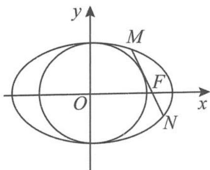

<!-- question-source:start -->
例 5 如图 5.5-7, 已知椭圆 $\frac{x^{2}}{a^{2}} + \frac{y^{2}}{b^{2}} = 1 (a > b > 0)$ 的右焦点为 $F(\sqrt{2}, 0)$ ，离心率 $e = \frac{\sqrt{6}}{3}$ .

图5.5-7

(Ⅰ)求椭圆的方程.

(Ⅱ)设 M, N 是椭圆上的两点, 直线 MN 与圆 $x^{2} + y^{2} = b^{2} (x > 0)$ 相切, 证明: M, N, F 三点共线的充要条件是 $|MN| = \sqrt{3}$ .
<!-- question-source:end -->

![[高中/总复习/专题/高考数学秘密/浙大优辅《高中数学新体系 圆锥曲线的秘密》/第五章_撑一支长篙_向更青处漫溯___圆锥曲线可以这样研究/5_5_以圆为背景的圆锥曲线性质探究/5_5_3_椭圆的同心内切圆的性质管窥/questions/answers/Q00037674A1.md]]
