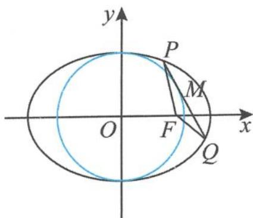

> [!faq]- 《高中数学新体系·圆锥曲线的秘密》例题解析
>
> > [!success]- **【答案】** 详见解析
>
> > [!note]- **【分析】**
> > 本题未单列分析。
>
> > [!note]- **【解析】**
> > 证明 设 $P(x_{1},y_{1}),Q(x_{2},y_{2})$ ，由已知易得直线 $PQ$ 的方程为
> > $$
> > x _ {0} x + y _ {0} y = 5.
> > $$
> > 把直线 PQ 的方程代入椭圆 $C_{1}$ 的方程, 消去 $y_{0}, y$ 得到
> > $$
> > (2 5 + 4 x _ {0} ^ {2}) x ^ {2} - 9 0 x _ {0} x + 4 5 x _ {0} ^ {2} = 0.
> > $$
> > 
> > 由韦达定理得
> > 图5.5-5
> > $$
> > x _ {1} + x _ {2} = \frac {9 0 x _ {0}}{2 5 + 4 x _ {0} ^ {2}}, x _ {1} x _ {2} = \frac {4 5 x _ {0} ^ {2}}{2 5 + 4 x _ {0} ^ {2}}.
> > $$
> > 因为 $\Delta=720(5-x_{0}^{2})x_{0}^{2}>0$ ，所以
> > $$
> > | P Q | = \sqrt {1 + \frac {x _ {0} ^ {2}}{y _ {0} ^ {2}}} | x _ {1} - x _ {2} | = \frac {6 0 x _ {0}}{2 5 + 4 x _ {0} ^ {2}}.
> > $$
> > 由椭圆的焦半径公式得
> > $$
> > | P F | = 3 - \frac {2}{3} x _ {1}, | Q F | = 3 - \frac {2}{3} x _ {2}.
> > $$
> > 所以 $\triangle PFQ$ 的周长 $= 6 - \frac{2}{3} (x_{1} + x_{2}) + \frac{60x_{0}}{25 + 4x_{0}^{2}} = 6 - \frac{2}{3}\times \frac{90x_{0}}{25 + 4x_{0}^{2}} +\frac{60x_{0}}{25 + 4x_{0}^{2}} = 6$ （为定值）.
> > 解答好这个试题,我们好奇的是常数 6 有什么背景吗? 其实,要把问题看得清楚点,往往需要呈现问题的本质,所以我们可以先探究问题的一般化情形,很快就发现常数 6 恰恰就是 $2a$ . 这样看来,扑朔迷离的问题就变得清晰了.
> > (二)一般化探究
