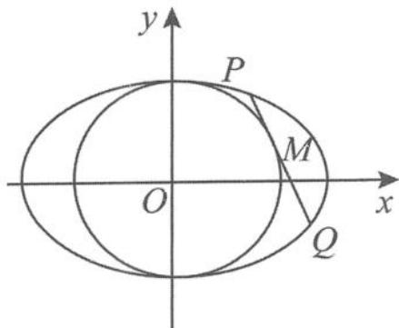

> [!faq]- 《高中数学新体系·圆锥曲线的秘密》例题解析
>
> > [!success]- **【答案】** 详见解析
>
> > [!note]- **【分析】**
> > 本题未单列分析。
>
> > [!note]- **【解析】**
> > 证明 易知直线 $PQ$ 的方程为
> > $$
> > x x _ {0} + y y _ {0} = b ^ {2}.
> > $$
> > 将之与椭圆方程联立,消去 $y_{0}, y$ 得到
> > $$
> > \left(a ^ {2} x _ {0} ^ {2} + b ^ {2} y _ {0} ^ {2}\right) x ^ {2} - 2 a ^ {2} b ^ {2} x _ {0} x + a ^ {2} b ^ {2} x _ {0} ^ {2} = 0,
> > $$
> > 
> > 所以
> > $$
> > x _ {1} + x _ {2} = \frac {2 a ^ {2} b ^ {2} x _ {0}}{a ^ {2} x _ {0} ^ {2} + b ^ {2} y _ {0} ^ {2}}, x _ {1} x _ {2} = \frac {a ^ {2} b ^ {2} x _ {0} ^ {2}}{a ^ {2} x _ {0} ^ {2} + b ^ {2} y _ {0} ^ {2}}.
> > $$
> > 图5.5-6
> > 由韦达定理得
> > $$
> > | P Q | = \sqrt {1 + \frac {x _ {0} ^ {2}}{y _ {0} ^ {2}}} | x _ {1} - x _ {2} | = \frac {2 a b ^ {2} c x _ {0}}{a ^ {2} x _ {0} ^ {2} + b ^ {2} y _ {0} ^ {2}}.
> > $$
> > 由焦半径公式得
> > $$
> > | P F | = a - e x _ {1}, | Q F | = a - e x _ {2}.
> > $$
> > 所以 $\triangle PFQ$ 的周长 $= 2a - \frac{c}{a} (x_{1} + x_{2}) + \frac{2ab^{2}cx_{0}}{a^{2}x_{0}^{2} + b^{2}y_{0}^{2}} = 2a$ （为常数）.
> > “洗尽铅华始见真,浮华褪尽方显诚”,追本溯源,探究本源,这是探究性学习的一个重要方面.
> > (三) 引申探究
