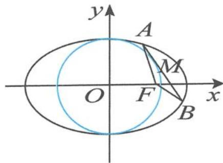
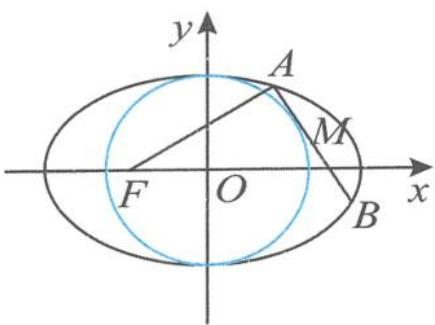
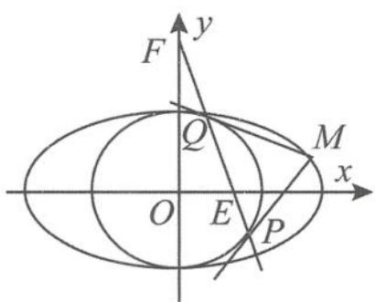

> [!faq]- 《高中数学新体系·圆锥曲线的秘密》例题解析
>
> > [!success]- **【答案】** 详见解析
>
> > [!note]- **【分析】**
> > 本题未单列分析。
>
> > [!note]- **【解析】**
> > 证明 (I)由题意易求椭圆方程为 $\frac{x^2}{3} + y^2 = 1$ .
> > (Ⅱ)设 MN:x=my+t,代入椭圆方程得
> > $$
> > (3 + m ^ {2}) y ^ {2} + 2 m t y + t ^ {2} - 3 = 0.
> > $$
> > 由韦达定理得
> > $$
> > y _ {1} + y _ {2} = \frac {- 2 m t}{3 + m ^ {2}}, y _ {1} y _ {2} = \frac {t ^ {2} - 3}{3 + m ^ {2}}.
> > $$
> > 所以
> > $$
> > \vert M N \vert = \sqrt {1 + m ^ {2}} \vert y _ {1} - y _ {2} \vert = \frac {2 \sqrt {3} \sqrt {1 + m ^ {2}} \sqrt {m ^ {2} - t ^ {2} + 3}}{3 + m ^ {2}}.
> > $$
> > 因为直线 $MN$ 与圆 $x^{2} + y^{2} = b^{2}(x > 0)$ 相切，所以 $m^2 +1 = t^2$ ，故 $|MN| = \frac{2\sqrt{6}\sqrt{1 + m^2}}{3 + m^2}.$
> > (1) 当直线 MN 过右焦点 F 时, $t=\sqrt{2}$ , 所以 $m^{2}=1$ , 从而 $|MN|=\sqrt{3}$ .
> > (2) 当 $\left|MN\right|=\sqrt{3}$ 时, $m^{2}=1$ , 得 $t^{2}=2$ . 因为 t>0, 所以 $t=\sqrt{2}$ , 得到 MN: $x=my+\sqrt{2}$ , 即直线 MN 过焦点 F.
> > 引申 1 如图 5.5-8, 设点 F 为椭圆 $E: \frac{x^{2}}{a^{2}} + \frac{y^{2}}{b^{2}} = 1 (a > b > 0)$ 的右焦点, 点 M 是圆 $O: x^{2} + y^{2} = b^{2}$ 上的动点 (y 轴右侧), 过点 M 作圆 O 的切线, 交椭圆于 A, B 两点. 若 $\triangle ABF$ 的周长为 3b, 则椭圆 E 的离心率 e 为 \_\_\_\_.
> > 
> > 5.5-8
> > 解答 设 $A(x_{1},y_{1}), B(x_{2},y_{2})$ ，则
> > $$
> > \left| A M \right| ^ {2} = x _ {1} ^ {2} + y _ {1} ^ {2} - b ^ {2} = x _ {1} ^ {2} + \left(1 - \frac {x _ {1} ^ {2}}{a ^ {2}}\right) b ^ {2} - b ^ {2} = x _ {1} ^ {2} \cdot \frac {a ^ {2} - b ^ {2}}{a ^ {2}} = (e x _ {1}) ^ {2},
> > $$
> > 所以
> > $$
> > \vert A M \vert + \vert A F \vert = (e x _ {1}) + (a - e x _ {1}) = a.
> > $$
> > 同理 $|BM|+|BF|=a$ ，故 $\triangle ABF$ 的周长为2a，即2a=3b，得椭圆的离心率为 $\frac{\sqrt{5}}{3}$ .
> > 引申 2 如图 5.5-9, 设点 $F$ 为椭圆 $E: \frac{x^2}{a^2} + \frac{y^2}{b^2} = 1 (a > b > 0)$ 的左焦点, 点 $M$ 是圆 $O: x^2 + y^2 = b^2$ 上的动点 ( $y$ 轴右侧), 过点 $M$ 作圆 $O$ 的切线, 交椭圆于 $A, B$ 两点, 则 $|AF| - |AM| =$ \_\_\_\_.
> > 解答 设 $A(x_{1}, y_{1})$ ，因为
> > $$
> > \left| A M \right| ^ {2} = x _ {1} ^ {2} + y _ {1} ^ {2} - b ^ {2} = x _ {1} ^ {2} + \left(1 - \frac {x _ {1} ^ {2}}{a ^ {2}}\right) b ^ {2} - b ^ {2} = x _ {1} ^ {2} \cdot \frac {a ^ {2} - b ^ {2}}{a ^ {2}} = (e x _ {1}) ^ {2},
> > $$
> > 其中 e 为椭圆的离心率, 所以
> > 
> > $$
> > \vert A F \vert - \vert A M \vert = (a + e x _ {1}) - e x _ {1} = a,
> > $$
> > 图5.5-9
> > 故 $|AF|-|AM|=a.$
> > 引申3 如图5.5-10, 已知椭圆 $\frac{x^2}{a^2} + \frac{y^2}{b^2} = 1 (a > b > 0)$ 与圆 $x^2 + y^2 = b^2$ , 过椭圆上的点 $M$ 作圆的两条切线, 切点分别为 $P, Q$ , 直线 $PQ$ 与 $x$ 轴、 $y$ 轴分别交于点 $E, F$ , 则 $S_{\triangle EOF}$ 的最小值为 $\frac{b^3}{a}$ .
> > 
> > 解答 解法一: 设 $M(a\cos\theta, b\sin\theta) (\theta \in [0, 2\pi))$ ，直线 PQ 为点 M 关于圆 $x^{2} + y^{2} = b^{2}$ 的切点弦，其方程为
> > 图5.5-10
> > $$
> > (a \cos \theta) x + (b \sin \theta) y = b ^ {2},
> > $$
> > 从而
> > $$
> > x _ {E} = \frac {b ^ {2}}{a \cos \theta}, y _ {F} = \frac {b}{\sin \theta}.
> > $$
> > 于是
> > $$
> > S _ {\triangle E O F} = \frac {1}{2} | x _ {E} | | y _ {F} | = \frac {b ^ {3}}{a | \sin 2 \theta |} \geqslant \frac {b ^ {3}}{a},
> > $$
> > 当且仅当 $M\left(\pm\frac{\sqrt{2}}{2}a,\pm\frac{\sqrt{2}}{2}b\right)$ 时，上述等号成立.
> > 解法二: 设 $M(x_{0}, y_{0})$ ，则切点弦 PQ 的方程为
> > $$
> > x _ {0} x + y _ {0} y = b ^ {2},
> > $$
> > $E\left(\frac{b^{2}}{x_{0}},0\right),F\left(0,\frac{b^{2}}{y_{0}}\right).$ 由于
> > $$
> > 1 = \frac {x _ {0} ^ {2}}{a ^ {2}} + \frac {y _ {0} ^ {2}}{b ^ {2}} \geqslant \frac {2 | x _ {0} | | y _ {0} |}{a b},
> > $$
> > 即 $|x_0||y_0|\leqslant \frac{ab}{2}$ ，得
> > $$
> > S _ {\triangle E O F} = \frac {b ^ {4}}{2 | x _ {0} | | y _ {0} |} \geqslant \frac {b ^ {4}}{a b} = \frac {b ^ {3}}{a},
> > $$
> > 当 $|x_{0}|=\frac{a}{\sqrt{2}}$ , $|y_{0}|=\frac{b}{\sqrt{2}}$ 时等号成立, 故 $\triangle EOF$ 面积的最小值是 $\frac{b^{3}}{a}$ .
> > 引申 4 过椭圆 $\frac{x^{2}}{a^{2}} + \frac{y^{2}}{b^{2}} = 1 (a > b > 0)$ 上的点 M 作圆 $x^{2} + y^{2} = b^{2}$ 的两切线，切点分别为 P, Q. 若直线 PQ 在 x 轴、y 轴上的截距分别为 m, n，则 $\frac{a^{2}}{n^{2}} + \frac{b^{2}}{m^{2}} = \frac{1}{1 - e^{2}}$ （其中 e 为椭圆的离心率）.
> > 证明 设 $M(x_0, y_0)$ , 则圆 $x^2 + y^2 = b^2$ 的切点弦 $PQ$ 的方程为
> > $$
> > x x _ {0} + y y _ {0} = b ^ {2}.
> > $$
> > 令 $y = 0$ ，得
> > $$
> > m = \frac {b ^ {2}}{x _ {0}};
> > $$
> > 令 $x = 0$ ，得
> > $$
> > n = \frac {b ^ {2}}{y _ {0}}.
> > $$
> > 所以
> > $$
> > \frac {a ^ {2}}{n ^ {2}} + \frac {b ^ {2}}{m ^ {2}} = \frac {a ^ {2} y _ {0} ^ {2} + b ^ {2} x _ {0} ^ {2}}{b ^ {4}} = \frac {a ^ {2} b ^ {2}}{b ^ {4}} = \frac {1}{1 - e ^ {2}}.
> > $$
