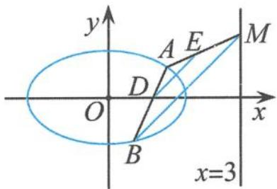

<!-- question-source:start -->
例 4 如图 4.2-2, 已知椭圆 C: $x^{2} + 3y^{2} = 3$ , 过点 D(1,0) 且不过点 E(2,1) 的直线与椭圆 C 交于 A, B 两点, 直线 AE 与直线 x = 3 交于点 M.

(I)求椭圆 C 的离心率.

(Ⅱ)若 AB 垂直于 x 轴, 求直线 BM 的斜率.

图4.2-2

(Ⅲ)试判断直线 BM 与直线 DE 的位置关系,并说明理由.
<!-- question-source:end -->

![[高中/总复习/专题/高考数学秘密/浙大优辅《高中数学新体系 圆锥曲线的秘密》/第四章_落霞与孤鹜齐飞_秋水共长天一色___圆锥曲线可以这样考查/4_2_有关定比问题/questions/answers/Q00037619A1.md]]
