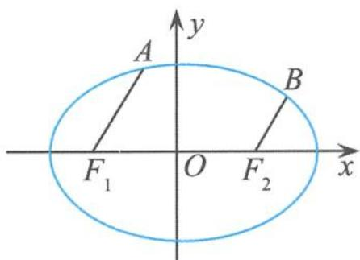

> [!faq]- 《高中数学新体系·圆锥曲线的秘密》例题解析
>
> > [!success]- **【答案】** 详见解析
>
> > [!note]- **【分析】**
> > 本题未单列分析。
>
> > [!note]- **【解析】**
> > 解答 如图 4.2-1, 设 $A(x_{1}, y_{1})$ , $B(x_{2}, y_{2})$ , 已知 $\overrightarrow{F_{1}A} = 5\overrightarrow{F_{2}B}$ , 则
> > $$
> > x _ {1} - 5 x _ {2} = - 6 \sqrt {2}, y _ {1} - 5 y _ {2} = 0 \quad ①.
> > $$
> > 因为 $\left\{\begin{aligned}\frac{x_{1}^{2}}{3}+y_{1}^{2}&=1,\\ \frac{x_{2}^{2}}{3}+y_{2}^{2}&=1,\end{aligned}\right.$ 所以
> > 
> > 图4.2-1
> > $$
> > \left\{ \begin{array}{l} \frac {x _ {1} ^ {2}}{3} + y _ {1} ^ {2} = 1, \\ \frac {2 5 x _ {2} ^ {2}}{3} + 2 5 y _ {2} ^ {2} = 2 5, \end{array} \right.
> > $$
> > 作差得 $\frac{x_1^2 - 25x_2^2}{3} + y_1^2 - 25y_2^2 = -24$ ，即
> > $$
> > \frac {(x _ {1} - 5 x _ {2}) (x _ {1} + 5 x _ {2})}{3} + (y _ {1} - 5 y _ {2}) (y _ {1} + 5 y _ {2}) = - 2 4 \quad ②.
> > $$
> > 把①代入②得
> > $$
> > x _ {1} + 5 x _ {2} = 6 \sqrt {2}.
> > $$
> > 又因为 $x_{1} - 5x_{2} = -6\sqrt{2}$ ，所以 $x_{1} = 0$ ，得点 $A$ 的坐标是(0,1)或(0,-1).
