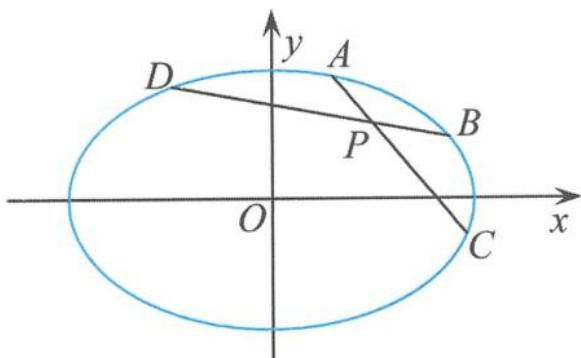

> [!faq]- 《高中数学新体系·圆锥曲线的秘密》例题解析
>
> > [!success]- **【答案】** A
>
> > [!note]- **【分析】**
> > 本题未单列分析。
>
> > [!note]- **【解析】**
> > 解答 (I)椭圆 $C$ 的离心率
> > $$
> > e = \frac {c}{a} = \frac {\sqrt {6}}{3}.
> > $$
> > (Ⅱ)因为 AB 过点 $D(1,0)$ 且垂直于 x 轴, 所以可设 $A(1,y_{1}), B(1,-y_{1})$ , 则直线 AE 的方程为
> > $$
> > y - 1 = (1 - y _ {1}) (x - 2).
> > $$
> > 令 x=3，得 $M(3,2-y_{1})$ ，所以直线 BM 的斜率
> > $$
> > k _ {B M} = \frac {2 - y _ {1} + y _ {1}}{3 - 1} = 1.
> > $$
> > (Ⅲ) 直线 BM 与直线 DE 平行. 证明如下.
> > 令 $A(x_{1},y_{1}),B(x_{2},y_{2})$ ，设 $\overrightarrow{AE} = m\overrightarrow{EM}$ ，则
> > $$
> > (2 - x _ {1}, 1 - y _ {1}) = m (1, y _ {M} - 1),
> > $$
> > 所以
> > $$
> > m = 2 - x _ {1}.
> > $$
> > 设 $\overrightarrow{AD}=n\overrightarrow{DB}$ ，得到
> > $$
> > x _ {1} + n x _ {2} = 1 + n, y _ {1} + n y _ {2} = 0 \quad ①.
> > $$
> > 因为 $\left\{\begin{aligned}x_{1}^{2}+3y_{1}^{2}&=3,\\ x_{2}^{2}+3y_{2}^{2}&=3,\end{aligned}\right.$ 所以
> > $$
> > \left\{ \begin{array}{l} x _ {1} ^ {2} + 3 y _ {1} ^ {2} = 3, \\ n ^ {2} x _ {2} ^ {2} + 3 n ^ {2} y _ {2} ^ {2} = 3 n ^ {2}, \end{array} \right.
> > $$
> > 作差得
> > $$
> > \left(x _ {1} + n x _ {2}\right) \left(x _ {1} - n x _ {2}\right) + 3 \left(y _ {1} + n y _ {2}\right) \left(y _ {1} - n y _ {2}\right) = 3 - 3 n ^ {2} \quad ②.
> > $$
> > 把①代入②得
> > $$
> > x _ {1} - n x _ {2} = 3 (1 - n).
> > $$
> > 又因为 $x_{1} + nx_{2} = 1 + n$ ，所以 $n = 2 - x_{1}$ 因此 $m = n$ ，即 $\frac{|\overrightarrow{AE}|}{|\overrightarrow{EM}|} = \frac{|\overrightarrow{AD}|}{|\overrightarrow{DB}|}$ 得 $BM / / DE.$
> > 点评 一类问题,多年试题,一种方法,一“解”到底.这也许就是命题者所认为的重要方法重点考查的原因,这在学习中需要梳理总结,为我们的解题服务.笛卡儿有句名言:“我解决过的每一个问题都可以是日后用以解决其他问题的法则.”
> > 链接1 已知 $F_{1}$ 是双曲线 $C: \frac{x^{2}}{a^{2}} - \frac{y^{2}}{b^{2}} = 1 (a > 0, b > 0)$ 的左焦点，点 $B$ 的坐标为 $(0, b)$ ，直线 $F_{1}B$ 与双曲线 $C$ 的两条渐近线分别交于 $P, Q$ 两点。若 $\overrightarrow{QP} = 4\overrightarrow{PF_1}$ ，则双曲线 $C$ 的离心率为（）。
> > A. $\frac{\sqrt{6}}{2}$ B. $\frac{3}{2}$ C. $\frac{\sqrt{5}}{2}$ D. 2
> > 解答 设点 $P(x_{1},y_{1}),Q(x_{2},y_{2})$ ，已知 $\overrightarrow{QP} = 4\overrightarrow{PF_1}$ ，则
> > $$
> > 5 x _ {1} - x _ {2} = - 4 c, 5 y _ {1} - y _ {2} = 0 \quad ①.
> > $$
> > 因为 $\left\{\begin{aligned}\frac{x_{1}^{2}}{a^{2}}-\frac{y_{1}^{2}}{b^{2}}&=0,\\ \frac{x_{2}^{2}}{a^{2}}-\frac{y_{2}^{2}}{b^{2}}&=0,\end{aligned}\right.$ 所以
> > $$
> > \left\{ \begin{array}{l} \frac {2 5 x _ {1} ^ {2}}{a ^ {2}} - \frac {2 5 y _ {1} ^ {2}}{b ^ {2}} = 0, \\ \frac {x _ {2} ^ {2}}{a ^ {2}} - \frac {y _ {2} ^ {2}}{b ^ {2}} = 0, \end{array} \right.
> > $$
> > 作差得 $\frac{25x_1^2 - x_2^2}{a^2} -\frac{25y_1^2 - y_2^2}{b^2} = 0$ ，即
> > $$
> > \frac {(5 x _ {1} - x _ {2}) (5 x _ {1} + x _ {2})}{a ^ {2}} - \frac {(5 y _ {1} - y _ {2}) (5 y _ {1} + y _ {2})}{b ^ {2}} = 0
> > $$
> > 把①代入②得
> > $$
> > 5 x _ {1} + x _ {2} = 0.
> > $$
> > 又因为 $5x_{1} - x_{2} = -4c$ ，所以
> > $$
> > x _ {1} = - \frac {2 c}{5}, y _ {1} = \frac {2 b c}{5 a},
> > $$
> > 所以
> > $$
> > k _ {P F _ {1}} = \frac {2 b}{3 a}, k _ {B F _ {1}} = \frac {b}{c},
> > $$
> > 因此 $\frac{2b}{3a} = \frac{b}{c}$ ，得双曲线 $C$ 的离心率
> > $$
> > e = \frac {3}{2}.
> > $$
> > 故选 B.
> > 链接 2 如图 4.2-3, 已知椭圆 $\Gamma:\frac{x^{2}}{a^{2}}+\frac{y^{2}}{b^{2}}=1(a>b>0)$ 内有一个定点 $P(1,1)$ , 过点 P 的
> > 两条直线 $l_{1}$ 和 $l_{2}$ 分别与椭圆 $\Gamma$ 交于点 A, C 和点 B, D，且满足 $\overrightarrow{AP} = \lambda \overrightarrow{PC}, \overrightarrow{BP} = \lambda \overrightarrow{PD}$ 。若 $\lambda$ 变化时，直线 CD 的斜率总为 $-\frac{1}{4}$ ，则椭圆 $\Gamma$ 的离心率为（）。
> > A. $\frac{\sqrt{3}}{2}$ B. $\frac{1}{2}$ C. $\frac{\sqrt{2}}{2}$ D. $\frac{\sqrt{5}}{5}$
> > 
> > 图4.2-3
> > 解答 (1)已知 $\overrightarrow{AP} = \lambda \overrightarrow{PC},\overrightarrow{BP} = \lambda \overrightarrow{PD}$ ，则
> > $$
> > A B \parallel C D.
> > $$
> > (2)设点 $A(x_{1},y_{1}),B(x_{2},y_{2}),C(x_{3},y_{3}),D(x_{4},y_{4})$ ，由于 $\overrightarrow{AP} = \lambda \overrightarrow{PC}$ ，则 $x_{1} + \lambda x_{3} = 1 + \lambda ,y_{1} + \lambda y_{3} = 1 + \lambda$ ①.
> > 同理,由于 $\overrightarrow{BP}=\lambda\overrightarrow{PD}$ ,则
> > $$
> > x _ {2} + \lambda x _ {4} = 1 + \lambda , y _ {2} + \lambda y _ {4} = 1 + \lambda .
> > $$
> > 因为 $\left\{\begin{aligned}\frac{x_{1}^{2}}{a^{2}}+\frac{y_{1}^{2}}{b^{2}}&=1,\\ \frac{x_{3}^{2}}{a^{2}}+\frac{y_{3}^{2}}{b^{2}}&=1,\end{aligned}\right.$ 所以
> > $$
> > \left\{ \begin{array}{l} \frac {x _ {1} ^ {2}}{a ^ {2}} + \frac {y _ {1} ^ {2}}{b ^ {2}} = 1, \\ \frac {\lambda^ {2} x _ {3} ^ {2}}{a ^ {2}} + \frac {\lambda^ {2} y _ {3} ^ {2}}{b ^ {2}} = \lambda^ {2}, \end{array} \right.
> > $$
> > 作差得 $\frac{x_1^2 - \lambda^2x_3^2}{a^2} +\frac{y_1^2 - \lambda^2y_3^2}{b^2} = 1 - \lambda^2$ ，即
> > $$
> > \frac {(x _ {1} - \lambda x _ {3}) (x _ {1} + \lambda x _ {3})}{a ^ {2}} + \frac {(y _ {1} - \lambda y _ {3}) (y _ {1} + \lambda y _ {3})}{b ^ {2}} = 1 - \lambda^ {2}
> > $$
> > 把①代入②得
> > $$
> > \frac {x _ {1} - \lambda x _ {3}}{a ^ {2}} + \frac {y _ {1} - \lambda y _ {3}}{b ^ {2}} = 1 - \lambda .
> > $$
> > 又因为 $x_{1} + \lambda x_{3} = 1 + \lambda ,y_{1} + \lambda y_{3} = 1 + \lambda$ ，所以
> > $$
> > \frac {2 x _ {1} - (\lambda + 1)}{a ^ {2}} + \frac {2 y _ {1} - (\lambda + 1)}{b ^ {2}} = 1 - \lambda
> > $$
> > 同理
> > $$
> > \frac {2 x _ {2} - (\lambda + 1)}{a ^ {2}} + \frac {2 y _ {2} - (\lambda + 1)}{b ^ {2}} = 1 - \lambda
> > $$
> > 由③-④得 $\frac{2(x_1 - x_2)}{a^2} +\frac{2(y_1 - y_2)}{b^2} = 0$ ，即
> > $$
> > k _ {A B} = \frac {y _ {1} - y _ {2}}{x _ {1} - x _ {2}} = \frac {- b ^ {2}}{a ^ {2}} = e ^ {2} - 1.
> > $$
> > 又因为 $AB \parallel CD$ ，且 $k_{CD} = -\frac{1}{4}$ ，因此 $e^2 - 1 = -\frac{1}{4}$ ，得
> > $$
> > e = \frac {\sqrt {3}}{2}.
> > $$
> > 故选A.
> > 链接3 已知椭圆 $C$ 的中心在原点, 焦点在 $x$ 轴上, 离心率为 $\frac{\sqrt{3}}{2}$ , 且椭圆 $C$ 的任意三个顶点构成的三角形的面积为 $\frac{1}{2}$ .
> > (I) 求椭圆 C 的方程.
> > (Ⅱ)若过点 $P(\lambda,0)$ 的直线 l 与椭圆交于相异的两点 A, B, 且 $\overrightarrow{AP}=2\overrightarrow{PB}$ , 求实数 $\lambda$ 的取值范围.
> > 解答 (I)椭圆 $C$ 的方程为
> > $$
> > x ^ {2} + 4 y ^ {2} = 1.
> > $$
> > (Ⅱ)设 $A(x_{1},y_{1}), B(x_{2},y_{2})$ ，由 $\overrightarrow{AP}=2\overrightarrow{PB}$ 得
> > $$
> > x _ {1} + 2 x _ {2} = 3 \lambda , y _ {1} + 2 y _ {2} = 0 \quad ①.
> > $$
> > 因为 $\left\{\begin{aligned}x_{1}^{2}+4y_{1}^{2}&=1,\\ x_{2}^{2}+4y_{2}^{2}&=1,\end{aligned}\right.$ 所以
> > $$
> > \left\{ \begin{array}{l} x _ {1} ^ {2} + 4 y _ {1} ^ {2} = 1, \\ 4 x _ {2} ^ {2} + 1 6 y _ {2} ^ {2} = 4, \end{array} \right.
> > $$
> > 作差并整理得
> > $$
> > (x _ {1} + 2 x _ {2}) (x _ {1} - 2 x _ {2}) + 4 (y _ {1} + 2 y _ {2}) (y _ {1} - 2 y _ {2}) = - 3 \quad ②.
> > $$
> > 把①代入②得
> > $$
> > x _ {1} - 2 x _ {2} = - \frac {1}{\lambda}.
> > $$
> > 又因为 $x_{1} + 2x_{2} = 3\lambda$ ，所以 $2x_{1} = 3\lambda -\frac{1}{\lambda}\in (-2,2),4x_{2} = 3\lambda +\frac{1}{\lambda}\in (-4,4)$ ，所以
> > $$
> > \lambda \in \left(- 1, - \frac {1}{3}\right) \cup \left(\frac {1}{3}, 1\right).
> > $$
> > 点评 当我们从解题方法的视角看这一类试题时,顿感豁然开朗,这类问题瞬间也都变成了同一个模式.数学解题需要有一定的模式,因为这样可以使解题变得有章可循,不拖泥带水,直奔主题,一气呵成,解题过程变得清清爽爽,帮助我们寻找正确的解题方向.
