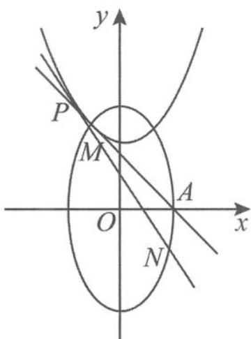
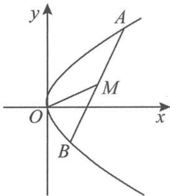

## 4.3.4 $e^{2} - 1$ 性质的本质与适用范围

如果我们把圆看作是离心率为 0 的圆锥曲线,那么上面的“性质 1”、“性质 2”(包括特例)、“性质 3”就可以看作是圆的性质在椭圆中的推广,分别对应圆的性质:(1)圆上一点对直径所张成的角为直角;(2)圆的垂径定理;(3)圆心与切点的连线垂直于该切线.它们充分揭示了椭圆的本质属性.这样的性质由圆到椭圆再到双曲线进一步拓展,不断构建起一个完善的知识网络体系.

上面的“性质 1”、“性质 2”（包括特例）、“性质 3”的适用范围都是焦点在 x 轴上的椭圆或双曲线，那么焦点在 y 轴上的椭圆或双曲线会有什么结论呢？

其实, 只要把性质中的定值 $e^{2}-1$ 改为 $\frac{1}{e^{2}-1}$ 就可以了.

链接1 已知椭圆 $C: \frac{x^2}{b^2} + \frac{y^2}{a^2} = 1 (a > b > 0)$ , 直线 $l$ 不过原点 $O$ 且不平行于坐标轴, 直线 $l$ 与椭圆 $C$ 交于 $A, B$ 两点, 线段 $AB$ 的中点为 $M$ . 证明: 直线 $OM$ 与直线 $l$ 的斜率乘积为定值 $-\frac{a^2}{b^2} = \frac{1}{e^2 - 1}$ .

证明 设点 $A(x_{1},y_{1}),B(x_{2},y_{2}),M(x_{0},y_{0})$ ，则有

$$
x _ {1} + x _ {2} = 2 x _ {0}, y _ {1} + y _ {2} = 2 y _ {0}.
$$

所以

$$
\left\{ \begin{array}{l} \frac {x _ {1} ^ {2}}{b ^ {2}} + \frac {y _ {1} ^ {2}}{a ^ {2}} = 1, \\ \frac {x _ {2} ^ {2}}{b ^ {2}} + \frac {y _ {2} ^ {2}}{a ^ {2}} = 1, \end{array} \right.
$$

两式作差得

$$
\frac {(x _ {1} + x _ {2}) (x _ {1} - x _ {2})}{b ^ {2}} + \frac {(y _ {1} + y _ {2}) (y _ {1} - y _ {2})}{a ^ {2}} = 0,
$$

所以 $\frac{2x_0(x_1 - x_2)}{b^2} +\frac{2y_0(y_1 - y_2)}{a^2} = 0$ ，即

$$
k _ {O M} \cdot k _ {l} = \frac {y _ {0}}{x _ {0}} \cdot \frac {y _ {1} - y _ {2}}{x _ {1} - x _ {2}} = - \frac {a ^ {2}}{b ^ {2}} = \frac {1}{e ^ {2} - 1}.
$$

证毕。

链接2 已知双曲线 $C: \frac{y^2}{a^2} - \frac{x^2}{b^2} = 1 (a > 0, b > 0), A, B$ 是双曲线的两个顶点. $P$ 是双曲线上的点, 且与点 $B$ 在双曲线的同一支上. 点 $P$ 关于 $y$ 轴的对称点是点 $Q$ , 若直线 $AP, BQ$ 的斜率分别是 $k_1, k_2$ , 且 $k_1 \cdot k_2 = -\frac{4}{5}$ , 则双曲线的离心率是 ( ).

A. $\frac{3\sqrt{5}}{5}$ B. $\frac{9}{4}$ C. $\frac{3}{2}$ D. $\frac{9}{5}$

解答 由“性质1”得

$$
k _ {P A} \cdot k _ {P B} = \frac {1}{e ^ {2} - 1},
$$

即 $k_{1} \cdot (-k_{2}) = \frac{1}{e^{2} - 1}$ , 解得

$$
e = \frac {3}{2}.
$$

故选 C.

链接3 设椭圆 $M: \frac{x^2}{a^2} + \frac{y^2}{b^2} = 1 (a > b > 0)$ 长轴上的两个顶点为 $A, B$ , 点 $P$ 为椭圆 $M$ 上除了 $A, B$ 的一个动点. 若 $\overrightarrow{QA} \cdot \overrightarrow{PA} = 0, \overrightarrow{QB} \cdot \overrightarrow{PB} = 0$ , 则动点 $Q$ 在下列哪种曲线上运动 ( ).

A. 圆    B. 椭圆    C. 双曲线    D. 抛物线

解答 由“性质1”得

$$
k _ {P A} \cdot k _ {P B} = e ^ {2} - 1,
$$

所以

$$
k _ {Q A} \cdot k _ {Q B} = \left(- \frac {1}{k _ {P A}}\right) \left(- \frac {1}{k _ {P B}}\right) = \frac {1}{e ^ {2} - 1}.
$$

故选 B.

链接4 已知椭圆 $C_1: \frac{y^2}{a^2} + \frac{x^2}{b^2} = 1 (a > b > 0)$ 的右顶点为 $A(1,0)$ , 过椭圆 $C_1$ 焦点且垂直于长轴的弦长为 1.

(I)求椭圆 $C_{1}$ 方程.

(II)如图4.3-26,设点P在抛物线 $C_{2}:y=x^{2}+h(h\in\mathbb{R})$ 上,抛物线 $C_{2}$ 在点P处的切线与椭圆 $C_{1}$ 交于点M,N.当线段AP的中点E与MN的中点Q的横坐标相等时,求h的最小值.

图4.3-26

解答 (I)椭圆 $C_1$ 的方程为 $\frac{y^2}{4} + x^2 = 1$ .

(Ⅱ) 设 $P(t, t^{2} + h)$ ，则 $x_{Q} = x_{E} = \frac{1 + t}{2}$ ， $k_{MN} = 2x_{P} = 2t$ ，可得

$$
M N: y - (t ^ {2} + h) = 2 t (x - t),
$$

所以

$$
y _ {Q} = t + h.
$$

因为 $k_{MN} \cdot k_{OQ} = \frac{1}{e^2 - 1} = -4$ ，所以 $2t \cdot \frac{2(t + h)}{1 + t} = -4$ ，即

$$
- h - 1 = t + \frac {1}{t} (t \neq - 1 \text {且} t \neq 0).
$$

又因为点 $\left(E\frac{1+t}{2},t+h\right)$ 在椭圆内,所以

$$
\frac {(t + h) ^ {2}}{4} + \frac {(t + 1) ^ {2}}{4} <   1,
$$

解得 $1 \leqslant h < \sqrt{5}$ ，故 h 的最小值为 1.

至此,我们对椭圆、双曲线的 $e^2 - 1$ 性质有了一个较为清晰的了解,但细心的读者可能会思考抛物线是否有类似的性质呢? 答案是肯定的.

设 AB 为抛物线 $y^{2}=2px(p>0)$ 的任意一条弦, M 为弦 AB 的中点, 如图 4.3-27. 若 $y_{M}$ 为点 M 的纵坐标, 则有 $k_{AB} \cdot y_{M} = p$ .

证明 设 $A(x_{1},y_{1}), B(x_{2},y_{2})$ ，因为

$$
k _ {A B} = \frac {y _ {1} - y _ {2}}{x _ {1} - x _ {2}} = \frac {y _ {1} - y _ {2}}{\frac {y _ {1} ^ {2}}{2 p} - \frac {y _ {2} ^ {2}}{2 p}} = \frac {2 p}{y _ {1} + y _ {2}} = \frac {p}{y _ {M}},
$$

图4.3-27

所以

$$
k _ {A B} \cdot y _ {M} = p.
$$

![[高中/总复习/专题/高考数学秘密/浙大优辅《高中数学新体系 圆锥曲线的秘密》/第四章_落霞与孤鹜齐飞_秋水共长天一色___圆锥曲线可以这样考查/4_3_有关_两率_问题/4_3_4__e__2__1__性质的本质与适用范围/questions/Q00037638.md]]
