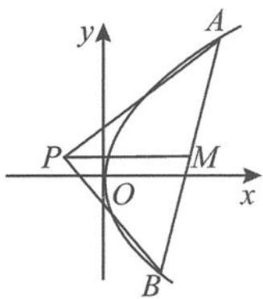

> [!faq]- 《高中数学新体系·圆锥曲线的秘密》例题解析
>
> > [!success]- **【答案】** 详见解析
>
> > [!note]- **【分析】**
> > 本题未单列分析。
>
> > [!note]- **【解析】**
> > 证明 设 $PA$ 的中点为 $R, PB$ 的中点为 $T$ , 连接 $RT$ . 设 $RT \cap PM = S$ , 由中位线的性质得 $AB // RT$ , 且 $S$ 为 $RT$ 的中点. 因为
> > 
> > 图4.3-28
> > $$
> > k _ {A B} \cdot y _ {M} = p = 2, k _ {R T} \cdot y _ {S} = p = 2,
> > $$
> > 所以 $y_{M}=y_{S}$ ，即
> > $$
> > y _ {M} = y _ {P}.
> > $$
> > 因此 PM 垂直于 y 轴.
> > 点拨 通过对历年高考试题中 $e^2 - 1$ 性质的梳理, 我们不难理解圆锥曲线中的 $e^2 - 1$ 性质为什么会集万千宠爱于一身. 圆锥曲线中的 $e^2 - 1$ 性质是圆锥曲线的重要而又实用的性质, 是圆锥曲线中的隐性知识. 当我们在茫茫的运算中迷失了方向时, $e^2 - 1$ 性质就像海岸的灯塔、夜空的北斗星, 为我们指明解题的方向, 让我们少走弯路, 直奔问题的本源. 所以, 这也是高考命题者难以割舍的命题情愫, 需要我们好好地去研究, 使隐性知识显性化、显性知识系统化, 挖掘其丰富的内涵, 为我们高考复习提供精准而明确的方向. 那么, 关于圆锥曲线中的 $e^2 - 1$ 还有哪些有趣的性质呢? 圆锥曲线还有哪些秘密要揭晓呢? 欲知更多圆锥曲线的秘密, 请看下章分解!
