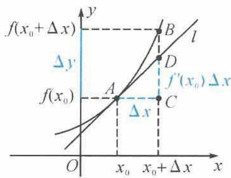

## 1.1 高中导数基础

## 1.1.1 导数基础

## (1) 切线问题

由于 $f'(x_{0})$ 就是曲线 $y=f(x)$ 在点 $(x_{0},f(x_{0}))$ 处（也称在 $x_{0}$ 处）的切线的斜率，从而由直线的点斜式方程可知，切线的方程是 $y-f(x_{0})=f'(x_{0})(x-x_{0})$ .

## (2) 近似估计

借助曲线的切线,我们还可以从几何角度来理解瞬时变化率的实际意义,并可以利用某一点的导数来估计这一点附近的函数值,具体过程如下.

设函数 $f(x)$ 在 $x_0$ 处的导数为 $f'(x_0)$ ，且在 $x_0$ 处自变量的改变量为 $\Delta x$ ，对应函数值的改变量 $\Delta y = f(x_0 + \Delta x) - f(x_0)$ ，则

$$
f (x _ {0} + \Delta x) = f (x _ {0}) + \Delta y.
$$

如图所示, 曲线 $y = f(x)$ 在 $x_{0}$ 处的切线 l 的斜率为 $f'(x_{0})$ , 因此 $AC = \Delta x, BC = \Delta y, CD = f'(x_{0}) \Delta x$ . 可以看出, 当 $\Delta x$ 很小时, $\Delta y$ 可用 $f'(x_{0}) \Delta x$ 来近似表示, 即

$$
\Delta y \approx f ^ {\prime} (x _ {0}) \Delta x.
$$

因此 $f(x_0 + \Delta x) \approx f(x_0) + f'(x_0) \Delta x$ .

## (3) 求导法则

一般地，如果 $f(x), g(x)$ 都可导，则有

$$
[ f (x) + g (x) ] ^ {\prime} = f ^ {\prime} (x) + g ^ {\prime} (x), \qquad [ f (x) - g (x) ] ^ {\prime} = f ^ {\prime} (x) - g ^ {\prime} (x);
$$

$$
\left[ f (x) g (x) \right] ^ {\prime} = f ^ {\prime} (x) g (x) + f (x) g ^ {\prime} (x), \left[ \frac {f (x)}{g (x)} \right] ^ {\prime} = \frac {f ^ {\prime} (x) g (x) - g ^ {\prime} (x) f (x)}{\left[ g (x) \right] ^ {2}} (g (x) \neq 0).
$$

## (4)导数与函数单调性

设函数 $f(x)$ 的导数为 $f'(x)$ ，有如下结论.

①如果对区间 $(a, b)$ 上的任意一点 $x$ , 有 $f'(x) > 0$ , 则曲线 $y = f(x)$ 在区间 $(a, b)$ 上每一点处切线的斜率都大于 0 , 曲线呈上升状态, 因此 $f(x)$ 在区间 $(a, b)$ 上是增函数;

②如果对区间 $(a,b)$ 上的任意一点 $x,f'(x)<0$ ，则曲线 $y=f(x)$ 在区间 $(a,b)$ 上每一点处切线的斜率都小于0，曲线呈下降状态，因此 $f(x)$ 在区间 $(a,b)$ 上是减函数.

## (5)导数与函数的极值、最值

一般地, 设函数 $y = f(x)$ 的定义域为 $D$ , 取 $x_0 \in D$ , 如果对于 $x_0$ 附近的任意不同于 $x_0$ 的 $x$ (是指存在区间 $(a, b) \subseteq D$ , 使得 $x_0 \in (a, b), x \in (a, b)$ 且 $x \neq x_0$ ) 都有:

① $f(x)<f(x_{0})$ ，则称 $x_{0}$ 为函数 $f(x)$ 的一个极大值点，且 $f(x)$ 在 $x_{0}$ 处取得极大值；

② $f(x)>f(x_{0})$ ，则称 $x_{0}$ 为函数 $f(x)$ 的一个极小值点，且 $f(x)$ 在 $x_{0}$ 处取得极小值.

取得极大值与极小值的点统称为极值点,极大值与极小值统称为极值.

一般地, 如果 $x_0$ 是 $f(x)$ 的极值点, 且 $f(x)$ 在 $x_0$ 处可导, 则必有 $f'(x_0) = 0$ . 若 $f'(x_0)$ 存在, 则“ $f'(x_0) = 0$ ”是“ $x_0$ 是 $f(x)$ 的极值点”的必要不充分条件.

## 1.1.2 从课本到高考

## (1) 切线问题

例题 1 已知函数 $f(x)=x^{2}$ ，而 l 是曲线 $y=f(x)$ 的切线，且直线 l 经过点 $(3,5)$ .

(1) 判断 $(3,5)$ 是否是曲线 $y=f(x)$ 上的点.

(2)求直线 l 的方程.

解答 (1) 因为 $f(3) = 9 \neq 5$ , 所以 (3,5) 不是曲线 $y = f(x)$ 上的点.

(2)由于(3,5)不是曲线 $y=f(x)$ 上的点, 因此(3,5)不是切点. 设切点为 $(x_{0}, x_{0}^{2})$ , 由 $f'(x)=2x$ 知, 切线的斜率 $k=2x_{0}$ , 切线方程为

$$
y - x _ {0} ^ {2} = 2 x _ {0} (x - x _ {0}).
$$

由于点(3,5)在切线上,因此有 $5-x_{0}^{2}=2x_{0}(3-x_{0})$ , 整理得

$$
x _ {0} ^ {2} - 6 x _ {0} + 5 = 0,
$$

解得 $x_{0}=1$ 或 $x_{0}=5$ . 故切点为 $(1,1)$ 或 $(5,25)$ ，切线方程为 $y-25=10(x-5)$ 或 $y-1=2(x-1)$ ，即直线 l 的方程为

$$
1 0 x - y - 2 5 = 0 \text {或} 2 x - y - 1 = 0.
$$

注1 由于题目中的点(3,5)并不在曲线上,因此(3,5)不会是切点,故可以设出切点 $(x_{0},x_{0}^{2})$ ,写出切线方程,然后利用切线经过点(3,5),求出切点坐标,进而得出切线方程.切线问题要注意“过”与“在”的字眼.一般说来,如果求曲线在该点处的切线方程,那么该点是切点;

如果求曲线过某点的切线方程,可以分为两种情况:该点在曲线上与该点不在曲线上.

例如: 已知函数 $f(x) = x^{3}$ , 求曲线 $y = f(x)$ 在点(1,1)处的切线方程. 对本题直接求导求出切线斜率即可, 斜率与切点都明确了, 则切线方程便解决了. 如果求曲线 $y = f(x)$ 过点(2,3)的切线方程, 易知点(2,3)不在曲线 $y = f(x)$ 上, 因此(2,3)不是切点, 故设出切点为 $(x_{0}, x_{0}^{3})$ , 仿照例题1的解答过程便可解决. 如果求曲线 $y = f(x)$ 过点(2,8)的切线方程, 由于点(2,8)在曲线 $y = f(x)$ 上, 此时可以分为两种情况. 一种是(2,8)为切点, 此时切线的斜率为 $f'(2) = 12$ , 则切线的方程为 $y - 8 = 12(x - 2)$ , 整理有 $y = 12x - 16$ . 有时利用均值不等式也可以得出幂函数的切线方程. 比如利用 $x = 2$ 作为取等条件, $x^{3} + 8 + 8 \geqslant 3\sqrt[3]{x^{3} \times 8 \times 8} = 12x$ , 则有 $x^{3} \geqslant 12x - 16$ , 其中 $y = 12x - 16$ 为切线方程. 另一种是(2,8)不是切点, 此时设切点为 $(x_{0}, x_{0}^{3})$ , 切线方程为 $y - x_{0}^{3} = 3x_{0}^{2}(x - x_{0})$ , 而点(2,8)在切线上, 因此有 $8 - x_{0}^{3} = 3x_{0}^{2}(2 - x_{0})$ , 解得 $x_{0} = -1$ 或 $x_{0} = 2$ (舍去), 故切线方程为 $y + 1 = 3(x + 1)$ .

注 2 与切线相关的全国高考题有：

![[高中/总复习/专题/高考数学秘密/浙大优辅《高中数学新体系 导数的秘密》/02_1_1_高中导数基础/questions/Q00035579.md]]
![[高中/总复习/专题/高考数学秘密/浙大优辅《高中数学新体系 导数的秘密》/02_1_1_高中导数基础/questions/Q00035580.md]]
![[高中/总复习/专题/高考数学秘密/浙大优辅《高中数学新体系 导数的秘密》/02_1_1_高中导数基础/questions/Q00035581.md]]
![[高中/总复习/专题/高考数学秘密/浙大优辅《高中数学新体系 导数的秘密》/02_1_1_高中导数基础/questions/Q00035582.md]]

## (5) 函数单调性

例题 8 讨论函数 $f(x)=a\ln x+x$ 的单调性, 其中 a 为实常数.

解答 对 $f(x)$ 求导得

$$
f ^ {\prime} (x) = \frac {x + a}{x} (x > 0).
$$

当 $a \geqslant 0$ 时， $f'(x) > 0, f(x)$ 单调递增；

当 $a < 0$ 时，

若 $0 < x < -a$ ，则 $f'(x) < 0, f(x)$ 单调递减；若 $x > -a$ ，则 $f'(x) > 0, f(x)$ 单调递增。

注 令 $f'(x) = \frac{x + a}{x} = 0$ , 则 $x = -a$ . 函数 $y = x + a$ 在 $(0, +\infty)$ 上单调递增, 函数 $f(x)$ 的定义域为 $(0, +\infty), x = -a$ 并不一定在定义域中, 因此可以根据 $-a$ 是否在定义域中做一个分类.

例题9 讨论 $f(x) = \frac{1}{2} x^2 + a\ln x - (a + 1)x, a \neq 0$ 的单调性.

解答 对 $f(x)$ 求导得

$$
f ^ {\prime} (x) = \frac {(x - 1) (x - a)}{x} (x > 0).
$$

①当 a<0 时，

若 0 < x < 1，则 $f'(x) < 0$ ， $f(x)$ 单调递减；若 x > 1，则 $f'(x) > 0$ ， $f(x)$ 单调递增。

②当 0 < a < 1 时，

若 $0 < x < a$ ，则 $f'(x) > 0, f(x)$ 单调递增；若 $a < x < 1$ ，则 $f'(x) < 0, f(x)$ 单调递减；若 $x > 1$ ，则 $f'(x) > 0, f(x)$ 单调递增。

③当 a=1 时，

$$
f ^ {\prime} (x) = \frac {(x - 1) ^ {2}}{x} \geqslant 0,
$$

$f(x)$ 单调递增.

④当 $a > 1$ 时，

若 0 < x < 1，则 $f'(x) > 0$ ， $f(x)$ 单调递增；若 1 < x < a，则 $f'(x) < 0$ ， $f(x)$ 单调递减；若 x > a，则 $f'(x) > 0$ ， $f(x)$ 单调递增。

注 对原函数求导,通分后可以得出 $(x-1)(x-a)=0$ 的根为1和a.其中1为定义域内的点,a为参数.根据a是否在定义域内可以分为两大类:一类为a<0,另一类为a>0.在a>0的情况中,需要讨论a与1的大小关系.分类讨论,要做到不重不漏.

例题 10 证明函数 $y=2x+\sin x$ 是 R 上的增函数.

证明 对 $y$ 求导得

$$
y ^ {\prime} = 2 + \cos x > 0,
$$

则函数 $y=2x+\sin x$ 是 R 上的增函数.

注 由余弦函数的有界性知 $-1 \leqslant \cos x \leqslant 1$ ，因此有 $2 + \cos x \geqslant 1 > 0$ . 在处理三角函数与导数的问题中，要注意利用三角函数自身的有界性.

例题11 已知定义在区间 $(-\pi, \pi)$ 上的函数 $f(x) = x \sin x + \cos x$ , 求 $f(x)$ 的单调递增区间.

解答 对 $f(x)$ 求导得

$$
f ^ {\prime} (x) = x \cos x.
$$

令 $f^{\prime}(x) > 0$ ，则有

$$
- \pi <   x <   - \frac {\pi}{2}, 0 <   x <   \frac {\pi}{2}.
$$

所以 $f(x)$ 的单调递增区间为 $\left(-\pi, -\frac{\pi}{2}\right), \left(0, \frac{\pi}{2}\right)$ .

例题 12 已知函数 $f(x)$ 的导函数为 $f'(x)$ ，且 $f'(x) > 0$ 在区间 $(-1, 2)$ 上恒成立，判断 $f(0)$ 与 $f(1)$ 的大小.

解答 若 $f'(x) > 0$ 在区间 $(-1,2)$ 上恒成立，则 $f(x)$ 在区间 $(-1,2)$ 上单调递增。而 $1 > 0$ ，因此

$$
f (1) > f (0).
$$

例题 13 已知关于 x 的函数 $y = x^{3} - t^{2}x - tx^{2} + t^{3}$ 在区间 $(-1, 3)$ 上单调递减，求 t 的取值范围.

解答 令 $f(x) = x^{3} - t^{2}x - tx^{2} + t^{3}$ , 求导得

$$
f ^ {\prime} (x) = 3 x ^ {2} - t ^ {2} - 2 t x.
$$

由题意知 $f'(x) \leqslant 0$ 在 $(-1,3)$ 上恒成立，只需 $\left\{\begin{aligned} f'(3) &\leqslant 0, \\ f'(-1) &\leqslant 0, \end{aligned}\right.$ 即

$$
\left\{ \begin{array}{l} 2 7 - t ^ {2} - 6 t \leqslant 0, \\ 3 - t ^ {2} + 2 t \leqslant 0, \end{array} \right.
$$

解得 $t \leqslant -9$ 或 $t \geqslant 3$ .

注 本题是三次函数含参数的单调性问题. 三次函数求导可得二次函数. 若二次项系数为正的二次函数 $f'(x)$ 在区间 $(a, b)$ 上小于等于零, 只需区间端点满足 $f(a) \leqslant 0, f(b) \leqslant 0$ 同时成立.

例题 14 设函数 $f(x)=\sqrt{x^{2}+1}-ax$ ，其中 a>0，若函数 $f(x)$ 在区间 $[0,+\infty)$ 上是减函数，试求实数 a 的取值范围.

解答 由题意知 $f'(x) = \frac{x}{\sqrt{x^2 + 1}} - a \leqslant 0$ 在区间 $[0, +\infty)$ 上恒成立.

当 x=0 时， $\frac{x}{\sqrt{x^{2}+1}}=0;$

当 $x > 0$ 时， $y = \frac{x}{\sqrt{x^2 + 1}} = \frac{1}{\sqrt{1 + \frac{1}{x^2}}}$ 在区间 $(0, +\infty)$ 上单调递增，且 $y \in (0, 1)$ .

综上: $a\in[1,+\infty)$ .

## (6) 极值

例题 15 若函数 $f(x)=x^{2}-\frac{1}{2}\ln x+1$ 在其定义域内的一个子区间 $(a-1,a+1)$ 上存在极值, 求实数 a 的取值范围.

解答 对 $f(x)$ 求导得

$$
f ^ {\prime} (x) = \frac {(2 x + 1) (2 x - 1)}{2 x}.
$$

当 $0 < x < \frac{1}{2}$ 时， $f'(x) < 0, f(x)$ 单调递减；当 $x > \frac{1}{2}$ 时， $f'(x) > 0, f(x)$ 单调递增.

故 $\frac{1}{2}$ 为 $f(x)$ 的极小值点. 若 $f(x)$ 在定义域内的一个子区间 $(a - 1, a + 1)$ 上存在极值, 则有 $0 \leqslant a - 1 < \frac{1}{2} < a + 1$ , 解得

$$
1 \leqslant a <   \frac {3}{2}.
$$

(7)最值

例题 16 求函数 $y=x^{4}-2x^{2}+5$ 在区间 $[-2,2]$ 上的最大值与最小值.

解答 解法一: 记 $f(x)=x^{4}-2x^{2}+5$ , 则

$$
f ^ {\prime} (x) = 4 x (x + 1) (x - 1).
$$

当 $-2 < x < -1$ 时， $f'(x) < 0, f(x)$ 单调递减；当 $-1 < x < 0$ 时， $f'(x) > 0, f(x)$ 单调递增；当 $0 < x < 1$ 时， $f'(x) < 0, f(x)$ 单调递减；当 $1 < x < 2$ 时， $f'(x) > 0, f(x)$ 单调递增。

其中 $f(-2) = f(2) = 13, f(-1) = f(1) = 4, f(0) = 5$ ，则 $f(x)$ 的最大值为 13，最小值为 4.

解法二: 记 $f(x)=x^{4}-2x^{2}+5$ ，则 $f(-x)=f(x)$ ， $f(x)$ 为偶函数，故只需要研究 $x\in[0,2]$ 的情况。对 $f(x)$ 求导得

$$
f ^ {\prime} (x) = 4 x (x + 1) (x - 1).
$$

当 0 < x < 1 时， $f'(x) < 0$ ， $f(x)$ 单调递减；当 1 < x < 2 时， $f'(x) > 0$ ， $f(x)$ 单调递增。

因为 $f(0)=5, f(1)=4, f(2)=13$ ，所以 $f(x)$ 的最大值为 13，最小值为 4.

解法三: 令 $t = x^{2}$ ，则 $t \in [0, 4]$ ，记 $g(t) = t^{2} - 2t + 5$ .

当 0 < t < 1 时， $g(t)$ 单调递减；当 1 < t < 4 时， $g(t)$ 单调递增.

因为 $g(0)=5, g(1)=4, g(4)=13$ ，所以 $g(t)$ 的最大值为 13，最小值为 4.

注 解法一纵观整个定义域,直接利用导数研究原函数的单调性,为直接法.解法二对函数奇偶性的判断,减少了讨论的区间.本题较为容易,并未突出解法二的简捷.解法三避免了使用导数,而是通过换元法将四次函数的最值问题转化为二次函数的最值问题.

例题17 设函数 $f(x) = \begin{cases} x^3 - 3x, & x \leqslant a, \\ -2x, & x > a. \end{cases}$

(1) 若 a=0，求 $f(x)$ 的最大值.

(2) 若 $f(x)$ 无最大值, 求实数 a 的取值范围.

解答 (1) 当 $a = 0$ 时,

$$
f (x) = \left\{ \begin{array}{l} x ^ {3} - 3 x, x \leqslant 0, \\ - 2 x, x > 0. \end{array} \right.
$$

当 x>0 时, 若 -2x<0, 则 $f(x)$ 无最大值.

当 $x \leqslant 0$ 时，令 $g(x) = x^3 - 3x$ ，则

$$
g ^ {\prime} (x) = 3 (x + 1) (x - 1).
$$

当 x<-1 时， $g'(x)>0$ ， $g(x)$ 单调递增；当 -1<x<0 时， $g'(x)<0$ ， $g(x)$ 单调递减。故

$$
g (x) _ {\max} = g (- 1) = 2.
$$

综上: $f(x)$ 的最大值为2.

(2)由(1)知, $g(x)$ 在区间 $(-∞,-1)$ 上单调递增,在区间 $(-1,1)$ 上单调递减,在区间 $(1,+∞)$ 上单调递增.

当 $a \geqslant 2$ 时， $g(-1) = g(2) = 2, -2x < 2$ ，此时

$$
f (x) _ {\max} = f (a),
$$

$f(x)$ 存在最大值.

当 $-1 \leqslant a < 2$ 时， $g(x)_{\max} = g(-1) = 2, -2x < 2$ ，此时

$$
f (x) _ {\max} = f (- 1),
$$

$f(x)$ 存在最大值.

当 a<-1 时， $g(x)_{\max}=g(a)=a^{3}-3a$ ，此时

$$
a ^ {3} - 3 a - (- 2 a) = a (a + 1) (a - 1) <   0,
$$

$f(x)$ 不存在最大值.

综上: $a\in(-\infty,-1)$ .

注 求 $g(x) = x^3 - 3x$ 在区间 $(- \infty, 0]$ 上的最大值，也可以利用三元均值不等式。求最大值只需要关注 $-\sqrt{3} \leqslant x \leqslant 0$ 的情况， $g(x) = \sqrt{x^2(x^2 - 3)^2} = \frac{\sqrt{2}}{2} \sqrt{2x^2(x^2 - 3)^2} \leqslant \frac{\sqrt{2}}{2} \cdot \sqrt{\left(\frac{2x^2 + 3 - x^2 + 3 - x^2}{3}\right)^3} = 2$ ，当 $x = -1$ 时取等号。利用三角函数也可以求 $g(x) = x^3 - 3x$ 在区间 $(- \infty, 0]$ 上的最大值。当 $x < -2$ 时， $g(x) < 0$ ，我们关注 $-2 \leqslant x \leqslant 0$ 的情况。令 $x = 2\cos \alpha$ ，其中 $\alpha \in \left[\frac{\pi}{2}, \pi\right]$ ，利用三倍角公式有 $x^3 - 3x = 8\cos^3 \alpha - 6\cos \alpha = 2\cos 3\alpha \leqslant 2$ ，当 $\alpha = \frac{2}{3}\pi$ 时取等号。

(8)不等式

例题 18 证明: 当 $x \leqslant 2$ 时, $x^{3} - 6x^{2} + 12x - 1 \leqslant 7$ .

证明 证法一:构造函数

$$
f (x) = x ^ {3} - 6 x ^ {2} + 1 2 x - 1,
$$

则

$$
f ^ {\prime} (x) = 3 (x - 2) ^ {2} \geqslant 0.
$$

当 $x \leqslant 2$ 时， $f(x)$ 单调递增，所以 $f(x) \leqslant f(2) = 7$ ，即有

$$
x ^ {3} - 6 x ^ {2} + 1 2 x - 1 \leqslant 7.
$$

证法二: 因为

$$
x ^ {3} - 6 x ^ {2} + 1 2 x - 8 = (x - 2) ^ {3} \leqslant 0,
$$

所以

$$
x ^ {3} - 6 x ^ {2} + 1 2 x - 1 \leqslant 7.
$$

注 本题是一个与三次函数相关的不等式证明问题,无法直接看出函数的单调性.有些不等式可以直接看出单调性,便容易得证,比如在证明某不等式的过程中,在 $x \leqslant 2$ 的前提下,需要证明 $x^{3} + 1 \leqslant 9$ ,那么这是显然的.本题无法直接看出单调性,可以利用导数研究函数 $f(x) = x^{3} - 6x^{2} + 12x - 1$ 的单调性.求导得 $f'(x) = 3(x - 2)^{2} \geqslant 0$ ,则 $f(x)$ 单调递增.从而 $f(x) \leqslant f(2) = 7$ ,当 $x = 2$ 时取最大值.在处理过程中,我们没有将“7”移到不等式左侧,而是直接对不等号左侧的函数进行处理,讨论其单调性,右侧常数对左侧函数单调性无影响.我们换一个方式,将“7”移到不等号左侧,证 $x^{3} - 6x^{2} + 12x - 8 \leqslant 0$ .令 $f(x) = x^{3} - 6x^{2} + 12x - 8$ ,可以发现 $f(2) = 0$ ,进行因式分解,其中一个因式是 $(x - 2)$ ,因此 $x^{3} - 6x^{2} + 12x - 8 = (x - 2)^{3}$ ,不等式显然成立.在处理与三次函数相关的不等式过程中,有的可以利用导数研究函数的单调性,有的则可以利用因式分解.

例题19 求曲线 $y = \ln \frac{1 + x}{1 - x}$ 在 $x = 0$ 处的切线方程.

解答 对 $y$ 求导得

$$
y ^ {\prime} = \frac {2}{1 - x ^ {2}},
$$

则

$$
y ^ {\prime} \mid_ {x = 0} = 2.
$$

而 $y|_{x = 0} = 0$ ，则曲线 $y = \ln \frac{1 + x}{1 - x}$ 在 $x = 0$ 处的切线方程为

$$
y = 2 x.
$$

注 本题是求切线方程问题,我们从原函数与切线方程的位置关系可以得出比较重要的不等式.

构造函数 $f(x)=\ln\frac{1+x}{1-x}-2x(-1<x<1)$ ，则 $f'(x)=\frac{2x^{2}}{1-x^{2}}\geqslant0$ ， $f(x)$ 单调递增，且 $f(0)=0$ 。当 -1<x<0 时， $f(x)<0$ ，即 $\ln\frac{1+x}{1-x}<2x$ ；当 0<x<1 时， $f(x)>0$ ，即 $\ln\frac{1+x}{1-x}>2x$ 。
令 $t=\frac{1+x}{1-x}$ ，则 $x=\frac{t-1}{t+1}$ 。因此，当 0<t<1 时， $\ln t<\frac{2(t-1)}{t+1}$ ；当 t>1 时， $\ln t>\frac{2(t-1)}{t+1}$ 。
以这两个不等式为背景的高考试题有：

![[高中/总复习/专题/高考数学秘密/浙大优辅《高中数学新体系 导数的秘密》/02_1_1_高中导数基础/questions/Q00035583.md]]
![[高中/总复习/专题/高考数学秘密/浙大优辅《高中数学新体系 导数的秘密》/02_1_1_高中导数基础/questions/Q00035584.md]]
![[高中/总复习/专题/高考数学秘密/浙大优辅《高中数学新体系 导数的秘密》/02_1_1_高中导数基础/questions/Q00035585.md]]
![[高中/总复习/专题/高考数学秘密/浙大优辅《高中数学新体系 导数的秘密》/02_1_1_高中导数基础/questions/Q00035586.md]]
![[高中/总复习/专题/高考数学秘密/浙大优辅《高中数学新体系 导数的秘密》/02_1_1_高中导数基础/questions/Q00035587.md]]
![[高中/总复习/专题/高考数学秘密/浙大优辅《高中数学新体系 导数的秘密》/02_1_1_高中导数基础/questions/Q00035588.md]]
![[高中/总复习/专题/高考数学秘密/浙大优辅《高中数学新体系 导数的秘密》/02_1_1_高中导数基础/questions/Q00035589.md]]
![[高中/总复习/专题/高考数学秘密/浙大优辅《高中数学新体系 导数的秘密》/02_1_1_高中导数基础/questions/Q00035590.md]]
![[高中/总复习/专题/高考数学秘密/浙大优辅《高中数学新体系 导数的秘密》/02_1_1_高中导数基础/questions/Q00035591.md]]
![[高中/总复习/专题/高考数学秘密/浙大优辅《高中数学新体系 导数的秘密》/02_1_1_高中导数基础/questions/Q00035592.md]]
![[高中/总复习/专题/高考数学秘密/浙大优辅《高中数学新体系 导数的秘密》/02_1_1_高中导数基础/questions/Q00035593.md]]
![[高中/总复习/专题/高考数学秘密/浙大优辅《高中数学新体系 导数的秘密》/02_1_1_高中导数基础/questions/Q00035594.md]]
![[高中/总复习/专题/高考数学秘密/浙大优辅《高中数学新体系 导数的秘密》/02_1_1_高中导数基础/questions/Q00035595.md]]
![[高中/总复习/专题/高考数学秘密/浙大优辅《高中数学新体系 导数的秘密》/02_1_1_高中导数基础/questions/Q00035596.md]]
![[高中/总复习/专题/高考数学秘密/浙大优辅《高中数学新体系 导数的秘密》/02_1_1_高中导数基础/questions/Q00035597.md]]
![[高中/总复习/专题/高考数学秘密/浙大优辅《高中数学新体系 导数的秘密》/02_1_1_高中导数基础/questions/Q00035598.md]]

## (10)零点、交点、方程的根

例题 25 已知函数 $f(x)=x^{3}-x^{2}-x-1$ 的图象与直线 y=c 有 3 个不同的交点, 求实数 c 的取值范围.

解答 对 $f(x)$ 求导得

$$
f ^ {\prime} (x) = (3 x + 1) (x - 1).
$$

当 $x < -\frac{1}{3}$ 时， $f'(x) > 0, f(x)$ 单调递增；当 $-\frac{1}{3} < x < 1$ 时， $f'(x) < 0, f(x)$ 单调递减；当 $x > 1$ 时， $f'(x) > 0, f(x)$ 单调递增。其中 $f\left(-\frac{1}{3}\right) = -\frac{22}{27}, f(1) = -2$ 。

若 $f(x)$ 的图象与直线 $y = c$ 有3个不同的交点，则有 $f(1) < c < f\left(-\frac{1}{3}\right)$ ，即

$$
- 2 <   c <   - \frac {2 2}{2 7}.
$$

下面证明 $-2 < c < -\frac{22}{27}$ 符合题意.

此时 $f(-2) = -11 < c, f\left(-\frac{1}{3}\right) > c, f(1) < c, f(2) = 1 > c.$

$\exists x_{1} \in \left(-2, -\frac{1}{3}\right)$ 使得 $f(x_{1}) = c$ ; $\exists x_{2} \in \left(-\frac{1}{3}, 1\right)$ 使得 $f(x_{2}) = c$ ; $\exists x_{3} \in (1, 2)$ 使得 $f(x_{3}) = c$ .

综上: $c\in\left(-2,-\frac{22}{27}\right)$ .

注 本题中 $f(x) = x^{3} - x^{2} - x - 1$ 并不含参数, 因此其图象是固定的, 通过数形结合不难知道: 若函数 $f(x) = x^{3} - x^{2} - x - 1$ 的图象与直线 $y = c$ 有 3 个不同的交点, 则必有 $f(1) < c < f\left(-\frac{1}{3}\right)$ , 即 $-2 < c < -\frac{22}{27}$ . 然后通过取点证明当 $-2 < c < -\frac{22}{27}$ 时符合题意.

例题 26 已知函数 $y=k(x-1)$ 与 $y=\ln x$ 的图象有且只有一个公共点, 求 k 的取值范围.

解答 令

$$
f (x) = \ln x - k (x - 1).
$$

由题意知,只需 $f(x)$ 有唯一零点,对 $f(x)$ 求导得

$$
f ^ {\prime} (x) = \frac {1}{x} - k.
$$

(1) 当 $k \leqslant 0$ 时, $f'(x) > 0$ , $f(x)$ 单调递增, 且 $f(1) = 0$ , 符合题意.

(2) 当 k > 0 时，

若 $0 < x < \frac{1}{k}$ , 则 $f'(x) > 0, f(x)$ 单调递增; 若 $x > \frac{1}{k}$ , 则 $f'(x) < 0, f(x)$ 单调递减.

①当 k=1 时， $f(x)_{\max}=f(1)=0$ ，此时 $f(x)$ 有唯一零点，符合题意。

②当 0<k<1 时, 利用 $\ln x<\sqrt{x}(x>0)$ .

取 $m = \frac{\mathrm{e}^k}{k^2}$ ，则有

$$
f (m) = \ln m - k (m - 1) = \ln \left(m e ^ {k}\right) - k m <   \sqrt {m e ^ {k}} - k m = 0.
$$

因为 $f(1)=0, f\left(\frac{1}{k}\right)>0,$

所以 $\exists x_{1} = 1$ 使得 $f(x_{1}) = 0$ ; $\exists x_{2} \in \left(\frac{1}{k}, \frac{\mathrm{e}^{k}}{k^{2}}\right)$ 使得 $f(x_{2}) = 0$ , 不符合题意.

③当 $k > 1$ 时， $f(\mathrm{e}^{-k}) = -ke^{-k} < 0, f(1) = 0, f\left(\frac{1}{k}\right) > 0.$

则 $\exists x_{3} \in \left(\mathrm{e}^{-k}, \frac{1}{k}\right)$ 使得 $f(x_{3}) = 0$ ; $\exists x_{4} = 1$ 使得 $f(x_{4}) = 0$ , 不符合题意.

综上: $k\in(-\infty,0]\cup\{1\}$ .

注 如果本题为客观题,那么利用数形结合法很容易得出结果.我们的解答过程是利用零点存在定理取点说明零点的个数,这是高考试题答案的处理方式.教材中还有如下一些优秀的零点问题.

![[高中/总复习/专题/高考数学秘密/浙大优辅《高中数学新体系 导数的秘密》/02_1_1_高中导数基础/questions/Q00035599.md]]
![[高中/总复习/专题/高考数学秘密/浙大优辅《高中数学新体系 导数的秘密》/02_1_1_高中导数基础/questions/Q00035600.md]]
![[高中/总复习/专题/高考数学秘密/浙大优辅《高中数学新体系 导数的秘密》/02_1_1_高中导数基础/questions/Q00035601.md]]
