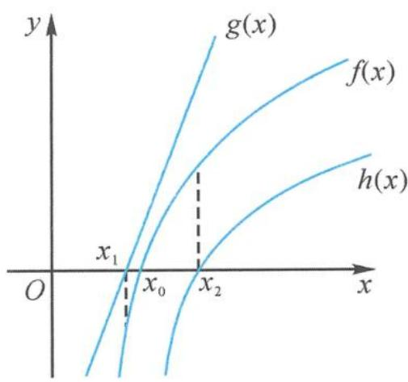

## 4.1 极限问题与零点问题

利用零点存在定理证明函数的零点个数是导数压轴题中的热点命题形式,同时也是考生不易掌握的难点部分.当使用零点存在定理证明时,我们需要找到零点所在区间的界,需要取合适的区间界点,而取点的手段具有一定的难度与技巧性.在考场上遇见时,短时间内难以想到合适的答案.其实,虽然这一问题求解有困难,但并不是毫无规律.本章将从取点的原理及手段入手,举例讲解破解零点问题的有效手段.需要注意的是,取点问题是以极限为背景进行命题的,因此本章不仅仅包含零点的取点问题,还包含恒成立中的取点问题、极限存在性问题等.

## 4.1.1 准备工作

## (1) 原理

下面叙述取点的原理.

设函数 $f(x)$ 在定义域上单调递增, 且存在一个零点 $x = x_0$ , 已知该零点无法通过代数方法解出, 则为了证明该函数在定义域上有零点, 我们需要找到合适的上下界, 证明函数值在两个界点处异号.

为了寻找一个点 $x = x_{1}$ 作为区间左端点，使 $f(x_{1}) < 0$ ，我们需要找到一个函数 $g(x)$ ，设置如下要求： $g(x) > f(x)$ ，且 $g(x)$ 的零点 $x = x_{1}$ 可以通过代数方法解出。那么，当 $x = x_{1}$ 时，必有 $x_{1} < x_{0}$ ，且 $f(x_{1}) < 0$ 。

同理,为了寻找一个点 $x=x_{2}$ 作为区间右端点,使 $f(x_{2})>0$ ,我们也需要找到一个函数 $h(x)$ ,其中 $h(x)<f(x)$ ,且 $h(x)$ 有代数零点 $x=x_{2}$ .那么,当 $x=x_{2}$ 时,必有 $x_{2}>x_{0}$ ,且 $f(x_{2})>0$ .

函数 $f(x)$ 在定义域上单调递减的情况同理.

我们可以通过如下示意图来直观地理解这个原理。(仅绘出 $f(x)$ 单调递增的示意图, 图象表示的是原函数零点附近的大致走势, 并非全局的单调性)

## (2)手段

在真正解题时,我们需要通过一些手段找到自己想要的区间界点.下面对取点常用的手段进行介绍.

## (i) 放缩

根据上面的原理,我们在寻找函数时,可以使用放缩的方法构造我们想要的函数.具体来说,放缩大概有以下几种方法.

①添项或减项放缩. 在处理一些复杂的函数式时, 可以将其中的一些项“忽略”, 达到放大或缩小式子的目的. 这种方法需要考虑整个函数的取值趋势, 尽量将无关紧要的项去掉.

②常见不等式放缩. 处理函数时可以选取一些常见的不等式, 对函数进行放缩以达到目的. 选用的不等式应当使变形后的函数容易求得零点.

③常数放缩. 题中给出的定义域条件可以帮助我们将一些代数式转变为常数, 达到放大或缩小的目的. 例如当 $x > 0$ 时, $\mathrm{e}^{x} > 1$ .

④预设条件放缩.为了构造证明的条件,我们可以在定义域内设定一段小的区间,从而在小区间内应用相应不等式得到合适的函数,找到放缩后的函数的零点.

⑤绝对值放缩. 当处理某些参数时, 由于部分参数正负情况未定, 我们可以利用绝对值进行放缩, 将其正负固定, 方便找到其上界或下界.

## (ii)直观猜想

遇到类似的试题时,可能会由于放缩不当导致找点出现困难,这时我们也可以考虑直观猜想.这种思路具有很强的技巧性,当然也具有不确定性,需要配合函数的走势进行分析.建议读者在了解放缩法的应用,并拥有一定经验之后,再使用直观猜想,这样可以节省思考的时间.也可将直观猜想与放缩法配合使用,可能会收到意料之外的效果.

## (iii)局部估值调整

找点时亦可以观察函数本身的组成方式,对函数“分而治之”,将函数分为带参数与不带参数的几个部分,定出其中不带参数的一部分或几部分的符号,再根据函数整体的符号考虑含有参数部分的符号,也可以找到相应的点.

## (3)变形技巧

在进行放缩时,我们可以通过一些变形技巧构造出更符合题意的式子.下面对一些变形技巧进行介绍.

## (i) 对数化

对数化是利用对数性质,将函数式中的对数与常数合并,再使用相关不等式进行放缩.例如:

$$
\ln x + a = \ln (x \mathrm{e} ^ {a}).
$$

## (ii) 指数化

指数化是利用指数性质,将式子或者参数转移到指数位置上,以方便放缩.例如:

$$
x \mathrm{e} ^ {x} = \mathrm{e} ^ {x + \ln x} (x > 0), a ^ {x} = \mathrm{e} ^ {\ln a ^ {x}} = \mathrm{e} ^ {x \ln a}.
$$

## (4)高观点背景

## (i) 函数极限运算

若 $\lim_{x\to a}f(x) = A,\lim_{x\to a}g(x) = B$ ，则 $\lim_{x\to a}[f(x)\pm g(x)] = A\pm B,\lim_{x\to a}[f(x)g(x)] = AB.$

若 $\lim_{x\to a}f(x) = A,\lim_{x\to a}g(x) = B\neq 0$ ，则 $\lim_{x\to a}\frac{f(x)}{g(x)} = \frac{A}{B}.$

## (ii) 函数极限

设 $\lambda > 0, a > 1$ ，则 $\lim_{x \to +\infty} \frac{\ln x}{x^{\lambda}} = 0^{+}$ ， $\lim_{x \to +\infty} \frac{x^{\lambda}}{a^{x}} = 0^{+}$ ， $\lim_{x \to +\infty} \frac{\ln x}{a^{x}} = 0^{+}$ .

设 $\lambda > 0, a > 1, \mu \in \mathbb{R}$ , 则 $\lim_{x \to +\infty} (x^{\lambda} - \mu \ln x) = +\infty$ , $\lim_{x \to +\infty} (a^x - \mu x^{\lambda}) = +\infty$ , $\lim_{x \to +\infty} (a^x - \mu \ln x) = +\infty$ .

设 $\lambda > 0, \mu > 0$ ，则 $\lim_{x \to 0^{+}} x^{\lambda} \ln x = 0^{-}$ ， $\lim_{x \to 0^{+}} \left( \lambda \ln x + \frac{1}{x^{\mu}} \right) = +\infty$ 。

## (iii) 函数增长速度

$\ln x < x^{\lambda} < a^{x} < x^{x}$ ，其中 $\lambda > 0, a > 1$ 。(排序中，后一个比前一个高阶无穷大)

## (5)零点取点中的“三、二、一”

## (i) 三看

看正负、看无穷、看类别。

## (ii)二放

① $e^{x}\geqslant ex.$

令 $x \to \frac{x}{n} (x, n > 0)$ , 则 $\mathrm{e}^{\frac{x}{n}} \geqslant \mathrm{e} \cdot \frac{x}{n} \Rightarrow \mathrm{e}^{x} \geqslant \left(\frac{\mathrm{e}}{n}\right)^{n} \cdot x^{n}$ .

当 $x \to +\infty$ 时， $\mathrm{e}^x, \left(\frac{\mathrm{e}}{n}\right)^n \cdot x^n$ 均趋向正无穷.

当 x>0 时, 特殊化: $e^{x}>x$ , $e^{x}>x^{2}$ , $e^{x}>\frac{1}{6}x^{3}$ , $\cdots(x\to+\infty)$ ,

当 x<0，即 -x>0 时， $e^{x}<-\frac{1}{x}$ ， $e^{x}<\frac{1}{x^{2}}$ ， $e^{x}<-\frac{6}{x^{3}}$ ， $\cdots(x\to-\infty)$ 。

② $\ln x\leqslant\frac{1}{e}x.$

令 $x \to x^n (x, n > 0)$ ，则 $\ln x^n \leqslant \frac{1}{\mathrm{e}} x^n \Rightarrow \ln x \leqslant \frac{1}{ne} x^n$ 。

当 $x \to +\infty$ 时, $\ln x, \frac{1}{ne} x^n$ 均趋向正无穷.

特殊化: $\ln x < \sqrt{x} (x \to +\infty)$ , $\ln x > -\frac{1}{\sqrt{x}} (x \to 0)$ , $\cdots$ .

## (iii)一变

美是追求.

## 4.1.2 经典问题

## (1) 极限问题

## (i)幂函数与对数函数

例题 95 设 $m > 0, \lambda \in R$ ，证明：存在 $x_{0} > 0$ ，使得当 $x > x_{0}$ 时，恒有 $x^{m} - \lambda \ln x > 0$ .
证明 证法一: 当 $\lambda \leqslant 0$ 时, 取 $x_{0} = 1$ 即可.

当 $\lambda > 0$ 时，取 $x_0 = \left(\frac{\lambda}{m}\right)^{\frac{2}{m}}$ ，当 $x > x_0$ 时，利用不等式 $\ln x < \sqrt{x}$ ，则有

$$
x ^ {m} - \lambda \ln x = x ^ {m} - \frac {\lambda}{m} \ln x ^ {m} > x ^ {m} - \frac {\lambda}{m} \sqrt {x ^ {m}} = \sqrt {x ^ {m}} \left(\sqrt {x ^ {m}} - \frac {\lambda}{m}\right) > \sqrt {x ^ {m}} \left(\sqrt {x _ {0} ^ {m}} - \frac {\lambda}{m}\right) = 0.
$$

证法二: 取 $x_{0}=2+\left(\frac{|\lambda|}{m}\right)^{\frac{2}{m}}$ ，当 $x>x_{0}$ 时，利用不等式 $\ln x<\sqrt{x}$ ，则有

$$
x ^ {m} - \lambda \ln x \geqslant x ^ {m} - \frac {| \lambda |}{m} \ln x ^ {m} \geqslant x ^ {m} - \frac {| \lambda |}{m} \sqrt {x ^ {m}} = \sqrt {x ^ {m}} \left(\sqrt {x ^ {m}} - \frac {| \lambda |}{m}\right) > \sqrt {x ^ {m}} \left(\sqrt {x _ {0} ^ {m}} - \frac {| \lambda |}{m}\right) > 0.
$$

注1 在证法一中, $y = x^{m}$ 是单调递增的函数, $y = -\lambda \ln x$ 的单调性未定,可以做一个初步的分类:

①当 $\lambda \leqslant 0$ 时， $f(x) = x^{m} - \lambda \ln x$ 单调递增，而 $f(x) = x^{m} - \lambda \ln x > -\lambda \ln x$ ，因此只需要 $-\lambda \ln x \geqslant 0$ 即可，此时 $x_{0}$ 取任何大于等于1的数均可。

②当 $\lambda > 0$ 时, $\ln x$ 可以将 $x$ 降次, 但此时 $y = x^{m}$ 的次数 $m$ 是变动的, 需要将 $y = -\lambda \ln x$ 中 $x$ 的次数与 $m$ 挂钩, $x^{m} - \lambda \ln x = x^{m} - \frac{\lambda}{m} \ln x^{m}$ , 将 $x^{m}$ 看作一个整体, 利用 $\ln x < \sqrt{x}$ 放缩即可.

注 2 证法一对 $\lambda$ 的正负情况作了一个分类, 证法二利用绝对值不等式调整, 预设 x > 1, 则 $\ln x > 0$ .

因为 $-\lambda \geqslant -|\lambda|$ ，所以 $x^{m} - \lambda \ln x \geqslant x^{m} - \frac{|\lambda|}{m} \ln x^{m} \geqslant x^{m} - \frac{|\lambda|}{m} \sqrt{x^{m}} = \sqrt{x^{m}}\left(\sqrt{x^{m}} - \frac{|\lambda|}{m}\right)$ ，只需要 $\sqrt{x^{m}} \geqslant \frac{|\lambda|}{m}$ ，即 $x \geqslant \left(\frac{|\lambda|}{m}\right)^{\frac{2}{m}}$ ，但此时 $\left(\frac{|\lambda|}{m}\right)^{\frac{2}{m}}$ 并不一定大于 1，因此可以令 $x_{0} = 2 + \left(\frac{|\lambda|}{m}\right)^{\frac{2}{m}}$ 。

注3 （类似题）证明：不论 $m$ 取何正值，总存在正数 $x_0$ ，使得当 $x \in (x_0, +\infty)$ 时，恒有 $\frac{\ln x}{mx} < \frac{1}{2}$ .

注4 （类似题）证明：对任意给定的 $m > 0$ ，总存在正数 $x_0$ ，使得当 $x > x_0$ 时，恒有 $\sqrt{x} > m\ln x$

## (ii)幂函数与指数函数

例题 96 设 m>0, a>1, $\lambda>0$ , 证明: 存在 $x_{0}>0$ 使得当 $x>x_{0}$ 时, 恒有 $a^{x}-\lambda x^{m}>0$ .

证明 取 $x_0 = \lambda^{\frac{1}{m}}\cdot \left(\frac{m}{\ln a}\right)^2$ ，利用不等式 $\mathrm{e}^x >x^2 (x > x_0)$ ，则

$$
\begin{array}{r l} a ^ {x} - \lambda x ^ {m} & = \mathrm{e} ^ {x \ln a} - \lambda x ^ {m} = (\mathrm{e} ^ {\frac {x \ln a}{m}}) ^ {m} - \lambda x ^ {m} > \left(\frac {x \ln a}{m}\right) ^ {2 m} - \lambda x ^ {m} = x ^ {m} \left[ \left(\frac {\ln a}{m}\right) ^ {2 m} x ^ {m} - \lambda \right] \\ & > x ^ {m} \left[ \left(\frac {\ln a}{m}\right) ^ {2 m} x _ {0} ^ {m} - \lambda \right] = 0. \end{array}
$$

注 考虑到不等式 $e^{x}>x^{2}$ 可以将 x 升次, 不妨利用此不等式解决此题, 但是题中 $x^{m}$ 的次数是未定的, 因此考虑将 $a^{x}$ 转化为与 m 有关系的结构, 即 $a^{x}-\lambda x^{m}=e^{x\ln a}-\lambda x^{m}=(e^{\frac{x\ln a}{m}})^{m}-\lambda x^{m}$ . 接下来将 $\frac{x\ln a}{m}$ 看作一个整体, 利用不等式 $e^{x}>x^{2}$ 放缩即可.

## (iii) 多项式函数

例题 97 证明: 存在 $x_0$ , 使得当 $x > x_0$ 时, 有 $\mathrm{e}^x > a_0 + a_1 x + a_2 x^2 + \cdots + a_n x^n$ , 其中 $n \in \mathbb{N}^*$ . 证明 令

$$
f (x) = \mathrm{e} ^ {x} - \left(a _ {0} + a _ {1} x + a _ {2} x ^ {2} + \dots + a _ {n} x ^ {n}\right),
$$

利用不等式 $e^{x}>x^{2}$ 求解. 设 $m=\max\left\{\left|a_{0}\right|,\left|a_{1}\right|,\cdots,\left|a_{n}\right|\right\}$ ，取

$$
x _ {0} = 2 + n ^ {2} \sqrt [ n ]{m (n + 1)}.
$$

当 $x > x_0$ 时，

$$
\begin{array}{r l} f (x) & \geqslant \mathrm{e} ^ {x} - m (n + 1) x ^ {n} = (\mathrm{e} ^ {\frac {x}{n}}) ^ {n} - m (n + 1) x ^ {n} > \left(\frac {x}{n}\right) ^ {2 n} - m (n + 1) x ^ {n} \\ & = x ^ {n} \left[ \frac {x ^ {n}}{n ^ {2 n}} - m (n + 1) \right] > x ^ {n} \left[ \frac {x _ {0} ^ {n}}{n ^ {2 n}} - m (n + 1) \right] > 0. \end{array}
$$

注 由上面的“(ii)幂函数与指数函数”可以知道,存在 $x_0 > 0$ 使得当 $x > x_0$ 时,恒有 $\mathrm{e}^x - \lambda x^m > 0$ , 因此可以将 $y = a_0 + a_1x + a_2x^2 + \cdots + a_nx^n$ 放缩成 $y = tx^n$ , 其中 $a_0, a_1, \cdots, a_n, x$ 的正负均未定. 因为 $x > x_0$ , 不妨限制 $x > 1$ , 此时有 $x^n > x^{n-1} > \cdots > x > 1$ . 设 $|a_0|, |a_1|, \cdots, |a_n|$ 中的最大值为 $m$ , 因此有 $a_0 + a_1x + a_2x^2 + \cdots + a_nx^n \leqslant m + mx + mx^2 + \cdots + mx^n < mx^n + mx^n + \cdots + mx^n = m(n+1)x^n$ , 而后利用“(ii)幂函数与指数函数”中的处理手段证明.

## (2)零点问题

例题 98 讨论函数 $f(x)=\ln x-ax+b(a,b\in\mathbb{R})$ 零点的个数.

解答 对已知函数求导, 得

$$
f ^ {\prime} (x) = \frac {1}{x} - a.
$$

①若 a=0，则 $f(x)=\ln x+b$ ， $f(x)$ 有唯一零点 $e^{-b}$ .

②若 $a < 0$ ，则 $f'(x) > 0, f(x)$ 单调递增。又 $f(\mathrm{e}^{-b}) > 0, f(\mathrm{e}^{-|a - b| - 1}) < 0$ ，故 $\exists x_1 \in (\mathrm{e}^{-|a - b| - 1}, \mathrm{e}^{-b})$ 使得 $f(x_1) = 0$ ，此时 $f(x)$ 有唯一零点。

③若 $a > 0$ ，则当 $0 < x < \frac{1}{a}$ 时， $f'(x) > 0, f(x)$ 单调递增；当 $x > \frac{1}{a}$ 时， $f'(x) < 0, f(x)$ 单调递减。从而

$$
f (x) _ {\max} = f \left(\frac {1}{a}\right) = b - 1 - \ln a.
$$

(i) 当 $a = e^{b-1}$ 时, $f(x)$ 有唯一零点 $\frac{1}{a}$ ;

(ii) 当 $a > e^{b-1}$ 时, $f(x)$ 无零点;

（iii）当 $0 < a < \mathrm{e}^{b - 1}$ 时， $f(x)_{\max} > 0$ ，且 $f(\mathrm{e}^{-b}) < 0, f\left(\frac{\mathrm{e}^b}{a^2}\right) < 0$ ，故 $\exists x_2 \in \left(\mathrm{e}^{-b}, \frac{1}{a}\right)$ 使得 $f(x_2) = 0$ ， $\exists x_3 \in \left(\frac{1}{a}, \frac{\mathrm{e}^b}{a^2}\right)$ 使得 $f(x_3) = 0$ ，故 $f(x)$ 有两个零点.

综上: 当 $a > e^{b-1}$ 时, $f(x)$ 无零点; 当 $a \leqslant 0$ 或 $a = e^{b-1}$ 时, $f(x)$ 有唯一零点; 当 $0 < a < e^{b-1}$ 时, $f(x)$ 有两个零点.

注1 当 $a < 0$ 时的分析: 当 $x \to +\infty$ 时, $\ln x, -ax$ 均趋向正无穷, 且 $-ax > 0$ 恒成立, 因此有 $f(x) = \ln x - ax + b > \ln x + b$ , 故取 $x = e^{-b}$ 即可; 当 $x \to 0$ 时, $\ln x \to -\infty, -ax \to 0$ , 因此可以将 $-ax$ 放缩成一个常数, 故限制 $x < 1$ , 则有 $f(x) = \ln x - ax + b < \ln x - a + b$ ; 当 $x < e^{a - b}$ 时, $\ln x - a + b < 0$ . 因为 $e^{a - b}$ 与 1 的大小关系并不确定, 因此可以取 $x_0 = \min \{1, e^{a - b}\}$ , 或者利用绝对值函数调整, 即 $e^{-|a - b|} \leqslant 1, e^{-|a - b| - 1} < 1$ .

注2 当 $0 < a < \mathrm{e}^{b - 1}$ 时的分析: 当 $x \to 0$ 时, $\ln x \to -\infty$ , $f(x) = \ln x - ax + b < \ln x + b$ , 因此取 $x = \mathrm{e}^{-b}$ 即可; 当 $x \to +\infty$ 时, $\ln x \to +\infty$ , $ax \to +\infty$ , 利用 $\ln x < \sqrt{x}$ 有 $f(x) = \ln x - ax + b < \sqrt{x} - ax + b$ , 此时将原函数放缩成一个开口向下的类二次函数, 因此当 $x \to +\infty$ 时, $\ln x - ax + b \to -\infty$ . 此时直接取点, 比较不美观, 尝试将函数变形 $f(x) = \ln x - ax + b = \ln e^bx - ax < \sqrt{e^bx} - ax$ , 故取 $x = \frac{\mathrm{e}^b}{a^2}$ 即可.

例题 99 讨论函数 $f(x)=x\ln x-ax+b(a,b\in\mathbb{R})$ 的零点个数.

解答 对已知函数求导, 得

$$
f ^ {\prime} (x) = \ln x + 1 - a.
$$

当 $0 < x < \mathrm{e}^{a - 1}$ 时， $f'(x) < 0, f(x)$ 单调递减；当 $x > \mathrm{e}^{a - 1}$ 时， $f'(x) > 0, f(x)$ 单调递增。从而

$$
f (x) _ {\min} = f \left(\mathrm{e} ^ {a - 1}\right) = b - \mathrm{e} ^ {a - 1}.
$$

①若 $b > e^{a-1}$ ，则 $f(x)$ 无零点.

②若 $b=e^{a-1}$ ，则 $f(x)$ 有唯一零点 $e^{a-1}$ .

③若 $b < e^{a-1}$ ，进行二次分类：

(i) 若 $b = 0$ ，则 $f(x) = x \ln x - ax$ ，此时 $f(x)$ 有唯一零点 $e^a$ .

(ii) 若 $0 < b < \mathrm{e}^{a - 1}$ , 则 $f(x)_{\min} = b - \mathrm{e}^{a - 1} < 0, f(\mathrm{e}^a) > 0, f\left(\frac{b^2}{\mathrm{e}^a}\right) > 0$ ，故 $\exists x_1 \in \left(\frac{b^2}{\mathrm{e}^a}, \mathrm{e}^{a - 1}\right)$ 使得 $f(x_1) = 0, \exists x_2 \in (\mathrm{e}^{a - 1}, \mathrm{e}^a)$ 使得 $f(x_2) = 0$ ，此时 $f(x)$ 有两个零点.

（iii）若 $b < 0$ ，当 $x < \mathrm{e}^{a - 1}$ 时， $f(x) < 0, f(\mathrm{e}^{a + 1} - b) > 0$ ，故 $\exists x_3 \in (\mathrm{e}^{a - 1}, \mathrm{e}^{a + 1} - b)$ 使得 $f(x_3) = 0$ ，此时 $f(x)$ 有唯一零点.

综上: 当 $b > e^{a-1}$ 时, $f(x)$ 无零点; 当 $b = e^{a-1}$ 或 $b \leqslant 0$ 时, $f(x)$ 有唯一零点; 当 $0 < b < e^{a-1}$ 时, $f(x)$ 有两个零点.

注 1 当 b>0 时的分析: 当 $x \to +\infty$ 时, $f(x)=x \ln x - ax + b > x \ln x - ax = x (\ln x - a)$ , 取 $x=e^{a}$ .

当 $x \to 0$ 时，利用不等式 $\ln x > -\frac{1}{\sqrt{x}}$ ，则有 $f(x) = x \ln x - ax + b = x \ln \frac{x}{e^a} + b > x \cdot (-\sqrt{\frac{e^a}{x}}) + b = b - \sqrt{e^a x}$ .

令 $b - \sqrt{\mathrm{e}^a x} = 0$ ，解得 $x = \frac{b^2}{\mathrm{e}^a}$ ，取 $x = \frac{b^2}{\mathrm{e}^a}$ 即可。

注2 当 $b < 0$ 时的分析: $f(x) = x \ln x - ax + b = x (\ln x - a) + b$ , 设 $x > \mathrm{e}^{a + 1}$ , 则 $f(x) > x + b$ , 令 $x + b = 0$ , 解得 $x = -b$ , 因此可以取 $x = \mathrm{e}^{a + 1} - b$ .

注3 实际上, $f(x)=x\left(-\ln\frac{1}{x}+\frac{b}{x}-a\right)$ ,这便转化为例题98的问题了.

例题 100 已知 $f(x)=x\ln x+\mathrm{e}^{1-x}-a$ 有两个不相等的零点 $x_{1}, x_{2}$ ，求 a 的取值范围.
解答 对 $f(x)$ 求导得

$$
f ^ {\prime} (x) = 1 + \ln x - \mathrm{e} ^ {1 - x}.
$$

易知 $f'(x)$ 单调递增，且 $f'(1)=0$ .

当 0 < x < 1 时， $f'(x) < 0$ ， $f(x)$ 单调递减；当 x > 1 时， $f'(x) > 0$ ， $f(x)$ 单调递增。

若 $f(x)$ 有两个不相等的零点, 则必有 $f(1) < 0$ , 即

$$
a > 1.
$$

①当 $a \geqslant e$ 时，

若 $0 < x < 1$ ，则 $f(x) < \mathrm{e}^{1 - x} - a < \mathrm{e} - a \leqslant 0$ ，此时 $f(x)$ 在区间 $(0, +\infty)$ 上最多有一个零点，不符合题意。

②当 1<a<e 时，

若 $0 < x < 1$ ，取 $m = \frac{(a - e)^2}{\mathrm{e}^{\mathrm{e}}}$ ，利用 $\mathrm{e}^x\geqslant \mathrm{e}x,\ln x > - \frac{1}{\sqrt{x}}$ ，则

$$
f (m) = m \ln m + \mathrm{e} ^ {1 - m} - a > m \ln m + \mathrm{e} (1 - m) - a = m \ln \frac {m}{\mathrm{e} ^ {\mathrm{e}}} + \mathrm{e} - a > - \sqrt {m \mathrm{e} ^ {\mathrm{e}}} + \mathrm{e} - a = 0.
$$

取 $n = \mathrm{e}^{a}$ ，则

$$
f (n) = n \ln n + \mathrm{e} ^ {1 - n} - a > n \ln n - a = a \mathrm{e} ^ {a} - a > 0.
$$

不妨设 $x_{1} < x_{2}$ ，则 $\exists x_{1} \in (m, 1)$ 使得 $f(x_{1}) = 0$ ； $\exists x_{2} \in (1, n)$ 使得 $f(x_{2}) = 0$ 。

综上: $a\in(1,e)$ .

注1 $f(x) = x\ln x + \mathrm{e}^{1 - x} - a > x\ln x + \mathrm{e}(1 - x) - a = x\ln \frac{x}{\mathrm{e}^{\mathrm{e}}} +\mathrm{e} - a > - \sqrt{x\mathrm{e}^{\mathrm{e}}} +\mathrm{e} - a.$

注 2 取 x>1，则 $f(x)=x\ln x+\mathrm{e}^{1-x}-a>x\ln x-a>\ln x-a.$

## 4.1.3 高考真题讲解

例题 101 设函数 $f(x)=x-\ln(x+m)$ ，其中常数 m 为整数.

(1) 当 m 为何值时, $f(x) \geqslant 0$ ?

(2)定理:若函数 $g(x)$ 在区间 $[a,b]$ 上连续,且 $g(a)$ 与 $g(b)$ 异号,则至少存在一点 $x_{0}\in(a,b)$ ,使 $g(x_{0})=0$ .

试利用上述定理证明: 当整数 m>1 时, 方程 $f(x)=0$ 在区间 $[e^{-m}-m, e^{2m}-m]$ 上有两个实数根.

解答 (1)对 $f(x)$ 求导得

$$
f ^ {\prime} (x) = \frac {x + m - 1}{x + m}.
$$

当 $-m < x < 1 - m$ 时, $f'(x) < 0$ , $f(x)$ 单调递减; 当 $x > 1 - m$ 时, $f'(x) > 0$ , $f(x)$ 单调递增.

因此有

$$
f (x) _ {\min} = f (1 - m) = 1 - m \geqslant 0,
$$

解得

$$
m \leqslant 1.
$$

(2)由(1)知:当m>1时, $f(1-m)<0$ .又

$$
f \left(\mathrm{e} ^ {- m} - m\right) = \mathrm{e} ^ {- m} > 0, f \left(\mathrm{e} ^ {2 m} - m\right) = \mathrm{e} ^ {2 m} - 3 m > (1 + 1) ^ {2 m} - 3 m > \mathrm{C} _ {2 m} ^ {0} + \mathrm{C} _ {2 m} ^ {1} + \mathrm{C} _ {2 m} ^ {2} - 3 m
$$

$$
= \frac {(2 m - 1) ^ {2} + 1}{2} > 0, \text {且} \mathrm{e} ^ {- m} - m <   1 - m <   \mathrm{e} ^ {2 m} - m,
$$

因此 $\exists x_{1}\in (\mathrm{e}^{-m} - m,1 - m)$ 使得 $f(x_{1}) = 0$ ； $\exists x_{2}\in (1 - m,\mathrm{e}^{2m} - m)$ 使得 $f(x_{2}) = 0$ 。

注 本题为 2004 年普通高等学校招生全国统一考试(广东卷)试题.

例题 102 已知函数 $f(x)=\ln x-ax$ , $g(x)=\mathrm{e}^{x}-ax$ , 其中 a 为实数.

(1) 若 $f(x)$ 在区间 $(1, +\infty)$ 上是单调减函数, 且 $g(x)$ 在区间 $(1, +\infty)$ 上有最小值, 求 $a$ 的取值范围.

(2) 若 $g(x)$ 在区间 $(-1, +\infty)$ 上是单调增函数, 试求 $f(x)$ 的零点个数, 并证明你的结论.

解答 (1)由题意知, $f'(x)=\frac{1}{x}-a\leqslant0$ 对 $x\in(1,+\infty)$ 恒成立,即 $a\geqslant\frac{1}{x}$ ,易知 $a\geqslant1$ .

对 $g(x)$ 求导, 得

$$
g ^ {\prime} (x) = \mathrm{e} ^ {x} - a.
$$

当 $0 < x < \ln a$ 时， $g'(x) < 0, g(x)$ 单调递减；当 $x > \ln a$ 时， $g'(x) > 0, g(x)$ 单调递增。从而 $\ln a > 1$ ，解得 $a > e$ 。

综上： $a\in (e, + \infty)$

(2)由题意知 $g'(x)=\mathrm{e}^{x}-a\geqslant0$ , 即 $a\leqslant e^{x}$ 对 $x\in(-1,+\infty)$ 恒成立，即 $a\leqslant\frac{1}{e}$ .

对 $f(x)$ 求导, 得

$$
f ^ {\prime} (x) = \frac {1}{x} - a.
$$

①若 a=0，则 $f(x)=\ln x$ ，此时 $f(x)$ 存在唯一零点.

②若 $0 < a \leqslant \frac{1}{\mathrm{e}}$ ，当 $0 < x < \frac{1}{a}$ 时， $f'(x) > 0, f(x)$ 单调递增；当 $x > \frac{1}{a}$ 时， $f'(x) < 0, f(x)$ 单调递减。从而

$$
f (x) _ {\max} = f \left(\frac {1}{a}\right) = \ln \frac {1}{a} - 1.
$$

(i) 当 $a = \frac{1}{\mathrm{e}}$ 时, $f(x)_{\max} = 0$ , 因此 $f(x)$ 仅有一个零点 $\mathbf{e}$ .

（ii）当 $0 < a < \frac{1}{\mathrm{e}}$ 时， $f(x)_{\max} = f\left(\frac{1}{a}\right) > 0$ 。此时 $f\left(\frac{1}{\mathrm{e}}\right) = -1 - \frac{a}{\mathrm{e}} < 0$ ，故 $\exists x_1 \in \left(\frac{1}{\mathrm{e}}, \frac{1}{a}\right)$ 使得 $f(x_1) = 0$ 。由不等式 $\ln x < \sqrt{x}$ 知 $f\left(\frac{1}{a^2}\right) < 0$ ，故 $\exists x_2 \in \left(\frac{1}{a}, \frac{1}{a^2}\right)$ 使得 $f(x_2) = 0$ ，此时 $f(x)$ 存在两个零点。

③若 $a < 0$ ，则 $f^{\prime}(x) > 0, f(x)$ 单调递增，又 $f(\mathrm{e}^{a}) = a(1 - \mathrm{e}^{a}) < 0, f(1) = -a > 0$ ，故 $\exists x_{3} \in (\mathrm{e}^{a}, 1)$ 使得 $f(x_{3}) = 0$ ，此时 $f(x)$ 存在唯一零点.

综上: 当 $a \in \left(0, \frac{1}{\mathrm{e}}\right)$ 时, $f(x)$ 有两个零点; 当 $a \in (-\infty, 0] \cup \left\{\frac{1}{\mathrm{e}}\right\}$ 时, $f(x)$ 有一个零点.

注 1 本题为 2013 年普通高等学校招生全国统一考试(江苏卷)试题.

注2 在第(1)问中, 由 $f(x)$ 在区间 $(1, +\infty)$ 上是单调减函数, 可转化为 $f'(x) \leqslant 0$ 在区间 $(1, +\infty)$ 上恒成立, 此时容易求得 $a \geqslant 1$ . 而后对 $g(x)$ 求导可知, 当 $x = \ln a$ 时, $g(x)$ 取得最小值. 由题意不难得出 $\ln a > 1$ , 即有 $a > e$ .

第(2)问前半部分起点很低,类似第(1)问前半部分,转化为 $g'(x)\leqslant0$ 在区间 $(-1,+\infty)$ 上恒成立,不难得出 $a\leqslant\frac{1}{e}$ .而后在 $a\leqslant\frac{1}{e}$ 的条件下,讨论 $f(x)$ 的零点个数,此时深入讨论,情况就比较复杂了.

下面我们就重点解决复杂情况带来的一些问题,并在解决问题的过程中逐步优化自己的思维.

现在,我们把目光放在第(2)问后半部分上,即在 $a \leqslant \frac{1}{e}$ 的条件下,讨论 $f(x) = \ln x - ax$ 的零点个数.首先按照a=0与 $a \neq 0$ 分类(一次分类).

当 a=0 时， $f(x)=\ln x$ 无参数，容易知道 $f(x)$ 有唯一零点 1.

当 $a \neq 0$ 时, $f'(x) = \frac{1}{x} - a$ , 此时将 $a$ 分为 $a < 0, 0 < a \leqslant \frac{1}{e}$ (二次分类), 其中当 $a < 0$ 时, 由 $f'(x) = \frac{1}{x} - a > 0$ 可知 $f(x) = \ln x - ax$ 在区间 $(0, +\infty)$ 上单调递增, 那么 $f(x)$ 最多有一个零点. 是否一定有零点呢? 这不是凭直觉可以得出结论的, 需要通过严谨的论证得出结果, 这便是第一个需要解决的问题.

当 $0 < a \leqslant \frac{1}{\mathrm{e}}$ 时，由 $f'(x) = \frac{1}{x} - a = 0$ 得 $x = \frac{1}{a}$ . 当 $0 < x < \frac{1}{a}$ 时， $f'(x) > 0, f(x)$ 单调递增；当 $x > \frac{1}{a}$ 时， $f'(x) < 0, f(x)$ 单调递减. 因此 $\frac{1}{a}$ 为极大值点，也是最大值点，则 $f(x)_{\max} = f\left(\frac{1}{a}\right) = -\ln a - 1$ . 而由前面的讨论知 $a \leqslant \frac{1}{\mathrm{e}}$ ，因此必有 $f(x)_{\max} \geqslant 0$ .

接下来我们需要按照 $f\left(\frac{1}{a}\right) = 0, f\left(\frac{1}{a}\right) > 0$ (三次分类)两种情况分类讨论, 其中当 $f\left(\frac{1}{a}\right) = -\ln a - 1 = 0$ , 即 $a = \frac{1}{e}$ 时, 容易知道 $f(x)$ 有唯一零点 $e$ ; 当 $f\left(\frac{1}{a}\right) > 0$ , 即 $0 < a < \frac{1}{e}$ 时, 情况就变得复杂了, 因为函数 $f(x)$ 先增后减, 且最大值大于零, 则 $f(x)$ 最多存在两个零点, 那么究竟有两个零点, 还是一个零点, 或是没有零点, 依然不是凭直觉可以知道的, 需要经过严谨的论证. 这便是第二个需要解决的问题.

通过上面的分析,我们最终提取两个需要重点关注的问题:①当 a<0 时,函数 $f(x)$ 的零点情况;②当 $0<a<\frac{1}{e}$ 时,函数 $f(x)$ 的零点情况.

利用局部放缩解决重点问题①. 当 a<0 时, $f(x)=\ln x-ax$ 在区间 $(0,+\infty)$ 上单调递增, 我们首先尝试寻找 $x_{1}$ , 使得 $f(x_{1})>0$ . 通过观察不难知道可以取 $x_{1}=1$ . 实际上, 任何一个大于等于1的 $x_{1}$ 均符合题意，这是因为当 $a < 0$ 时， $f(x_{1}) = \ln x_{1} - ax_{1} > \ln x_{1}$ ，因此只需要 $\ln x_{1} \geqslant 0$ 。不妨取 $x_{1} = 1$ ，紧接着，我们尝试寻找 $x_{2}$ 使得 $f(x_{2}) < 0$ 。由前面的讨论知 $f(1) = -a > 0$ ，因此有 $x_{2} < 1$ ，此时通过简单放缩有 $f(x_{2}) = \ln x_{2} - ax_{2} < \ln x_{2} - a$ 。不妨令 $\ln x_{2} - a = 0$ ，即得到 $x_{2} = e^{a}$ 。

实际上,我们也可以通过常用不等式 $\ln x < x - 1 (0 < x < 1)$ 放缩来寻找 $x_{2}, f(x_{2}) = \ln x_{2} - ax_{2} < x_{2} - 1 - ax_{2}$ . 令 $x_{2} - 1 - ax_{2} = 0$ , 可得 $x_{2} = \frac{1}{1 - a}$ , 此时 $x_{2} < 1$ , 符合题意. 因此, 当 $a < 0$ 时, $\exists x_{0} \in (\mathrm{e}^{a}, 1)$ 使得 $f(x_{0}) = 0$ .

借助不等式放缩解决重点问题②. 当 $0 < a < \frac{1}{\mathrm{e}}$ 时, 若 $0 < x < \frac{1}{a}$ , 则 $f(x)$ 单调递增; 若 $x > \frac{1}{a}$ , 则 $f(x)$ 单调递减, 且有 $f\left(\frac{1}{a}\right) > 0$ , 其中 $\frac{1}{a} > \mathrm{e}$ .

我们尝试寻找 $x_{3} < \mathrm{e}$ 使得 $f(x_{3}) < 0$ ，通过简单放缩可以知道 $f(x_{3}) = \ln x_{3} - ax_{3} < \ln x_{3}$ . 不妨令 $\ln x_{3} = 0$ ，即 $x_{3} = 1$ .

接下来,我们尝试取 $x_{4}\left(x_{4} > \frac{1}{a}\right)$ , 使得 $f(x_{4}) = \ln x_{4} - ax_{4} < 0$ . 不妨利用 $\ln x < x - 1 (x > 1)$ , 此时 $f(x_{4}) < x_{4} - 1 - ax_{4}$ . 令 $x_{4} - 1 - ax_{4} = 0$ , 解得 $x_{4} = \frac{1}{1 - a}$ . 但此时存在一个问题, 因为 $x_{4} = \frac{1}{1 - a} < \frac{1}{a}$ , 与 $x_{4} > \frac{1}{a}$ 相矛盾, 因此需要另寻他路. 改变放缩策略, 利用不等式 $\ln x < \sqrt{x}$ 进行降阶放缩, 此时 $f(x_{4}) = \ln x_{4} - ax_{4} < \sqrt{x_{4}} - ax_{4}$ . 不妨令 $\sqrt{x_{4}} - ax_{4} = 0$ , 解得 $x_{4} = \frac{1}{a^{2}}$ , 此时 $x_{4} > \frac{1}{a}$ , 符合题意.

实际上, 可以利用换元法以及不等式 $\mathrm{e}^x > x^2$ 寻找 $x_4$ . 设 $x_4 = \mathrm{e}^m$ , 此时 $f(\mathrm{e}^m) = m - a\mathrm{e}^m < m - a m^2$ . 令 $m - a m^2 = 0$ , 得 $m = \frac{1}{a}$ , 因此 $x_4 = \mathrm{e}^{\frac{1}{a}}$ , 此时 $x_4 > \frac{1}{a}$ , 符合题意. 不等式 $\ln x < \sqrt{x}$ 与 $\mathrm{e}^x > x^2$ 有一定的联系, 其中 $\ln x < \sqrt{x} \Leftarrow \mathrm{e}^{\sqrt{x}} > x \Leftarrow \mathrm{e}^x > x^2$ . 对于 $\mathrm{e}^x > x^2$ 的证明, 也不复杂, 可以构造函数 $\varphi(x) = \frac{x^2}{\mathrm{e}^x} (x > 0)$ , 则 $\varphi'(x) = \frac{2x - x^2}{\mathrm{e}^x}$ . 当 $0 < x < 2$ 时, $\varphi'(x) > 0$ , $\varphi(x)$ 单调递增; 当 $x > 2$ 时, $\varphi'(x) < 0$ , $\varphi(x)$ 单调递减. 从而 $\varphi(x) \leqslant \varphi(2) = \frac{4}{\mathrm{e}^2} < 1$ , 因此 $\mathrm{e}^x > x^2$ . 故当 $0 < a < \frac{1}{\mathrm{e}}$ 时, $\exists x_0' \in \left(1, \frac{1}{a}\right)$ 使得 $f(x_0') = 0$ , $\exists x_0'' \in \left(\frac{1}{a}, \frac{1}{a^2}\right)$ 使得 $f(x_0'') = 0$ .

例题 103 已知函数 $f(x)=\sqrt{x}-\ln x$ .

(1) 若 $f(x)$ 在 $x = x_{1}, x_{2} (x_{1} \neq x_{2})$ 处的导数相等，证明： $f(x_{1}) + f(x_{2}) > 8 - 8\ln 2$ .

(2) 若 $a \leqslant 3 - 4 \ln 2$ ，证明：对于任意 k > 0，直线 $y = kx + a$ 与曲线 $y = f(x)$ 有唯一公共点.

解答 (1)对已知函数求导,得

$$
f ^ {\prime} (x) = \frac {1}{2 \sqrt {x}} - \frac {1}{x}.
$$

由题意知 $f'(x_{1})=f'(x_{2})$ ，即

$$
\frac {1}{2 \sqrt {x _ {1}}} - \frac {1}{x _ {1}} = \frac {1}{2 \sqrt {x _ {2}}} - \frac {1}{x _ {2}},
$$

整理得

$$
\sqrt {x _ {1} x _ {2}} = 2 (\sqrt {x _ {1}} + \sqrt {x _ {2}}).
$$

由均值不等式有 $\sqrt{x_1x_2} = 2(\sqrt{x_1} +\sqrt{x_2}) > 4\sqrt{\sqrt{x_1x_2}}$ ，即 $x_{1}x_{2} > 256.$

$$
f (x _ {1}) + f (x _ {2}) = \sqrt {x _ {1}} + \sqrt {x _ {2}} - \ln (x _ {1} x _ {2}) = \frac {1}{2} \sqrt {x _ {1} x _ {2}} - \ln (x _ {1} x _ {2}).
$$

构造函数 $g(x) = \ln x - \frac{\sqrt{x}}{2}$ ，则

$$
g ^ {\prime} (x) = \frac {1}{4 x} (4 - \sqrt {x}).
$$

当 $0 < x < 16$ 时， $g'(x) > 0, g(x)$ 单调递增；当 $x > 16$ 时， $g'(x) < 0, g(x)$ 单调递减。因此，若 $x_{1}x_{2} > 256$ ，则有

$$
g (x _ {1} x _ {2}) <   g (2 5 6) = 8 \ln 2 - 8,
$$

即有

$$
f (x _ {1}) + f (x _ {2}) > 8 - 8 \ln 2.
$$

(2)由题意知 $f(x)=kx+a$ ，则有

$$
\frac {\sqrt {x} - \ln x - a}{x} - k = 0.
$$

令 $h(x) = \frac{\sqrt{x} - \ln x - a}{x} - k$ ，则

$$
h ^ {\prime} (x) = \frac {\ln x - \frac {\sqrt {x}}{2} + a - 1}{x ^ {2}}.
$$

由(1)知 $g(x) = \ln x - \frac{\sqrt{x}}{2} \leqslant g(16) = 4\ln 2 - 2$ ，则有

$$
h ^ {\prime} (x) \leqslant \frac {4 \ln 2 - 2 + a - 1}{x ^ {2}} \leqslant 0,
$$

因此 $h(x)$ 单调递减.

又 $h(\mathrm{e}^{-|a| - k}) > 0, h\left(\left(\frac{1 + |a|}{k}\right)^2 + 1\right) < 0$ ，故存在唯一的 $x_0 \in \left(\mathrm{e}^{-|a| - k}, \left(\frac{1 + |a|}{k}\right)^2 + 1\right)$ 使得 $h(x_0) = 0$ .

因此对任意 k>0，直线 $y=kx+a$ 与曲线 $y=f(x)$ 有唯一公共点.

注 1 本题为 2018 年普通高等学校招生全国统一考试(浙江卷)试题.

注2 当 $x \to 0$ 时, $\sqrt{x} \to 0$ , $-\ln x \to +\infty$ , 因此可以将 $\sqrt{x}$ 去掉, 而后限定 $x \leqslant e^{-|a|}$ , 则 $\sqrt{x} - \ln x - a > 0$ . 因此 $g(x) = \frac{\sqrt{x} - \ln x - a}{x} - k > \frac{-\ln x - a}{x} - k \geqslant -\ln x - |a| - k$ . 令 $-\ln x - |a| - k = 0$ , 则 $x = e^{-|a| - k}$ .

注3 当 $x \to +\infty$ 时, $\sqrt{x} \to +\infty$ , $-\ln x \to -\infty$ , 将 $\ln x$ 去掉, 而后限定 $x > 1$ , 则 $\frac{1}{x} < \frac{1}{\sqrt{x}}$ . 因此 $\frac{\sqrt{x} - \ln x - a}{x} - k < \frac{\sqrt{x} - a}{x} - k \leqslant \frac{\sqrt{x} + |a|}{x} - k \leqslant \frac{1}{\sqrt{x}} + \frac{|a|}{\sqrt{x}} - k = \frac{1 + |a|}{\sqrt{x}} - k$ . 令 $\frac{1 + |a|}{\sqrt{x}} - k = 0$ , 则 $x = \left(\frac{1 + |a|}{k}\right)^2$ . 但是此时并不能保证 $x = \left(\frac{1 + |a|}{k}\right)^2$ 恒大于 1, 因此把 $x$ 限定为 $x = \left(\frac{1 + |a|}{k}\right)^2 + 1$ .

例题 104 设函数 $f(x)=\ln x-a(x-1)\mathrm{e}^{x}$ ，其中 $a\in R$ .

(1) 若 $a \leqslant 0$ ，讨论 $f(x)$ 的单调性。

(2) 若 $0 < a < \frac{1}{e}$ ,

(i) 证明: $f(x)$ 恰有两个零点;

(ii) 设 $x_{0}$ 为 $f(x)$ 的极值点, $x_{1}$ 为 $f(x)$ 的零点, 且 $x_{1} > x_{0}$ , 证明: $3x_{0} - x_{1} > 2$ .

解答 (1)对已知函数求导,得

$$
f ^ {\prime} (x) = \frac {1}{x} - a x \mathrm{e} ^ {x}.
$$

因为 $x > 0$ ，故当 $a \leqslant 0$ 时， $f'(x) = \frac{1}{x} - axe^x > 0$ ，因此 $f(x)$ 单调递增.

(2)(i)由(1)知 $f'(x)=\frac{1}{x}-axe^{x}$ ，则

$$
f ^ {\prime \prime} (x) = - \frac {1}{x ^ {2}} - a (x + 1) \mathrm{e} ^ {x} <   0,
$$

故 $f'(x)$ 单调递减.

又 $f^{\prime}(1) > 0, f^{\prime}\left(\ln \frac{1}{a}\right) < 0$ ，故 $\exists x_0 \in \left(1, \ln \frac{1}{a}\right)$ 使得 $f^{\prime}(x_0) = \frac{1}{x_0} - ax_0 e^{x_0} = 0$ .

当 $0 < x < x_0$ 时， $f'(x) > 0, f(x)$ 单调递增；当 $x > x_0$ 时， $f'(x) < 0, f(x)$ 单调递减.

又 $f(1) = 0, f(x_0) > 0, f\left(\ln \frac{1}{a}\right) = \ln \left(\ln \frac{1}{a}\right) - \left(\ln \frac{1}{a} - 1\right) < 0$ （利用 $\ln x < x - 1 (x > 1)$ ），故 $\exists x_1 \in \left(x_0, \ln \frac{1}{a}\right)$ 使得 $f(x_1) = 0$ ，因此 $f(x)$ 恰有两个零点 $1, x_1$ .

(ii) 证法一: 由 (i) 知 $1 < x_0 < x_1$ , 考虑证明 $x_1 + 1 < 2x_0$ , 即证明

$$
x _ {1} <   2 x _ {0} - 1.
$$

尝试证 $f(2x_0 - 1) = \ln (2x_0 - 1) - \frac{1}{x_0^2\mathrm{e}^{x_0}} (2x_0 - 2)\mathrm{e}^{2x_0 - 1} = \ln (2x_0 - 1) - \frac{2\mathrm{e}^{x_0 - 1}}{x_0^2} (x_0 - 1) <   0.$

当 $x > 1$ 时，由不等式 $\ln x < \sqrt{x} - \frac{1}{\sqrt{x}}$ 及 $\mathrm{e}^{x - 1} > \frac{1}{2} (x - 1)^2 + (x - 1) + 1 = \frac{1}{2} (x^2 + 1)$ ，知

$$
\begin{array}{r l} \ln (2 x _ {0} - 1) & - \frac {2 \mathrm{e} ^ {x _ {0} - 1}}{x _ {0} ^ {2}} (x _ {0} - 1) <   \sqrt {2 x _ {0} - 1} - \frac {1}{\sqrt {2 x _ {0} - 1}} - \frac {x _ {0} ^ {2} + 1}{x _ {0} ^ {2}} (x _ {0} - 1) \\ & = \frac {(x _ {0} - 1) (1 - \sqrt {2 x _ {0} - 1}) ^ {3} (2 x _ {0} + 1 + \sqrt {2 x _ {0} - 1})}{4 x _ {0} ^ {2} \sqrt {2 x _ {0} - 1}} <   0, \end{array}
$$

故 $x_{1} < 2x_{0} - 1$ ，得证.因此

$$
3 x _ {0} - x _ {1} > 3 x _ {0} - (2 x _ {0} - 1) = x _ {0} + 1 > 2.
$$

证法二:由(i)知 $1 < x_{0} < x_{1}, \frac{1}{x_{0}} - ax_{0}e^{x_{0}} = 0$ ，因此

$$
a = \frac {1}{x _ {0} ^ {2} \mathrm{e} ^ {x _ {0}}},
$$

故 $f(x_{1}) = \ln x_{1} - a(x_{1} - 1)\mathrm{e}^{x_{1}} = \ln x_{1} - (x_{1} - 1)\mathrm{e}^{x_{1} - x_{0} - 2\ln x_{0}} = 0.$ 利用 $\ln x <   x - 1(x > 1)$ ，有

$$
\ln x _ {1} - \left(x _ {1} - 1\right) \mathrm{e} ^ {x _ {1} - x _ {0} - 2 \ln x _ {0}} = 0 <   \left(x _ {1} - 1\right) - \left(x _ {1} - 1\right) \mathrm{e} ^ {x _ {1} - x _ {0} - 2 \left(x _ {0} - 1\right)},
$$

整理得

$$
3 x _ {0} - x _ {1} > 2.
$$

注 1 本题为 2019 年普通高等学校招生全国统一考试(天津卷)试题.

注2 (2)(i)中 $f'(x)$ 的零点取点过程: 因为 $f'(x)=\frac{1}{x}-axe^{x}$ 是单调递减的, 通过赋值 $x=1$ , 得 $f'(1)=1-ae>0$ . 因此, 若 $f'(x)$ 有零点, 则其必须大于 1 , 故限定 $x>1$ , 则 $f'(x)=\frac{1}{x}-axe^{x}<1-ae^{x}$ .

令 $1 - ae^x = 0$ ，解得 $x = \ln \frac{1}{a}$ 则有 $f^{\prime}\left(\ln \frac{1}{a}\right) < 0.$ 此过程将 $axe^{x}$ 中的 $x$ 放缩成常数1，也可以将 $axe^{x}$ 中的 $\mathrm{e}^x$ 放缩成常数 $1, f'(x) = \frac{1}{x} - axe^x < 1 - ax.$ 令 $1 - ax = 0$ ，解得 $x = \frac{1}{a}$ . 这个点的选取还是比较简单的.

注3 (2)(i)中 $f(x)$ 的零点的取点过程: 观察可知 $f(1)=0$ , 接下来考虑 $x>1$ 时, $f(x)=\ln x-a(x-1)e^{x}$ 的零点问题. 由本章的“4.1.2 经典问题(1)极限问题”的“(i)”和“(ii)”知, $f(x)$ 一定存在 $x>1$ 的零点. $f(x)$ 的解析式中出现了 $\ln x$ 与 $x-1$ , 利用 $\ln x<x-1$ , 则有 $f(x)=\ln x-a(x-1)e^{x}<x-1-a(x-1)e^{x}=(x-1)(1-ae^{x})$ , 其中 $y=1-ae^{x}$ 单调递减. 令 $1-ae^{x}=0$ , 解得 $x=\ln \frac{1}{a}$ .

注4 第(2)(ii)证法一利用的是极值点偏移的处理策略,要证明 $\frac{x_{1}+1}{2}<x_{0}$ ,只需证明 $x_{1}<2x_{0}-1$ .

当 $x > x_0$ 时， $f(x)$ 是单调递减的，只需证明 $f(x_1) > f(2x_0 - 1)$ ，即证明 $f(2x_0 - 1) < 0$ 。在证明 $f(2x_0 - 1) = \ln (2x_0 - 1) - \frac{2\mathrm{e}^{x_0 - 1}}{x_0^2}(x_0 - 1) < 0$ 的过程中，我们利用不等式 $\ln (2x_0 - 1) < \sqrt{2x_0 - 1} - \frac{1}{\sqrt{2x_0 - 1}}$ 及 $\mathrm{e}^{x_0 - 1} > \frac{1}{2} (x_0 - 1)^2 + (x_0 - 1) + 1 = \frac{1}{2} (x_0^2 + 1)$ 进行放缩，而后进行因式分解。实际上，可以构造函数，求导后再放缩比较简便，过程如下：

令 $g(x)=\ln(2x-1)-\frac{2e^{x-1}}{x^{2}}(x-1)$ ，则 $g'(x)=\frac{2}{2x-1}-\frac{2(x^{2}-2x+2)e^{x-1}}{x^{3}}$ 。利用 $e^{x-1}>x$ ，则有 $g'(x)=\frac{2}{2x-1}-\frac{2(x^{2}-2x+2)e^{x-1}}{x^{3}}<\frac{2}{2x-1}-\frac{2(x^{2}-2x+2)x}{x^{3}}=\frac{4(1-x)^{3}}{(2x-1)x^{2}}<0$ ，因此 $g(x)$ 单调递减，从而 $g(x)<g(1)=0$ 。

例题 105 已知 a>1, $f(x)=a^{x}-bx+e^{2}$ .

(1) 求 $f(x)$ 的单调区间.

(2)对任意的 $b>2e^{2}$ , $f(x)$ 有两个零点, 求 a 的取值范围.

(3) 若 $a = \mathrm{e}$ , 对任意的 $b > \mathrm{e}^{4}$ , 记 $f(x)$ 的两个零点为 $x_{1}, x_{2}$ , 且 $x_{1} < x_{2}$ , 证明: $x_{2} > \frac{b \ln b}{2 \mathrm{e}^{2}} x_{1} + \frac{\mathrm{e}^{2}}{b}$ .

解答 (1) 对 $f(x)$ 求导得

$$
f ^ {\prime} (x) = a ^ {x} \ln a - b.
$$

若 $b \leqslant 0$ ，则 $f'(x) > 0, f(x)$ 在 R 上单调递增.

若 $b > 0$ ，当 $x < \frac{\ln\frac{b}{\ln a}}{\ln a}$ 时， $f'(x) < 0, f(x)$ 单调递减；当 $x > \frac{\ln\frac{b}{\ln a}}{\ln a}$ 时， $f'(x) > 0, f(x)$ 单调递增.

综上: 当 $b \leqslant 0$ 时, $f(x)$ 的单调递增区间为 $(-∞, +∞)$ , 无单调递减区间;

当 $b > 0$ 时， $f(x)$ 的单调递减区间为 $\left(-\infty, \frac{\ln \frac{b}{\ln a}}{\ln a}\right)$ ，单调递增区间为 $\left(\frac{\ln \frac{b}{\ln a}}{\ln a}, +\infty\right)$ .

(2) 令 $f(x) = a^{x} - bx + \mathrm{e}^{2} = 0$ ，若 $x \leqslant 0$ ，则 $f(x)$ 无零点，故

$$
x > 0.
$$

令 $bx - \mathrm{e}^2 = t(t > 1)$ ，则 $f(x) = 0$ 转化为 $\frac{\ln t}{t + \mathrm{e}^2} -\frac{\ln a}{b} = 0$ 有两个不同的实数根.令 $\varphi (t) =$ $\frac{\ln t}{t + \mathrm{e}^2} -\frac{\ln a}{b}$ ，则

$$
\varphi^ {\prime} (t) = \frac {1 + \frac {\mathrm{e} ^ {2}}{t} - \ln t}{(t + \mathrm{e} ^ {2}) ^ {2}}.
$$

当 $1 < t < \mathrm{e}^2$ 时， $\varphi'(t) > 0, \varphi(t)$ 单调递增；当 $t > \mathrm{e}^2$ 时， $\varphi'(t) < 0, \varphi(t)$ 单调递减。若 $\varphi(t)$ 有两个零点，则必有

$$
\varphi (\mathrm{e} ^ {2}) = \frac {1}{\mathrm{e} ^ {2}} - \frac {\ln a}{b} > 0,
$$

即 $\ln a < \frac{b}{\mathrm{e}^2}$ 恒成立，即有 $\ln a \leqslant 2$ ，解得 $1 < a \leqslant \mathrm{e}^2$ 。构造函数

$$
\omega (x) = \ln x - \sqrt {x} (x > 4),
$$

则 $\omega^{\prime}(x) = \frac{2 - \sqrt{x}}{2x} < 0, \omega(x)$ 单调递减，故 $\omega(x) < \omega(4) < 0$ ，即 $\ln x < \sqrt{x}$ .

当 $1 < a \leqslant e^{2}$ 时，取 $t_{0} = \frac{b^{2}}{\ln^{2}a}$ ，则

$$
t _ {0} > \mathrm{e} ^ {2} \text {且} \varphi (t _ {0}) = \frac {\ln t _ {0}}{t _ {0} + \mathrm{e} ^ {2}} - \frac {\ln a}{b} <   \frac {\sqrt {t _ {0}}}{t _ {0}} - \frac {\ln a}{b} = 0.
$$

因为 $\varphi(1) = -\frac{\ln a}{b} < 0, \varphi(e^2) > 0$ ，所以 $\exists t_1 \in (1, e^2)$ 使得 $\varphi(t_1) = 0$ ； $\exists t_2 \in (e^2, t_0)$ 使得 $\varphi(t_2) = 0$ 。故

$$
a \in (1, \mathrm{e} ^ {2} ].
$$

(3) 当 $x \leqslant 0$ 时, $f(x) > 0$ , $f(x)$ 无零点, 故只需考虑 $x > 0$ 时的情况. 令

$$
g (x) = \frac {\mathrm{e} ^ {x} + \mathrm{e} ^ {2}}{x} - b,
$$

则 $g^{\prime}(x) = \frac{(x - 1)\mathrm{e}^{x} - \mathrm{e}^{2}}{x^{2}}$ .令

$$
h (x) = (x - 1) \mathrm{e} ^ {x} - \mathrm{e} ^ {2},
$$

则 $h'(x)=xe^{x}>0$ , $h(x)$ 单调递增, 且 $h(2)=0$ .

当 0 < x < 2 时, h(x) < 0, 即 $g'(x) < 0$ , g(x) 单调递减; 当 x > 2 时, h(x) > 0, 即 $g'(x) > 0$ , g(x) 单调递增.

若 $g(x)$ 有两个实数根，则必有 $0 < x_{1} < 2 < x_{2}, g(x_{1}) = \frac{\mathrm{e}^{x_{1}} + \mathrm{e}^{2}}{x_{1}} - b = 0 < \frac{\mathrm{e}^{2} + \mathrm{e}^{2}}{x_{1}} - b$ ，整理有

$$
\frac {b x _ {1}}{2 \mathrm{e} ^ {2}} <   1.
$$

要证明 $x_{2} > \frac{bx_{1}\ln b}{2\mathrm{e}^{2}} +\frac{\mathrm{e}^{2}}{b}$ ，尝试证明

$$
x _ {2} > \ln b + \frac {\mathrm{e} ^ {2}}{b}.
$$

$g\left(\ln b+\frac{e^{2}}{b}\right)=\frac{b(e^{\frac{e^{2}}{b}}-\ln b)}{\ln b+\frac{e^{2}}{b}}<\frac{b(e^{\frac{e^{2}}{4}}-4)}{\ln b+\frac{e^{2}}{b}}<0=g(x_{2})$ ，由于 $g(x)$ 在区间 $(2,+\infty)$ 上单调递增，则 $x_{2}>\ln b+\frac{e^{2}}{b}$ .命题得证.

注 本题为 2021 年普通高等学校招生全国统一考试(浙江卷)试题.

## 4.1.4 模拟试题讲解

例题106 设常数 $\lambda > 0, a > 0, f(x) = \frac{x^2}{\lambda + x} - a \ln x$ ，对于任意给定的正实数 $\lambda, a$ ，证明：存在实数 $x_0$ ，使得当 $x > x_0$ 时， $f(x) > 0$ 。

证明 证法一: 取 $x_{0}=a^{2}e^{\frac{\lambda}{a}}$ ，当 $x>x_{0}$ 时，结合不等式 $\ln x<\sqrt{x}$ ，可得

$$
\begin{array}{r l} f (x) & = \frac {x ^ {2}}{\lambda + x} - a \ln x > \frac {x ^ {2} - \lambda^ {2}}{\lambda + x} - a \ln x = x - a \ln (x e ^ {\frac {\lambda}{a}}) > x - a \sqrt {x e ^ {\frac {\lambda}{a}}} \\ & = \sqrt {x} (\sqrt {x} - a \sqrt {e ^ {\frac {\lambda}{a}}}) > \sqrt {x} (\sqrt {x _ {0}} - a \sqrt {e ^ {\frac {\lambda}{a}}}) = 0. \end{array}
$$

证法二: 取 $x_{0}=\lambda+4a^{2}$ ，当 $x>x_{0}$ 时，结合不等式 $\ln x<\sqrt{x}$ ，可得

$$
f (x) = \frac {x ^ {2}}{\lambda + x} - a \ln x > \frac {x ^ {2}}{2 x} - a \ln x > \frac {x ^ {2}}{2 x} - a \sqrt {x} = \sqrt {x} \left(\frac {\sqrt {x}}{2} - a\right) > 0.
$$

注 1 本题为 2016 年广东佛山高考数学一模(理)试题.

注2 证法一的分析: 观察函数结构可知, $y = \frac{x^2}{\lambda + x}$ 为“二次”比“一次”的形式, 因此可以利用平方差公式将其放缩成整式, 而后转化为 $y = x - \lambda - a \ln x$ . 利用不等式 $\ln x < \sqrt{x}$ 降次, $y = x - \lambda - a \ln x > x - \lambda - a \sqrt{x}$ , 这样就将原函数转化成了一个类二次函数的形式, 但是此时寻找的点不是很美观, 不妨将放缩后的函数中的常数项 $\lambda$ 与 $a \ln x$ 捆在一起, 即 $x - a \ln (x e^{\frac{\lambda}{a}}) > x - a \sqrt{x e^{\frac{\lambda}{a}}} = \sqrt{x} (\sqrt{x} - a \sqrt{e^{\frac{\lambda}{a}}}) > 0$ , 这样取的点就变得美观了.

注3 证法二的分析: 观察函数结构可知, $y = \frac{x^2}{\lambda + x}$ 为分式函数. 通过预设条件 $x > \lambda$ , 我们可以将 $y = \frac{x^2}{\lambda + x}$ 放缩成整式, 则有 $\frac{x^2}{\lambda + x} - a \ln x > \frac{x^2}{x + x} - a \ln x = \frac{x}{2} - a \ln x$ . 然后利用 $\ln x < \sqrt{x}$ 降次, 则有 $\frac{x}{2} - a \ln x > \frac{x}{2} - a\sqrt{x} = \sqrt{x}\left(\frac{\sqrt{x}}{2} - a\right)$ , 故只需 $x > 4a^2$ . 又因为前面有预设的条件 $x > \lambda$ , 因此可以表示为 $x_0 = \max\{\lambda, 4a^2\}$ , 或者取 $x_0 = \lambda + 4a^2$ .

例题 107 讨论函数 $f(x)=(x+1)\ln(x+1)-x\ln x-a(x+1)(a\in\mathbb{R})$ 的零点个数.
解答 原函数转化为

$$
g (x) = \frac {(x + 1) \ln (x + 1) - x \ln x}{x + 1} - a,
$$

求导得

$$
g ^ {\prime} (x) = - \frac {\ln x}{(x + 1) ^ {2}}.
$$

当 0 < x < 1 时， $g'(x) > 0$ ， $g(x)$ 单调递增；当 x > 1 时， $g'(x) < 0$ ， $g(x)$ 单调递减。从而当 x > 0 时，

$$
g (x) _ {\max} = g (1) = \ln 2 - a.
$$

当 $a > \ln 2$ 时， $g(x)_{\max} = g(1) = \ln 2 - a < 0, g(x)$ 无零点.

当 $a = \ln 2$ 时， $g(x)_{\max} = g(1) = 0, g(x)$ 有唯一零点.

当 $a \leqslant 0$ 时, $g(x) \geqslant \frac{(x + 1)\ln(x + 1) - x\ln x}{x + 1} = \frac{x\ln\frac{x + 1}{x} + \ln(x + 1)}{x + 1} > 0, g(x)$ 无零点.

当 $0 < a < \ln 2$ 时， $g(x)_{\max} = g(1) = \ln 2 - a > 0, g\left(\frac{a^2}{4}\right) = g\left(\frac{4}{a^2}\right) < 0$ ，其中 $\frac{a^2}{4} < 1 < \frac{4}{a^2}$ ，故 $\exists x_1 \in \left(\frac{a^2}{4}, 1\right)$ 使得 $g(x_1) = 0, \exists x_2 \in \left(1, \frac{4}{a^2}\right)$ 使得 $g(x_2) = 0$ .

综上: 当 $a \leqslant 0$ , 或 $a > \ln 2$ 时, $f(x)$ 无零点; 当 $a = \ln 2$ 时, $f(x)$ 有唯一零点; 当 $0 < a < \ln 2$ 时, $f(x)$ 有两个零点.

注 将原函数转化为 $g(x) = \frac{(x + 1)\ln(x + 1) - x\ln x}{x + 1} - a$ ，求导可以知道 $g(x)$ 的单调性。当 $0 < x < 1$ 时， $g(x)$ 单调递增；当 $x > 1$ 时， $g(x)$ 单调递减。故 $g(x)_{\max} = g(1) = \ln 2 - a$ 。又 $g(x) = \frac{x\ln\frac{x + 1}{x} + \ln(x + 1)}{x + 1} - a$ ，则当 $a \leqslant 0$ ，或 $a \geqslant \ln 2$ 时， $g(x)$ 的零点情况比较简单，我们主要关注 $0 < a < \ln 2$ 时的情况。应用 $\ln \frac{x + 1}{x} < \frac{x + 1}{x} - 1, \ln (x + 1) < \sqrt{x + 1}, 1 < \sqrt{x + 1}$ ，可得 $g(x) = \frac{x\ln\frac{x + 1}{x} + \ln(x + 1)}{x + 1} - a < \frac{x\left(\frac{x + 1}{x} - 1\right) + \ln(x + 1)}{x + 1} - a = \frac{1 + \ln(x + 1)}{x + 1} - a < \frac{1 + \sqrt{x + 1}}{x + 1} - a < \frac{2\sqrt{x + 1}}{x + 1} - a < \frac{2}{\sqrt{x}} - a$ 。令 $\frac{2}{\sqrt{x}} - a = 0$ ，则 $x = \frac{4}{a^2}$ 。于是必有 $g\left(\frac{4}{a^2}\right) < 0$ ，其中 $\frac{4}{a^2} > 1$ ，因此 $\frac{4}{a^2}$ 在极值点的右侧。观察发现 $g(x) = g\left(\frac{1}{x}\right)$ ，故有 $g\left(\frac{4}{a^2}\right) = g\left(\frac{a^2}{4}\right) < 0$ 。

例题108 已知函数 $f(x) = \frac{m\ln x}{x} + n, g(x) = x^2\left[f(x) - \frac{1}{x} - \frac{a}{2}\right]$ （其中 $m, n, a \in \mathbb{R}$ ），且曲线 $y = f(x)$ 在点(1, $f(1)$ )处的切线方程为 $y = x - 1$ .

(1)求实数 m, n 的值及函数 $f(x)$ 的最大值.

(2) 当 $a \in \left(-\mathrm{e}, \frac{1}{\mathrm{e}}\right)$ 时, 记函数 $g(x)$ 的最小值为 $b$ , 求 $b$ 的取值范围.

解答 (1) 对 $f(x)$ 求导, 得

$$
f ^ {\prime} (x) = \frac {m (1 - \ln x)}{x ^ {2}}.
$$

由题意知 $\left\{\begin{aligned}f(1)=0,\\ f'(1)=1,\end{aligned}\right.$ 则有 $\left\{\begin{aligned}n=0,\\ m=1.\end{aligned}\right.$ 因此

$$
f (x) = \frac {\ln x}{x}.
$$

当 $0 < x < \mathrm{e}$ 时， $f'(x) > 0, f(x)$ 单调递增；当 $x > \mathrm{e}$ 时， $f'(x) < 0, f(x)$ 单调递减。从而当 $x > 0$ 时，

$$
f (x) _ {\max} = f (\mathrm{e}) = \frac {1}{\mathrm{e}}.
$$

(2)结合(1)知，

$$
g (x) = x \ln x - \frac {a x ^ {2}}{2} - x,
$$

求导得

$$
g ^ {\prime} (x) = x \left(\frac {\ln x}{x} - a\right).
$$

若 $0 < a < \frac{1}{\mathrm{e}}$ ，则当 $x > \frac{16}{a^2}$ 时， $g(x) = x\left(\ln x - \frac{ax}{2} - 1\right) < x\left(\ln x - \frac{ax}{2}\right) < \frac{x\sqrt{x}}{2}(2 - a\sqrt{x}) < -x\sqrt{x} < -2x$ ，此时 $g(x)$ 无最小值。

因此 $a \in (-\mathrm{e}, 0]$ .

由(1)知， $f(1)-a=-a\geqslant0,f\left(\frac{1}{e}\right)-a=-a-e<0$ ，故 $\exists x_{0}\in\left(\frac{1}{e},1\right]$ 使得 $g(x_{0})=x_{0}\left(\frac{\ln x_{0}}{x_{0}}-a\right)=0.$

当 $0 < x < x_0$ 时， $g'(x) < 0, g(x)$ 单调递减；当 $x > x_0$ 时， $g'(x) > 0, g(x)$ 单调递增。从而

$$
b = g (x) _ {\min} = g (x _ {0}) = x _ {0} \ln x _ {0} - \frac {a x _ {0} ^ {2}}{2} - x _ {0} = \frac {x _ {0} \ln x _ {0}}{2} - x _ {0}.
$$

令

$$
h (x) = \frac {x \ln x}{2} - x, x \in \left(\frac {1}{\mathrm{e}}, 1 \right],
$$

求导得

$$
h ^ {\prime} (x) = \frac {\ln x - 1}{2} <   0.
$$

从而 $h(x) = \frac{x\ln x}{2} - x$ 单调递减，因此 $h(x)\geqslant h(1) = -1,h(x) <   h\left(\frac{1}{\mathrm{e}}\right) = -\frac{3}{2\mathrm{e}}.$

对任意 $m \in \left[-1, -\frac{3}{2\mathrm{e}}\right)$ , 存在唯一的 $x_0 \in \left(\frac{1}{\mathrm{e}}, 1\right], a = f(x_0) \in (-\mathrm{e}, 0]$ , 使得 $h(a) = m$ .

综上: $b\in\left[-1,-\frac{3}{2e}\right)$ .

注 本题为河南省洛阳市2018届高三第一次统一考试(理)数学题.

例题 109 已知函数 $f(x)=x^{2}+x-x\ln x$ .

(1) 设 $h(x)=f'(x)$ (其中 $f'(x)$ 是 $f(x)$ 的导函数), 求 $h(x)$ 的最小值.

(2) 设 $g(x) = \mathrm{e}^{x - a} + x - af(x)$ ，若 $g(x)$ 有零点，求 $a$ 的取值范围.

解答 (1) 分别对 $f(x), h(x)$ 求导得

$$
f ^ {\prime} (x) = 2 x - \ln x, h ^ {\prime} (x) = 2 - \frac {1}{x},
$$

当 $0 < x < \frac{1}{2}$ 时， $h'(x) < 0, h(x)$ 单调递减；当 $x > \frac{1}{2}$ 时， $h'(x) > 0, h(x)$ 单调递增。故

$$
h (x) _ {\min} = h \left(\frac {1}{2}\right) = 1 + \ln 2.
$$

(2)由(1)知 $2x - \ln x\geqslant \ln 2 + 1$ ，则 $\ln x\leqslant x - 1$ ，进一步有

$$
\mathrm{e} ^ {x} \geqslant x + 1.
$$

由已知得 $g(x) = x[\mathrm{e}^{x - a - \ln x} + 1 - a(x + 1 - \ln x)]$ ，令

$$
\varphi (x) = \mathrm{e} ^ {x - a - \ln x} + 1 - a (x + 1 - \ln x).
$$

当 $a < 1$ 时，

$\varphi (x)\geqslant x - a - \ln x + 1 + 1 - a(x + 1 - \ln x) = (x - \ln x + 2)(1 - a)\geqslant 3(1 - a) > 0,$ 无零点.

当 $a \geqslant 1$ 时，取 $x_0 = 48a$ ，利用 $\mathrm{e}^x > \frac{1}{3} x^3$ 得

$$
\varphi \left(x _ {0}\right) > \mathrm{e} ^ {x _ {0} - a - \ln x _ {0}} - a \left(x _ {0} + 1\right) > \frac {\mathrm{e} ^ {x _ {0} - a}}{x _ {0}} - 2 a x _ {0} > \frac {\mathrm{e} ^ {\frac {x _ {0}}{2}}}{x _ {0}} - 2 a x _ {0} > \frac {\frac {1}{3} \cdot \left(\frac {x _ {0}}{2}\right) ^ {3}}{x _ {0}} - 2 a x _ {0} = 0.
$$

而 $\varphi(1) = \mathrm{e}^{1 - a} + 1 - 2a \leqslant 0$ ，因此 $\exists x_1 \in [1, 48a)$ 使得 $\varphi(x_1) = 0$ ，符合题意。

综上: $a\in[1,+\infty)$ .

注 本题选自2019-2020学年重庆一中高三(上)期末数学(理)卷.

例题 110 已知函数 $f(x)=ax^{2}+bx-c\ln x$ ，其中 $a,b,c\in R$ .

(1) 当 $a \geqslant 0, c = 1$ 时，讨论函数 $f(x)$ 的单调性.

(2)已知 a > 0, b = -2, c = 2，且函数 $f(x)$ 有两个零点 $x_{1}, x_{2} (x_{1} < x_{2})$ ，证明：对任意的正实数 M，都存在满足条件的实数 a，使得 $x_{2} - x_{1} > M$ 恒成立。

解答 (1)由题意知 $f(x) = ax^{2} + bx - \ln x$ ，则

$$
f ^ {\prime} (x) = 2 a x - \frac {1}{x} + b.
$$

①当 a=0 时， $f'(x)=b-\frac{1}{x}$ .

(i) 若 $b \leqslant 0$ ，则 $f'(x) < 0, f(x)$ 在区间 $(0, +\infty)$ 上单调递减.

(ii) 若 $b > 0$ ，当 $0 < x < \frac{1}{b}$ 时， $f'(x) < 0, f(x)$ 单调递减；当 $x > \frac{1}{b}$ 时， $f'(x) > 0, f(x)$ 单调递增。

②当 a>0 时， $f'(x)$ 在区间 $(0,+\infty)$ 上单调递增.

令 $f'(x)=0$ , 解得 $x_{1}=\frac{\sqrt{b^{2}+8a}-b}{4a}$ , $x_{2}=\frac{-\sqrt{b^{2}+8a}-b}{4a}$ (舍去).

当 $0 < x < x_{1}$ 时， $f'(x) < 0, f(x)$ 单调递减；当 $x > x_{1}$ 时， $f'(x) > 0, f(x)$ 单调递增.

综上: 当 a=0 时, 若 $b \leqslant 0$ , 则单调递减区间为 $(0, +\infty)$ , 无单调递增区间;

若 b>0，则单调递减区间为 $\left(0,\frac{1}{b}\right)$ ，单调递增区间为 $\left(\frac{1}{b},+\infty\right)$ .

当 $a > 0$ 时，单调递减区间为 $\left(0, \frac{\sqrt{b^2 + 8a} - b}{4a}\right)$ ，单调递增区间为 $\left(\frac{\sqrt{b^2 + 8a} - b}{4a}, +\infty\right)$ .

(2) 当 $a > 0, b = -2, c = 2$ 时，由 $f(x) = ax^2 - 2x - 2\ln x = 0$ 有两个零点知 $\frac{2(x + \ln x)}{x^2} - a = 0$ 有两个零点. 令

$$
g (x) = \frac {2 (x + \ln x)}{x ^ {2}} - a,
$$

则 $g'(x)=\frac{2(1-x-2\ln x)}{x^{3}}$ . 令

$$
h (x) = 2 (1 - x - 2 \ln x),
$$

易知 $h(x)$ 单调递减, 且 $h(1)=0$ .

当 0 < x < 1 时， $g'(x) > 0$ ， $g(x)$ 单调递增；当 x > 1 时， $g'(x) < 0$ ， $g(x)$ 单调递减。

若 $g(x)$ 有两个零点，则必有 $g(1)>0$ ，即 a<2。结合题目知 0<a<2，且 $0<x_{1}<1<x_{2}$ 。由

$$
0 = g (x _ {2}) = \frac {2 (x _ {2} + \ln x _ {2})}{x _ {2} ^ {2}} - a > \frac {2 x _ {2}}{x _ {2} ^ {2}} - a
$$

知 $x_{2} > \frac{2}{a}$ . 对任意的正实数 $M$ , 取 $a = \frac{2}{M + 1}$ , 则有

$$
x _ {2} - x _ {1} > \frac {2}{a} - 1 = M.
$$

注 本题为山东新高考质量测评联盟10月联考数学卷导数题.

例题111 已知 $f(x) = \mathrm{e}^{x - 1} - x.$

(1) 证明: 对于 $\forall x \in \mathbb{R}, f(x) \geqslant 0$ 恒成立.

(2)若对于 $\forall x\in (0, + \infty),f(x)\geqslant a(x^{2} - x - x\ln x)$ 恒成立，求实数 $a$ 的取值范围.

解答 (1) 对 $f(x)$ 求导得

$$
f ^ {\prime} (x) = \mathrm{e} ^ {x - 1} - 1.
$$

当 $x < 1$ 时， $f'(x) < 0, f(x)$ 单调递减；当 $x > 1$ 时， $f'(x) > 0, f(x)$ 单调递增。所以 $f(x) \geqslant f(1) = 0$ ，故 $f(x) \geqslant 0$ 。

(2)由 $f(x)\geqslant a(x^{2} - x - x\ln x)$ 得 $\mathrm{e}^{x - 1} - x\geqslant a(x^2 -x - x\ln x)$ ，即

$$
\mathrm{e} ^ {\ln \frac {\mathrm{e} ^ {x - 1}}{x}} - 1 - a \ln \frac {\mathrm{e} ^ {x - 1}}{x} \geqslant 0.
$$

令 $t = \ln \frac{\mathrm{e}^{x - 1}}{x}$ , 由(1)知, 当 $x > 0$ 时, $\frac{\mathrm{e}^{x - 1}}{x} \geqslant 1$ (当且仅当 $x = 1$ 时取等号). 下面证明 $\frac{\mathrm{e}^{x - 1}}{x} \in [1, +\infty)$ .

由 $\mathrm{e}^x\geqslant \mathrm{e}x$ 知

$$
\frac {\mathrm{e} ^ {x - 1}}{x} = \frac {\mathrm{e} ^ {\frac {x}{2}} \cdot \mathrm{e} ^ {\frac {x}{2}}}{\mathrm{e} x} \geqslant \frac {\frac {\mathrm{e} ^ {2} x ^ {2}}{4}}{\mathrm{e} x} = \frac {\mathrm{e} x}{4}.
$$

$\forall p > 0$ ，当 $x > \frac{4p}{e}$ 时，均有 $\frac{\mathrm{e}^{x - 1}}{x} \geqslant \frac{\mathrm{e}x}{4} > p$ ，故 $t \in [0, +\infty)$ . 原题转化为：已知 $t \in [0, +\infty)$ ， $\mathrm{e}^t - 1 - at \geqslant 0$ 恒成立，求 $t$ 的取值范围.

令 $g(t)=\mathrm{e}^{t}-1-at$ ，求导得

$$
g ^ {\prime} (t) = \mathrm{e} ^ {t} - a.
$$

当 $a \leqslant 1$ 时， $g'(t) = \mathrm{e}^t - a \geqslant 0, g(t)$ 单调递增，故 $g(t) \geqslant g(0) = 0$ ，符合题意；

当 $a > 1$ 时，若 $0 < t < \ln a$ ，则 $g'(t) < 0, g(t)$ 单调递减，故 $g(t) < g(0) = 0$ ，不符合题意.综上： $a \in (-\infty, 1]$ .

例题 112 已知函数 $f(x)=ae^{x}-\ln(x+2)+\ln a-2$ .

(1) 若 $f(x)$ 在 x=0 处取得极值, 求 a 的值及函数的单调区间.

(2)请在下列两问中选择一问作答,答题前请标好题号.如果多写,按第一问计分.

①若 $f(x) \geqslant 0$ 恒成立, 求 a 的取值范围;

②若 $f(x)$ 仅有两个零点, 求 a 的取值范围.

解答 (1)略.(2)①解法一:由题意知 $ae^{x}-\ln(x+2)+\ln a-2\geqslant0$ , 即

$$
\mathrm{e} ^ {x + \ln a} + x + \ln a \geqslant \mathrm{e} ^ {\ln (x + 2)} + \ln (x + 2).
$$

令 $g(t)=\mathrm{e}^{t}+t$ ，则上式化为

$$
g (x + \ln a) \geqslant g (\ln (x + 2)).
$$

而 $g^{\prime}(t) = \mathrm{e}^{t} + 1 > 0, g(t)$ 在 $\mathbf{R}$ 上单调递增，则 $x + \ln a \geqslant \ln (x + 2)$ ，即

$$
\ln a \geqslant \ln (x + 2) - x.
$$

令 $h(x)=\ln(x+2)-x$ ，则

$$
h ^ {\prime} (x) = \frac {1}{x + 2} - 1.
$$

当-2<x<-1时, $h'(x)>0$ , $h(x)$ 单调递增;当x>-1时, $h'(x)<0$ , $h(x)$ 单调递减.故

$$
h (x) _ {\max} = h (- 1) = 1,
$$

即 $\ln a \geqslant 1, a \geqslant e.$

解法二: $f(-1) = \frac{a}{e} + \ln a - 2 \geqslant 0$ , 由于函数 $g(a) = \frac{a}{e} + \ln a - 2$ 单调递增, 且 $g(e) = 0$ , 则 $a \geqslant e$ .

当 $a \geqslant e$ 时，

$$
f (x) \geqslant \mathrm{e} ^ {x + 1} - \ln (x + 2) - 1.
$$

令 $h(x)=\mathrm{e}^{x+1}-\ln(x+2)-1$ , 则

$$
h ^ {\prime} (x) = \mathrm{e} ^ {x + 1} - \frac {1}{x + 2},
$$

显然 $h'(x)$ 单调递增，且 $h'(-1)=0$ .

当-2<x<-1时, $h'(x)<0$ , $h(x)$ 单调递减;当x>-1时, $h'(x)>0$ , $h(x)$ 单调递增.故

$$
h (x) _ {\min} = h (- 1) = 0,
$$

故 $a \geqslant e$ 符合题意.

②由 $f(x)=0$ 知

$$
\mathrm{e} ^ {x + \ln a} + x + \ln a = \mathrm{e} ^ {\ln (x + 2)} + \ln (x + 2).
$$

令 $g(t)=\mathrm{e}^{t}+t$ ，则上式化为

$$
g (x + \ln a) = g (\ln (x + 2)).
$$

而 $g'(t)=\mathrm{e}^{t}+1>0$ , $g(t)$ 在 R 上单调递增, 则有

$$
x - \ln (x + 2) + \ln a = 0.
$$

令 $g(x) = x - \ln (x + 2) + \ln a$ ，则

$$
g ^ {\prime} (x) = \frac {x + 1}{x + 2}.
$$

当-2<x<-1时, $g'(x)<0$ ,g(x)单调递减;当x>-1时, $g'(x)>0$ ,g(x)单调递增.

若 $g(x)$ 有两个零点，则 $g(x)_{\min}=g(-1)=-1+\ln a<0$ ，即 0<a<e.

当 $0 < a < \mathrm{e}$ 时， $g(\mathrm{e}^{\ln a - 2} - 2) > 0, g(-1) < 0, g(2(1 - \ln a)) > 0$ ，故 $\exists x_1 \in (\mathrm{e}^{\ln a - 2} - 2, -1)$ 使得 $g(x_1) = 0, \exists x_2 \in (-1, 2(1 - \ln a))$ 使得 $g(x_2) = 0$ ，符合题意。

综上， $a \in (0, e)$ .

注1 本题为辽宁省实验中学2021—2022学年度上学期期中阶段测试卷(高三)导数题.

注2 取 $2(1 - \ln a)$ 的过程为: 利用 $g(x) = x - \ln (x + 2) + \ln a > x - \frac{x + 2}{2} + \ln a = \frac{x}{2} - 1 + \ln a$ , 令 $\frac{x}{2} - 1 + \ln a = 0$ , 则 $x = 2(\ln a - 1)$ .

例题113 设 $a$ 为正实数, 函数 $f(x) = a\mathrm{e}^{ax} - \sqrt{x}$ 存在零点 $x_{1}, x_{2} (x_{1} < x_{2})$ , 且存在极值点 $x_{0}$ .

(1) 当 a=1 时, 求曲线 $f(x)$ 在点 $(1, f(1))$ 处的切线方程.

(2) 求 a 的取值范围, 并证明: $2x_{1} + 3x_{0} > 3$ .

解答 (1) 当 $a = 1$ 时, $f(x) = \mathrm{e}^{x} - \sqrt{x}$ , 则

$$
f ^ {\prime} (x) = \mathrm{e} ^ {x} - \frac {1}{2 \sqrt {x}}.
$$

曲线 $f(x)$ 在点 $(1, f(1))$ 处的切线方程为 $y - f(1) = f'(1)(x - 1)$ ，整理得

$$
(2 \mathrm{e} - 1) x - 2 y - 1 = 0.
$$

(2) 对 $f(x)$ 求导得

$$
f ^ {\prime} (x) = a ^ {2} \mathrm{e} ^ {a x} - \frac {1}{2 \sqrt {x}}.
$$

易知 $f'(x)$ 单调递增, 由题意知 $f(x)$ 存在极值点 $x_{0}$ , 则

$$
f ^ {\prime} (x _ {0}) = a ^ {2} \mathrm{e} ^ {a x _ {0}} - \frac {1}{2 \sqrt {x _ {0}}} = 0.
$$

当 $0 < x < x_0$ 时, $f'(x) < 0$ , $f(x)$ 单调递减; 当 $x > x_0$ 时, $f'(x) > 0$ , $f(x)$ 单调递增. 若 $f(x)$ 存在两个不同的零点, 则必有

$$
f (x _ {0}) = a \mathrm{e} ^ {a x _ {0}} - \sqrt {x _ {0}} <   0.
$$

由 $\left\{ \begin{array}{l} a^{2}\mathrm{e}^{ax_{0}} - \frac{1}{2\sqrt{x_{0}}} = 0,\\ a\mathrm{e}^{ax_0} - \sqrt{x_0} < 0 \end{array} \right.$ 得 $x_0 > \frac{1}{2a}$ . 进一步有 $0 = a^{2}\mathrm{e}^{ax_{0}} - \frac{1}{2\sqrt{x_{0}}} > a^{2}\mathrm{e}^{\frac{1}{2}} - \frac{1}{2\sqrt{\frac{1}{2a}}}$ , 解得

$$
0 <   a <   \frac {1}{\sqrt [ 3 ]{2 e}}.
$$

当 $0 < a < \frac{1}{\sqrt[3]{2e}}$ 时， $f(a^2) = a(e^{a^3} - 1) > 0, f(x_0) < 0, f\left(\frac{1}{a^4}\right) = ae^{\frac{1}{a^3}} - \frac{1}{a^2} > 0$ （利用 $e^x > x$ ），其中 $a^2 < \frac{1}{2a} < x_0 < \frac{1}{a^4}$ ，故 $\exists x_1 \in (a^2, x_0)$ 使得 $f(x_1) = 0, \exists x_2 \in \left(x_0, \frac{1}{a^4}\right)$ 使得 $f(x_2) = 0$ ，因此 $a \in (0, \frac{1}{\sqrt[3]{2e}})$ . 故 $2x_1 + 3x_0 > 2a^2 + \frac{3}{2a} \geqslant 3\sqrt[3]{2a^2 \cdot \frac{3}{4a} \cdot \frac{3}{4a}} = 3\sqrt[3]{\frac{9}{8}} > 3$ .
