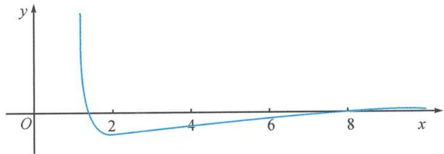

## 8.14 整数问题

例题 227 已知函数 $f(x)=(kx+4)\ln x-x(x>1)$ ，若 $f(x)>0$ 的解为 $(s,t)$ 且 $(s,t)$ 中只有一个整数，则实数 k 的取值范围为 \_\_\_\_.

解答 由已知得

$$
k > \frac {1}{\ln x} - \frac {4}{x}.
$$

令 $g(x) = \frac{1}{\ln x} -\frac{4}{x}$ ，则

$$
g ^ {\prime} (x) = \frac {1}{x \ln (x \sqrt {x})} \left(\frac {2}{\sqrt {x}} + \frac {1}{\ln x}\right) (2 \ln x - \sqrt {x}).
$$

令 $h(x) = 2\ln x - \sqrt{x}$ ，则

$$
h ^ {\prime} (x) = \frac {4 \sqrt {x} - x}{2 x \sqrt {x}}, 1 <   x <   1 6.
$$

故 $h^{\prime}(x) > 0, h(x)$ 单调递增，且 $h(2)h(3) < 0$ 。故 $\exists x_0 \in (2,3)$ 使得 $h(x_0) = 0$ 。

当 $x \in (1, x_0)$ 时， $h(x) < 0, g(x)$ 单调递减；当 $x \in (x_0, 16)$ 时， $h(x) > 0, g(x)$ 单调递增.

因为 $g\left(\frac{6}{5}\right)>0, g(2)=\frac{1}{\ln 2}-2<0, g(16)=\frac{1}{4\ln 2}-\frac{1}{4}>0$ ，所以必存在 $x_{1}\in\left(\frac{6}{5},2\right)$ 使

$g(x_{1})=0$ , 存在 $x_{2}\in(2,16)$ 使 $g(x_{2})=0$ .

当 $x \geqslant 16$ 时, $g(x) = \frac{1}{\ln x} - \frac{4}{x} > \frac{1}{\sqrt{x}} - \frac{4}{x} \geqslant 0$ . 如图所示, 只需要 $\left\{ \begin{array}{l} k > g(2), \\ k \leqslant g(3), \end{array} \right.$ 则有

$$
k \in \left(\frac {1}{\ln 2} - 2, \frac {1}{\ln 3} - \frac {4}{3} \right].
$$
