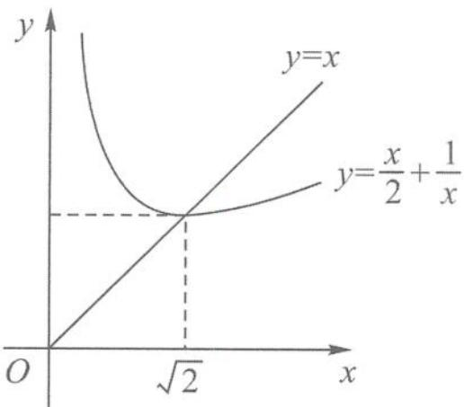
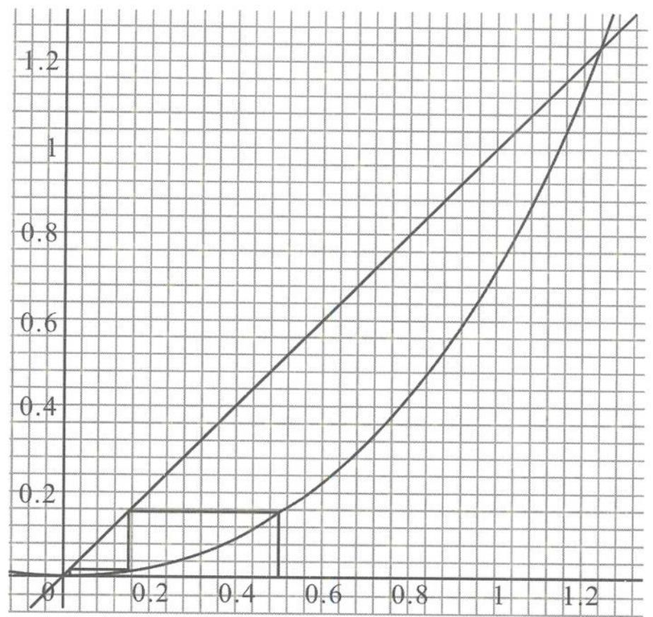

2. 解答 由 $S_{n} = 2^{n} - 1$ 可得 $a_{n} = 2^{n - 1}$ , 所以 $a_{n}^{2} = 4^{n - 1}$ , 即 $a_{1}^{2} + a_{2}^{2} + a_{3}^{2} + \dots + a_{n}^{2} = \frac{4^{n} - 1}{3}$ .

3. 解答 (1) 化简可得 $f(x) + f\left(\frac{1}{x}\right) = 1$ ,

$$
f (1) + f (2) + f (3) + f (4) + f \left(\frac {1}{2}\right) +
$$

$$
f \left(\frac {1}{3}\right) + f \left(\frac {1}{4}\right) = \frac {7}{2}.
$$

(2)化简可得 $f(x) + f(1 - x) = \frac{\sqrt{2}}{2}$ ,

所以 $f(-5)+f(-4)+\cdots+f(0)+\cdots+f(5)+f(6)=3\sqrt{2}$ .

$$
(- 1) ^ {n} \times n
$$

$$
\frac {n (n + 1) (n + 5)}{3}
$$

$$
6. \text {解答} (1) S _ {4 9} = a _ {1} + a _ {2} + a _ {3} + \dots + a _ {4 8} + a _ {4 9}
$$

$$
= 1 + 3 + 7 + \dots + 9 5
$$

$$
= 1 + \frac {2 4}{2} \times (3 + 9 5)
$$

$$
= 1 + 1 1 7 6 = 1 1 7 7.
$$

(2)由已知得, $a_{2}+a_{3}=3,a_{4}+a_{5}=7,\cdots,a_{38}+a_{39}=75$ , $a_{2}-a_{1}=1,a_{4}-a_{3}=5,\cdots,a_{40}-a_{39}=79,$ 所以 $a_{1}+a_{3}=2,a_{7}+a_{5}=2,\cdots,a_{37}+a_{39}=2,$ $a_{2}+a_{4}=8,a_{6}+a_{8}=24,a_{10}+a_{12}=40,\cdots,$ $S_{40}=a_{1}+a_{2}+a_{3}+\cdots+a_{40}$ $=(a_{1}+a_{3}+a_{5}+a_{7}+\cdots+a_{37}+a_{39})+(a_{2}+a_{4}+a_{6}+a_{8}+\cdots+a_{38}+a_{40})$ $=2\times10+10\times8+\frac{1}{2}\times10\times9\times16=820.$ 7. 解答 当 n 为奇数时， $a_{n+1}=(-2)^{n}$ ，
则 $a_{2}=(-2)^{1}, a_{4}=(-2)^{3}, \cdots, a_{100}=(-2)^{99}$ ;
当 n 为偶数时， $a_{n+1}=2a_{n}+(-2)^{n}=2a_{n}+2^{n}$ ，
则 $a_{3}=2a_{2}+2^{2}=0, a_{5}=2a_{4}+2^{4}=0, \cdots, a_{99}=2a_{98}+2^{98}=0.$

又 $a_{1}=0$ , 所以 $S_{100}=a_{2}+a_{4}+\cdots+a_{100}=\frac{2-2^{101}}{3}.$

8. 解答 (1) 因为 $a_{n+2} - 2a_{n+1} + a_n = 0$ ，
所以 $\{a_n\}$ 是等差数列。
又因为 $a_4 = a_1 + 3d = 8 + 3d = 2$ ，
所以 $d = -2$ ，故 $a_n = 10 - 2n$ 。
(2) 令 $10 - 2n \geqslant 0$ ，得 $n \leqslant 5$ 。
当 $n \leqslant 5$ 时， $a_n \geqslant 0$ ；
当 $n \geqslant 6$ 时， $a_n < 0$ 。
所以，当 $n \leqslant 5$ 时， $S_n = a_1 + a_2 + \cdots + a_n = 8n + \frac{n(n-1)}{2}(-2)$ $= -n^2 + 9n$ 。
当 $n \geqslant 6$ 时， $S_n = a_1 + a_2 + \cdots + a_5 - a_6 - a_7 - \cdots - a_n$ $= 2(a_1 + a_2 + \cdots + a_5) - (a_1 + a_2 + \cdots a_n)$ $= 2(-5^2 + 9 \times 5) - (-n^2 + 9n)$ $= n^2 - 9n + 40$ 。
综上可知 $S_n = \begin{cases} -n^2 + 9n, & n \leqslant 5, & n \in \mathbb{N}^*, \\ n^2 - 9n + 40, & n \geqslant 6, & n \in \mathbb{N}^*. \end{cases}$

9. 解答 由倒序相加法求得 $S_{n} = 3n - 1$ .
因为 $\frac{a^n}{3n-1} < \frac{a^{n+1}}{3n+2}$ 恒成立,
所以 $a > 0$ , 且 $a > \frac{3n+2}{3n-1} = 1 + \frac{3}{3n-1}$ 恒成立,
所以 $a > \frac{5}{2}$ .
10. 解答 (1) 当 $n=1$ 时, $\frac{1}{2} a_1 = \frac{1^2 + 1}{2} \Rightarrow a_1 = 2$ . $\left\{\begin{aligned}&\frac{a_1}{2}+\frac{a_2}{2^2}+\cdots+\frac{a_{n-1}}{2^{n-1}}=\frac{(n-1)^2+(n-1)}{2},\\&\frac{a_1}{2}+\frac{a_2}{2^2}+\cdots+\frac{a_n}{2^n}=\frac{n^2+n}{2},\end{aligned}\right.$ 两式相减, 得 $\frac{1}{2^n} a_n = n \Rightarrow a_n = n \times 2^n$ .
(2) 设 $S_n = 2 + 2 \times 2^2 + 3 \times 2^3 + \cdots + n \times 2^n$ ,
则 $2S_n = 2^2 + 2 \times 2^3 + \cdots + (n-1) \times 2^n + 2^{n+1}$ ,
两式相减, 得 $-S_n = 2 + 2^2 + 2^3 + \cdots + 2^n -$

$$
n \times 2 ^ {n + 1}
$$

$n \times 2^{n+1} = \frac{2(1-2^n)}{1-2} - n \times 2^{n+1}.$ 从而 $S_n = (n-1)2^{n+1} + 2.$ 11. 解答 (1)由 $k_1 = 1, k_2 = 5, k_3 = 17$ ,

知 $a_1(a_1 + 16d) = (a_1 + 4d)^2$ ,

得 $a_1 = 2d$ .

从而 $a_k = (k+1)d$ ,

则 $\frac{a_{k_n}}{a_{k_{n-1}}} = \frac{(k_{n+1} + 1)d}{(k_n + 1)d} = \frac{a_{k_2}}{a_{k_1}} = 3$ ,

即 $(k_{n+1} + 1) = 3(k_n + 1)$ , 所以 $k_n = 2 \times 3^{n-1} - 1$ .

(2) 若 $a_1 = 2$ , 则 $a_n = n + 1$ , $S_n = 2[2 + 3 \times 3 + \cdots + (n+1)3^{n-1}] - \frac{n(n+3)}{2}.$ 令 $T_n = 2 + 3 \times 3 + \cdots + (n+1)3^{n-1}$ ,

则 $3T_n = 2 \times 3 + 3 \times 3^2 + \cdots + (n+1)3^n$ $-2T_n = 2 + 3 + 3^2 + \cdots + 3^{n-1} - (n+1)3^n$ $= 1 + \frac{3^n - 1}{2} - (n+1)3^n$ ,

所以 $T_n = -\frac{3^n + 1}{4} + \frac{(n+1)3^n}{2} = \frac{(2n+1)3^n - 1}{4}$ , $S_n = \frac{(2n+1)3^n - (n^2 + 3n+1)}{2}.$

3.4 数列之求和,裂项速相消
1. $\frac{1}{2}\left(1+\frac{1}{2}-\frac{1}{n+1}-\frac{1}{n+2}\right)$ 2. $\frac{n}{3n+1}$ 3. $\frac{1}{2}-\frac{1}{3^{2^{n}}-1}$ 解答 注意到 $3^{2^{n}}-1=(3^{2^{n-1}})^{2}-1$ ,
所以 $a_{n}=\frac{1}{3^{2^{n}}-1}+\frac{1}{3^{2^{n-1}}+1}$ $=\frac{3^{2^{n-1}}}{(3^{2^{n-1}}-1)(3^{2^{n-1}}+1)}$ $=\frac{3^{2^{n-1}}}{3^{2^{n}}-1}=\frac{1}{3^{2^{n-1}}-1}-\frac{1}{3^{2^{n}}-1}.$

4. 解答 (1) 设 $t_1, t_2, \cdots, t_{n+2}$ 构成等比数列，其中 $t_1 = 1, t_{n+2} = 100$ ，则 $T_n = t_1 t_2 \cdots t_{n+1} t_{n+2}$ ①， $T_n = t_{n+2} t_{n+1} \cdots t_2 t_1$ ②，
① × ② 并利用 $t_i t_{n+3-i} = 100 (1 \leqslant i \leqslant n+2)$ ，得 $T_{n}^{2}=100^{n+2}$ ,
所以 $a_{n}=\lg T_{n}=n+2.$ (2)由题意和(1)中的计算结果知 $b_{n}=\tan(n+2)\tan(n+3), n\geqslant1.$ 利用 $\tan 1=\tan[(k+1)-k]$ $=\frac{\tan(k+1)-\tan k}{1+\tan(k+1)\tan k},$ 得 $\tan(k+1)\tan k=\frac{\tan(k+1)-\tan k}{\tan 1}-1,$ 所以 $S_{n}=\sum_{k=1}^{n}b_{k}=\sum_{k=3}^{n+2}\tan(k+1)\tan k$ $=\sum_{k=3}^{n+2}\left[\frac{\tan(k+1)-\tan k}{\tan 1}-1\right]$ $=\frac{\tan(n+3)-\tan 3}{\tan 1}-n.$

5. 解答 (1) 由 $b_{n} = 2^{a_{n}}$ 及 $b_{1}b_{2}\cdots b_{n} = (b_{n + 1})^{\frac{n}{2}}$ 可得 $a_{1} + a_{2} + \dots + a_{n} = \frac{na_{n + 1}}{2}$ .  
当 $n \geqslant 2$ 时, $a_{n} = \frac{na_{n + 1}}{2} - \frac{(n - 1)a_{n}}{2}$ ,  
即 $na_{n + 1} = (n + 1)a_{n}$ , 故 $\frac{a_{n + 1}}{n + 1} = \frac{a_n}{n}$ .  
又 $a_{1} = 1$ , 故 $a_{n} = n$ .  
(2) 因为 $\frac{a_n}{a_1a_2\cdots a_{n + 1}} = \frac{n}{1\times 2\times\cdots\times n\times(n + 1)} = \frac{1}{1\times 2\times\cdots\times n} - \frac{1}{1\times 2\times\cdots\times n\times(n + 1)}$ ,  
所以 $T_{n} = 1 - \frac{1}{1\times 2\times\cdots\times n\times(n + 1)}$ ,  
故 $T_{n} \geqslant \frac{2020}{2021}$ 等价于 $1\times 2\times\cdots\times n\times(n + 1)$ $\geqslant 2021$ ,

所以 $n$ 的最小值为6.

6. 解答 (1) 表 4 为:

1 3 5 7
4 8 12
12 20

它的第1,2,3,4行中的数的平均数分别为4,8,16,32.它们构成首项为4,公比为2的等比数列.将这一结论推广到表 $n(n\geqslant3)$ ，即表n各行中的数的平均数按从上到下的顺序构成首项为 n，公比为 2 的等比数列.

(2) 表 n 第 1 行是 $1, 3, 5, \cdots, 2n-1$ ，其平均数是 $\frac{1+3+5+\cdots+(2n-1)}{n}=n.$

由(1)知,它的各行中的数的平均数按从上到下的顺序构成首项为 n, 公比为 2 的等比数列(从而它的第 k 行中的数的平均数是 $n2^{k-1}$ ), 于是表 n 中最后一行的唯一一个数为 $n2^{n-1}$ . 因此 $\frac{b_{k+2}}{b_k b_{k+1}} = \frac{(k+2)2^{k+1}}{k2^{k-1}(k+1)2^k} = \frac{k+2}{k(k+1)2^{k-2}}$ $= \frac{2(k+1)-k}{k(k+1)2^{k-2}} = \frac{1}{k2^{k-3}} - \frac{1}{(k+1)2^{k-2}} (k=1,2,3,\cdots,n),$ 故 $\frac{b_3}{b_1 b_2} + \frac{b_4}{b_2 b_3} + \cdots + \frac{b_{n+2}}{b_nb_{n+1}} = \left(\frac{1}{1 \times 2^{-2}} - \frac{1}{2 \times 2^{-1}}\right) + \left(\frac{1}{2 \times 2^{-1}} - \frac{1}{3 \times 2^0}\right) + \cdots + \left[\frac{1}{n2^{n-3}} - \frac{1}{(n+1)2^{n-2}}\right]$ $= 4 - \frac{1}{(n+1)2^{n-2}}.$

7. 解答 (1) 设等差数列 $\{a_{n}\}$ 的公差为 $d$ ，等比数列 $\{b_{n}\}$ 的公比为 $q$ 。由 $a_{1} = 1, a_{5} = 5(a_{4} - a_{3})$ ，可得 $d = 1$ 。从而 $\{a_{n}\}$ 的通项公式为 $a_{n} = n$ 。由 $b_{1} = 1, b_{5} = 4(b_{4} - b_{3})$ ，又 $q \neq 0$ ，可得 $q^{2} - 4q + 4 = 0$ ，解得 $q = 2$ 。从而 $\{b_{n}\}$ 的通项公式为 $b_{n} = 2^{n-1}$ 。
(2) 由 (1) 可得 $S_{n} = \frac{n(n+1)}{2}$ ，故 $S_{n} S_{n+2} = \frac{1}{4} n(n+1)(n+2)(n+3)$ ， $S_{n+1}^{2} = \frac{1}{4}(n+1)^{2}(n+2)^{2}$ ，从而 $S_{n} S_{n+2} - S_{n+1}^{2} = -\frac{1}{2}(n+1)(n+2) < 0$ ，所以 $S_{n} S_{n+2} < S_{n+1}^{2}$ 。
(3) 当 $n$ 为奇数时， $c_{n} = \frac{(3a_{n}-2)b_{n}}{a_{n}a_{n+2}} = \frac{(3n-2)2^{n-1}}{n(n+2)} = \frac{2^{n+1}}{n+2} - \frac{2^{n-1}}{n}$ ;

当 n 为偶数时， $c_{n}=\frac{a_{n-1}}{b_{n+1}}=\frac{n-1}{2^{n}}$ 对任意的正整数 n，有 $\sum_{k=1}^{n}c_{2k-1}=\sum_{k=1}^{n}\left(\frac{2^{2k}}{2k+1}-\frac{2^{2k-2}}{2k-1}\right)=\frac{2^{2n}}{2n+1}-1,$ 和 $\sum_{k=1}^{n}c_{2k}=\sum_{k=1}^{n}\frac{2k-1}{4^{k}}=\frac{1}{4}+\frac{3}{4^{2}}+\frac{5}{4^{3}}+\cdots+\frac{2n-3}{4^{n-1}}+\frac{2n-1}{4^{n}}$ ①，
由①得 $\frac{1}{4}\sum_{k=1}^{n}c_{2k}=\frac{1}{4^{2}}+\frac{3}{4^{3}}+\frac{5}{4^{4}}+\cdots+\frac{2n-3}{4^{n}}+\frac{2n-1}{4^{n+1}}$ ②，
由①②得 $\frac{3}{4}\sum_{k=1}^{n}c_{2k}=\frac{1}{4}+\frac{2}{4^{2}}+\cdots+\frac{2}{4^{n}}-\frac{2n-1}{4^{n+1}}=\frac{\frac{2}{4}\left(1-\frac{1}{4^{n}}\right)}{1-\frac{1}{4}}-\frac{1}{4}-\frac{2n-1}{4^{n+1}}.$ 由于 $\frac{\frac{2}{4}\left(1-\frac{1}{4^{n}}\right)}{1-\frac{1}{4}}-\frac{1}{4}-\frac{2n-1}{4^{n+1}}=\frac{2}{3}-\frac{2}{3}\times\frac{1}{4^{n}}-\frac{1}{4}-\frac{2n-1}{4^{n}}\times\frac{1}{4}=\frac{5}{12}-\frac{6n+5}{3\times4^{n+1}},$ 从而得 $\sum_{k=1}^{n}c_{2k}=\frac{5}{9}-\frac{6n+5}{9\times4^{n}}.$ 故 $\sum_{k=1}^{2n}c_{k}=\sum_{k=1}^{n}c_{2k-1}+\sum_{k=1}^{n}c_{2k}=\frac{4^{n}}{2n+1}-\frac{6n+5}{9\times4^{n}}-\frac{4}{9}.$ 所以，数列 $\{c_{n}\}$ 的前2n项和为 $\frac{4^{n}}{2n+1}-\frac{6n+5}{9\times4^{n}}-\frac{4}{9}.$

## 第四章 数列之证明与不等式

## 4.1 数列之证明,数学归纳法

1. 解答 ① 当 n=1 时, 等式左边 =2, 右边 = $2^{1} \times 1=2$ , 所以等式成立.
② 假设当 $n=k(k\in\mathbb{N}^{*})$ 时, 等式成立,
即 $(k+1)(k+2)\cdots(k+k)=2^{k}\times1\times3\times5\times\cdots\times(2k-1)$ .
③ 当 $n=k+1$ 时，
左边 $=(k+2)(k+3)\cdots2k(2k+1)(2k+2)$ $=2(k+1)(k+2)(k+3)\cdots(k+k)(2k+1)$

$= 2 \times 2^{k} \times 1 \times 3 \times 5 \times \cdots \times (2k - 1) \times (2k + 1)$ $= 2^{k+1} \times 1 \times 3 \times 5 \times \cdots \times (2k - 1) \times (2k + 1)$ .
这就是说当 $n = k + 1$ 时, 等式成立.
综上可知, 对 $n \in \mathbb{N}^*$ , 原等式成立.

2. 解答 假设存在 $a, b, c$ 使题设的等式成立.
令 $n=1,2,3$ , 有 $\left\{\begin{aligned}4&=\frac{1}{6}(a+b+c),\\ 22&=\frac{1}{2}(4a+2b+c),\\ 70&=9a+3b+c,\end{aligned}\right.$ 所以 $\left\{\begin{aligned}a &= 3,\\ b &= 11,\\ c &= 10.\end{aligned}\right.$ 于是, 对 $n=1,2,3$ 下面的等式成立, $1 \times 2^{2} + 2 \times 3^{2} + \cdots + n(n+1)^{2} = \frac{n(n+1)}{12}(3n^{2} + 11n+10)$ .
记 $S_{n}=1 \times 2^{2} + 2 \times 3^{2} + \cdots + n(n+1)^{2}$ ,
设 $n=k$ 时上式成立, 即 $S_{k}=\frac{k(k+1)}{12}(3k^{2}+11k+10)$ ,
那么 $S_{k+1}=S_{k}+(k+1)(k+2)^{2}$ $= \frac{k(k+1)}{12}(k+2)(3k+5)+(k+1)(k+2)^{2}$ $= \frac{(k+1)(k+2)}{12}(3k^{2}+5k+12k+24)$ $= \frac{(k+1)(k+2)}{12}[3(k+1)^{2}+11(k+1)+10]$ .
所以, 等式对 $n=k+1$ 也成立.
综上所述, 当 $a=3, b=11, c=10$ 时, 原式对一切

综上所述, 当 a=3, b=11, c=10 时, 原式对一切正整数 n 均成立.

3. 解答 ① 当 $n = 1$ 时, 左边 $= \frac{3}{2} > \sqrt{2} =$ 右边, 所以不等式成立.

②假设当 $n = k$ 时不等式成立，即 $\frac{3}{2} \times \frac{5}{4} \times \frac{7}{6} \times \dots \times \frac{2k + 1}{2k} > \sqrt{k + 1}$ .  
③当 $n = k + 1$ 时，左边 $= \frac{3}{2} \times \frac{5}{4} \times \frac{7}{6} \times \dots \times \frac{2k + 1}{2k} \times \frac{2k + 3}{2k + 2}$ $> \sqrt{k + 1} \times \frac{2k + 3}{2k + 2} = \sqrt{\frac{(2k + 3)^2}{4(k + 1)}}$

$= \sqrt{\frac{4(k + 1)^2 + 4(k + 1) + 1}{4(k + 1)}}$ $= \sqrt{(k + 1) + 1 + \frac{1}{4(k + 1)}} >\sqrt{(k + 1) + 1},$ 所以，当 $n = k + 1$ 时，不等式也成立.  
综上可得，原不等式恒成立.

4. 解答 ①解法一: 数列递推、同号法.
由题意, $a_{n+1}-a_{n}=-a_{n}^{2}\leqslant0$ ,
故 $a_{n+1}\leqslant a_{n}\leqslant\cdots\leqslant a_{1}<\frac{1}{2}$ ，且 $a_{n+1}=a_{n}(1-a_{n})$ ,
其中 $1-a_{n}>1-\frac{1}{2}>0$ ，故 $a_{n+1}$ 与 $a_{n}$ 同号，
显然 $a_{n}$ 均与 $a_{1}$ 同号，故 $a_{n}>0$ ,
此时 $a_{n+1}-a_{n}=-a_{n}^{2}$ 不能为0，
只能 $a_{n+1}-a_{n}<0$ ,
故 $0<a_{n+1}<a_{n}$ ，命题①正确.
解法二:数学归纳法.
用数学归纳法证明 $a_{n}\in\left(0,\frac{1}{2}\right)$ ，其中 $n\in N^{*}$ .
(i) 当 n=1 时, $a_{1}\in\left(0,\frac{1}{2}\right)$ 成立.
(ii) 假设当 n=k 时命题成立, 即 $a_{k}\in\left(0,\frac{1}{2}\right)$ .
(iii) 当 $n=k+1$ 时, $0<a_{k+1}=-a_{k}^{2}+a_{k}=-\left(a_{k}-\frac{1}{2}\right)^{2}+\frac{1}{4}<\frac{1}{4}$

$$
<   \frac {1}{2}
$$

故 $n = k + 1$ 时命题成立.  
综上所述， $a_{n} \in \left(0, \frac{1}{2}\right), n \in \mathbb{N}^{*}$ ，  
此时 $a_{n+1} - a_{n} = -a_{n}^{2} < 0 \Rightarrow a_{n+1} < a_{n}$ ，  
故 $0 < a_{n+1} < a_{n}$ ，命题①正确.  
②递推公式变形得裂项公式求和.  
由题意， $a_{n}^{2} = a_{n} - a_{n+1} (n \in \mathbb{N}^{*})$ ，且 $a_{n} > 0$ ，  
故 $a_{1}^{2} + a_{2}^{2} + \cdots + a_{n}^{2} = (a_{1} - a_{2}) + (a_{2} - a_{3}) + \cdots + (a_{n} - a_{n+1}) = a_{1} - a_{n+1} < a_{1}$ ，命题②正确.

③解法一:根据①的结论放缩.
由①可得 $0 < a_{n} < \frac{1}{2}$ ，故 $1 < \frac{1}{1 - a_{n}} < 2$ ，
故 $\frac{1}{1-a_{1}}+\frac{1}{1-a_{2}}+\frac{1}{1-a_{3}}+\cdots+\frac{1}{1-a_{m}}>1+1+$

$1+\cdots+1=m.$

要使 $\frac{1}{1-a_{1}}+\frac{1}{1-a_{2}}+\frac{1}{1-a_{3}}+\cdots+\frac{1}{1-a_{m}}>b,$

只需取 $m \geqslant b$ 的正整数即可，如 $m = [b] + 1$ ，命题③正确.

解法二: 取倒数后裂项.

由题可知 $\frac{1}{a_{n + 1}} = \frac{1}{-a_n^2 + a_n} = \frac{1}{a_n} +$ $\frac{1}{1 - a_n} (n\in \mathbb{N}^*)$

故 $\frac{1}{1 - a_n} = \frac{1}{a_{n + 1}} -\frac{1}{a_n}$

所以 $\frac{1}{1 - a_1} +\frac{1}{1 - a_2} +\dots +\frac{1}{1 - a_m} = \left(\frac{1}{a_2} -\frac{1}{a_1}\right)+$ $\left(\frac{1}{a_3} -\frac{1}{a_2}\right) + \dots +\left(\frac{1}{a_{m + 1}} -\frac{1}{a_m}\right) = \frac{1}{a_{m + 1}} -\frac{1}{a_1} >b.$

结合命题④(后续证明)的结论，
可知 $\frac{1}{a_{m+1}}>m+1$ 故 $\frac{1}{a_{m+1}}-\frac{1}{a_{1}}>m+1-\frac{1}{a_{1}}.$ 令 $m+1-\frac{1}{a_{1}}\geqslant b$ ，即 $m\geqslant b+\frac{1}{a_{1}}-1$ .

比如取 $m = \left[b + \frac{1}{a_1}\right]([x]$ 为取整函数），则命题 $③$ 成立.

④数学归纳法.
用数学归纳法证明 $a_{n}<\frac{1}{n+1}$ ，其中 $n\in N^{*}$ ，
易得函数 $f(x) = -x^{2} + x$ 在 $\left(0, \frac{1}{2}\right)$ 上单调递增.

(i) 当 $n = 1$ 时, $a_{1} \in \left(0, \frac{1}{2}\right)$ , 故 $a_{1} < \frac{1}{1 + 1}$ 成立.  
(ii) 假设当 $n = k$ 时命题成立, 即 $a_{k} < \frac{1}{k + 1}$ .  
(iii) 当 $n = k + 1$ 时, $a_{k + 1} = -a_{k}^{2} + a_{k} = f(a_{k}) < f\left(\frac{1}{k + 1}\right) = \frac{1}{k + 1} - \frac{1}{(k + 1)^{2}} = \frac{k}{(k + 1)^{2}} = \frac{1}{k + \frac{1}{k} + 2} < \frac{1}{k + 2}$ , 故 $n = k + 1$ 时命题成立.

所以 $a_{n}<\frac{1}{n+1}(n\in\mathbb{N}^{*})$ ，命题④正确。
综上所述，命题①②③④均为真命题，故选D.
5. 解答 （1）用数学归纳法证明.
①当 n=1 时，因为 $a_{2}$ 是方程 $x^{2}+x-1=0$ 的正根，所以 $a_{1}<a_{2}$ .
②假设当 $n=k(k\in\mathbb{N}^{*})$ 时， $a_{k}<a_{k+1}$ .
因为 $a_{k+1}^{2}-a_{k}^{2}=(a_{k+2}^{2}+a_{k+2}-1)-(a_{k+1}^{2}+a_{k+1}-1)$ $=(a_{k+2}-a_{k+1})(a_{k+2}+a_{k+1}+1)$ .
所以 $a_{k+1}<a_{k+2}$ ，即当 $n=k+1$ 时， $a_{n}<a_{n+1}$ 也成立.
根据①和②，可知 $a_{n}<a_{n+1}$ 对任何 $n\in N^{*}$ 都成立.
(2)由 $a_{k+1}^{2} + a_{k+1} - 1 = a_{k}^{2}, k = 1, 2, \cdots, n-1 (n \geqslant 2)$ ,
得 $a_{n}^{2}+(a_{2}+a_{3}+\cdots+a_{n})-(n-1)=a_{1}^{2}$ 因为 $a_{1}=0$ ，所以 $S_{n}=n-1-a_{n}^{2}$ 由 $a_{n}<a_{n+1}$ 及 $a_{n+1}=1+a_{n}^{2}-2a_{n+1}^{2}<1$ 得 $a_{n}<1$ 所以 $S_{n}>n-2$ .
(3)由 $a_{k+1}^{2} + a_{k+1} = 1 + a_{k}^{2} \geqslant 2a_{k}$ ,
得 $\frac{1}{1+a_{k+1}}\leqslant\frac{a_{k+1}}{2a_{k}}(k=2,3,\cdots,n-1,n\geqslant3)$ ,
所以 $\frac{1}{(1+a_{3})(1+a_{4})\cdots(1+a_{n})}\leqslant\frac{a_{n}}{2^{n-2}a_{2}}(n\geqslant3)$ ,
于是 $\frac{1}{(1+a_{2})(1+a_{3})\cdots(1+a_{n})}\leqslant\frac{a_{n}}{2^{n-2}(a_{2}^{2}+a_{2})}=\frac{a_{n}}{2^{n-2}}<\frac{1}{2^{n-2}}(n\geqslant3)$ ,
故当 $n \geqslant 3$ 时， $T_{n}<1+1+\frac{1}{2}+\cdots+\frac{1}{2^{n-2}}<3.$ 因为 $T_{1}<T_{2}<T_{3}$ ，所以 $T_{n}<3.$ 6. 证明 ①当 n=1 时， $x_{1}=1$ 所以 $\sqrt{2} + x_{1} = \sqrt{2} + 1 \geqslant \sqrt{2} + 1$ 成立.
②假设当 $n=k(k\in\mathbb{N}^{*})$ 时命题成立，
即当 $x_{1}x_{2}\cdots x_{k}=1$ ，且 $x_{i}\in R^{*}(i=1,2,\cdots,n)$ 时，均有 $(\sqrt{2}+x_{1})(\sqrt{2}+x_{2})\cdots(\sqrt{2}+x_{k})\geqslant(\sqrt{2}+1)^{k}$ .
③当 $n=k+1(k\in\mathbb{N}^{*})$ 时，

对于 $x_{1}x_{2}\cdots x_{k+1}=1$ ,
若 $x_{1}=x_{2}=\cdots=x_{k+1}=1$ ，则命题显然成立.
若存在 $x_{i} \neq 1$ ，不妨设 $x_{k+1} > 1$ ，则在 $x_{1}, x_{2}, \cdots,$

$$
x _ {k} <   1
$$

$x_{k}$ 中必存在一个数小于1,不妨设这个数为 $x_{k}<1$ ,
从而 $(x_{k}-1)(x_{k+1}-1)<0$ ,
即 $x_{k}+x_{k+1}>1+x_{k}x_{k+1}$ .
把 $x_{k}x_{k+1}$ 看作一个整体,有 $(\sqrt{2}+x_{1})(\sqrt{2}+x_{2})\cdots(\sqrt{2}+x_{k+1})$ $=( \sqrt{2} + x_{1})(\sqrt{2} + x_{2}) \cdots [2 + \sqrt{2}(x_{k} + x_{k+1}) + x_{k}x_{k+1}]$ $>(\sqrt{2}+x_{1})(\sqrt{2}+x_{2})\cdots[2+\sqrt{2}(1+x_{k}x_{k+1})+x_{k}x_{k+1}]$ $=( \sqrt{2} + x_{1})(\sqrt{2} + x_{2}) \cdots (\sqrt{2} + x_{k}x_{k+1})(\sqrt{2} + 1)$ $\geqslant (\sqrt{2} + 1)^{k} \times (\sqrt{2} + 1) \geqslant (\sqrt{2} + 1)^{k+1}.$ 故原命题对 $n=k+1$ 也成立.
综上可得,原命题成立.
7. 解答 ① 当 n=1 时, $\sin a_{1}=\frac{\sqrt{2}}{2}<\frac{1}{\sqrt{1}}$ ;
当 n=2,3,4 时, $\sin a_{n}\leqslant\frac{1}{3}<\frac{1}{\sqrt{n}}.$ ② 设 $f(x)=x-\frac{4}{3}x^{3}(0<x<1)$ ,
则 $f'(x)=1-4x^{2}$ .
当 $0 < x < \frac{1}{2}$ 时， $f'(x)=1-4x^{2}>0$ ,
所以 $f(x)$ 在 $\left(0,\frac{1}{2}\right)$ 上单调递增.
③下面用数学归纳法证明结论.
由①知, 当 n=1,2,3,4 时结论成立.
假设当 $n=k(k\geqslant4)$ 时结论成立,
即有 $\sin a_{k}<\frac{1}{\sqrt{k}}\leqslant\frac{1}{2}.$ 当 $n=k+1$ 时, $\sin a_{k+1}\leqslant\frac{1}{3}\sin3a_{k}=\sin a_{k}-\frac{4}{3}\sin^{3}a_{k}<\frac{1}{\sqrt{k}}-\frac{4}{3k\sqrt{k}}=\frac{3k-4}{3k\sqrt{k}}$ ,
故要证 $\sin a_{k+1}<\frac{1}{\sqrt{k+1}}$ ,
只需证 $\frac{3k-4}{3k\sqrt{k}}<\frac{1}{\sqrt{k+1}}$ ,

即证 $\frac{9k^2 - 24k + 16}{9k^3} < \frac{1}{k + 1}$ 即证 $\frac{9k^2 - 24k + 16}{9k^3} < \frac{1}{k + 1}$ 即证 $15k^{2} + 8k > 16$ 由于 $k \geqslant 4$ ，上式成立，故 $\sin a_{k+1} < \frac{1}{\sqrt{k+1}}$ 成立，故当 $n = k + 1$ 时，结论成立.综上，对一切 $n \in \mathbb{N}^*$ ， $\sin a_n \leqslant \frac{1}{\sqrt{n}}$ 都成立.

## 4.2 数列之证明,正难则反法

1. 解答 命题的结论是“对任意正整数 n，数列 $\{x_{n}\}$ 是递增数列或是递减数列”，其否定是“存在正整数 n，使数列既不恒是递增数列，也不恒是递减数列”.

故选D.

2. 解答 (1) 因为 $c > 0, a_{1} = -(c + 2)$ ,

所以 $a_{2}=f(a_{1})=2\left|a_{1}+c+4\right|-\left|a_{1}+c\right|=2,$ $a_{3}=f(a_{1})=2\left|a_{2}+c+4\right|-\left|a_{2}+c\right|=c+10.$

(2)要证明原命题,只需证明 $f(x)\geqslant x+c$ 对任意 $x\in R$ 都成立,

$$
f (x) \geqslant x + c \Leftrightarrow 2 | x + c + 4 | - | x + c | \geqslant x + c,
$$

即只需证明 $2|x + c + 4|\geqslant |x + c| + x + c.$

若 $x + c \leqslant 0$ ，显然有 $2|x + c + 4| \geqslant |x + c| + x + c = 0$ 成立；

若 $x + c > 0$ ，则 $2|x + c + 4|\geqslant |x + c| + x + c\Leftrightarrow$ $x + c + 4 > x + c$ 显然成立.

综上， $f(x)\geqslant x + c$ 恒成立，即对任意的 $n\in \mathbf{N}^*$ ， $a_{n + 1} - a_n\geqslant c.$

$$
\left\{a _ {n} \right\}
$$

$$
d \geqslant c > 0
$$

故 n 无限增大时, 总有 $a_{n} > 0$ .

此时 $a_{n + 1} = f(a_n) = 2(a_n + c + 4) - (a_n + c) = a_n$ $+c + 8$ ，即 $d = c + 8$

故 $a_2 = f(a_1) = 2|a_1 + c + 4| - |a_1 + c| = a_1 + c + 8,$

即 $2|a_{1} + c + 4| = |a_{1} + c| + a_{1} + c + 8.$

当 $a_1 + c \geqslant 0$ 时，等式成立，且当 $n \geqslant 2$ 时， $a_n > 0$ 此时 $\{a_n\}$ 为等差数列，满足题意.

若 $a_1 + c < 0$ ，则 $\left|a_1 + c + 4\right| = 4\Rightarrow a_1 = -c - 8,$

此时 $a_{2}=0, a_{3}=c+8, \cdots, a_{n}=(n-2)(c+8)$ 也满足题意.

综上, 满足题意的 $a_{1}$ 的取值范围是 $[-c, +\infty) \cup \{-c-8\}$ .

3. 解答 由已知得 $\frac{a_n}{a_{n+1}} > \frac{a_{n-1}}{a_n}$ .

若有某个 $n$ , 使 $\frac{a_{n-1}}{a_n} \geqslant 1$ , 则 $a_n > a_{n+1}$ .

从而 $a_{n-1} \geqslant a_n > a_{n+1} > a_{n+2} > \cdots$ , 这显然不可能.

因为 $\{a_n\} (n \in \mathbb{N}^*)$ 是正整数的无穷数列.

故数列 $\{a_n\}$ 中的项是严格递增的.

从而由 $a_4 = 4$ 可知, $a_1 = 1, a_2 = 2, a_3 = 3$ .

由 $\{a_{n}\}$ 的递推公式及数学归纳法知 $a_{n} = n (n \in \mathbf{N}^{*})$ .

显然数列 $\{n\} (n\in \mathbf{N}^{*})$ 满足要求，故所求的正整数无穷数列为 $\{n\} (n\geqslant 1)$

## 4. 解答 反证法.

假设对任意 $n \in \mathbb{N}^*$ , $(a_n - a_{n-1})(b_n - b_{n-1}) \geqslant 0$ .

由于 $f(x) \neq x$ , 则 $(a_n - a_{n-1})(b_n - b_{n-1}) > 0$ ①.

因为 $f(x) > x, x \in \left(0, \frac{1}{2}\right)$ , $f(x) < x, x \in \left[\frac{1}{2}, 1\right)$ ,

所以①式也意味着对任意 $n \in \mathbb{N}^*$ , $a_n, b_n$ 同属于 $\left(0, \frac{1}{2}\right)$ 或者 $\left[\frac{1}{2}, 1\right)$ .

设 $d = a - b$ ,

当 $a_n, b_n \in \left(0, \frac{1}{2}\right)$ 时, $b_{n+1} - a_{n+1} = b_n - a_n$ ;

当 $a_n, b_n \in \left[\frac{1}{2}, 1\right)$ 时, $b_{n+1} - a_{n+1} = (b_n - a_n)(a_n - b_n) \geqslant (b_n - a_n)$ .

所以 $b_n - a_n \geqslant d, n \in \mathbb{N}^*$ .

从而 $b_{n+1} - a_{n+1} = (b_n - a_n)(a_n + b_n)$ $= (2a_n + d)(b_n - a_n) \geqslant (1 + d)(b_n - a_n)$ .

由于 $a_n, b_n$ 同属于 $\left(0, \frac{1}{2}\right)$ ,

则 $a_{n+1}, b_{n+1}$ 同属于 $\left[\frac{1}{2}, 1\right)$ .

从而 $b_{2n} - a_{2n} \geqslant (1 + d)^n (b_1 - a_1) = d(1 + d)^n$ .

当 $n$ 足够大时, $b_{2n} - a_{2n} > 1$ , 矛盾.

从而假设不成立, 所以存在正整数 $n$ ,

使得 $(a_n - a_{n-1})(b_n - b_{n-1}) < 0$ .

5. 解答 (1) 由 $a_n = a_{n-1} + \frac{1}{a_{n-1}} (n \geqslant 2)$ 知 $a_n^2 = a_{n-1}^2 + \frac{1}{a_{n-1}^2} + 2$ .

当 $n = 2$ 时, $a_2 = a_1 + \frac{1}{a_1} \geqslant 2$ ;

当 $n \geqslant 3$ 时, $a_n^2 = a_{n-1}^2 + \frac{1}{a_{n-1}^2} + 2 > a_{n-1}^2 + 2 > (n-2) + a_2^2 \geqslant 2n$ .

所以 $a_n \geqslant \sqrt{2n} (n \geqslant 2)$ .

(2) 假设存在常数 $c$ 使得 $a_{n} < \sqrt{2n + c}$ 对所有的 $n$ 都成立，则 $2n + c > a_{n}^{2} > a_{n - 1}^{2} + \frac{1}{a_{n - 1}^{2}} + 2 > a_{n - 1}^{2} + 2 + \frac{1}{2n - 2 + c} > 2n + \sum_{i = 2}^{n - 1}\frac{1}{2i + c},$ $c > \sum_{i = 2}^{n - 1}\frac{1}{2i + c} >\sum_{i = 2}^{n - 1}\frac{1}{(2 + c)i} >\frac{1}{2 + c}\sum_{i = 2}^{n - 1}\ln \left(1 + \frac{1}{i}\right) =$ $\frac{1}{2 + c}\ln \frac{n}{2},$ 即 $\ln n <   c(2 + c) + \ln 2.$ 当 $n$ 足够大时，矛盾.所以假设不成立， $c$ 不存在（这里用到不等式 $\frac{1}{i} >\ln \left(1 + \frac{1}{i}\right)$

## 4.3 数列不等式,类等差比法

1. 解答 (1) 解法一: 由题意知 $a_1 = 1 > 0$ , $a_{n+1} = \frac{a_n + 1}{12a_n} > 0 (n \in \mathbb{N}^*)$ .

① 当 $n=1$ 时, $a_1 = 1, a_2 = \frac{a_1 + 1}{12a_1} = \frac{1}{6}, a_3 = \frac{a_2 + 1}{12a_2} = \frac{7}{12}, a_3 < a_1$ 成立.

② 假设 $n=k$ 时, 结论成立, 即 $a_{2k+1} < a_{2k-1}$ .

因为 $a_{2n+1} = \frac{a_{2n} + 1}{12a_{2n}} = \frac{\frac{a_{2n-1} + 1}{12a_{2n-1}} + 1}{12 \times \frac{a_{2n-1} + 1}{12a_{2n-1}}}$ $= \frac{13a_{2n - 1} + 1}{12(a_{2n - 1} + 1)}$ 所以 $a_{2k + 3} - a_{2k + 1} = \frac{13a_{2n + 1} + 1}{12(a_{2n + 1} + 1)} -$ $\frac{13a_{2n - 1} + 1}{12(a_{2n - 1} + 1)} = \frac{a_{2k + 1} - a_{2k - 1}}{(a_{2k + 1} + 1)(a_{2k - 1} + 1)} <   0.$ 故 $n = k + 1$ 时，结论也成立.由①②可知，对于 $n\in \mathbb{N}^*$ ，都有 $a_{2n + 1} <   a_{2n - 1}$ 成立.解法二： $a_1 = 1,a_2 = \frac{a_1 + 1}{12a_1} = \frac{1}{6},a_3 = \frac{a_2 + 1}{12a_2} = \frac{7}{12},$ $a_3 <   a_1$ 成立.令 $f(x) = \frac{x + 1}{12x} = \frac{1}{12}\left(1 + \frac{1}{x}\right)$ ，显然 $f(x)$ 单调递减.因为 $a_3 <   a_1$ ，假设 $a_{2k + 1} <   a_{2k - 1}$ 则 $f(a_{2k + 1}) > f(a_{2k - 1})$ ，即 $a_{2k + 2} > a_{2k}$ 故 $f(a_{2k + 2}) <   f(a_2k)$ ，即 $a_{2k + 3} > a_{2k + 1}$ 故对于 $n\in \mathbb{N}^*$ ，都有 $a_{2n + 1} <   a_{2n - 1}$ 成立.(2)由(1)知 $a_{2n + 1} <   a_{2n - 1}$ 所以 $1 = a_1 > \dots >a_{2n - 1} > a_{2n + 1}$ 同理，由数学归纳法可证 $a_{2n} <   a_{2n + 2},a_{2n} > a_{2n - 2} > \dots >a_2 = \frac{1}{6}.$ 猜测 $a_{2n} <   \frac{1}{3} <   a_{2n - 1}$ .下面给出证明.因为 $a_{n + 1} - \frac{1}{3} = \frac{-\left(a_n - \frac{1}{3}\right)}{4a_n},$ 所以 $a_{n + 1} - \frac{1}{3}$ 与 $a_{n} - \frac{1}{3}$ 异号.注意到 $a_1 - \frac{1}{3} >0,$ 知 $a_{2n - 1} - \frac{1}{3} >0,a_{2n} - \frac{1}{3} <   0,$ 即 $a_{2n} <   \frac{1}{3} <   a_{2n - 1}$ 所以有 $a_1 > \dots >a_{2n - 1} > a_{2n + 1} > \frac{1}{3} >a_{2n} > a_{2n - 2}$ $>… > a_2$ ，从而可知 $\frac{1}{6}\leqslant a_n\leqslant 1.$

(3) $|a_{n+2}-a_{n+1}|=\left|\frac{a_{n+1}+1}{12a_{n+1}}-\frac{a_n+1}{12a_n}\right|=\frac{|a_{n+1}-a_n|}{12a_na_{n+1}}$ $=\frac{|a_{n+1}-a_n|}{a_n+1}\leqslant\frac{|a_{n+1}-a_n|}{a_2+1}=\frac{6}{7}\times|a_{n+1}-a_n|,$ 所以 $|a_{n+1}-a_n|\leqslant\frac{6}{7}\times|a_n-a_{n-1}|$ $\leqslant\left(\frac{6}{7}\right)^2\times|a_{n-1}-a_{n-2}|$ $\leqslant\cdots\leqslant\left(\frac{6}{7}\right)^{n-1}\times|a_2-a_1|=\frac{5}{6}\times\left(\frac{6}{7}\right)^{n-1},$ 所以 $S_n=|a_2-a_1|+|a_3-a_2|+|a_4-a_3|+\cdots+|a_{n+1}-a_n|$ $\leqslant\frac{5}{6}\times\left[1+\frac{6}{7}+\left(\frac{6}{7}\right)^2+\cdots+\left(\frac{6}{7}\right)^{n-1}\right]$ $=\frac{5}{6}\times\frac{1-\left(\frac{6}{7}\right)^n}{1-\frac{6}{7}}<\frac{35}{6}<\frac{36}{6}=6.$

2. 解答 (1) 因为 $y' = -\frac{1}{x^2}$ , 所以曲线 $C$ 在点 $P$ 处的切线方程为 $y = -\frac{1}{t} x + \frac{2}{\sqrt{t}}$ . 从而可得 $B(2\sqrt{t}, 0)$ , 将 $y = -\frac{1}{t} x + \frac{2}{\sqrt{t}}$ 与 $y = 4x$ 联立, 得 $x_A = \frac{2\sqrt{t}}{4t + 1}$ , 所以 $f(t) = x_A x_B = \frac{4t}{4t + 1}$ , 所以 $a_n = f(a_{n-1}) = \frac{4a_{n-1}}{4a_{n-1} + 1}$ . (2) 因为 $\{a_n\}$ 为正数数列, 所以 $a > 0$ . 由 $a_2 < a_1$ 得 $\frac{4a}{4a + 1} < a$ , 解得 $a > \frac{3}{4}$ . 当 $a > \frac{3}{4}$ 时, 由 $a_n - \frac{3}{4} = \frac{4a_{n-1}}{4a_{n-1} + 1} - \frac{3}{4} = \frac{a_{n-1} - \frac{3}{4}}{4a_{n-1} + 1}$ 知 $a_n > \frac{3}{4}$ , 所以 $a_n - a_{n-1} = \frac{4a_{n-1}}{4a_{n-1} + 1} - a_{n-1} = \frac{a_{n-1}(3 - 4a_{n-1})}{4a_{n-1} + 1} < 0$ ,

即 $a_{n}$ 单调递减，从而 $a \in \left(\frac{3}{4}, +\infty\right)$ .

(3) 因为 $a_{2}=\frac{8}{9}$ ，由(2)知 $\frac{3}{4}<a_{n}\leqslant\frac{8}{9}(n\geqslant2)$ ， $b_{n}=\frac{1}{4a_{n-1}+1}\times b_{n-1}<\frac{1}{4}b_{n-1}=\frac{1}{4^{n-2}}\times b_{2}<\frac{1}{4^{n-2}}$ $\times\frac{5}{36}=\frac{5}{36}\times\frac{1}{4^{n-2}}(n\geqslant2)$ ,
所以 $S_{1}=\frac{5}{4}<\frac{3}{2}$ ，当 $n\geqslant2$ 时， $S_{n}=\frac{5}{4}+\frac{5}{36}\times\frac{\left(1-\frac{1}{4^{n-1}}\right)}{1-\frac{1}{4}}<\frac{5}{4}+\frac{5}{36}\times\frac{4}{3}=\frac{155}{108}$ $<\frac{3}{2}.$ 综上： $S_{n}<\frac{3}{2}(n\in\mathbb{N}^{*})$ .
3. 证明 (1) 设 $b_{n}=\frac{2}{\sqrt{a_{n}^{2}-2}}$ ，则 $b_{n+1}^{2}=b_{n}^{2}(4+2b_{n}^{2})=b_{n}^{2}[4+2b_{n-1}^{2}(4+2b_{n-1}^{2})]$ $=b_{n}^{2}(2b_{n-1}^{2}+2)^{2}$ .
而 $a_{2}=\frac{3}{2}$ ，于是 $b_{2}=4$ ，
进而 $b_{n}(n\geqslant3)$ 均为整数.

(2)如图，

用不动点裂项得 $\frac{a_{n + 1} - \sqrt{2}}{a_n - \sqrt{2}} = \frac{a_n - \sqrt{2}}{2a_n}$ 由 $a_1 = 2 > \sqrt{2}$ 容易得到 $a_{n} > \sqrt{2}$ $\frac{a_{n + 1} - \sqrt{2}}{a_n - \sqrt{2}} = \frac{a_n - \sqrt{2}}{2a_n} = \frac{1}{2} -\frac{1}{\sqrt{2} a_n} <  \frac{1}{2}.$ 当 $n\geqslant 2$ 时， $a_{n} - \sqrt{2}\leqslant \left(\frac{1}{2}\right)^{n - 2}(a_{2} - \sqrt{2})$ $= \frac{6 - 4\sqrt{2}}{2^n} <  \frac{1}{2^n} <  \frac{1}{1 + C_n^1} = \frac{1}{n + 1}.$ 而当 $n = 1$ 时，右边不等式显然成立.

综上可知,原命题得证.

4. 解答 (1) 因为 $a_{2} = 4, a_{3} = 17, a_{4} = 72$ , 所以 $b_{1} = 4, b_{2} = \frac{17}{4}, b_{3} = \frac{72}{17}$ . (2) 由 $a_{n+2} = 4a_{n+1} + a_{n}$ 得 $\frac{a_{n+2}}{a_{a+1}} = 4 + \frac{a_{n}}{a_{n+1}}$ , 即 $b_{n+1} = 4 + \frac{1}{b_n}$ . 当 $n \geqslant 2$ 时, $b_{n} > 4$ , 于是 $c_{1} = b_{1}b_{2} = 17$ , $c_{n} = b_{n}b_{n+1} = 4b_{n} + 1 > 17 (n \geqslant 2)$ , 所以 $S_{n} = c_{1} + c_{2} + \cdots + c_{n} \geqslant 17n$ . (3) 当 $n = 1$ 时, 结论 $|b_{2} - b_{1}| = \frac{1}{4} < \frac{17}{64}$ 成立. 当 $n \geqslant 2$ 时, 有 $|b_{n+1} - b_{n}| = \left|4 + \frac{1}{b_n} - 4 - \frac{1}{b_{n-1}}\right| = \left|\frac{b_n - b_{n-1}}{b_nb_{n-1}}\right| \leqslant \frac{1}{17}|b_n - b_{n-1}|$ $\leqslant \frac{1}{17^2}|b_{n-1} - b_{n-2}| \leqslant \cdots \leqslant \frac{1}{17^{n-1}}|b_2 - b_1| = \frac{1}{4} \times \frac{1}{17^{n-1}}$ . 所以 $|b_{2n} - b_n| \leqslant |b_{n+1} - b_n| + |b_{n+2} - b_{b+1}| + \cdots + |b_{2n} - b_{2n-1}|$ $\leqslant \frac{1}{4} \times \left[\left(\frac{1}{17}\right)^{n-1} + \left(\frac{1}{17}\right)^n + \cdots + \left(\frac{1}{17}\right)^{2n-2}\right]$ $= \frac{1}{4} \times \frac{\left(\frac{1}{17}\right)^{n-1} \times \left(1 - \frac{1}{17^n}\right)}{1 - \frac{1}{17}} < \frac{1}{64} \times \frac{1}{17^{n-2}} (n \in \mathbb{N}^*)$ .

5. 解答 (1) 可将已知等式变形为 $4a_{n+1}^2 = a_n + 1$ . 又 $4a_n^2 = a_{n-1} + 1 (n \geqslant 2)$ , 作差得 $4(a_{n+1} - a_n)(a_{n+1} + a_n) = a_n - a_{n-1}$ . 由于 $a_{n+1} + a_n > 0$ , 故当 $n \geqslant 2$ 时, $a_{n+1} - a_n$ 与 $a_n - a_{n-1}$ 的符号相同, 即与 $a_2 - a_1 < 0$ 同号. 于是 $a_n > a_{n+1}$ . (2) 由 (1) 知 $a_n$ 单调递减, 所以 $a_{n+1}^2 < a_{n+1}a_n$ . 又 $a_{n+1}^2 = \frac{a_{n+1}}{4}$ , 所以 $a_{n+1} > \frac{a_{n+1}}{4a_n}$ , 所以 $a_{n+1} + a_n > \frac{a_{n+1}}{4a_n} + a_n = \frac{1}{4} + \frac{1}{4a_n} + a_n > \frac{5}{4}$ , 所以 $a_{n+1} + a_n > \frac{a_{n+1}}{4a_n} + a_n = \frac{1}{4} + \frac{1}{4a_n} + a_n > \frac{5}{4}$ ,

所以 $4(a_{n}+a_{n+1})>5$ .
所以 $a_{n}-a_{n+1}=\frac{a_{n-1}-a_{n}}{4(a_{n}+a_{n+1})}<\frac{1}{5}(a_{n-1}-a_{n})<$ $\cdots<\frac{1}{5^{n-1}}(a_{1}-a_{2}).$ 所以 $S_{n}<1+\frac{2}{5}+\frac{3}{5^{2}}+\cdots+\frac{n}{5^{n-1}}=\frac{1}{16}\times$ $\frac{5^{n+1}-5-4n}{5^{n-1}}<\frac{25}{16}.$ 原不等式得证.
6. 解答 (1) 因为 $a_{n+1}^{2}=\frac{1}{3}a_{n}^{2}+\frac{2}{3}a_{n}$ ,
所以 $a_{n+1}^{2}-1=\frac{1}{3}a_{n}^{2}+\frac{2}{3}a_{n}-1$ ,
所以 $(a_{n+1}-1)(a_{n+1}+1)=\frac{(a_{n}-1)(a_{n}+3)}{3}$ .
又数列为正项数列，所以 $a_{n+1}-1$ 与 $a_{n}-1$ 同号.
因为 $a_{1}-1<0$ ，所以 $a_{n+1}-1<0$ ，
所以 $a_{n+1}^{2}-a_{n}^{2}=\frac{2}{3}a_{n}(1-a_{n})>0.$ (2) 要证 $a_{1}+a_{2}+\cdots+a_{n}>n-\frac{9}{4}$ ,
只需要证 $n-(a_{1}+a_{2}+\cdots+a_{n})<\frac{9}{4}.$ 因为 $(a_{n+1}-1)(a_{n+1}+1)=\frac{(a_{n}-1)(a_{n}+3)}{3}$ ,
所以 $\frac{1-a_{n+1}}{1-a_{n}}=\frac{a_{n}+3}{3(1+a_{n+1})}<\frac{a_{n}+3}{3(1+a_{n})}$ $=\frac{1}{3}\left(1+\frac{2}{1+a_{n}}\right)\leqslant\frac{1}{3}\left(1+\frac{2}{1+a_{1}}\right)=\frac{7}{9}$ 所以 $(1-a_{1})+(1-a_{2})+\cdots+(1-a_{n})$ $<\frac{1}{2}\times\frac{1-\left(\frac{7}{9}\right)^{n}}{1-\frac{7}{9}}<\frac{9}{4}.$ 7. 解答 (1) 若 $\lambda=0$ ，则 $a_{n+1}^{2}=2a_{n}$ .
因为 $a_{1}=1$ ，且数列 $\{a_{n}\}$ 各项为正，
所以 $a_{2}=\sqrt{2}, a_{3}=2^{\frac{3}{4}}.$ (2) 若 $\lambda=3$ ，则 $a_{n+1}^{2}-2a_{n}=3.$ 因为 $a_{n+1}^{2}-9=2(a_{n}-3)$ ,
即 $(a_{n+1}-3)(a_{n+1}+3)=2(a_{n}-3).$ 一方面， $a_{n+1}-3$ 与 $a_{n}-3$ 显然同号.

因为 $a_1 - 3 < 0$ ，所以 $a_n - 3 < 0$ ，即 $a_n < 3$ 另一方面， $\frac{3 - a_{n + 1}}{3 - a_n} = \frac{2}{a_{n + 1} + 3}$ 因为 $a_{n + 1}^2 = 2a_n + 3\geqslant 3 > 1,$ 所以 $\frac{3 - a_{n + 1}}{3 - a_n} < \frac{2}{4} = \frac{1}{2},$ 所以 $3 - a_{n} < (3 - a_{1})\times \left(\frac{1}{2}\right)^{n - 1} = \left(\frac{1}{2}\right)^{n - 2}.$ 又因为 $a_1 = 1$ ，所以 $a_{n}\geqslant 3 - \left(\frac{1}{2}\right)^{n - 2}.$ 综上可得 $3 - \left(\frac{1}{2}\right)^{n - 2}\leqslant a_n <   3.$

$$
4 S _ {n} - 2 a _ {n} = 2 ^ {n}
$$

$$
4 S _ {n - 1} - 2 a _ {n - 1} = 2 ^ {n - 1} (n \geqslant 2)
$$

$$
a _ {n} + a _ {n - 1} = 2 ^ {n - 2} (n \geqslant 2) \Rightarrow \frac {a _ {n}}{2 ^ {n}} + \frac {1}{2} \times \frac {a _ {n - 1}}{2 ^ {n - 1}} = \frac {1}{4}.
$$

计算出递推数列 $\frac{a_n}{2^n}$ 的不动点为 $\frac{1}{6}$ ,

所以 $\frac{a_n}{2^n} -\frac{1}{6} = \left(\frac{a_1}{2^1} -\frac{1}{6}\right)\times \left(-\frac{1}{2}\right)^{n - 1},$

即 $\left\{\frac{a_n}{2^n} -\frac{1}{6}\right\}$ 是公比为 $-\frac{1}{2}$ 的等比数列.

解法二: 因为 $4S_{n}-2a_{n}=2^{n}$ ,

所以 $4S_{n - 1} - 2a_{n - 1} = 2^{n - 1}(n\geqslant 2)$

两式相减可得 $a_{n} + a_{n - 1} = 2^{n - 1}(n\geqslant 2)$

所以 $\frac{\frac{a_n}{2^n} - \frac{1}{6}}{\frac{a_{n-1}}{2^{n-1}} - \frac{1}{6}} = -\frac{1}{2} (n \geqslant 2)$ .

又因为 $\frac{a_n}{2^n} -\frac{1}{6} = \frac{1}{3}\neq 0$ ，所以 $\left\{\frac{a_n}{2^n} -\frac{1}{6}\right\}$ 是等比数列.

（2）解法一：令 $b_{n} = \frac{1}{6a_{n} + 3(-1)^{n}}$ $= \frac{1}{2^{n} - (-1)^{n}},$ 则 $b_{2n - 1} + b_{2n} = \frac{1}{2^{2n - 1} + 1} +\frac{1}{2^{2n} - 1} =$ $\frac{\frac{3}{2}\times 2^{2n}}{2^{4n - 1} + 2^{2n - 1} - 1} <  \frac{\frac{3}{2}\times 2^{2n}}{2^{4n - 1}} = \frac{3}{2^{2n}}.$

不等式左边的前 $2n$ 项和

$T_{2n}<\frac{3}{4}+\frac{3}{4^{2}}+\cdots+\frac{3}{4^{n}}=\frac{\frac{3}{4}\times\left(1-\frac{1}{4^{n}}\right)}{1-\frac{1}{4}}<1.$ 又 $b_{n}>0\Rightarrow T_{2n-1}<T_{2n}<1$ ，所以原不等式得证.
解法二: $b_{n}=\frac{1}{6a_{n}+3\times(-1)^{n}}=\frac{1}{2^{n}+(-1)^{n-1}}=$ $\frac{1}{\frac{3}{4}\times2^{n}+\frac{1}{4}\times2^{n}+(-1)^{n-1}}<\frac{1}{\frac{3}{4}\times2^{n}}.$ 左边 $<\frac{1}{3}+\frac{1}{3}+\frac{1}{9}+\frac{4}{3}\times\left(\frac{1}{16}+\frac{1}{32}+\cdots+\frac{1}{2^{n-1}}\right)$ $<\frac{7}{9}+\frac{1}{6}+\cdots<\frac{1}{3}.$

## 4.4 数列不等式,通项放缩法

1. 解答 由递推关系式可得 $a_{n}a_{n+1} + a_{n+1} = a_{n}$ , 所以 $\frac{1}{a_{n+1}} - \frac{1}{a_n} = 1$ , 又 $\frac{1}{a_1} = 1$ , 由此可得, 数列 $\left\{\frac{1}{a_n}\right\}$ 是首项为 1, 公差为 1 的等差数列. 所以 $\frac{1}{a_n} = 1 + (n-1) \times 1 = n$ , 即 $a_n = \frac{1}{n}$ . 当 $n \geqslant 2$ 时, $a_n^2 = \frac{1}{n^2} < \frac{1}{n(n-1)} = \frac{1}{n-1} - \frac{1}{n}$ , 据此有 $a_1^2 + a_2^2 + \cdots + a_{2017}^2 < 1 + \left(1 - \frac{1}{2}\right) + \left(\frac{1}{2} - \frac{1}{3}\right) + \cdots + \left(\frac{1}{2016} - \frac{1}{2017}\right) = 2 - \frac{1}{2017} < 2.$ 又 $a_1^2 + a_2^2 + \cdots + a_{2017}^2 > a_1^2 = 1$ , 则 $[a_1^2 + a_2^2 + \cdots + a_{2017}^2] = 1$ . 2. 解答 记 $a_n = \frac{2}{3^n - 1}$ , 则有 $\frac{a_{n+1}}{a_n} = \frac{3^n - 1}{3^{n+1} - 1} < \frac{(3^n - 1) + 1}{(3^{n+1} - 1) + 1} = \frac{1}{3}$ . 而 $a_1 = 1$ , 故 $a_n < \left(\frac{1}{3}\right)^{n-1}$ . 于是 $\sum_{k=1}^{n} \frac{2}{3^k - 1} < \frac{1}{1 - \frac{1}{3}} = \frac{3}{2}$ , 原不等式得证. 3. 解答 一方面, $\frac{1}{\sqrt{n}} > \frac{2}{\sqrt{n+1} + \sqrt{n}} = 2 (\sqrt{n+1} - \sqrt{n})$ ,

累加可得 $2(\sqrt{n+1}-1)<1+\frac{1}{\sqrt{2}}+\frac{1}{\sqrt{3}}+\cdots+\frac{1}{\sqrt{n}}.$ 另一方面，证明不等式右边.
解法一：由于 $\frac{1}{\sqrt{n}}=\frac{2}{2\sqrt{n}}<\frac{2}{\sqrt{n-1}+\sqrt{n+1}}=\sqrt{n+1}-\sqrt{n-1}$ ，
累加可得 $1+\frac{1}{\sqrt{2}}+\frac{1}{\sqrt{3}}+\cdots+\frac{1}{\sqrt{n}}<\sqrt{n+1}+\sqrt{n}-\sqrt{2}$ ，
再用分析法易证得 $\sqrt{n+1}+\sqrt{n}-\sqrt{2}<2(\sqrt{n+1}-1)$ 。
问题得证.
解法二：由于 $\frac{1}{\sqrt{n}}=\frac{2}{2\sqrt{n}}<\frac{2}{\sqrt{n-\frac{1}{2}}+\sqrt{n+\frac{1}{2}}}=\sqrt{2}(\sqrt{2n+1}-\sqrt{2n-1})$ ，
所以 $1+\frac{1}{\sqrt{2}}+\frac{1}{\sqrt{3}}+\cdots+\frac{1}{\sqrt{n}}<\sqrt{2}(\sqrt{2n+1}-1)$ 。
4. 解答 因为 $\frac{1}{2^n+2^{n-1}}\leqslant\frac{1}{2^n+1}<\frac{1}{2^n}(n\in\mathbb{N}^*)$ ，
即 $\frac{1}{3}\times\frac{1}{2^{n-1}}\leqslant\frac{1}{2^n+1}<\frac{1}{2^n}$ ，
所以原式 $<\frac{1}{2}+\frac{1}{2^2}+\frac{1}{2^3}+\cdots+\frac{1}{2^n}=\frac{\frac{1}{2}\left(1-\frac{1}{2^n}\right)}{1-\frac{1}{2}}=1-\frac{1}{2^n}<1$ 且原式 $\geqslant\frac{1}{3}\left(1-\frac{1}{2^n}\right)$ 。
综上，原不等式成立.
5. 解答 因为 $\frac{n}{2^n+2^{n-1}}<\frac{n}{2^n+n}<\frac{n}{2^n}$ ，
即 $\frac{1}{3}\times\frac{n}{2^{n-1}}\leqslant\frac{n}{2^n+n}<\frac{n}{2^n}$ ，
所以原式 $<\frac{1}{2}+\frac{2}{2^2}+\frac{3}{2^3}+\cdots+\frac{n}{2^n}=2-\frac{n+2}{2^n}<2$ 且原式 $\geqslant\frac{2}{3}\left(2-\frac{n+2}{2^n}\right)\geqslant\frac{1}{3}$ （或原式 $\geqslant\frac{1}{2+1}=\frac{1}{3}$ ）。
综上，原不等式成立.
6. 解答 (1)已知 $3S_n=(n+2)a_n$ ，
当 $n\geqslant 2$ 时， $3S_{n-1}=(n+1)a_{n-1}$ ，
两式相减得 $3a_n=(n+2)a_n-(n+1)a_{n-1}$ .

整理得 $\frac{a_n}{a_{n-1}} = \frac{n+1}{n-1}$ ,  
所以 $a_n = a_1 \times \frac{a_2}{a_1} \times \frac{a_3}{a_2} \times \cdots \times \frac{a_{n-1}}{a_{n-2}} \times \frac{a_n}{a_{n-1}}$ $= 1 \times \frac{3}{1} \times \frac{4}{2} \times \cdots \times \frac{n}{n-2} \times \frac{n+1}{n-1} = \frac{n(n+1)}{2}$ .  
从而 $a_n = \frac{n(n+1)}{2} (n \in \mathbb{N}^*)$ .  
(2) 解法一: 因为 $\frac{1}{a_{2^n}} = \frac{2}{2^n (2^n + 1)} = \frac{1}{2^{n-1}(2^n + 1)} < \frac{2}{2^n \times 2^{n-1}} = \frac{1}{2^{2n-1}}$ ,  
所以 $\frac{1}{a_2} + \frac{1}{a_4} + \frac{1}{a_8} + \cdots + \frac{1}{a_{2^n}}$ $\leqslant \frac{1}{3} + \frac{1}{8} + \frac{1}{32} + \cdots + \frac{1}{2^{2n-1}} = \frac{1}{3} + \frac{\frac{1}{8}\left(1 - \frac{1}{4^{n-1}}\right)}{1 - \frac{1}{4}}$ $= \frac{1}{3} + \frac{1}{6}\left(1 - \frac{1}{4^{n-1}}\right) \leqslant \frac{1}{3} + \frac{1}{6} = \frac{1}{2}$ .  
从而 $\frac{1}{a_2} + \frac{1}{a_4} + \frac{1}{a_8} + \cdots + \frac{1}{a_{2^n}} < \frac{1}{2}$ .  
解法二: 因为 $\frac{1}{a_{2^n}} = \frac{2}{(2^n + 1)2^n} = \frac{1}{(2^n + 1)2^{n-1}} < \frac{2^{n-1}}{2^n + 1)(2^{n-1} + 1)} = \frac{1}{2^{n-1} + 1} - \frac{1}{2^n + 1}$ .  
以下过程略.  
7. 解答 解法一: 当 $n \geqslant 3$ 时, $b_n = \frac{3 \times 2^{n+1}}{(2^{n+1}-3)^2} < \frac{3 \times 2^{n+1}}{(2^{n+1}-3)(2^n-3)}$ $= 6 \times \left(\frac{1}{2^n - 3} - \frac{1}{2^{n+1}-3}\right)$ ,  
故 $S_n < a_1 + a_2 + 6 \times \left(\frac{1}{5} - \frac{1}{2^{n+1}-3}\right) < 15$ .  
解法二: 当 $n \geqslant 2$ 时, $b_n = \frac{3 \times 2^{n+1}}{(2^{n+1}-3)^2} < \frac{3 \times 2^{n+1}}{(2^{n+1}-2)(2^n-2)}$ $= 6 \times \left(\frac{1}{2^n - 2} - \frac{1}{2^{n+1}-2}\right)$ ,  
故 $S_n < a_1 + 6 \times \left(\frac{1}{2} - \frac{1}{2^{n+1}-2}\right) < 15$ .

$$
a _ {1} = 1
$$

$a_{2}=\sqrt{2}-1,a_{3}=\sqrt{3}-\sqrt{2}$ ，猜想 $a_{n}=\sqrt{n}-\sqrt{n-1}$ 。
再利用数学归纳法可得 $a_{n}=\sqrt{n}-\sqrt{n-1}$ 。
解法二：由已知得 $S_{n}-S_{n-1}=a_{n}=\frac{1}{2}\left(a_{n}+\frac{1}{a_{n}}\right)-\frac{1}{2}\left(a_{n-1}+\frac{1}{a_{n-1}}\right)$ ,
故 $\frac{1}{2}\left(a_{n}-\frac{1}{a_{n}}\right)=-\frac{1}{2}\left(a_{n-1}+\frac{1}{a_{n-1}}\right)$ ,
等号两边平方得 $a_{n}^{2}+\frac{1}{a_{n}^{2}}=a_{n-1}^{2}+\frac{1}{a_{n-1}^{2}}+4$ 设 $b_{n}=a_{n}^{2}+\frac{1}{a_{n}^{2}}$ ，则 $b_{n}-b_{n-1}=4$ 所以 $b_{n}=4n-2$ 从而 $a_{n}=\sqrt{n}-\sqrt{n-1}$ .
解法三：已知 $S_{n}=\frac{1}{2}\left(a_{n}+\frac{1}{a_{n}}\right)$ ,
可得 $S_{n-1}=S_{n}-a_{n}=\frac{1}{2}\left(\frac{1}{a_{n}}-a_{n}\right)$ ,
两式平方相减可得 $S_{n}^{2}-S_{n-1}^{2}=1$ .
因为 $S_{1}=1$ ，所以 $S_{n}^{2}=n$ ，即 $S_{n}=\sqrt{n}$ 所以 $a_{n}=\sqrt{n}-\sqrt{n-1}$ .
(2) 因为 $\frac{1}{(n+1)S_{n}}=\frac{1}{(n+1)\sqrt{n}}$ $=\frac{2}{\sqrt{(n+1)n}(\sqrt{n+1}+\sqrt{n+1})}$ $<\frac{2}{\sqrt{(n+1)n}(\sqrt{n}+\sqrt{n+1})}$ $=\frac{2(\sqrt{n+1}-\sqrt{n})}{\sqrt{(n+1)n}}=2\left(\frac{1}{\sqrt{n}}-\frac{1}{\sqrt{n+1}}\right)$ ,
所以 $\frac{1}{2S_{1}}+\frac{1}{3S_{2}}+\cdots+\frac{1}{(n+1)S_{n}}$ $<2\left(1-\frac{1}{\sqrt{n+1}}\right)=2\left(1-\frac{1}{S_{n+1}}\right)$ .
命题得证.

## 4.5 数列不等式,裂项放缩法

1. 解答 (1) 由 $a_{n+1} - a_n = \frac{a_n^2}{(n+1)^2} > 0$ 得 $a_{n+1} > a_n \geqslant a_1 = 1$ , 所以 $\frac{a_{n+1}}{a_n} = 1 + \frac{a_n}{(n+1)^2} \geqslant 1 + \frac{1}{(n+1)^2}$ .

（2）解法一：一方面，因为 $\frac{1}{a_{n+1}} = \frac{1}{a_n} - \frac{1}{(n+1)^2 + a_n^2}$ ，所以 $\frac{1}{a_n} - \frac{1}{a_{n+1}} = \frac{1}{(n+1)^2 + a_n^2} < \frac{1}{(n+1)^2} < \frac{1}{(n+1)n} = \frac{1}{n} - \frac{1}{n+1}$ ，故 $\frac{1}{a_{n+1}} > \frac{1}{n+1}$ ，即 $a_{n+1} < n+1$ 。另一方面，因为 $\frac{1}{a_{n+1}} = \frac{1}{a_n} - \frac{1}{n^2 + a_n^2}$ ，且 $a_{n+1} < n+1$ ，所以 $\frac{1}{a_n} - \frac{1}{a_{n+1}} = \frac{1}{n^2 + (n+1)^2} > \frac{1}{2} \times \frac{1}{(n+1)(n+2)} > \frac{1}{2} \left( \frac{1}{n+1} - \frac{1}{n+2} \right), n \geqslant 2$ ，所以 $a_{n+1} > \frac{2(n+1)}{n+3}$ 。综上可得 $\frac{2(n+1)}{n+3} < a_{n+1} < n+1$ 。解法二：一方面，因为 $\frac{a_{n+1} - a_n}{a_{n+1} a_n} = \frac{1}{(n+1)^2} \times \frac{a_n}{a_{n+1}} < \frac{1}{(n+1)^2} < \frac{1}{(n+1)n} = \frac{1}{n} - \frac{1}{n+1}$ ，又 $0 < \frac{a_n}{a_{n+1}} < 1$ ，所以 $\frac{1}{a_n} - \frac{1}{a_{n+1}} = \frac{1}{(n+1)^2} \times \frac{a_n}{a_{n+1}} < \frac{1}{(n+1)^2} < \frac{1}{(n+1)n} = \frac{1}{n} - \frac{1}{n+1}$ ，累加得 $\frac{1}{a_1} - \frac{1}{a_{n+1}} < 1 - \frac{1}{n+1} \Rightarrow a_{n+1} < n+1$ 。（也可以用数学归纳法证明）另一方面，由 $a_n \leqslant n$ 可得 $\frac{a_{n+1}}{a_n} = 1 + \frac{a_n}{(n+1)^2} \leqslant 1 + \frac{n}{(n+1)^2} < 1 + \frac{1}{n+1} =$ $\frac{n+2}{n+1} \Rightarrow \frac{a_n}{a_{n+1}} > \frac{n+1}{n+2}$ ，所以 $\frac{1}{a_n} - \frac{1}{a_{n+1}} = \frac{1}{(n+1)^2} \times \frac{a_n}{a_{n+1}} > \frac{1}{(n+1)^2} \times$ $\frac{n+1}{n+2} = \frac{1}{(n+1)(n+2)} = \frac{1}{n+1} - \frac{1}{n+2}$ ，累加得 $\frac{1}{a_1} - \frac{1}{a_{n+1}} > \frac{1}{2} - \frac{1}{n+1} \Rightarrow a_{n+1} > \frac{2(n+1)}{n+3}$ 。

综上可得 $\frac{2(n + 1)}{n + 3} < a_{n + 1} < n + 1.$ 2.解答 (1)当 $p = 0$ 时， $a_{n + 1} = \frac{a_n^2}{a_n^2 - a_n} = \frac{a_n}{a_n - 1}$ 由 $a_1\neq 0$ 知 $a_{n}\neq 0$ ，所以 $\frac{1}{a_{n + 1}} = 1 - \frac{1}{a_n}$ 所以 $\frac{(-1)^{n + 1}}{a_{n + 1}} = \frac{(-1)^n}{a_n} +(-1)^{n + 1} = \dots = \frac{-1}{a_1}+$ $-1)^2 +\dots +( - 1)^{n + 1} = \frac{1 - (-1)^n}{2} -\frac{3}{2},$ $a_{n} = \frac{(-1)^{n}}{\frac{1}{2}\times(-1)^{n} - 1} = \frac{2}{1 - 2\times(-1)^{n}}.$ (2)(i)当 $p = 1$ 时， $a_{n + 1} = \frac{a_n^2}{a_n^2 - a_n + 1},$ 即 $\frac{1}{a_{n + 1}} = \left(\frac{1}{a_n}\right)^2 -\frac{1}{a_n} +1.$ 因为 $\left(\frac{1}{a_{n + 1}} -\frac{1}{a_n}\right) = \left(\frac{1}{a_n} -1\right)^2\geqslant 0,$ 所以 $\frac{1}{a_{n + 1}}\geqslant \frac{1}{a_n}\geqslant \dots \geqslant \frac{1}{a_1} >0,$ 故 $a_{n} > 0(n\in \mathbb{N}^{*}),a_{n + 1}\leqslant a_n.$ （ii）因为 $\frac{1}{a_{n + 1}} -1 = \frac{1}{a_n}\left(\frac{1}{a_n} -1\right),$ 所以 $\frac{1}{\frac{1}{a_{n + 1}} - 1} = \frac{1}{\frac{1}{a_n}\left(\frac{1}{a_n} - 1\right)} = \frac{1}{\frac{1}{a_n} - 1} -a_n,$ 所以 $S_{n} = \left[\frac{1}{\frac{1}{a_{1}} - 1} -\frac{1}{\frac{1}{a_{2}} - 1}\right] + \dots +\left[\frac{1}{\frac{1}{a_n} - 1} -\frac{1}{\frac{1}{a_{n + 1}} - 1}\right]$ $= 2 - \frac{1}{\frac{1}{a_{n + 1}} - 1}.$ 因为 $a_{n + 1}\leqslant a_n\leqslant a_1 <   1,$ 所以 $\frac{1}{\frac{1}{a_{n + 1}} - 1} >0,S_n <   2.$

3. 证明 (1) 先用数学归纳法证明 $1 < a_{n} < 2$ .  
① 当 $n = 1$ 时, $1 < a_{1} = \frac{3}{2} < 2$ .  
② 假设当 $n = k$ 时, $1 < a_{k} < 2$ .  
当 $n = k + 1$ 时, $a_{k+1} = a_{k}^{2} - 2a_{k} + 2 = (a_{k} - 1)^{2} + 1$ .  
又 $a_{k} \in (1,2)$ , 所以 $a_{k+1} \in (1,2)$ .

由①②知 $1 < a_{n} < 2, n \in \mathbb{N}^{*}$ 恒成立. $a_{n+1} - a_{n} = a_{n}^{2} - 3a_{n} + 2 = (a_{n}-1)(a_{n}-2) < 0,$ 所以 $1 < a_{n+1} < a_{n} < 2$ 成立.  
(2) $a_{1} = \frac{3}{2} = \frac{6}{3 + 2^{1-1}}, a_{2} = \frac{5}{4} > \frac{6}{3 + 2^{2-1}}$ ,  
当 $n \geqslant 3$ 时, $\frac{6}{2^{n-1} + 3} < 1$ .  
又 $1 < a_{n} < 2$ , 所以 $a_{n} \geqslant \frac{6}{2^{n-1} + 3}$ .  
由 $a_{n+1} = a_{n}^{2} - 2a_{n} + 2$ 得 $2 - a_{n+1} = 2a_{n} - a_{n}^{2}$ ,  
即 $\frac{1}{2 - a_{n+1}} = \frac{1}{2}\left(\frac{1}{2 - a_n} + \frac{1}{a_n}\right) < \frac{1}{2}\left(\frac{1}{2 - a_n} + 1\right)$ ,  
所以 $\frac{1}{2 - a_{n+1}} - 1 < \frac{1}{2}\left(\frac{1}{2 - a_n} - 1\right)$ ,  
所以 $\frac{1}{2 - a_n} - 1 < \frac{1}{2^n-1}\left(\frac{1}{2 - a_1} - 1\right) = \frac{1}{2^{n-1}} (n \geqslant 2, n \in \mathbb{N}^*)$ ,  
所以 $a_{n} < \frac{2^{n-1} + 2}{2^{n-1} + 1}$ .  
当 $n = 1$ 时, $a_{1} = \frac{2^{1-1} + 2}{2^{1-1} + 1}$ ,  
所以 $a_{n} \leqslant \frac{2^{n-1} + 2}{2^{n-1} + 1}(n \in \mathbb{N}^{*})$ .  
所以 $\frac{6}{2^{n-1} + 3} \leqslant a_{n} \leqslant \frac{2^{n-1} + 2}{2^{n-1} + 1}$ .  
(3)由 $1 < a_{n} < 2$ 得 $S_{n} > n$ .  
由 $a_{n} \leqslant \frac{2^{n-1} + 2}{2^{n-1} + 1} = 1 + \frac{1}{2^{n-1} + 1} < 1 + \frac{1}{2^{n-1}}$ ,  
得 $S_{n} < \left(1 + \frac{1}{2^{1-1}}\right) + \left(1 + \frac{1}{2^{2-1}}\right) + \cdots + \left(1 + \frac{1}{2^{n-1}}\right)$ $= n + \frac{1 - \frac{1}{2^n}}{1 - \frac{1}{2}} = n + 2\left(1 - \frac{1}{2^n}\right) < n + 2,$ 故 $n < S_{n} < n + 2$ .  
4.证明 (1)由数归法易知 $a_{n} > 1$ .  
(2)解法一:由(1)知 $a_{n} > 1$ ,  
故 $(n+1)a_{n+1}^{2}=na_{n}^{2}+a_{n}< (n+1)a_{n}^{2}$ ,  
所以 $a_{n+1}< a_{n} \leqslant 2$ .  
因为 $a_{n}=(n+1)a_{n+1}^{2}-na_{n}^{2}$ ,  
所以 $a_{1}=2a_{2}^{2}-a_{1}^{2}, a_{2}=2a_{3}^{2}-a_{2}^{2}, \cdots,$

$a_{n} = (n + 1)a_{n + 1}^{2} - na_{n}^{2},$ 累加得 $a_1 + a_2 + \dots +a_n = (n + 1)a_{n + 1}^2 -4\leqslant 2n,$ 所以 $a_{n + 1}^2\leqslant \frac{2n + 4}{n + 1}$ ，即 $a_{n}^{2}\leqslant \frac{2n + 2}{n}(n\geqslant 2).$ 于是 $\frac{a_n^2}{n^2}\leqslant \frac{2}{n^2} +\frac{2}{n^3} < 2\left(\frac{1}{n - 1} -\frac{1}{n}\right)+$ $\left(\frac{1}{n - 1} -\frac{2}{n} +\frac{1}{n + 1}\right)(n\geqslant 2),$ 当 $n = 2$ 时， $\frac{a_2^2}{2^2} = \frac{3}{4} < \frac{9}{5}.$ 当 $n = 3$ 时， $\frac{a_2^2}{2^2} +\frac{a_3^2}{3^2}\leqslant \frac{3}{4} +\frac{2}{3^2} +\frac{2}{3^3} <   \frac{3}{4} +\frac{1}{3}$ $<  \frac{9}{5}.$ 当 $n\geqslant 4$ 时， $\frac{a_2^2}{4} +\frac{a_3^2}{9} +\dots +\frac{a_n^2}{n^2}$ $\leqslant \frac{3}{4} +\frac{2}{9} +\frac{2}{27} +2\left(\frac{1}{3} -\frac{1}{n}\right) + \left(\frac{1}{3} -\frac{1}{4} -\frac{1}{n} +\frac{1}{n + 1}\right)$ $<  \frac{3}{4} +\frac{2}{9} +\frac{2}{27} +\frac{2}{3} +\frac{1}{3} -\frac{1}{4} = \frac{97}{54} <  \frac{9}{5}.$ 综上可得 $\frac{a_2^2}{4} +\frac{a_3^2}{9} +\dots +\frac{a_n^2}{n^2} <  \frac{9}{5}(n\geqslant 2).$ 解法二：由 $a_{n} > 1$ 易得 $(n + 1)a_{n + 1}^{2}\leqslant na_{n}^{2} + a_{n}^{2},$ 故 $a_{n + 1}^{2}\leqslant a_{n}^{2}$ ，即 $\{a_{n}\}$ 单调递减，故 $a_{n}\leqslant 2.$ 故 $(n + 1)a_{n + 1}^{2}\leqslant na_{n}^{2} + 2\leqslant \dots \leqslant 2a_{2}^{2} + 2(n - 1)$ $= 2(n + 2)$ 故 $\frac{a_{n + 1}^{2}}{(n + 1)^{2}}\leqslant \frac{2(n + 2)}{(n + 1)^{3}}\leqslant 2\left(\frac{1}{n} -\frac{1}{n + 1}\right).$ 保留前几项先检验，然后利用此关系放缩，可得 $\frac{a_2^2}{4} +\frac{a_3^2}{9} +\dots +\frac{a_n^2}{n^2} <   \frac{7}{4} <   \frac{9}{5}.$ 5.证明（1）由数学归纳法易得 $0 <   a_{n + 1} <   a_n <   1.$ （2）由题可得 $\frac{1}{(n + 1)a_{n + 1}} = \frac{1}{n}\left(\frac{1}{a_n}-\frac{1}{n + a_n}\right) =$ $\frac{1}{na_n}-\frac{1}{n(n + a_n)}$ 即 $\frac{1}{na_n}-\frac{1}{(n + 1)a_{n + 1}} = \frac{1}{n(n + a_n)} >\frac{1}{n(n + 1)} =$ $\frac{1}{n}-\frac{1}{n + 1},$ 所以 $\frac{1}{a}-\frac{1}{(n+1)a_{n+1}} >\frac{1}{1}-\frac{1}{n+1},$

即 $\frac{1}{a} -\frac{1}{na_n} >\frac{1}{1} -\frac{1}{n},$ $a_{n} > \frac{a}{n - (n - 1)a} = \frac{a}{(1 - a)n + a}.$

6. 解答 (1) 因为 $a_{n} \neq 0$ , 所以 $a_{n+1} = a_{n} + \frac{1}{a_{n}}$ . 又 $a_{3} = \frac{5}{2}$ , 可得 $a_{2} = 2$ 或 $\frac{1}{2}$ , 若 $a_{2} = \frac{1}{2}$ , 则 $a$ 无实数解. 由 $a_{2} = 2$ 可得 $a = 1$ 成立. 所以 $a = 1$ . (2) 因为 $a_{n}^{2} = a_{n-1}^{2} + 2 + \frac{1}{a_{n-1}^{2}}$ , 所以, 当 $n \geqslant 2$ 时, $a_{n}^{2} - a_{n-1}^{2} > 2$ , 从而 $a_{n}^{2} \geqslant 2 + 2(n-1)$ , 即 $a_{n}^{2} \geqslant 2n$ , 所以 $b_{n}^{2} = \frac{a_{n}^{2}}{n} \geqslant 2$ , 即 $b_{n} \geqslant \sqrt{2}$ . 由 $a_{n}^{2} = a_{n-1}^{2} + 2 + \frac{1}{a_{n-1}^{2}}$ 移项可得 $a_{n}^{2} - a_{n-1}^{2} = 2 + \frac{1}{a_{n-1}^{2}}$ . 因为 $a_{n}^{2} \geqslant 2n$ , 所以, 当 $n \geqslant 2$ 时, $\frac{1}{a_n^2} \leqslant \frac{1}{4}$ , 所以 $a_{n}^{2} - a_{n-1}^{2} \leqslant \frac{9}{4}$ . 由此可得 $a_{n}^{2} \leqslant 1 + \frac{9}{4}(n-1) = \frac{9}{4} n - \frac{5}{4} < \frac{9}{4} n$ , 所以 $b_{n}^{2} = \frac{a_{n}^{2}}{n} < \frac{9}{4}$ , 即 $b_{n} < \frac{3}{2}$ . 综上所述, $\sqrt{2} \leqslant b_{n} < \frac{3}{2}(n \geqslant 2, n \in \mathbb{N}^{*})$ . 7. 证明 (1) 因为 $\frac{a_{n+1}}{a_n} = \frac{n^2}{n^2 + 1} < 1, a_n > 0$ , 所以 $a_{n+1} < a_n$ . (2) 当 $n = 1$ 时, $\frac{a_1}{a_2} = 2$ , 不等式成立. 当 $n \geqslant 2$ 时, $\frac{a_1}{a_2} + \frac{a_2}{a_3} + \cdots + \frac{a_n}{a_{n+1}} = 1 + \frac{1}{1^2} + 1 + \frac{1}{2^2} + \cdots + 1 + \frac{1}{n^2} = n + \frac{1}{1^2} + \frac{1}{2^2} + \cdots + \frac{1}{n^2}$ $\leqslant n + 1 + \frac{1}{1 \times 2} + \frac{1}{2 \times 3} + \cdots + \frac{1}{(n-1)n}$

$= n + 1 + 1 - \frac{1}{2} +\frac{1}{2} -\frac{1}{3} +\dots +\frac{1}{n - 1} -\frac{1}{n}$ $= n + 2 - \frac{1}{n}$ 所以 $\frac{a_1}{a_2} +\frac{a_2}{a_3} +\dots +\frac{a_n}{a_{n + 1}}\leqslant n + 2 - \frac{1}{n}$ (3)因为 $\frac{a_{n + 1}}{a_n} = \frac{n^2}{n^2 + 1} = \frac{1}{1 + \frac{1}{n^2}} >1 - \frac{1}{n^2} = \frac{n - 1}{n}$ $\times \frac{n + 1}{n},$ 所以，当 $n\geqslant 3$ 时， $a_{n} > \frac{1}{2}\times \frac{1}{2}\times \frac{3}{2}\times \frac{2}{3}\times \frac{4}{3}\times \dots \times \frac{n - 2}{n - 1}\times \frac{n}{n - 1} =$ $\frac{n}{4(n - 1)} >\frac{1}{4}.$ 又因为 $a_1 = 1 > \frac{1}{4},a_2 = \frac{1}{2} >\frac{1}{4}$ 所以 $a_{n} > \frac{1}{4}$ 对一切 $n\in \mathbb{N}^{*}$ 成立.  
8.解答由题可得 $\frac{1}{a_{n + 1} - 1} = \frac{1}{a_n^2 - a_n} = \frac{1}{a_n - 1}$ $-\frac{1}{a_n},$ 故 $\frac{1}{a_1} +\frac{1}{a_2} +\dots \frac{1}{a_n} = \frac{1}{a_1 - 1} -\frac{1}{a_{2014} - 1} =$ $3 - \frac{1}{a_{2014} - 1}.$ 解法一：因为 $a_{n + 1} - a_n = (a_n - 1)^2\geqslant 0,$ 所以 $a_{2014}\geqslant a_4 > 2$ ，故 $3 - \frac{1}{a_{2014} - 1}\in (2,3)$ 所以整数部分的值为2.  
解法二：因为 $(a_{n + 1} - a_n) - (a_n - a_{n - 1}) = (a_n-$ $a_{n - 1})(a_n + a_{n - 1} - 2)\geqslant 0,$ 所以 $a_{n + 1} - a_n\geqslant a_n - a_{n - 1}\geqslant \dots \geqslant a_2 - a_1 = \frac{1}{9},$ 故 $a_{2014}\geqslant \frac{4}{3} +\frac{2013}{9} >2.$ 从而 $3 - \frac{1}{a_{2014} - 1}\in (2,3).$ 所以整数部分的值为2.  
9.证明（1）因为 $a_{n + 1} - a_n = (a_n - 1)^2\geqslant 0,$ 所以 $a_{n}\geqslant a_{1} > 1,a_{n + 1} - a_{n} = (a_{n} - 1)^{2} > 0.$ (2)因为 $\frac{1}{a_{n + 1} - 1} = \frac{1}{a_n(a_n - 1)} = \frac{1}{(a_n - 1)} -\frac{1}{a_n},$

所以 $T_{n}=\left(\frac{1}{a_{1}-1}-\frac{1}{a_{2}-1}\right)+\left(\frac{1}{a_{2}-1}-\frac{1}{a_{3}-1}\right)+\cdots+\left(\frac{1}{a_{n}-1}-\frac{1}{a_{n+1}-1}\right)=1-\frac{1}{a_{n+1}-1}<1$ (\*).
因为 $a_{n+1}-\frac{1}{2}=\left(a_{n}-\frac{1}{2}\right)^{2}+\frac{1}{4}>\left(a_{n}-\frac{1}{2}\right)^{2}$ $>\left(a_{1}-\frac{1}{2}\right)^{2^{n}}$ 所以 $a_{2016} > \left(\frac{3}{2}\right)^{2^{2015}} > \left(1 + \frac{1}{2}\right)^{4026 \times 2015}$ $>\left(1+\frac{1}{2}\times4026\right)^{2015}$ $=(2014)^{2015}>(2014)^{2014}+1,$ 所以 $T_{2015}=1-\frac{1}{a_{2016}-1}>1-\frac{1}{2014^{2014}}.$ 结合(1)得 $1-\frac{1}{2014^{2014}}<T_{2015}<1.$

## 4.6 数列不等式,函数放缩法

1. 解答 由 $f(1) = 1$ , $f\left(\frac{1}{2}\right) = \frac{2}{3}$ 得 $a = b = 1$ , 所以 $f(x) = \frac{2x}{x + 1}$ . (1) 解法一: 先求出 $x_{1} = \frac{1}{2}, x_{2} = \frac{2}{3}, x_{3} = \frac{4}{5}, x_{4} = \frac{8}{9}$ , 猜想 $x_{n} = \frac{2^{n - 1}}{2^{n - 1} + 1}$ . 再用数学归纳法证明. 当 $n = 1$ 时, 结论显然成立; 假设 $n = k$ 时, 结论成立, 即 $x_{k} = \frac{2^{k - 1}}{2^{k - 1} + 1}$ , 则 $x_{k + 1} = f(x_{k}) = \frac{2x_{k}}{x_{k} + 1} = \frac{2^{k}}{2^{k} + 1}$ . 得证. 解法二: 对 $x_{n + 1} = \frac{2x_{n}}{x_{n} + 1}$ 取倒数并整理得 $\frac{1}{x_{n + 1}} - 1 = \frac{1}{2}\left(\frac{1}{x_n} - 1\right)$ , 所以 $\frac{1}{x_n} - 1 = \left(\frac{1}{2}\right)^{n - 1} \times \left(\frac{1}{x_1} - 1\right)$ ,

所以 $x=\frac{1}{\frac{1}{2^{n-1}}+1}$ .

(2) $x_{1}x_{2}\cdots x_{n+1}>\frac{1}{2e}$

$$
\Leftrightarrow \left(1 + \frac {1}{2}\right) \left(1 + \frac {1}{2 ^ {2}}\right) \dots \left(1 + \frac {1}{2 ^ {n}}\right) <   e
$$

$$
\Leftrightarrow \ln \left[ \left(1 + \frac {1}{2}\right) \left(1 + \frac {1}{2 ^ {2}}\right) \dots \left(1 + \frac {1}{2 ^ {n}}\right) \right] <   1
$$

$$
\Leftrightarrow \ln \left(1 + \frac {1}{2}\right) + \ln \left(1 + \frac {1}{2 ^ {2}}\right) + \dots + \ln \left(1 + \frac {1}{2 ^ {n}}\right) <   1.
$$

构造函数 $g(x)=\ln(1+x)-x(x>0)$ ,

$$
g ^ {\prime} (x) = \frac {1}{1 + x} - 1 = \frac {- x}{1 + x} <   0,
$$

所以 $g(x) < g(0) = 0$ ,

所以 $\ln(1+x)<x(x>0)$ .

令 $x = \frac{1}{2^n}$ ，则 $\ln \left(1 + \frac{1}{2^n}\right) <   \frac{1}{2^n},$

所以 $\ln\left(1+\frac{1}{2}\right)+\ln\left(1+\frac{1}{2^{2}}\right)+\cdots+\ln\left(1+\frac{1}{2^{n}}\right)<$ $\frac{1}{2}+\frac{1}{2^{2}}+\cdots+\frac{1}{2^{n}}=1-\frac{1}{2^{n}}<1.$

2. 证明 因为 $0 < \frac{1}{n} < \frac{1}{n-1} < \cdots < \frac{1}{3} < \frac{1}{2} < 1$ , 所以 $0 < \sin \frac{1}{k} < \frac{1}{k}$ , $\cos^2 \frac{1}{k} = 1 - \sin^2 \frac{1}{k} > 1 - \frac{1}{k^2}$ $= \frac{(k-1)(k+1)}{k^2} (k \geqslant 2)$ , $\left(\cos \frac{1}{2} \cos \frac{1}{3} \cdots \cos \frac{1}{n}\right)^2$ $> \left(\frac{1}{2} \times \frac{3}{2}\right) \left(\frac{2}{3} \times \frac{4}{3}\right) \cdots \left(\frac{n-1}{n} \times \frac{n+1}{n}\right)$ $= \frac{1}{2} \times \frac{n+1}{n} > \frac{1}{2} > \left(\frac{2}{3}\right)^2,$ $\cos \frac{1}{2} \cos \frac{1}{3} \cdots \cos \frac{1}{n} > \frac{2}{3}$ .

3. 证明 (1)证法一: 先证 $x_{n} > 0$ .
当 $n = 1$ 时, $x_{1} = 1 > 0$ .
假设 $n = k$ 时, $x_{k} > 0$ .
那么 $n = k + 1$ 时, 若 $x_{k+1} \leqslant 0$ ,
则 $0 < x_{k} = x_{k+1} + \ln(1 + x_{k+1}) \leqslant 0$ , 矛盾
故 $x_{k+1} > 0$ , 因此 $x_{n} > 0$ ,

所以 $x_{n}=x_{n+1}+\ln(1+x_{n+1})>x_{n+1}$ ,
因此 $0 < x_{n+1} < x_{n}$ .
证法二: 假设存在 $m \geqslant 2$ ，使得 $x_{m} \leqslant 0$ ，
则 $x_{m-1}=x_{m}+\ln(1+x_{m})\leqslant0.$ 同理 $x_{m-2}\leqslant0,\cdots,x_{1}\leqslant0,$ 与 $x_{1}=1$ 矛盾，故假设不成立，即 $x_{n}>0.$ 以下过程同证法一.
证法三: 易证 $\ln(1+x)\leqslant x$ ，故 $x_{n}\leqslant2x_{n+1}$ ，
即 $x_{n+1}\geqslant\frac{1}{2}x_{n}\geqslant\cdots\geqslant\left(\frac{1}{2}\right)^{n}x_{1}>0$ ，故 $x_{n+1}>0.$ 以下过程同证法一.
(2)证法一: 即证 $x_{n}\geqslant\frac{4x_{n+1}}{2+x_{n+1}}$ 即证 $\ln(1+x_{n+1})\geqslant\frac{2x_{n+1}-x_{n+1}^{2}}{2+x_{n+1}}.$ 令 $f(x)=\ln(1+x)-\frac{2x-x}{2+x}(x>0)$ ,
则 $f'(x)=\frac{x^{3}+6x^{2}+4x}{(x+1)(x+2)^{2}}>0,$ 故 $f(x)>f(0)=0,$ 即 $\ln(1+x)>\frac{2x-x}{2+x}(x>0),$ 所以 $\ln(1+x_{n+1})\geqslant\frac{2x_{n+1}-x_{n+1}^{2}}{2+x_{n+1}}.$ 原不等式成立.
证法二: 由 $x_{n}=x_{n+1}+\ln(1+x_{n+1})>x_{n+1}$ 可得 $x_{n}x_{n+1}-4x_{n+1}+2x_{n}$ $=x_{n+1}^{2}-2x_{n+1}+(x_{n+1}+2)\ln(1+x_{n+1}).$ 记 $f(x)=x^{2}-2x+(x+2)\ln(1+x),x>0,$ 求导可得 $f'(x)>0,$ 故 $f(x)>f(0)=0,$ 即 $x_{n+1}^{2}-2x_{n+1}+(x_{n+1}+2)\ln(1+x_{n+1})=$ $n+1)\geqslant0,$ 即 $2x_{n+1}-x_{n}\leqslant\frac{x_{n}x_{n+1}}{2}.$ 证法三: 先证不等式 $\ln(1+x)>x-\frac{x^{2}}{2}(x>0).$ 令 $f(x)=\ln(1+x)-\left(x-\frac{x^{2}}{2}\right),x>0,$ 求导易得 $f'(x)>0,$ 故 $f(x)>f(0)=0,$

$$
f (x _ {n + 1}) \geqslant 0
$$

所以 $\ln(1+x)>x-\frac{x^{2}}{2}(x>0)$ ,
故 $x_{n}=x_{n+1}+\ln(1+x_{n+1})\geqslant2x_{n+1}-\frac{x_{n+1}^{2}}{2}$ 即 $2x_{n+1}-x_{n}\leqslant\frac{x_{n+1}^{2}}{2}\leqslant\frac{x_{n}x_{n+1}}{2}$ .
(3) 因为 $x_{n}=x_{n+1}+\ln(1+x_{n+1})\leqslant x_{n+1}+x_{n+1}=2x_{n+1}$ 所以 $x_{n}\geqslant\frac{1}{2^{n-1}}$ .
又因为 $2x_{n+1}-x_{n}\leqslant\frac{x_{n}x_{n+1}}{2}$ 可化为 $\frac{2}{x_{n}}-\frac{1}{x_{n+1}}\leqslant\frac{1}{2}$ ,
即 $\frac{1}{x_{n+1}}-\frac{1}{2}\geqslant2\left(\frac{1}{x_{n}}-\frac{1}{2}\right)>0$ 所以 $\frac{1}{x_{n}}-\frac{1}{2}\geqslant2\left(\frac{1}{x_{n-1}}-\frac{1}{2}\right)\geqslant\cdots$ $\geqslant 2^{n-1} \times \left( \frac{1}{x_1}-\frac{1}{2} \right)=2^{n-2}$ 故 $x_{n}\leqslant\frac{1}{2^{n-2}}$ 综上可得 $\frac{1}{2^{n-1}}\leqslant x_{n}\leqslant\frac{1}{2^{n-2}}$

$$
(0, + \infty)
$$

①若 $a \leqslant 0$ ，因为 $f\left(\frac{1}{2}\right) = -\frac{1}{2} + a \ln 2 < 0$ ，所以不满足题意.
②若 $a > 0$ ，由 $f'(x) = 1 - \frac{a}{x} = \frac{x - a}{x}$ 知：
当 $x \in (0, a)$ 时， $f'(x) < 0$ ；
当 $x \in (a, +\infty)$ 时， $f'(x) > 0$ 。
所以 $f(x)$ 在 $(0, a)$ 上单调递减，在 $(a, +\infty)$ 上单调递增，
故 $x = a$ 是 $f(x)$ 在 $(0, +\infty)$ 上的最小值点。
由于 $f(1) = 0$ ，当且仅当 $a = 1$ 时， $f(x) \geqslant 0$ ，即 $a = 1$ 成立。
(2)由(1)知，
当 $x \in (1, +\infty)$ 时， $x - 1 - \ln x > 0$ ，
令 $x = 1 + \frac{1}{2^n}$ ，得 $\ln \left(1 + \frac{1}{2^n}\right) < \frac{1}{2^n}$ ，从而 $\ln \left(1 + \frac{1}{2}\right) + \ln \left(1 + \frac{1}{2^2}\right) + \dots + \ln \left(1 + \frac{1}{2^n}\right) <$ $\frac{1}{2} + \frac{1}{2^2} + \cdots + \frac{1}{2^n} = 1 - \frac{1}{2^n} < 1,$ 故 $\left(1 + \frac{1}{2}\right)\left(1 + \frac{1}{2^2}\right) \cdots \left(1 + \frac{1}{2^n}\right) < e.$ 又因为 $\left(1 + \frac{1}{2}\right)\left(1 + \frac{1}{2^2}\right)\left(1 + \frac{1}{2^3}\right) > 2,$ 所以 $m$ 的最小值为 3.

5. 解答 (1) 易知 $b_n = n, a_n = 2^n$ .

(2) 因为 $\frac{b_{n+2}}{a_{n+1} b_{n+1} b_n} = \frac{n+2}{2^{n+1}(n+1)n} = \frac{1}{2^n \times n} - \frac{1}{2^{n+1} \times (n+1)}$ ,

故 $S_n = \frac{1}{2} - \frac{1}{2^{n+1} \times (n+1)}$ .

由 $S_n \leqslant \frac{31}{64}$ 可得 $\frac{1}{2^{n+1} \times (n+1)} \geqslant \frac{1}{64}$ ,

即 $2^{n+1} \times (n+1) \leqslant 64$ ,

所以 $n=1,2,3$ .

(3) 一方面, $\frac{1}{2^n + 1} < \frac{1}{2^n}, n \geqslant 2$ ,

所以 $\frac{1}{2^2 + 1} + \frac{1}{2^3 + 1} + \cdots + \frac{1}{2^n + 1} < \frac{\frac{1}{2^2}\left(1 - \frac{1}{2^{n-1}}\right)}{1 - \frac{1}{2}} < \frac{1}{2}$ .

另一方面, $\frac{1}{2^n + 1} > \frac{1}{2^n + 2^{n-1}} = \frac{1}{3 \times 2^{n-1}} (n \geqslant 2)$ ,

所以 $\frac{1}{2^2 + 1} + \frac{1}{2^3 + 1} + \cdots + \frac{1}{2^n + 1} > \frac{1}{3} \times \left(1 - \frac{1}{a_{n-1}}\right)$ .

(4) 因为 $T_n = \frac{b_1 b_3 \cdots b_{2n-1}}{b_2 b_4 \cdots b_{2n}}$ ,

所以 $T_n^2 = \frac{(1 \times 3) \times (3 \times 5) \times \cdots \times (2n-1)}{2^2 \times 4^2 \times \cdots \times (2n)^2} < \frac{2n-1}{(2n)^2}$ ,

所以 $T_n < \frac{\sqrt{2n-1}}{2n} < \sqrt{2n+1} - \sqrt{2n-1}$ .

6. 证明 由 $a_{n+1} = \frac{n^2 a_n}{n^2 + 1}$ 及糖水不等式可得 $\frac{a_{n+1}}{a_n} = \frac{n^2}{n^2 + 1} > \frac{n^2 - 1}{(n^2 + 1) - 1} = \frac{n - 1}{n} \times \frac{n + 1}{n}$ .

所以, 当 $n \geqslant 3$ 时, $a_n > \frac{1}{2} \times \frac{1}{2} \times \frac{3}{2} \times \frac{2}{3} \times \frac{4}{3} \times \cdots \times \frac{n - 2}{n - 1} \times \frac{n}{n - 1}$

$$
= \frac {n}{4 (n - 1)} > \frac {1}{4}.
$$

又 $a_1 = 1 > \frac{1}{4}, a_2 = \frac{1}{2} > \frac{1}{4}$ ,

所以 $a_{n} > \frac{1}{4}$ 对一切 $n\in \mathbf{N}^{*}$ 成立.

## 第五章 数列应用题与综合题

## 5.1 数列应用题,经典好模型

1. 解答 2021 年、2022 年、…、2030 年住房面积总数成等差数列，

其中 $a_{1}=6\times500=3000$ (万平方米)，

$d = 30$ （万平方米），

$$
a _ {1 0} = 3 0 0 0 + 9 \times 3 0 = 3 2 7 0,
$$

2021 年、2022 年、…、2030 年人口数成等比数列，

其中 $b_{1}=500, q=1\%$ ,

$$
b _ {1 0} = 5 0 0 \times 1. 0 1 ^ {9} \approx 5 0 0 \times 1. 0 9 3 7 \approx 5 4 6. 8.
$$

所以 2030 年底该城市人均住房面积为 $\frac{3270}{546.8} \approx 5.98$ 平方米.

2. 解答 甲方案 10 年所获利润是每年利润数组成的数列的前 10 项的和，

$1+(1+30\%)+(1+30\%)^{2}+\cdots+(1+30\%)^{9}$ $=\frac{1.3^{10}-1}{1.3-1}\approx42.62$ （万元）.

到期时银行的本息和为

$$
1 0 \times (1 + 1 0 \%) ^ {1 0} = 1 0 \times 2. 5 9 4 \approx 2 5. 9 4 (\text{万元}).
$$

所以甲方案扣除本息后的纯利润为 42.62—25.94≈16.7(万元).

乙方案:逐年获利成等差数列,前10年共获利

$1+(1+0.5)+(1+2\times0.5)+\cdots+(1+9\times0.5)=\frac{10\times(1+5.5)}{2}=32.50$ （万元），

贷款的本利和为

$1.1 \times [1 + (1 + 10\%) + \cdots + (1 + 10\%)^9] = 1.1$ $\times \frac{1.1^{10} - 1}{1.1 - 1} \approx 17.53$ （万元）.

所以乙方案扣除本息后的净获利为 32.50—17.53≈15.0(万元).

综上，甲方案的获利较多。

3. 解答 (1) 设每年还款 $x$ 元, 依题意得

$x + x(1 + 5\%) + x(1 + 2 \times 5\%) + \cdots + x(1 + 9 \times 5\%) = 100000 \times (1 + 10 \times 5\%),$

所以 $x \approx 12245$ （元）.

(2)设每年还款 x 元,依题意得

$x + x(1 + 4\%) + x(1 + 4\%)^2 + \dots + x(1 + 4\%)^9 = 100000(1 + 4\%)^{10}$

所以 $x \approx 12330$ (元).

答:(1)当年利率为5%,按单利计算,每年应归还12245元。(2)当年利率为4%,按复利计算时,每年还款12330元.

4. 解答 (1) 记每次倒出的盐的质量所成的数列为 $\{a_{n}\}$ ,

则 $a_1 = 0.2\mathrm{kg}, a_2 = \frac{1}{2} \times 0.2\mathrm{kg}, a_3 = \left(\frac{1}{2}\right)^2 \times 0.2\mathrm{kg}$ .

由此可见 $a_{n} = \left(\frac{1}{2}\right)^{n - 1}\times 0.2\mathrm{kg},$

$$
a _ {5} = \left(\frac {1}{2}\right) ^ {5 - 1} \times 0. 2 = \left(\frac {1}{2}\right) ^ {4} \times 0. 2 = 0. 0 1 2 5 \mathrm{kg}.
$$

(2)由(1)得 $\{a_{n}\}$ 是等比数列, $a_{1}=0.2,q=\frac{1}{2}$ ,

所以 $S_{6} = \frac{a_{1}(1 - q^{6})}{1 - q} = \frac{0.2\times\left(1 - \frac{1}{2^{6}}\right)}{1 - \frac{1}{2}} =$

$$
0. 4 - 0. 3 9 3 7 5 = 0. 0 0 6 2 5,
$$

质量分数为 $0.00625 \div 2 \times 100\% = 0.3125\%$ .

所以一共倒出 0.39375 kg 盐, 最后的质量分数为 0.3125%.

5. 证明 $T_{1} = a_{1}$ , 对 $n \geqslant 2$ 反复使用上述关系式, 得

$$
\begin{array}{r l} & T _ {n} = T _ {n - 1} (1 + r) + a _ {n} \\ & = T _ {n - 2} (1 + r) ^ {2} + a _ {n - 1} (1 + r) + a _ {n} = \dots \\ & = a _ {1} (1 + r) ^ {n - 1} + a _ {2} (1 + r) ^ {n - 2} + \dots + a _ {n - 1} (1 + r) \\ & \quad + a _ {n} \quad ①. \end{array}
$$

在①式等号两端同乘 $1 + r$ ，得

$$
\begin{array}{r l} & (1 + r) T _ {n} = a _ {1} (1 + r) ^ {n} + a _ {2} (1 + r) ^ {n - 1} + \dots + \\ & a _ {n - 1} (1 + r) ^ {2} + a _ {n} (1 + r) \quad ②. \end{array}
$$

②一①,得 $rT_{n}=a_{1}(1+r)^{n}+d[(1+r)^{n-1}+(1+r)^{n-2}+\cdots+(1+r)]-a_{n}$ $=\frac{d}{r}[(1+r)^{n}-1-r]+a_{1}(1+r)^{n}-a_{n},$ 即 $T_{n}=\frac{a_{1}r+d}{r^{2}}(1+r)^{n}-\frac{d}{r}n-\frac{a_{1}r+d}{r^{2}}.$ 如果记 $A_{n}=\frac{a_{1}r+d}{r^{2}}(1+r)^{n}$ , $B_{n}=-\frac{a_{1}r+d}{r^{2}}-\frac{d}{r}n,$ 则 $T_{n}=A_{n}+B_{n}.$ 其中 $\{A_{n}\}$ 是以 $\frac{a_{1}r+d}{r^{2}}(1+r)$ 为首项， $1+r(r>0)$ 为公比的等比数列； $\{B_{n}\}$ 是以 $-\frac{a_{1}r+d}{r^{2}}-\frac{d}{r}$ 为首项， $-\frac{d}{r}$ 为公差的等差数列.
6. 解答 (1)依题意,第 k 次播放了 $k+\frac{1}{8}(a_{k-1}-k)=\frac{1}{8}a_{k-1}+\frac{7}{8}k,$ 因此 $a_{k}=a_{k-1}-\left(\frac{1}{8}a_{k-1}+\frac{7}{8}k\right),$ 整理得 $a_{k-1}=k+\frac{8}{7}a_{k}.$ (2) 因为 $a_{0}=1+\frac{8}{7}a_{1}=1+\frac{8}{7}\times\left(2+\frac{8}{7}a_{2}\right)$ $=1+2\times\frac{8}{7}+\left(\frac{8}{7}\right)^{2}a_{2}=\cdots=1+2\times\frac{8}{7}+3\times\left(\frac{8}{7}\right)^{2}+\cdots+x\times\left(\frac{8}{7}\right)^{x-1}+\left(\frac{8}{7}\right)^{x}a_{x},$ 又因为 $a_{x}=0$ ，所以 $y=1+2\times\left(\frac{8}{7}\right)+3\times\left(\frac{8}{7}\right)^{2}+\cdots+x\times\left(\frac{8}{7}\right)^{x-1}.$ 用错位相减法求和, 得 $y=49+(x-7)\times\frac{8^{x}}{7^{x-1}}.$ 而 $|x-7|<7^{x-1},y\in N,$ 则 x-7=0, 即 $\begin{cases}x=7,\\y=49.\end{cases}$ 7. 解答 设第 n 次去健身房的人数为 $a_{n}$ ，去娱乐室的人数为 $b_{n}$ ，则 $a_{n}+b_{n}=150.$ 所以 $a_{n}=\frac{9}{10}a_{n-1}+\frac{2}{10}b_{n-1}$

$= \frac{9}{10} a_{n - 1} + \frac{2}{10} (150 - a_{n - 1}) = \frac{7}{10} a_{n - 1} + 30,$ 即 $a_{n} = \frac{7}{10} a_{n - 1} + 30.$ 所以 $a_{n} - 100 = \frac{7}{10} (a_{n - 1} - 100)$ ，于是 $a_{n} - 100 = (a_{1} - 100)\times \left(\frac{7}{10}\right)^{n - 1},$ 即 $a_{n} = 100 + \left(\frac{7}{10}\right)^{n - 1}\times (a_1 - 100).$ $\lim_{n\to \infty}a_n = 100.$ 故随着时间推移，去健身房的人数稳定在100左右.

8. 解答 设从今年起的每年年底木材储存量组成的数列为 $\{a_{n}\}$ ，则 $a_{1}=a\left(1+\frac{25}{100}\right)-x=\frac{5}{4}a-x;$ $a_{2}=a_{1}\left(1+\frac{25}{100}\right)-x=\left(\frac{5}{4}\right)^{2}a-\left(\frac{5}{4}+1\right)x;$ $a_{3}=a_{2}\left(1+\frac{25}{100}\right)-x$ $=\left(\frac{5}{4}\right)^{3}a-\left[\left(\frac{5}{4}\right)^{2}+\left(\frac{5}{4}\right)+1\right]x.$ 以此类推，可归纳出： $a_{n}=a_{n-1}\times\frac{5}{4}-x$ $=\left(\frac{5}{4}\right)^{n}a-\left[\left(\frac{5}{4}\right)^{n-1}+\left(\frac{5}{4}\right)^{n-2}+\cdots+\left(\frac{5}{4}\right)+1\right]x$ $=\left(\frac{5}{4}\right)^{n}a+4\left[1-\left(\frac{5}{4}\right)^{n}\right]x.$ 根据题意 $\left(\frac{5}{4}\right)^{20}a-4\left[\left(\frac{5}{4}\right)^{20}-1\right]x=4a.$ 利用 $\lg 2\approx0.3$ 可计算出 $\left(\frac{5}{4}\right)^{20}\approx100,$ 代入得 $x=\frac{8}{33}a.$ 故每年砍伐的木材量的最大值是去年储存量的 $\frac{8}{33}.$ 9. 解答 （1）其他形式住房 $a-\left(\frac{1}{4}+\frac{1}{3}\right)a=\frac{5}{12}a,$

每年拆除危旧住房面积为 $\frac{1}{10} \times \frac{1}{3} a = \frac{1}{30} a$ ，
则 $a_{1} = \frac{1}{4} a (1 + 20\%) + \frac{5}{12} a + \frac{1}{3} a - \frac{1}{30} a$ ， $a_{2} = \frac{1}{4} a (1 + 20\%)^{2} + \frac{5}{12} a + \frac{1}{3} a - \frac{2}{30} a$ ， $a_{3} = \frac{1}{4} a (1 + 20\%)^{3} + \frac{5}{12} a + \frac{1}{3} a - \frac{3}{30} a.$ 一般地， $a_{n} = \frac{1}{4} a (1 + 20\%)^{n} + \frac{5}{12} a + \frac{1}{3} a - \frac{10-n}{30} a (1 \leqslant n \leqslant 10)$ ，则 $a_{n} = \begin{cases} \frac{1}{4} a (1 + 20\%)^{n} + \frac{5}{12} a + \frac{1}{3} a - \frac{10-n}{30} a, & 1 \leqslant n \leqslant 10, \\ \frac{1}{4} a (1 + 20\%)^{n} + \frac{5}{12} a, & n \geqslant 11. \end{cases}$ (2)当 $n \geqslant 11$ 时，令 $\frac{1}{4} a (1 + 20\%)^{n} + \frac{5}{12} a \geqslant 4a$ ，
解得 $n = 15$ 。

10. 解答 由题意, 11月1日到 $n$ 日, 每天新感染人数构成等差数列 $\{a_n\}$ , 其中 $a_1 = 20, d_1 = 50$ .

11月 $n$ 日新感染人数 $a_n = 50n - 30$ .

从 $n + 1$ 日到30日, 每天新感染人数构成等差数列 $\{b_n\}$ , $b_1 = 50n - 60, d_2 = -30$ , $b_n = (50n - 60) + (n - 1)(-30) = 20n - 30$ ,

11月30日新感染人数为 $b_{30-n} = 20(30-n) - 30 = -20n + 570$ .

因此, 总感染人数为 $\frac{(20 + 50n - 30)n}{2} + \frac{[50n - 60 + (-20n + 570)](30-n)}{2} = 8670$ ,

化简得 $n^2 - 61n + 588 = 0$ ,

解得 $n = 12$ 或 $n = 49$ (舍去).

故11月12日这一天感染人数最多, 为570人.

11. 解答 (1) 设第一年的森林的木材存量为 $a_1$ ，第 $n$ 年后的森林的木材存量为 $a_n$ ，则 $a_1 = a\left(1 + \frac{1}{4}\right) - b = \frac{5}{4} a - b,$ $a_2 = \frac{5}{4} a_1 - b = \left(\frac{5}{4}\right)^2 a - \left(\frac{5}{4} + 1\right)b,$

$a_{3} = \frac{5}{4} a_{2} - b = \left(\frac{5}{4}\right)^{3}a - \left[\left(\frac{5}{4}\right)^{2} + \frac{5}{4} +1\right]b,$ $\cdots$ $a_{n} = \left(\frac{5}{4}\right)^{n}a - \left[\left(\frac{5}{4}\right)^{n - 1} + \left(\frac{5}{4}\right)^{n - 2} + \dots +1\right]$ $= \left(\frac{5}{4}\right)^{n}a - 4\left[\left(\frac{5}{4}\right)^{n} - 1\right]b(n\in \mathbb{N}^{*}).$

(2) 当 $b=\frac{19}{72}a$ 时，有 $a_{n}<\frac{7}{9}a$ ，
得 $\left(\frac{5}{4}\right)^{n}a-4\left[\left(\frac{5}{4}\right)^{n}-1\right]\times\frac{19}{72}a<\frac{7}{9}a,$ 即 $\left(\frac{5}{4}\right)^{n}>5,$ 所以 $n>\frac{\lg 5}{\lg 5-2\lg 2}=\frac{1-\lg 2}{1-3\lg 2}\approx7.2.$ 答: 经过8年该地区开始水土流失.

## 5.2 数列综合题,探究有乐趣

1. 解答 由 $(a_{n+1} - a_n - 1)(a_{n+1} - 3a_n) = 0$ 知 $a_{n+1} - a_n - 1 = 0$ 或 $a_{n+1} - 3a_n = 0$ . 因为 $a_4 = 9$ , 所以 $a_3$ 可能为 3. 同理 $a_2$ 可能为 1, 从而推知 $a_1$ 可能为 0. 故满足条件的 $a_1$ 的所有可能值之积是 0.  
2. 解答 由条件得 $\left\{ \begin{array}{l} x_2 = 1, \\ y_2 = 1, \end{array} \right.$ $P_2(1,1)$ , 所以 $\left\{ \begin{array}{l} x_3 = 0, \\ y_3 = 2, \end{array} \right.$ 即 $P_3(0,2)$ . $\overrightarrow{P_1P_2} = (0,1), \overrightarrow{P_2P_3} = (-1,1)$ , $a_1 = \overrightarrow{P_1P_2} \cdot \overrightarrow{P_2P_3} = 1$ . 由 $\left\{ \begin{array}{l} x_{n+1} = x_n - y_n, \\ y_{n+1} = x_n + y_n, \end{array} \right.$ 得 $\left\{ \begin{array}{l} x_{n+1} - x_n = -y_n, \\ y_{n+1} - y_n = x_n, \end{array} \right.$ 且 $\left\{ \begin{array}{l} x_{n+2} - x_{n+1} = -y_{n+1}, \\ y_{n+2} - y_{n+1} = x_{n+1}, \end{array} \right.$ 则 $a_n = \overrightarrow{P_nP_{n+1}} \cdot \overrightarrow{P_{n+1}P_{n+2}} = (x_{n+1} - x_n)(x_{n+2} - x_{n+1}) + (y_{n+1} - y_n)(y_{n+2} - y_{n+1})$ $= -y_n(-y_{n+1}) + x_nx_{n+1} = x_nx_{n+1} + y_ny_{n+1}$ $= x_n(x_n - y_n) + y_n(x_n + y_n) = x_n^2 + y_n^2$ . 当 $n \geqslant 2$ 时, $\left\{ \begin{array}{l} x_{n+1} = x_n - y_n, \\ y_{n+1} = x_n + y_n, \end{array} \right.$ 得 $\left\{ \begin{array}{l} x_n = x_{n-1} - y_{n-1}, \\ y_n = x_{n-1} + y_{n-1}, \end{array} \right.$

则 $\left\{\begin{aligned}x_{n-1}&=\frac{x_{n}+y_{n}}{2},\\ y_{n-1}&=\frac{y_{n}-x_{n}}{2},\end{aligned}\right.$ 所以 $a_{n-1}=\overrightarrow{P_{n-1}P_{n}}\cdot\overrightarrow{P_{n}P_{n+1}}$ $=(x_{n}-x_{n-1})(x_{n+1}-x_{n})+(y_{n}-y_{n-1})(y_{n+1}-y_{n})$ $=\frac{x_{n}-y_{n}}{2}\times(-y_{n})+\frac{x_{n}+y_{n}}{2}\times x_{n}$ $=\frac{1}{2}(x_{n}^{2}+y_{n}^{2})=\frac{1}{2}a_{n}$ 所以 $\frac{a_{n}}{a_{n-1}}=2$ 所以数列 $\{a_{n}\}$ 是首项为 1，公比为 2 的等比数列.

由 $a_{1}+a_{2}+\cdots+a_{n}>1000$ 得 $\frac{1-2^{n}}{1-2}>1000$ ,

即 $2^{n}>1001$ ,

而 $2^{9}=512,2^{10}=1024$ ，所以最小正整数 n=10.

3. 解答 当 $n\in[k^{2}-k+1,k^{2}+k]$ 时， $a_{n}=k$ .

所以 $k^{2}+1,k^{2}+2,\cdots,k^{2}+2k$ 这些数都在 $\{b_{n}\}$ 中，

所以 $c_{n}=n^{2}$ .

4. 解答 因为 $(a_{1}+1)^{2}+(a_{2}+1)^{2}\cdots+(a_{2014}+1)^{2}$ $=a_{1}^{2}+a_{2}^{2}+\cdots+a_{2014}^{2}+2\times69+2014=4001$ ,

且 $a_{1}+a_{2}+\cdots+a_{2014}=69$ ,

所以 $a_{1}^{2}+a_{2}^{2}+\cdots+a_{2014}^{2}=1849$ ,

所以 0 的个数为 2014-1849=165.

又因为 $a_{1}+a_{2}+\cdots+a_{2014}=69$ ,

所以 1 的个数为 $\frac{1849-69}{2}+69=959$ .

5. 解答 由题意得 $1=a_{1}\leqslant a_{2}\leqslant q\leqslant a_{2}+1\leqslant q^{2}\leqslant a_{2}+2\leqslant q^{3}$ ,

所以 $a_{2}\leqslant q\leqslant a_{2}+1,a_{2}+1\leqslant q^{2}\leqslant a_{2}+2$ , $q^{3}\geqslant a_{2}+2\geqslant3$ ,

而 $a_{2}\geqslant1,a_{1}=1$ .

所以 $a_{2},a_{2}+1,a_{2}+2$ 的最小值分别为 1,2,3.

所以 $q_{\min}=\sqrt[3]{3}$ .

6. 解答 (1) 因为 $a_{m} < 5$ , 又 $a_{n} = n^{2}$ , 所以 $m = 1, 2$ , 故 $(a_{5})^{*} = 2$ . (2) $a_{m} = m^{2} < n \Leftrightarrow m < \sqrt{n} \Leftrightarrow m < [\sqrt{n - 1}]$ , 所以 $(a_{n})^{*} = [\sqrt{n - 1}]$ . 而 $(a_{m})^{*} = [\sqrt{m - 1}] < n \Leftrightarrow \sqrt{m - 1} < n$ , 即 $m < n^{2} + 1$ , 满足这个条件的 $m$ 有 $n^{2}$ 个, 从而 $((a_{n})^{*})^{*} = n^{2}$ . 7. 解答 记 $d_{k} = a_{k + 1} - a_{k} \in \{1, -1\} (k = 1, 2, \dots, 10)$ , 由 $a_{11} = a_{1}$ 得 $a_{11} - a_{1} = d_{1} + d_{2} + \dots + d_{10} = 0$ , 故在 $d_{1}, d_{2}, \dots, d_{10}$ 中恰有五个 1, 五个 -1. 又 $a_{4} + a_{8} = 2a_{6}$ 等价于 $d_{4} + d_{5} = d_{6} + d_{7}$ . 分类讨论如下: (1) 若 $d_{4}, d_{5}$ 取两个 1, 则 $d_{6}, d_{7}$ 也取两个 1, 其余再取一个 1 即可, 故总的取法数为 $\mathrm{C}_{6}^{1} = 6$ . (2) 若 $d_{4}, d_{5}$ 取两个 -1, 则 $d_{6}, d_{7}$ 也取两个 -1, 其余再取一个 -1 即可, 故总的取法数为 $\mathrm{C}_{6}^{1} = 6$ . (3) 若 $d_{4}, d_{5}$ 取一个 1、一个 -1、则 $d_{6}, d_{7}$ 也取一个 1、一个 -1, 其余再取三个 -1 即可, 故总的取法数为 $2 \times 2 \times \mathrm{C}_{6}^{3} = 80$ . 综上, 满足条件的数列个数为 $6 + 6 + 80 = 92$ . 8. 解答 因为对任意的 $n \in \mathbb{N}^*$ , 满足 $a_{n + 2} - a_n \leqslant 3^n, a_{n + 4} - a_n \geqslant 10 \times 3^n$ , 所以 $10 \times 3^n \leqslant (a_{n + 4} - a_{n + 2}) + (a_{n + 2} - a_n) \leqslant 3^{n + 2} + 3^n = 10 \times 3^n$ , 所以 $a_{n + 4} - a_n = 10 \times 3^n$ , 故 $a_{2017} = (a_{2017} - a_{2013}) + (a_{2013} - a_{2009}) + \dots + (a_5 - a_1) + a_1 = 10 \times (3^{2013} + 3^{2009} + \dots + 3) + \frac{3}{8} = 10 \times \frac{3 \times (81^{504} - 1)}{81 - 1} + \frac{3}{8} = \frac{3^{2017}}{8}$ . 9. 解答 $a_{n + 2} - a_{n + 1} \geqslant a_{n + 1} - a_n, \left[\frac{2017 - 7}{98}\right] = 20$ , 所以 $a_2 - a_1 \leqslant 20$ . 若 $a_{n + 1} - a_n = 20, 1 \leqslant n \leqslant 97$ , 则 $a_{99} - a_{98} = 70$ 符合题意, 此时 $a_{51} = 1007$ .

若 $a_{51} = 1008$ ，则 $a_{51} - a_{50}\geqslant 21$

此时 $a_{99} \geqslant a_{51} + 48 \times 21 = 2016$ .

令 $a_{n + 1} - a_n = 20,1\leqslant n\leqslant 49,a_{n + 1} - a_n = 21,50\leqslant$ $n\leqslant 97$ ，则 $a_{99} - a_{98} = 22$ 时，符合题意.

若 $a_{51} = 1009$ ，则 $a_{51} - a_{50}\geqslant 21$

此时 $a_{99} \geqslant a_{51} + 48 \times 21 = 2017$ .

令 $a_{n + 1} - a_n = 20,1\leqslant n\leqslant 48,a_{n + 1} - a_n = 21,49\leqslant$ $n\leqslant 98$ ，符合题意.

若 $a_{51} = 1010$ ，则 $a_{51} - a_{50}\geqslant 21$

此时 $a_{99} \geqslant a_{51} + 48 \times 21 = 2018$ ，不符合题意。

故选B.

10. 解答 因为 $[3 + (-1)^n] a_{n+2} - 2a_n + 2[(-1)^n - 1] = 0, n \in \mathbb{N}^*$ .

分奇偶性讨论.

当 n 为奇数时, $a_{n+2}-a_{n}=2$ ,故奇数项是以 1 为首项,2 为公差的等差数列;

当 $n$ 为偶数时， $\frac{a_{n+2}}{a_n} = \frac{1}{2}$ ，故偶数项是以 $\frac{1}{2}$ 为首项， $\frac{1}{2}$ 为公比的等比数列。

则 $T_{2n}=(a_{1}+a_{3}+a_{5}+\cdots+a_{2n-1})+(a_{2}+a_{4}+\cdots+a_{2n})=n^{2}+1-\left(\frac{1}{2}\right)^{n}$ 又 $b_{n}=b_{1}q^{n-1}=2^{n}$ ，则 $\left(T_{2n}+\frac{1}{b_n}\right)\frac{1}{b_n}<1$ 即 $(n^{2}+1)\times\frac{1}{2^{n}}<1,n^{2}+1<2^{n}$ 当 n=1 时， $n^{2}+1=2^{n}$ ;
当 n=2,3,4 时， $n^{2}+1>2^{n}$ ;
当 n=5 时， $n^{2}+1<2^{n}$ .
当 $n \geqslant 5$ 时， $n^{2} + 1 < 2^{n}$ （这个也可以用数学归纳法证明）.

11. 解答 解法一: (蛛网图+放缩)

如图,先求数列 $a_{n+1}=f(a_{n})$ 的不动点, $f(x)=\mathrm{e}^{x}-x-1=x\Rightarrow x=0$ 或 $x=x_{0}$ .
由零点存在性定理可得 $x=x_{0}\in(1,2)$ .
画出蛛网图, 可得数列单调递减,
即 $0 < a_{n} < a_{n-1} < \cdots < a_{2} < a_{1} = \frac{1}{2}$ .
故 BC 选项错误.
又 $0 < a_{n} < a_{n-1} < \cdots < a_{2} = e^{\frac{1}{2}} - \frac{1}{2} - 1 < 1.7 -$

1.5=0.2,
故 $S_{100}<99a_{2}+a_{1}=20.3$ , D 错误, 排除法选 A.
对于 A 选项: $\left|4a_{2}-3a_{1}\right|>\left|3\times0.5-4\times0.2\right|=0.7$ ,
而 $a_{5}<a_{2}<0.2<0.7$ ,
故 $a_{5}<|4a_{2}-3a_{1}|$ ，正确.
解法二:(数列迭代+放缩) $f(x)=\mathrm{e}^{x}-x-1=x\Rightarrow x=0$ 或 $x=x_{0}$ ,
由零点存在性定理可得 $x=x_{0}\in(1,2)$ .
当 $a_{n}<x_{0}$ 时， $a_{n+1}-a_{n}=e^{a_{n}}-2a_{n}-1<0$ 数列单调递减. $a_{1}=\frac{1}{2}<x_{0}$ 故 $a_{2}=f(a_{1})<a_{1}=\frac{1}{2}<x_{0}$ 同理 $a_{3}<a_{2}=f(a_{1})<\frac{1}{2}$ ，迭代下去，可得 $0<a_{n}<a_{n-1}<\cdots<a_{2}<a_{1}=\frac{1}{2}$ ，数列单调递减.
以下过程同解法一.

$$
6 + \frac {8}{a _ {m + 2}}
$$

12. 解答 (1) 设公差为 $d$ , 则 $a_{2}^{2}-a_{5}^{2}=a_{4}^{2}-a_{3}^{2}$ .

由性质得 $-3d(a_{4}+a_{3})=d(a_{4}+a_{3})$ .

因为 $d \neq 0$ , 所以 $a_{4}+a_{3}=0$ , 即 $2a_{1}+5d=0$ .

由 $S_{7}=7$ 得 $7a_{1}+\frac{7\times6}{2}d=7$ ,

解得 $a_{1}=-5, d=2$ .

数列 $\{a_{n}\}$ 的通项公式为 $a_{n}=2n-7$ ,

前 $n$ 项和 $S_{n}=n^{2}-6n$ .

(2) 因为 $\frac{a_{m}a_{m+1}}{a_{m+2}}=\frac{(a_{m+2}-4)(a_{m+2}-2)}{a_{m+2}}=a_{m+2}-\frac{8}{a_{m+2}}$ 是数列 $\{a_{n}\}$ 中的项,

故 $\frac{8}{a_{m+2}}$ 为整数.

由 (1) 知 $a_{m+2}$ 为奇数,

所以 $a_{m+2}=2m-3=\pm 1$ , 即 $m=1$ 或 2.

经检验, 符合题意的正整数只有 $m=2$ .

13. 解答 (1) $b_{n}=-\frac{1}{3}\times4^{n-1}-\frac{2}{3}$ .

(2) 因为 $a_{n+2}+\frac{1}{a_{n+1}}=a_{n+1}+\frac{1}{a_{n}}=c$ ,

所以 $a_{n+2}-a_{n+1}=\frac{a_{n+1}-a_{n}}{a_{n}a_{n+1}}$ .

于是 $a_{n}<a_{n+1}\Leftrightarrow a_{n+1}-a_{n}>0\Leftrightarrow a_{2}-a_{1}>0$ $c>2$ .

$$
\Leftrightarrow c > 2
$$

由于数列递增且有上界,于是 $a_{n}$ 存在不大于3的极限, $c\leqslant\lim_{n\to+\infty}a_{n}+\frac{1}{\lim_{n\to+\infty}a_{n}}\leqslant3+\frac{1}{3}=\frac{10}{3}.$ 因此 $2<c\leqslant\frac{10}{3}.$ 一方面，当 $c \leqslant \frac{10}{3}$ 时，不等式恒成立.
下面用两种方法证明.
解法一:设不动点方程 $x=c-\frac{1}{x}$ 的解为 $\alpha,\beta,$ 其中 $\alpha>1, \beta<1$ ，则 $\alpha+\beta=c, \alpha\beta=1$ .
令 $b_{n}=\frac{a_{n}-\alpha}{a_{n}-\beta}$ ，则 $\frac{b_{n+1}}{b_n}=\frac{\beta}{\alpha}$ .
于是 $b_{n}=\left(\frac{\beta}{\alpha}\right)^{n-1}\cdot\frac{1-\alpha}{1-\beta}.$

因此 $a_{n} = \frac{\beta b_{n} - \alpha}{b_{n} - 1} = \frac{\frac{\beta^{n}}{\alpha^{n - 1}}\cdot\frac{1 - \alpha}{1 - \beta} - \alpha}{\frac{\beta^{n - 1}}{\alpha^{n - 1}}\cdot\frac{1 - \alpha}{1 - \beta} - 1} = \frac{1 + \alpha^{2n - 1}}{\alpha + \alpha^{2n - 2}}.$ 故 $a_{n} <   3$ 恒成立，于是 $1 + \alpha^{2n - 1} <   3\alpha +3\alpha^{2n - 2}$ 所以 $(\alpha -3)\alpha^{2n - 2} <   3\alpha -1$ 恒成立.进而 $\alpha >1$ ，该不等式恒成立，则 $\alpha \leqslant 3$ 于是 $c\leqslant \frac{10}{3}$ 解法二：数学归纳法当 $n = 1$ 时， $a_1 = 1 <   3.$ 假设当 $n = k$ 时， $a_{k} <   3,$ 则 $a_{k + 1} = c - \frac{1}{a_k} < \frac{10}{3} -\frac{1}{3} = 3.$ 因此， $a_{n} <   3$ 恒成立.另一方面，当 $c > \frac{10}{3}$ 时，不等式不恒成立.用反证法证明如下.假设不等式 $a_{n} <   a_{n + 1} <   3$ 恒成立.设 $c = A + \frac{1}{A}$ ，其中 $A > 3$ ，则 $a_{n + 1} + \frac{1}{a_n} = A + \frac{1}{A}.$ 由于 $A - a_{n + 1} = \frac{A - a_n}{Aa_n},\frac{A - a_{n + 1}}{A - a_n} = \frac{1}{Aa_n}\leqslant \frac{1}{A} <  \frac{1}{3}$ （因为 $a_{n}\geqslant 1,A > 3)$ 于是 $A - a_{n + 1} <   \left(\frac{1}{3}\right)^n (A - a_1) = \left(\frac{1}{3}\right)^n (A - 1).$ 因此必然存在 $N$ ，使得 $A - a_{N + 1} <   A - 3$ ，即 $a_{N + 1} > 3$ ，矛盾.因此当 $c > \frac{10}{3}$ 时，不等式不恒成立.综上： $2 <   c\leqslant \frac{10}{3}$ 14.解答（1）对于第一个数列，有 $|2 - 3| = 1,|5 - 3| = 2,|1 - 3| = 2,$ 满足题意，该数列满足性质 $p$ 对于第二个数列，有 $|3 - 4| = 1,|2 - 4| = 2,|5 - 4| = 1,$ 不满足题意，该数列不满足性质 $p.$ （2）由题意可得 $|q^n -1|\geqslant |q^{n - 1} - 1|$ ， $n\in \{2,3,\dots ,9\}$ ，两边平方得 $q^n -2q^n +1\geqslant q^{2n - 2} - 2q^{n - 1} + 1.$

整理得 $(q-1)q^{n-1}[q^{n-1}(q+1)-2]\geqslant0.$

当 $q \geqslant 1$ 时， $q^{n-1}(q+1) - 2 \geqslant 0$ ，此式关于 $n$ 恒成立。

所以原式等价于当 n=2 时， $q(q+1)-2\geqslant0$ ，

$$
(q + 2) (q - 1) \geqslant 0
$$

所以 $q \leqslant -2$ 或者 $q \geqslant l$ , 取 $q \geqslant 1$ .

当 $0 < q \leqslant 1$ 时，得 $q^{n-1}(q+1) - 2 \leqslant 0$ ，此式关于 $n$ 恒成立，

$$
n = 2
$$

$$
, q (q + 1) - 2 \leqslant 0
$$

$$
(q + 2) (q - 1) \leqslant 0
$$

$$
- 2 \leqslant q \leqslant 1
$$

$$
0 <   q \leqslant 1
$$

当 $-1 \leqslant q < 0$ 时，得 $q^{n-1}[q^{n-1}(q+1)-2] \leqslant 0$ .

$$
, q ^ {n - 1} (q + 1) - 2 \leqslant 0
$$

当 $n$ 为偶数时， $q^{n-1}(q+1)-2 \geqslant 0$ ，很明显不成立。

故当 $-1 \leqslant q < 0$ 时，矛盾，舍去.

当 $q < -1$ 时，得 $q^{n-1}[q^{n-1}(q+1)-2] \leqslant 0$ .

$$
q ^ {n - 1} (q + 1) - 2 \leqslant 0
$$

$$
q ^ {n - 1} (q + 1) - 2 \geqslant 0
$$

则等价于当 $n = 2$ 时， $q(q + 1) - 2 \geqslant 0$ ，所以 $(q + 2)(q - 1) \geqslant 0$

所以 $q \leqslant -2$ 或者 $q \geqslant 1$ ，取 $q \leqslant -2$ 。

综上可得， $q\in (-\infty , - 2]\cup (0, + \infty)$

(3) 设 $a_{1}=p, p\in\{3,4,\cdots,m-3,m-2\}$ .

因为 $a_1 = p, a_2$ 可以取 $p - 1$ 或 $p + 1, a_3$ 可以取 $p - 2$ 或 $p + 2$ .

如果 $a_2$ 或 $a_3$ 取了 $p - 3$ 或 $p + 3$ , 将使 $\{a_n\}$ 不满足性质 $p$ ,

所以 $\{a_{n}\}$ 的前五项有以下组合.

① $a_{1}=p,a_{2}=p-1,a_{3}=p+1,a_{4}=p-2,a_{5}=p+2,$ ② $a_{1}=p,a_{2}=p-1,a_{3}=p+1,a_{4}=p+2,a_{5}=p-2,$ ③ $a_{1}=p,a_{2}=p+1,a_{3}=p-1,a_{4}=p-2,a_{5}=p+2,$ ④ $a_{1}=p,a_{2}=p+1,a_{3}=p-1,a_{4}=p+2,a_{5}=p-2,$

对于①, $b_{1}=p-1,\left|b_{2}-b_{1}\right|=2,\left|b_{3}-b_{1}\right|=1$ ,
与 $\{b_{n}\}$ 满足性质p矛盾，舍去.

对于②， $b_{1}=p-1,\left|b_{2}-b_{1}\right|=2,\left|b_{3}-b_{1}\right|=3,$ $\left|b_{4}-b_{1}\right|=2$ 与 $\{b_{n}\}$ 满足性质 p 矛盾，舍去.

对于③， $b_{1}=p+1,\left|b_{2}-b_{1}\right|=2,\left|b_{3}-b_{1}\right|=3,$ $\left|b_{4}-b_{1}\right|=1$ 与 $\{b_{n}\}$ 满足性质 p 矛盾，舍去.

对于④, $b_{1}=p+1,\left|b_{2}-b_{1}\right|=2,\left|b_{3}-b_{1}\right|=1$ 与 $\{b_{n}\}$ 满足性质p矛盾，舍去.

所以 $p \in \{3, 4, \cdots, m-3, m-2\}$ 均不能同时使 $\{a_{n}\}, \{b_{n}\}$ 具有性质 p.

当 p=1 时，数列 $\{a_{n}\}:1,2,3,\cdots,m-1,m$ 满足题意.

当 p=m 时, 数列 $\{a_{n}\}:m,m-1,\cdots,3,2,1$ 满足题意.

当 p=2 时, 数列 $\{a_{n}\}:2,1,3,\cdots,m-1,m$ 满足题意.

当 p=m-1 时，数列 $\{a_{n}\}$ : m-1, m, m-2, m-3, $\cdots$ , 3, 2, 1 满足题意.

故满足题意的数列只有上面四种.
