<!-- source-part:1 pages:1-200 -->

苏卫军
编著

适应新课标、新课程和新高考的新变化
全面覆盖数列的主干知识和重要方法
由浅入深、层层递进，指向问题的本质
知识、方法和例题进行了有机融合

教辅资料站

电子教辅 试卷练习

知识总结 备课资源

—— 扫码关注获取更多学习资料 ——

数列的秘密

苏卫军 编著

图书在版编目(CIP)数据

数列的秘密 / 苏卫军编著. — 杭州 : 浙江大学出版社, 2021.6(2022.9 重印)

ISBN 978-7-308-21264-9

I. ①数… II. ①苏… III. ①数列—高中—教学参考资料 IV. ①G634.603

中国版本图书馆 CIP 数据核字(2021)第 065784 号

## 数列的秘密

SHULIE DE MIMI

苏卫军 编著

策划 陈海权(QQ:1010892859)

责任编辑 闫亮

责任校对 陈海权

封面设计 林智广告

出版发行 浙江大学出版社
(杭州市天目山路148号 邮政编码310007)
(网址:http://www.zjupress.com)

排版 杭州朝曦图文设计有限公司

印刷 杭州高腾印务有限公司

开 本 $889\mathrm{mm}\times 1194\mathrm{mm}$ 1/16

印 张 14.5

字 数 418 千

版印次 2021年6月第1版 2022年9月第7次印刷

书号 ISBN 978-7-308-21264-9

定 价 45.80 元

版权所有 翻印必究 印装差错 负责调换

浙江大学出版社市场运营中心联系方式:0571-88273666;0571-88273771

## 序言

2017 年暑假,我和学生尉银杰共同完成了《我和北大学生的解题笔记(数列和数列压轴题)》一书,该书上市后得到了不少读者的肯定和鼓励.也正是因为这本书,这几年里我对数列问题的研究没有停止过.新课标、新课程和新高考对数列这部分的要求有了一些新变化,为了适应这些变化,我写了这本《数列的秘密》.

数列是高中数学的重要内容,也是高等数学学习的必备基础.数列在高考中有着重要的地位,高考对数列的考查比较全面.一方面,考查等差、等比数列的基础知识和基本技能;另一方面,将数列和函数、不等式、方程等相关知识交汇在一起进行综合考查.不仅如此,在高校的“三位一体”、强基计划校测以及各级各类竞赛测试中,数列也有着举足轻重的地位,比如数列与数论相结合、数列构造与数列创新题等.作为一本全面覆盖数列的主干知识和重要方法的书,本书对以上知识和类型均有涉及和论述(就总体难度而言,本书基本上是立足于高考或略高于高考).此外,人教A版新教材(选择性必修第二册)在数列部分还大量增加了实际生活中的应用题篇幅.因此,本书也专门开辟了一节内容来论述与数列有关的实际应用问题.

本书注重回归基础知识、基本概念和基本方法,每节内容的论述均采用由浅入深、层层推进并最终指向问题本质的方式行文.本书的题型和方法既兼顾现有教材和当前高考,又体现了新教材、新课标和新高考的变化,突出问题探究的背景.全书的主干知识脉络清晰,重要方法讲解清楚,重要内容紧扣课标要求.本书把知识、方法和例题进行了有机融合,全书内容详实,适合各层次的学生阅读.本书也是一本教师备课的有益参考书.

全书分为五章,具体如下.

第一章,数列的概念及其性质. 主要从数列研究方法的角度讲述了数列的表示方法、数列的和与通项的关系、数列中的差分问题以及数列的单调性和最值等问题.

第二章,等差数列与等比数列. 主要从等差数列和等比数列这两类数列的角度讲述了这两类数列的判定方法、通项公式、求和公式和基本性质等问题,为数列的进一步研究打下坚实的基础.

第三章,数列之求和与求通项. 主要从数列的和与通项求解方法的角度讲述了数列求通项的几类方法(公式法、迭代法、构造法、不动点法和特征根法)以及数列求和的几类方法(公式法、错位相减法、分组求和法、倒序相加法、转化与化归法).

第四章,数列之证明与不等式. 主要从数列的证明方法和数列不等式的求解策略角度讲述了反证法、数学归纳法、类等差比法、通项放缩法、裂项相消法和函数放缩法等经典方法问题.

第五章,数列应用题与综合题. 主要从应用题和综合题的角度讲述了数列在实际生活中的应用、数列与简单的数论问题、数列与绝对值以及方程等相结合的问题、数列与不等式的问题(续)、数列中的新定义和新构造问题等.

本书从构思到出版,虽然经过仔细校稿和反复修改,但不足之处在所难免,请读者朋友给予批评指正.欢迎加入“冲刺满分·秘密系列”图书交流 QQ 群(群号码:821526438),就书中内容进行研讨.

苏卫军

第一章 数列的概念及其性质 …… 1
1.1 数列概念清,研究有方法 …… 1
1.1.1 数列的基本概念 …… 1
1.1.2 数列的和与通项的关系 …… 5
1.1.3 数列中的差分思想 …… 7
1.1.4 无穷数列中常见的极限问题 …… 10
1.2 数列性质多,最美单调性 …… 12
1.2.1 数列按变化规律分类 …… 12
1.2.2 数列单调性的定义 …… 12
1.2.3 判断数列的最大(小)项之作差法 …… 13
1.2.4 判断数列的最大(小)项之函数图象法与性质法 …… 15
1.2.5 判断数列的最大(小)项之导数法 …… 18
1.2.6 与数列单调性有关的概念问题 …… 19
1.2.7 与数列单调性有关的综合问题 …… 19
第二章 等差数列与等比数列 …… 25
2.1 数列之经典,等差来呈现 …… 25
2.1.1 等差数列的基本概念和基本公式 …… 25
2.1.2 等差数列的主要性质 …… 27
2.1.3 等差数列前 n 项和的最值的求法 …… 31
2.1.4 等差数列的判定方法 …… 34
2.1.5 与等差数列有关的综合性问题 …… 37

2.2 数列之经典,等比来呈现 …… 43
2.2.1 等比数列的基本概念和基本公式 …… 43
2.2.2 等比数列的主要性质 …… 47
2.2.3 等比数列的单调性和最值问题 …… 49
2.2.4 等比数列的判定方法 …… 51
2.2.5 错位相减求和问题 …… 53

三章 数列之求和与求通项 …… 58
3.1 数列之通项,迭代与构造 …… 58
3.1.1 公式法求数列通项 …… 58
3.1.2 迭代法求数列通项 …… 60
3.1.3 构造法求数列通项 …… 62
3.1.4 不动点法求数列通项 …… 67
3.1.5 特征根法求数列通项 …… 70

3.2 数列之通项,周期识全局 …… 74
3.2.1 周期数列的定义、性质和判定方法 …… 74
3.2.2 周期数列的主要表现形式 …… 75

3.3 数列之求和,错位与倒序 …… 81
3.3.1 公式法求和 …… 81
3.3.2 错位相减法求和 …… 82
3.3.3 分组法求和 …… 84
3.3.4 并项法求和 …… 85
3.3.5 倒序相加法求和 …… 86

3.3.6 转化归法求和 87
3.4 数列之求和,裂项速相消 89
3.4.1 裂项相消法求和的主要形式 89
3.4.2 裂项相消法求和的主要类型 89
第四章 数列之证明与不等式 99
4.1 数列之证明,数学归纳法 99
4.1.1 数学归纳法的主要步骤 99
4.1.2 数学归纳法的主要类型 100
4.2 数列之证明,正难则反法 110
4.2.1 反证法的本质与步骤 110
4.2.2 反证法的主要类型 110
4.3 数列不等式,类等差比法 121
4.3.1 类等差法和类等比法的基本策略 121
4.3.2 类等差法和类等比法的主要类型 121
4.4 数列不等式,通项放缩法 134
4.4.1 通项放缩法的适用范围和主要类型 134
4.5 数列不等式,裂项放缩法 143
4.5.1 裂项相消法与裂项放缩法 143
4.6 数列不等式,函数放缩法 153
第五章 数列应用题与综合题 162
5.1 数列应用题,经典好模型 162
5.1.1 数列应用题在新教材以及新高考中的要求和考查方式 162

5.1.2 数列应用题的常见类型和背景 …… 163
5.1.3 能转化为 $a_{n} = C \cdot a_{n-1} + B$ 结构的应用题（其中 $B, C$ 为非零常数且 $C \neq 1$ ）…… 168
5.2 数列综合题，探究有乐趣 …… 175
5.2.1 数列与简单的数论问题 …… 175
5.2.2 数列与绝对值、方程等问题 …… 176
5.2.3 数列与不等式的其他类型问题 …… 178
5.2.4 数列中的新定义和新构造问题 …… 183
思考题解答 …… 190

## 数列的概念及其性质

## 1.1 数列概念清,研究有方法

## 1.1.1 数列的基本概念

(1) 按确定顺序排列的一列数叫作数列.

(2)数列的项数可以是有限的(有穷数列),也可以是无限的(无穷数列).比如:1,3,5,7;或1,3,5,7,….

(3)数列的表示方法很多,可用符号法表示为 $a_1, a_2, a_3, \cdots, a_n^{①}$ , 通常简记为 $\{a_n\}$ , 其中 $a_1$ 叫作数列的首项, $a_n$ 叫作数列的通项. 数列的本质是自变量属于正整数的一种特殊函数, 所以数列最常见的是用通项公式来表示, 也就是用函数法表示为 $a_n = f(n)$ (其中定义域为正整数集或其子集 $\{1, 2, \cdots, n\}$ ), 比如: 数列 $2, 2^2, \cdots, 2^n, \cdots$ 也可写为数列 $\{a_n\}$ 满足 $a_n = 2^n$ .

例 1 数列 $\frac{2}{3},1,\frac{10}{7},\frac{17}{9},\frac{26}{11},\cdots$ 的通项公式为 $a_{n}=$ \_\_\_\_.

分析 先根据数列的前几项找规律,再根据前几项的规律写出通项公式.

解答 数列的前五项可化为

$$
\frac {1 ^ {2} + 1}{3}, \frac {2 ^ {2} + 1}{5}, \frac {3 ^ {2} + 1}{7}, \frac {4 ^ {2} + 1}{9}, \frac {5 ^ {2} + 1}{1 1}.
$$

观察前五项的变化规律,可得数列的通项公式为

$$
a _ {n} = \frac {n ^ {2} + 1}{2 n + 1}.
$$

例 2 已知数列 $\{a_{n}\},\{b_{n}\}$ 满足 $a_{n}=2n-1, b_{n}=3n-2$ ，把它们的公共项按从小到大的顺序排列，得到数列 $\{c_{n}\}$ ，则 $c_{2021}=$ \_\_\_\_.

分析 公共项的前几项为 1,7,13,19,…,容易发现其仍然为等差数列,猜想公共项为等差数列,其首项为 1,公差为 6.

解答 一般地,考虑 2n-1=3m-2,则

$$
2 (n - 1) = 3 (m - 1).
$$

因此 n-1 必为 3 的倍数, 所以 $n-1=3(k-1)$ , $n \in N^{*}$ , $k \in N^{*}$ , 即

$$
n = 3 k - 2,
$$

所以公共项构成的新数列为

$$
c _ {k} = 2 n - 1 = 2 (3 k - 2) - 1 = 6 k - 5.
$$

从而 $c_{2021} = 12121$

评注 两个等差数列的公共项仍然构成等差数列. 进一步, 若两个等差数列的公差均为正整数, 则其公共项组成的新数列的公差为两个等差数列公差的最小公倍数.

(4)数列也可以用图表法或图象法表示,还可以用递推法表示.

一阶递推式,如:在数列 $\{a_{n}\}$ 中, $a_{1}=1,a_{n+1}=2a_{n}+1$ ;

二阶递推式，如：在数列 $\{a_{n}\}$ 中， $a_1 = 1,a_2 = 3,a_{n + 1} = a_n + 2a_{n - 1}(n\geqslant 2)$

分式递推式,如:在数列 $\{a_{n}\}$ 中, $a_{1}=2,a_{n+1}=\frac{a_{n}}{a_{n}+1}$ .

例3 若数列 $\{a_{n}\}$ 满足 $a_1 = 2, a_{n+1} = \frac{a_n}{1 + a_n}$ , 则 $a_{2022} = (\quad)$ .

A. $\frac{2}{4041}$ B. $\frac{2}{4043}$ C. $\frac{2}{2021}$ D. $\frac{2}{2023}$

解答 解法一: 计算前几项可得

$$
a _ {1} = \frac {2}{1}, a _ {2} = \frac {2}{3}, a _ {3} = \frac {2}{5}, a _ {4} = \frac {2}{7}, \dots
$$

猜想通项公式为

$$
a _ {n} = \frac {2}{2 n - 1}.
$$

所以 $a_{2022}=\frac{2}{4043}$ ，故选 B.

解法二:由 $a_{n+1}=\frac{a_{n}}{1+a_{n}}$ 可得

$$
\frac {1}{a _ {n + 1}} = \frac {1}{a _ {n}} + 1.
$$

数列 $\left\{\frac{1}{a_n}\right\}$ 为等差数列，其首项为 $\frac{1}{2}$ ，公差为1，所以 $\frac{1}{a_n} = \frac{1}{2} + (n - 1) = \frac{2n - 1}{2}$ ，即

$$
a _ {n} = \frac {2}{2 n - 1}.
$$

所以 $a_{2022}=\frac{2}{4043}$ ，故选 B.

变式 若数列 $\{a_{n}\}$ 满足 $a_1 = 2, a_{n+1} = \frac{1 + a_n}{1 - a_n}$ , 则 $a_{2023} = (\quad)$ .

A. -3 B. 3 C. $-\frac{1}{2}$ D. $\frac{1}{3}$

解答 解法一: 计算前几项可得

$$
a _ {1} = 2, a _ {2} = - 3, a _ {3} = - \frac {1}{2}, a _ {4} = \frac {1}{3}, a _ {5} = 2, \dots
$$

所以数列 $\{a_{n}\}$ 为周期数列，其周期为4，所以

$$
a _ {2 0 2 3} = a _ {3} = - \frac {1}{2}.
$$

故选 C.

解法二:由 $a_{n+1}=\frac{1+a_{n}}{1-a_{n}}$ 可得

$$
a _ {n + 2} = - \frac {1}{a _ {n}},
$$

所以

$$
a _ {n + 4} = a _ {n}.
$$

可知数列 $\{a_{n}\}$ 为周期数列,其周期为4,所以

$$
a _ {2 0 2 3} = a _ {3} = - \frac {1}{2}.
$$

故选 C.

解法三: $a_{n+1}=\frac{1+a_{n}}{1-a_{n}}$ 可变形为

$$
a _ {n + 1} = \frac {\tan \frac {\pi}{4} + a _ {n}}{1 - \tan \frac {\pi}{4} \cdot a _ {n}}.
$$

令 $a_{n} = \tan b_{n}$ ，则

$$
\tan b _ {n + 1} = \frac {\tan \frac {\pi}{4} + \tan b _ {n}}{1 - \tan \frac {\pi}{4} \cdot \tan b _ {n}} = \tan \left(b _ {n} + \frac {\pi}{4}\right).
$$

所以

$$
\tan b _ {n + 4} = \tan (b _ {n} + \pi) = \tan b _ {n},
$$

即

$$
a _ {n + 4} = a _ {n}.
$$

可知数列 $\{a_{n}\}$ 为周期数列,其周期为4,所以

$$
a _ {2 0 2 3} = a _ {3} = - \frac {1}{2}.
$$

故选C.

评注 已知数列的递推关系式求通项公式,往往可以先猜后证(数学归纳法),或直接构造新数列进行求解.

例 4 在数列 $\{a_{n}\}$ 中, 已知 $S_{n}$ 是其前 n 项和, 若 $a_{1}=1, a_{2}=2, a_{n}a_{n+1}a_{n+2}=a_{n}+a_{n+1}+a_{n+2}$ , 且 $a_{n+1}a_{n+2}\neq1$ , 则 $a_{1}+a_{2}+a_{3}=$ \_\_\_\_ , $S_{2021}=$ \_\_\_\_.

解答 解法一: 计算前几项可得

$$
1, 2, 3, 1, 2, 3, \dots
$$

发现其为周期数列,且周期 T=3,所以

$$
a _ {1} + a _ {2} + a _ {3} = 6, S _ {2 0 2 1} = 4 0 4 1.
$$

解法二: 在递推关系式 $a_{n}a_{n+1}a_{n+2}=a_{n}+a_{n+1}+a_{n+2}$ 中, 用 $n+1$ 代替 n 可得

$$
a _ {n + 1} a _ {n + 2} a _ {n + 3} = a _ {n + 1} + a _ {n + 2} + a _ {n + 3},
$$

两式相减可得 $a_{n + 1}a_{n + 2}(a_{n + 3} - a_n) = a_{n + 3} - a_n$ ，即

$$
(a _ {n + 3} - a _ {n}) (a _ {n + 1} a _ {n + 2} - 1) = 0.
$$

因为 $a_{n + 1}a_{n + 2}\neq 1$ ，所以

$$
a _ {n + 3} - a _ {n} = 0.
$$

可知该数列为周期数列,且周期 T=3,所以

$$
a _ {1} + a _ {2} + a _ {3} = 6, S _ {2 0 2 1} = 4 0 4 1.
$$

评注 当递推关系式为相邻项之和或积时,往往采用进位或退位相减法化简递推关系式.

例 5 （多选题）已知斐波那契数列 $\{F_{n}\}$ 满足 $F_{1}=1, F_{2}=1, F_{n+2}=F_{n+1}+F_{n}$ ，则以下选项正确的有（）.

A. $F_{2} + F_{4} + \cdots + F_{2n} = F_{2n+1}$ B. $F_{1} + F_{3} + \cdots + F_{2n-1} = F_{2n}$ C. $F_{3n}$ 为偶数

D. $F_{4n}$ 为 3 的倍数

解答 解法一:先计算 $\{F_{n}\}$ 前几项,排除选项 A,保留选项 B,C,D.再利用数学归纳法可证明选项 B,C,D 均正确.所以选 BCD.

解法二: 因为

$$
F _ {2 n + 1} = F _ {2 n} + F _ {2 n - 1},
$$

所以

$$
F _ {2 n} = F _ {2 n + 1} - F _ {2 n - 1}.
$$

从而

$$
F _ {2} + F _ {4} + \dots + F _ {2 n} = F _ {2 n + 1} - F _ {1} = F _ {2 n + 1} - 1,
$$

所以选项 A 错误.

因为 $F_{2n}=F_{2n-1}+F_{2n-2}(n\geqslant2)$ ，所以，当 $n\geqslant2$ 时，

$$
F _ {1} + F _ {3} + \dots + F _ {2 n - 1} = F _ {1} + (F _ {4} - F _ {2}) + \dots + (F _ {2 n} - F _ {2 n - 2}) = F _ {2 n}
$$

成立,所以选项 B 正确.

因为 $F_{3n + 3} = F_{3n + 2} + F_{3n + 1} = 2F_{3n + 1} + F_{3n}$ ，且 $F_{3} = 2$ 为偶数，所以 $F_{3n}$ 均为偶数，所以选项C正确.同理可得 $F_{4n}$ 为3的倍数，所以选项D正确.

综上可知,选 BCD.

评注 斐波那契数列是大自然中非常神奇的一种数列,它最早来源于意大利数学家列昂纳多·斐波那契提出的数学问题:

兔子出生以后两个月就能生小兔子,若每次不多不少恰好生一对(一雌一雄),且每月生一次.假如养了一对小兔子,如果生下的小兔子都不死的话,一年以后共有多少对兔子?

不止在生小兔子问题中,在现实生活、经济、自然界中我们也总能看到斐波那契数列的身影,如植物叶序、树枝生长、生产能力发展变化趋势等.

斐波那契数列有着许多有趣的性质,除了本题选项中的几条性质,还有其他一些性质,再列举部分性质如下.

(1)斐波那契数列的第 $n + 2$ 项同时也代表了集合 $\{1,2,\dots ,n\}$ 中所有不包含相邻正整数的子集个数.

(2)第3,6,9等项的数字能被2整除;第4,8,12等项的数字能被3整除;第5,10,15等项的数字能被5整除;其余以此类推.

(3) $F_{n-1}F_{n+2}-F_{n}F_{n+1}=(-1)^{n}(n\geqslant2).$

(4) 前 $n$ 项和 $\sum_{k=1}^{n} F_k = F_{n+2} - 1$ .

## 1.1.2 数列的和与通项的关系

数列的和与通项问题是一对不可分割的问题,主要表现在两个方面:一方面 $S_{n}=a_{1}+a_{2}+$ $\cdots+a_{n}$ ，另一方面 $a_{n}=\left\{\begin{aligned}&S_{1},&n=1,\\ &S_{n}-S_{n-1},&n\geqslant2.\end{aligned}\right.$

例 6 已知数列 $\{a_{n}\}$ 的前 n 项和为 $S_{n}$ .

(1) 若 $S_{n}=3^{n}-1$ ，求 $a_{n}$ .

(2) 若 $S_{n} = n^{2} + 2n - 1$ ，求 $a_{n}$ .

解答 (1) 当 $n = 1$ 时，

$$
a _ {1} = S _ {1} = 2;
$$

当 $n \geqslant 2$ 时，

$$
a _ {n} = S _ {n} - S _ {n - 1} = 2 \times 3 ^ {n - 1}.
$$

综上可得 $a_{n} = 2 \times 3^{n - 1}$ .

(2) 当 $n = 1$ 时，

$$
a _ {1} = S _ {1} = 2;
$$

当 $n \geqslant 2$ 时，

$$
a _ {n} = S _ {n} - S _ {n - 1} = 2 n + 1.
$$

综上可得 $a_{n} = \left\{ \begin{array}{ll}2, & n = 1,\\ 2n + 1,n\geqslant 2. \end{array} \right.$

例 7 （1）在数列 $\{a_{n}\}$ 中，若 $a_{n+1}$ 是 2 和 $S_{n}$ 的等差中项，且 $a_{1}=1$ ，则 $a_{n}=$ \_\_\_\_.

(2)设数列 $\{a_{n}\}$ 的前 $n$ 项和为 $S_{n}$ , 且 $a_{1} = 1$ , $\frac{S_{n+1} + 1}{S_{n} + 1} = \frac{a_{n+1}}{a_{n}}$ 对一切 $n \in \mathbb{N}^{*}$ 都成立, 则 $a_{2} =$ \_\_\_\_, $a_{n} =$ \_\_\_\_.

解答 (1)对任意的 $n \in \mathbb{N}^*$ , 若 $a_{n+1}$ 是 2 和 $S_n$ 的等差中项, 则 $2a_{n+1} = 2 + S_n$ , 所以

$$
a _ {n} = S _ {n} - S _ {n - 1} = (2 a _ {n + 1} - 2) - (2 a _ {n} - 2) = 2 a _ {n + 1} - 2 a _ {n} (n \geqslant 2)
$$

化简得

$$
a _ {n + 1} = \frac {3}{2} a _ {n} (n \geqslant 2).
$$

而 $a_1 = 1, 2a_2 = 2 + S_1$ ，所以 $a_2 = \frac{3}{2}$ ，可得

$$
a _ {n} = \left(\frac {3}{2}\right) ^ {n - 1}.
$$

(2) 当 $n = 1$ 时, 有 $\frac{S_2 + 1}{S_1 + 1} = \frac{a_2}{a_1}$ , 即 $a_2 = a_1^2 + a_1$ , 所以

$$
a _ {2} = 2.
$$

由 $\frac{S_{n + 1} + 1}{S_n + 1} = \frac{a_{n + 1}}{a_n}$ 得

$$
\frac {S _ {n + 1} + 1}{a _ {n + 1}} = \frac {S _ {n} + 1}{a _ {n}}.
$$

可知数列 $\left\{\frac{S_n + 1}{a_n}\right\}$ 是常数列，故 $\frac{S_n + 1}{a_n} = \frac{S_1 + 1}{a_1} = 2$ ，所以

$$
S _ {n} + 1 = 2 a _ {n}.
$$

用 n-1 代替 n 并作差, 可得

$$
a _ {n} = 2 a _ {n - 1} (n \geqslant 2).
$$

因为 $a_{1}=1, a_{2}=2$ ，所以

$$
a _ {n} = 2 ^ {n - 1}.
$$

评注 构造数列的方法往往比较灵活,解题时我们需要仔细观察并分析清楚已知条件式的结构,在准确判断结构的基础上,进行合理构造来求解问题.

例 8 已知等差数列 $\{a_{n}\}$ 的首项 $a_{1}=1$ ，公差 d>0，且第 2 项、第 5 项、第 14 项分别是等比数列 $\{b_{n}\}$ 的第 2 项、第 3 项、第 4 项。

(1)求数列 $\{a_{n}\}$ 与 $\{b_{n}\}$ 的通项公式.

(2)设数列 $\{c_{n}\}$ 对 $n\in \mathbf{N}^{*}$ 均有 $\frac{c_1}{b_1} +\frac{c_2}{b_2} +\dots +\frac{c_n}{b_n} = a_{n + 1}$ 成立，求 $c_{1} + c_{2} + c_{3} + \dots +c_{2010}$

分析 已知数列前 n 项和求数列的通项问题,通常需要考虑退位相减法,此题中(2)的关系式本质是一个数列和的表达式.

解答 (1)由已知有 $a_2 = 1 + d, a_5 = 1 + 4d, a_{14} = 1 + 13d$ ，所以

$$
(1 + 4 d) ^ {2} = (1 + d) (1 + 1 3 d),
$$

解得 d=2 或 d=0 (舍去). 所以

$$
a _ {n} = 1 + 2 (n - 1) = 2 n - 1.
$$

又 $b_{2} = a_{2} = 3, b_{3} = a_{5} = 9$ ，所以数列 $\{b_{n}\}$ 的公比为 3，故

$$
b _ {n} = 3 \times 3 ^ {n - 2} = 3 ^ {n - 1}.
$$

(2) 当 $n \geqslant 2$ 时, 因为

$$
\frac {c _ {1}}{b _ {1}} + \frac {c _ {2}}{b _ {2}} + \dots + \frac {c _ {n}}{b _ {n}} = a _ {n + 1},
$$

所以

$$
\frac {c _ {1}}{b _ {1}} + \frac {c _ {2}}{b _ {2}} + \dots + \frac {c _ {n - 1}}{b _ {n - 1}} = a _ {n}.
$$

两式相减可得

$$
\frac {c _ {n}}{b _ {n}} = a _ {n + 1} - a _ {n} = 2,
$$

所以

$$
c _ {n} = 2 b _ {n} = 2 \times 3 ^ {n - 1} (n \geqslant 2).
$$

当 $n = 1$ 时， $\frac{c_1}{b_1} = a_2$ ，所以 $c_{1} = 3$ ，故

$$
c _ {n} = \left\{ \begin{array}{l l} 3, & n = 1, \\ 2 \times 3 ^ {n - 1}, & n \geqslant 2. \end{array} \right.
$$

所以 $c_{1}+c_{2}+c_{3}+\cdots+c_{2010}=3+\frac{6-2\times3^{2010}}{1-3}=3+(-3+3^{2010})=3^{2010}$ .

## 1.1.3 数列中的差分思想

事实上,数列的和与通项关系的本质是差分思想,进一步类比和拓展还可以得到如下关系.

(1) $a_{n}=(a_{n}-a_{n-1})+(a_{n-1}-a_{n-2})+\cdots+(a_{2}-a_{1})+a_{1}$ ，或

$$
a _ {1} = (a _ {1} - a _ {2}) + (a _ {2} - a _ {3}) + \dots + (a _ {n - 1} - a _ {n}) + a _ {n};
$$

(2)(拓展公式)已知 $S_{n}=a_{1}+a_{2}+\cdots+a_{n}$ ，结合(1)可得

$$
\begin{array}{r l} S _ {n} & = \left[ (a _ {1} - a _ {2}) + (a _ {2} - a _ {3}) + \dots + (a _ {n - 1} - a _ {n}) + a _ {n} \right] + \left[ (a _ {2} - a _ {3}) + \dots + (a _ {n - 1} - a _ {n}) + a _ {n} \right] + \\ & \quad \dots + a _ {n} \\ & = (a _ {1} - a _ {2}) + 2 (a _ {2} - a _ {3}) + \dots + (n - 1) (a _ {n - 1} - a _ {n}) + n a _ {n}. \end{array}
$$

上式为阿贝尔变换的一种特殊情形. 关于阿贝尔变换的有关知识, 感兴趣的同学可自行查阅相关资料. 这里我们对上式用下面的方法进行推导:

$$
\begin{array}{r l} S _ {n} & = a _ {1} + a _ {2} + \dots + a _ {n} \\ & = a _ {1} + (2 - 1) a _ {2} + (3 - 2) a _ {3} + \dots + [ n - (n - 1) ] a _ {n} \\ & = (a _ {1} - a _ {2}) + 2 (a _ {2} - a _ {3}) + \dots + (n - 1) (a _ {n - 1} - a _ {n}) + n a _ {n}. \end{array}
$$

例 9 已知数列 $\{a_{n}\}$ 的前三项与数列 $\{b_{n}\}$ 的前三项对应相同，且 $a_{1} + 2a_{2} + 2^{2}a_{3} + \cdots + 2^{n-1}a_{n} = 8n$ 对任意的 $n \in N^{*}$ 都成立，数列 $\{b_{n+1} - b_{n}\}$ 是等差数列.

(1)求数列 $\{a_{n}\}$ 与 $\{b_{n}\}$ 的通项公式.

(2) 是否存在 $k \in N^{*}$ ，使得 $b_{k} - a_{k} \in (0,1)$ ？请说明理由.

解答 (1)已知

$$
a _ {1} + 2 a _ {2} + 2 ^ {2} a _ {3} + \dots + 2 ^ {n - 1} a _ {n} = 8 n \quad ①,
$$

当 $n \geqslant 2$ 时，

$$
a _ {1} + 2 a _ {2} + 2 ^ {2} a _ {3} + \dots + 2 ^ {n - 2} a _ {n - 1} = 8 (n - 1)
$$

①—②得 $2^{n-1}a_{n}=8$ ，即

$$
a _ {n} = 2 ^ {4 - n} (n \geqslant 2).
$$

又 $a_1 = 8 = 2^{4 - 1}$ ，综上可得

$$
a _ {n} = 2 ^ {4 - n} (n \in \mathbf {N} ^ {*}).
$$

由题意知 $b_{1}=8, b_{2}=4, b_{3}=2$ ，所以

$$
b _ {2} - b _ {1} = - 4, b _ {3} - b _ {2} = - 2.
$$

因为数列 $\{b_{n + 1} - b_n\}$ 是等差数列，其公差为 $-2 - (-4) = 2$ ，所以

$$
b _ {n + 1} - b _ {n} = - 4 + (n - 1) \times 2 = 2 n - 6,
$$

所以

$$
\begin{array}{r l} b _ {n} & = b _ {1} + (b _ {2} - b _ {1}) + (b _ {3} - b _ {2}) + \dots + (b _ {n} - b _ {n - 1}) \\ & = 8 + (- 4) + (- 2) + \dots + (2 n - 8) \\ & = n ^ {2} - 7 n + 1 4. \end{array}
$$

(2)由(1)可得

$$
b _ {k} - a _ {k} = k ^ {2} - 7 k + 1 4 - 2 ^ {4 - k}.
$$

当 $k \geqslant 4$ 时， $f(k) = \left(k - \frac{7}{2}\right)^2 + \frac{7}{4} - 2^{4 - k}$ 单调递增，且 $f(4) = 1$ 。所以，当 $k \geqslant 4$ 时，

$$
f (k) = k ^ {2} - 7 k + 1 4 - 2 ^ {4 - k} \geqslant 1.
$$

因为 $f(1)=f(2)=f(3)=0$ ，所以不存在 $k\in N^{*}$ ，使得 $b_{k}-a_{k}\in(0,1)$ .

例 10 已知数列 $\{a_{n}\}$ 的各项均为非负数, 其前 n 项和为 $S_{n}$ , 且对任意的 $n \in N^{*}$ , 都有 $a_{n+1} \leqslant \frac{a_{n} + a_{n+2}}{2}$ .

(1) 若 $a_{1}=1, a_{505}=2017$ ，求 $a_{6}$ 的最大值.

(2)若对任意的 $n \in \mathbb{N}^*$ , 都有 $S_n \leqslant 1$ , 证明: $0 \leqslant a_n - a_{n+1} \leqslant \frac{2}{n(n+1)}$ .

分析 由 $a_{n+1} \leqslant \frac{a_n + a_{n+2}}{2}$ 容易联想到等差数列, 所以需要从递推关系的本质 (变形为差分形式) 入手找到此题的突破口.

解答 (1)由题意知

$$
a _ {n + 1} - a _ {n} \leqslant a _ {n + 2} - a _ {n + 1}.
$$

设 $d_{i}=a_{i+1}-a_{i}(i=1,2,\cdots,504)$ ，则

$$
d _ {1} \leqslant d _ {2} \leqslant d _ {3} \leqslant \dots \leqslant d _ {5 0 4}, \text {且} d _ {1} + d _ {2} + d _ {3} + \dots + d _ {5 0 4} = 2 0 1 6.
$$

因为

$$
\frac {d _ {1} + d _ {2} + \cdots + d _ {5}}{5} \leqslant \frac {d _ {6} + d _ {7} + \cdots + d _ {5 0 4}}{4 9 9} = \frac {2 0 1 6 - (d _ {1} + d _ {2} + \cdots + d _ {5})}{4 9 9},
$$

所以

$$
d _ {1} + d _ {2} + \dots + d _ {5} \leqslant 2 0.
$$

从而

$$
a _ {6} = a _ {1} + (d _ {1} + d _ {2} + \dots + d _ {5}) \leqslant 2 1,
$$

当且仅当 $d_{1}=d_{2}=\cdots=d_{5}=\frac{2016}{504}=4$ 时，等号成立。所以 $a_{6}$ 的最大值为 21。

(2)若存在 $k \in \mathbb{N}^*$ , 使得 $a_k < a_{k+1}$ , 则由 $a_{n+1} \leqslant \frac{a_n + a_{n+2}}{2}$ 可得

$$
a _ {k + 2} - a _ {k + 1} \geqslant a _ {k + 1} - a _ {k} > 0,
$$

因此，从第 k 项开始，数列 $\{a_{n}\}$ 严格递增，故

$$
a _ {1} + a _ {2} + \dots + a _ {n} \geqslant a _ {k} + a _ {k + 1} + \dots + a _ {n} > (n - k + 1) a _ {k}.
$$

对于固定的 k，当 n 足够大时，必有 $a_{1} + a_{2} + \cdots + a_{n} > 1$ ，与题设矛盾，所以 $\{a_{n}\}$ 为不增数列，即只能 $a_{n} - a_{n+1} \geqslant 0$ 。

令 $b_{k} = a_{k} - a_{k + 1}(k\in \mathbf{N}^{*})$ ，由 $a_{k} - a_{k + 1}\geqslant a_{k + 1} - a_{k + 2}$ 得

$$
b _ {k} \geqslant b _ {k + 1}, b _ {k} > 0.
$$

由前述差分公式可得

$$
\begin{array}{r l} 1 & \geqslant a _ {1} + a _ {2} + \dots + a _ {n + 1} = b _ {1} + 2 b _ {2} + \dots + n b _ {n} + (n + 1) a _ {n + 1} \\ & \geqslant (1 + 2 + \dots + n) b _ {n} = \frac {n (n + 1)}{2} b _ {n}, \end{array}
$$

$$
b _ {n} \leqslant \frac {2}{n (n + 1)}.
$$

综上，对一切 $n \in \mathbb{N}^*$ ，都有 $0 \leqslant a_n - a_{n+1} \leqslant \frac{2}{n(n+1)}$ .

## 1.1.4 无穷数列中常见的极限问题

在中学阶段,无穷数列中涉及的一些常见的极限公式如下.

$$
\lim _ {n \rightarrow \infty} \frac {1}{n} = 0;
$$

$$
\lim _ {n \rightarrow \infty} q ^ {n} = \left\{\begin{array}{l l}0,&| q | <   1,\\1,&q = 1,\\\text {不存在,} | q | > 1 \text {或}\end{array}\right.
$$

不存在， $|q| > 1$ 或 $q = -1$

$$
\lim _ {n \to \infty} \left(n \sin {\frac {1}{n}}\right) = 1;
$$

$$
\lim _ {n \rightarrow \infty} \left(1 + \frac {1}{n}\right) ^ {n} = \mathrm{e}.
$$

例 11 （新人教 A 版选择性必修第二册 P38) 如图 1.1-1, 正方形 ABCD 的边长为 5cm, 取正方形 ABCD 各边的中点 E, F, G, H, 作第 2 个正方形 EFGH, 然后取正方形 EFGH 各边

的中点 I, J, K, L, 作第 3 个正方形 IJKL, 依此方法一直继续下去.

(1)求从正方形 ABCD 开始, 连续 10 个正方形的面积之和.

(2)如果这个作图过程可以一直继续下去,那么所有这些正方形的面积之和将趋近于多少?

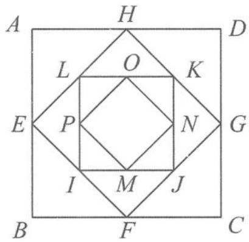

解答 设正方形 ABCD 的面积为 $a_{1}$ ，后续各正方形的面积依次为 $a_{2}, a_{3}, \cdots, a_{n}, \cdots$ ，则

图1.1-1

$$
a _ {1} = 2 5, a _ {k + 1} = \frac {1}{2} a _ {k}.
$$

所以：

(1) $S_{10} = 50 \times \left[1 - \left(\frac{1}{2}\right)^{10}\right] = \frac{25575}{512} (\mathrm{cm}^2)$ .

(2) $S_{n}=50\times\left[1-\left(\frac{1}{2}\right)^{n}\right]$ ，当n无限增大时， $S_{n}$ 趋近于 $50(cm^{2})$ .

评注 无穷等比数列求和问题是数列求和的一类重要问题,要引起足够的重视.

微信公众号
教辅资料站

## 思考题

1. 0-1 周期序列在通信技术中有着重要应用. 若序列 $a_1 a_2 \cdots a_n \cdots$ 满足 $a_i \in \{0,1\} (i=1,2,\cdots)$ , 且存在正整数 $m$ , 使得 $a_{i+m} = a_i (i=1,2,\cdots)$ 成立, 则称其为 0-1 周期序列, 并称满足 $a_{i+m} = a_i (i=1,2,\cdots)$ 的最小正整数 $m$ 为这个序列的周期. 对于周期为 $m$ 的 0-1 周期序列 $a_1 a_2 \cdots a_n \cdots, C(k) = \frac{1}{m} \sum_{i=1}^{m} a_i a_{i+k} (k=1,2,\cdots,m-1)$ 是描述其性质的重要指标. 在下列周期为 5 的 0-1 周期序列中, 满足 $C(k) \leqslant \frac{1}{5} (k=1,2,3,4)$ 的周期序列是 ( ). A. 11010… B. 11011… C. 10001… D. 11001…

2. 已知数列 $\{a_{n}\}$ 的前 $n$ 项和为 $S_{n}$ , 且满足 $a_{1} = \frac{1}{2}, a_{n} = -2 S_{n} S_{n-1} (n \geqslant 2)$ , 则 $S_{n} = \_$ , $a_{n} = \_$ .

3. 已知数列 $\{a_{n}\}$ 满足 $a_{1} = m$ ( $m$ 为正整数), $a_{n+1} = \begin{cases} \frac{a_{n}}{2}, & a_{n}\text{为偶数,} \\ 3a_{n} + 1, & a_{n}\text{为奇数.} \end{cases}$ 若 $a_{6} = 1$ , 则 $m$ 的所有可能的取值为 \_\_\_\_.

4. 已知数列 $\{a_{n}\}$ 满足 $a_{1}=2, a_{n+1}=\frac{1}{2}\left(a_{n}+\frac{1}{a_{n}}\right), b_{n}=\frac{a_{n}-1}{a_{n}+1}$ ，则 $b_{n}=$ \_\_\_\_.

5. 设数列 $\{a_{n}\}$ 的前 n 项和为 $S_{n}, \frac{2S_{n+1}+1}{2S_{n}+1} = \frac{a_{2}}{a_{1}} = k (k > 0, n \in \mathbb{N}^{*})$ .

(1) 证明: 数列 $\{a_{n}\}$ 是等比数列.

(2) 若 $a_1 + a_2 = 4$ ，数列 $\{b_n\}$ 满足 $b_n = \log_3 a_n - \frac{c}{a_n}$ ，其前 $n$ 项和为 $T_n$ ，满足对任意 $n \in \mathbf{N}^*$ ， $T_n \geqslant T_3$ ，求正实数 $c$ 的取值范围。

6. 试用两种方法求数列 $\{nq^{n-1}\} (q \neq 1)$ 的前 $n$ 项的和 $T_{n}$ .

7. 已知数列 $\{a_{n}\}$ 满足 $a_{1}=a, a_{2}=b, 2a_{n+2}=a_{n+1}+a_{n}$ .

(1) 设 $b_{n}=a_{n+1}-a_{n}$ ，证明：若 $a \neq b$ ，则 $\{b_{n}\}$ 是等比数列.

(2)(拓展题)若 $\lim(a_{1}+a_{2}+\cdots+a_{n})=4$ ,求a,b的值.

## 1.2 数列性质多,最美单调性

## 1.2.1 数列按变化规律分类

数列按照项的变化规律可以分为四类.

(1)递增数列,如:1,4,9,25,36;

(2)递减数列,如:32,16,8,4,1;

(3) 摆动数列, 如: 1, -2, 3, -4, 5, -6;

(4) 常数数列, 如: 0, 0, 0, 0, 0.

## 1.2.2 数列单调性的定义

数列的单调性可以用相邻项作差并比较符号来定义.

(1)若对任意的 $n \in \mathbb{N}^*$ , 均有 $a_{n+1} - a_n = 0$ 成立, 则称数列 $\{a_n\}$ 为常数数列.

(2)若对任意的 $n \in \mathbb{N}^*$ , 均有 $a_{n+1} - a_n > 0$ 成立, 则称数列 $\{a_n\}$ 为单调递增数列.

(若对任意的 $n \in N^{*}$ ，均有 $a_{n+1} - a_{n} \geqslant 0$ 成立，则称数列 $\{a_{n}\}$ 为单调不减数列)

若对任意的 $n \in \mathbb{N}^*$ 均有 $a_{n+1} - a_n < 0$ 成立, 则称数列 $\{a_n\}$ 为单调递减数列.

(若对任意的 $n \in N^{*}$ ，均有 $a_{n+1} - a_{n} \leqslant 0$ 成立，则称数列 $\{a_{n}\}$ 为单调不增数列)

(3) 若存在 $n_0 \in \mathbb{N}^*$ , 使得 $a_{n_0 + 1} - a_{n_0} < 0$ , 且存在 $m_0 \in \mathbb{N}^*$ , 使得 $a_{m_0 + 1} - a_{m_0} > 0$ , 则称数列 $\{a_n\}$ 为不单调数列 (摆动数列).

例1 已知数列 $\{a_{n}\}$ 满足 $a_{n} = \frac{n + 1}{2^{n}}$ ，证明：数列 $\{a_{n}\}$ 单调递减.

证明 因为 $a_{n+1} - a_n = \frac{n + 2}{2^{n + 1}} - \frac{n + 1}{2^n} = \frac{-n}{2^{n + 1}} < 0$ 恒成立, 所以数列 $\{a_n\}$ 单调递减.

例 2 已知数列 $\{x_{n}\}$ 满足 $x_{1}=\frac{1}{2},x_{n+1}=\frac{1}{1+x_{n}},n\in\mathbb{N}^{*}$ ，证明：数列 $\{x_{n}\}$ 不是单调数列.

证明 因为 $x_{1}=\frac{1}{2}, x_{2}=\frac{2}{3}, x_{3}=\frac{3}{5}, x_{4}=\frac{5}{8}, x_{5}=\frac{8}{13}, x_{6}=\frac{13}{21}, \cdots$ ，所以 $\{x_{n}\}$ 不是单调数列.

评注 如果要否定一个命题,只需举出反例即可,但如果要证明一个命题,则需要严格加以论证.

我们通过进一步研究可知:数列 $\{x_{n}\}$ 的奇数项数列 $\{x_{2n-1}\}$ 单调递增,偶数项数列 $\{x_{2n}\}$ 单调递减.证明如下:

证法一(作差法) 因为

$$
\begin{array}{r l} x _ {2 k + 2} - x _ {2 k + 4} & = \frac {1}{1 + x _ {2 k + 1}} - \frac {1}{1 + x _ {2 k + 3}} = \frac {x _ {2 k + 3} - x _ {2 k + 1}}{(1 + x _ {2 k + 1}) (1 + x _ {2 k + 3})} \\ & = \frac {x _ {2 k} - x _ {2 k + 2}}{(1 + x _ {2 k}) (1 + x _ {2 k + 1}) (1 + x _ {2 k + 2}) (1 + x _ {2 k + 3})}, \end{array}
$$

又数列为正项数列,所以分母大于零,故 $x_{2n+2}-x_{2n+4}$ 与 $x_{2n}-x_{2n+2}$ 同号.因为 $x_{2}-x_{4}>0$ ,所以 $x_{2n+2}-x_{2n+4}$ 与 $x_{2n}-x_{2n+2}$ 均为正号,所以 $\{x_{2n}\}$ 单调递减.

同理可得 $\{x_{2n-1}\}$ 单调递增.

证法二(函数法) 令 $f(x) = \frac{1}{1 + x}$ ，因为 $f(x)$ 在区间 $(0, +\infty)$ 上为减函数，假设 $x_{2k} > x_{2k+2}$ ，则 $f(x_{2k}) < f(x_{2k+2})$ ，即

$$
x _ {2 k + 1} <   x _ {2 k + 3}.
$$

同理可得

$$
x _ {2 k + 2} > x _ {2 k + 4}.
$$

由数学归纳法得 $\{x_{2n}\}$ 单调递减. 同理可得 $\{x_{2n-1}\}$ 单调递增.

事实上,在同一个坐标系中作出 $y = x$ 与 $y = \frac{1}{1 + x}$ 图象的草图(图1.2-1),从图象可以非常清晰地看出, $\{x_{2n}\}$ 单调递减, $\{x_{2n - 1}\}$ 单调递增,并且收敛于其极限位置(不动点).

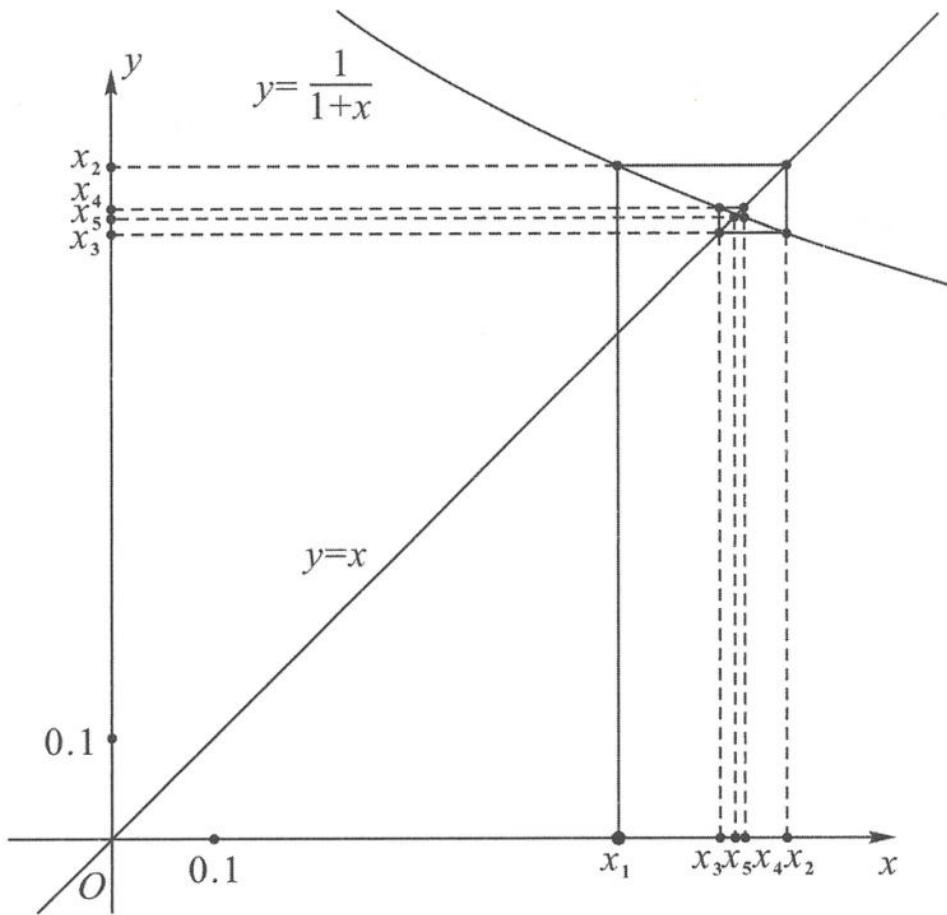  
图1.2-1

## 1.2.3 判断数列的最大(小)项之作差法

(1) 若存在 $n_0 \in \mathbb{N}^*$ , 使得对任意的 $n \in \mathbb{N}^*$ , 均有 $a_n \geqslant a_{n_0}$ 成立, 则称 $a_{n_0}$ 为数列 $\{a_n\}$ 的最小项. 如果最小项不是第一项, 则必有 $a_{n_0 + 1} \geqslant a_{n_0}$ 且 $a_{n_0 - 1} \geqslant a_{n_0}$ .

(2)若存在 $n_0 \in \mathbb{N}^*$ , 使得对任意的 $n \in \mathbb{N}^*$ , 均有 $a_n \leqslant a_{n_0}$ 成立, 则称 $a_{n_0}$ 为数列 $\{a_n\}$ 的最大项. 如果最大项不是第一项, 则必有 $a_{n_0 + 1} \leqslant a_{n_0}$ 且 $a_{n_0 - 1} \leqslant a_{n_0}$ .

例 3 已知数列 $\{a_{n}\}$ 的通项 $a_{n}=(n+1)\cdot\left(\frac{10}{11}\right)^{n}(n\in\mathbb{N}^{*})$ ，问：数列 $\{a_{n}\}$ 是否有最大项？若有，求出最大项的项数；若没有，说明理由。

解答 由已知可得

$$
a _ {n + 1} - a _ {n} = (n + 2) \cdot \left(\frac {1 0}{1 1}\right) ^ {n + 1} - (n + 1) \cdot \left(\frac {1 0}{1 1}\right) ^ {n} = \left(\frac {1 0}{1 1}\right) ^ {n} \cdot \frac {9 - n}{1 1}.
$$

同理

$$
a _ {n} - a _ {n - 1} = \left(\frac {1 0}{1 1}\right) ^ {n - 1} \cdot \frac {1 0 - n}{1 1}.
$$

由 $a_{n + 1} - a_n\leqslant 0$ 且 $a_{n} - a_{n - 1}\geqslant 0$ 可得

$$
9 \leqslant n \leqslant 1 0.
$$

所以 n=9 或 10，即 $a_{9}=a_{10}$ ，所以 $a_{9}, a_{10}$ 均为最大项。

例 4 已知数列 $\{a_{n}\}$ 满足 $a_{n}=\frac{1}{n}+\frac{1}{n+1}+\cdots+\frac{1}{2n}$ ，若 $k\geqslant a_{n}$ 恒成立，则实数 k 的最小值为 \_\_\_\_.

分析 由于数列 $\{a_{n}\}$ 的通项公式无法直接化简, 所以需要先研究其单调性.

解答 因为

$$
a _ {n + 1} - a _ {n} = \frac {1}{2 n + 1} + \frac {1}{2 n + 2} - \frac {1}{n} = \frac {1}{2 n + 1} + \frac {1}{2 n + 2} - \frac {2}{2 n} <   0,
$$

所以数列 $\{a_{n}\}$ 为单调递减数列，

$$
(a _ {n}) _ {\max} = a _ {1} = \frac {3}{2}.
$$

从而

$$
k \geqslant (a _ {n}) _ {\max} = \frac {3}{2},
$$

即 k 的最小值为 $\frac{3}{2}$ .

例 5 已知数列 $\{a_{n}\}$ 的首项 $a_{1}=m$ ，且 $a_{n+1}+a_{n}=2n+1(n\in\mathbb{N}^{*})$ ，如果 $\{a_{n}\}$ 是单调递增数列，则实数 m 的取值范围是 \_\_\_\_.

分析 根据数列的递推关系式,可先考虑通过递推关系式求出数列的通项公式或求出数列某些项的值.

解答 因为

$$
a _ {n + 1} + a _ {n} = 2 n + 1,
$$

所以

$$
a _ {n} + a _ {n - 1} = 2 n - 1 (n \geqslant 2).
$$

两式作差得

$$
a _ {n + 1} - a _ {n - 1} = 2 (n \geqslant 2).
$$

在数列 $\{a_{n}\}$ 中，奇数项和偶数项都是公差为2的等差数列.由条件可得

$$
a _ {1} = m, a _ {2} = 3 - m, a _ {3} = 2 + m, a _ {4} = 5 - m.
$$

若数列 $\{a_{n}\}$ 为递增数列，则只需 $a_1 < a_2 < a_3$ ，解得

$$
\frac {1}{2} <   m <   \frac {3}{2}.
$$

例 6 已知数列 $\{y_{n}\}$ 的通项公式为 $y_{n} = -n^{2} + 13n - \frac{133}{4}$ ，当 $y_{1}y_{2}y_{3} + y_{2}y_{3}y_{4} + y_{3}y_{4}y_{5} + \cdots + y_{n}y_{n+1}y_{n+2}$ 取得最大值时，n 的值为（）.
A. 7 B. 8 C. 9 D. 10

分析 根据数列求和的特点可知,如果增加的项是正项,则其和增大,如果增加的项是负项,则其和减小,所以需要通过判断增加的项的符号来确定数列和的最值.

解答 要使和最大,希望加上尽可能多的正项,若出现正、负项交替的情形,则需考虑正负项抵消后的情况.由题意知

$$
y _ {n} = - n ^ {2} + 1 3 n - \frac {1 3 3}{4} = - \frac {1}{4} (2 n - 7) (2 n - 1 9).
$$

当 $1 \leqslant n \leqslant 3$ 时， $y_{n} < 0$ ；当 $4 \leqslant n \leqslant 9$ 时， $y_{n} > 0$ ；当 $n \geqslant 10$ 时， $y_{n} < 0$ .

因为

$$
y _ {8} y _ {9} y _ {1 0} <   0, y _ {9} y _ {1 0} y _ {1 1} > 0, y _ {8} y _ {9} y _ {1 0} + y _ {9} y _ {1 0} y _ {1 1} = y _ {9} y _ {1 0} (y _ {8} + y _ {1 1}),
$$

且

$$
y _ {8} + y _ {1 1} <   0, y _ {9} y _ {1 0} <   0,
$$

所以

$$
y _ {8} y _ {9} y _ {1 0} + y _ {9} y _ {1 0} y _ {1 1} > 0.
$$

当 $n \geqslant 10$ 时，

$$
y _ {n} y _ {n + 1} y _ {n + 2} <   0,
$$

所以 n 的最大值为 9. 故选 C.

## 1.2.4 判断数列的最大(小)项之函数图象法与性质法

例 7 已知数列 $\{a_{n}\}$ 满足 $a_{n}=\begin{cases}(3-a)n-3,1\leqslant n\leqslant7,\\a^{n-6},&n>7\end{cases}$ 且 $\{a_{n}\}$ 是递增数列，则实数a的取值范围是( )。
A. $\left(\frac{9}{4},3\right)$ B. $\left[\frac{9}{4},3\right)$ C.(1,3) D.(2,3)

解答 若 $\{a_{n}\}$ 是递增数列, 则其对应的一次函数与指数型函数均为单调递增函数, 且在自

变量 $n = 7$ 与 $n = 8$ 时的函数值有严格的大小关系：

$$
\left\{ \begin{array}{l} 3 - a > 0, \\ a > 1, \\ (3 - a) \times 7 - 3 <   a ^ {8 - 6}, \end{array} \right.
$$

解得

$$
2 <   a <   3.
$$

故选D.

例 8 已知数列 $\{a_{n}\}$ 的通项公式为 $a_{n}=\frac{n-\sqrt{97}}{n-\sqrt{98}}$ ，则数列 $\{a_{n}\}$ 的前30项中的最大项为第\_\_\_\_项，最小项为第\_\_\_\_项。

解答 由已知得

$$
a _ {n} = \frac {n - \sqrt {9 7}}{n - \sqrt {9 8}} = \frac {n - \sqrt {9 8} + \sqrt {9 8} - \sqrt {9 7}}{n - \sqrt {9 8}} = 1 + \frac {\sqrt {9 8} - \sqrt {9 7}}{n - \sqrt {9 8}}.
$$

其对应函数为反比例型函数,由图 1.2-2 可知:数列的最大项为第 10 项,最小项为第 9 项.

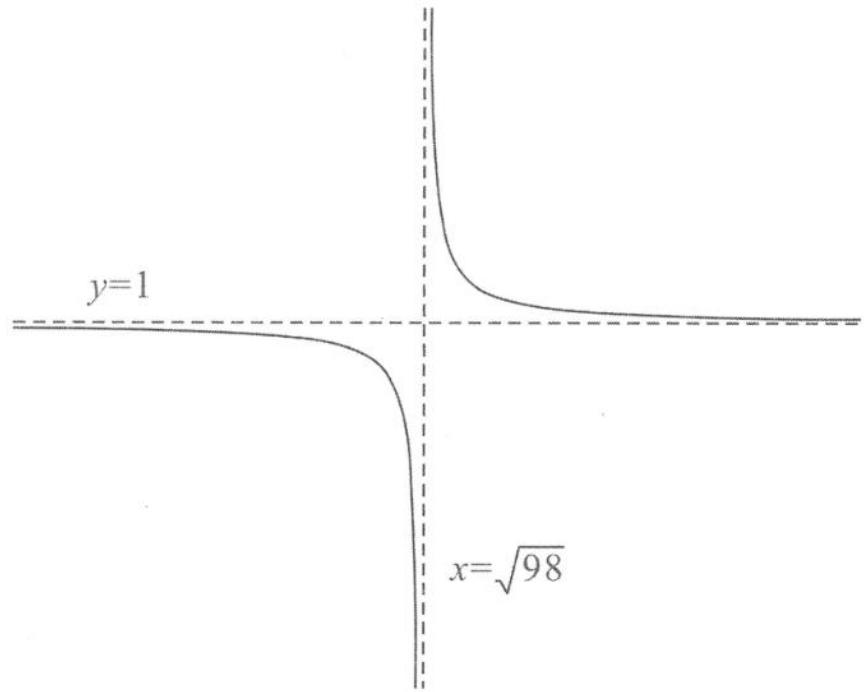  
图1.2-2

例 9 已知数列 $\{a_{n}\}$ 的通项公式为 $a_{n}=\frac{n}{(n+1)(n+4)}$ ，则数列 $\{a_{n}\}$ 最大项的值为 \_\_\_\_. 解答 解法一:由已知得

$$
a _ {n} = \frac {n}{(n + 1) (n + 4)} = \frac {1}{n + \frac {4}{n} + 5}.
$$

其对应母函数为对勾型函数,结合函数的单调性可知,当 n=2 时,

$$
(a _ {n}) _ {\max} = \frac {1}{9}.
$$

解法二:令

$$
a _ {n + 1} - a _ {n} = \frac {- n ^ {2} - n + 4}{(n + 1) (n + 4) (n + 2) (n + 5)} \leqslant 0,
$$

可得 $n \geqslant \frac{-1 + \sqrt{17}}{2}$ , 即

$$
n \geqslant 2.
$$

故

$$
(a _ {n}) _ {\max} = a _ {2} = \frac {1}{9}.
$$

例 10 已知数列 $\{a_{n}\}$ 的通项公式为 $a_{n}=an^{2}+n$ ，若 $a_{1}<a_{2}<a_{3}<a_{4}<a_{5}$ ，且 $a_{n}>a_{n+1}$ 对 $n\geqslant8$ 恒成立，则实数 a 的取值范围是 \_\_\_\_.

解答 数列的母函数为二次函数,结合二次函数图象(开口向下)可知

$$
\frac {9}{2} <   - \frac {1}{2 a} <   \frac {1 7}{2},
$$

整理得

$$
- \frac {1}{9} <   a <   - \frac {1}{1 7}.
$$

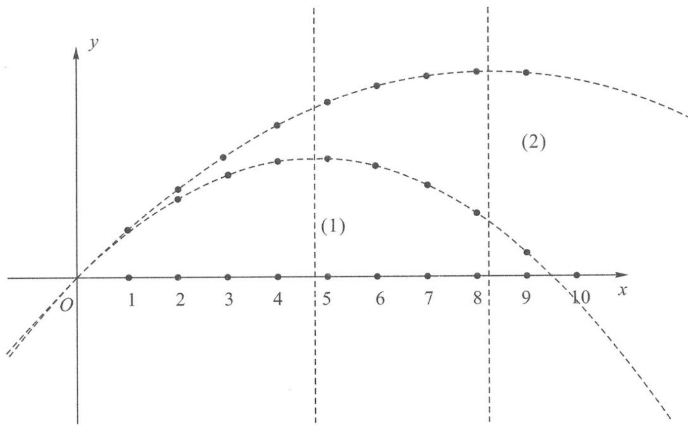  
图1.2-3

例 11 已知数列 $\{a_{n}\}$ 的通项公式为 $a_{n} = -n + t$ ，数列 $\{b_{n}\}$ 的通项公式为 $b_{n} = 3^{n-3}$ ，设 $c_{n} = \frac{a_{n} + b_{n}}{2} + \frac{|a_{n} - b_{n}|}{2}$ ，在数列 $\{c_{n}\}$ 中， $c_{n} \geqslant c_{3}$ ，则实数 t 的取值范围是 \_\_\_\_.

分析 $c_{n} = \frac{a_{n} + b_{n}}{2} +\frac{|a_{n} - b_{n}|}{2}$ 的本质是 $\max \{a_n,b_n\}$ 函数，故可根据 $\max \{a,b\}$ 的性质 $(\max \{a,b\} \geqslant a,\max \{a,b\} \geqslant b$ 和 $x > \max \{a,b\} \Leftrightarrow x > a,x > b)$ 以及 $\{a_n\}$ 和 $\{b_n\}$ 的单调性来解题.

解答 要使得 $c_{n} \geqslant c_{3}$ , 需

$$
\begin{array}{l} \max \{a _ {2}, b _ {2} \} \geqslant \max \{a _ {3}, b _ {3} \}, \\ \max \{a _ {4}, b _ {4} \} \geqslant \max \{a _ {3}, b _ {3} \}. \end{array}
$$

由于 $\max \{a_2, b_2\} \geqslant a_2 \geqslant a_3, b_2 < b_3$ （也即 $\max \{a_2, b_2\}$ 不能为 $b_2$ ），所以需

$$
\max \{a _ {2}, b _ {2} \} = a _ {2} \geqslant \max \{a _ {3}, b _ {3} \},
$$

即 $a_2 \geqslant b_3$ . 类似地

$$
\max \{a _ {4}, b _ {4} \} \geqslant \max \{a _ {3}, b _ {3} \} \Leftrightarrow b _ {4} \geqslant a _ {3}.
$$

从而 $\left\{\begin{aligned}t-2&\geqslant1,\\ t-3&\leqslant3\end{aligned}\right.$ 成立，解得

$$
t \in [ 3, 6 ].
$$

评注 若题设改为 $c_{n} = \frac{a_{n} + b_{n}}{2} -\frac{|a_{n} - b_{n}|}{2} = \min \{a_{n},b_{n}\} ,c_{n}\leqslant c_{3}$ ，则需要 $\left\{ \begin{array}{l}a_3\geqslant b_2,\\ a_4\leqslant b_3, \end{array} \right.$ 即 $\left\{ \begin{array}{ll}t - 3\geqslant \frac{1}{3},\\ t - 4\leqslant 1, \end{array} \right.$ 解得 $t\in \left[\frac{10}{3},5\right].$

## 1.2.5 判断数列的最大(小)项之导数法

例 12 已知数列 $\{c_{n}\}$ 的通项公式为 $c_{n}=(n+1)^{\frac{1}{n+1}}$ ，则 $c_{n}$ 的最大值为 \_\_\_\_.

解答 由已知得

$$
c _ {1} = \sqrt {2}, c _ {2} = \sqrt [ 3 ]{3}, c _ {3} = \sqrt [ 4 ]{4} = \sqrt {2}, c _ {4} = \sqrt [ 5 ]{5}, \dots ,
$$

易得

$$
c _ {1} <   c _ {2}, c _ {2} > c _ {3} > c _ {4} > \dots ,
$$

猜想: 当 $n \geqslant 2$ 时, $\{c_{n}\}$ 是递减数列.

下面构造函数对其进行证明.

令 $f(x) = \frac{\ln x}{x}$ , 则

$$
f ^ {\prime} (x) = \frac {\frac {1}{x} \cdot x - \ln x}{x ^ {2}} = \frac {1 - \ln x}{x ^ {2}}.
$$

当 $x \geqslant 3$ 时， $\ln x > 1$ ，则 $1 - \ln x < 0$ ，即

$$
f ^ {\prime} (x) <   0.
$$

在 $[3, +\infty)$ 内， $f(x)$ 为单调递减函数。所以，当 $n \geqslant 2$ 时， $\{\ln c_n\}$ 是递减数列，即 $\{c_n\}$ 是递减数列。又 $c_1 < c_2$ ，所以数列 $\{c_n\}$ 中的最大项为

$$
c _ {2} = \sqrt [ 3 ]{3}.
$$

评注 两个重要的数列单调性结论：

① $a_{n}=\frac{\ln n}{n}$ 先增后减(可用斜率的几何意义来说明);

② $a_{n}=\left(1+\frac{1}{n}\right)^{n}$ 单调递增(可取对数后用导数法来证明).

## 1.2.6 与数列单调性有关的概念问题

例 13 对于数列 $\{a_{n}\}$ ，“ $|a_{n+1}|<a_{n}(n=1,2,\cdots)$ ”是“ $\{a_{n}\}$ 为递减数列”的（）.

A. 充分不必要条件

B. 必要不充分条件

C. 充要条件

D. 既不充分也不必要条件

解答 一方面, 若 $|a_{n+1}| < a_n$ 成立, 则

$$
a _ {n + 1} \leqslant | a _ {n + 1} | <   a _ {n},
$$

所以 $\{a_{n}\}$ 必为递减数列.

另一方面，若 $\{a_{n}\}$ 为递减数列，但 $|a_{n + 1}| < a_{n}$ 可能不成立.如：

$$
- 1, - 2, - 3, - 4, - 5, \dots .
$$

所以“ $|a_{n+1}|<a_{n}(n=1,2,\cdots)$ ”是“ $\{a_{n}\}$ 为递减数列”的充分不必要条件.

综上可知,答案选 A.

例 14 设 $S_{n}$ 是公差为 $d(d \neq 0)$ 的无穷等差数列 $\{a_{n}\}$ 的前 n 项和, 给出下列结论:

①若 d<0，则数列 $\{S_{n}\}$ 有最大项；

②若数列 $\{S_{n}\}$ 有最大项,则d<0;

③若数列 $\{S_{n}\}$ 是递增数列,则对任意的 $n\in N^{*}$ ,均有 $S_{n}>0$ ;

④若对任意的 $n \in N^{*}$ ，均有 $S_{n} > 0$ ，则数列 $\{S_{n}\}$ 是递增数列.

其中错误的有 .(填序号)

解答 由等差数列的前 $n$ 项和公式可知

$$
S _ {n} = n a _ {1} + \frac {n (n - 1)}{2} d = \frac {d}{2} n ^ {2} + \left(a _ {1} - \frac {d}{2}\right) n.
$$

结合二次函数的图象和性质, 当 $d < 0$ 时, 数列 $\{S_{n}\}$ 有最大项, 即①正确; 同理②也正确.

若数列 $\{S_{n}\}$ 是递增数列, 那么 $d > 0$ , 但对任意的 $n \in \mathbb{N}^{*}, S_{n} > 0$ 不一定成立, 即③错误; 反之, 若对任意 $n \in \mathbb{N}^{*}$ , 均有 $S_{n} > 0$ , 则结合二次函数的图象和性质可知, 数列 $\{S_{n}\}$ 是递增数列, 所以④正确.

综上可知,错误的序号是③.

## 1.2.7 与数列单调性有关的综合问题

例 15 首项为正数的数列 $\{a_{n}\}$ 满足 $a_{n+1}=\frac{1}{4}(a_{n}^{2}+3)$ , $n\in N^{*}$ .

(1) 证明: 若 $a_{1}$ 为奇数, 则对一切 $n \geqslant 2, a_{n}$ 都是奇数.

(2)若对一切 $n \in \mathbb{N}^*$ , 都有 $a_{n+1} > a_n$ , 求 $a_1$ 的取值范围.

分析 第(1)问的证明可采用数学归纳法,第(2)问的求解可采用作差法,这里作差既可以是左、右各减 $a_{n}$ ,也可以是下标相差 1 的两个等式相减.

解答 (1)已知 $a_1$ 是奇数, 假设 $a_k = 2m - 1$ 是奇数, 其中 $m$ 为正整数, 则由递推关系式得

$$
a _ {k + 1} = \frac {a _ {k} ^ {2} + 3}{4} = m (m - 1) + 1.
$$

可知 $a_{k + 1}$ 仍然是奇数.由数学归纳法知，对任意的 $n\in \mathbf{N}^*$ ， $a_{n}$ 都是奇数

(2) 解法一: 由 $a_{2} = \frac{a_{1}^{2} + 3}{4} > a_{1}$ 得

$$
a _ {1} ^ {2} - 4 a _ {1} + 3 > 0,
$$

解得

$$
0 <   a _ {1} <   1 \text {或} a _ {1} > 3.
$$

因为

$$
a _ {n + 1} - a _ {n} = \frac {a _ {n} ^ {2} + 3}{4} - \frac {a _ {n - 1} ^ {2} + 3}{4} = \frac {(a _ {n} + a _ {n - 1}) (a _ {n} - a _ {n - 1})}{4},
$$

又 $a_1 > 0, a_{n+1} = \frac{a_n^2 + 3}{4}$ , 所以所有的 $a_n$ 均大于 0, 因此 $a_{n+1} - a_n$ 与 $a_n - a_{n-1}$ 同号.

根据数学归纳法， $\forall n \in \mathbb{N}^*$ ， $a_{n+1} - a_n$ 与 $a_2 - a_1$ 同号.

因此，对一切 $n \in \mathbb{N}^*$ ，都有 $a_{n+1} > a_n$ 的充要条件是 $0 < a_1 < 1$ 或 $a_1 > 3$ .

解法二:一方面,由 $a_{n+1}-a_{n}=\frac{1}{4}(a_{n}-1)(a_{n}-3)$ 知,若 $a_{n+1}>a_{n}$ ,则必有

$a_{n}<1$ 或 $a_{n}>3$ .

另一方面，若 $0 < a_{k} < 1$ ，则

$$
0 <   a _ {k + 1} <   \frac {1 + 3}{4} = 1;
$$

若 $a_{k} > 3$ ，则

$$
a _ {k + 1} > \frac {3 ^ {2} + 3}{4} = 3.
$$

根据数学归纳法，

$$
\begin{array}{r l} & 0 <   a _ {1} <   1 \Leftrightarrow 0 <   a _ {n} <   1, \forall n \in \mathbb {N} ^ {*}; \\ & a _ {1} > 3 \Leftrightarrow a _ {n} > 3, \forall n \in \mathbb {N} ^ {*}. \end{array}
$$

综合所述,对一切 $n \in N^{*}$ , 都有 $a_{n+1} > a_{n}$ 的充要条件是 $0 < a_{1} < 1$ 或 $a_{1} > 3$ .
解法三:构造母函数

$$
f (x) = \frac {x ^ {2} + 3}{4},
$$

它在 $(0, +\infty)$ 上单调递增. 由 $a_{2} = \frac{a_{1}^{2} + 3}{4} > a_{1}$ 得

$$
a _ {1} ^ {2} - 4 a _ {1} + 3 > 0,
$$

解得

$$
0 <   a _ {1} <   1 \text {或} a _ {1} > 3.
$$

当 n=1 时, 结论成立, 设 n=k 时结论成立, 则

$$
a _ {k + 2} = f (a _ {k + 1}) > f (a _ {k}) = a _ {k + 1},
$$

从而 $n=k+1$ 时结论成立. 由归纳原理知 $a_{n+1}>a_{n}$ .

评注 若 $a_{n}$ 的取值在递推函数的单调区间上, 则可构造母函数, 利用母函数的单调性来判断数列的单调性. 当然, 数列首项的取值往往会对数列的单调性有影响. 比如, 正项数列 $\{a_{n}\}$ 满足 $a_{1} = 1, a_{n+1} = \frac{5 + 2a_{n}}{16 - 8a_{n}}, n \in \mathbb{N}^{*}$ , 可以构造函数 $f(x) = \frac{5 + 2x}{16 - 8x}$ . 由于 $f(x)$ 在 $(0,2)$ 上单调递增, 可以归纳证明 $\frac{1}{2} = f\left(\frac{1}{2}\right) < a_{n+1} = f(a_{n}) < f(a_{n-1}) = a_{n} < \frac{5}{4} = f\left(\frac{5}{4}\right)$ .

(此时 $a_{n}$ 在两个不动点之间并不断靠近其中之一)

再如，正项数列 $\{a_{n}\}$ 满足 $a_1 = 2, a_{n+1} = \frac{2a_n + 6}{a_n + 1}, n \in \mathbb{N}^*$ ，可以构造函数 $f(x) = 2 + \frac{4}{x + 1}$ . 由于 $f(x)$ 在 $(0, +\infty)$ 上单调递增，可以归纳证明 $a_2 \geqslant a_{2n} = f(a_{2n-1}) > f(a_{2n+1}) = a_{2n+2} > 3 = f(3) > a_{2n+1} = f(a_{2n}) > f(a_{2n-2}) = a_{2n-1} \geqslant a_1$ .

(此时 $a_{n}$ 在其中一个不动点之间并时上时下,但越来越接近于它)

例 16 已知数列 $\{a_{n}\}$ 是首项为 6, 公差为 1 的等差数列, $S_{n}$ 为数列 $\{b_{n}\}$ 的前 n 项和, 且 $S_{n}=n^{2}+2n$ .

(1) 求 $\{a_{n}\}$ 及 $\{b_{n}\}$ 的通项公式 $a_{n}$ 和 $b_{n}$ .

(2) 若 $f(n) = \begin{cases} a_n, & n \text{ 为奇数,} \\ b_n, & n \text{ 为偶数,} \end{cases}$ 问: 是否存在 $k \in \mathbb{N}^*$ , 使 $f(k + 27) = 4f(k)$ 成立? 若存在, 求 $k$ 的值; 若不存在, 请说明理由.

(3)若对任意的正整数 $n$ ，不等式 $\frac{a}{\left(1 + \frac{1}{b_1}\right)\left(1 + \frac{1}{b_2}\right)\cdots\left(1 + \frac{1}{b_n}\right)} -\frac{1}{\sqrt{n - 2 + a_n}}\leqslant 0$ 恒成立，求

正数 a 的取值范围.

解答 (1)由题意得

$$
a _ {n} = a _ {1} + (n - 1) d = 6 + n - 1 = n + 5.
$$

当 $n = 1$ 时，

$$
b _ {1} = S _ {1} = 3;
$$

当 $n \geqslant 2$ 时，

$$
b _ {n} = S _ {n} - S _ {n - 1} = n ^ {2} + 2 n - (n - 1) ^ {2} - 2 (n - 1) = 2 n + 1.
$$

上式对 n=1 也成立, 所以

$$
b _ {n} = 2 n + 1 (n \in \mathbf {N} ^ {*}).
$$

总之， $a_{n}=n+5,b_{n}=2n+1.$

(2)已知 $f(n)=\left\{\begin{aligned}n+5,&n\text{为奇数,}\\ 2n+1,n\text{为偶数.}\end{aligned}\right.$

当 $k$ 为奇数时， $k + 27$ 为偶数。由 $f(k + 27) = 4f(k)$ 得

$$
2 (k + 2 7) + 1 = 4 (k + 5),
$$

解得

$$
2 k = 3 5, k = \frac {3 5}{2} (\text { 舍   去 }).
$$

当 $k$ 为偶数时， $k + 27$ 为奇数。由 $f(k + 27) = 4f(k)$ 得

$$
(k + 2 7) + 5 = 4 (2 k + 1),
$$

即 7k=28，所以 k=4 符合题意.

总之，存在整数 k=4，使结论成立。

(3) 将不等式变形并把 $a_{n} = n + 5$ 代入得

$$
a \leqslant \frac {1}{\sqrt {2 n + 3}} \left(1 + \frac {1}{b _ {1}}\right) \left(1 + \frac {1}{b _ {2}}\right) \left(1 + \frac {1}{b _ {3}}\right) \dots \left(1 + \frac {1}{b _ {n}}\right).
$$

设 $g(n)=\frac{1}{\sqrt{2n+3}}\left(1+\frac{1}{b_{1}}\right)\left(1+\frac{1}{b_{2}}\right)\cdots\left(1+\frac{1}{b_{n}}\right)$ ，则

$$
g (n + 1) = \frac {1}{\sqrt {2 n + 5}} \left(1 + \frac {1}{b _ {1}}\right) \left(1 + \frac {1}{b _ {2}}\right) \dots \left(1 + \frac {1}{b _ {n + 1}}\right),
$$

所以

$$
\frac {g (n + 1)}{g (n)} = \frac {\sqrt {2 n + 3}}{\sqrt {2 n + 5}} \left(1 + \frac {1}{b _ {n + 1}}\right) = \frac {\sqrt {2 n + 3}}{\sqrt {2 n + 5}} \cdot \frac {2 n + 4}{2 n + 3} = \frac {2 n + 4}{\sqrt {2 n + 5} \cdot \sqrt {2 n + 3}}.
$$

因为

$$
\sqrt {(2 n + 5) (2 n + 3)} <   \frac {(2 n + 5) + (2 n + 3)}{2} = 2 n + 4,
$$

所以 $\frac{g(n + 1)}{g(n)} > 1$ ，即

$$
g (n + 1) > g (n),
$$

所以 $g(n)$ 随 n 的增大而增大，

$$
g (n) _ {\min} = g (1) = \frac {1}{\sqrt {5}} \left(1 + \frac {1}{3}\right) = \frac {4 \sqrt {5}}{1 5},
$$

可得

$$
0 <   a \leqslant \frac {4 \sqrt {5}}{1 5}.
$$

## 思考题

1. 若数列 $\{a_{n}\}$ 的通项公式为 $a_{n}=\frac{n}{n^{2}+2020}(n\in\mathbb{N}^{*})$ ，则这个数列中的最大项是（）.
A. 第 43 项 B. 第 44 项 C. 第 45 项 D. 第 46 项

2. 在等差数列 $\{a_{n}\}$ 中, 已知 $a_{1} = -9, a_{5} = -1$ . 记 $T_{n} = a_{1}a_{2} \cdots a_{n} (n = 1, 2, \cdots)$ , 则数列 $\{T_{n}\}$ ( ). A. 有最大项, 且有最小项 B. 有最大项, 但无最小项 C. 无最大项, 但有最小项 D. 无最大项, 且无最小项

3.(1)已知数列 $\{a_{n}\}$ 满足 $a_{n}=\frac{2n-3}{2^{n}}$ ，则 $a_{n}$ 的最大值为\_\_\_\_.

(2)已知数列 $\{a_{n}\}$ 满足 $a_{n} = n^{2} - kn$ , 若该数列为递增数列, 则实数 $k$ 的取值范围是 \_\_\_\_.

4. 数列 $\{a_{n}\}$ 满足 $a_{1}=1,\sqrt{\frac{1}{a_{n}^{2}}+4}=\frac{1}{a_{n+1}}$ ，记数列 $\{a_{n}^{2}\}$ 的前 n 项的和为 $S_{n}$ ，若 $S_{2n+1}-S_{n}\leqslant\frac{t}{30}$ 对任意的 $n\in N^{*}$ 恒成立，则正整数 t 的最小值为 \_\_\_\_.

5. 已知数列 $\{a_{n}\}$ 的通项 $a_{n}=(-1)^{n}\cdot\frac{n+10}{2n+1}$ ， $T_{n}$ 是数列 $\{a_{n}\}$ 的前 n 项的积，当 $T_{n}$ 取到最大值时，n 的值为 \_\_\_\_；当 $T_{n}$ 取到最小值时，n 的值为 \_\_\_\_.

6. 设函数 $f(x) = \log_2 x - \log_x 2 (0 < x < 1)$ ，数列 $\{a_n\}$ 满足 $f(2^{a_n}) = 2n, n \in \mathbb{N}^*$ .

(1) 求 $\{a_{n}\}$ 的通项公式.

(2) 求 $\{a_{n}\}$ 中值最小的项.

7. 已知数列 $\{a_{n}\}$ 满足 $na_{n+2} - (n+2)a_{n} = \lambda (n^{2} + 2n)$ , 其中 $a_{1} = 1, a_{2} = 2$ . 若 $a_{n} < a_{n+1}$ 对任意的 $n \in \mathbb{N}^{*}$ 恒成立, 求实数 $\lambda$ 的取值范围.

8. 已知数列 $\{a_{n}\}$ 是首项 $a_{1} = \frac{1}{4}$ , 公比 $q = \frac{1}{4}$ 的等比数列, 设 $b_{n} + 2 = 3\log_{\frac{1}{4}} a_{n} (n \in \mathbb{N}^{*})$ , 数列 $\{c_{n}\}$ 满足 $c_{n} = a_{n} b_{n}$ .

(1) 证明: 数列 $\{b_{n}\}$ 成等差数列.

(2)求数列 $\{c_{n}\}$ 的前n项和 $S_{n}$ .

(3) 若 $c_{n} \leqslant \frac{1}{4} m^{2} + m - 1$ 对一切正整数 $n$ 恒成立, 求实数 $m$ 的取值范围.

9. 在公差不为 0 的等差数列 $\{a_{n}\}$ 中, $a_{3} + a_{10} = 15$ , 且 $a_{2}, a_{5}, a_{11}$ 成等比数列.

(1) 求 $\{a_{n}\}$ 的通项公式.

(2) 设 $b_n = \frac{1}{a_n} + \frac{1}{a_{n+1}} + \cdots + \frac{1}{a_{2n-1}}$ ，证明： $\frac{1}{2} \leqslant b_n < 1$ .

10. 已知 $a > 0$ , 且 $a \neq 1$ , 数列 $\{a_{n}\}$ 的前 $n$ 项和为 $S_{n}$ , 它满足条件 $\frac{a^{n} - 1}{S_{n}} = 1 - \frac{1}{a}$ . 在数列 $\{b_{n}\}$ 中, $b_{n} = a_{n} \lg a^{n}$ . 若对一切 $n \in \mathbb{N}^{*}$ , 都有 $\{b_{n}\}$ 单调递增, 求 $a$ 的取值范围.

11. 设 $a_{n} = \sum_{k=1}^{n} \frac{1}{k(n+1-k)}$ , 证明: 当正整数 $n \geqslant 2$ 时, $a_{n+1} < a_{n}$ .

# 等差数列与等比数列

## 2.1 数列之经典,等差来呈现

## 2.1.1 等差数列的基本概念和基本公式

如果一个数列从第 2 项起,每一项与它的前一项的差等于同一个常数,那么这个数列就叫作等差数列.

(1) 递推关系: $a_{n+1} - a_n = d$ (常数), 或 $a_n - a_{n-1} = d (n \in \mathbb{N}^*$ 且 $n \geqslant 2$ ).

(2)通项公式: $a_{n}=a_{1}+(n-1)d.$

推广形式: $a_{n}=a_{m}+(n-m)d$ (当 $d\neq0$ 时, $a_{n}$ 是关于n的一次函数).

(3) 求和公式: $S_{n} = \frac{n(a_{1} + a_{n})}{2} = na_{1} + \frac{n(n - 1)}{2} d$ (当 $d \neq 0$ 时, $S_{n}$ 是关于 $n$ 的二次函数, 且常数项为零).

例 1 设等差数列 $\{a_{n}\}$ 的前 n 项和为 $S_{n}$ ，且 $6S_{5}-5S_{3}=5$ ，则 $a_{4}=$ \_\_\_\_.

解答 因为

$$
S _ {n} = n a _ {1} + \frac {n (n - 1)}{2} d,
$$

所以

$$
S _ {5} = 5 a _ {1} + 1 0 d,
$$

$$
S _ {3} = 3 a _ {1} + 3 d.
$$

于是

$$
6 S _ {5} - 5 S _ {3} = 3 0 a _ {1} + 6 0 d - (1 5 a _ {1} + 1 5 d) = 1 5 a _ {1} + 4 5 d = 1 5 \left(a _ {1} + 3 d\right) = 1 5 a _ {4} = 5,
$$

解得

$$
a _ {4} = \frac {1}{3}.
$$

例2 已知数列 $\{a_{n}\}$ 的前 $n$ 项和是 $S_{n}$ , 则下列四个命题中, 错误的是 ( ).

A. 若数列 $\{a_{n}\}$ 是公差为 $d$ 的等差数列, 则数列 $\left\{\frac{S_{n}}{n}\right\}$ 是公差为 $\frac{d}{2}$ 的等差数列

B. 若数列 $\left\{\frac{S_{n}}{n}\right\}$ 是公差为 $d$ 的等差数列, 则数列 $\{a_{n}\}$ 是公差为 $2d$ 的等差数列

C. 若数列 $\{a_{n}\}$ 是等差数列, 则数列 $\{a_{n}\}$ 的奇数项、偶数项分别构成等差数列

D. 若数列 $\{a_{n}\}$ 的奇数项、偶数项分别构成公差相等的等差数列, 则 $\{a_{n}\}$ 是等差数列

解答 对于 A 选项, 若等差数列 $\{a_{n}\}$ 的首项为 $a_{1}$ , 公差为 $d$ , 前 $n$ 项的和为 $S_{n}$ , 则数列 $\left\{\frac{S_{n}}{n}\right\}$ 为等差数列, 且通项为 $\frac{S_{n}}{n} = a_{1} + (n - 1)\frac{d}{2}$ , 即数列 $\left\{\frac{S_{n}}{n}\right\}$ 是公差为 $\frac{d}{2}$ 的等差数列, 故 A 选项正确.

对于 B 选项,由题意得 $\frac{S_n}{n} = a_1 + (n - 1)d$ , 所以 $S_n = na_1 + n(n - 1)d$ , 则 $a_n = S_n - S_{n-1} = a_1 + 2(n - 1)d$ , 即数列 $\{a_n\}$ 是公差为 $2d$ 的等差数列, 故 B 选项正确.

对于 C 选项, 若等差数列 $\{a_{n}\}$ 的公差为 d, 则数列 $\{a_{n}\}$ 的奇数项、偶数项都是公差为 2d 的等差数列, 故 C 选项正确.

对于 D 选项, 若数列 $\{a_{n}\}$ 的奇数项、偶数项分别构成公差相等的等差数列, 则 $\{a_{n}\}$ 不一定是等差数列, 例如: 1, 4, 3, 6, 5, 8, 7, 故 D 选项错误.

所以选D.

例 3 设 $a_{1}, d$ 为实数, 首项为 $a_{1}$ , 公差为 d 的等差数列 $\{a_{n}\}$ 的前 n 项和为 $S_{n}$ , 且满足 $S_{5}S_{6}+15=0$ , 则 d 的取值范围是 \_\_\_\_.

分析 此题中等差数列 $\{a_{n}\}$ 的前 $n$ 项和可看作关于 $n$ 的一元二次函数（常数项为0），也可看作关于 $a_{1}$ 和 $d$ 的一次函数，所以方程 $S_{5}S_{6} + 15 = 0$ 可看作关于首项 $a_{1}$ 的一元二次函数（公差 $d$ 看作常量），利用判别式法可求得 $d$ 的取值范围。

解答 将 $S_{5}S_{6}+15=0$ 化为基本量表示, 可得

$$
(5 a _ {1} + 1 0 d) (6 a _ {1} + 1 5 d) + 1 5 = 0.
$$

利用判别式法可求得

$$
d \leqslant - 2 \sqrt {2} \text {或} d \geqslant 2 \sqrt {2}.
$$

例 4 设等差数列 $\{a_{n}\}$ 的前 n 项和为 $S_{n}$ ，若 $S_{4} \geqslant 10, S_{5} \leqslant 15$ ，则 $a_{4}$ 的最大值为 \_\_\_\_. 解答 由 $S_{4} \geqslant 10, S_{5} \leqslant 15$ 可得

$$
\left\{ \begin{array}{l} 2 a _ {1} + 3 d \geqslant 5, \\ a _ {1} + 2 d \leqslant 3. \end{array} \right.
$$

又

$$
a _ {4} = a _ {1} + 3 d = - (2 a _ {1} + 3 d) + 3 (a _ {1} + 2 d) \leqslant 4,
$$

所以 $a_4$ 的最大值为4.

评注 此题还可采用待定系数法进行整体构造. 设 $a_{4} = x(2a_{1} + 3d) + y(a_{1} + 2d)$ , 由待定系数法可得 $x = -1, y = 3$ , 所以 $a_{4} = -(2a_{1} + 3d) + 3(a_{1} + 2d) \leqslant 4$ , 故 $a_{4}$ 的最大值为 4.

## 2.1.2 等差数列的主要性质

等差数列的性质主要有以下七个方面.

(1) 若 $n + m = p + q$ ，则 $a_{n} + a_{m} = a_{p} + a_{q}$ .（反之不一定成立，如常数数列）

例 5 （1）设等差数列 $\{a_{n}\}$ 的前 n 项和为 $S_{n}(n=1,2,3\cdots)$ ，当首项 $a_{1}$ 和公差 d 变化时，若 $a_{5}+a_{8}+a_{11}$ 是一个定值，则下列各数中为定值的是（）.

A. $S_{16}$ B. $S_{15}$ C. $S_{17}$ D. $S_{18}$

解答 因为 $a_{5} + a_{8} + a_{11}$ 是定值, 所以 $3a_{8}$ 是定值, 即 $a_{8}$ 为定值, 所以 $S_{15} = \frac{(a_{1} + a_{15}) \times 15}{2} = 15a_{8}$ 也为定值.

故选B.

(2)已知数列 $\{a_{n}\}$ 是等差数列,若 $a_{4}+a_{7}+a_{10}=17,a_{4}+a_{5}+a_{6}+\cdots+a_{12}+a_{13}+a_{14}=77$ 且 $a_{k}=13$ ,则k=\_\_\_\_.

解答 因为 $a_{4}+a_{7}+a_{10}=17$ ，所以 $3a_{7}=17$ ，即 $a_{7}=\frac{17}{3}$ ，所以 $a_{4}+a_{5}+a_{6}+\cdots+a_{12}+a_{13}+a_{14}=11a_{9}=77$ ，即 $a_{9}=7$ ，所以 $d=\frac{2}{3}$ ，所以 $13-7=(k-9)\times\frac{2}{3}$ ，即 k=18。

(2)等差中项:若三个数a,b,c成等差数列,则称b为a和c的等差中项,即 $2b=a+c$ ,可将这三个数记为:b-d,b,b+d.

(3) $a_{k},a_{k+m},a_{k+2m},\cdots$ 构成以 md 为公差的等差数列.

(4) 若 $\{a_{n}\}$ ， $\{b_{n}\}$ 为等差数列，则 $\{pa_{n}+qb_{n}\}$ 也为等差数列.

(5) $\{a_{n}\}$ 是等差数列的充要条件是 $S_{n}=An^{2}+Bn.$ (A,B可以为零)

例6 已知两个等差数列 $\{a_{n}\}$ 和 $\{b_{n}\}$ 的前 $n$ 项和分别为 $A_{n}$ 和 $B_{n}$ , 且 $\frac{A_{n}}{B_{n}} = \frac{7n + 45}{n + 3}$ , 则使得 $\frac{a_{n}}{b_{n}}$ 为整数的正整数 $n$ 有( ). A. 2个 B. 3个 C. 4个 D. 5个

解答 解法一: 结合已知条件得

$$
\frac {a _ {n}}{b _ {n}} = \frac {2 a _ {n}}{2 b _ {n}} = \frac {a _ {1} + a _ {2 n - 1}}{b _ {1} + b _ {2 n - 1}} = \frac {A _ {2 n - 1}}{B _ {2 n - 1}} = \frac {7 n + 1 9}{n + 1} = 7 + \frac {1 2}{n + 1}.
$$

要使得 $\frac{a_n}{b_n}$ 为整数，则 $n = 1,2,3,5,11$ ，共有5个，所以选D.

解法二:由已知得

$$
\frac {A _ {n}}{B _ {n}} = \frac {7 n + 4 5}{n + 3} = \frac {7 n ^ {2} + 4 5 n}{n ^ {2} + 3 n}.
$$

可设

$$
A _ {n} = 7 n ^ {2} + 4 5 n, B _ {n} = n ^ {2} + 3 n,
$$

则

$$
a _ {n} = A _ {n} - A _ {n - 1} = 1 4 n + 3 8, b _ {n} = B _ {n} - B _ {n - 1} = 2 n + 2.
$$

从而

$$
\frac {a _ {n}}{b _ {n}} = \frac {7 n + 1 9}{n + 1} = 7 + \frac {1 2}{n + 1}.
$$

要使得 $\frac{a_n}{b_n}$ 为整数，则 $n = 1,2,3,5,11$ ，共有5个，所以选D.

评注 公差不为 0 的等差数列的前 n 项和是常数项为 0 的一元二次函数, 这就为我们判定等差数列或采用待定系数法求解相关问题提供了很好的保障.

变式1 已知等差数列 $\{a_{n}\}, \{b_{n}\}$ 的前 $n$ 项和分别为 $S_{n}, T_{n}$ , 若对任意的正整数 $n$ , 都有 $\frac{S_{n}}{T_{n}} = \frac{n - 9}{5n + 3}$ , 则 $\frac{a_{n}}{b_{n}} = \_\_\_\_\_, \frac{a_{13}}{b_{5}} = \_\_\_\_\_.$

解答 已知 $\{a_{n}\}, \{b_{n}\}$ 均为等差数列，且 $\frac{S_n}{T_n} = \frac{n - 9}{5n + 3}$ ，可设

$$
S _ {n} = k n (n - 9), T _ {n} = k n (5 n + 3),
$$

其中 $k \neq 0$ . 当 $n \geqslant 2$ 时，

$$
a _ {n} = S _ {n} - S _ {n - 1} = k (2 n - 1 0), b _ {n} = T _ {n} - T _ {n - 1} = k (1 0 n - 2),
$$

则

$$
\frac {a _ {n}}{b _ {n}} = \frac {n - 5}{5 n - 1} (n \geqslant 2).
$$

当 $n = 1$ 时， $\frac{S_1}{T_1} = -1$ ，也符合上式，所以

$$
\frac {a _ {n}}{b _ {n}} = \frac {n - 5}{5 n - 1}.
$$

从而

$$
\frac {a _ {1 3}}{b _ {5}} = \frac {1}{3}.
$$

变式 2 设 $S_{n}$ 为等差数列 $\{a_{n}\}$ 的前 n 项和，若 $\frac{a_{2n}}{a_{n}} = \frac{4n - 1}{2n - 1}$ ，则 $\frac{S_{2n}}{S_{n}} =$ \_\_\_\_.

解答 由 $\frac{a_{2n}}{a_n} = \frac{4n - 1}{2n - 1}$ 得

$$
\frac {a _ {n} + n d}{a _ {n}} = \frac {4 n - 1}{2 n - 1},
$$

整理得

$$
a _ {n} = \frac {2 n - 1}{2} d, a _ {1} = \frac {d}{2},
$$

故

$$
S _ {n} = \frac {n (a _ {1} + a _ {n})}{2} = \frac {n ^ {2} d}{2}, S _ {2 n} = \frac {(2 n) ^ {2} d}{2} = 4 S _ {n}.
$$

所以 $\frac{S_{2n}}{S_{n}}=4.$

(6) $S_{2m}-S_{m},S_{3m}-S_{2m},S_{4m}-S_{3m},\cdots$ 构成以 $m^{2}d$ 为公差的等差数列.

例 7 已知 $\{a_{n}\}$ 为等差数列, 其前 10 项的和 $S_{10}=100$ , 前 100 项的和 $S_{100}=10$ , 则前 110 项的和 $S_{110}=$ \_\_\_\_.

解答 解法一: 设 $\{a_{n}\}$ 的首项为 $a_{1}$ ，公差 d，则

$$
\left\{ \begin{array}{l} 1 0 a _ {1} + \frac {1}{2} \times 1 0 \times 9 d = 1 0 0, \\ 1 0 0 a _ {1} + \frac {1}{2} \times 1 0 0 \times 9 9 d = 1 0, \end{array} \right.
$$

解得

$$
\left\{ \begin{array}{l} d = - \frac {1 1}{5 0}, \\ a _ {1} = \frac {1 0 9 9}{1 0 0}. \end{array} \right.
$$

所以

$$
S _ {1 1 0} = 1 1 0 a _ {1} + \frac {1}{2} \times 1 1 0 \times 1 0 9 d = - 1 1 0.
$$

解法二:已知 $\{a_{n}\}$ 为等差数列,可设 $S_{n}=An^{2}+Bn$ ,则

$$
\left\{ \begin{array}{l} 1 0 0 A + 1 0 B = 1 0 0, \\ 1 0 0 0 0 A + 1 0 0 B = 1 0, \end{array} \right.
$$

可得

$$
1 1 0 A + B = - 1.
$$

所以

$$
S _ {1 1 0} = 1 1 0 ^ {2} A + 1 1 0 B = 1 1 0 (1 1 0 A + B) = - 1 1 0.
$$

解法三: 因为新数列 $S_{10}, S_{20} - S_{10}, S_{30} - S_{20}, \cdots, S_{100} - S_{90}, S_{110} - S_{100}$ 成等差数列, 所以新数列的前 10 项和等于原数列的前 100 项和, 即

$$
1 0 S _ {1 0} + \frac {1 0 \times 9}{2} d ^ {\prime} = S _ {1 0 0} = 1 0,
$$

解得 $d' = -22$ ，所以

$$
S _ {1 1 0} - S _ {1 0 0} = S _ {1 0} + 1 0 d ^ {\prime} = - 1 2 0,
$$

从而

$$
S _ {1 1 0} = - 1 1 0.
$$

解法四: 因为

$$
S _ {1 0 0} - S _ {1 0} = \frac {(a _ {1 1} + a _ {1 0 0}) \times 9 0}{2} = - 9 0,
$$

所以

$$
a _ {1 1} + a _ {1 0 0} = - 2.
$$

从而

$$
S _ {1 1 0} = \frac {1 1 0 \times (a _ {1} + a _ {1 1 0})}{2} = \frac {(a _ {1 1} + a _ {1 0 0}) \times 1 1 0}{2} = - 1 1 0.
$$

评注 解法一和解法二直接利用等差数列的求和公式进行计算,即先求得基本量,再计算相应和的值,运算量略大.解法三和解法四考虑了等差数列的性质,在充分利用性质的基础上加以计算,计算量明显降低,这在我们解题中是很值得关注并掌握的.

(7)设 $S_{\text {偶}}$ 与 $S_{\text {奇}}$ 分别为该数列的所有偶数项之和与所有奇数项之和,则有:

①若 $\{a_{n}\}$ 共有2n-1项( $a_{n}$ 为中间项)，则 $S_{2n-1}=(2n-1)a_{n},S_{奇}-S_{偶}=a_{n},\frac{S_{奇}}{S_{偶}}=\frac{n}{n-1}.$

②若 $\{a_{n}\}$ 共有 $2n$ 项（ $a_{n}$ 和 $a_{n+1}$ 为中间项），则 $S_{2n} = n(a_{n} + a_{n+1})$ ， $S_{\text{偶}} - S_{\text{奇}} = nd$ ， $\frac{S_{\text{奇}}}{S_{\text{偶}}} = \frac{a_{n}}{a_{n+1}}$ 。

注:以上七条性质均可用等差数列的求和公式以及相应性质来推导求解.

例 8 (1) 已知等差数列共有 $2n + 1$ 项, 其中奇数项的和为 290, 偶数项的和为 261, 求 $a_{n+1}$ .

解答 因为

$$
S _ {\mathrm{奇}} = \frac {(a _ {1} + a _ {2 n + 1}) (n + 1)}{2} = (n + 1) a _ {n + 1},
$$

$$
S _ {\mathrm{偶}} = \frac {(a _ {2} + a _ {2 n}) n}{2} = n a _ {n + 1},
$$

所以

$$
a _ {n + 1} = S _ {\mathrm{奇}} - S _ {\mathrm{偶}} = 2 9.
$$

(2)一个等差数列的前12项之和为354,前12项中的偶数项与奇数项之比为 $32:27$ ,求该等差数列的公差.

解答 因为

$$
S _ {\mathrm{奇}} = \frac {(a _ {1} + a _ {1 1}) \times 6}{2} = 6 a _ {6},
$$

$$
S _ {\mathrm{偶}} = \frac {(a _ {2} + a _ {1 2}) \times 6}{2} = 6 a _ {7},
$$

所以

$$
6 a _ {6} + 6 a _ {7} = 3 5 4 \text {且} \frac {6 a _ {7}}{6 a _ {6}} = \frac {3 2}{2 7},
$$

解得 $a_6 = 27, a_7 = 32$ . 因此公差

$$
d = a _ {7} - a _ {6} = 5.
$$

## 2.1.3 等差数列前 $n$ 项和的最值的求法

从本质上讲,研究数列和的最值问题的方法与研究数列通项最值问题的方法是一致的.当 $S_{n}$ 的表达式已给出或已求出时,最值问题的研究可采用以下方法:

(1) 图象分析法. 利用基本初等函数的图象及图象的变换来求解.

(2) 函数性质法. 如二次函数、指数函数、反比例函数及其复合函数等.

(3)通项分析法.

①若 $a_{n} > 0$ 恒成立, 则 $S_{n}$ 单调递增, $S_{1}$ 最小; 若 $a_{n} < 0$ 恒成立, 则 $S_{n}$ 单调递减, $S_{1}$ 最大.

②若数列 $S_{n}$ 先增后减，则其有最大值，取到最大值的条件是 $\left\{\begin{aligned}S_{n}&\geqslant S_{n-1},\\ S_{n}&\geqslant S_{n+1}\end{aligned}\right.$ $(n\geqslant2)$ ，即 $\left\{\begin{aligned}a_{n}&\geqslant0,\\ a_{n+1}&\leqslant0\end{aligned}\right.$ $(n\geqslant2)$ .

若数列 $S_{n}$ 先减后增，则其有最小值，取到最小值的条件是 $\left\{ \begin{array}{l} S_{n} \leqslant S_{n-1}, \\ S_{n} \leqslant S_{n+1} \end{array} \right.$ ( $n \geqslant 2$ )，即 $\left\{ \begin{array}{l} a_{n} \leqslant 0, \\ a_{n+1} \geqslant 0 \end{array} \right.$ ( $n \geqslant 2$ ).

(4) 求导法. 由于数列是特殊的函数, 我们也可对与其通项对应的函数求导来研究其单调性和最值.

例 9 (1) 已知等差数列 $5, 4 \frac{2}{7}, 3 \frac{4}{7}, \cdots$ 的前 n 项和为 $S_{n}$ ，当 $S_{n}$ 取到最值时，求 n 的值.

解答 解法一:由已知可得 $a_{1}=5, d=-\frac{5}{7}$ ，所以

$$
S _ {n} = \frac {d}{2} n ^ {2} + \left(a _ {1} - \frac {d}{2}\right) n = \frac {5 \times (1 5 n - n ^ {2})}{1 4}.
$$

当 n=7 或 8 时， $S_{n}$ 取到最大值.

解法二: 因为 $a_{1}=5, d=-\frac{5}{7}$ ，所以

$$
a _ {n} = - \frac {5}{7} n + \frac {4 0}{7}.
$$

又因为 $a_{1}>0, d<0$ ，所以前 n 项和 $S_{n}$ 有最大值，满足

$$
\left\{ \begin{array}{l} a _ {n} \geqslant 0, \\ a _ {n + 1} \leqslant 0, \end{array} \right.
$$

可得当 n=7 或 8 时, $S_{n}$ 取到最大值.

(2) 在等差数列 $\{a_{n}\}$ 中, $3a_{4}=7a_{5}, a_{1}>0$ , 求当 $S_{n}$ 取到最值时 n 的值.

解答 由 $3a_{4} = 7a_{5}$ 得

$$
a _ {1} = - \frac {1 9}{4} d > 0,
$$

所以 $d < 0$ 且

$$
a _ {n} = \left(n - \frac {2 3}{4}\right) d.
$$

由 $a_{n} \geqslant 0, a_{n+1} \leqslant 0$ 可得，当 $n = 5$ 时， $S_{n}$ 取到最大值.

(3)在等差数列 $\{a_{n}\}$ 中，d<0， $S_{12}=S_{21}$ ，求当 $S_{n}$ 取到最值时n的值.

解答 解法一:由 $S_{12}=S_{21}$ 得

$$
a _ {1 3} + a _ {1 4} + \dots + a _ {2 1} = \frac {(a _ {1 3} + a _ {2 1}) \times 9}{2} = 9 a _ {1 7} = 0.
$$

因为 $d < 0$ ，所以

$$
a _ {1 6} > 0, a _ {1 8} <   0.
$$

当 n=16 或 17 时， $S_{n}$ 取到最大值.

解法二: 因为 d<0, 所以 $S_{n}$ 是关于 n 的开口向下的二次函数(有最大值). 又因为 $S_{12}=S_{21}$ , 由二次函数图象的对称性可知, 其对称轴为直线

$$
n = n _ {0} = \frac {3 3}{2}.
$$

所以当 n=16 或 17 时, $S_{n}$ 取到最大值.

(4)在等差数列 $\{a_{n}\}$ 中,已知 $S_{12}>0,S_{13}<0$ ,试判断 $S_{1},S_{2},S_{3},\cdots,S_{12}$ 中哪一个最大,并说明理由.

解答 解法一: 因为

$$
S _ {1 2} = \frac {(a _ {1} + a _ {1 2}) \times 1 2}{2} = \frac {(a _ {6} + a _ {7}) \times 1 2}{2} > 0,
$$

$$
S _ {1 3} = \frac {(a _ {1} + a _ {1 3}) \times 1 3}{2} = 1 3 a _ {7} <   0,
$$

所以 $a_{7}<0, a_{6}>0$ . 故 $S_{6}$ 最大.

解法二: 因为 $S_{12}>0, S_{13}<0$ ，所以 $S_{n}$ 是关于 n 的开口向下的二次函数（有最大值）。根据二次函数图象的对称性可知，其对称轴为直线 $n=n_{0}, n_{0}$ 满足

$$
n _ {0} \in \left(\frac {1 2}{2}, \frac {1 3}{2}\right).
$$

结合图象可知 $S_{6}$ 最大.

例 10 （多选题）设 $S_{n}$ 为等差数列 $\{a_{n}\}$ 的前 n 项和，且 $(n+1)S_{n}<nS_{n+1}(n\in\mathbb{N}^{*})$ .
若 $\frac{a_{8}}{a_{7}}<-1$ ，则（）.
A. $S_{n}$ 的最大值是 $S_{8}$ B. $S_{n}$ 的最小值是 $S_{7}$ C. $S_{13}<0$ D. $S_{14}>0$

解答 由 $(n + 1)S_{n} <   nS_{n + 1}$ 可得

$$
(n + 1) \cdot \frac {n (a _ {1} + a _ {n})}{2} <   n \cdot \frac {(n + 1) (a _ {1} + a _ {n + 1})}{2},
$$

整理得

$$
a _ {n} <   a _ {n + 1},
$$

所以等差数列 $\{a_{n}\}$ 是递增数列. 因为 $\frac{a_8}{a_7} < -1$ , 所以

$a_{8}>0,a_{7}<0$ ,且 $a_{7}+a_{8}>0$ ,

所以 $S_{n}$ 的最小值是 $S_{7}$ , 且

$$
S _ {1 3} = \frac {(a _ {1} + a _ {1 3}) \times 1 3}{2} = 1 3 a _ {7} <   0,
$$

$$
S _ {1 4} = \frac {(a _ {1} + a _ {1 4}) \times 1 4}{2} = \frac {(a _ {7} + a _ {8}) \times 1 4}{2} > 0.
$$

故选 BCD.

例 11 设等差数列 $\{a_{n}\}$ 的前 n 项和为 $S_{n}$ ，且满足 $S_{17}>0, S_{18}<0$ ，则 $\frac{S_{1}}{a_{1}}, \frac{S_{2}}{a_{2}}, \cdots, \frac{S_{15}}{a_{15}}$ 中最大的项为（）.

A. $\frac{S_{7}}{a_{7}}$ B. $\frac{S_{8}}{a_{8}}$ C. $\frac{S_{9}}{a_{9}}$ D. $\frac{S_{10}}{a_{10}}$

解答 在等差数列 $\{a_{n}\}$ 中, 因为 $S_{17}>0$ , 且 $S_{18}<0$ , 即

$$
S _ {1 7} = 1 7 a _ {9} > 0, S _ {1 8} = 9 \left(a _ {9} + a _ {1 0}\right) <   0,
$$

所以 $a_9 + a_{10} < 0, a_9 > 0$ ，从而

$$
a _ {1 0} <   0.
$$

可知等差数列 $\{a_{n}\}$ 为递减数列，因此 $a_{1},a_{2},\cdots,a_{9}$ 为正， $a_{10},a_{11},\cdots$ 为负，所以 $S_{1},S_{2},\cdots,S_{17}$ 为正， $S_{18},S_{19},\cdots$ 为负，则

$$
\frac {S _ {1}}{a _ {1}} > 0, \frac {S _ {2}}{a _ {2}} > 0, \dots , \frac {S _ {9}}{a _ {9}} > 0, \frac {S _ {1 0}}{a _ {1 0}} <   0, \frac {S _ {1 1}}{a _ {1 1}} <   0, \dots , \frac {S _ {1 5}}{a _ {1 5}} <   0.
$$

又因为 $S_{1}<S_{2}<\cdots<S_{9},a_{1}>a_{2}>\cdots>a_{9}$ ，所以 $\frac{S_{9}}{a_{9}}$ 最大，故选 C.

变式 已知 $S_{n}$ 是等差数列 $\{a_{n}\}$ 的前 $n$ 项和, 且 $S_{6} > S_{7} > S_{5}$ , 有这样的五个命题: ① $d < 0$ ; ② $S_{11} > 0$ ; ③ $S_{12} < 0$ ; ④ 数列 $\{S_{n}\}$ 中的最大项为 $S_{11}$ ; ⑤ $|a_{6}| > |a_{7}|$ . 其中正确的命题有 ( ). A. 2 个 B. 3 个 C. 4 个 D. 5 个

解答 由 $S_{6} > S_{7} > S_{5}$ 得

$a_{6}>0,a_{7}<0$ 且 $a_{6}+a_{7}>0.$

借鉴例 12 的解答,容易判定①②⑤均正确,所以选 B.

## 2.1.4 等差数列的判定方法

等差数列的判定方法主要有以下几种：

(1) 定义法: $a_{n+1} - a_n = d$ (常数);

(2)通项法: $a_{n}=a_{1}+(n-1)d;$

(3) 中项法: $2a_{n+1} = a_n + a_{n+2}$ ;

(4) 求和法: $S_{n} = A n^{2} + B n$ .

例 12 设数列 $\{a_{n}\}$ 的前 n 项和为 $S_{n}$ ，若 $S_{n}=\frac{n(a_{1}+a_{n})}{2}(n\in\mathbb{N}^{*})$ 恒成立，证明： $\{a_{n}\}$ 为等差数列.

分析 对于数列的和与通项共存的式子,往往需要通过进位(或退位)相减来达到异名化同名的目的(即得到只有数列的和或只有通项的式子),进而可以求出通项公式.

证明 当 $n \geqslant 2$ 时, 由题设得

$$
S _ {n - 1} = \frac {(n - 1) (a _ {1} + a _ {n - 1})}{2}, S _ {n} = \frac {n (a _ {1} + a _ {n})}{2},
$$

所以

$$
a _ {n} = S _ {n} - S _ {n - 1} = \frac {n (a _ {1} + a _ {n})}{2} - \frac {(n - 1) (a _ {1} + a _ {n - 1})}{2}.
$$

同理，有

$$
a _ {n + 1} = \frac {(n + 1) (a _ {1} + a _ {n + 1})}{2} - \frac {n (a _ {1} + a _ {n})}{2}.
$$

从而

$$
a _ {n + 1} - a _ {n} = \frac {(n + 1) (a _ {1} + a _ {n + 1})}{2} - n (a _ {1} + a _ {n}) + \frac {(n - 1) (a _ {1} + a _ {n - 1})}{2},
$$

整理得

$$
a _ {n + 1} - a _ {n} = a _ {n} - a _ {n - 1}.
$$

此式对任意的 $n \geqslant 2$ 恒成立. 从而由等差中项的性质可知, $\{a_{n}\}$ 是等差数列.

例 13 在数列 $\{a_{n}\}$ 中, 已知 $a_{1}=3$ , 前 n 项和 $S_{n}=\frac{1}{2}(n+1)(a_{n}+1)-1$ .

(1) 证明: 数列 $\{a_{n}\}$ 是等差数列.

(2)设数列 $\left\{\frac{1}{a_n a_{n+1}}\right\}$ 的前 $n$ 项和为 $T_n$ , 是否存在实数 $M$ , 使得 $T_n \leqslant M$ 对一切正整数 $n$ 都成立? 若存在, 求 $M$ 的最小值; 若不存在, 试说明理由.

解答 (1)证法一:由 $S_{n}=\frac{1}{2}(n+1)(a_{n}+1)-1$ 进位相减可得

$$
n a _ {n + 1} = (n + 1) a _ {n} - 1,
$$

再进位相减可得

$$
(n + 1) a _ {n + 2} - n a _ {n + 1} = (n + 2) a _ {n + 1} - (n + 1) a _ {n},
$$

即

$$
2 (n + 1) a _ {n + 1} = (n + 1) \left(a _ {n + 2} + a _ {n}\right),
$$

化简得

$$
2 a _ {n + 1} = a _ {n + 2} + a _ {n}.
$$

所以数列 $\{a_{n}\}$ 为等差数列.

【 $\{a_{n}\}$ 的通项公式:因为 $a_{1}=3$ ,所以 $a_{2}=2a_{1}-1=5$ ,则 $a_{2}-a_{1}=2$ ,所以 $a_{n}=a_{1}+(n-1)d=3+2(n-1)=2n+1.$ 】

证法二:由 $S_{n}=\frac{1}{2}(n+1)(a_{n}+1)-1$ 进位相减可得

$$
n a _ {n + 1} = (n + 1) a _ {n} - 1.
$$

此式可化为

$$
\frac {a _ {n + 1}}{n + 1} = \frac {a _ {n}}{n} - \frac {1}{(n + 1) n},
$$

累加求和并化简,可得

$$
a _ {n} = 2 n + 1.
$$

所以数列 $\{a_{n}\}$ 为等差数列.

(2)由(1)知 $a_{n}=2n+1$ ，所以

$$
\frac {1}{a _ {n} a _ {n + 1}} = \frac {1}{(2 n + 1) (2 n + 3)} = \frac {1}{2} \times \left(\frac {1}{2 n + 1} - \frac {1}{2 n + 3}\right).
$$

从而

$$
T _ {n} = \frac {1}{2} \times \left(\frac {1}{3} - \frac {1}{5} + \frac {1}{5} - \frac {1}{7} + \dots + \frac {1}{2 n + 1} - \frac {1}{2 n + 3}\right) = \frac {1}{2} \times \left(\frac {1}{3} - \frac {1}{2 n + 3}\right).
$$

当 $n \in \mathbb{N}^*$ 时, $T_{n} < \frac{1}{6}$ . 要使 $T_{n} \leqslant M$ 对一切正整数 $n$ 恒成立, 只要 $M \geqslant \frac{1}{6}$ . 所以存在实数 $M$ 使得 $T_{n} \leqslant M$ 对一切正整数 $n$ 都成立, $M$ 的最小值为 $\frac{1}{6}$ .

例14 在数列 $\{a_{n}\}$ 中，已知 $a_1 = \frac{3}{5}, a_n = 2 - \frac{1}{a_{n-1}} (n \geqslant 2)$ ，数列 $\{b_n\}$ 满足 $b_n = \frac{1}{a_n - 1}$ .

(1) 证明: 数列 $\{b_{n}\}$ 是等差数列.

(2)求数列 $\{a_{n}\}$ 的最大项和最小项,并说明理由.

解答 (1) 因为

$$
b _ {n + 1} = \frac {1}{a _ {n + 1} - 1} = \frac {1}{1 - \frac {1}{a _ {n}}} = \frac {a _ {n}}{a _ {n} - 1}, b _ {n} = \frac {1}{a _ {n} - 1},
$$

所以

$$
b _ {n + 1} - b _ {n} = 1.
$$

又因为 $b_{1} = \frac{1}{a_{1} - 1} = -\frac{5}{2}$ 所以

$$
b _ {n} = - \frac {5}{2} + (n - 1) \times 1 = n - \frac {7}{2}.
$$

(2) 易得

$$
a _ {n} = 1 + \frac {1}{n - \frac {7}{2}}.
$$

结合反比例函数的图象和性质可知,数列 $\{a_{n}\}$ 的最小项为 $a_{3}$ ,最大项为 $a_{4}$ .

变式 在数列 $\{a_{n}\}$ 中, 已知 $a_{1} = 1, a_{n} = 3a_{n-1} + 3^{n} + 4 (n \in \mathbb{N}^{*}, n \geqslant 2)$ , 若存在实数 $\lambda$ , 使得数列 $\left\{\frac{a_{n} + \lambda}{3^{n}}\right\}$ 为等差数列, 则 $\lambda =$ \_\_\_\_.

解答 设 $b_{n} = \frac{a_{n} + \lambda}{3^{n}}$ ，得

$$
b _ {n + 1} = \frac {a _ {n + 1} + \lambda}{3 ^ {n + 1}} = \frac {3 a _ {n} + 3 ^ {n + 1} + 4 + \lambda}{3 ^ {n + 1}},
$$

所以

$$
b _ {n + 1} - b _ {n} = 1 + \frac {4 - 2 \lambda}{3 ^ {n + 1}}.
$$

由于 $\{b_n\}$ 是等差数列，所以 $1 + \frac{4 - 2\lambda}{3^{n + 1}}$ 是与 $n$ 无关的常数，所以 $4 - 2\lambda = 0$ ，解得

$$
\lambda = 2.
$$

例 15 已知等差数列 $\{a_{n}\}$ 的公差 d 不等于 0，且 $a_{n}\neq0$ 。设 $f_{n}(x)=a_{n}x^{2}+2a_{n+1}x+a_{n+2}$ ，证明：存在 $x_{0}$ ，使得 $f_{n}(x_{0})=0$ ，如果 $f_{k}(x_{k})=0(k\in\mathbb{N}^{*})$ ， $x_{k}\neq x_{0}$ ，则 $\frac{1}{x_{1}+1},\frac{1}{x_{2}+1},\cdots,\frac{1}{x_{n}+1}$ ，…成等差数列。

证明 因为 $\{a_{n}\}$ 为等差数列, 则

$$
2 a _ {k + 1} = a _ {k} + a _ {k + 2}.
$$

于是

$$
a _ {k} x ^ {2} + (a _ {k} + a _ {k + 2}) x + a _ {k + 2} = 0,
$$

即

$$
(x + 1) (a _ {k} x + a _ {k + 2}) = 0
$$

对任意的 k 恒成立, 故 $x_{0} = -1$ , 满足 $f_{n}(x_{0}) = 0$ .

对任意的 $n \geqslant 1$ ，方程 $f_{k}(x_{k}) = 0$ 且 $x_{k} \neq x_{0}$ ，则有 $x_{k} = -\frac{a_{k+2}}{a_{k}}$ ，于是

$$
x _ {k} + 1 = - \frac {2 d}{a _ {k}}, \frac {1}{x _ {k} + 1} = - \frac {a _ {k}}{2 d}, \frac {1}{x _ {k + 1} + 1} = - \frac {a _ {k + 1}}{2 d},
$$

所以 $\frac{1}{x_{k + 1} + 1} -\frac{1}{x_k + 1} = -\frac{1}{2}$ 为常数，则 $\frac{1}{x_1 + 1},\frac{1}{x_2 + 1},\dots ,\frac{1}{x_n + 1},\dots$ 成等差数列.

## 2.1.5 与等差数列有关的综合性问题

例 16 设等差数列 $\{a_{n}\}$ 的前 n 项和为 $S_{n}$ ，已知 $(a_{5}-1)^{3}+3a_{5}=4,(a_{8}-1)^{3}+3a_{8}=2$ ，则下列选项正确的是（）.

A. $S_{12}=12,a_{5}>a_{8}$ B. $S_{12}=24,a_{5}>a_{8}$ C. $S_{12}=12,a_{5}<a_{8}$ D. $S_{12}=24,a_{5}<a_{8}$

解答 由已知得

$$
\left\{ \begin{array}{l} (a _ {5} - 1) ^ {3} + 3 (a _ {5} - 1) = 1, \\ (a _ {8} - 1) ^ {3} + 3 (a _ {8} - 1) = - 1. \end{array} \right.
$$

设 $f(x) = x^{3} + 3x$ ，易知 $f(x)$ 在 $\mathbf{R}$ 上为奇函数且单调递增。因为

$$
f (a _ {5} - 1) = 1, f (a _ {8} - 1) = - 1,
$$

所以

$$
f (a _ {5} - 1) > f (a _ {8} - 1), \text {且} f (a _ {5} - 1) + f (a _ {8} - 1) = 0.
$$

故 $a_5 > a_8$ ，且 $a_5 - 1 = -(a_8 - 1)$ ，即

$$
a _ {5} + a _ {8} = 2.
$$

又 $\{a_{n}\}$ 是等差数列，所以

$$
S _ {1 2} = \frac {1 2 (a _ {1} + a _ {1 2})}{2} = \frac {1 2 (a _ {5} + a _ {8})}{2} = 1 2.
$$

故选A.

例 17 已知函数 $f(x)=\left\{\begin{aligned}&2^{x}-1,&x\leqslant0,\\&f(x-1)+1,x>0,\end{aligned}\right.$ 把方程 $f(x)-x=0$ 的根按从小到大的顺序排成一个数列，则该数列的前 n 项和 $S_{n}=$ \_\_\_\_.

解答 方程 $f(x) - x = 0$ 等价于 $f(x) = x$ ，易知 $f(0) = 0$ 。因为 $f'(0) = \ln 2 < 1$ ，所以：当 $x < 0$ 时， $f(x) = x$ 无解，所以

$$
a _ {1} = 0.
$$

当 $x > 0$ 时，

①若 $x \in (0,1]$ ，则

$$
f (x) = f (x - 1) + 1 = 2 ^ {x - 1} = x,
$$

解得 $x = 1$ . 所以

$$
a _ {2} = 1.
$$

②若 $x \in (1, 2]$ , 则

$$
f (x) = f (x - 1) + 1 = 2 ^ {x - 2} + 1 = x,
$$

解得 $x = 2$ .所以

$$
a _ {3} = 2.
$$

依次可得 $a_{n} = n - 1$ ，所以

$$
S _ {n} = \frac {n (n - 1)}{2}.
$$

例 18 设数列 $\{a_{n}\}$ 的各项都是正数, 且对任意的 $n \in N^{*}$ , 都有 $a_{1}^{3} + a_{2}^{3} + a_{3}^{3} + \cdots + a_{n}^{3} = S_{n}^{2}$ , 记 $S_{n}$ 为数列 $\{a_{n}\}$ 的前 n 项和.

(1)求数列 $\{a_{n}\}$ 的通项公式.

(2) 若 $b_{n} = 3^{n} + (-1)^{n - 1}\lambda \times 2^{a_{n}}(\lambda$ 为非零常数, $n \in \mathbb{N}^{*})$ , 问: 是否存在整数 $\lambda$ , 使得对任意的 $n \in \mathbb{N}^{*}$ , 都有 $b_{n + 1} > b_{n}$ ?

解答 (1) 分别令 $n = 1$ 与 $n = 2$ , 可得

$$
a _ {1} = 1, a _ {2} = 2.
$$

当 $n \geqslant 2$ 时, $a_{n}^{3} = S_{n}^{2} - S_{n-1}^{2}$ , 即

$$
a _ {n} ^ {2} = S _ {n} + S _ {n - 1};
$$

当 $n \geqslant 3$ 时， $a_{n}^{2} - a_{n-1}^{2} = a_{n} + a_{n-1}$ ，因为 $a_{n} > 0$ ，所以

$$
a _ {n} - a _ {n - 1} = 1.
$$

故

$$
a _ {n} = n.
$$

(2)由(1)知

$$
b _ {n} = 3 ^ {n} + (- 1) ^ {n - 1} \lambda \times 2 ^ {n}.
$$

由 $b_{n + 1} > b_n$ 得 $2\times 3^{n} > \lambda (-1)^{n - 1}\times 3\times 2^{n}$ 恒成立.

若 n 为奇数，则 $\frac{2 \times 3^{n}}{3 \times 2^{n}} > \lambda$ 恒成立，故当 n = 1 时， $\lambda < 1$ ;

若 $n$ 为偶数，则 $-\frac{2 \times 3^n}{3 \times 2^n} < \lambda$ 恒成立，故当 $n = 2$ 时， $\lambda > -\frac{3}{2}$ .

综上可得 $-\frac{3}{2}<\lambda<1.$

又 $\lambda\neq0$ , 且 $\lambda\in Z$ , 所以存在 $\lambda=-1$ 满足题意.

例 19 设各项均为正数的数列 $\{a_{n}\}$ 的前 n 项和为 $S_{n}$ ，已知 $2a_{2}=a_{1}+a_{3}$ ，数列 $\{\sqrt{S_{n}}\}$ 是公差为 d 的等差数列.

(1)求数列 $\{a_{n}\}$ 的通项公式(用n,d表示).

(2)设 c 为实数,对满足 $m+n=3k$ 且 $m\neq n$ 的任意正整数 m,n,k,不等式 $S_{m}+S_{n}>cS_{k}$ 都成立,证明:c 的最大值为 $\frac{9}{2}$ .

解答 (1)由题意知 $d > 0$

$$
\sqrt {S _ {n}} = \sqrt {S _ {1}} + (n - 1) d = \sqrt {a _ {1}} + (n - 1) d.
$$

已知 $2a_{2} = a_{1} + a_{3}$ ，则 $3a_{2} = S_{3}$ ，即 $3(S_{2} - S_{1}) = S_{3}$ ，即

$$
3 [ (\sqrt {a _ {1}} + d) ^ {2} - a _ {1} ] ^ {2} = (\sqrt {a _ {1}} + 2 d) ^ {2},
$$

化简得

$$
a _ {1} - 2 \sqrt {a _ {1}} \cdot d + d ^ {2} = 0.
$$

解得 $\sqrt{a_1} = d$ ，即 $a_1 = d^2$ ，则

$$
\sqrt {S _ {n}} = d + (n - 1) d = n d, S _ {n} = n ^ {2} d ^ {2}.
$$

当 $n \geqslant 2$ 时，

$$
a _ {n} = S _ {n} - S _ {n - 1} = n ^ {2} d ^ {2} - (n - 1) ^ {2} d ^ {2} = (2 n - 1) d ^ {2}.
$$

上式适合 n=1 的情形, 故

$$
a _ {n} = (2 n - 1) d ^ {2}.
$$

(2)由 $S_{m} + S_{n} > cS_{k}$ 得

$$
m ^ {2} d ^ {2} + n ^ {2} d ^ {2} > c \cdot k ^ {2} d ^ {2} \Rightarrow m ^ {2} + n ^ {2} > c \cdot k ^ {2},
$$

故 $c < \frac{m^2 + n^2}{k^2}$ 恒成立. 又 $m + n = 3k$ 且 $m \neq n$ ,

$$
2 (m ^ {2} + n ^ {2}) > (m + n) ^ {2} = 9 k ^ {2} \Rightarrow \frac {m ^ {2} + n ^ {2}}{k ^ {2}} > \frac {9}{2},
$$

故 $c \leqslant \frac{9}{2}$ , 即 $c$ 的最大值为 $\frac{9}{2}$ .

## 思考题

1. 已知 $\{a_{n}\}$ 为等差数列，且 $a_{7}-2a_{4}=-1, a_{3}=0$ ，则公差 d 等于（）.
A.-2 B. $-\frac{1}{2}$ C. $\frac{1}{2}$ D.2

2. 设 $S_{n}$ 是等差数列 $\{a_{n}\}$ 的前 n 项和，若 $\frac{a_{5}}{a_{3}} = \frac{5}{9}$ ，则 $\frac{S_{9}}{S_{5}}$ 等于（）.
A. 1 B. -1 C. 2 D. $\frac{5}{9}$

3. 设 $S_{n}$ 是等差数列 $\{a_{n}\}$ 的前 n 项和，若 $\frac{S_{6}}{S_{3}} = \frac{9}{4}$ ，则 $\frac{S_{9}}{S_{6}}$ 等于（）.
A. $\frac{13}{4}$ B. $\frac{13}{9}$ C. $\frac{5}{9}$ D. $\frac{5}{3}$

4. 已知 $\{a_{n}\}$ 满足 $a_{1}=a_{2}=1,\frac{a_{n+2}}{a_{n+1}}-\frac{a_{n+1}}{a_{n}}=1$ ，则 $a_{6}-a_{5}$ 的值为（）.
A. 48 B. 96 C. 120 D. 130

5. 已知 $\{a_{n}\}$ 为等差数列， $a_{1} + a_{3} + a_{5} = 105, a_{2} + a_{4} + a_{6} = 99$ ，则 $a_{20}$ 等于（）.
A.-1 B.1 C.3 D.7

6. 已知等差数列 $\{a_{n}\}$ 共有 2n 项, 其中奇数项的和为 90, 偶数项的和为 72, 且 $a_{2n}-a_{1}=-33$ , 则该数列的公差为(). A. 3 B. -3 C. -2 D. -1

7. 已知等差数列 $\{a_{n}\}$ 的前 n 项和为 $S_{n}$ ，且 $S_{n}=\frac{n}{m}, S_{m}=\frac{m}{n}(m, n\in\mathbb{N}^{*}$ 且 $m\neq n)$ ，则 $S_{n+m}$ 的值可能为（）.
A. 2 B. $\frac{5}{2}$ C. 4 D. $\frac{9}{2}$

8. 已知某等差数列的前 $n$ 项和 $S_{n} = n^{2} + 2\lambda n - \lambda$ ，则 $\lambda =$ \_\_\_\_.

9. 已知等差数列 $\{a_{n}\}$ 的前 n 项和为 $S_{n}$ ，若 $S_{12}=21$ ，则 $a_{2}+a_{5}+a_{8}+a_{11}=$ \_\_\_\_.

10. 已知数列 $a_{n}=\left\{\begin{aligned}&n-1,n\text{为奇数,}\\ &n,\quad n\text{为偶数,}\end{aligned}\right.$ 则 $a_{1}+a_{100}=$ \_\_\_\_ , $a_{1}+a_{2}+a_{3}+a_{4}+\cdots+a_{99}+$ $a_{100}=$ \_\_\_\_.

11. 若一个等差数列的前 3 项和为 34, 最后 3 项和为 146, 且所有项的和为 390, 则该数列的项数为 \_\_\_\_.

12. 已知等差数列 $\{a_{n}\}$ 的前 $n$ 项和为 $S_{n}$ , 若 $m > 1$ 且 $a_{m-1} + a_{m+1} - a_{m}^{2} = 0, S_{2m-1} = 38$ , 则 $m = \_$ .

13. 在等差数列 $\{a_{n}\}$ 中, 已知 $\frac{a_{11}}{a_{10}} < -1$ , 若 $\{a_{n}\}$ 的前 n 项和 $S_{n}$ 有最大值, 则使 $S_{n}$ 取得最小正数时的 n = \_\_\_\_.

14. 已知 $(x^{2} - 2x + m)(x^{2} - 2x + n) = 0$ 的 4 个根组成首项为 $\frac{1}{4}$ 的等差数列, 则 $|m - n| =$ \_\_\_\_.

15. 已知 $a, b, c$ 成等差数列，证明： $a^2 - bc, b^2 - ac, c^2 - ab$ 是等差数列。

16. 在数列 $\{a_{n}\}$ 中, 已知 $a_{1}=5$ 且 $a_{n}=2a_{n-1}+2^{n}-1 (n\geqslant2$ 且 $n\in N^{*}$ ).

(1) 求 $a_{2}, a_{3}$ 的值.

(2)是否存在实数 $\lambda$ ，使得数列 $\left\{\frac{a_{n}+\lambda}{2^{n}}\right\}$ 为等差数列？若存在，求出 $\lambda$ 的值；若不存在，说明理由.

17. 在数列 $\{a_{n}\}$ 中, 已知 $S_{n}=100n-n^{2}(n\in\mathbb{N})$ .

(1) 求 $a_{n}$ .

(2) 求 $\{|a_{n}|\}$ 的前 n 项和.

18. 已知数列 $\{a_{n}\}$ 的前 n 项和 $S_{n}$ 满足 $2S_{n}-na_{n}=3n(n\in\mathbb{N}^{*})$ ，且 $a_{2}=5$ .

(1) 证明: 数列 $\{a_{n}\}$ 为等差数列, 并求其通项公式.

(2) 设 $b_{n} = \frac{1}{a_{n}\sqrt{a_{n + 1}} + a_{n + 1}\sqrt{a_{n}}}$ , $T_{n}$ 为数列 $\{b_{n}\}$ 的前 $n$ 项和, 求使 $T_{n} > \frac{\sqrt{3}}{10}$ 成立的最小正整数 $n$ 的值.

## 2.2 数列之经典,等比来呈现

## 2.2.1 等比数列的基本概念和基本公式

如果一个数列从第 2 项起,每一项与它的前一项的比值等于同一个常数,那么这个数列就叫作等比数列.

(1) 递推关系: $\frac{a_{n+1}}{a_n} = q (q \neq 0)$ 或 $\frac{a_n}{a_{n-1}} = q (q \neq 0, n \geqslant 2)$ .

(2)通项公式: $a_{n}=a_{1}q^{n-1}(a_{1}q\neq0)$ ;

推广形式: $a_{n}=a_{m}q^{n-m}$ .

(3) 求和公式: $S_{n} = \begin{cases} na_{1}, q = 1, \\ \frac{a_{1}(1 - q^{n})}{1 - q} = \frac{a_{1} - a_{n}q}{1 - q}, q \neq 0 \text{ 且 } q \neq 1. \end{cases}$

例 1 (1) 在正项等比数列 $\{a_{n}\}$ 中, $a_{5}a_{7}=1$ , $a_{6}+a_{8}=5$ , 则 $a_{n}=$ \_\_\_\_.

解答 解法一: 因为 $a_{n}>0$ , 且

$$
a _ {5} a _ {7} = a _ {1} ^ {2} q ^ {1 0} = 1, a _ {6} + a _ {8} = a _ {1} q ^ {5} (1 + q ^ {2}) = 5,
$$

所以 $1 + q^{2} = 5$ ，即

$$
q = 2, a _ {1} = 2 ^ {- 5},
$$

从而

$$
a _ {n} = 2 ^ {n - 6}.
$$

解法二：因为 $a_{n} > 0$ ，且

$$
a _ {5} a _ {7} = a _ {6} ^ {2} = 1, a _ {6} + a _ {8} = a _ {6} (1 + q ^ {2}) = 5,
$$

所以 $1 + q^{2} = 5$ ，即

$$
q = 2, a _ {1} = 2 ^ {- 5},
$$

从而

$$
a _ {n} = 2 ^ {n - 6}.
$$

(2)在正项等比数列 $\{a_{n}\}$ 中,已知公比q=2,且 $a_{1}a_{2}\cdots a_{30}=2^{30}$ ,则 $a_{3}a_{6}a_{9}\cdots a_{30}$ 等于().A. $2^{10}$ B. $2^{20}$ C. $2^{16}$ D. $2^{15}$

解答 解法一: 因为

$$
a _ {1} a _ {2} \dots a _ {3 0} = a _ {1} ^ {3 0} q ^ {\frac {(1 + 2 9) \times 2 9}{2}} = a _ {1} ^ {3 0} q ^ {4 3 5} = 2 ^ {3 0},
$$

$$
a _ {3} a _ {6} a _ {9} \dots a _ {3 0} = a _ {1} ^ {1 0} q ^ {\frac {(2 + 2 9) \times 1 0}{2}} = a _ {1} ^ {1 0} q ^ {1 5 5} = x,
$$

又因为公比 q=2，所以 $x^{3}=2^{60}$ ，即

$$
x = 2 ^ {2 0}.
$$

故选B.

解法二:根据题意得

$$
a _ {1} = \frac {a _ {3}}{q ^ {2}}, a _ {2} = \frac {a _ {3}}{q}, a _ {4} = \frac {a _ {6}}{q ^ {2}}, a _ {5} = \frac {a _ {6}}{q}, \dots .
$$

设 $a_{3}a_{6}a_{9}\dots a_{30} = x$ ，则

$$
2 ^ {3 0} = a _ {1} a _ {2} \dots a _ {3 0} = (a _ {1} a _ {4} \dots a _ {2 8}) (a _ {2} a _ {5} \dots a _ {2 9}) (a _ {3} a _ {6} \dots a _ {3 0}) = \frac {x}{2 ^ {2 0}} \cdot \frac {x}{2 ^ {1 0}} \cdot x.
$$

因为公比 q=2，所以

$$
a _ {3} a _ {6} a _ {9} \dots a _ {3 0} = x = 2 ^ {2 0}.
$$

故选B.

变式 在等比数列 $\{a_{n}\}$ 中，已知q=2, $S_{99}=77$ ，求 $a_{3}+a_{6}+a_{9}+\cdots+a_{99}$ 的值.

解答 根据题意得

$$
\begin{array}{r l} S _ {9 9} & = (a _ {1} + a _ {4} + \dots + a _ {9 7}) + (a _ {2} + a _ {5} + \dots + a _ {9 8}) + (a _ {3} + a _ {6} + \dots + a _ {9 9}) \\ & = \left(\frac {1}{q ^ {2}} + \frac {1}{q} + 1\right) (a _ {3} + a _ {6} + \dots + a _ {9 9}), \end{array}
$$

解得

$$
a _ {3} + a _ {6} + \dots + a _ {9 9} = 4 4.
$$

评注 等比数列前 n 项和或前 n 项积的问题, 可以考虑先分组再计算, 这样往往能使运算得以化简.

例 2 在等比数列 $\{a_{n}\}$ 中, 已知 $a_{1} + a_{n} = 66, a_{2}a_{n-1} = 128, S_{n} = 126$ , 求 n 与公比 q.

解答 由已知得

$$
\left\{ \begin{array}{l} a _ {1} + a _ {n} = 6 6, \\ a _ {1} a _ {n} = 1 2 8, \end{array} \right.
$$

解得

$$
\left\{ \begin{array}{l l} a _ {1} = 2, \\ a _ {n} = 6 4 \end{array} \text {或} \left\{ \begin{array}{l l} a _ {1} = 6 4, \\ a _ {n} = 2. \end{array} \right. \right.
$$

代入

$$
S _ {n} = \frac {a _ {1} - a _ {n} q}{1 - q},
$$

计算可得

$$
q = 2, n = 6 \text {或} q = \frac {1}{2}, n = 6.
$$

例 3 已知等比数列 $\{a_{n}\}$ 的前 n 项和为 $S_{n}$ ，则下列结论一定成立的是( ). A. 若 $a_{3}>0$ ，则 $a_{2021}<0$ B. 若 $a_{4}>0$ ，则 $a_{2022}<0$ C. 若 $a_{3}>0$ ，则 $S_{2021}>0$ D. 若 $a_{4}>0$ ，则 $S_{2022}>0$

解答 当 $a_3 > 0$ 时, $a_1 > 0$ , 因为 $1 - q$ 与 $1 - q^{2021}$ 同号, 所以 $S_{2021} > 0$ , 选项 C 正确, 选项 A 不正确.

当 $a_{4}>0$ 时，取数列 -1,1,-1,1,…，则 $S_{2022}=0$ ，所以选项 B,D 均不正确.

故选 C.

变式 已知 $\{a_{n}\}$ 为等比数列， $m \neq n$ 且 $a_{1} > 0$ ，( ).  
A. 若 $S_{2m} + S_{2n} \leqslant 2S_{m+n}$ ，则 $a_{1}a_{m+n} \leqslant a_{m}a_{n}$ B. 若 $S_{2m} + S_{2n} \leqslant 2S_{m+n}$ ，则 $a_{1}a_{m+n} \geqslant a_{m}a_{n}$ C. 若 $S_{2m} + S_{2n} \geqslant 2S_{m+n}$ ，则 $a_{1}a_{m+n} \leqslant a_{m}a_{n}$ D. 若 $S_{2m} + S_{2n} \geqslant 2S_{m+n}$ ，则 $a_{1}a_{m+n} \geqslant a_{m}a_{n}$

解答 当公比 $q \neq 1$ 时， $S_{2m} + S_{2n} \geqslant 2S_{m+n}$ 等价于 $\frac{a_{1}(2q^{m+n} - q^{2m} - q^{2n})}{1 - q} \geqslant 0$ ，即

$$
\frac {a _ {1} (q ^ {2 m} + q ^ {2 n} - 2 q ^ {m + n})}{q - 1} \geqslant 0,
$$

即

$$
\frac {a _ {1} (q ^ {m} - q ^ {n}) ^ {2}}{q - 1} \geqslant 0.
$$

因为 $a_1 > 0, (q^m - q^n)^2 \geqslant 0$ ，所以

$$
q > 1, a _ {n} > 0.
$$

又 $\frac{a_1a_{m + n}}{a_m a_n} = q > 1$ ，所以

$$
a _ {1} a _ {m + n} > a _ {m} a _ {n}.
$$

当公比 $q = 1$ 时，

$$
a _ {1} a _ {m + n} = a _ {m} a _ {n}.
$$

综上可知,选项 D 正确.

例 4 （多选题）若三角形的三边长构成等比数列，且公比为 q，则 q 的值不可能是（）.
A. $\frac{1}{2}$ B. $\frac{3}{5}$ C. $\frac{5}{8}$ D. $\frac{5}{3}$

解答 设三角形的三边长分别为 a, aq, $aq^{2}$ ，则

$\left\{ \begin{array}{ll}a + aq > aq^{2} & ①,\\ a + aq^{2} > aq & ②,\\ aq + aq^{2} > a & ③, \end{array} \right.$

解①得

$$
\frac {1 - \sqrt {5}}{2} <   q <   \frac {1 + \sqrt {5}}{2},
$$

解②得

$$
q \in \mathbf {R},
$$

解③得

$$
q <   \frac {- \sqrt {5} - 1}{2} \text {或} q > \frac {\sqrt {5} - 1}{2}.
$$

综上可知 $\frac{\sqrt{5} - 1}{2} < q < \frac{1 + \sqrt{5}}{2}$ , 故选 ABD.

评注 事实上,三角形两边之和大于第三边,只需两条较短边之和大于最长边之和即可,所以②式可不解.

例 5 设等比数列 $\{a_{n}\}$ 的公比为 q，对任意的 $n \in N^{*}$ ，均有前 n 项和 $S_{n} > 0$ ，求公比 q 的取值范围.

解答 因为 $\{a_{n}\}$ 为等比数列, $S_{n}>0$ ,可以得到

$$
a _ {1} = S _ {1} > 0, q \neq 0.
$$

当 $q = 1$ 时，

$$
S _ {n} = n a _ {1} > 0.
$$

当 $q \neq 1$ 时, $S_{n} = \frac{a_{1}(1 - q^{n})}{1 - q} > 0$ , 即

$$
\frac {1 - q ^ {n}}{1 - q} > 0 (n = 1, 2, 3, \dots).
$$

上式等价于不等式组

$$
\left\{ \begin{array}{l} 1 - q <   0, \\ 1 - q ^ {n} <   0 \end{array} \right.\tag{①}
$$

或

$$
\left\{ \begin{array}{l} 1 - q > 0, \\ 1 - q ^ {n} > 0 \end{array} \right.\tag{②.}
$$

解不等式组①得

$$
q > 1.
$$

解不等式组②,由于 n 可为奇数,也可为偶数,得

$$
- 1 <   q <   1 \text {   且   } q \neq 0.
$$

综上，q 的取值范围是 $(-1,0) \cup (0,+\infty)$ .

## 2.2.2 等比数列的主要性质

等比数列的性质主要有以下几方面.

(1) 若 $n + m = p + q$ ，则 $a_{n}a_{m} = a_{p}a_{q}$ .（反之不一定成立，如非零常数数列）

例 6 （1）在数 1 和 100 之间插入 n 个实数，使得这 $n+2$ 个数构成递增的等比数列，将这 $n+2$ 个数的乘积记作 $T_{n}$ 。设 $a_{n}=\lg T_{n}$ ，则 $a_{n}=$ \_\_\_\_.

解答 设 $t_{1}, t_{2}, \cdots, t_{n+2}$ 构成递增的等比数列，其中 $t_{1}=1, t_{n+2}=100$ ，则

$$
\begin{array}{l l} {T _ {n} = t _ {1} t _ {2} \dots t _ {n + 1} t _ {n + 2}} & {\textcircled {1},} \\ {T _ {n} = t _ {n + 2} t _ {n + 1} \dots t _ {2} t _ {1}} & {\textcircled {2}.} \end{array}
$$

①×②并利用等比数列的性质 $t_{n+2}t_{1}=t_{n+1}t_{2}=\cdots=t_{1}t_{n+2}=10^{2}$ ，得

$$
T _ {n} ^ {2} = \left(t _ {n + 2} t _ {1}\right) \left(t _ {n + 1} t _ {2}\right) \dots \left(t _ {1} t _ {n + 2}\right) = 1 0 ^ {2 (n + 2)},
$$

所以

$$
a _ {n} = \lg T _ {n} = \lg 1 0 ^ {n + 2} = n + 2.
$$

(2)数列 $\{a_{n}\}$ 是各项均为正数的等比数列, $\{b_{n}\}$ 是等差数列,且 $a_{6}=b_{7}$ ,则有( ).A. $a_{3}+a_{9}\leqslant b_{4}+b_{10}$ B. $a_{3}+a_{9}\geqslant b_{4}+b_{10}$ C. $a_{3}+a_{9}\neq b_{4}+b_{10}$ D. $a_{3}+a_{9}$ 与 $b_{4}+b_{10}$ 的大小不确定

解答 因为 $a_{3}+a_{9}\geqslant2\sqrt{a_{3}a_{9}}=2a_{6}=2b_{7}=b_{4}+b_{10}$ ，所以选 B.

(2)等比中项:如果在 a 与 b 中间插入一个数 G,使 a,G,b 成等比数列,那么 G 叫作 a 与 b 的等比中项,其中 $G=\pm\sqrt{ab}(a,b$ 同号). (注意:任给的两个数不一定有等比中项,即使有,也不唯一)

(3) $a_{k},a_{k+m},a_{k+2m},\cdots$ 构成以 $q^{m}$ 为公比的等比数列.

(4) $\{a_{n}\}$ 是等比数列的充要条件是 $S_{n} = A - Aq^{n}(A \neq 0, q \neq 0, q^{n})$ 的系数与常数项之比为 $1: (-1)$ .

例 7 若数列 $\{a_{n}\}$ 的前 n 项和 $S_{n}=a^{n}-1(a\neq0)$ ，则数列 $\{a_{n}\}$ （）.
A.一定是等差数列,但不是等比数列
B.一定是等比数列,但不是等差数列
C.可能是等差数列,也可能是等比数列
D.不可能是等差数列,也不可能是等比数列

解答 若 a=1，则 $S_{n}=0$ ，所以 $a_{n}=0$ ，则数列 $\{a_{n}\}$ 为等差数列。
若 $a \neq 1, a_{1} = a - 1, a_{n} = S_{n} - S_{n-1} = (a - 1)a^{n-1}$ ，则数列 $\{a_{n}\}$ 为等比数列.
所以选 C.

例8 已知数列 $\{a_{n}\}$ 是公差不为0的等差数列， $b_{n} = 2^{a_{n}}$ ，数列 $\{b_{n}\}$ 的前 $n$ 项、前 $2n$ 项、前 $3n$ 项的和分别为 $A, B, C$ ，则（ ）.

A. $A + B = C$ B. $B^{2} = AC$ C. $(A + B) - C = B^{2}$ D. $(B - A)^{2} = A(C - B)$

解答 易知数列 $\{b_{n}\}$ 为等比数列且公比 $q \neq 1$ , 所以 $A, B - A, C - B$ 构成等比数列, 所以 $(B - A)^{2} = A(C - B)$ .

故选D.

例 9 在正项等比数列 $\{a_{n}\}$ 中, 已知 $a_{5}a_{9}=4, a_{6}+a_{8}=5, q>1$ , 记 $S_{n}=a_{1}+a_{2}+\cdots+a_{n}$ , $T_{n}=a_{1}a_{2}\cdots a_{n}$ , 则满足 $S_{n}>T_{n}$ 的最大正整数 n 的值为 \_\_\_\_.

解答 因为

$$
a _ {5} a _ {9} = a _ {6} a _ {8} = 4, a _ {6} + a _ {8} = 5, q > 1,
$$

所以 $a_6 = 1, a_8 = 4$ ，从而

$$
a _ {1} = 2 ^ {- 5}, q = 2,
$$

所以

$$
S _ {n} = 2 ^ {- 5} (2 ^ {n} - 1), T _ {n} = 2 ^ {\frac {(n - 1 1) n}{2}}.
$$

由 $S_{n} > T_{n}$ 可得

$$
2 ^ {n} - 1 > 2 ^ {\frac {(n - 1) (n - 1 0)}{2}}.
$$

先考虑

$$
2 ^ {n} > 2 ^ {\frac {(n - 1) (n - 1 0)}{2}},
$$

即 $2n > (n - 1)(n - 10)$ ，化简得

$$
n ^ {2} - 1 3 n + 1 0 <   0.
$$

易知 $n \leqslant 12$ 时不等式均成立, 当 $n \geqslant 13$ 时不等式不成立, 所以最大正整数 n 的值为 12.

(5) 当 m 为奇数或 $q \neq -1$ 时， $S_{2m} - S_{m}, S_{3m} - S_{2m}, S_{4m} - S_{3m}, \cdots$ 构成以 $q^{m}$ 为公比的等比数列.

(6) 若 $\{a_{n}\}$ ， $\{b_{n}\}$ 为等比数列，则 $\{a_{n}b_{n}\}$ 也为等比数列.

(7)既是等差数列又是等比数列的数列是非零的常数数列.

例 10 在数列 $\{a_{n}\}$ 中, 若对任意的 $n \in N^{*}$ , 都有 $\frac{a_{n+2}}{a_{n+1}} - \frac{a_{n+1}}{a_{n}} = \lambda (\lambda \text{ 为常数})$ , 则称数列 $\{a_{n}\}$ 为“比等差数列”, $\lambda$ 称为“比公差”. 有以下命题:

①等比数列一定是“比等差数列”，等差数列可能是“比等差数列”；

②若 $\{a_{n}\}$ 是等差数列， $\{b_{n}\}$ 是等比数列，则数列 $\{a_{n}b_{n}\}$ 是“比等差数列”；

③若数列 $\{F_{n}\}$ 满足 $F_{1}=1,F_{2}=1,F_{n}=F_{n-1}+F_{n-2}(n\geqslant3)$ ，则该数列不是“比等差数列”.

其中真命题的序号有

解答 ①正确. 因为等比数列肯定为“比等差数列”, 而非零常数的等差数列也是“比等差数列”.

②不正确. 比如数列 $a_{n} = n, b_{n} = 2^{n}$ , 则 $\{a_{n}b_{n}\}$ 不是“比等差数列”.

③正确. 只需验证前四项即可知数列 $\{F_{n}\}$ 不是“比等差数列”.

综上,真命题的序号为①③.

## 2.2.3 等比数列的单调性和最值问题

等比数列单调性的判断方法：

(1) 当 $q > 1, a_{1} > 0$ 或 $0 < q < 1, a_{1} < 0$ 时， $\{a_{n}\}$ 是递增数列；

(2) 当 q > 1, $a_{1} < 0$ 或 0 < q < 1, $a_{1} > 0$ 时, $\{a_{n}\}$ 是递减数列;

(3) 当 q=1 时， $\{a_{n}\}$ 是常数列；

(4) 当 q<0 时， $\{a_{n}\}$ 是摆动数列.

例 11 已知数列 $\{a_{n}\}$ 是首项不为零的等比数列, 且公比大于 0 , 那么 “q > 1” 是 “数列 $\{a_{n}\}$ 是递增数列” 的 ( ) .
A. 充要条件
B. 必要不充分条件
C. 充分不必要条件
D. 既不充分也不必要条件

解答 等比数列 $\{a_{n}\}$ 的单调性由首项 $a_{1}$ 的符号及 $q$ 的范围共同决定, 所以在考虑问题时需从这两方面入手.

先看“若 q>1，则数列 $\{a_{n}\}$ 是递增数列”。如果 $a_{1}<0$ ，则 $\{a_{n}\}$ 是递减数列，所以命题不成立。

再看“若数列 $\{a_{n}\}$ 是递增数列，则 $q > 1$ ”。同理，如果 $a_{1} < 0$ ，则要求 $q \in (0,1)$ ，所以命题也不成立。

综上，“q>1”是“数列 $\{a_{n}\}$ 是递增数列”的既不充分也不必要条件.

故选D.

例 12 在等比数列 $\{a_{n}\}$ 中, 已知 $a_{3}=1$ , 则其前 5 项的和 $S_{5}$ 的取值范围是 ( ).

A. $[1, +\infty)$ B. $\left[-\frac{5}{4}, +\infty\right)$ C. $[5, +\infty)$ D. $(-\infty, 0) \cup [5, +\infty)$

分析 条件中仅知道 $a_{3}$ 的值, 所以考虑其他项向 $a_{3}$ 看齐, 将前 5 项均用含 $a_{3}$ 的式子表示, 然后求出这 5 项和的表达式的值域即可.

解答 根据题意，

$$
\begin{array}{r l} S _ {5} & = a _ {1} + a _ {2} + a _ {3} + a _ {4} + a _ {5} = \frac {a _ {3}}{q ^ {2}} + \frac {a _ {3}}{q} + a _ {3} + a _ {3} q + a _ {3} q ^ {2} = \frac {1}{q ^ {2}} + \frac {1}{q} + 1 + q + q ^ {2} \\ & = \left(q + \frac {1}{q}\right) ^ {2} + \left(q + \frac {1}{q}\right) - 1. \end{array}
$$

设 $t = q + \frac{1}{q}$ ，则

$$
t \in (- \infty , - 2 ] \cup [ 2, + \infty).
$$

所以

$$
S _ {5} = t ^ {2} + t - 1 = \left(t + \frac {1}{2}\right) ^ {2} - \frac {5}{4},
$$

从而

$$
S _ {5} \in [ 1, + \infty).
$$

故选A.

例 13 已知数列 $\{a_{n}\}$ 满足 $a_{1}=1,|a_{n+1}-a_{n}|=p^{n},n\in N^{*}$ .

(1) 若 $\{a_{n}\}$ 是递增数列，且 $a_{1}, 2a_{2}, 3a_{3}$ 成等差数列，求 p 的值.

(2) 若 $p=\frac{1}{2}$ ，且 $\{a_{2n-1}\}$ 是递增数列， $\{a_{2n}\}$ 是递减数列，求数列 $\{a_{n}\}$ 的通项公式.
解答 (1) 因为 $\{a_{n}\}$ 是递增数列，所以

$$
\mid a _ {n + 1} - a _ {n} \mid = a _ {n + 1} - a _ {n} = p ^ {n}.
$$

已知 $a_1 = 1$ ，所以

$$
a _ {2} = p + 1, a _ {3} = p ^ {2} + p + 1.
$$

又 $a_1, 2a_2, 3a_3$ 成等差数列，所以

$$
4 a _ {2} = a _ {1} + 3 a _ {3}.
$$

因而

$$
3 p ^ {2} - p = 0,
$$

解得

$$
p = \frac {1}{3} \text {或} p = 0.
$$

当 $p = 0$ 时， $a_{n + 1} = a_n$ ，这与 $\{a_n\}$ 是递增数列矛盾，故

$$
p = \frac {1}{3}.
$$

(2)由于 $\{a_{2n-1}\}$ 是递增数列,因此 $a_{2n+1}-a_{2n-1}>0$ ,于是

$$
(a _ {2 n + 1} - a _ {2 n}) + (a _ {2 n} - a _ {2 n - 1}) > 0 \quad ①.
$$

因为 $\frac{1}{2^{2n}} < \frac{1}{2^{2n - 1}}$ ，所以

$$
\left| a _ {2 n + 1} - a _ {2 n} \right| <   \left| a _ {2 n} - a _ {2 n - 1} \right|
$$

由①②知， $a_{2n}-a_{2n-1}>0$ ，因此

$$
a _ {2 n} - a _ {2 n - 1} = \left(\frac {1}{2}\right) ^ {2 n - 1} = \frac {(- 1) ^ {2 n}}{2 ^ {2 n - 1}}
$$

因为 $\{a_{2n}\}$ 是递减数列，同理可得 $a_{2n + 1} - a_{2n} < 0$ ，故

$$
a _ {2 n + 1} - a _ {2 n} = - \left(\frac {1}{2}\right) ^ {2 n} = \frac {(- 1) ^ {2 n + 1}}{2 ^ {2 n}}\tag{④.}
$$

由③④可知，

$$
a _ {n + 1} - a _ {n} = \frac {(- 1) ^ {n + 1}}{2 ^ {n}}.
$$

于是

$$
\begin{array}{r l} a _ {n} & = a _ {1} + (a _ {2} - a _ {1}) + (a _ {3} - a _ {2}) + \dots + (a _ {n} - a _ {n - 1}) = 1 + \frac {1}{2} - \frac {1}{2 ^ {2}} + \dots + \frac {(- 1) ^ {n}}{2 ^ {n - 1}} \\ & = 1 + \frac {1}{2} \times \frac {1 - \left(- \frac {1}{2}\right) ^ {n - 1}}{1 + \frac {1}{2}} = \frac {4}{3} + \frac {1}{3} \times \frac {(- 1) ^ {n}}{2 ^ {n - 1}}. \end{array}
$$

故数列 $\{a_{n}\}$ 的通项公式为

$$
a _ {n} = \frac {4}{3} + \frac {1}{3} \times \frac {(- 1) ^ {n}}{2 ^ {n - 1}}.
$$

## 2.2.4 等比数列的判定方法

等比数列的判定方法主要有以下几种：

(1) 定义法: $\frac{a_{n+1}}{a_n} = q (q \neq 0, n \in \mathbb{N}^*)$ ;

(2) 中项法: $a_{n+1}^2 = a_n a_{n+2}$ ;

(3)通项法: $a_{n} = a_{1}q^{n - 1}$ ;

(4) 求和公式法: $S_{n} = Aq^{n} - A$ (其中 $A = \frac{a_{1}}{q - 1}$ ).

例 14 (1) 在数列 $\{a_{n}\}$ 中, 已知 $a_{1}=1, a_{n+1}=\frac{n+2}{n}S_{n}(n=1,2,3,\cdots)$ , 证明: 数列 $\left\{\frac{S_{n}}{n}\right\}$ 是等比数列.

解答 因为

$$
a _ {n + 1} = S _ {n + 1} - S _ {n}, \text {且} a _ {n + 1} = \frac {n + 2}{n} S _ {n},
$$

所以

$$
S _ {n + 1} - S _ {n} = \frac {n + 2}{n} S _ {n},
$$

整理得

$$
n S _ {n + 1} = 2 (n + 1) S _ {n},
$$

即

$$
\frac {S _ {n + 1}}{n + 1} = \frac {2 S _ {n}}{n}.
$$

所以 $\left\{\frac{S_n}{n}\right\}$ 是以2为公比，1为首项的等比数列.

(2)在数列 $\{a_{n}\}$ 中,已知 $a_{1}=1,a_{n}=2a_{n-1}+2n-1(n\geqslant2)$ ,证明: $\{a_{n}+2n+3\}$ 为等比数列.
解答 设 $b_{n}=a_{n}+2n+3$ ，当 $n\geqslant2$ 时，

$$
b _ {n} = 2 a _ {n - 1} + 2 n - 1 + 2 n + 3 = 2 a _ {n - 1} + 4 n + 2.
$$

因为

$$
b _ {n - 1} = a _ {n - 1} + 2 (n - 1) + 3 = a _ {n - 1} + 2 n + 1,
$$

所以

$$
b _ {n} = 2 b _ {n - 1}.
$$

故 $\{a_{n}+2n+3\}$ 是以2为公比,6为首项的等比数列.

例 15 若数列 $\{x_{n}\},\{y_{n}\}$ 对任意的 $n\in N^{*}$ 均有 $x_{n},y_{n+1},x_{n+1}$ 成等差数列，且 $2y_{n},3x_{n},4y_{n+1}$ 也成等差数列，令 $y_{1}=1,y_{2}=\frac{5}{2}$ .

(1) 求 $x_{1}, x_{2}, x_{3}$ .

(2) 证明: $\{x_{x+1} - x_n\}$ 为等比数列.

(3) 若 $a_{n} = \frac{4 - x_{n}}{x_{n}x_{n + 1}}$ ，数列 $\{a_{n}\}$ 的前 $n$ 项和为 $S_{n}$ ，证明： $\frac{1}{3} \leqslant S_{n} < 1$ .

解答 (1)由题意得

$$
y _ {n + 1} = \frac {x _ {n} + x _ {n + 1}}{2} \text {且} 3 x _ {n} = y _ {n} + 2 y _ {n + 1}.
$$

由 $y_{1} = 1, y_{2} = \frac{5}{2}$ 可得

$$
x _ {1} = 2, x _ {2} = 3, x _ {3} = \frac {7}{2}.
$$

(2) 因为 $y_{n+1} = \frac{x_n + x_{n+1}}{2}$ 且 $3x_n = y_n + 2y_{n+1}$ ，所以

$$
3 x _ {n} = \frac {x _ {n - 1} + x _ {n}}{2} + x _ {n} + x _ {n + 1} (n \geqslant 2),
$$

即

$$
2 x _ {n + 1} - 3 x _ {n} + x _ {n - 1} = 0.
$$

变形可得

$$
\frac {x _ {n + 1} - x _ {n}}{x _ {n} - x _ {n - 1}} = \frac {1}{2}.
$$

故 $\{x_{x+1}-x_{n}\}$ 为等比数列,其首项为1,公比为 $\frac{1}{2}$ .

(3)由(2)可得

$$
x _ {n + 1} - x _ {n} = \left(\frac {1}{2}\right) ^ {n - 1},
$$

累加求和可得

$$
x _ {n} = 4 - \left(\frac {1}{2}\right) ^ {n - 2}.
$$

所以

$$
\frac {4 - x _ {n}}{x _ {n} x _ {n + 1}} = \frac {\left(\frac {1}{2}\right) ^ {n - 2}}{\left[ 4 - \left(\frac {1}{2}\right) ^ {n - 2} \right] \left[ 4 - \left(\frac {1}{2}\right) ^ {n - 1} \right]} = 2 \left[ \frac {1}{4 - \left(\frac {1}{2}\right) ^ {n - 2}} - \frac {1}{4 - \left(\frac {1}{2}\right) ^ {n - 1}} \right] = 2 \left(\frac {1}{x _ {n}} - \frac {1}{x _ {n + 1}}\right),
$$

故

$$
S _ {n} = 2 \left(\frac {1}{x _ {1}} - \frac {1}{x _ {n + 1}}\right) = 2 \left[ \frac {1}{2} - \frac {1}{4 - \left(\frac {1}{2}\right) ^ {n - 1}} \right].
$$

因为 $\left(\frac{1}{2}\right)^{n - 1}\in (0,1]$ ，所以 $4 - \left(\frac{1}{2}\right)^{n - 1}\in [3,4)$ ，故

$$
S _ {n} = 2 \left[ \frac {1}{2} - \frac {1}{4 - \left(\frac {1}{2}\right) ^ {n - 1}} \right] \in \left[ \frac {1}{3}, \frac {1}{2}\right).
$$

## 2.2.5 错位相减求和问题

错位相减法:差比数列(如果 $\{a_{n}\}$ 为等差数列, $\{b_{n}\}$ 为等比数列, 那么 $\{a_{n}b_{n}\}$ 叫作差比数列)的求和用错位相减法, 即把每一项都乘以 $\{b_{n}\}$ 的公比 $q(q\neq1)$ , 向后错一项, 然后将对应的同次项相减, 转化为等比数列求和(这也是等比数列前 n 项和公式的推导方法).

例 16 已知数列 $\{a_{n}\}$ 的前 n 项和 $S_{n}=3^{n}$ ，数列 $\{b_{n}\}$ 满足 $b_{1}=-1, b_{n+1}=b_{n}+(2n-1)$ .

(1)求数列 $\{a_{n}\}$ 的通项公式 $a_{n}$ .

(2)求数列 $\{b_{n}\}$ 的通项公式 $b_{n}$ .

(3) 若 $c_{n} = \frac{a_{n}b_{n}}{n}$ , 求数列 $\{c_{n}\}$ 的前 $n$ 项和 $T_{n}$ .

解答 (1) 因为 $S_{n} = 3^{n}$ , 所以

$$
S _ {n - 1} = 3 ^ {n - 1} (n \geqslant 2).
$$

于是

$$
a _ {n} = S _ {n} - S _ {n - 1} = 3 ^ {n} - 3 ^ {n - 1} = 2 \times 3 ^ {n - 1} (n \geqslant 2).
$$

当 n=1 时， $2 \times 3^{1-1}=2 \neq S_{1}=a_{1}=3$ ，所以

$$
a _ {n} = \left\{ \begin{array}{l l} 3, & n = 1, \\ 2 \times 3 ^ {n - 1}, & n \geqslant 2, n \in \mathbf {N} ^ {*}. \end{array} \right.
$$

(2) 因为 $b_{n+1}=b_{n}+(2n-1)$ ，所以

$$
b _ {2} - b _ {1} = 1, b _ {3} - b _ {2} = 3, b _ {4} - b _ {3} = 5, \dots , b _ {n} - b _ {n - 1} = 2 n - 3.
$$

以上各式相加得

$$
b _ {n} - b _ {1} = 1 + 3 + 5 + \dots + (2 n - 3) = \frac {(n - 1) (1 + 2 n - 3)}{2} = (n - 1) ^ {2}.
$$

因为 $b_{1} = -1$ ，所以

$$
b _ {n} = n ^ {2} - 2 n.
$$

(3)由题意得

$$
c _ {n} = \left\{ \begin{array}{l l} - 3, & n = 1, \\ 2 (n - 2) \times 3 ^ {n - 1}, n \geqslant 2. \end{array} \right.
$$

当 $n \geqslant 2$ 时，

$$
T _ {n} = - 3 + 2 \times 0 \times 3 ^ {1} + 2 \times 1 \times 3 ^ {2} + 2 \times 2 \times 3 ^ {3} + \dots + 2 (n - 2) \times 3 ^ {n - 1},
$$

等号两边同乘以 3, 得

$$
3 T _ {n} = - 9 + 2 \times 0 \times 3 ^ {2} + 2 \times 1 \times 3 ^ {3} + 2 \times 2 \times 3 ^ {4} + \dots + 2 (n - 2) \times 3 ^ {n},
$$

相减得

$$
- 2 T _ {n} = 6 + 2 \times 3 ^ {2} + 2 \times 3 ^ {3} + \dots + 2 \times 3 ^ {n - 1} - 2 (n - 2) \times 3 ^ {n}.
$$

从而

$$
T _ {n} = (n - 2) \times 3 ^ {n} - (3 + 3 ^ {2} + 3 ^ {3} + \dots + 3 ^ {n - 1}) = (n - 2) \times 3 ^ {n} - \frac {3 ^ {n} - 3}{2} = \frac {(2 n - 5) \times 3 ^ {n} + 3}{2}.
$$

因为 $T_{1}=-3$ 也满足上式, 所以

$$
T _ {n} = \frac {(2 n - 5) \times 3 ^ {n} + 3}{2}.
$$

例17 设数列 $\{a_{n}\}$ 满足 $a_1 = 2, a_{n+1} - a_n = 3 \times 2^{2n-1}$ .

(1)求数列 $\{a_{n}\}$ 的通项公式.

(2) 令 $b_{n} = na_{n}$ , 求数列 $\{b_{n}\}$ 的前 $n$ 项和 $S_{n}$ .

解答 (1)根据题意,当 $n\geqslant1$ 时,

$$
\begin{array}{r l} a _ {n + 1} & = \left[ (a _ {n + 1} - a _ {n}) + (a _ {n} - a _ {n - 1}) + \dots + (a _ {2} - a _ {1}) \right] + a _ {1} \\ & = 3 (2 ^ {2 n - 1} + 2 ^ {2 n - 3} + \dots + 2) + 2 = 2 ^ {2 (n + 1) - 1}. \end{array}
$$

因为 $a_1 = 2$ ，所以数列 $\{a_n\}$ 的通项公式为

$$
a _ {n} = 2 ^ {2 n - 1}.
$$

(2)由 $b_{n} = na_{n} = n\times 2^{2n - 1}$ 知

$$
S _ {n} = 1 \times 2 + 2 \times 2 ^ {3} + 3 \times 2 ^ {5} + \dots + n \times 2 ^ {2 n - 1} \quad ①,
$$

等号两边同乘以 $2^{2}$ , 得

$$
2 ^ {2} \times S _ {n} = 1 \times 2 ^ {3} + 2 \times 2 ^ {5} + 3 \times 2 ^ {7} + \dots + n \times 2 ^ {2 n + 1}\tag{②.}
$$

①—②得

$$
(1 - 2 ^ {2}) S _ {n} = 2 + 2 ^ {3} + 2 ^ {5} + \dots + 2 ^ {2 n - 1} - n \times 2 ^ {2 n + 1},
$$

整理得

$$
S _ {n} = \frac {1}{9} [ (3 n - 1) 2 ^ {2 n + 1} + 2 ].
$$

## 思考题

1. $\sqrt{2} + 1$ 与 $\sqrt{2} - 1$ 的等比中项是（ ）.
A. 1    B. -1    C. ±1    D. $\frac{1}{2}$

2. 在等比数列 $\{a_{n}\}$ 中, 已知 $a_{1} = \frac{1}{9}, a_{4} = 3$ , 则该数列前 5 项的积为 ( )。
A. ±1    B. 3    C. 1    D. ±3

3. 若 a, b 是函数 $f(x) = x^{2} - px + q (p > 0, q > 0)$ 的两个不同的零点，且 a, b, -2 这三个数可适当排序后成等差数列，也可适当排序后成等比数列，则 $p + q$ 的值为（）.
A. 6 B. 7 C. 8 D. 9

4.（多选题）若数列 $\{a_{n}\}$ 是等比数列，公比 $q\in R$ ，且 $q\neq0$ ，则（ ）.
A. $a_{1}+a_{2}+a_{3},a_{4}+a_{5}+a_{6},\cdots,a_{3n-2}+a_{3n-1}+a_{3n}$ 仍是等比数列
B. $a_{4n}+a_{4n-1}+a_{4n-2}+a_{4n-3},\cdots,a_{8}+a_{7}+a_{6}+a_{5},a_{4}+a_{3}+a_{2}+a_{1}$ 仍是等比数列
C. $a_{1}+a_{2}+a_{3}+\cdots+a_{n}=\frac{a_{1}(1-q^{n})}{1-q}$ D. $1+2+2^{2}+2^{3}+\cdots+2^{n}=\frac{1\times(1-2^{n+1})}{1-2}$

5. 三个不同的实数 a, b, c 成等差数列，且 a, c, b 成等比数列，则 a:b:c=

6. 设 $\{a_{n}\}$ 是公比为 q 的等比数列，且 $|q| > 1$ ，令 $b_{n} = a_{n} + 1 (n = 1, 2, \cdots)$ ，若数列 $\{b_{n}\}$ 中有连续四项在集合 $\{-53, -23, 19, 37, 82\}$ 中，则 q = \_\_\_\_.

7. 在数列 $\{a_{n}\}$ 中, 已知 $a_{1} = 2, a_{n+1} = \frac{2}{a_{n} + 1}, b_{n} = \frac{|a_{n} + 2|}{|a_{n} - 1|}, n \in \mathbb{N}^{*}$ , 则数列 $\{b_{n}\}$ 的通项公式为 \_\_\_\_.

8. 在数列 $\{a_{n}\}$ 中, 当 $n$ 为奇数时, $a_{n} = 5n + 1$ ; 当 $n$ 为偶数时, $a_{n} = 2^{\frac{n}{2}}$ . 若数列 $\{a_{n}\}$ 共有 $2m (m \in \mathbb{N}^{*})$ 项, 则前 $2m$ 项的和 $S_{2m} =$ \_\_\_\_.

9. 在数列 $\{a_{n}\}$ 中, 已知 $a_{1}=3$ 且 $a_{n+1}=a_{n}^{2}$ (n 为正整数), 则其通项公式为 \_\_\_\_.

10. 在数列 $\{a_{n}\}$ 中, 已知 $a_{1}=1, a_{n+1}=a_{n}^{2}+2a_{n}$ , 若 $a_{n}>1024^{n}$ , 则 n 的最小值为 \_\_\_\_.

11. 已知数列 $\{a_{n}\}$ 是首项为 $a$ 的等比数列（公比 $q \neq 1$ ）， $S_{n}$ 为其前 $n$ 项和， $a_{1}, 2a_{7}, 3a_{4}$ 成等差数列，证明： $12S_{3}, S_{6}, S_{12} - S_{6}$ 成等比数列。

12. 在等差数列 $\{a_{n}\}$ 中, 已知 $a_{2}=8$ , 前 10 项和 $S_{10}=185$ .

(1) 求 $\{a_{n}\}$ 的通项公式.

(2)若从数列 $\{a_{n}\}$ 中依次取第2项、第4项、第8项、…、第 $2^{n}$ 项、…，按原来的顺序组成一个新的数列 $\{b_{n}\}$ ，求数列 $\{b_{n}\}$ 的前n项和 $T_{n}$ .

13. 设 $\{a_{n}\}$ 是公比为 q 的等比数列，且 $a_{1}, a_{3}, a_{2}$ 成等差数列.

(1) 求 q 的值.

(2)设 $\{b_{n}\}$ 是以 2 为首项, $q$ 为公差的等差数列, 其前 $n$ 项和为 $S_{n}$ , 当 $n \geqslant 2$ 时, 比较 $S_{n}$ 与 $b_{n}$ 的大小, 并说明理由.

14. 在数列 $\{a_{n}\}$ 中, 已知 $a_{1} = \frac{1}{2}$ , 其前 $n$ 项和为 $S_{n}$ , 且 $S_{n} = a_{n+1} - \frac{1}{2} (n \in \mathbf{N}^{*})$ .

(1) 求 $a_{n}, S_{n}$ .

(2) 设 $b_{n} = \log_{2}(2S_{n} + 1) - 2$ ，数列 $\{c_{n}\}$ 满足 $c_{n}b_{n+3}b_{n+4} = 1 + (n+1)(n+2)2^{b_{n}}$ ，数列 $\{c_{n}\}$ 的前 $n$ 项和为 $T_{n}$ ，求使 $4T_{n} > 2^{n+1} - \frac{1}{504}$ 成立的最小正整数 $n$ 的值.

## 数列之求和与求通项

## 3.1 数列之通项,迭代与构造

求数列通项的方法主要有: 公式法、迭代法、构造法、不动点法、特征根法等.

## 3.1.1 公式法求数列通项

(1) 若 $\{a_{n}\}$ 是等差数列, 首项为 $a_{1}$ , 公差为 d, 则其通项公式为 $a_{n}=a_{1}+(n-1)d$ .

(2) 若 $\{a_{n}\}$ 是等比数列, 首项为 $a_{1}$ , 公比为 q, 则其通项公式为 $a_{n}=a_{1}q^{n-1}$ .

(3)若数列的前 $n$ 项和为 $S_{n}$ , 则 $a_{n} = \begin{cases} S_{1}, & n = 1, \\ S_{n} - S_{n-1}, & n \geqslant 2. \end{cases}$

特别地: 当出现 $a_{n+1}-a_{n-1}=d$ 或 $\frac{a_{n+1}}{a_{n-1}}=q(n\geqslant2)$ 时, 数列通项需要分奇数项和偶数项讨论, 结果可能是分段形式.

例1 设数列 $\{a_{n}\}$ 的前 $n$ 项和为 $S_{n}, a_{1} = 1$ , 若 $a_{n+1} = S_{n} + 2$ , 求 $a_{n}$ .

解答 由

$$
a _ {n + 1} = S _ {n} + 2
$$

可知: 当 $n \geqslant 2$ 时,

$$
a _ {n} = S _ {n - 1} + 2.
$$

两式相减可得 $a_{n + 1} - a_n = a_n$ ，即

$$
a _ {n + 1} = 2 a _ {n} (n \geqslant 2).
$$

因为 $a_{2}=a_{1}+2=3$ ，所以

$$
a _ {n} = 3 \times 2 ^ {n - 2} (n \geqslant 2).
$$

综上可得

$$
a _ {n} = \left\{ \begin{array}{l l} 1, & n = 1, \\ 3 \times 2 ^ {n - 2}, & n \geqslant 2. \end{array} \right.
$$

例 2 在数列 $\{a_{n}\}$ 中, 已知 $a_{1}=\frac{1}{2}, a_{n}=\frac{4S_{n}^{2}}{4S_{n}-1}(n\geqslant2)$ , 求 $a_{n}$ .

解答 因为 $a_{n} = \frac{4S_{n}^{2}}{4S_{n} - 1} (n\geqslant 2)$ ，所以

$$
S _ {n} - S _ {n - 1} = \frac {4 S _ {n} ^ {2}}{4 S _ {n} - 1} (n \geqslant 2).
$$

去分母并整理得

$$
\frac {1}{S _ {n}} - \frac {1}{S _ {n - 1}} = 4,
$$

所以 $\frac{1}{S_n} = 4n - 2$ ，即

$$
S _ {n} = \frac {1}{4 n - 2}.
$$

当 $n \geqslant 2$ 时，

$$
a _ {n} = S _ {n} - S _ {n - 1} = \frac {1}{4 n - 2} - \frac {1}{4 n - 6} = \frac {- 1}{(2 n - 1) (2 n - 3)}.
$$

所以

$$
a _ {n} = \left\{ \begin{array}{l l} \frac {1}{2}, & n = 1, \\ \frac {- 1}{(2 n - 1) (2 n - 3)}, n \geqslant 2. \end{array} \right.
$$

例 3 在数列 $\{a_{n}\}$ 中, 已知 $a_{1}=1, a_{2}=2, a_{n+2}-a_{n}=3$ , 求 $a_{n}$ .

解答 由题意可知,数列 $\{a_{n}\}$ 的奇数项构成公差为 3 的等差数列,偶数项也构成公差为 3 的等差数列,所以:当 $n$ 为奇数时,

$$
a _ {n} = 1 + \left(\frac {n + 1}{2} - 1\right) \times 3 = \frac {3 n - 1}{2};
$$

当 $n$ 为偶数时，

$$
a _ {n} = 2 + \left(\frac {n}{2} - 1\right) \times 3 = \frac {3 n}{2} - 1.
$$

综上可得

$a_{n}=\left\{\begin{aligned}&\frac{3n}{2}-1,n 为偶数,\\&\frac{3n-1}{2},n 为奇数.\end{aligned}\right.$

## 3.1.2 迭代法求数列通项

迭代思想源于等差和等比数列求通项问题,其本质是差分(商分)思想.

(1)迭加恒等式: $a_{n} = (a_{n} - a_{n - 1}) + (a_{n - 1} - a_{n - 2}) + \dots +(a_{2} - a_{1}) + a_{1}$ ;

(2)迭乘恒等式: $a_{n}=\frac{a_{n}}{a_{n-1}}\cdot\frac{a_{n-1}}{a_{n-2}}\cdot\cdots\cdot\frac{a_{2}}{a_{1}}\cdot a_{1}(a_{n}\neq0).$

迭代法能够解决以下类型一和类型二所给出的递推数列的通项问题.

类型一: 已知 $a_{1}=b, a_{n+1}=a_{n}+f(n)$ ，求通项 $a_{n}$ ;

类型二: 已知 $a_{1}=b, a_{n+1}=f(n)a_{n}$ ，求通项 $a_{n}$ .

例 4 （1）在数列 $\{a_{n}\}$ 中，已知 $a_{1}=2, a_{n+1}=a_{n}+\ln\left(1+\frac{1}{n}\right)$ ，则 $a_{n}$ 等于（）.
A. $2 + \ln n$ B. $2 + (n - 1)\ln n$ C. $2 + n\ln n$ D. $1 + n + \ln n$

解答 由题意可得

$$
\begin{array}{r l} a _ {n} & = (a _ {n} - a _ {n - 1}) + (a _ {n - 1} - a _ {n - 2}) + \dots + (a _ {2} - a _ {1}) + a _ {1} \\ & = \ln \frac {n}{n - 1} + \ln \frac {n - 1}{n - 2} + \dots + \ln \frac {2}{1} + 2 = 2 + \ln n. \end{array}
$$

故选A.

(2)在数列 $\{a_{n}\}$ 中,已知 $a_{1}=1,a_{n+1}-a_{n}=2n$ ,求通项公式 $a_{n}$ .

解答 由题意可得

$$
\begin{array}{r l} a _ {n} & = (a _ {n} - a _ {n - 1}) + (a _ {n - 1} - a _ {n - 2}) + \dots + (a _ {2} - a _ {1}) + a _ {1} \\ & = 2 [ 1 + 2 + \dots + (n - 1) ] + 1 = n ^ {2} - n + 1, \end{array}
$$

所以

$$
a _ {n} = n ^ {2} - n + 1.
$$

变式 在数列 $\{a_{n}\}$ 中，已知 $a_{1}=1,a_{n+1}+a_{n}=2n$ ，求通项公式 $a_{n}$ .

解答 当 $n \geqslant 2$ 时，

$$
a _ {n} + a _ {n - 1} = 2 (n - 1).
$$

它与 $a_{n + 1} + a_n = 2n$ 相减得

$$
a _ {n + 1} - a _ {n - 1} = 2.
$$

因为 $a_1 = 1, a_2 = 2 - 1 = 1$ ，所以

$$
a _ {n} = \left\{ \begin{array}{l l} n, & n \text {为奇数，} \\ n - 1, n \text {为偶数.} \end{array} \right.
$$

例 5 在数列 $\{a_{n}\}$ 中, 已知 $a_{1}=1$ .

(1) 若 $na_{n+1} - (n+1)a_n = 1$ , 求 $a_n$ .

(2) 若 $na_{n+1}-(n+2)a_{n}=1$ ，求 $a_{n}$ .

解答 (1) 解法一: 由 $na_{n+1} - (n+1)a_n = 1$ 可得

$$
\frac {a _ {n + 1}}{n + 1} - \frac {a _ {n}}{n} = \frac {1}{n (n + 1)} = \frac {1}{n} - \frac {1}{n + 1},
$$

所以

$$
\frac {a _ {n}}{n} = \left(\frac {a _ {n}}{n} - \frac {a _ {n - 1}}{n - 1}\right) + \left(\frac {a _ {n - 1}}{n - 1} - \frac {a _ {n - 2}}{n - 2}\right) + \dots + \left(\frac {a _ {2}}{2} - a _ {1}\right) + a _ {1} = 1 - \frac {1}{n} + 1 = \frac {2 n - 1}{n},
$$

整理得

$$
a _ {n} = 2 n - 1.
$$

解法二: 进位相减可得

$$
(n + 1) a _ {n + 2} - (n + 2) a _ {n + 1} - [ n a _ {n + 1} - (n + 1) a _ {n} ] = 0,
$$

即

$$
2 (n + 1) a _ {n + 1} = (n + 1) \left(a _ {n + 2} + a _ {n}\right).
$$

所以

$$
2 a _ {n + 1} = a _ {n + 2} + a _ {n},
$$

数列 $\{a_{n}\}$ 为等差数列. 因为 $a_{1} = 1, a_{2} = 3$ , 所以 $d = 2$ . 故

$$
a _ {n} = 2 n - 1.
$$

(2)由 $na_{n + 1} - (n + 2)a_n = 1$ 可得

$$
\frac {a _ {n + 1}}{n + 2} - \frac {a _ {n}}{n} = \frac {1}{n (n + 2)}.
$$

从而

$$
\frac {a _ {n + 1}}{(n + 1) (n + 2)} - \frac {a _ {n}}{n (n + 1)} = \frac {1}{n (n + 1) (n + 2)} = \frac {1}{2} \left[ \frac {1}{n (n + 1)} - \frac {1}{(n + 1) (n + 2)} \right],
$$

所以

$$
\begin{array}{r l} \frac {a _ {n + 1}}{(n + 1) (n + 2)} & = \left[ \frac {a _ {n + 1}}{(n + 1) (n + 2)} - \frac {a _ {n}}{n (n + 1)} \right] + \left[ \frac {a _ {n}}{n (n + 1)} - \frac {a _ {n - 1}}{n (n - 1)} \right] + \dots + \left(\frac {a _ {2}}{6} - \frac {a _ {1}}{2}\right) + \frac {a _ {1}}{2} \\ & = \frac {1}{2} \left[ \frac {1}{2} - \frac {1}{(n + 1) (n + 2)} \right] + \frac {1}{2} = \frac {3 n ^ {2} + 9 n + 4}{4 (n + 1) (n + 2)}, \end{array}
$$

整理得

$$
a _ {n + 1} = \frac {3 n ^ {2} + 9 n + 4}{4}.
$$

所以

$$
a _ {n} = \frac {3 n ^ {2} + 3 n - 2}{4}.
$$

## 3.1.3 构造法求数列通项

(1)求形如 $a_{n+1} = pa_n + q (p \neq 1)$ 的递推公式的通项, 可采用如下两种方法:

①待定系数法: 设 $a_{n}-x=p(a_{n-1}-x)$ ，用待定系数法可求出 $x=\frac{q}{1-p}$ ，进而构造新的等比数列 $\{a_{n}-x\}$ ，求出通项。其中 x 为方程 $x=px+q$ 的解，被称为数列的不动点。

②也可由 $a_{n+1} = pa_n + q$ 及 $a_n = pa_{n-1} + q$ , 两式相减得 $a_{n+1} - a_n = p(a_n - a_{n-1})$ , 所以 $\{a_{n+1} - a_n\}$ 是首项为 $a_2 - a_1$ , 公比为 $p$ 的等比数列, 先求 $a_{n+1} - a_n$ , 再求 $a_n$ .

(2)形如 $a_{n+1}=pa_{n}+q(n)(p\neq1)$ 的递归式，等号两边同除以 $p^{n+1}$ ，得 $\frac{a_{n+1}}{p^{n+1}}=\frac{a_{n}}{p^{n}}+\frac{q(n)}{p^{n+1}}$ ，令 $b_{n}=\frac{a_{n}}{p^{n}}$ ，得 $b_{n+1}=b_{n}+\frac{q(n)}{p^{n+1}}$ ，先求 $b_{n}$ ，再求 $a_{n}$ 。

(3)形如 $a_{n+1}=pa_{n}^{q}(p>0,a_{n}>0)$ 的递归式, 等号两边取对数有 $\lg a_{n+1}=q\lg a_{n}+\lg p$ , 令 $b_{n}=\lg a_{n}$ , 则 $b_{n+1}=qb_{n}+\lg p$ , 仿(2)得 $b_{n}$ , 再求 $a_{n}$ .

(4)代换法:代换法主要包括三角代换法、分式代换法与代换相消法等,其中代换相消法可以解决以下类型:

已知 $a_{1}=b, a_{2}=c, a_{n+1}=pa_{n}+qa_{n-1}+r(r\neq0)$ ，求通项 $a_{n}$ .

例6 在数列 $\{a_{n}\}$ 中，已知 $a_1 = 1$ ，若 $a_{n} = \frac{1}{2} a_{n - 1} - 1 (n \geqslant 2)$ ，求 $a_{n}$ .

解答 设

$$
a _ {n} - x = \frac {1}{2} (a _ {n - 1} - x),
$$

展开并比对系数求得 x = -2，即

$$
a _ {n} + 2 = \frac {1}{2} (a _ {n - 1} + 2).
$$

故

$$
a _ {n} = \frac {3}{2 ^ {n - 1}} - 2.
$$

评注 实质上, 此处的 $x = -2$ 是数列 $\{a_{n}\}$ 的不动点, 即方程 $x = \frac{1}{2} x - 1$ 的解.

例 7 (1) 在数列 $\{a_{n}\}$ 中, 已知 $a_{1}=1$ .

①若 $a_{n} = \frac{1}{2} a_{n - 1} + 2n - 1(n\geqslant 2)$ ，求 $a_{n}$

②若 $a_{n + 1} = 3a_n + 2^n$ ，求 $a_{n}$

解答 ①设 $b_{n} = a_{n} + An + B$ ，则

$$
a _ {n} + A n + B = \frac {1}{2} [ a _ {n - 1} + A (n - 1) + B ].
$$

展开后比对系数得

$$
\left\{ \begin{array}{l} \frac {A}{2} + 2 = 0, \\ \frac {A}{2} + \frac {B}{2} - 1 = 0 \end{array} \Rightarrow \left\{ \begin{array}{l} A = - 4. \\ B = 6. \end{array} \right. \right.
$$

此时

$$
b _ {n} = \frac {1}{2} b _ {n - 1} (n \geqslant 2) \text {且} b _ {n} = a _ {n} - 4 n + 6,
$$

所以 $\{b_n\}$ 是以3为首项， $\frac{1}{2}$ 为公比的等比数列，所以

$$
b _ {n} = 3 \times \left(\frac {1}{2}\right) ^ {n - 1}.
$$

从而

$$
3 \times \left(\frac {1}{2}\right) ^ {n - 1} = a _ {n} - 4 n + 6,
$$

整理得

$$
a _ {n} = 3 \times \left(\frac {1}{2}\right) ^ {n - 1} + 4 n - 6.
$$

②解法一:设

$$
a _ {n + 1} + x 2 ^ {n + 1} = 3 (a _ {n} + x 2 ^ {n}),
$$

展开并比对系数求得 x=1，即

$$
a _ {n + 1} + 2 ^ {n + 1} = 3 (a _ {n} + 2 ^ {n}).
$$

所以

$$
a _ {n} = 3 ^ {n} - 2 ^ {n}.
$$

解法二:等号两边同除以 $2^{n+1}$ , 得

$$
\frac {a _ {n + 1}}{2 ^ {n + 1}} = \frac {3}{2} \times \frac {a _ {n}}{2 ^ {n}} + \frac {1}{2},
$$

故 $\frac{a_{n+1}}{2^{n+1}}+1=\frac{3}{2}\times\left(\frac{a_{n}}{2^{n}}+1\right)$ ，即

$$
\frac {a _ {n}}{2 ^ {n}} + 1 = \left(\frac {3}{2}\right) ^ {n},
$$

所以

$$
a _ {n} = 3 ^ {n} - 2 ^ {n}.
$$

解法三:等号两边同除以 $3^{n+1}$ , 得

$$
\frac {a _ {n + 1}}{3 ^ {n + 1}} - \frac {a _ {n}}{3 ^ {n}} = \frac {1}{3} \times \left(\frac {2}{3}\right) ^ {n},
$$

叠加可得

$$
\frac {a _ {n}}{3 ^ {n}} = 1 - \left(\frac {2}{3}\right) ^ {n},
$$

所以

$$
a _ {n} = 3 ^ {n} - 2 ^ {n}.
$$

(2)在数列 $\{a_{n}\}$ 中，已知 $a_1 = 5$ ，若 $a_{n} = 2a_{n - 1} + 2^{n} - 1 (n\geqslant 2,n\in \mathbb{N}^{*})$ ，求 $\{a_{n}\}$ 的通项公式.

分析 在递推关系式 $a_{n} = 2a_{n - 1} + 2^{n} - 1$ 中，可以考虑先去掉 $2^{n}$ ，得 $a_{n} = 2a_{n - 1} - 1$ ，将其化为 $a_{n} - 1 = 2(a_{n - 1} - 1)$ ，再加上 $2^{n}$ ，这样就可以利用前面熟悉的方法解决了.

解答 对 $a_{n} = 2a_{n - 1} + 2^{n} - 1$ 变形可得

$$
(a _ {n} - 1) - 2 (a _ {n - 1} - 1) = 2 ^ {n}.
$$

等号两边同除以 $2^{n}$ ，得

$$
\frac {a _ {n} - 1}{2 ^ {n}} - \frac {a _ {n - 1} - 1}{2 ^ {n - 1}} = 1,
$$

则 $\left\{\frac{a_n - 1}{2^n}\right\}$ 是以 $\frac{a_1 - 1}{2} = 2$ 为首项，1为公差的等差数列.所以

$$
\frac {a _ {n} - 1}{2 ^ {n}} = 2 + (n - 1) = n + 1,
$$

整理得

$$
a _ {n} = 2 ^ {n} (n + 1) + 1.
$$

评注 如果设 $b_{n} = a_{n} + A2^{n} + B$ ，则 $a_{n} + A2^{n} + B = 2(a_{n-1} + A2^{n-1} + B)$ ，此时 $A$ 无解，此方法失败。因为系数2与 $2^{n}$ 的底数一样，所以不能用该方法。

例 8 已知等差数列 $\{a_{n}\}$ 与数列 $\{b_{n}\}$ 满足 $a_{1}=3b_{1}=3, a_{2}=2b_{2}$ ，且 $nb_{n+1}+nb_{n}=(a_{n}-2)\cdot3^{n}$ ，求数列 $\{b_{n}\}$ 的通项公式.

解答 解法一: 令 n=1, 有

$$
b _ {2} + b _ {1} = 3 (a _ {1} - 2) = 3,
$$

所以 $b_{2} = 2$ ，即 $a_2 = 4$ ，所以

$$
a _ {n} = n + 2, b _ {n + 1} + b _ {n} = 3 ^ {n}.
$$

由 $b_{n + 1} + b_n = 3^n$ 得

$$
\frac {b _ {n + 1}}{3 ^ {n + 1}} + \frac {1}{3} \times \frac {b _ {n}}{3 ^ {n}} = \frac {1}{3}.
$$

设 $c_{n} = \frac{b_{n}}{3^{n}}$ ，则

$$
c _ {n + 1} + \frac {1}{3} c _ {n} = \frac {1}{3}.
$$

可得

$$
c _ {n + 1} - \frac {1}{4} = - \frac {1}{3} \left(c _ {n} - \frac {1}{4}\right).
$$

易得 $c_{1}=\frac{1}{3}$ ，故

$$
c _ {n} - \frac {1}{4} = \frac {1}{1 2} \left(- \frac {1}{3}\right) ^ {n - 1}.
$$

从而

$$
b _ {n} = \frac {3 ^ {n} - (- 1) ^ {n}}{4} (n \in \mathbf {N} ^ {*}).
$$

解法二:由解法一知

$$
b _ {n + 1} + b _ {n} = 3 ^ {n},
$$

则

$$
b _ {n} + b _ {n - 1} = 3 ^ {n - 1} (n \geqslant 2).
$$

两式相减得

$$
b _ {n + 1} - b _ {n - 1} = 2 \times 3 ^ {n - 1} (n \geqslant 2),
$$

于是

$$
b _ {3} - b _ {1} = 2 \times 3 ^ {1}, b _ {5} - b _ {3} = 2 \times 3 ^ {3}, \dots , b _ {2 n - 1} - b _ {2 n - 3} = 2 \times 3 ^ {2 n - 3}.
$$

上式累加得 $b_{2n - 1} - b_1 = \frac{3(9^{n - 1} - 1)}{4}$ 即

$$
b _ {2 n - 1} = \frac {3 ^ {2 n - 1} + 1}{4} (n \geqslant 2).
$$

当 $n = 1$ 时，上式也成立. 又 $b_{2n} + b_{2n-1} = 3^{2n-1}$ ，得 $b_{2n} = \frac{3^{2n} - 1}{4}$ ，故

$$
b _ {n} = \frac {3 ^ {n} - (- 1) ^ {n}}{4} (n \in \mathbf {N} ^ {*}).
$$

解法三:由 $b_{n+1} + b_{n} = 3^{n}$ 构造等比数列形式

$$
b _ {n + 1} - \frac {1}{4} \times 3 ^ {n + 1} = - \left(b _ {n} - \frac {1}{4} \times 3 ^ {n}\right),
$$

所以

$$
b _ {n} = \frac {3 ^ {n} - (- 1) ^ {n}}{4} (n \in \mathbf {N} ^ {*}).
$$

例 9 已知数列 $\{x_{n}\}$ 满足 $x_{1}=\frac{3}{2},x_{n+1}=\begin{cases}3x_{n},&n\text{为奇数,}\\x_{n}+n,n\text{为偶数.}\end{cases}$ 求数列 $\{x_{n}\}$ 的通项公式.

解答 由题意可知

$$
x _ {2 n + 1} = 3 x _ {2 n - 1} + 2 n, x _ {2 n + 2} = 3 (x _ {2 n} + 2 n).
$$

令 $y_{n}=x_{2n-1}+n+\frac{1}{2}$ ，得

$$
y _ {n + 1} = x _ {2 n + 1} + (n + 1) + \frac {1}{2} = (x _ {2 n} + 2 n) + n + \frac {3}{2} = 3 x _ {2 n - 1} + 3 n + \frac {3}{2} = 3 \left(x _ {2 n - 1} + n + \frac {1}{2}\right) = 3 y _ {n}.
$$

因为

$$
y _ {1} = x _ {1} + 1 + \frac {1}{2} = \frac {3}{2} + 1 + \frac {1}{2} = 3 \neq 0,
$$

所以 $y_{n} \neq 0$ ，且 $\frac{y_{n+1}}{y_n} = 3$ ，故

$$
y _ {n} = 3 ^ {n - 1} y _ {1}.
$$

从而 $x_{2n - 1} + n + \frac{1}{2} = 3^{n - 1}\times 3 = 3^n$ ，即

$$
x _ {2 n - 1} = 3 ^ {n} - \left(n + \frac {1}{2}\right).
$$

所以

$$
x _ {n} = \left\{ \begin{array}{l l} 3 ^ {\frac {n + 1}{2}} - \frac {n}{2} - 1, n \text {为奇数，} \\ 3 ^ {\frac {n + 2}{2}} - \frac {3 n}{2} - \frac {3}{2}, n \text {为偶数.} \end{array} \right.
$$

例 10 已知数列 $\{a_{n}\}$ 为正项数列, $a_{1}=1$ , 若其前 n 项和 $S_{n}=\frac{1}{2}\left(a_{n}+\frac{1}{a_{n}}\right)$ , 则 $a_{n}=$ \_\_\_\_. 解答 解法一: 先计算前三项, 可得

$$
a _ {1} = 1, a _ {2} = \sqrt {2} - 1, a _ {3} = \sqrt {3} - \sqrt {2}.
$$

猜想 $a_{n}=\sqrt{n}-\sqrt{n-1}$ ，利用数学归纳法可证

$$
a _ {n} = \sqrt {n} - \sqrt {n - 1}.
$$

解法二: 当 $n \geqslant 2$ 时, 由已知得

$$
S _ {n} - S _ {n - 1} = a _ {n} = \frac {1}{2} \left(a _ {n} + \frac {1}{a _ {n}}\right) - \frac {1}{2} \left(a _ {n - 1} + \frac {1}{a _ {n - 1}}\right),
$$

整理得

$$
\frac {1}{2} \left(a _ {n} - \frac {1}{a _ {n}}\right) = - \frac {1}{2} \left(a _ {n - 1} + \frac {1}{a _ {n - 1}}\right).
$$

等号两边平方并整理得

$$
a _ {n} ^ {2} + \frac {1}{a _ {n} ^ {2}} = a _ {n - 1} ^ {2} + \frac {1}{a _ {n - 1} ^ {2}} + 4.
$$

设 $b_{n} = a_{n}^{2} + \frac{1}{a_{n}^{2}}$ ，则 $b_{n} - b_{n - 1} = 4$ ，所以

$$
b _ {n} = 4 n - 2.
$$

进而可得

$$
a _ {n} = \sqrt {n} - \sqrt {n - 1}.
$$

当 n=1 时, 上式亦成立.

解法三: 因为

$$
S _ {n} = \frac {1}{2} \left(a _ {n} + \frac {1}{a _ {n}}\right),
$$

所以

$$
S _ {n - 1} = S _ {n} - a _ {n} = \frac {1}{2} \left(\frac {1}{a _ {n}} - a _ {n}\right).
$$

两式平方相减可得

$$
S _ {n} ^ {2} - S _ {n - 1} ^ {2} = 1.
$$

又因为 $S_{1}=1$ ，所以 $S_{n}^{2}=n$ ，即

$$
S _ {n} = \sqrt {n}.
$$

所以

$$
a _ {n} = \sqrt {n} - \sqrt {n - 1}.
$$

## 3.1.4 不动点法求数列通项

若 $f(\alpha) = \alpha$ ，则称 $\alpha$ 为 $f(x)$ 的不动点，利用不动点法可将非线性递归式化为等差数列、等比数列或易于求解的递推关系式，从而达到求解的目的。

(1)已知 $a_{n + 1} = \frac{aa_n + b}{ca_n + d}$ （其中 $c\neq 0,ad - cb\neq 0$ )，求通项 $a_{n}$

形如 $a_{n+1} = \frac{aa_n + b}{ca_n + d}$ (其中 $c \neq 0, ad - cb \neq 0$ ) 的递推式, 求其通项可采用不动点法, 方程 $x = \frac{ax + b}{cx + d}$ 的根称为上述数列的不动点.

若该数列有两个不动点 $\lambda$ 和 $\mu$ , 则可令 $\frac{a_{n+1} - \lambda}{a_{n+1} - \mu} = A \cdot \frac{a_n - \lambda}{a_n - \mu}$ (其中 $A$ 为待定常数), 代入 $a_1$ , $a_2$ 的值可求得 $A$ 的值. 这样数列 $\left\{\frac{a_n - \lambda}{a_n - \mu}\right\}$ 是首项为 $\frac{a_1 - \lambda}{a_1 - \mu}$ , 公比为 $A$ 的等比数列, 于是可求得 $a_n$ .

若该数列只有一个不动点 $\lambda$ ，则可令 $\frac{1}{a_{n+1} - \lambda} = \frac{1}{a_n - \lambda} + A$ （其中 $A$ 是待定常数），代入 $a_1, a_2$ 的值可求得 $A$ 的值。这样数列 $\left\{\frac{1}{a_n - \lambda}\right\}$ 是首项为 $\frac{1}{a_1 - \lambda}$ ，公差为 $A$ 的等差数列，于是可求得 $a_n$ 。

(2)已知 $a_{n + 1} = \frac{aa_n^2 + b}{2aa_n + c}$ , 求通项 $a_{n}$ . (同样可采用不动点法)

例 11 已知数列 $\{a_{n}\}$ 满足 $a_{1}=1, a_{n+1}=\frac{8a_{n}-1}{4a_{n}+4}$ ，求 $a_{n}$ .

解答 令

$$
x = \frac {8 x - 1}{4 x + 4},
$$

求出该方程的唯一不动点

$$
x = \frac {1}{2}.
$$

于是

$$
\frac {1}{a _ {n + 1} - \frac {1}{2}} = \frac {1}{\frac {8 a _ {n} - 1}{4 a _ {n} + 4} - \frac {1}{2}} = \frac {4 a _ {n} + 4}{6 a _ {n} - 3} = \frac {1}{a _ {n} - \frac {1}{2}} + \frac {2}{3}.
$$

所以数列 $\left\{\frac{1}{a_n - \frac{1}{2}}\right\}$ 是公差为 $\frac{2}{3}$ 的等差数列，从而

$$
\frac {1}{a _ {n} - \frac {1}{2}} = \frac {1}{a _ {1} - \frac {1}{2}} + \frac {2}{3} (n - 1) = \frac {2 n + 4}{3},
$$

解得

$$
a _ {n} = \frac {n + 5}{2 n + 4}.
$$

评注 如果某个数列 $\{a_{n}\}$ 相邻的两项 $a_{n+1}, a_{n}$ 满足 $a_{n+1} = \frac{aa_{n} + b}{ca_{n} + d}$ (其中 $c \neq 0, ad - cb \neq 0$ ), 那么为什么可以用不动点法来求该数列的通项呢？原因如下：

为了构造新数列,我们需要借助待定系数法,所以我们先把递推关系式 $a_{n+1} = \frac{aa_n + b}{ca_n + d}$ 写成 $a_{n+1} - \lambda = \frac{A(a_n - \lambda)}{ca_n + d}$ , 其中 $\lambda, A$ 是待定系数. 对比 $a_{n+1} = \frac{aa_n + b}{ca_n + d}$ 知 $A = a - c\lambda$ , 即 $a_{n+1} - \lambda = \frac{(a - c\lambda)(a_n - \lambda)}{ca_n + d}$ ; 再对比得到 $c\lambda^2 + (d - a)\lambda = b$ , 求出 $\lambda, A$ . 对式子 $a_{n+1} - \lambda = \frac{A(a_n - \lambda)}{ca_n + d}$ 取倒数后可化为一阶递推关系式求解. 我们发现, 若用 $x$ 代替递推关系式 $a_{n+1} = \frac{aa_n + b}{ca_n + d}$ 中 $a_n, a_{n+1}$ 的位置, 则得到的方程恰为 $cx^2 + (d - a)x = b$ , 该方程恰为数列的不动点方程.

对于满足递推关系式 $a_{n+1} = \frac{aa_n + b}{ca_n + d}$ 的数列 $\{a_n\}$ , 其通项公式与一元二次方程 $cx^2 + (d - a)$ $x = b$ 的根密切相关. 接下来我们对其进行讨论.

设 $f(x) = \frac{ax + b}{cx + d} (c\neq 0,ad - bc\neq 0)$ ，数列 $\{a_n\}$ 满足 $a_{n} = f(a_{n - 1})(n > 1)$ ，且 $f(a_{1})\neq a_{1}$

(1) 若 $f(x)$ 有两个相异的不动点 $x_{1}, x_{2}$ , 则:

①数列 $\left\{\frac{1}{a_n - x_1}\right\}$ 或 $\left\{\frac{1}{a_n - x_2}\right\}$ 均可先化为常规的一阶递推结构，再求通项；

②数列 $\left\{\frac{a_n - x_1}{a_n - x_2}\right\}$ 是等比数列.

证明 由题设知

$$
\frac {a x _ {1} + b}{c x _ {1} + d} = x _ {1} \Leftrightarrow \frac {b - d x _ {1}}{a - c x _ {1}} = - x _ {1}.
$$

同理

$$
\frac {b - d x _ {2}}{a - c x _ {2}} = - x _ {2}.
$$

所以

$$
\frac {a _ {n + 1} - x _ {1}}{a _ {n + 1} - x _ {2}} = \frac {\frac {a a _ {n} + b}{c a _ {n} + d} - x _ {1}}{\frac {a a _ {n} + b}{c a _ {n} + d} - x _ {2}} = \frac {(a - c x _ {1}) a _ {n} + b - d x _ {1}}{(a - c x _ {2}) a _ {n} + b - d x _ {2}} = \frac {a - c x _ {1}}{a - c x _ {2}} \cdot \frac {a _ {n} - x _ {1}}{a _ {n} - x _ {2}}.
$$

所以数列 $\left\{\frac{a_n - x_1}{a_n - x_2}\right\}$ 是公比为 $\frac{a - cx_1}{a - cx_2}$ 的等比数列.

(2) 若 $f(x)$ 只有唯一的不动点 $x_0$ ，则数列 $\left\{\frac{1}{a_n - x_0}\right\}$ 是等差数列.

证明 因为 $x_{0}$ 为 $f(x)$ 的唯一不动点, 所以

$$
\frac {a x + b}{c x + d} = x,
$$

即 $cx^{2} + (d - a)x - b = 0$ 有唯一解 $x_0$ ，所以

$$
x _ {0} = \frac {a - d}{2 c} \text {且} \frac {b - d x _ {0}}{a - c x _ {0}} = - x _ {0}.
$$

所以

$$
\begin{array}{r l} & {\frac {1}{a _ {n + 1} - x _ {0}} = \frac {1}{\frac {a a _ {n} + b}{c a _ {n} + d} - x _ {0}} = \frac {c a _ {n} + d}{(a - c x _ {0}) a _ {n} + b - d x _ {0}} = \frac {c a _ {n} + d}{(a - c x _ {0}) (a _ {n} + \frac {b - d x _ {0}}{a - c x _ {0}})} = \frac {c a _ {n} + d}{(a - c x _ {0}) (a _ {n} - x _ {0})}} \\ & {\quad = \frac {c a _ {n} - c x _ {0} + d + c x _ {0}}{(a - c x _ {0}) (a _ {n} - x _ {0})} = \frac {c}{a - c x _ {0}} + \frac {d + c x _ {0}}{a - c x _ {0}} \cdot \frac {1}{a _ {n} - x _ {0}} = \frac {c}{a - c x _ {0}} + \frac {d + c \cdot \frac {a - d}{2 c}}{a - c \cdot \frac {a - d}{2 c}} \cdot \frac {1}{a _ {n} - x _ {0}}} \\ & {\quad = \frac {c}{a - c x _ {0}} + \frac {1}{a _ {n} - x _ {0}},} \end{array}
$$

所以数列 $\left\{\frac{1}{a_n - x_0}\right\}$ 是公差为 $\frac{c}{a - cx_0}$ 的等差数列.

例12 已知数列 $\{x_{n}\}$ 满足 $x_{1} = 2, x_{n + 1} = \frac{x_{n}^{2} + 2}{2x_{n}}, n \in \mathbb{N}^{*}$ , 求通项 $x_{n}$ .

解答 考虑函数 $f(x) = \frac{x^2 + 2}{2x}$ 的不动点. 由 $\frac{x^2 + 2}{2x} = x$ 得

$$
x = \pm \sqrt {2}.
$$

由 $x_{1} = 2, x_{n + 1} = \frac{x_{n}^{2} + 2}{2x_{n}}$ 可知 $\{x_{n}\}$ 的每项均为正数. 因为 $x_{n}^{2} + 2 \geqslant 2\sqrt{2} x_{n}$ , 所以

$$
x _ {n + 1} \geqslant \sqrt {2} (n \geqslant 1).
$$

又

$$
x _ {n + 1} - \sqrt {2} = \frac {x _ {n} ^ {2} + 2}{2 x _ {n}} - \sqrt {2} = \frac {(x _ {n} - \sqrt {2}) ^ {2}}{2 x _ {n}}\tag{①,}
$$

$$
x _ {n + 1} + \sqrt {2} = \frac {x _ {n} ^ {2} + 2}{2 x _ {n}} + \sqrt {2} = \frac {(x _ {n} + \sqrt {2}) ^ {2}}{2 x _ {n}}\tag{②,}
$$

由①÷②得

$$
\frac {x _ {n + 1} - \sqrt {2}}{x _ {n + 1} + \sqrt {2}} = \left(\frac {x _ {n} - \sqrt {2}}{x _ {n} + \sqrt {2}}\right) ^ {2} \quad ③.
$$

又 $\frac{x_1 - \sqrt{2}}{x_1 + \sqrt{2}} > 0$ ，由③可知对任意的 $n \in \mathbb{N}^*$ ，

$$
\frac {x _ {n} - \sqrt {2}}{x _ {n} + \sqrt {2}} > 0 \text {且} \lg \frac {x _ {n + 1} - \sqrt {2}}{x _ {n + 1} + \sqrt {2}} = 2 \lg \frac {x _ {n} - \sqrt {2}}{x _ {n} + \sqrt {2}}.
$$

所以 $\left\{\lg \frac{x_n - \sqrt{2}}{x_n + \sqrt{2}}\right\}$ 是首项为 $\lg \frac{2 - \sqrt{2}}{2 + \sqrt{2}}$ ，公比为2的等比数列.

$$
\lg \frac {x _ {n} - \sqrt {2}}{x _ {n} + \sqrt {2}} = 2 ^ {n - 1} \cdot \lg \frac {2 - \sqrt {2}}{2 + \sqrt {2}},
$$

所以

$$
\frac {x _ {n} - \sqrt {2}}{x _ {n} + \sqrt {2}} = \left(\frac {2 - \sqrt {2}}{2 + \sqrt {2}}\right) ^ {2 ^ {n - 1}},
$$

解得

$$
x _ {n} = \sqrt {2} \cdot \frac {(2 + \sqrt {2}) ^ {2 ^ {n - 1}} + (2 - \sqrt {2}) ^ {2 ^ {n - 1}}}{(2 + \sqrt {2}) ^ {2 ^ {n - 1}} - (2 - \sqrt {2}) ^ {2 ^ {n - 1}}}.
$$

## 3.1.5 特征根法求数列通项

设二阶常系数线性齐次递推式为 $x_{n + 2} = px_{n + 1} + qx_n (n \geqslant 1, p, q$ 为常数， $q \neq 0)$ ，其特征方程为 $x^2 = px + q$ ，其根为特征根。

(1) 若特征方程有两个不相等的实数根 $\alpha, \beta$ , 则其通项公式为 $x_{n} = A \alpha^{n} + B \beta^{n} (n \geqslant 1)$ , 其中 $A, B$ 由初始值确定.

(2) 若特征方程有两个相等的实数根 $\alpha$ , 则其通项公式为 $x_{n} = [A \alpha + B (n - 1)] \alpha^{n - 1} (n \geqslant 1)$ , 其中 $A, B$ 由初始值确定.

证明 设特征根为 $\alpha, \beta$ , 则

$$
\alpha + \beta = p, \alpha \beta = - q.
$$

所以

$$
x _ {n + 2} - \alpha x _ {n + 1} = p x _ {n + 1} + q x _ {n} - \alpha x _ {n + 1} = (p - \alpha) x _ {n + 1} + q x _ {n} = \beta x _ {n + 1} - \alpha \beta x _ {n} = \beta \left(x _ {n + 1} - \alpha x _ {n}\right).
$$

故 $\{x_{n + 1} - \alpha x_n\}$ 是以 $\beta$ 为公比， $x_{2} - \alpha x_{1}(\neq 0)$ 为首项的等比数列.从而

$$
x _ {n + 1} - \alpha x _ {n} = (x _ {2} - \alpha x _ {1}) \beta^ {n - 1},
$$

所以

$$
x _ {n} = \alpha x _ {n - 1} + (x _ {2} - \alpha x _ {1}) \beta^ {n - 2}.
$$

(1) 当 $\alpha \neq \beta$ 时, 其通项公式为 $x_{n} = A\alpha^{n} + B\beta^{n}$ , 其中 $A = \frac{x_{2} - \beta x_{1}}{(\alpha - \beta)\alpha}, B = \frac{x_{2} - \alpha x_{1}}{(\alpha - \beta)\beta}$ ;

(2) 当 $\alpha = \beta$ 时, 其通项公式为 $x_{n} = [A\alpha + B(n - 1)]\alpha^{n - 1}$ , 其中 $A = \frac{x_1}{\alpha}, B = \frac{x_2 - \alpha x_1}{\alpha}$ .

例 13 在数列 $\{a_{n}\}$ 中, 已知 $a_{1}=a_{2}=3, a_{n+1}=a_{n}+2a_{n-1}$ , 求 $\{a_{n}\}$ 的通项公式.

分析 我们第一次碰到这类问题,可以采用先猜后证的策略.此题中 $a_{1}=3=2+1$ , $a_{2}=3=4-1$ , $a_{3}=9=8+1$ , $a_{4}=15=16-1$ , 我们可以猜想 $a_{n}=2^{n}-(-1)^{n}$ , 后面再用数学归纳法予以证明.通过观察,我们容易发现递推关系式可变形为 $a_{n+1}+a_{n}=2(a_{n}+a_{n-1})$ , 然后化为一阶递推数列.

解答 由于

$$
a _ {n + 1} + a _ {n} = 2 (a _ {n} + a _ {n - 1}) = 2 ^ {n - 1} (a _ {2} + a _ {1}) = 3 \times 2 ^ {n} (n \geqslant 2),
$$

且 $a_2 + a_1 = 3 \times 2$ ，所以

$$
(- 1) ^ {n + 1} a _ {n + 1} - (- 1) ^ {n} a _ {n} = - 3 \times (- 2) ^ {n}.
$$

从而

$$
\begin{array}{r l} (- 1) ^ {n + 1} a _ {n + 1} & = - 3 \left[ (- 2) ^ {n} + (- 2) ^ {n - 1} + \dots + (- 2) ^ {1} \right] - a _ {1} \\ & = - 3 \left[ \frac {1 - (- 2) ^ {n + 1}}{3} \right] = (- 2) ^ {n + 1} - 1, \end{array}
$$

所以 $a_{n + 1} = 2^{n + 1} - (-1)^{n + 1}$ ，即

$$
a _ {n} = 2 ^ {n} - (- 1) ^ {n}.
$$

例 14 已知数列 $\{a_{n}\}$ 满足 $a_{n+3}=\frac{3+a_{n+1}a_{n+2}}{a_{n}}(n\in\mathbb{N}^{*})$ ，且 $a_{1}=a_{2}=1, a_{3}=2$ ，求 $a_{n}$ .

分析 这是二阶递推数列的一个比较隐蔽的变形,首先需要找到它的递推式.

解答 由 $a_{n + 3} = \frac{3 + a_{n + 1}a_{n + 2}}{a_n} (n\in \mathbf{N}^*)$ 知

$$
a _ {n + 3} a _ {n} - a _ {n + 1} a _ {n + 2} = 3 = a _ {n + 2} a _ {n - 1} - a _ {n + 1} a _ {n},
$$

整理得

$$
a _ {n + 3} a _ {n} + a _ {n + 1} a _ {n} = a _ {n + 2} a _ {n - 1} + a _ {n + 1} a _ {n + 2},
$$

可得

$$
\frac {a _ {n + 3} + a _ {n + 1}}{a _ {n + 2}} = \frac {a _ {n + 1} + a _ {n - 1}}{a _ {n}} = \dots = \frac {a _ {3} + a _ {1}}{a _ {2}} = 3,
$$

所以

$$
a _ {n + 1} = 3 a _ {n} - a _ {n - 1}.
$$

特征根方程 $x^{2} - 3x + 1 = 0$ 的两个根为 $\frac{3\pm\sqrt{5}}{2}$ . 根据 $a_{1} = a_{2} = 1$ , 解得

$$
a _ {n} = \frac {1}{\sqrt {5}} \left[ \frac {\sqrt {5} - 1}{2} \times \left(\frac {3 + \sqrt {5}}{2}\right) ^ {n - 1} + \frac {\sqrt {5} + 1}{2} \times \left(\frac {3 - \sqrt {5}}{2}\right) ^ {n - 1} \right].
$$

例 15 已知抛物线 $x^{2}=y$ 与点 $B_{1}(1,0)$ ，过点 $B_{1}$ 作切线 $B_{1}A_{1}(A_{1}$ 为切点），取点 $B_{2}$ 满足 $\overrightarrow{B_{1}A_{1}}=2\overrightarrow{A_{1}B_{2}}$ ；过点 $B_{2}$ 作切线 $B_{2}A_{2}(A_{2}$ 为切点），取点 $B_{3}$ 满足 $\overrightarrow{B_{2}A_{2}}=2\overrightarrow{A_{2}B_{3}}$ ；…依次得到点列 $A_{1}(x_{1},y_{1})$ ， $A_{2}(x_{2},y_{2})$ ，…， $A_{n}(x_{n},y_{n})$ ，数列 $\{x_{n}\}$ 为单调数列。

(1) 求 $x_{1}, x_{2}$ .

(2) 证明: $2x_{n+1}-3x_{n}+x_{n-1}=0.$

(3) 证明: $\lim_{n\to\infty}x_{n}=4.$

解答 (1) 过点 $A_{n}(x_{n}, y_{n})$ 的切线方程为

$$
y = 2 x _ {n} x - x _ {n} ^ {2}.
$$

因为切线 $l_{1}$ 过点 $B_{1}(1,0)$ ，所以

$$
2 x _ {1} - x _ {1} ^ {2} = 0,
$$

解得 $x_{1} = 2$ ，此时 $B_{2}\left(\frac{5}{2},6\right)$ .又因为切线 $l_{2}$ 过点 $B_{2}$ ，所以

$$
5 x _ {2} - x _ {2} ^ {2} = 6,
$$

解得 $x_{2}=3$ .

综上: $x_{1}=2,x_{2}=3.$

(2) 过点 $A_{n}(x_{n}, y_{n})$ 的切线 $l_{n}$ 的方程为

$$
y = 2 x _ {n} x - x _ {n} ^ {2}.
$$

因为点 $B_{n}$ 为切线 $l_{n}: y = 2x_{n}x - x_{n}^{2}$ 与切线 $l_{n-1}: y = 2x_{n-1}x - x_{n-1}^{2}$ 的交点，联立可得点 $B_{n}$ 的横坐标为 $\frac{x_{n} + x_{n-1}}{2}$ ，从而点 $B_{n+1}$ 的横坐标为 $\frac{x_{n} + x_{n+1}}{2}$ . 由于 $\overrightarrow{B_{n}A_{n}} = 2\overrightarrow{A_{n}B_{n+1}}$ ，所以

$$
\frac {x _ {n} + x _ {n - 1}}{2} + 2 \times \frac {x _ {n} + x _ {n + 1}}{2} = 3 x _ {n},
$$

整理可得递推关系式

$$
2 x _ {n + 1} - 3 x _ {n} + x _ {n - 1} = 0.
$$

(3)由 $2x_{n + 1} - 3x_{n} + x_{n - 1} = 0$ 可得

$$
2 (x _ {n + 1} - x _ {n}) = x _ {n} - x _ {n - 1}.
$$

所以 $\{x_{n} - x_{n - 1}\}$ 为等比数列，求出其通项并累加可得

$$
x _ {n} = 4 - \left(\frac {1}{2}\right) ^ {n - 2},
$$

所以

$$
\lim _ {n \rightarrow \infty} x _ {n} = 4.
$$

## 思考题

1. 已知数列 $\{a_{n}\}$ 满足 $a_{1} = 1$ .

(1) 若 $a_{n} = 2^{n - 1}a_{n - 1}(n\geqslant 2)$ , 求 $\{a_{n}\}$ 的通项公式.

(2) 若 $a_{n} = 2^{n - 1} + a_{n - 1} (n \geqslant 2)$ , 求 $\{a_{n}\}$ 的通项公式.

2. 已知数列 $\{a_{n}\}$ 满足 $a_{1} = 1$ .

(1) 若 $a_{n} = 3a_{n - 1} + 1 (n \geqslant 2)$ , 求 $\{a_{n}\}$ 的通项公式.

(2) 若 $a_{n} = 2a_{n - 1} + 2^{n - 1}(n\geqslant 2)$ , 求 $\{a_{n}\}$ 的通项公式.

3. 已知数列 $\{a_{n}\}$ 满足 $a_{1} = 2$ ，若 $2S_{n} = a_{n+1} - 1$ ，求 $\{a_{n}\}$ 的通项公式。

4. 已知数列 $\{a_{n}\}$ 满足 $a_{1} = 1, a_{n+1}^{2} = 10a_{n}(a_{n} > 0)$ , 求 $\{a_{n}\}$ 的通项公式.

5. 已知数列 $\{a_{n}\}$ 满足 $a_{1} = 1, a_{2} = 2$ ，且 $a_{n+1} - 3a_{n} + 2a_{n-1} = 2 (n \geqslant 2)$ ，分别求 $\{a_{n} - a_{n-1}\}$ 和 $\{a_{n}\}$ 的通项公式。

6. 已知数列 $\{a_{n}\}$ 满足 $a_{1} = 1$ ，若 $a_{n+1} = \frac{2a_{n}}{2a_{n} + 1}$ ，求 $\{a_{n}\}$ 的通项公式。

7. 已知数列 $\{a_{n}\}$ 满足 $a_{1} = 2, a_{n+1} = \frac{7a_{n} - 8}{2a_{n} - 3}$ , 求 $\{a_{n}\}$ 的通项公式.

8. 已知数列 $\{a_{n}\}$ 满足 $a_{1}=1$ ，且 $na_{n+1}=2(a_{1}+a_{2}+\cdots+a_{n}), n=1,2,3,\cdots$ ，求 $\{a_{n}\}$ 的通项公式.

9. 已知数列 $\{a_{n}\}$ 满足 $a_{1} = 1$ ，且 $a_{n} = 3a_{n-1} + 2^{n} - 1 (n \geqslant 2)$ ，若 $b_{n} = a_{n} + 2^{n+1} - \frac{1}{2}$ .

(1) 证明: $\{b_{n}\}$ 为等比数列.

(2) 求 $\{a_{n}\}$ 的通项公式.

10. 已知数列 $\{a_{n}\}$ 满足 $a_{1} = 1, a_{n+1} = 2a_{n} + n - 1$ , 求 $\{a_{n}\}$ 的通项公式.

11.（拓展题）已知数列 $\{a_{n}\}$ 满足 $a_1 = 2t - 3 (t \in \mathbb{R}$ 且 $t \neq \pm 1)$ ， $a_{n+1} = \frac{(2t^{n+1} - 3)a_n + 2(t - 1)t^n - 1}{a_n + 2t^n - 1} (n \in \mathbb{N}^*)$ .

(1)求数列 $\{a_{n}\}$ 的通项公式.

(2) 若 $t > 0$ , 试比较 $a_{n+1}$ 与 $a_n$ 的大小.

拓展公式：

$a^{n}-b^{n}=(a-b)(a^{n-1}+a^{n-2}b+\cdots+ab^{n-2}+b^{n-1})$ ，n为任意正整数；

$a^n + b^n = (a + b)[a^{n-1} - a^{n-2}b + \cdots + (-1)^k a^{n-1-k}b^k + \cdots - ab^{n-2} + b^{n-1}], n$ 为奇数.

## 3.2 数列之通项,周期识全局

周期数列精彩纷呈,它们的基本性质和主要表现形式有哪些?

## 3.2.1 周期数列的定义、性质和判定方法

## (1) 周期数列的定义

对于数列 $\{a_{n}\}$ , 如果存在一个常数 $T(T \in \mathbb{N}^{*})$ , 使得对任意的正整数 $n > n_{0}$ , 恒有 $a_{n+T} = a_{n}$ 成立, 则称数列 $\{a_{n}\}$ 是从第 $n_{0}$ 项起的周期为 $T$ 的周期数列. 若 $n_{0} = 1$ , 则称数列 $\{a_{n}\}$ 为纯周期数列; 若 $n_{0} \geqslant 2$ , 则称数列 $\{a_{n}\}$ 为混周期数列, $T$ 的最小值称为最小正周期, 简称周期.

## (2) 周期数列的性质

①周期数列是无穷数列,其值域是有限集;

②周期数列必有最小正周期(这一点与周期函数不同);

③若 T 是数列 $\{a_{n}\}$ 的周期，则对于任意的 $k \in N^{*}$ ，kT 也是数列 $\{a_{n}\}$ 的周期；

④如果 T 是数列 $\{a_{n}\}$ 的最小正周期, M 是数列 $\{a_{n}\}$ 的任一周期, 则必有 T 整除 M, 即 $M = kT, k \in N^{*}$ ;

⑤已知数列 $\{a_{n}\}$ 满足 $a_{n + t} = a_{n}(n,t\in \mathbf{N}^{*},t$ 为常数）， $S_{n}$ 与 $T_{n}$ 分别为 $\{a_{n}\}$ 的前 $n$ 项的和与积，若 $n = qt + r,0\leqslant r < t,q,r\in \mathbf{N}^{*}$ ，则 $S_{n} = qS_{t} + S_{r},T_{n} = T_{t}^{q}T_{r}$ .

## (3) 周期数列的判定方法

①若 $a_{n + 1} = -\frac{1}{a_n}$ ，则数列 $\{a_{n}\}$ 的周期 $T = 2$

若 $a_{n + 1} = \frac{1 + a_n}{1 - a_n}$ ，则数列 $\{a_{n}\}$ 的周期 $T = 4$

②若数列 $\{a_{n}\}$ 满足 $a_{n}=a_{n-1}-a_{n-2}(n\in\mathbb{N}^{*}$ ，且n>2)，则数列 $\{a_{n}\}$ 的周期T=6.

③若数列 $\{a_{n}\}$ 满足 $a_{n}+a_{n-1}+\cdots+a_{n-k}=s(n>k,n\in\mathbb{N}^{*})$ ，则数列 $\{a_{n}\}$ 是周期数列。特别地：

若数列 $\{a_{n}\}$ 满足 $a_{n} + a_{n - 1} = s(n > k,n\in \mathbf{N}^{*})$ ，则数列 $\{a_{n}\}$ 的周期 $T = 2$

若数列 $\{a_{n}\}$ 满足 $a_{n} + a_{n - 1} + a_{n - 2} = s(n > k,n\in \mathbf{N}^{*})$ ，则数列 $\{a_{n}\}$ 的周期 $T = 3$

④若数列 $\{a_{n}\}$ 满足 $a_{n}a_{n-1}\cdots a_{n-k}=s(n>k,n\in\mathbb{N}^{*},s\neq0)$ ，则数列 $\{a_{n}\}$ 是周期数列。特别地：

若数列 $\{a_{n}\}$ 满足 $a_{n}a_{n - 1} = s(n > k,n\in \mathbf{N}^{*})$ ，则数列 $\{a_{n}\}$ 的周期 $T = 2$

若数列 $\{a_{n}\}$ 满足 $a_{n}a_{n - 1}a_{n - 2} = s(n > k,n\in \mathbf{N}^{*})$ ，则数列 $\{a_{n}\}$ 的周期 $T = 3$

## 3.2.2 周期数列的主要表现形式

## (1)分式递推型周期数列

例 1 已知数列 $\{a_{n}\}$ 满足 $a_{1}=2$ ，且 $a_{n+1}=\frac{1+a_{n}}{1-a_{n}}$ ，则 $a_{2021}=$ \_\_\_\_.

解答 由已知得

$$
a _ {1} = 2, a _ {2} = - 3, a _ {3} = - \frac {1}{2}, a _ {4} = \frac {1}{3}, a _ {5} = 2 = a _ {1}, a _ {6} = - 3 = a _ {2}, \dots ,
$$

所以 $\{a_{n}\}$ 是以4为周期的周期数列，所以

$$
a _ {2 0 2 1} = a _ {1} = 2.
$$

例 2 在数列 $\{a_{n}\}$ 中, 已知 $a_{n}>0, a_{1}=1, a_{n+2}=\frac{1}{a_{n}+1}, a_{100}=a_{96}$ , 则 $a_{2022}+a_{3}=()$ .
A. $\frac{5}{2}$ B. $\frac{1+\sqrt{5}}{2}$ C. $\frac{\sqrt{5}}{2}$ D. $\frac{-1+\sqrt{5}}{2}$

解答 由 $a_{n + 2} = \frac{1}{a_n + 1}$ 得

$$
a _ {1 0 0} = \frac {1}{a _ {9 8} + 1} = \frac {1}{\frac {1}{a _ {9 6} + 1} + 1}.
$$

因为 $a_{100} = a_{96}$ ，所以

$$
\frac {1}{\frac {1}{a _ {9 6} + 1} + 1} = a _ {9 6},
$$

整理得

$$
a _ {9 6} ^ {2} + a _ {9 6} - 1 = 0.
$$

由于 $a_{n} > 0$ ，解得 $a_{96} = \frac{\sqrt{5} - 1}{2}$ .从而

$$
a _ {9 8} = \frac {1}{a _ {9 6} + 1} = \frac {\sqrt {5} - 1}{2}, a _ {1 0 0} = \frac {1}{a _ {9 8} + 1} = \frac {\sqrt {5} - 1}{2},
$$

可知

$$
a _ {9 6} = a _ {9 8} = a _ {1 0 0} = \dots = a _ {2 0 2 2} = \frac {\sqrt {5} - 1}{2}.
$$

因为 $a_3 = \frac{1}{a_1 + 1} = \frac{1}{2}$ ，所以

$$
a _ {2 0 2 2} + a _ {3} = \frac {\sqrt {5}}{2}.
$$

故选 C.

例3 已知数列 $\{a_{n}\}$ 满足 $a_1 = a$ ( $a$ 为实数), $a_{n} = \frac{\sqrt{3}a_{n - 1} + 1}{\sqrt{3} - a_{n - 1}} (n\geqslant 2)$ , 求 $a_{2024}$ .

分析 这是一个分式型递推数列, 结构较为复杂且首项含有字母, 若直接代入计算, 则运算量稍大. 可以先考虑它的不动点方程 $x = \frac{\sqrt{3} x + 1}{\sqrt{3} - x}$ , 即 $x^{2} + 1 = 0$ , 该方程无实数解, 所以它具有周期性, 结合结构特点可以联想两角和的正切函数进行构造求解.

解答 $a_{n} = \frac{\sqrt{3} a_{n - 1} + 1}{\sqrt{3} - a_{n - 1}} (n\in \mathbf{N}^{*})$ 可变形为

$$
a _ {n} = \frac {a _ {n - 1} + \frac {\sqrt {3}}{3}}{1 - \frac {\sqrt {3}}{3} a _ {n - 1}}.
$$

结合 $a_{n} = \frac{a_{n - 1} + \frac{\sqrt{3}}{3}}{1 - \frac{\sqrt{3}}{3}a_{n - 1}} = \frac{a_{n - 1} + \tan\frac{\pi}{6}}{1 - a_{n - 1}\tan\frac{\pi}{6}}$ ，设 $a_{n - 1} = \tan b_{n - 1}$ （其中 $a_1 = a = \tan b_1$ )，则

$$
a _ {n} = \tan b _ {n} = \frac {\tan b _ {n - 1} + \tan \frac {\pi}{6}}{1 - \tan b _ {n - 1} \tan \frac {\pi}{6}} = \tan \left(b _ {n - 1} + \frac {\pi}{6}\right),
$$

所以 $b_{n} = b_{n - 1} + \frac{\pi}{6}$ ，即

$$
b _ {n + 6} = b _ {n} + \pi .
$$

所以 $a_{n + 6} = \tan (b_n + \pi) = a_n$ ，即

$$
a _ {n + 6} = a _ {n},
$$

则数列 $\{a_{n}\}$ 的周期是6.因为 $2024 = 337\times 6 + 2$ ，所以

$$
a _ {2 0 2 4} = a _ {2} = \frac {\sqrt {3} a + 1}{\sqrt {3} - a}.
$$

评注 此题周期的另解如下: 数列 $\{a_{n}\}$ 的不动点方程 $x^{2}+1=0$ 在复数域上有解, 解为 $x_{1,2}=\pm i$ , 从而有

$$
a _ {n} + \mathrm{i} = \frac {(\sqrt {3} - \mathrm{i}) (a _ {n - 1} + \mathrm{i})}{\sqrt {3} - a _ {n - 1}}, a _ {n} - \mathrm{i} = \frac {(\sqrt {3} + \mathrm{i}) (a _ {n - 1} - \mathrm{i})}{\sqrt {3} - a _ {n - 1}},
$$

所以

$$
\frac {a _ {n} + \mathrm{i}}{a _ {n} - \mathrm{i}} = \frac {(\sqrt {3} - \mathrm{i}) (a _ {n - 1} + \mathrm{i})}{(\sqrt {3} + \mathrm{i}) (a _ {n - 1} - \mathrm{i})} = \frac {1 - \sqrt {3} \mathrm{i}}{2} \cdot \frac {a _ {n - 1} + \mathrm{i}}{a _ {n - 1} - \mathrm{i}} = \left(\frac {1 - \sqrt {3} \mathrm{i}}{2}\right) ^ {n - 1} \cdot \frac {a + \mathrm{i}}{a - \mathrm{i}}.
$$

由于

$$
\left(\frac {1 - \sqrt {3} \mathrm{i}}{2}\right) ^ {6} = 1,
$$

所以 $\frac{a_{n + 6} + \mathrm{i}}{a_{n + 6} - \mathrm{i}} = \frac{a_n + \mathrm{i}}{a_n - \mathrm{i}}$ ，即

$$
a _ {n + 6} = a _ {n}.
$$

(2)二阶递推型周期数列

例 4 已知数列 $\{a_{n}\}$ 满足 $a_{1}=1, a_{2}=3, a_{n+1}a_{n-1}=a_{n}(n\geqslant2)$ ，则数列 $\{a_{n}\}$ 的前 40 项和 $S_{40}$ 等于（）.
A. 20 B. 40 C. 60 D. 80

解答 由 $a_{n + 1} = \frac{a_n}{a_{n - 1}} (n\geqslant 2),a_1 = 1,a_2 = 3$ ，可得

$$
a _ {3} = 3, a _ {4} = 1, a _ {5} = \frac {1}{3}, a _ {6} = \frac {1}{3}, a _ {7} = 1, a _ {8} = 3, \dots .
$$

这是一个周期为 6 的数列,该数列的前 6 项之和为 $\frac{26}{3}$ . 又 $40 = 6 \times 6 + 4$ , 所以

$$
S _ {4 0} = 6 \times \frac {2 6}{3} + 1 + 3 + 3 + 1 = 6 0.
$$

故选 C.

例 5 已知数列 $\{x_{n}\}$ 满足 $x_{n+1}=x_{n}-x_{n-1}(n\geqslant2)$ , $x_{1}=a$ , $x_{2}=b$ , 记 $S_{n}=x_{1}+x_{2}+\cdots+x_{n}$ ,
则下列结论正确的是().
A. $x_{100} = -a, S_{100} = 2b - a$ B. $x_{100} = -b, S_{100} = 2b - a$ C. $x_{100} = -b, S_{100} = b - a$ D. $x_{100} = -a, S_{100} = b - a$

解答 由已知得

$$
x _ {n + 1} = x _ {n} - x _ {n - 1} = \left(x _ {n - 1} - x _ {n - 2}\right) - x _ {n - 1} = - x _ {n - 2},
$$

于是

$$
x _ {n + 6} = - x _ {n + 3} = x _ {n}.
$$

数列 $\{x_{n}\}$ 是周期数列，其周期为6.由于前6项为 $a,b,b - a, - a, - b,a - b$ ，所以

$$
x _ {1} + x _ {2} + \dots + x _ {6} = 0, x _ {1 0 0} = x _ {4} = - x _ {1},
$$

故

$$
\begin{array}{r l} S _ {1 0 0} & = 1 6 (x _ {1} + x _ {2} + \dots + x _ {6}) + x _ {9 7} + x _ {9 8} + x _ {9 9} + x _ {1 0 0} \\ & = x _ {1} + x _ {2} + x _ {3} + x _ {4} = x _ {2} + x _ {3} = 2 b - a. \end{array}
$$

故选A.

评注 事实上, $x_{n+1} = x_n - x_{n-1}$ 的特征根方程 $x^2 - x + 1 = 0$ 在复数域上有解 $x_{1,2} = \frac{1 \pm \sqrt{3} \mathrm{i}}{2}$ , 从而 $x_n$ 可以表示成 $A\left(\frac{1 + \sqrt{3} \mathrm{i}}{2}\right)^n + B\left(\frac{1 - \sqrt{3} \mathrm{i}}{2}\right)^n$ 的形式. 由 $\frac{1 + \sqrt{3} \mathrm{i}}{2} = \mathrm{e}^{\frac{\pi}{3} \mathrm{i}}, \frac{1 - \sqrt{3} \mathrm{i}}{2} = \mathrm{e}^{-\frac{\pi}{3} \mathrm{i}}$ , 可知 $\{x_n\}$ 以6为周期, 而且只要特征根方程的解为 $\mathrm{e}^{\pm \frac{\pi}{k} \mathrm{i}}$ , 那么该数列就是以 $2k$ 为周期的周期数列.

例 6 在数列 $\{a_{n}\}$ 中, 已知 $a_{1}=3, a_{2}=0$ , 且 $a_{n}=|a_{n-1}-a_{n-2}| (n\geqslant3)$ , 则 $a_{2021}=$ \_\_\_\_.
解答 由 $a_{1}=3, a_{2}=0$ 可得

$$
a _ {3} = 3, a _ {4} = 3 = a _ {1}, a _ {5} = 0 = a _ {2}, \dots .
$$

所以 $\{a_{n}\}$ 是以3为周期的周期数列，从而

$$
a _ {2 0 2 1} = a _ {2} = 0.
$$

评注 该递推式带有绝对值,若不给定前两项的具体数值,则每一项的值就很难确定.

(3)分段递推型周期数列

例7 已知数列 $\{a_{n}\}$ 满足 $a_{n + 1} = \left\{ \begin{array}{ll}2a_{n}, & 0\leqslant a_{n} <   \frac{1}{2},\\ 2a_{n} - 1,\frac{1}{2}\leqslant a_{n} <   1, \end{array} \right.$ 且 $a_1 = \frac{6}{7}$ ，则 $a_{20} =$

解答 由数列 $\{a_{n}\}$ 的递推关系式可得, 它的项依次为

$$
\frac {6}{7}, \frac {5}{7}, \frac {3}{7}, \frac {6}{7}, \frac {5}{7}, \frac {3}{7}, \frac {6}{7}, \dots .
$$

这是一个周期数列,且周期为 3,所以

$$
a _ {2 0} = a _ {2} = \frac {5}{7}.
$$

(4) 根式递推型周期数列

例 8 已知定义在实数集 R 上的函数 $f(x)$ 满足 $f(x+1)=\frac{1}{2}+\sqrt{f(x)-f^{2}(x)}$ ，求 $f(0)+f(2021)$ 的最大值.

分析 此题条件中的等量关系的本质是一个数列的递推关系式.

解答 解法一:由已知得 $f(x+1) \geqslant \frac{1}{2}$ ，原式变形为

$$
f (x + 1) - \frac {1}{2} = \sqrt {f (x) - f ^ {2} (x)}.
$$

等号两边平方可得

$$
f ^ {2} (x + 1) - f (x + 1) + \frac {1}{4} = f (x) - f ^ {2} (x),
$$

即

$$
[ f (x) - f ^ {2} (x) ] + [ f (x + 1) - f ^ {2} (x + 1) ] = \frac {1}{4}.
$$

令 $g(x) = f(x) - f^2 (x)$ ，则

$$
g (x) + g (x + 1) = \frac {1}{4}.
$$

由此可得

所以

$$
g (x + 2) = g (x),
$$

$$
g (0) = g (2) = \dots = g (2 0 2 0), g (1) = g (3) = \dots = g (2 0 2 1),
$$

故 $g(0) + g(2021) = g(0) + g(1) = \frac{1}{4}$ , 即

$$
f (0) - f ^ {2} (0) + f (2 0 2 1) - f ^ {2} (2 0 2 1) = \frac {1}{4},
$$

所以

$$
f (0) + f (2 0 2 1) = \frac {1}{4} + f ^ {2} (0) + f ^ {2} (2 0 2 1) \geqslant \frac {1}{4} + \frac {[ f (0) + f (2 0 2 1) ] ^ {2}}{2}.
$$

令 $t = f(0) + f(2021)$ ，则

$$
2 t ^ {2} - 4 t + 1 \leqslant 0,
$$

解得

$$
t \in \left[ 1 - \frac {\sqrt {2}}{2}, 1 + \frac {\sqrt {2}}{2} \right].
$$

所以 $f(0)+f(2021)$ 的最大值为 $1+\frac{\sqrt{2}}{2}$ .

解法二: 因为

$$
f (x + 1) = \frac {1}{2} + \sqrt {f (x) - f ^ {2} (x)} = \frac {1}{2} + \sqrt {\frac {1}{4} - \left[ f (x) - \frac {1}{2} \right] ^ {2}},
$$

所以

$$
f (x + 1) - \frac {1}{2} = \sqrt {\frac {1}{4} - \left[ f (x) - \frac {1}{2} \right] ^ {2}},
$$

且 $f(x + 1)\geqslant \frac{1}{2}$ ，故

$$
\left[ f (x + 1) - \frac {1}{2} \right] ^ {2} + \left[ f (x) - \frac {1}{2} \right] ^ {2} = \frac {1}{4}.
$$

令 $h(x) = \left[f(x) - \frac{1}{2}\right]^2$ ，则

$$
h (x + 1) + h (x) = \frac {1}{4},
$$

可得

$$
h (x + 2) = h (x),
$$

所以 $h(0)+h(2021)=h(0)+h(1)=\frac{1}{4}$ ，即

$$
\left[ f (1) - \frac {1}{2} \right] ^ {2} + \left[ f (0) - \frac {1}{2} \right] ^ {2} = \frac {1}{4}.
$$

令 $f(1) - \frac{1}{2} = \frac{1}{2}\cos \theta ,f(0) - \frac{1}{2} = \frac{1}{2}\sin \theta$ ，则

$$
f (1) + f (0) = 1 + \frac {1}{2} (\cos \theta + \sin \theta) = 1 + \frac {\sqrt {2}}{2} \sin \left(\theta + \frac {\pi}{4}\right) \leqslant 1 + \frac {\sqrt {2}}{2}.
$$

所以 $f(0)+f(2021)$ 的最大值为 $1+\frac{\sqrt{2}}{2}$ .

## 思考题

1. 已知 $f(x) = \frac{1}{1 + x}$ ，各项均为正数的数列 $\{a_n\}$ 满足 $a_1 = 1, a_{n+2} = f(a_n)$ . 若 $a_{2010} = a_{2012}$ ，则 $a_{20} + a_{11} =$ \_\_\_\_.

2. 在数列 $\{a_{n}\}$ 中，已知 $a_1 = \sqrt{3}, a_{n+1} = \frac{\sqrt{3} + a_n}{1 - \sqrt{3} a_n}$ ，则 $a_{2022} =$

3. 在数列 $\{a_{n}\}$ 中，已知 $a_{1}=3, a_{n}a_{n+1}=a_{n}+a_{n+1}$ ，则 $\{a_{n}\}$ 的前 100 项的和 $S_{100}=$ \_\_\_\_.

4. 在数列 $\{a_{n}\}$ 中，已知 $a_{1}=1, a_{n+1}+a_{n}=2n$ ，则 $a_{n}=$ \_\_\_\_.

5. 已知数列 $\{a_{n}\}$ 满足 $a_{n+1}=2+\sqrt{4a_{n}-a_{n}^{2}}$ ，则 $a_{1}+a_{2020}$ 的最大值是（）.
A. $4-2\sqrt{2}$ B. $8-\sqrt{2}$ C. $4+2\sqrt{2}$ D. $8+\sqrt{2}$

6. 设复数列 $\{x_{n}\}$ 满足 $x_{n} \neq a - 1$ , 且 $x_{n} \neq 0, x_{n+1} = \frac{ax_{n}}{x_{n} + 1}$ . 若对任意 $n \in \mathbb{N}^{*}$ 都有 $x_{n+3} = x_{n}$ , 则 $a$ 的值是 \_\_\_\_.

7. 若数列 $\{a_{n}\}$ 满足 $a_{n} = \frac{aa_{n - 1} - b}{ca_{n - 1} - d}$ 且 $a - d = 0$ ，证明：数列 $\{a_{n}\}$ 是周期数列且周期 $T = 2$

8. 已知以 $a_1$ 为首项的数列 $\{a_n\}$ 满足 $a_{n+1} = \begin{cases} a_n + 1, & a_n < 3, \\ \frac{a_n}{3}, & a_n \geqslant 3. \end{cases}$

(1) 当 $a_{1}=1$ 时, 求数列 $\{a_{n}\}$ 的通项公式.

(2) 当 $0 < a_{1} < 1$ 时, 试用 $a_{1}$ 表示数列 $\{a_{n}\}$ 的前 100 项的和 $S_{100}$ .

## 3.3 数列之求和, 错位与倒序

数列求和的方法主要有: 公式法、错位相减法、分组法、并项法、倒序相加法、转化化归法等.

## 3.3.1 公式法求和

(1)等差数列的前 $n$ 项和: $S_{n} = \frac{n(a_{1} + a_{n})}{2} = na_{1} + \frac{n(n - 1)}{2} d$ ;

(2)等比数列的前 $n$ 项和： $S_{n} = \begin{cases} na_{1}, q = 1, \\ \frac{a_{1}(1 - q^{n})}{1 - q} = \frac{a_{1} - a_{n}q}{1 - q}, q \neq 0 \text{且} q \neq 1. \end{cases}$

其中,等比数列求和公式的适用范围需要予以特别注意.

例1 在数列 $\{a_{n}\}$ 中：

(1) 若 $\{a_{n}\}$ 为等差数列，且 $a_{21} + a_{90} = 8$ ，求 $S_{110}$ .

(2) 若 $\{a_{n}\}$ 为正项等比数列，且 $a_{103}=10$ ，求 $\lg a_{1}+\lg a_{2}+\cdots+\lg a_{205}$ 的值.

解答 (1)由等差数列求和公式知

$$
S _ {1 1 0} = \frac {1 1 0 \times (a _ {1} + a _ {1 1 0})}{2} = 5 5 \times (a _ {2 1} + a _ {9 0}) = 4 4 0.
$$

(2) 因为 $\{a_{n}\}$ 为正项等比数列, 所以 $\{\lg a_{n}\}$ 为等差数列, 从而

$$
S _ {2 0 5} = \frac {(\lg a _ {1} + \lg a _ {2 0 5}) \times 2 0 5}{2} = 2 0 5 \times \lg a _ {1 0 3} = 2 0 5.
$$

例 2 一个等差数列的首项是 8, 公差是 3, 另一个等差数列的首项是 12, 公差是 4, 这两个数列有公共项吗? 如果有, 求出最小的公共项, 并指出它分别是原等差数列的第几项? 求出由公共项组成的数列的通项公式及前 100 项的和.

分析 此题需先分析公共项具有的规律特点,再对公共项进行求通项与求和运算.

解答 解法一:分别写出两个数列的前面一些项,可找到最小公共项为 20,公共项构成等差数列,公差为 $3 \times 4 = 12$ . 前 100 项的和

$$
S _ {1 0 0} = 2 0 0 0 + \frac {1 0 0 \times 9 9 \times 1 2}{2} = 6 1 4 0 0.
$$

解法二:设

$$
a _ {n} = 5 + 3 n, b _ {m} = 8 + 4 m,
$$

令 $a_{n} = 5 + 3n = b_{m} = 8 + 4m$ ，则 $3(n - 1) = 4m$ ，所以

$$
n = 4 k + 1, m = 3 k (k \in \mathbb {N}).
$$

公共项

$$
c _ {k} = a _ {n} = 5 + 3 n = 1 2 k + 8,
$$

所以其前 100 项的和

$$
S _ {1 0 0} = 1 2 \times \frac {1 0 1 \times 1 0 0}{2} + 8 0 0 = 6 1 4 0 0.
$$

评注 此题中由公共项构成的数列仍为等差数列,其公差为原来两个等差数列公差的最小公倍数.

例 3 求和: $2 \times C_{100}^{1} + 2^{2} \times C_{100}^{2} + \cdots + 2^{99} \times C_{100}^{99} + 2^{100} \times C_{100}^{100}$ .

解答 结合二项式定理,逆用二项展开式公式可得

$$
2 \times \mathrm{C} _ {1 0 0} ^ {1} + 2 ^ {2} \times \mathrm{C} _ {1 0 0} ^ {2} + \dots + 2 ^ {9 9} \times \mathrm{C} _ {1 0 0} ^ {9 9} + 2 ^ {1 0 0} \times \mathrm{C} _ {1 0 0} ^ {1 0 0}
$$

$$
\begin{array}{l} = \mathrm{C} _ {1 0 0} ^ {0} \times 2 ^ {0} + \mathrm{C} _ {1 0 0} ^ {1} \times 2 + \mathrm{C} _ {1 0 0} ^ {2} \times 2 ^ {2} + \dots + \mathrm{C} _ {1 0 0} ^ {9 9} \times 2 ^ {9 9} + \mathrm{C} _ {1 0 0} ^ {1 0 0} \times 2 ^ {1 0 0} - 1 \\ = (1 + 2) ^ {1 0 0} - 1 = 3 ^ {1 0 0} - 1. \end{array}
$$

## 3.3.2 错位相减法求和

例 4 已知等比数列 $\{a_{n}\}$ 的公比 q>1，且 $a_{3}+a_{4}+a_{5}=28, a_{4}+2$ 是 $a_{3}, a_{5}$ 的等差中项。数列 $\{b_{n}\}$ 满足 $b_{1}=1$ ，数列 $\{(b_{n+1}-b_{n})a_{n}\}$ 的前 n 项和为 $2n^{2}+n$ 。

(1) 求 q 的值.

(2)求数列 $\{b_{n}\}$ 的通项公式.

解答 (1)由 $a_4 + 2$ 是 $a_3, a_5$ 的等差中项得

$$
a _ {3} + a _ {5} = 2 a _ {4} + 4,
$$

所以

$$
a _ {3} + a _ {4} + a _ {5} = 3 a _ {4} + 4 = 2 8,
$$

解得 $a_4 = 8$ 。由 $a_3 + a_5 = 20$ 得 $8\left(q + \frac{1}{q}\right) = 20$ ，解得

$$
q = 2 \text {或} \frac {1}{2}.
$$

因为 $q > 1$ ，所以

$$
q = 2.
$$

(2) 设 $c_{n} = (b_{n+1} - b_{n})a_{n}$ , 数列 $\{c_{n}\}$ 的前 $n$ 项和为 $S_{n}$ . 由 $c_{n} = \begin{cases} S_{1}, & n = 1, \\ S_{n} - S_{n-1}, & n \geqslant 2, \end{cases}$ 解得

$$
c _ {n} = 4 n - 1.
$$

由(1)可知

$$
a _ {n} = 2 ^ {n - 1},
$$

所以 $b_{n + 1} - b_n = (4n - 1)\times \left(\frac{1}{2}\right)^{n - 1}$ ，则

$$
b _ {n} - b _ {n - 1} = (4 n - 5) \times \left(\frac {1}{2}\right) ^ {n - 2}, n \geqslant 2.
$$

所以

$$
\begin{array}{r l} b _ {n} - b _ {1} & = (b _ {n} - b _ {n - 1}) + (b _ {n - 1} - b _ {n - 2}) + \dots + (b _ {3} - b _ {2}) + (b _ {2} - b _ {1}) \\ & = (4 n - 5) \times \left(\frac {1}{2}\right) ^ {n - 2} + (4 n - 9) \times \left(\frac {1}{2}\right) ^ {n - 3} + \dots + 7 \times \frac {1}{2} + 3. \end{array}
$$

设

$$
T _ {n} = 3 + 7 \times \frac {1}{2} + 1 1 \times \left(\frac {1}{2}\right) ^ {2} + \dots + (4 n - 5) \times \left(\frac {1}{2}\right) ^ {n - 2}, n \geqslant 2,
$$

等号两边同乘以 $\frac{1}{2}$ , 得

$$
\frac {1}{2} T _ {n} = 3 \times \frac {1}{2} + 7 \times \left(\frac {1}{2}\right) ^ {2} + \dots + (4 n - 9) \times \left(\frac {1}{2}\right) ^ {n - 2} + (4 n - 5) \times \left(\frac {1}{2}\right) ^ {n - 1},
$$

所以

$$
\frac {1}{2} T _ {n} = 3 + 4 \times \frac {1}{2} + 4 \times \left(\frac {1}{2}\right) ^ {2} + \dots + 4 \times \left(\frac {1}{2}\right) ^ {n - 2} - (4 n - 5) \times \left(\frac {1}{2}\right) ^ {n - 1},
$$

因此

$$
T _ {n} = 1 4 - (4 n + 3) \times \left(\frac {1}{2}\right) ^ {n - 2} (n \geqslant 2).
$$

又 $b_{1}=1$ 也适合上式, 所以

$$
b _ {n} = 1 5 - (4 n + 3) \times \left(\frac {1}{2}\right) ^ {n - 2}.
$$

评注 对于错位相减法求和,需要注意项的变化规律以及两式相减后各项的系数和符号的变化.

例 5 已知 $\{x_{n}\}$ 是各项均为正数的等比数列，且 $x_{1} + x_{2} = 3, x_{3} - x_{2} = 2$ .

(1)求数列 $\{x_{n}\}$ 的通项公式.

(2)如图3.3-1,在直角坐标系 $xOy$ 中,依次连接点 $P_{1}(x_{1},1),P_{2}(x_{2},2),\cdots,P_{n+1}(x_{n+1},n+1)$ 得到折线 $P_{1}P_{2}\cdots P_{n+1}$ ,求由该折线与直线 $y=0,x=x_{1},x=x_{n+1}$ 所围成的区域的面积 $T_{n}$ .

解答 (1)设数列 $\{x_{n}\}$ 的公比为 $q$ ，由题意得

$$
\left\{ \begin{array}{l} x _ {1} + x _ {1} q = 3, \\ x _ {1} q ^ {2} - x _ {1} q = 2. \end{array} \right.
$$

所以

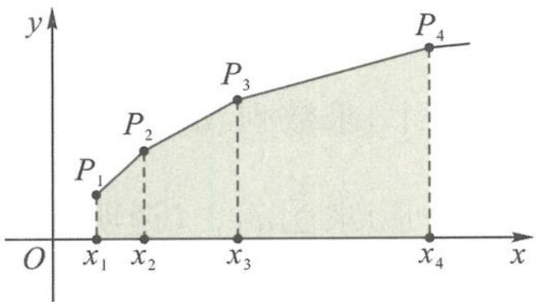

$$
3 q ^ {2} - 5 q - 2 = 0.
$$

图3.3-1

已知 $q > 0$ ，所以

$$
q = 2, x _ {1} = 1.
$$

数列 $\{x_{n}\}$ 的通项公式为

$$
x _ {n} = 2 ^ {n - 1}.
$$

(2) 过 $P_{1}, P_{2}, \cdots, P_{n+1}$ 向 x 轴作垂线，垂足分别为 $Q_{1}, Q_{2}, \cdots, Q_{n+1}$ . 由 (1) 得

$$
x _ {n + 1} - x _ {n} = 2 ^ {n} - 2 ^ {n - 1} = 2 ^ {n - 1}.
$$

记梯形 $P_{n}P_{n+1}Q_{n+1}Q_{n}$ 的面积为 $b_{n}$ ，由题意得

$$
b _ {n} = \frac {(n + n + 1)}{2} \times 2 ^ {n - 1} = (2 n + 1) \times 2 ^ {n - 2},
$$

所以

$$
T _ {n} = b _ {1} + b _ {2} + \dots + b _ {n} = 3 \times 2 ^ {- 1} + 5 \times 2 ^ {0} + 7 \times 2 ^ {1} + \dots + (2 n - 1) \times 2 ^ {n - 3} + (2 n + 1) \times 2 ^ {n - 2} \tag {①}
$$

又

$$
2 T _ {n} = 3 \times 2 ^ {0} + 5 \times 2 ^ {1} + 7 \times 2 ^ {2} + \dots + (2 n - 1) \times 2 ^ {n - 2} + (2 n + 1) \times 2 ^ {n - 1} \quad ②,
$$

由①一②得

$$
- T _ {n} = 3 \times 2 ^ {- 1} + (2 + 2 ^ {2} + \dots + 2 ^ {n - 1}) - (2 n + 1) \times 2 ^ {n - 1} = \frac {3}{2} + \frac {2 (1 - 2 ^ {n - 1})}{1 - 2} - (2 n + 1) \times 2 ^ {n - 1},
$$

所以

$$
T _ {n} = \frac {(2 n - 1) \times 2 ^ {n} + 1}{2}.
$$

## 3.3.3 分组法求和

分组法求和的难点在于合理分组,即先把数列的项重新组合分成几组,转化为特殊数列求和.

例6 已知数列 $\{a_{n}\}$ 满足 $a_{n} = 2^{n} + 2n - 1$ ，则其前 $n$ 项和 $S_{n} =$

解答 结合等比数列与等差数列的求和公式,可得

$$
S _ {n} = \frac {2 (1 - 2 ^ {n})}{1 - 2} + \frac {(1 + 2 n - 1) n}{2} = 2 ^ {n + 1} + n ^ {2} - 2.
$$

例 7 设 $\{a_{n}\}$ 是等差数列， $\{b_{n}\}$ 是等比数列，已知 $a_{1}=4, b_{1}=6, b_{2}=2a_{2}-2, b_{3}=2a_{3}+4.$

(1) 求 $\{a_{n}\}$ 和 $\{b_{n}\}$ 的通项公式.

(2)设数列 $\{c_n\}$ 满足 $c_{1} = 1, c_{n} = \left\{ \begin{array}{l} 1, 2^{k} < n < 2^{k + 1}, \\ b_{k}, n = 2^{k}, \end{array} \right.$ 其中 $k \in \mathbb{N}^*$ .

(i) 求数列 $\{a_{2^{n}}(c_{2^{n}}-1)\}$ 的通项公式；

(ii) 求 $\sum_{i=1}^{2^{n}}a_{i}c_{i}$ . (说明: $\sum_{i=1}^{2^{n}}a_{i}c_{i}=a_{1}c_{1}+a_{2}c_{2}+\cdots+a_{2^{n}}c_{2^{n}}$ )

解答 (1)设等差数列 $\{a_{n}\}$ 的公差为 $d$ , 等比数列 $\{b_{n}\}$ 的公比为 $q$ . 依题意得

$$
\left\{ \begin{array}{l} 6 q = 6 + 2 d, \\ 6 q ^ {2} = 1 2 + 4 d, \end{array} \right.
$$

解得

$$
\left\{ \begin{array}{l} d = 3, \\ q = 2. \end{array} \right.
$$

故

$$
a _ {n} = 4 + (n - 1) \times 3 = 3 n + 1, b _ {n} = 6 \times 2 ^ {n - 1} = 3 \times 2 ^ {n}.
$$

所以 $\{a_{n}\}$ 的通项公式为 $a_{n} = 3n + 1, \{b_{n}\}$ 的通项公式为 $b_{n} = 3 \times 2^{n}$ .

(2)(i)由已知得

$$
a _ {2 ^ {n}} \left(c _ {2 ^ {n}} - 1\right) = a _ {2 ^ {n}} \left(b _ {n} - 1\right) = (3 \times 2 ^ {n} + 1) (3 \times 2 ^ {n} - 1) = 9 \times 4 ^ {n} - 1,
$$

所以，数列 $\{a_{2^n}(c_{2^n} - 1)\}$ 的通项公式为

$$
a _ {2 ^ {n}} (c _ {2 ^ {n}} - 1) = 9 \times 4 ^ {n} - 1.
$$

$$
\begin{array}{l} (\text {ii}) \sum_ {i = 1} ^ {2 ^ {n}} a _ {i} c _ {i} = \sum_ {i = 1} ^ {2 ^ {n}} [ a _ {i} + a _ {i} (c _ {i} - 1) ] = \sum_ {i = 1} ^ {2 ^ {n}} a _ {i} + \sum_ {i = 1} ^ {n} a _ {2 ^ {i}} (c _ {2 ^ {i}} - 1) \\ = \left[ 2 ^ {n} \times 4 + \frac {2 ^ {n} (2 ^ {n} - 1)}{2} \times 3 \right] + \sum_ {i = 1} ^ {n} (9 \times 4 ^ {i} - 1) \\ = (3 \times 2 ^ {2 n - 1} + 5 \times 2 ^ {n - 1}) + 9 \times \frac {4 \times (1 - 4 ^ {n})}{1 - 4} - n \\ = 2 7 \times 2 ^ {2 n - 1} + 5 \times 2 ^ {n - 1} - n - 1 2. \end{array}
$$

3.3.4 并项法求和

例 8 求和: $100^{2}-99^{2}+98^{2}-97^{2}+\cdots+2^{2}-1^{2}$ .

$$
\begin{array}{r l} & {\text {解答} \quad 1 0 0 ^ {2} - 9 9 ^ {2} + 9 8 ^ {2} - 9 7 ^ {2} + \dots + 2 ^ {2} - 1 ^ {2}} \\ & {= (1 0 0 + 9 9) + (9 8 + 9 7) + \dots + (2 + 1)} \\ & {= \frac {(1 0 0 + 1) \times 1 0 0}{2} = 5 0 5 0.} \end{array}
$$

例 9 数列 $\{a_{n}\}$ 的通项 $a_{n}=n^{2}\left(\cos^{2}\frac{n\pi}{3}-\sin^{2}\frac{n\pi}{3}\right)$ ，其前 n 项和为 $S_{n}$ .

(1) 求 $S_{n}$ .

(2) 令 $b_{n} = \frac{S_{3n}}{n \times 4^{n}}$ ，求数列 $\{b_{n}\}$ 的前 $n$ 项和 $T_{n}$ .

分析 组合三角函数的周期性,可将该数列的连续三项视为一组,先求出 $S_{3k}$ .

解答 (1)由于 $\cos^2\frac{n\pi}{3} -\sin^2\frac{n\pi}{3} = \cos \frac{2n\pi}{3}$ ，故

$$
\begin{array}{l} S _ {3 k} = (a _ {1} + a _ {2} + a _ {3}) + (a _ {4} + a _ {5} + a _ {6}) + \dots + (a _ {3 k - 2} + a _ {3 k - 1} + a _ {3 k}) \\ = \left(- \frac {1 ^ {2} + 2 ^ {2}}{2} + 3 ^ {2}\right) + \left(- \frac {4 ^ {2} + 5 ^ {2}}{2} + 6 ^ {2}\right) + \dots + \left[ - \frac {(3 k - 2) ^ {2} + (3 k - 1) ^ {2}}{2} + (3 k) ^ {2} \right] \\ = \frac {1 3}{2} + \frac {3 1}{2} + \dots + \frac {1 8 k - 5}{2} = \frac {k (9 k + 4)}{2}, \end{array}
$$

$$
S _ {3 k - 1} = S _ {3 k} - a _ {3 k} = \frac {k (4 - 9 k)}{2},
$$

$$
S _ {3 k - 2} = S _ {3 k - 1} - a _ {3 k - 1} = \frac {k (4 - 9 k)}{2} + \frac {(3 k - 1) ^ {2}}{2} = \frac {1}{2} - k = - \frac {3 k - 2}{3} - \frac {1}{6}.
$$

故

$$
k \in \mathbf {N} ^ {*}
$$

(2) 因为

$$
b _ {n} = \frac {S _ {3 n}}{n \times 4 ^ {n}} = \frac {9 n + 4}{2 \times 4 ^ {n}},
$$

所以

$$
T _ {n} = \frac {1}{2} \left(\frac {1 3}{4} + \frac {2 2}{4 ^ {2}} + \dots + \frac {9 n + 4}{4 ^ {n}}\right),
$$

且

$$
4 T _ {n} = \frac {1}{2} \left(1 3 + \frac {2 2}{4} + \dots + \frac {9 n + 4}{4 ^ {n - 1}}\right).
$$

两式相减得

$$
3 T _ {n} = \frac {1}{2} \left(1 3 + \frac {9}{4} + \dots + \frac {9}{4 ^ {n - 1}} - \frac {9 n + 4}{4 ^ {n}}\right) = \frac {1}{2} \left(1 3 + \frac {\frac {9}{4} - \frac {9}{4 ^ {n}}}{1 - \frac {1}{4}} - \frac {9 n + 4}{4 ^ {n}}\right) = 8 - \frac {1}{2 ^ {2 n - 3}} - \frac {9 n}{2 ^ {2 n + 1}},
$$

故

$$
T _ {n} = \frac {8}{3} - \frac {1}{3 \times 2 ^ {2 n - 3}} - \frac {3 n}{2 ^ {2 n + 1}} = \frac {8}{3} - \frac {9 n + 1 6}{3 \times 2 ^ {2 n + 1}}.
$$

## 3.3.5 倒序相加法求和

若数列中到首、尾距离相等的两项和有共性或数列的通项与组合数相关联,则可考虑用倒序相加法(这也是等差数列前 n 和公式的推导方法).

例 10 (1) 设 $f(x)=\frac{\cos x}{\cos(30^{\circ}-x)}$ ，则 $f(1^{\circ})+f(2^{\circ})+\cdots+f(58^{\circ})+f(59^{\circ})=$ \_\_\_\_.

解答 容易证明

$$
f (x) + f (6 0 ^ {\circ} - x) = \sqrt {3},
$$

所以

$$
f (1 ^ {\circ}) + f (2 ^ {\circ}) + \dots + f (5 8 ^ {\circ}) + f (5 9 ^ {\circ}) = \frac {5 9 \sqrt {3}}{2}.
$$

$$
(2) \mathrm{C} _ {1 0 0} ^ {1} + 2 \times \mathrm{C} _ {1 0 0} ^ {2} + \dots + 9 9 \times \mathrm{C} _ {1 0 0} ^ {9 9} + 1 0 0 \times \mathrm{C} _ {1 0 0} ^ {1 0 0} = \underline {{\quad}}.
$$

解答 设

$$
S = C _ {1 0 0} ^ {1} + 2 \times C _ {1 0 0} ^ {2} + \dots + 9 9 \times C _ {1 0 0} ^ {9 9} + 1 0 0 \times C _ {1 0 0} ^ {1 0 0},
$$

所以

$$
\begin{array}{r l} 2 S & = (0 \times C _ {1 0 0} ^ {0} + 1 0 0 \times C _ {1 0 0} ^ {1 0 0}) + (1 \times C _ {1 0 0} ^ {1} + 9 9 \times C _ {1 0 0} ^ {1 0 0}) + \dots + (1 0 0 \times C _ {1 0 0} ^ {1 0 0} + 0 \times C _ {1 0 0} ^ {0}) \\ & = 1 0 0 (C _ {1 0 0} ^ {0} + C _ {1 0 0} ^ {1} + C _ {1 0 0} ^ {2} + \dots + C _ {1 0 0} ^ {1 0 0}) = 1 0 0 \times 2 ^ {1 0 0}, \end{array}
$$

即

$$
S = C _ {1 0 0} ^ {1} + 2 \times C _ {1 0 0} ^ {2} + \dots + 9 9 \times C _ {1 0 0} ^ {9 9} + 1 0 0 \times C _ {1 0 0} ^ {1 0 0} = 1 0 0 \times 2 ^ {9 9}.
$$

## 3.3.6 转化化归法求和

例 11 求数列 $1,3+5,7+9+11,13+15+17+19,\cdots$ 的前 n 项的和.

解答 本题是求正整数各奇数的和,该数列的前 n 项共有

$$
1 + 2 + \dots + n = \frac {1}{2} n (n + 1)
$$

个奇数,所以最后一个奇数为

$$
1 + \left[ \frac {1}{2} n (n + 1) - 1 \right] \times 2 = n ^ {2} + n - 1.
$$

因此,该数列的前 n 项的和

$$
S _ {n} = \frac {1}{2} n (n + 1) \cdot \frac {1 + n ^ {2} + n - 1}{2} = \frac {n ^ {2} (n + 1) ^ {2}}{4}.
$$

例 12 证明：

$$
(1) 1 ^ {2} + 2 ^ {2} + \dots + n ^ {2} = \frac {n (n + 1) (2 n + 1)}{6};
$$

$$
(2) 1 ^ {3} + 2 ^ {3} + \dots + n ^ {3} = \left[ \frac {n (n + 1)}{2} \right] ^ {2}.
$$

证明 (1) 因为

$$
n ^ {3} - (n - 1) ^ {3} = 3 n ^ {2} - 3 n + 1,
$$

所以

$$
n ^ {2} = \frac {1}{3} [ 3 n - 1 + n ^ {3} - (n - 1) ^ {3} ].
$$

利用以上关系求和,可得

$$
1 ^ {2} + 2 ^ {2} + \dots + n ^ {2} = \frac {n (n + 1) (2 n + 1)}{6}.
$$

(2) 同(1)的证明可得

$$
1 ^ {3} + 2 ^ {3} + \dots + n ^ {3} = \left[ \frac {n (n + 1)}{2} \right] ^ {2}.
$$

## 思考题

1. 已知两个等差数列 $\{a_{n}\}$ : 6, 10, 14, …; $\{b_{n}\}$ : 2, 7, 12, …. 各取 100 项，由它们的公共项所构成的数列的和为 \_\_\_\_.

2. 已知数列 $\{a_{n}\}$ 的前 n 项和 $S_{n}=2^{n}-1$ ，则 $a_{1}^{2}+a_{2}^{2}+a_{3}^{2}+\cdots+a_{n}^{2}=$

3.(1)已知 $f(x)=\frac{x^{2}}{1+x^{2}}$ ，则 $f(1)+f(2)+f(3)+f(4)+f\left(\frac{1}{2}\right)+f\left(\frac{1}{3}\right)+f\left(\frac{1}{4}\right)=$ \_\_\_\_.

(2) 设 $f(x)=\frac{1}{2^{x}+\sqrt{2}}$ ，求 $f(-5)+f(-4)+\cdots+f(0)+\cdots+f(5)+f(6)$ 的值.

4. 求和: $-1+3-5+7-\cdots+(-1)^{n}\times(2n-1)=$

5. 数列 $1 \times 4, 2 \times 5, 3 \times 6, \cdots, n \times (n + 3), \cdots$ 的前 n 项和 $S_{n} =$ \_\_\_\_.

6. 已知数列 $\{a_{n}\}$ 的前 n 项的和为 $S_{n}$ .

(1) 若 $a_{1}=1, a_{n}+a_{n+1}=2n-1$ ，则 $S_{49}=$ \_\_\_\_.

(2) 若 $a_{n+1} + (-1)^{n} \times a_{n} = 2n - 1$ ，则 $S_{40} =$ \_\_\_\_.

7. 设 $S_{n}$ 为数列 $\{a_{n}\}$ 的前 $n$ 项和, $a_{1} = 0$ , 若 $a_{n+1} = [1 + (-1)^{n}] a_{n} + (-2)^{n} (n \in \mathbb{N}^{*})$ , 则 $S_{100} =$ \_\_\_\_.

8. 在数列 $\{a_{n}\}$ 中，已知 $a_1 = 8, a_4 = 2$ 且 $a_{n+2} - 2a_{n+1} + a_n = 0, n \in \mathbb{N}^*$ .

(1)求数列 $\{a_{n}\}$ 的通项公式.

(2) 设 $S_{n}=|a_{1}|+|a_{2}|+\cdots+|a_{n}|$ ，求 $S_{n}$ .

9. 已知函数 $f(x) = -2x + 4$ , $S_{n} = f\left(\frac{1}{n}\right) + f\left(\frac{2}{n}\right) + \cdots + f\left(\frac{n}{n}\right)$ , $n = 1, 2, \cdots$ . 若不等式 $\frac{a^{n}}{S_{n}} < \frac{a^{n+1}}{S_{n+1}}$ 恒成立，求实数 a 的取值范围.

10. 已知数列 $\{a_{n}\}$ 满足 $\frac{a_{1}}{2} + \frac{a_{2}}{2^{2}} + \cdots + \frac{a_{n}}{2^{n}} = \frac{n^{2} + n}{2} (n \in \mathbb{N}^{*})$ .

(1)求数列 $\{a_{n}\}$ 的通项公式.

(2)求数列 $\{a_{n}\}$ 的前n项和 $S_{n}$ .

11. 已知数列 $\{a_{n}\}$ 为等差数列且 $d \neq 0, \{a_{n}\}$ 的部分项组成等比数列 $\{b_{n}\}$ , 其中 $b_{n} = a_{k_{n}}$ , 若 $k_{1} = 1, k_{2} = 5, k_{3} = 17$ .

(1) 求 $k_{n}$ .

(2) 若 $a_1 = 2$ ，求 $\{a_n k_n\}$ 的前 $n$ 项和 $S_n$ .

## 3.4 数列之求和,裂项速相消

## 3.4.1 裂项相消法求和的主要形式

数列通项常见的裂项形式如下：

(1) $\frac{1}{n(n + 1)} = \frac{1}{n} - \frac{1}{n + 1}$ ;

(2) $\frac{1}{n(n + k)} = \frac{1}{k}\left(\frac{1}{n} -\frac{1}{n + k}\right);$

$$
\frac {1}{n (n + 1) (n + 2)} = \frac {1}{2} \left[ \frac {1}{n (n + 1)} - \frac {1}{(n + 1) (n + 2)} \right];
$$

(4) $\frac{(2n)^2}{(2n - 1)(2n + 1)} = 1 + \frac{1}{2}\left(\frac{1}{2n - 1} -\frac{1}{2n + 1}\right);$

(5) $\frac{1}{\sqrt{n + k} + \sqrt{n}} = \frac{1}{k} (\sqrt{n + k} - \sqrt{n})$ ;

$$
\frac {2 ^ {n}}{(2 ^ {n} - 1) (2 ^ {n + 1} - 1)} = \frac {1}{2 ^ {n} - 1} - \frac {1}{2 ^ {n + 1} - 1}; \tag {6}
$$

$$
\frac {n + 2}{n (n + 1) 2 ^ {n}} = 2 \left[ \frac {1}{n \times 2 ^ {n}} - \frac {1}{(n + 1) \times 2 ^ {n + 1}} \right]; \tag {7}
$$

$$
\frac {1}{n (n + k + 1)} = \frac {1}{k + 1} \left(\frac {1}{n} - \frac {1}{n + k + 1}\right);
$$

$$
\frac {n}{(n + 1) !} = \frac {1}{n !} - \frac {1}{(n + 1) !}; \tag {9}
$$

$$
(1 0) \tan (n - 1) \cdot \tan n = \frac {1}{\tan 1} [ \tan n - \tan (n - 1) ] - 1.
$$

$$
(1 1) \mathrm{C} _ {n} ^ {k} = \mathrm{C} _ {n + 1} ^ {k + 1} - \mathrm{C} _ {n} ^ {k + 1}.
$$

【如： $C_{4}^{3}+C_{5}^{3}+\cdots+C_{2020}^{3}=(C_{5}^{4}-C_{4}^{4})+(C_{6}^{4}-C_{5}^{4})+\cdots+(C_{2021}^{4}-C_{2020}^{3})=C_{2021}^{4}-C_{4}^{4}$

## 3.4.2 裂项相消法求和的主要类型

(1) 含根号型数列的裂项

例1 (1) 若 $a_{n} = \frac{1}{\sqrt{n + 1} + \sqrt{n}}$ ，求 $S_{n}$ .

解答 $S_{n} = \sqrt{n + 1} -1.$

(2) 设 $S = \sqrt{1 + \frac{1}{1^2} + \frac{1}{2^2}} + \sqrt{1 + \frac{1}{2^2} + \frac{1}{3^2}} + \sqrt{1 + \frac{1}{3^2} + \frac{1}{4^2}} + \cdots + \sqrt{1 + \frac{1}{2020^2} + \frac{1}{2021^2}}$ ，则不大于 $S$ 的最大整数 $[S] =$ \_\_\_\_.

解答 因为

$$
\sqrt {1 + \frac {1}{n ^ {2}} + \frac {1}{(1 + n) ^ {2}}} = \sqrt {\frac {(n ^ {2} + n) ^ {2} + 2 (n ^ {2} + n) + 1}{n ^ {2} (1 + n) ^ {2}}} = \frac {n ^ {2} + n + 1}{n (n + 1)} = 1 + \left(\frac {1}{n} - \frac {1}{n + 1}\right),
$$

所以

$$
S = 1 + \left(\frac {1}{1} - \frac {1}{2}\right) + 1 + \left(\frac {1}{2} - \frac {1}{3}\right) + \dots + 1 + \left(\frac {1}{2 0 2 0} - \frac {1}{2 0 2 1}\right) = 2 0 2 1 - \frac {1}{2 0 2 1}.
$$

故[S]=2020.

(2) 分式型数列的裂项

例 2 (1) 已知数列 $\{a_{n}\}$ 满足 $a_{n}=\frac{1}{1+2+\cdots+n}$ ，则其前 n 项和 $S_{n}=$ \_\_\_\_.

解答 因为

$$
a _ {n} = \frac {1}{1 + 2 + \cdots + n} = \frac {2}{n (n + 1)} = 2 \left(\frac {1}{n} - \frac {1}{n + 1}\right),
$$

所以

$$
S _ {n} = 2 - \frac {2}{n + 1}.
$$

(2)已知数列 $\{a_{n}\}$ 满足 $a_{n}=\frac{nx}{(x+1)(2x+1)\cdots(nx+1)}$ , $n\in N^{*}$ ，若 $a_{1}+a_{2}+\cdots+a_{2015}<1$ ，则实数x等于（）.
A. $-\frac{3}{2}$ B. $-\frac{5}{12}$ C. $-\frac{9}{40}$ D. $-\frac{11}{60}$

解答 由已知得

$$
\begin{array}{r l} a _ {n} & = \frac {(n x + 1) - 1}{(x + 1) (2 x + 1) \cdots (n x + 1)} \\ & = \frac {1}{(x + 1) (2 x + 1) \cdots [ (n - 1) x + 1 ]} - \frac {1}{(x + 1) (2 x + 1) \cdots (n x + 1)}, \end{array}
$$

则

$$
\sum_ {k = 1} ^ {2 0 1 5} a _ {k} = 1 - \frac {1}{(x + 1) (2 x + 1) \cdots (2 0 1 5 x + 1)} <   1 \Leftrightarrow (x + 1) (2 x + 1) \dots (2 0 1 5 x + 1) > 0,
$$

所以

$$
x \in (- 1, - \frac {1}{2}) \cup \left(- \frac {1}{3}, - \frac {1}{4}\right) \cup \dots \cup \left(- \frac {1}{2 0 1 3}, - \frac {1}{2 0 1 4}\right) \cup \left(- \frac {1}{2 0 1 5}, + \infty\right).
$$

经检验知, 只有 $x = -\frac{11}{60}$ 符合题意, 所以选 D.

例 3 设 $\{a_{n}\}$ 是等比数列, 公比大于 0, 其前 n 项和为 $S_{n}(n \in \mathbb{N}^{*})$ , $\{b_{n}\}$ 是等差数列. 已知 $a_{1}=1, a_{3}=a_{2}+2, a_{4}=b_{3}+b_{5}, a_{5}=b_{4}+2b_{6}$ .

(1) 求 $\{a_{n}\}$ 和 $\{b_{n}\}$ 的通项公式.

(2)设数列 $\{S_{n}\}$ 的前n项和为 $T_{n}(n\in\mathbb{N}^{*})$ .

(i) 求 $T_{n}$ ;

(ii) 证明: $\sum_{k=1}^{n} \frac{(T_k + b_{k+2})b_k}{(k+1)(k+2)} = \frac{2^{n+2}}{n+2} - 2 (n \in \mathbb{N}^*)$ .

解答 (1)设等比数列 $\{a_{n}\}$ 的公比为 $q$ . 已知 $a_{1} = 1, a_{3} = a_{2} + 2$ , 可得

$$
q ^ {2} - q - 2 = 0.
$$

又 $q > 0$ ，可得

$$
q = 2.
$$

故

$$
a _ {n} = 2 ^ {n - 1}.
$$

设等差数列 $\{b_n\}$ 的公差为 $d$ . 由 $a_4 = b_3 + b_5$ ，可得

$$
b _ {1} + 3 d = 4 \quad ①.
$$

由 $a_5 = b_4 + 2b_6$ ，可得

$$
3 b _ {1} + 1 3 d = 1 6 \quad ②.
$$

联立①②,解得

$$
b _ {1} = 1, d = 1,
$$

故

$$
b _ {n} = n.
$$

所以数列 $\{a_{n}\}$ 的通项公式为 $a_{n} = 2^{n - 1}$ , 数列 $\{b_{n}\}$ 的通项公式为 $b_{n} = n$ .

(2)(i)由(1)得

$$
S _ {n} = \frac {1 - 2 ^ {n}}{1 - 2} = 2 ^ {n} - 1,
$$

所以

$$
T _ {n} = \sum_ {k = 1} ^ {n} (2 ^ {k} - 1) = \sum_ {k = 1} ^ {n} 2 ^ {k} - n = \frac {2 (1 - 2 ^ {n})}{1 - 2} - n = 2 ^ {n + 1} - n - 2.
$$

(ii) 因为

$$
\frac {(T _ {k} + b _ {k + 2}) b _ {k}}{(k + 1) (k + 2)} = \frac {(2 ^ {k + 1} - k - 2 + k + 2) k}{(k + 1) (k + 2)} = \frac {k \times 2 ^ {k + 1}}{(k + 1) (k + 2)} = \frac {2 ^ {k + 2}}{k + 2} - \frac {2 ^ {k + 1}}{k + 1},
$$

所以

$$
\sum_ {k = 1} ^ {n} \frac {\left(T _ {k} + b _ {k + 2}\right) b _ {k}}{(k + 1) (k + 2)} = \left(\frac {2 ^ {3}}{3} - \frac {2 ^ {2}}{2}\right) + \left(\frac {2 ^ {4}}{4} - \frac {2 ^ {3}}{3}\right) + \dots + \left(\frac {2 ^ {n + 2}}{n + 2} - \frac {2 ^ {n + 1}}{n + 1}\right) = \frac {2 ^ {n + 2}}{n + 2} - 2.
$$

例 4 已知 $a_{n}=4^{n}-2^{n}, T_{n}=\frac{2^{n}}{a_{1}+a_{2}+\cdots+a_{n}}$ ，证明： $T_{1}+T_{2}+T_{3}+\cdots+T_{n}<\frac{3}{2}$ .

分析 $T_{n}$ 的表达式容易求得, 但不等式的放缩证明有两种可能的策略, 一是先裂项求和再放缩, 二是先把它放缩成等比数列再求和. 具体采用哪种策略需要比较后进行选择.

证明 由已知得

$$
a _ {1} + a _ {2} + \dots + a _ {n} = 4 ^ {1} + 4 ^ {2} + 4 ^ {3} + \dots + 4 ^ {n} - (2 ^ {1} + 2 ^ {2} + \dots + 2 ^ {n})
$$

$$
= \frac {4 (1 - 4 ^ {n})}{1 - 4} - \frac {2 (1 - 2 ^ {n})}{1 - 2} = \frac {4}{3} (4 ^ {n} - 1) + 2 (1 - 2 ^ {n}),
$$

所以

$$
\begin{array}{r l} T _ {n} & = \frac {2 ^ {n}}{\frac {4}{3} (4 ^ {n} - 1) + 2 (1 - 2 ^ {n})} = \frac {2 ^ {n}}{\frac {4 ^ {n + 1}}{3} + \frac {2}{3} - 2 ^ {n + 1}} = \frac {3 \times 2 ^ {n}}{4 ^ {n + 1} - 3 \times 2 ^ {n + 1} + 2} = \frac {3}{2} \times \frac {2 ^ {n}}{2 \times (2 ^ {n}) ^ {2} - 3 \times 2 ^ {n} + 1} \\ & = \frac {3}{2} \times \frac {2 ^ {n}}{(2 \times 2 ^ {n} - 1) (2 ^ {n} - 1)} = \frac {3}{2} \left(\frac {1}{2 ^ {n} - 1} - \frac {1}{2 ^ {n + 1} - 1}\right), \end{array}
$$

所以

$$
T _ {1} + T _ {2} + T _ {3} + \dots + T _ {n} = \frac {3}{2} \left(1 - \frac {1}{3} + \frac {1}{3} - \frac {1}{7} + \dots + \frac {1}{2 ^ {n} - 1} - \frac {1}{2 ^ {n + 1} - 1}\right) = \frac {3}{2} \left(1 - \frac {1}{2 ^ {n + 1} - 1}\right) <   \frac {3}{2}.
$$

(3) 含 $(-1)^{n}$ 型数列的裂项

例 5 已知等差数列 $\{a_{n}\}$ 的公差为 2，前 n 项和为 $S_{n}$ ，且 $S_{1}, S_{2}, S_{4}$ 成等比数列.

(1)求数列 $\{a_{n}\}$ 的通项公式.

(2) 令 $b_n = (-1)^{n-1} \times \frac{4n}{a_na_{n+1}}$ ，求数列 $\{b_n\}$ 的前 $n$ 项和 $T_n$ .

解答 (1)已知

$$
d = 2, S _ {1} = a _ {1}, S _ {2} = 2 a _ {1} + d, S _ {4} = 4 a _ {1} + 6 d,
$$

因为 $S_{1}, S_{2}, S_{4}$ 成等比数列, 所以

$$
S _ {2} ^ {2} = S _ {1} S _ {4},
$$

解得

$$
a _ {1} = 1.
$$

从而可得

$$
a _ {n} = 2 n - 1.
$$

(2)已知

$$
b _ {n} = (- 1) ^ {n - 1} \times \frac {4 n}{a _ {n} a _ {n + 1}} = (- 1) ^ {n - 1} \times \left(\frac {1}{2 n - 1} + \frac {1}{2 n + 1}\right).
$$

当 $n$ 为偶数时，

$$
T _ {n} = \left(1 + \frac {1}{3}\right) - \left(\frac {1}{3} + \frac {1}{5}\right) + \left(\frac {1}{5} + \frac {1}{7}\right) - \dots + \left(\frac {1}{2 n - 3} + \frac {1}{2 n - 1}\right) - \left(\frac {1}{2 n - 1} + \frac {1}{2 n + 1}\right),
$$

所以

$$
T _ {n} = 1 - \frac {1}{2 n + 1} = \frac {2 n}{2 n + 1};
$$

当 $n$ 为奇数时，

$$
T _ {n} = \left(1 + \frac {1}{3}\right) - \left(\frac {1}{3} + \frac {1}{5}\right) + \left(\frac {1}{5} + \frac {1}{7}\right) - \dots - \left(\frac {1}{2 n - 3} + \frac {1}{2 n - 1}\right) + \left(\frac {1}{2 n - 1} + \frac {1}{2 n + 1}\right),
$$

所以

$$
T _ {n} = 1 + \frac {1}{2 n + 1} = \frac {2 n + 2}{2 n + 1}.
$$

综上可得

$$
T _ {n} = \left\{ \begin{array}{l l} \frac {2 n}{2 n + 1}, n & \text {为偶数,} \\ \frac {2 n + 2}{2 n + 1}, n & \text {为奇数.} \end{array} \right.
$$

(4)迭代型数列的裂项

例6 在数列 $\{a_{n}\},\{b_{n}\},\{c_{n}\}$ 中，已知 $a_1 = b_1 = c_1 = 1,c_n = a_{n + 1} - a_n,c_{n + 1} = \frac{b_n}{b_{n + 2}}\cdot c_n$ （ $n\in$ $\mathbf{N}^*$ ）.

(1) 若数列 $\{b_{n}\}$ 为等比数列, 公比 $q > 0$ , 且 $b_{1} + b_{2} = 6b_{3}$ , 求 $q$ 与 $\{a_{n}\}$ 的通项公式.

(2)若数列 $\{b_{n}\}$ 为等差数列,且公差d>0,证明: $c_{1}+c_{2}+\cdots+c_{n}<1+\frac{1}{d}$ .

分析 (1)先根据 $b_{1} + b_{2} = 6b_{3}$ , 求得 $q$ , 进而求得数列 $\{c_{n}\}$ 的通项公式, 最后利用累加法求得数列 $\{a_{n}\}$ 的通项公式. (2)先利用累乘法求得数列 $\{c_{n}\}$ 的表达式, 再结合裂项求和法可证得不等式成立.

解答 (1)依题意

$$
b _ {1} = 1, b _ {2} = q, b _ {3} = q ^ {2},
$$

而 $b_{1} + b_{2} = 6b_{3}$ ，即

$$
1 + q = 6 q ^ {2}.
$$

由于 q>0，所以解得

$$
q = \frac {1}{2}.
$$

所以

$$
b _ {n} = \frac {1}{2 ^ {n - 1}}.
$$

从而 $b_{n + 2} = \frac{1}{2^{n + 1}}$ ，故

$$
c _ {n + 1} = \frac {\frac {1}{2 ^ {n - 1}}}{\frac {1}{2 ^ {n + 1}}} \cdot c _ {n} = 4 c _ {n}.
$$

所以数列 $\{c_{n}\}$ 是首项为1，公比为4的等比数列，

$$
c _ {n} = 4 ^ {n - 1}.
$$

从而

$$
a _ {n + 1} - a _ {n} = c _ {n} = 4 ^ {n - 1} (n \geqslant 2, n \in \mathbf {N} ^ {*}),
$$

可得

$$
a _ {n} = a _ {1} + 1 + 4 + \dots + 4 ^ {n - 2} = \frac {4 ^ {n - 1} + 2}{3}.
$$

## (2)依题意设

$$
b _ {n} = 1 + (n - 1) d = d n + 1 - d.
$$

由于 $\frac{c_{n + 1}}{c_n} = \frac{b_n}{b_{n + 2}}$ ，所以

$$
\frac {c _ {n}}{c _ {n - 1}} = \frac {b _ {n - 1}}{b _ {n + 1}} (n \geqslant 2, n \in \mathbf {N} ^ {*}).
$$

故

$$
\begin{array}{r l} c _ {n} & = \frac {c _ {n}}{c _ {n - 1}} \cdot \frac {c _ {n - 1}}{c _ {n - 2}} \cdot \dots \cdot \frac {c _ {3}}{c _ {2}} \cdot \frac {c _ {2}}{c _ {1}} \cdot c _ {1} = \frac {b _ {n - 1}}{b _ {n + 1}} \cdot \frac {b _ {n - 2}}{b _ {n}} \cdot \frac {b _ {n - 3}}{b _ {n - 1}} \cdot \dots \cdot \frac {b _ {2}}{b _ {4}} \cdot \frac {b _ {1}}{b _ {3}} \cdot c _ {1} \\ & = \frac {b _ {1} b _ {2}}{b _ {n} b _ {n + 1}} = \frac {1 + d}{d} \left(\frac {1}{b _ {n}} - \frac {1}{b _ {n + 1}}\right) = \left(1 + \frac {1}{d}\right) \left(\frac {1}{b _ {n}} - \frac {1}{b _ {n + 1}}\right). \end{array}
$$

所以

$$
c _ {1} + c _ {2} + \dots + c _ {n} = \left(1 + \frac {1}{d}\right) \left[ \left(\frac {1}{b _ {1}} - \frac {1}{b _ {2}}\right) + \left(\frac {1}{b _ {2}} - \frac {1}{b _ {3}}\right) + \dots + \left(\frac {1}{b _ {n}} - \frac {1}{b _ {n + 1}}\right) \right] = \left(1 + \frac {1}{d}\right) \left(1 - \frac {1}{b _ {n + 1}}\right).
$$

由于 $d > 0, b_{1} = 1$ ，所以 $b_{n+1} > 0$ ，所以

$$
\left(1 + \frac {1}{d}\right) \left(1 - \frac {1}{b _ {n + 1}}\right) <   1 + \frac {1}{d},
$$

即

$$
c _ {1} + c _ {2} + \dots + c _ {n} <   1 + \frac {1}{d}, n \in \mathbf {N} ^ {*}.
$$

例7 已知数列 $\{a_{n}\}$ 满足 $a_1 = 2, a_{n+1} = \frac{2^{n+1}a_n}{\left(n + \frac{1}{2}\right)a_n + 2^n} (n \in \mathbb{N}^*)$ .

(1) 设 $b_n = \frac{2^n}{a_n}$ ，求数列 $\{b_n\}$ 的通项公式 $b_n$ .

(2) 设 $c_{n}=\frac{1}{n(n+1)a_{n+1}}$ ，数列 $\{c_{n}\}$ 的前 n 项和为 $S_{n}$ ，求出 $S_{n}$ 并由此证明 $\frac{5}{16}\leqslant S_{n}<\frac{1}{2}$ .
解答 (1)由已知可得

$$
\frac {a _ {n + 1}}{2 ^ {n + 1}} = \frac {a _ {n}}{\left(n + \frac {1}{2}\right) a _ {n} + 2 ^ {n}}.
$$

等号左右取倒数得 $\frac{2^{n + 1}}{a_{n + 1}} = \frac{2^n}{a_n} + n + \frac{1}{2}$ ，即

$$
\frac {2 ^ {n + 1}}{a _ {n + 1}} - \frac {2 ^ {n}}{a _ {n}} = n + \frac {1}{2},
$$

即

$$
b _ {n + 1} - b _ {n} = n + \frac {1}{2}.
$$

所以

$$
b _ {2} - b _ {1} = 1 + \frac {1}{2}, b _ {3} - b _ {2} = 2 + \frac {1}{2}, \dots , b _ {n} - b _ {n - 1} = (n - 1) + \frac {1}{2},
$$

累加得

$$
b _ {n} - b _ {1} = 1 + 2 + 3 + \dots + (n - 1) + \frac {n - 1}{2} = \frac {n (n - 1)}{2} + \frac {n - 1}{2} = \frac {n ^ {2} - 1}{2}.
$$

又 $b_{1} = \frac{2}{a_{1}} = \frac{2}{2} = 1$ ，所以

$$
b _ {n} = \frac {n ^ {2} - 1}{2} + 1 = \frac {n ^ {2} + 1}{2}.
$$

(2)由(1)知

$$
a _ {n} = \frac {2 ^ {n}}{b _ {n}} = \frac {2 ^ {n + 1}}{n ^ {2} + 1},
$$

所以

$$
a _ {n + 1} = \frac {2 ^ {n + 2}}{(n + 1) ^ {2} + 1},
$$

$$
\begin{array}{r l} c _ {n} & = \frac {(n + 1) ^ {2} + 1}{n (n + 1) 2 ^ {n + 2}} = \frac {1}{2} \times \frac {n ^ {2} + 2 n + 2}{n (n + 1) 2 ^ {n + 1}} = \frac {1}{2} \left[ \frac {n ^ {2} + n}{n (n + 1) 2 ^ {n + 1}} + \frac {n + 2}{n (n + 1) 2 ^ {n + 1}} \right] \\ & = \frac {1}{2} \left[ \frac {1}{2 ^ {n + 1}} + \frac {1}{n 2 ^ {n}} - \frac {1}{(n + 1) 2 ^ {n + 1}} \right]. \end{array}
$$

所以

$$
\begin{array}{r l} S _ {n} & = \frac {1}{2} \left(\frac {1}{2 ^ {2}} + \dots + \frac {1}{2 ^ {n + 1}}\right) + \frac {1}{2} \left[ \left(\frac {1}{1 \times 2} - \frac {1}{2 \times 2 ^ {2}}\right) + \left(\frac {1}{2 \times 2 ^ {2}} - \frac {1}{3 \times 2 ^ {3}}\right) + \left(\frac {1}{n 2 ^ {n}} - \frac {1}{(n + 1) 2 ^ {n + 1}}\right) \right] \\ & = \frac {1}{2} \times \frac {\frac {1}{2 ^ {2}} \left(1 - \frac {1}{2 ^ {n}}\right)}{1 - \frac {1}{2}} + \frac {1}{2} \left[ \frac {1}{2} - \frac {1}{(n + 1) 2 ^ {n + 1}} \right] = \frac {1}{2} \left[ 1 - \left(\frac {1}{2}\right) ^ {n + 1} \times \frac {n + 2}{n + 1} \right]. \end{array}
$$

易知 $\left(\frac{1}{2}\right)^{n + 1}\times \frac{n + 2}{n + 1} = \left(\frac{1}{2}\right)^{n + 1}\times \left(1 + \frac{1}{n + 1}\right)$ 单调递减，所以

$$
0 <   \left(\frac {1}{2}\right) ^ {n + 1} \times \frac {n + 2}{n + 1} \leqslant \left(\frac {1}{2}\right) ^ {1 + 1} \times \frac {1 + 2}{1 + 1} = \frac {3}{8},
$$

所以 $\frac{5}{16} \leqslant \frac{1}{2} \left[ 1 - \left( \frac{1}{2} \right)^{n+1} \times \frac{n+2}{n+1} \right] < \frac{1}{2}$ , 即

$$
\frac {5}{1 6} \leqslant S _ {n} <   \frac {1}{2}.
$$

评注 在对表达式裂项时,要考虑裂项后两部分分母的差值,并在表达式的分子中寻找(配凑)这一因式.必要时需要重构分母中的因式来获得有相同结构的因式.

如本题中的 $\frac{n + 2}{n(n + 1)2^{n + 1}} = \frac{2n + 2 - n}{n(2n + 2)2^n} = \frac{1}{n2^n} -\frac{1}{(n + 1)2^{n + 1}}.$

又如 $\frac{1}{3^{2^{n - 1}} - 1} +\frac{1}{3^{2^{n - 1}} + 1} = \frac{2\times 3^{2^{n - 1}}}{(3^{2^{n - 1}} - 1)(3^{2^{n - 1}} + 1)}$

$$
= \frac {2 \times 3 ^ {2 ^ {n - 1}} + 2}{\left(3 ^ {2 ^ {n - 1}} - 1\right) \left(3 ^ {2 ^ {n - 1}} + 1\right)} - \frac {2}{3 ^ {2 ^ {n}} - 1} = \frac {2}{3 ^ {2 ^ {n - 1}} - 1} - \frac {2}{3 ^ {2 ^ {n}} - 1}.
$$

(5)三角型数列裂项

例 8 （拓展）已知 $x \neq 2k\pi (k \in \mathbb{Z})$ :

(1)化简: $\tan x\tan 2x + \tan 2x\tan 3x + \cdots + \tan (n-1)x\tan nx =$ \_\_\_\_ . (n≥2)

分析 从正切函数的结构特点进行分析,可联想两角差的正切公式,然后进行变形求和.
解答 因为

$$
\tan 1 = \frac {\tan n x - \tan (n - 1) x}{1 + \tan n x \tan (n - 1) x},
$$

所以

$$
\tan (n - 1) x \tan n x = \frac {\tan n x - \tan (n - 1) x}{\tan 1} - 1,
$$

故

$$
\tan x \tan 2 x + \tan 2 x \tan 3 x + \dots + \tan (n - 1) x \tan n x = \frac {\tan n x}{\tan x} - n.
$$

(2)化简: $\tan\alpha+2\tan2\alpha+\cdots+2^{n}\tan2^{n}\alpha=$

分析 从正切函数的结构特点进行分析, 可联想两倍角的正切公式, 然后进行变形求和. 注意 $\cot \alpha = \frac{1}{\tan \alpha}$ .

解答 因为

$$
\tan 2 ^ {n + 1} \alpha = \frac {2 \tan 2 ^ {n} \alpha}{1 - (\tan 2 ^ {n} \alpha) ^ {2}},
$$

所以 $\frac{1}{\tan 2^{n + 1}\alpha} = \frac{1}{2}\left(\frac{1}{\tan 2^n\alpha} -\tan 2^n\alpha\right)$ ，即

$$
\tan 2 ^ {n} \alpha = \cot 2 ^ {n} \alpha - 2 \cot 2 ^ {n + 1} \alpha ,
$$

所以 $2^{n}\tan 2^{n}\alpha = 2^{n}\cot 2^{n}\alpha -2^{n + 1}\cot 2^{n + 1}\alpha$ ，即

$$
\tan \alpha + 2 \tan 2 \alpha + \dots + 2 ^ {n} \tan 2 ^ {n} \alpha = \cot \alpha - 2 ^ {n + 1} \cot 2 ^ {n + 1} \alpha .
$$

(3)化简： $\frac{1}{\cos\alpha\cos 2\alpha} +\frac{1}{\cos 2\alpha\cos 3\alpha} +\dots +\frac{1}{\cos n\alpha\cos(n + 1)\alpha} =$

分析 此题的结构比较隐蔽,可考虑通过弦切互化进行恒等变形.

解答 因为

$$
\tan (n + 1) _ {\alpha} - \tan n _ {\alpha} = \frac {\sin \alpha}{\cos (n + 1) _ {\alpha} \cos n _ {\alpha}},
$$

所以

$$
\frac {1}{\cos (n + 1) _ {\alpha} \cos n \alpha} = \frac {\tan (n + 1) _ {\alpha} - \tan n \alpha}{\sin \alpha},
$$

故

$$
\frac {1}{\cos \alpha \cos 2 \alpha} + \frac {1}{\cos 2 \alpha \cos 3 \alpha} + \dots \frac {1}{\cos n \alpha \cos (n + 1) \alpha} = \frac {\tan (n + 1) \alpha - \tan \alpha}{\sin \alpha}.
$$

评注 一般地, $\sum_{k=1}^{n} \frac{1}{\cos(\alpha + k\beta) \cos[\alpha + (k+1)\beta]}$ ( $\beta \neq k\pi, k \in \mathbf{Z}$ ) 的化简可利用一个递推模型来实现, 即找到这个题目的“源生地”.

可先由产生分母 $\cos\alpha\cos(\alpha+\beta)$ 的正切函数之差入手. 考虑 $\tan(\alpha+\beta)-\tan\alpha=\frac{\sin\beta}{\cos\alpha\cos(\alpha+\beta)}$ , 即

$$
\frac {1}{\cos \alpha \cos (\alpha + \beta)} = \frac {1}{\sin \beta} [ \tan (\alpha + \beta) - \tan \alpha ],
$$

得到递推模型

$$
\frac {1}{\cos (\alpha + k \beta) \cos [ \alpha + (k + 1) \beta ]} = \frac {1}{\sin \beta} \left\{\tan [ \alpha + (k + 1) \beta ] - \tan (\alpha + k \beta) \right\}.
$$

所以

$$
\mathrm{原式} = \frac {\tan [ \alpha + (n + 1) \beta ] - \tan (\alpha + \beta)}{\sin \beta}.
$$

特殊地(即 $\alpha=0^{\circ},\beta=1^{\circ}$ 的情形):

$$
\frac {1}{\cos 0 ^ {\circ} \cos 1 ^ {\circ}} + \frac {1}{\cos 1 ^ {\circ} \cos 2 ^ {\circ}} + \dots + \frac {1}{\cos 8 8 ^ {\circ} \cos 8 9 ^ {\circ}} = \frac {\cot 1 ^ {\circ}}{\sin 1 ^ {\circ}}.
$$

<table><tr><td>表1</td><td>表2</td><td>表3</td><td>...</td></tr><tr><td>1</td><td>1 3</td><td>1 3 5</td><td></td></tr><tr><td></td><td>4</td><td>4 8</td><td></td></tr><tr><td></td><td></td><td>12</td><td></td></tr></table>

## 思考题

1. 若 $a_{n}=\frac{1}{n(n+2)}$ ，则 $S_{n}=$ \_\_\_\_.

2. 求和: $\frac{1}{1 \times 4} + \frac{1}{4 \times 7} + \cdots + \frac{1}{(3n - 2) \times (3n + 1)} =$ \_\_\_\_.

3. 已知数列 $\{a_{n}\}$ 满足 $a_{n} = \frac{1}{3^{2^{n}} - 1} + \frac{1}{3^{2^{n-1}} + 1}$ , 则 $S_{n} =$ \_\_\_\_.

4. 在 1 和 100 之间插入 $n$ 个实数, 使得这 $n + 2$ 个数构成递增的等比数列, 将这 $n + 2$ 个数的乘积计作 $T_{n}$ , 再令 $a_{n} = \lg T_{n}, n \geqslant 1$ .

(1)求数列 $\{a_{n}\}$ 的通项公式.

(2) 设 $b_{n} = \tan a_{n} \tan a_{n+1}$ ，求数列 $\{b_{n}\}$ 的前 n 项和 $S_{n}$ .

5. 已知数列 $\{a_{n}\}$ ， $\{b_{n}\}$ 满足 $a_{1}=1, b_{n}=2^{a_{n}}$ ，且 $b_{1}b_{2}\cdots b_{n}=(b_{n+1})^{\frac{n}{2}}$ .

(1)求数列 $\{a_{n}\}$ 的通项公式.

(2) 设 $T_{n} = \frac{a_{1}}{a_{1}a_{2}} + \frac{a_{2}}{a_{1}a_{2}a_{3}} + \cdots + \frac{a_{n}}{a_{1}a_{2}\cdots a_{n+1}}$ , 求使得 $T_{n} \geqslant \frac{2020}{2021}$ 的正整数 $n$ 的最小值.

6. 给出下面的数表：

其中表 $n(n=1,2,3,\cdots)$ 有 n 行，第 1 行的 n 个数是 $1,3,5,\cdots,2n-1$ ，从第 2 行起，每行中的每个数都等于它肩上的两个数之和。

(1) 写出表 4, 验证表 4 各行中数的平均数按从上到下的顺序构成等比数列, 并将结论推广到表 $n (n \geqslant 3)$ (不要求证明).

(2)每个数列中最后一行都只有一个数,它们构成数列 $1,4,12,\cdots$ , 记此数列为 $\{b_{n}\}$ , 求和: $\frac{b_{3}}{b_{1}b_{2}} + \frac{b_{4}}{b_{2}b_{3}} + \cdots + \frac{b_{n+2}}{b_{n}b_{n+1}}$ .

7. 已知 $\{a_{n}\}$ 为等差数列， $\{b_{n}\}$ 为等比数列， $a_{1}=b_{1}=1, a_{5}=5(a_{4}-a_{3}), b_{5}=4(b_{4}-b_{3})$ .

(1) 求 $\{a_{n}\}$ 和 $\{b_{n}\}$ 的通项公式.

(2) 记 $\{a_{n}\}$ 的前 n 项和为 $S_{n}$ ，证明： $S_{n}S_{n+2}<S_{n+1}^{2}(n\in\mathbb{N}^{*})$ .

(3)对任意的正整数 $n$ ，设 $c_{n} = \left\{ \begin{array}{ll}\frac{(3a_{n} - 2)b_{n}}{a_{n}a_{n + 2}}, & n\text{为奇数，}\\ \frac{a_{n - 1}}{b_{n + 1}}, & n\text{为偶数，} \end{array} \right.$ 求数列 $\{c_n\}$ 的前 $2n$ 项和.

## 数列之证明与不等式

## 4.1 数列之证明,数学归纳法

## 4.1.1 数学归纳法的主要步骤

数学归纳法是一种重要的数学方法,其应用主要体现在证明等式、证明不等式、证明整除问题、归纳猜想证明等.

1. 数学归纳法适用的范围: 关于正整数 n 的命题(例如数列、不等式、整除问题等), 可以考虑使用数学归纳法进行证明.

2. 第一数学归纳法: 假设当 $n = k$ 时命题成立, 再结合其他条件证明当 $n = k + 1$ 时命题也成立即可. 证明的步骤如下:

(1)归纳验证:验证当 $n=n_{0}$ ( $n_{0}$ 是满足条件的最小整数)时,命题成立;

(2)归纳假设:假设当 $n=k(k \geqslant n_{0}, n \in \mathbb{N})$ 时命题成立,证明当 $n=k+1$ 时,命题也成立;

(3)归纳结论:得到结论当 $n\geqslant n_{0},n\in N$ 时,命题均成立.

## 3. 第一数学归纳法要注意的地方

(1)数学归纳法所证命题不一定从第一项开始成立,可能是从某个确定的正整数项 $n_{0}$ 开始,此时归纳验证从 $n=n_{0}$ 开始;

(2)归纳假设中,要注意 $k\geqslant n_{0}$ ,保证递推的连续性;

(3)归纳假设中的 $n = k$ 时命题成立, 是证明 $n = k + 1$ 时命题成立的重要条件. 在证明的过程中要注意寻找 $n = k + 1$ 与 $n = k$ 的联系.

4. 第二数学归纳法: 在第一数学归纳法中有一个细节, 就是在假设 $n = k$ 命题成立时, 可用的条件只有 $n = k$ , 而不能默认其他 $n \leqslant k$ 时的值成立. 第二数学归纳法是对第一数学归纳法的补充, 将归纳假设扩充为假设当 $n \leqslant k$ 时, 命题均成立, 然后证明当 $n = k + 1$ 时, 命题也成立. 可使用的条件要比第一数学归纳法多, 证明的步骤如下:

(1)归纳验证:验证当 $n=n_{0}(n_{0}$ 是满足条件的最小整数)时,命题成立;

(2)归纳假设:假设当 $n \leqslant k (k \geqslant n_{0}, n \in \mathbb{N})$ 时命题成立,证明当 $n = k + 1$ 时,命题也成立;

(3)归纳结论:得到结论当 $n\geqslant n_{0},n\in N$ 时,命题均成立.

5. 注意: 对于归纳猜想证明类问题, 有三个易错点. 一是归纳结论不正确; 二是应用数学归纳法, 确认 n 的初始值 $n_{0}$ 不准确; 三是在第二步证明中, 忽视应用归纳假设.

## 4.1.2 数学归纳法的主要类型

## (1) 证明恒等式

例 1 证明: $1 - \frac{1}{2} + \frac{1}{3} - \frac{1}{4} + \cdots + \frac{1}{2n-1} - \frac{1}{2n} = \frac{1}{n+1} + \frac{1}{n+2} + \cdots + \frac{1}{2n}$ .

分析 该式等号的左、右两边很难直接进行化简,故可以考虑用数学归纳法证明.

证明 ①当 $n = 1$ 时，左边 $= 1 - \frac{1}{2} = \frac{1}{2} =$ 右边.

②假设当 $n=k(k\in\mathbb{N}^{*})$ 时, 原等式成立, 即

$$
1 - \frac {1}{2} + \dots + \frac {1}{2 k - 1} - \frac {1}{2 k} = \frac {1}{k + 1} + \frac {1}{k + 2} + \dots + \frac {1}{2 k}.
$$

③当 $n = k + 1$ 时，

$$
\mathrm{左边} = 1 - \frac {1}{2} + \frac {1}{3} - \frac {1}{4} + \dots + \frac {1}{2 k + 1} - \frac {1}{2 k + 2},
$$

$$
\mathrm{右边} = \frac {1}{k + 2} + \frac {1}{k + 3} + \dots + \frac {1}{2 k + 1} + \frac {1}{2 k + 2}.
$$

左边一右边 $= \frac{1}{2k + 1} -\frac{1}{2k + 2} -\left(\frac{1}{2k + 2} +\frac{1}{2k + 1} -\frac{1}{k + 1}\right) = 0.$

由此可得, 当 $n=k+1$ 时, 原不等式也成立.

综上可得:对任意的 $k \in N^{*}$ ，均有

$$
1 - \frac {1}{2} + \frac {1}{3} - \frac {1}{4} + \dots + \frac {1}{2 n - 1} - \frac {1}{2 n} = \frac {1}{n + 1} + \frac {1}{n + 2} + \dots + \frac {1}{2 n}.
$$

评注 该式的本质如下.

$$
1 - \frac {1}{2} + \frac {1}{3} - \frac {1}{4} + \dots + \frac {1}{2 n - 1} - \frac {1}{2 n}
$$

$$
= 1 + \frac {1}{2} + \frac {1}{3} + \frac {1}{4} + \dots + \frac {1}{2 n - 1} + \frac {1}{2 n} - 2 \left(\frac {1}{2} + \frac {1}{4} + \dots + \frac {1}{2 n}\right)
$$

$$
= 1 + \frac {1}{2} + \frac {1}{3} + \frac {1}{4} + \dots + \frac {1}{2 n - 1} + \frac {1}{2 n} - \left(1 + \frac {1}{2} + \dots + \frac {1}{n}\right)
$$

$$
= \frac {1}{n + 1} + \frac {1}{n + 2} + \dots + \frac {1}{2 n}.
$$

(2) 证明不等式

例 2 已知数列 $\{a_{n}\}$ 的首项 $a_{1}=\frac{1}{2}$ ，且 $\frac{1}{a_{n+1}}=\frac{1}{2}\left(a_{n}+\frac{1}{a_{n}}\right),n\in\mathbb{N}^{*}$ ，证明： $0<a_{n}<1$ .
证明 ①当 n=1 时， $0<a_{1}<1$ 显然成立；

②假设当 $n=k(k\in\mathbb{N}^{*})$ 时不等式成立，即

$$
0 <   a _ {k} <   1;
$$

③当 $n = k + 1$ 时，

$$
\frac {1}{a _ {k + 1}} = \frac {1}{2} \left(a _ {k} + \frac {1}{a _ {k}}\right) > 1,
$$

所以

$$
0 <   a _ {k + 1} <   1,
$$

即 $n=k+1$ 时不等式也成立.

综合①②③可知， $0<a_{n}<1$ 对任意 $n\in N^{*}$ 成立.

例 3 若各项均为正数的数列 $\{x_{n}\}$ 对一切 $n\in N^{*}$ 均满足 $x_{n}+\frac{1}{x_{n+1}}<2$ ，证明： $x_{n}>1-\frac{1}{n}$ .

证明 以下用数学归纳法证明.

①当 n=1 时， $x_{n}>0$ 显然成立；

②假设当 $n=k(k\in\mathbb{N}^{*})$ 时不等式成立, 即

$$
x _ {k} > 1 - \frac {1}{k};
$$

③当 $n = k + 1$ 时，

$$
x _ {k + 1} > \frac {1}{2 - x _ {k}} > \frac {1}{2 - \left(1 - \frac {1}{k}\right)} = \frac {k}{k + 1} = 1 - \frac {1}{k + 1},
$$

即 $n=k+1$ 时不等式也成立.

综上可得:对一切 $n \in N^{*}$ 均满足 $x_{n} > 1 - \frac{1}{n}$ .

例 4 已知公比 q 大于 1 的等比数列 $\{a_{n}\}$ 满足 $a_{2} + a_{4} = 10, a_{3} = 4$ .

(1) 求 $\{a_{n}\}$ 的通项公式.

(2)若数列 $\{b_{n}\}$ 各项均大于1,证明: $\frac{(1+b_{1})(1+b_{2})\cdots(1+b_{n})}{b_{1}b_{2}\cdots b_{n}+1}\leqslant a_{n}.$

解答 (1) 因为 $a_{2} + a_{4} = 10, a_{3} = 4$ ，所以

$$
\frac {4}{q} + 4 q = 1 0,
$$

解得

$q = 2$ 或 $q = \frac{1}{2}$ （舍去）.

又 $a_3 = 4$ ，所以

$$
a _ {n} = 2 ^ {n - 1}.
$$

(2)要证明 $\frac{(1 + b_1)(1 + b_2)\cdots(1 + b_n)}{b_1b_2\cdots b_n + 1}\leqslant a_n$ ，只需证明

$$
(1 + b _ {1}) (1 + b _ {2}) \dots (1 + b _ {n}) \leqslant 2 ^ {n - 1} (b _ {1} b _ {2} \dots b _ {n} + 1).
$$

下面用数学归纳法证明.

①当 n=1 时，左边 $=1+b_{1}$ ，右边 $=b_{1}+1$ ，左边 = 右边；

当 $n = 2$ 时，

$$
(1 + b _ {1}) (1 + b _ {2}) - 2 (b _ {1} b _ {2} + 1) = - (b _ {1} - 1) (b _ {2} - 1) <   0.
$$

所以 n=1,2 时, 不等式成立.

②假设当 $n=k(k\geqslant2,k\in\mathbb{N}^{*})$ 时， $(1+b_{1})(1+b_{2})\cdots(1+b_{k})\leqslant2^{k-1}(b_{1}b_{2}\cdots b_{k}+1)$ 成立.

③当 $n = k + 1$ 时，

$$
(1 + b _ {1}) (1 + b _ {2}) \dots (1 + b _ {k}) (1 + b _ {k + 1}) \leqslant 2 ^ {k - 1} (b _ {1} b _ {2} \dots b _ {k} + 1) (1 + b _ {k + 1}) \quad (*)
$$

因为

$$
2 ^ {k - 1} \left(b _ {1} b _ {2} \dots b _ {k} + 1\right) \left(1 + b _ {k + 1}\right) - 2 ^ {k} \left(b _ {1} b _ {2} \dots b _ {k} b _ {k + 1} + 1\right) = - 2 ^ {k - 1} \left(b _ {1} b _ {2} \dots b _ {k} - 1\right) \left(b _ {k + 1} - 1\right) <   0,
$$

所以

$$
2 ^ {k - 1} \left(b _ {1} b _ {2} \dots b _ {k} + 1\right) \left(1 + b _ {k + 1}\right) <   2 ^ {k} \left(b _ {1} b _ {2} \dots b _ {k} b _ {k + 1} + 1\right).
$$

综合 $(\ast)$ 式可得 $(1 + b_{1})(1 + b_{2})\cdots (1 + b_{k})(1 + b_{k + 1}) <   2^{k}(b_{1}b_{2}\dots b_{k}b_{k + 1} + 1)$ 成立，所以，当 $n = k + 1$ 时，不等式成立.

综上可知， $\frac{(1+b_{1})(1+b_{2})\cdots(1+b_{n})}{b_{1}b_{2}\cdots b_{n}+1}\leqslant a_{n}$ 对任意的 $n\in N^{*}$ 恒成立.

例 5 设 $x_{1}, x_{2}, \cdots, x_{n}$ 均为非负实数，证明：若 $x_{1} + x_{2} + \cdots + x_{n} \leqslant \frac{1}{2}$ ，则均有 $(1 - x_{1}) \cdot (1 - x_{2}) \cdots (1 - x_{n}) \geqslant \frac{1}{2}$ .

证明 下面用数学归纳法证明.

①当 n=1 时，左边 $x_{1}\leqslant\frac{1}{2},1-x_{1}\geqslant\frac{1}{2}$ 成立.

②假设当 $n=k(k\in\mathbb{N}^{*})$ 时，原命题成立，即对任意的非负实数 $x_{1},x_{2},\cdots,x_{k}$ ，只要满足 $x_{1}+x_{2}+\cdots+x_{k}\leqslant\frac{1}{2}$ ，就有

$$
(1 - x _ {1}) (1 - x _ {2}) \dots (1 - x _ {k}) \geqslant \frac {1}{2}.
$$

③当 $n = k + 1 (k \in \mathbb{N}^*)$ 时，若 $x_{1} + x_{2} + \dots + x_{k} + x_{k+1} \leqslant \frac{1}{2}$ ，把 $x_{k} + x_{k+1}$ 看作一个整体，则有

$$
x _ {1} + x _ {2} + \dots + (x _ {k} + x _ {k + 1}) \leqslant \frac {1}{2}.
$$

由(2)可知

$$
(1 - x _ {1}) (1 - x _ {2}) \dots [ 1 - (x _ {k} + x _ {k + 1}) ] \geqslant \frac {1}{2},
$$

故

$$
(1 - x _ {1}) (1 - x _ {2}) \dots (1 - x _ {k}) (1 - x _ {k + 1}) = (1 - x _ {1}) (1 - x _ {2}) \dots [ 1 - (x _ {k} + x _ {k + 1}) + x _ {k} x _ {k + 1} ]
$$

$$
\geqslant (1 - x _ {1}) (1 - x _ {2}) \dots [ 1 - (x _ {k} + x _ {k + 1}) ] \geqslant \frac {1}{2},
$$

即结论对 $n=k+1$ 也成立.

综上可得原命题成立.

例6 已知数列 $\{a_{n}\}, a_{1} = 2, a_{n + 1} = (\sqrt{2} - 1)(a_{n} + 2), n \in \mathbb{N}^{*}$ .

(1) 求 $\{a_{n}\}$ 的通项公式.

(2) 在数列 $\{b_n\}$ 中, $b_1 = 2, b_{n+1} = \frac{3b_n + 4}{2b_n + 3}$ , 证明: $\sqrt{2} < b_n \leqslant a_{4n-3}$ .

分析 此题可以利用一阶递推和分式型递推的方法分别求出 $\{a_{n}\}, \{b_{n}\}$ 的通项公式, 然后进行作差比较, 但作差的过程比较烦琐. 调整解题策略, 可考虑用数学归纳法证明.

解答 (1)利用一阶递推待定系数并构造等比数列,可求得

$$
a _ {n} = \sqrt {2} [ (\sqrt {2} - 1) ^ {n} + 1 ].
$$

(2)要证 $\sqrt{2} < b_{n}\leqslant a_{4n - 3}$ ，即证

$$
0 <   b _ {n} - \sqrt {2} \leqslant a _ {4 n - 3} - \sqrt {2}.
$$

下面用数学归纳法证明.

①当 n=1 时，因为 $\sqrt{2}<2, b_{1}=a_{1}=2$ ，所以

$$
\sqrt {2} <   b _ {1} \leqslant a _ {1},
$$

结论成立.

②假设当 $n=k(k\in\mathbb{N}^{*})$ 时，结论成立， $\sqrt{2}<b_{k}\leqslant a_{4k-3}$ ，即

$$
0 <   b _ {k} - \sqrt {2} \leqslant a _ {4 k - 3} - \sqrt {2}.
$$

③当 $n = k + 1$ 时，

$$
b _ {k + 1} - \sqrt {2} = \frac {3 b _ {k} + 4}{2 b _ {k} + 3} - \sqrt {2} = \frac {(3 - 2 \sqrt {2}) (b _ {k} - \sqrt {2})}{2 b _ {k} + 3} > 0.
$$

又

$$
b _ {k} - \sqrt {2} \leqslant \sqrt {2} (\sqrt {2} - 1) ^ {4 k - 3}, \text {且} \frac {1}{2 b _ {k} + 3} <   \frac {1}{2 \sqrt {2} + 3} = 3 - 2 \sqrt {2},
$$

所以

$$
b _ {k + 1} - \sqrt {2} = \frac {(3 - 2 \sqrt {2}) (b _ {k} - \sqrt {2})}{2 b _ {k} + 3} <   \sqrt {2} (3 - 2 \sqrt {2}) ^ {2} (\sqrt {2} - 1) ^ {4 k - 3}
$$

$$
\leqslant \sqrt {2} (\sqrt {2} - 1) ^ {4} (\sqrt {2} - 1) ^ {4 k - 3} \leqslant \sqrt {2} (\sqrt {2} - 1) ^ {4 k + 1} = a _ {4 k + 1} - \sqrt {2}.
$$

故当 $n=k+1$ 时, 结论也成立.

综上可知，对任意的 $n \in \mathbb{N}^*$ ，都有 $\sqrt{2} < b_n \leqslant a_{4n-3}$ .

(3) 归纳、猜想、证明

例 7 在数列 $\{a_{n}\}$ 中, 已知 $a_{1}=1$ , 且点 $P(a_{n}, a_{n+1})(n \in \mathbb{N}^{*})$ 在直线 $x-y+1=0$ 上.

(1)求数列 $\{a_{n}\}$ 的通项公式.

(2)设 $b_{n}=\frac{1}{a_{n}}$ , $S_{n}$ 表示数列 $\{b_{n}\}$ 的前 n 项和, 试问: 是否存在关于 n 的关系式 $g(n)$ , 使得 $S_{1}+S_{2}+S_{3}+\cdots+S_{n-1}=(S_{n}-1)g(n)$ 对于一切不小于 2 的自然数 n 恒成立? 若存在, 写出 $g(n)$ 的解析式, 并加以证明; 若不存在, 试说明理由.

分析 此题第(2)问是一个开放性问题,可先猜后证,即先根据前几项猜想结论,再用数学归纳法予以严格证明.

解答 (1) 易知

$$
a _ {n} = 1 + (n - 1) \times 1 = n.
$$

(2)解法一:因为 $n \geqslant 2$ , 计算可得

$$
g (2) = 2, g (3) = 3, g (4) = 4,
$$

猜想

$$
g (n) = n.
$$

下面用数学归纳法证明.

①当 n=2 时, $g(2)=2$ , 结论成立.

②假设当 $n=k(k\in\mathbb{N}^{*})$ 时, 结论成立, 即

$$
g (k) = k, \text {且} S _ {1} + S _ {2} + \dots + S _ {k - 1} = (S _ {k} - 1) g (k).
$$

③当 $n=k+1$ 时, 因为

$$
S _ {1} + S _ {2} + \dots + S _ {k} = (S _ {k + 1} - 1) g (k + 1),
$$

与 $S_{1}+S_{2}+\cdots+S_{k-1}=(S_{k}-1)g(k)$ 相减可得

$$
S _ {k} = (S _ {k + 1} - 1) g (k + 1) - (S _ {k} - 1) g (k),
$$

所以

$$
g (k + 1) = \frac {S _ {k} + (S _ {k} - 1) g (k)}{S _ {k + 1} - 1} = \frac {(k + 1) \left(S _ {k} - \frac {k}{k + 1}\right)}{S _ {k + 1} - 1}.
$$

因为 $S_{k}=1+\frac{1}{2}+\cdots+\frac{1}{k}$ ，化简可得

$$
g (k + 1) = k + 1,
$$

即当 $n=k+1$ 时, 结论也成立.

综上可知,对任意的 $n \in N^{*}$ , 都有 $g(n) = n$ .

解法二: 因为

$$
S _ {n - 1} = 1 + \frac {1}{2} + \dots + \frac {1}{n - 1} (n \geqslant 2),
$$

所以

$$
\begin{array}{r l} S _ {1} + S _ {2} + \dots + S _ {n - 1} & = n - 1 + \frac {n - 2}{2} + \frac {n - 3}{3} + \dots + \frac {1}{n - 1} \\ & = n - 1 + \left(\frac {n}{2} - 1\right) + \left(\frac {n}{3} - 1\right) + \dots + \left(\frac {n}{n - 1} - 1\right) \\ & = n \left(\frac {1}{2} + \frac {1}{3} + \dots + \frac {1}{n}\right) = n (S _ {n} - 1), \end{array}
$$

故

$$
g (n) = n.
$$

解法三: 因为

$$
S _ {n} = 1 + \frac {1}{2} + \dots + \frac {1}{n},
$$

所以 $S_{n} - S_{n - 1} = \frac{1}{n} (n\geqslant 2)$ ，即

$$
n S _ {n} - (n - 1) S _ {n - 1} = S _ {n - 1} + 1,
$$

且

$$
(n - 1) S _ {n - 1} - (n - 2) S _ {n - 2} = S _ {n - 2} + 1, \dots , 2 S _ {2} - S _ {1} = S _ {1} + 1.
$$

对以上 $(n - 1)$ 个等式分别求和可得

$$
n S _ {n} - S _ {1} = S _ {1} + S _ {2} + \dots + S _ {n - 1} + n - 1,
$$

即

$$
S _ {1} + S _ {2} + \dots + S _ {n - 1} = n S _ {n} - n = n (S _ {n} - 1) (n \geqslant 2),
$$

所以

$$
g (n) = n.
$$

故存在关于 n 的关系式 $g(n)=n$ ，使得 $S_{1}+S_{2}+S_{3}+\cdots+S_{n-1}=(S_{n}-1)g(n)$ 对于一切不小于 2 的自然数 n 恒成立.

评注 对于开放性和探究性问题,求解策略往往比较多,可以采用先猜后证的方法,也可直接采用推导论证的方法.

例 8 已知数列 $\{a_{n}\}$ 满足 $\sum_{i=1}^{n} a_{i}^{3} = (\sum_{i=1}^{n} a_{i})^{2}$ (这里 $a_{i} > 0$ ), 求数列 $\{a_{n}\}$ 的通项公式.

分析 此题可采用先猜后证的方法,即先求出前几项的值,找出规律,再利用数学归纳法证明.

解答 解法一: 计算易得 $a_{1}=1, a_{2}=2, a_{3}=3$ , 猜想

$$
a _ {n} = n.
$$

下面用数学归纳法证明.

①当 n=1 时，由 $a_{1}^{3}=a_{1}^{2}$ ，得 $a_{1}=1$ ，所以命题对 n=1 成立。

②假设当 $n \leqslant k$ 时命题成立，则

$$
a _ {1} = 1, a _ {2} = 2, \dots , a _ {k} = k.
$$

③当 $n = k + 1$ 时，一方面

$$
\sum_ {i = 1} ^ {k + 1} a _ {i} ^ {3} = \sum_ {i = 1} ^ {k} a _ {i} ^ {3} + a _ {k + 1} ^ {3} = (\sum_ {i = 1} ^ {k} a _ {i}) ^ {2} + a _ {k + 1} ^ {3} \quad ①,
$$

另一方面

$$
\sum_ {i = 1} ^ {k + 1} a _ {i} ^ {3} = \left(\sum_ {i = 1} ^ {k + 1} a _ {i}\right) ^ {2} = \left(\sum_ {i = 1} ^ {k} a _ {i} + a _ {k + 1}\right) ^ {2} = \left(\sum_ {i = 1} ^ {k} a _ {i}\right) ^ {2} + 2 \left(\sum_ {i = 1} ^ {k} a _ {i}\right) a _ {k + 1} + a _ {k + 1} ^ {2}
$$

由①和②得

$$
a _ {k + 1} ^ {3} = 2 a _ {k + 1} \sum_ {i = 1} ^ {k} a _ {i} + a _ {k + 1} ^ {2}.
$$

因为当 $n \leqslant k$ 时命题成立, 所以

$$
a _ {1} = 1, a _ {2} = 2, \dots , a _ {k} = k,
$$

故

$$
\sum_ {i = 1} ^ {k} a _ {i} = \frac {k (k + 1)}{2},
$$

消去 $a_{k + 1}$ 得

$$
a _ {k + 1} ^ {2} = k (k + 1) + a _ {k + 1},
$$

解得

$$
a _ {k + 1} = k + 1 (a _ {k} = - k \text {舍去}).
$$

所以命题对 $n=k+1$ 也成立.

综上可知,对任意的正整数 n 均有 $a_{n}=n$ .

解法二:由题意可知

$$
a _ {1} ^ {3} + a _ {2} ^ {3} + \dots + a _ {n} ^ {3} = S _ {n} ^ {2}.
$$

当 $n \geqslant 2$ 时，退位相减可得 $a_{n}^{3} = S_{n}^{2} - S_{n-1}^{2} = a_{n}(S_{n} + S_{n-1})$ ，即

$$
a _ {n} ^ {2} = (S _ {n} + S _ {n - 1}).
$$

又

$$
a _ {n + 1} ^ {2} = (S _ {n + 1} + S _ {n}),
$$

两式相减可得

$$
(a _ {n + 1} - a _ {n} - 1) (a _ {n + 1} + a _ {n}) = 0,
$$

所以

$$
a _ {n + 1} - a _ {n} - 1 = 0.
$$

计算可得 $a_{1}=1, a_{2}=2$ ，所以数列 $\{a_{n}\}$ 为等差数列，即

$$
a _ {n} = n.
$$

评注 本题解法一用到了第二数学归纳法,即对于一个与自然数有关的命题 T.

①当 n=1 时命题 T 成立；

②假设命题 T 对 $n \leqslant k$ 成立, 若能推出命题 T 对 $n = k + 1$ 成立, 则命题 T 对一切自然数均成立.

例 9 （拓展）已知数列 $\{a_{n}\}$ 满足 $a_{1}=0, a_{2}=1, a_{n+2}=a_{n+1}+a_{n}(n\in\mathbb{N}^{*})$ ，证明：数列 $\{a_{n}\}$ 的第 $4m+1$ 项 $(m\in\mathbb{N}^{*})$ 能被 3 整除.

证明 用数学归纳法证明：

①当 m=1 时，

$$
a _ {4 m + 1} = a _ {5} = a _ {4} + a _ {3} = (a _ {3} + a _ {2}) + (a _ {2} + a _ {1}) = a _ {2} + a _ {1} + a _ {2} + a _ {2} + a _ {1} = 3,
$$

能被 3 整除.

②假设当 m=k 时， $a_{4k+1}$ 能被 3 整除.

③当 $m=k+1$ 时，

$$
\begin{array}{r l} a _ {4 (k + 1) + 1} & = a _ {4 k + 5} = a _ {4 k + 4} + a _ {4 k + 3} = a _ {4 k + 3} + a _ {4 k + 2} + a _ {4 k + 2} + a _ {4 k + 1} \\ & = a _ {4 k + 2} + a _ {4 k + 1} + a _ {4 k + 2} + a _ {4 k + 2} + a _ {4 k + 1} \\ & = 3 a _ {4 k + 2} + 2 a _ {4 k + 1}. \end{array}
$$

由于假设了 $a_{4k + 1}$ 能被3整除，又 $3a_{4k + 2}$ 能被3整除，故 $3a_{4k + 2} + 2a_{4k + 1}$ 能被3整除.因此，当 $m = k + 1$ 时， $a_{4(k + 1) + 1}$ 也能被3整除.

综上可知:对一切 $m \in N^{*}$ ，数列 $\{a_{n}\}$ 中的第 $4m+1$ 项都能被 3 整除.

评注 本题也可用二阶递推式的特征根法求出 $\{a_{n}\}$ 的通项公式, 然后利用通项公式进行证明. 但那样的运算量偏大且会比较麻烦, 一般不考虑此方法.

例 10 设数列 $\{a_{n}\}$ 满足 $a_{n+1}=a_{n}^{2}-2, n\in N^{*}$ ，若存在常数 A，对于任意的 $n\in N^{*}$ ，恒有 $|a_{n}|\leqslant A$ ，则 $a_{1}$ 的取值范围是 \_\_\_\_.

解答 易知 $a_{n+1} = a_n^2 - 2 (n \in \mathbb{N}^*)$ 对应的特征方程为 $x = x^2 - 2$ , 则不动点为

$$
x = 2.
$$

以下分别讨论 $|a_{1}|\leqslant2$ 和 $|a_{1}|>2$ .

①当 $|a_{1}|\leqslant2$ 时，由数学归纳法易知 $|a_{n}|\leqslant2$ 恒成立.

②当 $|a_{1}|>2$ 时，由数学归纳法易知 $|a_{n}|>2$ 恒成立，且

$$
a _ {2} - a _ {1} = a _ {1} ^ {2} - a _ {1} - 2 = (a _ {1} - 2) (a _ {1} + 1) > 0,
$$

所以

$$
\begin{array}{r l} a _ {n + 1} - a _ {n} & = (a _ {n} + a _ {n - 1}) (a _ {n} - a _ {n - 1}) = \dots = (a _ {n} + a _ {n - 1}) (a _ {n - 1} + a _ {n - 2}) \dots (a _ {2} + a _ {1}) (a _ {2} - a _ {1}) \\ & > 4 ^ {n - 1} (a _ {2} - a _ {1}). \end{array}
$$

从而

$$
a _ {n + 1} - a _ {1} = \left(a _ {n + 1} - a _ {n}\right) + \dots + \left(a _ {2} - a _ {1}\right) > 4 ^ {n - 1} \left(a _ {2} - a _ {1}\right),
$$

即当 $n \to \infty$ 时， $a_n \to +\infty$ ，所以不存在常数 $A$ ，使得 $|a_n| \leqslant A$ 恒成立，所以 $|a_1| > 2$ 不成立。

综上可得

$$
\mid a _ {1} \mid \leqslant 2.
$$

评注 数列首项 $a_1$ 的取值范围还可以这样求解: 令 $f(x) = x^2 - 2$ , 则 $a_{n+1} = f(a_n)$ , 考虑数列的定义域为 $[-A, A]$ 且其值域为 $[-A, A]$ , 故必有 $A = 2$ , 即 $a_1 \in [-2, 2]$ .

## 思考题

1. 求证: $(n+1)(n+2)\cdots(n+n)=2^{n}\times1\times3\times5\times\cdots\times(2n-1)(n\in\mathbb{N}^{*})$ .

2. 是否存在 a, b, c 使得等式 $1 \times 2^{2} + 2 \times 3^{2} + \cdots + n(n+1)^{2} = \frac{n(n+1)}{12}(an^{2} + bn+c)$ 对任意的正整数 n 均成立？

3. 证明: 不等式 $\frac{3}{2} \times \frac{5}{4} \times \frac{7}{6} \times \cdots \times \frac{2n + 1}{2n} \geqslant \sqrt{n + 1}$ 成立.

4. 若数列 $\{a_{n}\}$ 满足 $a_{n+1} = -a_{n}^{2} + a_{n}(n \in \mathbb{N}^{*}), a_{1} \in \left(0, \frac{1}{2}\right)$ , 则下列说法正确的个数为（ ）.

① $0 < a_{n+1} < a_n$ ;

② $a_{1}^{2}+a_{2}^{2}+a_{3}^{2}+\cdots+a_{n}^{2}<a_{1}$ ;

③对任意的正数 b，都存在正整数 m，使得 $\frac{1}{1-a_{1}}+\frac{1}{1-a_{2}}+\frac{1}{1-a_{3}}+\cdots+\frac{1}{1-a_{m}}>b$ 成立；
④ $a_{n}<\frac{1}{n+1}$ .
A. 1 个 B. 2 个 C. 3 个 D. 4 个

5. 已知数列 $\{a_{n}\}, a_{n} \geqslant 0, a_{1} = 0, a_{n+1}^{2} + a_{n+1} - 1 = a_{n}^{2} (n \in \mathbb{N}^{*})$ . 记 $S_{n} = a_{1} + a_{2} + \cdots + a_{n}$ , $T_{n} = \frac{1}{1 + a_{1}} + \frac{1}{(1 + a_{1})(1 + a_{2})} + \cdots + \frac{1}{(1 + a_{1})(1 + a_{2})\cdots(1 + a_{n})}$ . 当 $n \in N^{*}$ 时, 证明:

(1) $a_{n} < a_{n+1}$ .

(2) $S_{n} > n - 2$ .

(3) $T_{n} < 3$ .

6. 设 $x_{1}, x_{2}, \cdots, x_{n} \in R^{*}$ ，且 $x_{1}x_{2}\cdots x_{n}=1$ ，证明： $(\sqrt{2}+x_{1})(\sqrt{2}+x_{2})\cdots(\sqrt{2}+x_{n})\geqslant(\sqrt{2}+1)^{n}$

7. 已知数列 $\{a_{n}\}$ 满足 $a_{1} = \frac{\pi}{4}, 0 < a_{n} < \frac{\pi}{4}, \sin a_{n+1} \leqslant \frac{1}{3} \sin 3a_{n} (n \geqslant 2)$ , 证明: $\sin a_{n} \leqslant \frac{1}{\sqrt{n}} (n \in \mathbb{N}^{*})$ .

## 4.2 数列之证明,正难则反法

## 4.2.1 反证法的本质与步骤

反证法是一类“间接证明法”，即通过否定结论，从结论的反面入手，把原命题结论的否定当作条件，得出矛盾，因此假设不成立，从而原命题获得证明。证明数列不等式问题，通常要用到反证法。

## 4.2.2 反证法的主要类型

例 1 已知数列 $\{b_{n}\}$ 的通项公式为 $b_{n}=\frac{1}{4}\times\left(\frac{2}{3}\right)^{n-1}$ ，证明：数列 $\{b_{n}\}$ 中的任意三项不可能成等差数列。

证明 假设数列 $\{b_{n}\}$ 中存在三项 $b_{r}, b_{s}, b_{t} (r < s < t)$ 按某种顺序成等差数列, 由于数列 $\{b_{n}\}$ 是首项为 $\frac{1}{4}$ , 公比为 $\frac{2}{3}$ 的等比数列, 于是有 $b_{r} > b_{s} > b_{t}$ , 则只可能有 $2b_{s} = b_{r} + b_{t}$ 成立, 所以

$$
\frac {2}{4} \times \left(\frac {2}{3}\right) ^ {s - 1} = \frac {1}{4} \times \left(\frac {2}{3}\right) ^ {r - 1} + \frac {1}{4} \times \left(\frac {2}{3}\right) ^ {t - 1}.
$$

等号两边同乘以 $3^{t - 1}\times 2^{1 - r}$ ，化简得

$$
2 \times 2 ^ {s - r} \times 3 ^ {t - s} = 3 ^ {t - r} + 2 ^ {t - r}.
$$

因为 $r < s < t$ ，所以上式左边为偶数，右边为奇数，故上式不可能成立，矛盾。所以假设不成立，故数列 $\{b_n\}$ 中任意三项不可能成等差数列。

例 2 设 a > 2，给定数列 $\{a_{n}\}$ ，其中 $a_{1} = a, a_{n+1} = \frac{a_{n}^{2}}{2(a_{n}-1)}, n \in N^{*}$ 。证明：
(1) $a_{n}>a_{n+1}>2.$

(2) 如果 $a_{n} > 3$ , 那么当 $n \geqslant \frac{\lg \frac{a}{3}}{\lg \frac{4}{3}}$ 时, 必有 $a_{n+1} < 3$ .

证明 (1)用数学归纳法可证

$$
a _ {n + 1} > 2.
$$

因为

$$
\frac {a _ {n + 1}}{a _ {n}} = \frac {a _ {n}}{2 (a _ {n} - 1)} = \frac {1}{2} + \frac {1}{2 (a _ {n} - 1)} <   \frac {1}{2} + \frac {1}{2 \times (2 - 1)} = 1,
$$

所以

$$
a _ {n + 1} <   a _ {n}.
$$

综上可知

$$
a _ {n} > a _ {n + 1} > 2, n \in \mathbb {N} ^ {*}.
$$

(2) 假设当 $n \geqslant \frac{\lg \frac{a}{3}}{\lg \frac{4}{3}}$ 时, $a_{n+1} \geqslant 3$ . 由 (1) 知 $\{a_n\}$ 单调递减, 所以

$$
a _ {n} > a _ {n + 1} \geqslant 3.
$$

从而

$$
\frac {a _ {n + 1}}{a _ {n}} = \frac {1}{2} \times \left(1 + \frac {1}{a _ {n} - 1}\right) <   \frac {1}{2} \times \left(1 + \frac {1}{3 - 1}\right) = \frac {3}{4},
$$

所以

$$
3 \leqslant a _ {n + 1} <   a \left(\frac {3}{4}\right) ^ {n}.
$$

因为 $a > 3$ ，所以 $\lg \frac{a}{3} >0$ ，所以

$$
n <   \frac {\lg \frac {a}{3}}{\lg \frac {4}{3}}.
$$

这与题设条件矛盾,所以假设不成立.当 $n \geqslant \frac{\lg \frac{a}{3}}{\lg \frac{4}{3}}$ 时,必有 $a_{n+1} < 3$ .

例3 设数列 $\{a_{n}\}$ 满足 $\left|a_{n} - \frac{a_{n + 1}}{2}\right|\leqslant 1,n\in \mathbf{N}^{*}$

(1) 证明： $\left|a_{n}\right|\geqslant2^{n-1}\left(\left|a_{1}\right|-2\right)$ .

(2) 若 $|a_{n}| \leqslant \left(\frac{3}{2}\right)^{n}$ , 证明: $|a_{n}| \leqslant 2$ .

分析 此题的本质是类等比数列的求和,对于第(2)问的处理显然用反证法会比较好.

证明 (1) 由 $\left|a_{n}-\frac{a_{n+1}}{2}\right|\leqslant 1, n\in\mathbb{N}^{*}$ 得

$$
\mid a _ {n} \mid - \frac {1}{2} \mid a _ {n + 1} \mid \leqslant 1,
$$

故

$$
\frac {| a _ {n} |}{2 ^ {n}} - \frac {| a _ {n + 1} |}{2 ^ {n + 1}} \leqslant \frac {1}{2 ^ {n}},
$$

所以

$$
\frac {\left| a _ {1} \right|}{2 ^ {1}} - \frac {\left| a _ {n} \right|}{2 ^ {n}} = \left(\frac {\left| a _ {1} \right|}{2 ^ {1}} - \frac {\left| a _ {2} \right|}{2 ^ {2}}\right) + \left(\frac {\left| a _ {2} \right|}{2 ^ {2}} - \frac {\left| a _ {3} \right|}{2 ^ {3}}\right) + \dots + \left(\frac {\left| a _ {n - 1} \right|}{2 ^ {n - 1}} - \frac {\left| a _ {n} \right|}{2 ^ {n}}\right) \leqslant \frac {1}{2 ^ {1}} + \frac {1}{2 ^ {2}} + \dots + \frac {1}{2 ^ {n - 1}} <   1,
$$

因此

$$
\left| a _ {n} \right| \geqslant 2 ^ {n - 1} (\left| a _ {1} \right| - 2).
$$

(2)任取 $n \in \mathbb{N}^*$ , 由(1)知, 对于任意的 $m > n$ , 有

$$
\frac {\left| a _ {n} \right|}{2 ^ {n}} - \frac {\left| a _ {m} \right|}{2 ^ {m}} = \left(\frac {\left| a _ {n} \right|}{2 ^ {n}} - \frac {\left| a _ {n + 1} \right|}{2 ^ {n + 1}}\right) + \left(\frac {\left| a _ {n + 1} \right|}{2 ^ {n + 1}} - \frac {\left| a _ {n + 2} \right|}{2 ^ {n + 2}}\right) + \dots + \left(\frac {\left| a _ {m - 1} \right|}{2 ^ {m - 1}} - \frac {\left| a _ {m} \right|}{2 ^ {m}}\right)
$$

$$
\leqslant \frac {1}{2 ^ {n}} + \frac {1}{2 ^ {n + 1}} + \dots + \frac {1}{2 ^ {m - 1}} <   \frac {1}{2 ^ {n - 1}},
$$

故

$$
\left| a _ {n} \right| <   \left(\frac {1}{2 ^ {n - 1}} + \frac {\left| a _ {m} \right|}{2 ^ {m}}\right) \times 2 ^ {n} \leqslant \left[ \frac {1}{2 ^ {n - 1}} + \frac {1}{2 ^ {m}} \times \left(\frac {3}{2}\right) ^ {m} \right] \times 2 ^ {n} = 2 + \left(\frac {3}{4}\right) ^ {m} \times 2 ^ {n}.
$$

从而对于任意的 m > n，均有

$$
\left| a _ {n} \right| <   2 + \left(\frac {3}{4}\right) ^ {m} \times 2 ^ {n}.
$$

由 $m$ 的任意性得

$$
\mid a _ {n} \mid \leqslant 2 \quad ①.
$$

否则，存在 $n_0 \in \mathbb{N}^*$ ，有 $|a_{n_0}| > 2$ ，取正整数 $m_0 > \log_{\frac{3}{4}} \frac{|a_{n_0}| - 2}{2^{n_0}}$ 且 $m_0 > n_0$ ，则

$$
2 ^ {m _ {0}} \times \left(\frac {3}{4}\right) ^ {m _ {0}} <   2 ^ {n _ {0}} \times \left(\frac {3}{4}\right) ^ {\log_ {\frac {3}{4}} \frac {| a _ {n _ {0}} | - 2}{2 ^ {n _ {0}}}} = | a _ {n _ {0}} | - 2,
$$

与①式矛盾,所以假设不成立.

综上可知,对于任意的 $n \in N^{*}$ , 均有 $\left|a_{n}\right| \leqslant 2$ .

例 4 已知数列 $\{a_{n}\}$ 满足 $a_{1}=1, a_{n+1}=\frac{1}{8}a_{n}^{2}+m.$

(1) 若数列 $\{a_{n}\}$ 是常数数列, 求 m 的值.

(2) 当 m > 1 时, 证明: $a_{n} < a_{n+1}$ .

(3)求最大的正数 m, 使得 $a_{n}<4$ 对一切整数 n 恒成立, 并证明你的结论.

分析 第(1)问应先特殊化求出 m 的值, 再一般化证明 $\{a_{n}\}$ 是常数数列. 第(2)问的本质是单调性问题, 可采用作差法、数学归纳法等予以证明. 第(3)问可考虑先猜后证的方法, 证明可用反证法.

解答 (1) 若数列 $\{a_{n}\}$ 是常数列, 则

$$
a _ {2} = \frac {1}{8} a _ {1} ^ {2} + m = \frac {1}{8} + m = 1,
$$

解得

$$
m = \frac {7}{8}.
$$

显然，当 $m = \frac{7}{8}$ 时，有 $a_{n} = 1$

(2)由条件得

$$
a _ {2} - a _ {1} = \left(\frac {1}{8} a _ {1} ^ {2} + m\right) - a _ {1} = m - \frac {7}{8} > 0,
$$

得 $a_2 > a_1$ .因为

$$
a _ {n + 1} = \frac {1}{8} a _ {n} ^ {2} + m,
$$

$$
a _ {n + 2} = \frac {1}{8} a _ {n + 1} ^ {2} + m,
$$

以上两式相减得

$$
a _ {n + 2} - a _ {n + 1} = \frac {1}{8} (a _ {n + 1} ^ {2} - a _ {n} ^ {2}) = \frac {1}{8} (a _ {n + 1} - a _ {n}) (a _ {n + 1} + a _ {n}).
$$

显然有 $a_{n} > 0$ ，所以 $a_{n + 2} - a_{n + 1}$ 与 $a_{n + 1} - a_n$ 同号.而 $a_2 - a_1 > 0$ ，所以 $a_{n + 1} - a_n > 0$ ，从而有 $a_{n} <   a_{n + 1}$

(3)首先证明 $m \leqslant 2$ .

假设 $m > 2$ ，因为

$$
a _ {k + 1} - a _ {k} = \frac {1}{8} a _ {k} ^ {2} - a _ {k} + m = \frac {1}{8} (a _ {k} - 4) ^ {2} + m - 2 \geqslant m - 2,
$$

所以

$$
a _ {n} = a _ {1} + (a _ {2} - a _ {1}) + \dots + (a _ {n} - a _ {n - 1}) \geqslant 1 + (n - 1) (m - 2).
$$

这说明, 当 $m > 2$ 时, $a_{n}$ 越来越大, 显然不可能满足 $a_{n} < 4$ . 所以要使得 $a_{n} < 4$ 对一切整数 $n$ 恒成立, 只可能是

$$
m \leqslant 2.
$$

下面用数学归纳法证明当 m=2 时， $a_{n}<4$ 恒成立.

当 n=1 时, $a_{1}=1$ 显然成立.

假设当 n=k 时成立, 即

$$
a _ {k} <   4,
$$

则当 $n = k + 1$ 时，

$$
a _ {k + 1} = \frac {1}{8} a _ {k} ^ {2} + 2 <   \frac {1}{8} \times 4 ^ {2} + 2 = 4
$$

成立。

综上可知 $a_{n} < 4$ 对一切正整数 $n$ 恒成立.

因此,正数 m 的最大值是 2.

评注 在(3)中为了得到 $m \leqslant 2$ 的情况, 采用了反证法, 这是非常必要的, 因为在假设了 $m > 2$ 并叠加求出通项后就能明显导出矛盾了. 正难则反是证明题中的常见方法.

例5 已知数列 $\{a_{n}\}$ 满足 $a_{n} > 0, a_{n + 1} + \frac{1}{a_{n}} < 2$ . 证明：

(1) $a_{n+2}<a_{n+1}<2.$

(2) $a_{n}>1.$

分析 (1) 数列单调性证明一般用作差比较法。(2) 若递推关系式为 $a_{n+1} + \frac{1}{a_n} = 2$ , 易知不动点为 $x = 1$ , 故可考虑利用 $a_{n+1} - 1$ 的变形结构求解.

证明 (1) 由 $a_{n} > 0, a_{n+1} + \frac{1}{a_{n}} < 2$ 可得

$$
a _ {n + 1} <   2 - \frac {1}{a _ {n}} <   2.
$$

因为

$$
a _ {n + 2} - a _ {n + 1} <   2 - \left(a _ {n + 1} + \frac {1}{a _ {n + 1}}\right) <   0,
$$

所以

$$
a _ {n + 2} <   a _ {n + 1} <   2 (n \in \mathbf {N} ^ {*}).
$$

(2) 假设存在 $N \in \mathbb{N}^*$ , 使得 $a_N \leqslant 1$ . 由 (1) 可得, 当 $n > N$ 时,

$$
a _ {n} \leqslant a _ {N + 1} <   1.
$$

因为

$$
a _ {n + 1} - 1 <   1 - \frac {1}{a _ {n}} = \frac {a _ {n} - 1}{a _ {n}} <   0,
$$

又 $0 < a_{n} < 1$ ，故

$$
\frac {1}{a _ {n + 1} - 1} > \frac {a _ {n}}{a _ {n} - 1} = 1 + \frac {1}{a _ {n} - 1}.
$$

于是

$$
\frac {1}{a _ {N + 2} - 1} > 1 + \frac {1}{a _ {N + 1} - 1},
$$

$$
\frac {1}{a _ {N + m} - 1} > 1 + \frac {1}{a _ {N + m - 1} - 1},
$$

累加可得

$$
\frac {1}{a _ {N + m} - 1} > m - 1 + \frac {1}{a _ {N + 1} - 1}.
$$

当 $m > -\frac{1}{a_{N + 1} - 1} + 1$ 时，有

$$
m - 1 + \frac {1}{a _ {N + 1} - 1} > 0,
$$

因此有

$$
a _ {N + m} - 1 > 0.
$$

由(1)有 $a_{N+m}-1<0$ ，这显然矛盾。因此假设不成立，即 $a_{n}>1(n\in\mathbb{N}^{*})$ 恒成立。

评注 在(1)中,也可采用 $2 > a_{n+1} + \frac{1}{a_n} > 2\sqrt{\frac{a_{n+1}}{a_n}}$ 得到 $a_{n+2} < a_{n+1} < 2 (n \in \mathbb{N}^*)$ .

例 6 已知 $a_{i}(i=1,2,\cdots,2021)$ 为 2021 个实数，满足 $a_{1}+a_{2}+a_{3}+\cdots+a_{2021}=0$ ，且 $\left|a_{1}-2a_{2}\right|=\left|a_{2}-2a_{3}\right|=\cdots=\left|a_{2021}-2a_{1}\right|$ ，证明： $a_{1}=a_{2}=a_{3}=\cdots=a_{2021}=0$ 。

证明 令

$$
\mid a _ {1} - 2 a _ {2} \mid = \mid a _ {2} - 2 a _ {3} \mid = \dots = \mid a _ {2 0 2 1} - 2 a _ {1} \mid = k,
$$

假设 k>0，则 $\left|a_{1}-2a_{2}\right|$ ， $\left|a_{2}-2a_{3}\right|$ ， $\cdots$ ， $\left|a_{2021}-2a_{1}\right|$ 这 2021 个数去掉绝对值后各自都只能取 k 和 -k 这两个值之一。因为

$$
(a _ {1} - 2 a _ {2}) + (a _ {2} - 2 a _ {3}) + \dots + (a _ {2 0 2 1} - 2 a _ {1}) = 0,
$$

即 2021 个数去掉绝对值后取 k 和 -k 的个数相同, 这不可能, 所以假设不成立, 必有

$$
k = 0.
$$

当 $k = 0$ 时，

$$
a _ {1} = 2 a _ {2}, a _ {2} = 2 a _ {3}, \dots , a _ {2 0 2 1} = 2 a _ {1},
$$

故 $a_1 = 2^{2021}a_1$ ，即

$$
a _ {1} = 0,
$$

所以

$$
a _ {1} = a _ {2} = a _ {3} = \dots = a _ {2 0 2 1} = 0.
$$

例 7 （拓展）已知数列 $a_{1}, a_{2}, \cdots, a_{12}$ 满足：

$$
a _ {2} (a _ {1} - a _ {2} + a _ {3}) <   0,
$$

$$
a _ {3} (a _ {2} - a _ {3} + a _ {4}) <   0,
$$

$$
a _ {1 1} (a _ {1 0} - a _ {1 1} + a _ {1 2}) <   0.
$$

证明:从该数列中至少可以找到3个正数和3个负数.

证明 不妨设 $a_{1}, a_{2}, \cdots, a_{12}$ 中至多有两个负数，则存在连续的四个数都是非负实数（这一点可以由抽屉原理的最坏情形证明）。不失一般性，可以设这四个连续的数为 $a_{k}, a_{k+1}, a_{k+2}, a_{k+3}$ 。由题设我们有

$$
\left\{ \begin{array}{l} a _ {k + 1} (a _ {k} - a _ {k + 1} + a _ {k + 2}) <   0, \\ a _ {k + 2} (a _ {k + 1} - a _ {k + 2} + a _ {k + 3}) <   0, \end{array} \right.
$$

又 $a_{k + 1}\geqslant 0,a_{k + 2}\geqslant 0$ ，所以

$$
\left\{ \begin{array}{l} a _ {k} - a _ {k + 1} + a _ {k + 2} <   0, \\ a _ {k + 1} - a _ {k + 2} + a _ {k + 3} <   0. \end{array} \right.
$$

两式相加得

$$
a _ {k} + a _ {k + 3} <   0.
$$

与 $a_{k} \geqslant 0, a_{k+3} \geqslant 0$ 矛盾. 所以, 从 $a_{1}, a_{2}, \cdots, a_{12}$ 中至少可以找到 3 个正数和 3 个负数.

例 8 （拓展）已知 $\{a_{n}\}$ 是无穷数列. 给出两个性质：

①对于 $\{a_{n}\}$ 中的任意两项 $a_{i}, a_{j} (i > j), \{a_{n}\}$ 中都存在一项 $a_{m}$ ，使得 $\frac{a_i^2}{a_j} = a_m$ ；

②对于 $\{a_{n}\}$ 中的任意项 $a_{n}(n\geqslant 3)$ ，在 $\{a_{n}\}$ 中都存在两项 $a_{k}, a_{l} (k > l)$ ，使得 $a_{n} = \frac{a_{k}^{2}}{a_{l}}$ 。

(1) 若 $a_{n}=n(n=1,2,\cdots)$ ，判断数列 $\{a_{n}\}$ 是否满足性质①，说明理由.

(2) 若 $a_{n}=2^{n-1}(n=1,2,\cdots)$ ，判断数列 $\{a_{n}\}$ 是否同时满足性质①和性质②，说明理由.

(3) 若 $\{a_{n}\}$ 是递增数列, 且同时满足性质①和性质②, 证明: $\{a_{n}\}$ 为等比数列.

解答 (1) 因为

$$
a _ {2} = 2, a _ {3} = 3, \frac {a _ {3} ^ {2}}{a _ {2}} = \frac {9}{2} \notin \mathbf {Z},
$$

所以 $\{a_{n}\}$ 不具有性质①.

(2) 因为 $\forall i, j \in N^{*}, i > j$ ,

$$
\frac {a _ {i} ^ {2}}{a _ {j}} = 2 ^ {(2 i - j) - 1},
$$

又 $2i - j\in \mathbf{N}^{*}$ ，所以

$$
\frac {a _ {i} ^ {2}}{a _ {j}} = a _ {2 i - j}.
$$

故 $\{a_{n}\}$ 具有性质①.

因为 $\forall n\in N^{*},n\geqslant3,\exists k=n-1,l=n-2,$

$$
\frac {a _ {k} ^ {2}}{a _ {l}} = 2 ^ {(2 k - l) - 1} = 2 ^ {n - 1} = a _ {n},
$$

所以 $\{a_{n}\}$ 具有性质②.

(3)解法一:首先,证明数列中的项数同号,不妨设各项恒为正数,显然 $a_{n} \neq 0 (n \notin \mathbb{N}^{*})$ , 假设数列中存在负项,设

$$
N _ {0} = \max \{n \mid a _ {n} <   0 \}.
$$

第一种情况: 若 $N_{0}=1$ , 即

$$
a _ {0} <   0 <   a _ {1} <   a _ {2} <   a _ {3} <   \dots .
$$

由①可知:存在 $m_{1}$ ，满足 $a_{m_{1}}=\frac{a_{2}^{2}}{a_{1}}<0$ ; 存在 $m_{2}$ ，满足 $a_{m_{2}}=\frac{a_{3}^{2}}{a_{1}}<0$ .

由 $N_{0} = 1$ 可知 $\frac{a_2^2}{a_1} = \frac{a_3^2}{a_1}$ ，从而 $a_2 = a_3$ ，与数列的单调性矛盾，假设不成立。

第二种情况: 若 $N_{0} \geqslant 2$ ，由①知，存在实数 m 满足 $a_{m} = \frac{a_{N_{0}}^{2}}{a_{1}} < 0$ ，由 $N_{0}$ 的定义可知 $m \leqslant N_{0}$ 。另外，

$$
a _ {m} = \frac {a _ {N _ {0}} ^ {2}}{a _ {1}} > \frac {a _ {N _ {0}} ^ {2}}{a _ {N _ {0}}} = a _ {N _ {0}}.
$$

由数列的单调性可知 $m > N_0$ ，这与 $N_0$ 的定义矛盾，假设不成立.同理可证得数列中的项数恒为负数.

综上可得,数列中的项数同号.

其次，证明 $a_{3}=\frac{a_{2}^{2}}{a_{1}}$ .

利用性质②: 取 n=3, 此时 $a_{3}=\frac{a_{k}^{2}}{a_{l}}(k>l)$ . 由数列的单调性可知

$$
a _ {k} > a _ {l} > 0,
$$

而 $a_3 = a_k \cdot \frac{a_k}{a_l} > a_k$ ，故

$$
k <   3.
$$

此时必有 k=2, l=1, 即

$$
a _ {3} = \frac {a _ {2} ^ {2}}{a _ {1}}.
$$

最后,用数学归纳法证明数列为等比数列.

假设数列 $\{a_{n}\}$ 的前 $k(k\geqslant 3)$ 项成等比数列，不妨设

$$
a _ {s} = a _ {1} q ^ {s - 1} (1 \leqslant s \leqslant k),
$$

其中 $a_{1}>0, q>1 (a_{1}<0, 0<q<1$ 的情况类似).

由①可得,存在整数 m, 满足

$$
a _ {m} = \frac {a _ {k} ^ {2}}{a _ {k - 1}} = a _ {1} q ^ {k} > a _ {k}, \text {且} a _ {m} = a _ {1} q ^ {k} \geqslant a _ {k + 1} \quad (\ast).
$$

由②得,存在 s>t,满足

$$
a _ {k + 1} = \frac {a _ {s} ^ {2}}{a _ {t}} = a _ {s} \cdot \frac {a _ {s}}{a _ {t}} > a _ {s}.
$$

由数列的单调性可知 $t < s \leqslant k + 1$ ，由 $a_{s} = a_{1}q^{s - 1}(1 \leqslant s \leqslant k)$ 可得

$$
a _ {k + 1} = \frac {a _ {s} ^ {2}}{a _ {t}} = a _ {1} q ^ {2 s - t - 1} > a _ {k} = a _ {1} q ^ {k - 1} \quad (* *)
$$

由（ $*$ ）和（ $*$ ）式可得

$$
a _ {1} q ^ {k} \geqslant a _ {1} q ^ {2 s - t - 1} > a _ {1} q ^ {k - 1}.
$$

结合数列的单调性有 $k \geqslant 2s - t - 1 > k - 1$ ，注意到 s, t, k 均为整数，故

$$
k = 2 s - t - 1.
$$

代入（ $*$ ）式，得

$$
a _ {k + 1} = a _ {1} q ^ {k}.
$$

综上可得,数列 $\{a_{n}\}$ 的通项公式为

$$
a _ {n} = a _ {1} q ^ {n - 1},
$$

即数列 $\{a_{n}\}$ 为等比数列.

解法二:假设数列中的项数均为正数.

首先利用性质②: 取 n=3, 此时

$$
a _ {3} = \frac {a _ {k} ^ {2}}{a _ {l}} (k > l).
$$

由数列的单调性可知

$$
a _ {k} > a _ {l} > 0,
$$

而 $a_3 = a_k \cdot \frac{a_k}{a_l} > a_k$ ，故

$$
k <   3.
$$

此时必有 k=2, l=1, 即

$$
a _ {3} = \frac {a _ {2} ^ {2}}{a _ {1}},
$$

即 $a_{1}, a_{2}, a_{3}$ 成等比数列，不妨设 $a_{2} = a_{1}q, a_{3} = a_{1}q^{2} (q > 1)$ .

然后利用性质①: 取 i=3, j=2, 则

$$
a _ {m} = \frac {a _ {3} ^ {2}}{a _ {2}} = \frac {a _ {1} ^ {2} q ^ {4}}{a _ {1} q} = a _ {1} q ^ {3}.
$$

故数列中必然存在一项的值为 $a_{1}q^{3}$ ，下面我们来证明 $a_{4}=a_{1}q^{3}$ .

否则,由数列的单调性可知 $a_{4}<a_{1}q^{3}$ .

在性质②中，取 $n = 4$ ，则 $a_4 = \frac{a_k^2}{a_l} = a_k\frac{a_k}{a_l} >a_k$ ，从而 $k < 4$

与前面类似可知存在 $\{k, l\} \subseteq \{1, 2, 3\} (k > l)$ ，满足

$$
a _ {4} = \frac {a _ {k} ^ {2}}{a _ {l}}.
$$

若 $k = 3, l = 2$ ，则 $a_4 = \frac{a_k^2}{a_l} = a_1q^3$ ，与假设矛盾；

若 $k = 3, l = 1$ ，则 $a_4 = \frac{a_k^2}{a_l} = a_1q^4 > a_1q^3$ ，与假设矛盾；

若 $k = 2, l = 1$ ，则 $a_4 = \frac{a_k^2}{a_l} = a_1q^2 = a_3$ ，与数列的单调性矛盾。

故不存在满足题意的正整数 $k, l$ ，可见 $a_4 < a_1 q^3$ 不成立，从而 $a_4 = a_1 q^3$ . 然后利用性质①，取 $i = 4, j = 3$ ，则数列中存在一项

$$
a _ {m} = \frac {a _ {4} ^ {2}}{a _ {3}} = \frac {a _ {1} ^ {2} q ^ {6}}{a _ {1} q ^ {2}} = a _ {1} q ^ {4}.
$$

下面我们用反证法来证明 $a_{5}=a_{1}q^{4}$ .

否则,由数列的单调性可知 $a_{1}q^{3}<a_{5}<a_{1}q^{4}$ .

在性质②中，取 $n = 5$ ，则 $a_5 = \frac{a_k^2}{a_l} = a_k\frac{a_k}{a_l} >a_k$ ，从而 $k < 5$

与前面类似可知，存在 $\{k,l\} \subseteq \{1,2,3,4\} (k > l)$ ，满足 $a_5 = \frac{a_k^2}{a_l}$

由②可知，

$$
a _ {5} = \frac {a _ {k} ^ {2}}{a _ {l}} = \frac {a _ {1} ^ {2} q ^ {2 k - 2}}{a _ {1} q ^ {l - 1}} = a _ {1} q ^ {2 k - l - 1}.
$$

若 $2k - l - 1 = 4$ ，则 $a_5 = a_1q^4$ ，与假设矛盾；

若 $2k - l - 1 > 4$ ，则 $a_5 > a_1q^4$ ，与假设矛盾；

若 $2k - l - 1 < 4$ ，由于 $k, l$ 为正整数，故 $2k - l - 1 \leqslant 3$ ，则 $a_5 \leqslant a_1 q^3$ ，与 $a_1 q^3 < a_5$ 矛盾.

综上可知,假设不成立,则 $a_{5}=a_{1}q^{4}$ .

同理可得 $a_{6}=a_{1}q^{5}, a_{7}=a_{1}q^{6}, \cdots$ ，从而数列 $\{a_{n}\}$ 为等比数列.

同理,当数列中的项数均为负数时亦可证得数列为等比数列.

由推理过程易知,数列中的项要么恒为正,要么恒为负,不会同时出现正数和负数.从而题中的结论得证,数列 $\{a_{n}\}$ 为等比数列.

## 思考题

1.“已知 $x_{1}>0, x_{1}\neq1$ ，且 $x_{n+1}=\frac{x_{n}(x_{n}^{2}+3)}{3x_{n}^{2}+1}(n=1,2,\cdots)$ ，证明：数列 $\{x_{n}\}$ 或者对任意正整数 n 都满足 $x_{n}<x_{n+1}$ ，或者对任意正整数 n 都满足 $x_{n}>x_{n+1}$ ”，当此题用反证法否定结论时，结论应为（）.

A. 对任意正整数 n，都满足 $x_{n}=x_{n+1}$ B. 存在正整数 n，使 $x_{n}=x_{n+1}$ C. 存在正整数 $n(n\geqslant2)$ ，使 $(x_{n}-x_{n+1})(x_{n}-x_{n-1})\leqslant0$ D. 存在正整数 $n(n\geqslant2)$ ，使 $(x_{n}-x_{n+1})(x_{n}-x_{n-1})\geqslant0$

2. 给定常数 c>0，定义函数 $f(x)=2|x+c+4|-|x+c|$ ，数列 $a_{1}, a_{2}, a_{3}, \cdots$ 满足 $a_{n+1}=f(a_{n}), n \in N^{*}$ .

(1) 若 $a_{1} = -c - 2$ ，求 $a_{2}$ 及 $a_{3}$ .

(2) 证明: 对任意的 $n \in \mathbb{N}^*$ , $a_{n+1} - a_n \geqslant c$ .

(3)是否存在 $a_1$ ，使得 $a_1, a_2, \cdots a_n, \cdots$ 成等差数列？若存在，求出所有这样的 $a_1$ ；若不存在，说明理由。

3. 设各项均为正整数的无穷数列 $\{a_{n}\} (n\in \mathbb{N}^{*})$ 满足 $a_4 = 4, a_n^2 - a_{n-1}a_{n+1} = 1 (n\geqslant 2)$ , 求 $\{a_{n}\}$ 的通项公式.

4. 定义函数 $f: (0,1) \to (0,1)$ 满足 $f(x) = \begin{cases} x + \frac{1}{2}, & x < \frac{1}{2}, \\ x^2, & x \geqslant \frac{1}{2}. \end{cases}$ 设正实数 $a, b$ 满足 $0 < a < b < 1$ , 定义数列 $\{a_n\}, \{b_n\}$ 满足 $a_0 = a, b_0 = b$ , 且对于任意的 $n \in \mathbb{N}^*$ , 有 $a_n = f(a_{n-1}), b_n = f(b_{n-1})$ . 证明: 存在正整数 $n$ , 使得 $(a_n - a_{n-1})(b_n - b_{n-1}) < 0$ .

5. 设无穷数列 $\{a_{n}\}$ 满足 $a_{n} = a_{n - 1} + \frac{1}{a_{n - 1}} (n\geqslant 2),a_{1} > 0.$ 证明：

(1) 当 $n \geqslant 2$ 时, $a_{n} \geqslant \sqrt{2n}$ .

(2)不存在实数 c，使得 $a_{n}<\sqrt{2n+c}$ 对所有的 n 都成立.

## 4.3 数列不等式,类等差比法

## 4.3.1 类等差法和类等比法的基本策略

在求解与数列不等式有关的问题中,通常需要对递推关系式进行放缩,往往需要放缩为类等差或类等比结构,然后求和或求通项.

## 4.3.2 类等差法和类等比法的主要类型

(1)递推关系式放缩成类等比型

例1 设数列 $\{a_{n}\}$ 满足 $a_1 = \frac{1}{2}, a_{n+1} = a_n^2 + a_n + 1 (n \in \mathbb{N}^*)$ .

(1) 证明: $\frac{a_{n+1}}{a_n} \geqslant 3$ .

(2)设数列 $\left\{\frac{1}{a_n}\right\}$ 的前 $n$ 项和为 $S_{n}$ , 证明: $S_{n} < 3$ .

分析 可用基本不等式证明(1), 并用(1)的结论把 $\{a_{n}\}$ 化成类等比数列.

证明 (1) 因为数列 $\{a_{n}\}$ 满足 $a_{1} = \frac{1}{2}, a_{n+1} = a_{n}^{2} + a_{n} + 1 (n \in \mathbb{N}^{*})$ ，所以 $a_{n} > 0$ ，且

$$
\frac {a _ {n + 1}}{a _ {n}} = a _ {n} + \frac {1}{a _ {n}} + 1 \geqslant 3,
$$

即

$$
\frac {a _ {n + 1}}{a _ {n}} \geqslant 3.
$$

(2)由(1)可得

$$
\frac {1}{a _ {n + 1}} \leqslant \frac {1}{3 a _ {n}}.
$$

从而

$$
\frac {1}{a _ {n}} \leqslant \frac {1}{3 a _ {n - 1}} \leqslant \dots \leqslant \frac {1}{3 ^ {n - 1} a _ {1}} = \frac {2}{3 ^ {n - 1}},
$$

所以

$$
S _ {n} \leqslant 2 \times \left(1 + \frac {1}{3} + \dots + \frac {1}{3 ^ {n - 1}}\right) = 2 \times \frac {1 - \frac {1}{3 ^ {n}}}{1 - \frac {1}{3}} = 3 \times \left(1 - \frac {1}{3 ^ {n}}\right) <   3.
$$

评注 由 $a_1 = \frac{1}{2}, a_{n+1} = a_n^2 + a_n + 1 (n \in \mathbb{N}^*)$ 可知 $a_{n+1} > a_n \geqslant 4 (n \geqslant 3)$ , 进一步可知 $\{a_n\}$ 的增长速度远比等比数列快, 则 $a_{n+1} \geqslant a_n^2 \geqslant a_3^{2^{n-2}} > 4^{2^{n-2}} (n \geqslant 3)$ .

例 2 已知正项数列 $\{a_{n}\}$ 满足 $a_{1}=3, a_{n+1}^{2}+a_{n+1}=2a_{n}, n\in N^{*}$ .

(1) 证明: $1 < a_{n} \leqslant 3$ .

(2)若对于任意的正整数 $n$ ，都有 $\frac{a_{n + 1} - 1}{a_n - 1} < M$ 成立，求 $M$ 的最小值.

(3) 证明: $a_{1} + a_{2} + a_{3} + \cdots + a_{n} < n + 6$ .

解答 (1)已知

$$
a _ {n + 1} ^ {2} + a _ {n + 1} = 2 a _ {n},
$$

可得

$$
a _ {n + 2} ^ {2} + a _ {n + 2} = 2 a _ {n + 1}.
$$

两式相减并因式分解可得

$$
(a _ {n + 2} - a _ {n + 1}) (a _ {n + 2} + a _ {n + 1} + 1) = 2 (a _ {n + 1} - a _ {n}).
$$

因为 $a_{n} > 0$ ，所以 $a_{n + 2} - a_{n + 1}$ 与 $a_{n + 1} - a_n$ 同号. 又因为 $a_1 = 3, a_2 = 2, a_2 - a_1 < 0$ ，所以 $a_{n + 1} < a_n$ ，数列 $\{a_n\}$ 单调递减，即

$$
a _ {n} \leqslant a _ {1} = 3.
$$

因为 $a_{n + 1}^2 + a_{n + 1} - 2 = 2a_n - 2$ ，即

$$
(a _ {n + 1} + 2) (a _ {n + 1} - 1) = 2 (a _ {n} - 1),
$$

所以 $a_{n + 1} - 1$ 与 $a_{n} - 1$ 同号. 又因为 $a_1 - 1 > 0$ , 所以

$$
a _ {n} - 1 > 0.
$$

综上可得

$$
1 <   a _ {n} \leqslant 3.
$$

(2)由(1)知

$$
\frac {a _ {n + 1} - 1}{a _ {n} - 1} = \frac {2}{a _ {n + 1} + 2}.
$$

因为 $1 < a_{n+1} \leqslant a_2 = 2$ ，所以 $3 < a_{n+1} + 2 \leqslant 4$ ，则

$$
\frac {1}{2} \leqslant \frac {a _ {n + 1} - 1}{a _ {n} - 1} <   \frac {2}{3},
$$

所以

$$
M \geqslant \frac {2}{3}.
$$

所以 M 的最小值为 $\frac{2}{3}$ .

(3)由(2)知,当 $n\geqslant2$ 时,

$$
a _ {n} - 1 = (a _ {1} - 1) \times \frac {a _ {2} - 1}{a _ {1} - 1} \times \frac {a _ {3} - 1}{a _ {2} - 1} \times \dots \times \frac {a _ {n} - 1}{a _ {n - 1} - 1} <   \left(\frac {2}{3}\right) ^ {n - 1} \times (a _ {1} - 1) = 2 \times \left(\frac {2}{3}\right) ^ {n - 1},
$$

即 $a_{n} \leqslant 1 + 2 \times \left(\frac{2}{3}\right)^{n - 1}$ , 则

$$
\begin{array}{r l} a _ {1} + a _ {2} + \dots + a _ {n} & \leqslant n + 2 \times \left[ 1 + \frac {2}{3} + \left(\frac {2}{3}\right) ^ {2} + \dots + \left(\frac {2}{3}\right) ^ {n - 1} \right] = n + 2 \times \frac {1 - \left(\frac {2}{3}\right) ^ {n}}{1 - \frac {2}{3}} \\ & = n + 6 \times \left[ 1 - \left(\frac {2}{3}\right) ^ {n} \right] <   n + 6. \end{array}
$$

例 3 已知函数 $f(x)=x^{3}+x^{2}$ ，数列 $\{x_{n}\}(x_{n}>0)$ 的第一项 $x_{1}=1$ ，后面各项按如下方式取定：曲线 $y=f(x)$ 在点 $(x_{n+1},f(x_{n+1}))$ 处的切线与经过 $(0,0)$ 和 $(x_{n},f(x_{n}))$ 两点的直线平行（图 4.3-1）。证明：

(1) $x_{n}^{2}+x_{n}=3x_{n+1}^{2}+2x_{n+1}.$

(2) $\left(\frac{1}{2}\right)^{n-1}\leqslant x_{n}^{2}+x_{n}\leqslant\left(\frac{1}{2}\right)^{n-2}.$

分析 应把(1)放缩成可递推的形式,或利用二次函数性质得 $x_{n}$ 与 $x_{n-1}$ 的关系.为了证明(2)需要考虑两个方向的放缩.

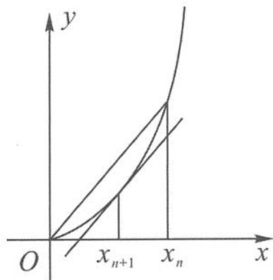

证明 (1) 因为

图4.3-1

$$
f ^ {\prime} (x) = 3 x ^ {2} + 2 x,
$$

所以曲线 $y=f(x)$ 在点 $(x_{n+1},f(x_{n+1}))$ 处切线的斜率

$$
k _ {n + 1} = 3 x _ {n + 1} ^ {2} + 2 x _ {n + 1}.
$$

又因为过(0,0)和 $(x_{n},f(x_{n}))$ 两点的直线斜率是 $x_{n}^{2}+x_{n}$ ，所以

$$
x _ {n} ^ {2} + x _ {n} = 3 x _ {n + 1} ^ {2} + 2 x _ {n + 1}.
$$

(2) 因为函数 $h(x)=x^{2}+x$ 在 x>0 时单调递增，而

$$
x _ {n} ^ {2} + x _ {n} = 3 x _ {n + 1} ^ {2} + 2 x _ {n + 1} \leqslant 4 x _ {n + 1} ^ {2} + 2 x _ {n + 1} = (2 x _ {n + 1}) ^ {2} + 2 x _ {n + 1},
$$

所以 $x_{n}\leqslant 2x_{n + 1}$ ，即

$$
\frac {x _ {n + 1}}{x _ {n}} \geqslant \frac {1}{2}.
$$

因此

$$
x _ {n} = \frac {x _ {n}}{x _ {n - 1}} \cdot \frac {x _ {n - 1}}{x _ {n - 2}} \cdot \dots \cdot \frac {x _ {2}}{x _ {1}} \cdot x _ {1} \geqslant \left(\frac {1}{2}\right) ^ {n - 1}.
$$

又

$$
x _ {n} ^ {2} + x _ {n} \geqslant 2 (x _ {n + 1} ^ {2} + x _ {n + 1}),
$$

令 $y_{n} = x_{n}^{2} + x_{n}$ ，则

$$
\frac {y _ {n + 1}}{y _ {n}} \leqslant \frac {1}{2}.
$$

因为 $y_{1}=x_{1}^{2}+x_{1}=2$ ，所以

$$
y _ {n} \leqslant \left(\frac {1}{2}\right) ^ {n - 1} \cdot y _ {1} = \left(\frac {1}{2}\right) ^ {n - 2},
$$

所以 $x_{n} <   x_{n}^{2} + x_{n}\leqslant \left(\frac{1}{2}\right)^{n - 2}$ ，即

$$
\left(\frac {1}{2}\right) ^ {n - 1} \leqslant x _ {n} ^ {2} + x _ {n} \leqslant \left(\frac {1}{2}\right) ^ {n - 2}.
$$

评注 由 $x_{n}^{2} + x_{n} = 3x_{n + 1}^{2} + 2x_{n + 1}\geqslant 3x_{n + 1}^{2} + \sqrt{3} x_{n + 1}$ 还可得 $x_{n}\geqslant \sqrt{3} x_{n + 1}$ ，即 $\sqrt{3} x_{n + 1}\leqslant x_n\leqslant$ $2x_{n + 1}$ .此时，得到 $x_{n + 1}\leqslant \frac{1}{\sqrt{3}} x_n\leqslant \left(\frac{1}{\sqrt{3}}\right)^n$ ，但由此无法证明第(2)问右边的不等式.这一放缩看上去对系数的放缩幅度更小.由于当 $n\to \infty$ 时， $x_{n}^{2}$ 对于 $x_{n}$ 来讲是无穷小量，所以对它进行放缩无疑是更加精确的.我们在放缩不等式的时候，要对数量级有判断，优先放缩最“微不足道”的部分.

例 4 已知数列 $\{x_{n}\}$ 满足 $x_{1}=\frac{1}{2}, x_{n+1}=\frac{1}{1+x_{n}}, n\in N^{*}$ .

(1)猜想数列 $\{x_{2n}\}$ 的单调性,并证明你的结论.

(2) 证明： $\left|x_{n+1}-x_{n}\right|\leqslant\frac{1}{6}\times\left(\frac{2}{5}\right)^{n-1}$

分析 在同一个坐标系中作出 $y = x$ 与 $y = \frac{1}{1 + x}$ 的图象, 利用函数迭代的方法, 可以非常清晰地看出, $\{x_{2n}\}$ 单调递减, $\{x_{2n-1}\}$ 单调递增, 并且收敛于其极限位置 (不动点) $\frac{\sqrt{5} - 1}{2}$ . 结合图象, 容易观察出 $\{x_{2n+1}\}$ 单调递增, 各项在不动点 $\frac{\sqrt{5} - 1}{2}$ 的左侧; $\{x_{2n}\}$ 单调递减, 各项在不动点 $\frac{\sqrt{5} - 1}{2}$ 的右侧, 且逐渐逼近于不动点 $\frac{\sqrt{5} - 1}{2}$ .

证明 (1)略,证明详见第一章第1.2节例2.

(2) 当 $n = 1$ 时, $\left|x_{n+1} - x_n\right| = \left|x_2 - x_1\right| = \frac{1}{6}$ , 结论成立.

当 $n \geqslant 2$ 时，易知 $0 < x_{n-1} < 1$ ，所以 $1 + x_{n-1} < 2$

$$
x _ {n} = \frac {1}{1 + x _ {n - 1}} > \frac {1}{2},
$$

所以

$$
(1 + x _ {n}) (1 + x _ {n - 1}) = \left(1 + \frac {1}{1 + x _ {n - 1}}\right) (1 + x _ {n - 1}) = 2 + x _ {n - 1} \geqslant \frac {5}{2},
$$

从而

$$
\begin{array}{r l} \left| x _ {n + 1} - x _ {n} \right| & = \left| \frac {1}{1 + x _ {n}} - \frac {1}{1 + x _ {n - 1}} \right| = \frac {\left| x _ {n} - x _ {n - 1} \right|}{(1 + x _ {n}) (1 + x _ {n - 1})} \\ & \leqslant \frac {2}{5} \left| x _ {n} - x _ {n - 1} \right| \leqslant \left(\frac {2}{5}\right) ^ {2} \left| x _ {n - 1} - x _ {n - 2} \right| \leqslant \dots \leqslant \left(\frac {2}{5}\right) ^ {n - 1} \left| x _ {2} - x _ {1} \right| \\ & = \frac {1}{6} \times \left(\frac {2}{5}\right) ^ {n - 1}. \end{array}
$$

评注 对于本题中 $x_{n + 1} - x_n$ 的变形方式通常有两种：

一是 $x_{n + 1} - x_n = \frac{1}{1 + x_n} -\frac{1}{1 + x_{n - 1}} = \frac{x_{n - 1} - x_n}{(1 + x_n)(1 + x_{n - 1})};$

二是 $x_{n + 1} - x_n = \frac{1}{1 + x_n} -x_n = \frac{1 - x_n - x_n^2}{1 + x_n}$

这两种变形方式在证明数列单调性或进行通项放缩时经常用到。

例5 已知数列 $\{a_{n}\}$ 满足 $a_1 = 1, a_n = \frac{1}{a_{n+1}} - \frac{1}{2}, n \in \mathbb{N}^*$ . 证明：

(1) $\frac{2}{3}\leqslant a_{n}\leqslant1;$

(2) $\left|a_{n+1}-a_{n}\right|\leqslant\frac{1}{3};$

(3) $\left|a_{2n}-a_{n}\right|\leqslant\frac{10}{27}.$

证明 (1)用数学归纳法证明.

①当 n=1 时, 命题显然成立.

② 假设 $n = k (k \geqslant 1, k \in \mathbb{N}^*)$ 时，有 $\frac{2}{3} \leqslant a_k \leqslant 1$ 成立.

当 $n = k + 1$ 时，

$$
a _ {k + 1} = \frac {1}{a _ {k} + \frac {1}{2}} \leqslant \frac {1}{\frac {2}{3} + \frac {1}{2}} <   1, a _ {k + 1} = \frac {1}{a _ {k} + \frac {1}{2}} \geqslant \frac {1}{1 + \frac {1}{2}} = \frac {2}{3},
$$

即当 $n=k+1$ 时, 命题也成立.

所以,对任意的 $n \in N^{*}$ ,都有

$$
\frac {2}{3} \leqslant a _ {n} \leqslant 1.
$$

(2) 当 n=1 时， $\left|a_{2}-a_{1}\right|=\frac{1}{3}$ .

当 $n \geqslant 2$ 时, 因为

$$
\left(a _ {n} + \frac {1}{2}\right) \left(a _ {n - 1} + \frac {1}{2}\right) = \left(a _ {n} + \frac {1}{2}\right) \times \frac {1}{a _ {n}} = 1 + \frac {1}{2 a _ {n}} \geqslant 1 + \frac {1}{2} = \frac {3}{2},
$$

所以

$$
\left| a _ {n + 1} - a _ {n} \right| = \left| \frac {1}{a _ {n} + \frac {1}{2}} - \frac {1}{a _ {n - 1} + \frac {1}{2}} \right| = \frac {\left| a _ {n} - a _ {n - 1} \right|}{\left(a _ {n} + \frac {1}{2}\right) \left(a _ {n - 1} + \frac {1}{2}\right)} \leqslant \frac {2}{3} \left| a _ {n} - a _ {n - 1} \right| \leqslant \dots
$$

$$
\leqslant \left(\frac {2}{3}\right) ^ {n - 1} | a _ {2} - a _ {1} | = \frac {1}{3} \times \left(\frac {2}{3}\right) ^ {n - 1} <   \frac {1}{3}.
$$

综上所述，

$$
\mid a _ {n + 1} - a _ {n} \mid \leqslant \frac {1}{3}.
$$

(3) 当 $n = 1$ 时, $|a_{2} - a_{1}| = \frac{1}{3} = \frac{9}{27} < \frac{10}{27}$ .

当 $n \geqslant 2$ 时，由(2)知

$$
\begin{array}{r l} & {| a _ {2 n} - a _ {n} | \leqslant | a _ {2 n} - a _ {2 n - 1} | + | a _ {2 n - 1} - a _ {2 n - 2} | + \dots + | a _ {n + 1} - a _ {n} |} \\ & {\quad \leqslant \frac {1}{3} \times \left[ \left(\frac {2}{3}\right) ^ {2 n - 2} + \left(\frac {2}{3}\right) ^ {2 n - 3} + \dots + \left(\frac {2}{3}\right) ^ {n - 1} \right]} \\ & {\quad = \left(\frac {2}{3}\right) ^ {n - 1} - \left(\frac {2}{3}\right) ^ {2 n - 1}.} \end{array}
$$

设 $f(n) = \left(\frac{2}{3}\right)^{n - 1} - \left(\frac{2}{3}\right)^{2n - 1}$ ，则

$$
f (n) - f (n - 1) = \left(\frac {2}{3}\right) ^ {2 n - 3} \left[ \frac {5}{9} - \frac {1}{3} \times \left(\frac {2}{3}\right) ^ {1 - n} \right], n \geqslant 3.
$$

当 $n \geqslant 3$ 时，因为 $\frac{5}{9} - \frac{1}{3} \times \left(\frac{2}{3}\right)^{1-n} \leqslant \frac{5}{9} - \frac{1}{3} \times \left(\frac{2}{3}\right)^{1-3} < 0$ ，即 $f(n) - f(n-1) < 0$ . 所以，当 $n \geqslant 2$ 时， $f(n)$ 单调递减.

因此 $\left|a_{2n}-a_{n}\right|\leqslant\frac{2}{3}-\left(\frac{2}{3}\right)^{3}=\frac{10}{27}.$

综上所述，

$$
\mid a _ {2 n} - a _ {n} \mid \leqslant \frac {1 0}{2 7}.
$$

例6 已知数列 $\{a_{n}\}$ 满足 $a_1 = a > 0, a_{n+1} = \frac{1}{3} \left(5a_{n} + \frac{4}{a_{n}}\right) - 2$ .

(1)若数列 $\{a_{n}\}$ 为单调递减数列,求实数a的取值范围.

(2) 当 $a=\frac{1}{2}$ 时, 设数列 $\{a_{n}\}$ 的前 n 项的和为 $S_{n}$ , 证明: 当 $n\geqslant3$ 时, $n+\frac{1}{6}\leqslant S_{n}<n+\frac{7}{4}$ .
解答 (1) 因为

$$
a _ {2} - a _ {1} = \frac {2}{3 a} (a - 1) (a - 2) <   0,
$$

所以

$$
a \in (1, 2).
$$

此时可以由 $a_{n+1} - 1 = \frac{(5a_n - 4)(a_n - 1)}{3a_n}$ 及数学归纳法证明 $a_n > 1$ ，从而可由 $a_{n+1} - a_n = \frac{2(a_n - 2)(a_n - 1)}{3a_n}$ 及数学归纳法证明

$$
1 <   a _ {n + 1} <   a _ {n} <   2.
$$

(2)由已知得 $a_1 = \frac{1}{2}, a_2 = \frac{3}{2}, a_3 = \frac{25}{18}$ , 可证

$$
1 <   a _ {n + 1} <   a _ {n} \leqslant \frac {3}{2} (n \geqslant 2).
$$

当 $n \geqslant 3$ 时，

$$
S _ {n} \geqslant \frac {1}{2} + \frac {3}{2} + \frac {2 5}{1 8} + (n - 3) > n + \frac {1}{6}.
$$

由 $a_{n + 1} - 1 = \frac{(5a_n - 4)(a_n - 1)}{3a_n}\leqslant \frac{7}{9} (a_n - 1)$ 得

$$
S _ {n} - n \leqslant - \frac {1}{2} + \frac {1}{2} \times \left[ 1 + \frac {7}{9} + \dots + \left(\frac {7}{9}\right) ^ {n - 2} \right] = - \frac {1}{2} + \frac {9}{4} \times \left[ 1 - \left(\frac {7}{9}\right) ^ {n - 1} \right] <   \frac {7}{4}.
$$

所以，当 $n \geqslant 3$ 时，

$$
n + \frac {1}{6} \leqslant S _ {n} <   n + \frac {7}{4}.
$$

评注 一方面, 此题要证 $n + \frac{1}{6} \leqslant S_n < n + \frac{7}{4}$ , 即证 $\frac{1}{6} \leqslant S_n - n < \frac{7}{4}$ , 即证 $\frac{1}{6} \leqslant \sum_{i=1}^{n} (a_i - 1) < \frac{7}{4}$ ; 另一方面, 我们注意到数列 $\{a_n\}$ 的不动点方程为 $x = \frac{1}{3} \left(5x + \frac{4}{x}\right) - 2$ , 不动点为 $x = 1$ , 所以要在递推式的等号两边先同时减去 1 , 再进行相应放缩.

例 7 在数列 $\{a_{n}\}$ 中, 已知 $a_{1}=\frac{1}{4}, a_{n+1}=\sqrt{a_{n}-a_{n}^{2}}$ .

(1) 证明: $a_{n} < a_{n+1} < \frac{1}{2}$ .

(2) 证明: 当 $n \geqslant 2$ 时, $\left(\frac{a_{n+1}}{a_n}\right)^{2^n} < 2$ .

证明 (1)由已知得 $a_{n} > 0$ . 因为

$$
a _ {n + 1} ^ {2} - \frac {1}{4} = - \left(a _ {n} - \frac {1}{2}\right) ^ {2} \leqslant 0,
$$

所以

$$
a _ {n + 1} \leqslant \frac {1}{2}.
$$

又因为 $a_1 \neq \frac{1}{2}$ , 所以 $0 < a_n < \frac{1}{2}$ ,

$$
a _ {n + 1} ^ {2} - a _ {n} ^ {2} = a _ {n} (1 - 2 a _ {n}) > 0,
$$

所以

$$
a _ {n + 1} > a _ {n}.
$$

从而

$$
a _ {n} <   a _ {n + 1} <   \frac {1}{2}.
$$

(2) 当 $n \geqslant 2$ 时, 由已知得

$$
a _ {n + 1} ^ {2} = a _ {n} - a _ {n} ^ {2},
$$

$$
a _ {n} ^ {2} = a _ {n - 1} - a _ {n - 1} ^ {2}.
$$

两式相除得

$$
\left(\frac {a _ {n + 1}}{a _ {n}}\right) ^ {2} = \frac {a _ {n}}{a _ {n - 1}} \cdot \frac {1 - a _ {n}}{1 - a _ {n - 1}}.
$$

因为 $a_{n} < a_{n + 1} < \frac{1}{2}$ , 所以 $\frac{1 - a_n}{1 - a_{n - 1}} < 1$ , 即

$$
\left(\frac {a _ {n + 1}}{a _ {n}}\right) ^ {2} <   \frac {a _ {n}}{a _ {n - 1}}.
$$

又 $a_2 = \sqrt{\frac{1}{4} - \frac{1}{16}} = \frac{\sqrt{3}}{4}, a_3 = \sqrt{\frac{\sqrt{3}}{4} - \frac{3}{16}} = \frac{\sqrt{4\sqrt{3} - 3}}{4}$ , 所以: 当 $n = 2$ 时,

$$
\left(\frac {a _ {3}}{a _ {2}}\right) ^ {2 ^ {2}} = \left(\frac {4 \sqrt {3} - 3}{3}\right) ^ {2} = \frac {5 7 - 2 4 \sqrt {3}}{9} <   2;
$$

当 $n \geqslant 3$ 时，

$$
\frac {a _ {n + 1}}{a _ {n}} <   \left(\frac {a _ {n}}{a _ {n - 1}}\right) ^ {\frac {1}{2}} <   \left(\frac {a _ {n - 1}}{a _ {n - 2}}\right) ^ {\frac {1}{4}} <   \dots <   \left(\frac {a _ {3}}{a _ {2}}\right) ^ {\frac {1}{2 ^ {n - 2}}},
$$

即

$$
\left(\frac {a _ {n + 1}}{a _ {n}}\right) ^ {2 ^ {n}} <   \left(\frac {a _ {3}}{a _ {2}}\right) ^ {4} <   2.
$$

所以，当 $n \geqslant 2$ 时，

$$
\left(\frac {a _ {n + 1}}{a _ {n}}\right) ^ {2 ^ {n}} <   2.
$$

(2) 递推关系式放缩成类等差型

例8 已知数列 $\{a_{n}\}$ 满足 $a_1 = \frac{1}{2}$ ，且 $a_{n+1} = a_n - a_n^2 (n \in \mathbb{N}^*)$ .

(1) 证明: $1 \leqslant \frac{a_{n}}{a_{n+1}} \leqslant 2$ .

(2 设数列 $\{a_{n}^{2}\}$ 的前 n 项和为 $S_{n}$ ，证明： $\frac{1}{2(n+2)}\leqslant\frac{S_{n}}{n}\leqslant\frac{1}{2(n+1)}$ .

证明 (1)证法一:要证明

$$
\frac {a _ {n}}{a _ {n + 1}} = \frac {a _ {n}}{a _ {n} - a _ {n} ^ {2}} = \frac {1}{1 - a _ {n}} \in [ 1, 2 ],
$$

只要证明

$$
0 \leqslant a _ {n} \leqslant \frac {1}{2}.
$$

由题意得 $a_{n + 1} - a_n = -a_n^2\leqslant 0$ ，故

$$
a _ {n + 1} \leqslant a _ {n} \leqslant \frac {1}{2}
$$

(也可用配方法或基本不等式法证明 $a_{n+1} \leqslant \frac{1}{4}$ ). 由 $a_n = (1 - a_{n-1})a_{n-1}$ 得

$$
a _ {n} = (1 - a _ {n - 1}) (1 - a _ {n - 2}) \dots (1 - a _ {1}) a _ {1} > 0
$$

(也可由 $a_{n}$ 与 $a_{n-1}$ 同号证明 $a_{n}$ 与 $a_{1}$ 同号, 或用反证法证明: 假定 $a_{n+1}<0$ , 则 $a_{k+1}=a_{k}(1-a_{k})$ .
由于 $a_{k} \leqslant \frac{1}{2}$ ，则

$$
a _ {k} <   0.
$$

若数列的后一项为负,则前一项为负.依次类推,得到 $a_{1}<0$ ,矛盾.同样假定 $a_{k+1}=0$ ,也矛盾.由 $0\leqslant a_{n}\leqslant\frac{1}{2}$ 得 $\frac{a_{n}}{a_{n+1}}=\frac{a_{n}}{a_{n}-a_{n}^{2}}=\frac{1}{1-a_{n}}\in[1,2]$ ,即

$$
1 \leqslant \frac {a _ {n}}{a _ {n + 1}} \leqslant 2.
$$

证法二: 可构造函数 $f(x)=x-x^{2}$ ，则

$$
a _ {n + 1} = f (a _ {n}).
$$

函数 $f(x)$ 在 $\left(0, \frac{1}{2}\right)$ 上递增. 因为 $0 < a_2 < a_1$ , 所以 $f(0) < f(a_2) < f(a_1)$ , 即有

$$
0 <   a _ {3} <   a _ {2}.
$$

依次类推,即可得到

$$
0 <   a _ {n + 1} <   a _ {n} \leqslant \frac {1}{2}.
$$

(2)由题意得 $a_{n}^{2} = a_{n} - a_{n + 1}$ ，所以

$$
S _ {n} = a _ {1} - a _ {n + 1} \quad ①.
$$

由 $\frac{1}{a_{n + 1}} -\frac{1}{a_n} = \frac{a_n}{a_{n + 1}}$ 和 $1\leqslant \frac{a_n}{a_{n + 1}}\leqslant 2$ 得

$$
1 \leqslant \frac {1}{a _ {n + 1}} - \frac {1}{a _ {n}} \leqslant 2,
$$

所以 $n \leqslant \frac{1}{a_{n+1}} - \frac{1}{a_1} \leqslant 2n$ ，因此

$$
\frac {1}{2 (n + 1)} \leqslant a _ {n + 1} \leqslant \frac {1}{n + 2} \quad ②.
$$

由①②得

$$
\frac {1}{2 (n + 2)} \leqslant \frac {S _ {n}}{n} \leqslant \frac {1}{2 (n + 1)}.
$$

例 9 已知数列 n 满足 $a_{1}=1, a_{n+1}=\frac{a_{n}}{1+a_{n}^{2}}(n\in\mathbb{N}^{*})$ .

(1) 证明: $\frac{2}{n+2} \leqslant a_n \leqslant 1$ .

(2) 设 $S_{n}$ 为数列 $\{a_{n}\}$ 的前 n 项和, 证明: $S_{n} \leqslant \sqrt{2n-1}$ .

证明 (1)由已知条件易知 $a_{n} > 0$ ，且

$$
\frac {1}{a _ {n + 1}} = \frac {1}{a _ {n}} + a _ {n} \quad (\ast),
$$

所以 $\frac{1}{a_{n + 1}} >\frac{1}{a_n} >0$ ，因此

$$
a _ {n + 1} <   a _ {n}.
$$

数列 $\{a_{n}\}$ 是递减数列，故

$$
a _ {n} \leqslant a _ {1} = 1.
$$

当 $n \geqslant 2, n \in \mathbb{N}^*$ 时，

$$
a _ {n} \leqslant a _ {2} = \frac {1}{2}.
$$

由（\*）式知

$$
\frac {1}{a _ {n + 1}} = \frac {1}{a _ {n}} + a _ {n} \leqslant \frac {1}{a _ {n}} + \frac {1}{2}.
$$

累加可得 $\frac{1}{a_n} \leqslant \frac{1}{a_2} + \frac{1}{2}(n - 2) = \frac{1}{2} n + 1$ ，即

$$
a _ {n} \geqslant \frac {2}{n + 2}.
$$

经验证: 当 n=1 时, $a_{1}=1 \geqslant \frac{2}{1+2} = \frac{2}{3}$ 也成立. 因此, 当 $n \in N^{*}$ 时,

$$
\frac {2}{n + 2} \leqslant a _ {n} \leqslant 1.
$$

(2) 将 (\*) 式平方可得

$$
\frac {1}{a _ {n + 1} ^ {2}} = \frac {1}{a _ {n} ^ {2}} + a _ {n} ^ {2} + 2.
$$

累加可得

$$
\frac {1}{a _ {n} ^ {2}} = \frac {1}{a _ {1} ^ {2}} + a _ {1} ^ {2} + a _ {2} ^ {2} + \dots + a _ {n - 1} ^ {2} + 2 (n - 1) \geqslant 2 + 2 (n - 1) = 2 n (n \geqslant 2),
$$

所以

$$
a _ {n} \leqslant \frac {\sqrt {2}}{2 \sqrt {n}} \leqslant \frac {\sqrt {2}}{\sqrt {n} + \sqrt {n - 1}} = \sqrt {2} (\sqrt {n} - \sqrt {n - 1}).
$$

因此，当 $n \geqslant 2, n \in \mathbf{N}^*$ 时，

$$
\begin{array}{r l} S _ {n} & = a _ {1} + a _ {2} + \dots + a _ {n} \\ & \leqslant 1 + \sqrt {2} (\sqrt {2} - \sqrt {1} + \sqrt {3} - \sqrt {2} + \dots + \sqrt {n} - \sqrt {n - 1}) \\ & = \sqrt {2 n} + 1 - \sqrt {2}. \end{array}
$$

只需证 $\sqrt{2n} + 1 - \sqrt{2} \leqslant \sqrt{2n - 1}$ , 即证

$$
\sqrt {2 n} + 1 \leqslant \sqrt {2 n - 1} + \sqrt {2}.
$$

平方并整理得 $2n + 1 + 2\sqrt{2n} \leqslant 2n + 1 + 2\sqrt{2} \times \sqrt{2n - 1}$ , 即

$$
\sqrt {n} \leqslant \sqrt {2 n - 1}.
$$

再次平方,即证 $n \geqslant 1$ , 显然成立.

经验证: 当 n=1 时, $S_{1}=1 \leqslant \sqrt{2 \times 1 - 1} = 1$ 也成立. 所以

$$
S _ {n} \leqslant \sqrt {2 n - 1}.
$$

## 思考题

1. 已知每一项都是正数的数列 $\{a_{n}\}$ 满足 $a_{1}=1, a_{n+1}=\frac{a_{n}+1}{12a_{n}}(n\in\mathbb{N}^{*})$ .

(1) 证明: $a_{2n+1} < a_{2n-1}$ .

(2) 证明: $\frac{1}{6} \leqslant a_n \leqslant 1$ .

(3) 记 $S_{n}$ 为数列 $\left\{\left|a_{n+1}-a_{n}\right|\right\}$ 的前 n 项和，证明： $S_{n}<6$ .

2. 已知横坐标为 $\sqrt{t}$ 的点 $P$ 在曲线 $C: y = \frac{1}{x} (x > 1)$ 上, 曲线 $C$ 在点 $P$ 处的切线与直线 $y = 4x$ 交于点 $A$ , 与 $x$ 轴交于点 $B$ . $A$ , $B$ 的横坐标分别为 $x_A, x_B$ , 记 $f(t) = x_A x_B$ , 正数数列 $\{a_n\}$ 满足 $a_n = f(a_{n-1}) (n \in \mathbb{N}^*, n \geqslant 2), a_1 = a$ .

(1) 写出 $a_{n}, a_{n-1}$ 之间的关系式.

(2) 若数列 $\{a_{n}\}$ 为递减数列, 求实数 a 的取值范围.

(3) 若 $a = 2, b_{n} = a_{n} - \frac{3}{4}$ , 设数列 $\{b_{n}\}$ 的前 $n$ 项和为 $S_{n}$ , 证明: $S_{n} < \frac{3}{2} (n \in \mathbb{N}^{*})$ .

3. 已知数列 $\{a_{n}\}$ 满足 $a_{n+1}=\frac{a_{n}}{2}+\frac{1}{a_{n}}(n\in\mathbb{N}^{*})$ .

(1) 若 $a_1 = 1$ , 证明: $\frac{2}{\sqrt{a_n^2 - 2}} (n \geqslant 2)$ 为整数.

(2) 若 $a_{1}=2$ ，证明： $\sqrt{2}<a_{n}<\frac{3}{2}+\frac{1}{n}$ .

4. 已知 $a_1 = 1, a_2 = 4, a_{n+2} = 4a_{n+1} + a_n, b_n = \frac{a_{n+1}}{a_n}, n \in \mathbb{N}^*$ .

(1) 求 $b_{1}, b_{2}, b_{3}$ 的值.

(2) 设 $c_{n}=b_{n}b_{n+1}, S_{n}$ 为数列 $\{c_{n}\}$ 的前 n 项和，证明： $S_{n}\geqslant17n.$

(3) 证明： $\left|b_{2n}-b_{n}\right|<\frac{1}{64}\times\frac{1}{17^{n-2}}.$

5. 已知数列 $\{a_{n}\}$ 的各项为正且满足 $a_{1} > a_{2}, a_{n+1} = \sqrt{\frac{a_{n} + 1}{4}} (n \in \mathbb{N}^{*})$ .

(1) 证明: $a_{n} > a_{n+1}$ .

(2) 令 $b_n = \frac{n(a_n - a_{n+1})}{a_1 - a_2}$ ，记数列 $\{b_n\}$ 的前 $n$ 项和为 $S_n$ ，证明： $S_n < \frac{25}{16}$ .

6. 已知各项为正的数列 $\{a_{n}\}$ 满足 $a_{1} = \frac{1}{2}, a_{n+1}^{2} = \frac{1}{3} a_{n}^{2} + \frac{2}{3} a_{n}, n \in \mathbb{N}^{*}$ . 证明：

(1) $a_{n}<a_{n+1}<1;$

(2) $a_{1}+a_{2}+\cdots+a_{n}>n-\frac{9}{4}.$

7. 已知各项均为正数的数列 $\{a_{n}\}$ 满足 $a_{1}=1, a_{n+1}^{2}-2a_{n}=\lambda$ .

(1) 若 $\lambda=0$ ，求 $a_{2}, a_{3}$ 的值.

(2) 若 $\lambda = 3$ ，证明： $3 - \left(\frac{1}{2}\right)^{n-2} \leqslant a_n < 3$ .

8. 已知数列 $\{a_{n}\}$ 满足 $4S_{n} - 2a_{n} = 2^{n}, n \in \mathbb{N}^{*}$ , 其中 $S_{n}$ 为 $\{a_{n}\}$ 的前 $n$ 项和. 证明:

(1) $\left\{\frac{a_{n}}{2^{n}}-\frac{1}{6}\right\}$ 是等比数列.

$$
\frac {1}{6 a _ {1} - 3} + \frac {1}{6 a _ {2} + 3} + \frac {1}{6 a _ {3} - 3} + \dots + \frac {1}{6 a _ {n} + 3 \times (- 1) ^ {n}} <   1. \tag {2}
$$

## 4.4 数列不等式,通项放缩法

## 4.4.1 通项放缩法的适用范围和主要类型

对于通项公式已经给出(或容易直接求出)的数列不等式问题,我们通常需要对通项进行适当的放缩或变形,再进行求和与转化.通项放缩法的主要类型有:和与通项分析法、添加(或舍去)正项(或负项)法、分组放缩法.

## (1)和与通项分析法

形如 $\sum_{i=1}^{n} a_i < f(n)$ 的数列不等式问题: 要证明不等式 $\sum_{i=1}^{n} a_i < f(n)$ , 如果记 $T_n = f(n)$ 是数列 $\{b_n\}$ 的前 $n$ 项和, 则 $b_n = T_n - T_{n-1} (n \geqslant 2), b_1 = T_1$ , 那么只要证其通项满足 $a_n < b_n$ 即可.

例1 证明： $\frac{n^2 + n}{2} < \sum_{k=1}^{n}\sqrt{k(k + 1)} < \frac{n^2 + 2n}{2}$ .

证明 因为

$$
\frac {n ^ {2} + 2 n}{2} - \frac {(n - 1) ^ {2} + 2 (n - 1)}{2} = \frac {2 n + 1}{2}, \frac {n ^ {2} + n}{2} - \frac {(n - 1) ^ {2} + (n - 1)}{2} = n,
$$

要证

$$
\frac {n ^ {2} + n}{2} <   \sum_ {k = 1} ^ {n} \sqrt {k (k + 1)} <   \frac {n ^ {2} + 2 n}{2},
$$

只要证

$$
n <   \sqrt {n (n + 1)} <   \frac {2 n + 1}{2}.
$$

一方面, $n < \sqrt{n(n + 1)}$ 显然成立, 另一方面, 由均值不等式可知 $\sqrt{n(n + 1)} < \frac{2n + 1}{2}$ 也成立, 所以 $n < \sqrt{n(n + 1)} < \frac{2n + 1}{2}$ 成立.

综上可知,原不等式成立.

例2 证明： $\sum_{k = 1}^{n}\frac{1}{\sqrt[4]{(2k - 1)(2k + 1)}} >\sqrt{2} (\sqrt{n + 1} -1).$

证明 要证 $\sum_{k=1}^{n} \frac{1}{\sqrt[4]{(2k-1)(2k+1)}} > \sqrt{2} (\sqrt{n+1}-1)$ , 只要证

$$
\frac {1}{\sqrt [ 4 ]{(2 n - 1) (2 n + 1)}} > \sqrt {2} (\sqrt {n + 1} - \sqrt {n}).
$$

事实上，因为

$$
\frac {1}{\sqrt [ 4 ]{(2 n - 1) (2 n + 1)}} = \frac {1}{\sqrt [ 4 ]{4 n ^ {2} - 1}} > \frac {1}{\sqrt {2 n}} = \frac {\sqrt {2}}{2 \sqrt {n}} > \frac {\sqrt {2}}{\sqrt {n + 1} + \sqrt {n}} = \sqrt {2} (\sqrt {n + 1} - \sqrt {n}),
$$

所以原不等式成立.

(2) 添加 (或舍去) 正项 (或负项) 法

若数列通项中加上一些正数,则数列通项变大;同理,若数列通项中加上一些负数,则数列通项变小.由于证明不等式的需要,有时需要先添加或舍去一些项,使不等式一边放大或缩小,再利用不等式的传递性来证明.

例 3 已知 $a_{n}=\frac{1}{2^{n}-1}$ ，证明： $\frac{1}{2}-\frac{1}{2^{n}}\leqslant a_{2}+a_{3}+\cdots+a_{n}<\frac{2}{3}$ .

分析 不等式的左边只需利用 $\frac{1}{2^n} \leqslant \frac{1}{2^n - 1}$ 即可证明. 不等式的右边, 需要对常数 1 或指数式 $2^n$ 作适当的变形. 此题的本质是对分母中的 1 作两个方向的放缩, 即可以将 1 缩小为 0 , 也可以将 1 放大为 $2^{n-1}$ 等.

证明 先证不等式的左端.

由 $\frac{1}{2^n} \leqslant \frac{1}{2^n - 1} (n \geqslant 2)$ , 累加可得

$$
\frac {1}{2} - \frac {1}{2 ^ {n}} = \frac {1}{2 ^ {2}} + \frac {1}{2 ^ {3}} + \dots + \frac {1}{2 ^ {n}} \leqslant a _ {2} + a _ {3} + \dots + a _ {n}.
$$

再证不等式的右端.

证法一: 当 $n \geqslant 2$ 时, 因为 $1 \leqslant 2^{n-2}$ , 所以

$$
a _ {n} = \frac {1}{2 ^ {n} - 1} \leqslant \frac {1}{2 ^ {n} - 2 ^ {n - 2}} = \frac {1}{3} \times \frac {1}{2 ^ {n - 2}}.
$$

从而

$$
a _ {2} + a _ {3} + \dots + a _ {n} \leqslant \frac {1}{3} \times \left(1 + \frac {1}{2} + \dots + \frac {1}{2 ^ {n - 2}}\right) = \frac {2}{3} \times \left(1 - \frac {1}{2 ^ {n - 1}}\right) <   \frac {2}{3}.
$$

证法二: 当 $n \geqslant 2$ 时,

$$
a _ {n} = \frac {1}{4 \times 2 ^ {n - 2} - 1} = \frac {1}{3 \times 2 ^ {n - 2} + 2 ^ {n - 2} - 1} \leqslant \frac {1}{3} \times \frac {1}{2 ^ {n - 2}}.
$$

从而

$$
a _ {2} + a _ {3} + \dots + a _ {n} \leqslant \frac {1}{3} \times \left(1 + \frac {1}{2} + \dots + \frac {1}{2 ^ {n - 2}}\right) = \frac {2}{3} \times \left(1 - \frac {1}{2 ^ {n - 1}}\right) <   \frac {2}{3}.
$$

综上可得

$$
\frac {1}{2} - \frac {1}{2 ^ {n}} \leqslant a _ {2} + a _ {3} + \dots + a _ {n} <   \frac {2}{3}.
$$

评注 一般地,形如 $a_{n} = a^{n} - b^{n}$ 或 $a_{n} = a^{n} - b$ (这里 $a > b \geqslant 1$ ) 的数列,在证明 $\frac{1}{a_1} + \frac{1}{a_2} + \cdots$

$+\frac{1}{a_{n}}<k(k \text{为常数})$ 时都可以应用等比放缩.有如下结论：

$$
\frac {1}{a ^ {n} - b ^ {n}} \leqslant \frac {1}{a ^ {n - 1} (a - b)} (a > b \geqslant 1), \text {且} \frac {1}{a ^ {n} - b} \leqslant \frac {1}{a ^ {n - 1} (a - b)} (a > b \geqslant 1).
$$

例 4 证明不等式 $\frac{1}{2^{2}}+\frac{1}{3^{2}}+\cdots+\frac{1}{(n+1)^{2}}<\frac{3}{4}$ .

分析 此类不等式的证明,关键在于对通项进行适当的放缩,可考虑把 $\frac{1}{(n+1)^{2}}$ 放大为 $\frac{1}{n(n+1)}$ ,然后进行裂项求和.如果放得过大,需进行精度调节.

证明 因为 $(n + 1)^2 > n(n + 1)$ ，所以

$$
\frac {1}{(n + 1) ^ {2}} <   \frac {1}{n (n + 1)} = \frac {1}{n} - \frac {1}{n + 1}.
$$

所以

$$
\frac {1}{2 ^ {2}} + \frac {1}{3 ^ {2}} + \dots + \frac {1}{(n + 1) ^ {2}} <   1 - \frac {1}{2} + \frac {1}{2} - \frac {1}{3} + \dots + \frac {1}{n} - \frac {1}{n + 1} = 1 - \frac {1}{n + 1} <   1.
$$

放得过大,所以需进行调整(保留一些项).

当 n=1 时， $\frac{1}{2^{2}}<\frac{3}{4}$ 成立.

当 $n \geqslant 2$ 时，

$$
\frac {1}{2 ^ {2}} + \frac {1}{3 ^ {2}} + \dots + \frac {1}{(n + 1) ^ {2}} <   \frac {1}{2 ^ {2}} + \left(\frac {1}{2} - \frac {1}{3} + \frac {1}{3} - \frac {1}{4} + \dots + \frac {1}{n} - \frac {1}{n + 1}\right) = \frac {3}{4} - \frac {1}{n + 1} <   \frac {3}{4}
$$

成立. 不等式得证.

评注 利用裂项放缩法证明不等式,往往会出现“放过头”的情况.调整办法通常有两种,一种是调整放缩的精度,另一种是保留前几项,这样就能使结果更加精确.

此题中我们可以把不等式右边的 $\frac{3}{4}$ 变得更小一些,得到下面的变式题.

变式 证明不等式 $\frac{1}{2^2} + \frac{1}{3^2} + \cdots + \frac{1}{(n+1)^2} < \frac{2}{3}$ .

分析 该变式不等式的左边与例4中不等式的左边是一样的,但右边的值更小(要求更精确).如果只考虑多保留几项很难达到效果,故需要在通项的放缩上下功夫.

证明 因为

$$
\frac {1}{(n + 1) ^ {2}} <   \frac {1}{\left(n + \frac {1}{2}\right) \left(n + \frac {3}{2}\right)} = \frac {1}{n + \frac {1}{2}} - \frac {1}{n + \frac {3}{2}},
$$

所以

$$
\frac {1}{2 ^ {2}} + \frac {1}{3 ^ {2}} + \dots + \frac {1}{(n + 1) ^ {2}} <   \frac {1}{1 + \frac {1}{2}} - \frac {1}{n + \frac {3}{2}} <   \frac {2}{3}.
$$

评注 例4的解答采用了 $\frac{1}{(n + 1)^2} < \frac{1}{n(n + 1)}$ ，其实质是 $(n + 1)^2 = n^2 + 2n + 1 = n^2 + n + (n + 1) > n^2 + n$ ，即扔掉了 $(n + 1)$ . 变式的解答采用了 $\frac{1}{(n + 1)^2} < \frac{1}{\left(n + \frac{1}{2}\right)\left(n + \frac{3}{2}\right)}$ ，其实质是 $(n + 1)^2 > \left(n + \frac{1}{2}\right)\left(n + \frac{3}{2}\right) = n^2 + 2n + \frac{3}{4}$ ，即扔掉了 $\frac{1}{4}$ . 显然，从放缩的角度来说，扔掉的部分越小放缩越有效，不等式越精确. 这里就产生了一个问题，如何才能使放缩尽可能地精确呢？回到本题中，对于 $(n + 1)^2 > \left(n + \frac{1}{2}\right)\left(n + \frac{3}{2}\right) = n^2 + 2n + \frac{3}{4}$ 的放缩，有通性通法吗？答案是肯定的，我们可以采用待定系数法. 设 $(n + 1)^2 > (n + x)(n + x + 1) = n^2 + (2x + 1)n + x(x + 1)$ ，令 $2x + 1 = 2$ ，可得 $x = \frac{1}{2}$ ，于是就有 $(n + 1)^2 > \left(n + \frac{1}{2}\right)\left(n + \frac{3}{2}\right) = n^2 + 2n + \frac{3}{4}$ 成立.

例5 已知 $a_{n} = \left(\frac{1}{3}\right)^{n}, c_{n} = \frac{1}{1 + a_{n}} + \frac{1}{1 - a_{n + 1}}, \{c_{n}\}$ 的前 $n$ 项和为 $T_{n}$ , 证明: $T_{n} > 2n - \frac{1}{3}$ .

证明 证法一: 因为

$$
c _ {n} = \frac {1}{1 + a _ {n}} + \frac {1}{1 - a _ {n + 1}} = \frac {3 ^ {n}}{3 ^ {n} + 1} + \frac {3 ^ {n + 1}}{3 ^ {n + 1} - 1} = 2 + \frac {1}{3 ^ {n + 1} - 1} - \frac {1}{3 ^ {n} + 1} > 2 + \frac {1}{3 ^ {n + 1} + 1} - \frac {1}{3 ^ {n} + 1},
$$

所以

$$
T _ {n} > 2 n - \frac {1}{4} > 2 n - \frac {1}{3}.
$$

证法二: 因为

$$
c _ {n} = \frac {1}{1 + a _ {n}} + \frac {1}{1 - a _ {n + 1}} = \frac {3 ^ {n}}{3 ^ {n} + 1} + \frac {3 ^ {n + 1}}{3 ^ {n + 1} - 1} = 2 + \frac {1}{3 ^ {n + 1} - 1} - \frac {1}{3 ^ {n} + 1},
$$

当 $n \geqslant 2$ 时，

$$
c _ {n} > 2 + \frac {1}{3 ^ {n + 1} - 1} - \frac {1}{3 ^ {n} - 1},
$$

所以

$$
T _ {n} = c _ {1} + c _ {2} + \dots + c _ {n} > 2 n + \frac {1}{3 ^ {n + 1} - 1} - \frac {1}{3 + 1} > 2 n - \frac {1}{4} > 2 n - \frac {1}{3}.
$$

证法三: 因为

$$
c _ {n} = \frac {1}{1 + a _ {n}} + \frac {1}{1 - a _ {n + 1}} = \frac {3 ^ {n}}{3 ^ {n} + 1} + \frac {3 ^ {n + 1}}{3 ^ {n + 1} - 1} = 2 + \frac {1}{3 ^ {n + 1} - 1} - \frac {1}{3 ^ {n} + 1},
$$

又 $\frac{1}{3^{n + 1} - 1} >\frac{1}{3^{n + 1}},\frac{1}{3^n + 1} < \frac{1}{3^n}$ ，所以

$$
c _ {n} > 2 + \frac {1}{3 ^ {n + 1}} - \frac {1}{3 ^ {n}}.
$$

所以

$$
T _ {n} > 2 n - \frac {1}{3}.
$$

证法四: 因为

$$
\begin{array}{l} c _ {n} = \frac {1}{1 + a _ {n}} + \frac {1}{1 - a _ {n + 1}} = \frac {3 ^ {n}}{3 ^ {n} + 1} + \frac {3 ^ {n + 1}}{3 ^ {n + 1} - 1} = 2 + \frac {1}{3 ^ {n + 1} - 1} - \frac {1}{3 ^ {n} + 1} = 2 + \frac {3 ^ {n} + 1 - 3 ^ {n + 1} + 1}{(3 ^ {n + 1} - 1) (3 ^ {n} + 1)} \\ = 2 - \frac {2 \times (3 ^ {n} - 1)}{3 ^ {2 n + 1} + 2 \times 3 ^ {n} - 1} > 2 - \frac {2 \times 3 ^ {n}}{3 ^ {2 n + 1} + 2 \times 3 ^ {n} - 1} \\ = 2 - \frac {2}{3 ^ {n + 1} + 2 - \frac {1}{3 ^ {n}}} > 2 - \frac {2}{3 ^ {n + 1}}, \end{array}
$$

所以

$$
T _ {n} > 2 n - \frac {1}{3}.
$$

例 6 若 $n \geqslant 2$ 且 $n \in Z^{*}$ ，证明不等式 $\sqrt{2} - \frac{2}{\sqrt{n+1}} < \frac{1}{\sqrt{2^{3}}} + \frac{1}{\sqrt{3^{3}}} + \cdots + \frac{1}{\sqrt{n^{3}}} < 2.$

分析 对于通项 $\frac{1}{\sqrt{n^3}}$ 的放缩是一个难点, 我们可以尝试采用局部放缩的办法, 把 $n^3$ 写成 $n \cdot n \cdot n$ , 再对其中的部分 $n$ 进行放缩.

证明 一方面，

$$
\frac {1}{\sqrt {n ^ {3}}} = \frac {1}{n \sqrt {n}} = \frac {2}{\sqrt {n ^ {2}} (\sqrt {n} + \sqrt {n})} <   \frac {2}{\sqrt {n (n - 1)} (\sqrt {n} + \sqrt {n - 1})} = 2 \left(\frac {1}{\sqrt {n - 1}} - \frac {1}{\sqrt {n}}\right),
$$

累加可得

$$
\frac {1}{\sqrt {2 ^ {3}}} + \frac {1}{\sqrt {3 ^ {3}}} + \dots + \frac {1}{\sqrt {n ^ {3}}} <   2.
$$

另一方面，

$$
\frac {1}{\sqrt {n ^ {3}}} = \frac {1}{n \sqrt {n}} = \frac {2}{\sqrt {n ^ {2}} (\sqrt {n} + \sqrt {n})} > \frac {2}{\sqrt {n (n + 1)} (\sqrt {n} + \sqrt {n + 1})} = 2 \left(\frac {1}{\sqrt {n}} - \frac {1}{\sqrt {n + 1}}\right),
$$

累加可得

$$
\sqrt {2} - \frac {2}{\sqrt {n + 1}} <   \frac {1}{\sqrt {2 ^ {3}}} + \frac {1}{\sqrt {3 ^ {3}}} + \dots + \frac {1}{\sqrt {n ^ {3}}}.
$$

综上可得

$$
\sqrt {2} - \frac {2}{\sqrt {n + 1}} <   \frac {1}{\sqrt {2 ^ {3}}} + \frac {1}{\sqrt {3 ^ {3}}} + \dots + \frac {1}{\sqrt {n ^ {3}}} <   2.
$$

评注 此题中不等式右端的证明还可采用如下的放缩方法.

$$
\frac {1}{\sqrt {n ^ {3}}} = \frac {1}{n \sqrt {n}} = \frac {2}{\sqrt {n ^ {2}} (\sqrt {n} + \sqrt {n})} <   \frac {2}{\sqrt {(n - 1) (n + 1)} (\sqrt {n - 1} + \sqrt {n + 1})} = \frac {1}{\sqrt {n - 1}} - \frac {1}{\sqrt {n + 1}},
$$

$$
\frac {1}{\sqrt {n - 1}} - \frac {1}{\sqrt {n + 1}}.
$$

由此可见,对于数列不等式问题,通项放缩的精度很重要,比如把 $n^{2}$ 变为 $n^{2}-1$ 显然比变为 $n^{2}-n$ 更精确.下面我们归纳常用的放缩、裂项和拆项的结论.

$$
\frac {1}{n ^ {2}} <   \frac {1}{n ^ {2} - n} = \frac {1}{n - 1} - \frac {1}{n}, \frac {1}{n ^ {2}} <   \frac {1}{n ^ {2} - 1} = \frac {1}{2} \left(\frac {1}{n - 1} - \frac {1}{n + 1}\right), \frac {1}{n ^ {2}} <   \frac {1}{n ^ {2} - \frac {1}{4}} =
$$

$$
2 \left(\frac {1}{2 n - 1} - \frac {1}{2 n + 1}\right)
$$

$$
\text {或} \frac {1}{n ^ {2}} = \frac {4}{4 n ^ {2}} <   \frac {4}{4 n ^ {2} - 1} = 2 \left(\frac {1}{2 n - 1} - \frac {1}{2 n + 1}\right), \frac {1}{(2 n + 1) ^ {2}} <   \frac {1}{4 n ^ {2} + 4 n} = \frac {1}{4 n (n + 1)} = \frac {1}{4} \left(\frac {1}{n} - \frac {1}{n + 1}\right);
$$

$$
\frac {1}{(2 n + 1) ^ {2}} = \frac {1}{4} \times \frac {1}{n ^ {2} + n + \frac {1}{4}} <   \frac {1}{4} \times \frac {1}{n ^ {2} + n} = \frac {1}{4} \left(\frac {1}{n} - \frac {1}{n + 1}\right).
$$

$$
(2) \frac {1}{n ^ {3}} <   \frac {1}{n (n + 1) (n - 1)} = \frac {1}{2} \left[ \frac {1}{n (n - 1)} - \frac {1}{n (n + 1)} \right] (n \geqslant 2).
$$

$$
\frac {2 ^ {n}}{(2 ^ {n} - 1) ^ {2}} = \frac {2 ^ {n}}{(2 ^ {n} - 1) (2 ^ {n} - 1)} <   \frac {2 ^ {n}}{(2 ^ {n} - 1) (2 ^ {n} - 2)} = \frac {1}{2 ^ {n - 1} - 1} - \frac {1}{2 ^ {n} - 1} (n \geqslant 2).
$$

$$
\frac {1}{\sqrt {n}} = \frac {2}{\sqrt {n} + \sqrt {n}} <   \frac {2}{\sqrt {n} + \sqrt {n - 1}} = 2 (\sqrt {n} - \sqrt {n - 1}), \tag {4}
$$

$$
\frac {1}{\sqrt {n}} = \frac {2}{\sqrt {n} + \sqrt {n}} <   \frac {2}{\sqrt {n + \frac {1}{2}} + \sqrt {n - \frac {1}{2}}} = \sqrt {2} (\sqrt {2 n + 1} - \sqrt {2 n - 1}).
$$

$$
\frac {1}{n + 1} + \frac {1}{n + 2} + \frac {1}{n + 3} + \dots + \frac {1}{2 n} \leqslant \frac {1}{n + 1} + \frac {1}{n + 1} + \dots + \frac {1}{n + 1} = \frac {n}{n + 1} <   1, \tag {5}
$$

$$
\text {或} \frac {1}{n + 1} + \frac {1}{n + 2} + \frac {1}{n + 3} + \dots + \frac {1}{2 n} \geqslant \frac {1}{2 n} + \frac {1}{2 n} + \dots + \frac {1}{2 n} = \frac {n}{2 n} = \frac {1}{2}.
$$

$$
(6) \text {指数型:} \frac {1}{a ^ {n} - b ^ {n}} {\leqslant} \frac {1}{a ^ {n - 1} (a - b)} (a > b {\geqslant} 1), \frac {1}{a ^ {n} - b} {\leqslant} \frac {1}{a ^ {n - 1} (a - b)} (a > b {\geqslant} 1).
$$

$$
\frac {\sqrt {n + 1} - \sqrt {n}}{2} <   \frac {1}{4 \sqrt {n}} <   \frac {\sqrt {n + \frac {1}{2}} - \sqrt {n - \frac {1}{2}}}{2} <   \frac {\sqrt {n} - \sqrt {n - 1}}{2}. \tag {7}
$$

$$
\frac {1}{n \sqrt {n}} = \frac {2}{\sqrt {n} \times \sqrt {n} (\sqrt {n} + \sqrt {n})} <   \frac {2}{\sqrt {n} \sqrt {n - 1} (\sqrt {n} + \sqrt {n - 1})} = 2 \left(\frac {1}{\sqrt {n - 1}} - \frac {1}{\sqrt {n}}\right) (n \geqslant 2), \tag {8}
$$

$$
\frac {1}{n \sqrt {n}} = \frac {2}{\sqrt {n} \times \sqrt {n} (\sqrt {n} + \sqrt {n})} <   \frac {2}{\sqrt {n + 1} \sqrt {n - 1} (\sqrt {n + 1} + \sqrt {n - 1})} = \frac {1}{\sqrt {n - 1}} - \frac {1}{\sqrt {n + 1}},
$$

$$
\frac {1}{n \sqrt {n}} = \frac {2}{\sqrt {n} \times \sqrt {n} (\sqrt {n} + \sqrt {n})} <   \frac {2}{\sqrt {n + \frac {1}{2}} \sqrt {n - \frac {1}{2}} \left(\sqrt {n + \frac {1}{2}} + \sqrt {n - \frac {1}{2}}\right)} = 2 \left[ \frac {1}{\sqrt {n - \frac {1}{2}}} - \frac {1}{\sqrt {n + \frac {1}{2}}} \right].
$$

(9) $\frac{1}{n+1}<\ln(n+1)-\ln n<\frac{1}{n}.$

(由于 $\ln x \leqslant x - 1$ ，分别令 $x = \frac{n + 1}{n}$ 与 $x = \frac{n}{n + 1}$ ，代入对数不等式并化简即可)

(10) $\sqrt{n(n + 1)} < \frac{n + (n + 1)}{2}$ .

(基本不等式的应用,如 $\sqrt{\lg 3} \cdot \sqrt{\lg 5} < \frac{\lg 3 + \lg 5}{2} = \lg \sqrt{15} < \lg \sqrt{16} = \lg 4$ )

(3) 分组放缩法

例 7 证明: $1 + \frac{1}{2} + \frac{1}{3} + \cdots + \frac{1}{2^{n}-1} > \frac{n}{2}$ .

分析 此题若直接对通项进行放缩是很困难的,故需要对不等式的结构作一些变形处理,先对左边进行分组,再放缩.

$$
\begin{array}{r l} & {\text {证明} \quad 1 + \frac {1}{2} + \frac {1}{3} + \dots + \frac {1}{2 ^ {n} - 1}} \\ & {= 1 + \frac {1}{2} + \left(\frac {1}{3} + \frac {1}{2 ^ {2}}\right) + \dots + \left(\frac {1}{2 ^ {n - 1} + 1} + \frac {1}{2 ^ {n - 1} + 2} + \dots + \frac {1}{2 ^ {n} - 1} + \frac {1}{2 ^ {n}}\right) - \frac {1}{2 ^ {n}}} \\ & {> 1 + \frac {1}{2} + \left(\frac {1}{2 ^ {2}} + \frac {1}{2 ^ {2}}\right) + \dots + \left(\frac {1}{2 ^ {n}} + \frac {1}{2 ^ {n}} + \dots + \frac {1}{2 ^ {n}} + \frac {1}{2 ^ {n}}\right) - \frac {1}{2 ^ {n}}} \\ & {= 1 + \frac {1}{2} + \frac {1}{2} + \dots + \frac {1}{2} - \frac {1}{2 ^ {n}} = \frac {n}{2} + 1 - \frac {1}{2 ^ {n}} > \frac {n}{2}.} \end{array}
$$

评注 对和式 $1 + \frac{1}{2} + \frac{1}{3} + \dots + \frac{1}{2^n}$ 或 $1 + \frac{1}{2} + \frac{1}{3} + \dots + \frac{1}{3^n}$ 的常见放缩如下：

$$
① 1 + \frac {1}{2} + \frac {1}{3} + \dots + \frac {1}{2 ^ {n}} \geqslant 1 + \frac {n}{2}; \quad ② 1 + \frac {1}{2} + \frac {1}{3} + \dots + \frac {1}{3 ^ {n}} \geqslant 1 + \frac {2 n}{3};
$$

$$
③ 1 + \frac {1}{2} + \frac {1}{3} + \dots + \frac {1}{2 ^ {n}} \geqslant 1 + \frac {7 n - 1}{1 2};   ④ 1 + \frac {1}{2} + \frac {1}{3} + \dots + \frac {1}{3 ^ {n}} \geqslant 1 + \frac {5 n}{6} \text {等}.
$$

更一般地,并项放缩结论还有 $\frac{1}{a^{n-1}+1}+\frac{1}{a^{n-1}+2}+\cdots+\frac{1}{a^{n}}>\frac{a-1}{a}(a>1,a\in\mathbb{N}^{*})$ .

例 8 (1) 证明: $\sum_{k=1}^{n}\frac{1}{2^{k}-(-1)^{k}}<\frac{11}{12}$ . (注: $\sum_{k=1}^{n}a_{k}=a_{1}+a_{2}+\cdots+a_{n}$ .)

分析 这是一个交错和的证明问题,我们首先需要对交错项进行处理,通常有以下三种处理方式:直接放缩掉负项、分为两个子数列求和、将交错项合并求和.

证明 证法一:(直接放缩掉负项)先考虑

$$
\sum_ {k = 1} ^ {n} \frac {1}{2 ^ {k} - (- 1) ^ {k}} <   \frac {1}{2 ^ {1} + 1} + \frac {1}{2 ^ {2} - 1} + \frac {1}{2 ^ {3} + 1} + \sum_ {k = 4} ^ {n} \frac {1}{2 ^ {k} - 1} <   \frac {7}{9} + \frac {\frac {1}{2 ^ {4} - 1}}{1 - \frac {1}{2}} = \frac {4 1}{4 5} <   \frac {1 1}{1 2}.
$$

证法二:(分为两个子数列求和)先考虑

$$
\sum_ {k = 1} ^ {2 n} \frac {1}{2 ^ {k} - (- 1) ^ {k}} = \sum_ {k = 1} ^ {n} \frac {1}{4 ^ {k} - 1} + \sum_ {k = 1} ^ {n} \frac {1}{2 \times 4 ^ {k - 1} + 1},
$$

其中

$$
\sum_ {k = 1} ^ {n} \frac {1}{4 ^ {k} - 1} = \frac {1}{4 ^ {1} - 1} + \sum_ {k = 2} ^ {n} \frac {1}{4 ^ {k} - 1} <   \frac {1}{3} + \frac {\frac {1}{4 ^ {2} - 1}}{1 - \frac {1}{4}} = \frac {1 9}{4 5},
$$

$$
\sum_ {k = 1} ^ {n} \frac {1}{2 \times 4 ^ {k - 1} + 1} <   \frac {1}{3} + \frac {1}{9} + \sum_ {k = 3} ^ {n} \frac {1}{2 \times 4 ^ {k - 1}} \leqslant \frac {4}{9} + \frac {\frac {1}{3 2}}{1 - \frac {1}{4}} = \frac {3 5}{7 2}.
$$

此时 $\frac{19}{45} +\frac{35}{72} <  \frac{11}{12}$ ，因此原命题得证.

证法三:(将交错项合并求和)先考虑

$$
\sum_ {k = 1} ^ {2 n} \frac {1}{2 ^ {k} - (- 1) ^ {k}} = \sum_ {k = 1} ^ {n} \left(\frac {1}{4 ^ {k} - 1} + \frac {1}{2 \times 4 ^ {k - 1} + 1}\right) = \sum_ {k = 1} ^ {n} \frac {3 \times 4 ^ {k}}{(4 ^ {k} - 1) (4 ^ {k} + 2)}.
$$

可以放缩为等比数列

$$
\sum_ {k = 1} ^ {n} \frac {3 \times 4 ^ {k}}{\left(4 ^ {k} - 1\right) \left(4 ^ {k} + 2\right)} = 3 \times \sum_ {k = 1} ^ {n} \frac {1}{4 ^ {k} - \frac {1}{4 ^ {k}} + 1} <   3 \times \left[ \frac {1}{4 - \frac {2}{4} + 1} + \sum_ {k = 2} ^ {n} \frac {1}{4 ^ {k}} \right] <   3 \left(\frac {2}{9} + \frac {\frac {1}{1 6}}{1 - \frac {1}{4}}\right) = \frac {1 1}{1 2}.
$$

(2)已知 $a_{n} = \frac{3}{4^{n} - 3^{n - 1}}$ ，证明： $\sum_{k = 1}^{n}a_{k} <   \frac{17}{13}$

分析 先尝试直接对通项进行放大, 因为 $a_{n}=\frac{3}{4^{n}-3^{n-1}}=\frac{9}{2\times4^{n}+4^{n}-3^{n}}<\frac{9}{2\times4^{n}}$ , 所以 $\sum_{k=1}^{n}a_{k}<\frac{9}{2}\times\sum_{k=1}^{n}\frac{1}{4^{k}}<\frac{9}{2}\times\frac{\frac{1}{4}}{1-\frac{1}{4}}=\frac{3}{2}$ , 放得过大, 超过了需要的值. 但即使从第 2 项或第 3 项开始放大, 得到的值仍然大于 $\frac{17}{13}$ . 所以考虑寻找一个更小的值.

证明 因为

$$
\frac {a _ {n + 1}}{a _ {n}} = \frac {4 ^ {n} - 3 ^ {n - 1}}{4 ^ {n + 1} - 3 ^ {n}} = \frac {- 1}{4 \times \left(\frac {4}{3}\right) ^ {n} - 1} = \frac {1}{4} - \frac {1}{1 2} \times \frac {1}{4 \times \left(\frac {4}{3}\right) ^ {n} - 1} <   \frac {1}{4},
$$

所以，当 $n \geqslant 2$ 时，

$$
a _ {n} \leqslant a _ {2} \times \left(\frac {1}{4}\right) ^ {n - 2} = \frac {3}{1 3} \times \left(\frac {1}{4}\right) ^ {n - 2}.
$$

从而

$$
\sum_ {k = 1} ^ {n} a _ {k} <   1 + \frac {\frac {3}{1 3}}{1 - \frac {1}{4}} = \frac {1 7}{1 3}.
$$

评注 事实上, 在本题中, 当 $n \to +\infty$ 时, $\frac{a_{n+1}}{a_n}$ 单调递增, 且 $\frac{a_{n+1}}{a_n} \to \frac{1}{4}$ . 所以, 通过等比放缩, 已经找不到更小的公比了, 但是可以通过调整放缩的起点使得上界更小.

## 思考题

1. 已知数列 $\{a_{n}\}$ 满足 $a_{1}=1, a_{n+1}=\frac{a_{n}}{a_{n}+1}(n\in\mathbb{N}^{*})$ ，若 [x] 表示不超过 x 的最大整数，则 $\left[a_{1}^{2}+a_{2}^{2}+\cdots+a_{2017}^{2}\right]=$ \_\_\_\_.

2. 证明: $\sum_{k=1}^{n} \frac{2}{3^k - 1} < \frac{3}{2}$ .

3. 证明: $2(\sqrt{n+1}-1) < 1 + \frac{1}{\sqrt{2}} + \frac{1}{\sqrt{3}} + \cdots + \frac{1}{\sqrt{n}} < \sqrt{2} (\sqrt{2n+1}-1), n \in \mathbb{N}^{*}$ .

4. 证明: $\frac{2}{3}\left(1 - \frac{1}{2^n}\right) \leqslant \frac{1}{2 + 1} + \frac{1}{2^2 + 1} + \cdots + \frac{1}{2^n + 1} < 1, n \in \mathbb{N}^*$ .

5. 证明: $\frac{1}{3} \leqslant \frac{1}{2 + 1} + \frac{2}{2^2 + 2} + \cdots + \frac{n}{2^n + n} < 2, n \in \mathbb{N}^*$ .

6. 已知数列 $\{a_{n}\}$ , $S_{n}$ 为数列 $\{a_{n}\}$ 的前 n 项和, 且满足 $a_{1}=1,3S_{n}=(n+2)a_{n}$ .

(1) 求 $\{a_{n}\}$ 的通项公式.

(2) 证明: $\frac{1}{a_2} + \frac{1}{a_4} + \frac{1}{a_8} + \cdots + \frac{1}{a_{2^n}} < \frac{1}{2}$ .

7. 在数列 $\{a_{n}\}$ 中，已知 $\frac{1}{a_{n+1}} = \frac{1}{2a_n} + \frac{1}{2}, a_1 = 4$ .

(1) 求 $a_{n}$ .

(2) 若 $b_{n} = a_{n}^{2} - a_{n}, S_{n}$ 为 $b_{n}$ 的前 $n$ 项和，证明： $12 \leqslant S_{n} < 15$ .

8. 已知 $\{a_{n}\}$ 是各项都为正数的数列, $S_{n}$ 为其前 n 项和, 且 $a_{1}=1$ , $S_{n}=\frac{1}{2}\left(a_{n}+\frac{1}{a_{n}}\right)$ .

(1)求数列 $\{a_{n}\}$ 的通项 $a_{n}$ .

(2) 证明: $\frac{1}{2S_1} + \frac{1}{3S_2} + \cdots + \frac{1}{(n+1)S_n} < 2\left(1 - \frac{1}{S_{n+1}}\right)$ .

## 4.5 数列不等式,裂顶放缩法

## 4.5.1 裂项相消法与裂项放缩法

在求解与数列不等式有关的问题中,我们通常需要对递推关系式进行恒等变形.对递推关系式先裂项求和(迭代求和),再进行数列不等式的放缩.

例 1 已知 $a_{1}=\frac{1}{2}, a_{n+1}=a_{n}^{2}+a_{n}$ ，证明： $1<\frac{1}{1+a_{1}}+\frac{1}{1+a_{2}}+\cdots+\frac{1}{1+a_{n}}<2(n\geqslant2, n\in\mathbb{N}^{*})$ .

证明 已知 $a_{n+1}=a_{n}^{2}+a_{n}$ ，且 $a_{1}=\frac{1}{2}$ ，则 $a_{2},a_{3},\cdots,a_{n}$ 都大于 0。因为 $a_{n}^{2}>0$ ，所以

$$
a _ {n + 1} > a _ {n}.
$$

又因为

$$
\frac {1}{a _ {n + 1}} = \frac {1}{a _ {n} ^ {2} + a _ {n}} = \frac {1}{a _ {n} (1 + a _ {n})} = \frac {1}{a _ {n}} - \frac {1}{1 + a _ {n}},
$$

所以

$$
\frac {1}{1 + a _ {n}} = \frac {1}{a _ {n}} - \frac {1}{a _ {n + 1}}.
$$

从而

$$
\begin{array}{r l} \frac {1}{1 + a _ {1}} + \frac {1}{1 + a _ {2}} + \dots + \frac {1}{1 + a _ {n}} & = \left(\frac {1}{a _ {1}} - \frac {1}{a _ {2}}\right) + \left(\frac {1}{a _ {2}} - \frac {1}{a _ {3}}\right) + \dots + \left(\frac {1}{a _ {n}} - \frac {1}{a _ {n + 1}}\right) \\ & = \frac {1}{a _ {1}} - \frac {1}{a _ {n + 1}} = 2 - \frac {1}{a _ {n + 1}}. \end{array}
$$

因为

$$
a _ {2} = \left(\frac {1}{2}\right) ^ {2} + \frac {1}{2} = \frac {3}{4},
$$

$$
a _ {3} = \left(\frac {3}{4}\right) ^ {2} + \frac {3}{4} > 1,
$$

且当 $n \geqslant 2$ 时， $a_{n+1} > a_n$ ，所以 $a_{n+1} \geqslant a_3 > 1$ ，所以

$$
1 <   2 - \frac {1}{a _ {n + 1}} <   2,
$$

即

$$
1 <   \frac {1}{1 + a _ {1}} + \frac {1}{1 + a _ {2}} + \dots + \frac {1}{1 + a _ {n}} <   2.
$$

例 2 已知数列 $\{a_{n}\}$ 满足 $a_{n+1}=a_{n}^{2}+5a_{n}+4, a_{1}=1.$

(1) 设 $a_{k}, a_{k+1}, a_{k+2} (k \in \mathbb{N}^{*})$ 是数列 $\{a_{n}\}$ 的连续三项, 证明: $a_{k}, a_{k+1}, a_{k+2}$ 不可能为等比数列.

(2) 当 $n > 2$ 时, 证明: $\frac{1}{3} - \frac{1}{9^{n-1} + 2} < \sum_{k=1}^{n} \frac{1}{a_k + 3} < \frac{1}{3}$ .

证明 (1)已知 $a_1 = 1, a_{n+1} = a_n^2 + 5a_n + 4$ ，易得 $a_n \geqslant 1$ 恒成立，且 $\{a_n\}$ 为递增数列。因为

$$
a _ {n + 2} = a _ {n + 1} ^ {2} + 5 a _ {n + 1} + 4 > (a _ {n + 1} + 2) ^ {2} > a _ {n + 1} ^ {2},
$$

所以

$$
a _ {n + 2} a _ {n} > a _ {n + 1} ^ {2}.
$$

故数列 $\{a_{n}\}$ 任意的连续三项不可能为等比数列.

(2)一方面,因为

$$
a _ {n + 1} + 2 = (a _ {n} + 2) (a _ {n} + 3),
$$

所以 $\frac{1}{a_{n + 1} + 2} = \frac{1}{a_n + 2} -\frac{1}{a_n + 3}$ ，即

$$
\frac {1}{a _ {n} + 3} = \frac {1}{a _ {n} + 2} - \frac {1}{a _ {n + 1} + 2},
$$

故

$$
\sum_ {k = 1} ^ {n} \frac {1}{a _ {k} + 3} = \frac {1}{a _ {1} + 2} - \frac {1}{a _ {n + 1} + 2} = \frac {1}{3} - \frac {1}{a _ {n + 1} + 2} <   \frac {1}{3}.
$$

另一方面，由于 $a_{n + 1} > a_n^2$ ，且 $a_2 = 10 > 9$ ，故 $a_3 > 9^2, a_4 > 9^4 > 9^3.$ 由数学归纳法知 $a_{n + 1} > 9^n > 9^{n - 1}$ 成立，故 $\sum_{k=1}^{n} \frac{1}{a_k + 3} = \frac{1}{3} - \frac{1}{a_{n+1} + 2} > \frac{1}{3} - \frac{1}{9^{n-1} + 2}$ 成立.

综上可知,原不等式成立.

例3 设数列 $\{a_{n}\}$ 满足 $a_1 = \frac{1}{3}, a_{n+1} = a_n + \frac{a_n^2}{n^2}$ , 证明:

(1) $a_{n}<a_{n+1}<1;$

(2) $a_{n}\geqslant\frac{n}{2n+1}.$

(1)一方面,易证

$$
0 <   a _ {n} <   a _ {n + 1}.
$$

另一方面，因为

$$
\frac {1}{a _ {n + 1}} = \frac {1}{a _ {n}} - \frac {1}{n ^ {2} + a _ {n}},
$$

所以

$$
\frac {1}{a _ {n}} - \frac {1}{a _ {n + 1}} = \frac {1}{n ^ {2} + a _ {n}},
$$

所以

$$
\frac {1}{a _ {n}} - \frac {1}{a _ {n + 1}} = \frac {1}{n ^ {2} + a _ {n}} <   \frac {1}{n ^ {2}} <   \frac {1}{(n - 1) n} = \frac {1}{n - 1} - \frac {1}{n} (n \geqslant 2).
$$

从而

$$
\frac {1}{a _ {n + 1}} = \frac {1}{a _ {1}} - \left[ \left(\frac {1}{a _ {1}} - \frac {1}{a _ {2}}\right) + \left(\frac {1}{a _ {2}} - \frac {1}{a _ {3}}\right) + \dots + \left(\frac {1}{a _ {n}} - \frac {1}{a _ {n + 1}}\right) \right] <   3 - \left(\frac {1}{1 ^ {2}} + \frac {1}{2 ^ {2}} + \dots + \frac {1}{n ^ {n}}\right)
$$

$$
<   3 - \left[ 1 + \frac {1}{1 \times 2} + \dots + \frac {1}{(n - 1) n} \right] = 1 + \frac {1}{n} > 1.
$$

从而 $\frac{1}{a_{n + 1}} > 1 (n \geqslant 2)$ . 又 $a_1 < 1, a_2 < 1$ , 所以

$$
a _ {n} <   a _ {n + 1} <   1.
$$

(2)证法一:由(1)知 $\frac{1}{a_{n+1}}=\frac{1}{a_{n}}-\frac{1}{n^{2}+a_{n}}$ ，且 $a_{n}<a_{n+1}<1$ ，所以

$$
\frac {1}{a _ {n}} - \frac {1}{a _ {n + 1}} = \frac {1}{n ^ {2} + a _ {n}} \geqslant \frac {1}{n ^ {2} + 1} > \frac {1}{n ^ {2} + n} = \frac {1}{n} - \frac {1}{n + 1} (n \geqslant 2),
$$

累加可得

$$
\frac {1}{a _ {n}} \leqslant \frac {1}{n} + 2,
$$

所以

$$
a _ {n} \geqslant \frac {n}{2 n + 1}.
$$

证法二:数学归纳法(略).

例 4 若 $a_{1}=1, a_{n+1}a_{n}=n+1$ ，证明： $\frac{1}{a_{1}}+\frac{1}{a_{2}}+\cdots+\frac{1}{a_{n}}\geqslant2(\sqrt{n+1}-1)$ .

分析 当 n 足够大时, $a_{n}$ 近似为 $\sqrt{n}$ . 但是无法直接把 $a_{n}$ 放缩成 $\sqrt{n}$ , 所以考虑对 $\frac{1}{a_{1}} + \frac{1}{a_{2}} + \cdots + \frac{1}{a_{n}}$ 化简.

证明 证法一: 易得 $a_{n}>0$ , 因为

$$
a _ {n + 2} a _ {n + 1} = n + 2 = a _ {n + 1} a _ {n} + 1,
$$

整理得

$$
\frac {1}{a _ {n + 1}} = a _ {n + 2} - a _ {n},
$$

所以

$$
\begin{array}{r l} & {\frac {1}{a _ {1}} + \frac {1}{a _ {2}} + \dots + \frac {1}{a _ {n}} = \frac {1}{a _ {1}} + a _ {n + 1} + a _ {n} - a _ {2} - a _ {1} \geqslant 2 \sqrt {a _ {n + 1} a _ {n}} - a _ {2}} \\ & {\qquad = 2 \sqrt {n + 1} - 2.} \end{array}
$$

证法二:由退位相减法可得

$$
a _ {n + 2} a _ {n + 1} = a _ {n} a _ {n + 1} + 1,
$$

整理得

$$
\frac {1}{a _ {n + 1}} = a _ {n + 2} - a _ {n}.
$$

以下过程同证法一.

评注 在以上过程中我们只用了一步放缩,而且是极精确的(n足够大时结论近似相等),因而对 $a_{n}$ 统一放缩是行不通的.

例 5 已知数列 $\{a_{n}\}$ 满足 $a_{1}=1, a_{n+1}=\left(1+\frac{n}{2^{n}}\right)a_{n}(n=1,2,3,\cdots)$ ，证明： $a_{n+1}>a_{n}\geqslant3-\frac{n+1}{2^{n-1}}$ .

证明 已知 $a_{n+1} = \left(1 + \frac{n}{2^n}\right)a_n$ ，则 $a_{n+1}$ 与 $a_n$ 同号。因为 $a_1 = 1 > 0$ ，所以 $a_n > 0$ ，即

$$
a _ {n + 1} - a _ {n} = \frac {n}{2 ^ {n}} \times a _ {n} > 0,
$$

即

$$
a _ {n + 1} > a _ {n}.
$$

所以，数列 $\{a_{n}\}$ 为递增数列， $a_{n} \geqslant a_{1} = 1$ ，即

$$
a _ {n + 1} - a _ {n} = \frac {n}{2 ^ {n}} \times a _ {n} \geqslant \frac {n}{2 ^ {n}}.
$$

累加得

$$
a _ {n} - a _ {1} \geqslant \frac {1}{2} + \frac {2}{2 ^ {2}} + \dots + \frac {n - 1}{2 ^ {n - 1}}.
$$

令

$$
S _ {n} = \frac {1}{2} + \frac {2}{2 ^ {2}} + \dots + \frac {n - 1}{2 ^ {n - 1}},
$$

则

$$
\frac {1}{2} S _ {n} = \frac {1}{2 ^ {2}} + \frac {2}{2 ^ {3}} + \dots + \frac {n - 1}{2 ^ {n}}.
$$

两式相减得

$$
\frac {1}{2} S _ {n} = \frac {1}{2} + \frac {1}{2 ^ {2}} + \frac {1}{2 ^ {3}} + \dots + \frac {1}{2 ^ {n - 1}} - \frac {n - 1}{2 ^ {n}},
$$

求得

$$
S _ {n} = 2 - \frac {n + 1}{2 ^ {n - 1}}.
$$

所以

$$
a _ {n} \geqslant 3 - \frac {n + 1}{2 ^ {n - 1}}.
$$

综上可得

$$
a _ {n + 1} > a _ {n} \geqslant 3 - \frac {n + 1}{2 ^ {n - 1}}.
$$

例 6 已知数列 $\{a_{n}\}$ 满足 $a_{1}=\frac{1}{2}, a_{n+1}=\frac{a_{n}^{2}}{2016}+a_{n}(n\in\mathbb{N}^{*})$ .

(1) 证明: $a_{n+1} > a_n$ .

(2) 证明: $a_{2017} < 1$ .

(3) 若 $a_{k}>1$ ，求正整数 k 的最小值.

解答 (1)由于 $a_{n} > 0$

$$
a _ {n + 1} - a _ {n} = \frac {a _ {n} ^ {2}}{2 0 1 6},
$$

且 $a_1 = \frac{1}{2} > 0$ ，所以

$$
a _ {n + 1} > a _ {n}.
$$

(2)由(1)得 $a_{n} < a_{n + 1}$ , 所以 $a_{n + 1} = \frac{a_n^2}{2016} + a_n < \frac{a_n a_{n + 1}}{2016} + a_n$ , 即

$$
\frac {1}{a _ {n}} - \frac {1}{a _ {n + 1}} <   \frac {1}{2 0 1 6}.
$$

累加得

$$
\frac {1}{a _ {1}} - \frac {1}{a _ {n + 1}} <   \frac {n}{2 0 1 6},
$$

所以

$$
\frac {1}{a _ {1}} - \frac {1}{a _ {2 0 1 7}} <   1,
$$

即 $\frac{1}{a_{2017}} >\frac{1}{a_1} -1 = 1$ ，即

$$
a _ {2 0 1 7} <   1.
$$

(3) 当 $k$ 取最小值时, 有 $a_{k-1} < 1, a_k > 1$ . 所以

$$
a _ {k} = \frac {a _ {k - 1} ^ {2}}{2 0 1 6} + a _ {k - 1} <   \frac {a _ {k - 1}}{2 0 1 6} + a _ {k - 1} = \frac {2 0 1 7}{2 0 1 6} a _ {k - 1},
$$

即

$$
a _ {k - 1} > \frac {2 0 1 6}{2 0 1 7} a _ {k}.
$$

所以

$$
a _ {k} = \frac {a _ {k - 1} ^ {2}}{2 0 1 6} + a _ {k - 1} > \frac {a _ {k - 1}}{2 0 1 6} \times \frac {2 0 1 6}{2 0 1 7} a _ {k} + a _ {k - 1} = \frac {a _ {k - 1} a _ {k}}{2 0 1 7} + a _ {k - 1},
$$

即

$$
\frac {1}{a _ {k - 1}} - \frac {1}{a _ {k}} > \frac {1}{2 0 1 7}.
$$

累加得

$$
\frac {1}{a _ {1}} - \frac {1}{a _ {k}} > \frac {k - 1}{2 0 1 7},
$$

所以

$$
\frac {1}{a _ {1}} - \frac {1}{a _ {2 0 1 8}} > 1,
$$

即 $\frac{1}{a_{2018}} < \frac{1}{a_1} - 1 = 1$ ，即

$$
a _ {2 0 1 8} > 1.
$$

由(2)得 $a_{2017}<1$ ，当 k=2018 时，有 $a_{2017}<1<a_{2018}$ ，所以 k 的最小值为 2018.

例7 已知数列 $\{a_{n}\}$ 满足 $0 < a_{n} < 1$ ，且 $a_{n+1} + \frac{1}{a_{n+1}} = 2a_{n} + \frac{1}{a_{n}} (n \in \mathbb{N}^{*})$ .

(1) 证明: $a_{n+1} < a_n$ .

(2) 若 $a_1 = \frac{1}{2}$ , 设数列 $\{a_n\}$ 的前 $n$ 项和为 $S_n$ , 证明: $\sqrt{2n + 4} - \frac{5}{2} < S_n < \sqrt{3n + 4} - 2$ .

证明 (1) 因为

$$
a _ {n + 1} + \frac {1}{a _ {n + 1}} - \left(a _ {n} + \frac {1}{a _ {n}}\right) = a _ {n} > 0,
$$

又 $f(x) = x + \frac{1}{x}$ 在 $(0,1)$ 上单调递减，且 $0 < a_{n} < 1$ ，所以

$$
a _ {n + 1} <   a _ {n}.
$$

(2)已知 $a_{n + 1} + \frac{1}{a_{n + 1}} = 2a_n + \frac{1}{a_n}$ ，则

$$
a _ {n} = a _ {n + 1} - a _ {n} + \frac {1}{a _ {n + 1}} - \frac {1}{a _ {n}}.
$$

所以

$$
S _ {n} = a _ {n + 1} - a _ {1} + \frac {1}{a _ {n + 1}} - \frac {1}{a _ {1}} = a _ {n + 1} + \frac {1}{a _ {n + 1}} - \frac {5}{2}.
$$

将已知等式两边平方得

$$
a _ {n + 1} ^ {2} + 2 + \frac {1}{a _ {n + 1} ^ {2}} = 4 a _ {n} ^ {2} + 4 + \frac {1}{a _ {n} ^ {2}},
$$

整理得

$$
\frac {1}{a _ {n + 1} ^ {2}} = \frac {1}{a _ {n} ^ {2}} + 2 + 4 a _ {n} ^ {2} - a _ {n + 1} ^ {2}.
$$

由 $0 < a_{n+1} < a_n$ 可知 $\frac{1}{a_n^2} + 2 < \frac{1}{a_{n+1}^2} < \frac{1}{a_n^2} + 2 + 4a_1^2 = \frac{1}{a_n^2} + 3$ ，即

$$
2 <   \frac {1}{a _ {n + 1} ^ {2}} - \frac {1}{a _ {n} ^ {2}} <   3.
$$

累加得

$$
2 n <   \frac {1}{a _ {n + 1} ^ {2}} - \frac {1}{a _ {1} ^ {2}} <   3 n.
$$

所以 $2n + 4 < \frac{1}{a_{n + 1}^2} < 3n + 4$ ，即

$$
\sqrt {2 n + 4} <   \frac {1}{a _ {n + 1}} <   \sqrt {3 n + 4}.
$$

又 $0 < a_{n+1} < \frac{1}{2}$ , 且

$$
S _ {n} = \left(a _ {n + 1} + \frac {1}{a _ {n + 1}}\right) - \frac {5}{2},
$$

所以

$$
\sqrt {2 n + 4} - \frac {5}{2} <   S _ {n} <   \sqrt {3 n + 4} - 2.
$$

例8 已知数列 $\{a_{n}\},\{b_{n}\}$ 满足 $a_1 > 0,b_1 > 0,\left\{ \begin{array}{l}a_{n + 1} = a_n + \frac{1}{b_n},\\ b_{n + 1} = b_n + \frac{1}{a_n}, \end{array} \right.$ $n\in \mathbf{N}^{*}$ .证明： $a_{50} + b_{50} > 20$

证明 证法一:由已知得

$$
a _ {n + 1} b _ {n + 1} = a _ {n} b _ {n} + \frac {1}{a _ {n} b _ {n}} + 2,
$$

所以

$$
a _ {2} b _ {2} = a _ {1} b _ {1} + \frac {1}{a _ {1} b _ {1}} + 2 \geqslant 4,
$$

当且仅当 $a_1b_1 = \frac{1}{a_1b_1}$ 时取等号.

因为函数 $f(x) = x + \frac{1}{x} + 2$ 在 $(1, +\infty)$ 上为增函数，所以

$$
a _ {3} b _ {3} = a _ {2} b _ {2} + \frac {1}{a _ {2} b _ {2}} + 2 \geqslant 6 + \frac {1}{4} > 6.
$$

以此类推,得

$$
a _ {5 0} b _ {5 0} = a _ {4 9} b _ {4 9} + \frac {1}{a _ {4 9} b _ {4 9}} + 2 \geqslant 1 0 0 + \frac {1}{9 8} > 1 0 0.
$$

从而

$$
a _ {5 0} + b _ {5 0} \geqslant 2 \sqrt {a _ {5 0} b _ {5 0}} > 2 0.
$$

证法二: 因为

$$
a _ {n + 1} ^ {2} + b _ {n + 1} ^ {2} = a _ {n} ^ {2} + b _ {n} ^ {2} + \frac {1}{a _ {n} ^ {2}} + \frac {1}{b _ {n} ^ {2}} + 2 \left(\frac {a _ {n}}{b _ {n}} + \frac {b _ {n}}{a _ {n}}\right),
$$

所以

$$
\begin{array}{r l} a _ {5 0} ^ {2} + b _ {5 0} ^ {2} & = a _ {1} ^ {2} + b _ {1} ^ {2} + \sum_ {i = 1} ^ {4 9} \left(\frac {1}{a _ {i} ^ {2}} + \frac {1}{b _ {i} ^ {2}}\right) + 2 \sum_ {i = 1} ^ {4 9} \left(\frac {a _ {i}}{b _ {i}} + \frac {b _ {i}}{a _ {i}}\right) > a _ {1} ^ {2} + b _ {1} ^ {2} + \frac {1}{a _ {1} ^ {2}} + \frac {1}{b _ {1} ^ {2}} + 2 \times 2 \times 4 9 \\ & \geqslant 4 + 4 \times 4 9 = 2 0 0. \end{array}
$$

又因为 $a_{n + 1}b_{n + 1} = a_nb_n + \frac{1}{a_nb_n} +2$ ，所以

$$
a _ {5 0} b _ {5 0} = a _ {1} b _ {1} + \sum_ {i = 1} ^ {4 9} \frac {1}{a _ {i} b _ {i}} + 2 \times 4 9 > 9 8 + a _ {1} b _ {1} + \frac {1}{a _ {1} b _ {1}} \geqslant 1 0 0,
$$

所以

$$
(a _ {5 0} + b _ {5 0}) ^ {2} = a _ {5 0} ^ {2} + b _ {5 0} ^ {2} + 2 a _ {5 0} b _ {5 0} > 2 0 0 + 2 0 0 = 4 0 0.
$$

因此

$$
a _ {5 0} + b _ {5 0} > 2 0.
$$

## 思考题

1. 已知数列 $\{a_{n}\}$ 满足 $a_{1} = 1, a_{n+1} = a_{n} + \frac{a_{n}^{2}}{(n+1)^{2}} (n \in \mathbf{N}^{*})$ . 证明：

(1) $\frac{a_{n+1}}{a_{n}}\geqslant1+\frac{1}{(n+1)^{2}}.$

(2) $\frac{2(n+1)}{n+3}<a_{n+1}<n+1.$

2. 已知数列 $\{a_{n}\}$ 满足 $a_{1} = \frac{2}{3}, a_{n+1} = \frac{a_{n}^{2}}{a_{n}^{2} - a_{n} + p} (n \in \mathbb{N}^{*})$ , 其中 $p$ 为常数. 设 $S_{n}$ 为 $\{a_{n}\}$ 的前 $n$ 项和.

(1) 当 p=0 时, 求 $a_{n}$ .

(2) 当 $p = 1$ 时, 证明:

(i) $a_{n+1}\leqslant a_{n}$ ;

(ii) $S_{n} < 2$ .

3. 在数列 $\{a_{n}\}$ 中, 已知 $a_{1} = \frac{3}{2}, a_{n+1} = a_{n}^{2} - 2a_{n} + 2, n \in \mathbf{N}^{*}$ , 其前 $n$ 项和为 $S_{n}$ . 证明:

(1) $1<a_{n+1}<a_{n}<2.$

(2) $\frac{6}{2^{n-1}+3}\leqslant a_{n}\leqslant\frac{2^{n-1}+2}{2^{n-1}+1}.$

(3) $n < S_{n} < n + 2$ .

4. 已知数列 $\{a_{n}\}$ 满足 $a_{n}>0, a_{1}=2$ ，且 $(n+1)a_{n+1}^{2}=na_{n}^{2}+a_{n}(n\in\mathbb{N}^{*})$ 。证明：
(1) $a_{n}>1$ .

(2) $\frac{a_{2}^{2}}{4}+\frac{a_{3}^{2}}{9}+\cdots+\frac{a_{n}^{2}}{n^{2}}<\frac{9}{5}(n\geqslant2).$

5. 在数列 $\{a_{n}\}$ 中, 已知 $a_{1} = a, a_{n+1} = \frac{n}{n+1} a_{n} + \frac{1}{n+1} a_{n}^{2}$ , 已知 $0 < a < 1$ . 证明:

(1) $a_{n+1}<a_{n}.$

(2) $a_{n}\geqslant\frac{a}{(1-a)n+a}.$

6. 设数列 $\{a_{n}\}$ 满足 $a_{1} = a, a_{n+1}a_{n} - a_{n}^{2} = 1 (n \in \mathbb{N}^{*})$ .

(1) 若 $a_3 = \frac{5}{2}$ , 求实数 $a$ 的值.

(2) 设 $b_n = \frac{a_n}{\sqrt{n}}$ , 若 $a = 1$ , 证明: $\sqrt{2} \leqslant b_n < \frac{3}{2} (n \geqslant 2)$ .

7. 已知数列 $\{a_{n}\}$ 满足 $a_{1} = 1, a_{n+1} = \frac{n^{2}a_{n}}{n^{2} + 1} (n \in \mathbb{N}^{*})$ . 证明：

(1) $a_{n+1}<a_{n}.$

(2) $\frac{a_{1}}{a_{2}}+\frac{a_{2}}{a_{3}}+\cdots+\frac{a_{n}}{a_{n+1}}\leqslant n+2-\frac{1}{n}.$

(3) $a_{n}>\frac{1}{4}.$

8. 若数列 $\{a_{n}\}$ 满足 $a_{1} = \frac{4}{3}, a_{n+1} = a_{n}^{2} - a_{n} + 1 (n \in \mathbb{N}^{*})$ , 求 $\frac{1}{a_{1}} + \frac{1}{a_{2}} + \cdots + \frac{1}{a_{2014}}$ 的整数部分的值.

9. 定义数列 $\{a_{n}\}: a_{1}=2, a_{n+1}=a_{n}^{2}-a_{n}+1.$

(1) 证明: 对任意的 $n \in N^{*}, a_{n+1} > a_{n}$ .

(2)设数列 $\left\{\frac{1}{a_n}\right\}$ 的前 $n$ 项和为 $T_{n}$ , 证明: $1 - \frac{1}{2014^{2014}} < T_{2015} < 1$ .

## 4.6 数列不等式,函数放缩法

哪些函数可以作为数列不等式中的母函数？

(1) 母函数为分式型函数的放缩

分式型不等式: $\frac{b+m}{a+m}>\frac{b}{a}(a>b>0,m>0)$ .

因为函数 $f(x) = \frac{b + x}{a + x} (a > b > 0, x > 0)$ 为增函数，所以上述不等式成立，此不等式也被称为糖水不等式.

例 1 证明: $\frac{3^{2}\times5^{2}\times\cdots\times(2n+1)^{2}}{2^{2}\times4^{2}\times\cdots\times(2n)^{2}}>n+1.$

分析 可利用糖水不等式: 若 b > a > 0, x > 0, 则 $\frac{a + x}{b + x} > \frac{a}{b}$ , 其等价于 $\frac{b}{a} > \frac{b + x}{a + x}$ .

证明 证法一:由糖水不等式可得

$$
\frac {3}{2} \times \frac {5}{4} \times \frac {7}{6} \times \dots \times \frac {2 n + 1}{2 n} > \frac {4}{3} \times \frac {6}{5} \times \frac {8}{7} \times \dots \times \frac {2 n + 2}{2 n + 1},
$$

不等号两边同乘以 $\frac{3}{2} \times \frac{5}{4} \times \frac{7}{6} \times \dots \times \frac{2n + 1}{2n}$ , 可得

$$
\frac {3 ^ {2} \times 5 ^ {2} \times \cdots \times (2 n + 1) ^ {2}}{2 ^ {2} \times 4 ^ {2} \times \cdots \times (2 n) ^ {2}} > n + 1.
$$

证法二: 易知 $(2n-1)^{2}>(2n-2)\cdot2n$ , 所以

$$
\text {左边} = \frac {1}{2} \times \frac {3 ^ {2} \times 5 ^ {2} \times \cdots \times (2 n - 1) ^ {2} \times (2 n + 1) ^ {2}}{(2 \times 4) \times (4 \times 6) \times \cdots \times [ (2 n - 2) \times (2 n) ] \times (2 n)} > \frac {(2 n + 1) ^ {2}}{4 n} > n + 1.
$$

证法三:等价于证明

$$
\frac {3}{2} \times \frac {5}{4} \times \frac {7}{6} \times \dots \times \frac {2 n + 1}{2 n} > \sqrt {n + 1}.
$$

由基本不等式得

$$
\frac {2 n + 1}{2 n} = 1 + \frac {1}{2 n} = \frac {1 + \frac {n + 1}{n}}{2} > \sqrt {\frac {n + 1}{n}},
$$

累乘可得

$$
\frac {3}{2} \times \frac {5}{4} \times \frac {7}{6} \times \dots \times \frac {2 n + 1}{2 n} > \sqrt {n + 1}.
$$

得证.

评注 此题的证明还可以采用数学归纳法和分析通项法等. 糖水不等式的常见变形结构有 $\frac{n}{n+1} < \frac{n+2}{n+3} < \frac{n+3}{n+4} < \cdots$ .

例 2 已知数列 $\{a_{n}\}$ 满足 $a_{1}=\frac{2}{3},a_{n+1}=\frac{a_{n}-2}{2a_{n}-3}(n\in\mathbb{N}^{*})$ .

(1) 证明: $\left\{\frac{1}{a_n - 1}\right\}$ 是等差数列, 并求出 $\{a_n\}$ 的通项 $a_n$ .

(2) 证明: $a_{1}a_{2}a_{3}\cdots a_{n}<\frac{1}{\sqrt{n+1}}$ .

证明 (1) 由 $a_{n+1} = \frac{a_n - 2}{2a_n - 3}$ 可得

$$
a _ {n + 1} - 1 = \frac {1 - a _ {n}}{2 a _ {n} - 3},
$$

所以

$$
\frac {1}{a _ {n + 1} - 1} = \frac {1}{a _ {n} - 1} - 2.
$$

因为 $a_1 = \frac{2}{3}$ , 即 $\frac{1}{a_1 - 1} = -3$ , 所以 $\left\{\frac{1}{a_n - 1}\right\}$ 是以-3为首项, -2为公差的等差数列. 所以 $\frac{1}{a_n - 1} = -2n - 1$ , 即

$$
a _ {n} = \frac {2 n}{2 n + 1}.
$$

(2)令

$$
T _ {n} = a _ {1} a _ {2} a _ {3} \dots a _ {n} = \frac {2}{3} \times \frac {4}{5} \times \dots \times \frac {2 n}{2 n + 1} \quad ①.
$$

因为 $\frac{2n}{2n + 1} < \frac{2n + 1}{2n + 2}$ , 所以

$$
T _ {n} <   \frac {3}{4} \times \frac {5}{6} \times \dots \times \frac {2 n + 1}{2 n + 2} \quad ②.
$$

①×②得

$$
T _ {n} ^ {2} <   \frac {2}{2 n + 2} = \frac {1}{n + 1},
$$

所以 $T_{n} < \sqrt{\frac{1}{n + 1}}$ ，即

$$
a _ {1} a _ {2} a _ {3} \dots a _ {n} <   \frac {1}{\sqrt {n + 1}}.
$$

例 3 证明: $(1+1)\left(1+\frac{1}{4}\right)\left(1+\frac{1}{7}\right)\cdots\left(1+\frac{1}{3n-2}\right)>\sqrt[3]{3n+1}$ .

证明 证法一:运用两次分式放缩.

$$
\frac {2}{1} \times \frac {5}{4} \times \frac {8}{7} \times \dots \times \frac {3 n - 1}{3 n - 2} > \frac {3}{2} \times \frac {6}{5} \times \frac {9}{8} \times \dots \times \frac {3 n}{3 n - 1},
$$

$$
\frac {2}{1} \times \frac {5}{4} \times \frac {8}{7} \times \dots \times \frac {3 n - 1}{3 n - 2} > \frac {4}{3} \times \frac {7}{6} \times \frac {1 0}{9} \times \dots \times \frac {3 n + 1}{3 n},
$$

两式相乘可得

$$
\left(\frac {2}{1} \times \frac {5}{4} \times \frac {8}{7} \times \dots \times \frac {3 n - 1}{3 n - 2}\right) ^ {2} > \frac {4}{2} \times \frac {7}{5} \times \frac {1 0}{8} \times \dots \times \frac {3 n + 1}{3 n - 1} = \frac {1}{2} \times \frac {4}{5} \times \frac {7}{8} \times \dots \times \frac {3 n - 2}{3 n - 1} \times (3 n + 1).
$$

不等号两边再乘以 $(1 + 1)\left(1 + \frac{1}{4}\right)\left(1 + \frac{1}{7}\right)\dots \left(1 + \frac{1}{3n - 2}\right)$ ，化简并整理可得

$$
(1 + 1) \left(1 + \frac {1}{4}\right) \left(1 + \frac {1}{7}\right) \dots \left(1 + \frac {1}{3 n - 2}\right) > \sqrt [ 3 ]{3 n + 1}.
$$

证法二:利用三维均值不等式.

因为

$$
1 + \frac {1}{3 n - 2} = \frac {3 + \frac {3}{3 n - 2}}{3} = \frac {1 + 1 + \frac {3 n + 1}{3 n - 2}}{3} > \sqrt [ 3 ]{\frac {3 n + 1}{3 n - 2}},
$$

所以累乘可得

$$
(1 + 1) \left(1 + \frac {1}{4}\right) \left(1 + \frac {1}{7}\right) \dots \left(1 + \frac {1}{3 n - 2}\right) > \sqrt [ 3 ]{3 n + 1}.
$$

证法三:数学归纳法(略).

(2) 母函数为三角函数型的放缩: $\sin x < x < \tan x (x \in \left(0, \frac{\pi}{2}\right))$

例 4 已知函数 $\{a_{n}\}$ 满足 $a_{1}=\frac{1}{2}, a_{n+1}=\sin\left(\frac{\pi}{2}a_{n}\right), n\in\mathbb{N}^{*}$ .

(1) 证明: $\frac{1}{2} \leqslant a_n < a_{n+1} < 1$ .

(2) 设 $S_{n}$ 是数列 $\{a_{n}\}$ 的前 n 项和, 证明: $S_{n} > n - \frac{3}{2}$ .

证明 (1) 先用数学归纳法证明 $0 < a_{n} < 1$ .

当 n=1 时结论成立, 假设 n=k 时结论成立, 即 $0 < a_{k} < 1$ , 则

$$
0 <   \frac {\pi}{2} a _ {k} <   \frac {\pi}{2},
$$

所以

$$
a _ {k + 1} = \sin \left(\frac {\pi}{2} a _ {k}\right) \in (0, 1).
$$

故当 $n = k + 1$ 时结论也成立，由归纳原理知 $0 < a_{n} < 1$ 对 $n \in \mathbb{N}^{*}$ 成立.

根据割线的位置易知

$$
\sin x > \frac {2}{\pi} x (x \in \left(0, \frac {\pi}{2}\right)),
$$

从而

$$
a _ {n + 1} > \frac {2}{\pi} \times \frac {\pi}{2} a _ {n} = a _ {n} \geqslant a _ {1} = \frac {1}{2}.
$$

综上可知

$$
\frac {1}{2} \leqslant a _ {n} <   a _ {n + 1} <   1.
$$

(2) 因为

$$
a _ {n + 1} = \sin \left(\frac {\pi}{2} a _ {n}\right) = \sin \left[ \frac {\pi}{2} (a _ {n} - 1) + \frac {\pi}{2} \right] = \cos \left[ \frac {\pi}{2} (a _ {n} - 1) \right] = 1 - 2 \sin^ {2} \left[ \frac {\pi}{4} (a _ {n} - 1) \right],
$$

且 $0 < a_{n} < 1$ ，所以

$$
1 - a _ {n + 1} = 2 \sin^ {2} \left[ \frac {\pi}{4} (1 - a _ {n}) \right] <   \frac {\pi^ {2}}{8} (1 - a _ {n}) ^ {2} = \frac {\pi^ {2}}{8} (1 - a _ {n}) (1 - a _ {n}).
$$

因为 $1 - a_{n}\leqslant 1 - a_{1} = \frac{1}{2}$ 所以 $\frac{\pi^2}{8} (1 - a_n)\leqslant \frac{\pi^2}{16}$ ，所以

$$
1 - a _ {n + 1} <   \frac {\pi^ {2}}{1 6} (1 - a _ {n}) <   \frac {1 0}{1 6} (1 - a _ {n}) <   \frac {2}{3} (1 - a _ {n}) <   \left(\frac {2}{3}\right) ^ {n} (1 - a _ {1}) = \frac {1}{2} \times \left(\frac {2}{3}\right) ^ {n}, n \in \mathbf {N},
$$

所以

$$
(1 - a _ {1}) + (1 - a _ {2}) + \dots + (1 - a _ {n}) \leqslant \frac {1}{2} \left[ 1 + \frac {2}{3} + \dots + \left(\frac {2}{3}\right) ^ {n - 1} \right] = \frac {3}{2} \left[ 1 - \left(\frac {2}{3}\right) ^ {n} \right] <   \frac {3}{2}.
$$

从而

$$
S _ {n} > n - \frac {3}{2}.
$$

(3) 母函数为指数、对数型函数的放缩

$$
\mathrm{e} ^ {x} \geqslant x + 1, 1 - {\frac {1}{x}} \leqslant \ln   x \leqslant x - 1, \ln   x \leqslant {\frac {1}{2}} \left(x - {\frac {1}{x}}\right) (x \geqslant 1), \ln   x \leqslant {\sqrt {x}} - {\frac {1}{\sqrt {x}}} (x \geqslant 1)   \text {等}.
$$

例 5 已知函数 $f(x)=ax+\frac{b}{x}+c(a>0)$ 的图象在点 $(1,f(1))$ 处的切线方程为 y=x-1.
(1) 用 a 表示出 b、c

(1)用 a 表示出 b, c.

(2) 若 $f(x) \geqslant \ln x$ 在 $[1, +\infty)$ 上恒成立，求 $a$ 的取值范围.

(3) 证明: $1 + \frac{1}{2} + \frac{1}{3} + \cdots + \frac{1}{n} > \ln (n + 1) + \frac{n}{2(n + 1)} (n \geqslant 1)$ .

解答 (1) 对 $f(x)$ 求导得

$$
f ^ {\prime} (x) = a - \frac {b}{x ^ {2}}.
$$

由题知 $\left\{\begin{aligned}f(1)&=a+b+c=0,\\ f'(1)&=a-b=1,\end{aligned}\right.$ 解得

$$
\left\{ \begin{array}{l} b = a - 1, \\ c = 1 - 2 a. \end{array} \right.
$$

(2)由(1)知

$$
f (x) = a x + \frac {a - 1}{x} + 1 - 2 a.
$$

令

$$
g (x) = f (x) - \ln x = a x + \frac {a - 1}{x} + 1 - 2 a - \ln x, x \in [ 1, + \infty),
$$

则 $g(1)=0$ . 对 $g(x)$ 求导得

$$
g ^ {\prime} (x) = a - \frac {a - 1}{x ^ {2}} - \frac {1}{x} = \frac {a x ^ {2} - x - (a - 1)}{x ^ {2}} = \frac {a (x - 1) \left(x - \frac {1 - a}{a}\right)}{x ^ {2}}.
$$

①当 $0 < a < \frac{1}{2}$ 时， $\frac{1 - a}{a} > 1$ .

若 $1 < x < \frac{1 - a}{a}$ , 则 $g'(x) < 0$ , 所以 $g(x)$ 是减函数, 所以 $g(x) < g(1) = 0$ , 即 $f(x) < \ln x$ , 故 $f(x) \geqslant \ln x$ 在 $[1, +\infty)$ 上不恒成立.

②当 $a \geqslant \frac{1}{2}$ 时, $\frac{1 - a}{a} \leqslant 1$ . 若 $x > 1$ , 则 $g'(x) > 0$ , 所以 $g(x)$ 是增函数, $g(x) > g(1) = 0$ , 即 $f(x) > \ln x$ .

故当 $x \geqslant 1$ 时， $f(x) \geqslant \ln x$ 恒成立.

综上可知,所求 a 的取值范围是 $\left[\frac{1}{2}, +\infty\right)$ .

(3)由(2)可知,当 $a\geqslant\frac{1}{2}$ 时,

$$
f (x) \geqslant \ln x (x \geqslant 1).
$$

令 $a = \frac{1}{2}$ ，则

$$
f (x) = \frac {1}{2} \left(x - \frac {1}{x}\right) \geqslant \ln x.
$$

令 $x=\frac{k+1}{k}, k=1,2,\cdots,n$ ，则

$$
\ln \frac {k + 1}{k} <   \frac {1}{2} \left[ \frac {k + 1}{k} - \frac {k}{k + 1} \right] = \frac {1}{2} \left[ \left(1 + \frac {1}{k}\right) - \left(1 - \frac {1}{k + 1}\right) \right],
$$

即

$$
\ln (k + 1) - \ln k <   \frac {1}{2} \left(\frac {1}{k} + \frac {1}{k + 1}\right).
$$

上述 n 个不等式依次相加并化简, 可得

$$
1 + \frac {1}{2} + \frac {1}{3} + \dots + \frac {1}{n} > \ln (n + 1) + \frac {n}{2 (n + 1)} (n \geqslant 1).
$$

例6 已知数列 $\{a_{n}\}$ 满足 $a_1 = 1, a_{n+1} = \left(1 + \frac{1}{n^2 + n}\right)a_n + \frac{1}{2^n}$ , 证明:

(1) $a_{n}\geqslant2(n \geqslant2)$

(2) $a_{n}<e^{2}(n\geqslant1)$ ，其中无理数 $e=2.71828\cdots$

分析 此题需把 $\left[1 + \frac{1}{n(n + 1)}\right]a_{n} + \frac{1}{2^{n}}$ 进行变形, 整体可变形为乘法结构, 然后取对数, 最后利用函数不等式 $\ln (1 + x) < x$ 进行裂项放缩.

证明 (1)以下用数学归纳法证明.

①当 n=2 时， $a_{2}=2\geqslant2$ ，不等式成立。

②假设当 $n=k(k \geqslant 2)$ 时不等式成立，即 $a_{k} \geqslant 2 (k \geqslant 2)$ .

③当 $n = k + 1$ 时，

$$
a _ {k + 1} = \left[ 1 + \frac {1}{k (k + 1)} \right] a _ {k} + \frac {1}{2 ^ {k}} \geqslant 2.
$$

所以, 当 $n=k+1$ 时, 不等式也成立.

综上可知， $a_{k}\geqslant2$ 对所有 $n\geqslant2$ 成立.

(2)由(1)知 $a_{n}\geqslant 2(n\geqslant 2)$ ，由 $a_{n + 1} = \left(1 + \frac{1}{n^2 + n}\right)a_n + \frac{1}{2^n}$ 得

$$
a _ {n + 1} \leqslant \left(1 + \frac {1}{n ^ {2} + n} + \frac {1}{2 ^ {n}}\right) a _ {n}.
$$

不等号两边取以 e 为底的对数, 可得

$$
\ln a _ {n + 1} \leqslant \ln \left(1 + \frac {1}{n ^ {2} + n} + \frac {1}{2 ^ {n}}\right) + \ln a _ {n}.
$$

因为 $\ln (1 + x) <   x(x > 0)$ ，所以

$$
\ln a _ {n + 1} \leqslant \ln \left(1 + \frac {1}{n ^ {2} + n} + \frac {1}{2 ^ {n}}\right) + \ln a _ {n} \leqslant \ln a _ {n} + \frac {1}{n ^ {2} + n} + \frac {1}{2 ^ {n}},
$$

即 $\ln a_{n + 1} - \ln a_n\leqslant \frac{1}{n^2 + n} +\frac{1}{2^n}$ .累加可得

$$
\ln a _ {n} - \ln a _ {1} <   2,
$$

所以

$$
a _ {n} <   \mathrm{e} ^ {2}.
$$

例 7 已知 $f(x)=(1-x)\mathrm{e}^{x}-1$ .

(1) 证明: 对任意 x > 0, $f(x) < 0$ .

(2) 若 $x_{n} \mathrm{e}^{x_{n+1}} = \mathrm{e}^{x_{n}} - 1, x_{1} = 1$ , 证明: $\{x_{n}\}$ 单调递减, 且 $x_{n} > \frac{1}{2^{n}}$ .

证明 (1) 对 $f(x)$ 求导得

$$
f ^ {\prime} (x) = - x \mathrm{e} ^ {x}.
$$

当 $x > 0$ 时， $f'(x) < 0$ ，即 $f(x)$ 在区间 $(0, +\infty)$ 上单调递减，所以 $f(x) < f(0) = 0$ 恒成立.

(2)①由于 $x_{1}=1>0$ ，假设 $x_{k}>0$ ，则有

$$
x _ {k} \mathrm{e} ^ {x _ {k + 1}} = \mathrm{e} ^ {x _ {k}} - 1 > x _ {k}.
$$

因为 $x_{k}>0$ ，所以 $e^{x_{k+1}}>1$ ，

$$
x _ {k + 1} > 0.
$$

综上可知 $x_{n} > 0$ 恒成立.

由(1)可知

$$
f (x _ {n}) = (1 - x _ {n}) \mathrm{e} ^ {x _ {n}} - 1 <   0.
$$

所以 $\mathrm{e}^{x_n} - 1 < x_n\mathrm{e}^{x_n}$ ，即 $x_{n}\mathrm{e}^{x_{n + 1}} <   x_{n}\mathrm{e}^{x_{n}}$ ，即 $\mathrm{e}^{x_{n + 1}} <   \mathrm{e}^{x_n}$ ，即

$$
x _ {n + 1} <   x _ {n},
$$

所以 $\{x_{n}\}$ 单调递减.

②要证 $x_{n} > \frac{1}{2^{n}}$ ，只要证 $\frac{x_{n + 1}}{x_n} >\frac{1}{2}$ ，即证

$$
x _ {n + 1} > \frac {1}{2} x _ {n}.
$$

因为 $x_{n}\mathrm{e}^{x_{n + 1}} = \mathrm{e}^{x_n} - 1$ ，所以 $\mathrm{e}^{x_{n + 1}} = \frac{\mathrm{e}^{x_n} - 1}{x_n}$ 即证

$$
\frac {\mathrm{e} ^ {x _ {n}} - 1}{x _ {n}} > \mathrm{e} ^ {\frac {x _ {n}}{2}}.
$$

令 $\frac{x_{n}}{2}=t$ ，即证 $\frac{e^{2t}-1}{2t}>e^{t}$ ，即证

$$
\mathrm{e} ^ {2 t} - 2 t \mathrm{e} ^ {t} - 1 > 0 (t > 0).
$$

求导可得,此不等式在 $(0,+\infty)$ 上恒成立,所以

$$
x _ {n + 1} > \frac {1}{2} x _ {n}.
$$

所以 $x_{n} > \left(\frac{1}{2}\right)^{n - 1}\cdot x_{1} = \left(\frac{1}{2}\right)^{n - 1} > \left(\frac{1}{2}\right)^{n}$ 成立.

## (4) 母函数为对勾函数(基本不等式)的放缩

例 8 已知 $b_{n}=\frac{n}{n+2}+\frac{n+2}{n}$ ，证明： $2n<b_{1}+b_{2}+\cdots+b_{n}<2n+3$ .

证明 一方面, 因为

$$
b _ {n} = \frac {n}{n + 2} + \frac {n + 2}{n} > 2 \sqrt {\frac {n}{n + 2} \cdot \frac {n + 2}{n}} = 2,
$$

所以

$$
b _ {1} + b _ {2} + \dots + b _ {n} > 2 n.
$$

另一方面，因为

$$
b _ {n} = \frac {n}{n + 2} + \frac {n + 2}{n} = 2 + \frac {2}{n} - \frac {2}{n + 2},
$$

所以

$$
\begin{array}{r l} b _ {1} + b _ {2} + \dots + b _ {n} & = 2 n + 2 \left[ \left(\frac {1}{1} - \frac {1}{3}\right) + \left(\frac {1}{2} - \frac {1}{4}\right) + \dots + \left(\frac {1}{n} - \frac {1}{n + 2}\right) \right] \\ & = 2 n + 3 - \frac {2}{n + 1} - \frac {2}{n + 2} <   2 n + 3. \end{array}
$$

综上可得

$$
2 n <   b _ {1} + b _ {2} + \dots + b _ {n} <   2 n + 3.
$$

例 9 已知数列 $\{a_{n}\}, a_{n} \geqslant 0, a_{1} = 0, a_{n+1}^{2} + a_{n+1} - 1 = a_{n}^{2} (n \in \mathbb{N}^{*})$ . 记 $S_{n} = a_{1} + a_{2} + \cdots + a_{n}$ , $T_{n} = \frac{1}{1 + a_{1}} + \frac{1}{(1 + a_{1})(1 + a_{2})} + \cdots + \frac{1}{(1 + a_{1})(1 + a_{2}) \cdots (1 + a_{n})}$ . 证明：

(1) $a_{n}<a_{n+1}$ ;

(2) $S_{n}>n-2;$

(3) $T_{n}<3.$

证明 (1)用数学归纳法证明.

①当 n=1 时，因为 $a_{2}$ 是方程 $x^{2}+x-1=0$ 的正根，所以 $a_{1}<a_{2}$ .

②假设当 $n=k(k\in\mathbb{N}^{*})$ 时， $a_{k}<a_{k+1}$ ，因为

$$
a _ {k + 1} ^ {2} - a _ {k} ^ {2} = \left(a _ {k + 2} ^ {2} + a _ {k + 2} - 1\right) - \left(a _ {k + 1} ^ {2} + a _ {k + 1} - 1\right) = \left(a _ {k + 2} - a _ {k + 1}\right) \left(a _ {k + 2} + a _ {k + 1} + 1\right),
$$

所以

$$
a _ {k + 1} <   a _ {k + 2}.
$$

即当 $n = k + 1$ 时， $a_{n} < a_{n + 1}$ 也成立.

根据①和②可知， $a_{n}<a_{n+1}$ 对任意 $n\in N^{*}$ 都成立.

(2)由 $a_{k+1}^{2} + a_{k+1} - 1 = a_{k}^{2}, k = 1, 2, \cdots, n - 1 (n \geqslant 2)$ 得

$$
a _ {n} ^ {2} + (a _ {2} + a _ {3} + \dots + a _ {n}) - (n - 1) = a _ {1} ^ {2}.
$$

因为 $a_1 = 0$ ，所以

$$
S _ {n} = n - 1 - a _ {n} ^ {2}.
$$

由 $a_{n} < a_{n + 1}$ 及 $a_{n + 1} = 1 + a_n^2 - a_{n + 1}^2 < 1$ 得 $a_{n} < 1$ ，所以

$$
S _ {n} > n - 2.
$$

(3)由 $a_{k + 1}^{2} + a_{k + 1} = 1 + a_{k}^{2}\geqslant 2a_{k}$ 可得

$$
\frac {1}{1 + a _ {k + 1}} \leqslant \frac {a _ {k + 1}}{2 a _ {k}} (k = 2, 3, \dots , n - 1, n \geqslant 3),
$$

所以

$$
\frac {1}{(1 + a _ {3}) (1 + a _ {4}) \cdots (1 + a _ {n})} \leqslant \frac {a _ {n}}{2 ^ {n - 2} a _ {2}},
$$

于是

$$
\frac {1}{(1 + a _ {2}) (1 + a _ {3}) \cdots (1 + a _ {n})} \leqslant \frac {a _ {n}}{2 ^ {n - 2} (a _ {2} ^ {2} + a _ {2})} = \frac {a _ {n}}{2 ^ {n - 2}} <   \frac {1}{2 ^ {n - 2}}.
$$

故当 $n \geqslant 3$ 时，

$$
T _ {n} <   1 + 1 + \frac {1}{2} + \dots + \frac {1}{2 ^ {n - 2}} <   3.
$$

因为 $T_{1}<T_{2}<T_{3}$ ，所以 $T_{n}<3$ 。

## 思考题

1. 已知函数 $f(x) = \frac{2x}{ax + b}, f(1) = 1, f\left(\frac{1}{2}\right) = \frac{2}{3}$ ，令 $x_1 = \frac{1}{2}, x_{n+1} = f(x_n)$ .

(1)求数列 $\{x_{n}\}$ 的通项公式.

(2) 证明: $x_{1} x_{2} \cdots x_{n+1} > \frac{1}{2 e}$ .

2. 已知 $n \geqslant 2$ ，证明： $\cos \frac{1}{2} \cos \frac{1}{3} \cdots \cos \frac{1}{n} > \frac{2}{3}$ .

3. 已知数列 $\{x_{n}\}$ 满足 $x_{1} = 1, x_{n} = x_{n + 1} + \ln (1 + x_{n + 1})(n \in \mathbb{N}^{*})$ . 证明：

(1) $0 < x_{n + 1} < x_n$ ;

(2) $2x_{n+1}-x_{n}\leqslant\frac{x_{n}x_{n+1}}{2};$

(3) $\frac{1}{2^{n-1}} \leqslant x_n \leqslant \frac{1}{2^{n-2}}$ .

4. 已知函数 $f(x) = x - 1 - a\ln x$ .

(1) 若 $f(x) \geqslant 0$ , 求 $a$ 的值.

(2)设 m 为整数,且对于任意正整数 $n,\left(1+\frac{1}{2}\right)\left(1+\frac{1}{2^{2}}\right)\cdots\left(1+\frac{1}{2^{n}}\right)<m$ , 求 m 的最小值.

5. 已知数列 $\{a_{n}\}$ 为正项等比数列, 数列 $\{b_{n}\}$ 满足 $b_{n} = \log_{2} a_{n}$ , 且 $b_{1}, b_{2}, b_{4}$ 构成等比数列, $b_{1}, 2(b_{3} - 1), b_{7}$ 构成等差数列.

(1) 求 $a_{n}$ .

(2) 若 $\left\{\frac{b_{n+2}}{a_{n+1}b_{n+1}b_n}\right\}$ 的前 $n$ 项和为 $S_n$ , 求使得 $S_n \leqslant \frac{31}{64}$ 成立的所有 $n$ .

(3) 证明: $\frac{1}{3}\left(1 - \frac{1}{a_{n-1}}\right) < \frac{1}{a_2 + 1} + \frac{1}{a_3 + 1} + \cdots + \frac{1}{a_n + 1} < \frac{1}{2}$ .

(4)若数列 $\left\{\frac{b_{2n - 1}}{b_{2n}}\right\}$ 前 $n$ 项的积为 $T_{n}$ ，证明： $T_{n} < \sqrt{2n + 1} - \sqrt{2n - 1}$ .

6. 已知数列 $\{a_{n}\}$ 满足 $a_{1}=1, a_{n+1}=\frac{n^{2}a_{n}}{n^{2}+1}(n\in\mathbb{N}^{*})$ ，证明： $a_{n}>\frac{1}{4}$ .

## 数列应用题与综合题

## 5.1 数列应用题,经典好模型

## 5.1.1 数列应用题在新教材以及新高考中的要求和考查方式

以数列知识为背景的应用题是新教材和新高考中的常见类型,在准确理解题意的基础上,能灵活地利用数列的综合知识进行求解,特别需要能熟练地处理数列中的递推关系式.

例 1 （新人教 A 版选择性必修第二册 P40）某牛奶厂 2015 年初有资金 1000 万元，由于引进了先进生产设备，资金年平均增长率可达到 50%，每年年底扣除下一年的消费基金后，剩余资金投入再生产。这家牛奶厂应扣除多少消费基金，才能实现经过 5 年资金达到 2000 万元的目标（精确到 1 万元）？

解答 依题意,第一年年底扣除消费资金 x 万元后,投入再生产的资金为

$$
1000 + 1000 \times 50\% - x = 1000 \times \frac{3}{2} - x,
$$

第二年投入再生产的资金为

$$
\left(1000 \times \frac{3}{2} - x\right) \times (1 + 50\%) - x = 1000 \times \left(\frac{3}{2}\right)^2 - \left(1 + \frac{3}{2}\right)x,
$$

第五年投入再生产的资金为

$$
1 0 0 0 \times \left(\frac {3}{2}\right) ^ {5} - \left[ 1 + \frac {3}{2} + \left(\frac {3}{2}\right) ^ {2} + \left(\frac {3}{2}\right) ^ {3} + \left(\frac {3}{2}\right) ^ {4} \right] x = 2 0 0 0.
$$

化简得

$$
\frac {2 1 1}{1 6} x = 1 0 0 0 \times \frac {1 7 9}{3 2},
$$

故 $x \approx 424$ （万元）.

答:这家牛奶厂应扣除424万元消费基金,才能实现经过5年资金达到2000万元的目标.

例 2 北京天坛的圜丘坛为古代祭天的场所,分上、中、下三层,上层中心有一块圆形石板(称为天心石),环绕天心石砌9块扇面形石板构成第一环,向外每环依次增加9块,下一层的第一环比上一层的最后一环多9块,向外每环依次也增加9块,已知每层环数相同,且下层比中层多729块,则三层共有扇面形石板( )(不含天心石).

A. 3699 块
B. 3474 块
C. 3402 块
D. 3339 块

解答 设每一层均有 n 环, 则上层的扇面形石板数

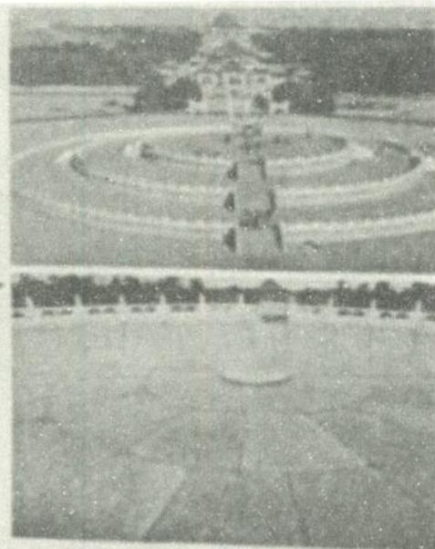

$$
S _ {1} = 9 + 1 8 + \dots + 9 n = \frac {9 n (n + 1)}{2},
$$

中层的扇面形石板数

$$
S _ {2} = 9 (n + 1) + 9 (n + 2) + \dots + 1 8 n = \frac {9 n (3 n + 1)}{2},
$$

下层的扇面形石板数

$$
S _ {3} = 9 (2 n + 1) + 9 (2 n + 2) + \dots + 2 7 n = \frac {9 n (5 n + 1)}{2}.
$$

由题意知 $S_{3}-S_{2}=9n^{2}=729$ ，解得 n=9，所以

$$
S _ {1} + S _ {2} + S _ {3} = 9 (1 + 2 + \dots + 3 n) = \frac {2 7 n (3 n + 1)}{2} = 3 4 0 2.
$$

故三层共有扇面形石板 3402 块, 选 C.

## 5.1.2 数列应用题的常见类型和背景

## (1)能转化为等差、等比数列的应用题

等差、等比数列是数列中的经典,若一个实际问题能转化为等差、等比数列问题,则可以利用等差、等比数列的有关性质快速求解.

例 3 （几何图形问题）长久以来，人们一直认为黄金分割比例是最美的，所以都不约而同地使用黄金分割。如果一个矩形的宽与长的比例是黄金比例 $\frac{\sqrt{5}-1}{2}$ ( $\frac{\sqrt{5}-1}{2}$ ≈ 0.618 称为黄金分割比例)，这样的矩形称为黄金矩形，黄金矩形有一个特点：如果在黄金矩形中不停地分割出最大的正方形,那么余下的部分也依然是黄金矩形,已知图 5.1-1 中最小正方形的边长为 1 ,则矩形 ABCD 的长为( ) (结果保留两位小数). 
A. 10.09 
B. 11.85 
C. 9.85 
D. 11.09

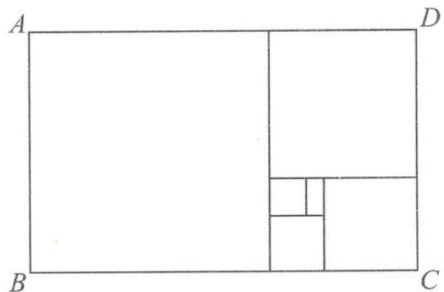  
图5.1-1

解答 如图 5.1-2, 根据题意, 若图中最小正方形的边长为 1, 即 HP = 1, 则在矩形 HPLJ 中,

$$
L P = H J = \frac {1}{\frac {\sqrt {5} - 1}{2}} = \frac {\sqrt {5} + 1}{2},
$$

在矩形 HJIF 中，

$$
H F = \frac {H J}{\frac {\sqrt {5} - 1}{2}} = \left(\frac {\sqrt {5} + 1}{2}\right) ^ {2}.
$$

同理

$$
F C = \left(\frac {\sqrt {5} + 1}{2}\right) ^ {3}, D C = \left(\frac {\sqrt {5} + 1}{2}\right) ^ {4}.
$$

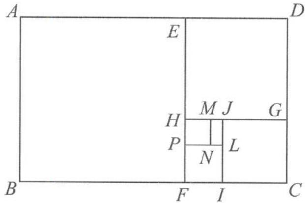  
图5.1-2

则 $BC = \left(\frac{\sqrt{5} + 1}{2}\right)^{5}\approx 11.09.$ 故选D.

例 4 （三角锥垛问题）古希腊毕达哥拉斯学派的“三角形数”是一列点（或圆球）在等距的排列下可以形成正三角形的数，如 1,3,6,10,15,…。我国宋元时期数学家朱世杰在《四元玉鉴》中所记载的“垛积术”，其中的“落一形”堆垛就是每层为“三角形数”的三角锥的锥垛（图 5.1-3，顶上一层有 1 个球，下一层有 3 个球，再下一层有 6 个球，…）。若一“落一形”三角锥垛有 10 层，则该堆垛总共含有球的个数为（）。
A. 55 个
B. 220 个
C. 285 个
D. 385 个

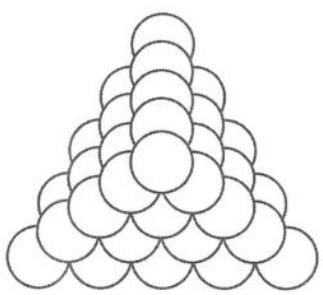  
三角锥垛  
图5.1-3

解答 易得数列 $\{a_{n}\}$ :1,3,6,10,15,…的通项公式为

$$
a _ {n} = \frac {n (1 + n)}{2},
$$

所以

$$
S _ {n} = \frac {1 ^ {2} + 2 ^ {2} + \cdots + n ^ {2}}{2} + \frac {1 + 2 + \cdots + n}{2} = \frac {n (n + 1) (2 n + 1)}{1 2} + \frac {n (1 + n)}{4}.
$$

当 n=10 时, 可得

$$
S _ {1 0} = \frac {1 0 \times 1 1 \times 2 1}{1 2} + \frac {1 0 \times 1 1}{4} = 2 2 0.
$$

故选B.

例 5 （储蓄存款问题）某家庭为准备孩子上大学的学费,每年1月1日在银行中存入2000元,连续5年,有以下两种存款的方式:

(1)如果按五年期零存整取计,即每存入a元按 $a(1+n\times6.5\%)$ 计算本利(n为年数);

(2)如果按每年转存计,即每存入a元,按 $(1+5.7\%)^{n}\times a$ 计算本利(n为年数).

问:用哪种存款的方式存款在第六年的1月2日到期的全部本利较高?

分析 这两种存款的方式区别在于不计复利与计复利,但由于利率不同,最后的本利也不同.复利是一种计算利率的方法,即把前一期的利息和本金加在一起做本金,再计算下一期的利息.设本金为 P,每期利率为 r,本利和为 y,存期为 n,则复利函数式为 $y=P(1+r)^{n}$ .单利是指本金到期后的利息不再加入本金计算.设本金为 P 元,每期利率为 r,经过 n 期,按单利计算的本利和公式为 $S_{n}=P(1+nr)$ .

解答 若不计复利,则 5 年的零存整取本利是

$$
2 0 0 0 \times (1 + 5 \times 0. 0 6 5) + 2 0 0 0 \times (1 + 4 \times 0. 0 6 5) + \dots + 2 0 0 0 \times (1 + 0. 0 6 5) = 1 1 9 5 0 (\text {元});
$$

若计复利,则 5 年的零存整取本利是

$$
2 0 0 0 \times (1 + 0. 0 5 7) ^ {5} + 2 0 0 0 \times (1 + 0. 0 5 7) ^ {4} + \dots + 2 0 0 0 \times (1 + 0. 0 5 7) \approx 1 1 8 6 0 (\text {元}).
$$

所以第一种存款方式到期的全部本利较高.

评注 对于这类问题的求解,关键是要搞清:①是单利还是复利;②存几年.

例 6 （分期付款问题）用分期付款的方式购买一件家用电器，价格为 1150 元。购买当天先支付 150 元，以后每月这一天都支付 50 元，并加付欠款的利息，月利率为 1%。若支付 150 元以后的第一个月开始算分期付款的第一个月，问：

(1)分期付款的第10个月该支付多少钱?

(2)全部货款付清后,买这件家电实际花了多少钱?

解答 (1)购买时支付了 150 元, 欠款 1000 元, 按题意应分 20 次付清欠款. 设每次所付欠款顺次构成数列 $\{a_{n}\}$ , 则

$$
a _ {1} = 5 0 + 1 0 0 0 \times 0. 0 1 = 6 0,
$$

$$
a _ {2} = 5 0 + (1 0 0 0 - 5 0) \times 0. 0 1 = 5 9. 5,
$$

$$
a _ {3} = 5 0 + (1 0 0 0 - 5 0 \times 2) \times 0. 0 1 = 5 9,
$$

$$
a _ {n} = 6 0 - 0. 5 (n - 1),
$$

所以 $\{a_{n}\}$ 是以60为首项，-0.5为公差的等差数列，故

$$
a _ {1 0} = 6 0 - 9 \times 0. 5 = 5 5. 5 (\text {元}).
$$

(2)20 次分期付款总和

$$
S _ {2 0} = \frac {6 0 + 5 0 . 5}{2} \times 2 0 = 1 1 0 5 (\text {元}),
$$

实际付款 $1105+150=1255$ (元).

答: 第 10 个月该支付 55.5 元, 全部付清后实际共支付了 1255 元.

例 7 （减员增效问题）某工厂在 2020 年的“减员增效”中对部分人员实行分流，规定分流人员第一年可以到原单位领取工资的 100%，从第二年起，以后每年只能在原单位按上一年工资的 $\frac{2}{3}$ 领取工资。该厂根据分流人员的技术特长，计划创办新的经济实体，该经济实体预计第一年属投资阶段，第二年每人可获得 b 元收入，从第三年起每人每年的收入可在上一年的基础上递增 50%，如果某人分流前工资收入为每年 a 元，分流后进入新经济实体，第 n 年的收入为 $a_{n}$ 元。

(1) 求 $\{a_{n}\}$ 的通项公式.

(2) 当 $b = \frac{8a}{27}$ 时, 这个人哪一年的收入最少? 最少为多少?

(3) 当 $b \geqslant \frac{3a}{8}$ 时, 是否一定可以保证这个人分流一年后的收入永远超过分流前的年收入? 解答 (1) 由题意得, 当 $n = 1$ 时, $a_1 = a$ ; 当 $n \geqslant 2$ 时,

$$
a _ {n} = a \left(\frac {2}{3}\right) ^ {n - 1} + b \left(\frac {3}{2}\right) ^ {n - 2}.
$$

所以

$$
a _ {n} = \left\{ \begin{array}{l l} a, & n = 1, \\ a \left(\frac {2}{3}\right) ^ {n - 1} + b \left(\frac {3}{2}\right) ^ {n - 2}, & n \geqslant 2. \end{array} \right.
$$

(2)已知 $b=\frac{8a}{27}$ ，当 $n\geqslant2$ 时，

$$
a _ {n} = a \left(\frac {2}{3}\right) ^ {n - 1} + \frac {8 a}{2 7} \left(\frac {3}{2}\right) ^ {n - 2} \geqslant 2 \left[ a \left(\frac {2}{3}\right) ^ {n - 1} \times \frac {8 a}{2 7} \left(\frac {3}{2}\right) ^ {n - 2} \right] ^ {\frac {1}{2}} = \frac {8 a}{9}.
$$

上式的等号成立，当且仅当 $a\left(\frac{2}{3}\right)^{n - 1} = \frac{8a}{27}\left(\frac{3}{2}\right)^{n - 2}$ ，即

$$
\left(\frac {2}{3}\right) ^ {2 n - 2} = \left(\frac {2}{3}\right) ^ {4},
$$

解得

$$
n = 3.
$$

因此,这个人第三年的收入最少,为 $\frac{8a}{9}$ 元.

(3) 当 $n \geqslant 2$ 时，

$$
a _ {n} = a \left(\frac {2}{3}\right) ^ {n - 1} + b \left(\frac {3}{2}\right) ^ {n - 2} \geqslant a \left(\frac {2}{3}\right) ^ {n - 1} + \frac {3 a}{8} \left(\frac {3}{2}\right) ^ {n - 2} \geqslant 2 \sqrt {a \left(\frac {2}{3}\right) ^ {n - 1} \times \frac {3 a}{8} \left(\frac {3}{2}\right) ^ {n - 2}} = a.
$$

上式等号成立，须 $b = \frac{3a}{8}$ 且 $n = 1 + \log_{\frac{2}{3}}\frac{1}{2} >1 + \log_{\frac{2}{3}}\frac{2}{3} = 2.$ 因此，等号不能取到.

当 $b \geqslant \frac{3a}{8}$ 时, 这个人分流一年后的收入永远超过分流前的年收入.

(2)能转化为 $a_{n} - a_{n - 1} = f(n)$ 结构的应用题

在一些数列应用题的递推关系式中， $a_{n}$ 与 $a_{n - 1}$ 的差（或商）不是一个常数，但是所得的差 $f(n)$ 本身构成一个等差或等比数列，这在一定程度上增加了递推的难度.

例 8 （广告收益问题）某产品具有一定的时效性,在这个时效期内,由市场调查可知,在不做广告宣传且每件获利 a 元的前提下,可卖出 b 件.若做广告宣传,广告费为 n 千元时比广告费为 $(n-1)$ 千元时多卖出 $\frac{b}{2^{n}}$ 件,其中 $n \in N^{*}$ .

(1)试写出销售量 s 关于 n 的函数关系式.

(2) 当 $a = 10, b = 4000$ 时, 厂家应生产多少件这种产品, 做多少钱的广告, 才能获利最大?

分析 对于(1)中的函数关系,设广告费为 n 千元时的销量为 $s_{n}$ , 则 $s_{n-1}$ 表示广告费为 $(n-1)$ 元时的销量. 由题意, $s_{n}-s_{n-1}=\frac{b}{2^{n}}$ , 可知数列 $\{s_{n}\}$ 不构成等差数列, 也不构成等比数列, 但是两者的差 $\frac{b}{2^{n}}$ 构成等比数列, 对于这类问题一般有两种方法求解.

解答 (1)解法一:(直接列式)由题意知

$$
s = b + \frac {b}{2} + \frac {b}{2 ^ {2}} + \frac {b}{2 ^ {3}} + \dots + \frac {b}{2 ^ {n}} = b \left(2 - \frac {1}{2 ^ {n}}\right).
$$

解法二:(累加法)设 $s_{0}$ 表示广告费为 0 千元时的销售量,由题意知

$$
\left\{ \begin{array}{l} s _ {1} - s _ {0} = \frac {b}{2}, \\ s _ {2} - s _ {1} = \frac {b}{2 ^ {2}}, \\ \dots \\ s _ {n} - s _ {n - 1} = \frac {b}{2 ^ {n}}, \end{array} \right.
$$

累加得

$$
s _ {n} - s _ {0} = \frac {b}{2} + \frac {b}{2 ^ {2}} + \frac {b}{2 ^ {3}} + \dots + \frac {b}{2 ^ {n}},
$$

即

$$
s = b + \frac {b}{2} + \frac {b}{2 ^ {2}} + \frac {b}{2 ^ {3}} + \dots + \frac {b}{2 ^ {n}} = b \left(2 - \frac {1}{2 ^ {n}}\right).
$$

(2) 当 $b = 4000$ 时, $s = 4000\left(2 - \frac{1}{2^n}\right)$ . 设获利为 $t$ , 则有

$$
t = 1 0 s - 1 0 0 0 n = 4 0 0 0 0 \left(2 - \frac {1}{2 ^ {n}}\right) - 1 0 0 0 n.
$$

欲使 $T_{n}$ 最大，则 $\left\{ \begin{array}{l} T_{n} \geqslant T_{n+1}, \\ T_{n} \geqslant T_{n-1}, \end{array} \right.$ 得 $\left\{ \begin{array}{l} n \geqslant 5, \\ n \leqslant 5, \end{array} \right.$ 故 $n = 5$ 。此时 $s = 7875$ 。

即该厂家应生产 7875 件产品, 做 5000 元的广告, 能使获利最大.

## 5.1.3 能转化为 $a_{n} = C \cdot a_{n-1} + B$ 结构的应用题(其中 $B, C$ 为非零常数且 $C \neq 1$ )

例 9 （生产规划问题）某企业投资 1000 万元于一个高科技项目, 每年可获利 25%, 由于企业间竞争激烈, 每年底需要从利润中取出 200 万元进行科研、技术改造与广告投入, 方能保持原有的利润增长率. 问: 经过多少年后, 该项目的资金可以达到或超过翻两番 (4 倍) 的目标? (lg 2≈0.3)

分析 设经过 $n$ 年后, 该项目的资金为 $a_{n}$ 万元, 则容易得到前、后两年 $a_{n}$ 和 $a_{n-1}$ 之间的递推关系式: $a_{n} = a_{n-1}(1 + 25\%) - 200 (n \geqslant 2)$ . 对于这类问题的具体求解, 一般可利用待定系数法.

解答 由题意知 $a_{n} = a_{n - 1}(1 + 25\%) - 200(n \geqslant 2)$ , 即

$$
a _ {n} = \frac {5}{4} a _ {n - 1} - 2 0 0.
$$

设

$$
a _ {n} + \lambda = \frac {5}{4} (a _ {n - 1} + \lambda),
$$

展开得

$$
a _ {n} = \frac {5}{4} a _ {n - 1} + \frac {1}{4} \lambda .
$$

对比系数可知 $\frac{1}{4}\lambda = -200, \lambda = -800$ ，所以

$$
a _ {n} - 8 0 0 = \frac {5}{4} (a _ {n - 1} - 8 0 0).
$$

故 $\{a_{n} - 800\}$ 是一个等比数列， $a_{1} = 1000 \times (1 + 25\%) - 200 = 1050, a_{1} - 800 = 250$ ，所以 $a_{n} - 800 = 250 \times \left(\frac{5}{4}\right)^{n - 1}$ ，即

$$
a _ {n} = 2 5 0 \times \left(\frac {5}{4}\right) ^ {n - 1} + 8 0 0.
$$

令 $a_{n} \geqslant 4000$ ，得 $\left(\frac{5}{4}\right)^n \geqslant 16$ ，解得 $n \geqslant 13$ 。即至少要过13年才能达到目标。

例 10 （车辆控制问题）某城市 2020 年末汽车保有量为 30 万辆, 预计此后每年报废上年末汽车保有量的 6%, 并且每年新增汽车数量相同. 为保护城市环境, 要求该城市汽车保有量不超过 60 万辆, 那么每年新增汽车数量不应超过多少辆?

分析 由“每年报废上年末汽车保有量的 $6\%$ ，并且每年新增汽车数量相同”易得该城市

每年末汽车保有量与上年末汽车保有量的关系,于是可构造数列递推关系式求解.

解答 设每年新增汽车 $b$ 万辆, 该城市第 $n$ 年末的汽车保有量为 $a_{n}$ , 则容易得到 $a_{n}$ 和 $a_{n-1}$ 的递推关系式

$$
a _ {n} = (1 - 6 \%) a _ {n - 1} + b = 0. 9 4 a _ {n - 1} + b (n \geqslant 2),
$$

即

$$
a _ {n} - \frac {5 0}{3} b = 0. 9 4 \times \left(a _ {n - 1} - \frac {5 0}{3} b\right).
$$

所以 $\left\{a_{n} - \frac{50}{3} b\right\}$ 是以0.94为公比， $30 - \frac{50}{3} b$ 为首项的等比数列. 所以 $a_{n} - \frac{50}{3} b = (30 - \frac{50}{3} b) \times 0.94^{n-1}$ ，即

$$
a _ {n} = \frac {5 0}{3} b + \left(3 0 - \frac {5 0}{3} b\right) \times 0. 9 4 ^ {n - 1}.
$$

①当 $30 - \frac{50}{3} b \geqslant 0$ ，即 $b \leqslant 1.8$ 时，

$$
a _ {n} \leqslant a _ {n - 1} \leqslant \dots \leqslant a _ {1} = 3 0.
$$

②当 $30 - \frac{50}{3}b < 0$ ，即 b > 1.8 时，

$$
\lim _ {n \to \infty} a _ {n} = \lim _ {n \to \infty} \left[ \frac {5 0}{3} b + \left(3 0 - \frac {5 0}{3} b\right) \times 0. 9 4 ^ {n - 1} \right] = \frac {5 0}{3} b,
$$

并且数列 $\{a_{n}\}$ 为递增数列,可以任意接近 $\frac{50}{3}b$ .因此,如果要求汽车保有量不超过60万辆,即 $a_{n}\leqslant60(n=1,2,3,\cdots)$ ,则 $\frac{50}{3}b\leqslant60$ ,即 $b\leqslant3.6$ (万辆).

综上,每年新增汽车不应超过3.6万辆.

例 11 （建筑砌墙问题）用砖砌墙，第一层用去了全部砖块的一半多一块，第二层用去了剩下的一半多一块，…以此类推，每一层都用去了上次剩下砖块的一半多一块，到第 10 层恰好把砖块用完，则此次砌墙一共用了多少块砖？

分析 因每一层都用去了上次剩下砖块的一半多一块, 即每一层剩下砖块是上次剩下砖块的一半少一块, 于是可用数列的递推关系式求解.

解答 设此次砌墙一共用了 S 块砖, 砌好第 n 层后剩下砖块为 $a_{n}$ 块 ( $1 \leqslant n \leqslant 10, n \in N^{*}$ ), 则 $a_{n} = \frac{a_{n-1}}{2} - 1$ , 即

$$
a _ {n} + 2 = \frac {1}{2} (a _ {n - 1} + 2).
$$

所以 $\{a_{n} + 2\}$ 为等比数列，且公比为 $\frac{1}{2}$ . 由题意得 $a_{1} = \frac{S}{2} - 1$ ，所以

$$
a _ {1} + 2 = \frac {S}{2} + 1,
$$

所以 $a_{n} + 2 = \left(\frac{S}{2} +1\right)\times \left(\frac{1}{2}\right)^{n - 1}$ ，即

$$
a _ {n} = \left(\frac {S}{2} + 1\right) \times \left(\frac {1}{2}\right) ^ {n - 1} - 2.
$$

因为 $a_{10} = 0$ ，所以

$$
\left(\frac {S}{2} + 1\right) \times \left(\frac {1}{2}\right) ^ {9} - 2 = 0,
$$

解得

$$
S = 2 ^ {1 1} - 2 = 2 0 4 6.
$$

(4)能转化为两个(或多个)数列关系的应用题

例 12 （溶液浓度问题）甲、乙两个容器中分别盛有浓度为 10%, 20% 的某种溶液 500ml, 同时从甲、乙两个容器中取出 100ml 溶液, 将其倒入对方的容器并搅匀, 这称为一次调和. 记 $a_{1} = 10\%$ , $b_{1} = 20\%$ , 经 $(n - 1)$ 次调和后, 甲、乙两个容器的溶液浓度分别为 $a_{n}, b_{n}$ .

(1)试用 $a_{n-1},b_{n-1}$ 表示 $a_{n},b_{n}$ .

(2) 证明: 数列 $\{a_{n}-b_{n}\}$ 是等比数列, 并求出 $a_{n}, b_{n}$ 的通项.

分析 该问题涉及两个不同的数列 $a_{n}$ 和 $b_{n}$ , 且这两者之间有制约关系, 所以不能单独地考虑某一个数列, 应该把两个数列联系起来.

解答 (1)由题意

$$
a _ {n} = \frac {4 0 0 a _ {n - 1} + 1 0 0 b _ {n - 1}}{5 0 0} = \frac {4}{5} a _ {n - 1} + \frac {1}{5} b _ {n - 1},
$$

$$
b _ {n} = \frac {4 0 0 b _ {n - 1} + 1 0 0 a _ {n - 1}}{5 0 0} = \frac {4}{5} b _ {n - 1} + \frac {1}{5} a _ {n - 1}.
$$

(2)由(1)可得

$$
a _ {n} - b _ {n} = \frac {3}{5} a _ {n - 1} - \frac {3}{5} b _ {n - 1} = \frac {3}{5} (a _ {n - 1} - b _ {n - 1}) (n \geqslant 2),
$$

所以 $\{a_{n} - b_{n}\}$ 是等比数列. 因为 $a_{1} - b_{1} = -10\%$ ，所以

$$
a _ {n} - b _ {n} = - 10\% \times \left(\frac {3}{5}\right) ^ {n - 1} \quad ①.
$$

又因为

$$
a _ {n} + b _ {n} = a _ {n - 1} + b _ {n - 1} = \dots = a _ {1} + b _ {1} = 30 \% \quad ②.
$$

联立①②得

$$
a _ {n} = - \left(\frac {3}{5}\right) ^ {n - 1} \times 5 \% + 15 \%,
$$

$$
b _ {n} = \left(\frac {3}{5}\right) ^ {n - 1} \times 5 \% + 15 \%.
$$

例 13 （河水含沙问题）现有流量均为 $300 \, m^{2}/s$ 的两条河流 A 和 B，汇合于某处后不断混合，它们的含沙量分别为 $2 \, kg/m^{3}$ 和 $0.2 \, kg/m^{3}$ . 假设从汇合处开始，沿岸设有若干个观测点，两股水流在流经相邻两个观测点的过程中，其混合效果相当于两股水流在 $1 \, s$ 内交换 $100 \, m^{3}$ 的水量，即从 A 河流入 B 河 $100 \, m^{3}$ 水. 经混合后，又从 B 河流入 A 河 $100 \, m^{3}$ 水并混合. 问：从第几个观测点开始，两条河中水的含沙量之差小于 $0.01 \, kg/m^{3}$ ? (不考虑泥沙沉淀)

分析 本题的不等关系为“两股河水的含沙量之差小于 $0.01 \mathrm{~kg} / \mathrm{m}^{3}$ ”，但直接建构这样的不等关系式较为困难。为表达方便，我们分别用 $a_{n}, b_{n}$ 表示河水在流经第 $n$ 个观测点时， $A$ 和 $B$ 的含沙量，然后根据题设条件写出两个数列的相互关系并进行求解。

解答 设 $a_{n}$ 和 $b_{n}$ 分别表示河水在流经第 $n$ 个观测点时, 河流 $A$ 和 $B$ 的含沙量, 则 $a_{1} = 2 \mathrm{~kg} / \mathrm{m}^{3}, b_{1} = 0.2 \mathrm{~kg} / \mathrm{m}^{3}$ , 且

$$
b _ {n + 1} = \frac {1 0 0 a _ {n} + 3 0 0 b _ {n}}{1 0 0 + 3 0 0} = \frac {1}{4} a _ {n} + \frac {3}{4} b _ {n}, \quad a _ {n + 1} = \frac {1 0 0 b _ {n + 1} + 2 0 0 a _ {n}}{1 0 0 + 2 0 0} = \frac {1}{3} b _ {n + 1} + \frac {2}{3} a _ {n} \quad (*).
$$

由于题目中的问题是针对两条河中水的含沙量之差,我们不妨直接考虑数列 $\{a_{n}-b_{n}\}$ .由(\*)式可得

$$
a _ {n + 1} - b _ {n + 1} = \left(\frac {1}{3} b _ {n + 1} + \frac {2}{3} a _ {n}\right) - b _ {n + 1} = \frac {2}{3} (a _ {n} - b _ {n + 1}) = \frac {2}{3} \left[ a _ {n} - \left(\frac {1}{4} a _ {n} + \frac {3}{4} b _ {n}\right) \right] = \frac {1}{2} (a _ {n} - b _ {n}).
$$

所以数列 $\{a_{n} - b_{n}\}$ 是以 $a_1 - b_1 = 1.8$ 为首项， $\frac{1}{2}$ 为公比的等比数列。所以

$$
a _ {n} - b _ {n} = 1. 8 \times \left(\frac {1}{2}\right) ^ {n - 1}.
$$

令 $a_{n} - b_{n} < 0.01$ ，得 $\left(\frac{1}{2}\right)^{n - 1} < \frac{1}{180}$ 所以

$$
n - 1 > \frac {\lg 1 8 0}{\lg 2} = \log_ {2} 1 8 0.
$$

由 $2^{7}<180<2^{8}$ 得 $7<\log_{2}180<8$ ，所以

$$
n > 8.
$$

即从第 9 个观测点开始,两条河中水的含沙量之差小于 $0.01 \, kg/m^{3}$ .

评注 本题为数列、不等式综合应用问题,难点在于对题意的理解.

(5)能转化为综合数列问题的应用题

例 14 （建筑成本问题）某单位为了解决职工的住房问题，计划征用一块土地盖一幢总建筑面积为 30000 平方米的宿舍楼（每层的建筑面积相同）。已知土地的征用费为 2250 元/平方米，土地的征用面积为第一层的 1.5 倍。经工程技术人员核算，第一层的建筑费用为 400 元/平方米，以后每增高一层，该层建筑费用就增加 30 元/平方米。试设计这幢宿舍楼的楼层数，使总费用最少，并求出其最少费用。（总费用为建筑费用和征地费用之和）。

解答 设楼高为 n 层, 总费用为 y 万元, 则征地面积为 $\frac{1.5 \times 30000}{n}$ (平方米), 征地费用为

$2250 \times \frac{1.5 \times 3}{n}$ 万元, 各楼层建筑费用和为 $\left[400n + \frac{n(n - 1)}{2} \times 30\right] \times \frac{3}{n}$ 万元, 总费用为

$$
y = \left[ 4 0 0 n + \frac {n (n - 1)}{2} \times 3 0 \right] \times \frac {3}{n} + 2 2 5 0 \times \frac {1 . 5 \times 3}{n} = 1 5 \times \left(3 n + \frac {6 7 5}{n} + 7 7\right)
$$

$$
\geqslant 1 5 \times \left(2 \sqrt {3 n \times \frac {6 7 5}{n} + 7 7}\right) = 2 5 0 5 (\text {万元}).
$$

当且仅当 $3n = \frac{675}{n}$ , 即 $n = 15$ 时, 上式取等号. 所以, 当这幢宿舍楼楼层数为 15 时, 总费用最少为 2505 万元.

例 15 （设备改造问题）某企业 2020 年的纯利润为 500 万元, 因设备老化等原因, 企业的生产能力将逐年下降. 若不进行技术改造, 预测从 2021 年起每年比上一年的纯利润减少 20 万元. 2021 年初该企业一次性投入资金 600 万元进行技术改造, 预测在未扣除技术改造资金的情况下, 第 n 年 (2021 年为第 1 年) 的利润为 $500\left(1+\frac{1}{2^{n}}\right)$ 万元 (n 为正整数).

(1)设从 2021 年起的前 n 年中,若该企业不进行技术改造的累计纯利润为 $A_{n}$ 万元,进行技术改造后的累计纯利润为 $B_{n}$ 万元(须扣除技术改造资金),求 $A_{n}, B_{n}$ 的表达式.

(2)依上述预测,从2021年起该企业至少经过多少年,进行技术改造后的累计纯利润超过不进行技术改造的累计纯利润?

解答 (1)依题意得

$$
A _ {n} = (5 0 0 - 2 0) + (5 0 0 - 4 0) + \dots + (5 0 0 - 2 0 n) = 4 9 0 n - 1 0 n ^ {2},
$$

$$
B _ {n} = 5 0 0 \left[ \left(1 + \frac {1}{2}\right) + \left(1 + \frac {1}{2 ^ {2}}\right) + \dots + \left(1 + \frac {1}{2 ^ {n}}\right) \right] - 6 0 0 = 5 0 0 n - \frac {5 0 0}{2 ^ {n}} - 1 0 0.
$$

(2)由(1)得

$$
\begin{array}{r l} B _ {n} - A _ {n} & = \left(5 0 0 n - \frac {5 0 0}{2 ^ {n}} - 1 0 0\right) - (4 9 0 n - 1 0 n ^ {2}) = 1 0 n ^ {2} + 1 0 n - \frac {5 0 0}{2 ^ {n}} - 1 0 0 \\ & = 1 0 \left[ n (n + 1) - \frac {5 0}{2 ^ {n}} - 1 0 \right]. \end{array}
$$

函数 $y = x(x + 1) - \frac{50}{2^x} - 10$ 在 $(0, +\infty)$ 上为增函数，当 $1 \leqslant n \leqslant 3$ 时，

$$
n (n + 1) - \frac {5 0}{2 ^ {n}} - 1 0 \leqslant 1 2 - \frac {5 0}{8} - 1 0 <   0;
$$

当 $n \geqslant 4$ 时，

$$
n (n + 1) - \frac {5 0}{2 ^ {n}} - 1 0 \geqslant 2 0 - \frac {5 0}{1 6} - 1 0 > 0.
$$

所以，当 $n \geqslant 4$ 时， $B_n > A_n$ .

答: 至少经过 4 年, 该企业进行技术改造后的累计纯利润超过不进行技术改造的累计纯利润.

## 思考题

1. 某城市预计 2021 年底人口为 500 万, 人均住房面积为 6 平方米, 如果该城市每年人口平均增长率为 $1\%$ , 每年平均新增住房面积为 30 万平方米, 求 2030 年底该城市人均住房面积为多少平方米? (精确到 0.01)

2. 银行按规定每经过一定的时间结算一次存(贷)款的利息, 结算后即将利息并入本金, 这种计算利息的方法叫作复利. 某企业进行技术改造, 有两种方案:

甲方案:一次性贷款10万元,第一年便可获得利润1万元,以后每年比上年增加30%的利润;

乙方案:每年贷款1万元,第一年可获得利润1万元,以后每年比前一年多获利5000元.

两种方案的期限都是 10 年, 到期一次性归还本息. 若银行贷款利息均以年息 10% 的复利计算, 试比较两种方案哪个获得纯利润更多? (计算精确到千元, 参考数据: $1.1^{10} \approx 2.594$ , $1.3^{10} \approx 13.786$ )

3. 某人向银行贷款 10 万元用于买房.

(1)如果他向 A 银行贷款,年利率为 5%,且这笔借款分 10 次等额归还(不计复利),每年一次,并从借后次年年初开始归还,问:每年应还多少元?(精确到 1 元)

(2)如果他向 B 银行贷款,年利率为 4%,要按复利计算(即本年的利息计入次年的本金生息),仍分 10 次等额归还,每年一次,每年应还多少元?(精确到 1 元)

4. 从盛有盐的质量分数为 $20 \%$ 的盐水 $2 \mathrm{~kg}$ 的容器中倒出 $1 \mathrm{~kg}$ 盐水, 然后加入 $1 \mathrm{~kg}$ 清水. 以后每次都倒出 $1 \mathrm{~kg}$ 盐水, 然后加入 $1 \mathrm{~kg}$ 清水. 问:

(1)第5次倒出的 $1 \mathrm{~kg}$ 盐水中含盐多少?

(2)经6次倒出后,一共倒出多少盐? 此时加 $1 \mathrm{~kg}$ 清水后容器内盐水的质量分数为多少?

5. 公民在就业的第一年就缴纳养老储备金 $a_1$ , 以后每年缴纳的数目均比上一年增加 $d(d > 0)$ , 历年所缴纳的储备金数目 $a_1, a_2, \cdots$ 是一个公差为 $d$ 的等差数列. 与此同时, 国家给予优惠的计息政策, 不仅采用固定利率, 而且计算复利. 如果固定年利率为 $r (r > 0)$ , 那么, 在第 $n$ 年末, 第一年所缴纳的储备金就变为 $a_1 (1 + r)^{n-1}$ , 第二年所缴纳的储备金就变为 $a_2 (1 + r)^{n-2}$ , $\cdots$ . 以 $T_n$ 表示到第 $n$ 年末所累计的储备金总额, 证明: $T_n = A_n + B_n$ , 其中 $\{A_n\}$ 是一个等比数列, $\{B_n\}$ 是一个等差数列.

6. 某电视频道在一天内有 $x$ 次插播广告的时段, 一共播放了 $y$ 条广告, 第一次播放了 1 条以及余下的 $y - 1$ 条的 $\frac{1}{8}$ , 第 2 次播放了 2 条以及余下的 $\frac{1}{8}$ , 第 3 次播放了 3 条以及余下的 $\frac{1}{8}$ , 以后每次按此规律插播广告, 在第 $x (x > 1)$ 次播放了余下的 $x$ 条.

(1)设第 $k$ 次播放后余下 $a_{k}$ 条，这里 $a_0 = y, a_x = 0$ ，求 $a_{k}$ 与 $a_{k-1}$ 的递推关系式.

(2)求这家电视台这一天播放广告的时段 x 与广告的条数 y.

7. 某校有教职工 150 人,为了丰富教职工的课余生活,每天定时开放健身房和娱乐室.据调查统计,每次去健身房的人有 10% 下次去娱乐室,而在娱乐室的人有 20% 下次去健身房.请问:随着时间的推移,去健身房的人数能否趋于稳定?

8. 据报道,我国森林覆盖率逐年提高.某林场去年底森林木材储存量为 $a$ 立方米,若树林以每年 $25\%$ 的增长率生长,计划从今年起,每年冬天要砍伐的木材量为 $x$ 立方米,为了实现经过 20 年木材储存量翻两番的目标,问:每年砍伐的木材量 $x$ 的最大值是多少?

9. 某地区 2020 年底有居民住房面积为 $a$ , 现在居民住房划分为三类, 其中危旧住房占 $\frac{1}{3}$ , 新型住房占 $\frac{1}{4}$ . 为加快住房建设, 计划用 10 年的时间全部拆除危旧住房 (每年拆除的数量相同), 自 2021 年起居民住房只建设新型住房. 从 2021 年开始每年年底的新型住房面积都比上一年底增加 $20\%$ , 用 $a_{n}$ 表示第 $n$ 年底 (2021 年为第一年) 该地区的居民住房总面积.

(1) 分别写出 $a_1, a_2, a_3$ 的表达式并归纳出 $a_n$ 的计算公式 (不必证明).

(2)危旧住房全部拆除后,至少再过多少年才能使该地区居民住房总面积翻两番?(精确到年, $\lg 2\approx0.30,\lg 3\approx0.48,\lg 43\approx1.63$ )

10. 流行性感冒(简称流感)是由流感病毒引起的急性呼吸道传染病。某市前年11月份曾发生流感,据资料记载,11月1日,该市新的流感病毒感染者有20人,此后,每天的新感染者比前一天的新感染者平均增加50人。由于该市医疗部门采取措施,使该种病毒的传播得到控制,从某天起,每天的新感染者比前一天的新感染者平均减少30人,到11月30日,该市在这30天内感染该病毒的患者共有8670人。问:11月几日,该市感染此病毒的新患者人数最多?求这一天的新患者人数。

11. 某地区森林原有木材存量为 $a$ ，且每年的增长率为 $25\%$ ，因生产建设需要，每年年底要砍伐的木材量为 $b$ ，设 $a_{n}$ 为 $n$ 年后该地区森林木材的存量。

(1) 求 $a_{n}$ 的表达式.

(2)为保护生态环境,防止水土流失,该地区每年的森林木材存量不少于 $\frac{7}{9}a$ ,如果 $b=\frac{19a}{72}$ ,
那么该地区今后会发生水土流失吗？若会，需要经过几年？（参考数据： $\lg 2\approx0.3$ ）

## 5.2 数列综合题,探究有乐趣

## 5.2.1 数列与简单的数论问题

数列综合问题中常常会有一些简单的数论问题,比较常见的是整数和整除问题等.

例 1 在各项均为正偶数的数列 $a_{1}, a_{2}, a_{3}, a_{4}$ 中, 已知前三项成公差为 $d(d > 0)$ 的等差数列, 后三项成公比为 q 的等比数列. 若 $a_{4} - a_{1} = 88$ , 则 q = \_\_\_\_.

解答 已知 $a_1, a_2, a_3, a_4$ 为正偶数，可设

$$
a _ {1} = 2 m (m \in \mathbf {N} ^ {*}), d = 2 k (k \in \mathbf {N} ^ {*}).
$$

由题意得

$$
a _ {4} = \frac {(a _ {1} + 4 k) ^ {2}}{a _ {1} + 2 k}, a _ {4} - a _ {1} = \frac {(a _ {1} + 4 k) ^ {2}}{a _ {1} + 2 k} - a _ {1} = 8 8,
$$

整理得 $(3m + 4k)k = 44(m + k)$ ，即

$$
m = \frac {4 k (1 1 - k)}{3 k - 4 4}.
$$

因为 $m > 0$ ，所以

$$
1 2 \leqslant k \leqslant 1 4.
$$

检验知

$$
k = 1 2, m = 6, q = \frac {5}{3} \text {或} k = 1 4, m = 8 4, q = \frac {8}{7}.
$$

综上可得 $q=\frac{5}{3}$ 或 $\frac{8}{7}$ .

例2 若集合 $A = \{(m, n) | (m+1) + (m+2) + \cdots + (m+n) = 10^{2021}, m \in \mathbb{N}, n \in \mathbb{N}^*\}$ , 则集合 $A$ 中的元素有( ). A. 1011个 B. 2021个 C. 2022个 D. 2023个

解答 由题意可得

$$
(m + 1) + (m + 2) + \dots + (m + n) = \frac {[ (m + 1) + (m + n) ] n}{2} = 1 0 ^ {2 0 2 1},
$$

即

$$
(n + 2 m + 1) n = 2 ^ {2 0 2 2} \times 5 ^ {2 0 2 1}.
$$

注意到 $n + 2m + 1, n$ 必为一奇一偶，且 $n + 2m + 1 > n.$ 而 $2^{2022} \times 5^{2021}$ 分解为一奇一偶的情况共有2022种：

$$
(2 ^ {2 0 2 2}) \times 5 ^ {2 0 2 1} = (2 ^ {2 0 2 2} \times 5) \times 5 ^ {2 0 2 0} = (2 ^ {2 0 2 2} \times 5 ^ {2}) \times 5 ^ {2 0 1 9} = \dots = (2 ^ {2 0 2 2} \times 5 ^ {2 0 2 1}) \times 5 ^ {0},
$$

所以集合 A 中的元素个数为 2022 个.

故选C.

例 3 设 $a_{1}, a_{2}, \cdots, a_{2022}$ 是正整数 $1, 2, \cdots, 2022$ 的一个排列，记 $S_{k} = a_{1} + a_{2} + \cdots + a_{k} (k = 1, 2, \cdots, 2022)$ ，则 $S_{1}, S_{2}, \cdots, S_{2022}$ 中奇数个数的最大值为 \_\_\_\_。

解答 若 $a_{i}(2 \leqslant i \leqslant 2022)$ 为奇数，则 $S_{i}$ 与 $S_{i-1}$ 有不同的奇偶性，从 $a_{2}$ 到 $a_{2022}$ 中至少有 1011 - 1 = 1010 个奇数，从而在 $S_{1}, S_{2}, \cdots, S_{2014}$ 中至少要改变 1010 次奇偶性，所以 $S_{1}, S_{2}, \cdots, S_{2022}$ 中至少有 505 个偶数，即最多有 2022 - 505 = 1517 个奇数。

下面构造一种情形,使得最多能达到 1517 个奇数.

取

$$
a _ {1} = 1, a _ {2} = 3, \dots , a _ {1 0 1 1} = 2 0 2 1, a _ {1 0 1 2} = 2, a _ {1 0 1 3} = 4, \dots , a _ {2 0 2 2} = 2 0 2 2,
$$

则 $S_{1}, S_{3}, \cdots, S_{1011}$ 以及 $S_{1012} \sim S_{2022}$ 均为奇数，所以共有 $\frac{1012}{2} + 1011 = 1517$ 个奇数.

综上可知： $S_{1}, S_{2}, \cdots, S_{2022}$ 中奇数个数的最大值为 1517.

例 4 设 $a_{n}$ 为最接近 $\sqrt[4]{n}$ 的整数，则 $\sum_{k=1}^{2020}\frac{1}{a_{k}}=$ \_\_\_\_.

解答 设 $a_{k} = m$ ，则有

$$
\left(m - \frac {1}{2}\right) ^ {4} <   k <   \left(m + \frac {1}{2}\right) ^ {4}.
$$

因为

$$
\left(m + \frac {1}{2}\right) ^ {4} - \left(m - \frac {1}{2}\right) ^ {4} = 4 m ^ {3} + m,
$$

所以，使得 $a_{k} = m$ 的 $k$ 有 $m(4m^{2} + 1)$ 个.注意到 $6^{4} < 2020 < 7^{4}$ ，从而

$$
a _ {2 0 2 0} = 6 \text {或} 7.
$$

又因为

$$
\sum_ {m = 1} ^ {6} m (4 m ^ {2} + 1) = 1 7 8 5 <   2 0 2 0,
$$

所以 $a_{1786}=a_{1787}=\cdots=a_{2020}=7$ ，所以

$$
\sum_ {k = 1} ^ {2 0 2 0} \frac {1}{a _ {k}} = \sum_ {m = 1} ^ {6} \frac {m (4 m ^ {2} + 1)}{m} + \frac {2 0 2 0 - 1 7 8 5}{7} = \sum_ {m = 1} ^ {6} (4 m ^ {2} + 1) + \frac {2 3 5}{7} = \frac {2 8 2 5}{7}.
$$

## 5.2.2 数列与绝对值、方程等问题

例 5 已知 $a_{i}(i=1,2,3,\cdots,2021)$ 为 2021 个实数，满足 $a_{1}+a_{2}+a_{3}+\cdots+a_{2021}=0$ ，且 $\left|a_{1}-2a_{2}\right|=\left|a_{2}-2a_{3}\right|=\cdots=\left|a_{2021}-2a_{1}\right|$ ，证明： $a_{1}=a_{2}=a_{3}=\cdots=a_{2021}=0$ 。

证明 设 $\left|a_{1}-2a_{2}\right|=\left|a_{2}-2a_{3}\right|=\cdots=\left|a_{2021}-2a_{1}\right|=k.$

①若 k=0，则

$$
a _ {1} = 2 a _ {2}, a _ {2} = 2 a _ {3}, \dots , a _ {2 0 2 0} = 2 a _ {2 0 2 1}, a _ {2 0 2 1} = 2 a _ {1}.
$$

于是

$$
a _ {1} + a _ {2} + a _ {3} + \dots + a _ {2 0 2 1} = a _ {1} + \frac {a _ {1}}{2} + \frac {a _ {1}}{2 ^ {2}} + \dots + \frac {a _ {1}}{2 ^ {2 0 1 9}} + 2 a _ {1} = 0,
$$

所以 $a_1 = 0$ ，进而

$$
a _ {1} = a _ {2} = a _ {3} = \dots = a _ {2 0 2 1} = 0.
$$

②若 k>0，则 $\left|a_{1}-2a_{2}\right|$ ， $\left|a_{2}-2a_{3}\right|$ ， $\cdots$ ， $\left|a_{2021}-2a_{1}\right|$ 这 2021 个数去掉绝对值符号后只能取 k 和 -k 两个值。又

$$
a _ {1} - 2 a _ {2} + a _ {2} - 2 a _ {3} + \dots + a _ {2 0 2 0} - 2 a _ {2 0 2 1} + a _ {2 0 2 1} - 2 a _ {1} = 0,
$$

即这 2021 个数去掉绝对值符号后取 k 和 -k 两个值的个数相同, 这不可能.

综上可得

$$
a _ {1} = a _ {2} = a _ {3} = \dots = a _ {2 0 2 1} = 0.
$$

例 6 是否存在 2019 个实数 $a_{1}, a_{2}, \cdots, a_{2019}$ 同时满足：

① $\left|a_{i}\right|<1(i=1,2,\cdots,2019)$ ; ② $\sum_{i=1}^{2019}\left|a_{i}\right|-\left|\sum_{i=1}^{2019}a_{i}\right|=2018?$

若存在,请举出实例;若不存在,请说明理由.

解答 假设存在这样的实数 $a_{1}, a_{2}, \cdots, a_{2019}$ ，则其中必有一些数小于 0，也必有一些数不小于 0；否则，有

$$
\sum_ {i = 1} ^ {2 0 1 9} | a _ {i} | - | \sum_ {i = 1} ^ {2 0 1 9} a _ {i} | = 0 \neq 2 0 1 8.
$$

不妨设

$$
a _ {1}, a _ {2}, \dots , a _ {k} \geqslant 0, a _ {k + 1}, a _ {k + 2}, \dots , a _ {2 0 1 9} <   0,
$$

其中 $1 \leqslant k < 2019$ . 记

$$
\sum_ {i = 1} ^ {k} a _ {i} = x, \sum_ {j = k + 1} ^ {2 0 1 9} | a _ {j} | = y,
$$

为方便起见还可设 $x \geqslant y$ (否则用 $-a_{i}$ 代替 $a_{i}$ 即可). 于是, 我们有

$$
\sum_ {i = 1} ^ {2 0 1 9} | a _ {i} | = x + y, \left| \sum_ {i = 1} ^ {2 0 1 9} a _ {i} \right| = x - y.
$$

因为

$$
\sum_ {i = 1} ^ {2 0 1 9} | a _ {i} | - | \sum_ {i = 1} ^ {2 0 1 9} a _ {i} | = 2 0 1 8,
$$

所以

$$
y = 1 0 0 9, x \geqslant 1 0 0 9.
$$

再由(1)可知,对 $1 \leqslant i \leqslant k$ 有 $0 < a_{i} < 1$ , 故 $x = \sum_{i=1}^{k} a_{i} < k$ , 所以

$$
k \geqslant 1 0 1 0.
$$

又因为 $|a_{i}|<1(i=1,2,\cdots,2019)$ ，所以

$$
y = \sum_ {j = k + 1} ^ {2 0 1 9} | a _ {j} | <   2 0 1 9 - k \leqslant 1 0 0 9,
$$

与 y=1009 矛盾.

综上可知,满足条件的实数组不存在.

例 7 已知整数数列 $a_{1}, a_{2}, \cdots, a_{10}$ 满足 $a_{10} = 2a_{1}, a_{4} + a_{8} = 2a_{6}$ ，且 $\left|a_{k+1} - a_{k}\right| = 1 (k = 1, 2, \cdots, 9)$ ，则这样的数列有（）.
A. 95 个 B. 96 个 C. 190 个 D. 192 个

解答 记 $a_{k+1}-a_{k}\in\{1,-1\}(k=1,2,\cdots,9)$ ，即

$$
(a _ {2} - a _ {1}), (a _ {3} - a _ {2}), (a _ {4} - a _ {3}), \dots , (a _ {9} - a _ {8}), (a _ {1 0} - a _ {9})
$$

的值在“1”，“-1”之间选取。又 $a_6 - a_4 = a_8 - a_6$ ，则 $(a_6 - a_5), (a_5 - a_4)$ 和 $(a_8 - a_7), (a_7 - a_6)$ 选取“1”和“-1”的情况相同，则选取“1”的情况数有

$$
(\mathrm{C} _ {2} ^ {2}) ^ {2} + (\mathrm{C} _ {2} ^ {1}) ^ {2} + (\mathrm{C} _ {2} ^ {0}) ^ {2} = 6 (\text {种}).
$$

接下来考虑 $(a_{2}-a_{1}),(a_{3}-a_{2}),(a_{4}-a_{3}),(a_{9}-a_{8}),(a_{10}-a_{9})$ 这五个的取法数，有 $2^{5}=32$ 种.因为 $a_{1}=a_{10}-a_{1}=(a_{2}-a_{1})+(a_{3}-a_{2})+\cdots+(a_{10}-a_{9})$ 唯一确定，所以满足条件的数列个数为 $6\times32\times1=192$ 个.

故选D.

## 5.2.3 数列与不等式的其他类型问题

例8 已知等差数列 $\{a_{n}\}$ 满足 $a_5^2 + a_9^2 \leqslant 10$ ，则 $a_1 + a_2 + a_3 + a_4 + a_5$ 的最大值为（ ）.
A. $5\sqrt{5}$ B. 20
C. 25
D. 100

分析 根据题设条件,可以考虑把问题全部转化为用基本量 $a_{1}$ 和 d 来表示,但这样的表示相对会比较烦琐.进一步分析可知 $a_{1} + a_{2} + a_{3} + a_{4} + a_{5} = 5a_{3}$ ,故可以考虑把待求式子用 $a_{3}$ 和 d 表示.

解答 设等差数列 $\{a_{n}\}$ 的公差为 $d$ ，由 $a_{5}^{2} + a_{9}^{2} \leqslant 10$ 得

$$
(a _ {3} + 2 d) ^ {2} + (a _ {3} + 6 d) ^ {2} \leqslant 1 0,
$$

整理得

$$
2 0 d ^ {2} + 8 a _ {3} d + a _ {3} ^ {2} - 5 \leqslant 0.
$$

由 $\Delta=(8a_{3})^{2}-4\times20\times(a_{3}^{2}-5)\geqslant0$ , 化简得

$$
a _ {3} ^ {2} \leqslant 2 5,
$$

解得 $-5 \leqslant a_{3} \leqslant 5$ ，所以

$$
a _ {1} + a _ {2} + a _ {3} + a _ {4} + a _ {5} = 5 a _ {3} \leqslant 2 5,
$$

即 $a_1 + a_2 + a_3 + a_4 + a_5$ 的最大值为25.

故选C.

评注 若将待求的式子用基本量 $a_{1}$ 和 $d$ 表示, 则后续可采用线性规划或三角换元等方法求解.

例 9 已知 $a_{1}, a_{2}, a_{3}, a_{4}$ 成等比数列，且 $a_{1} + a_{2} + a_{3} + a_{4} = \ln(a_{1} + a_{2} + a_{3})$ ，若 $a_{1} > 1$ ，则（）.

$$
\mathrm{A.} a _ {1} <   a _ {3}, a _ {2} <   a _ {4} \quad \mathrm{B.} a _ {1} > a _ {3}, a _ {2} <   a _ {4} \quad \mathrm{C.} a _ {1} <   a _ {3}, a _ {2} > a _ {4} \quad \mathrm{D.} a _ {1} > a _ {3}, a _ {2} > a _ {4}
$$

解答 解法一: 因为 $\ln x \leqslant x - 1 (x > 0)$ ，所以

$$
a _ {1} + a _ {2} + a _ {3} + a _ {4} = \ln (a _ {1} + a _ {2} + a _ {3}) \leqslant a _ {1} + a _ {2} + a _ {3} - 1,
$$

则

$$
a _ {4} \leqslant - 1.
$$

又 $a_1 > 1$ ，所以等比数列的公比

$$
q <   0.
$$

若 $q \leqslant -1$ ，则 $a_1 + a_2 + a_3 + a_4 = a_1(1 + q)(1 + q^2) \leqslant 0$ . 因为 $a_1 + a_2 + a_3 \geqslant a_1 > 1$ ，所以 $\ln (a_1 + a_2 + a_3) > 0$ ，与 $\ln (a_1 + a_2 + a_3) = a_1 + a_2 + a_3 + a_4 \leqslant 0$ 矛盾，所以

$$
- 1 <   q <   0.
$$

从而 $a_1 - a_3 = a_1(1 - q^2) > 0, a_2 - a_4 = a_1q(1 - q^2) < 0$ ，所以

$$
a _ {1} > a _ {3}, a _ {2} <   a _ {4}.
$$

故选B.

解法二: 因为 $e^{x} \geqslant x + 1, a_{1} + a_{2} + a_{3} + a_{4} = \ln(a_{1} + a_{2} + a_{3})$ ，所以

$$
\mathrm{e} ^ {a _ {1} + a _ {2} + a _ {3} + a _ {4}} = a _ {1} + a _ {2} + a _ {3} \geqslant a _ {1} + a _ {2} + a _ {3} + a _ {4} + 1,
$$

则

$$
a _ {4} \leqslant - 1.
$$

又 $a_{1}>1$ , 所以等比数列的公比

$$
q <   0.
$$

若 $q \leqslant -1$ ，则 $a_1 + a_2 + a_3 + a_4 = a_1(1 + q)(1 + q^2) \leqslant 0$ . 因为 $a_1 + a_2 + a_3 \geqslant a_1 > 1$ ，所以 $\ln (a_1 + a_2 + a_3) > 0$ ，与 $\ln (a_1 + a_2 + a_3) = a_1 + a_2 + a_3 + a_4 \leqslant 0$ 矛盾，所以

$$
- 1 <   q <   0.
$$

从而 $a_1 - a_3 = a_1(1 - q^2) > 0, a_2 - a_4 = a_1q(1 - q^2) < 0$ ，所以

$$
a _ {1} > a _ {3}, a _ {2} <   a _ {4}.
$$

故选B.

例 10 设 $a_{1}=1, a_{n+1}=\sqrt{a_{n}^{2}-2a_{n}+2}+b(n\in\mathbb{N}^{*})$ .

(1) 若 b=1，求 $a_{2}, a_{3}$ 及数列 $\{a_{n}\}$ 的通项公式.

(2) 若 $b = -1$ , 问: 是否存在实数 $c$ , 使得 $a_{2n} < c < a_{2n+1}$ 对所有 $n \in \mathbb{N}^*$ 成立? 证明你的结论.

解答 (1)解法一:由题设得

$$
a _ {2} = 2, a _ {3} = \sqrt {2} + 1.
$$

由题设条件知

$$
(a _ {n + 1} - 1) ^ {2} = (a _ {n} - 1) ^ {2} + 1.
$$

从而 $\{(a_{n} - 1)^{2}\}$ 是首项为0，公差为1的等差数列，故 $(a_{n} - 1)^{2} = n - 1$ ，即

$$
a _ {n} = \sqrt {n - 1} + 1 (n \in \mathbf {N} ^ {*}).
$$

解法二:由题设得

$$
a _ {2} = 2, a _ {3} = \sqrt {2} + 1.
$$

可写为 $a_1 = \sqrt{1 - 1} + 1, a_2 = \sqrt{2 - 1} + 1, a_3 = \sqrt{3 - 1} + 1$ ，猜想

$$
a _ {n} = \sqrt {n - 1} + 1 (n \in \mathbf {N} ^ {*}).
$$

用数学归纳法证明(过程略).

(2) 解法一: 设 $f(x)=\sqrt{(x-1)^{2}+1}-1$ , 则

$$
a _ {n + 1} = f (a _ {n}).
$$

令 $c = f(c)$ ，则

$$
c = \sqrt {(c - 1) ^ {2} + 1} - 1,
$$

解得

$$
c = \frac {1}{4}.
$$

下面用数学归纳法证明

$$
a _ {2 n} <   c <   a _ {2 n + 1} <   1.
$$

当 $n = 1$ 时， $a_{2} = f(1) = 0, a_{3} = f(0) = \sqrt{2} - 1$ ，所以 $a_{2} < \frac{1}{4} < a_{3} < 1$ ，结论成立。

假设 n=k 时结论成立, 即 $a_{2k}<c<a_{2k+1}<1$ .

易知 $f(x)$ 在 $(- \infty, 1]$ 上为减函数，从而 $c = f(c) > f(a_{2k+1}) > f(1) = a_2$ ，即

$$
1 > c > a _ {2 k + 2} > a _ {2}.
$$

再由 $f(x)$ 在 $(-\infty, 1]$ 上为减函数得

$$
c = f (c) <   f \left(a _ {2 k + 2}\right) <   f \left(a _ {2}\right) = a _ {3} <   1,
$$

故 $c < a_{2k + 3} < 1$ ，因此

$$
a _ {2 (k + 1)} <   c <   a _ {2 (k + 1) + 1} <   1.
$$

这就是说, 当 $n=k+1$ 时结论成立.

综上,符合条件的 c 存在,其中一个值为 $c=\frac{1}{4}$ .

解法二: 设 $f(x)=\sqrt{(x-1)^{2}+1}-1$ ，则

$$
a _ {n + 1} = f (a _ {n}).
$$

先证: $0 \leqslant a_{n} \leqslant 1 (n \in \mathbb{N}^{*})$ ①.

当 n=1 时, 结论明显成立. 假设 n=k 时结论成立, 即

$$
0 \leqslant a _ {k} \leqslant 1
$$

易知 $f(x)$ 在 $(- \infty, 1]$ 上为减函数，从而 $0 = f(1) \leqslant f(a_k) \leqslant f(0) = \sqrt{2} - 1 < 1$ ，即

$$
0 \leqslant a _ {k + 1} \leqslant 1.
$$

这就是说, 当 $n=k+1$ 时结论成立, 故①成立.

再证 $a_{2n} < a_{2n+1} (n \in \mathbf{N}^*)$ ②.

当 $n = 1$ 时, $a_{2} = f(1) = 0$ , $a_{3} = f(0) = \sqrt{2} - 1$ , 有 $a_{2} < a_{3}$ , 即当 $n = 1$ 时, 结论②成立. 假设 $n = k$ 时结论成立, 即

$$
a _ {2 k} <   a _ {2 k + 1}.
$$

由①及 $f(x)$ 在 $(-∞,1]$ 上为减函数，得

$$
a _ {2 k + 1} = f (a _ {2 k}) > f (a _ {2 k + 1}) = a _ {2 k + 2},
$$

$$
a _ {2 (k + 1)} = f (a _ {2 k + 1}) <   f (a _ {2 k + 2}) = a _ {2 (k + 1) + 1}.
$$

这就是说, 当 $n=k+1$ 时, ②成立, 所以 ②对一切 $n \in N^{*}$ 成立.

由②得 $a_{2k} < \sqrt{a_{2k}^2 - 2a_{2k} + 2} - 1$ ，即

$$
(a _ {2 k} + 1) ^ {2} <   a _ {2 k} ^ {2} - 2 a _ {2 k} + 2,
$$

因此

$$
a _ {2 k} <   \frac {1}{4}.
$$

由①②及 $f(x)$ 在 $(-\infty, 1]$ 上为减函数得 $f(a_{2n}) > f(a_{2n+1})$ ，即

$$
a _ {2 n + 1} > a _ {2 n + 2},
$$

所以

$$
a _ {2 n + 1} > \sqrt {a _ {2 n + 1} ^ {2} - 2 a _ {2 n + 1} + 2} - 1,
$$

解得

$$
a _ {2 n + 1} > \frac {1}{4}.
$$

综上可知，存在 $c = \frac{1}{4}$ 使 $a_{2n} < c < a_{2n + 1} < 1$ 对一切 $n \in \mathbb{N}^*$ 成立.

例 11 数列 $\{x_{n}\}$ 满足 $x_{1}=0, x_{n+1}=-x_{n}^{2}+x_{n}+c(n\in\mathbb{N}^{*})$ .

(1) 证明: $\{x_{n}\}$ 是递减数列的充要条件是 $c < 0$ .

(2) 求 c 的取值范围, 使 $\{x_{n}\}$ 是递增数列.

分析 本题研究的是数列的单调性,宜采用作差比较法.含有字母参数的问题,需先分析出参数的范围,再加以证明.充要性问题的证明需要考虑充分性和必要性.

解答 (1) 充分性: 当 $c < 0$ 时, 因为

$$
\Delta x _ {n} = x _ {n + 1} - x _ {n} = - x _ {n} ^ {2} + c <   0,
$$

所以 $\{x_{n}\}$ 是递减数列.

必要性: 若 $\{x_{n}\}$ 单调递减, 因为 $x_{1}=0, x_{2}=c$ , 所以必有

$$
c <   0.
$$

综上可得 $\{x_{n}\}$ 是递减数列的充要条件是c<0.

(2)解法一:不难证明

$$
0 <   c <   1.
$$

考虑到函数 $f(x) = -x^{2} + x + c$ 的对称轴为 $x = \frac{1}{2}$ , 不动点为 $x = \pm \sqrt{c}$ , 因此有两种情况.

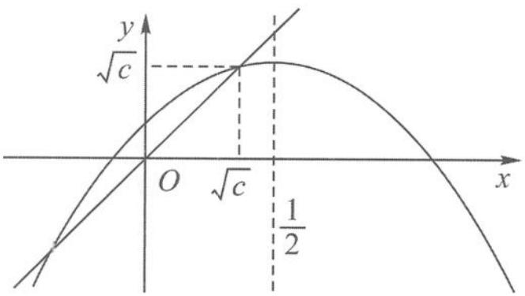  
图5.2-1

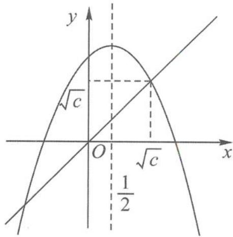  
图5.2-2

第一种情况, $\sqrt{c}\leqslant\frac{1}{2}$ .

此时函数图象如图5.2-1，容易证明 $x_{n}\in [-\sqrt{c},\sqrt{c} ]$ ，于是 $f(x_{n}) > x_{n}$ ，即

$$
x _ {n + 1} > x _ {n},
$$

即数列 $\{x_{n}\}$ 是递增数列.

第二种情况, $\sqrt{c}>\frac{1}{2}$ .

此时函数图象如图 5.2-2, $\{x_{n}\}$ 应为摆动数列, 考虑用反证法. 只需要证明数列中存在某项 $x_{k}$ 使 $x_{k} \in \left(\frac{1}{2}, \sqrt{c}\right)$ 即可. (这样 $x_{k+1} > \sqrt{c}, x_{k+2} < \sqrt{c}$ , 只需要证明: 若 $\{x_{n}\}$ 单调递增, 则 $\{x_{n}\}$ 的极限为 $\sqrt{c}$ . 这样可以推出矛盾)

事实上，

$$
\sqrt {c} - x _ {n + 1} = (\sqrt {c} - x _ {n}) (1 - \sqrt {c} - x _ {n}) <   (1 - \sqrt {c}) (\sqrt {c} - x _ {n}),
$$

其中 $x_{n} > 0$ ，于是

$$
\sqrt {c} - x _ {n + 1} <   (1 - \sqrt {c}) ^ {n} (\sqrt {c} - x _ {1}) = \sqrt {c} (1 - \sqrt {c}) ^ {n}.
$$

因此， $\{x_{n}\}$ 的极限为 $\sqrt{c}$ .

综上，c 的取值范围是 $\left(0, \frac{1}{4}\right]$ .

解法二:由(1)得 $c \geqslant 0$ .

①当 c=0 时， $a_{n}=a_{1}=0$ ，不合题意。

②当 $c > 0$ 时，

$$
x _ {2} = c > x _ {1}, x _ {3} = - c ^ {2} + 2 c > x _ {2} = c \Leftrightarrow 0 <   c <   1;
$$

$$
x _ {n + 1} - x _ {n} = c - x _ {n} ^ {2} > 0 \Leftrightarrow x _ {n} ^ {2} <   c <   1 \Leftrightarrow 0 = x _ {1} \leqslant x _ {n} <   \sqrt {c};
$$

$$
x _ {x + 2} = x _ {n + 1} = - \left(x _ {n + 1} ^ {2} - x _ {n} ^ {2}\right) + \left(x _ {n + 1} - x _ {n}\right) = - \left(x _ {n + 1} - x _ {n}\right) \left(x _ {n + 1} + x _ {n} - 1\right).
$$

当 $c \leqslant \frac{1}{4}$ 时， $x_{n} < \sqrt{c} \leqslant \frac{1}{2} \Rightarrow x_{n} + x_{n+1} - 1 < 0 \Leftrightarrow x_{n+2} - x_{n+1}$ 与 $x_{n+1} - x_{n}$ 同号.

由 $x_{2} - x_{1} = c > 0 \Rightarrow x_{n + 2} - x_{n} > 0 \Leftrightarrow x_{n + 1} > x_{n}$ ,

$$
\lim _ {n \rightarrow \infty} x _ {n + 1} = \lim _ {n \rightarrow \infty} (- x _ {n} ^ {2} + x _ {n} + c) \Leftrightarrow \lim _ {n \rightarrow \infty} x _ {n} = \sqrt {c}.
$$

当 $c = \frac{1}{4}$ 时，存在 $N$ ，使 $x_{N} > \frac{1}{2} \Rightarrow x_{N} + x_{N + 1} > 1 \Rightarrow x_{N + 2} - x_{N + 1}$ 与 $x_{N + 1} - x_{N}$ 异号，与数列 $\{x_{n}\}$ 是递减数列矛盾.所以，当 $0 < c \leqslant \frac{1}{4}$ 时，数列 $\{x_{n}\}$ 是递增数列.

评注 在第(2)问的求解过程中,解法一采用了不动点法并看图定范围,这样很容易看清楚问题的本质.解法二采用了作差分析法,“正难则反”是很重要的数学思想方法.

## 5.2.4 数列中的新定义和新构造问题

纵观近年来北京、上海和江苏等地的高考题,我们总能在试卷大题的压轴题位置发现数列的身影,它们对数列综合问题的考查常常以新定义和新构造形式呈现,有时还伴随着数列与集合.这类数列综合问题都是有难度的,但对这类问题的研究也能让我们收获许许多多探究的乐趣.

例 12 已知数集 $A=\{a_{1},a_{2},\cdots,a_{n}\}(1\leqslant a_{1}<a_{2}<\cdots<a_{n},n\geqslant2)$ 具有性质 P: 对任意的 $i,j(1\leqslant i\leqslant j\leqslant n)$ , $a_{i}a_{j}$ 与 $\frac{a_{i}}{a_{j}}$ 两个数中至少有一个属于 A.

(1) 分别判断数集 $\{1,3,4\}$ 和 $\{1,2,3,6\}$ 是否具有性质 P，并说明理由.

(2) 证明: $a_{1} = 1$ 且 $\frac{a_{1} + a_{2} + \cdots + a_{n}}{a_{1}^{-1} + a_{2}^{-1} + \cdots + a_{n}^{-1}} = a_{n}$ .

(3) 证明: 当 n=5 时, $a_{1}, a_{2}, a_{3}, a_{4}, a_{5}$ 成等比数列.

解答 (1)由于 $3 \times 4$ 与 $\frac{4}{3}$ 均不属于数集 $\{1,3,4\}$ , 所以该数集不具有性质 $P$ .

由于 $1 \times 2, 1 \times 3, 1 \times 6, 2 \times 3, \frac{6}{2}, \frac{6}{3}, \frac{1}{1}, \frac{2}{2}, \frac{3}{3}, \frac{6}{6}$ 都属于数集 $\{1, 2, 3, 6\}$ , 所以该数集具有性质 $P$ .

(2) 因为 $A=\{a_{1},a_{2},\cdots,a_{n}\}$ 具有性质 P，所以 $a_{n}a_{n}$ 与 $\frac{a_{n}}{a_{n}}$ 中至少有一个属于 A，
由于 $1 \leqslant a_{1} < a_{2} < \cdots < a_{n}$ ，所以 $a_{n}a_{n} > a_{n}$ ，故

$$
a _ {n} a _ {n} \notin A.
$$

从而 $1=\frac{a_{n}}{a_{n}}\in A$ ，所以 $a_{1}=1$ 。因为 $1=a_{1}<a_{2}<\cdots<a_{n}$ ，所以 $a_{k}a_{n}>a_{n}$ ，故

$$
a _ {k} a _ {n} \notin A (k = 2, 3, \dots , n).
$$

由 $A$ 具有性质 $P$ 可知

$$
\frac {a _ {n}}{a _ {k}} \in A (k = 1, 2, 3, \dots , n).
$$

因为

$$
\frac {a _ {n}}{a _ {n}} <   \frac {a _ {n}}{a _ {n - 1}} <   \dots <   \frac {a _ {n}}{a _ {2}} <   \frac {a _ {n}}{a _ {1}},
$$

所以

$$
\frac {a _ {n}}{a _ {n}} = 1, \frac {a _ {n}}{a _ {n - 1}} = a _ {2}, \dots , \frac {a _ {n}}{a _ {2}} = a _ {n - 1}, \frac {a _ {n}}{a _ {1}} = a _ {n}.
$$

从而

$$
\frac {a _ {n}}{a _ {n}} + \frac {a _ {n}}{a _ {n - 1}} + \dots + \frac {a _ {n}}{a _ {2}} + \frac {a _ {n}}{a _ {1}} = a _ {1} + a _ {2} + \dots + a _ {n - 1} + a _ {n},
$$

所以

$$
\frac {a _ {1} + a _ {2} + \cdots + a _ {n}}{a _ {1} ^ {- 1} + a _ {2} ^ {- 1} + \cdots + a _ {n} ^ {- 1}} = a _ {n}.
$$

(3)由(2)知,当n=5时,有 $\frac{a_{5}}{a_{4}}=a_{2},\frac{a_{5}}{a_{3}}=a_{3}$ ,即

$$
a _ {5} = a _ {2} a _ {4} = a _ {3} ^ {2}.
$$

因为 $1=a_{1}<a_{2}<\cdots<a_{5}$ ，所以 $a_{3}a_{4}>a_{2}a_{4}$ ，所以

$$
a _ {3} a _ {4} \notin A.
$$

由 $A$ 具有性质 $P$ 可知

$$
\frac {a _ {4}}{a _ {3}} \in A.
$$

由 $a_2a_4 = a_3^2$ 得

$$
\frac {a _ {3}}{a _ {2}} = \frac {a _ {4}}{a _ {3}} \in A, \text {且} 1 <   \frac {a _ {3}}{a _ {2}} = a _ {2}.
$$

所以

$$
\frac {a _ {4}}{a _ {3}} = \frac {a _ {3}}{a _ {2}} = a _ {2}, \frac {a _ {5}}{a _ {4}} = \frac {a _ {4}}{a _ {3}} = \frac {a _ {3}}{a _ {2}} = \frac {a _ {2}}{a _ {1}} = a _ {2},
$$

即 $a_{1}, a_{2}, a_{3}, a_{4}, a_{5}$ 是首项为 1，公比为 $a_{2}$ 的等比数列.

评注 本题主要考查集合、等比数列的性质,考查运算能力、推理论证能力、分类讨论等.本题是数列的综合题,属于较难题.

例 13 在数列 $\{a_{n}\}$ 中, 已知 $a_{1}$ 和 $a_{2}$ 是给定的非零整数, $a_{n+2} = |a_{n+1} - a_{n}|$ , 证明: $\{a_{n}\}$ 中一定存在无数个相同的常数.

分析 由于 $\{a_{n}\}$ 从第三项开始是非负整数, 故只需证明该数列有上界即可.

证明 易知, 当 $n \geqslant 3$ 时,

$$
a _ {n} \geqslant 0.
$$

下面用数学归纳法证明： $\forall n\geqslant 3,a_n\leqslant |a_1| + 2|a_2|$

①当 $n = 3$ 时， $a_3 = |a_2 - a_1| \leqslant |a_2| + |a_1| \leqslant 2|a_2| + |a_1|$ ，结论成立。

当 $n = 4$ 时， $a_4 = |a_3 - a_2| \leqslant |a_3| + |a_2| \leqslant |a_2| + |a_1| + |a_2| = |a_1| + 2|a_2|$ ，结论成立。

②假设当 $n \leqslant k (k \geqslant 4)$ 时结论成立.

③当 $n=k+1$ 时，由于 $a_{k}, a_{k-1} \geqslant 0$ ，从而有

$$
a _ {k + 1} = \left| a _ {k} - a _ {k - 1} \right| \leqslant \max \{\left| a _ {k} \right|, \left| a _ {k - 1} \right| \} \leqslant \left| a _ {1} \right| + 2 \left| a _ {2} \right|,
$$

即结论对 $n=k+1$ 也成立.

由①②③知，

$$
\forall n \geqslant 3, a _ {n} \leqslant | a _ {1} | + 2 | a _ {2} |.
$$

综上，

$$
\forall n \geqslant 3, 0 \leqslant a _ {n} \leqslant | a _ {1} | + 2 | a _ {2} |.
$$

由于 $\{a_{n}\}$ 中每一项都是整数，故 $\{a_{n}\}$ 中一定存在无数个相同的常数.

例 14 给定无穷数列 $\{a_{n}\}$ ，若无穷数列 $\{b_{n}\}$ 满足：对任意的 $n \in N^{*}$ ，都有 $|b_{n} - a_{n}| \leqslant 1$ ，则称 $\{b_{n}\}$ 与 $\{a_{n}\}$ “接近”.

(1)设 $\{a_{n}\}$ 是首项为 1, 公比为 $\frac{1}{2}$ 的等比数列, $b_{n} = a_{n+1} + 1, n \in \mathbb{N}^{*}$ , 问: 数列 $\{b_{n}\}$ 是否与 $\{a_{n}\}$ “接近”? 说明理由.

(2)设数列 $\{a_{n}\}$ 的前四项为 $a_{1} = 1, a_{2} = 2, a_{3} = 4, a_{4} = 8, \{b_{n}\}$ 是一个与 $\{a_{n}\}$ “接近”的数列，记集合 $M = \{x \mid x = b_{i}, i = 1, 2, 3, 4\}$ ，求 $M$ 中元素的个数 $m$ 。

(3)已知 $\{a_{n}\}$ 是公差为d的等差数列,若存在数列 $\{b_{n}\}$ 满足 $\{b_{n}\}$ 与 $\{a_{n}\}$ 接近,且 $b_{2}-b_{1}$ , $b_{3}-b_{2},\cdots,b_{201}-b_{200}$ 中至少有100个正数,求d的取值范围.

解答 (1) 数列 $\{b_{n}\}$ 与 $\{a_{n}\}$ “接近”.

理由： $\{a_{n}\}$ 是首项为1，公比为 $\frac{1}{2}$ 的等比数列，可得

$$
a _ {n} = \frac {1}{2 ^ {n - 1}}, b _ {n} = a _ {n + 1} + 1 = \frac {1}{2 ^ {n}} + 1,
$$

则

$$
\left| b _ {n} - a _ {n} \right| = \left| \frac {1}{2 ^ {n}} + 1 - \frac {1}{2 ^ {n - 1}} \right| = 1 - \frac {1}{2 ^ {n}} <   1, n \in \mathbf {N} ^ {*}.
$$

可知数列 $\{b_{n}\}$ 与 $\{a_{n}\}$ “接近”.

(2) $\{b_{n}\}$ 是一个与 $\{a_{n}\}$ “接近”的数列,可得

$$
a _ {n} - 1 \leqslant b _ {n} \leqslant a _ {n} + 1.
$$

数列 $\{a_{n}\}$ 的前四项为 $a_1 = 1, a_2 = 2, a_3 = 4, a_4 = 8$ ，可得

$$
b _ {1} \in [ 0, 2 ], b _ {2} \in [ 1, 3 ], b _ {3} \in [ 3, 5 ], b _ {4} \in [ 7, 9 ].
$$

$b_{1}$ 与 $b_{2}$ 可能相等， $b_{2}$ 与 $b_{3}$ 可能相等，但 $b_{1}$ 与 $b_{3}$ 不相等， $b_{4}$ 与 $b_{3}$ 不相等，集合 $M=\{x \mid x=b_{i}, i=1,2,3,4\}$ ，M 中元素的个数 m=3 或 4.

(3) $\{a_{n}\}$ 是公差为 $d$ 的等差数列, 若存在数列 $\{b_{n}\}$ 满足 $\{b_{n}\}$ 与 $\{a_{n}\}$ “接近”, 则

$$
a _ {n} = a _ {1} + (n - 1) d.
$$

①若 $d > 0$ ，取 $b_{n} = a_{n}$ ，可得

$$
b _ {n + 1} - b _ {n} = a _ {n + 1} - a _ {n} = d > 0,
$$

则 $b_{2}-b_{1}, b_{3}-b_{2}, \cdots, b_{201}-b_{200}$ 中有 200 个正数，符合题意.

②若 $d = 0$ ，取 $b_{n} = a_{1} - \frac{1}{n}$ ，则

$$
\left| b _ {n} - a _ {n} \right| = \left| a _ {1} - \frac {1}{n} - a _ {1} \right| = \frac {1}{n} <   1, n \in \mathbf {N} ^ {*},
$$

可得

$$
b _ {n + 1} - b _ {n} = \frac {1}{n} - \frac {1}{n + 1} > 0,
$$

则 $b_{2}-b_{1}, b_{3}-b_{2}, \cdots, b_{201}-b_{200}$ 中有 200 个正数，符合题意.

③若-2<d<0，可令 $b_{2n-1}=a_{2n-1}-1,b_{2n}=a_{2n}+1$ ，则

$$
b _ {2 n} - b _ {2 n - 1} = a _ {2 n} + 1 - (a _ {2 n - 1} - 1) = 2 + d > 0,
$$

则 $b_{2}-b_{1}, b_{3}-b_{2}, \cdots, b_{201}-b_{200}$ 中恰有 100 个正数，符合题意.

④若 $d \leqslant -2$ ，存在数列 $\{b_n\}$ 满足 $\{b_n\}$ 与 $\{a_n\}$ “接近”，即为

$$
a _ {n} - 1 \leqslant b _ {n} \leqslant a _ {n} + 1, a _ {n + 1} - 1 \leqslant b _ {n + 1} \leqslant a _ {n + 1} + 1,
$$

可得

$$
b _ {n + 1} - b _ {n} \leqslant a _ {n + 1} + 1 - (a _ {n} - 1) = 2 + d \leqslant 0,
$$

则 $b_{2}-b_{1}, b_{3}-b_{2}, \cdots, b_{201}-b_{200}$ 中无正数，不符合题意.

综上可得，d 的取值范围是 $(-2, +\infty)$ .

评注 本题考查对新定义“接近”的理解和运用,考查等差数列、等比数列的定义和其通项公式的运用,考查分类讨论思想,以及运算能力和推理能力.

例 15 证明: 方程 $2x^{3}+5x-2=0$ 恰有一个实数根 r，且存在唯一的严格递增正整数数列 $\{a_{n}\}$ ，使得 $\frac{2}{5}=r^{a_{1}}+r^{a_{2}}+r^{a_{3}}+\cdots$ .

分析 由 $r^{a_1} + r^{a_2} + r^{a_3} + \cdots$ 我们容易想到无穷递缩等比数列求和, 所以我们证明 $|r| < 1$ 并且需要利用 $2r^3 + 5r - 2 = 0$ , 整理出形如 $\frac{1}{1 - r^k}$ 的结构.

解答 先证存在性: 令 $f(x)=2x^{3}+5x-2$ , 则

$$
f ^ {\prime} (x) = 6 x ^ {2} + 5 > 0.
$$

所以 $f(x)$ 是严格递增的. 又

$$
f (0) = - 2 <   0, f \left(\frac {1}{2}\right) = \frac {3}{4} > 0,
$$

故 $f(x)$ 有唯一实数根 $r \in \left(0, \frac{1}{2}\right)$ . 所以 $2r^3 + 5r - 2 = 0$ , 即

$$
\frac {2}{5} = \frac {r}{1 - r ^ {3}} = r + r ^ {4} + r ^ {7} + r ^ {1 0} + \dots .
$$

故数列 $a_{n}=3n-2(n=1,2,\cdots)$ 是满足题设要求的数列.

再证唯一性:若存在两个不同的正整数数列

$$
a _ {1} <   a _ {2} <   \dots <   a _ {n} <   \dots \text {和} b _ {1} <   b _ {2} <   \dots <   b _ {n} <   \dots ,
$$

满足

$$
r ^ {a _ {1}} + r ^ {a _ {2}} + r ^ {a _ {3}} + \dots = r ^ {b _ {1}} + r ^ {b _ {2}} + r ^ {b _ {3}} + \dots = \frac {2}{5}.
$$

去掉上面等式两边相同的项,有

$$
r ^ {s _ {1}} + r ^ {s _ {2}} + r ^ {s _ {3}} + \dots = r ^ {t _ {1}} + r ^ {t _ {2}} + r ^ {t _ {3}} + \dots .
$$

这里 $s_{1}<s_{2}<s_{3}<\cdots, t_{1}<t_{2}<t_{3}<\cdots$ ，所有的 $s_{i}$ 与 $t_{j}$ 都是不同的。不妨设 $s_{1}<t_{1}$ ，则

$$
r ^ {s _ {1}} <   r ^ {s _ {1}} + r ^ {s _ {2}} + \dots = r ^ {t _ {1}} + r ^ {t _ {2}} + \dots ,
$$

$$
1 <   r ^ {t _ {1} - s _ {1}} + r ^ {t _ {2} - s _ {1}} + \dots \leqslant r + r ^ {2} + \dots = \frac {1}{1 - r} - 1 <   \frac {1}{1 - \frac {1}{2}} - 1 = 1.
$$

矛盾. 所以满足题设的数列是唯一的.

评注 我们在证明唯一性时用了反证法,这与证明整数的 p 进制表示具有唯一性时的思想有异曲同工之妙.

对于后者:假设整数 n 在 p 进制下具有两种表示方法,即

$$
n = a _ {k} p ^ {k} + a _ {k - 1} p ^ {k - 1} + \dots + a _ {0} = b _ {k} p ^ {k} + b _ {k - 1} p ^ {k - 1} + \dots + b _ {0},
$$

其中 $(a_{i},b_{i}\in\{0,1,\cdots,p-1\},i=1,2,\cdots,n)$ . 设 $a_{i},b_{i}$ 中的下标按从大到小的顺序排列时第一对不一样的为 $a_{m},b_{m}$ ，则

$$
a _ {m} p ^ {m} + a _ {m - 1} p ^ {m - 1} + \dots + a _ {0} = b _ {m} p ^ {m} + b _ {m - 1} p ^ {m - 1} + \dots + b _ {0}.
$$

不妨设 $a_{m} \geqslant b_{m} + 1$ ，则

$$
\begin{array}{r l} a _ {m} p ^ {m} & \leqslant a _ {m} p ^ {m} + a _ {m - 1} p ^ {m - 1} + \dots + a _ {0} = b _ {m} p ^ {m} + b _ {m - 1} p ^ {m - 1} + \dots + b _ {0} \\ & \leqslant (a _ {m} - 1) p ^ {m} + (p - 1) (p ^ {m - 1} + p ^ {m - 2} + \dots + 1) \\ & = (a _ {m} - 1) p ^ {m} + p ^ {m} - 1 <   a _ {m} p ^ {m}. \end{array}
$$

矛盾. 所以假设不成立, 整数 $n$ 在 $p$ 进制下的表示具有唯一性.

## 思考题

1. 若数列 $\{a_{n}\}$ 满足 $a_{4}=9, (a_{n+1}-a_{n}-1)(a_{n+1}-3a_{n})=0 (n\in\mathbb{N}^{*})$ ，则满足条件的 $a_{1}$ 的所有可能值的积是 \_\_\_\_.

2. 在平面直角坐标系中, 定义 $\left\{\begin{aligned} x_{n+1} &= x_n - y_n, \\ y_{n+1} &= x_n + y_n \end{aligned}\right. (n \in \mathbb{N}^*)$ 为点 $P_n(x_n, y_n)$ 到点 $P_{n+1}(x_{n+1}, y_{n+1})$ 的一个变换, 我们把它称为点变换. 已知 $P_1(1,0), P_2(x_2, y_2), P_3(x_3, y_3), \cdots$ 是经过点变换得到的一个无穷点列, 则 $P_3$ 的坐标为 \_\_\_\_; 设 $a_n = \overrightarrow{P_n P_{n+1}} \cdot \overrightarrow{P_{n+1} P_{n+2}}$ , 则满足 $a_1 + a_2 + \cdots + a_n > 1000$ 的最小正整数 n = \_\_\_\_.

3. 对于正整数 $n$ , 已知最接近 $\sqrt{n}$ 的正整数为 $a_{n}$ . 设 $b_{n} = n + a_{n}$ , 从全体正整数中除去所有的 $b_{n} (n = 1, 2, \cdots)$ , 余下的正数按从小到大的顺序排列得 $\{c_{n}\}$ , 则 $\{c_{n}\}$ 的通项公式为

4. 设 $a_{1}, a_{2}, \cdots, a_{2014}$ 是从 1, 0, -1 这三个数中取值的一列数，若 $a_{1} + a_{2} + \cdots + a_{2014} = 69$ ， $(a_{1} + 1)^{2} + (a_{2} + 1)^{2} + \cdots + (a_{2014} + 1)^{2} = 4001$ ，则 $a_{1}, a_{2}, \cdots, a_{2014}$ 中 0 的个数为 \_\_\_\_，1 的个数为 \_\_\_\_.

5. 设 $1 = a_{1} \leqslant a_{2} \leqslant \cdots \leqslant a_{7}$ , 其中 $a_{1}, a_{3}, a_{5}, a_{7}$ 成公比为 $q$ 的等比数列, $a_{2}, a_{4}, a_{6}$ 成公差为 1 的等差数列, 则 $q$ 的最小值是

6. 若数列 $\{a_{n}\}$ 满足: 对任意的 $n \in N^{*}$ ，只有有限个正整数 m 使得 $a_{m} < n$ 成立，记这样的 m 的个数为 $(a_{n})^{*}$ ，则得到一个新数列 $\{(a_{n})^{*}\}$ 。例如，若数列 $\{a_{n}\}$ 是 $1, 2, 3, \cdots, n, \cdots$ ，则数列 $\{(a_{n})^{*}\}$ 是 $0, 1, 2, \cdots, n-1, \cdots$ 。已知对任意的 $n \in N^{*}, a_{n} = n^{2}$ ，则 $(a_{5})^{*} =$ \_\_\_\_， $((a_{n})^{*})^{*} =$ \_\_\_\_.

7. 设整数数列 $a_{1}, a_{2}, \cdots, a_{11}$ 满足 $a_{11} = a_{1} = 1, a_{4} + a_{8} = 2a_{6}$ ，且 $a_{k+1} - a_{k} \in \{1, -1\}, k = 1, 2, \cdots, 10$ ，则这样的数列的个数为

8. 设数列 $\{a_{n}\}$ 满足 $a_{1}=\frac{3}{8}$ ，且对任意的 $n\in N^{*}$ ，满足 $a_{n+2}-a_{n}\leqslant3^{n}, a_{n+4}-a_{n}\geqslant10\times3^{n}$ ，则 $a_{2017}=$ \_\_\_\_.

9. 已知数列 $\{a_{n}\}$ 递增, $a_{n} + a_{n+2} \geqslant 2a_{n+1}$ , 若 $a_{1} = 7, a_{99} = 2017$ , 且 $a_{n}$ 是正整数, 则 $a_{51}$ 的最大值为 ( ).

A. 1008 B. 1009 C. 1010 D. 1011

10. 已知数列 $\{a_{n}\}$ 满足 $a_{1}=1, a_{2}=\frac{1}{2}$ ，且 $[3+(-1)^{n}]a_{n+2}-2a_{n}+2[(-1)^{n}-1]=0, n\in N^{*}$ ，记 $T_{2n}$ 为数列 $\{a_{n}\}$ 的前 2n 项和，数列 $\{b_{n}\}$ 是首项和公比都是 2 的等比数列，则使不等式 $\left(T_{2n}+\frac{1}{b_{n}}\right)\cdot\frac{1}{b_{n}}<1$ 成立的最小整数 n 为（）.

A. 7
B. 6
C. 5
D. 4

11. 已知函数 $f(x) = \mathrm{e}^{x} - x - 1$ ，数列 $\{a_{n}\}$ 的前 $n$ 项和为 $S_{n}$ ，且满足 $a_{1} = \frac{1}{2}, a_{n+1} = f(a_{n})$ ，则下列有关数列 $\{a_{n}\}$ 的叙述正确的是（ ）.

A. $a_{5} < |4a_{2} - 3a_{1}|$ B. $a_{7} \leqslant a_{8}$ C. $a_{10} > 1$ D. $S_{100} > 26$

12. 设 $\{a_{n}\}$ 是公差不为零的等差数列, $S_{n}$ 为其前 n 项和, 满足 $a_{2}^{2} + a_{3}^{2} = a_{4}^{2} + a_{5}^{2}, S_{7} = 7$ .

(1)求数列 $\{a_{n}\}$ 的通项公式及其前n项和 $S_{n}$ .

(2)试求所有的正整数 m，使得 $\frac{a_{m}a_{m+1}}{a_{m+2}}$ 为数列 $\{a_{n}\}$ 中的项.

13. 在数列 $\{a_{n}\}$ 中, 已知 $a_{1}=1, a_{n+1}=c-\frac{1}{a_{n}}$ .

(1) 设 $c = \frac{5}{2}, b_n = \frac{1}{a_n - 2}$ , 求数列 $\{b_n\}$ 的通项公式.

(2)求使不等式 $a_{n} < a_{n + 1} < 3$ 恒成立的 $c$ 的取值范围.

14. 已知有限数列 $\{a_{n}\}$ , 若满足 $|a_{1} - a_{2}| \leqslant |a_{1} - a_{3}| \leqslant \cdots \leqslant |a_{1} - a_{m}|$ , $m$ 是项数, 则称 $\{a_{n}\}$ 满足性质 $p$ .

(1)问:数列 3,2,5,1 和 4,3,2,5,1 是否具有性质 p? 请说明理由.

(2) 若 $a_{1}=1$ ，公比为 q 的等比数列，项数为 10，具有性质 p，求 q 的取值范围.

(3) 若 $a_{n}$ 是 $1,2,\cdots,m$ 的一个排列 $(m\geqslant4)$ , $b_{k}=a_{k+1}(k=1,2,\cdots,m-1)$ , $\{a_{n}\}$ , $\{b_{n}\}$ 都具有性质 p，求所有满足条件的 $\{a_{n}\}$ .

![[高中/总复习/专题/高考数学秘密/浙大优辅《高中数学新体系 数列的秘密》/01_第一章_数列的概念及其性质/第一章_数列的概念及其性质.md]]
![[高中/总复习/专题/高考数学秘密/浙大优辅《高中数学新体系 数列的秘密》/02_1_1_数列概念清_研究有方法/1_1_数列概念清_研究有方法.md]]
![[高中/总复习/专题/高考数学秘密/浙大优辅《高中数学新体系 数列的秘密》/03_1_1_1_数列的基本概念/1_1_1_数列的基本概念.md]]
![[高中/总复习/专题/高考数学秘密/浙大优辅《高中数学新体系 数列的秘密》/04_1_1_2_数列的和与通项的关系/1_1_2_数列的和与通项的关系.md]]
![[高中/总复习/专题/高考数学秘密/浙大优辅《高中数学新体系 数列的秘密》/05_1_1_3_数列中的差分思想/1_1_3_数列中的差分思想.md]]
![[高中/总复习/专题/高考数学秘密/浙大优辅《高中数学新体系 数列的秘密》/06_1_1_4_无穷数列中常见的极限问题/1_1_4_无穷数列中常见的极限问题.md]]
![[高中/总复习/专题/高考数学秘密/浙大优辅《高中数学新体系 数列的秘密》/07_1_2_数列性质多_最美单调性/1_2_数列性质多_最美单调性.md]]
![[高中/总复习/专题/高考数学秘密/浙大优辅《高中数学新体系 数列的秘密》/08_1_2_1_数列按变化规律分类/1_2_1_数列按变化规律分类.md]]
![[高中/总复习/专题/高考数学秘密/浙大优辅《高中数学新体系 数列的秘密》/09_1_2_2_数列单调性的定义/1_2_2_数列单调性的定义.md]]
![[高中/总复习/专题/高考数学秘密/浙大优辅《高中数学新体系 数列的秘密》/10_1_2_3_判断数列的最大_小_项之作差法/1_2_3_判断数列的最大_小_项之作差法.md]]
![[高中/总复习/专题/高考数学秘密/浙大优辅《高中数学新体系 数列的秘密》/11_1_2_4_判断数列的最大_小_项之函数图象法与性质法/1_2_4_判断数列的最大_小_项之函数图象法与性质法.md]]
![[高中/总复习/专题/高考数学秘密/浙大优辅《高中数学新体系 数列的秘密》/12_1_2_5_判断数列的最大_小_项之导数法/1_2_5_判断数列的最大_小_项之导数法.md]]
![[高中/总复习/专题/高考数学秘密/浙大优辅《高中数学新体系 数列的秘密》/13_1_2_6_与数列单调性有关的概念问题/1_2_6_与数列单调性有关的概念问题.md]]
![[高中/总复习/专题/高考数学秘密/浙大优辅《高中数学新体系 数列的秘密》/14_1_2_7_与数列单调性有关的综合问题/1_2_7_与数列单调性有关的综合问题.md]]
![[高中/总复习/专题/高考数学秘密/浙大优辅《高中数学新体系 数列的秘密》/15_第二章_等差数列与等比数列/第二章_等差数列与等比数列.md]]
![[高中/总复习/专题/高考数学秘密/浙大优辅《高中数学新体系 数列的秘密》/16_2_1_数列之经典_等差来呈现/2_1_数列之经典_等差来呈现.md]]
![[高中/总复习/专题/高考数学秘密/浙大优辅《高中数学新体系 数列的秘密》/17_2_1_1_等差数列的基本概念和基本公式/2_1_1_等差数列的基本概念和基本公式.md]]
![[高中/总复习/专题/高考数学秘密/浙大优辅《高中数学新体系 数列的秘密》/18_2_1_2_等差数列的主要性质/2_1_2_等差数列的主要性质.md]]
![[高中/总复习/专题/高考数学秘密/浙大优辅《高中数学新体系 数列的秘密》/19_2_1_3_等差数列前_n_项和的最值的求法/2_1_3_等差数列前_n_项和的最值的求法.md]]
![[高中/总复习/专题/高考数学秘密/浙大优辅《高中数学新体系 数列的秘密》/20_2_1_4_等差数列的判定方法/2_1_4_等差数列的判定方法.md]]
![[高中/总复习/专题/高考数学秘密/浙大优辅《高中数学新体系 数列的秘密》/21_2_1_5_与等差数列有关的综合性问题/2_1_5_与等差数列有关的综合性问题.md]]
![[高中/总复习/专题/高考数学秘密/浙大优辅《高中数学新体系 数列的秘密》/22_2_2_数列之经典_等比来呈现/2_2_数列之经典_等比来呈现.md]]
![[高中/总复习/专题/高考数学秘密/浙大优辅《高中数学新体系 数列的秘密》/23_2_2_1_等比数列的基本概念和基本公式/2_2_1_等比数列的基本概念和基本公式.md]]
![[高中/总复习/专题/高考数学秘密/浙大优辅《高中数学新体系 数列的秘密》/24_2_2_2_等比数列的主要性质/2_2_2_等比数列的主要性质.md]]
![[高中/总复习/专题/高考数学秘密/浙大优辅《高中数学新体系 数列的秘密》/25_2_2_3_等比数列的单调性和最值问题/2_2_3_等比数列的单调性和最值问题.md]]
![[高中/总复习/专题/高考数学秘密/浙大优辅《高中数学新体系 数列的秘密》/26_2_2_4_等比数列的判定方法/2_2_4_等比数列的判定方法.md]]
![[高中/总复习/专题/高考数学秘密/浙大优辅《高中数学新体系 数列的秘密》/27_2_2_5_错位相减求和问题/2_2_5_错位相减求和问题.md]]
![[高中/总复习/专题/高考数学秘密/浙大优辅《高中数学新体系 数列的秘密》/28_三章_数列之求和与求通项/三章_数列之求和与求通项.md]]
![[高中/总复习/专题/高考数学秘密/浙大优辅《高中数学新体系 数列的秘密》/29_3_1_数列之通项_迭代与构造/3_1_数列之通项_迭代与构造.md]]
![[高中/总复习/专题/高考数学秘密/浙大优辅《高中数学新体系 数列的秘密》/30_3_1_1_公式法求数列通项/3_1_1_公式法求数列通项.md]]
![[高中/总复习/专题/高考数学秘密/浙大优辅《高中数学新体系 数列的秘密》/31_3_1_2_迭代法求数列通项/3_1_2_迭代法求数列通项.md]]
![[高中/总复习/专题/高考数学秘密/浙大优辅《高中数学新体系 数列的秘密》/32_3_1_3_构造法求数列通项/3_1_3_构造法求数列通项.md]]
![[高中/总复习/专题/高考数学秘密/浙大优辅《高中数学新体系 数列的秘密》/33_3_1_4_不动点法求数列通项/3_1_4_不动点法求数列通项.md]]
![[高中/总复习/专题/高考数学秘密/浙大优辅《高中数学新体系 数列的秘密》/34_3_1_5_特征根法求数列通项/3_1_5_特征根法求数列通项.md]]
![[高中/总复习/专题/高考数学秘密/浙大优辅《高中数学新体系 数列的秘密》/35_3_2_数列之通项_周期识全局/3_2_数列之通项_周期识全局.md]]
![[高中/总复习/专题/高考数学秘密/浙大优辅《高中数学新体系 数列的秘密》/36_3_2_1_周期数列的定义_性质和判定方法/3_2_1_周期数列的定义_性质和判定方法.md]]
![[高中/总复习/专题/高考数学秘密/浙大优辅《高中数学新体系 数列的秘密》/37_3_2_2_周期数列的主要表现形式/3_2_2_周期数列的主要表现形式.md]]
![[高中/总复习/专题/高考数学秘密/浙大优辅《高中数学新体系 数列的秘密》/38_3_3_数列之求和_错位与倒序/3_3_数列之求和_错位与倒序.md]]
![[高中/总复习/专题/高考数学秘密/浙大优辅《高中数学新体系 数列的秘密》/39_3_3_1_公式法求和/3_3_1_公式法求和.md]]
![[高中/总复习/专题/高考数学秘密/浙大优辅《高中数学新体系 数列的秘密》/40_3_3_2_错位相减法求和/3_3_2_错位相减法求和.md]]
![[高中/总复习/专题/高考数学秘密/浙大优辅《高中数学新体系 数列的秘密》/41_3_3_3_分组法求和/3_3_3_分组法求和.md]]
![[高中/总复习/专题/高考数学秘密/浙大优辅《高中数学新体系 数列的秘密》/42_3_3_4_并项法求和/3_3_4_并项法求和.md]]
![[高中/总复习/专题/高考数学秘密/浙大优辅《高中数学新体系 数列的秘密》/43_3_3_5_倒序相加法求和/3_3_5_倒序相加法求和.md]]
