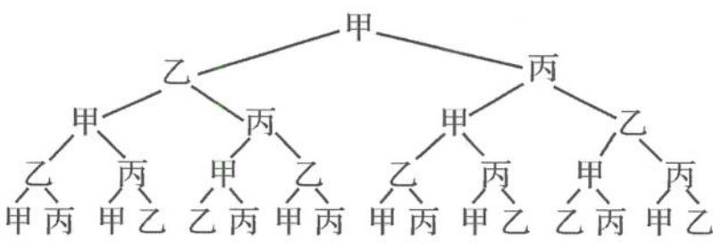

## 2.2.1 概率模型

题 1-1 【解析】每人从 4 个不同的场馆中选择 2 个参观的方法有 $C_{4}^{2}$ 种，则甲、乙两人每人选 2 个场馆的参观方法有 $C_{4}^{2}C_{4}^{2}$ 种.

甲、乙两人恰好参观同一个场馆的参观方法有 $C_{4}^{1}C_{3}^{1}C_{2}^{1}$ 种.

所以甲、乙两人恰好参观同一个场馆的概率 $P = \frac{\mathrm{C}_4^1\mathrm{C}_3^1\mathrm{C}_2^1}{\mathrm{C}_4^2\mathrm{C}_4^2} = \frac{24}{36} = \frac{2}{3}.$

故答案为 $\frac{2}{3}$ .

【探讨】 $C_{4}^{1}C_{3}^{1}C_{2}^{1}$ 的含义是“选相同展馆×甲选第二个展馆×乙选第二个展馆”.

题 1-2 【解析】解法一: $P = \frac{C_{10}^{1} C_{3}^{2} C_{9}^{1}}{10^{3}} = \frac{27}{100}$ . 解法二: $P = 1 - \frac{C_{10}^{1} + A_{10}^{3}}{10^{3}} = \frac{27}{100}$ . 故答案为 $\frac{27}{100}$ .

【探讨】解法一中分子的含义是“选相同数字×选位置×选第三个数字”; 解法二中分子的含义是“三位数字都相同十三位数字都不同”.

题 1-3 【解析】依题意得,甲、乙、丙、丁到三个不同的社区参加公益活动,每个社区至少分一名义工的方法数是 $C_{4}^{2}A_{3}^{3}$ , 其中甲被分到 A 社区的方法数是 $C_{3}^{2}A_{2}^{2}$ .

因此甲被分到 A 社区的概率 $P=\frac{C_{3}^{2}A_{2}^{2}}{C_{4}^{2}A_{3}^{3}}=\frac{1}{6}$ .
故选 A.

【探讨】甲单独分到 A 社区表明乙、丙、丁三名义工分配到了 B, C 两个不同的社区, 每个社区至少分一名义工, 即 $C_{3}^{2}A_{2}^{2}$ .

题 1-4 【解析】1, 4, 9, 16, 25 的平均数为 $\frac{1}{5}(1+4+9+16+25)=11$ ，从 1, 4, 9, 16, 25 中任取两个数，基本事件总数为 $C_{5}^{2}=10$ ，小于 11 的数有 3 个，那么任取两个数包含的基本事件个数为 $C_{3}^{2}=3$ ，则它们均小于这五个数的平均数的概率为 $\frac{3}{10}$ .

故答案为 $\frac{3}{10}$ .

题 1-5 【解析】解本题合适的方法是画出树状图表示出传球事件.

第一次传球第二次传球第三次传球第四次传球

由树状图知,第四次传回甲的概率 $P=\frac{6}{16}=\frac{3}{8}$ .
故答案为 $\frac{3}{8}$ .

【探讨】因为甲、乙、丙三人都等可能地将球传给另外两个队友中的一个,所以由上述树状图得到的16个样本点发生的可能性是相等的,这是一个古典概率模型.

题 1-6 【解析】5 个快递送到 5 个地方有 $A_{5}^{5}=$ 120 种方法.

不妨假设快递 A, B, C, D, E 对应的正确地方依次为甲、乙、丙、丁、戊，对于事件“全部送错”的方法数，可先分步：

第一步,快递 A 送错有 4 种可能情况.

第二步,考虑 A 所送位置对应的快递,不妨假设 A 送到了丙地.

第三步,考虑快递 C,对 C 分类:

第一类，C送到甲地，则剩下B,D,E要均送错有2种可能（丁、戊、乙，戊、乙、丁）.

第二类，C送到乙、丁、戊中的一个地方，有3种可能，如送到丁地，剩下的B，D，E只有甲、乙、戊三个地方可送，全送错有3种可能（甲、戊、乙；戊、甲、乙；戊、乙、甲）.

所以总的方法数为 $4 \times (1 \times 2 + 3 \times 3) = 44$ ，所求概率 $P = \frac{44}{120} = \frac{11}{30}$ .

故选C.

【探讨】需要注意“送错”和“全部送错”的区别，在计数原理的加持下，可以逐一列举出全送错的样本点。

题 1-7 【解析】所有的安排方法数为 $C_{5}^{3}A_{3}^{3} + C_{5}^{1} \times \frac{C_{4}^{2}C_{2}^{2}}{A_{2}^{2}} \times A_{3}^{3} = 10 \times 6 + 5 \times 3 \times 6 = 150$ (种).

若只有 1 人去冰球项目做志愿者, 有 $C_{4}^{1}\times\left(C_{4}^{1}+\frac{C_{4}^{2}C_{2}^{2}}{A_{2}^{2}}\right)\times A_{2}^{2}=4\times(4+3)\times2=56$ （种）;

若恰有 2 人去冰球项目做志愿者, 有 $C_{4}^{2}C_{3}^{1}A_{2}^{2}=6\times3\times2=36$ (种);

若有 3 人去冰球项目做志愿者,有 $C_{4}^{3}A_{2}^{2}=4\times2=8$ (种).

所以共有 $56+36+8=100$ 种安排法.

所以学生甲不会被安排到冰球比赛项目做志愿者的概率为 $\frac{100}{150}=\frac{2}{3}$ .

故选B.

【探讨】从冰球项目志愿者的人数进行分类这样来规划事情会比较自然.

题 1-8 【解析】从连续 7 天中随机选择 3 天，有 $C_{7}^{3}=35$ 种选择. 其中恰好仅有 2 天连续, 把连续的 2 天看成一个元素, 另外一天看成一个元素, 则这两个元素不相邻, 由插空法知有 $A_{5}^{2}=20$ 种选择.

所以所求的概率 $P=\frac{20}{35}=\frac{4}{7}$ .

故答案为 $\frac{4}{7}$ .

题 1-9 【解析】依题意得所拨数字共有 $C_{4}^{1}C_{4}^{2}=$ 24 种可能, 要求所拨数字大于 200.

若上珠拨的是千位档或百位档,则所拨数字一定大于200,有 $C_{2}^{1}C_{4}^{2}=12$ 种;

若上珠拨的是个位档或十位档,则下珠一定要拨千位,再从个、十、百里选一个下珠,有 $C_{2}^{1}C_{3}^{1}=6$ 种.

则所拨数字大于200的概率为 $\frac{12 + 6}{24} = \frac{3}{4}$ 故选D.

题 1-10 【解析】对于选项 A, 甲从 M 到达 N, 需要走 6 步, 其中有 3 步向上走, 3 步向右走, 则甲从 M 到达 N 的方法有 $C_{6}^{3}=20$ 种, 选项 A 错误.

对于选项 B, 甲经过 $A_{2}$ 到达 N, 可分为两步:

第一步,甲从 M 经过 $A_{2}$ 需要走 3 步,其中 1 步向右走、2 步向上走,方法数为 $C_{3}^{1}$ 种;

第二步,甲从 $A_{2}$ 到 N 需要走 3 步,其中 1 步向上走、2 步向右走,方法数为 $C_{3}^{1}$ 种.

所以甲经过 $A_{2}$ 到达 N 的方法数为 $C_{3}^{1}C_{3}^{1}=9$ 种, 选项 B 正确.

对于选项 C, 甲经过 $A_{2}$ 的方法数为 $C_{3}^{1}C_{3}^{1}=9$ 种, 乙经过 $A_{2}$ 的方法数也为 $C_{3}^{1}C_{3}^{1}=9$ 种, 所以甲、乙两人在 $A_{2}$ 处相遇的方法数为 $C_{3}^{1}C_{3}^{1}C_{3}^{1}C_{3}^{1}=81$ , 甲、乙两人在 $A_{2}$ 处相遇的概率为 $\frac{81}{C_{6}^{3}C_{6}^{3}}=\frac{81}{400}$ , 选项 C 正确.

对于选项 D, 甲、乙两人沿最短路径行走, 只可能在 $A_{1}, A_{2}, A_{3}, A_{4}$ 处相遇.

若甲、乙两人在 $A_{1}$ 处相遇，甲经过 $A_{1}$ 处，则甲的前 3 步必须向上走，乙经过 $A_{1}$ 处，则乙的前 3 步必须向左走，两人在 $A_{1}$ 处相遇的走法种数为 1 种；

若甲、乙两人在 $A_{2}$ 处相遇，由选项 C 可知，走

法种数为 81 种；

若甲、乙两人在 $A_{3}$ 处相遇，甲到 $A_{3}$ 处，前3步有2步向右走，只有1步向右走，乙到 $A_{3}$ 处，前3步有2步向下走，只有1步向下走，所以，两人在 $A_{3}$ 处相遇的走法种数为 $\mathrm{C}_3^2\mathrm{C}_3^1\mathrm{C}_3^2\mathrm{C}_3^1 = 81$ 种；

若甲、乙两人在 $A_{4}$ 处相遇，甲经过 $A_{4}$ 处，则甲的前 3 步必须向右走，乙经过 $A_{4}$ 处，则乙的前 3 步必须向下走，两人在 $A_{4}$ 处相遇的走法种数为 1 种。

故甲、乙两人相遇的概率为 $\frac{1 + 81 + 81 + 1}{400} = \frac{41}{100}$ , 选项 D 正确.

故选 BCD.

题 2-1 【解析】(I)设“该校男生支持方案一”为事件 A, “该校女生支持方案一”为事件 B,

则 $P(A)=\frac{200}{200+400}=\frac{1}{3}, P(B)=\frac{300}{300+100}=\frac{3}{4}.$ (Ⅱ) $p_{0}>p_{1}.$

【探讨】大家可能对本题的第(Ⅱ)问有疑问,为何不要求写证明过程?这跟命题意图有关,即概率统计不是四则运算,而是自觉地运用数据,提取相关信息,做出合理推断或决策.对概率统计的考查不是对复杂运算的考查,而是对概率统计思想的考查,这一点尤为要引起注意.第(Ⅱ)问, $P_{0}=\frac{350+150}{350+250+150+250}=\frac{1}{2},P_{2}=$ “该校一年级支持方案二的学生的概率”, $P_{2}=$ $\frac{500\times\frac{350}{350+250}+300\times\frac{150}{150+250}}{500+300}=\frac{97}{192}$ , 则 $P_{1}=1-\frac{97}{192}=\frac{95}{192}<\frac{1}{2}=P_{0}$ .

题 2-2 【解析】(Ⅰ)事件 A 的频数为 $60 + 50 = 110$ ，则 $P(A)$ 的估计值为 $\frac{110}{200} = \frac{11}{20}$ .

(Ⅱ)事件 B 的频数为 $30+30=60$ ，则 $P(B)$ 的估计值为 $\frac{60}{200}=\frac{3}{10}$ .

(Ⅲ)续保人本年度的平均保费估计值为

$$
\overline {{x}} = \frac {1}{2 0 0} \times (0. 8 5 a \times 6 0 + a \times 5 0 + 1. 2 5 a \times 3 0 +
$$

1. $5a \times 30 + 1.75a \times 20 + 2a \times 10 = 1.1925a.$

【探讨】本题的三问均是用频率估计概率,大家需要清晰频率与概率的区别与联系,因此作答时一定要强调“估计值”.在标准化考试时,没有强调“估计”,每问都会扣去1分.

题 2-3 【解析】由题意知,模拟打 3 局比赛甲恰好获胜 2 局的结果,经随机模拟产生了 20 组随机数,在 20 组随机数中表示打 3 局比赛甲恰好获胜 2 局的有 432,231,423,114,323,152,342,512,125,342,334,252,324,共 13 组随机数,所以所求概率的近似值为 $\frac{13}{20}=0.65$ .

故答案为0.65.

【探讨】随机模拟是新时代常见的概率计算方式,这个答案与直接运用甲、乙获胜概率和二项分布知识计算甲获得冠军的概率会略有不同.

题 2-4 【解析】(Ⅰ)“其余情形”指一对夫妇中的男方、女方都不愿意生育二孩.

由 $x_{1}: x_{2}: x_{3} = 300: 100: 99$ ，可设 $x_{1} = 300n, x_{2} = 100n, x_{3} = 99n (n \in \mathbb{N}^{*})$ .

由已知得 $x_{1} + x_{2} + x_{3} = 49900$ 所以 $300n + 100n + 99n = 49900$ ，解得 $n = 100$ 所以 $x_{1} = 30000, x_{2} = 10000, x_{3} = 9900.$

(Ⅱ)一对夫妇中,原先的生育情况有以下5种.
第一胎生育的是双胞胎或多胞胎的有100对,
频率 $f_{1}=\frac{100}{100000}=\frac{1}{1000}$ ;

男方、女方都愿意生育二孩的有 50000 对, 频率 $f_{2}=\frac{50000}{100000}=\frac{1}{2}$ ;

男方愿意生育二孩但女方不愿意生育二孩的有30000对，频率 $f_{3}=\frac{30000}{100000}=\frac{3}{10}$ ;

男方不愿意生育二孩但女方愿意生育二孩的有10000对，频率 $f_{4}=\frac{10000}{100000}=\frac{1}{10}$ ;

其余情形即男方、女方都不愿意生育二孩的有9900对，频率 $f_{5}=\frac{9900}{100000}=\frac{99}{1000}$ .

由题意可知随机变量的可能取值为 15000, 25000, 5000,

对应概率的估计值 $P(\xi=15000)=f_{1}=\frac{1}{1000}$ ,

$$
P (\xi = 2 5 0 0 0) = f _ {2} + f _ {3} + f _ {4} = \frac {9}{1 0},
$$

$$
P (\xi = 5 0 0 0) = f _ {5} = \frac {9 9}{1 0 0 0}.
$$

所以随机变量 $\xi$ 的分布列为

<table><tr><td>ξ</td><td>15000</td><td>25000</td><td>5000</td></tr><tr><td>P</td><td> $\frac{1}{1000}$ </td><td> $\frac{9}{10}$ </td><td> $\frac{99}{1000}$ </td></tr></table>

$E(\xi) = 15000 \times \frac{1}{1000} + 25000 \times \frac{9}{10} + 5000 \times \frac{99}{1000} = 23010$ （元）.
