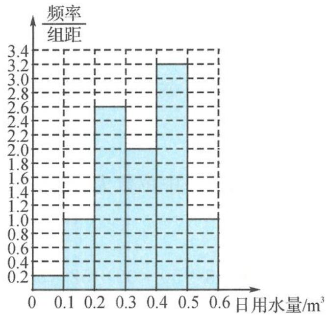

## 3.4.1 样本估计总体

题 1 【解析】因为四个数的平均数为 4, 所以 $a + b = 4 \times 4 - 1 - 2 = 13$ . 不妨假设 $a < b$ , 因为中位数是 3, 所以 $\frac{2 + a}{2} = 3$ , 解得 $a = 4$ . 代入上式得 $b = 13 - 4 = 9$ , 所以 $ab = 36$ . 答案为 36.

【探讨】本题考查中位数与平均数的联系与差异.由于不知道四个数的大小关系,因此从平均数入手会更加直接.

题 2 【解析】对于选项 A, 因为 A 地中位数为 2、极差为 5, 故最大值不会大于 $2+5=7$ , 故选项 A 正确;

对于选项 B, 若 B 地过去 10 日分别为 0, 0, 0, 2, 2, 2, 2, 2, 2, 8, 则满足总体平均数为 2、众数为 2, 但不满足每天新增疑似病例不超过 7 人, 故选项 B 错误;

对于选项 C, 若丙地过去 10 日分别为 0, 0, 0, 0, 0, 0, 0, 0, 1, 9, 则满足总体平均数为 1, 总体方差大于 0, 但不满足每天新增疑似病例不超过 7 人, 故选项 C 错误;

对于选项 D, 利用反证法, 若至少有一天疑似病例超过 7 人, 则方差大于 $\frac{1}{10} \times (8 - 2)^{2} = 3.6 > 3$ 与题设矛盾, 故连续 10 天, 每天新增疑似病例不超过 7 人, 故选项 D 正确.

综上,答案选 AD.

【探讨】要清楚“一定符合没有发生大规模群体感染标志”的含义是什么,既可以是中心位置没变,也可以是没有极端值影响,也即离散程度小.因此本题考查数字特征的实际意义以及内涵.具体可以列举一些极端值(离群数据)更容易发现反例.

题 3 【解析】一个数由 6 改为 3, 另一个数由 2 改为 5, 所以该数据的平均数 $\overline{x}$ 不变.

设没有改变的8个数分别为 $x_{1}, x_{2}, x_{3}, x_{4}, x_{5}, x_{6}, x_{7}, x_{8}$ ,

原来一组数的方差 $s^{2}=\frac{1}{10}\left[(x_{1}-\bar{x})^{2}+\cdots+(x_{8}-\bar{x})^{2}+(6-\bar{x})^{2}+(2-\bar{x})^{2}\right]$ ,

改变后一组数的方差 $s^{\prime 2} = \frac{1}{10}\left[(x_{1} - \overline{x})^{2} + \dots + (x_{8} - \overline{x})^{2} + (3 - \overline{x})^{2} + (5 - \overline{x})^{2}\right]$

所以 $s^{\prime 2} - s^{2} = \frac{1}{10}\left[(3 - \overline{x})^{2} + (5 - \overline{x})^{2} - \right.$ $(6 - \overline{x})^{2} - (2 - \overline{x})^{2}] = -0.6,$

所以新的数据的方差比原来一组数据的方差减少值为 0.6.

综上,答案选 C.

【探讨】列出方差的公式才更容易看出前后变的量有哪些,不变的量有哪些.

题 4 【解析】设 9 位评委评分按从小到大排列为 $x_{1}<x_{2}<x_{3}<x_{4}\cdots<x_{8}<x_{9}$ .

①原始中位数为 $x_{5}$ ，去掉最低分 $x_{1}$ ，最高分 $x_{9}$ 后剩余 $x_{2}<x_{3}<x_{4}\cdots<x_{8}$ ，中位数仍为 $x_{5}$ ，选项 A 正确；

②原始平均数 $\bar{x}=\frac{1}{9}(x_{1}+x_{2}+x_{3}+x_{4}+\cdots+x_{8}+x_{9})$ ，新的平均数 $\overline{x^{\prime}}=\frac{1}{7}(x_{2}+x_{3}+x_{4}+\cdots+x_{8})$ ，平均数受极端值影响较大，故 $\bar{x}$ 与 $\overline{x^{\prime}}$ 不一定相

同,选项 B 不正确;

③ $S^2 = \frac{1}{9} [(x_1 - \overline{x})^2 + (x_2 - \overline{x})^2 + \cdots + (x_9 - \overline{x})^2], s'^2 = \frac{1}{7} [(x_2 - \overline{x}')^2 + (x_3 - \overline{x}')^2 + \cdots + (x_8 - \overline{x}')^2]$ ，由②易知，选项C不正确；

④原极差 $=x_{9}-x_{1}$ ，新的极差 $=x_{8}-x_{2}$ ，显然极差变小，选项D不正确.

综上,答案选 A.

【探讨】百分位数和中位数是位置变量,受极端值影响小.去掉一个最高分一个最低分,本身就是为了去掉极端值的影响,因此中位数是不变的数字特征.平均分容易受极端值影响,去掉最高分和最低分就是为了抵消极端数值的影响.方差和极差是刻画离散程度的量,都会都受到极端值影响.因此本题可以不用公式计算,直接得出结论.

题 5 【解析】(Ⅰ)由题意可知,随机调查的100个企业中增长率超过40%的企业有 $14+7=21$ 个,产值负增长的企业有2个,所以估计增长率不低于40%的企业的比例为 $\frac{21}{100}$ ,估计产值负增长的企业的比例为 $\frac{2}{100}=\frac{1}{50}$ .

（Ⅱ）由题意可知，平均值 $\bar{y}=$ $2\times(-0.1)+24\times0.1+53\times0.3+14\times0.5+7\times0.7=100=0.3,$

方差

$$
s ^ {2} = \frac {1}{1 0 0} [ 2 \times (- 0. 1 - 0. 3) ^ {2} + 2 4 \times (0. 1 -
$$

$0.3)^{2} + 53 \times (0.3 - 0.3)^{2} + 14 \times (0.5 - 0.3)^{2} + 7$ $\times (0.7 - 0.3)^{2}]$

$$
= \frac {1}{1 0 0} (0. 3 2 + 0. 9 6 + 0. 5 6 + 1. 1 2) = 0. 0 2 9 6,
$$

所以标准差 $s = \sqrt{0.0296} = \sqrt{0.0004 \times 74} \approx 0.02 \times 8.602 \approx 0.17$ .

所以,这类企业产值增长率的平均数与标准差的估计值分别为 0.3,0.17.

题 6 【解析】(I)前 4 组的频率和为 0.05+

$0.1 + 0.1 + 0.2 = 0.45$ ，故中位数为 $70 + \frac{0.05}{0.03} = 70$ $+\frac{5}{3}\approx 71.67.$

4000 名学生的平均成绩为 $0.05 \times 35 + 0.1 \times 45 + 0.1 \times 55 + 0.2 \times 65 + 0.3 \times 75 + 0.2 \times 85 + 0.05 \times 95 = 69$ .

估计样本数据的中位数为 71.67, 估计 4000 名学生的平均成绩为 69 分.

（Ⅱ）由频率分布直方图得样本中高于60分的人数占总人数的0.75.

因为分数高于 60 分的男生、女生数相等, 故高于 60 分的男生、女生人数均为 $400 \times 0.75 \times 0.5 = 150$ (人).

因为样本中有三分之二的男生分数高于60分，所以样本中共有男生 $150\div\frac{2}{3}=225$ （人），女生175人.

又因为样本是按照男女学生比例采用分层抽样的方法得到,故该校男生和女生人数的比例估计为 225:175=9:7.

(Ⅲ) $s^2 = \sum_{i=1}^{n}(x_i - \overline{x})^2 p_i = (35 - 69)^2 \times 0.05 + (45 - 69)^2 \times 0.1 + (55 - 69)^2 \times 0.1 + (65 - 69)^2 \times 0.2 + (75 - 69)^2 \times 0.3 + (85 - 69)^2 \times 0.2 + (95 - 69)^2 \times 0.05 = 234,$

所以 $s=\sqrt{234}=\sqrt{2}\times\sqrt{117}\approx15.12,\bar{x}-2s=$ 69-15.12×2=38.76.

故测试成绩 $x < \bar{x} - 2s$ ，占比为 $0.05 \times 0.876 = 0.0438$ .

估计该中学测试成绩不达标的人数约为 $0.0438 \times 4000 \approx 175$ （人）.

题 7 【解析】(I)由题意得 $a+0.20+0.15=0.70$ ，解得 a=0.35。

由 $0.05 + b + 0.15 = 1 - P(C) = 1 - 0.70$ ，解得 $b = 0.10$

(Ⅱ)由甲离子的直方图可得,估计甲离子残留百分比的平均值为

$0.15 \times 2 + 0.20 \times 3 + 0.30 \times 4 + 0.20 \times 5 + 0.10 \times 6 + 0.05 \times 7 = 4.05.$

估计乙离子残留百分比的平均值为 $0.05 \times 3 + 0.10 \times 4 + 0.15 \times 5 + 0.35 \times 6 + 0.20 \times 7 + 0.15 \times 8 = 6$ .

【探讨】本题是2019年全国Ⅲ卷理(文)科第17题,试题编制了一个分析和处理数据的问题.

题 8 【解析】(Ⅰ)作出直方图,如图所示.

(Ⅱ)根据以上数据,该家庭使用节水龙头后50天日用水量小于 $0.35m^{3}$ 的频率为 $0.2\times0.1+1\times0.1+2.6\times0.1+2\times0.05=0.48$ ,

因此该家庭使用节水龙头后日用水量小于 $0.35\mathrm{m}^3$ 的概率的估计值为0.48.

（Ⅲ）该家庭未使用节水龙头50天日用水量的平均数为 $\overline{x_1} = \frac{1}{50}(0.05\times 1 + 0.15\times 3 + 0.25\times 2+$ $0.35\times 4 + 0.45\times 9 + 0.55\times 26 + 0.65\times 5) = 0.48.$

该家庭使用了节水龙头后 50 天日用水量的平均数为

$$
\overline {{{x}}} _ {2} = \frac {1}{5 0} (0. 0 5 \times 1 + 0. 1 5 \times 5 + 0. 2 5 \times 1 3 + 0. 3 5
$$

$$
\times 1 0 + 0. 4 5 \times 1 6 + 0. 5 5 \times 5) = 0. 3 5.
$$

估计使用节水龙头后，一年可节省水 $(0.48 - 0.35)\times 365 = 47.45(\mathrm{m}^3)$

【探讨】本题是2018年全国I卷文科第19题，题目贴近生活，具有现实意义，凸显了对统计方法应用的考查.

题 9 【解析】(I) 每道题实测的答对人数及相应的实测难度如下表.

<!-- source-part:2 pages:201-213 -->

<table><tr><td>题号</td><td>1</td><td>2</td><td>3</td><td>4</td><td>5</td></tr><tr><td>实测答对人数</td><td>8</td><td>8</td><td>7</td><td>7</td><td>2</td></tr><tr><td>实测难度</td><td>0.8</td><td>0.8</td><td>0.7</td><td>0.7</td><td>0.2</td></tr></table>

所以,估计 120 人中有 $120 \times 0.2 = 24$ 人答对第 5 题.

(Ⅱ) $P_{i}^{\prime}$ 为抽样的10名学生中第i题的实测难度,用 $P_{i}^{\prime}$ 作为这120名学生第i题的实测难度.

$S = \frac{1}{5} [(0.8 - 0.9)^2 +(0.8 - 0.8)^2 +(0.7 - 0.7)^2 +(0.7 - 0.6)^2 +(0.2 - 0.4)^2 ] = 0.012.$

因为 S=0.012<0.05，所以本次测试的难度预估是合理的。

题 10 【解析】(I) 中位数为 $\frac{43+46}{2}=44.5$ .
平均数为 $\frac{35+46+32+42+43+50+39+52+51+60}{10}=45.$

(Ⅱ)由题意知,今年花市期间该摊位所售精品的销售量与时间段有关,明年合租摊位的租金较为合理的分摊方法是根据今年的平均销售量按比例分担.

因为今年白天的平均销售量为 $\frac{35+32+43+39+51}{5}=40$ （件/天），

今年晚上的平均销售量为 $\frac{46 + 42 + 50 + 52 + 60}{5} = 50$ （件/天），

所以甲同学应分担的租金为 $900 \times \frac{40}{40 + 50} = 400$ (元),

乙同学应分担的租金为 $900 \times \frac{50}{40 + 50} = 500$ （元）.

【探讨】本小题也可直接用白天、晚上的总销售量按比例分摊租金.
