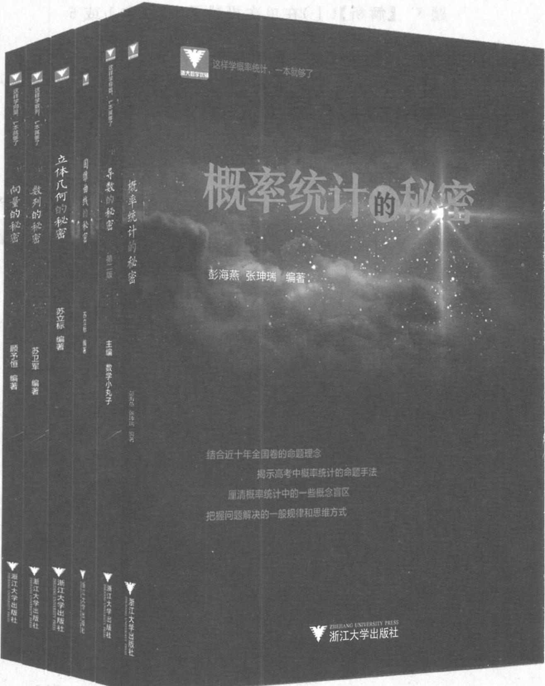

题 1 【解析】由题意,设第 n 次爬行后仍然在上底面的概率为 $P_{n}$ .

①若上一步在上面,再走一步要想不掉下去,
只有两条路,其概率为 $\frac{2}{3}P_{n-1}(n\geqslant2)$ ;

②若上一步在下面,则第 n-1 步不在上面的概率是 $1-P_{n-1}(n \geqslant 2)$ .

如果爬上来,其概率是 $\frac{1}{3}(1-P_{n-1})(n\geqslant2)$ ,
又两个事件是互斥的，
所以 $P_{n}=\frac{2}{3}P_{n-1}+\frac{1}{3}(1-P_{n-1})$ 即 $P_{n}=\frac{1}{3}P_{n-1}+\frac{1}{3}$ 所以 $P_{n}-\frac{1}{2}=\frac{1}{3}\times\left(P_{n-1}-\frac{1}{2}\right)$ .
故数列 $\left\{P_{n}-\frac{1}{2}\right\}$ 是以 $\frac{1}{3}$ 为公比的等比数列.
因为 $P_{1}=\frac{2}{3}$ ，所以 $P_{n}=\frac{1}{2}\times\left(\frac{1}{3}\right)^{n}+\frac{1}{2}$ .
故当 n=10 时， $P_{10}=\frac{1}{2}\times\left(\frac{1}{3}\right)^{10}+\frac{1}{2}$ .
故选 D.

【探讨】利用概率的加法公式容易得出两个概率间的关系,接下来也是从数列的递推式 $a_{n}=pa_{n-1}$ +q 的视角研究两项间的关系.

题2 【解析】(Ⅰ)当日需求量 $m \leqslant X_{n}$ 时, 日销售量 $Z_{n} = m$ ;
当日需求量 $m > X_{n}$ 时, 日销售量 $Z_{n} = X_{n}$ .
故日销售量 $Z_{n}$ 的期望 $E(Z_{n})$ 满足:
当 $1 \leqslant n \leqslant 9$ 时, $E(Z_{n}) = \sum_{i=1}^{n}(16 + i)P_{i} + \sum_{i=n+1}^{10}(16 + n)P_{i}$ ;
当 $n = 10$ 时, $E(Z_{10}) = \sum_{i=1}^{10}(16 + i)P_{i}$ .
(Ⅱ) $E(Z_{n+1})=\sum_{i=1}^{n+1}(16+i)P_{i}+\sum_{i=n+2}^{10}(16+n+1)P_{i}=$ $=\sum_{i=1}^{n}(16+i)P_{i}+\sum_{i=n+1}^{10}(16+n+1)P_{i}=$ $=\sum_{i=1}^{n}(16+i)P_{i}+\sum_{i=n+1}^{10}(16+n)P_{i}+\sum_{i=n+1}^{10}P_{i}=E(Z_{n})+\sum_{i=n+1}^{10}P_{i}.$

设每天的进货量为 $X_{n}$ ，日利润为 $\xi_{n}$ ，

则 $E(\xi_n) = 5E(Z_n) - 3[(16 + n) - E(Z_n)] = 8E(Z_n) - 3(16 + n)$ ，

$E(\xi_{n + 1}) - E(\xi_n) = 8[E(Z_{n + 1}) - E(Z_n)] - 3$ $= 8(P_{n + 1} + P_{n + 2} + \dots +P_{10}) - 3.$

由 $E(\xi_{n+1}) - E(\xi_n) \geqslant 0$ 得 $P_1 + P_2 + \cdots + P_n \leqslant \frac{5}{8}$ .

因为 $P_{1} + P_{2} + P_{3} + P_{4} = 0.66 > \frac{5}{8}, P_{1} + P_{2} +$ $P_{3} = 0.53 <   \frac{5}{8}$

所以 $E(\xi_{4})$ 最大.

当进货 20 件时, 日利润均值最大.

题3 【解析】(Ⅰ)因为 $A \to B \to C \to A, A \to C \to B \to A$ , 所以 $P_{3}(A) = \frac{1}{2} \times \frac{1}{2} \times \frac{1}{2} + \frac{1}{2} \times \frac{1}{2} \times \frac{1}{2} = \frac{1}{4}$ . 因为 $A \to B \to A \to B, A \to C \to A \to B, A \to B \to C \to B$ , 所以 $P_{3}(B) = \frac{1}{2} \times \frac{1}{2} \times \frac{1}{2} + \frac{1}{2} \times \frac{1}{2} \times \frac{1}{2} +$

$$
\frac {1}{2} \times \frac {1}{2} \times \frac {1}{2} = \frac {3}{8}.
$$

因为 $A \to B \to A \to C, A \to C \to A \to C, A \to C \to B \to C,$

所以 $P_{3}(C) = \frac{1}{2}\times \frac{1}{2}\times \frac{1}{2} +\frac{1}{2}\times \frac{1}{2}\times \frac{1}{2} +$ $\frac{1}{2}\times \frac{1}{2}\times \frac{1}{2} = \frac{3}{8}.$

$$
a _ {n} + b _ {n} + c _ {n} = 1
$$

$$
a _ {n} = \frac {1}{2} b _ {n - 1} +
$$

$$
\frac {1}{2} c _ {n - 1} = \frac {1}{2} (1 - a _ {n - 1})
$$

$$
a _ {n} - \frac {1}{3} = - \frac {1}{2} \left(a _ {n - 1} - \frac {1}{3}\right)
$$

因此，数列 $\left\{a_{n} - \frac{1}{3}\right\}$ 是首项为 $a_1 - \frac{1}{3} = -\frac{1}{3}$ 公比为 $-\frac{1}{2}$ 的等比数列，故 $a_{n} - \frac{1}{3} = -\frac{1}{3} \times \left(-\frac{1}{2}\right)^{n-1}$ ，即 $a_{n} = \frac{1}{3} \times \left[1 - \left(-\frac{1}{2}\right)^{n-1}\right]$ . 因此 $a_{8} = \frac{1}{3} \times \left[1 - \left(-\frac{1}{2}\right)^{7}\right] = \frac{43}{128}$ .

【探讨】 $b_{n}=\frac{1}{2}(a_{n-1}+c_{n-1})$ 是一个重要的隐藏条件,基于消元的思想并结合条件所给的表达式才能得到 $2b_{n}+b_{n-1}=1$ .

题4 【解析】(I)这150个点球中的进球频率为 $\frac{10 + 17 + 20 + 16 + 13 + 14}{150} = 0.6$ 则该同学踢一次点球命中的概率 $P = 0.6$ 由题意， $\xi$ 可能取1,2,3，则 $P(\xi = 1) = 0.6$ ， $P(\xi = 2) = 0.4 \times 0.6 = 0.24$ ， $P(\xi = 3) = 0.4^2 = 0.16.$ 故 $\xi$ 的期望 $E(\xi) = 1 \times 0.6 + 2 \times 0.24 + 3 \times 0.16 = 1.56.$

(Ⅱ)(i)因为从甲开始随机地将球传给其他两人中的任意一人,所以第1次触球者是甲的概率 $P_{1}=1$ ,显然第2次触球者是甲的概率 $P_{2}=0$ ,第2次传球有两种可能,所以第3次触球者是甲的概率

$$
P _ {3} = \frac {1}{2}.
$$

(ii) 因为第 $n$ 次触球者是甲的概率为 $P_{n}$ ,

所以，当 $n \geqslant 2$ 时，第 $n - 1$ 次触球者是甲的概率为 $P_{n - 1}$ ，第 $n - 1$ 次触球者不是甲的概率为 $1 - P_{n - 1}$ ，

则 $P_{n} = P_{n - 1}\times 0 + (1 - P_{n - 1})\times \frac{1}{2} =$ $(1 - P_{n - 1})\times \frac{1}{2}.$

从而 $P_{n} - \frac{1}{3} = -\frac{1}{2}\times \left(P_{n - 1} - \frac{1}{3}\right).$

又 $P_{1} - \frac{1}{3} = \frac{2}{3}$ 所以 $\left\{P_n - \frac{1}{3}\right\}$ 是以 $\frac{2}{3}$ 为首项、 $-\frac{1}{2}$ 为公比的等比数列.

【探讨】题3和题4的本质是一致的,都是在三个点间传递,在全概率公式的基础上得到 $P_{n},P_{n-1}$ 之间的关系.

题 5 【解析】(Ⅰ)在单次投骰子中,投中1或6的概率为 $\frac{1}{3}$ ,投中2到5的概率为 $\frac{2}{3}$ ,

所以 $P(X=0)=\frac{2}{3}, P(X=1)=\frac{1}{3}\times\frac{2}{3}=\frac{2}{9}$ ,
从而 $P(X \geqslant 2) = 1 - P(X = 0) - P(X = 1) =$ $1 - \frac{2}{3} - \frac{2}{9} = \frac{1}{9}.$

(Ⅱ)X 可能的取值为 0,1,2,…,n.

依题意得 $P(X=k)=\left(\frac{1}{3}\right)^{k}\times\frac{2}{3}(k=0,1,2,$

$\cdots,n-1)$ ,

$$
P (X = n) = \left(\frac {1}{3}\right) ^ {n}.
$$

所以 $X$ 的分布列为

<table><tr><td>X</td><td>0</td><td>1</td><td>2</td><td>...</td><td>n-1</td><td>n</td></tr><tr><td>P</td><td> $\frac{2}{3}$ </td><td> $\frac{1}{3} \times \frac{2}{3}$ </td><td> $\left( \frac{1}{3} \right)^{2} \times \frac{2}{3}$ </td><td>...</td><td> $\left( \frac{1}{3} \right)^{n-1} \times \frac{2}{3}$ </td><td> $\left( \frac{1}{3} \right)^{n}$ </td></tr></table>

(Ⅲ) $E(X)=1\times\frac{1}{3}\times\frac{2}{3}+2\times\left(\frac{1}{3}\right)^{2}\times\frac{2}{3}+\cdots$ $+ (n-1)\times\left(\frac{1}{3}\right)^{n-1}\times\frac{2}{3}+n\times\left(\frac{1}{3}\right)^{n}$ $=1\times\frac{1}{3}\times\frac{2}{3}+2\times\left(\frac{1}{3}\right)^{2}\times\frac{2}{3}+\cdots+(n-1)\times$ $\left(\frac{1}{3}\right)^{n-1}\times\frac{2}{3}+n\times\left(\frac{1}{3}\right)^{n}\times\frac{2}{3}+\frac{n}{3}\times\left(\frac{1}{3}\right)^{n}$ ①, $\frac{1}{3}E(X)=1\times\left(\frac{1}{3}\right)^{2}\times\frac{2}{3}+2\times\left(\frac{1}{3}\right)^{3}\times\frac{2}{3}+\cdots$ $+ (n-1)\times\left(\frac{1}{3}\right)^{n}\times\frac{2}{3}+n\times\left(\frac{1}{3}\right)^{n+1}$ ②,

①-②得 $\frac{2}{3}E(X)=\frac{2}{3}\times\left[\frac{1}{3}+\left(\frac{1}{3}\right)^{2}+\left(\frac{1}{3}\right)^{3}\right.$ $+ \cdots + \left(\frac{1}{3}\right)^{n}]=\frac{2}{3}\times\frac{\frac{1}{3}\times\left[1-\left(\frac{1}{3}\right)^{n}\right]}{1-\frac{1}{3}}.$ 整理得 $E(X)=\frac{1}{2}\times\left[1-\left(\frac{1}{3}\right)^{n}\right].$

【探讨】本题数列知识的运用是非常明显的,考查数列中错位相减法求和.

# 秘密系列

不只是学习一些数学知识

而是对数学知识进行重构
打通知识的“任督二脉”
使知识成为鲜活的知识

从系统的高度帮助学生深度学习

激活数学思维

强调独立思考与数学探究

遇到有难度、有思维深度的题目就不再慌张

<table><tr><td>书名</td><td>作者</td><td>适用阶段</td></tr><tr><td>圆锥曲线的秘密</td><td>苏立标</td><td>高二高三</td></tr><tr><td>立体几何的秘密</td><td>苏立标</td><td>高二高三</td></tr><tr><td>导数的秘密</td><td>王海刚 陈宇轩</td><td>高二高三</td></tr><tr><td>数列的秘密</td><td>苏卫军</td><td>高二高三</td></tr><tr><td>向量的秘密</td><td>顾予恒</td><td>高二高三</td></tr><tr><td>概率统计的秘密</td><td>彭海燕 张珅瑞</td><td>高二高三</td></tr></table>

# 高中数学新体系

