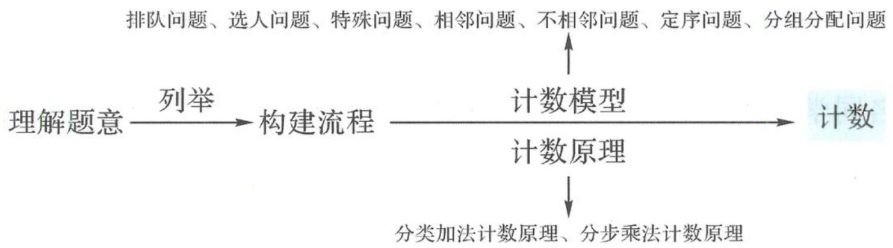

## 1.1 计数问题

## 基本概念解读

## 问题 1 解决计数问题的基本方法是什么？

计数问题在现实生活、生产中普遍存在. 对于比较简单(总体个数少)的计数问题, 可以采取列举, 使用列表和树状图两种方式, 形象且不易遗漏; 对于相对复杂(总体个数多)的计数问题, 则需使用计数原理和排列组合的相关知识. 计数原理和排列组合知识属于组合数学中最基础的部分, 是解决计数问题的基本方法. 值得注意的是, 20 世纪 90 年代末和 21 世纪初, 由于高考“考应用, 考思想, 考能力”, 计数原理和排列组合问题作为具有应用背景的内容难点进入高考, 引起了技巧策略的广泛探索, 但随着高考内容改革以及概率统计逐步深入考查, 当前高考的计数考题更加注重计数原理的本质理解和应用.

问题 2 如何理解两个计数原理？

<table><tr><td>分类加法计数原理</td><td>完成一件事有n类不同的方案,完成第i类方案有mi种不同的方法,那么完成这件事共有m1+m2+···+mn种不同的方法.</td></tr><tr><td>分步乘法计数原理</td><td>完成一件事有n个步骤,完成第i步有mi种不同的方法,那么完成这件事共有m1×m2×···×mn种不同的方法.</td></tr></table>

两个计数原理实际上是我们小学学习的加法运算与乘法运算的推广,它们是解决计数问题的理论基础.不同的是,分类加法计数原理要求把一件复杂的事情分解成若干个类别,而分步乘法计数原理要求把一件复杂的事情分解成若干个步骤.因此在使用这两个计数原理前,需要我们理解透所要研究和完成的这件事:

①有没有需要我们特殊关注的元素？有的话，需要优先处理它们，本质上就是进行分类，我们常称之为“特殊优先”法.

②完成这件事的流程是什么？很多事情不是一次性就能完成的，这就需要我们在头脑中制定出完成整件事的流程，本质上就是进行分步。

另外,不少事情完成的流程可以是多样的,这样就会带来不一样的计数方案,即不同的计数方法.

## 问题 3 如何理解完成一件事的流程？

不同的人做同一件事的具体操作流程经常会不一样,有些体现在先后顺序上,更多的则体现在统筹方法上,很多复杂的事情既可以一点一点地做,也可以先做好规划再统筹进行,正所谓磨刀不误砍柴工.具体到计数问题,基于统筹方法设计一件事的流程,往往会给计数带来方便.

问题 4 如何理解排列与组合？

<table><tr><td>排列</td><td>从n个不同元素中取出m个元素,并按照一定的顺序排成一列,叫作排列.其中,所有不同排列的个数叫作排列数,记为 $A_{n}^{m}=\frac{n!}{(n-m)!}=n(n-1)(n-2)\cdots(n-m+1)$ .</td></tr><tr><td>组合</td><td>从n个不同元素中取出m个元素作为一组,叫作组合.其中,所有不同组合的个数叫作组合数,记为 $C_{n}^{m}=\frac{A_{n}^{m}}{m!}=\frac{n!}{(n-m)!m!}=\frac{n(n-1)(n-2)\cdots(n-m+1)}{m!}$ .</td></tr></table>

排列与组合是两类特殊的计数问题,是我们基于简化运算的角度提出的两个概念,而它们的推导证明就要用到两个计数原理.我们先学习计数原理后学习排列组合,体现了数学中由一般到特殊的研究思路.

## 典型考题探讨

![[高中/总复习/专题/高考数学秘密/浙大优辅《高中数学新体系 概率统计的秘密》/第一章_计数原理/1_1_计数问题/questions/Q00037688.md]]
![[高中/总复习/专题/高考数学秘密/浙大优辅《高中数学新体系 概率统计的秘密》/第一章_计数原理/1_1_计数问题/questions/Q00037689.md]]
![[高中/总复习/专题/高考数学秘密/浙大优辅《高中数学新体系 概率统计的秘密》/第一章_计数原理/1_1_计数问题/questions/Q00037690.md]]
![[高中/总复习/专题/高考数学秘密/浙大优辅《高中数学新体系 概率统计的秘密》/第一章_计数原理/1_1_计数问题/questions/Q00037691.md]]
![[高中/总复习/专题/高考数学秘密/浙大优辅《高中数学新体系 概率统计的秘密》/第一章_计数原理/1_1_计数问题/questions/Q00037692.md]]
![[高中/总复习/专题/高考数学秘密/浙大优辅《高中数学新体系 概率统计的秘密》/第一章_计数原理/1_1_计数问题/questions/Q00037693.md]]
![[高中/总复习/专题/高考数学秘密/浙大优辅《高中数学新体系 概率统计的秘密》/第一章_计数原理/1_1_计数问题/questions/Q00037694.md]]
![[高中/总复习/专题/高考数学秘密/浙大优辅《高中数学新体系 概率统计的秘密》/第一章_计数原理/1_1_计数问题/questions/Q00037695.md]]
![[高中/总复习/专题/高考数学秘密/浙大优辅《高中数学新体系 概率统计的秘密》/第一章_计数原理/1_1_计数问题/questions/Q00037696.md]]
![[高中/总复习/专题/高考数学秘密/浙大优辅《高中数学新体系 概率统计的秘密》/第一章_计数原理/1_1_计数问题/questions/Q00037697.md]]
![[高中/总复习/专题/高考数学秘密/浙大优辅《高中数学新体系 概率统计的秘密》/第一章_计数原理/1_1_计数问题/questions/Q00037698.md]]
![[高中/总复习/专题/高考数学秘密/浙大优辅《高中数学新体系 概率统计的秘密》/第一章_计数原理/1_1_计数问题/questions/Q00037699.md]]
![[高中/总复习/专题/高考数学秘密/浙大优辅《高中数学新体系 概率统计的秘密》/第一章_计数原理/1_1_计数问题/questions/Q00037700.md]]
![[高中/总复习/专题/高考数学秘密/浙大优辅《高中数学新体系 概率统计的秘密》/第一章_计数原理/1_1_计数问题/questions/Q00037701.md]]
![[高中/总复习/专题/高考数学秘密/浙大优辅《高中数学新体系 概率统计的秘密》/第一章_计数原理/1_1_计数问题/questions/Q00037702.md]]
![[高中/总复习/专题/高考数学秘密/浙大优辅《高中数学新体系 概率统计的秘密》/第一章_计数原理/1_1_计数问题/questions/Q00037703.md]]

## 研究路径探索

由上述例题的分析与解,我们可以得到计数问题的基本研究路径,如图所示.

首先,要分析题意,理解清楚“这件事”是什么(很多时候列举法依然是帮助我们明晰思路的好办法,要学会使用“树状图”和“流程图”分析问题).

其次,构建出完成“这件事”的流程,识别“这件事”是否是我们熟悉的计数模型.我们已经解决过、熟悉的计数模型有很多,像排队问题(排列)、选人问题(组合)、特殊问题(分类,特殊优先,正难则反)、相邻问题(捆绑法)、不相邻问题(插空法)、定序问题(缩倍法)、分组分配问题(先分组后分配)等.

如果“这件事”并不是我们熟悉的模型,那么我们还可以回到计数原理上来,按照事件的流程做出计算.

当然,很多比较复杂试题的解决过程中既要用到基本的计数原理进行分解,又在其中某一类型或某一步骤当中包含着计数模型.
