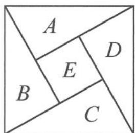

<!-- question-source:start -->
题 1-4 《周髀算经》是中国最古老的天文学、数学著作,公元3世纪初中国数学家赵爽创制了“勾股圆方图”(如图),用以证明其中记载的勾股定理.现提供4种不同颜色将图中的5个区域涂色,规定每个区域只涂1种颜色,相邻区域颜色不同,则不同涂色的方法有( ).

A. 36 种
B. 48 种
C. 72 种
D. 96 种

<!-- question-source:end -->

![[Q00037692A1]]
