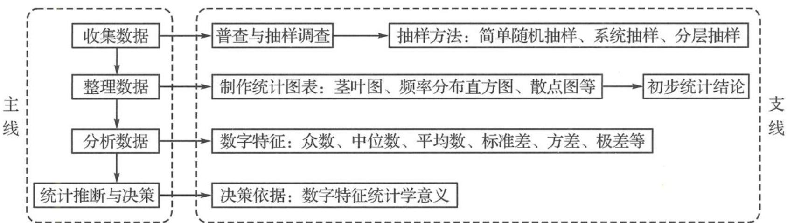
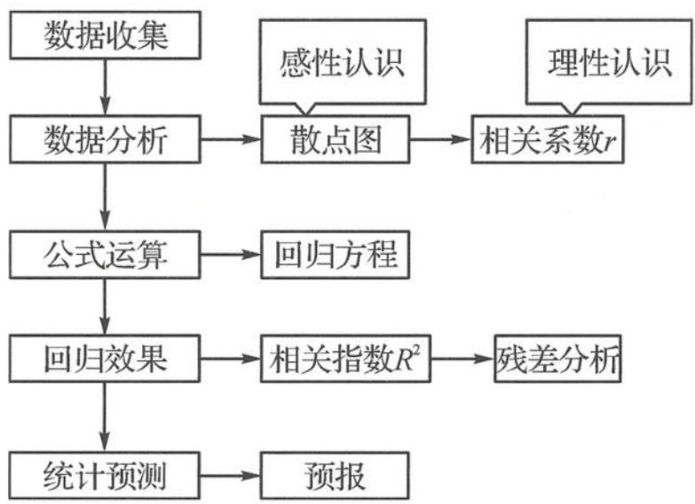
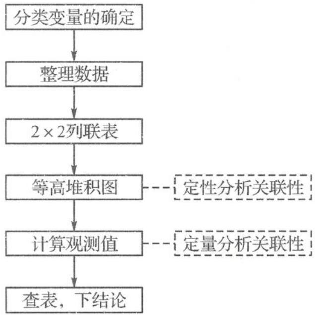

## 3.1 基本研究路径下的“统计”解题

统计是通过收集、整理和分析带有随机性影响的数据来认识未知现象的一门学科,它可以为人们制定决策提供依据.针对研究对象获取数据,运用数学方法对数据进行整理、分析和推断,最终形成关于研究对象知识是统计的基本流程.统计推断思想是一种根据样本信息来估计总体信息的思想方法,是一种由局部到整体的归纳思想,与概率相比,统计偏重于归纳.对这部分思想方法的考查,重点放在用样本的数字特征去估计总体的相应的数字特征,即用样本的平均数、方差和标准差等统计量去估计总体的平均数、方差和标准差等;用样本的频率分布去估计总体的频率分布;通过对样本数据的分析做出推断.

## 1. 统计推断的基本研究路径

“未知现象→确定任务→收集数据→处理数据(描述性统计)→分析数据(统计模型)→应用数据(统计推断)”

具体而言,即

此外,对于依据数字特征的决策,在问题解决中要思考:①常用的数字特征有哪些;②各数字特征产生的背景(产生在统计活动中的哪个环节);③利用哪一个(或几个)数字特征做决策;④如何根据数值大小合理决策.在统计活动的思维过程中,要主动思考明确平均数、中位数、众数代言平均水平,极差、方差、标准差代言稳定程度.

## 2. 回归分析的研究路径

## 3. 独立性检验的研究路径

建立了分类变量 X 与 Y 的 $2 \times 2$ 列联表后,有些同学并不能理解查表的含义,只是套公式,所以容易遗忘出错,因而必须准确理解其依据,其决策思路为

$$
\boxed {X \text {与} Y \text {独立}} \xleftarrow {} \boxed {\frac {a}{a + b} \approx \frac {c}{c + d}} \xleftarrow {} \boxed {| a d - b c | \text {小}} \xleftarrow {} \boxed {k \text {小}} \xleftarrow {} \boxed {P (K ^ {2} > k) \text {大}}
$$

结论: k 越大, $P(K^{2}>k)$ 越小, “X 与 Y 有关系”犯错率越小, 更有把握认为“X 与 Y 有关系”. 先把思路想通, 再通过查表量化犯错率.
