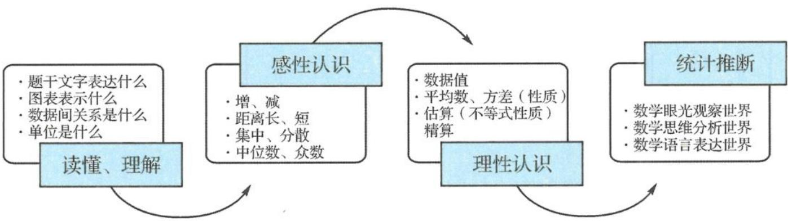

## 3.3 统计图表

## 基本概念解读

## 问题 1 什么是统计图表？怎么画统计图表？

统计图表代表了一张图形化的数据,通常用来方便人们理解大量数据,以及数据之间的关系,让人们透过视觉化的符号,更快速地读取原始数据.所谓数据可视化就是通过图形,呈现出数据大小、占比、分布等特点,从而传递信息给大家.统计图表已经被广泛用于各种领域,过去是在坐标纸或方格纸上手绘,现代则多用电脑软件产生,如 Excel, FineBI 等.

## 问题 2 如何获得统计图表?

在网络上,有很多专门提供统计图表的公司或部门,它们提供政府部分允许公开的各类数据,并用可视化的方式呈现出来,如中国统计政府网站以及微信公众号“谷雨数据”“网易数读”“澎湃美数课”等,我们在命制地方性试题时常从其中选取素材.当然,我们也常利用电脑软件主动绘制统计图表.

## 问题 3 我们已经学习了哪些统计图表？它们的功能分别是什么？

我们学习过扇形图、条形图、折线图、频数分布直方图、频率分布直方图等. 不同的统计图在表示数据上有不同的特点.

<table><tr><td>扇形图、饼图</td><td>主要用于直观描述各类数据占总数的比例.</td></tr><tr><td>柱状图、条形图、频数分布直方图、频率分布直方图</td><td>主要用于直观描述不同类型或分组数据的频数和频率,条形图适用于描述离散型数据,直方图适用描述连续型数据.</td></tr><tr><td>折线图、散点图</td><td>主要用于描述数据随时间的变化趋势.</td></tr><tr><td>雷达图</td><td>雷达图是以从同一点开始的轴上表示的多变量数据的图形方法.</td></tr><tr><td>茎叶图</td><td>茎叶图的思路是将数组中的数按位数进行比较,将数的大小基本不变或变化不大的位作为一个茎,将变化大的位的数作为叶,列在茎的后面.将茎叶图的茎和叶按逆时针方向旋转,实际上就是一个直方图,可以从中统计出次数,计算出各数据段的频率.</td></tr><tr><td>频数分布表</td><td>将一组计量资料按观察值大小分为不同组段,然后将各观察值归纳到各组段中,最后清点各组段的频数,以表格的形式进行表示.</td></tr><tr><td>列联表</td><td>列联表是将观测数据按两个或更多属性(定性变量)分类时所列出的频数分布表,高中常见的是2×2列联表.</td></tr></table>

## 问题 4 从考生的角度,统计图表类问题如何进行解答?

统计图表类问题多数作为选择题的形式出现,尤其是多项选择题,命题人会从多个角度对统计图表做出表达.考生需要重点关注统计图表的类型,尤其是统计图表中数据表达的含义和单位.从统计表中刻画的基本概念出发,对四个选项逐个做出判断,把握住这一点,即便某种统计图表从未在教材或试卷中出现过,考生也能够轻松识别它并解决相关问题.

问题 5 统计图表的意义何在?

整理和显示统计数据是统计学的重要内容. 利用统计图显示数据既简单又直观, 是数据处理的重要技术手段. 对数据整理, 选取合适的统计图显示数据, 解读统计图, 并从中提取信息是统计学的核心素养之一.

## 典型考题探讨

![[高中/总复习/专题/高考数学秘密/浙大优辅《高中数学新体系 概率统计的秘密》/第三章_统计/3_3_统计图表/questions/Q00037818.md]]
![[高中/总复习/专题/高考数学秘密/浙大优辅《高中数学新体系 概率统计的秘密》/第三章_统计/3_3_统计图表/questions/Q00037819.md]]
![[高中/总复习/专题/高考数学秘密/浙大优辅《高中数学新体系 概率统计的秘密》/第三章_统计/3_3_统计图表/questions/Q00037820.md]]
![[高中/总复习/专题/高考数学秘密/浙大优辅《高中数学新体系 概率统计的秘密》/第三章_统计/3_3_统计图表/questions/Q00037821.md]]
![[高中/总复习/专题/高考数学秘密/浙大优辅《高中数学新体系 概率统计的秘密》/第三章_统计/3_3_统计图表/questions/Q00037822.md]]
![[高中/总复习/专题/高考数学秘密/浙大优辅《高中数学新体系 概率统计的秘密》/第三章_统计/3_3_统计图表/questions/Q00037823.md]]
![[高中/总复习/专题/高考数学秘密/浙大优辅《高中数学新体系 概率统计的秘密》/第三章_统计/3_3_统计图表/questions/Q00037824.md]]
![[高中/总复习/专题/高考数学秘密/浙大优辅《高中数学新体系 概率统计的秘密》/第三章_统计/3_3_统计图表/questions/Q00037825.md]]
![[高中/总复习/专题/高考数学秘密/浙大优辅《高中数学新体系 概率统计的秘密》/第三章_统计/3_3_统计图表/questions/Q00037826.md]]
![[高中/总复习/专题/高考数学秘密/浙大优辅《高中数学新体系 概率统计的秘密》/第三章_统计/3_3_统计图表/questions/Q00037827.md]]
![[高中/总复习/专题/高考数学秘密/浙大优辅《高中数学新体系 概率统计的秘密》/第三章_统计/3_3_统计图表/questions/Q00037828.md]]
![[高中/总复习/专题/高考数学秘密/浙大优辅《高中数学新体系 概率统计的秘密》/第三章_统计/3_3_统计图表/questions/Q00037829.md]]
![[高中/总复习/专题/高考数学秘密/浙大优辅《高中数学新体系 概率统计的秘密》/第三章_统计/3_3_统计图表/questions/Q00037830.md]]

## 研究路径探索

由上述例题的分析与解,我们可以得到统计图表问题的基本研究路径,如图所示.

具体而言,第一步是读懂、理解.仔细阅读试题题干呈现出的背景情境,提炼出表达的信息;分析统计图表的类型;关键是明确数据间的关系是什么(尤其是有多个图表,多类数据的时候),数据本身的单位是什么(如常考的频率分布直方图中纵坐标表示 $\frac{频率}{组距}$ ).

第二步是感性认知. 统计图表最大的意义就是直观, 因此很多信息可以通过观察来估计, 通常有增减情况、距离的长短、集中趋势(平均数, 中位数, 众数), 还有离散程度(方差)等.

第三步是理性认识. 统计图表问题在语文、政治等其他学科中也都有出现, 数学学科中的统计图表问题最大的不同点就体现在计算上, 数学学科的统计图表问题是需要计算的. 如计算具体数据值、样本的平均数、方差等. 在计算的方法上, 可以是精确计算, 也可以利用相关不等式知识做出估算, 这就要结合题目的精度要求做出选择了.

常用不等式性质有：

①若 $a > b, c > d$ ，则 $a + c > b + d$ .

常用此性质作小数求和的估算,如

$$
\frac {1 . 7 + 1 . 5 + 2 . 3 + 2 . 5 + 2 . 7 + 2 . 7 + 2 . 8 + 2 . 8 + 3 . 0 + 3 . 8 + 4 . 5 + 4 . 5}{1 2}
$$

$$
> \frac {1 . 5 \times 2 + 2 + 2 . 5 \times 5 + 3 . 0 + 3 . 5 + 4 . 5 \times 2}{1 2} = \frac {1 1}{4} > 2. 5.
$$

②若 a > b > 0, c > d > 0，则 $\frac{a}{c} > \frac{b}{c}, \frac{a}{d} > \frac{b}{c}$ .

常用此性质作分数值的估算,如

$$
\frac {5 5 7 5 - 5 5 1}{5 5 7 5} > \frac {5 5 7 5 - 5 5 7 . 5}{5 5 7 5} > 90 \%, \frac {1 4 5 . 4}{4 3 4 . 3} > \frac {1 4 5}{4 3 4 . 3} > \frac {1 4 5}{4 3 5} = \frac {1}{3}.
$$

最后就是统计推断了. 能读懂统计图表是现代公民的基本素养, 我们要从统计图表中得出统计推断, 可以是多种的, 也可以是多维度的. 当然了, 从应试的角度来看, 如果考题是选择题, 则我们只需根据选项来判断就可以了.
