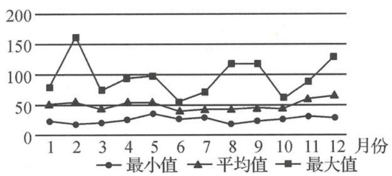

<!-- question-source:start -->
题 1-1 （多选题）空气质量的指数 AQI 是反映空气质量状况的指数，AQI 指数的值越小，表明空气质量越好。AQI 指数不超过 50，空气质量为优；AQI 指数大于 50 且不超过 100，空气质量为良；AQI 指数大于 100，空气质量为污染。下图是某市 2020 年空气质量指数 AQI 的月折线图。下列关于该市 2020 年空气质量的叙述中一定正确的是（）。

某市 2020 年空气质量指数 AQI 月折线图

A. 全年的平均 AQI 指数对应的空气质量等级为优或良
B. 每月都至少有一天空气质量为优
C. 2 月份、8 月份、9 月份和 12 月份均出现污染天气
D. 空气质量为污染的天数最多的月份是 2 月份
<!-- question-source:end -->

![[Q00037819A1]]
