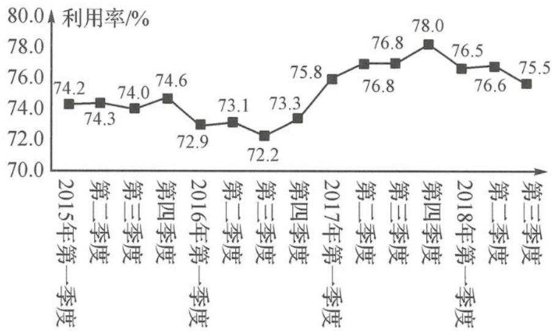

<!-- question-source:start -->
题 1-2 （多选题）产能利用率是指实际产出与生产能力的比率,工业产能利用率是衡量工业生产经营状况的重要指标.下页图为国家统计局发布的 2015 年至 2018 年第二季度我国工业产能利用率的折线图.

2015 年至 2018 年第二季度我国工业产能利用率的折线图

在统计学中, 同比是指本期统计数据与上一年同期统计数据相比较, 例如 2016 年第二季度与 2015 年第二季度相比较; 环比是指本期统计数据与上期统计数据相比较, 例如 2015 年第二季度与 2015 年第一季度相比较. 据上述信息, 下列结论中正确的是( ). A. 2015 年第三季度环比有所降低 B. 2016 年第一季度同比有所降低 C. 2017 年第三季度同比有所提高 D. 2018 年第一季度环比有所提高
<!-- question-source:end -->

![[Q00037820A1]]
