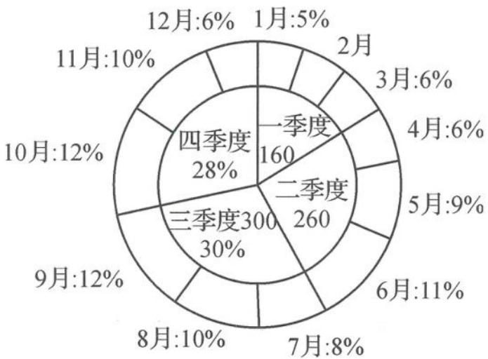

<!-- question-source:start -->
题 1-3 （多选题）某网络销售平台,实施对口扶贫,销售某县扶贫农产品.根据2020年全年该县扶贫农产品的销售额(单位:万元)和扶贫农产品销售额占总销售额的百分比,绘制了如图所示的双层饼图.根据双层饼图(季度和月份后面标注的是销售额或销售额占总销售额的百分比),下列说法正确的是().

A. 2020 年的总销售额为 1000 万元
B. 2 月份的销售额为 8 万元
C. 第四季度销售额为 280 万元
D. 12 个月的销售额的中位数为 90 万元
<!-- question-source:end -->

![[Q00037821A1]]
