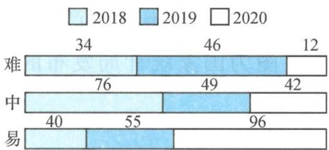

<!-- question-source:start -->
题 1-4 （多选题）如图为某省高考数学卷近三年难易程度的对比图（图中数据为分值）.根据对比图,其中正确的为( ).

某省高考数学卷近三年难易程度对比图

A. 近三年容易题分值逐年增加
B. 近三年中档题分值所占比例最高的年份是 2019 年

C. 2020 年的容易题与中档题的分值之和占总分的 90% 以上
D. 近三年难题分值逐年减少
<!-- question-source:end -->

![[Q00037822A1]]
