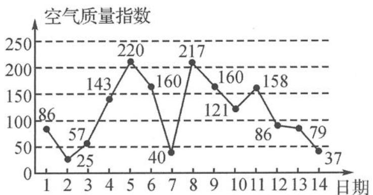

<!-- question-source:start -->
题 1-5 （多选题）空气质量指数大小分为五级，指数越大说明污染的情况越严重，对人体危害越大，指数范围在[0,50],[51,100],[101,200],[201,300],[301,500]对应“优”“良”“轻度污染”“中度污染”“重度污染”五个等级。下面是某市连续14天的空气质量指数变化趋势图，下列说法中正确的是（ ）。

某市连续 14 天的空气质量指数变化趋势图

A. 从2日到5日空气质量越来越好
B. 这14天的空气质量指数的极差为195
C. 这14天的空气质量指数的中位数是103.5
D. 这14天中空气质量指数为“良”的频率为 $\frac{3}{14}$
<!-- question-source:end -->

![[Q00037823A1]]
