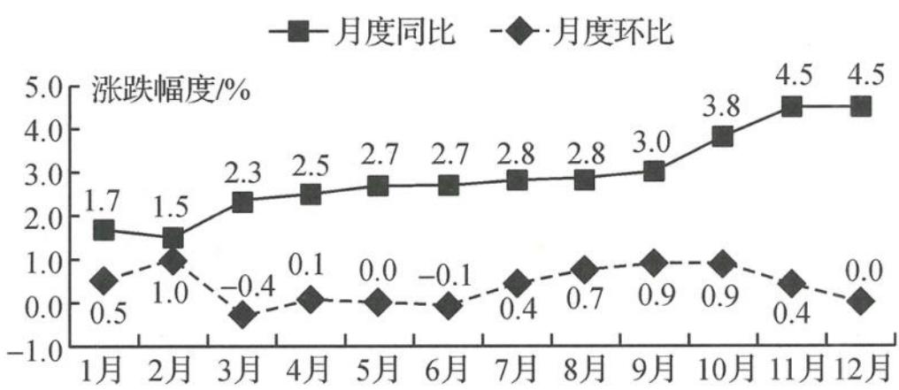
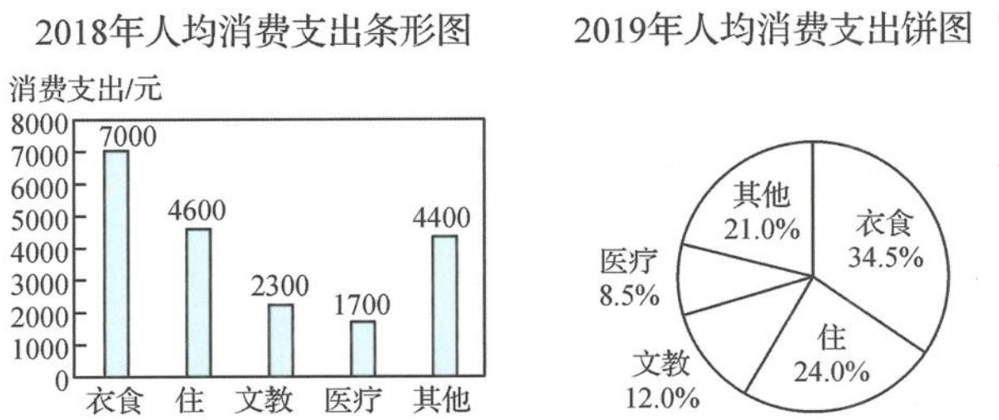

<!-- question-source:start -->
例题 2 2019 年,全国各地区坚持稳中求进的工作总基调,经济运行总体平稳,发展水平迈上新台阶,发展质量稳步上升,人民生活福祉持续增进,全年最终消费支出对国内生产总值增长的贡献率为 57.8%. 下图为 2019 年居民消费价格月度涨跌幅度.(其中同比= $\frac{本期数-去年同期数}{去年同期数}$ ×100%,环比= $\frac{本期数-上期数}{上期数}$ ×100%)

2019年居民消费价格月度涨跌幅度图

下列结论中不正确的是( ). A. 2019 年第三季度的居民消费价格一直都在增长 B. 2018 年 7 月份的居民消费价格比同年 8 月份要低一些 C. 2019 年全年居民消费价格比 2018 年涨了 2.5%以上 D. 2019 年 3 月份的居民消费价格全年最低

【分析】本题中的涨跌幅度图相当于两幅折线图,描述了每一个月度的同比、环比数据情况.从题干中我们可以得出同比和环比的概念,同比是本期相较于去年同期数的涨跌幅度,环比是本期相较于上期数的涨跌幅度,也就是说同比是两年同一月度间的对比,环比是前后两个月度间的对比,所以表达式上还会有“本期数=去年同期数×(1+同比)”,“本期数=上期数×(1+环比)”,概念及其关系是我们首先要弄清楚的.

【解析】由折线图知,2019年7,8,9月份的月度环比都是正数,因此第三季度的居民消费价格一直都在增长,选项A正确;

设2018年7月份、8月份的居民消费价格分别为 $m, n$ ，则2019年7月份、8月份的居民消费价格分别为 $m(1 + 2.8\%)$ ， $n(1 + 2.8\%)$ ，因为2019年第三季度的居民消费价格一直都在增长，所以 $m(1 + 2.8\%) < n(1 + 2.8\%)$ ，则 $m < n$ ，选项B正确；

各月居民消费价格大致相同,计算12个月同比的平均值约为 $\frac{1}{12}\times(1.7+1.5+2.3+2.5+2.7+2.7+2.8+2.8+3.0+3.8+4.5+4.5)=2.9$ ,选项C正确;

不妨设2019年1月份消费价格为 $a$ ，则2月份消费价格为 $a(1 + 1\%) = 1.01a,3$ 月份消费价格为 $1.01a(1 - 0.4\%) = 1.00596a$ ，所以2019年3月份消费价格大于1月份消费价格，选项D错误.

综上,答案选 D.

【探讨】折线图可以显示随时间而变化的连续数据,因此非常适用于显示在相等时间间隔下数据的趋势.很明显,选项D就是命题人基于“数据定义和单位”设置的陷阱,因为从图中可以看出2019年3月份的环比值最低,但这只是表示3月份相较于2月份下降幅度比较大,并不代表着3月份的消费价格就最低.从环比折线图可以看出,2019年上半年呈“增减增”的趋势,因此需要将3月份消费价格和1月份、6月份的进行大小比较才能确定哪个月最低.事实上,设3月份消费价格为b,则6月份消费价格为 $b(1+1\%)(1-1\%)=\frac{9999}{10000}b<b$ .因此,判断6月份消费价格比3月份小更容易些,这也是不等式 $(1+x\%)(1-x\%) \leqslant 1$ 的应用.在选项B中,利用2019年7,8月份消费价格的大小关系,再结合同比值相同得出2018年7,8月份消费价格的大小关系,这个过程综合了两幅折线图的信息,体现了它们的关联,代数上也体现了不等式性质“若a<b,c>0,则ac<bc”.挑选统计图表素材时,选取两幅相关联的素材,并设置选项支体现出这种关联性,这也是常见的命题方向之一.另外,选项C的判断可以无须精确的计算,一方面, $\frac{1}{12}\times(1.7+1.5+2.3+2.5+2.7+2.7+2.8+2.8+3.0+3.8+4.5+4.5)>\frac{1}{12}\times(1.5\times2+2+2.5\times5+3.0+3.5+4.5\times2)=\frac{11}{4}>2.5$ ,将数据适当放缩能够简化计算的过程(注意有时也有可能放缩过度得不出判断,如 $\frac{1}{12}\times(1.7+1.5+2.3+2.5+2.7+2.7+2.8+2.8+3.0+3.8+4.5+4.5)>\frac{1}{12}\times(1\times2+2\times6+3\times4)=\frac{13}{6}$ ,而 $\frac{13}{6}<2.5$ );另一方面,由图可以看出,一年中有9个月的同比不低于2.5%,且后4个月明显大于2.5%,只有3个月的同比小于2.5%,因此可以估计出全年增长了2.5%以上.

综上,选项 A 直接由环比概念、环比折线图的数据就能得出判断;选项 C 的判断既可以直接计算,也可以放缩估算,还可以从图形中直观观察得出;选项 B,D 的判断则需要精确的计算,可以是具体的计算,本题还能利用不等式的相关知识简化运算过程.

## 拓展探讨题
<!-- question-source:end -->
