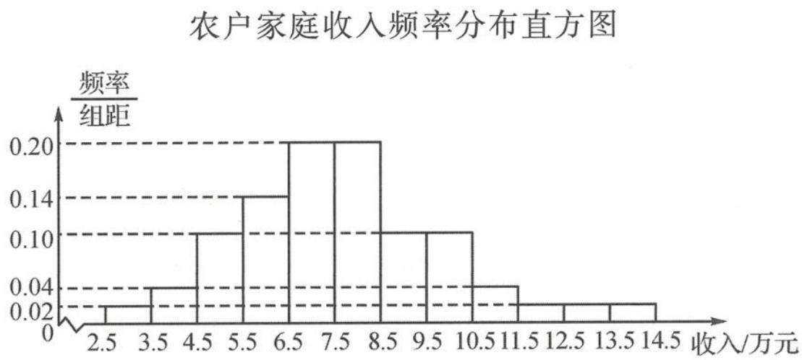

<!-- question-source:start -->
题 2-1 为了解某地农村经济情况,对该地农户家庭年收入进行抽样调查,将农户家庭的调查数据整理得到如下频率分布直方图.

根据此频率分布直方图,下面结论中不正确的是( ).
A. 该地农户家庭年收入低于 4.5 万元的农户比率估计为 6%
B. 该地农户家庭年收入不低于 10.5 万元的农户比率估计为 10%
C. 估计该地农户家庭年收入的平均值不超过 6.5 万元
D. 估计该地有一半以上的农户,其家庭年收入在 4.5 万元至 8.5 万元
<!-- question-source:end -->

![[Q00037825A1]]
