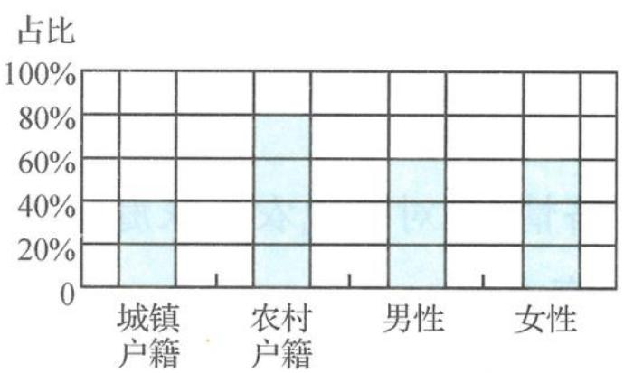

<!-- question-source:start -->
题 2-3 为了解户籍性别对生育二胎选择倾向的影响,某地从育龄人群中随机抽取了容量为 100 的调查样本,其中城镇户籍与农村户籍各 50 人;男性 60 人,女性 40 人,绘制不同群体中倾向选择生育二胎与选择不生育二胎的人数比例图(如图),其中阴影部分表示倾向选择生育二胎的对应比例,则下列叙述中错误的是( ).

不同群体生育二胎情况比例图

A. 是否倾向选择生育二胎与户籍有关
B. 是否倾向选择生育二胎与性别无关
C. 倾向选择生育二胎的人员中, 男性人数与女性人数相同
D. 倾向选择不生育二胎的人员中, 农村户籍人数少于城镇户籍人数
<!-- question-source:end -->

![[Q00037827A1]]
