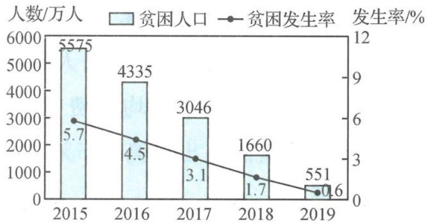

<!-- question-source:start -->
题 2-4 （多选题）2015 年以来,我国脱贫攻坚成效明显. 下图是 2015～2019 年年末全国农村贫困人口和贫困发生率(贫困人口占目标调查人口的比重)变化情况(数据来源:国家统计局 2019 年统计年报),根据这个发展趋势,2020 年底全面脱贫的任务必将完成. 根据图表中可得出的正确统计结论有( ).

2015～2019年年末全国农村贫困人口和贫困发生率统计图

A.五年来贫困发生率下降了5.1个百分点B.五年来农村贫困人口减少超过九成C.五年来农村贫困人口减少得越来越快D.五年来目标调查人口逐年减少
<!-- question-source:end -->

![[Q00037828A1]]
