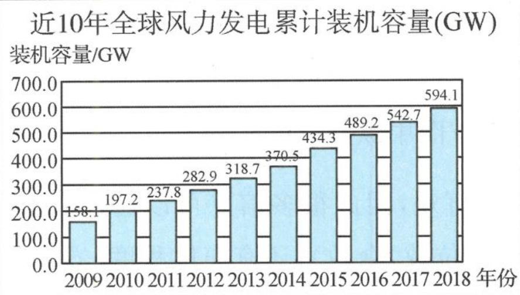
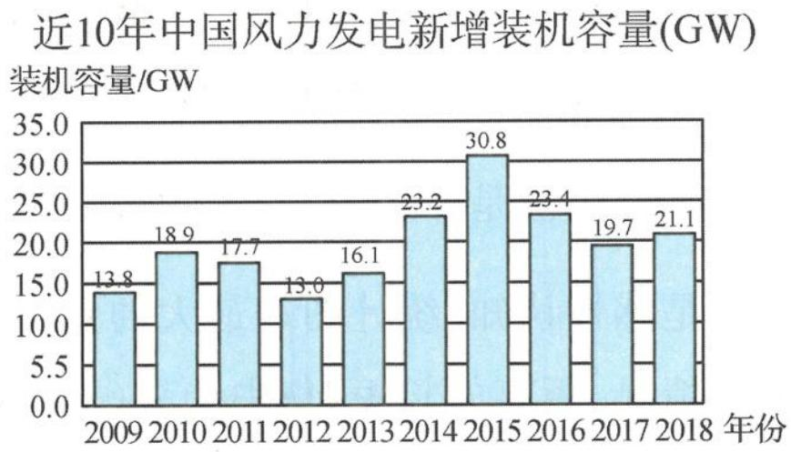

<!-- question-source:start -->
题 2-5 地球上的风能取之不尽,用之不竭. 风能是清洁能源,也是可再生能源. 世界各国致力于发展风力发电,近 10 年来,全球风力发电累计装机容量连年攀升,中国更是发展迅猛,在 2014 年累计装机容量就突破了 100GW,达到 114.6GW,中国的风力发电技术也日臻成熟,在全球范围的能源升级换代行动中体现出大国的担当与决心. 以下是近 10 年全球风力发电累计装机容量与中国新增装机容量图.

近10年全球风力发电累计装机容量(GW) 装机容量/GW

根据以上信息,正确的统计结论是( ).
A. 截至 2015 年中国累计装机容量达到峰值
B. 10 年来全球新增装机容量连年攀升
C. 10 年来中国新增装机容量平均超过 20GW
D. 截至 2015 年中国累计装机容量在全球累计装机容量中占比超过 $\frac{1}{3}$
<!-- question-source:end -->

![[Q00037829A1]]
