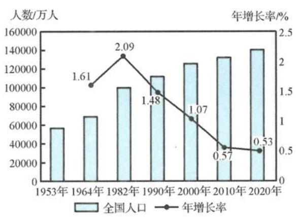
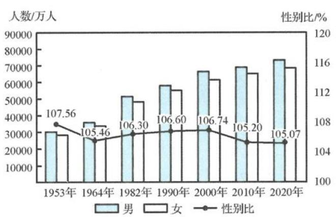
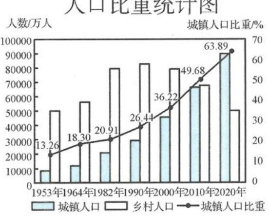

<!-- question-source:start -->
题 2-6 （多选题）2021 年 5 月 11 日, 国家统计局公布了第七次人口普查统计数据, 全国总人口数为 141178 万. 全部七次人口普查的人口增长率、性别比及城镇化进程变化情况如下图.

根据以上信息,下列统计结论正确的是( ).
A. 七次人口普查的人口增长率逐次减少
B. 七次人口普查的性别比趋于稳定,重男轻女的传统观念有所转变
C. 七次人口普查的城镇人口比重逐次提高
D. 第七次人口普查城镇人口数与乡村人口数相差超过4亿
<!-- question-source:end -->

![[Q00037830A1]]
