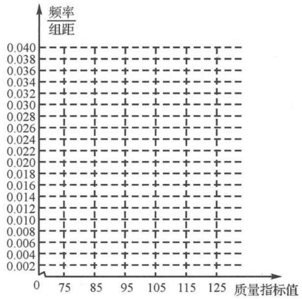

<!-- question-source:start -->
例题 3 从某企业生产的某种产品中抽取 100 件, 测量这些产品的一项质量指标值, 由测量表得如下频数分布表.

<table><tr><td>质量指标值分组</td><td>[75,85)</td><td>[85,95)</td><td>[95,105)</td><td>[105,115)</td><td>[115,125)</td></tr><tr><td>频数</td><td>6</td><td>26</td><td>38</td><td>22</td><td>8</td></tr></table>

(Ⅰ)在下图中作出这些数据的频率分布直方图.

(Ⅱ)估计这种产品质量指标值的平均数及方差。(同一组中的数据用该组区间的中点值代表)

(Ⅲ)根据以上抽样调查数据,能否认为该企业生产的这种产品符合“质量指标值不低于95的产品至少要占全部产品的80%”的规定?

【分析】本题强调频数表与频率分布直方图的转化,以及由统计直方图估计数据的方法.
<!-- question-source:end -->

![[高中/总复习/专题/高考数学秘密/浙大优辅《高中数学新体系 概率统计的秘密》/第三章_统计/3_4_统计推断/3_4_1_样本估计总体/questions/answers/Q00037833A1.md]]
