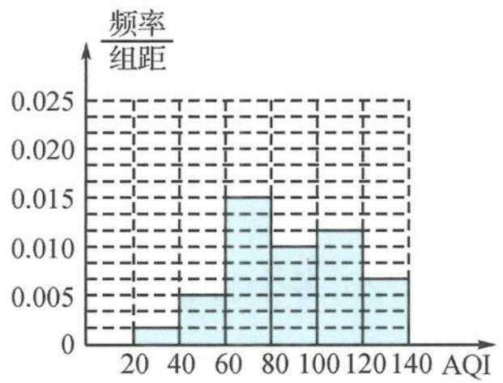
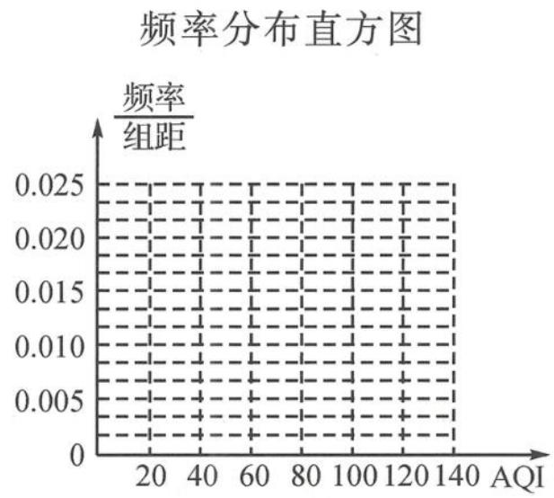

<!-- question-source:start -->
例题 4 地区“腾笼换鸟”的政策促进了区内环境改善和产业转型,空气质量也有所改观,现从当地天气网站上收集该地区 2013 年和 2014 年 11 月份(30 天)的空气质量指数(AQI)(单位: $\mu g/m^{3}$ )资料如下.

2013 年 11 月份 AQI 数据频率分布直方图

2014年11月份AQI数据

<table><tr><td>日期</td><td>1</td><td>2</td><td>3</td><td>4</td><td>5</td><td>6</td><td>7</td><td>8</td><td>9</td><td>10</td></tr><tr><td>AQI</td><td>89</td><td>55</td><td>52</td><td>87</td><td>124</td><td>72</td><td>65</td><td>26</td><td>46</td><td>48</td></tr><tr><td>日期</td><td>11</td><td>12</td><td>13</td><td>14</td><td>15</td><td>16</td><td>17</td><td>18</td><td>19</td><td>20</td></tr><tr><td>AQI</td><td>58</td><td>36</td><td>63</td><td>78</td><td>89</td><td>97</td><td>74</td><td>78</td><td>90</td><td>117</td></tr><tr><td>日期</td><td>21</td><td>22</td><td>23</td><td>24</td><td>25</td><td>26</td><td>27</td><td>28</td><td>29</td><td>30</td></tr><tr><td>AQI</td><td>137</td><td>139</td><td>72</td><td>63</td><td>63</td><td>77</td><td>64</td><td>65</td><td>55</td><td>45</td></tr></table>

(Ⅰ)请填好 2014 年 11 月份 AQI 数据的频率分布表并完成频率分布直方图；

2014年11月份AQI数据频率分布表

<table><tr><td>分组</td><td>频数</td><td>频率</td></tr><tr><td>[20,40)</td><td></td><td></td></tr><tr><td>[40,60)</td><td></td><td></td></tr><tr><td>[60,80)</td><td></td><td></td></tr><tr><td>[80,100)</td><td></td><td></td></tr><tr><td>[100,120)</td><td></td><td></td></tr><tr><td>[120,140]</td><td></td><td></td></tr></table>

(Ⅱ)该地区环保部门2014年12月1日发布的11月份环境评估报告中声称该地区“比去年同期空气质量的优良率提高了20多个百分点”（当AQI<100时,空气质量为优良）.试问题中收集到的资料信息是否支持该观点?
<!-- question-source:end -->

![[高中/总复习/专题/高考数学秘密/浙大优辅《高中数学新体系 概率统计的秘密》/第三章_统计/3_4_统计推断/3_4_1_样本估计总体/questions/answers/Q00037834A1.md]]
