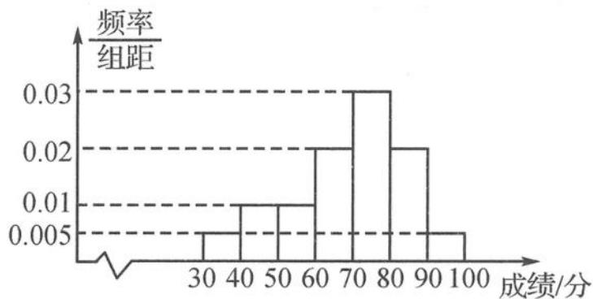

<!-- question-source:start -->
题 6 为推进中小学体育评价体系改革,某调研员从一中学 4000 名学生中按照男女学生比例采用分层抽样的方法,从中随机抽取了 400 名学生进行某项体育测试(满分 100 分),记录他们的成绩,将记录的数据分成 7 组:(30,40], (40,50], (50,60], (60,70], (70,80], (80,90], (90,100],并整理得到如图所示的频率分布直方图.

(I)根据该频率分布直方图,估计样本数据的中位数及4000名学生的平均成绩。(同一组中的数据用该组区间的中点值代表,精确到0.01)

(Ⅱ)已知样本中有三分之二的男生分数高于60分,且分数高于60分的男女人数相等,试估计该校男生和女生人数的比例.

(Ⅲ)若测试成绩 $x < \bar{x} - 2s$ (其中 $\bar{x}$ 是成绩的平均值, s 是标准差), 则认为该生测试成绩不达标, 试估计该中学测试成绩不达标人数.

参考数据: $\sqrt{2}\approx1.4,\sqrt{117}\approx10.8.$
<!-- question-source:end -->

![[Q00037840A1]]
