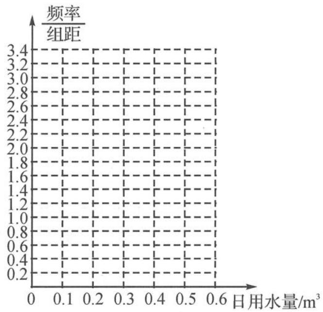

<!-- question-source:start -->
题 8 某家庭记录了未使用节水龙头 50 天的日用水量数据(单位: $\mathrm{m}^{3}$ )和使用了节水龙头 50 天的日用水量数据,得到频数分布表如下.

未使用节水龙头 50 天的日用水量频数分布表

<table><tr><td>日用水量</td><td>[0,0.1)</td><td>[0.1,0.2)</td><td>[0.2,0.3)</td><td>[0.3,0.4)</td><td>[0.4,0.5)</td><td>[0.5,0.6)</td><td>[0.6,0.7)</td></tr><tr><td>频数</td><td>1</td><td>3</td><td>2</td><td>4</td><td>9</td><td>26</td><td>5</td></tr></table>

使用了节水龙头 50 天的日用水量频数分布表

<table><tr><td>日用水量</td><td>[0,0.1)</td><td>[0.1,0.2)</td><td>[0.2,0.3)</td><td>[0.3,0.4)</td><td>[0.4,0.5)</td><td>[0.5,0.6)</td></tr><tr><td>频数</td><td>1</td><td>5</td><td>13</td><td>10</td><td>16</td><td>5</td></tr></table>

(Ⅰ)在下图中作出使用了节水龙头50天的日用水量数据的频率分布直方图.

(Ⅱ)估计该家庭使用节水龙头后,日用水量小于 $0.35 \, m^{3}$ 的概率.

(Ⅲ)估计该家庭使用节水龙头后,一年能节省多少水?(一年按365天计算,同一组中的数据用这组数据所在区间中点的值代表.)

<!-- question-source:end -->

![[Q00037842A1]]
